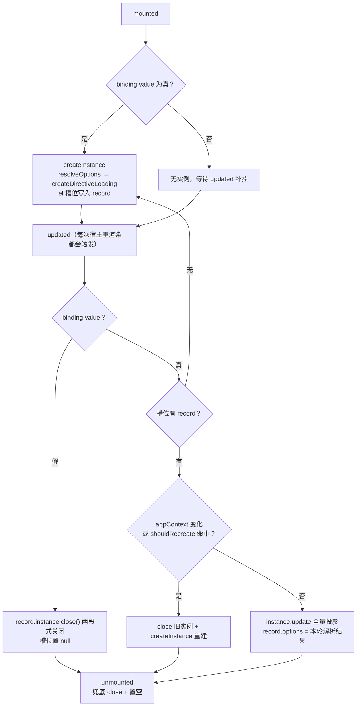
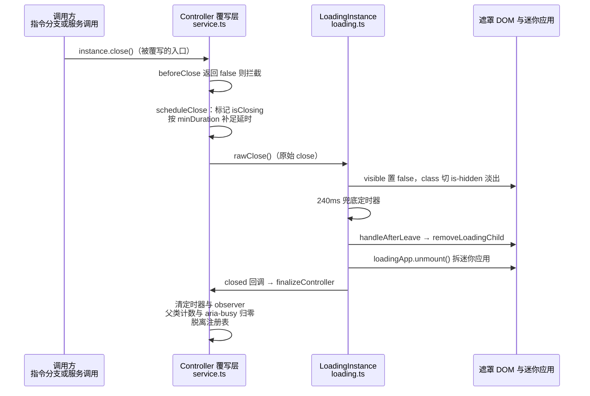
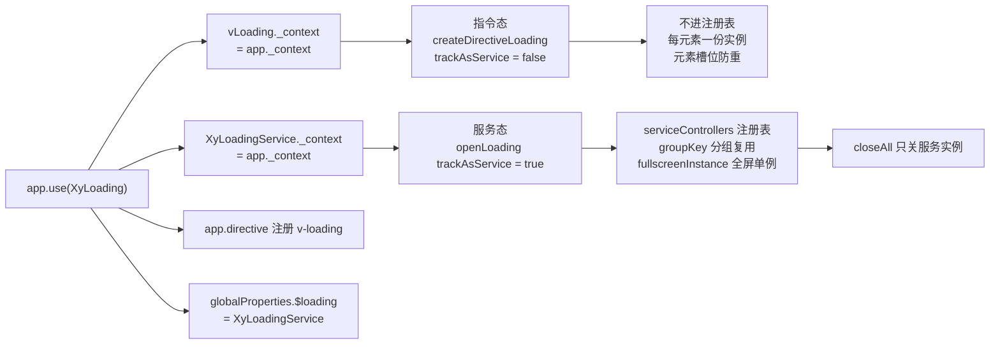

# 7-08 · Loading：指令与服务双注册

> 本篇源码坐标（均为当前工作区实态）：
> - `packages/components/loading/src/directive.ts`（156 行）——本篇主舞台，元素级生命周期全部实现
> - `packages/components/loading/src/service.ts`（714 行）——4-12 已展开服务态调度，本篇只取与指令共用及分界的段落
> - `packages/components/loading/src/loading.ts`（174 行）、`src/types.ts`（60 行）、`src/shared.ts`（142 行）
> - 入口与清单：`packages/components/loading/index.ts`（44 行）、`packages/components/component-manifest.json:421-431`
> - 样式与测试：`packages/theme/src/components/loading.css`（135 行）、`packages/components/loading/__tests__/loading.spec.ts`（658 行）
> - 类型夹具：`tests/types/fixtures/loading.ts`（167 行）；文档示例：`apps/docs/examples/loading/`（basic / fullscreen / target-body / delay-min-duration / customization / config-provider / service / service-group-key / service-with 共 9 例）

loading 是本系列第三次登场的组件，但每一次的镜头都不一样：4-02 讲安装器体系时，它是"为什么不能套 `withInstallFunction`"的双形态样本；4-12 讲命令式服务时，它是与 dialog"排队哲学"相对的"复用与克制"——全屏单例、groupKey 分组复用、`closeAll` 的注册表作用域。本篇把镜头推到最后一块没拆开的大陆：**指令形态的元素级生命周期**。核心问题在大纲里只有一句话——v-loading 的元素级生命周期——拆开说，它由四个更锋利的问题组成：

1. 一个 Vue 指令挂在元素上，Vue 只给它 `mounted / updated / unmounted` 三个钩子。`binding.value` 从真变假、从假变真、从对象变对象，每一次变更分别该走"创建、热更、销毁、重建"四条路里的哪一条？判定边界画在哪？
2. 实例存在哪里？指令没有自己的组件实例，遮罩又是一个独立 `createApp` 挂出来的 DOM，两者靠什么纽带关联，元素卸载时怎么保证不漏？
3. 遮罩 DOM 的"属主"是谁？它为什么不是 Teleport，也不在 4-05/4-06 讲过的浮层栈里？
4. 同一个 `openLoading` 引擎派生出指令与服务两个世界，"一个元素一份实例"与"全应用一份全屏单例"两种纪律是怎么用一个布尔分开的？

先说结论：这套实现和 Element Plus 的 v-loading 是同一个流派（Symbol 槽位 + 三钩子），但在三个地方走了自己的路——`shouldRecreate` 划出的重建边界、`xy-loading-*` 属性协议参与的三源合并、以及把指令实例完全排除在服务注册表之外的作用域隔离。此外本篇还收录两个动笔时实测出来的边界行为（全局默认项不进指令态、对象绑定 `visible` 翻转的复显缺陷），都附了复现条件与实码链路，供读者自行验证。

## 一、公开面与双通道：全库唯一的 directive + globalProperty 双 kind

从清单开始。`packages/components/component-manifest.json:421-431` 的 loading 条目是全库 72 个组件里唯一的 `directive + globalProperty` 双 kind 检查：

```json
// packages/components/component-manifest.json:421-431
{
  "name": "loading",
  "docsGroup": "feedback",
  "docsText": "Loading 加载",
  "installExports": ["XyLoading"],
  "installChecks": [
    { "kind": "directive", "name": "loading" },
    { "kind": "globalProperty", "name": "$loading" }
  ],
  "styleImports": ["loading"]
}
```

这份双 kind 不是装饰。4-01 讲过 manifest 的 `installChecks` 是聚合安装断言的数据源——CI 会真实执行 `app.use` 后断言 `app.directive("loading")` 与 `app.config.globalProperties.$loading` 都存在。也就是说"指令与服务双注册"在这套仓库里不是文档承诺，而是一条被机器守护的契约。两条通道在一次手写 `install` 里同时接通（`packages/components/loading/index.ts` 全文 44 行）：

```typescript
// packages/components/loading/index.ts:1-44
import type { App, AppContext, Directive } from "vue";
import vLoading from "./src/directive";
import type { ElementLoading, LoadingBinding } from "./src/directive";
import type { LoadingInstance } from "./src/loading";
import { XyLoadingService } from "./src/service";
import type { LoadingService } from "./src/service";
import type {
  LoadingGlobalConfig,
  LoadingOptions,
  LoadingOptionsResolved,
  LoadingParentElement,
  LoadingText,
  LoadingUpdatableOptions
} from "./src/types";

export type {
  ElementLoading,
  LoadingBinding,
  LoadingGlobalConfig,
  LoadingInstance,
  LoadingOptions,
  LoadingOptionsResolved,
  LoadingParentElement,
  LoadingService,
  LoadingText,
  LoadingUpdatableOptions
};

export const XyLoading = {
  install(app: App) {
    XyLoadingService._context = app._context;
    (
      vLoading as Directive<ElementLoading, LoadingBinding> & { _context: AppContext | null }
    )._context = app._context;
    app.directive("loading", vLoading as Directive<ElementLoading, LoadingBinding>);
    app.config.globalProperties.$loading = XyLoadingService;
  },
  directive: vLoading,
  service: XyLoadingService
};

export { vLoading, vLoading as XyLoadingDirective, XyLoadingService };

export default XyLoading;
```

4-02 已经分析过这里为什么要手写 8 行 `install` 而不套安装器工厂：三条线（`app.directive`、`globalProperties.$loading`、双 `_context` 捕获）缺一不可。本篇只补一个此前没展开的细节——`XyLoading.directive` 与 `XyLoadingService` 作为插件对象的两个属性也对外导出（38-39 行），意味着消费者可以不 `use`、直接拿裸指令或裸服务去挂在自己的局部 `directives` 里用。这时 `_context` 是 `null`（两个模块各自在文件末尾初始化为 `null`：`directive.ts:154`、`service.ts:714`），指令端靠 `getAppContext` 的"实例优先、全局兜底"双源取法仍能拿到上下文（下一节），服务端则拿不到 ConfigProvider 的 namespace/zIndex 配置——这是"不用 install 就用裸导出"的隐含代价，测试 `loading.spec.ts:615-657` 验证的正是走 `app.use` 这条正路时配置链的完整接通。

## 二、Symbol 槽位：把实例挂在元素身上

指令态的第一个问题就是存哪儿。指令没有组件实例，`this` 无从谈起；闭包里存 `Map<HTMLElement, Instance>` 是一种做法，本库和 EP 一样选了更直接的：**把记录挂在宿主元素自己的属性上，键是一个模块内 Symbol**（`packages/components/loading/src/directive.ts:6-47`）：

```typescript
// packages/components/loading/src/directive.ts:6-47
const INSTANCE_KEY = Symbol("XyLoading");

function hyphenate(value: string) {
  return value
    .replace(/([a-z0-9])([A-Z])/g, "$1-$2")
    .replace(/([A-Z])([A-Z][a-z])/g, "$1-$2")
    .toLowerCase();
}

function getAttributeName(name: string) {
  return `xy-loading-${hyphenate(name)}`;
}

export type LoadingBinding = boolean | LoadingOptions;

export interface ElementLoading extends HTMLElement {
  [INSTANCE_KEY]?: {
    appContext: AppContext | null;
    instance: LoadingInstance;
    options: LoadingOptions;
  } | null;
}

function getAppContext(binding: DirectiveBinding<LoadingBinding>) {
  return (
    (binding.instance as { $?: { appContext?: AppContext } } | null)?.$?.appContext ??
    vLoading._context
  );
}

function getBindingValue<K extends keyof LoadingOptions>(
  binding: DirectiveBinding<LoadingBinding>,
  key: K
): LoadingOptions[K] {
  return typeof binding.value === "object" && binding.value !== null
    ? binding.value[key]
    : undefined;
}

function getAttributeValue(el: HTMLElement, name: string) {
  return el.getAttribute(getAttributeName(name)) ?? undefined;
}
```

**这里是本篇第一个设计权衡：Symbol 槽位 vs WeakMap。** 两种方案都能做到"实例随元素生、随元素死"，真正的差异在四点：

- **可观测性。** 槽位方案在 DevTools 里对元素执行 `$0[Object.getOwnPropertySymbols($0)]` 就能看到实例与 options 快照，调试"遮罩为什么没消失"时这是第一现场；WeakMap 是纯黑盒，只能靠断点。
- **类型表达。** `ElementLoading extends HTMLElement` 用声明合并把槽位写进了类型系统（21-27 行），`el[INSTANCE_KEY]?.instance` 全程有类型；WeakMap 的键类型要另立一张 `WeakMap<HTMLElement, Record>`，与 `ObjectDirective` 的元素泛型对不上，最终往往退化成 `any`。
- **生命周期纪律。** 槽位是"显式置空"的——`updated` 关闭分支与 `unmounted` 都写 `el[INSTANCE_KEY] = null`（后面 125-151 行），把隐藏类形状留在元素上（不再 `delete`），同时让 `unmounted` 可以对 `null` 幂等地安全执行；WeakMap 靠 GC 兜底，但"何时该主动断开引用"这件事失去了显式的代码位置。
- **副本隔离。** 模块内 `Symbol("XyLoading")` 与 4-02 讲过的幂等锁 `Symbol.for("xiaoye-components:installed")` 形成一组刻意的对照：锁要跨包副本互斥，所以注册表全局共享（`Symbol.for`）；槽位只属于当前这份指令对象的生命周期，模块级 `Symbol` 天然隔离——两份副本各挂各的槽，互不覆盖。

槽位里存的三件套（`appContext`、`instance`、`options`）也各有用途：`appContext` 用来在 `updated` 里检测"宿主换了应用上下文"（跨 app 复用 DOM 的极端场景）；`instance` 是遮罩实例句柄；`options` 存的是**上一轮解析结果**，`updated` 里要拿它与新一轮 options 做"该热更还是该重建"的对比——这是第三节的主角。

`getAppContext`（29-34 行）是 4-02 埋下的 `_context` 伏笔在指令端的消费现场：先从 `binding.instance.$?.appContext`（宿主组件实例所属的应用）取，取不到再兜底 `vLoading._context`。两源都有各自的必要：指令总挂在元素上，理论上实例优先就够，但 `createApp` 手工创建、Teleport 到局外、异步组件首次渲染等场景下 `binding.instance` 可能短暂为 `null`；而 `null` 兜底值又保证了"不 `use` 直接用裸指令"时不会抛错，只是拿不到全局配置。

再看取值层的两个小函数。`getBindingValue`（36-43 行）实现了 `LoadingBinding = boolean | LoadingOptions` 双形态的统一读取：布尔值统一折叠为 `undefined`，对象才逐键取。`getAttributeValue`（45-47 行）配合 `hyphenate + getAttributeName`（8-17 行）构成属性协议：`svgViewBox` 这类驼峰键被转成 `xy-loading-svg-view-box`。这个协议在 HTML 模板里写纯属性就能声明视觉项（文档示例 `customization.vue` 全程用属性），与 EP 的 `element-loading-text` 系列属性是同一种设计，只是命名空间换成了 `xy-`。

## 三、三源合并与重建边界：resolveOptions / shouldRecreate

有了取值层，`resolveOptions`（`directive.ts:49-73`）把三个来源按优先级合并成一份 `LoadingOptions`：**binding 对象值 → `xy-loading-*` 属性 → 修饰符**：

```typescript
// packages/components/loading/src/directive.ts:49-98
function resolveOptions(
  el: HTMLElement,
  binding: DirectiveBinding<LoadingBinding>
): LoadingOptions {
  const fullscreen = getBindingValue(binding, "fullscreen") ?? binding.modifiers.fullscreen;

  return {
    text: getBindingValue(binding, "text") ?? getAttributeValue(el, "text"),
    spinner: getBindingValue(binding, "spinner") ?? getAttributeValue(el, "spinner"),
    svg: getBindingValue(binding, "svg") ?? getAttributeValue(el, "svg"),
    svgViewBox: getBindingValue(binding, "svgViewBox") ?? getAttributeValue(el, "svgViewBox"),
    background: getBindingValue(binding, "background") ?? getAttributeValue(el, "background"),
    customClass: getBindingValue(binding, "customClass") ?? getAttributeValue(el, "customClass"),
    target: getBindingValue(binding, "target") ?? (fullscreen ? undefined : el),
    body: getBindingValue(binding, "body") ?? binding.modifiers.body,
    fullscreen,
    lock: getBindingValue(binding, "lock") ?? binding.modifiers.lock,
    visible: getBindingValue(binding, "visible") ?? true,
    delay: getBindingValue(binding, "delay"),
    minDuration: getBindingValue(binding, "minDuration"),
    groupKey: getBindingValue(binding, "groupKey"),
    beforeClose: getBindingValue(binding, "beforeClose"),
    closed: getBindingValue(binding, "closed")
  };
}

function shouldRecreate(prev: LoadingOptions, next: LoadingOptions) {
  return (
    prev.target !== next.target ||
    prev.body !== next.body ||
    prev.fullscreen !== next.fullscreen ||
    prev.lock !== next.lock
  );
}

function toUpdatableOptions(options: LoadingOptions): LoadingUpdatableOptions {
  return {
    text: options.text,
    spinner: options.spinner,
    svg: options.svg,
    svgViewBox: options.svgViewBox,
    background: options.background,
    customClass: options.customClass,
    delay: options.delay,
    minDuration: options.minDuration,
    beforeClose: options.beforeClose,
    closed: options.closed,
    visible: options.visible ?? true
  };
}
```

这段里最值得驻留的是 62 行：`target: getBindingValue(binding, "target") ?? (fullscreen ? undefined : el)`。**指令态的默认 target 就是宿主元素本身**——这是指令态与服务态在语义上的根差别：服务态不传 target 回落到 `document.body`（`service.ts:121-122`），指令态永远"就近遮蔽"。`fullscreen` 为真时 target 让位给 `undefined`（随后由服务端解析为 body），因为全屏遮罩的几何由 `position: fixed` 接管，不再需要元素矩形。于是 `v-loading` 一个指令名实际上覆盖了 EP 里 `v-loading` 与 `v-loading.fullscreen` 的全部谱系：不加修饰符是容器遮罩，加了是全屏。

**第二个设计权衡在这里：重建 vs 热更的字段二分。** `shouldRecreate`（75-82 行）只认四个字段：`target / body / fullscreen / lock`。为什么恰好是这四个？因为它们决定的不是遮罩"长什么样"，而是遮罩"挂在哪、父节点被改了什么"——`target` 与 `body` 决定 `parent`（`service.ts:184-187`：target 为 body 或 `body: true` 时挂 body，否则挂 target 自己），`fullscreen` 决定 `is-fullscreen` 类与 fixed 定位，`lock` 决定要不要给父节点加 `xy-loading-parent--hidden`。这四样一旦变更，热更新会留下脏状态：旧父节点上的 relative/hidden class 与 `data-xy-loading-*` 计数已经加上了，遮罩却该去新父节点——所以唯一的正确动作是 close 掉旧实例、`createInstance` 全新来过。其余字段（文案、背景、SVG、spinner、customClass、delay、minDuration、两个回调、visible）都是"视觉与时序"，走 `toUpdatableOptions` 投影给 `instance.update()` 热更即可。

这张二分表值得单独列出：

| 字段 | 变更后的动作 | 原因 |
| --- | --- | --- |
| `target` / `body` | close + 重建 | 决定遮罩挂到哪个父节点 |
| `fullscreen` | close + 重建 | 决定 fixed 定位与 `is-fullscreen` 类 |
| `lock` | close + 重建 | 决定父节点的 hidden 类与滚动锁 |
| `text` / `spinner` / `svg` / `svgViewBox` / `background` / `customClass` | `instance.update()` 热更 | 纯视觉字段，响应式驱动重渲染 |
| `delay` / `minDuration` / `beforeClose` / `closed` | `instance.update()` 热更 | 时序与回调，controller 层可换 |
| `visible` | 特殊路径 | 对象绑定里的显式 `visible: false` 会触发关闭（第六、八节） |

注意 `shouldRecreate` 的两个入参不是"旧 binding 与新 binding"，而是**上一轮 resolveOptions 的存档与新解析结果**——`record.options` 在每次热更后被刷新（145-146 行，下一节），所以对比永远是"相邻两轮"的，隔轮变更不会漏判。

## 四、三钩子逐行：updated 的 diff 策略

现在到本篇的正戏。`directive.ts:112-156` 是指令对象的全貌——三个钩子、一个类型断言、一个 `_context` 初始化：

```typescript
// packages/components/loading/src/directive.ts:112-156
type LoadingDirective = ObjectDirective<ElementLoading, LoadingBinding> & {
  _context: AppContext | null;
};

const vLoading = {
  mounted(el: ElementLoading, binding: DirectiveBinding<LoadingBinding>) {
    if (binding.value) {
      createInstance(el, binding);
    }
  },
  updated(el: ElementLoading, binding: DirectiveBinding<LoadingBinding>) {
    const record = el[INSTANCE_KEY];

    if (!binding.value) {
      record?.instance.close();
      el[INSTANCE_KEY] = null;
      return;
    }

    if (!record) {
      createInstance(el, binding);
      return;
    }

    const nextOptions = resolveOptions(el, binding);
    const appContext = getAppContext(binding);

    if (record.appContext !== appContext || shouldRecreate(record.options, nextOptions)) {
      record.instance.close();
      createInstance(el, binding);
      return;
    }

    record.instance.update(toUpdatableOptions(nextOptions));
    record.options = nextOptions;
  },
  unmounted(el: ElementLoading) {
    el[INSTANCE_KEY]?.instance.close();
    el[INSTANCE_KEY] = null;
  }
} as unknown as LoadingDirective;

vLoading._context = null;

export default vLoading;
```

四个入口，每个都有明确的单一职责：

**`mounted`（117-121 行）只做条件创建。** `binding.value` 为真才 `createInstance`——`v-loading="false"` 挂载时不产生任何实例与 DOM。这意味着初始为假的遮罩，第一次显示发生在 `updated` 里（见下），而 `v-if` 切换元素重建时走的是全新 `mounted`，槽位天然干净。

**`updated`（122-147 行）是整个生命周期的调度中枢**，四个分支按序裁决：

1. **值变假 → 关闭并清槽**（125-129 行）。`record?.instance.close()` 走两段式关闭（第六节），槽位立刻置 `null`。置空的意义不止是释放：下一轮值变真时 `!record` 分支会走**全新创建**，而不是在旧实例上"复活"。
2. **值变真且无记录 → 创建**（131-134 行）。覆盖"初始为假、后来变真"与"上一轮刚被清槽"两种情况。
3. **appContext 变了或命中 `shouldRecreate` → close + 重建**（139-143 行）。
4. **否则热更**（145-146 行）：全量投影 + 刷新 `record.options` 存档。

**`unmounted`（148-151 行）是兜底清槽**。对 `null` 幂等（`?.`），对"值还为真但元素没了"的场景（比如父组件直接卸载）也能正确关闭遮罩。

先看这张生命周期全景图，再看 diff 策略：



**第三个设计权衡：全量投影 vs oldValue 差异比较。** 细心的读者会注意到 `updated` 从头到尾没有读 `binding.oldValue`——Vue 其实把它送到了手上，EP 也确实在 `updated` 里先做 `binding.value !== binding.oldValue` 的比较、值未变就跳过合并（EP v2 实码行为，与 4-12 的核对口径一致）。本库反其道而行：**每次宿主组件重渲染都重新 `resolveOptions` 并全量投影**。这不是疏忽，而是一组连锁取舍的结果：

- `resolveOptions` 是三源合并（对象值、DOM 属性、修饰符），"值没变"并不保证"合并结果没变"——用户可以绕过响应式直接改 DOM 属性，oldValue 对比会漏掉这类变更；
- 全量投影的幂等性由下游保证：`updateController` 逐字段 `hasOwn` 判断后写入 reactive `data`（`service.ts:443-514`），值相同的写入对 Vue 是无渲染开销的 no-op；
- 代价是关闭判定从值比较换成了形状比较：布尔 `false` 才关，对象恒为真值、要看 `visible` 字段（表里那行"特殊路径"）。

这也顺带回答了"v-loading 与 `loading="true"` 的双向绑定语义"这个常见疑问：v-loading **不是** v-model 那种双向——指令从不回写状态，数据流是"状态 → binding → 遮罩"的跟随式单向投影；所谓"双向"其实是**双形态**：布尔与对象两种 value 都能驱动同一套生命周期，`updated` 的四个分支就是这两种形态共用的 diff 协议。测试 `loading.spec.ts:35-94` 第一条用例把这套协议完整走了一遍（`v-loading="loading ? options : false"`——对象与假值交替），第八节我们再展开。

**EP 对照收拢。** 与 EP 的 v-loading（EP `packages/components/loading/src/directive.ts`，dev 分支实码）放在一起看，骨架是同一种流派：`INSTANCE_KEY = Symbol('ElLoading')` 的元素槽位、同样的三钩子分工、`unmounted` 里同样"close + 置 null"。差异集中在工程纵深上，按本篇的叙事顺序列全：

| 维度 | EP v-loading | 本库 v-loading |
| --- | --- | --- |
| updated 的 diff | `binding.value !== binding.oldValue` 值比较后才合并 | 无 oldValue，全量投影 + 幂等热更 |
| target 热更 | 无重建判定，挂载后换 target 不重挂 | `shouldRecreate` 四字段命中即 close + 重建 |
| 属性协议 | `element-loading-*` | `xy-loading-*`（同一思路，独立命名空间） |
| 父节点复位 | 直接改 `el-loading-parent--relative/hidden` 类 | 同名类 + `data-xy-loading-*` 四计数器引用计数 |
| 可达性 | target 无 `aria-busy` 标记 | target 上 `aria-busy` + 计数器管理 |
| 时序选项 | 指令态无 `minDuration` | `delay / minDuration` 进入指令可更新协议 |
| 上下文获取 | 取 binding 实例的 appContext，无全局兜底 | 双源 `_context`（实例优先、install 兜底） |

## 五、遮罩 DOM 的创建与归属：独立小应用与 firstElementChild

三钩子说"创建"，但创建出来的到底是什么？答案在 `loading.ts:119-174`——遮罩是一个**独立 `createApp` 挂出来的迷你应用**：

```typescript
// packages/components/loading/src/loading.ts:119-174
  const LoadingComponent = defineComponent({
    name: "XyLoadingRuntime",
    setup() {
      const ns = useNamespace("loading");
      data.zIndex = initialZIndex;

      return () => {
        return h(
          "div",
          {
            class: [
              `${ns.base.value}-mask`,
              ns.is("fullscreen", data.fullscreen),
              data.customClass,
              data.visible ? "is-visible" : "is-hidden"
            ],
            style: {
              backgroundColor: data.background || "",
              zIndex: data.zIndex
            }
          },
          [
            h(XyLoadingIndicator, {
              text: data.text,
              spinner: data.spinner,
              svg: data.svg,
              svgViewBox: data.svgViewBox,
              layout: "stacked",
              size: data.fullscreen ? "lg" : "md",
              surface: true
            })
          ]
        );
      };
    }
  });

  const host = document.createElement("div");
  const loadingApp = createApp(LoadingComponent);
  Object.assign(loadingApp._context, appContext ?? {});
  const vm = loadingApp.mount(host);
  const element = host.firstElementChild as HTMLElement;

  return {
    ...toRefs(data),
    setText,
    update,
    removeLoadingChild,
    close,
    handleAfterLeave,
    vm,
    get $el() {
      return element;
    }
  };
```

这段有四个精确的动作值得逐个点名：

- **`host` 是一个永不入文档的临时容器**（156 行）。`createApp.mount(host)` 把渲染产物放进 `host`，然后 160 行只取走 `host.firstElementChild`——遮罩元素本身。`host` 与 `vm` 从此退场，`$el` 用 getter 返回那个被摘出来的元素（170-172 行）。为什么不直接 `createVNode + render`？因为 `createApp` 才有 `_context` 可合并——158 行 `Object.assign(loadingApp._context, appContext ?? {})` 把宿主应用的上下文（含 ConfigProvider 的 provides）整个并入迷你应用，`useNamespace` 的 namespace 消费、`XyLoadingIndicator` 内部的全局配置读取才有源头。这是 4-12 说过"组件在树外，配置却没断"的另一半实现：服务端合并 `_context` 传配置给 `openLoading`，运行时合并 `_context` 传 provides 给渲染层。
- **遮罩的 class 三件套在渲染函数里拼装**（130-134 行）：`xy-loading-mask` 基类、`is-fullscreen`（fullscreen 时改 fixed）、`is-visible / is-hidden` 切换显隐——`data.visible` 是 reactive 的，第六节的两段式关闭就靠它驱动 CSS 过渡。
- **z-index 是创建期注入的快照**（123 行 `data.zIndex = initialZIndex`），来自 `nextZIndex(baseZIndex)`：ConfigProvider 的 `zIndex`（默认 2000，`service.ts:25`）加一个模块级自增种子（`service.ts:156-159`）。每个实例拿到的 z 严格递增，后开的遮罩压住先开的。
- **挂载时机与渲染时机分离。** 迷你应用在 `createLoadingComponent` 里就 mount 了，但遮罩元素此时不在文档里——真正"挂上去"发生在 controller 的 `mountController`（`service.ts:369-380`）：

```typescript
// packages/components/loading/src/service.ts:342-380
function finalizeController(controller: LoadingController) {
  if (controller.pendingShowTimer !== null) {
    globalThis.clearTimeout(controller.pendingShowTimer);
    controller.pendingShowTimer = null;
  }

  if (controller.pendingCloseTimer !== null) {
    globalThis.clearTimeout(controller.pendingCloseTimer);
    controller.pendingCloseTimer = null;
  }

  controller.followerCleanup?.();
  controller.followerCleanup = null;

  if (controller.isMounted) {
    removeParentClassList(controller);
    updateBusyState(controller.currentOptions.target, -1);
    controller.isMounted = false;
  }

  controller.isVisible = false;
  controller.isClosing = false;
  controller.shownAt = null;
  detachServiceController(controller);
  controller.currentOptions.closed?.();
}

function mountController(controller: LoadingController) {
  if (controller.isMounted || controller.isClosing) {
    return;
  }

  initializePosition(controller);
  addParentClassList(controller);
  controller.currentOptions.parent.appendChild(controller.instance.$el);
  updateBusyState(controller.currentOptions.target, 1);
  controller.followerCleanup = startBodyFollow(controller);
  controller.isMounted = true;
}
```

`mountController` 五步的顺序是精心排的：先 `initializePosition` 读父节点计算样式（决定要不要补 relative）、再加父类与计数、然后 `appendChild` 入文档、随后在 **target**（注意不是 parent）上置 `aria-busy="true"`、最后才起 body-follow 的 observer。`isMounted / isClosing` 双闸门保证重复 `showController` 不会叠加挂载。

**第四个设计权衡：遮罩 DOM 的属主。** 同样是"命令式往文档里塞一个层"，dialog/drawer 走 `Teleport` + `__overlay` 浮层栈（4-05/4-06），loading 却选择了"独立小应用 + 直接 `appendChild`"。实码定论：loading 源码里没有任何 `__overlay` 引用，遮罩**不进浮层栈**。这个差别来自遮罩的性质差异——dialog 是交互浮层，需要栈序管理（ESC 逐层关、焦点陷阱按栈顶定位、dismissible 逐层退出）；loading 遮罩是**非交互遮罩**：不响应键盘、没有焦点语义、没有"关闭我"的入口（它只能被数据或调用方关掉），它的层级诉求只有一个"盖住 target"，一个递增 zIndex 就够了。进栈反而有害：浮层栈假设成员有退出协议，而 loading 的退出由 `minDuration`、`beforeClose` 这些自己的时序逻辑掌管，两套时序打架没有赢家。

为什么也不用 Teleport？Teleport 要求渲染发生在某个组件的 render 上下文里，而 `XyLoadingService()` 可能在任意模块的任意时刻被调用——根本没有"当前组件"可 Teleport。独立小应用绕开了这个前提：它自带上下文（158 行合并），自带渲染管线，遮罩元素想挂哪就挂哪。代价也有：每个遮罩是一个完整应用实例，比 vnode 渲染重；但 loading 的数量级是个位数的并发，这笔账划算。

`parent` 与 `target` 是两个角色，值得再强调一遍：**遮罩挂在 parent，几何与 aria 看 target**。三种组合由 `resolveLoadingOptions`（`service.ts:174-211`）裁决——默认（指令不加修饰符）parent = target = 宿主元素；`body` 修饰符下 parent = body 而 target 仍是宿主元素，遮罩挂到 body 后用 `applyBodyRect`（213-223 行）按 target 的 `getBoundingClientRect` + 滚动偏移摆放，并由 `startBodyFollow`（243-277 行）用 `scroll / resize / ResizeObserver` 三路信号 + rAF 合帧持续跟随；`fullscreen` 修饰符下 parent = body、`is-fullscreen` 类接管 fixed 定位。三种模式下父节点 class 的加卸都走引用计数（`addParentClassList / removeParentClassList`，279-324 行）：

```typescript
// packages/components/loading/src/service.ts:83-114
function getCount(target: HTMLElement, name: string) {
  return toPositiveInteger(target.getAttribute(name));
}

function setCount(target: HTMLElement, name: string, value: number) {
  if (value > 0) {
    target.setAttribute(name, String(value));
    return;
  }

  target.removeAttribute(name);
}

function incrementCount(target: HTMLElement, name: string) {
  setCount(target, name, getCount(target, name) + 1);
}

function decrementCount(target: HTMLElement, name: string) {
  setCount(target, name, Math.max(0, getCount(target, name) - 1));
}

function updateBusyState(target: HTMLElement, delta: number) {
  const nextCount = Math.max(0, getCount(target, LOADING_BUSY_COUNT_ATTR) + delta);
  setCount(target, LOADING_BUSY_COUNT_ATTR, nextCount);

  if (nextCount > 0) {
    target.setAttribute("aria-busy", "true");
    return;
  }

  target.removeAttribute("aria-busy");
}
```

四个 data 属性（`data-xy-loading-count` 挂 parent、`data-xy-loading-relative-count`、`data-xy-loading-hidden-count`、`data-xy-loading-busy-count` 挂 target，21-24 行定义）就是四个引用计数器。为什么 class 不能直接加减？因为**同一个容器可以同时承载多个 loading**——`loading.spec.ts:490-520` 的用例钉住了这个场景：两个实例共享同一个 target，第一个关闭时 relative class 必须保留（第二个还在用），全部关闭后才允许摘除。计数器把"状态归谁所有"从时序问题变成了算术问题。`aria-busy` 同理：target 上可以有多个遮罩，计数归零才移除属性。

## 六、两段式关闭：视觉退场与资源回收分离

关闭链路在 `loading.ts:93-117`，与 dialog 服务的两段式关闭是同一个思想的第三次出现：

```typescript
// packages/components/loading/src/loading.ts:80-117
  function removeLoadingChild() {
    element.parentNode?.removeChild(element);
  }

  function runClosedCallback() {
    if (closed.value) {
      return;
    }

    closed.value = true;
    data.closed?.();
  }

  function handleAfterLeave() {
    if (!afterLeaveFlag.value) {
      return;
    }

    afterLeaveFlag.value = false;
    removeLoadingChild();
    loadingApp.unmount();
    runClosedCallback();
  }

  function close() {
    if (afterLeaveFlag.value) {
      return;
    }

    afterLeaveFlag.value = true;
    data.visible = false;

    if (afterLeaveTimer !== null) {
      globalThis.clearTimeout(afterLeaveTimer);
    }

    afterLeaveTimer = globalThis.setTimeout(handleAfterLeave, LOADING_CLOSE_DELAY);
  }
```

第一段是**视觉退场**：`close()` 把 `data.visible` 置 false，渲染函数立刻把 class 从 `is-visible` 切到 `is-hidden`，CSS 过渡（`loading.css:21` 的 `transition: opacity var(--xy-transition-duration-fast)`，配合 `is-hidden` 的 `opacity: 0; pointer-events: none`，28-31 行）完成淡出。第二段是**资源回收**：`LOADING_CLOSE_DELAY = 240ms`（`loading.ts:7`）的兜底定时器到点后执行 `handleAfterLeave`——`removeLoadingChild` 把遮罩从 parent 摘下、`loadingApp.unmount()` 拆掉迷你应用、`runClosedCallback` 触发 `closed` 回调。为什么要兜底定时器而不是等 `after-leave` 过渡钩子？因为遮罩可能正被 `display: none` 的祖先隐藏，过渡事件永远不来——**视觉退场与资源回收分离，后者永远有兜底**，这句话 4-12 评过 dialog，这里再次应验。`runClosedCallback` 里的 `closed` 守卫（85-89 行）保证回调只触发一次，`afterLeaveFlag` 在 `handleAfterLeave` 里复位（98 行）则让实例理论上支持"关了再开"——这个复位在第八节会成为一个边界缺陷的伏笔。

`closed` 回调在指令/服务实例上被 controller 层接走了——`openLoading` 创建实例时传入 `closed: () => finalizeController(controller)`（`service.ts:616`），于是真正的清理序落在 `finalizeController`（342-367 行，上一节已引全文）：按序清两个定时器 → 断开 body-follow observer → 摘父类与计数（含 `aria-busy` 归零）→ 复位状态机 → `detachServiceController` 脱离注册表 → 触发业务侧 `closed`。整个时序画出来是这样：



`scheduleClose`（`service.ts:414-441`）里还有一个容易漏看的动作：`isClosing` 一标记就立刻 `detachServiceController`——**"名分"在淡出动画开始前就让出去了**。`fullscreenInstance` 随之清空（337-339 行），此时再来一次 `XyLoadingService()` 会创建全新实例而不是拿到一个正在消失的旧遮罩；`closeAll` 也不会再碰这个正在退场的 controller。宁可短暂出现两张遮罩，也不让单例槽位被一个尸体占着——这是全屏单例纪律里很清醒的一笔。

## 七、作用域分界：trackAsService 一个布尔圈定的两个世界

指令与服务共用 `openLoading` 引擎，分界点只有三行（`service.ts:675-677`）：

```typescript
// packages/components/loading/src/service.ts:606-608
  if (trackAsService && !resolved.groupKey && resolved.fullscreen && fullscreenInstance) {
    return fullscreenInstance;
  }

// packages/components/loading/src/service.ts:640-677
  instance.setText = (text: LoadingText) => {
    controller.currentOptions.text = text;
    controller.rawSetText(text);
  };
  instance.update = (patch: LoadingUpdatableOptions) => {
    updateController(controller, patch);
  };
  instance.close = () => {
    if (controller.isClosing) {
      return;
    }

    if (controller.currentOptions.beforeClose?.() === false) {
      return;
    }

    scheduleClose(controller);
  };

  if (trackAsService) {
    serviceControllers.add(controller);

    if (resolved.groupKey) {
      serviceGroupControllers.set(resolved.groupKey, controller);
    }

    if (!resolved.groupKey && resolved.fullscreen) {
      fullscreenInstance = instance;
    }
  }

  scheduleShow(controller);
  return instance;
}

export function createDirectiveLoading(options: LoadingOptions = {}, context?: AppContext | null) {
  return openLoading(options, context, false);
}
```

指令端入口 `createDirectiveLoading` 把 `trackAsService` 钉死为 `false`，这个布尔在 `openLoading` 里守住了三道门：

1. **555-604 行的 groupKey 复用**——`trackAsService` 为假时直接跳过，指令实例永不参与分组（`groupKey` 在指令协议里传了也是无效字段）；
2. **606-608 行的全屏单例**——指令端不做单例判定：页面上同时有两个 `v-loading.fullscreen` 就有两张全屏遮罩，各自跟随各自的绑定；
3. **659-669 行的注册表登记**——`serviceControllers`、`serviceGroupControllers`、`fullscreenInstance` 三处都与指令无关。

于是 `XyLoadingService.closeAll()`（694-698 行）的语义被天然圈死：

```typescript
// packages/components/loading/src/service.ts:690-712
export const XyLoadingService = ((options: LoadingOptions = {}, context?: AppContext | null) => {
  return openLoading(options, context, true);
}) as LoadingService;

XyLoadingService.closeAll = () => {
  Array.from(serviceControllers).forEach((controller) => {
    controller.instance.close();
  });
};

XyLoadingService.with = async <T>(
  task: Promise<T> | (() => T | Promise<T>),
  options?: LoadingOptions,
  context?: AppContext | null
) => {
  const instance = XyLoadingService(options, context);

  try {
    return await (typeof task === "function" ? task() : task);
  } finally {
    instance.close();
  }
};
```

`closeAll` 遍历的 `serviceControllers` 里根本没有指令实例，所以"一键关闭所有服务 loading"不会误伤页面上十几个局部 `v-loading` 遮罩。**注册边界即作用域边界**——4-12 说过这句话，本篇补上它的指令侧证据。反过来，指令实例拿到的也是同一套覆写方法（640-657 行对 `trackAsService` 不设条件）：`beforeClose` 拦截、`minDuration` 防闪烁、`delay` 延迟显示，指令态全部享有——这就是第三节"时序字段进可更新协议"的运行时基础。

**第五个设计权衡：服务单例 vs 元素多实例。** 两种纪律看似矛盾，其实各配其位：

- 服务的消费者是"一个逻辑过程"——登录过期弹全屏 loading，后续的重复调用（重试、并发请求）语义上都是同一件事的延续，单例 + groupKey 复用把"并发调用同一过程"收敛成一张遮罩；如果每次调用都开新遮罩，z-index 递增叠加、淡入动画互相踩，视觉直接崩坏。
- 指令的消费者是"一个元素"——遮罩的生命周期与元素绑定，天然多实例：表格遮罩、卡片遮罩、面板遮罩同屏并存是常态，单例在这里反而是错的。元素槽位（每元素一份 record）就是指令态的"单例"——**单例纪律没有消失，只是从"全应用一份"降维成了"每元素一份"**，判定权从模块变量 `fullscreenInstance` 移交给了元素自身的槽位。这也顺带解决了"单元素多指令防重"：`updated` 的 `!record` 分支 + `mounted` 的值判真 + 关闭/卸载时的置空，三处合力保证任一时刻一个元素至多一个 record，Vue 编译层又保证了同一元素写不出两个 `v-loading`——双保险之下不存在实例堆积。

顺带一提，元素多实例并不与服务的全屏单例冲突：一个 `v-loading.fullscreen.lock` 元素遮罩与一个 `$loading()` 全屏遮罩可以并存（互不进对方的注册表），前者的 lock 只影响元素挂载链上的父节点，后者影响 body——两者的 `data-xy-loading-hidden-count` 都计数在各自 parent 上，互不串扰。两个世界的接线与分界画成一张图：



## 八、两个实测边界：动笔时跑出来的实码结论

这一节是本篇与其他篇目不太一样的地方：两个边界行为是写作时用临时用例在当前工作区实跑出来的，下面给出复现条件与实码链路，读者可以自行验证。

**边界一：ConfigProvider 的全局 loading 默认项不进指令态。** 测试实测结果：`app.provide(configProviderKey, { loading: { text: "全局默认文案" } })` + `app.use(XyLoading)` 之后，`v-loading="true"` 渲染出的遮罩里**没有**任何文案元素（`document.querySelector(".xy-loading-text")` 为 `undefined`）。链路在源码上很清楚：指令端 `resolveOptions`（`directive.ts:49-73`）无论 binding 是布尔还是对象，都会**恒写全键**——`text` 键即使没有来源也会以 `undefined` 值出现在结果对象里；而服务端的全局兜底函数 `resolveOptionValue`（`service.ts:161-172`）的判定是 `hasOwn(options, key)`——"键存在"即视为"显式声明"，哪怕值是 `undefined`，全局配置与 fallback 都被短路。于是 text、background、spinner、svg、svgViewBox、delay、minDuration、lock、fullscreen 九项全局默认对指令态全部失效；namespace 与 zIndex 不走这个合并（`service.ts:144-150` 独立读取），仍然生效。服务态没有这个问题——`XyLoadingService()` 的空 options 上没有这些键，全局默认照常兜底；组件态（dialog/table/select 内嵌的 `XyLoadingIndicator`）走 `shared.ts:33-46` 的 `resolveLoadingVisualConfig`，同样正常。文档示例 `apps/docs/examples/loading/config-provider.vue` 的标签文案写的是"同时会影响 Dialog / Table / Select 的默认 loading 视觉"——措辞本身没说错，但它把一张 `v-loading` 布尔绑定的卡片放进了 provider 演示里，读者很容易误以为那张卡片也会显示全局默认文案，实际不会。

**边界二：对象绑定 `visible` 翻转的复显缺陷。** 官方示例 `delay-min-duration.vue` 正是用对象绑定切换 `visible` 的：

```vue
<!-- apps/docs/examples/loading/delay-min-duration.vue:1-46 -->
<script setup lang="ts">
import { computed, ref } from "vue";

const loading = ref(false);
const status = ref("等待触发");

const loadingOptions = computed(() => ({
  visible: loading.value,
  delay: 180,
  minDuration: 700,
  text: "正在比对差异..."
}));

async function simulateFastTask() {
  status.value = "快速请求开始";
  loading.value = true;
  await new Promise((resolve) => window.setTimeout(resolve, 100));
  loading.value = false;
  status.value = "快速请求结束，不会闪一下就消失";
}

async function simulateSlowTask() {
  status.value = "慢请求开始";
  loading.value = true;
  await new Promise((resolve) => window.setTimeout(resolve, 1200));
  loading.value = false;
  status.value = "慢请求结束，最短展示时长已生效";
}
</script>

<template>
  <div class="xy-doc-stack">
    <xy-space wrap>
      <xy-button type="primary" @click="simulateFastTask">快速请求</xy-button>
      <xy-button plain @click="simulateSlowTask">慢请求</xy-button>
      <xy-tag status="neutral">{{ status }}</xy-tag>
    </xy-space>

    <xy-card v-loading="loadingOptions" class="loading-demo-card">
      <div class="xy-doc-stack">
        <strong>版本差异面板</strong>
        <p>`delay` 可以避免请求太快时的闪烁，`minDuration` 可以保证真的展示出来后不会一闪而过。</p>
      </div>
    </xy-card>
  </div>
</template>
```

实测（fake timers 精确复放示例的时序）得到的行为序列是：首次激活一切正常（遮罩 `is-visible`）；但**一轮完整的关闭链走完之后**，再次把 `visible` 翻回 `true`，遮罩元素会被重新 append 回文档、`aria-busy` 也置上了，class 却永远停在 `is-hidden`——一张看不见的"僵尸遮罩"。实码链路分五步：

1. 对象绑定恒为真值，`updated` 的"值变假清槽"分支（`directive.ts:125-129`）**不会触发**，槽位 record 一直留着；
2. 关闭走的是 `visible: false` 投影触发（`service.ts:511-513`）的 `instance.close()`，两段式走完后 `loadingApp.unmount()` 已执行——遮罩元素成了没有渲染管线的死元素；
3. `handleAfterLeave` 复位了 `afterLeaveFlag`（`loading.ts:98`），所以再次关闭时 `rawClose` 能走通；但 `runClosedCallback` 的 `closed` 守卫（`loading.ts:85-89`）在**第一次**关闭后已经永真——`finalizeController` 从第二次起不再执行，`isClosing` 永远停在 `true`；
4. 再激活时 `updateController` → `scheduleShow` → `showController` → `mountController`（`service.ts:369-380`）把死元素 append 回去，`visible.value = true` 没有渲染管线可驱动——僵尸遮罩，同时 `aria-busy` 与父类计数被重新加上；
5. 此后任何更新都在 `updateController` 的 `isClosing` 早退（`service.ts:444-446`）处被吞掉，实例永久失联，泄漏的 `aria-busy` 与 relative class 再也无人回收。

复现结果摘录：首次显示 `xy-loading-mask is-visible` → 关闭后文档无遮罩 → 再激活出现 `xy-loading-mask is-hidden`（不可见）→ 第三次激活后遮罩完全不出现、宿主 `aria-busy="true"` 泄漏。**布尔绑定不受影响**：`v-loading="loading"` 变假时走 125-129 行清槽，变真时走全新 `createInstance`，永远是一手实例——这也是文档主推布尔用法的原因之一。触发条件可以精确概括为：**对象绑定 + `visible` 字段翻转 + 经历过一次完整 finalize**。作为专栏我们如实记录现象与机制；修复方向其实也很收敛（`visible: false` 触发关闭时同步清槽，或 `scheduleShow` 前判实例已卸载则重建），是否修、何时修交给仓库的 issue 流程。

这两个边界放在一起看，其实指向同一个教训：**指令态把"生命周期"下放给了元素的三个钩子，但 controller 层的状态机（isClosing / isMounted / closed 守卫）仍然假设自己是"单次使用"的**——布尔绑定用"清槽重建"绕开了这个假设，对象绑定的 `visible` 翻转则正好踩进假设的缝隙。

## 九、测试、夹具与示例的印证

指令生命周期的验收主要压在 `loading.spec.ts` 的前四条用例上。第一条（35-94 行）完整走了"创建 → 热更 → 关闭 → 卸载"四拍：

```typescript
// packages/components/loading/__tests__/loading.spec.ts:35-94
  it("directive 支持基础创建、更新和卸载清理", async () => {
    vi.useFakeTimers();

    const loading = ref(true);
    const options = ref<LoadingBinding>({
      text: "首屏加载",
      customClass: "custom-loading-mask"
    });
    const show = ref(true);

    mount(
      defineComponent({
        setup() {
          return {
            loading,
            options,
            show
          };
        },
        template: `
          <div v-if="show" class="loading-host" v-loading="loading ? options : false"></div>
        `
      }),
      {
        attachTo: document.body,
        global: {
          plugins: [XyLoading]
        }
      }
    );

    await flushLoading();

    expect(document.body.querySelector(".xy-loading-mask")).not.toBeNull();
    expect(document.body.querySelector(".xy-loading-text")?.textContent).toContain("首屏加载");
    expect(document.body.querySelector(".custom-loading-mask")).not.toBeNull();
    expect(document.body.querySelector(".loading-host")?.getAttribute("aria-busy")).toBe("true");

    options.value = {
      text: "二次加载",
      background: "rgba(15, 23, 42, 0.35)"
    };
    await flushLoading();

    expect(document.body.querySelector(".xy-loading-text")?.textContent).toContain("二次加载");
    expect(document.body.querySelector(".xy-loading-mask")?.getAttribute("style")).toContain(
      "background-color: rgba(15, 23, 42, 0.35)"
    );

    loading.value = false;
    await flushLoading();
    vi.runAllTimers();
    await flushLoading();

    expect(document.body.querySelector(".xy-loading-mask")).toBeNull();
    expect(document.body.querySelector(".loading-host")?.hasAttribute("aria-busy")).toBe(false);

    show.value = false;
    await flushLoading();
  });
```

四拍对应三钩子的四条路径：挂载即创建（对象值为真）、对象热更（文案与背景换掉但实例不变——注意 80-82 行断言的是同一张 mask 的 style 变化，如果热更误走了重建，这条断言断不出差异，但 73-77 行只改了 text/background 两个字段，`shouldRecreate` 四字段未动，走的必然是热更分支）、值变假两段式关闭（`vi.runAllTimers()` 推进 240ms 兜底）、元素卸载后一切归零（`aria-busy` 摘除）。第二、三、四条用例（96-204 行）分别验收属性协议（`xy-loading-text/custom-class/background/svg` 四属性被 `resolveOptions` 读到）、`body` 修饰符（遮罩挂 body 且 target 仍是宿主）、`fullscreen.lock` 修饰符（`is-fullscreen` 类 + body 的 hidden 类）。服务侧用例（206-657 行）在 4-12 已逐条展开过，本篇不重复。

类型夹具 `tests/types/fixtures/loading.ts`（167 行）把公开面的两面都钉住了：正面（64-118 行）验证 `LoadingBinding` 双形态可赋值、`XyLoading.service / XyLoading.directive` 双导出可用，以及 `app.use(XyLoading)` 后 `app.config.globalProperties.$loading!()` 可调用；反面（120-167 行）用一排 `@ts-expect-error` 钉死 `target: 1`、`lock: "true"`、`delay: "100"`、`body: "true"` 等错误形状必须编译失败。值得留意的是 `ElementLoading` 也被导出（index.ts:16-27 的类型出口）——消费者如果要在业务里读写元素槽位（比如手动取 `el[INSTANCE_KEY]?.instance`），类型是敞开的，但槽位键 `INSTANCE_KEY` 本身不导出，第三方拿不到键就摸不到槽——公开面刚好停在"类型可见、键不可得"的位置。

## 十、样式消费与收束

`packages/theme/src/components/loading.css`（135 行）里与生命周期直接相关的只有一段：

```css
/* packages/theme/src/components/loading.css:9-31 */
.xy-loading-mask {
  --xy-loading-text-font-size: var(--xy-font-size-md);
  --xy-loading-text-color: var(--xy-text-muted);
  --xy-loading-mask-background: color-mix(in srgb, var(--xy-overlay-color) 14%, transparent);

  position: absolute;
  inset: 0;
  display: flex;
  align-items: center;
  justify-content: center;
  background: var(--xy-loading-mask-background);
  opacity: 1;
  transition: opacity var(--xy-transition-duration-fast) var(--xy-transition-timing);
}

.xy-loading-mask.is-fullscreen {
  position: fixed;
}

.xy-loading-mask.is-hidden {
  opacity: 0;
  pointer-events: none;
}
```

注意这里的分工：遮罩默认 `position: absolute; inset: 0`——几何由"挂进谁家"决定（parent 是 target 时天然铺满，parent 是 body 时由 `applyBodyRect` 的内联样式接管），class 只负责定位方式与显隐。`is-visible / is-hidden` 这对类不是 EP 的 `custom-class` 挂法，而是渲染函数根据 `data.visible` 现拼的——CSS 侧只声明了 `opacity` 过渡与 `pointer-events: none`，JS 侧用 240ms 兜底对齐快速过渡的节奏。1-7 行的两个父类（`--relative` 的 `position: relative !important`、`--hidden` 的 `overflow: hidden !important`）就是 `addParentClassList` 计数器所守护的两枚"借来的"样式——`!important` 在这里是必要的暴力：父节点的定位策略是用户写的，组件没有资格温和地覆盖。指示器自身的样式（33-78 行的 `__indicator` 系列、67 行那个 `calc(var(--xy-radius-lg) + var(--xy-radius-sm))` 圆角，3-05 引过）与两段 keyframes（110-135 行的旋转与 stroke-dash 动画）属于纯视觉层，本篇不展开。

收束一下本篇的三条主线。**第一，元素级生命周期的全部复杂度收在 `updated` 一个钩子里**：四个分支、一次重建判定、一份全量投影，mounted 与 unmounted 反而是最薄的两个。**第二，遮罩是"独立小应用的元素"**：`createApp` 换来配置继承，`firstElementChild` 换来挂载自由，不进浮层栈是因为非交互遮罩没有栈语义，四个 `data-xy-loading-*` 计数器把共享父节点的状态还原变成算术题。**第三，`trackAsService` 一个布尔圈出两个世界**：服务态要单例、分组、注册表与 `closeAll` 的影响面；指令态要每元素一份、永不入册、与元素同生共死——同一个引擎，两种纪律，判定权一个在模块变量、一个在元素槽位。

与 EP 对照的结论也和 4-12 一脉相承：骨架同宗（Symbol 槽 + 三钩子），差异全在工程纵深——重建边界、引用计数、可达性、时序协议。以及本篇如实记录的两个边界（全局默认不进指令态、对象绑定 `visible` 翻转的复显缺陷）提醒我们：指令态最脆弱的地方从来不是钩子本身，而是"元素钩子的无状态假设"与"controller 状态机的单次使用假设"之间的缝隙。

下一篇 7-09《Skeleton：节流防闪烁》，我们继续留在反馈卷：骨架屏解决的是另一个方向的"等待体验"问题——loading 是"发生后盖上去"，skeleton 是"发生前就占好位"。它会回答大纲里那个问题：`leading / trailing` 节流到底在防什么？为什么"数据比骨架闪得还快"需要一个 `minDuration` 的近亲才能治好？如果说本篇的 `minDuration` 是"显示了就别一闪而过"，下一篇的节流就是"没显示过就别闪出来"——两个防闪烁组件，一对镜像时序，我们届时拆开。