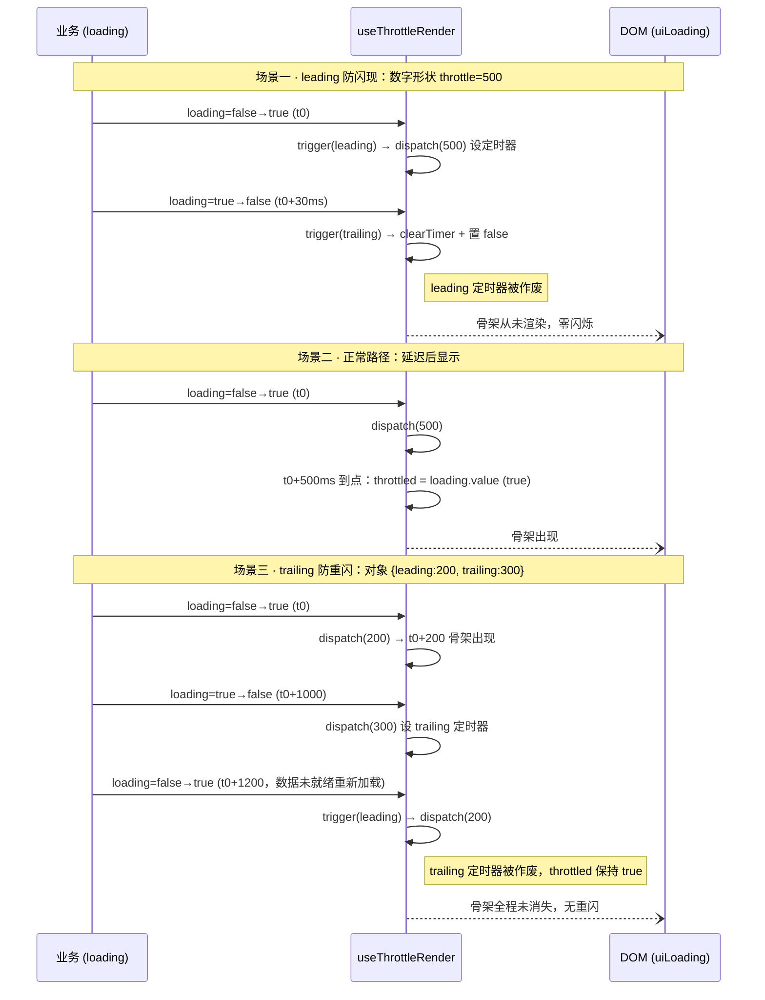
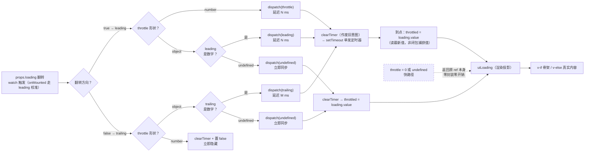

# 7-09 · Skeleton：节流防闪烁

> 本篇是「反馈与浮层」章节的第九篇。Skeleton 是全库状态最少、代码最短的组件之一——视图层两个 SFC 加起来不到一百一十行，却藏着一个经典的前端时序问题：**loading 是布尔量，但网络不是**。数据到达的瞬间可能抖动、可能竞态、可能先假后真，骨架屏如果老老实实跟随每一次 loading 翻转，就会"闪一帧就消失"或者"消失又重闪"。本篇的核心问题只有一个：**leading/trailing 节流到底解决什么问题，它的正确实现是 throttle、debounce 还是别的什么**。实码给出的答案三者皆非——是一扇"可换向的单发延迟门"。全部路径与行号在当前工作区逐一核对。

## 一、先看病灶：loading 抖动的两种闪烁

骨架屏的本质极简：`loading === true` 时渲染占位假结构，`false` 时渲染真实内容。本库的 Skeleton 把这个协议写在模板的两行分支上（`packages/components/skeleton/src/skeleton.vue:52` 与 `:76`）：

```html
<div v-if="uiLoading" :class="rootKls" ...>...</div>
<slot v-else v-bind="attrs" />
```

注意变量名——分支判断的不是 `props.loading`，而是 `uiLoading`。这个命名差异就是本篇的全部剧情：`loading` 是外部世界的输入，`uiLoading` 是节流后的渲染投影。先别急着看投影怎么来，先把病灶看清楚。

**loading 并不是想象中的一次性开关。** 至少三类真实场景会让它在短窗口内反复翻转：

1. **缓存命中**：请求发出前先查本地缓存，命中则 `loading` 从未置真、直接渲染；但很多业务写法是"先置 `true` 再查缓存"，缓存命中后 20ms 内又置回 `false`——骨架闪现一帧。
2. **请求竞态**：快速切换 Tab 或翻页时，旧请求还在飞，新请求已发出。取消逻辑不严密时 `loading` 可能 `true→false→true` 连跳，骨架消失又出现，内容区闪一下空白。
3. **聚合状态**：`loading = a.isLoading || b.isLoading` 这类派生布尔，任何一个子请求的完成都会让整体状态抖一下，中间态的"假完成"会让骨架提前退场。

这两种闪烁各有名字：loading 短暂为真又回落，骨架**闪现一帧**，是 leading 侧的问题；骨架退场后 loading 又变回真，骨架**消失重闪**，是 trailing 侧的问题。前者让用户看到"什么都没有发生过"的诡异一瞬，后者让用户看到"内容没来、占位也没了"的真空期。节流就是分别堵这两个方向：

- **leading 节流**：loading 变真后不立即渲染骨架，等 N 毫秒——N 毫秒内回落就当无事发生，骨架从未出现过；
- **trailing 节流**：loading 变假后不立即拆骨架，等 M 毫秒——M 毫秒内 loading 又变真，骨架保持显示，无缝衔接。

和 4-04 讲的受控协议对齐一下：`loading` 是标准的受控 prop，组件内部不持有任何 loading 状态源，也不回写 emit——骨架的显示权完全在业务手里。节流**没有**改变这个协议，它只是在外部输入与渲染输出之间插了一层派生缓冲：外部看到的世界没变，DOM 看到的世界被平滑了。这与 4-04 的结论一脉相承——本库组件层是"纯受控 + 派生"的惯用法，Skeleton 的 `uiLoading` 是这套惯用法里少见的"带时间维度的派生"。

还有一层更近的渊源要交代：4-11 拆 message 时讲过它的定时器治理——`pauseReasons` 原因集合、剩余时间记账、`visibilitychange` 时暂停恢复。Skeleton 的节流是同一个话题族（组件里的 `setTimeout` 治理）的另一种形态：message 的定时器要"可暂停、可续命"，Skeleton 的定时器要"可换向、可作废"。到第三节实码处会看到两者纪律上的呼应。

## 二、API 面：throttle 的两种形状

先把 prop 的类型定义全文贴出来（`packages/components/skeleton/src/skeleton.ts:1-19`）：

```ts
import type Skeleton from "./skeleton.vue";

export interface SkeletonThrottleOptions {
  leading?: number;
  trailing?: number;
  initVal?: boolean;
}

export type SkeletonThrottle = number | SkeletonThrottleOptions;

export interface SkeletonProps {
  animated?: boolean;
  count?: number;
  rows?: number;
  loading?: boolean;
  throttle?: SkeletonThrottle;
}

export type SkeletonInstance = InstanceType<typeof Skeleton>;
```

 nineteen 行的类型文件把整个节流 API 说完了：`throttle` 接受两种形状。

**数字形状**（`:throttle="500"`）：只配 leading 延迟，trailing 侧立即隐藏。语义是"怀疑 loading 是假的，等 500ms 验真；数据真到了就立刻见内容，绝不拖泥带水"。

**对象形状** `{ leading: 200, trailing: 300, initVal: false }`：两个方向各自可配，外加一个 `initVal` 控制初始渲染值。语义是"两边都可能抖，各自给缓冲窗口"。

`SkeletonProps` 里的其余四个 prop 都平平无奇，但默认值值得记录（`skeleton.vue:12-18`）：`animated: false`（动画要显式开）、`count: 1`（骨架组数）、`rows: 3`（默认三行段落）、`loading: true`（**默认是骨架态**——这个默认让 `<xy-skeleton />` 裸标签就能渲染出占位结构，也让"忘传 loading"的组件永远停在骨架上，属于把"加载中"当第一公民的取值哲学）。

这份 API 不是本库原创。Element Plus 的 Skeleton 在 2.8.8 引入了完全同构的设计：`throttle` 接受 number 或 object，数字"代表延迟显示"，对象可设 `{ leading: 500, trailing: 500 }`，另支持 `{ initVal: true }` 控制初始加载值，默认 0。本库把这套 API 原样收编，连命名都对齐——这是"从成熟实现里学 API 形状"的直接案例，第七节做完整对比。

两种形状在业务侧的典型落法可以这样对照：

```vue
<script setup lang="ts">
import { ref } from "vue";

// 场景 A：普通页面加载——只防"缓存命中/秒回"导致的骨架闪现
const pageLoading = ref(true);
// 场景 B：分页/Tab 复用同一容器——两个方向都会抖，各给一个窗口
const tableLoading = ref(true);
// 场景 C：SSR 水合或首屏直出——首帧就要有骨架，不等 leading 窗口
const panelLoading = ref(true);

setTimeout(() => {
  pageLoading.value = false;
}, 40);
</script>

<template>
  <!-- A. 数字形状：等价 { leading: 300 }，loading 回落时立即隐藏 -->
  <xy-skeleton :loading="pageLoading" :throttle="300" animated :rows="4" />

  <!-- B. 对象形状：显示缓 200ms，隐藏缓 500ms，翻转窗口内骨架不消失重闪 -->
  <xy-skeleton
    :loading="tableLoading"
    :throttle="{ leading: 200, trailing: 500 }"
    animated
  />

  <!-- C. initVal：初始渲染值直接为真，首帧即骨架 -->
  <xy-skeleton
    :loading="panelLoading"
    :throttle="{ leading: 200, initVal: true }"
    animated
  />
</template>
```


## 三、实码定论：不是 throttle，不是 debounce，是一扇"可换向的延迟门"

节流逻辑不在组件里，而在基础设施包的 composable 中（`packages/xiaoye-primitives/src/composables/use-throttle-render.ts`，经 `packages/xiaoye-primitives/src/composables/index.ts:7` 导出）。全文八十二行，先整段读完：

```ts
import { onBeforeUnmount, onMounted, ref, watch } from "vue";
import type { Ref } from "vue";

export interface ThrottleRenderOptions {
  leading?: number;
  trailing?: number;
  initVal?: boolean;
}

export type ThrottleType = number | ThrottleRenderOptions;

export function useThrottleRender(
  loading: Ref<boolean>,
  throttle: ThrottleType = 0
) {
  if (throttle === 0 || throttle === undefined) {
    return loading;
  }

  const initialValue =
    typeof throttle === "object" && throttle !== null ? Boolean(throttle.initVal) : false;
  const throttled = ref(initialValue);
  let timeoutId: ReturnType<typeof setTimeout> | null = null;

  function clearTimer() {
    if (timeoutId !== null) {
      clearTimeout(timeoutId);
      timeoutId = null;
    }
  }

  function dispatch(delay: number | undefined) {
    if (delay === undefined) {
      clearTimer();
      throttled.value = loading.value;
      return;
    }

    clearTimer();
    timeoutId = setTimeout(() => {
      timeoutId = null;
      throttled.value = loading.value;
    }, delay);
  }

  function trigger(type: "leading" | "trailing") {
    if (type === "leading") {
      if (typeof throttle === "number") {
        dispatch(throttle);
      } else {
        dispatch(throttle.leading);
      }

      return;
    }

    if (typeof throttle === "object" && throttle !== null) {
      dispatch(throttle.trailing);
      return;
    }

    clearTimer();
    throttled.value = false;
  }

  onMounted(() => {
    trigger("leading");
  });

  watch(
    () => loading.value,
    (value) => {
      trigger(value ? "leading" : "trailing");
    }
  );

  onBeforeUnmount(() => {
    clearTimer();
  });

  return throttled;
}
```

逐段拆完之后，回答标题里那个三选一的问题。

### 第一段：零开销快路径（:16-18）

`throttle === 0 || throttle === undefined` 时直接 `return loading`——返回的是**原 ref 本身**，不是副本。也就是说不配节流时，`uiLoading` 与 `props.loading` 是同一个响应式对象：不建内部 ref、不挂 watch、不设定时器，一行额外开销都没有。组件里 90% 的用法（静态骨架图、文档示例）走的就是这条快路径。这是 API 设计里的"默认即免费"纪律：付费能力必须是 opt-in 的。

顺带一个实码边界：`throttle` 是作为普通参数传入的，不是响应式的。运行时改 `props.throttle` 不会重建节流逻辑，只有 `loading` 是被 watch 的响应源。`throttle` 是**装配期参数**，不是运行期配置。

### 第二段：状态与定时器句柄（:20-23）

`throttled = ref(initialValue)`——对象形状才有 `initVal`，数字形状恒 `false` 起步。`timeoutId` 用模块内普通变量持有，配合下一节的 `clearTimer`，保证**任意时刻至多只有一个定时器存活**。

### 第三段：dispatch——延迟与立即的统一入口（:32-44）

`dispatch(delay)` 是全函数的心脏：

- `delay === undefined`：清定时器、**立即** `throttled.value = loading.value`——注意读的是 `loading.value` 的当前值，不是触发时刻捕获的旧值；
- `delay` 为数字：清旧定时器、设新定时器，到点后 `throttled.value = loading.value`——**同样读最新值**。

两个细节都是故意的。第一，任何 dispatch 都先 `clearTimer`，配合单句柄变量，形成不变量：**定时器永远只表达"最近一次 loading 翻转"的意图**，旧意图在任何新意图到来时被作废。第二，回调读最新值而非闭包捕获值，意味着即使定时器侥幸存活到触发（比如两次翻转落在同一个延迟窗口内未被清除的极端序列），落到 `uiLoading` 上的也是最新状态，不会把过期值刷进 DOM。

### 第四段：trigger——方向路由（:46-64）

`trigger(type)` 按翻转方向取延迟：

- **leading**（loading 变真，`:47-55`）：数字形状取 `throttle`；对象形状取 `throttle.leading`——可能是数字（延迟显示）也可能是 `undefined`（立即显示）。
- **trailing**（loading 变假，`:57-64`）：对象形状取 `throttle.trailing`（数字则延迟隐藏，`undefined` 则立即隐藏）；数字形状走 `:62-63` 的兜底——清定时器、**硬编码**置 `false`。注意这里不是 `loading.value` 而是 `false`：trailing 分支只在 loading 变假时到达，直接写 false 语义最直白，也顺手把 leading 窗口里未到点的定时器一起清了——**数字形状的"立即隐藏"就是在这里吃掉了 leading 的悬置定时器**。

### 第五段：三个生命周期钩子（:66-79）

`onMounted` 里补了一次 `trigger("leading")`——这是容易被忽略的关键一行。`watch` 不带 `immediate`，如果组件挂载时 `loading` 已经是 `true`，没有这次补触发，`throttled` 将永远是初始值 `false`，骨架根本不会出现（只要后续 loading 不再翻转）。挂载即校准，让"挂载时就在加载"的场景正确起步——测试 `skeleton.spec.ts:97-110` 验证的正是这条路径。

`onBeforeUnmount` 清定时器，对应 4-11 里总结的 setTimeout 三纪律之一：组件里的定时器必须在卸载路径上有出口，否则卸载后到点的回调会写一个已脱离响应式上下文的 ref。

### 三选一的论证：为什么 throttle 和 debounce 都不对

现在可以正面回答"实码定论"了。经典 throttle 的定义是"持续触发期间按固定周期采样执行"，核心机制是时间戳记账 + 尾沿补发；经典 debounce 的定义是"停止触发 delay 毫秒后才执行一次"，核心机制是重置计时。拿这两个模具来套 Skeleton，都会变形：

**debounce 语义完全错误。** debounce 会把"延迟显示"解释成"loading 停止变化 500ms 后才显示"。但 loading 抖动恰恰发生在持续加载期间——数据要 3 秒才到，`loading` 在第 0.1 秒置真后一直为真、没有变化，debounce 的计时器永远不被"停止触发"激活吗？不对，debounce 在"最后一次变化 + 500ms"时执行，持续为真倒是能等到。真正崩掉的是另一头：若 loading 在窗口内抖动（`true→false→true`），debounce 会把"显示骨架"这个动作不断推迟到抖动平息——可抖动平息时 loading 的最终值可能是 false（数据到了），于是骨架被 debounce 吞掉，从不显示；而如果最终值是 true，debounce 反而把本该立即出现的骨架拖到抖动平息后才出现。**显示时机被绑在"信号稳定"上，而骨架要的是"信号为真后的固定延迟"**——两者是不同的时间语义。

**经典 throttle 无的放矢。** throttle 防的是高频重复触发，但 `loading` 是布尔量，`watch` 只在值变化时回调——根本不存在"高频重复触发"，只有低频跳变沿。throttle 的周期采样、尾沿补发一整套机制在这里没有落点：一个布尔量的"节流"退化后只剩两件事——跳变沿的延迟，与悬置定时器的作废。

**正确的抽象是第三种：面向布尔信号的"可换向单发延迟门"。** 每次 loading 翻转（一个跳变沿），按方向取延迟，设一个**单发**定时器；任何新翻转到来，作废旧定时器、按新方向重设；到点后把输出同步为 loading 的**最新值**。它借用了 lodash throttle 的 leading/trailing 词汇表，但机制上没有周期、没有记账、没有补发——只有一个可以随时作废重设的 timeout。所谓"节流"，在这个场景里的准确翻译是：**给跳变沿加死区，让窗口内的抖动在渲染层不可见**。



这张时序图是本篇的主图。三个场景覆盖了节流的全部行为面：窗口内回落则"当无事发生"、窗口外到点则正常显示、trailing 窗口内回真则无缝保持。所谓防闪烁，就是让"抖动"这条中间线在 DOM 上不留痕迹。

在时序推演之外，把 82 行实码的控制流收成一张路由图——每一次 loading 翻转从进入到落值的全部路径：



读这张图抓三个汇聚点即可：所有延迟路径都先过 `clearTimer`（旧意图作废）；所有到点回调和立即路径都读 `loading.value` 最新值（不存在过期写入）；所有路径最终都汇到同一个 `throttled`——输出是单一的，输入怎么抖都不会产生并发写。

## 四、渲染侧：v-if 互斥、默认模板与 attrs 三路分发

节流只是投影，投影的消费者是模板。回到 `skeleton.vue`，先把 script 的核心段与模板全段一次读掉（`packages/components/skeleton/src/skeleton.vue:35-47` 与 `:50-77`）：

```ts
const normalizedCount = computed(() => Math.max(1, Math.floor(props.count)));
const normalizedRows = computed(() => Math.max(0, Math.floor(props.rows)));
const uiLoading = useThrottleRender(toRef(props, "loading"), props.throttle);

const rootKls = computed(() => [
  ns.base.value,
  ns.is("animated", props.animated),
  attrs.class
]);

defineExpose({
  uiLoading
});
```

```html
<template>
  <div
    v-if="uiLoading"
    :class="rootKls"
    :style="attrs.style"
    v-bind="nativeAttrs"
  >
    <template
      v-for="index in normalizedCount"
      :key="index"
    >
      <slot v-if="slots.template" name="template" />
      <template v-else>
        <XySkeletonItem :class="ns.is('first', true)" variant="p" />
        <XySkeletonItem
          v-for="row in normalizedRows"
          :key="row"
          :class="[
            `${ns.base.value}__paragraph`,
            ns.is('last', row === normalizedRows && normalizedRows > 1)
          ]"
          variant="p"
        />
      </template>
    </template>
  </div>
  <slot v-else v-bind="attrs" />
</template>
```

四个值得停留的细节。

**其一，入参归一化。** `count` 走 `Math.max(1, Math.floor(...))`，`rows` 走 `Math.max(0, Math.floor(...))`（`:35-36`）——骨架组数下限 1（至少渲染一次，传 0、负数、NaN 都兜回 1），段落数下限 0（允许"只有标题位没有段落"的默认骨架）。注意 `rows: 0` 时模板里 `:63` 的 first 占位**仍然渲染**——默认模板的结构是"一条 33% 宽的标题位 + rows 条段落位"，rows 归零只是砍掉段落，不拆标题。

**其二，默认模板的视觉图式。** 无 `#template` 插槽时，默认渲染 first 的 `variant="p"`（33% 宽，暗示标题行）加 `rows` 个 `variant="p"` 的段落（末行 61% 宽，暗示文章收尾的短行）。这套"标题 + 段落 + 收尾短行"的图式是骨架屏的公共惯语——多数加载场景是文章流，零配置即可得到可信的占位。宽度的实现纯 CSS（`skeleton.css:45-51`，第五节读）。

**其三，`is-last` 的单行边界。** `:69` 的条件是 `row === normalizedRows && normalizedRows > 1`——单段落（rows=1）时**不**加 `is-last`。这是刻意的：61% 的收尾宽度是"多行文章末行"的暗示，唯一一行文字应该是全宽（100%），收尾暗示反而不对。一个布尔表达式守住了"单行全宽、多行收尾"的语义分界。

**其四，attrs 三路分发。** `inheritAttrs: false` 之后（`:2-5`），透传被拆成三条路：`class` 并进 `rootKls`（保证外部类与 `is-animated` 等内部状态类共存且可被覆盖排序）、`style` 直接绑根节点、其余属性收进 `nativeAttrs` v-bind（`:28-33` 把 class/style 从 attrs 里 delete 掉）。而 `v-else` 分支的 `<slot v-bind="attrs" />` 把**全部** attrs（含 class/style）透传给真实内容——骨架态和内容态对外部属性的处理是对称的，外部给容器写的样式在两个态都不丢。`count` 复制 `#template` 插槽时用 `<slot>` 直接迭代、无包裹 DOM（`:61`），测试 `skeleton.spec.ts:80-95` 专门断言了根节点的直接子元素全是插槽内容、无额外包装层。

还有一行容易被略过：`defineExpose({ uiLoading })`（`:45-47`）。把节流后的渲染态暴露给实例，一是给测试一个不依赖 DOM 时序的断言锚点（第六节会看到它的用法），二是让业务有机会读到"节流后的真实渲染态"——例如在 `uiLoading` 上挂 `aria-busy` 或做日志。对外承诺最小，但把内部状态留了一个观察口。

### 设计权衡二：variant 预设 vs 自由插槽

`XySkeletonItem` 的形状系统是九个字符串字面量（`packages/components/skeleton/src/skeleton-item.ts:1-17`）：

```ts
export const skeletonItemVariants = [
  "circle",
  "rect",
  "h1",
  "h3",
  "text",
  "caption",
  "p",
  "image",
  "button"
] as const;

export type SkeletonItemVariant = (typeof skeletonItemVariants)[number];

export interface SkeletonItemProps {
  variant?: SkeletonItemVariant;
}
```

九个预设覆盖文本层级（h1/h3/text/caption/p）与形状媒体（circle/rect/image/button）两大族，`variant` 是 item 的唯一 prop（`:15-17`），全部实现为 class 驱动的尺寸预设。这就是**预设路线**：形状是有限集合、由库统一背书尺寸与间距，业务零思考拼装；代价是形状超出预设（比如进度条占位、表单行占位）就无路可走。

所以 Skeleton 同时保留了**自由插槽路线**：`#template` 插槽 + `xy-skeleton-item` 任意拼装（配合内联 style 调宽度），`count` 还能批量复制整块拼装。两条路线的分工在文档示例里演得很清楚——`apps/docs/examples/skeleton/basic.vue` 的上半区用默认模板（零配置），下半区用 `#template` 拼标题加三条文本（精确复刻版式）；`dashboard-mixed.vue` 更是把整个仪表盘的骨架用 item 拼了出来。

为什么不做成"给 item 传 width/height 任意尺寸"的彻底自由路线？因为骨架屏的可用性来自**克制的相似**：占位块和真实内容块在尺寸上近似、在细节上模糊，视觉才有"这里将出现内容"的暗示而无"这是另一个 UI"的喧宾夺主。九个预设是库背书的"合理尺寸白名单"，业务自己随手写的任意尺寸反而容易破坏这种相似。预设管 80% 的常规场景，插槽管剩下 20% 的精确复刻——这是 Skeleton 在表达力与一致性之间画的线。

item 的模板极短（`packages/components/skeleton/src/skeleton-item.vue:17-32`），值得一提的只有两处：`aria-hidden="true"` 把纯装饰的占位块对读屏器整体隐藏（骨架是视觉安慰剂，不承载任何语义，读出来只是噪音）；image 变体内嵌一个 `mdi:image-outline` 图标、`size="22%"` 相对 sizing（icon 组件对字符串 size 原样透传，`packages/components/icon/src/icon.vue:23-25`），让"这里将出现图片"的暗示比纯灰块更强。

```html
<template>
  <div
    :class="[
      `${ns.base.value}__item`,
      `${ns.base.value}__${props.variant}`
    ]"
    aria-hidden="true"
  >
    <XyIcon
      v-if="props.variant === 'image'"
      class="xy-skeleton__image-icon"
      icon="mdi:image-outline"
      size="22%"
    />
  </div>
</template>
```

最后看安装入口的形态（`packages/components/skeleton/index.ts:25-33`）：`XySkeletonItem` 独立 `withInstall` 并在 manifest 登记为独立组件 `xy-skeleton-item`（`packages/components/component-manifest.json:438-439`），同时作为静态属性挂在 `XySkeleton.Item` 上——两种取用路径并存，与类型夹具 `tests/types/fixtures/skeleton.ts:40-42` 的两种 h() 写法一一对应。

## 五、样式侧：shimmer 扫光与令牌派生

动画与形状的实现全在一份一百零九行的 CSS 里（`packages/theme/src/components/skeleton.css`，经 `packages/theme/index.css:47` 聚合）。先读骨架态与动画段（`:1-34`）：

```css
.xy-skeleton,
.xy-skeleton__item {
  --xy-skeleton-color: color-mix(in srgb, var(--xy-bg-subtle) 84%, var(--xy-bg-raised));
  --xy-skeleton-to-color: color-mix(
    in srgb,
    var(--xy-bg-floating) 88%,
    var(--xy-bg-subtle)
  );
  --xy-skeleton-circle-size: 40px;
}

.xy-skeleton {
  width: 100%;
}

.xy-skeleton__item {
  position: relative;
  display: block;
  width: 100%;
  height: 16px;
  border-radius: var(--xy-radius-sm);
  background: var(--xy-skeleton-color);
}

.xy-skeleton.is-animated .xy-skeleton__item {
  background: linear-gradient(
    90deg,
    var(--xy-skeleton-color) 25%,
    var(--xy-skeleton-to-color) 37%,
    var(--xy-skeleton-color) 63%
  );
  background-size: 400% 100%;
  animation: xy-skeleton-loading 1.6s ease infinite;
}
```

骨架灰不是硬编码色值，而是 `color-mix` 从语义背景令牌派生：基色取 `--xy-bg-subtle` 与 `--xy-bg-raised` 的 84/16 混合，扫光亮色取 `--xy-bg-floating` 与 `--xy-bg-subtle` 的 88/12 混合（`:3-8`）。深浅两套主题、乃至未来任何主题定制的背景系令牌一变，骨架色自动跟随——这正是 3-02、3-03 讲的语义令牌架构的收益，也和 7-01 Alert 的"语义色派生"是同一招：组件不消费色板层，只消费角色层。

再看变体尺寸与关键帧（`:36-57` 与 `:101-109`）：

```css
.xy-skeleton__item.is-first,
.xy-skeleton__paragraph {
  margin-top: 16px;
}

.xy-skeleton__p {
  width: 100%;
}

.xy-skeleton__item.is-first {
  width: 33%;
}

.xy-skeleton__paragraph.is-last {
  width: 61%;
}

.xy-skeleton__circle {
  width: var(--xy-skeleton-circle-size);
  height: var(--xy-skeleton-circle-size);
  border-radius: 50%;
}

@keyframes xy-skeleton-loading {
  0% {
    background-position: 100% 50%;
  }

  100% {
    background-position: 0 50%;
  }
}
```

### 设计权衡三：shimmer 扫光 vs pulse 呼吸

骨架动画业界有两派。**pulse 派**（呼吸）：`opacity` 在 0.5 与 1 之间往复或灰块明暗渐变，整块均匀呼吸，Ant Design 与 GitHub 是代表。**shimmer 派**（扫光）：一条亮带周期性从左扫到右，Facebook、YouTube、Element Plus 的骨架是代表。本库选了 shimmer，实现上的三个决定值得展开：

1. **动什么属性。** 扫光靠 `background-size: 400% 100%` 把渐变横向放大四倍，再让 `background-position` 从 `100%` 匀到 `0`（`:32-33` 与 keyframes）——动的是 background-position。它不在合成器加速白名单里（白名单只有 transform/opacity），每帧触发 paint；但换来的是**零额外 DOM**：一个 background 就够了，不需要 overflow hidden 容器加绝对定位伪元素的扫光条方案（那套方案可以吃 transform 的 GPU 加速，代价是每个 item 多一层伪元素与定位上下文）。骨架屏元素小、寿命短（loading 结束即销毁），paint 成本是可接受的买路钱。
2. **渐变的 stop 分布。** `25% / 37% / 63%` 三个 stop 让亮带偏窄、位置偏左（25→37 是亮带主体，63 处回落），扫过时主视野内的亮暗对比集中在一段，而不是整条均匀变亮——这是"波纹感"的来源：有形的一道光扫过，而不是整块闪烁。
3. **时长与缓动。** 1.6s `ease` 无限循环（`:33`）。ease 让扫光两端减速、中间加速，比 linear 更接近"目光扫过"的节奏感。

pulse 派的优势也如实记录：opacity 是合成器属性，动画期间不重绘、不占主线程，在低端机的长列表骨架上更省。但 pulse 的视觉信息量低——呼吸没有方向性，用户感知不到"正在处理"的动势；shimmer 的方向性扫光天然带"进行中"的隐喻。本库的骨架通常只覆盖卡片、表格这类中小面积区域，shimmer 的 paint 成本换方向性暗示，这笔账是划算的。顺带一个如实记录的现状：这份 CSS 里没有 `prefers-reduced-motion` 降级——对动效敏感用户，骨架仍会持续扫光，这是当前实现的已知留白，后续补一行媒体查询把 animation 停掉即可。

image 变体还有个小巧思（`:86-94`）：占位边框用 `box-shadow: inset 0 0 0 1px` 而不是 `border`——inset 阴影不参与布局，不会让占位块与后续渲染的真实图片之间产生一像素的尺寸跳动。circle 尺寸走 `--xy-skeleton-circle-size: 40px` 变量（`:9, :53-57`），文档示例 `variants.vue` 里 `.is-circle { --xy-skeleton-circle-size: 56px; }` 演示了业务侧用 CSS 变量改预设尺寸的正规通道——预设不是死值，留了令牌级的调节口。

## 六、时序验证：fake timers 的三段推演

时序逻辑的测试必须用 fake timers——真实等待 500ms 的测试既拖慢套件又容易在慢 CI 上抖动。`packages/components/skeleton/__tests__/skeleton.spec.ts:9-16` 在 `beforeEach` 里统一 `vi.useFakeTimers()`。三个节流用例把第三节的推演逐一钉死。

数字形状（`:97-110`）验证的是"挂载即 loading、骨架延迟出现"：

```ts
it("支持 throttle 数字形式", async () => {
  const wrapper = mount(XySkeleton, {
    props: {
      throttle: 500
    }
  });

  expect((wrapper.vm as { uiLoading: boolean }).uiLoading).toBe(false);

  vi.runAllTimers();
  await wrapper.vm.$nextTick();

  expect((wrapper.vm as { uiLoading: boolean }).uiLoading).toBe(true);
});
```

断言锚点是 `wrapper.vm.uiLoading`——第四节里 `defineExpose` 暴露的观察口在这里兑现：不用查 DOM 里有没有 `.xy-skeleton__p`（那会把"渲染态"和"渲染时机"混在一层断言里），直接断言节流投影的值。挂载时 `loading` 默认 `true`，onMounted 的 `trigger("leading")` 设了 500ms 定时器，此刻 `uiLoading` 仍是 `false`；`runAllTimers` 后定时器到点同步为 `true`。这同时验证了 onMounted 补触发那条关键路径——没有它，这个用例的第二个断言必挂。

对象形状（`:112-133`）验证 `initVal` 与 trailing 延迟：

```ts
it("支持 throttle 对象形式", async () => {
  const wrapper = mount(XySkeleton, {
    props: {
      throttle: {
        trailing: 500,
        initVal: true
      },
      loading: true
    }
  });

  expect((wrapper.vm as { uiLoading: boolean }).uiLoading).toBe(true);

  await wrapper.setProps({
    loading: false
  });

  vi.runAllTimers();
  await wrapper.vm.$nextTick();

  expect((wrapper.vm as { uiLoading: boolean }).uiLoading).toBe(false);
});
```

`initVal: true` 让挂载首帧即为真（不等 leading），`loading: false` 后 trailing 的 500ms 窗口内仍为真、`runAllTimers` 后落假——trailing 延迟隐藏的完整往返。

最有信息量的是完整链路用例（`:135-167`），它把第三节时序图的场景三逐毫秒推演了一遍：

```ts
it("支持 throttle 对象的 leading 和 trailing 完整链路", async () => {
  const wrapper = mount(XySkeleton, {
    props: {
      throttle: {
        leading: 200,
        trailing: 300,
        initVal: false
      },
      loading: true
    }
  });

  expect((wrapper.vm as { uiLoading: boolean }).uiLoading).toBe(false);

  vi.advanceTimersByTime(200);
  await nextTick();

  expect((wrapper.vm as { uiLoading: boolean }).uiLoading).toBe(true);

  await wrapper.setProps({
    loading: false
  });

  vi.advanceTimersByTime(299);
  await nextTick();

  expect((wrapper.vm as { uiLoading: boolean }).uiLoading).toBe(true);

  vi.advanceTimersByTime(1);
  await nextTick();

  expect((wrapper.vm as { uiLoading: boolean }).uiLoading).toBe(false);
});
```

注意 `advanceTimersByTime(299)` 与 `advanceTimersByTime(1)` 的拆分——**在 299ms 处断言仍为真，在 300ms 处断言落假**。这不是炫技的毫秒洁癖，而是钉死 trailing 窗口的**左闭右开边界**：窗口内的任意时刻不得提前退场，窗口到点的那一刻必须退场。时序 bug 十有八九藏在边界的一毫秒里，fake timers 的价值就是把这一毫秒从"碰运气"变成"可断言"。其余用例（默认 4 个 `.xy-skeleton__p`、`count` 翻倍成 8、`rows: 4` 成 5、`loading: false` 渲染默认插槽、`#template` 替换与无包裹复制）覆盖模板协议；`skeleton-item.spec.ts` 用三个用例钉住默认 `text` 变体、image 变体的占位图标（断言落在 Iconify 渲染的 `data-icon="mdi:image-outline"` 属性上，`skeleton-item.spec.ts:20`）与 circle 类名。

类型侧的守卫在 `tests/types/fixtures/skeleton.ts`：`:10-15` 声明数字与对象两种 `SkeletonThrottle` 用法，`:47-52` 用 `@ts-expect-error` 钉死非法 variant（`"badge"`）必须被拒，`:54-61` 钉死 throttle 对象的未知键（`after`）必须报错——九个 variant 与三个 throttle 键是封闭集合，拼写错误在编译期暴露；`:34-45` 则用 h() 同时验证 `#template`/default 两个插槽与 `XySkeleton.Item` 静态属性的取用路径。

## 七、文档示例速览与 EP 对比

文档示例共六个（`apps/docs/examples/skeleton/`）：`basic.vue`（默认模板与 template 插槽对照）、`animated-rows.vue`（动画、count、rows）、`variants.vue`（九种变体全景，含 circle 尺寸变量覆盖）、`template-switch.vue`（loading 双态切换）、`dashboard-mixed.vue`（仪表盘级混排——三张 KPI 卡、任务队列表、摘要区，全部用 item 拼装骨架，是"插槽路线"的极限演示）、`loading-result.vue`（四态流转：骨架 → 内容 → Empty → Result，一个容器里 Skeleton 与后续反馈组件的接力）。

最后把 EP 放回来看。以 Element Plus 2.8.8 引入的 Skeleton throttle API 为参照（官方文档原文："渲染延迟（以毫秒为单位）数字代表延迟显示，也可以设置为延迟隐藏，例如 `{ leading: 500, trailing: 500 }`"；初始加载值用 `{ initVal: true }`；默认 0）：

1. **API 完全同构。** number / `{leading, trailing, initVal}` 双形状、字段名、默认值 0，本库逐字对齐（`skeleton.ts:3-9`）。这不是巧合：节流的语义模型（方向 × 延迟窗口）只有一个正确分解，EP 已经验证过这套 API 的表达力，重造词汇表只会增加迁移成本。
2. **放置分层不同。** EP 把这段逻辑放在 `@element-plus/hooks` 的 `useThrottleRender` 里；本库放在 `xiaoye-primitives` 的 `src/composables`——同属"组件外的基础设施层"，但本库的 primitives 还承载 namespace、overlay stack、focus trap 等跨组件协议（见 4-03 的三件套分工），composable 与协议同层，便于组件包与 pro 包共用。
3. **快路径多判一个 `undefined`。** 本库的零开销判断是 `throttle === 0 || throttle === undefined`（`use-throttle-render.ts:16`）——显式覆盖了 prop 缺省传 `undefined` 的路径（虽然 `withDefaults` 已兜底为 0，这行是双保险），返回原 ref 本身而非新 ref，保证快路径下零封装。
4. **观察口。** 本库 `defineExpose({ uiLoading })` 把节流投影暴露到实例上，测试与业务都能读到"节流后的渲染态"；EP 的对应能力要走 DOM 断言或自行复制节流逻辑。这是"内部状态留观察口"的一处小增量，换来的是第六节那组毫秒级断言的干净写法。
5. **变体与默认模板同源。** 九种 variant 的集合（circle/rect/h1/h3/text/caption/p/image/button）、first 33% 与 last 61% 的默认宽度图式，两边一致——骨架屏的"公共惯语"部分，本库选择沿用而非另起炉灶，把差异化的力气花在守卫、分层与观察口上。

一句话总结：EP 给出了"throttle 语义的最小 API 形状"，本库在同一个形状上补齐了**零开销快路径、实例观察口与类型侧封闭集合守卫**，实现收敛为一个 82 行、单定时器、无双循环的纯函数式 composable。

## 八、收束

把全篇压回最初的问题——leading/trailing 节流解决什么问题：

1. **它解决的是"布尔信号与网络时序的错位"。** loading 抖动的两种闪烁（闪现一帧、消失重闪）都是把"信号瞬间"直接翻译成"DOM 瞬间"造成的；节流给每个跳变沿加了死区窗口，让窗口内的抖动在渲染层不可见。
2. **实码定论：三者皆非。** 不是经典 throttle（布尔量没有高频重复触发，周期采样无的放矢），不是 debounce（显示时机被绑在"信号稳定"上，语义错位），而是一扇**可换向的单发延迟门**：每个跳变沿按方向取延迟、设一个可作废的定时器、到点同步最新值。82 行实码，不变量只有两条——任意时刻至多一个定时器，任何新意图作废旧意图。
3. **节流不改受控协议。** `loading` 仍是纯受控 prop（4-04 的惯性），`uiLoading` 只是带时间维度的派生投影；外部世界不变，DOM 世界被平滑。
4. **setTimeout 治理的第二个标本。** 4-11 的 message 给了"可暂停的剩余时间记账"，本篇给了"可换向的单发定时器"——清理（onBeforeUnmount）、竞态（新意图作废旧定时器）、可信（回调读最新值）三条纪律再次出现，只是形态随组件语义而变。
5. **预设与插槽分工。** 九个 variant 预设管零配置的常规版式，`#template` 插槽管精确复刻；shimmer 扫光以可接受的 paint 成本换方向性暗示，颜色全部由语义令牌派生。

而这最后一笔正是下一篇的入口：文档示例 `loading-result.vue` 里，骨架退场后接棒的是 `xy-empty` 与 `xy-result`——**当加载失败或结果为空时，"预设场景组合"的状态图式（icon + title + description + extra）怎么在 Result 里收敛成一套 status 驱动的模板**，就是 7-10 要拆的问题。

**下一篇预告：7-10《Result：预设场景组合》。**
