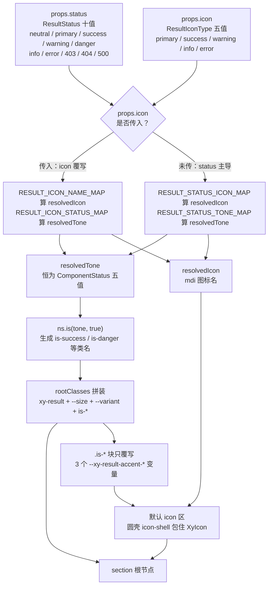
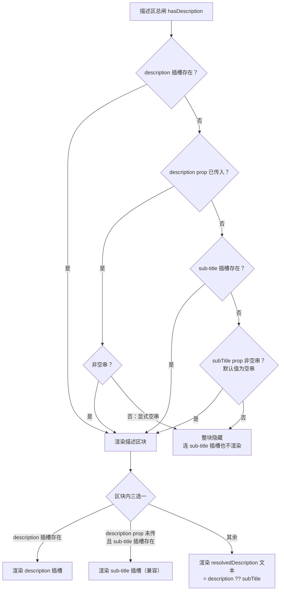

# 7-10 · Result：预设场景组合

> 本篇源码坐标（均为当前工作区实态）：
> - `packages/components/result/src/result.vue`（视图层与裁决器，120 行）
> - `packages/components/result/src/result.ts`（类型层与四张映射表，61 行）
> - `packages/components/result/index.ts`（安装出口，13 行）
> - 样式：`packages/theme/src/components/result.css`（214 行）
> - 测试：`packages/components/result/__tests__/result.spec.ts`（135 行）；全局 mock：根目录 `vitest.setup.ts`（20 行）
> - 类型夹具：`tests/types/fixtures/result.ts`（65 行）
> - 文档示例：`apps/docs/examples/result/`（basic / status / card / custom 四例）；组合消费：`apps/docs/examples/skeleton/loading-result.vue`、`apps/docs/examples/countdown/approval-deadline.vue`

上一篇 7-09 拆了 Skeleton 的节流防闪烁；再往前 7-07 我们刚立过 Empty 的"无逻辑组件"纪律——那是一个几乎没有逻辑的组件：无状态轴、无映射表、无视觉变体，连默认文案都是直接从 locale 里捞的。本篇的 Result 和 Empty 在页面上常常相邻出现，走的却是截然相反的另一条路线：它带着一张十值的状态词表、四张映射表、一条 icon 覆写 status 的裁决链和一套双轨兼容的描述字段。大纲给本篇的核心问题只有十个字（`column/02-分卷大纲.md:124`）：**枚举预设 vs 自由组合的边界**。拆开说，它由三个更锋利的问题组成：

1. **预设该预设到哪一层？** 只预设图标？还是连色调、文案、插画一起预设？预设越多，"开箱即用"越强，但组件替用户做的决定也越多——预设画错一层，要么一致性落空，要么灵活性归零。
2. **十个业务词怎么折叠回五值状态契约？** `403`、`404`、`500` 这些后台方言词如果直接漏进样式层，CSS 就要多认五个类名；如果散落在模板里翻译，每个三元表达式都是一处未来会漂移的逻辑。翻译发生在哪、收口成什么形状，决定了这张词表十年后的维护成本。
3. **逃生口开在哪、开多大？** 枚举预设的天敌是"第十一个场景"：那个图标库里没有、色调对不上、文案要说三行的业务态。插槽是逃生口，但逃生口开太大，预设就名存实亡——所有人都从窗户爬出去，门就白装了。

Result 的答案是：**预设画在"视觉语义"这一层——status 十值只决定图标字形与色调两个输出；文案、内容、操作全部留给使用者显式传入；自由组合通过六个插槽和一条 icon 覆写链进入，但每一次覆写都发生在"预设已经算完"的下游，预设的映射表本身不可被绕过**。本篇把这条边界拆到实现层。

## 一、先定位：Empty 管空数据，Result 管操作结果

先把两个组件放进同一张桌子。7-07 我们说过，Empty 是"集合视角的没有"：列表为空、搜索无果、暂无数据——它描述的是一个**持续存在的状态**，高频出现，且文案高度模式化，所以 Empty 敢于把默认文案收进 locale 协议，`empty.vue:30-45`：

```typescript
// packages/components/empty/src/empty.vue:30-45
const resolvedTitle = computed(() => {
  if (props.title !== undefined) {
    return props.title;
  }
  return locale.value.emptyTitle ?? "暂无数据";
});
const resolvedDescription = computed(() => {
  if (props.description !== undefined) {
    return props.description;
  }
  return locale.value.emptyDescription ?? "这里还没有可展示的内容";
});
const hasTitle = computed(() => Boolean(slots.title) || resolvedTitle.value !== "");
const hasDescription = computed(
  () => Boolean(slots.description) || resolvedDescription.value !== ""
);
```

Result 恰好相反。它是"单次操作的结果"：提交完了、审批退了、同步失败了——描述的是一个**刚发生的事件**，低频出现，且每一次都必须说清"刚才发生了什么、下一步该干什么"。这类文案没法全局统一（"暂无数据"可以全局统一，"发布记录服务超时"没法统一），所以 Result 的组件层**一个字的默认文案都没有**。证据在配置协议本身：`packages/xiaoye-primitives/src/composables/shared-context.ts:8-13` 的 `Locale` 接口只有 `emptyTitle`、`emptyDescription` 和 popconfirm 的两个按钮文案，没有任何 result 相关键——Empty 的文案是"基础设施"，Result 的文案是"业务内容"，这条分界线画在了 locale 协议里。

API 面的对比同样清晰：

| 维度 | empty（7-07） | result（本篇） |
| --- | --- | --- |
| 状态轴 | 无 | `ResultStatus` 十值 + `ResultIconType` 五值覆写轴 |
| 映射表 | 无 | 四张（图标名 ×2、色调 ×1、icon→status 反写 ×1） |
| 默认文案 | locale 提供（"暂无数据"） | 无，title/description 必须显式传入 |
| 视觉变体 | 无 | `plain` / `card` |
| 尺寸 | 无 | `xs~xl` 全档 + 全局跟随 |
| props / slots | 5 / 4 | 8 / 6 |
| 类型出口 | 仅 `EmptyProps`（且内联在 .vue 里） | 4 个类型从 `index.ts` 显式导出 |

两者的边界用一句话概括：**空数据找 Empty，操作结果找 Result**。这个分工不是理论划分，文档示例里就有活样本——`apps/docs/examples/skeleton/loading-result.vue:58-81` 的三态面板，Empty 和 Result 在同一个 `v-if` 链上各管一段：

```vue
<!-- apps/docs/examples/skeleton/loading-result.vue:58-81 -->
        <xy-empty
          v-else-if="state === 'empty'"
          title="暂无待发布任务"
          description="当前时间范围内没有需要继续推进的发布任务。"
        >
          <xy-space wrap>
            <xy-button type="primary">新建发布窗口</xy-button>
            <xy-button plain>查看历史记录</xy-button>
          </xy-space>
        </xy-empty>

        <xy-result
          v-else
          status="danger"
          title="窗口状态同步失败"
          description="发布记录服务超时，当前无法拉取最新窗口详情。"
        >
          <template #extra>
            <xy-space wrap>
              <xy-button type="primary">重新加载</xy-button>
              <xy-button plain>查看告警记录</xy-button>
            </xy-space>
          </template>
        </xy-result>
```

注意这两段在选择上的措辞差异：Empty 分支说"当前时间范围内没有"（集合为空的事实），Result 分支说"服务超时，当前无法拉取"（一次操作失败的结果）。同一张卡片、同一套按钮，描述对象完全不同——这就是两个组件各自预设的那条"轨道"在真实页面里的形状。

## 二、类型层：十值词表与四张映射表

Result 的类型层只有 61 行，但它承载了本篇一半的设计决策。`packages/components/result/src/result.ts` 全文如下：

```typescript
// packages/components/result/src/result.ts:1-61
import type { ComponentSize, ComponentStatus } from "xiaoye-primitives";

export const resultIconTypes = ["primary", "success", "warning", "info", "error"] as const;
export const resultVariants = ["plain", "card"] as const;

export type ResultIconType = (typeof resultIconTypes)[number];
export type ResultVariant = (typeof resultVariants)[number];
export type ResultStatus = ComponentStatus | "info" | "error" | "403" | "404" | "500";

export interface ResultProps {
  title?: string;
  subTitle?: string;
  icon?: ResultIconType;
  status?: ResultStatus;
  description?: string;
  size?: ComponentSize;
  variant?: ResultVariant;
  iconSize?: number | string;
}

export const RESULT_STATUS_ICON_MAP: Record<ResultStatus, string> = {
  neutral: "mdi:information-outline",
  primary: "mdi:information-outline",
  success: "mdi:check-circle-outline",
  warning: "mdi:alert-circle-outline",
  danger: "mdi:close-circle-outline",
  info: "mdi:information-outline",
  error: "mdi:close-circle-outline",
  "403": "mdi:shield-lock-outline",
  "404": "mdi:file-question-outline",
  "500": "mdi:server-network-off"
};

export const RESULT_STATUS_TONE_MAP: Record<ResultStatus, ComponentStatus> = {
  neutral: "neutral",
  primary: "primary",
  success: "success",
  warning: "warning",
  danger: "danger",
  info: "neutral",
  error: "danger",
  "403": "warning",
  "404": "neutral",
  "500": "danger"
};

export const RESULT_ICON_NAME_MAP: Record<ResultIconType, string> = {
  primary: "mdi:information-outline",
  success: "mdi:check-circle-outline",
  warning: "mdi:alert-circle-outline",
  info: "mdi:information-outline",
  error: "mdi:close-circle-outline"
};

export const RESULT_ICON_STATUS_MAP: Record<ResultIconType, ResultStatus> = {
  primary: "primary",
  success: "success",
  warning: "warning",
  info: "neutral",
  error: "danger"
};
```

先看词表本身。`ResultStatus`（`result.ts:8`）是一个联合：`ComponentStatus`（五值：neutral/primary/success/warning/danger，定义在 `xiaoye-primitives/src/utils/types/common.ts:1`）加上五个扩展值 `info / error / "403" / "404" / "500"`，合计十值。注意扩展值的性质：`info` 和 `error` 是 EP 方言（EP 生态的习惯叫法），`403/404/500` 是 HTTP 语境的页面级语义（无权限、不存在、服务端故障）。它们都**不是**新的状态色——十值最终都要折叠回五值，这是 5-21 讲过的收口问题在这里的又一次落地。

四张映射表的分工是：

- **`RESULT_STATUS_ICON_MAP`（`result.ts:21-32`）**：十值 → mdi 图标名，status 路线的字形来源；
- **`RESULT_STATUS_TONE_MAP`（`result.ts:34-45`）**：十值 → `ComponentStatus` 五值，status 路线的色调来源，也是全组件唯一一处"十折叠五"的翻译点；
- **`RESULT_ICON_NAME_MAP`（`result.ts:47-53`）**：五值 icon 语义 → 图标名，icon 覆写路线的字形来源；
- **`RESULT_ICON_STATUS_MAP`（`result.ts:55-61`）**：五值 icon 语义 → `ResultStatus`，让覆写轴也能算出色调。

两个细节值得停一下。其一，`resultIconTypes` / `resultVariants` 两个运行时数组（`result.ts:3-4`）在全仓库没有第二个消费方——它们存在的意义是把"词表"物化为数据，再用 `(typeof resultIconTypes)[number]` 派生出联合类型，类型和运行时共用同一份事实源。其二，`Record<ResultStatus, ...>` 这个类型标注不是文档装饰，它是**完备性合同**：将来任何人往 `ResultStatus` 里加第十一个值，三张以 `ResultStatus` 为键的表会同时编译报错，TypeScript 倒逼他把三行映射补齐才能合码。词表的膨胀成本被类型系统钉在了收口点上——这正是映射表相对散落写法的第一个结构性优势，下一节展开。

## 三、status → 渲染：一条映射流与一处覆写

把四张表、两个 computed 和类名拼装串起来，就是 Result 的完整渲染管线：



这条管线里最关键的裁决点是 `result.vue:51-56` 的两个 computed：

```typescript
// packages/components/result/src/result.vue:51-56
const resolvedTone = computed(() =>
  props.icon ? RESULT_ICON_STATUS_MAP[props.icon] : RESULT_STATUS_TONE_MAP[props.status]
);
const resolvedIcon = computed(() =>
  props.icon ? RESULT_ICON_NAME_MAP[props.icon] : RESULT_STATUS_ICON_MAP[props.status]
);
```

**icon 一旦传入，status 被整体架空**——不只图标跟着换，色调也一起换。测试里有一组专门的对照断言（`result.spec.ts:50-60`）：`icon: "error"` 搭配 `status: "success"`，最终根类名是 `is-danger` 而不是 `is-success`。这个裁决方向值得斟酌：为什么覆写轴不是只换字形、保留 status 的色调？因为 icon 的五值本身是语义词（"success/error/info"），如果图标说 error、颜色说 success，组件就在同一屏上输出两个矛盾的语义信号。既然要覆写就连语义一起覆写——**半覆写比不覆写更危险**，这是预设系统设计里容易被忽略的一条。

接下来是本篇要正面展开的 TONE_MAP。5-21 讲 Tag 的状态类型消费时（`column/5-21-Tag-通用状态类型的消费.md:342-345`）我们已经引用过这张表，当时它作为"运行时收口"的一个例证一笔带过；本篇把它当作主角拆开，因为它回答的是一个反复出现的工程问题：**方言翻译应该写成什么形状？**

最常见的写法是散落在模板里：

```typescript
// 反例示意：翻译逻辑散落在视图层的三个问题
// const tone = status === "403" ? "warning" : status === "500" ? "danger" : ...
```

这种写法有三个问题：每个三元嵌套都是一处独立的决策点，改一处漏一处；映射关系不可枚举——你无法一眼看到"十值全貌"；测试只能走渲染断言，无法直接对表断言。`RESULT_STATUS_TONE_MAP` 的选择是把翻译物化为**一张带类型约束的声明式数据表**：

1. **完备性由编译器保证**。`Record<ResultStatus, ComponentStatus>` 的双向约束意味着：左边少一个键编译报错（有状态没翻译），右边写出五值之外的值也报错（翻译结果破坏契约）。映射表从"逻辑"降格为"数据"，diff 一眼可读，审查成本趋近于零。
2. **翻译只有一个入口**。`result.vue` 里没有任何一处 if/三元在做状态翻译——视图层只消费 `resolvedTone` 这个算好的结果。十值方言进入组件后被立刻折叠成五值，此后整条链路（类名、CSS、测试断言）都在五值世界里运转，样式层从头到尾不知道 `403` 的存在。
3. **映射本身可测试**。虽然本库的测试走的是渲染断言（`status: "403"` → `is-warning`），但由于表是数据，想加一层直接的表断言（`Object.entries(RESULT_STATUS_TONE_MAP)` 逐项校验）也是零成本——散落写法连这个选项都没有。

再看这张表的**取值语义**，五个方言词的翻译不是随便折的：

- `info → neutral`、`error → danger`：EP 方言词与本库五值的最近邻对齐——EP 的 info 是"中性提示"，本库的 neutral 承接；EP 的 error 是"失败"，本库的 danger 承接；
- `"403" → warning`：权限不足不是系统故障，是需要用户行动（申请权限）的警示，给 warning 而非 danger；
- `"404" → neutral`：资源不存在是中性事实，页面没坏、用户也没做错什么，中性色最克制；
- `"500" → danger`：服务端故障是真问题，danger 名副其实。

字形表里还藏着一个反直觉的事实：十值只对应七种字形——`neutral`/`primary`/`info` 共用 `information-outline`，`danger`/`error` 共用 `close-circle-outline`。为什么不像 `403/404/500` 那样每个值独占一个图标？因为预设的粗细是按需分配的：这五个"常规态"已经有色调通道区分语义（primary 蓝、info 灰），字形不必逐一独创；而 `403/404/500` 三个"页面态"的色调被压进了 warning/neutral/danger 三个常规桶，字形再不区分就真的不可辨认了。**色调管连续谱，字形管稀疏谱**——预设系统里每个维度只承担它性价比最高的那部分区分度。

## 四、视图层：显式零、双轨兼容与 attrs 手术

视图层 120 行，分三段看。先看 script 的前半段（props、插槽声明与 attrs 处理），`result.vue:1-63`：

```vue
<!-- packages/components/result/src/result.vue:1-63 -->
<script setup lang="ts">
defineOptions({
  name: "XyResult",
  inheritAttrs: false
});

import { computed, useAttrs } from "vue";
import type { ComponentSize } from "xiaoye-primitives";
import { useConfig, useNamespace } from "xiaoye-primitives";
import XyIcon from "../../icon";
import type { ResultProps } from "./result";
import {
  RESULT_ICON_NAME_MAP,
  RESULT_ICON_STATUS_MAP,
  RESULT_STATUS_ICON_MAP,
  RESULT_STATUS_TONE_MAP
} from "./result";

const props = withDefaults(defineProps<ResultProps>(), {
  title: undefined,
  subTitle: "",
  icon: undefined,
  status: "neutral",
  description: undefined,
  size: undefined,
  variant: "plain",
  iconSize: undefined
});

const slots = defineSlots<{
  icon?: () => unknown;
  title?: () => unknown;
  description?: () => unknown;
  "sub-title"?: () => unknown;
  default?: () => unknown;
  extra?: () => unknown;
}>();

const attrs = useAttrs();
const ns = useNamespace("result");
const { size: globalSize } = useConfig();

const nativeAttrs = computed<Record<string, unknown>>(() => {
  const rest = { ...attrs };
  delete rest.class;
  delete rest.style;
  return rest;
});

const mergedSize = computed<ComponentSize>(() => props.size ?? globalSize.value);
const resolvedTone = computed(() =>
  props.icon ? RESULT_ICON_STATUS_MAP[props.icon] : RESULT_STATUS_TONE_MAP[props.status]
);
const resolvedIcon = computed(() =>
  props.icon ? RESULT_ICON_NAME_MAP[props.icon] : RESULT_STATUS_ICON_MAP[props.status]
);
const resolvedIconSize = computed(() => {
  if (props.iconSize !== undefined && props.iconSize !== "") {
    return props.iconSize;
  }

  return "var(--xy-result-icon-size)";
});
```

三个容易走眼的地方。第一，`withDefaults` 的默认值不是均匀的：`subTitle` 默认空字符串 `""`，而 `title`、`description` 默认 `undefined`——这不是笔误，是后面 `hasTitle`/`hasDescription` 显式零判断的前置条件（空串与未传被刻意区分开）。第二，`inheritAttrs: false` 加 `nativeAttrs` 的手工拆分：`class` 被摘出来留给 `rootClasses` 合并（透传类要和组件自身的 `is-*` 类排在同一个数组里），`style` 单独直绑根节点，其余属性原样 `v-bind`——Result 是一个会被业务包一层容器类名的组件，这层 attrs 手术保证透传不丢、合并有序。第三，`resolvedIconSize` 的默认值是字符串 `"var(--xy-result-icon-size)"` 而不是 `72`：JS 层不知道默认图标多大，它把这个决定原样下传给 XyIcon 的 `size` prop（`icon.vue:23-25` 里非数字原样进 style），最终由 CSS 按 `sm/md/lg` 变体解析成 52/72/96px。**默认值不硬编码在 JS，是尺寸随变体切换仍然成立的前提**。

script 后半段是"显式零"与双轨兼容的裁决区，`result.vue:64-88`：

```typescript
// packages/components/result/src/result.vue:64-88
const resolvedDescription = computed(() =>
  props.description !== undefined ? props.description : props.subTitle
);
const hasTitle = computed(() => Boolean(slots.title) || props.title !== undefined && props.title !== "");
const hasDescription = computed(
  () =>
    Boolean(slots.description) ||
    (props.description !== undefined
      ? props.description !== ""
      : Boolean(slots["sub-title"]) || props.subTitle !== "")
);
const showLegacyDescriptionSlot = computed(
  () => !slots.description && props.description === undefined && Boolean(slots["sub-title"])
);
const hasContent = computed(() => Boolean(slots.default));
const hasExtra = computed(() => Boolean(slots.extra));

const rootClasses = computed(() => [
  ns.base.value,
  `${ns.base.value}--${mergedSize.value}`,
  `${ns.base.value}--${props.variant}`,
  ns.is(resolvedTone.value, true),
  attrs.class
]);
```

`hasTitle` 里在未提供 title 插槽时传 `title: ""` 会让整个标题区块消失——空串在这里是"显式零"，语义上是"我明确表示没有标题"，与"没传所以走默认"区分。`ns.is(resolvedTone.value, true)`（`use-namespace.ts:8`，`active ? is-${state} : ""`）把五值色调翻译成 `is-*` 类名，这正是上一节管线图里那条"唯一进 CSS 的通道"。

模板部分的描述区块是全组件逻辑最密的地方，`result.vue:90-120`：

```vue
<!-- packages/components/result/src/result.vue:90-120 -->
<template>
  <section :class="rootClasses" :style="attrs.style" v-bind="nativeAttrs">
    <div class="xy-result__icon">
      <slot name="icon">
        <div class="xy-result__icon-shell" aria-hidden="true">
          <XyIcon class="xy-result__icon-symbol" :icon="resolvedIcon" :size="resolvedIconSize" />
        </div>
      </slot>
    </div>

    <div v-if="hasTitle" class="xy-result__title">
      <slot name="title">
        <p>{{ props.title }}</p>
      </slot>
    </div>

    <div v-if="hasDescription" class="xy-result__description">
      <slot v-if="slots.description" name="description" />
      <slot v-else-if="showLegacyDescriptionSlot" name="sub-title" />
      <p v-else>{{ resolvedDescription }}</p>
    </div>

    <div v-if="hasContent" class="xy-result__content">
      <slot />
    </div>

    <div v-if="hasExtra" class="xy-result__extra">
      <slot name="extra" />
    </div>
  </section>
</template>
```

icon 区的 `<slot name="icon">` 包着整个默认渲染——插槽存在时圆壳和 XyIcon 整体不出现，逃生口是"整块替换"而非"局部修补"，这是第五节要谈的边界选择。description 区则要同时伺候新旧两套字段，仲裁链用图看最清楚：



最终优先级是：**description 插槽 > description prop > sub-title 插槽 > subTitle prop**，且 `description: ""` 是显式零——空串会压过一切旧字段，连 `sub-title` 插槽一起隐藏。这套双轨不是历史包袱的自然堆积，文档 `apps/docs/components/result.md:9,47` 明确写了 "description 是推荐的主描述字段；未传时才会回退到 subTitle"。新字段永远插队到旧字段前面、旧字段保留完整功能但不删除——组件库在"鼓励迁移"和"不破坏存量"之间的标准折衷，测试里专门有一条仲裁断言（`result.spec.ts:38-48`）钉住这个优先级。

## 五、样式层：五条 is-* 通道与三个 accent 变量

`packages/theme/src/components/result.css` 共 214 行，但真正的"状态样式"只有一小截。先看根块的变量声明与布局，`result.css:1-40`：

```css
/* packages/theme/src/components/result.css:1-40 */
.xy-result {
  --xy-result-padding: 40px 20px;
  --xy-result-gap: 14px;
  --xy-result-icon-size: 72px;
  --xy-result-icon-shell-size: 112px;
  --xy-result-title-font-size: 24px;
  --xy-result-description-font-size: var(--xy-font-size-md);
  --xy-result-title-color: var(--xy-text-heading);
  --xy-result-description-color: var(--xy-text-muted);
  --xy-result-content-color: var(--xy-text-muted);
  --xy-result-content-max-width: 560px;
  --xy-result-extra-margin-top: 10px;
  --xy-result-card-border-color: color-mix(in srgb, var(--xy-border-subtle) 84%, var(--xy-border));
  --xy-result-card-background: color-mix(in srgb, var(--xy-bg-floating) 99%, var(--xy-bg-subtle));
  --xy-result-card-shadow:
    0 0 0 1px color-mix(in srgb, var(--xy-bg-floating) 10%, transparent),
    0 1px 4px color-mix(in srgb, var(--xy-text-heading) 4%, transparent);
  --xy-result-accent-color: var(--xy-info);
  --xy-result-accent-surface: color-mix(
    in srgb,
    var(--xy-info) 10%,
    var(--xy-bg-subtle)
  );
  --xy-result-accent-border: color-mix(
    in srgb,
    var(--xy-info) 16%,
    var(--xy-border-subtle)
  );

  display: flex;
  flex-direction: column;
  align-items: center;
  gap: var(--xy-result-gap);
  width: 100%;
  max-width: var(--xy-result-content-max-width);
  margin: 0 auto;
  padding: var(--xy-result-padding);
  box-sizing: border-box;
  text-align: center;
}
```

注意最后三个变量：`--xy-result-accent-color/surface/border` 是整张样式表里**唯一**携带状态语义的东西，根块默认取中性（`--xy-info`）。尺寸与变体全部走变量覆写，`result.css:42-67`：

```css
/* packages/theme/src/components/result.css:42-67 */
.xy-result--sm {
  --xy-result-padding: 28px 16px;
  --xy-result-gap: 10px;
  --xy-result-icon-size: 52px;
  --xy-result-icon-shell-size: 84px;
  --xy-result-title-font-size: 18px;
  --xy-result-description-font-size: 13px;
  --xy-result-extra-margin-top: 6px;
}

.xy-result--lg {
  --xy-result-padding: 52px 24px;
  --xy-result-gap: 16px;
  --xy-result-icon-size: 96px;
  --xy-result-icon-shell-size: 136px;
  --xy-result-title-font-size: 30px;
  --xy-result-description-font-size: 15px;
  --xy-result-extra-margin-top: 12px;
}

.xy-result--card {
  border: 1px solid var(--xy-result-card-border-color);
  border-radius: var(--xy-radius-lg);
  background: var(--xy-result-card-background);
  box-shadow: var(--xy-result-card-shadow);
}
```

`sm/lg` 两个变体没有一行布局规则，只换七个变量；`card` 变体只加三条边框背景规则。真正的状态色通道在文件尾部，五个 `is-*` 块各占一截，`result.css:146-172`：

```css
/* packages/theme/src/components/result.css:146-172 */
.xy-result.is-neutral {
  --xy-result-accent-color: var(--xy-info);
  --xy-result-accent-surface: color-mix(
    in srgb,
    var(--xy-info) 10%,
    var(--xy-bg-subtle)
  );
  --xy-result-accent-border: color-mix(
    in srgb,
    var(--xy-info) 16%,
    var(--xy-border-subtle)
  );
}

.xy-result.is-primary {
  --xy-result-accent-color: var(--xy-brand);
  --xy-result-accent-surface: color-mix(
    in srgb,
    var(--xy-brand-soft) 76%,
    var(--xy-bg-subtle)
  );
  --xy-result-accent-border: color-mix(
    in srgb,
    var(--xy-brand) 16%,
    var(--xy-border-subtle)
  );
}
```

（`is-success`/`is-warning`/`is-danger` 三块结构完全同构，只是换成 `--xy-success/--xy-warning/--xy-danger` 及其 `-soft` 变量，见 `result.css:174-214`。）

这就是第三节说的"样式层不知道 403 存在"的另一半：CSS 只认识五个 `is-*` 类，每个类做的事情完全一样——覆写三个 accent 变量。图标圆壳（`result.css:75-87`）消费这三个变量画出底色、描边和阴影，标题、描述、内容区的颜色全部来自无状态的角色令牌。**十值词表在 TS 层折叠成五值，五值在 CSS 层展开成三个变量，两个方向各只发生一次**——这是"枚举词表"与"样式实现"之间那条清晰界面的完整形状。它也让"新增一个状态"的成本变得可计算：类型层一个联合值、三张映射表各一行、CSS 一个 `is-*` 块，五处修改全部落在收口点上，没有任何一处需要碰模板或布局规则。

## 六、设计权衡四则

### 权衡一：预设画在视觉语义层，内容层一律不预设

Result 的预设边界画得很克制：status 只决定**字形 + 色调**两个视觉输出，title、description、内容、操作全部留给使用者。对照 EP 就能看出这个选择的分量——EP 的 Result 同样不预设文案，但很多组件库（包括一些后台模板框架）会给 403/404/500 配默认插画甚至默认标题。本库连插画都没配：`403/404/500` 预设的是一枚图标加一个圆壳，而不是一幅插画。原因有三：插画体积大（多张 SVG 的包体成本）、难以双主题自适应（3-03 的 data-theme 协议对位图插画无能为力）、且插画天然绑定品牌风格——而图标加色壳是令牌驱动的，主题切换零成本。**预设的每一分"开箱即用"都要用一分"替用户做决定"来换，宁可少预一点。**

### 权衡二：TONE_MAP 集中收口 vs 翻译散落模板

第三节已展开，这里补一笔维护性总账。十值词表是业务语义（EP 方言 + HTTP 页面态）向本库状态契约的渗透，渗透必然发生（拒绝渗透等于拒绝服务 EP 心智的用户和 HTTP 语境的页面），问题只在于渗透到哪一层停住。TONE_MAP 把渗透挡在组件 TS 层的第一行 computed 之前，CSS 与模板保持五值纯洁——与 5-21 的结论互为印证：`Tag` 的 `resolvedStatus`、`Result` 的 `RESULT_STATUS_TONE_MAP`、form 校验链的 `is-error → --xy-danger`，是同一个翻译问题的三种实现，而映射表这种形状在完备性、可读性、可测试性三个维度上都是三者中最优的，代价只是要求翻译关系恰好是纯函数（status → tone 不依赖任何运行时上下文——Result 满足）。

### 权衡三：与 Empty 的边界，画在"文案可否统一"上

第一节已立论，这里补一个反例视角：为什么不让 Result 也吃 locale 默认文案？因为那会诱使业务只传 `status: "404"` 不写文案——页面态的文案恰恰是法律与安全敏感的（403 要说清"缺什么权限、找谁开"），组件一旦替你说，你就再也不会自己说了。**Empty 的默认文案是兜底，Result 的"没有默认文案"也是兜底**——两种相反的手段服务同一个目的：别让页面出现一句没人负责的话。

### 权衡四：双轨兼容的优先级设计

description/subTitle 双轨的风险是"两个都传时行为不可预测"。Result 的处理是把优先级钉死成一条全序（插槽 > prop、新 > 旧），用测试锁死，再在文档里用一句话讲清。真正的定力在于**不删旧轨**：`sub-title` 至今仍是完整可用的入口（文档示例 `basic.vue:15-24` 就还在用它），删除旧轨省下的是十几行代码，赔上的是所有存量页面的静默回归。

## 七、测试与类型夹具：预设系统的两类合同

测试 135 行、10 个用例，覆盖预设路线（默认 neutral、403 映射、icon 覆写）与自由路线（三个插槽覆写、双轨仲裁、全局尺寸跟随）。两组代表性断言，`result.spec.ts:50-71`：

```typescript
// packages/components/result/__tests__/result.spec.ts:50-71
  it("显式 icon 优先于 status 决定图标与语义色", () => {
    const wrapper = mount(XyResult, {
      props: {
        icon: "error",
        status: "success"
      }
    });

    expect(wrapper.classes()).toContain("is-danger");
    expect(wrapper.find('[data-icon="mdi:close-circle-outline"]').exists()).toBe(true);
  });

  it("支持后台状态码语义映射", () => {
    const wrapper = mount(XyResult, {
      props: {
        status: "403"
      }
    });

    expect(wrapper.classes()).toContain("is-warning");
    expect(wrapper.find('[data-icon="mdi:shield-lock-outline"]').exists()).toBe(true);
  });
```

这些断言能直接以 `data-icon="mdi:…"` 查询图标名，靠的不是 XyIcon 的生产渲染（`icon.vue` 的模板里没有这个属性），而是根目录 `vitest.setup.ts:5-18` 对 `@iconify/vue` 的全局 mock——mock 组件把 icon 名写成 `data-icon` 属性：

```typescript
// vitest.setup.ts:1-20
import { defineComponent, h } from "vue";
import { vi } from "vitest";

// 全局 mock @iconify/vue，解决 mdi.ts 使用 addCollection 的问题
vi.mock("@iconify/vue", () => ({
  Icon: defineComponent({
    name: "MockIconifyIcon",
    inheritAttrs: false,
    props: {
      icon: {
        type: String,
        required: true
      }
    },
    setup(props, { attrs }) {
      return () => h("svg", { ...attrs, "data-icon": props.icon });
    }
  }),
  addCollection: vi.fn()
}));
```

这个 mock 一石二鸟：既绕开了 jsdom 下 Iconify 运行时拉取图标数据的网络依赖，又让"映射表算出了哪个图标名"变成一个可查询的 DOM 断言——映射表的每一行都有测试盯着。插槽与全局配置侧的用例（`result.spec.ts:87-121`）：

```typescript
// packages/components/result/__tests__/result.spec.ts:87-121
  it("默认插槽和 extra 插槽分别渲染内容区与操作区", () => {
    const wrapper = mount(XyResult, {
      slots: {
        default: "<p class='result-content'>补充说明</p>",
        extra: "<button class='result-action'>返回列表</button>"
      }
    });

    expect(wrapper.find(".xy-result__content .result-content").exists()).toBe(true);
    expect(wrapper.find(".xy-result__extra .result-action").exists()).toBe(true);
  });

  it("icon 插槽可以覆盖默认图标", () => {
    const wrapper = mount(XyResult, {
      slots: {
        icon: "<span class='custom-icon'>自定义图标</span>"
      }
    });

    expect(wrapper.find(".custom-icon").exists()).toBe(true);
    expect(wrapper.find(".xy-result__icon-symbol").exists()).toBe(false);
  });

  it("未传 size 时跟随 ConfigProvider 的全局尺寸", () => {
    const wrapper = mount(XyConfigProvider, {
      props: {
        size: "sm"
      },
      slots: {
        default: () => h(XyResult)
      }
    });

    expect(wrapper.find(".xy-result")?.classes()).toContain("xy-result--sm");
  });
```

类型夹具 `tests/types/fixtures/result.ts`（65 行）则守另一份合同——**负面类型测试**。合法值能通过编译没有断言价值，有价值的是非法值必须编译失败：

```typescript
// tests/types/fixtures/result.ts:45-65
const invalidStatus: ResultProps = {
  // @ts-expect-error invalid result status should be rejected
  status: "blocked"
};

void invalidStatus;

const invalidVariant: ResultProps = {
  // @ts-expect-error invalid variant should be rejected
  variant: "panel"
};

void invalidVariant;


const invalidSize: ResultProps = {
  // @ts-expect-error invalid size should be rejected
  size: "xxl"
};

void invalidSize;
```

三条 `@ts-expect-error` 分别钉住 status 词表（`"blocked"` 不在十值里）、variant 词表和 size 词表。`@ts-expect-error` 的妙处是双向的：如果未来词表放宽到意外包含这些值，或者类型链断裂导致校验失效，这行注释本身会报"未使用的 expect-error"——夹具变成了一张自校验的负面清单。这与第七节映射表的运行时断言互为表里：**运行时测试守"表算得对"，类型夹具守"词表进不来"**。

## 八、消费实证：四个示例与两条组合链

清单面（`packages/components/component-manifest.json:443-450`）极小：`installExports` 只有 `XyResult`，`installChecks` 查一个 `xy-result` 标签名，样式走 `styleImports: ["result"]` 单文件——一个 120 行视图 + 61 行类型的组件，公开面就这一点，与实现复杂度严格成比例。

文档示例四例，各占预设与自由光谱的一段。`status.vue` 用一个七态阵列演示 status 预设路线的覆盖面：

```vue
<!-- apps/docs/examples/result/status.vue:1-52 -->
<template>
  <div class="result-status-grid">
    <xy-result
      v-for="item in items"
      :key="item.status"
      :status="item.status"
      :title="item.title"
      :description="item.description"
      size="sm"
    />
  </div>
</template>

<script setup lang="ts">
const items = [
  {
    status: "neutral",
    title: "等待补充",
    description: "当前还缺少负责人和发布时间，先补齐再提交审批。"
  },
  {
    status: "primary",
    title: "正在处理中",
    description: "审批流已发起，系统会在节点变化时自动同步状态。"
  },
  {
    status: "success",
    title: "已完成",
    description: "同步任务已经落库，相关成员会收到站内通知。"
  },
  {
    status: "warning",
    title: "需要关注",
    description: "存在 2 项边界配置未确认，建议先回看参数。"
  },
  {
    status: "danger",
    title: "执行失败",
    description: "第三方接口超时，请稍后重试或切换备用通道。"
  },
  {
    status: "403",
    title: "无访问权限",
    description: "当前账号缺少该页面权限，请联系管理员开通。"
  },
  {
    status: "404",
    title: "页面不存在",
    description: "目标资源可能已经移动，建议返回工作台重新进入。"
  }
] as const;
</script>
```

七个条目里每一条的 title 和 description 都是手写的业务文案——示例本身就在示范"预设管视觉、文案自己写"这条边界。注意它选了 7 个态而非全 10 个：五个常规态加 `403/404`，`info/error/500` 三个留白——`info` 与 `neutral` 同形、`error` 与 `danger` 同形，摆出来只会重复，`500` 则与 `403/404` 场景高度趋同，示例留白本身也是一种取舍。另一端的 `custom.vue` 演示自由路线的三件套——icon 插槽整块替换、默认插槽塞业务清单、extra 放操作：

```vue
<!-- apps/docs/examples/result/custom.vue:1-26 -->
<template>
  <xy-result
    title="请先补齐发版说明"
    description="模板内容已生成，你还需要确认风险项、回滚策略和通知范围。"
  >
    <template #icon>
      <div class="custom-result-icon">
        <xy-icon icon="mdi:file-document-edit-outline" :size="54" />
      </div>
    </template>

    <div class="custom-result-content">
      <p class="custom-result-content__intro">建议优先补充以下三项：</p>
      <ul class="custom-result-content__list">
        <li class="custom-result-content__item">影响范围与回滚入口</li>
        <li class="custom-result-content__item">灰度批次和负责人</li>
        <li class="custom-result-content__item">上线后 30 分钟观测指标</li>
      </ul>
    </div>

    <template #extra>
      <xy-button type="primary">继续编辑</xy-button>
      <xy-button text>稍后处理</xy-button>
    </template>
  </xy-result>
</template>
```

有意思的是 `basic.vue:15-24`：这个最基础的示例用的还是 `sub-title` 旧字段加 `icon="success"` 覆写轴——它无意间成了双轨兼容的活化石，也说明示例迁移往往滞后于 API 演进（文档站自身也吃自己的兼容层）。

跨组件组合的两条链则展示了 Result 在"页面级状态"里的接位方式。`countdown/approval-deadline.vue:66-78` 里，审批倒计时走完后 `v-else` 接一个 `status="warning" size="sm"` 的 Result 承接"审批已自动退回"；加上第一节的 skeleton 三态面板，两个例子都是同一个模式：**上游组件（skeleton/countdown）管"过程"，Empty 管"没有"，Result 管"结果"**。至于增强层（pro-components），当前没有任何对 Result 的直接引用——detail-page 类的封装还在演进，本节的两条组合链就是现阶段最重的消费实证。

## 九、EP 对比：单轴 icon 与双轴 status/icon

以 Element Plus 的 `ElResult` 为参照（官方文档口径：props 为 `title` / `sub-title` / `icon`，`icon` 枚举默认 `info`，取值 success/warning/info/error（2.9.11 起增加 primary），插槽 icon/title/sub-title/extra），四处结构性差异：

1. **词表架构：单轴 vs 双轴。** EP 只有一根 `icon` 轴，语义与字形绑死在一个枚举上；本库拆成 `status`（十值主轴）+ `icon`（五值覆写轴），覆写是整体替换而非部分修饰。双轴的代价是多一个概念，收益是"状态由路由/响应码驱动"的场景可以只绑 status，让视觉决策留在组件层。
2. **403/404/500：收编为枚举 vs 留给插槽。** EP 的 icon 枚举不含 403/404/500，异常页要靠 `#icon` 插槽自己塞插画；本库把三个页面态收编进词表，配上专用字形与色调映射。收编的代价是词表膨胀（十值），收益是后台三大异常页开箱即得、且色调自动归位——本库的用户画像是 AI 协作研发，枚举可枚举、可被模型一次性生成正确，插槽方案则要求人先想好插画。
3. **色调通道：内置 SVG 上色 vs CSS 变量通道。** EP 的状态色随内置 SVG 组件走类名着色；本库把字形外包给 Iconify（5-01 的全库图标基座）、把颜色外包给三个 accent 变量，主题与语义色的适配完全在令牌层完成。这与 5-01 拆 Icon 时的结论同源：字形是公共品，不该每个组件自带一份。
4. **文案：两者都不预设，但理由不同。** EP 不预设文案更多是产品选择；本库不预设文案是边界设计——文案属于"内容"，而内容永远属于使用者（第一节权衡三）。殊途同归，但一个是"没做"，一个是"明确不做"。

一句话总结：EP 给出"结果页的最小视觉件"，本库在同一形态上补齐了**词表收口（十值进五值出）、覆写裁决（icon 整体接管）、双轨迁移（description/sub-title 全序）**三件工程基础设施，多付的是四张映射表和一条仲裁链的维护成本——在 AI 协作研发的语境下，这笔钱买的是"模型能一次写对"。

## 十、收束

把全篇压回最初的问题——枚举预设 vs 自由组合的边界：

1. **边界画在视觉语义层。** status 十值只预设字形与色调；文案、内容、操作全部显式传入，连 locale 默认文案都刻意不给——Empty 用默认文案兜底，Result 用"没有默认"兜底，手段相反，目的相同。
2. **翻译收口成数据。** 四张 `Record` 映射表把 EP 方言与 HTTP 页面态折叠回五值契约，完备性由类型系统强制，样式层与模板层对十值一无所知；icon 覆写走同样的表，覆写即整体接管，杜绝半覆写的语义矛盾。
3. **逃生口在下游。** 六个插槽全部工作在"预设已算完"之后的渲染位置，icon 插槽整块替换但绕不过映射表本身；自由组合越多，预设的一致性底线越稳。
4. **兼容是全序不是特例。** description/subTitle 双轨以"插槽 > prop、新 > 旧"的显式优先级共存，用测试与文档双锁钉死，旧轨保留但不推荐。

而这最后一笔恰好是下一篇的入口：Result 的五个区块之间只靠 flex gap 排布，从不需要知道"浮在谁上面"；但接下来要登场的组件从出生起就活在叠放层里——**一个最简浮层从零到完整装配需要哪几块积木：teleport、定位、z-index 栈、触发器与内容的从属关系，Tooltip 又为什么是浮层四件套里最适合当样本的那个**，就是 7-11 要拆的问题。

**下一篇预告：7-11《Tooltip：浮层四件套最小样本》。**
