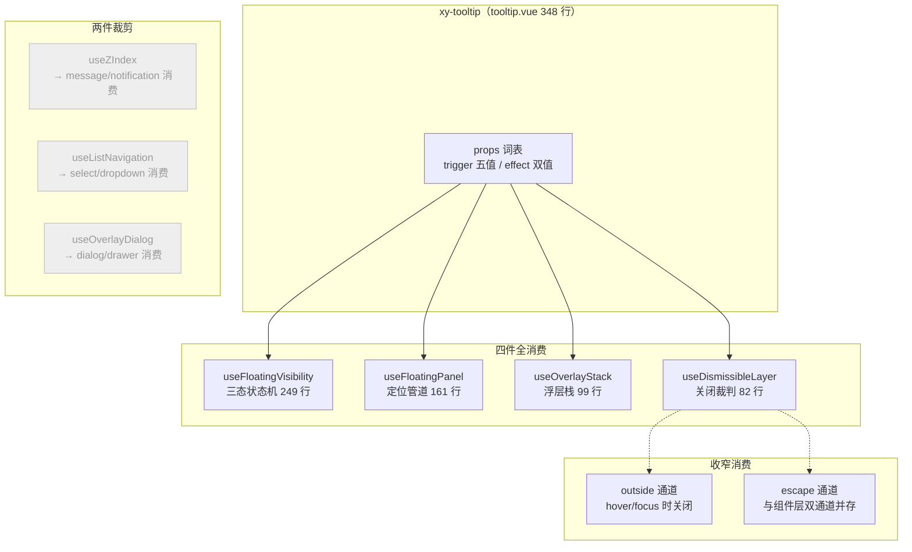
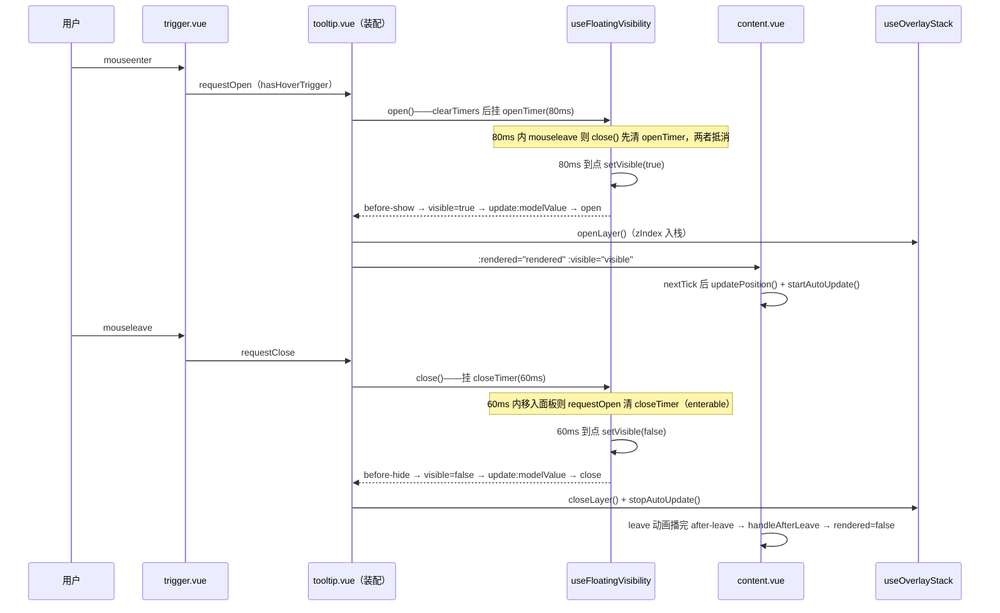
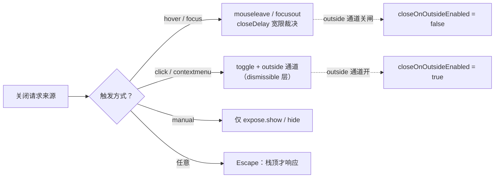

# 7-11 · Tooltip：浮层四件套最小样本

> 本篇是浮层系列从"机制卷"转入"组件卷"的第一站。4-05 拆了三态状态机与全局浮层栈，4-06 拆了定位管道与关闭语义——那两篇回答的是"积木为什么长这样"；本篇回答的是"积木怎么拼成组件"：一个最简浮层从零到完整装配需要哪几块积木、哪些积木要裁掉、裁掉的边界画在哪里。Tooltip 是全库浮层组件里体量最小的一个，却是浮层组合式函数消费矩阵最完整的一个——最小样本，完整装配。

**本篇精读源码**：

- `packages/components/tooltip/src/tooltip.vue`（348 行，装配主文件）
- `packages/components/tooltip/src/trigger.vue`（244 行，触发器子组件）
- `packages/components/tooltip/src/content.vue`（125 行，面板子组件）
- `packages/components/tooltip/src/tooltip.ts`（60 行，类型与词表）+ `src/utils.ts`（55 行）
- `packages/xiaoye-primitives/src/composables/`：`use-floating-visibility.ts`（249 行）、`use-floating-panel.ts`（161 行）、`use-dismissible-layer.ts`（82 行）、`use-overlay-stack.ts`（99 行）、`use-z-index.ts`（17 行）、`use-list-navigation.ts`（95 行）、`use-overlay-dialog.ts`（174 行）
- 样式：`packages/theme/src/components/tooltip.css`（118 行，全文件展开）
- 测试：`packages/components/tooltip/__tests__/tooltip.spec.ts`（542 行，14 个用例）
- 类型夹具：`tests/types/fixtures/tooltip.ts`（80 行）
- 文档示例：`apps/docs/examples/tooltip/`（7 个文件）

## 一、为什么最小样本是 Tooltip

7-10 的结尾预告本篇时会拆"浮层四件套"——teleport、定位、z-index 栈、触发器与内容的从属关系。那是从组件视角看的四件宏观事项。落到代码层，这四件事被实现在 `xiaoye-primitives` 的七个组合式函数里：`useFloatingVisibility`（三态状态机）、`useFloatingPanel`（定位管道）、`useDismissibleLayer`（关闭裁判）、`useOverlayStack`（浮层栈）、`useZIndex`（层级计数）、`useListNavigation`（列表导航）、`useOverlayDialog`（模态装配）。宏观四件套是这七件积木在组件层的投影。

七个组合式函数，Tooltip 只消费其中四个、半消费一个、裁剪两个——但就是这"四全一半两裁剪"，已经把浮层装配的所有关键决策点都摆到了台面上。全库的浮层家族里，没有比它更合适的解剖样本：

- **它最小，所以装配的"必要性"看得最清**。popover（268 行）、dropdown（667 行）都比它大，但它们多出来的行数是业务特性（popover 的富内容面板、dropdown 的菜单项体系），不是浮层装配本身。tooltip 的 348 行几乎每一行都在回答"一个浮层要成立还需要什么"。
- **它最"轻"，所以每个裁剪决策都有对照**。它不开遮罩、不锁滚动、没有可导航列表——这三个"没有"恰好对应 `useOverlayDialog`、`useZIndex`、`useListNavigation` 三件被裁剪的积木。裁剪的理由比消费的理由更能说明架构。
- **它是唯一一个 hover 触发默认打开的浮层**。hover 语义带来的延迟对（show-after/hide-after）、enterable（鼠标移入面板不关闭）、焦点跟随（focus 也能开）——这些是 click 型浮层（popover 默认 click 触发）遇不到的时序问题，tooltip 全都要解。

三个文件的角色分工也值得先画出来。`tooltip.vue` 是装配体：接 props、调四个组合式函数、做裁决；`trigger.vue` 是触发器子组件：把 DOM 事件归一化成三个语义请求；`content.vue` 是面板子组件：只管渲染，不管状态。父子之间靠一个 props-down、events-up 的协议通信，谁也不越界。

## 二、装配总览：七件套消费矩阵

先上全景。下图是 Tooltip 对七个浮层组合式函数的消费矩阵——实线是完整消费，虚线是收窄消费（用了但关掉一部分通道），灰色是没有接线的：



逐件过一遍这张矩阵，重点是"为什么"：

**全消费四件。** `useFloatingVisibility` 管 visible/rendered/isAnimating 三态与开关请求（`tooltip.vue:92-119` 接线）；`useFloatingPanel` 管 floating-ui 定位、箭头坐标与 autoUpdate 订阅（`tooltip.vue:121-132` 接线）；`useOverlayStack` 管 z 序分配与栈顶判定（`tooltip.vue:67` 解构出 `zIndex / isTopMost / openLayer / closeLayer`）；`useDismissibleLayer` 管外部点击与 Escape 两个 document 级关闭通道（`tooltip.vue:267-276` 接线）。

**收窄一件。** `useDismissibleLayer` 的 outside 通道被 `closeOnOutsideEnabled`（`tooltip.vue:74-80`）主动关闸：hover/focus 触发时外部点击不关闭。这是 4-06 第 5.4 节讲过的"通道收窄"，本篇第六节从装配视角再拆一次它的裁决链。

**裁剪两件（三处）。** `useZIndex` 是最朴素的递增计数（`use-z-index.ts:5-17`，基值 2000 + seed），全库只有 message 和 notification 在用——命令式消息没有关闭语义、没有栈顶判定，要的只是一个"每次都比上一次高"的数字，为它们引入 99 行的浮层栈是杀鸡用牛刀。tooltip 反过来：它有关闭语义、要参与"最上层才响应 ESC"的仲裁，所以接的是 `useOverlayStack` 的动态 z 序，`useZIndex` 一行都没碰。`useListNavigation` 是方向键在列表项之间移动激活态的通用逻辑（`use-list-navigation.ts:11-95`），消费方是 select、dropdown、auto-complete、time-select——tooltip 的面板是一段静态文本或一小块内容，没有"项"可导航。`useOverlayDialog` 是模态装配层（遮罩显隐、锁滚动、destroyOnClose 回收，`use-overlay-dialog.ts:42-174`），消费方是 dialog 和 drawer；tooltip 是非模态浮层的极端——连遮罩的"没有"都算不上，根本不在同一语义层。

这张矩阵还藏着一条设计暗线：**裁剪三件的都是"组件语义"积木，消费四件的都是"浮层物理"积木**。状态、定位、z 序、关闭是任何浮层都绕不开的物理属性，所以四件全消费；列表导航、模态遮罩、朴素计数是特定组件形态的语义附加，tooltip 一样都没有。组合式函数库的分层在这里兑现了价值——`xiaoye-primitives` 提供"物理"，组件层选择"要哪些物理"。

## 三、状态机接线与延迟对：双计时器的裁决

### 3.1 接线全景

装配体对状态机的接线在 `tooltip.vue:92-119`，这 28 行是全篇的枢纽，值得整段读：

```ts
// packages/components/tooltip/src/tooltip.vue:92-119
const { visible, rendered, open, close, toggle, clearTimers, handleAfterLeave } =
  useFloatingVisibility({
    modelValue: () => props.modelValue,
    disabled: () => props.disabled,
    persistent: () => props.persistent,
    openDelay: () => props.showAfter ?? props.openDelay,
    closeDelay: () => props.hideAfter ?? props.closeDelay,
    immediateExternal: true,
    isLeaveAnimating: () => readFloatingAnimationDuration(contentRef.value) > 0,
    beforeOpen: () => {
      emit("before-show");
    },
    beforeClose: () => {
      emit("before-hide");
    },
    emitModelValue: (value) => {
      emit("update:modelValue", value);
    },
    onOpen: () => {
      emit("open");
      openLayer();
    },
    onClose: () => {
      emit("close");
      closeLayer();
      stopAutoUpdate();
    }
  });
```

九个回调槽位，本篇只展开三处此前没细讲的：延迟对的别名裁决（第 97-98 行）、`immediateExternal` 的取舍（第 99 行）、栈操作与定位清理的挂点（第 112-118 行）。

**延迟对的别名裁决。** props 词表里同时存在 `openDelay/closeDelay` 与 `showAfter/hideAfter` 两对（`tooltip.ts:26-29`），默认值分别是 80/60 和 undefined：

```ts
// packages/components/tooltip/src/tooltip.vue:31-33（withDefaults 节选）
  openDelay: 80,
  closeDelay: 60,
  showAfter: undefined,
```

这不是冗余，是一个命名兼容层的正解形态。EP 的 API 词表里 `show-after/hide-after` 是官方名，大量存量调用方（包括 AI 生成的代码）习惯这个词表；`openDelay/closeDelay` 则是本库更早的内部命名。装配层用 `props.showAfter ?? props.openDelay` 做单点裁决（`tooltip.vue:97-98`）——别名不走独立逻辑，只是默认值之上的一个覆盖项，状态机完全不知道有两个名字。对照 4-04 讲过的受控/非受控双模，这里的纪律相同：**兼容名在装配层折叠，机制层只见单一事实源**。

**`immediateExternal: true`。** 状态机内部有两条开闭路径：内部路径（hover 等触发器发起）走 openDelay/closeDelay 延迟；外部路径（父组件改 v-model）可以绕过延迟。tooltip 把外部路径设为立即（4-05 第 348 行附近讲过这个决定：父组件改 v-model 是明确意图，不该再等 80ms hover 延迟）。对照受控用例可以验证：`tooltip.spec.ts:318-357` 里 `setProps({ modelValue: true })` 之后只等两个 nextTick 就能 emit `afterEnter`，全程没碰 fake timers——延迟确实被绕过了。

**栈操作与清理的挂点。** `openLayer` 挂在 `onOpen`（语义开的时刻入栈）、`closeLayer` 挂在 `onClose`（语义关的时刻出栈），4-05 第 649-684 行讲过这个"不是挂载时、不是动画后"的选择。本篇补一个清理侧的细节：`onClose` 里还调了 `stopAutoUpdate()`（`tooltip.vue:117`）——关闭即停掉定位订阅；组件卸载时再兜一次（`tooltip.vue:278-282` 的 `onBeforeUnmount` 里 `clearTimers()` + `stopAutoUpdate()` + `closeLayer()` 三连）。每个订阅都有唯一的、成对的清理入口，这是 4-06 第 253 行讲过的纪律在最小样本上的复刻。

### 3.2 双计时器：延迟对在状态机里的形态

延迟对进到状态机里，是两个裸计时器变量加一个互斥清理函数（`use-floating-visibility.ts:57-74`）：

```ts
// packages/xiaoye-primitives/src/composables/use-floating-visibility.ts:53-74
export function useFloatingVisibility(options: FloatingVisibilityOptions = {}) {
  const visible = ref(false);
  const rendered = ref(Boolean(toValue(options.modelValue)) || Boolean(toValue(options.persistent)));
  const isAnimating = ref(false);
  let openTimer: number | null = null;
  let closeTimer: number | null = null;

  function clearTimers() {
    if (openTimer != null) {
      if (typeof window !== "undefined") {
        window.clearTimeout(openTimer);
      }
      openTimer = null;
    }

    if (closeTimer != null) {
      if (typeof window !== "undefined") {
        window.clearTimeout(closeTimer);
      }
      closeTimer = null;
    }
  }
```

`open` 与 `close` 各自先 `clearTimers()` 再决定是立即跃迁还是挂计时器（`use-floating-visibility.ts:112-156`）：

```ts
// packages/xiaoye-primitives/src/composables/use-floating-visibility.ts:112-156
  function open(
    optionsOverride: FloatingVisibilityChangeOptions & { immediate?: boolean } = {}
  ) {
    if (toValue(options.disabled)) {
      return;
    }

    clearTimers();

    if (visible.value) {
      return;
    }

    const delay = optionsOverride.immediate ? 0 : (toValue(options.openDelay) ?? 0);

    if (delay > 0) {
      openTimer = typeof window !== "undefined"
        ? window.setTimeout(() => {
            setVisible(true, optionsOverride);
          }, delay)
        : null;
      return;
    }

    setVisible(true, optionsOverride);
  }

  function close(
    optionsOverride: FloatingVisibilityChangeOptions & { immediate?: boolean } = {}
  ) {
    clearTimers();

    const delay = optionsOverride.immediate ? 0 : (toValue(options.closeDelay) ?? 0);

    if (delay > 0) {
      closeTimer = typeof window !== "undefined"
        ? window.setTimeout(() => {
            setVisible(false, optionsOverride);
          }, delay)
        : null;
      return;
    }

    setVisible(false, optionsOverride);
  }
```

这里的权衡值得单独立一节讲——它是本篇的第一处设计权衡。

**权衡一：延迟对的双计时器为什么互斥清理，而不是各管各的。** hover 交互有一个经典竞态：鼠标移入触发器，openDelay 倒计时启动；80ms 内鼠标又移出了，此时 openTimer 还没到点，而 mouseleave 发起了 close 请求。如果 close 只是"挂一个 closeTimer 等到点关"，两个计时器会同时活着——openTimer 到点把面板打开，closeTimer 到点再把面板关掉，用户会看到一次"幽灵闪现"。所以两个方向的入口都先 `clearTimers()`：**新请求取消对面的旧请求**。快速在触发器上划过的鼠标，最终效果是 open 和 close 计时器互相抵消，面板从未显示——这正是 tooltip 该有的手感。反过来，enterable 场景里鼠标从触发器移进面板，mouseenter（面板侧 `requestOpen`）同样先清掉 closeTimer，倒计时被取消，面板保持打开。

第二个细节是 `immediate` 选项与延迟的优先级。`immediate: true` 时 delay 强制为 0（第 125、144 行）——`show()`/`hide()` 这两个 expose 方法（`tooltip.vue:158-168`）用它实现"绕过延迟的显式控制"；ESC 关闭（`tooltip.vue:198-205` 的 `hide()`）也走这条路：键盘语义没有"宽限期"，按下就关。同一个 `close` 函数承载了"延迟关"和"立即关"两种语义，靠参数而不是两个函数区分，状态机就不存在两套关闭路径。

第三个细节是 jsdom 兜底：`typeof window !== "undefined"` 的守卫让计时器在非浏览器环境退化为 `null`（直接不延迟）。测试里 `vi.useFakeTimers()` + `vi.advanceTimersByTime()` 能精确驱动这套逻辑，正是因为计时器走的是 `window.setTimeout` 这个可替换的缝。

### 3.3 hover 延迟时序：一次完整交互

把延迟对、探针、浮层栈串成一次完整的 hover 交互（默认 openDelay 80ms / closeDelay 60ms）：



这张图里有一条测试钉死的边：`tooltip.spec.ts:107-153` 的第四个用例，用 fake timers 对延迟对做了逐毫秒的断言——showAfter: 120 时，`advanceTimersByTime(100)` 面板仍隐藏，再 +20ms 才出现；hideAfter: 90 时，mouseleave 后 `advanceTimersByTime(80)` 面板还在，再 +10ms 才消失。延迟边界两侧各断言一次，这种"差一点就到点"的写法是计时器测试的标准姿势，第八节展开。

## 四、trigger 子组件：触发策略的归一化层

### 4.1 五个 DOM 事件通道归一成三个语义请求

`trigger.vue` 是一个独立的子组件，它存在的理由是**把触发策略从装配体里剥出去**。装配体只关心三种语义请求（开/关/切换），而 DOM 层的现实是五个事件通道：mouseenter/mouseleave（hover）、focusin/focusout（focus 与 hover 的焦点跟随）、click（click）、contextmenu（contextmenu）、keydown（键盘切换 + ESC）。子组件负责把五个通道翻译成三个请求：

```ts
// packages/components/tooltip/src/trigger.vue:94-159
function handleMouseenter(event: MouseEvent) {
  if (!canHandleEvents() || !hasHoverTrigger.value) {
    return;
  }

  emit("requestOpen", event);
}

function handleMouseleave(event: MouseEvent) {
  if (!canHandleEvents() || !hasHoverTrigger.value) {
    return;
  }

  emit("requestClose", event);
}

function handleFocusin(event: FocusEvent) {
  if (!canHandleEvents() || (!hasFocusTrigger.value && !hasHoverTrigger.value)) {
    return;
  }

  emit("requestOpen", event);
}

function handleFocusout(event: FocusEvent) {
  if (!canHandleEvents() || (!hasFocusTrigger.value && !hasHoverTrigger.value)) {
    return;
  }

  emit("requestClose", event);
}

function handleClick(event: MouseEvent) {
  if (!canHandleEvents() || !hasClickTrigger.value || event.button !== 0) {
    return;
  }

  emit("requestToggle", event);
}

function handleContextmenu(event: MouseEvent) {
  if (!canHandleEvents() || !hasContextmenuTrigger.value) {
    return;
  }

  event.preventDefault();
  emit("requestToggle", event);
}

function handleKeydown(event: KeyboardEvent) {
  if (event.key === "Escape") {
    emit("escape", event);
    return;
  }

  if (!canHandleEvents()) {
    return;
  }

  if (!isTooltipTriggerKeyMatched(event, props.triggerKeys)) {
    return;
  }

  event.preventDefault();
  emit("requestToggle", event);
}
```

每个 handler 的第一道闸门都是 `canHandleEvents()`（disabled 或 manual 直接返回）加上各自的触发方式匹配——注意这些匹配读的是**词表**而不是单个布尔：`hasHoverTrigger` 等 computed 对 `props.trigger` 数组做 `includes` 检查（`trigger.vue:64-67`）。词表来自 `tooltip.ts:5` 的五值常量：

```ts
// packages/components/tooltip/src/tooltip.ts:4-8
export const tooltipEffects = ["dark", "light"] as const;
export const tooltipTriggers = ["hover", "click", "focus", "contextmenu", "manual"] as const;

export type TooltipEffect = (typeof tooltipEffects)[number];
export type TooltipTrigger = (typeof tooltipTriggers)[number];
```

两个细节有考据价值。其一，`handleFocusin/Focusout` 的通道判据是 `hasFocusTrigger || hasHoverTrigger`（第 111、119 行）——**hover 型 tooltip 也响应焦点事件**。这不是抄近路：键盘用户 Tab 到一个"hover 提示"的按钮时，浏览器不会派发 mouseenter，如果焦点不跟随打开，tooltip 对键盘就是不可达的。WCAG 的 1.4.13（内容悬停）要求可悬停内容也可键盘获得，这条判据就是那个要求的代码形态。其二，click 与 contextmenu 都归到 `requestToggle` 而非 `requestOpen`——主动型触发是开关切换语义，与 hover 的"进开退关"对称结构不同。`handleClick` 还查了 `event.button !== 0`（只认左键），`handleContextmenu` 则 `preventDefault()` 阻掉浏览器原生菜单——毕竟右键的意图已经被 tooltip 征用了。

键盘通道的关键词表是 `triggerKeys`，默认 `["Enter", "NumpadEnter", "Space", " "]`（`tooltip.ts:60`），匹配函数对 Space 的 key/code 双写做了归一（`utils.ts:39-55`，`event.key === " "` 与 `event.code === "Space"` 等价）。这个"看起来重复"的词表是真实浏览器兼容性的沉淀：不同平台、不同输入法下空格键的 `key` 与 `code` 取值并不一致，双写才能保证一次按键一定命中一次。

**权衡二：trigger 为什么要独立成组件。** 最省事的做法是把这七个 handler 直接写在 `tooltip.vue` 里。拆出去付出了三个 props、五个 emits、一个包装 span 的成本，买到的是三件事。第一，**事件通道的复杂度有了隔离墙**：虚拟触发（external 元素手动 addEventListener）、aria 同步、词表匹配全在 trigger 层，装配体的 348 行里没有一个 `addEventListener`。第二，**包装 span 的 DOM 责任有了归属**：模板里那个 `ns.base.value` 的 span（`trigger.vue:229-244`）是 hover 事件的挂载面，也是 `ariaTargetElement` 的解析起点——它取 `firstElementChild`（第 54-63 行），让 `aria-describedby` 挂到真实的按钮上而不是包装层上，屏幕阅读器才能正确建立关联。第三，**子组件边界就是测试边界**：spec 里大量用例直接 `.trigger("mouseenter"/"keydown")` 打在 `.xy-tooltip` 类上，走的正是子组件暴露的事件面——归一化层的契约被测试从外面钉住，装配体内部怎么重构都不破坏触发语义。

### 4.2 虚拟触发与 aria 同步

虚拟触发是 EP 词表里的 `virtual-triggering` + `virtual-ref`：触发元素不是组件的子内容，而是外部任意元素（表格单元格、canvas 上的区域）。此时包装 span 会被 `v-if="!props.virtualTriggering || $slots.default"` 跳过，七个 handler 换成手动挂监听：

```ts
// packages/components/tooltip/src/trigger.vue:161-204
function addVirtualListeners(element: HTMLElement | null) {
  if (!props.virtualTriggering || !element) {
    return;
  }

  element.addEventListener("mouseenter", handleMouseenter);
  element.addEventListener("mouseleave", handleMouseleave);
  element.addEventListener("focusin", handleFocusin);
  element.addEventListener("focusout", handleFocusout);
  element.addEventListener("click", handleClick);
  element.addEventListener("contextmenu", handleContextmenu);
  element.addEventListener("keydown", handleKeydown);
}

function removeVirtualListeners(element: HTMLElement | null) {
  if (!element) {
    return;
  }

  element.removeEventListener("mouseenter", handleMouseenter);
  element.removeEventListener("mouseleave", handleMouseleave);
  element.removeEventListener("focusin", handleFocusin);
  element.removeEventListener("focusout", handleFocusout);
  element.removeEventListener("click", handleClick);
  element.removeEventListener("contextmenu", handleContextmenu);
  element.removeEventListener("keydown", handleKeydown);
}

watch(
  referenceElement,
  (value, previousValue) => {
    emitReferenceChange();

    if (!props.virtualTriggering) {
      return;
    }

    removeVirtualListeners(previousValue ?? null);
    addVirtualListeners(value ?? null);
  },
  {
    immediate: true
  }
);
```

七个事件两份名单（挂/卸严格对称），referenceElement 变化时先卸旧的再挂新的——`virtualRef` 是可以被外部动态换掉的，监听必须跟着换。这个 watch 同时做第三件事：`emitReferenceChange()` 把解析后的定位基准元素上报给装配体（`tooltip.vue:89-91` 的 `referenceRef` computed 以它为源），4-06 第 251 行讲过"tooltip 比 dropdown 多监听一个 referenceRef"的原因就在这。

aria 同步是另一个 watch 链（`trigger.vue:206-221`）：`syncAria` 在 open 状态变化、目标元素变化时维护 `aria-describedby`（第 73-88 行——旧目标先移除属性，新目标在 open 且有 contentId 时设置）。contentId 是装配体生成的随机 id（`tooltip.vue:71` 的 `xy-tooltip-${Math.random()...}`），同一份 id 同时给了 content 面板的 `:id`（`tooltip.vue:313`）——描述关系靠这个 id 串起来。测试 `tooltip.spec.ts:441-468` 用虚拟触发场景断言了 `virtualTrigger.getAttribute("aria-describedby")` 等于面板 id，这条无障碍链路是被测试钉住的契约，不是文档里的姿态。

## 五、content 子组件：三态正交的消费端样本

### 5.1 rendered 与 visible 的双层控制

content.vue 的模板是 4-05 "三态正交"承诺的消费端兑现，整段 41 行全读：

```html
<!-- packages/components/tooltip/src/content.vue:84-124 -->
<template>
  <teleport :to="props.appendTo" :disabled="!props.teleported">
    <transition
      :name="props.transition"
      @after-enter="emit('afterEnter')"
      @after-leave="emit('afterLeave')"
    >
      <div
        v-if="props.rendered"
        v-show="props.visible"
        :id="props.id"
        ref="contentElementRef"
        role="tooltip"
        :aria-hidden="!props.visible"
        :aria-label="props.ariaLabel"
        :data-placement="props.actualPlacement"
        :class="[
          `${ns.base.value}__content`,
          `${ns.base.value}__content--${props.effect}`,
          `${ns.base.value}__content--${placementSide}`,
          props.popperClass
        ]"
        :style="[props.floatingStyle, maxWidthStyle, props.popperStyle]"
        @mouseenter="emit('requestOpen', $event)"
        @mouseleave="emit('requestClose', $event)"
        @keydown="emit('keydown', $event)"
        @focusout="emit('focusout', $event)"
      >
        <span
          v-if="props.showArrow"
          ref="arrowElementRef"
          :class="['xy-popper__arrow', `${ns.base.value}__arrow`]"
          :style="props.arrowStyle"
        />
        <slot name="content">
          <!-- eslint-disable-next-line vue/no-v-html -->
          <span v-if="props.rawContent" v-html="props.content" />
          <template v-else>{{ props.content }}</template>
        </slot>
      </div>
    </transition>
  </teleport>
</template>
```

第 91-92 行的 `v-if="props.rendered"` + `v-show="props.visible"` 是全篇最重要的一对模板属性。4-05 用大量篇幅论证了 visible（用户看得见吗）与 rendered（DOM 挂着吗）为什么必须正交：卸载早了离开动画没地方播，全量常驻又浪费 DOM。这一对绑定就是结论落地的地方——`rendered=true, visible=false` 的窗口期里，DOM 存活、透明度为零、leave 动画正在播；动画播完 `after-leave` 冒回装配体（`tooltip.vue:336` 的 `@after-leave="handleTooltipAfterLeave"`），`handleAfterLeave` 在非 persistent 且已关闭时把 rendered 收归 false（`use-floating-visibility.ts:179-184`），DOM 才真正卸载。三态的完整生命周期闭环，在这一对绑定上从"机制"变成了"像素"。

`aria-hidden="!props.visible"` 是同一正交性的第二个消费点：DOM 还在（rendered=true）但不可见（visible=false）的窗口期里，面板对辅助技术必须同步"消失"——aria-hidden 与 v-show 同源，辅助技术的世界和视觉世界不会出现两套真相。

面板侧的四个事件（第 106-109 行）是装配体第 331-334 行绑定的上游：mouseenter/mouseleave 服务 enterable（鼠标移进面板时维持打开），keydown 透传给 Escape 裁决，focusout 透传给组件层的焦点通道——第六节展开。

### 5.2 双轨内容与 transformOrigin

内容的双轨在第 117-121 行：`#content` 插槽优先，没有插槽时按 `rawContent` 决定 `v-html` 或纯文本。注意装配体在 `tooltip.vue:340-346` 给这个插槽塞了一份**同构的兜底实现**——插槽为空时装配体先用自己的 `props.rawContent` 逻辑渲染，插槽有内容则整体接管。测试 `tooltip.spec.ts:396-417` 钉住了优先级：rawContent 为 true 且插槽有内容时，渲染的是插槽内容，`.raw-content` 节点不存在。`v-html` 上方那行 eslint 禁用注释是显式的安全决策：rawContent 是调用方明示的 HTML 通道，不是疏忽。

还有一个一行的小细节在装配体的绑定上（`tooltip.vue:319`）：

```ts
:floating-style="[floatingStyle, props.showArrow ? undefined : { transformOrigin: 'center' }]"
```

带箭头时，transformOrigin 由定位系统按 placement 推到箭头根部（动画从箭头方向长出来）；关闭箭头时没有参照物，就退化为面板中心缩放。一行三元表达式，把"动画的视觉锚点跟随箭头存在与否"这件事说完了——这类细节不决定功能，决定的是质感。

## 六、定位缝合与关闭通道收窄

### 6.1 定位订阅的五拍节奏

装配体对定位管道的接线是 4-06 第 235-253 行讲过的"五拍节奏"，原文引用过的这段（`tooltip.vue:255-265`）在装配语境下还多了两个信息：

```ts
// packages/components/tooltip/src/tooltip.vue:255-265
watch([visible, referenceRef], async ([value]) => {
  stopAutoUpdate();

  if (!value) {
    return;
  }

  await nextTick();
  await updatePosition();
  startAutoUpdate();
});
```

第一，这个 watch 是**双源**的：`visible` 翻 true 时走"nextTick → 首算 → 订阅"；`referenceRef` 变化时（虚拟触发的 `virtualRef` 被换掉）同样整体重算——因为定位基准换了，旧的 autoUpdate 订阅作废。第二，关闭态只有 `stopAutoUpdate()` 没有别的——定位清理在关闭回调（第 117 行）和这里双写，成对纪律的容错。第三，`updatePosition()` 是 await 的：首帧位置必须在面板可见的第一刻就正确，否则用户会看到面板从屏幕角落飞过来。第三拍 `nextTick` 等的就是 content 的 DOM 真正挂上（v-if 刚翻 true 的那一帧 ref 还没绑定）。

z 序的来源链也在这段里：`useOverlayStack` 分配的 `zIndex.value` 进 `normalizedPopperOptions`（`tooltip.vue:83` 的 `props.popperOptions?.zIndex ?? zIndex.value`），再被 `useFloatingPanel` 写进 `floatingStyle.zIndex`（`use-floating-panel.ts:118-123`，裸用兜底 2000 与栈计数器起点同域——4-06 第 172 行讲过的"没接浮层栈时的保底"）。调用方可以通过 `popperOptions.zIndex` 显式压过栈分配值，这是类型层的逃生口（`tests/types/fixtures/tooltip.ts:13-20` 的夹具里 `zIndex: 4096` 正是走这条通道的样例）。

### 6.2 通道收窄：关闭权归还给同构通道

第二处（也是 4-06 预告过要展开的）权衡：装配体对外部点击通道的收窄判定（`tooltip.vue:74-80`）：

```ts
// packages/components/tooltip/src/tooltip.vue:74-80
const closeOnOutsideEnabled = computed(() => {
  if (!props.closeOnOutside || isManualTrigger.value) {
    return false;
  }

  return !normalizedTriggers.value.some((trigger) => trigger === "hover" || trigger === "focus");
});
```

翻译成规则：只有 `closeOnOutside` 显式为 true、非 manual、且触发方式**不含** hover 或 focus 时，外部点击通道才开。hover/focus 型 tooltip 的关闭完全交给 mouseleave/focusout 的延迟机制，外部点击不参与。理由在 4-06 第 605 行已经说过一半（"外部是错位概念"），装配视角再补一刀：**这不是一个关闭通道的开关问题，是两个关闭源会不会打架的问题**。hover 语义下用户把鼠标移开，closeDelay 倒计时已经启动；这时用户点击页面空白处，如果 outside 通道也开着，两条关闭路径同时生效——一条是宽限性的（60ms 后关），一条是立即性的（mousedown 就关）。立即路径总是赢，宽限期形同虚设；而宽限期存在的意义恰恰是"给用户把鼠标移回面板的机会"。focus 语义同理：focusout 已由焦点流向裁决，外部点击引发的焦点转移会让两个机制重复触发。**通道收窄不是功能缺失，而是把关闭权归还给与触发方式同构的那条通道**——click/contextmenu 型是主动打开的，没有天然的"退开"语义，outside 才补位。



注意收窄判据读的是 `normalizedTriggers` 数组——`trigger: ["hover", "click"]` 组合时，只要含 hover，outside 通道就整体关闸。这是从语义出发的保守裁决：组合触发里只要存在"退开即关"的通道，外部点击就退位。

### 6.3 组件层私有通道：focusout 的延迟裁决

focusout 关闭不进 dismissible 层（4-06 第 399 行的考据：那 82 行只裁 outside 与 Escape 两件事），它是 tooltip 组件层的私有通道，由两段代码合龙。上游是 trigger 层的 `handleFocusout`（`trigger.vue:118-124`，第四节已读）——焦点离开触发器时发 `requestClose`；下游是装配体的 `handleContentFocusout`（`tooltip.vue:223-236`），接的是 content 面板侧的 focusout 透传：

```ts
// packages/components/tooltip/src/tooltip.vue:223-236
function handleContentFocusout(event: FocusEvent) {
  if (
    !includesTooltipTrigger(normalizedTriggers.value, "focus") &&
    !includesTooltipTrigger(normalizedTriggers.value, "hover")
  ) {
    return;
  }

  if (isFocusInsideContent(event) || isFocusInsideTrigger(event)) {
    return;
  }

  handleRequestedClose(event);
}
```

裁决的核心是 `isFocusInsideContent / isFocusInsideTrigger`（`tooltip.vue:134-156`）：读 `event.relatedTarget`（焦点迁移的目标），退化到 `document.activeElement`，用 `contains` 判断落点是否还在面板或触发器里——还在里面就不关（焦点在面板内部移动，比如 Tab 到面板里的链接），真正离开才放行 close。放行后的 close 仍走 closeDelay 倒计时：**tooltip 的"延迟裁决"不是 4-07 焦点陷阱那种 setTimeout(0) 微任务级裁决，而是业务级的 closeDelay 宽限**。两者的分工值得对照：焦点陷阱的 setTimeout(0) 解决的是"focusout 触发瞬间浏览器焦点迁移尚未落定"的原子性问题，裁决窗口是一个宏任务；tooltip 的焦点检查同样是即时的（relatedTarget 在 focusout 事件里已经可用），但它把"用户还想回来"的宽容做进了 closeDelay 的 60ms——宏任务级裁决管"事实"，业务延迟管"意图"。若焦点快速迁移导致 relatedTarget 暂时为空，closeDelay 的宽限恰好覆盖了这段过渡态，第二次焦点事件（比如 focusin 到新位置、或移回面板的 requestOpen）会先清掉计时器。两条时间尺度各司其职，不互相替代。

最后是 ESC 的双通道并存。组件层：trigger 的 handleKeydown 捕获 Escape 发 `escape` 事件（`trigger.vue:143-147`），content 的 keydown 也透传（`content.vue:108`），两路都汇到 `handleEscape`（`tooltip.vue:198-205`）——先判 `isTopMost()`，不是栈顶直接返回；document 层：dismissible 的 keydown 通道（`use-dismissible-layer.ts:42-53`）同样先判栈顶。同一个 keydown 会先命中组件层（事件在 target 上先于 document 冒泡），`hide()` 立即同步把 visible 翻 false；事件继续冒到 document 时，dismissible 读 `enabled: () => visible.value && ...` 已经是 false，直接返回。**双通道并存而不双响应，靠的是冒泡顺序加同步翻转**——不需要去重代码，时序本身就是去重器。这也是 4-06 第 492 行"一次用户动作只让最上层的浮层响应"的完整形态：栈顶仲裁两处都在，同步翻转保证只执行一次。

## 七、样式全文件：118 行的变量解析链

tooltip.css 是全库浮层样式里最短的一份，118 行全文件值得通读——它是"effect 词表 → CSS 变量 → color-mix 派生"这条链的最小闭环。先看基类与内容壳：

```css
/* packages/theme/src/components/tooltip.css:1-11 */
.xy-tooltip {
  display: inline-flex;
  max-width: 100%;
}

.xy-tooltip:focus-visible,
.xy-tooltip > :focus-visible {
  outline: 2px solid color-mix(in srgb, var(--xy-brand) 58%, var(--xy-mix-light));
  outline-offset: 2px;
  box-shadow: 0 0 0 1px color-mix(in srgb, var(--xy-brand) 12%, transparent);
}

/* packages/theme/src/components/tooltip.css:13-53 */
.xy-tooltip__content {
  --xy-tooltip-bg-resolved: var(
    --xy-tooltip-bg,
    var(
      --xy-popper-bg,
      var(--xy-dialog-bg, color-mix(in srgb, var(--xy-bg-floating) 96%, var(--xy-bg-subtle)))
    )
  );
  --xy-tooltip-text-resolved: var(
    --xy-tooltip-text,
    var(--xy-popper-text-color, var(--xy-text-secondary))
  );
  --xy-tooltip-border-resolved: var(
    --xy-tooltip-border,
    var(
      --xy-popper-border-color,
      color-mix(in srgb, var(--xy-border-subtle) 84%, var(--xy-border))
    )
  );
  --xy-tooltip-shadow-resolved: var(
    --xy-tooltip-shadow,
    var(
      --xy-popper-shadow,
      0 0 0 1px color-mix(in srgb, var(--xy-bg-floating) 6%, transparent),
      0 8px 20px color-mix(in srgb, var(--xy-text-heading) 7%, transparent)
    )
  );
  position: absolute;
  max-width: 240px;
  padding: 6px 10px;
  border-radius: var(--xy-radius-md);
  border: 1px solid var(--xy-tooltip-border-resolved);
  background: var(--xy-tooltip-bg-resolved);
  color: var(--xy-tooltip-text-resolved);
  font-size: var(--xy-font-size-sm);
  line-height: 1.45;
  box-shadow: var(--xy-tooltip-shadow-resolved);
  pointer-events: auto;
  white-space: normal;
  word-break: break-word;
}
```

变量解析是三级回退链：组件级（`--xy-tooltip-bg`）→ 浮层家族级（`--xy-popper-bg`）→ 默认派生值。这个结构就是文档示例 `popper-class.vue` 的工作原理——示例里 `popperClass="tooltip-admin-surface"` 配一段 `:global` 样式只覆写 `--xy-tooltip-bg` 等四个组件级变量（`apps/docs/examples/tooltip/popper-class.vue:13-24`），面板的配色整体换掉，其余布局规则一概不动。**实例级样式收口靠变量而不是 deep 选择器**，这是 3-01 令牌纪律在组件样式层的直接体现：组件消费语义层与刻度层（`--xy-bg-floating`、`--xy-radius-md`、`--xy-font-size-sm`），自身只暴露一层实例级变量，家族级变量留给 popover/dropdown 等同构浮层统一覆写。

dark / light 两个 effect 各自只是四个变量的覆写：

```css
/* packages/theme/src/components/tooltip.css:55-72 */
.xy-tooltip__content--dark {
  --xy-tooltip-bg: color-mix(in srgb, var(--xy-bg-floating) 78%, var(--xy-text-heading));
  --xy-tooltip-text: color-mix(in srgb, var(--xy-bg-floating) 82%, var(--xy-mix-light));
  --xy-tooltip-border: color-mix(in srgb, var(--xy-bg-floating) 12%, transparent);
  --xy-tooltip-shadow:
    0 0 0 1px color-mix(in srgb, var(--xy-bg-container) 4%, transparent),
    0 8px 18px color-mix(in srgb, var(--xy-text-heading) 10%, transparent);
}

.xy-tooltip__content--light {
  --xy-tooltip-bg: color-mix(in srgb, var(--xy-bg-floating) 96%, var(--xy-bg-subtle));
  --xy-tooltip-text: var(--xy-text-secondary);
  --xy-tooltip-border: color-mix(
    in srgb,
    var(--xy-border-subtle) 84%,
    var(--xy-border)
  );
}
```

effect 的实现成本被变量化压到最低：模板里 `__content--${effect}` 的类名（`content.vue:101`）切一份变量表，背景、文字、边框、阴影四路同时换，暗色主题下同一份派生公式自动成立——dark 的背景是浮层底色向标题文字色混 78%（深色化），light 则向 subtle 混 96%（近乎原底）。没有一行 `.dark` 前缀覆写，双主题免费。

箭头是纯 CSS 边框三角形，四向各裁两条边：

```css
/* packages/theme/src/components/tooltip.css:74-105 */
.xy-tooltip__content > .xy-popper__arrow::before {
  background: var(--xy-tooltip-bg-resolved);
  border-color: var(--xy-tooltip-border-resolved);
}

.xy-tooltip__content--dark > .xy-popper__arrow::before {
  border-color: transparent;
}

.xy-tooltip__content[data-placement^="bottom"] > .xy-popper__arrow::before {
  border-right-color: transparent;
  border-bottom-color: transparent;
  border-top-left-radius: 2px;
}

.xy-tooltip__content[data-placement^="top"] > .xy-popper__arrow::before {
  border-left-color: transparent;
  border-top-color: transparent;
  border-bottom-right-radius: 2px;
}

.xy-tooltip__content[data-placement^="left"] > .xy-popper__arrow::before {
  border-left-color: transparent;
  border-bottom-color: transparent;
  border-top-right-radius: 2px;
}

.xy-tooltip__content[data-placement^="right"] > .xy-popper__arrow::before {
  border-top-color: transparent;
  border-right-color: transparent;
  border-bottom-left-radius: 2px;
}
```

`data-placement` 属性是定位管道写进 DOM 的（`content.vue:98`），CSS 用 `^=` 前缀匹配把 `top`/`top-start`/`top-end` 一并覆盖——**JS 算出来的 placement 是样式系统的输入**，这是 4-06 定位管道与样式层的接缝。dark 箭头边框透明（深底上的描边会显脏），其余继承内容壳变量。箭头坐标（`left/top` 与 `staticSide: -5px`）来自 `useFloatingPanel` 的 `arrowStyle`（`use-floating-panel.ts:101-116`），`xy-popper__arrow` 家族类提供箭头的公共几何。

最后是 4-05/5-13/7-04 三篇都引过的动画段——`xy-fade` 的家就在这里：

```css
/* packages/theme/src/components/tooltip.css:107-118 */
.xy-fade-enter-active,
.xy-fade-leave-active {
  transition:
    opacity var(--xy-transition-duration-fast) var(--xy-transition-timing),
    transform var(--xy-transition-duration-fast) var(--xy-transition-timing);
}

.xy-fade-enter-from,
.xy-fade-leave-to {
  opacity: 0;
  transform: translateY(4px);
}
```

透明度加 4px 上移，快时长刻度——popper 系浮层的公共进出场语言，dropdown、popover、backtop 都来共用（7-04 第 486 行引过）。别忘了一个跨篇的呼应：`readFloatingAnimationDuration` 探针读的 `transitionDuration` 正是这段规则生效后的计算值（4-05 第 787 行），CSS 是动画事实的唯一来源，toggle 防抖的探针只是去读它。

## 八、测试全貌：542 行钉住了什么

`tooltip.spec.ts` 共 14 个用例，按契约分组看。第一组是触发与关闭语义，第一个用例把"hover 默认带焦点跟随 + ESC 关闭"钉在一起（`tooltip.spec.ts:29-56`）：

```ts
// packages/components/tooltip/__tests__/tooltip.spec.ts:29-56
  it("默认 hover 也支持 focus 打开，并可通过 Escape 关闭", async () => {
    document.body.innerHTML = "";
    vi.useFakeTimers();

    const wrapper = mount(XyTooltip, {
      attachTo: document.body,
      props: {
        content: "提示信息"
      },
      slots: {
        default: "<button class='trigger'>查看提示</button>"
      }
    });

    await wrapper.find(".trigger").trigger("focusin");
    vi.runAllTimers();
    await nextTick();

    expect(getTooltip()).not.toBeNull();

    await wrapper.find(".xy-tooltip").trigger("keydown", {
      key: "Escape"
    });
    await nextTick();

    expectTooltipHidden();
    vi.useRealTimers();
  });
```

注意断言的对象不是组件实例而是 `document.body` 上 `[role="tooltip"]` 的真实 DOM（第 8-10 行的 `getTooltip`）——teleport 之后组件树里根本查不到面板，测试必须跟着 DOM 的真实位置走。第二个用例是 4-06 引过的外部点击关闭（`tooltip.spec.ts:58-81`）：click 触发打开后 `document.body.dispatchEvent(new MouseEvent("mousedown"))`，断言面板隐藏——它同时是无声的收窄对照：这个用例能用恰恰因为 click 型 tooltip 的 outside 通道是开的；hover 型的同类场景在测试里不存在，因为那条通道被 74-80 行关了，"没有测试"本身就是裁决的记录。

第二组是延迟对的毫秒级断言（`tooltip.spec.ts:107-153`）：

```ts
// packages/components/tooltip/__tests__/tooltip.spec.ts:107-153
  it("支持 appendTo、persistent、showAfter/hideAfter 与样式透传", async () => {
    document.body.innerHTML = `<div id="tooltip-target"></div>`;
    vi.useFakeTimers();
    const target = document.getElementById("tooltip-target") as HTMLDivElement;

    const wrapper = mount(XyTooltip, {
      attachTo: document.body,
      props: {
        content: "延迟提示",
        appendTo: "#tooltip-target",
        persistent: true,
        showAfter: 120,
        hideAfter: 90,
        popperClass: "custom-tooltip",
        popperStyle: {
          width: "280px"
        }
      },
      slots: {
        default: "<button class='trigger'>悬停</button>"
      }
    });

    await wrapper.find(".xy-tooltip").trigger("mouseenter");
    vi.advanceTimersByTime(100);
    await nextTick();
    expectTooltipHidden(target);

    vi.advanceTimersByTime(20);
    await nextTick();

    const tooltip = document.querySelector("#tooltip-target [role='tooltip']") as HTMLElement | null;
    expect(tooltip).not.toBeNull();
    expect(tooltip?.classList.contains("custom-tooltip")).toBe(true);
    expect(tooltip?.style.width).toBe("280px");

    await wrapper.find(".xy-tooltip").trigger("mouseleave");
    vi.advanceTimersByTime(80);
    await nextTick();
    expect(tooltip?.style.display).not.toBe("none");

    vi.advanceTimersByTime(10);
    await nextTick();
    expect(tooltip?.style.display).toBe("none");

    vi.useRealTimers();
  });
```

一个用例四件事：appendTo 指定挂载目标（面板要在 `#tooltip-target` 里找到，而不是 body）、persistent 常驻（DOM 不卸载，断言 `display` 而不是节点存在性）、延迟对两侧边界（100ms 未开/+20ms 开；80ms 未关/+10ms 关）、样式透传（popperClass 与 popperStyle 落到面板上）。fake timers 把 3.2 节的双计时器逻辑推到毫秒级验证。

第三组是受控语义与事件序（`tooltip.spec.ts:318-357`）：

```ts
// packages/components/tooltip/__tests__/tooltip.spec.ts:318-357
  it("受控变更不会重复派发 update:modelValue，并会补齐 before/show/hide 生命周期", async () => {
    document.body.innerHTML = "";

    const wrapper = mount(XyTooltip, {
      attachTo: document.body,
      props: {
        modelValue: false,
        trigger: "click",
        content: "受控提示"
      },
      slots: {
        default: "<button class='trigger'>受控</button>"
      }
    });

    await wrapper.setProps({
      modelValue: true
    });
    await nextTick();
    await nextTick();
    wrapper.getComponent({ name: "XyTooltipContent" }).vm.$emit("afterEnter");
    await nextTick();

    expect(wrapper.emitted("update:modelValue")).toBeUndefined();
    expect(wrapper.emitted("before-show")).toHaveLength(1);
    expect(wrapper.emitted("open")).toHaveLength(1);
    expect(wrapper.emitted("show")).toHaveLength(1);

    await wrapper.setProps({
      modelValue: false
    });
    await nextTick();
    await nextTick();
    wrapper.getComponent({ name: "XyTooltipContent" }).vm.$emit("afterLeave");
    await nextTick();

    expect(wrapper.emitted("before-hide")).toHaveLength(1);
    expect(wrapper.emitted("close")).toHaveLength(1);
    expect(wrapper.emitted("hide")).toHaveLength(1);
  });
```

`emitted("update:modelValue")).toBeUndefined()` 断言的是状态机 watch 的 `emitModelValue: false` 防回声（4-05 第 349 行）：外部改 modelValue，状态机内部消化，不再往回 emit。事件序列用例（`tooltip.spec.ts:359-394`）进一步钉死 `["before-show", "update", "open", "show"]` 与 `["before-hide", "update", "close", "hide"]` 的完整次序——这套七事件协议（`tooltip.vue:57-65`）是消费方编排动画和副作用依赖的契约，次序错了下游全错。

第四组是 manual 模式、trigger 数组、键盘词表与虚拟触发。manual 用例（`tooltip.spec.ts:286-316`）验证 mouseenter 不打开但 `exposed.show()` 可控——manual 把开闭权完全收归调用方，收窄判定里的 `!isManualTrigger` 就是它的影子。数组组合用例（`tooltip.spec.ts:200-225`）验证 `["hover", "click"]` 时 hover 打开、click 切换关闭——两个通道各走各的 handler。虚拟触发用例（`tooltip.spec.ts:441-468`）在 body 上造一个 button，`mouseenter` 派发后断言面板打开且 `aria-describedby` 同步——4.2 节那条无障碍契约的测试面。定位用例（`tooltip.spec.ts:470-541`）则 mock 了视口尺寸与 getBoundingClientRect，验证 `strategy: "absolute"` 透传与 `fallbackPlacements` 翻转后 `dataset.placement` 落在备选序列内——4-06 定位管道的组件侧回声。

## 九、EP 对比：词表、延迟与层级治理

以 Element Plus 的 `ElTooltip` 为参照，四处结构性差异：

1. **触发词表的宽度与键盘参数。** EP 的 trigger 词表是 hover/focus/click/contextmenu，本库多了 manual（manual 在 EP 里对应的是受控 `visible` 的用法而非触发词表的一员），并支持 trigger 数组组合。更关键的是 `triggerKeys`：EP 没有键盘触发键位参数，本库把"哪些键能切换"做成可配词表（默认 Enter/NumpadEnter/Space），且对 Space 的 key/code 差异做了归一——AI 协作研发场景下，键盘可达性应该是开箱即用的默认值，而不是留给调用方补的作业。

2. **延迟对的默认值哲学。** EP 的 show-after/hide-after 默认 0（悬停即显、移出即隐）；本库默认 80/60（`tooltip.vue:31-32`），并把 show-after/hide-after 作为别名兼容。零延迟对浏览器是灾难性的——鼠标扫过一排按钮会触发一连串面板闪现。非零默认值是把"防抖"做进组件而不是做进调用方，代价是与 EP 直觉不同（从 EP 迁移来的调用方会感到"慢半拍"），收益是默认体验就是对的。双词表并存 + 单点裁决让两个世界的调用方都能各说各话。

3. **层级治理：计数器 vs 浮层栈。** EP 的面板 z-index 走 `useZIndex` 式的递增计数（初始值 + 每次打开 +1）；本库 tooltip 消费的是 `useOverlayStack` 的动态 z 序 + 栈顶判定（`tooltip.vue:67`）。差异在"栈顶"这个概念：EP 里 ESC 关谁靠各组件自己判断可见性，本库里 `isTopMost()` 是仲裁依据——select 下拉上悬着 tooltip 时按 ESC，只有最上面的关（4-06 第 492 行的推演）。递增计数解决"盖得住"，浮层栈额外解决"谁该响应"，非模态浮层与模态浮层共享同一个栈，z 序在全库范围内单调。

4. **装配的暴露面。** EP 的 tooltip 实例方法只有 `focus/blur` 转发；本库 `defineExpose` 了 `show/hide/updatePopper/isFocusInsideContent` 与两颗 ref（`tooltip.vue:284-291`，类型在 `tooltip.ts:51-58`）。`updatePopper` 是定位管道的手动逃生口（定位用例第 536 行就在用它触发重算），`isFocusInsideContent` 把焦点裁决的判据也暴露成公共能力——虚拟触发场景里调用方经常需要"焦点还在不在面板里"来做自己的关闭决策。装配体的边界在哪，expose 就到哪。

一句话总结：EP 给出"tooltip 的标准行为面"，本库在同一行为面上补齐**通道收窄的显式裁决（closeOnOutsideEnabled）、延迟对的非零默认与双词表、栈顶仲裁的统一参与**三件装配基础设施——多付的是九个回调槽位的接线成本，买的是十几个浮层组件在同一套物理上零分歧。

## 十、收束

把全篇压回最初的问题——一个最简浮层的完整装配需要哪几块积木：

1. **四件物理积木是必选项。** 三态状态机（visible/rendered/isAnimating 正交）、定位管道（floating-ui + autoUpdate 订阅）、浮层栈（z 序 + 栈顶判定）、关闭裁判（outside/Escape 两通道）——tooltip 四件全接，每件的接线点都在本篇标了行号。
2. **语义积木按需裁剪。** 列表导航、模态装配、朴素计数三件不接的理由各不相同，共同点是它们属于"组件形态"而非"浮层物理"。裁剪矩阵比消费矩阵更能说明 primitives 分层的意义。
3. **通道收窄是主动设计。** hover/focus 关外部点击通道，把关闭权还给同构的延迟机制；focusout 留在组件层做私有通道；ESC 双通道并存靠冒泡顺序与同步翻转天然去重。裁判管不了的事别让它管。
4. **延迟对是 hover 浮层的灵魂。** 双计时器互斥清理解决幽灵闪现，closeDelay 宽限覆盖焦点迁移过渡态，非零默认值把防抖做进组件。测试在毫秒边界两侧各断言一次。

而这些装配决策在 popover 里几乎原样复用——但 popover 的触发策略有自己的脾气：它默认 click、没有 hover 的延迟对、面板里可以装富内容甚至表单。它怎么在复用同一套物理积木的同时重排自己的触发矩阵，就是 7-12 要拆的问题。

**下一篇预告：7-12《Popover：触发策略全集》。**
