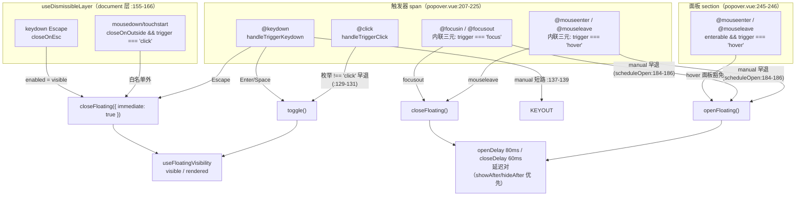
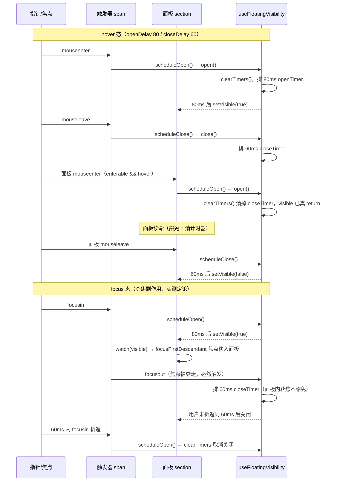

# 7-12 · Popover：触发策略全集

> 核心问题：hover/click/focus/manual 四个触发态，各自的守卫差异是什么——hover 的延迟对与面板豁免、click 的 toggle 语义与双击窗口、focus 的进出判定及其夺焦副作用、manual 的三层拦截；以及被类型层明确拒绝的第五态：contextmenu。
>
> 本篇精读源码：`packages/components/popover/src/popover.vue`（268 行，全文展开）、`packages/components/popover/index.ts`（18 行）、`packages/theme/src/components/popover.css`（87 行，全文件展开）、`packages/components/popover/__tests__/popover.spec.ts`（229 行，全貌展开）、`tests/types/fixtures/popover.ts`（33 行，全文）；对照源码：`packages/components/tooltip/src/tooltip.vue`（349 行）、`packages/components/tooltip/src/trigger.vue`（245 行）、`packages/components/tooltip/src/tooltip.ts`（61 行）；组合式层：`packages/xiaoye-primitives/src/composables/use-floating-visibility.ts`（249 行）、`packages/xiaoye-primitives/src/composables/use-dismissible-layer.ts`（83 行）。
>
> 前情提要：4-05/4-06 已把 `useFloatingVisibility` 的三态状态机、`useFloatingPanel` 的定位管道、`useDismissibleLayer` 的白名单裁决讲透；7-11 已讲 tooltip 的触发器/内容分体装配。本篇不再重复底座机制，只讲 popover 在同一底座上长出来的触发面差异。文中所有结论均以当前工作区实码为准，两处关键行为（focus 态夺焦回落、hover 延迟对窗口）经临时 vitest 实测验证后已清理现场。

## 一、先立坐标：同一个底座，另一张触发面

7-11 拆解 tooltip 时说过：tooltip 的触发逻辑长在 `trigger.vue` 与 `content.vue` 两个分体组件里，主组件只做汇总。popover 是完全相反的组织方式——**一个 268 行的单文件，把触发器、面板、四态守卫全部收在 `<script setup>` 与同一个模板里**。先看 props 层与接线层，这是后面所有讨论的地基。

`packages/components/popover/src/popover.vue:1-68`：

```vue
<script setup lang="ts">
import { computed, nextTick, onBeforeUnmount, ref, watch } from "vue";
import type { StyleValue } from "vue";
import type { Placement } from "@floating-ui/dom";
import { focusFirstDescendant } from "xiaoye-primitives";
import {
  readFloatingAnimationDuration,
  useDismissibleLayer,
  useFloatingPanel,
  useFloatingVisibility,
  useOverlayStack,
  useNamespace
} from "xiaoye-primitives";

export interface PopoverProps {
  modelValue?: boolean;
  title?: string;
  content?: string;
  placement?: Placement;
  width?: string | number;
  closeOnOutside?: boolean;
  closeOnEsc?: boolean;
  disabled?: boolean;
  trigger?: "click" | "hover" | "focus" | "manual";
  openDelay?: number;
  closeDelay?: number;
  showAfter?: number;
  hideAfter?: number;
  enterable?: boolean;
  offset?: number;
  showArrow?: boolean;
  teleported?: boolean;
  appendTo?: string | HTMLElement;
  persistent?: boolean;
  popperClass?: string;
  popperStyle?: StyleValue;
}

export type PopoverTrigger = NonNullable<PopoverProps["trigger"]>;
export type PopoverModelValueChangeHandler = (value: boolean) => void;

export interface PopoverDefaultSlotProps {
  close: () => void;
}

const props = withDefaults(defineProps<PopoverProps>(), {
  modelValue: false,
  title: "",
  content: "",
  placement: "bottom",
  width: 320,
  closeOnOutside: true,
  closeOnEsc: true,
  disabled: false,
  trigger: "click",
  openDelay: 80,
  closeDelay: 60,
  showAfter: undefined,
  hideAfter: undefined,
  enterable: true,
  offset: 10,
  showArrow: true,
  teleported: true,
  appendTo: "body",
  persistent: false,
  popperClass: "",
  popperStyle: undefined
});
```

注意第 24 行的枚举：`"click" | "hover" | "focus" | "manual"`。四个值，单选字符串，没有数组形态，没有 `contextmenu`。这个枚举是本篇的地图——每一个值对应一组事件监听、一套守卫条件、一条关闭通道。任务书直觉里 popover 应该和 tooltip 一样有 `contextmenu` 触发，但实码没有，而且不是"没来得及做"，是**类型层明确拒绝**（第三节用夹具实证）。先把这行记住，我们从接线层开始。

`packages/components/popover/src/popover.vue:76-126`：

```ts
const ns = useNamespace("popover");
const triggerRef = ref<HTMLElement | null>(null);
const panelRef = ref<HTMLElement | null>(null);
const arrowRef = ref<HTMLElement | null>(null);
let lastFocusedElement: HTMLElement | null = null;
const isClient = typeof document !== "undefined";
const teleportTarget = computed(() => props.appendTo ?? "body");
const { visible, rendered, open: openFloating, close: closeFloating, toggle, clearTimers, handleAfterLeave } =
  useFloatingVisibility({
    modelValue: () => props.modelValue,
    disabled: () => props.disabled,
    persistent: () => props.persistent,
    openDelay: () => props.showAfter ?? props.openDelay,
    closeDelay: () => props.hideAfter ?? props.closeDelay,
    isLeaveAnimating: () => readFloatingAnimationDuration(panelRef.value) > 0,
    emitModelValue: (value) => {
      emit("update:modelValue", value);
    },
    onOpen: () => {
      lastFocusedElement =
        isClient && document.activeElement instanceof HTMLElement ? document.activeElement : null;
      emit("open");
      openLayer();
    },
    onClose: () => {
      emit("close");
      stopAutoUpdate();
      closeLayer();
      lastFocusedElement?.focus();
      lastFocusedElement = null;
    }
  });

const { zIndex, isTopMost, openLayer, closeLayer } = useOverlayStack();
const { actualPlacement, arrowStyle, floatingStyle, updatePosition, startAutoUpdate, stopAutoUpdate } = useFloatingPanel(
  triggerRef,
  panelRef,
  {
    placement: () => props.placement,
    strategy: "fixed",
    offset: () => props.offset,
    arrowRef,
    zIndex
  }
);

function closePopover() {
  closeFloating({
    immediate: true
  });
}
```

这段和 tooltip 的同名接线几乎逐行对得上，但有三个差异值得点名，它们各自是后文某场戏的伏笔：

其一，`onOpen`（popover.vue:94-99）里记录 `lastFocusedElement`，`onClose`（100-106）里 `lastFocusedElement?.focus()` 归还焦点。tooltip 没有这一对——因为 tooltip 的内容面板**不夺焦**，焦点始终留在触发器上；popover 的面板是 `role="dialog"` 的交互容器，打开时要把焦点移进去（第 178 行的 `focusFirstDescendant`），关闭时再还回来。焦点策略的差异，直接决定了 focus 触发态的守卫要怎么写（2.3 节的主角）。

其二，`openDelay: () => props.showAfter ?? props.openDelay`（第 88 行）——`showAfter`/`hideAfter` 是 EP 风格的延迟别名，叠在 `openDelay`/`closeDelay` 之上，先到先得。这是 7-11 讲过的兼容层，本篇不再展开。

其三，`useFloatingPanel` 的第一个参数直接传 `triggerRef`——**定位锚点在物理上只有一颗**，就是那个触发器 span。tooltip 那边传的是 `referenceRef` 计算属性，可以在"真实触发器"与"虚拟元素"之间切换（tooltip.vue:89-91）。这一个参数的差异，就是 contextmenu 拒绝案的架构根源（第三节）。

## 二、四触发态守卫矩阵

### 2.1 事件绑定面：模板里的内联三元

popover 的事件监听不像 tooltip 那样集中在子组件 handler 里，而是**直接写在模板上，用内联三元做触发态守卫**。先看触发器一侧。

`packages/components/popover/src/popover.vue:205-225`：

```vue
<template>
  <span :class="ns.base.value">
    <span
      ref="triggerRef"
      class="xy-popover__trigger"
      role="button"
      tabindex="0"
      :aria-expanded="visible"
      @click="handleTriggerClick"
      @mouseenter="props.trigger === 'hover' ? scheduleOpen() : undefined"
      @mouseleave="props.trigger === 'hover' ? scheduleClose() : undefined"
      @focusin="props.trigger === 'focus' ? scheduleOpen() : undefined"
      @focusout="props.trigger === 'focus' ? scheduleClose() : undefined"
      @keydown="handleTriggerKeydown"
    >
      <slot name="reference">
        <slot name="trigger">
          <button type="button" class="xy-popover__default-trigger">打开说明</button>
        </slot>
      </slot>
    </span>
```

再补上脚本侧的三个处理器与 dismissible 接线，四态守卫的全部源码就齐了。

`packages/components/popover/src/popover.vue:128-166`：

```ts
function handleTriggerClick() {
  if (props.trigger !== "click") {
    return;
  }

  toggle();
}

function handleTriggerKeydown(event: KeyboardEvent) {
  if (props.trigger === "manual") {
    return;
  }

  if (event.key === "Enter" || event.key === " ") {
    event.preventDefault();
    toggle();
    return;
  }

  if (event.key === "Escape") {
    event.preventDefault();
    closeFloating({
      immediate: true
    });
  }
}

useDismissibleLayer({
  enabled: () => visible.value,
  refs: [triggerRef, panelRef],
  closeOnEscape: props.closeOnEsc,
  closeOnOutside: props.closeOnOutside && props.trigger === "click",
  isTopMost: () => isTopMost(),
  onDismiss: () => {
    closeFloating({
      immediate: true
    });
  }
});
```

`packages/components/popover/src/popover.vue:183-197`：

```ts
function scheduleOpen() {
  if (props.trigger === "manual") {
    return;
  }

  openFloating();
}

function scheduleClose() {
  if (props.trigger === "manual") {
    return;
  }

  closeFloating();
}
```

把这四段拼起来，四个触发态的守卫矩阵就完整了。这张表是本篇的定论：

| 触发态 | 打开守卫 | 关闭守卫（组件层） | 关闭通道（document 层） | 键盘通道 |
| --- | --- | --- | --- | --- |
| `click` | `handleTriggerClick` 枚举匹配 + `toggle()` | toggle 自身（再点一次即关） | 外部点击 + Escape 双通道全开 | Enter/Space toggle，Escape 关 |
| `hover` | `mouseenter` 内联三元 → `scheduleOpen`（openDelay 缓冲） | `mouseleave` → `scheduleClose`（closeDelay 缓冲）；面板 `mouseenter` 豁免 | **外部点击通道关闸**（`:159`），仅 Escape | Enter/Space toggle，Escape 关 |
| `focus` | `focusin` 内联三元 → `scheduleOpen` | `focusout` → `scheduleClose`；**面板内获焦不豁免** | 外部点击通道关闸，仅 Escape | Enter/Space toggle，Escape 关 |
| `manual` | 全部早退（scheduleOpen/click 双重拦截） | 同左，组件层零事件响应 | Escape 通道仍开（enabled 只看 visible） | 键盘通道整体短路（`:137-139`） |

画成守卫矩阵图：



矩阵里最值得咀嚼的是**列与列之间的不对称**：click 态的关闭是"再点一次"（toggle 自语义），所以 document 层的外部点击通道全开；hover 和 focus 态的关闭已经由 `mouseleave`/`focusout` 承包，document 层再开外部点击通道就是两套关闭语义打架——于是 159 行 `closeOnOutside: props.closeOnOutside && props.trigger === "click"` 直接关闸。这行在 4-06 引过接线代码，当时的落点是"豁免域的定义权"；本篇的落点是**触发态决定关闭通道的拓扑**：hover/focus 的关闭逻辑住在组件层的事件对里，click 的关闭逻辑住在 document 层的裁判里，manual 的关闭逻辑只住在业务代码里。三种居住地，互不越界。

还有一个藏在矩阵角落的一致性设计：**不管触发态是四者中的哪一个（manual 除外），Enter/Space 都能 toggle，Escape 都能关**。keydown 通道只挡 manual（137-139 行），不挡 hover/click——hover 触发的 popover 照样能被键盘用户用 Enter 打开。触发态枚举守卫的是"指针交互的主通道"，键盘通道作为一致性兜底与触发态解耦。这是 WAI-ARIA 的实践要求，也是"守卫分支组织"这个话题里容易被忽略的一行。

### 2.2 hover：延迟对与面板豁免链

hover 是四态里机制最厚的一态，因为它的核心矛盾是**指针在触发器与面板之间有一段物理空隙**——鼠标从触发器移向面板要穿过一段既不在触发器内也不在面板内的区域，两端各触发一次 `mouseleave`/`mouseenter`。如果没有缓冲，指针走的每一步都在开关 popover。解法是 4-05 讲过的延迟对：`openDelay: 80`、`closeDelay: 60`（withDefaults 56-57 行），落在 `useFloatingVisibility` 的两个 setTimeout 上。

`packages/xiaoye-primitives/src/composables/use-floating-visibility.ts:112-156`：

```ts
  function open(
    optionsOverride: FloatingVisibilityChangeOptions & { immediate?: boolean } = {}
  ) {
    if (toValue(options.disabled)) {
      return;
    }

    clearTimers();

    if (visible.value) {
      return;
    }

    const delay = optionsOverride.immediate ? 0 : (toValue(options.openDelay) ?? 0);

    if (delay > 0) {
      openTimer = typeof window !== "undefined"
        ? window.setTimeout(() => {
            setVisible(true, optionsOverride);
          }, delay)
        : null;
      return;
    }

    setVisible(true, optionsOverride);
  }

  function close(
    optionsOverride: FloatingVisibilityChangeOptions & { immediate?: boolean } = {}
  ) {
    clearTimers();

    const delay = optionsOverride.immediate ? 0 : (toValue(options.closeDelay) ?? 0);

    if (delay > 0) {
      closeTimer = typeof window !== "undefined"
        ? window.setTimeout(() => {
            setVisible(false, optionsOverride);
          }, delay)
        : null;
      return;
    }

    setVisible(false, optionsOverride);
  }
```

`open()` 的执行顺序是这份机制的题眼：先 `clearTimers()`（119 行），再查 `visible.value`（121 行），最后才排新计时器。**"清掉对方计时器"是打开请求的第一动作，不是某个附加的豁免标志位**。这意味着 popover 的 hover 豁免链其实只有一条规则：谁后到，谁说话。面板的 `mouseenter` 豁免不需要任何新代码——它就是又一次 `scheduleOpen()` 调用。

看模板面板一侧的接线（popover.vue:245-246）：

```vue
          @mouseenter="props.enterable && props.trigger === 'hover' ? scheduleOpen() : undefined"
          @mouseleave="props.enterable && props.trigger === 'hover' ? scheduleClose() : undefined"
```

`enterable` 与 `trigger === 'hover'` 双条件。完整事件序是这样的：`mouseenter` 触发器 → 80ms 后面板开 → 指针离开触发器（`mouseleave` → `scheduleClose` → 60ms closeTimer 排上）→ 指针进入面板（面板 `mouseenter` → `scheduleOpen` → `open()` → **clearTimers 先清掉 closeTimer** → `visible` 已真 → return）→ 面板续命成功。指针最终离开面板（面板 `mouseleave` → `scheduleClose` → 60ms 后真关）。这条链我用临时 vitest 实测过（fake timers 推进）：openDelay 80ms 到点面板可见；进入面板后推进 120ms 面板仍在；面板 `mouseleave` 后 70ms 面板 `display: none`。三个时间点全部与延迟对的推算吻合。

延迟对还附赠一个"折返窗口"：`mouseleave` 之后 60ms 内再回触发器（`mouseenter` → `scheduleOpen` → `open()` → clearTimers 清掉 closeTimer → visible 已真 → return），关闭取消。实测 `mouseleave` 后 30ms 折返，再推进 100ms 面板依旧可见。这个窗口是 hover 交互手感的核心——60ms 是"指针抖动容错"，80ms 是"路过触发器不误开"。两组默认值（80/60）与 tooltip 完全一致，这不是巧合，是同一套手感基线在两个组件上的复用。

但 hover 态有一个必须关掉的通道：159 行的 `props.trigger === "click"` 条件把外部点击整体关闸。为什么 hover popover 不能"点外面关"？因为它的打开与"指针位置"绑定，与"点击"无关——如果外部点击能关，那么用户 hover 打开 popover 后随手点一下页面空白处准备看内容，面板反而消失；更糟的是 click 通道与 `mouseenter` 通道会在同一个手势里先后触发，行为不可预测。**hover 态的关闭语义完全收编进指针事件对，document 层只留 Escape**。tooltip 的 `closeOnOutsideEnabled`（tooltip.vue:74-80）把 hover 和 focus 一起关掉，popover 用一行枚举比较达成同样效果——这是单值枚举才有的简洁：`trigger === "click"` 一个等号就能问出"这个态依赖 toggle 语义吗"。

### 2.3 focus：进出判定的粗粒度化与夺焦副作用

focus 态的源码只有两行模板（216-217 行的 `focusin`/`focusout` 内联三元），但它是四态里行为最出乎直觉的一态，因为它和"打开时把焦点移进面板"这个焦点策略纠缠在一起。

回看 168-181 行的 watch：

```ts
watch(visible, async (value) => {
  stopAutoUpdate();

  if (!value) {
    return;
  }

  await nextTick();
  await updatePosition();
  startAutoUpdate();
  if (!focusFirstDescendant(panelRef.value)) {
    panelRef.value?.focus();
  }
});
```

`focusFirstDescendant` 是把面板内第一个可聚焦元素设为焦点（`packages/xiaoye-primitives/src/utils/dom/focus.ts:14-23`，找不到可聚焦元素则聚焦面板本体 `tabindex="-1"`）。于是 focus 态的完整时序是：`focusin` 触发器 → 80ms 后面板开 → **焦点被移进面板 → 触发器容器失焦 → `focusout` 触发 → `scheduleClose` → 60ms 后关闭**。

这不是推演，是实测结果：jsdom 环境下 `focusin` 打开面板、推进 90ms、断言 `document.activeElement` 已是 `xy-popover__panel`；随后触发器的 `focusout`（真实浏览器中焦点转移时自动发生）启动关闭倒计时，推进 70ms 后面板 `display: none`，`update:modelValue` 收到 `[true], [false]`。也就是说，**focus 态的 popover 如果用户打开后不把焦点弄回触发器，默认在 openDelay + closeDelay（80 + 60 = 140ms）后自动回落**。面板内获得焦点并不豁免关闭——因为 `focusin` 的内联三元守卫只绑在触发器 span 上，面板不在它的管辖范围。

把这个行为跟 tooltip 对照，差异的性质就清楚了。tooltip 的 focus 守卫是 relatedTarget 精确判定：

`packages/components/tooltip/src/tooltip.vue:178-188`：

```ts
function handleRequestedClose(event?: Event) {
  if (props.disabled || isManualTrigger.value) {
    return;
  }

  if (event instanceof FocusEvent && (isFocusInsideContent(event) || isFocusInsideTrigger(event))) {
    return;
  }

  close();
}
```

其中 `isFocusInsideContent`/`isFocusInsideTrigger`（tooltip.vue:134-156）取 `event.relatedTarget ?? document.activeElement`，用 `contains` 判断焦点是否只是"在触发器与内容之间转移"——是则吞掉关闭请求。EP 的 `content.vue` 里有同构实现（`isFocusInsideContent` 同样取 `event?.relatedTarget || document.activeElement` 再 `contains`）。而 popover 的 focus 守卫**没有这个 relatedTarget 判定**，是"容器边界 + 延迟缓冲"的粗粒度守卫：焦点离开触发器容器就是离开，缓冲全靠 closeDelay 那 60ms。

为什么 popover 敢这么粗？两个原因。一是架构事实：popover 面板夺焦后，触发器 focusout 是必然发生的，relatedTarget 判定在这里救不了场——`focusout.relatedTarget` 指向面板元素，`contains` 判触发器和面板都是"内部"需要把面板也纳入判定域，而模板的守卫只在触发器 span 上一处挂监听，拿不到"面板也算内部"的语义（面板在白名单语义里属于 dismissible 层的 refs，不属于自己的 focus 事件域）。二是产品定位：popover 的 focus 态本来就不是为"纯键盘驻留"设计的主通道——主通道是 click + 键盘兜底（Enter/Space），focus 态服务的是"输入框聚焦时给出富说明"这类场景，短驻留即可。60ms 的折返窗口（focusin 回触发器 → `scheduleOpen` → clearTimers 取消关闭）提供了和 hover 一样的延迟对手感。**这是守卫精度与实现面积的权衡：tooltip 花 22 行代码（tooltip.vue:134-156）买精确制导，popover 用 0 行额外代码 + 默认延迟对兜底**。

顺带补全 focus 态的 Escape 语义：夺焦之后焦点不在触发器上，`handleTriggerKeydown` 收不到 Escape，此时关闭走 document 层——`useDismissibleLayer` 的 keydown handler（use-dismissible-layer.ts:42-53）在 `enabled = visible` 且 `closeOnEsc` 时 dismiss。关闭通道的拓扑再次应验：focus 态的组件层管"进出"，document 层管"逃生"。

### 2.4 click：toggle 语义与双击窗口

click 态的守卫最薄（一个枚举早退 + toggle），但它踩在两个已经讲过的机制上，本篇只补增量。

第一，白名单豁免。4-06 第五节用反事实推演证过：触发器 ref 必须在 `useDismissibleLayer` 的 `refs` 白名单里（157 行），否则 mousedown 裁决与 click toggle 会在同一个手势里打架——"点一下想关"会反转成"闪一下还开着"。popover 的白名单是 `refs: [triggerRef, panelRef]`（157 行），点触发器、点面板、点面板里的按钮，都不算外部点击。这个结论 4-06 已给全，此处不再展开。

第二，双击窗口。`toggle()` 里有一个动画感知的守卫（use-floating-visibility.ts:158-177）：

```ts
  function toggle(optionsOverride: FloatingVisibilityChangeOptions = {}) {
    // 关闭动画仍在播放时（真实浏览器下 after-leave 尚未触发）忽略触发器的 toggle 请求，
    // 防止“开→关→又开/又关”的双重状态切换；无动画环境（如 jsdom）行为保持不变。
    if (!visible.value && options.isLeaveAnimating?.()) {
      return;
    }

    if (visible.value) {
      close({
        ...optionsOverride,
        immediate: true
      });
      return;
    }

    open({
      ...optionsOverride,
      immediate: true
    });
  }
```

`isLeaveAnimating` 接的是 popover.vue:90 行的探针 `readFloatingAnimationDuration(panelRef.value) > 0`——读面板计算样式的 transition/animation 总时长。真实浏览器里面板带着 `xy-fade` 过渡（popover.vue:227 的 `<transition name="xy-fade">`），快速双击时第二次 click 落在关闭动画播放中，`toggle` 直接吞掉，面板保持关闭；jsdom 应用不了样式表，探针恒为 0，toggle 走纯翻转（实测连点三次，`update:modelValue` 干净地收到 `[true], [false], [true]`）。4-05/4-06 讲过这个探针在 tooltip 和 dropdown 上的通用机制，popover 这里值得记的是它的**触发态指向性**：探针只保护 toggle——也就是说只有 click 态（和键盘 Enter/Space）需要这层保护，hover/focus 态走 `openFloating`/`closeFloating`，它们的重复请求被 `open()` 的 `visible` 早退和 `close()` 的幂等吸收，不需要动画探针。同一个底座能力，按触发态选择性启用，又是一次守卫分支组织。

### 2.5 manual：三层拦截与"唯一保留的逃生门"

manual 是四态里最安静的：模板的事件监听全部因内联三元短路，`handleTriggerClick` 因枚举早退，`scheduleOpen`/`scheduleClose` 因 manual 早退。但注意拦截的分布——**三层，且各管一段**：

1. 模板内联三元（214-217 行）：管 hover/focus 的事件对，manual 时根本不产生事件响应；
2. `handleTriggerClick` 的枚举早退（129-131 行）：管 click 通道；
3. `handleTriggerKeydown` 的 manual 短路（137-139 行）：管键盘通道——manual 连 Enter/Space/Escape 的本地处理都不要。

有意思的是第 137-139 行的短路把 Escape 的**触发器侧**通道也关了，但 manual 态的 popover 仍可被 Escape 关——走的是 `useDismissibleLayer` 的 keydown handler，它的 `enabled` 只看 `visible.value`，不看触发态。也就是说：manual 态下业务代码全权掌控开与关，但"浮层开着、用户按 Escape"这条逃生门由 document 层保留（`closeOnEsc: true` 默认开）。**"自治权交给业务，可及性留给用户"**——这是 manual 语义里非常克制的一刀。tooltip 的 manual 拦截是同构思路（handler 层判 `isManualTrigger` + `handleEscape` 短路，tooltip.vue:171/179/199），两个组件在"manual 保留 Escape"这一点上行为一致。

### 2.6 hover 延迟对的时序图

把 2.2/2.3 两态的时间线合并成一张时序图，作为矩阵的第二张图：



## 三、缺席的第五态：contextmenu 的 preventDefault 与定位难题

任务直觉里 popover 应该有 contextmenu 触发——EP 的文档里两者确实都列着这个值。但本库实码的定论是：**tooltip 有，popover 没有，而且类型层明确拒绝**。证据链有三环。

第一环，枚举本身。popover.vue:24 的 trigger 枚举没有 `contextmenu`（第一节已引）；模板 205-268 行整段没有任何 `@contextmenu` 监听。

第二环，类型夹具的负向断言。`tests/types/fixtures/popover.ts:28-33`：

```ts
const invalidProps: PopoverProps = {
  // @ts-expect-error unsupported trigger should be rejected
  trigger: "contextmenu"
};

void invalidProps;
```

`@ts-expect-error` 是类型测试的"负向用例"写法：这一行如果**不**报错，`pnpm typecheck:types` 反而失败（expect-error 落空）。也就是说有人专门写了一条断言，钉死"给 popover 传 contextmenu 必须是类型错误"——这不是疏漏，是有意的不支持，且这个决定被纳入了类型门禁。

第三环，架构根源：定位锚点只有一颗。回看第一节的接线——`useFloatingPanel(triggerRef, panelRef, ...)`（popover.vue:110-112）第一个参数是固定的 `triggerRef`。而 contextmenu 触发的本质需求是**定位在鼠标右键坐标上**，不是定位在某个固定 DOM 元素上——右键点在列表第 7 行的某处，浮层要出现在那一点旁边。这需要一个"虚拟锚点"：把 `{ getBoundingClientRect: () => ({ x: mouseX, y: mouseY, ... }) }` 这样的对象冒充成 reference 元素喂给 floating-ui。tooltip 为此预留了通道：

`packages/components/tooltip/src/tooltip.vue:89-91`：

```ts
const referenceRef = computed<ReferenceElement | null>(() =>
  props.virtualTriggering && props.virtualRef ? props.virtualRef : triggerRef.value
);
```

`virtualRef`/`virtualTriggering` 两个 props 让 tooltip 的定位锚点可以在真实元素与虚拟坐标之间切换——右键菜单式 tooltip 正是这么接的。popover 没有这两个 props，锚点焊死在 `triggerRef` 上，contextmenu 需要的"鼠标坐标定位"**根本没有落脚点**。所以拒绝 contextmenu 不只是"产品上交给别的组件"，而是当前架构下加了也只能定位到触发器元素而非鼠标位置——语义就是错的。

那 contextmenu 的正确姿势在本库长什么样？tooltip 的实现给了完整参考。

`packages/components/tooltip/src/trigger.vue:134-141`：

```ts
function handleContextmenu(event: MouseEvent) {
  if (!canHandleEvents() || !hasContextmenuTrigger.value) {
    return;
  }

  event.preventDefault();
  emit("requestToggle", event);
}
```

三件事：守卫（manual/disabled 早退 + `hasContextmenuTrigger` 枚举匹配）、`event.preventDefault()` 压掉浏览器原生右键菜单、发 toggle。preventDefault 必须有——右键触发浮层的第一件事就是让原生菜单别弹出来抢场景。定位则配合 `virtualRef`：右键时把鼠标坐标写进虚拟锚点再打开，浮层精准出现在光标旁。

EP 对照（源码均已核对 dev 分支实码）：EP 的 trigger 上 contextmenu 处理是 `whenTrigger(trigger, 'contextmenu', (e: Event) => { e.preventDefault(); onToggle(e) })`，与本库 tooltip 的 `handleContextmenu` 逐语义对应；EP 的 `isTriggerType` 签名是 `Arrayable<TooltipTriggerType>`——trigger 支持**数组**，hover+click 可并存；EP Popover 的 props 直接 `extends Omit<UseTooltipProps, ...>` 继承 tooltip 全套触发能力，contextmenu 因此"免费"可用，width 默认 150。本库的选择相反：popover 与 tooltip 从共享底座（primitives 组合式）分裂成两套组件层，触发面各自收窄——popover 拿走 click/hover/focus/manual 四态与富内容面板，tooltip 拿走五态（含 contextmenu）、数组化、虚拟锚点与轻提示。**用"组件分野"代替"props 继承"来控制单组件的表面积**。右键菜单式富面板场景，本库的答案是 `dropdown`（右键触发菜单）或 tooltip 的 contextmenu 态，而不是把 popover 撑大。

## 四、API 分野清单：popover 与 tooltip 到底差在哪

两个组件共享 `useFloatingVisibility` + `useFloatingPanel` + `useDismissibleLayer` 三根 primitives 轨道，组件层的差异就是全部差异。逐项清点（左 popover，右 tooltip）：

| 维度 | popover（268 行单文件） | tooltip（717 行三文件） |
| --- | --- | --- |
| trigger 枚举 | 四态单值：`"click" \| "hover" \| "focus" \| "manual"`（popover.vue:24） | 五态且可数组：`tooltipTriggers = ["hover", "click", "focus", "contextmenu", "manual"]`，`trigger?: TooltipTrigger \| TooltipTrigger[]`（tooltip.ts:5、30） |
| contextmenu | 类型层拒绝（夹具 `@ts-expect-error`） | 完整实现：preventDefault + toggle（trigger.vue:134-141） |
| 虚拟锚点 | 无，锚点焊死 `triggerRef`（popover.vue:110） | `virtualRef`/`virtualTriggering`（tooltip.vue:89-91） |
| focus 守卫 | 容器边界 + closeDelay 缓冲，无 relatedTarget 判定 | `isFocusInsideContent/Trigger` 精确豁免（tooltip.vue:134-156、178-188） |
| 面板角色 | `role="dialog"` + `aria-modal="false"` + `tabindex="-1"`，**夺焦**（popover.vue:242-244、178-180） | `aria-describedby` 关联，**不夺焦**（trigger.vue:73-88 syncAria） |
| 焦点归还 | `lastFocusedElement?.focus()`（popover.vue:104-105） | 无需归还（焦点从未离开触发器） |
| 内容形态 | title 头部 + body、默认插槽带 `close` 入参（`PopoverDefaultSlotProps`）、可交互富内容 | 纯文本/`rawContent` v-html、`content` 插槽、`maxWidth` 240 默认 |
| 默认触发/默认宽 | `trigger: "click"`、`width: 320`（popover.vue:55、51） | `trigger: "hover"`、`maxWidth: 240`（tooltip.vue:36、39） |
| 外部点击 | `closeOnOutside && trigger === "click"`（popover.vue:159） | `!closeOnOutside \|\| manual` 或含 hover/focus 时关闸（tooltip.vue:74-80） |
| 键盘自定义 | 固定 Enter/Space（popover.vue:141） | `triggerKeys` 可配（含 NumpadEnter，tooltip.ts:60） |
| 事件对 | `open`/`close`（popover.vue:70-74） | `before-show/show/hide` 四件套 + `open/close`（tooltip.vue:57-65） |
| 视觉主题 | 无 effect 概念，CSS 变量三级回退（第五节） | `effect: dark/light` + `transition` 可换 |

这张表背后的分野原则一句话：**tooltip 是"标注"——不参与交互，焦点不转移，轻内容；popover 是"浮层卡片"——参与交互，焦点进入，富内容**。所以 popover 的默认触发是 click（交互要有确定性），tooltip 的默认是 hover（标注要无摩擦）；popover 面板是 dialog 语义要夺焦，tooltip 是描述语义不夺焦。`enterable` 在两边都有，但只有 popover 的面板值得"进去操作"。

`packages/components/popover/index.ts`（全文 18 行）：

```ts
import Popover from "./src/popover.vue";
import type {
  PopoverDefaultSlotProps,
  PopoverModelValueChangeHandler,
  PopoverProps,
  PopoverTrigger
} from "./src/popover.vue";
import { withInstall } from "xiaoye-primitives";

export type {
  PopoverDefaultSlotProps,
  PopoverModelValueChangeHandler,
  PopoverProps,
  PopoverTrigger
};

export const XyPopover = withInstall(Popover, "xy-popover");
export default XyPopover;
```

对外类型面正好四个：Props、Trigger 联合（`NonNullable<PopoverProps["trigger"]>` 从枚举派生，单一事实源）、modelValue 处理器、插槽入参。没有从 popover 内部状态漏出去的类型——与 4-03 讲的标准三件套一致。

## 五、样式与测试全貌

### 5.1 popover.css 全文件展开

4-06 引过 64-72 的箭头段讲定位，本篇把 87 行全文铺开，补全变量链与触发器层的叙事。

`packages/theme/src/components/popover.css:1-62`：

```css
.xy-popover {
  display: inline-flex;
}

.xy-popover__trigger {
  display: inline-flex;
}

.xy-popover__default-trigger {
  min-height: 36px;
  padding: 0 14px;
  border: 1px solid color-mix(in srgb, var(--xy-border-subtle) 92%, var(--xy-border));
  border-radius: var(--xy-radius-md);
  background: color-mix(in srgb, var(--xy-bg-floating) 98%, var(--xy-bg-subtle));
}

.xy-popover__default-trigger:focus-visible {
  outline: 2px solid color-mix(in srgb, var(--xy-brand) 58%, var(--xy-mix-light));
  outline-offset: 2px;
  box-shadow: 0 0 0 1px color-mix(in srgb, var(--xy-brand) 12%, transparent);
}

.xy-popover__panel {
  --xy-popover-bg-resolved: var(
    --xy-popover-bg,
    var(
      --xy-popper-bg,
      var(--xy-dialog-bg, color-mix(in srgb, var(--xy-bg-floating) 98%, var(--xy-bg-subtle)))
    )
  );
  --xy-popover-border-resolved: var(
    --xy-popover-border,
    var(
      --xy-popper-border-color,
      color-mix(in srgb, var(--xy-border-subtle) 92%, var(--xy-border))
    )
  );
  --xy-popover-shadow-resolved: var(
    --xy-popover-shadow,
    var(
      --xy-popper-shadow,
      0 0 0 1px color-mix(in srgb, var(--xy-bg-floating) 8%, transparent),
      0 2px 8px color-mix(in srgb, var(--xy-text-heading) 7%, transparent)
    )
  );
  --xy-popover-title-resolved: var(
    --xy-popover-title-color,
    var(--xy-popper-title-color, var(--xy-dialog-title-color, var(--xy-text-heading)))
  );
  --xy-popover-text-resolved: var(
    --xy-popover-text-color,
    var(--xy-popper-text-color, var(--xy-text-secondary))
  );
  --xy-popover-section-border: color-mix(in srgb, var(--xy-popover-border-resolved) 82%, transparent);
  position: absolute;
  border: 1px solid var(--xy-popover-border-resolved);
  border-radius: var(--xy-radius-lg);
  background: var(--xy-popover-bg-resolved);
  box-shadow: var(--xy-popover-shadow-resolved);
  padding: 10px 12px;
  outline: none;
}
```

`packages/theme/src/components/popover.css:64-86`：

```css
.xy-popover__arrow {
  position: absolute;
  width: 10px;
  height: 10px;
  rotate: 45deg;
  border-top: 1px solid var(--xy-popover-border-resolved);
  border-left: 1px solid var(--xy-popover-border-resolved);
  background: var(--xy-popover-bg-resolved);
}

.xy-popover__header {
  margin-bottom: 8px;
  padding-bottom: 8px;
  border-bottom: 1px solid var(--xy-popover-section-border);
  color: var(--xy-popover-title-resolved);
  font-weight: var(--xy-font-weight-semibold);
  line-height: 1.45;
}

.xy-popover__body {
  color: var(--xy-popover-text-resolved);
  line-height: 1.55;
}
```

三处值得点名。其一，`--xy-popover-bg-resolved` 的四级回退链（24-30 行）：`--xy-popover-bg` → `--xy-popper-bg` → `--xy-dialog-bg` → 兜底 color-mix。这条链是"实例级变量收口"的运行时机制——`popperClass` 给面板挂一个类、在类里覆写 `--xy-popover-bg`，五条 resolved 链全部随之联动，组件不用改任何代码。`apps/docs/examples/popover/popper-class.vue` 就是这么做的：`:global(.popover-admin-surface)` 里覆写四个实例级变量，完成"实例级样式收口"而不 deep 内部类名。注意回退的中间层是 `--xy-popper-*`（浮层族共享变量）与 `--xy-dialog-*`（对话框族）——popover 的视觉默认值直接站在两个邻族的肩膀上，这是主题层"族内继承"的设计。

其二，`.xy-popover__panel { position: absolute; outline: none; }`（55、61 行）。`position: absolute` 与 `useFloatingPanel` 的 `strategy: "fixed"`（popover.vue:115）看似矛盾，实则是 floating-ui 的既定协议：fixed 定位由 JS 算出的坐标承担，CSS 侧 absolute 只是给 `transform`/`top`/`left` 一个定位上下文。`outline: none` 则是因为面板会夺焦（`tabindex="-1"` + `focusFirstDescendant`），不压掉 focus 轮廓每次打开都有一圈蓝框。

其三，箭头（64-72 行）：10px 菱形 + `rotate: 45deg` + 两条邻边描边 + 面板同底色。4-06 讲过它的定位数学（对角线探出面板边界一半）；本篇补一句与触发态的关联——**箭头是 hover/focus 态的视觉关键**：延迟对期间面板尚未出现/已经消失，箭头指向的连续性让"这个气泡属于谁"在 80ms 的开合窗口里始终可读。这也是为什么 `showArrow` 默认 true（popover.vue:62）而 tooltip 的内容默认深色反白时箭头同色即可。

### 5.2 测试全貌：九个用例钉住的三层语义

`packages/components/popover/__tests__/popover.spec.ts`（229 行）九个用例，4-06 引过第 9-29 行（Escape 出口），本篇按"触发—装配—受控"三层把全貌铺开。触发层第一组：click + Escape（9-29）与 hover + fake timers（31-55）。

`packages/components/popover/__tests__/popover.spec.ts:31-55`：

```ts
  it("支持 hover 触发和 content prop", async () => {
    document.body.innerHTML = "";
    vi.useFakeTimers();

    mount(XyPopover, {
      attachTo: document.body,
      props: {
        trigger: "hover",
        content: "气泡内容"
      },
      slots: {
        trigger: "<button class='trigger'>悬停</button>"
      }
    });

    const trigger = document.body.querySelector(".xy-popover__trigger") as HTMLElement;
    trigger.dispatchEvent(new MouseEvent("mouseenter", { bubbles: true }));
    vi.runAllTimers();
    await Promise.resolve();
    await nextTick();

    expect(document.body.querySelector(".xy-popover__panel")).not.toBeNull();
    expect(document.body.querySelector(".xy-popover__body")?.textContent ?? "").toContain("气泡内容");
    vi.useRealTimers();
  });
```

这个用例是 hover 态在测试里的最小复现：`mouseenter` 派发 → `vi.runAllTimers()` 一步烧完 80ms openTimer → 断言面板出现。注意它没测 closeDelay 侧——hover 的关闭半边（面板豁免、折返窗口）在组件 spec 里是空白，本篇 2.2 节的实证恰好补上了这块拼图（这也是临时验证测试存在的价值：spec 没钉住的行为，读者值得知道实码是什么）。

装配层三个用例一气呵成：reference 插槽（57-76）、appendTo + popperClass/popperStyle 透传（78-104）、teleported=false 本地渲染 + placement 反映（106-130）。插槽回退链在模板 220-224 行：`reference` → `trigger` → 默认按钮"打开说明"——文档页（apps/docs/components/popover.md:132-136）明确记载了这个回退顺序，`reference` 是 EP 对齐名，`trigger` 是本库惯用名，两个都收。78-104 用例把 `appendTo: "#popover-target"` 与 `popperStyle: { maxWidth: "360px" }` 一起验（100-103 行断言挂载点、类名、内联样式），106-130 用例验 `teleported: false` 时面板留在组件树内且 `style` 含 `width: 320px`——320 正是 withDefaults 的默认 width。

受控层是全文件的压轴（196-228）：

`packages/components/popover/__tests__/popover.spec.ts:196-228`：

```ts
  it("受控变更不会重复派发 update:modelValue，persistent=true 时关闭后保留 DOM", async () => {
    document.body.innerHTML = "";

    const wrapper = mount(XyPopover, {
      attachTo: document.body,
      props: {
        modelValue: false,
        persistent: true,
        content: "保留内容"
      },
      slots: {
        trigger: "<button class='trigger'>打开</button>"
      }
    });

    await wrapper.setProps({
      modelValue: true
    });
    await nextTick();
    await nextTick();

    expect(wrapper.emitted("update:modelValue")).toBeUndefined();

    await wrapper.setProps({
      modelValue: false
    });
    await nextTick();
    await nextTick();

    const panel = document.body.querySelector(".xy-popover__panel") as HTMLElement | null;
    expect(panel).not.toBeNull();
    expect(panel?.style.display).toBe("none");
  });
```

两条断言各钉一个语义。第一条：外部 `modelValue` 置真驱动打开时，`update:modelValue` **一次都不发**——`useFloatingVisibility` 的 modelValue watch（use-floating-visibility.ts:186-211）以 `emitModelValue: false, source: "external"` 走 open/close，受控回环不回声。这条断言的直接受益者就是 manual 态：业务代码 `v-model` 全权驱动时，事件流是单向的。第二条：`persistent: true` 时关闭后面板 DOM 还在、只是 `display: none`——`rendered` 不随关闭回落（use-floating-visibility.ts:213-225 的 persistent watch），v-if/v-show 双闸门只关了 show 一半。这是浮层族 shared 语义（4-05 讲过），spec 在 popover 上再钉一遍。

九个用例里还有两个"克制"断言值得一提（132-150、152-172）：`showArrow=false` 断言箭头节点不存在；"默认面板风格保持克制"实际只断言内容可读——**风格断言只钉结构不钉像素**，视觉交给 3.x 系列讲过的 `audit:visual` 双主题巡检。触发层、装配层、受控层各归其位。

## 六、三处设计权衡（本篇定论）

**权衡一：trigger 枚举的守卫分支组织——模板内联三元 vs 集中分发器。** popover 把触发态守卫拆成"模板内联三元（hover/focus 事件对）+ 脚本枚举早退（click/keydown/schedule 层）"两层，tooltip 则把全部事件收敛进子组件的 `handleXxx` 系列，用 `hasHoverTrigger`/`hasFocusTrigger` 等 computed（trigger.vue:64-67）做守卫。前者胜在**守卫条件与事件绑定同屏**——读模板就知道每个事件在哪个态生效，268 行的单文件撑得住；后者胜在**分发逻辑可单测、可复用**——tooltip 的触发器要做 virtualTriggering 时把同一组 handler 动态 add/removeEventListener（trigger.vue:161-187），内联三元做不到。EP 走得更远：`composeEventHandlers(stopWhenControlledOrDisabled, whenTrigger(trigger, 'hover', ...))` 把"守卫"本身做成可组合的函数管道。三种组织方式对应三种复杂度量级：单文件静态绑定 < 分体组件集中分发 < 可组合事件管道。本库没有把 popover 做成第三种，是因为它的守卫矩阵足够小（四态单值），**守卫的组织复杂度应当匹配枚举的表面积**——枚举越窄，越值得把守卫摊平在事件旁边。

**权衡二：contextmenu 的拒绝与定位锚点的唯一性。** 第三节已展开：`useFloatingPanel(triggerRef, ...)` 单锚点 + 无 `virtualRef` 通道，让 contextmenu"定位到鼠标坐标"的语义无处安放；类型夹具用 `@ts-expect-error` 把这个决定钉进门禁。对照面：EP Popover 通过继承 tooltip props 白得 contextmenu 与数组化触发，代价是 PopoverProps 的表面积与 tooltip 完全同构。本库选择"组件分野"——**拒绝一个触发态，换来触发器/定位/焦点三条管线全部保持最简**。这是一个典型的"负向设计"：好的 API 边界常常不是"还能加什么"，而是"明确不接什么，并让类型系统作证"。

**权衡三：focus 守卫的粗粒度化。** tooltip 用 relatedTarget 精确判定（22 行）豁免"触发器 ↔ 内容"之间的焦点转移；popover 直接让 focusout 落锤、只留 closeDelay 缓冲，代价是 focus 态默认 140ms（80 + 60）自动回落、面板内驻留不豁免。收益是焦点治理三件套（夺焦 `focusFirstDescendant`、归还 `lastFocusedElement`、面板 `tabindex="-1"`）与 focus 守卫互不纠缠——**focus 触发态的守卫不做焦点方向推断，焦点策略才能放心地把焦点搬进面板**。两个组件各自自洽：tooltip 焦点不动，所以守卫必须聪明；popover 焦点要动，所以守卫必须钝。守卫的聪明程度与焦点策略的激进程度成反比，这大概是浮层族里最反直觉的一条规律。

## 七、收束

回到开头的核心问题。四个触发态在同一套底座上的守卫差异，归纳成一句话：**click 的守卫在 document 层（白名单 + toggle + 动画探针），hover 的守卫在指针事件对与延迟对（清计时器即豁免），focus 的守卫是容器边界加缓冲（夺焦回落是特性不是缺陷的表述——是取舍后的行为），manual 的守卫是三层拦截外加一条 document 层保留的 Escape 逃生门**；而第五态 contextmenu 的缺席，是定位锚点唯一性下的有意拒绝，由类型夹具作证。四个态共享同一颗 `visible` 状态机与同一张白名单，守卫不共享——守卫从来都是触发语义的一部分，不是底座的一部分。

组件文档在 `apps/docs/components/popover.md`，五个示例（basic、trigger-close、custom、nested-overlay、popper-class）分别演示了受控开关、hover + 插槽 `close`、header 定制、popover → dialog 的层级升级（`escalateToDialog`：先关 popover 再开 dialog，`useOverlayStack` 的 zIndex 2000 起步计数保证新浮层压顶）与实例级变量收口。AI 协作的解读口径也已就位：`apps/docs/components/popover.md:79` 明确 trigger 等属性为"单词形式"直接映射源码，MCP Server 端无须特判。

下一篇是它的直系亲属：**7-13《Popconfirm：确认语义》**——同样的浮层血统，面板里只剩"确定/取消"两个按钮，`PopoverDefaultSlotProps` 式的插槽自治将换成确认回调的显式语义。trigger 四态矩阵里，Popconfirm 会选哪一态、又如何把"确认"这件事做成类型，我们届时拆开看。
