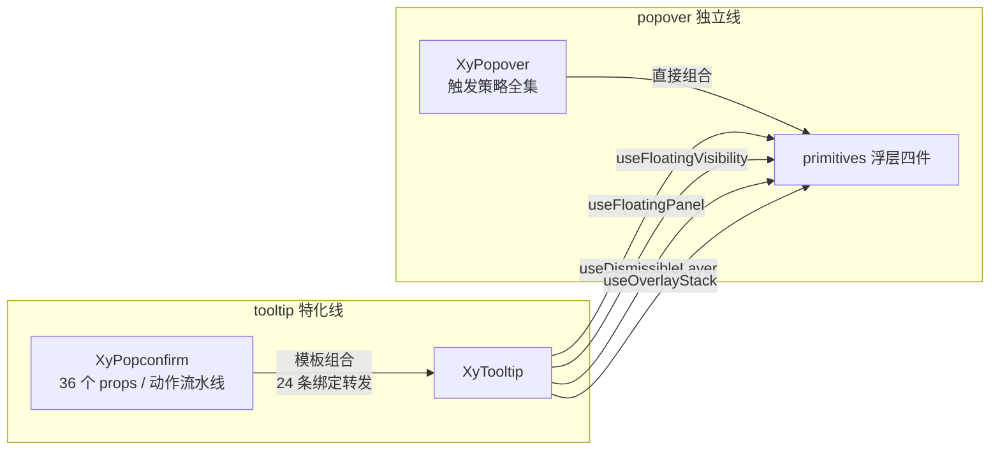
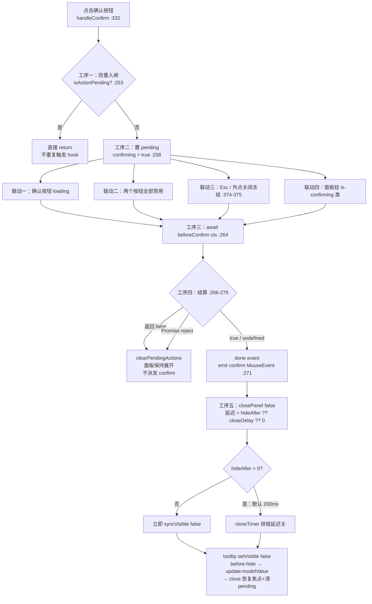
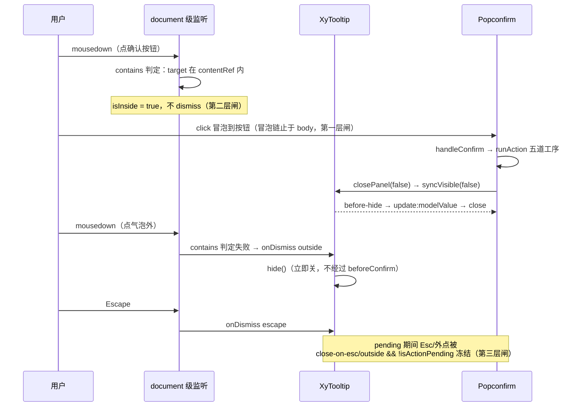

# 7-13 · Popconfirm：确认语义

> 本篇源码坐标（均为当前工作区实态）：
> - `packages/components/popconfirm/src/popconfirm.vue`（477 行，本篇全文展开）
> - `packages/components/popconfirm/src/popconfirm.ts`（72 行，类型层全文）
> - `packages/components/popconfirm/index.ts`（33 行，安装出口）
> - 样式：`packages/theme/src/components/popconfirm.css`（122 行）
> - 测试：`packages/components/popconfirm/__tests__/popconfirm.spec.ts`（427 行，11 条用例）
> - 类型夹具：`tests/types/fixtures/popconfirm.ts`（136 行）
> - 文档示例：`apps/docs/examples/popconfirm/`（basic / legacy-trigger / placement / custom / body-slot / async-confirm / virtual-triggering 七例）；文档页 `apps/docs/components/popconfirm.md`
> - 依赖实码：`packages/components/tooltip/src/tooltip.vue`、`content.vue`、`trigger.vue`；`packages/xiaoye-primitives/src/composables/use-floating-visibility.ts`、`use-dismissible-layer.ts`；`packages/components/button/src/button.ts:5-11`

上一篇 7-12 拆完了 Popover 的四种触发守卫。本篇登场的 Popconfirm 和它长着同一张脸：都是"富内容小浮层"，都贴着触发点弹出，都有标题、正文和圆角面板。大纲给本篇的核心问题只有一句话（`column/02-分卷大纲.md:127`）：**气泡里的动作按钮与事件拦截**。但把 popconfirm.vue 的 477 行摊开，这句话至少由三个更锋利的问题组成：

1. **popconfirm 到底是"谁"的特化？** 它和 popover 只差一对按钮吗？实现上它组合的是 tooltip 还是 popover？这道选择题的答案决定了它白拿多少浮层基础设施、又交多少转发税。
2. **气泡里的一次点击怎么变成一条受控的动作流水线？** confirm/cancel 不是普通的 click——中间隔着防重入、pending 托管、before-hook 拦截、事件派发、延迟关闭五道工序。任何一道工序的顺序摆错，"确认后自动关闭"就会变成"确认后凭空消失"，或者"一次点击触发两次确认"。
3. **气泡内外的点击如何互不误伤？** 点确认按钮不能被"点击外部关闭"抢先吃掉，面板按钮的点击不能穿透到宿主元素上，异步确认进行中 Esc 和外点又必须被冻结。

Popconfirm 的答案是：**它组合的是 tooltip 而不是 popover——tooltip 管展示、定位与关闭，popconfirm 只在 `#content` 里装进一个 alertdialog 面板和一条动作流水线；拦截协议是"返回值三态 + Promise 自动 pending"；关闭语义则拆成两条互不经过的路径——动作成功走 hideAfter 延迟关，外点/Esc/`hide()` 走 tooltip 的立即关，前者可被 hook 否决，后者不经过任何 hook**。本篇把这条边界拆到实现层。

## 一、实码定论：tooltip 的动作层特化，不是 popover 的子类

先回答第一个问题，也是本篇唯一一处需要"考古裁决"的问题。直觉上 popconfirm 应该是 popover 的语义特化——两者都是"带标题正文的浮层面板"，只差底部那对按钮。但实码给出的定论是：**popconfirm 的地基是 tooltip，不是 popover**。证据有两块。

第一块是 import 表。`popconfirm.vue:10-14`：

```typescript
// packages/components/popconfirm/src/popconfirm.vue:10-14
import XyButton from "../../button";
import XyIcon from "../../icon";
import XyTooltip from "../../tooltip";
import type { ButtonProps } from "../../button/src/button";
import type { TooltipExposed } from "../../tooltip";
```

它引的是 `XyTooltip`，从头到尾没有出现过 `XyPopover` 的影子。而 7-12 里我们拆过的 popover 是另一条独立路线——`popover.vue:6-13` 直接从 primitives 组合 `useFloatingPanel`、`useFloatingVisibility`、`useDismissibleLayer`、`useOverlayStack`，同样没有引 tooltip。也就是说，这个库里"富内容浮层"有两具骨架：popover 自己攒，popconfirm 站在 tooltip 肩上：



第二块是模板结构。popconfirm.vue 的模板只有两块肉：一块是包着触发器的 span（389-401 行），一块是塞进 tooltip `#content` 的确认面板（403-475 行）。中间的 `XyTooltip` 标签上挂着 24 条绑定（355-388 行）——其中 17 条是 props 原样转发（placement、disabled、offset、show-arrow、teleported、append-to、persistent、effect、transition、virtual-ref、virtual-triggering、popper-options、四个延时……），另外 7 条是加工值：`model-value` 接内部状态、`trigger` 写死 `"click"`、`max-width` 做 width 钳制、`popper-class` 拼面板类名、`popper-style` 做样式合并、`close-on-esc` 和 `close-on-outside` 做 pending 冻结（这个冻结是第三节的男主角）。

【权衡一：特化组合 vs 独立实现——地基按"依赖最全"选，不按"名字最近"选】为什么站在 tooltip 肩上而不是 popover 肩上？因为选地基的标准是"props 面最全"，不是"语义最像"。tooltip 的能力面有 triggerKeys（键盘打开）、virtualRef/virtualTriggering（虚拟锚点）、persistent、teleported、popperOptions、effect 双主题——文档页 `apps/docs/components/popconfirm.md:75-85` 把这张白名单列得很直白。而 popover 反而没有 triggerKeys 和 virtualTriggering。站上 tooltip，popconfirm 就白拿了 4-05 的浮层栈、4-06 的定位管道与关闭语义、7-11 拆过的整套三态可见性状态机，自己只需要写"确认"这一个语义。代价是一张 24 条绑定的转发表：文档页那 27 行"命名映射"表（popconfirm.md:100-130）就是这张税单的人肉镜像——每给 tooltip 加一个白名单能力，popconfirm 要同步改 props、模板绑定、文档表三处。独立实现的 popover 不交这笔税，但它也拿不到 tooltip 持续演进的新能力。这是一笔典型的"税换演进"交易。

顺带一个值得留意的细节：`trigger` 写死 `"click"`（358 行）。7-12 拆过 popover 的四种触发守卫，而 popconfirm 只取 click 一种——这不是偷懒，是产品语义：**确认动作必须由"有意识的点击"发起**。hover 划过就弹出的确认框、focus 路过就弹出的确认框，都是反模式；用户甚至还没看清标题，取消按钮就已经在路上了。

## 二、类型层全文：72 行里的四份协议

popconfirm 的类型层只有 72 行，但它承载了本篇一半的设计决策。`packages/components/popconfirm/src/popconfirm.ts` 全文如下：

```typescript
// packages/components/popconfirm/src/popconfirm.ts:1-72
import type { Placement, ReferenceElement } from "@floating-ui/dom";
import type { StyleValue } from "vue";
import type { ButtonProps, ButtonType } from "../../button/src/button";
import type { TooltipEffect, TooltipPopperOptions } from "../../tooltip";
import type Popconfirm from "./popconfirm.vue";

export type PopconfirmEffect = TooltipEffect;
export type PopconfirmButtonType = ButtonType | "text";
export type PopconfirmAction = "confirm" | "cancel";
export type PopconfirmModelValueChangeHandler = (value: boolean) => void;
export type PopconfirmActionHandler = (event: MouseEvent) => void;

export interface PopconfirmActionContext {
  action: PopconfirmAction;
  event: MouseEvent;
  close: () => void;
  hide: () => void;
}

export interface PopconfirmSlotProps {
  confirm: (event: MouseEvent) => Promise<void>;
  cancel: (event: MouseEvent) => Promise<void>;
  close: () => void;
  confirming: boolean;
  cancelling: boolean;
}

export type PopconfirmHook = (
  ctx: PopconfirmActionContext
) => boolean | void | Promise<boolean | void>;

export interface PopconfirmProps {
  modelValue?: boolean;
  title?: string;
  content?: string;
  placement?: Placement;
  disabled?: boolean;
  width?: string | number;
  openDelay?: number;
  closeDelay?: number;
  showAfter?: number;
  hideAfter?: number;
  effect?: PopconfirmEffect;
  teleported?: boolean;
  appendTo?: string | HTMLElement;
  persistent?: boolean;
  offset?: number;
  triggerKeys?: string[];
  showArrow?: boolean;
  closeOnEsc?: boolean;
  closeOnOutside?: boolean;
  popperClass?: string;
  popperStyle?: StyleValue;
  transition?: string;
  popperOptions?: TooltipPopperOptions;
  icon?: string;
  iconColor?: string;
  hideIcon?: boolean;
  confirmButtonText?: string;
  cancelButtonText?: string;
  confirmButtonType?: PopconfirmButtonType;
  cancelButtonType?: PopconfirmButtonType;
  confirmButtonProps?: Partial<ButtonProps>;
  cancelButtonProps?: Partial<ButtonProps>;
  beforeConfirm?: PopconfirmHook;
  beforeCancel?: PopconfirmHook;
  virtualRef?: ReferenceElement | null;
  virtualTriggering?: boolean;
}

export type PopconfirmInstance = InstanceType<typeof Popconfirm>;
```

四份协议各管一段：

**其一，`PopconfirmButtonType = ButtonType | "text"`（8 行）**。button 的词表是五值：`button.ts:5-11` 的 `buttonTypes = ["default", "primary", "success", "warning", "danger"]`——里面没有 "text"，所以确认/取消按钮的轻量形态要靠联合类型补进来。这个词表就是类型夹具 `tests/types/fixtures/popconfirm.ts:123-126` 里 `confirmButtonType: "info"` 被标 `@ts-expect-error` 的原因：EP 词表里的 info 在本库 button 词表里根本不存在，词表外的东西一个都进不来。

**其二，`PopconfirmActionContext`（13-18 行）**：`{ action, event, close, hide }`。这是 hook 作者拿到的"权力清单"——动作名、原始 MouseEvent，以及两个关闭把手。有意思的是 `close` 和 `hide` 其实是**同一个函数的两个别名**（源码 `createActionContext` 的 235-245 行里两个键都传 `hide`），语义上没有区别，分开命名纯粹是给 hook 作者的可读性糖：写 `ctx.close()` 读作"关掉气泡"，写 `ctx.hide()` 读作"收起面板"，怎么顺手怎么来。

**其三，`PopconfirmHook`（28-30 行）**：`(ctx) => boolean | void | Promise<boolean | void>`。返回值三态是整个拦截协议的类型面——`false` 拦截、`true/void` 放行、Promise 看 resolve/reject。第三节会看到这三态在 runAction 里如何各归其位。

**其四，`PopconfirmSlotProps`（20-26 行）**：插槽侧拿到的把手和 pending 状态。注意 `confirm/cancel` 的返回类型是 `Promise<void>`——插槽消费者拿到的是"会等待的把手"，自定义按钮也能挂进同一条流水线并触发同一套 loading 托管。类型夹具 `popconfirm.ts:86-114` 用 `h()` 渲染这两个插槽，把五个插槽参数逐个断言了类型，这就是插槽作用域的类型闭环。

至于 36 个 props（33-68 行），其中 24 个是 tooltip 白名单的镜像，真正属于"确认语义"的只有 12 个：title/content（面板文案）、icon/iconColor/hideIcon（图标定制）、confirmButtonText/cancelButtonText（文案）、confirmButtonType/cancelButtonType（按钮形态）、confirmButtonProps/cancelButtonProps（按钮透传）、beforeConfirm/beforeCancel（拦截 hook）。比例本身就是定位的注脚：popconfirm 四分之三的身体是 tooltip，四分之一才是自己。

## 三、runAction：一次确认的五道工序

现在进入核心。确认按钮的 click 处理器只有薄薄一层（332-342 行）：

```typescript
// packages/components/popconfirm/src/popconfirm.vue:332-342
async function handleConfirm(event: MouseEvent) {
  await runAction("confirm", event, props.beforeConfirm, (currentEvent) => {
    emit("confirm", currentEvent);
  });
}

async function handleCancel(event: MouseEvent) {
  await runAction("cancel", event, props.beforeCancel, (currentEvent) => {
    emit("cancel", currentEvent);
  });
}
```

confirm 与 cancel 共享同一个动作引擎 `runAction`（247-276 行），这是本组件最重要的 30 行：

```typescript
// packages/components/popconfirm/src/popconfirm.vue:247-276
async function runAction(
  action: PopconfirmAction,
  event: MouseEvent,
  hook: PopconfirmProps["beforeConfirm"] | PopconfirmProps["beforeCancel"],
  done: (event: MouseEvent) => void
) {
  if (isActionPending.value) {
    return;
  }

  if (action === "confirm") {
    confirming.value = true;
  } else {
    cancelling.value = true;
  }

  try {
    const result = await hook?.(createActionContext(action, event));

    if (result === false) {
      clearPendingActions();
      return;
    }

    done(event);
    closePanel(false);
  } catch {
    clearPendingActions();
  }
}
```

配合上下文一起读——动作上下文（235-245 行）与 pending 状态（101 行 + 159-162 行）：

```typescript
// packages/components/popconfirm/src/popconfirm.vue:235-245
function createActionContext(
  action: PopconfirmAction,
  event: MouseEvent
): PopconfirmActionContext {
  return {
    action,
    event,
    close: hide,
    hide
  };
}
```

```typescript
// packages/components/popconfirm/src/popconfirm.vue:101
const isActionPending = computed(() => confirming.value || cancelling.value);
```

```typescript
// packages/components/popconfirm/src/popconfirm.vue:159-162
function clearPendingActions() {
  confirming.value = false;
  cancelling.value = false;
}
```

一次确认要过五道工序，整条拦截链画出来是这样：



五道工序里最值得展开的是**工序四的结算分支**，它就是拦截协议的全部实码：

- **返回 `false`**：`clearPendingActions()` 后直接 return——面板保持展开，confirm 事件永不派发。这是测试 `popconfirm.spec.ts:218-245`（"beforeConfirm 返回 false 时保持展开且不派发 confirm"）钉死的行为。
- **Promise reject**：走 catch 分支，同样 `clearPendingActions()` 且不关面板。测试 `popconfirm.spec.ts:247-277`（"beforeCancel Promise reject 时保持展开且不派发 cancel"）钉死。reject 算拦截，这意味着业务可以用 `throw` 表达"这次不通过"——比如 hook 里先弹了个"还有未保存内容"的提示再 throw。
- **返回 `true`、`undefined` 或 resolve**：放行。先 `done(event)` 派发 `confirm`/`cancel` 事件（携带原始 MouseEvent），**再** `closePanel(false)` 排程关闭。事件先于关闭，这个顺序保证了业务在 confirm 回调里面板还活着（hideAfter 大于 0 时），可以读 DOM、可以再发一个 message。

把这套协议和 7-02 拆过的 message `beforeClose` 拦截协议放在一张桌子上，差异立刻显形：

| 维度 | message 的 beforeClose（7-02） | popconfirm 的 beforeConfirm/beforeCancel（本篇） |
| --- | --- | --- |
| 拦截的对象 | "关闭"这个动作本身 | "确认/取消"这个业务动作 |
| 覆盖的关闭路径 | 六种 reason **全部**经过拦截层，auto 到期也不例外 | 只拦动作按钮；Esc、外点、`hide()` 三条关闭路径**完全不经过** hook |
| 权力形状 | `done(false)` 回调式，回调由组件持有 | 返回值三态式，`false` 即否决 |
| 拦截后的世界 | 消息继续存活 | 气泡继续存活，且 pending 被清、按钮恢复可点 |

注意第二行——这是两个组件最深刻的语义分歧。message 的关闭就是事件本身，所以关闭前必须过闸；而 popconfirm 的关闭只是确认动作的**结果**，hook 拦的是动作、不是气泡的存活权。想在 popconfirm 上拦"存活"，答案不是 hook，而是 `closeOnEsc`/`closeOnOutside` 这两个开关。

【权衡二：pending 期间的关闭冻结】工序二的四条联动里，前三条都好理解（按钮 loading、双按钮禁用防重复提交、面板类名驱动样式），第四条最容易被漏掉——374-375 行：

```vue
<!-- packages/components/popconfirm/src/popconfirm.vue:374-375 -->
    :close-on-esc="props.closeOnEsc && !isActionPending"
    :close-on-outside="props.closeOnOutside && !isActionPending"
```

异步确认进行中，Esc 和外点被整个挂起。为什么？防一个真实竞态：业务 hook 里写着请求，用户等不及按了 Esc——如果气泡这时消失，hook 的 resolve 就撞在一个已经卸载的交互上下文上，confirm 事件永远不来，业务的后续流程（跳转、刷新列表）全部断线。冻结关门的代价是另一面的：如果 hook 写挂了（一个永不 resolve 的 Promise），气泡就关不掉，用户被锁死在这 200 像素里。组件给出的逃生口是 expose 的 `hide()`（348-351 行），以及测试 `popconfirm.spec.ts:279-332` 里验证的那套"按钮状态合并"——loading 与 disabled 让用户**看得见**"正在处理"，而不是面对一个无响应的气泡。可见性换掉锁死感，这笔账在异步交互里通常划算。

## 四、按钮托管：resolveActionButtonProps 的字段剥离

工序二的"双按钮禁用"不是在模板里各写一个 `:disabled`，而是收口在一个按钮 props 的合成函数里（164-194 行）：

```typescript
// packages/components/popconfirm/src/popconfirm.vue:164-194
function resolveActionButtonProps(
  buttonType: PopconfirmButtonType,
  externalProps: Partial<ButtonProps> | undefined,
  loading: boolean
): Partial<ButtonProps> {
  const {
    type: _externalType,
    text: _externalText,
    loading: _externalLoading,
    disabled: externalDisabled,
    ...restProps
  } = externalProps ?? {};

  const baseProps: Partial<ButtonProps> =
    buttonType === "text"
      ? {
          size: "sm",
          text: true
        }
      : {
          size: "sm",
          type: buttonType
        };

  return {
    ...restProps,
    ...baseProps,
    loading,
    disabled: Boolean(externalDisabled) || isActionPending.value
  };
}
```

这个函数处理的是"一等公民 prop 与 props 对象并存"的经典双轨问题：`confirmButtonType` 是一等公民（52 行的独立 prop 默认值），`confirmButtonProps.type` 是透传通道（对象字段），两者会打架。这里的收敛策略是**显式剥离 + 单向优先**：外部对象里的 `type`、`text`、`loading` 三个字段直接解构丢弃（169-175 行），只留下 `disabled` 参与合并，其余透传（restProps）。优先级链条是：一等公民 prop 管形态，组件管 loading，用户只能通过 `disabled` 字段追加禁用。文档页把这写成了契约（popconfirm.md:182-183："不会覆盖内部 loading/disabled 和 `confirm-button-type`"）。

`disabled` 的合并式也值得看一眼：`Boolean(externalDisabled) || isActionPending.value`——用户指定的禁用和 pending 禁用是**或**关系，任何一个为真按钮都禁。而 `text` 类型的基座分支（177-186 行）解释了取消按钮的默认形态：`cancelButtonType` 默认 `"text"`，合成出的基座是 `{ size: "sm", text: true }`。

这段代码的测试实证是全篇最扎实的一条（`popconfirm.spec.ts:279-332`）：

```typescript
// packages/components/popconfirm/__tests__/popconfirm.spec.ts:279-332
  it("pending 中重复点击不会重复触发 beforeConfirm，且按钮状态会合并", async () => {
    let resolveConfirm: (() => void) | undefined;
    const beforeConfirm = vi.fn(
      () =>
        new Promise<void>((resolve) => {
          resolveConfirm = () => resolve();
        })
    );

    const wrapper = mount(XyPopconfirm, {
      attachTo: document.body,
      props: {
        modelValue: true,
        teleported: false,
        hideAfter: 0,
        title: "确认执行同步吗？",
        beforeConfirm,
        confirmButtonType: "danger",
        confirmButtonProps: {
          plain: true,
          icon: "mdi:check-bold"
        },
        cancelButtonProps: {
          icon: "mdi:close-thick",
          disabled: true
        }
      }
    });

    await nextTick();

    const buttons = wrapper.findAll(".xy-popconfirm__actions .xy-button");
    const cancelButton = buttons[0];
    const confirmButton = buttons[1];

    expect(confirmButton.classes()).toContain("xy-button--danger");
    expect(confirmButton.classes()).toContain("is-plain");
    expect(wrapper.find('[data-icon="mdi:check-bold"]').exists()).toBe(true);
    expect(cancelButton.attributes("disabled")).toBeDefined();

    await confirmButton.trigger("click");
    await confirmButton.trigger("click");
    await nextTick();

    expect(beforeConfirm).toHaveBeenCalledTimes(1);
    expect(confirmButton.classes()).toContain("is-loading");
    expect(cancelButton.classes()).toContain("is-disabled");

    resolveConfirm?.();
    await Promise.resolve();
    await nextTick();

    expect(wrapper.emitted("confirm")).toHaveLength(1);
  });
```

一条测试同时钉了五件事：type 与透传 props 的合成（danger + plain + icon）、cancelButtonProps.disabled 的合并生效、pending 闸对重复点击的幂等（连点两次 hook 只跑一次）、loading 类的自动托管、resolve 后 confirm 只派发一次。这是"按钮状态会合并"六个字的全部工程含义。

## 五、自动关闭策略：两条关闭路径的分工

动作放行后的最后一道工序是关闭。关闭的入口在 `closePanel`（201-228 行），连同它的上游一起读（196-199、230-233 行）：

```typescript
// packages/components/popconfirm/src/popconfirm.vue:196-233
function syncVisible(value: boolean) {
  innerVisible.value = value;
  emit("update:modelValue", value);
}

function closePanel(immediate = true) {
  clearScheduledClose();

  const applyClose = () => {
    if (!innerVisible.value) {
      return;
    }

    syncVisible(false);
  };

  if (immediate) {
    applyClose();
    return;
  }

  const delay = props.hideAfter ?? props.closeDelay ?? 0;

  if (delay > 0) {
    closeTimer = globalThis.setTimeout(() => {
      closeTimer = null;
      applyClose();
    }, delay);
    return;
  }

  applyClose();
}

function hide() {
  clearPendingActions();
  closePanel(true);
}
```

注意 `runAction` 放行分支调用的是 `closePanel(false)`——**非立即**关闭。延迟公式在 217 行：`props.hideAfter ?? props.closeDelay ?? 0`，而 `hideAfter` 默认 200（33 行）。所以默认体验是：确认按钮从 loading 转回来、confirm 事件已经发完，气泡还会再停 200 毫秒才走。文档页把这写进 hide-after 的语义（popconfirm.md:161："关闭延时别名，优先级高于 `close-delay`；确认/取消成功后也遵循该延时"）。

【权衡三：确认后为什么是"延迟关"而不是"立即关"】立即关的问题不在功能而在感知：用户点了确认，气泡瞬间蒸发，按钮的 loading 还没来得及被看见（轻量确认的 hook 常常是同步的，loading 一帧都不存在），视觉上和"没点上"难以区分。200 毫秒的延迟给了三个东西缓冲：loading 状态的最低可见期、用户对"点中了"的确认感、以及过渡动画的起播时间（`xy-fade` 的退出需要时间，visible 翻 false 后内容层还有一段离场动画）。而另一侧，**否决分支根本不会调用 closePanel**——拦截成功的世界里不存在"排程中的关闭"。测试 `popconfirm.spec.ts:138-174` 把这条链钉得很准：

```typescript
// packages/components/popconfirm/__tests__/popconfirm.spec.ts:138-174
  it("beforeConfirm 成功后会派发 confirm，并按 hideAfter 延迟关闭", async () => {
    vi.useFakeTimers();
    const beforeConfirm = vi.fn(async () => true);

    const wrapper = mount(XyPopconfirm, {
      attachTo: document.body,
      props: {
        title: "确定删除该成员吗？",
        hideAfter: 120,
        beforeConfirm
      },
      slots: {
        reference: "<button class='reference-trigger'>删除成员</button>"
      }
    });

    await wrapper.get(".reference-trigger").trigger("click");
    await nextTick();

    const panel = document.body.querySelector(".xy-popconfirm__panel") as HTMLElement | null;
    const confirmButton = document.body.querySelectorAll(".xy-popconfirm__actions .xy-button")[1] as
      | HTMLElement
      | undefined;

    confirmButton?.click();
    await Promise.resolve();
    await nextTick();

    expect(beforeConfirm).toHaveBeenCalledTimes(1);
    expect(wrapper.emitted("confirm")).toHaveLength(1);
    expect(panel?.style.display).not.toBe("none");

    vi.advanceTimersByTime(120);
    await nextTick();

    expect(wrapper.emitted("update:modelValue")?.at(-1)).toEqual([false]);
  });
```

断言的次序就是时序的次序：confirm 先发、面板还开着（display 不是 none）、advanceTimersByTime(120) 之后 update:modelValue 才翻 false。另外注意这组测试集体把 `hideAfter` 设成 0 或 120——测试里显式归零延迟换确定性，是浮层组件测试的通用技巧；真实默认值 200 只在非受控场景下生效。

关闭调度还有一个容易被忽略的双回路保护：`clearScheduledClose()` 在三个地方被调用——`closePanel` 开头（防止旧排程叠新排程）、watch modelValue（144-150 行）、tooltip 的 modelValue 变更回调（278-282 行）。后两个意味着：**外部 v-model 抢关会取消已排程的延迟关**。业务在 confirm 之后立刻手动 `open.value = false`，不会出现"关了又被 200ms 前排下的定时器再关一次"的幽灵行为。卸载时的 `onBeforeUnmount` 清理（344-346 行）则保证定时器不会在组件死后还试图改状态。

现在可以把本组件的**四条关闭路径**排成一张完整对照表：

| 关闭路径 | 入口 | 经过 before-hook？ | 延迟 | pending 清理位置 |
| --- | --- | --- | --- | --- |
| 动作结算（confirm/cancel 放行） | `runAction` → `closePanel(false)` | 经过，可否决 | `hideAfter ?? closeDelay ?? 0` | tooltip close 事件（`handleClose:325`） |
| Esc / 点击外部 | tooltip dismissible layer → tooltip `hide()` | 不经过 | 立即 | tooltip close 事件 |
| `hide()` / 插槽 close / hook 里的 ctx.close | popconfirm `hide()`（230-233） | 不经过 | 立即 | `hide()` 内部第一步（231） |
| 外部 v-model 置 false | watch（144-150） | 不经过 | 立即（并清排程） | tooltip close 事件 |

这张表是"确认语义"的边界总图：**hook 的权力范围只有第一行**。它拦得住业务动作，拦不住气泡的生死。

## 六、locale 默认文案：?? 链与空串语义

气泡里那对按钮的文案从哪来？6-01 引过消费段（`column/6-01-ConfigProvider-全局配置源头.md:652-660`），本篇把它展开讲透。`popconfirm.vue:121-126`：

```typescript
// packages/components/popconfirm/src/popconfirm.vue:121-126
const resolvedConfirmButtonText = computed(
  () => props.confirmButtonText ?? locale.value.popconfirmConfirmButtonText ?? "确定"
);
const resolvedCancelButtonText = computed(
  () => props.cancelButtonText ?? locale.value.popconfirmCancelButtonText ?? "取消"
);
```

标准的**三段式**：props 显式传入 → ConfigProvider 的 locale 键 → 内置中文兜底。locale 从 `popconfirm.vue:81` 的 `const { locale } = useConfig()` 注入进来；上游协议在 `shared-context.ts:8-13`——`Locale` 窄接口只有四个键，popconfirm 独占两个（`popconfirmConfirmButtonText`、`popconfirmCancelButtonText`），provider 侧则是宽的 `Record<string, string>`（`config-provider/src/context.ts:30`）。宽进严出，这是 6-01 说过的"locale 双层类型差"，popconfirm 是这条协议在反馈层唯一的消费组件（empty 占另两个键）。

一个容易被含糊过去的细节：这一跳用的是 `??`，而 empty 的 title 解析用的是显式 `!== undefined`（7-07 引过）。两者对 string props 行为等价——`??` 跳过 undefined/null，空字符串会原样保留，即 `confirm-button-text=""` 会渲染一个空文案按钮，与"props 最高"的直觉一致。但这里要订正一处旧考据：6-01:652 说"`popconfirm.vue:121-126` 是同款"，紧接着"同款"的上下文是"props 一跳用显式 `!== undefined` 判断"——**字面上读会以为 121-126 也写的是 `!== undefined`，实码写的是 `??`**。语义等价（props 类型是 string，不存在 null 分歧），写法不同。"同款"应读作"语义同款"而非"写法同款"。

【权衡四：内置兜底 vs 收进 locale 包】EP 的对照能照出这个决策的形状。EP 的 popconfirm 按钮文案没有组件级兜底，默认值走 locale 包（英文包里 `confirmButtonText: 'Yes'`、`cancelButtonText: 'No'`），不配 locale 的中文用户会看到 "Yes/No" 或空按钮，必须自己给 ConfigProvider 喂词。本库把"确定/取消"写死在组件里当第三段兜底，收益是单语产品零配置开箱、AI 生成时不用先想 locale 再写组件；代价是切语言必须挂 ConfigProvider，且兜底文案散在组件里而不是集中词表。为什么这两个键有资格进 Locale 接口而 Result 的标题永远不进（7-10 的分界论点）？因为"确定/取消"是**协议性文案**——所有确认框都长一样，全局统一无损；"发布记录服务超时"是业务内容，全局统一必损。这条"基础设施文案进 locale、业务内容永不进"的分界线，popconfirm 按钮恰好画在了进的那一侧。

顺带把插槽与文案的关系补完：默认插槽优先于 `content` prop（`hasBodyContent` 的判定在 98-100 行，测试 `popconfirm.spec.ts:93-116` 钉死"插槽优先且暴露 close/confirming/cancelling"），但插槽**优先于 content 而不影响按钮文案**——按钮文案的解析链里没有插槽的位置，插槽只接管正文区，底部动作区归 `actions` 插槽或默认按钮（模板 452-473 行）。文案的三段式与内容的三段式（插槽 > content > 空）是两条互不越界的轨道。

## 七、冒泡隔离：三层闸门

现在回答第三个问题：气泡里的按钮和气泡外的世界，点击怎么互不误伤。答案是三层闸门，每层处理一类误伤。

**第一层：DOM 隔离（teleport）。** `teleported` 默认 true、`appendTo` 默认 `"body"`（37 行），确认面板默认挂在 body 下——面板按钮的 click 沿着 body 结束冒泡，**永远不穿过宿主元素**。业务在宿主按钮外层包的任何 `@click` 都不会被确认按钮意外触发；反过来，宿主上的点击也天然不是面板的一部分。切到 `teleported: false` 时面板回到原地渲染，但它仍然是 tooltip 内容层（`xy-tooltip-content`）的节点，是触发器的**兄弟**而非后代——面板点击依旧不会冒泡进触发器本身，只是会继续冒泡给 xy-popconfirm 的业务祖先容器。teleport 与否的差异点就在这一层。

**第二层：contains 判定（外点闸）。** 点击确认按钮时，tooltip 的 document 级外点监听先于 click 触发（mousedown 比 click 早），如果它把这次 mousedown 判成"外点"直接关面板，确认按钮就永远点不到。防住它的是 `useDismissibleLayer` 的 contains 检查（`use-dismissible-layer.ts:13-40`）：

```typescript
// packages/xiaoye-primitives/src/composables/use-dismissible-layer.ts:13-40
export function useDismissibleLayer(options: DismissibleLayerOptions) {
  let registered = false;

  const handlePointerDown = (event: Event) => {
    if (!toValue(options.enabled)) {
      return;
    }

    if (!toValue(options.closeOnOutside)) {
      return;
    }

    if (options.isTopMost && !options.isTopMost()) {
      return;
    }

    const target = event.target as Node | null;

    if (!target) {
      return;
    }

    const isInside = options.refs.some((targetRef) => toValue(targetRef)?.contains(target));

    if (!isInside) {
      void options.onDismiss("outside");
    }
  };
```

tooltip 注册时给的 refs 是 `[triggerRef, contentRef]`（`tooltip.vue:267-279`）——触发器和内容面板两棵子树。点确认按钮，target 在 contentRef 内，`isInside` 为 true，不 dismiss。所以"确认动作"永远不会被"外点关闭"抢先吃掉。同理，面板打开时再点宿主按钮，target 在 triggerRef 内，也不触发外点关闭，而是走触发器自己的 click → request-toggle（`trigger.vue:131,170`）→ 正常收起——**宿主点击是"切换"，不是"外点"**，两种关闭不会叠加成闪烁。

**第三层：pending 冻结。** 异步确认期间，第一、二层照常工作，但整扇门被 374-375 行的 `&& !isActionPending` 锁死——这是第三节权衡二讲过的竞态防线。

三条路径合起来画成时序图：



还剩一个容易误判的角落：气泡里按钮的点击会不会"穿透"到触发器上把面板重新打开或关闭？不会——即便 `teleported: false`，面板也是触发器的兄弟节点，click 冒泡不经过触发器元素；而 `teleported: true` 时整棵面板树在 body 下，与触发器连 DOM 血缘都没有。冒泡隔离不靠 `stopPropagation`，靠的是**渲染位置**——让"面板不是宿主的后代"成为结构性事实，比在任何点击处理器里手动断流可靠得多。

## 八、焦点与 alertdialog：非模态中断的可访问性

面板的语义声明在模板 404-416 行：

```vue
<!-- packages/components/popconfirm/src/popconfirm.vue:403-416 -->
    <template #content>
      <section
        ref="panelRef"
        :class="[
          ns.base.value,
          ns.is('confirming', confirming),
          ns.is('cancelling', cancelling)
        ]"
        role="alertdialog"
        aria-modal="false"
        :aria-labelledby="props.title ? titleId : undefined"
        :aria-describedby="panelAriaDescribedby"
        tabindex="-1"
      >
```

`role="alertdialog"` 但 `aria-modal="false"`——这四个字值的组合值得停下来看一眼。alertdialog 的 ARIA 语义是"包含关键信息、需要用户立即响应的窗口"，正是气泡确认的产品定义；而 `aria-modal="false"` 明确声明**非模态**：气泡不锁背景、不拦滚动、外层依然可交互，这与 7-16 要拆的 Dialog（真正的模态对话）划清了界限。气泡确认的本质是"非模态的中断"——它打断你，但不囚禁你。`aria-labelledby` 只在有 title 时挂（413 行），`aria-describedby` 走 127 行的 computed——`hasBodyContent` 为真才挂 bodyId，正文不存在就不留空引用。

焦点治理是三段式的。打开前，`handleBeforeShow`（284-291 行）在非虚拟触发模式下记下当前焦点元素：

```typescript
// packages/components/popconfirm/src/popconfirm.vue:284-306
function handleBeforeShow() {
  if (!props.virtualTriggering) {
    restoreFocusedElement =
      isClient && document.activeElement instanceof HTMLElement ? document.activeElement : null;
  }

  emit("before-show");
}

async function handleShow() {
  emit("show");
  await nextTick();

  if (focusFirstDescendant(bodyRef.value)) {
    return;
  }

  if (focusFirstDescendant(actionsRef.value)) {
    return;
  }

  panelRef.value?.focus();
}
```

打开后，`handleShow` 的**三级焦点链**：先试正文区（自定义正文里可能有关闭按钮，5-07 的 `focusFirstDescendant` 接手），再试动作区（默认按钮对），都失败则把焦点落到面板根（`tabindex="-1"` 让 section 可聚焦但不进 Tab 序）。落点顺序有个语义讲究：动作区排在正文之后兜底，因为**确认框打开后的第一件事是做决定**，焦点应该尽量靠近"确定/取消"。关闭时，`handleClose`（316-326 行）恢复焦点：

```typescript
// packages/components/popconfirm/src/popconfirm.vue:316-326
function handleClose() {
  clearScheduledClose();
  emit("close");

  if (!props.virtualTriggering) {
    restoreFocusedElement?.focus();
  }

  restoreFocusedElement = null;
  clearPendingActions();
}
```

注意 `handleClose` 身兼三职：清排程、恢复焦点、清 pending——上一节表格里"pending 清理位置"反复指向它，因为 tooltip 的 close 事件是所有非 `hide()` 路径的必经收口。虚拟触发模式（virtualTriggering）下焦点既不记录也不恢复——锚点是业务手里的虚拟元素，组件不越权。这条链的测试实证在 `popconfirm.spec.ts:402-425`：点击触发器打开、调 expose 的 `hide()` 关闭、断言 `document.activeElement` 回到触发按钮。键盘用户的世界里，一个不还焦点的确认框等于把用户扔进了失重环境。

键盘打开本身走 tooltip 的 triggerKeys 白名单（365 行转发，默认值继承 tooltip 内置键），测试 `popconfirm.spec.ts:358-400` 用 F2 验证了白名单打开与虚拟触发并存的场景。这也是 7-14 的伏笔：popconfirm 的键盘故事只有"打开一扇门 + 关闭一扇门 + 焦点自动落位"三件事，菜单类组件的键盘故事要复杂一个量级。

## 九、样式：四级令牌解析与一条死样式考据

`packages/theme/src/components/popconfirm.css` 的面板段（16-71 行）：

```css
/* packages/theme/src/components/popconfirm.css:16-71 */
.xy-popconfirm__panel {
  --xy-popconfirm-bg-resolved: var(
    --xy-popconfirm-bg,
    var(
      --xy-popper-bg,
      var(--xy-dialog-bg, color-mix(in srgb, var(--xy-bg-floating) 96%, var(--xy-bg-subtle)))
    )
  );
  --xy-popconfirm-border-resolved: var(
    --xy-popconfirm-border,
    var(
      --xy-popper-border-color,
      color-mix(in srgb, var(--xy-border-subtle) 84%, var(--xy-border))
    )
  );
  --xy-popconfirm-title-resolved: var(
    --xy-popconfirm-title,
    var(--xy-popper-title-color, var(--xy-dialog-title-color, var(--xy-text-heading)))
  );
  --xy-popconfirm-text-resolved: var(
    --xy-popconfirm-text,
    var(--xy-popper-text-color, var(--xy-text-secondary))
  );
  --xy-popconfirm-shadow-resolved: var(
    --xy-popconfirm-shadow,
    var(
      --xy-popper-shadow,
      0 0 0 1px color-mix(in srgb, var(--xy-bg-floating) 6%, transparent),
      0 8px 20px color-mix(in srgb, var(--xy-text-heading) 7%, transparent)
    )
  );
  --xy-popconfirm-actions-border: color-mix(
    in srgb,
    var(--xy-popconfirm-border-resolved) 82%,
    transparent
  );
  position: absolute;
  min-width: 150px;
  padding: 9px 12px 10px;
  border: 1px solid var(--xy-popconfirm-border-resolved);
  border-radius: var(--xy-radius-lg);
  background: var(--xy-popconfirm-bg-resolved);
  box-shadow: var(--xy-popconfirm-shadow-resolved);
  color: var(--xy-popconfirm-text-resolved);
  outline: none;
}

.xy-popconfirm__panel--dark {
  --xy-popconfirm-bg: color-mix(in srgb, var(--xy-bg-floating) 78%, var(--xy-text-heading));
  --xy-popconfirm-border: color-mix(in srgb, var(--xy-bg-floating) 12%, transparent);
  --xy-popconfirm-title: color-mix(in srgb, var(--xy-bg-floating) 88%, var(--xy-mix-light));
  --xy-popconfirm-text: color-mix(in srgb, var(--xy-bg-floating) 80%, var(--xy-mix-light));
  --xy-popconfirm-shadow:
    0 0 0 1px color-mix(in srgb, var(--xy-bg-container) 6%, transparent),
    0 8px 18px color-mix(in srgb, var(--xy-text-heading) 10%, transparent);
}
```

每个视觉维度都是一条**四级解析链**：组件级（`--xy-popconfirm-bg`）→ 浮层级（`--xy-popper-bg`）→ 对话框级（`--xy-dialog-bg`）→ 语义兜底（color-mix 出来的一手值）。这意味着两个全局能力是免费获得的：业务想统一改所有 popconfirm 的底色，覆盖组件级变量即可；主题想统一所有浮层的观感，改浮层级即可——确认框自动跟随。dark 变体（63-71 行）的写法是 CSS 自定义属性惰性求值的活教材：它重定义的是**上游**变量（`--xy-popconfirm-bg`）而不是 `-resolved` 变量，同一元素上的 `-resolved` 链在计算值阶段自动重算，dark 的五个声明就完成了整套换肤。组件侧只负责把 `--dark` 类挂对——`tooltipPanelClass`（105-113 行）把 `${ns.base.value}__panel--${effect}` 拼进 popper 类名，effect prop 就这样变成了样式开关。

动作区的样式（109-121 行）藏着两条 pending 的视觉通道：

```css
/* packages/theme/src/components/popconfirm.css:109-121 */
.xy-popconfirm__actions {
  display: flex;
  justify-content: flex-end;
  gap: 8px;
  margin-top: 10px;
  border-top: 1px solid var(--xy-popconfirm-actions-border);
  padding-top: 8px;
}

.xy-popconfirm.is-confirming .xy-popconfirm__body,
.xy-popconfirm.is-cancelling .xy-popconfirm__body {
  opacity: 0.88;
}
```

动作区右对齐、上边一条 82% 透明度的分隔线——确认与正文在视觉上隔出"决定区"；`is-confirming`/`is-cancelling` 类（模板 408-409 行挂上）让正文微微降透明度，pending 的感知不只靠按钮 loading，整个面板都在"呼吸"。宽度则由组件与样式双保险钳制：`tooltipMaxWidth`（102-104 行）对数字宽度取 `Math.max(props.width, 150)`，CSS 的 `min-width: 150px`（53 行）兜住字符串宽度——确认气泡小于 150px 装不下那对按钮，钳制是产品约束不是审美偏好。

最后是本篇的一处**考据发现（叙述与源码不符）**：`popconfirm.css:73-81` 有一条 `.xy-popconfirm__arrow` 规则——旋转 45 度、描两边框、填面板底色，箭头的完整定义。但全库检索 `xy-popconfirm__arrow`，唯一出现处就是这条 CSS：popconfirm.vue 的模板从未产出这个类名，tooltip 内容层渲染的箭头类名是 `xy-popper__arrow` 和 `xy-tooltip__arrow`（`content.vue:111-116`），样式由 tooltip.css 负责。这是一条**死样式**——组件把箭头外包给 tooltip 之后，theme 包里自己的箭头规则忘了删。它不影响运行（类名永远匹配不上任何元素），但每个读到这条规则的人都会花五分钟确认"箭头到底是谁画的"——死代码的成本从来不在运行时，在阅读时。

## 十、测试与类型夹具：11 条用例的覆盖地图

`popconfirm.spec.ts` 共 11 条用例，按叙事线归位：

| 用例（行号） | 钉住的行为 |
| --- | --- |
| 37-91 | before-show → open → before-hide → close 的**事件顺序** |
| 93-116 | default 插槽优先于 content，插槽参数 close/confirming/cancelling 可用 |
| 118-136 | 无 reference 且无 content 时，default 插槽兼容成触发器（legacy 写法） |
| 138-174 | beforeConfirm 放行 → confirm 派发 → hideAfter 延迟关 |
| 176-195 / 197-216 | effect=dark 类名挂上面板 / 默认 light 面板结构类 |
| 218-245 | beforeConfirm 返回 false：面板保持、不派发 confirm |
| 247-277 | beforeCancel reject：面板保持、不派发 cancel |
| 279-332 | pending 幂等 + 按钮状态合并（第四节已全文） |
| 334-356 | actions 插槽作用域：自定义按钮挂进同一条流水线 |
| 358-400 | triggerKeys 键盘打开 + transition/popperOptions/virtualRef 不阻塞展示 |
| 402-425 | expose 的 hide() 立即关闭并恢复焦点 |

事件顺序那条（37-91）值得单独说一句：它断言的是 `["before-show", "open", "before-hide", "close"]` 四个事件的**相对次序**，对应 tooltip 侧 `useFloatingVisibility.setVisible` 的派发序（`use-floating-visibility.ts:93-109`——beforeOpen 先于 onOpen，beforeClose 先于 onClose），以及 content 过渡完成后的 `after-enter → show`（`content.vue:85-87` 转发到 `tooltip.vue:335`）、离场完成后的 `hide`（`tooltip.vue:250-253`）。七个生命周期事件不是随意罗列，是"逻辑开关"与"过渡完成"两组语义的正交组合——4-06 拆过的这套事件对，popconfirm 原样继承了九个（多出 confirm/cancel 两个动作事件）。

类型夹具 `tests/types/fixtures/popconfirm.ts` 的收官三连（118-131 行）：

```typescript
// tests/types/fixtures/popconfirm.ts:118-131
const invalidVisibleProps: PopconfirmProps = {
  // @ts-expect-error visible is not supported
  visible: true
};

const invalidButtonType: PopconfirmProps = {
  // @ts-expect-error info is not supported by current button types
  confirmButtonType: "info"
};

const invalidRawContent: PopconfirmProps = {
  // @ts-expect-error rawContent is not supported
  rawContent: true
};
```

三个 `@ts-expect-error` 各拦一类历史包袱：`visible` 是 EP 系浮层的老 API（4-04 的考古对象），本库受控口径统一叫 `modelValue`；`rawContent` 是 v-html 直通通道，确认气泡承接的往往是用户输入的上下文，XSS 面必须关死；`info` 是 button 词表外的类型。夹具同时正向验证了 37 个 props 的全量可写（29-75 行）和两个插槽的参数类型（86-114 行）——一份 136 行的夹具把公开类型面全覆盖，`pnpm typecheck:types` 就是它的执行者。

## 十一、EP 对比：按钮序、强调策略与一条考据订正

以 Element Plus 当前 dev 分支的 popconfirm 源码为参照，逐项核对：

1. **按钮序：cancel 在前，confirm 在后——两家一致。** EP 模板先渲染 cancel 按钮再渲染 confirm 按钮；本库同样（`popconfirm.vue:460-471`，cancel 460-465、confirm 466-471）。"取消在左"是对话式 UI 的通行序——视线动线的终点留给需要郑重对待的那个选择。
2. **类型默认值：confirm 主按钮、cancel 轻按钮——两家一致。** EP 源码 `confirmButtonType` 默认 `'primary'`、`cancelButtonType` 默认 `'text'`；本库同款（52-53 行）。这里必须**订正一处流传的说法**：本篇任务考据里写有"EP 主张 cancel 为主按钮"，但核对 EP 官方源码，两代实现（Element UI / Element Plus）的 popconfirm 从来都是 confirm 拿 primary、cancel 拿 text——"把安全选项做成主按钮以防手滑"是 UX 层面流传的设计主张（GitHub 等产品的删除确认确实这么做），不是 EP 的实码选择。本库的处理是把这份自由**下放给使用者**：默认维持 confirm 主按钮的 EP 惯例，同时 `confirmButtonType` 可换可调。文档示例 `custom.vue:2-14` 给出了危险操作的正解：

```vue
<!-- apps/docs/examples/popconfirm/custom.vue:2-14 -->
  <xy-popconfirm
    title="该操作会立即结束当前发布批次，确定继续吗？"
    effect="dark"
    icon="mdi:alert-circle-outline"
    icon-color="#f97316"
    confirm-button-type="danger"
    cancel-button-type="text"
    confirm-button-text="立即结束"
    cancel-button-text="再想想"
    :confirm-button-props="{ plain: true }"
    :cancel-button-props="{ icon: 'mdi:close-thick' }"
    width="320px"
  >
```

   确认按钮换成 danger + plain——用红色把"确认"变成一个需要意识参与的动作，而不是替用户调换主次。危险确认的着力点在**让确认看起来危险**，不在偷偷改默认。
3. **图标定制：字面量 vs 令牌。** EP 的 icon 默认内置 `QuestionFilled` 组件、iconColor 默认 `'#f90'` 字面量；本库是 `"mdi:help-circle-outline"` + `"var(--xy-warning)"`（47-48 行）——字形外包给 Iconify（5-01 的全库图标基座），颜色外包给语义令牌，双主题切换时警告色自动归位。EP 的 `#f90` 在暗色主题下是固定的橙，本库的 `var(--xy-warning)` 是随主题走的语义。
4. **文案兜底：locale 包 vs 组件内三段式。** 第六节已展开，不重复。
5. **宽度策略：无钳制 vs 双保险。** EP 的 width 无最小值约束；本库 `Math.max(width, 150)` + CSS `min-width` 双保险（第九节）。
6. **role 语义：EP 的确认气泡没有 alertdialog 声明；本库显式声明 `role="alertdialog" aria-modal="false"`（411-412 行）并配三级焦点链。** 可访问性是本库在 EP 语义形态上补的主要增量之一。

一句话总结：在"确认气泡"这个形态上，本库与 EP 的默认观感几乎一致（按钮序、类型、图标位都同款），差异集中在三层——**地基（tooltip 白名单组合换来的 triggerKeys/virtualTriggering 能力面）、协议（before-hook 返回值三态 + pending 自动托管 + hideAfter 结算关的完整动作流水线）、语义（alertdialog 角色、焦点链、locale 协议、类型词表的夹具级封闭）**。多付的是 24 条转发表和四条关闭路径的维护成本；在 AI 协作研发的语境下，这笔钱买的是"模型一次生成就是对的"——不用猜按钮序、不用猜拦截语义、不用猜关闭时序。

## 十二、收束

把全篇压回最初的问题——气泡里的动作按钮与事件拦截：

1. **地基按依赖最全选。** popconfirm 是 tooltip 的动作层特化，不是 popover 的子类；36 个 props 里 24 个是 tooltip 白名单的镜像，组件自己只写"确认"这一个语义，浮层栈、定位管道、关闭语义全部继承。
2. **一次点击是一条流水线，不是一个事件。** 防重入闸、pending 托管（loading + 双按钮禁用 + 关闭冻结）、hook 三态结算、事件先于关闭、hideAfter 延迟收尾——五道工序的次序就是确认语义的次序。
3. **hook 的权力有边界。** beforeConfirm/beforeCancel 只拦业务动作，拦不住气泡的生死；Esc、外点、`hide()`、外部 v-model 四条关闭路径都绕过 hook。想拦存活，用 closeOnEsc/closeOnOutside。
4. **隔离靠结构不靠补丁。** teleport 让面板与宿主断绝 DOM 血缘，dismissible layer 的 contains 判定让确认按钮不被外点闸误杀，渲染位置（兄弟而非后代）让冒泡天然不穿透——没有一个 `stopPropagation`。
5. **文案三段式、样式四级链。** props → locale → 内置兜底与组件级 → 浮层级 → 对话框级 → 语义兜底，是同一套"逐级收编"协议在文案与样式两端的镜像。

而这最后一笔恰好是下一篇的入口。popconfirm 的键盘故事只有三小节：triggerKeys 打开、Esc 关闭、焦点自动落位再自动归还——因为它的交互模型里只有"一个面板、两个按钮"。但 Dropdown 的气泡里是一张**可以游走的清单**：上下键在菜单项之间移动焦点、Home/End 跳边界、字符键跳选项、焦点走到哪高亮跟到哪——roving focus（游走焦点）这套模式是键盘可访问性的深水区，也是 7-14 要拆的全部。

**下一篇预告：7-14《Dropdown：键盘导航》。**
