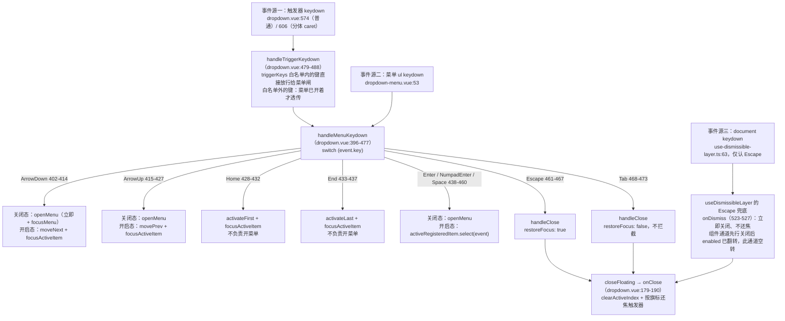
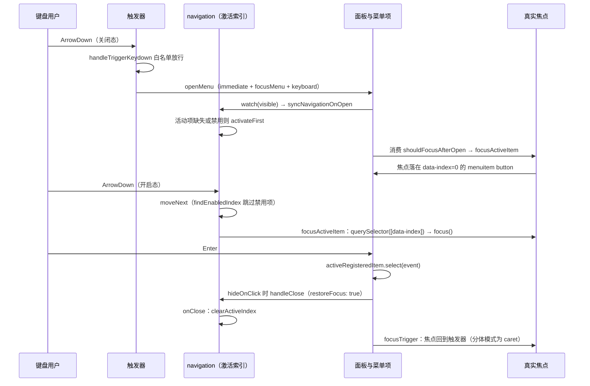

# 7-14 · Dropdown：键盘导航

> 本篇源码坐标（均为当前工作区实态）：
> - `packages/components/dropdown/src/dropdown.vue`（触发器装配、激活索引、82 行键盘总闸，667 行）
> - `packages/components/dropdown/src/dropdown-menu.vue`（菜单语义壳，57 行）、`dropdown-item.vue`（注册与选中，112 行）、`dropdown-item-impl.vue`（菜单项视图，99 行）
> - `packages/components/dropdown/src/dropdown.ts`（类型层，80 行）、`tokens.ts`（注入协议，34 行）、`use-dropdown.ts`（6 行）
> - 键盘基座：`packages/xiaoye-primitives/src/composables/use-list-navigation.ts`（95 行）
> - 样式：`packages/theme/src/components/dropdown.css`（203 行）
> - 测试：`packages/components/dropdown/__tests__/dropdown.spec.ts`（355 行）；类型夹具：`tests/types/fixtures/dropdown.ts`（96 行）
> - 文档示例：`apps/docs/examples/dropdown/`（basic / split-button / trigger-command / manual-close 等七例）

上一篇 7-13 拆了 Popconfirm 的确认语义；大纲给本篇的核心问题只有九个字（`column/02-分卷大纲.md:128`）：**roving focus 与菜单语义**。这九个字背后藏着三个更锋利的问题：

1. **键盘"去哪"由谁说了算？** 列表型浮层的键盘导航有两种经典管理模型：一种是 roving focus——真实焦点在菜单项之间迁移，焦点在哪激活就在哪（EP 的做法）；另一种是激活索引——组件里维护一个 `activeIndex`，焦点只是它的投影。dropdown 实码选了哪一种、为什么，是本篇的第一个定论。
2. **菜单语义做到哪一层？** `role="menu"`、`menuitem`、`aria-haspopup`、`aria-expanded`、roving tabindex——这些 ARIA 三件套之外，id 关联（`aria-controls` / `aria-labelledby`）做完整了吗？本篇会给出一份逐项核对的语义清单，包括两处悬空引用。
3. **键盘、鼠标、浮层关闭三套机制怎么咬合？** 4-05/4-06 两篇立了浮层三态状态机与关闭语义，本篇正面回答"键盘按下时它们如何协作"——`handleMenuKeydown` 的 82 行是全组件最长的函数，也是这张咬合图的全部实现。

本篇的大纲前置篇是 4-10（select 的泛型链路），但真正的前情是 6-03/6-15 已经讲过的 `useListNavigation` 扫描算法与 4-06 已经引过的 dropdown 装配段——本篇不再重复扫描算法本身，而是把镜头对准消费侧：**一部索引如何驱动整个菜单的键盘行为**。6-15 select 用一颗 87 行九分支的巨型 switch 做键盘路由，6-03 auto-complete 是它的瘦身版；dropdown 的键盘模型是同仓库里的第三种形态——它比 select 多了"焦点投影"，比 auto-complete 多了"打开键白名单"。三种形态的对照，是本篇的暗线。

## 一、定论先行：dropdown 的键盘模型是"索引激活"，不是 EP 式焦点群组

先回答任务里悬着的那桩考据：**dropdown 确实消费 `useListNavigation`**。4-06 第 24 行只是预告了"它维护一个跳过禁用项的活动索引，供 dropdown、select 这类列表型浮层做方向键导航"，实码证据在 `dropdown.vue:146-158`：

```typescript
// packages/components/dropdown/src/dropdown.vue:130-162
const referenceRef = computed<ReferenceElement | null>(() => {
  if (props.virtualTriggering && props.virtualRef) {
    return props.virtualRef;
  }

  if (internalVirtualRef.value) {
    return internalVirtualRef.value;
  }

  if (props.splitButton) {
    return caretButtonRef.value;
  }

  return triggerRef.value;
});

const navigationItems = computed(() =>
  isLegacyMode.value
    ? props.items.map((item) => ({
        disabled: item.disabled
      }))
    : registeredItems.value.map((item) => ({
        disabled: item.isDisabled()
      }))
);

const navigation = useListNavigation(() => navigationItems.value, {
  loop: props.loop
});

const activeRegisteredItem = computed(
  () => (!isLegacyMode.value ? registeredItems.value[navigation.activeIndex.value] ?? null : null)
);
```

这段代码里有本篇的第一个关键词：**归一**。dropdown 有两种内容模式——`items` 数组的兼容模式（`isLegacyMode`，`dropdown.vue:95`）与 `#dropdown` 插槽的组合模式。两者在键盘眼里必须长得一模一样，所以 `navigationItems` 把两种模式各自的项目源投影成同一种形状：一个只带 `disabled` 字段的数组。`useListNavigation` 拿到的永远是一个纯索引世界，它不需要知道菜单项是数组渲染的还是插槽注册的——**键盘导航的输入被收敛成"若干可禁用的槽位"**，这是索引模型天然的红利。

而"roving focus vs 索引激活"的定论是：**dropdown 实码是索引激活模型，roving tabindex 只是它的投影**。证据链有三条，先立在这，第四节展开：

- 激活是唯一真相：`navigation.activeIndex` 决定谁是"当前项"（`activeRegisteredItem`，160-162 行）；
- tabindex 是投影：活动项 `tabindex=0`、其余 `-1`（`getItemTabIndex`，251-254 行）；
- 真实焦点按需跟随：键盘步进后由 `focusActiveItem()` 把焦点同步过去（276-286 行）。

EP 的做法恰好相反。EP 的 `el-dropdown` 在内容区包了 `ElRovingFocusGroup`（`:loop="loop"`、`:current-tab-id="currentTabId"`、`orientation="horizontal"`），菜单项通过注入 `ROVING_FOCUS_GROUP_ITEM_INJECTION_KEY` 拿到自己的 `tabIndex` 与焦点回调——**焦点在哪，"当前项"就在哪**，焦点是唯一真相，索引（currentTabId）反而是焦点的投影。两组件甚至有一个同名的 `isUsingKeyboard` 标志：EP 的版本随事件类型置位（`event?.type === 'keydown'`）并接入其内部的 hover 焦点联动（`onItemLeave` 在 trigger 含 hover 时把焦点还给面板容器）；本库的 `isUsingKeyboard` 在 `dropdown.vue:85` 声明、331/366 行置位、535 行 provide 之后，**全仓库没有任何消费方**——一个预留未用的状态位，后文第五节还会提到。同一个问题域，两条相反的主权划分，这是本篇权衡一的底稿。

## 二、基座消费侧：useListNavigation 的契约与卫兵

`useListNavigation` 的环形扫描算法（`findEnabledIndex`，`use-list-navigation.ts:18-49`）6-03 第五节已经逐行讲过，本篇只从消费侧重新看一遍它的公开契约——composable 一共吐出九个出口，`dropdown.vue` 消费了其中七个（`activeIndex`、`setActiveIndex`、`clearActiveIndex`、`activateFirst/Last`、`moveNext/Prev`），`activeItem` 与 `findEnabledIndex` 留给消费方做扩展查询：

```typescript
// packages/xiaoye-primitives/src/composables/use-list-navigation.ts:51-95
  function setActiveIndex(index: number) {
    if (index < 0 || index >= items().length) {
      activeIndex.value = -1;
      return;
    }

    if (items()[index]?.disabled) {
      return;
    }

    activeIndex.value = index;
  }

  function clearActiveIndex() {
    activeIndex.value = -1;
  }

  function activateFirst() {
    activeIndex.value = findEnabledIndex(0, 1);
  }

  function activateLast() {
    activeIndex.value = findEnabledIndex(items().length - 1, -1);
  }

  function moveNext() {
    activeIndex.value = findEnabledIndex(activeIndex.value + 1, 1);
  }

  function movePrev() {
    activeIndex.value = findEnabledIndex(activeIndex.value - 1, -1);
  }

  return {
    activeIndex,
    activeItem,
    findEnabledIndex,
    setActiveIndex,
    clearActiveIndex,
    activateFirst,
    activateLast,
    moveNext,
    movePrev
  };
}
```

消费侧视角下，这个基座有三个设计决定值得点名。

**第一，`setActiveIndex` 的禁用卫兵是鼠标与键盘的汇合点。** 方向键走的 `moveNext/movePrev` 内部调 `findEnabledIndex`，扫描时天然跳过禁用项；而鼠标悬停走的 `setActiveIndex` 是"点名式"赋值，必须有 51-62 行这道卫兵兜底——鼠标划过禁用项时高亮纹丝不动。dropdown 把两条输入源都接到这个函数族上：键盘走 `moveNext/movePrev`，鼠标走 `handleItemPointerMove` → `setActiveByUid` → `setActiveIndex`（`dropdown.vue:268-270`）。**一个卫兵函数，两种输入语义，一处裁决**——这和 6-15 里"setActiveIndex 的禁用卫兵是鼠标与键盘的汇合点"是同一句话，因为这个基座本来就是共享的。

**第二，`clearActiveIndex` 是关闭语义的一部分。** 4-06 已经引过 `onClose` 回调（`dropdown.vue:179-190`），其中一行 `navigation.clearActiveIndex()` 保证下次打开时活动项从头算起——关闭不只是"面板消失"，还是键盘状态的归零。

**第三，`loop` 的默认值是 `true`**（`dropdown.vue:61`），从末项下移绕回首项。EP 的 `loop` 默认同为 `true`，这点两家一致；差异在 EP 的回绕发生在 roving focus group 内部，本库发生在 `findEnabledIndex` 的扫描循环里（29-35 行的回绕逻辑）。

## 三、全景键位表：handleMenuKeydown 的 82 行

现在到本篇的主角。`handleMenuKeydown`（`dropdown.vue:396-477`，82 行，七组 case 加一个 default）是全组件最长的函数，4-06 只摘过它的关闭相关分支，本篇上全文：

```typescript
// packages/components/dropdown/src/dropdown.vue:396-477
async function handleMenuKeydown(event: KeyboardEvent) {
  if (props.disabled) {
    return;
  }

  switch (event.key) {
    case "ArrowDown":
      event.preventDefault();
      if (!visible.value) {
        await openMenu({
          immediate: true,
          focusMenu: true,
          keyboard: true
        });
      } else {
        navigation.moveNext();
        focusActiveItem();
      }
      break;
    case "ArrowUp":
      event.preventDefault();
      if (!visible.value) {
        await openMenu({
          immediate: true,
          focusMenu: true,
          keyboard: true
        });
      } else {
        navigation.movePrev();
        focusActiveItem();
      }
      break;
    case "Home":
      event.preventDefault();
      navigation.activateFirst();
      focusActiveItem();
      break;
    case "End":
      event.preventDefault();
      navigation.activateLast();
      focusActiveItem();
      break;
    case "Enter":
    case "NumpadEnter":
    case " ":
      event.preventDefault();
      if (!visible.value) {
        await openMenu({
          immediate: true,
          focusMenu: true,
          keyboard: true
        });
        break;
      }

      if (isLegacyMode.value) {
        const item = props.items[navigation.activeIndex.value];
        if (item) {
          handleLegacySelect(item);
        }
        break;
      }

      activeRegisteredItem.value?.select(event);
      break;
    case "Escape":
      event.preventDefault();
      handleClose({
        restoreFocus: true,
        immediate: true
      });
      break;
    case "Tab":
      handleClose({
        restoreFocus: false,
        immediate: true
      });
      break;
    default:
      break;
  }
}
```

翻译成一张完整键位表：

| 键 | 行号 | 关闭态 | 开启态 | 拦截 | 语义依据 |
| --- | --- | --- | --- | --- | --- |
| ArrowDown | 402-414 | 立即打开菜单（`focusMenu + keyboard`） | `moveNext` + `focusActiveItem` | 是 | WAI-ARIA menu 惯例 |
| ArrowUp | 415-427 | 立即打开菜单 | `movePrev` + `focusActiveItem` | 是 | 同上 |
| Home | 428-432 | 仅预激活首项（**不开菜单**） | `activateFirst` + `focusActiveItem` | 是 | 列表导航补充键位 |
| End | 433-437 | 仅预激活末项 | `activateLast` + `focusActiveItem` | 是 | 同上 |
| Enter / NumpadEnter / Space | 438-460 | 立即打开菜单 | 选中活动项（双模式各走各的选中通道） | 是 | 打开与确认双语义 |
| Escape | 461-467 | —（无菜单可关，`closeFloating` 空转） | 关闭 + 还焦 | 是 | 取消手势 |
| Tab | 468-473 | — | 关闭、**不还焦、不拦截** | 否 | 焦点前移是可达性底线 |

这张表有三个值得停笔的细节。

**其一，Home/End 与方向键的分工不对称。** 方向键在关闭态承担"打开"语义（WAI-ARIA 的 combobox/menu 惯例：ArrowDown 打开并进入菜单），Home/End 却只在开启态生效——关闭态按 Home 只会 `activateFirst()` 写一次激活索引，此时菜单未渲染、`menuRef` 为 null，`focusActiveItem()` 变成一次无操作，菜单也不会打开。这个索引不会丢：下次打开时 `syncNavigationOnOpen`（215-228 行）检查活动项有效就保留，等效于"预激活"。对照组很鲜明：6-15 里 select 的 Home 分支在关闭态会先 `openDropdown()` 再 `activateFirst()`（`select.vue:512-518`）。**同一颗键，select 认为"跳到头"包含"先展开"，dropdown 认为"跳到头"只是菜单内部的手势**——dropdown 的选择更保守，代价是关闭态按 Home/End 没有可见反馈；收益是不给"快速跳到首项"一个意外的开菜单副作用。

**其二，Enter 的选中通道双模式各走各的。** 组合模式调 `activeRegisteredItem.value?.select(event)`（459 行），把键盘事件直接递给注册表里那个闭包——它就是 `dropdown-item.vue` 的 `handleSelect`（52-66 行），`KeyboardEvent` 被当作"伪点击"传入；兼容模式走 `handleLegacySelect`（303-316 行），从 `props.items` 数组按下标取项。451-457 行的 `isLegacyMode` 分支还藏着一个静默边界：激活索引越界时（理论上被卫兵挡住，但数组模式的项目可以动态变化）选中直接不做——**键盘选中永远不猜**。

**其三，Escape 与 Tab 的关闭理由不同。** 这一段 4-06 第 824 行已经定性过：Escape 关闭携带 `restoreFocus: true`——用户明确说"我不要了"，焦点应回触发器；Tab 关闭携带 `restoreFocus: false`——Tab 本身就是焦点前移的手势，菜单不截胡。旗标在 `handleClose` 写入（318-323 行）、在 `onClose` 消费后立即复位（186-189 行），一次性使用。本篇第四节会看到这条旗标的完整兑现路径。

整张键位表的路由全景如下。注意 dropdown 有**三个键盘事件源**：触发器、菜单面板、document 级的 dismissible 层——这和 6-15 select 的三通道拓扑同构，但 dropdown 的触发器通道多了一道白名单闸门：



那道白名单闸门值得单独一段。`handleTriggerKeydown`（479-488 行）的逻辑分两岔：键在 `triggerKeysSet` 里（默认 `["Enter", "NumpadEnter", " ", "ArrowDown"]`，`dropdown.vue:44`）→ 无条件交给 `handleMenuKeydown`，让"关闭态按 ArrowDown 打开"这类逻辑生效；键不在白名单里 → 只有菜单已开才透传（481-483 行）。**为什么要透传？** 因为键盘打开菜单后焦点可能还停在触发器上（只有 `focusMenu` 被请求时焦点才进面板），此时用户继续按方向键，事件目标是触发器而非菜单——如果不透传，菜单打开后的第二次 ArrowDown 就死了。白名单外的键透传还有一个隐含收益：`Escape` 不在默认 `triggerKeys` 里，菜单开着时按 Escape 从触发器透传进总闸，在 `handleClose` 处关闭——触发器自己也能成为 Escape 的第一现场。

## 四、焦点投影：activeIndex 如何变成真实 DOM 焦点

索引模型必须回答一个问题：索引变了，真实焦点跟不跟、什么时候跟、跟到哪。dropdown 的答案集中在五个函数和一次 watch 里。

先看投影核心。`dropdown.vue:247-286` 这一段是"索引世界"与"DOM 世界"的全部接口：

```typescript
// packages/components/dropdown/src/dropdown.vue:247-286
function getItemIndex(uid: number) {
  return registeredItems.value.findIndex((item) => item.uid === uid);
}

function getItemTabIndex(uid: number) {
  const index = getItemIndex(uid);
  return navigation.activeIndex.value === index ? 0 : -1;
}

function isItemActive(uid: number) {
  return navigation.activeIndex.value === getItemIndex(uid);
}

function setActiveByUid(uid: number) {
  const index = getItemIndex(uid);

  if (index >= 0) {
    navigation.setActiveIndex(index);
  }
}

function handleItemPointerMove(uid: number) {
  setActiveByUid(uid);
}

function handleItemPointerLeave() {
  return;
}

function focusActiveItem() {
  if (navigation.activeIndex.value < 0) {
    menuRef.value?.focus();
    return;
  }

  const activeElement = menuRef.value?.querySelector<HTMLElement>(
    `[data-index="${navigation.activeIndex.value}"]`
  );
  activeElement?.focus();
}
```

五个函数、两条通道，一条条说。

**tabindex 通道（`getItemTabIndex`）。** 每个 `dropdown-item` 在渲染时问注入层要自己的 tabindex（`dropdown-item.vue:34-36` 的 `itemIndex / active / tabindex` 三个 computed），活动项 0、其余 -1——这正是 roving tabindex 的 DOM 形态：Tab 键进入菜单时只会停在活动项上，不会在 N 个菜单项间逐个停留。注意它是以 uid 查表换算的，不是子组件自己算的——**"谁是活动项"的裁判权在父组件，子组件只领结果**。`dropdown.spec.ts:348-349` 用两条断言锁住了这个行为（禁用首项时，首项 -1、次项 0），第六节的测试全貌里会再见到它们。

**focus 通道（`focusActiveItem`）。** 真实焦点的迁移不在索引变化处发生，而是集中在一个函数里按需调用：`querySelector` 按活动索引找 `[data-index]` 元素（`dropdown-item.vue:87` 为每个注册项写入 `data-index`）然后 `.focus()`。它有三个调用时机：键盘步进后（412/425/431/436 行）、键盘打开菜单后（`watch(visible)` 消费 `shouldFocusAfterOpen` 旗标，511-514 行）、以及 never——鼠标悬停**不调用它**。还有一条兜底分支：活动索引为 -1 时聚焦 `menuRef` 本身——菜单 ul 是 `tabindex="-1"` 的可聚焦容器（`dropdown-menu.vue:51`，样式上 `outline: none`，`dropdown.css:107`），这是"焦点有处可去"的保底。

**鼠标通道（`handleItemPointerMove` / `handleItemPointerLeave`）。** 这一对是索引模型最有个性的地方：鼠标划过菜单项，`pointermove` 把激活索引同步过去（高亮跟上鼠标）；`pointerleave` 却是一个**空函数**（272-274 行）——鼠标离开时既不清激活、也不搬焦点。激活"滞留"是特性而非疏漏：用户鼠标划过三项后按 Enter，选中的应该还是最后划过的那项；如果 `pointerleave` 清了激活，Enter 就要靠 `activeRegisteredItem` 的空值守卫拒绝执行，操作意图直接蒸发。EP 在这里做了相反的决定——它的 `onItemLeave` 会在 hover 触发模式下把真实焦点 `contentEl.focus({ preventScroll: true })` 还给面板容器。焦点群组模型里"焦点必须始终有主"，所以离开菜单项就要安置焦点；索引模型里激活与焦点解耦，离开就是离开，什么都不用做。

**打开时序（`watch(visible)` + `syncNavigationOnOpen`）。** 键盘打开菜单的完整链路是：`openMenu({ immediate: true, focusMenu: true, keyboard: true })`（405-409 行）→ `openFloating` 置 `visible` → watch 回调（499-515 行）等 `nextTick`（DOM 挂上）→ `syncNavigationOnOpen()` 校准索引 → `updatePosition` + `startAutoUpdate`（4-06 讲过的五拍节奏）→ 消费 `shouldFocusAfterOpen` 旗标调 `focusActiveItem()`。其中 `syncNavigationOnOpen`（215-228 行）解决"重开菜单时高亮停在哪"：

```typescript
// packages/components/dropdown/src/dropdown.vue:206-228
function focusTrigger() {
  const target = props.splitButton ? caretButtonRef.value : triggerRef.value;
  target?.focus();
}

function isTriggerEnabled(trigger: DropdownTrigger) {
  return normalizedTriggers.value.includes(trigger);
}

function syncNavigationOnOpen() {
  const currentItems = navigationItems.value;

  if (!currentItems.length) {
    navigation.clearActiveIndex();
    return;
  }

  const active = currentItems[navigation.activeIndex.value];

  if (!active || active.disabled) {
    navigation.activateFirst();
  }
}
```

空菜单清索引；活动项存在且可用则**保留**（上一轮的浏览位置是记忆）；活动项缺失或已禁用则跳到第一个可用项。注意 `focusTrigger` 也在这段里——它是 Escape 还焦的终点，且分体模式下还的是 caret 按钮而不是主按钮（207 行），因为 caret 才是 `aria-expanded` 的持有者，第八节展开。

把一次完整的键盘会话串起来，时序如下：



这张时序图里藏着索引模型的一个隐含纪律：**焦点永远由组件命令式调度，绝不靠 DOM 事件反向驱动**。用户点击菜单项时（`dropdown-item.vue:100` 的 `@focus="dropdown?.setActiveByUid(uid)"`），焦点事件会把激活索引同步过去——这是唯一的"焦点 → 索引"反向通道，而且它只改索引、不触发任何 focus 搬运，不会形成环。EP 的焦点群组里 `handleFocus → onItemFocus(id)` 是同构的反向通道，但那在 EP 是**主通道**（currentTabId 由焦点事件驱动），在本库只是**校准通道**。同一个方向的数据流，主权等级完全不同。

还有一小段工程细节值得记录：`openMenu`（325-339 行）与 `handleClose`（318-323 行）合起来是键盘对浮层状态机的全部接口。

```typescript
// packages/components/dropdown/src/dropdown.vue:318-339
function handleClose(options?: { restoreFocus?: boolean; immediate?: boolean }) {
  restoreFocusAfterClose.value = Boolean(options?.restoreFocus);
  closeFloating({
    immediate: options?.immediate ?? true
  });
}

async function openMenu(options?: { immediate?: boolean; focusMenu?: boolean; keyboard?: boolean }) {
  if (props.disabled || !hasMenuContent.value) {
    return;
  }

  if (options?.keyboard) {
    isUsingKeyboard.value = true;
  }

  shouldFocusAfterOpen.value = Boolean(options?.focusMenu);

  openFloating({
    immediate: options?.immediate ?? !isTriggerEnabled("hover")
  });
}
```

`immediate` 的默认值是 `!isTriggerEnabled("hover")`（337 行）——键盘打开永远跳过 hover 延迟，除非这个 dropdown 同时配置了 hover 触发（此时键盘打开复用 openDelay 通道）。这是一个"键盘不应等待鼠标延迟"的直觉表达：hover 打开要 80ms 的防抖（`openDelay: 80`，45 行），键盘按下到菜单出现应该是瞬时的。而 `isUsingKeyboard` 置位（331 行）之后没有任何消费方——第五节的语义清单里我会把它列为预留位。

## 五、菜单语义：ARIA 三件套与两个悬空引用

键盘模型解决"去哪"，菜单语义解决"是什么"。dropdown 的 ARIA 面板由三个模板承担，先看两个壳。

菜单容器（`dropdown-menu.vue:22-57`）——语义属性、焦点容器与 keydown 挂点都在这个 ul 上：

```vue
<!-- packages/components/dropdown/src/dropdown-menu.vue:22-57 -->
const nativeAttrs = computed<Record<string, unknown>>(() => {
  const rest = { ...attrs };
  delete rest.class;
  delete rest.style;
  return rest;
});

const rootClasses = computed(() => [`${ns.base.value}__menu`, attrs.class]);

onMounted(() => {
  if (dropdown) {
    dropdown.menuRef.value = menuElementRef.value;
  }
});

onBeforeUnmount(() => {
  if (dropdown) {
    dropdown.menuRef.value = null;
  }
});
</script>

<template>
  <ul
    ref="menuElementRef"
    :class="rootClasses"
    :style="attrs.style"
    :role="dropdown?.role.value ?? 'menu'"
    :aria-labelledby="dropdown?.triggerId.value"
    tabindex="-1"
    v-bind="nativeAttrs"
    @keydown="dropdown?.handleMenuKeydown"
  >
    <slot />
  </ul>
</template>
```

菜单项（`dropdown-item-impl.vue:68-99`）——`li[role=none]` 剥掉列表语义，内部一个原生 `button` 承接 `menuitem`：

```vue
<!-- packages/components/dropdown/src/dropdown-item-impl.vue:68-99 -->
<template>
  <li :class="rootClasses" :style="attrs.style" role="none">
    <button
      ref="itemRef"
      type="button"
      :class="buttonClasses"
      :role="props.role"
      :tabindex="props.tabindex"
      :disabled="props.disabled"
      :aria-disabled="props.disabled ? 'true' : undefined"
      :data-text-value="props.textValue || undefined"
      v-bind="nativeAttrs"
    >
      <span v-if="$slots.icon || props.icon" class="xy-dropdown__item-icon" aria-hidden="true">
        <slot name="icon">
          <XyIcon :icon="props.icon" :size="14" />
        </slot>
      </span>

      <span class="xy-dropdown__item-content">
        <span class="xy-dropdown__item-label">
          <slot />
        </span>
        <small v-if="$slots.description || props.description" class="xy-dropdown__item-description">
          <slot name="description">
            {{ props.description }}
          </slot>
        </small>
      </span>
    </button>
  </li>
</template>
```

触发器侧（`dropdown.vue:559-579`，普通模式）——`role="button"`、`aria-expanded`、`aria-controls`、`aria-haspopup` 四件齐上：

```vue
<!-- packages/components/dropdown/src/dropdown.vue:559-579 -->
<template>
  <span :class="rootClasses" :style="attrs.style">
    <template v-if="!props.splitButton">
      <span
        ref="triggerRef"
        class="xy-dropdown__trigger"
        role="button"
        :tabindex="props.disabled ? -1 : props.tabindex"
        :aria-expanded="visible"
        :aria-controls="listId"
        :aria-haspopup="props.role === 'menu' ? 'menu' : undefined"
        @click="handleTriggerClick"
        @contextmenu="handleContextMenu"
        @mouseenter="scheduleOpen"
        @mouseleave="scheduleClose"
        @keydown="handleTriggerKeydown"
      >
        <slot>
          <button type="button" class="xy-dropdown__default-trigger">更多操作</button>
        </slot>
      </span>
    </template>
```

拼起来，dropdown 的语义清单如下，逐项核对后的结论是"核心三件套完整、id 关联两处悬空"：

| 语义 | 位置 | 状态 |
| --- | --- | --- |
| `role="menu"`（默认，可切 `navigation`） | `dropdown.vue:42` 默认值 + `dropdown-menu.vue:49` | 完整 |
| `menuitem` / `link` 随 role 映射 | `dropdown.vue:97`（`itemRole`）+ impl 74 行 | 完整 |
| `li[role=none]` 剥列表语义 | impl 69 行 | 完整 |
| `aria-haspopup="menu"` 仅 menu 角色挂 | `dropdown.vue:569`（普通）/ 600（分体） | 完整 |
| `aria-expanded` / `aria-controls` | 567-568 / 598-599 | 完整 |
| `aria-labelledby`（菜单回指触发器） | `dropdown-menu.vue:50` | **悬空** |
| roving tabindex（活动项 0 / 其余 -1） | `getItemTabIndex` + impl 75 行 | 完整 |
| `aria-disabled` + 原生 `disabled` | impl 76-77 行 | 完整 |
| 分隔线的 `role="separator"` | — | **缺失** |
| caret 按钮的 `aria-label` | — | **缺失** |

两处悬空与两处缺失值得逐个说明，因为它们是"语义做到哪一层"这个问题的真实边界。

**悬空一：`aria-labelledby` 指向一个不存在的 id。** 菜单 ul 上写着 `aria-labelledby="dropdown?.triggerId.value"`，而 `triggerId` 就是组件生成的 `listId`（`dropdown.vue:100`，一个 `xy-dropdown-${随机串}`）。但触发器 span（562-574 行）**从未绑定 `:id="triggerId"`**——屏幕阅读器顺着 `aria-labelledby` 找触发器时找不到锚点。id 生成了、被引用了、唯独没挂到该挂的元素上。

**悬空二：组合模式下 `aria-controls` 同样悬空。** 触发器的 `aria-controls="listId"` 指向菜单 ul，兼容模式下这个 id 由 `<XyDropdownMenu :id="listId">` 显式补上（638 行）；组合模式下用户自己写 `<xy-dropdown-menu>`，不会知道那个随机 id，ul 就没有 id——`aria-controls` 成了 dangling reference。修法也直白：要么 dropdown-menu 在 onMounted 时若自身无 id 则回填 `triggerId`，要么触发器的 `aria-controls` 改为指向面板容器。**语义属性的正确性不只是"写了没有"，还包括"引用是否可达"**——这是本篇语义清单里最值得带走的一条。

**缺失一：`divided` 只有视觉没有语义。** EP 的 dropdown-item-impl 会为 divided 项渲染一个 `li[role="separator"]`；本库的 divided 只是在 wrapper 上加 `is-divided` 类（`dropdown.css:116-120` 画一条上边框），li 仍是 `role="none"`。屏幕阅读器用户听不到"这里有一组分隔"。这是明确的可补项：`role="separator"` 应挂在 wrapper li 上。

**缺失二：分体 caret 按钮没有 `aria-label`。** EP 的 caret 按钮挂了 `:aria-label="t('el.dropdown.toggleDropdown')"`（"切换下拉菜单"），本库的 caret（594-609 行）只有 `aria-expanded` 没有 label——一个只含图标的按钮，无障碍树里是个空名按钮。同样是可以一行修掉的。

语义清单里也有本库做得更细的一处：**`aria-haspopup` 只在 `role === 'menu'` 时挂**（569/600 行）。role 切到 `navigation` 时这个属性必须消失——一个导航链接列表不是弹出菜单，`haspopup` 会误导阅读器。EP 的 role 类型还多一个 `button` 值（映射为 `role="button"` 的菜单项），本库的 `dropdownRoles` 只有两值（`dropdown.ts:5`）。**少一个枚举值，少一条要测的语义路径**，这是有意的收窄还是省略，源码没有说；可以佐证"枚举即合同"的是类型夹具的负向断言——`tests/types/fixtures/dropdown.ts:76-79` 用 `@ts-expect-error` 锁死非法 trigger 值 `"focus"`，三值 trigger（hover/click/contextmenu，与 EP 的 dropdown 触发器同集）与两值 role 一样，都是被测试合同承认的现状。

## 六、注册表与菜单树：扁平结构的边界

键盘模型还依赖一个基础设施：**菜单项注册表**。组合模式下父组件根本不渲染菜单项（`<slot name="dropdown" />` 原样透传，632-634 行），它必须靠子组件"报到"才能建立索引世界。协议在 `tokens.ts:4-10`：

```typescript
// packages/components/dropdown/src/tokens.ts:4-10
export interface DropdownRegisteredItem {
  uid: number;
  isDisabled: () => boolean;
  getTextValue: () => string | undefined;
  getEl: () => HTMLElement | null;
  select: (event?: MouseEvent | KeyboardEvent) => void;
}
```

注册与注销的生命周期在 `dropdown-item.vue:52-80`，同一段里还有键盘 Enter 最终调用的 `handleSelect`：

```typescript
// packages/components/dropdown/src/dropdown-item.vue:52-80
function handleSelect() {
  if (!dropdown || props.disabled) {
    return;
  }

  const payload = buildPayload();
  dropdown.commandHandler(payload.command ?? payload.textValue, payload);

  if (dropdown.hideOnClick.value) {
    dropdown.handleClose({
      restoreFocus: true,
      immediate: true
    });
  }
}

onMounted(() => {
  dropdown?.registerItem({
    uid,
    isDisabled: () => props.disabled,
    getTextValue: () => buildPayload().textValue,
    getEl: () => itemRef.value?.itemRef ?? null,
    select: handleSelect
  });
});

onBeforeUnmount(() => {
  dropdown?.unregisterItem(uid);
});
```

这份协议里有四个刻意的形状。**`select` 是闭包而不是事件**——键盘 Enter 在 `handleMenuKeydown` 里直接调用 `activeRegisteredItem.value?.select(event)`（459 行），选中逻辑由子组件自带、父组件零复制；**`isDisabled` / `getTextValue` 是 getter 而不是快照**——`navigationItems` 每次重算时实时拉取最新禁用态，props 变化无需重新注册；**注册以 uid 去重更新**（`registerItem`，230-245 行，热更新场景同 uid 替换不重复追加）；**`getEl` 返回的是内部 button 而非 li**——将来任何"滚动到活动项"的需求（超长菜单 + `maxHeight`）拿到的是正确的滚动基准。

这个注册表模型引出本篇的权衡二：**菜单树是扁平的，不支持递归子菜单**。本库的 dropdown 只有 `ul > li > button` 一层结构：`dropdown-menu` 是 ul，`dropdown-item` 是叶子，没有 `dropdown-submenu`，tokens 协议里也没有 children 概念。这不是能力疏漏，而是索引模型的天然边界——`activeIndex` 是一个标量，扁平数组的下标；一旦菜单成树，"活动项"就需要路径（`[1, 2, 0]`）而非下标，`moveNext` 要跨层级处理子菜单的开合，整个键位表要为子菜单再加一组 ArrowRight/ArrowLeft 语义。EP 用嵌套组件树 + collection 机制支持了子菜单，代价是导航逻辑复杂度上一个量级。本库用"不支持递归"换来了 82 行键盘总闸的线性简单。**边界画的不是"能不能"，而是"这个组件库愿意为哪一层复杂度付税"**——级联菜单的真空由 6-04 Cascader 和 5-15 Menu 补位，dropdown 收敛为单层动作菜单。

扁平模型还有一个实态边界值得如实记录：如果有人在 `dropdown-item` 里再嵌一套 `xy-dropdown-menu`（错误用法），`dropdown-menu.vue:31-35` 的 onMounted 会把 `dropdown.menuRef.value` 覆盖成内层 ul——`focusActiveItem` 就会到错误的容器里找 `[data-index]`。协议没有防御这个场景（没有"menu 只能出现一次"的断言），这是扁平模型开放注册的另一面：**注册表信任使用者的树形是良构的**。

注册顺序也值得一看：`registerItem` 用不可变展开追加（240 行，`[...registeredItems.value, item]` 而非原地 push），onMounted 的调用顺序即 DOM 顺序（Vue 挂载子组件按序执行），所以 `getItemIndex` 的下标与视觉顺序一致；动态 `v-if` 新增的项追加在尾部。若菜单项需要"插入到中间"的排序能力，注册表就得改成按 DOM `compareDocumentPosition` 排序——EP 的 ElCollection 内部就是这么做的。本库没有做这层，同理是扁平单层菜单下的合理省略。

## 七、样式层全文件：max-height 继承链与双高亮通道

`dropdown.css` 全文 203 行，4-06 引过面板质感（19-50）、箭头四向（52-58/66-78）几段，本篇按"键盘与语义的样式接口"这条线把全文件过一遍。先看面板与菜单容器：

```css
/* packages/theme/src/components/dropdown.css:19-50 */
.xy-dropdown__panel {
  --xy-dropdown-panel-bg-resolved: var(
    --xy-dropdown-panel-bg,
    var(
      --xy-popper-bg,
      var(--xy-dialog-bg, color-mix(in srgb, var(--xy-bg-floating) 98%, var(--xy-bg-subtle)))
    )
  );
  --xy-dropdown-panel-border-resolved: var(
    --xy-dropdown-panel-border,
    var(
      --xy-popper-border-color,
      color-mix(in srgb, var(--xy-border-subtle) 92%, var(--xy-border))
    )
  );
  --xy-dropdown-panel-shadow-resolved: var(
    --xy-dropdown-panel-shadow,
    var(
      --xy-popper-shadow,
      0 0 0 1px color-mix(in srgb, var(--xy-bg-floating) 8%, transparent),
      0 2px 8px color-mix(in srgb, var(--xy-text-heading) 7%, transparent)
    )
  );
  position: absolute;
  min-width: 180px;
  padding: 4px;
  border: 1px solid var(--xy-dropdown-panel-border-resolved);
  border-radius: var(--xy-radius-lg);
  background: var(--xy-dropdown-panel-bg-resolved);
  box-shadow: var(--xy-dropdown-panel-shadow-resolved);
  overflow: visible;
}
```

```css
/* packages/theme/src/components/dropdown.css:103-110 */
.xy-dropdown__menu {
  margin: 0;
  padding: 0;
  list-style: none;
  outline: none;
  max-height: inherit;
  overflow: auto;
}
```

键盘视角下这两段最值得讲的是 **max-height 继承链**：`props.maxHeight`（`dropdown.ts:66`，字符串或数字）在 `dropdown.vue:109-116` 的 `menuStyle` 里归一成 CSS 值、挂到面板 div（621 行 `:style="[floatingStyle, menuStyle, ...]"`），ul 再用 `max-height: inherit` 继承——滚动条长在菜单 ul 上（`overflow: auto`）而不是面板上，箭头与圆角留在外面。顺带一提，`dropdown.css:94-101` 还有一个 `.xy-dropdown__list` 类，全仓库检索无任何消费方（菜单渲染的是 `__menu` 类）——一段无主的历史遗留样式，如实记录。

再看激活与焦点的**双高亮通道**：

```css
/* packages/theme/src/components/dropdown.css:149-203 */
.xy-dropdown__item-description,
.xy-dropdown__item small {
  color: var(--xy-text-secondary);
  line-height: 1.5;
}

.xy-dropdown__item.is-active,
.xy-dropdown__item:hover {
  background: color-mix(in srgb, var(--xy-bg-subtle) 82%, var(--xy-dropdown-panel-bg-resolved));
}

.xy-dropdown__item:focus-visible,
.xy-dropdown__default-trigger:focus-visible,
.xy-dropdown__caret-button:focus-visible {
  outline: 2px solid color-mix(in srgb, var(--xy-brand) 58%, var(--xy-mix-light));
  outline-offset: 2px;
  box-shadow: 0 0 0 1px color-mix(in srgb, var(--xy-brand) 16%, transparent);
}

.xy-dropdown__item-icon,
.xy-dropdown__item-icon svg {
  display: inline-flex;
  align-items: center;
  color: color-mix(in srgb, var(--xy-text-secondary) 92%, var(--xy-mix-light));
}

.xy-dropdown__item.is-danger {
  color: var(--xy-danger);
}

.xy-dropdown__item.is-disabled {
  cursor: not-allowed;
  opacity: 0.5;
}

.xy-dropdown__item.is-disabled:hover {
  background: transparent;
}

.xy-dropdown__split {
  display: inline-flex;
}

.xy-dropdown__split-main {
  border-top-right-radius: 0;
  border-bottom-right-radius: 0;
}

.xy-dropdown__caret-button {
  min-width: 40px;
  padding-inline: 10px;
  border-top-left-radius: 0;
  border-bottom-left-radius: 0;
}
```

155-158 行是索引模型的视觉合同：`is-active`（激活索引的类，由 `active` prop 驱动）与 `:hover`（鼠标的物理位置）**共享同一份高亮**。两条输入、一种视觉，用户不会感知到"索引"这个中间物的存在。160-166 行则是焦点可见性：`focus-visible` 的品牌色描边只挂在三个真实接收焦点的元素上（菜单项 button、默认触发器、分体 caret）——键盘用户焦点进菜单时看到的是描边 + 高亮的叠加（活动项同时被 focus 和标 is-active），鼠标用户只有高亮没有描边。**is-active 管语义激活，:focus-visible 管键盘在场，两者叠加但不混淆**。179-186 行补了禁用态的克制：半透明、cursor 变化、hover 不给背景——禁用项的视觉静止与 6.2 节那道 `setActiveIndex` 禁用卫兵是同一条规则在样式层的投影。188-203 行是分体按钮的圆角拼合，第八节展开。

## 八、split-button：caret 的三重身份

分体按钮模式下，右侧那颗只有箭头的 caret 按钮同时扮演三个角色，这是本篇权衡三的样本。

**角色一：定位基准。** `referenceRef`（130-144 行，本篇第一节引过全段）的分支顺序是 virtualRef → 内部虚拟 ref（右键坐标）→ 分体时 `caretButtonRef` → 普通 `triggerRef`。菜单从 caret 边缘弹出而不是横跨整个主按钮——这是分体模式的视觉契约。EP 的 split-button 同样把 popper 挂在 caret 上，两家一致。

**角色二：交互开关。** 主按钮的 click 走业务通道（`handleMainButtonClick`，490-497 行，emit `click` 事件，与菜单无关），caret 的 click 才是 `handleTriggerClick` 的 `toggle()`（361-368 行）——一次点击一个语义，绝不含糊。测试 `dropdown.spec.ts:115-149` 对这条边界有完整锁定：点主按钮只 emit click、菜单不开；点 caret 菜单才开。

**角色三：语义持有者。** `aria-expanded` / `aria-controls` / `aria-haspopup` 三件全挂在 caret 上（598-600 行），Escape 还焦也回 caret（`focusTrigger`，207 行的分支）。主按钮在无障碍树里就是一个普通按钮。唯一的缺口上文已记：caret 缺 `aria-label`。

白名单侧，分体模式给 4-06 讲过的 dismissible 白名单（`dropdown.vue:517-528`，519 行的四颗 ref）添了一个细节：`mainButtonRef` 也在白名单里——用户从 caret 按下、拖到主按钮上松开（或反过来），mousedown 始终落在"触发器领地"内，不会误判为外部点击。**两颗按钮共享同一份"我是触发器"的身份**，这在普通模式下由单个 `triggerRef` 承担。

顺带把触发器装配的其余部分收拢：普通模式的触发器是一个 `role="button"` 的 span（564-566 行），默认插槽是原生 button 兜底（577 行），`tabindex` 可配（默认 0，60 行，disabled 时强制 -1）；右键触发走 `handleContextMenu`（370-394 行），把鼠标坐标包成只有 `getBoundingClientRect` 的虚拟 reference（376-389 行，4-06 引过原文）实现"贴着光标弹出"。这些 4-06 已讲过的机制本篇不再展开，只需知道它们都汇入同一个 `referenceRef`。

## 九、测试与类型夹具：锁住了什么、没锁什么

键盘与语义的测试合同集中在两个用例。4-06 引过 305-324 的 hideOnClick 优先级用例，本篇看另一个——navigation 语义、roving tabindex 与 Tab 关闭（`dropdown.spec.ts:326-354`）：

```typescript
// packages/components/dropdown/__tests__/dropdown.spec.ts:326-354
  it("支持 navigation role、Tab 关闭和跳过 disabled 项", async () => {
    const wrapper = mount(XyDropdown, {
      attachTo: document.body,
      props: {
        trigger: "click",
        role: "navigation",
        items: [
          { key: "draft", label: "草稿", disabled: true },
          { key: "publish", label: "发布" },
          { key: "archive", label: "归档" }
        ]
      }
    });

    await wrapper.find(".xy-dropdown__trigger").trigger("click");
    await nextTick();

    const menu = document.body.querySelector(".xy-dropdown__menu") as HTMLElement | null;
    const items = [...document.body.querySelectorAll(".xy-dropdown__item")] as HTMLButtonElement[];

    expect(menu?.getAttribute("role")).toBe("navigation");
    expect(items[1]?.getAttribute("role")).toBe("link");
    expect(items[0]?.tabIndex).toBe(-1);
    expect(items[1]?.tabIndex).toBe(0);

    menu?.dispatchEvent(new KeyboardEvent("keydown", { key: "Tab", bubbles: true }));
    await nextTick();
    expect((document.body.querySelector(".xy-dropdown__panel") as HTMLElement | null)?.style.display).toBe("none");
  });
```

这个用例一石三鸟：role 映射（menu→navigation 时 item→link，346-347 行）、roving tabindex 的跳禁用行为（首项禁用，激活让位次项，348-349 行——背后正是 `syncNavigationOnOpen` → `activateFirst` → `findEnabledIndex` 的链路）、Tab 关闭（351-353 行）。加上 151-174 行的 `triggerKeys: ["F2"]` 自定义打开键用例（171-173 行），键盘合同的锁点分布在这些位置。

但要说清楚**没锁什么**：全部 355 行测试里，ArrowDown/ArrowUp/Home/End/Enter/Escape 六组键位没有一条直接断言——`syncNavigationOnOpen` 的索引校准、`focusActiveItem` 的焦点投影、Escape 的还焦旗标、Home/End 的预激活，都只被 348-349 行的 tabindex 结果间接覆盖。对比 6-15 select 的 537 行测试（"支持键盘选择高亮项"等直接按方向键断言高亮位移），dropdown 的键盘直测是明确的空白。原因可以理解——键盘链路的核心在 `useListNavigation` 基座侧，6-03/6-15 的消费方测试已经锁过基座；但"基座对、装配错"的组合风险依然存在（比如 handleTriggerKeydown 的透传分支就完全无测）。**诚实的结论是：dropdown 的键盘导航测试锁了语义与 tabindex 两端，没锁键位行为的中段**，这是本篇给出的第一优先补测项。

类型夹具侧，`tests/types/fixtures/dropdown.ts` 用三段正向 + 三段负向锁 props 合同：

```typescript
// tests/types/fixtures/dropdown.ts:12-33
const buttonProps: Partial<ButtonProps> = {
  type: "primary",
  plain: true
};

const dropdownProps: DropdownProps = {
  trigger: ["click", "contextmenu"],
  triggerKeys: ["Enter", "F2"],
  splitButton: true,
  buttonProps,
  showArrow: true,
  virtualRef: document.body,
  virtualTriggering: true,
  popperOptions: {
    strategy: "absolute",
    offset: 12,
    arrowPadding: 10,
    matchTriggerWidth: true,
    shiftPadding: 16,
    flip: false
  }
};
```

76-91 行的三个 `@ts-expect-error`（非法 trigger 值 `"focus"`、非法 icon 类型、非法 popper strategy）把枚举边界钉死——注意 `"focus"` 不在 `dropdownTriggers`（`dropdown.ts:6` 的三值）里是**类型层的明确拒绝**，而 EP 的 trigger 还接受 focus。键盘相关的类型面只有 `triggerKeys?: string[]`（61 行）一个自由数组——键名不做字面量联合约束，因为 `event.key` 的全集太大且平台相关，收窄收益为零，这是合理的放松。

## 十、设计权衡四则与 EP 对照

把散落在各节的取舍收拢成四条，附 EP 对照表。

**权衡一：索引激活 vs 焦点群组（本篇主轴）。** EP 用通用基座 `ElRovingFocusGroup`——button-group、radio-group 共享它，dropdown 也消费它，焦点是唯一真相，`currentTabId` 由焦点事件驱动，键位处理散在 group 与 item 的注入链里；本库用 `useListNavigation`——select、auto-complete、dropdown 三个消费方共享它，索引是唯一真相，键位处理收口在每个组件自己的 switch 里，焦点由 `focusActiveItem` 按需投影。本库选择的直接收益有三：hover 打开菜单时焦点可以留在触发器上不被"吸走"（焦点群组模型要求激活即聚焦，hover 场景的焦点迁移是一种打扰）；索引对两种内容模式归一（第一节）；`pointerleave` 可以为空（激活滞留）。代价也有三：激活与焦点是两个状态，需要双高亮通道（第七节）和显式的同步函数；Tab 兜底依赖 tabindex 投影的正确性；焦点归还（focusTrigger）要手写而 EP 可依赖焦点群组的自然归还。**没有哪边是白赚的，区别在于把复杂度付给基座还是付给装配**。

**权衡二：扁平菜单 vs 递归子菜单。** 第六节已展开：`activeIndex` 标量决定了单层菜单的边界，级联能力让位给 Cascader/Menu，换来 82 行键盘总闸的线性可读。

**权衡三：拆分按钮的 caret 三重身份。** 第八节已展开：定位基准、交互开关、语义持有者三职合一，`referenceRef` 的分支顺序（virtual → 右键虚拟 → caret → 普通）是这套身份的执行序。EP 的 split-button 还额外给 caret 挂了 i18n 的 `aria-label`，本库暂缺（语义清单已记）。

**权衡四：triggerKeys 白名单 + 透传的双闸设计。** 白名单内的键无条件进总闸（支持关闭态开菜单），白名单外的键"菜单开着才透传"（保住打开后的连续操作）。配置面只有一个 `string[]`，不区分"打开键"与"菜单内键"——简单，但意味着用户把 `"Escape"` 加进 `triggerKeys` 时会在关闭态触发一次空转的 `handleMenuKeydown`（Escape 分支调 `handleClose`，`closeFloating` 在关闭态幂等）。文档示例 `apps/docs/examples/dropdown/trigger-command.vue` 用 `:trigger-keys="['F2', 'Enter']"` 演示了典型用法：把 Enter 从 hover 场景的默认集里显式收敛，配合 click/contextmenu 双触发。

EP 对照的一览表（EP 侧依据 element-plus dev 分支 dropdown 源码与本库同日核对）：

| 维度 | 本库 dropdown | EP el-dropdown |
| --- | --- | --- |
| 导航模型 | `useListNavigation` 激活索引 + tabindex/焦点投影 | `ElRovingFocusGroup` 焦点群组（焦点即激活） |
| triggerKeys 默认 | `["Enter", "NumpadEnter", " ", "ArrowDown"]`（44 行） | `[enter, numpadEnter, space, down]`——**逐键同构** |
| role 默认 / 可选值 | `"menu"` / menu、navigation 两值 | `"menu"` / menu、navigation、button 三值 |
| itemRole 映射 | menu→menuitem，navigation→link | menu→menuitem，navigation→link，else→button |
| 菜单项 DOM | `li[role=none] > button[role=menuitem]` | `li > div[role=menuitem]`（div 非 button） |
| divided 语义 | 仅 `is-divided` 类（无 separator 角色） | 渲染 `li[role="separator"]` |
| pointerleave | 空实现（激活滞留） | hover 模式下 `contentEl.focus({ preventScroll })` 还焦面板 |
| hover 延迟 | openDelay 80 / closeDelay 120 | showTimeout / hideTimeout 均 150 |
| 键盘打开 | `openMenu` immediate（跳过 hover 延迟） | arrowDown 走 tooltip open |
| 循环回绕 | `loop: true` 默认，扫描内回绕 | `loop: true` 默认，group 内回绕 |

这张表里最值得回味的是 DOM 形状那行：本库菜单项是**原生 button**，Enter/Space 的激活、disabled 的不可聚焦语义全部由浏览器免费提供（`handleSelect` 只需挡住自己的入口）；EP 的 div 需要手写 `enter/numpadEnter/space → clickimpl` 的合成点击（dropdown-item-impl 的 handleKeydown）。原生元素优先这条老原则，在键盘可达性上又收了一次利息。

## 十一、收束

回到标题的两个词。**roving focus**——dropdown 实码的答案是"roving tabindex + 索引激活"的混合体：DOM 形态是标准的 roving tabindex（活动项 0、其余 -1、真实焦点跟随），但"谁是活动项"的裁决权在一部 95 行的 `useListNavigation` 索引状态机手里，焦点只是它按需派发的投影；EP 的答案是纯粹的焦点群组，激活由焦点事件反推。**菜单语义**——role/menuitem/tabindex/aria-haspopup 的核心三件套完整且随 `navigation` 角色正确联动，但 id 关联链（`aria-labelledby` 与组合模式下的 `aria-controls`）有两处悬空、divided 缺 separator 语义、caret 缺 aria-label——语义的"存在性"做到了，"可达性"差最后一公里。

给这个组件留三句话的改进清单：触发器补 `:id="triggerId"`、dropdown-menu 无 id 时回填 `triggerId`，两行修掉两处悬空；divided wrapper 补 `role="separator"`；spec 补一组 ArrowDown/Escape 直测。外加一个架构备忘：`isUsingKeyboard` 已置位、已 provide、零消费——要么在 hover+键盘混合场景里给它派上 EP 同款用场（pointerleave 是否还焦），要么在下一次清理里摘掉。

下一篇 7-15《Transfer：双栏数据流》把镜头从"一个浮层的键盘"切换到"两栏列表的数据流"：勾选集如何跨栏共享、左栏右栏谁是真相源、穿梭的顺序如何维护——大纲给它的问题是一句话（`column/02-分卷大纲.md:129`）：左右两栏如何共享一份真相？届时见。
