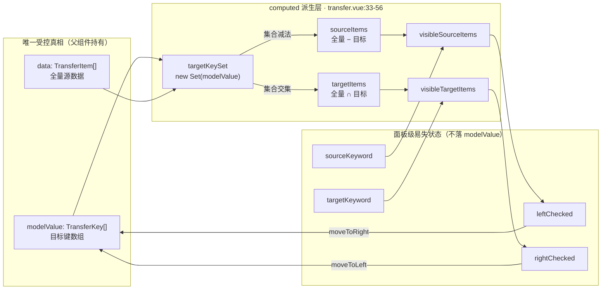
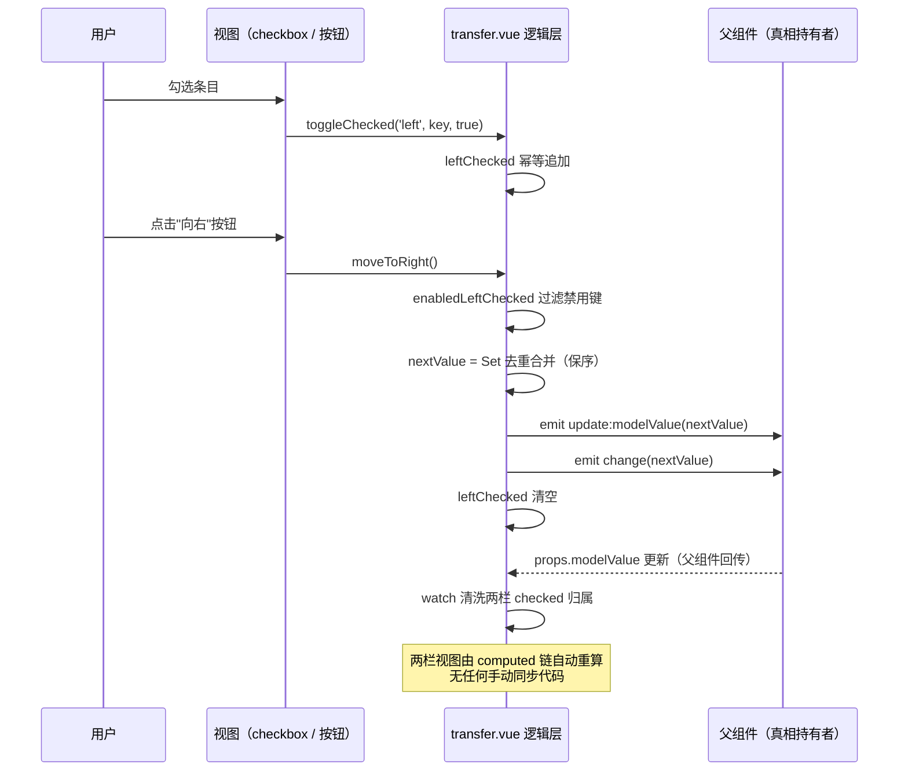

# 7-15 · Transfer：双栏数据流

> 本篇是第 7 卷"反馈与数据展示"的第十五篇。核心问题：**左右两栏如何共享一份真相？** `xy-transfer` 穿梭框是全库"数据派生"浓度最高的组件：它手里真正持有的只有两样东西——一份 `modelValue`（目标键数组）和一份 `data`（全量源数据），左右两栏渲染出来的列表、面板头部的计数、搜索的结果集、按钮的可用性，全部是这两份数据的 computed 派生。用户在界面上看到的是"两个列表、一堆勾选框、两个按钮"，源码里其实只有"一个数组、两个过滤器、一次事务性的 emit"。本篇逐行拆解：215 行 SFC 全文展开（7-07 引过的 empty 消费段在 `transfer.vue:159` 与 `211`，本篇放进完整上下文）、真相源选型、`checked` 中间态的属主裁决（与 6-06 的 indeterminate 属主问题同构）、移动操作的事务性、左右栏独立过滤、`transfer.css` 全文、两个测试用例与类型夹具，外加第一轮文档修复战役里 transfer API 表格的一笔考据。所有代码摘自当前工作区实态，行号逐一核对过。

## 一、组件速览：没有 panel 子组件的 215 行

先给组件档案。transfer 在 `component-manifest.json` 中登记在反馈组（`docsGroup: "feedback"`），清单条目在 487-494 行：

```json
// packages/components/component-manifest.json L487-494
{
  "name": "transfer",
  "docsGroup": "feedback",
  "docsText": "Transfer 穿梭框",
  "installExports": ["XyTransfer"],
  "installChecks": [{ "kind": "component", "name": "xy-transfer" }],
  "styleImports": ["transfer"]
}
```

文件构成比大多数表单组件还简单：`src/transfer.vue`（215 行）、`src/transfer.ts`（20 行，纯类型）、`__tests__/transfer.spec.ts`（52 行），**没有 transfer-panel.vue**。类型文件全文如下——它是理解本篇的钥匙，值得先整体过一遍：

```ts
// packages/components/transfer/src/transfer.ts L1-20（全文）
import type { ComponentSize } from "xiaoye-primitives";

export type TransferKey = string | number;

export interface TransferItem {
  key: TransferKey;
  label: string;
  disabled?: boolean;
  description?: string;
}

export interface TransferProps {
  modelValue?: TransferKey[];
  data?: TransferItem[];
  titles?: [string, string];
  disabled?: boolean;
  filterable?: boolean;
  filterPlaceholder?: string;
  size?: ComponentSize;
}
```

20 行里藏着三个设计决定。第一，`modelValue` 的类型是 `TransferKey[]`——**目标列表的键数组**，不是 item 对象数组。调用方持有键，组件持有派生，这是本篇一切讨论的前提。第二，`titles` 是 `[string, string]` 元组而不是 `string[]`：编译器强制你给满两个标题，少一个多一个都过不了 typecheck，比运行时兜底更早暴露问题。第三，`TransferItem` 里只有 `key / label / disabled / description` 四个字段，没有 EP 的 `TransferDataItem` 那种携带任意业务字段的宽容设计——自定义渲染一律走插槽（`slot` 入参 `{ item, checked, side }`），数据结构与视图结构在类型层就分了家。

再看入口与包装，8 行的标准三件套：

```ts
// packages/components/transfer/index.ts L1-8（全文）
import Transfer from "./src/transfer.vue";
import type { TransferItem, TransferKey, TransferProps } from "./src/transfer";
import { withInstall } from "xiaoye-primitives";

export type { TransferItem, TransferKey, TransferProps };

export const XyTransfer = withInstall(Transfer, "xy-transfer");
export default XyTransfer;
```

4-02 讲过的 `withInstall` 工厂原样复用：组件值只有 `XyTransfer` 一个，类型只抬主数据类型三件（`TransferItem / TransferKey / TransferProps`），`TransferItem[]`、`TransferKey` 这些集合与原子类型留在源码层随主入口抬出，没有内部状态枚举、没有插槽入参类型——符合增强层白名单同样的克制标准。

## 二、真相源：一个 Set，派生出两栏

### 2.1 script 的前 31 行：全部可写状态就这么多

```vue
<!-- packages/components/transfer/src/transfer.vue L1-31 -->
<script setup lang="ts">
import { computed, ref, watch } from "vue";
import { useConfig, useNamespace } from "xiaoye-primitives";
import XyButton from "../../button";
import XyCheckbox from "../../checkbox";
import XyInput from "../../input";
import XyEmpty from "../../empty";
import type { TransferItem, TransferKey, TransferProps } from "./transfer";

const props = withDefaults(defineProps<TransferProps>(), {
  modelValue: () => [],
  data: () => [],
  titles: () => ["源列表", "目标列表"],
  disabled: false,
  filterable: false,
  filterPlaceholder: "搜索条目",
  size: undefined
});

const emit = defineEmits<{
  "update:modelValue": [value: TransferKey[]];
  change: [value: TransferKey[]];
}>();

const ns = useNamespace("transfer");
const { size: globalSize } = useConfig();
const mergedSize = computed(() => props.size ?? globalSize.value);
const sourceKeyword = ref("");
const targetKeyword = ref("");
const leftChecked = ref<TransferKey[]>([]);
const rightChecked = ref<TransferKey[]>([]);
</script>
```

数一数 `ref` 的数量：**四个**。`sourceKeyword / targetKeyword / leftChecked / rightChecked`——两个搜索关键词、两个面板勾选集。加上 props 里的 `modelValue` 和 `data`，这个组件的全部状态就是六样，其中两样归父组件所有，四样是面板级的易失状态。没有内部数据副本，没有"未保存的移动操作队列"，没有左右栏各自的列表数组。

imports 里四兄弟组件依次登场：`XyButton`（动作区两个箭头按钮）、`XyCheckbox`（每个条目一枚）、`XyInput`（搜索框）、`XyEmpty`（空态）。transfer 自己一行渲染逻辑都不做底层的 DOM 拼装，是 4-03"标准组件解剖"里"视图层拼装既有积木"的正面样本。特别留意 `XyCheckbox` 的引入方式——它是从 `../../checkbox` 这样按目录导入的，而不是从 `@xiaoye/components` 包根，这是库内组件互用的纪律：**包根入口是对外的，组件间复用走相对路径**，避免安装树自引用。

默认值链上还有一处小考据：`titles` 默认 `["源列表", "目标列表"]`，`filterPlaceholder` 默认 `"搜索条目"`。这两个默认值在第一轮文档修复战役中曾与文档表格不一致，第九节展开。

### 2.2 派生层：从两份输入到两个可见列表

接下来的 24 行是本组件的心脏：

```vue
<!-- packages/components/transfer/src/transfer.vue L33-56 -->
const targetKeySet = computed(() => new Set(props.modelValue));

const sourceItems = computed(() =>
  props.data.filter((item) => !targetKeySet.value.has(item.key))
);

const targetItems = computed(() =>
  props.data.filter((item) => targetKeySet.value.has(item.key))
);

function filterItems(items: TransferItem[], keyword: string) {
  const normalized = keyword.trim().toLowerCase();

  if (!normalized) {
    return items;
  }

  return items.filter((item) =>
    `${item.label} ${item.description ?? ""}`.toLowerCase().includes(normalized)
  );
}

const visibleSourceItems = computed(() => filterItems(sourceItems.value, sourceKeyword.value));
const visibleTargetItems = computed(() => filterItems(targetItems.value, targetKeyword.value));
```

五个 computed、一个纯函数，构成一条完整的派生链：

1. `targetKeySet`：把 `modelValue` 数组变成 `Set`，把"这个 key 在不在目标列表"的判断从 O(n) 降到 O(1)。全组件对 `modelValue` 的**只读**访问都走这个 Set。
2. `sourceItems`：`data` 对 `targetKeySet` 做集合减法——左栏 = 全量 − 目标。
3. `targetItems`：`data` 对 `targetKeySet` 做集合交——右栏 = 全量 ∩ 目标。
4. `filterItems`：归一化（`trim` + `toLowerCase`）后的本地包含匹配，匹配串是 `label` 与 `description` 的拼接。
5. `visibleSourceItems / visibleTargetItems`：在归属集合上再叠一层各自栏位的关键词过滤。

这张派生关系值得画出来：



图上有一个闭环值得盯住：数据从 `modelValue` 出发，经过派生变成两栏视图和 `checked` 中间态，最终又通过移动操作**写回** `modelValue`。写回的那一步是全组件唯一修改真相的时刻，其余一切变化都是派生链上的重算——没有任何一行代码去"手动同步"左右两栏。

### 2.3 权衡一：真相源为什么是"目标键数组"

现在回答本篇的核心问题。双栏组件要共享真相，可选方案其实有三种：

**方案 A：左右两份 item 数组**。直觉上最"对称"——左栏一份、右栏一份，移动就是数组搬家。但它有两个致命伤：其一，`data` 里的同一条 item 在两份数组间拷贝后，`disabled` 这类字段一旦异步更新（权限刷新、动态加载），两份副本就产生分叉，你需要额外的同步逻辑或统一的字段广播；其二，真相变成了"两份"，外部想读"当前选中了什么"就得自己拼 `leftItems + rightItems`，受控语义直接碎掉。

**方案 B：一份 items 数组带 side 标记**。`data` 的每条记录加一个 `side: 'left' | 'right'` 字段，移动就是改标记。单份数据、无拷贝，看起来不错——但它把"归属"这个**视图概念**焊死进了**数据模型**：调用方的源数据（比如一个用户列表）被迫携带组件私有字段，组件在数据里写值，数据所有权混乱；而且"选中集合"要从全量数据里过滤出来，每次读取都是 O(n)。

**方案 C（本库的选择）：`modelValue` 只存目标键数组，`data` 永远是全量、只读**。左右两栏都是 `data × targetKeySet` 的纯函数派生：左栏是补集、右栏是交集。这个设计的收益链很长——

- **唯一写点**：修改归属状态的唯一途径是 emit 一个新的 `modelValue` 数组，两栏视图自动重算。不存在"改了左栏忘了右栏"这类 bug 的生存空间。
- **受控语义完整**：外部任何时候改 `modelValue`（撤销、回显、程序化清空），两栏立即同步，因为两栏根本没有自己的状态。对比 4-04 讲的受控/非受控双模：transfer 是**纯受控组件**，连非受控回退都没做——因为它如果持有内部值副本，"两栏共享真相"就得变成"三份状态求共识"，复杂度不降反升。纯受控在这里不是妥协，是架构上的最优解。
- **集合语义清晰**：`key` 是身份，数组只是键的容器。`Set` 化之后，归属判断与键的书写顺序、重复与否全部无关（后文会看到，重复键还会在移动时被顺手去重）。

代价也要如实记录：派生是**每次重算全量过滤**。`sourceItems` 与 `targetItems` 各是 O(n) 的 filter，`modelValue` 每变一次就重跑一遍。对穿梭框的典型数据量（几十到几千条）这完全不是问题；但如果哪天要支撑十万级数据，就得引入 `Map<key, item>` 索引或分页/虚拟滚动——本库 v1 明确不做（文档页原话："当前 v1 只做基础双栏穿梭，不提供树穿梭和表格穿梭"），这个取舍写进了 API 契约。另外，`modelValue` 里若出现 `data` 中不存在的 key（调用方传脏数据），它不落在任何一栏，静默悬空——组件不做校验也不告警，宽容地交给 typecheck 夹具（第八节）在编译期拦。

## 三、checked：面板级中间态，属主不在 modelValue

### 3.1 一对数组、一次过滤、两个动作

```vue
<!-- packages/components/transfer/src/transfer.vue L58-80 -->
const enabledLeftChecked = computed(() =>
  leftChecked.value.filter((key) => sourceItems.value.some((item) => item.key === key && !item.disabled))
);
const enabledRightChecked = computed(() =>
  rightChecked.value.filter((key) => targetItems.value.some((item) => item.key === key && !item.disabled))
);

function isChecked(side: "left" | "right", key: TransferKey) {
  return (side === "left" ? leftChecked.value : rightChecked.value).includes(key);
}

function toggleChecked(side: "left" | "right", key: TransferKey, checked: boolean) {
  const target = side === "left" ? leftChecked : rightChecked;

  if (checked) {
    if (!target.value.includes(key)) {
      target.value = target.value.concat(key);
    }
    return;
  }

  target.value = target.value.filter((item) => item !== key);
}
```

`leftChecked / rightChecked` 回答的问题是"**用户在这一栏勾了哪些条目**"。它们与 `modelValue` 语义完全不同：`modelValue` 是"哪些条目已经归属右栏"，`checked` 是"哪些条目即将被移动但还没移动"。前者是持久真相，后者是操作草稿。三个细节：

**其一，`enabled*Checked` 是双保险过滤。** `leftChecked` 里可能存有已经失效的键吗？`toggleChecked` 是唯一写入路径，禁用项的 checkbox 压根点不动（模板里 `:disabled="props.disabled || item.disabled"`，L145），所以正常运行时 `leftChecked` 里不会有 disabled 键。但 `data` 是异步世界的：勾选之后、点击移动之前，如果 `data` 数组被父组件刷新、某条目恰好变成 `disabled`，这时 `enabledLeftChecked` 的过滤就成了移动按钮可用性与移动操作安全性的最后一道闸。按钮的 disabled 绑定的是 `!enabledLeftChecked.length`（L164、L167），不是 `!leftChecked.length`——被过滤掉的键不会让按钮假装可用。

**其二，`toggleChecked` 是无脑幂等写。** 勾选时先查再拼（`concat` 产生新数组，不 push 原数组），取消时 filter 掉。新数组赋值保证响应式触发干净利落，也避免了同 key 重复入库（checkbox 的 `update:model-value` 理论上不会对同一状态发两次，但防御到这一层几乎零成本）。

**其三，`side` 参数用一个字面量联合类型收口。** `"left" | "right"` 让 `isChecked` / `toggleChecked` 两个函数同时服务左右两栏，面板逻辑没有因此复制成两份——这是"逻辑抽象、视图内联"策略（第六节）在函数层的对应物。

### 3.2 属主裁决：与 6-06 同构的一道题

`checked` 为什么不进 `modelValue`？这个问题和 6-06 讨论过的"indeterminate 属主在调用方"是同一道题的两面：**组件该替用户记住多少东西。**

把勾选集并进 `modelValue` 看似省事——一个 v-model 管到底。但两个语义会在类型上直接打架：`modelValue` 的类型是 `TransferKey[]`，勾选集需要知道"这个键属于左栏还是右栏"，扁平数组表达不了，除非改成 `{ key, side, checked }` 之类的结构化载荷——那受控 API 就从"目标键数组"劣化成了"组件私有状态快照"，外部读写都要理解组件内部协议。EP 同样把勾选态留在面板级：`el-transfer` 的 panel 组件内部持有 `checkedState`，`modelValue` 自始至终只有目标键。两家在此再次共识：**受控值承载"业务结果"，操作过程态留在组件内部**。

顺带把 6-06 的结论接上：transfer 里的每枚 checkbox 都被用成了"哑开关"——

```vue
<!-- packages/components/transfer/src/transfer.vue L143-148（左栏） -->
<xy-checkbox
  :model-value="isChecked('left', item.key)"
  :disabled="props.disabled || item.disabled"
  :validate-event="false"
  @update:model-value="toggleChecked('left', item.key, Boolean($event))"
/>
```

不传 `value`、不传 `label`、不进 group、不接 form 校验——只吃一个受控的 `model-value` 布尔值，吐一个布尔变化事件。6-06 拆过 checkbox 的内部结构：`isChecked` 在"有 group / 有 modelValue / 只有 checked"三条路径里取第二条（`checkbox.vue` 的 `isChecked` computed），`validateEvent` 默认 `true` 会把 change 冒泡给 form-item 触发校验。transfer 显式传了 `:validate-event="false"`，把校验链路在宿主侧掐断——搜索框上的 `xy-input` 同样传了 `:validate-event="false"`（L131、L183）。这是库内少见的"**宿主替子组件做校验豁免**"的实例：transfer 自身不在 form 校验体系里注册字段，它内部的勾选、搜索动作就没有理由惊动外层 form-item，两次显式关闭让 6-18 铺过的 aria/校验链路在这里安静落地。

### 3.3 watch：checked 的卫生员

```vue
<!-- packages/components/transfer/src/transfer.vue L105-115 -->
watch(
  () => props.modelValue,
  () => {
    leftChecked.value = leftChecked.value.filter((key) =>
      sourceItems.value.some((item) => item.key === key)
    );
    rightChecked.value = rightChecked.value.filter((key) =>
      targetItems.value.some((item) => item.key === key)
    );
  }
);
```

`modelValue` 一变，这个 watch 就把两个 checked 数组里"已不属于本栏"的键清掉。它防的是一类真实场景：用户在左栏勾了三条，还没点移动，父组件外部直接改了 `modelValue`（比如程序化把其中两条迁去了右栏，或干脆清空）——这时那两条的键已经从左栏派生集中消失，若不清，左栏会渲染出一个"勾选了不存在条目"的幽灵态，`enabledLeftChecked` 也会带着脏键参与下一次移动计算。

值得咀嚼的是 watch 清洗的**不对称**：它按"栏归属"清洗，不按 `disabled` 清洗。某个键只是从可用变成禁用（仍在左栏），watch 不会清它——条目继续显示勾选态，但移动时被 `enabledLeftChecked` 拦下。为什么这么分？归属是**结构性**变化（键的集合语义变了，残留即幽灵），禁用是**属性级**变化（键还在集合里，只是暂时不可操作，且可能随时恢复）。结构性残留必须清，属性级残留可以等——等用户点移动时由 `enabled` 过滤兜底。两层防线各管一种脏，谁也不越界。

## 四、移动事务：一次 emit 的原子性

### 4.1 两个方向，22 行

```vue
<!-- packages/components/transfer/src/transfer.vue L82-103 -->
function moveToRight() {
  if (props.disabled || !enabledLeftChecked.value.length) {
    return;
  }

  const nextValue = Array.from(new Set([...props.modelValue, ...enabledLeftChecked.value]));
  emit("update:modelValue", nextValue);
  emit("change", nextValue);
  leftChecked.value = [];
}

function moveToLeft() {
  if (props.disabled || !enabledRightChecked.value.length) {
    return;
  }

  const removedKeys = new Set(enabledRightChecked.value);
  const nextValue = props.modelValue.filter((key) => !removedKeys.has(key));
  emit("update:modelValue", nextValue);
  emit("change", nextValue);
  rightChecked.value = [];
}
```

每个函数五步：守卫（整体禁用或无有效勾选直接返回）→ 计算下一个数组 → emit `update:modelValue` → emit `change` → 清空对应栏的 checked。这是一个**单事务、双事件、后清理**的结构，三处设计都值得单说：

**Set 去重的保序合并。** 右移用 `Array.from(new Set([...props.modelValue, ...enabledLeftChecked.value]))`：`Set` 迭代保插入序，所以结果是"原 `modelValue` 顺序在前，新迁入的键按勾选顺序追加在后"。去重是顺手买的保险——若调用方传入的 `modelValue` 本身有重复键（脏数据），这次移动会悄悄把数组洗干净。左移则反过来：先把要移除的键收进 `removedKeys` Set（把删除判断降为 O(1)），再对原数组 `filter`——**保序删除**，未删除项的相对顺序原样保留。

**顺序语义有一个容易被忽略的角落**：右栏的展示顺序跟随 `data` 的原始顺序（`targetItems` 是对 `data` 的 filter，L39-41），而不是 `modelValue` 的插入顺序。也就是说，`modelValue` 数组里的顺序信息只在"值"层面存在（回传给调用方、提交给后端），视图层永远按数据源排序展示。这带来一个反直觉但自洽的行为：先勾 A 再勾 B，`modelValue` 里是 `[A, B]`，右栏却按 `data` 里的先后显示 B、A。EP 对此提供了 `target-order` 属性（`original / push / unshift` 三种排序策略）和 `left-default / right-default` 排序函数，把顺序选择权交给调用方；本库 v1 直接钉死 `original` 语义——数据源顺序即展示顺序，模型数组顺序即插入顺序，两套顺序各管各的，不提供切换。少一个 prop，少一类"为什么右栏不按我选的顺序排"的支持成本。

**双事件的分工。** `update:modelValue` 服务 v-model 协议，`change` 服务业务监听。同一载荷 emit 两次是 4-03 以来全库表单组件的惯例，transfer 忠实执行。真正的争议点是：**emit 之后立即清空 checked，有没有回滚问题？** 严格说有——transfer 是纯受控组件，emit 只是"提出申请"，真正的归属变化要等父组件把新值传回 props。如果父组件拒绝更新（例如在 `update:modelValue` 里做了拦截），组件侧 `leftChecked` 已经清空，用户的勾选丢失，但数据没动。这是纯受控架构的一致代价：**组件不背数据副本，也就不负责失败回滚**，操作成败的解释权完全在真相持有者手里。EP 面对同样的架构给出同样的答案（`el-transfer` 同样在 emit 后清空面板 checked），两个库都认为"父组件拦截导致勾选丢失"是可接受的罕见路径，为它引入乐观回滚协议不值得。

### 4.2 事务时序



注意图中"清空 checked"发生在"父组件回传"之前——这就是 4.1 说的无回滚设计：清空是本地易失态的即时整理，不等真相确认。而 watch 的清洗在回传之后执行，兜住的是"父组件回传的值与本组件申请的值不一致"的情况（拦截、转换、去重都可能造成）。两道工序时间上错开、语义上互补。

## 五、过滤：一个谓词函数、两个独立关键词

过滤层的源码已经在 2.2 节全文引过（L43-56），这里谈设计。`filterItems` 是一个**纯函数**：入参是条目数组和关键词，出参是过滤结果，不读任何组件状态——所以它能被左右两栏无差别复用，区别只在 computed 的接线：`visibleSourceItems` 接 `sourceKeyword`，`visibleTargetItems` 接 `targetKeyword`。

谓词本身是硬编码的：`` `${item.label} ${item.description ?? ""}`.toLowerCase().includes(normalized) ``。三个决策点：匹配范围是 `label` + `description` 拼串（`key` 不参与——键是身份不是内容，搜"1024"命中键值会造成"看起来没匹配却少了一条"的诡异 UX）；归一化是 trim + lowerCase（大小写与首尾空白宽容，中文场景零成本）；匹配算法是朴素 `includes`（无分词、无拼音、无高亮）。

EP 的对照很清晰：`el-transfer` 提供 `filter-method` prop 让调用方注入自定义谓词，并内置了搜索命中高亮（`filterable` 时渲染 item 会拿到 `filterKeyword` 类的上下文）。本库 v1 两样都没有——谓词固定、无高亮。这不是遗漏而是切片：`TransferItem` 的字段就四个，`label + description` 已经覆盖了全部文本内容，自定义谓词在此没有表达空间；等调用方需要"按拼音搜"或"按 tag 搜"时，`filter-method` 才有存在的理由，届时新增一个可选 prop 即可，不破坏现有契约。**扩展点不是越多越好，而是要在数据模型出现第一个表达不了的诉求时再开。**

另外两个关键词 `sourceKeyword / targetKeyword` 各自独立（L28-29 两个 ref），左栏搜索不影响右栏。这符合双栏心智：两栏内容集不同，用户在左栏找"待迁入的人"，在右栏找"已迁入的人"，是两次独立的检索。

## 六、模板全文展开：panel 内联 vs 抽象

### 6.1 左栏与动作区

```vue
<!-- packages/components/transfer/src/transfer.vue L118-170 -->
<template>
  <div :class="[ns.base.value, `${ns.base.value}--${mergedSize}`, props.disabled ? 'is-disabled' : '']">
    <section class="xy-transfer__panel">
      <header class="xy-transfer__panel-header">
        <strong>{{ props.titles[0] }}</strong>
        <span>{{ sourceItems.length }}</span>
      </header>
      <div v-if="props.filterable" class="xy-transfer__panel-filter">
        <xy-input
          :model-value="sourceKeyword"
          :placeholder="props.filterPlaceholder"
          clearable
          :disabled="props.disabled"
          :validate-event="false"
          @update:model-value="sourceKeyword = String($event ?? '')"
        />
      </div>
      <div class="xy-transfer__panel-body">
        <template v-if="visibleSourceItems.length">
          <label
            v-for="item in visibleSourceItems"
            :key="String(item.key)"
            class="xy-transfer__item"
            :class="item.disabled ? 'is-disabled' : ''"
          >
            <xy-checkbox
              :model-value="isChecked('left', item.key)"
              :disabled="props.disabled || item.disabled"
              :validate-event="false"
              @update:model-value="toggleChecked('left', item.key, Boolean($event))"
            />
            <div class="xy-transfer__item-content">
              <slot name="default" :item="item" :checked="isChecked('left', item.key)" :side="'left'">
                <span class="xy-transfer__item-label">{{ item.label }}</span>
                <small v-if="item.description" class="xy-transfer__item-description">
                  {{ item.description }}
                </small>
              </slot>
            </div>
          </label>
        </template>
        <xy-empty v-else title="暂无条目" description="左侧列表没有可展示内容" />
      </div>
    </section>

    <div class="xy-transfer__actions">
      <xy-button :disabled="props.disabled || !enabledLeftChecked.length" @click="moveToRight">
        &gt;
      </xy-button>
      <xy-button :disabled="props.disabled || !enabledRightChecked.length" @click="moveToLeft">
        &lt;
      </xy-button>
    </div>
```

### 6.2 右栏

```vue
<!-- packages/components/transfer/src/transfer.vue L172-214 -->
    <section class="xy-transfer__panel">
      <header class="xy-transfer__panel-header">
        <strong>{{ props.titles[1] }}</strong>
        <span>{{ targetItems.length }}</span>
      </header>
      <div v-if="props.filterable" class="xy-transfer__panel-filter">
        <xy-input
          :model-value="targetKeyword"
          :placeholder="props.filterPlaceholder"
          clearable
          :disabled="props.disabled"
          :validate-event="false"
          @update:model-value="targetKeyword = String($event ?? '')"
        />
      </div>
      <div class="xy-transfer__panel-body">
        <template v-if="visibleTargetItems.length">
          <label
            v-for="item in visibleTargetItems"
            :key="String(item.key)"
            class="xy-transfer__item"
            :class="item.disabled ? 'is-disabled' : ''"
          >
            <xy-checkbox
              :model-value="isChecked('right', item.key)"
              :disabled="props.disabled || item.disabled"
              :validate-event="false"
              @update:model-value="toggleChecked('right', item.key, Boolean($event))"
            />
            <div class="xy-transfer__item-content">
              <slot name="default" :item="item" :checked="isChecked('right', item.key)" :side="'right'">
                <span class="xy-transfer__item-label">{{ item.label }}</span>
                <small v-if="item.description" class="xy-transfer__item-description">
                  {{ item.description }}
                </small>
              </slot>
            </div>
          </label>
        </template>
        <xy-empty v-else title="暂无条目" description="右侧列表没有可展示内容" />
      </div>
    </section>
  </div>
</template>
```

### 6.3 权衡四：为什么两栏不用一个子组件

两段模板肉眼可见地相似——面板骨架、搜索框、条目循环、checkbox 接线、插槽展开、empty 兜底，逐行对应，只差四个接线参数（标题索引、关键词、`side`、empty 文案）。那为什么不抽一个 `TransferPanel` 子组件？EP 就是这么干的：`el-transfer` 的 `transfer-panel.vue` 是一个约 300 行的独立组件，内部自持 checkbox-group 与 checked 状态，`el-transfer` 主组件只做编排。

本库选择内联，算一笔账。**抽 panel 的收益**：模板去重约 40 行、面板逻辑（未来若加全选、虚拟滚动）单点维护。**抽 panel 的成本**：`leftChecked` 必须跨组件双向流动——要么 props 下发 + emit 回传（checkbox 的勾选事件要穿两层），要么 v-model 化一个 `checked` 子状态（面板级受控态又多一份协议）；`enabledLeftChecked` 依赖 `sourceItems`，这个派生就得在主组件算完再传下去，或者把派生链整体下沉进 panel（那"真相派生"就从一处散成两处）；插槽内容要在 panel 内部再声明一次透传；单测从挂一个组件变成挂嵌套两层。**而 v1 的面板没有任何独立生命周期需求**——没有全选、没有虚拟滚动、没有懒加载，panel 若抽出来，就是一个除双向转发外什么都不做的中间层。中间层只在做"有状态或有多实现"的抽象时才回本，纯转发层是负资产。

这个判断的可信度在于它的可逆性：模板内联不是把路堵死，等 v2 要加全选 checkbox、加虚拟滚动时，panel 抽象的收益才会超过成本，届时再抽——`leftChecked` 随之下沉为 panel 内部状态，主组件只保留"汇两栏 checked 于动作区"的编排。**抽象时机跟着状态复杂度走，不跟着行数走。**

模板里还有三处小料值得点名。其一，根类名用了 `ns.base.value` 拼接（L119），而面板、条目、动作区的类名全是 `xy-transfer__*` 字面量直书——`useNamespace` 的产出只消费了一处。这不算 bug（前缀同样是 `xy-`），但与 checkbox 那种全 ns 风格相比，是"一半令牌化"的过渡形态。其二，checkbox 的原生 `<input>` 被包在 `<label>` 里（L137-157 的 label 包住 checkbox 和内容区），点击条目任意位置都能切换勾选——零 JavaScript 的原生交互增强，这正是"label 即点击热区"的浏览器默认语义。其三，搜索框的 `@update:model-value="sourceKeyword = String($event ?? '')"` 有一层 `String()` 转换：`xy-input` 的载荷类型在泛型组件（4-10）语境下可能带非字符串变体，宿主侧显式收窄，不给 `filterItems` 的 `trim()` 任何运行时惊喜。

### 6.4 empty 消费段考据：7-07 的"模式三"

7-07 拆解 empty 的八处下游消费时，把 transfer 归入"模式三：硬编码业务文案"，引用了 `transfer.vue:159`：

```vue
<!-- packages/components/transfer/src/transfer.vue L159 -->
<xy-empty v-else title="暂无条目" description="左侧列表没有可展示内容" />
```

右栏对称位置在 L211，文案换成"右侧列表没有可展示内容"。两处都显式传了 `title` 与 `description`，绕过了 7-07 讲过的 locale 三层默认文案链（`empty.vue` 的 `resolvedTitle` computed：props → `locale.emptyTitle` → 硬编码兜底"暂无数据"）。transfer 没有暴露 `empty-text` 之类的配置 prop，空态文案是组件私有决定——这是与 EP 的又一处分野：`el-transfer` 把左右空态文案做成 `texts.leftEmpty / rightEmpty` 可配项。本库的判断是：空态文案属于组件的视觉完整性，不是业务定制点，v1 收紧；真需要定制时，`xy-empty` 的插槽语义（7-07 的四插槽）为将来抬配置留了现成的通路。

### 6.5 面板头部考据：全选 checkbox 缺席，indeterminate 虚位以待

把模板头部单独拎出来看：

```vue
<!-- packages/components/transfer/src/transfer.vue L121-124 -->
<header class="xy-transfer__panel-header">
  <strong>{{ props.titles[0] }}</strong>
  <span>{{ sourceItems.length }}</span>
</header>
```

标题 + 计数，仅此而已——**v1 的面板头部没有全选 checkbox**。这里要做一个诚实的考据更正：专栏策划资料里曾把"全选的半选态（indeterminate）在面板头部的复用"列为 transfer 的既成设计，对照实码，这一条**不成立**。checkbox 的 indeterminate 能力本身是完备的（`checkbox.ts:11` 声明 prop，`checkbox.vue:96` 拼 `is-indeterminate` 类、134 行透传 DOM property、137 行输出 `aria-checked="mixed"`），6-06 也已裁决其属主在调用方——但 transfer v1 并没有消费它，面板头部连一个 checkbox 都没有。

能力在库内，虚位以待，正好可以做一次"如果要加，应该怎么加"的设计推演。按 6-06 的属主裁决，半选态必须由 transfer **派生后作为 prop 下发**：

```ts
// 设计推演（非实码）：面板头部全选的派生方式
const allLeftChecked = computed(() =>
  visibleSourceItems.value.length > 0 &&
  visibleSourceItems.value.every((item) => isChecked("left", item.key) || item.disabled)
);
const someLeftChecked = computed(() =>
  visibleSourceItems.value.some((item) => isChecked("left", item.key) && !item.disabled)
);
```

三个派生细节决定这套全选好不好用：**作用域应是 `visibleSourceItems` 而非 `sourceItems`**——全选只该作用于"当前看得到的条目"，过滤之后隐藏的条目不应被全选波及，否则"搜出 3 条、全选、清空搜索"会莫名其妙勾上 300 条，这是穿梭框全选最经典的翻车点；**disabled 项要排除在勾选判定之外**（`every` 里放过 disabled），与 `enabledLeftChecked` 的口径对齐；**半选的判定条件是"有勾且未全勾"**，交给 `indeterminate` prop，checkbox 自己不猜。这个推演同时回答了"为什么 6-06 的属主裁决是对的"：checkbox 保持哑态，transfer 作为宿主承担全部派生逻辑，将来加全选时没有任何一层需要返工——只需在 header 里加一枚 `:indeterminate="someLeftChecked && !allLeftChecked"` 的 checkbox。

### 6.6 a11y 考据：没有 listbox role 的双栏

双栏列表的可访问性语义，EP 的做法是显式 WAI-ARIA：面板 body 标 `role="listbox"`，条目标 `role="option"`，配合 `aria-labelledby` 指向面板标题。本库 v1 没有走这条路——模板里没有任何 `role` 属性，可访问性完全依赖**原生语义**：每条目是一个 `<label>` 包裹的真 checkbox（`checkbox.vue` 渲染 `<input type="checkbox">`），浏览器与读屏器天然理解"这是一组可勾选项"，`aria-checked` 由 checkbox 自己输出；键盘交互也由原生 input 承担（checkbox 的 `tabIndex` 计算、focus 态在 6-06 已拆）。`disabled` 条目则拿到 `is-disabled` 类与 checkbox 的原生禁用，读屏与鼠标双通道都不可达。

这个选择的信息量在于：**原生控件语义与 ARIA role 的边界**。EP 需要显式 listbox，是因为它的条目渲染自由度大（自定义渲染可能脱离 checkbox 语义，role 必须补位）；本库条目被钉死在 checkbox 语义上，原生语义自动成立，ARIA 反而是冗余。风险同样要记录：如果 v2 引入"纯展示不可勾选"的条目变体或自定义渲染突破了 label-checkbox 结构，原生语义就会漏，届时 role 补丁不可避免。语义策略跟着渲染自由度走，又一次。

## 七、样式：grid 三列与 63 行的克制

`transfer.css` 全文 63 行，可以整段读完：

```css
/* packages/theme/src/components/transfer.css L1-63（全文） */
.xy-transfer {
  display: grid;
  grid-template-columns: minmax(0, 1fr) auto minmax(0, 1fr);
  gap: 16px;
  align-items: stretch;
}

.xy-transfer__panel {
  display: flex;
  flex-direction: column;
  min-height: 280px;
  border: 1px solid var(--xy-border-subtle);
  border-radius: var(--xy-radius-lg);
  background: var(--xy-bg-raised);
  box-shadow: var(--xy-shadow-0);
}

.xy-transfer__panel-header {
  display: flex;
  align-items: center;
  justify-content: space-between;
  padding: 12px 14px;
  border-bottom: 1px solid var(--xy-border-subtle);
}

.xy-transfer__panel-filter {
  padding: 12px 14px 0;
}

.xy-transfer__panel-body {
  flex: 1;
  overflow: auto;
  padding: 12px 14px;
}

.xy-transfer__item {
  display: flex;
  align-items: flex-start;
  gap: 10px;
  padding: 8px 0;
}

.xy-transfer__item.is-disabled {
  color: var(--xy-text-muted);
}

.xy-transfer__item-content {
  display: flex;
  flex-direction: column;
  gap: 2px;
  min-width: 0;
}

.xy-transfer__item-description {
  color: var(--xy-text-muted);
}

.xy-transfer__actions {
  display: flex;
  flex-direction: column;
  justify-content: center;
  gap: 8px;
}
```

布局骨架是三列 grid：`minmax(0, 1fr) auto minmax(0, 1fr)`。左右两栏等宽弹性，中间动作列收缩为内容宽度（两个按钮叠放）。`minmax(0, 1fr)` 而非裸 `1fr` 是 grid 的经典防御：`1fr` 的隐含最小宽度是 `auto`，长 label（比如一长串英文用户名）会把面板撑出容器，`minmax(0, ...)` 把最小值钉死为 0，配合 `__item-content` 上的 `min-width: 0`（flex 子项的最小宽度同样默认 `auto`），溢出内容乖乖走 `__panel-body` 的 `overflow: auto`。一条长用户名能撕开的布局，被两层 `min-width: 0` 按住了。

面板是"flex 纵向三段"：header（固定）、filter（可选）、body（`flex: 1` 吃掉剩余高度 + 滚动）。`min-height: 280px` 给面板一个下限，空态与两条数据时不至于塌成一行。条目对齐用 `align-items: flex-start` 而非 center：label 一行、description 一行的双行条目里，checkbox 应与首行对齐——与内容区 `gap: 2px` 的紧凑纵排配合，多行条目的视觉重心不漂移。

令牌消费全部走语义层与刻度层：`--xy-border-subtle`（描边）、`--xy-bg-raised`（面板底色）、`--xy-radius-lg`（圆角）、`--xy-text-muted`（禁用与次要文案）、`--xy-shadow-0`（第一档阴影，tokens.css:166 亮色 / 334 行暗色双主题各有一份锚值，402 行可见旧名 `--xy-shadow-xs` 只是它的兼容别名）。没有一处裸色值，3-01 的三层令牌架构在组件侧的纪律照旧。

两处"未完成"也如实记录。其一，模板根类拼了 `xy-transfer--${mergedSize}`（L119），但这份 CSS 里**没有任何 `--xs / --sm / --md / --lg / --xl` 分档规则**——size prop 目前只产出类名，不产生视觉差异，是预留的 API 钩子而非已兑现的能力。其二，没有 hover / focus-within / 拖拽态样式，条目交互反馈只有 checkbox 自身的样式（那部分在 `checkbox.css` 里）。两处都属于"v1 切片"：类名先占位，样式后兑现，不影响契约兼容。

## 八、测试与类型夹具：两条用例顶住真相闭环

测试全文 52 行，两个用例：

```ts
// packages/components/transfer/__tests__/transfer.spec.ts L1-52（全文）
import { mount } from "@vue/test-utils";
import { afterEach, describe, expect, it } from "vitest";
import { XyTransfer } from "@xiaoye/components";

afterEach(() => {
  document.body.innerHTML = "";
});

const data = [
  { key: 1, label: "控制台" },
  { key: 2, label: "账单中心", description: "财务相关" },
  { key: 3, label: "配置中心", disabled: true }
];

describe("XyTransfer", () => {
  it("支持基础穿梭和 change 事件", async () => {
    const wrapper = mount(XyTransfer, {
      props: {
        modelValue: [],
        data
      }
    });

    const sourceItem = wrapper
      .findAll(".xy-transfer__panel")
      .at(0)
      ?.findAll(".xy-transfer__item")
      .find((node) => node.text().includes("控制台"));
    const leftCheckbox = sourceItem?.find(".xy-checkbox__original");
    await leftCheckbox?.setValue(true);
    await wrapper.find(".xy-transfer__actions .xy-button").trigger("click");

    expect(wrapper.emitted("update:modelValue")?.[0]?.[0]).toEqual([1]);
    expect(wrapper.emitted("change")?.[0]?.[0]).toEqual([1]);
  });

  it("支持搜索和禁用项", async () => {
    const wrapper = mount(XyTransfer, {
      props: {
        modelValue: [2],
        data,
        filterable: true
      }
    });

    const inputs = wrapper.findAll("input");
    await inputs[0]?.setValue("配置");

    expect(wrapper.text()).toContain("配置中心");
    expect(wrapper.findAll(".xy-transfer__item.is-disabled")).toHaveLength(1);
  });
});
```

第一个用例走的是**全链路真实交互**：定位左栏条目 → 通过 `.xy-checkbox__original`（checkbox 的原生 input 类名，6-06 拆过这套 DOM 分层）`setValue(true)` 触发原生 change → 点击动作按钮 → 断言两个事件的载荷都是 `[1]`。它一次性验证了"checkbox 受控勾选 → toggleChecked → enabledLeftChecked 过滤 → moveToRight 事务 → 双 emit"这条最长的真相闭环，而且注意断言的是 `wrapper.emitted(...)`——**测试没有回传新值给 props**，事件载荷正确即通过，组件内部状态（leftChecked 已清空）的后续反应留给派生链的纯函数性质保证。选择器用 `.xy-transfer__panel` 加序号取栏，与实现类名（而非语义 role）耦合，这是第六节 a11y 考据的另一个侧影：没有 role，测试也只能咬类名。

第二个用例覆盖过滤与禁用的交集场景：`modelValue: [2]` 时"账单中心"已在右栏，左栏搜"配置"应命中"配置中心"，且全局恰有一条 `is-disabled` 条目。它顺手验证了一个派生性质：过滤只作用于可见集，不改归属集——`sourceItems` 与 `visibleSourceItems` 是两层，搜索不会把条目"搜没了"。

类型夹具 20 行，走 `pnpm typecheck:types` 的编译期断言路线：

```ts
// tests/types/fixtures/transfer.ts L1-20（全文）
import type { TransferProps } from "xiaoye-components";

const props: TransferProps = {
  modelValue: [1],
  data: [
    { key: 1, label: "控制台" },
    { key: 2, label: "账单中心" }
  ],
  filterable: true
};

void props;

const invalidProps: TransferProps = {
  // @ts-expect-error modelValue should be array
  modelValue: 1,
  data: []
};

void invalidProps;
```

正例断言 `TransferKey[]` 接受数字键（`modelValue: [1]`），反例用 `@ts-expect-error` 钉死"`modelValue` 必须是数组"——传单个数字必须编译失败。第二节的"悬空键不校验"由此有了边界：类型层管形状（数组、键类型），运行时不管内容（键是否存在），两层校验各司其职。文档示例侧，`custom.vue` 展示插槽与自定义标题的完整接法：

```vue
<!-- apps/docs/examples/transfer/custom.vue L1-20（全文） -->
<script setup lang="ts">
import { ref } from "vue";

const value = ref<Array<string | number>>([1]);
const data = [
  { key: 1, label: "小叶", description: "管理员" },
  { key: 2, label: "小陈", description: "成员" }
];
</script>

<template>
  <xy-transfer v-model="value" :data="data" :titles="['待选成员', '已选成员']">
    <template #default="{ item }">
      <div>
        <strong>{{ item.label }}</strong>
        <small style="display: block; color: var(--xy-text-secondary)">{{ item.description }}</small>
      </div>
    </template>
  </xy-transfer>
</template>
```

`ref<Array<string | number>>([1])` 显式标注了混合键型——`TransferKey` 的 string | number 联合在 v-model 场景下调用方必须自己钉住类型，Vue 的泛型组件（4-10）还不足以从 `data` 推断出 `modelValue` 的键型。插槽解构只取 `item`，而组件实际还提供 `checked` 与 `side` 两个入参（L150、L202）——`side` 的存在意味着同一个插槽实现可以感知自己在哪一栏，这是模板内联双栏却共用一份插槽契约的体现。

## 九、考据：第一轮文档修复战役里的 transfer 一笔

专栏第一卷记过那次"14 个文档的修复战役"，transfer 在其中有一笔可查的提交：`f13b582 fix(misc): 文档插件 lint 修复、transfer API 表格与 workspace 依赖锁文件`。当时的 diff 显示，`apps/docs/components/transfer.md` 一次性补上了 Attributes / Events / Slots 三张 API 表，共 25 行——但补表时的默认值与实码不一致：表格里 `titles` 默认值写的是 `['列表 1', '列表 2']`、`filterPlaceholder` 写的是 `'请输入'`，而实码（`transfer.vue:13、16`）是 `["源列表", "目标列表"]` 与 `"搜索条目"`。当前工作区的文档表格已经对齐实码。这件小事是"文档描述与实现谁为真相"的一个标本：API 表格抄自调用记忆而不是源码 withDefaults，修复时补了表格、却又引入了第二层失真，直到后来对齐。对 AI 协作仓库的启示与 4-01 讲 manifest 单一事实源时一脉相承——**凡有默认值，默认值的唯一事实源只能是 `withDefaults` 实参**，文档表格应当从源码生成或至少对照源码复核，而不是凭印象补写。

顺带把文档页里值得引用的一句钉在这儿：`transfer.md` 开头写明"当前 v1 只做基础双栏穿梭，不提供树穿梭和表格穿梭"。这句自我设限就是第二、六节多次引用的 v1 切片的官方出处——能力边界写进文档，比埋在 issue 里诚实。

## 十、权衡档案与 EP 对照

本篇的权衡收进档案：

1. **真相源选型**：目标键数组（`modelValue`）+ 只读全量 `data`，两栏纯派生—— versus 左右两份数组（拷贝分叉、受控语义碎裂）或 side 标记（数据所有权混乱、读取 O(n)）。收益是唯一写点 + 完整受控；代价是全量重算与悬空键宽容，由数据量前提与 typecheck 夹具分别兜底。
2. **checked 中间态属主**：面板级内部状态，不进 `modelValue`——与 6-06 indeterminate 属主裁决同构：受控值承载业务结果，过程态留在组件内。双保险过滤（`enabled*Checked`）与 watch 归属清洗分工处理属性级与结构性两种脏。
3. **移动事务**：守卫 → Set 去重保序合并/删除 → 双 emit → 即时清空 checked。无回滚是纯受控的一致代价，顺序语义上"数组序 = 插入序、视图序 = data 序"双轨并行。
4. **panel 内联 vs 抽象**：v1 无独立 panel 子组件，模板双栏内联复制、逻辑函数用 `side` 参数收敛。抽象时机跟着状态复杂度走：等全选、虚拟滚动出现再抽 panel 不迟。
5. **语义策略**：a11y 依赖 label+checkbox 原生语义而非 ARIA listbox；空态文案硬编码走 7-07 模式三；size 类名占位、样式未兑现——三者共同点是"语义跟渲染自由度走，扩展点等第一个表达不了的诉求再开"。

EP 对照一栏表：

| 维度 | Element Plus | 本库 XyTransfer |
| --- | --- | --- |
| 面板结构 | 独立 `transfer-panel.vue`（约 300 行）+ checkbox-group | 无 panel 子组件，双栏内联于 215 行 SFC |
| 面板头部 | 全选 checkbox + indeterminate 派生 | 仅标题与计数，全选缺位（推演见 6.5） |
| a11y | 显式 `role="listbox"` / `role="option"` | 原生 label + checkbox 语义 |
| 排序 | `target-order`（original/push/unshift）+ `left/right-default` | 视图恒按 data 序，数组序即插入序 |
| 过滤 | `filter-method` 自定义谓词 + 命中高亮 | 固定 label+description includes，无高亮 |
| 空态 | `texts.leftEmpty / rightEmpty` 可配 | 硬编码，走 empty 消费（模式三） |

四个 `ref`、五个 computed、两个动作函数、一次双 emit——transfer 用 215 行证明了一件事：双栏组件的全部复杂度都可以被压缩成"维护一个数组，派生两份视图"。真相只有一份，其余都是它的影子。

下一篇是 7-16《Dialog：模态全解》。transfer 的双栏还是页面内的并排布局，而 dialog 要面对的是全库最重的浮层话题：焦点陷阱（4-07）、滚动锁、队列管理（4-12 下）与模态遮罩的关闭语义，会在一个组件里全面交汇。我们到时见。
