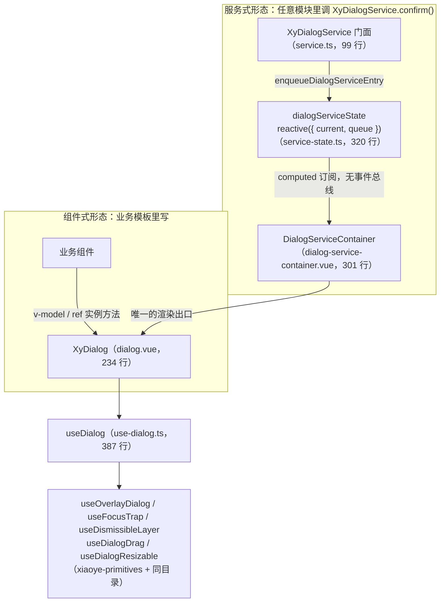
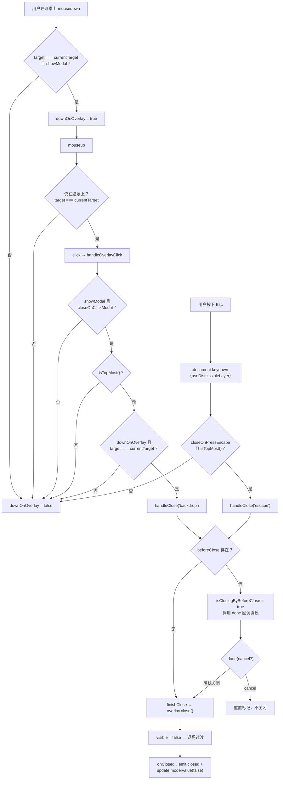
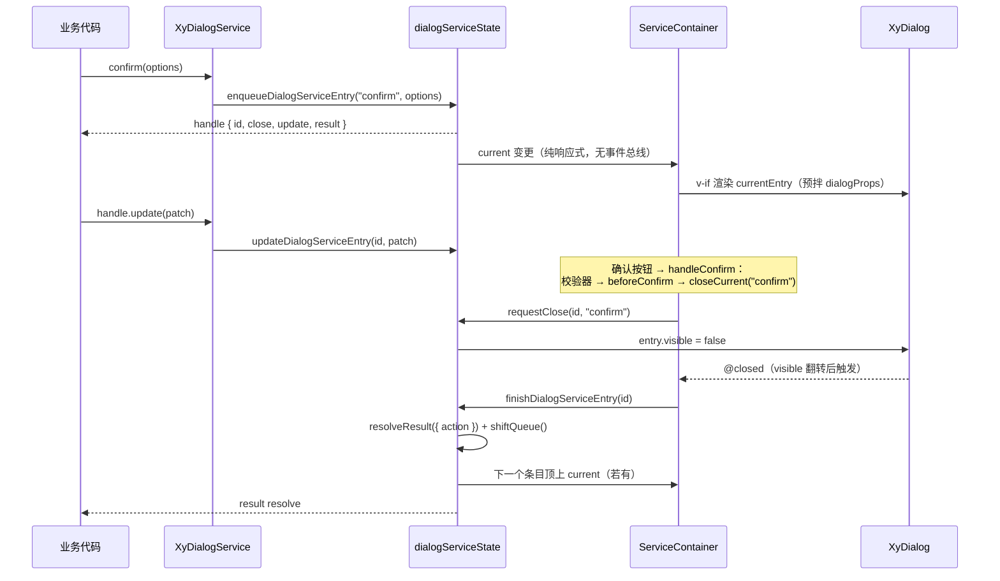

# 7-16 · Dialog：模态全解

> 本篇是第 7 卷"反馈与数据展示"的第十六篇。核心问题：**从 v-model 到服务式调用的完整实现**。dialog 这个名字在专栏里已经出现过很多次——4-04 用它的 `modelValue` 段讲过受控/非受控双模，4-05、4-06 铺过浮层状态机与浮层栈的地基，4-07 用它讲过焦点陷阱与滚动锁，4-12 用它的服务层讲过命令式队列，6-01 用它的容器讲过 provide 回填。前情各自截取了一个侧面，本篇做的是全貌合龙：把浮层家族里配置最重的消费样本完整拆开——`useDialog`（387 行）如何用六条"命脉"（配置合并链、overlay 状态机、焦点陷阱、Esc 通道、遮罩三处理器、滚动锁）撑起一个模态；`XyDialogService`（99 行门面 + 320 行状态机 + 301 行容器）如何在不写一行渲染逻辑的前提下长出 alert/confirm/prompt 三种服务。涉及源码共 12 个文件、2344 行（不含测试与夹具），另有 `dialog.spec.ts` 的 1107 行测试与类型夹具做旁证。所有路径与行号均在当前工作区实态逐一核对。

## 一、组件档案：一个组件名下的两套形态

先给组件档案。dialog 在 `component-manifest.json` 中登记在反馈组，清单条目在 496-502 行：

```json
// packages/components/component-manifest.json L496-501
{
  "name": "dialog",
  "docsGroup": "feedback",
  "docsText": "Dialog 对话框",
  "installExports": ["XyDialog"],
  "installChecks": [{ "kind": "component", "name": "xy-dialog" }],
  "styleImports": ["dialog"]
}
```

`installExports` 里只有 `XyDialog`——但 `packages/components/dialog/index.ts:45` 还导出了一个 `XyDialogService`，它没进 `installExports`，因为服务不需要被 `app.use()` 安装：`import { XyDialogService } from "xiaoye-components"` 之后在任何模块里直接调用即可（它的配置继承走的是模块级 Registry 快照桥，6-01 讲过）。一个目录、一个包导出点，两种使用形态，这是 dialog 的第一个全貌特征。

文件构成也值得先整体过一遍。`src/` 下共 12 个文件、2344 行：

| 文件 | 行数 | 职责 |
| --- | --- | --- |
| `dialog.vue` | 234 | 组件壳：teleport/transition/DOM 三层结构 |
| `dialog.ts` | 241 | 类型层：Props、全局配置、关闭原因枚举 |
| `use-dialog.ts` | 387 | 逻辑层：模态六条命脉的编排中枢 |
| `dialog-content.vue` | 172 | 面板：header/body/footer 与可访问性属性 |
| `dialog-content.ts` | 78 | 面板类型与默认值 |
| `use-dialog-drag.ts` | 181 | 拖拽位移与边界钳制 |
| `use-dialog-resizable.ts` | 193 | 尺寸拖拽与 min/max 钳制 |
| `service.ts` | 99 | 服务门面：挂宿主、四个入口 |
| `service-state.ts` | 320 | 服务状态机：`reactive({ current, queue })` |
| `dialog-service.ts` | 95 | 服务类型：六值 action、handle、reason 映射 |
| `dialog-service-container.vue` | 301 | 服务容器：唯一的渲染出口 |
| `dialog-service-prompt.vue` | 43 | prompt 模式的输入框封装 |

两套形态的关系不是"平行实现"，而是"一个消费者、一个渲染出口"：



服务式的全部"渲染"最终都落回同一个 `XyDialog` 组件——容器只是给这份组件预拌了一层 props。这个共享结构是本篇第一个设计权衡的主角，放在第五节展开。先把组件式的骨架读完。

## 二、类型层：44 个 prop 与四值关闭原因

类型层入口是 `dialog.ts`。全库组件的关闭原因语义里，dialog 的这组枚举是最成体系的：

```ts
// packages/components/dialog/src/dialog.ts L3-16
export type DialogCloseReason = "close" | "backdrop" | "escape" | "programmatic";
export type DialogDoneFn = (cancel?: boolean) => void;
export type DialogBeforeCloseFn = (
  done: DialogDoneFn,
  reason?: DialogCloseReason
) => void | Promise<void>;
export type DialogTransition = string | TransitionProps;
export type DialogModelValueChangeHandler = (value: boolean) => void;
export type DialogFullscreenChangeHandler = (value: boolean) => void;
export type DialogResizeHandler = (
  event: MouseEvent,
  width: number,
  height: number
) => void;
```

四值 `DialogCloseReason` 把"怎么关的"类型化了：`close` 是点关闭按钮、`backdrop` 是点遮罩、`escape` 是按 Esc、`programmatic` 是程序调用。这个四值枚举是组件层的关闭语义，后面会看到它如何经 `mapCloseReasonToServiceAction` 咬合进服务层的六值 action 体系（`dialog-service.ts:5-11`，多出 `confirm`/`cancel` 两个业务动作）。而 `DialogBeforeCloseFn` 的签名——`done` 回调加 `reason` 参数——是全篇第三个设计权衡的协议本体，第四节细读。

然后是 Props 接口全文（`dialog.ts:32-74`，44 个字段）。它值得整段读，因为每一个字段名都对应一个下文会反复出现的机制：

```ts
// packages/components/dialog/src/dialog.ts L32-74
export interface DialogProps {
  modelValue?: boolean;
  title?: string;
  appendToBody?: boolean;
  appendTo?: string | HTMLElement;
  beforeClose?: DialogBeforeCloseFn;
  destroyOnClose?: boolean;
  closeOnClickModal?: boolean;
  closeOnPressEscape?: boolean;
  lockScroll?: boolean;
  modal?: boolean;
  modalPenetrable?: boolean;
  openDelay?: number;
  closeDelay?: number;
  top?: string;
  modalClass?: string;
  panelClass?: string;
  width?: string | number;
  zIndex?: number;
  center?: boolean;
  alignCenter?: boolean;
  closeIcon?: string | Component;
  draggable?: boolean;
  overflow?: boolean;
  fullscreen?: boolean;
  resizable?: boolean;
  minWidth?: string | number;
  maxWidth?: string | number;
  minHeight?: string | number;
  maxHeight?: string | number;
  maximizable?: boolean;
  stickyHeader?: boolean;
  stickyFooter?: boolean;
  bodyMaxHeight?: string | number;
  loading?: boolean;
  loadingText?: string;
  headerClass?: string;
  bodyClass?: string;
  footerClass?: string;
  showClose?: boolean;
  headerAriaLevel?: string;
  transition?: DialogTransition;
}
```

注意 `modelValue` 是**可选的**——运行时 props 里给了 `default: false`（`dialog.ts:76-80`，4-04 引过）。这意味着 dialog 必须同时伺候两种主人：绑了 `v-model` 的父组件，和只拿 `ref` 调 `handleClose()`、或者干脆用服务形态弹出的调用方。这个"必须自己管自己"的要求，最终落在 `useOverlayDialog` 的内部状态机上（4-04 讲过的"内部状态源 + 只读哨兵 + 回调上报"协议）。

`closeOnClickModal`/`closeOnPressEscape`/`lockScroll` 三个字段的运行时 default 是 `undefined`（`dialog.ts:101-112`），不是 false——这是给"props → 全局配置 → 内置默认值"三级合并链留的口子，第三节读 `resolved*` 计算属性时展开。

## 三、组件式形态：三层 DOM 与一次 v-model 的旅程

`dialog.vue` 全文 234 行，其中模板占 86 行。这 86 行是理解模态 DOM 结构的钥匙，值得整段放进来：

```html
<!-- packages/components/dialog/src/dialog.vue L149-234 -->
<template>
  <teleport :to="overlay.appendTo.value" :disabled="overlay.teleportDisabled.value">
    <transition v-bind="transitionConfig">
      <div
        v-if="overlay.rendered.value"
        v-show="overlay.visible.value"
        ref="overlayRef"
        :class="[
          ns.base.value,
          ns.is('closing', closing),
          ns.is('align-center', resolvedAlignCenter),
          ns.is('fullscreen', resolvedFullscreen),
          isPenetrable ? ns.is('penetrable', true) : ''
        ]"
        :style="rootStyle"
      >
        <div
          v-if="overlay.showModal.value"
          :class="[`${ns.base.value}__overlay`, props.modalClass]"
          @click="handleOverlayClick"
          @mousedown="handleOverlayMouseDown"
          @mouseup="handleOverlayMouseUp"
        />
        <DialogContent
          ref="dialogContentRef"
          v-bind="$attrs"
          :title="props.title"
          :title-id="titleId"
          :body-id="bodyId"
          :aria-label="ariaLabel"
          :aria-labelledby="ariaLabelledby"
          :aria-level="props.headerAriaLevel"
          :center="props.center"
          :align-center="resolvedAlignCenter"
          :close-icon="props.closeIcon"
          :draggable="resolvedDraggable"
          :overflow="resolvedOverflow"
          :fullscreen="resolvedFullscreen"
          :maximizable="resolvedMaximizable"
          :sticky-header="resolvedStickyHeader"
          :sticky-footer="resolvedStickyFooter"
          :body-max-height="props.bodyMaxHeight"
          :loading="props.loading"
          :loading-text="resolvedLoading.text"
          :loading-spinner="resolvedLoading.spinner"
          :loading-svg="resolvedLoading.svg"
          :loading-svg-view-box="resolvedLoading.svgViewBox"
          :loading-background="resolvedLoading.background"
          :resizable="resolvedResizable"
          :is-resizing="isResizing"
          :header-class="props.headerClass"
          :body-class="props.bodyClass"
          :footer-class="props.footerClass"
          :panel-class="props.panelClass"
          :show-close="props.showClose"
          :style="panelStyle"
          :modal="overlay.showModal.value"
          :handle-focus-trap-keydown="focusTrap.handleKeydown"
          :handle-resize-start="handleResizeStart"
          @close="handleClose"
          @toggle-fullscreen="handleToggleFullscreen"
        >
          <template #header>
            <slot
              v-if="$slots.header"
              name="header"
              :close="handleClose"
              :title-id="titleId"
              :title-class="`${ns.base.value}__title`"
            />
            <slot
              v-else-if="$slots.title"
              name="title"
              :title-id="titleId"
              :title-class="`${ns.base.value}__title`"
            />
          </template>
          <slot />
          <template v-if="$slots.footer" #footer>
            <slot name="footer" />
          </template>
        </DialogContent>
      </div>
    </transition>
  </teleport>
</template>
```

结构上是严格的三层：**根节点 `.xy-dialog`** 是全屏 `position: fixed` 的滚动容器（`dialog.css:1-10`，`overflow: auto`，顶距由 `--xy-dialog-margin-top` 控制）；**遮罩 `.xy-dialog__overlay`** 是 `position: absolute; inset: 0` 的着色层；**面板 `DialogContent`** 与遮罩是**兄弟节点**，不是包裹关系。这个兄弟结构正是 2026-09-16 遮罩修复的落点——三个事件处理器（L168-170 的 click/mousedown/mouseup）迁绑到遮罩节点上，4-12 已考据过迁绑动作本身，本篇第四节展开它换来什么。

几个模板细节值得逐个点名：

**teleport 默认是关的。** `:disabled="overlay.teleportDisabled.value"`，而 `teleportDisabled` 的判定在 `use-overlay-dialog.ts:74-85`：`appendToBody` 为真或 `appendTo` 指定了非 body 目标才传送，否则留在组件树内原地渲染。测试 `dialog.spec.ts:319-347` 验证了这组语义（默认挂在本组件树内、`appendTo: "#dialog-target"` 挂到指定选择器）。这跟"浮层一律 teleport 到 body"的直觉相反，收益是样式作用域与 SSR 更稳。

**v-if 和 v-show 同时挂在根节点上。** `v-if="overlay.rendered.value"` 管挂载，`v-show="overlay.visible.value"` 管显隐。关闭时 visible 翻 false 触发 `<Transition>` 的退场过渡（Vue 的 Transition 原生支持 v-show 翻转驱动的 leave），过渡收尾钩子 `handleAfterLeave` 再把 `rendered` 收回 false，DOM 真正移除；而 `destroyOnClose` 更激进——在 `use-overlay-dialog.ts:62-65` 的 onClose 回调里直接置 `rendered = false`，跳过退场动画立即卸载（测试 `dialog.spec.ts:349-381` 断言了这组懒渲染/销毁语义）。一对开关，两种销毁时点。

**`showModal` 决定遮罩是否存在。** `overlay.showModal` 的定义是 `modal && visible`（`use-overlay-dialog.ts:104-106`）——注意它把 visible 也乘进去了，所以遮罩 div 只在"真模态且开着"时渲染。`modal: false` 时没有遮罩，面板的 `aria-modal` 也随之变 false（`dialog-content.vue:97`）。再叠加 `modalPenetrable`：`use-dialog.ts:246-248` 的 `isPenetrable` 要求 `modalPenetrable && !showModal && !fullscreen`，命中后根节点挂 `is-penetrable` 类，CSS 里 `pointer-events: none`（`dialog.css:21-23`）把整个容器的事件穿透，面板自己再用 `pointer-events: auto`（`dialog.css:69`）把事件接回来——"非模态但看起来还是那个对话框"就是这么拼出来的。

**`$attrs` 直通面板。** `defineOptions({ inheritAttrs: false })`（`dialog.vue:14`）之后，模板里 `v-bind="$attrs"`（L174）落在 `DialogContent` 上——业务里写的 `class`、`width` 之类透传到的是面板而不是全屏根节点。这是壳组件的标准纪律，但 dialog 多了一层动机：根节点承载的是层级与穿透语义，不该被业务样式污染。

脚本侧的 emit 面（L19-33）有 13 个事件：`update:modelValue`、`update:fullscreen`、`open/opened/close/closed` 四态、`openAutoFocus/closeAutoFocus` 焦点对、`maximize/restore`、`resize-start/resize/resize-end` 三连。这 13 个通道全部经 `useDialog` 的回调表转发（`dialog.vue:79-81` 的 `emitUpdateModelValue` 就是 4-04 引过的那三行），组件壳里没有一行状态逻辑。挂载后的 DOM 探测只有一个：L123-135 的 watch 在 `overlay.visible`/标题/插槽变化后等一个 `nextTick`，用 `dialogContentRef.value?.dialogRef?.querySelector('#' + titleId)` 判断"带 id 的标题元素是否真的渲染出来了"，结果写进 `labelledTitlePresent`——这是 aria 链路的回退开关，第三节读。

最后是实例出口（`dialog.vue:137-146`）：

```ts
// packages/components/dialog/src/dialog.vue L137-146
function resetPosition() {
  dialogContentRef.value?.resetPosition();
}

defineExpose({
  visible: overlay.visible,
  dialogContentRef,
  resetPosition,
  handleClose
});
```

`visible` 是只读暴露（4-04 引过的 L142），`handleClose` 是程序化关闭的正规入口——它会走完整的 before-close 拦截协议（第四节）。`index.ts:40-42` 把这些拼成 `DialogInstance` 类型，类型夹具 `tests/types/fixtures/dialog.ts:109-111` 里 `dialogRef.value?.handleClose()`、`resetPosition()`、`dialogContentRef?.updatePosition()` 三连就是对着这个出口写的。

## 四、use-dialog.ts：模态的六条命脉

`use-dialog.ts` 387 行，是 dialog 的真正大脑。它接收 props 与一张回调表，吐出模板需要的全部状态与处理器。按职责可以拆成六条命脉。

**命脉一：配置合并链。** `use-dialog.ts:98-137`：

```ts
// packages/components/dialog/src/use-dialog.ts L98-137
const { dialog: globalDialogConfig } = useConfig<DialogGlobalConfig>();
const titleId = `xy-dialog-title-${Math.random().toString(36).slice(2, 10)}`;
const bodyId = `xy-dialog-body-${Math.random().toString(36).slice(2, 10)}`;
const closing = ref(false);
const downOnOverlay = ref(false);
const localFullscreen = ref(false);
let isClosingByBeforeClose = false;

const dialogElement = computed(() => options.dialogContentRef.value?.dialogRef ?? null);
const mergedConfig = computed<DialogGlobalConfig>(() => globalDialogConfig.value ?? {});
const resolvedCloseOnClickModal = computed(
  () => props.closeOnClickModal ?? mergedConfig.value.closeOnClickModal ?? true
);
const resolvedCloseOnPressEscape = computed(
  () => props.closeOnPressEscape ?? mergedConfig.value.closeOnPressEscape ?? true
);
const resolvedLockScroll = computed(() => props.lockScroll ?? mergedConfig.value.lockScroll ?? true);
const resolvedAlignCenter = computed(
  () => props.alignCenter ?? mergedConfig.value.alignCenter ?? false
);
const resolvedFullscreen = computed(() => props.fullscreen ?? localFullscreen.value);
const resolvedDraggable = computed(
  () => (props.draggable ?? mergedConfig.value.draggable ?? false) && !resolvedFullscreen.value
);
const resolvedOverflow = computed(() => props.overflow ?? mergedConfig.value.overflow ?? false);
const resolvedResizable = computed(
  () => (props.resizable ?? mergedConfig.value.resizable ?? false) && !resolvedFullscreen.value
);
const resolvedMaximizable = computed(
  () => props.maximizable ?? mergedConfig.value.maximizable ?? false
);
const resolvedStickyHeader = computed(
  () => props.stickyHeader ?? mergedConfig.value.stickyHeader ?? false
);
const resolvedStickyFooter = computed(
  () => props.stickyFooter ?? mergedConfig.value.stickyFooter ?? false
);
const resolvedTransition = computed(
  () => props.transition ?? mergedConfig.value.transition
);
```

六个 `resolved*` 里反复出现同一个模式：`props.x ?? mergedConfig.x ?? 内置默认值`。`??` 的短路特性在这里被用成了三级配置协议——props 显式传了就用 props，没传（`undefined`）落全局配置，全局也没有落内置值。这就是为什么 `dialog.ts:101-112` 把这三个开关的运行时 default 写成 `undefined` 而不是 false：default 若是 false，全局配置就永远没有出场机会了。6-01 引过这一段（`use-dialog.ts:98-137`）作为"类型在消费最深的组件里定义"的证据——`useConfig<DialogGlobalConfig>()` 的泛型只在命中分支收紧。

顺带注意两个特殊分子。`resolvedFullscreen` 的兜底不是全局配置而是 `localFullscreen`——全屏走的是**props/local 双轨**：`props.fullscreen` 有值时听父组件的（受控），没有值时用内部状态（非受控），L139-151 的 watch 负责把外部值同步进内部态，L271-281 的 `setFullscreen` 只在 `props.fullscreen == null` 时写内部态。最大化按钮在非受控模式下依然能工作，父组件又随时可以接管——这是 4-04 的双模协议在"面板几何"上的翻版。`resolvedDraggable`/`resolvedResizable` 则各自与 `!resolvedFullscreen` 相乘——全屏时拖拽与缩放自动失效，测试 `dialog.spec.ts:579-626` 验证了这条互斥。

**命脉二：overlay 状态机接线。** `use-dialog.ts:169-208`：

```ts
// packages/components/dialog/src/use-dialog.ts L169-208
const overlay = useOverlayDialog(
  {
    modelValue: () => props.modelValue,
    destroyOnClose: () => props.destroyOnClose,
    lockScroll: resolvedLockScroll,
    openDelay: () => props.openDelay,
    closeDelay: () => props.closeDelay,
    appendToBody: () => props.appendToBody,
    appendTo: () => props.appendTo,
    modal: () => props.modal,
    zIndex: () => props.zIndex
  },
  {
    destroyStrategy: "wrapper",
    onOpen: () => {
      closing.value = false;
      options.emitOpen();
      void nextTick(() => {
        options.overlayRef.value?.scrollTo?.({
          top: 0,
          left: 0
        });
        dialogElement.value?.scrollTo?.({
          top: 0,
          left: 0
        });
      });
    },
    onClose: () => {
      closing.value = true;
      options.emitClose();
    },
    onOpened: () => {
      options.emitOpened();
    },
    onClosed: () => {
      options.emitClosed();
      options.emitUpdateModelValue(false);
    }
  }
);
```

九个 getter 全部以 `() =>` 的形式传入——这是 `MaybeRefOrGetter` 协议，让 primitives 层的 composable 永远读到最新值而不需要 watch 同步。四个回调的触发时机需要精确到 `use-floating-visibility.setVisible` 的执行序：**`onOpen`** 在 visible 翻 true 之前（所以它能把 `closing` 复位，还能顺带在下个 tick 把根节点与面板的滚动位置归零——根节点是全屏滚动容器，重开后残留的滚动位置会直接顶出错位的面板）；**`onOpened`** 在 visible 翻 true 之后；**`onClose`** 在 visible 翻 false 之前（把 `closing` 置 true，驱动根节点的 `is-closing` 类，CSS 里给面板加 `pointer-events: none` 防止退场途中继续点击，`dialog.css:25-27`）；**`onClosed`** 在 visible 翻 false 之后——它同时干两件事：发 `closed` 事件、把 `false` 回写进 `update:modelValue`。

这个时序里藏着一个容易误读的点：**`closed` 事件标记的是"状态机退场"，不是"动画播完"**。它和 `update:modelValue(false)` 都在 visible 翻转的同一拍触发，真正的动画收尾由 transition 的 after-leave（`transitionConfig` 里绑的 `overlay.handleAfterLeave`）负责，只做 `rendered` 清理。严格说 4-12 用"等 Dialog 的过渡完全退场"形容服务层 `@closed` 的时机，按实码读，`@closed` 到达时退场过渡才刚刚开始——不过这不影响服务层的正确性，因为服务的 shift 本来就不依赖动画结束（第五节展开）。

`destroyStrategy: "wrapper"` 是传给 `useOverlayDialog` 的销毁策略声明：dialog 的销毁作用于整个 wrapper（含遮罩），drawer 用的是 `"content"`——同一个 composable 的两种销毁半径，7-17 的伏笔。

**命脉三：zIndex 与浮层栈。** `use-overlay-dialog.ts:104-159` 这一段同时管着视觉层叠、栈顶判定和滚动锁，是浮层语义最密的一段：

```ts
// packages/xiaoye-primitives/src/composables/use-overlay-dialog.ts L104-159
  const showModal = computed(() => {
    return Boolean(toValue(options.modal) && visible.value);
  });

  const zIndex = computed(() => {
    const base = toValue(options.zIndex);
    if (base != null) return base;
    return overlayStack.zIndex.value;
  });

  watch(
    visible,
    (value) => {
      if (value) {
        overlayStack.openLayer();
        return;
      }

      overlayStack.closeLayer();
    },
    { immediate: true }
  );

  const shouldLockBodyScroll = computed(() => {
    return Boolean(toValue(options.lockScroll)) && visible.value;
  });

  // 配对标记：只有本实例真正加过锁才允许解锁。
  // unlockBodyScroll 是无条件递减，若 watch immediate 在初始 false 时也调 unlock，
  // 混合配置（A lockScroll=true 开着、B lockScroll=false 挂载）会把 A 的锁减掉。
  let bodyScrollLocked = false;

  watch(
    shouldLockBodyScroll,
    (locked) => {
      if (locked && !bodyScrollLocked) {
        lockBodyScroll();
        bodyScrollLocked = true;
        return;
      }
      if (!locked && bodyScrollLocked) {
        unlockBodyScroll();
        bodyScrollLocked = false;
      }
    },
    { immediate: true }
  );

  // 兜底：组件卸载时 watcher 停止但不再触发回调，
  // 打开状态下直接卸载会导致计数泄漏，这里只偿还本实例的锁。
  onBeforeUnmount(() => {
    if (bodyScrollLocked) {
      unlockBodyScroll();
      bodyScrollLocked = false;
    }
  });
```

zIndex 的规则是：用户传了 `zIndex` prop 就用固定值（显示层），否则用浮层栈的自增计数器（起点 2000，`use-overlay-stack.ts:17`）。每次打开，`openLayer()` 把栈内条目的 zIndex 自增并登记进全局 Set；"栈顶"由 `getTopEntry` 比较**栈内计数器值**得出（`use-overlay-stack.ts:23-35`）。这里有个精确的分工值得划线：**用户指定的 zIndex 只影响视觉层叠，不参与栈顶判定**——栈内条目的 zIndex 用的是全局计数器（`use-overlay-stack.ts:50-52` 的 `openLayer` 里 `entry.zIndex.value = ++zIndexCounter.value`），所以两个都写死 `zIndex: 4000` 的对话框，后开的那个依然是 Esc 与遮罩点击语义下的"最上层"。`isTopMost()` 的实现（`use-overlay-stack.ts:45-49`）就是"栈顶条目的 id 是不是我的 id"。

滚动锁这一段是 4-07 的主角：`lockBodyScroll`/`unlockBodyScroll` 是模块级计数器（`scroll-lock.ts:1-27`，计数到 1 时把 `body.style.overflow` 存起来改成 hidden，归零时还原），而 `use-overlay-dialog` 用一个每实例的 `bodyScrollLocked` 配对标记保证"只有自己加过锁才解自己的锁"——2026-09-16 的修复，防的是混合配置下 B 实例挂载时的 `immediate` 回调把 A 的锁减掉。dialog 对它的消费入口就是命脉一里的 L114：`resolvedLockScroll` 同样走三级合并，默认 true。

**命脉四：焦点陷阱与 aria 链路。** `use-dialog.ts:241-269`：

```ts
// packages/components/dialog/src/use-dialog.ts L241-269
  const rootStyle = computed(() => ({
    zIndex: `${overlay.zIndex.value}`,
    "--xy-dialog-margin-top": props.top ?? "15vh"
  }));

  const isPenetrable = computed(
    () => Boolean(props.modalPenetrable) && !overlay.showModal.value && !resolvedFullscreen.value
  );
  const hasLabelledTitle = computed(() => options.hasLabelledTitle());
  const ariaLabelledby = computed(() => hasLabelledTitle.value ? titleId : undefined);
  const ariaLabel = computed(() => hasLabelledTitle.value ? undefined : props.title || undefined);
  const transitionConfig = computed(() =>
    mergeTransitionHooks(resolvedTransition.value, "xy-dialog-fade", {
      onAfterEnter: overlay.handleAfterEnter,
      onAfterLeave: overlay.handleAfterLeave
    })
  );

  const focusTrap = useFocusTrap(dialogElement, {
    active: () => overlay.visible.value,
    autoFocus: "first",
    restoreFocus: true,
    onAutoFocus: () => {
      options.emitOpenAutoFocus();
    },
    onRestoreFocus: () => {
      options.emitCloseAutoFocus();
    }
  });
```

焦点陷阱走全默认策略：`autoFocus: "first"` 聚焦面板内第一个可交互元素，`restoreFocus: true` 关闭时归还焦点，不传 `onFocusoutPrevented`（对话框是严格模态，任何焦点逃逸都拉回），不传 `onReleaseRequested`（它的 Esc 走另一条通道，见命脉五）。4-07 引过这段（`use-dialog.ts:259-269`）与模板侧的两层转发——`dialog.vue:206` 把 `focusTrap.handleKeydown` 作为 prop 传给 `DialogContent`，后者在面板元素上以捕获阶段绑定（`dialog-content.vue:102-103` 的 `tabindex="-1"` 与 `@keydown.capture`）。

aria 链路则是本组件少有的"运行时 DOM 探测"：`ariaLabelledby` 与 `ariaLabel` 互斥——标题元素真实渲染出来了就挂 `aria-labelledby` 指向 `titleId`，否则回退 `aria-label` 直接放标题文本。为什么不能静态判断？因为标题可能来自插槽，插槽里的元素有没有把 `titleId` 挂上去（header 插槽的入参里透出了 `titleId` 和 `titleClass`，见 `dialog.vue:211-225`），只有渲染完查一次 DOM 才知道。第二节讲过的 L123-135 watch 就是探测器本体，测试 `dialog.spec.ts:146-169` 用"自定义 header 且未挂 titleId 时回退 aria-label"验证了回退分支，`171-201` 验证了正向分支与焦点归还。

**命脉五：Esc 通道。** dialog 的 Esc 走 `useDismissibleLayer` 的文档级监听（`use-dialog.ts:325-334`）：

```ts
// packages/components/dialog/src/use-dialog.ts L325-334
  useDismissibleLayer({
    enabled: () => overlay.visible.value,
    refs: [dialogElement],
    closeOnEscape: resolvedCloseOnPressEscape,
    closeOnOutside: false,
    isTopMost: () => overlay.isTopMost(),
    onDismiss: () => {
      handleClose("escape");
    }
  });
```

注意 `closeOnOutside: false`——这个 composable 本来同时管"点外面关闭"和"Esc 关闭"两件事，dialog 只用它的 Escape 半边：面板外的点击判定交给命脉六的遮罩三处理器专管，两套判定不共享任何状态。`use-dismissible-layer.ts:42-53` 的 keydown 处理器做三件事：校验 `closeOnEscape` 与 `enabled`、校验 `isTopMost()`（叠层时只有最上层响应，测试 `dialog.spec.ts:267-293` 验证了双层对话框 Esc 只关第二层）、`preventDefault()` 后派发 `onDismiss("escape")`。对比 4-07 讲过的 drawer：drawer 同时配了面板内（focus trap 的 `onReleaseRequested`）与文档级两条 Esc 通道并互相 `stopPropagation` 防重，dialog 干脆只留文档级一条——同一份 Esc 语义在两个消费者那里各自收敛到"一次按键，一次关闭"。

## 五、模态关闭判定链：两条入口，五道闸门

把命脉六（遮罩三处理器）单独放一节，因为它是模态语义里最容易被写错的部分，也是本篇要求的判定链主角。先看实现（`use-dialog.ts:336-357`）：

```ts
// packages/components/dialog/src/use-dialog.ts L336-357
  function handleOverlayMouseDown(event: MouseEvent) {
    downOnOverlay.value = overlay.showModal.value && event.target === event.currentTarget;
  }

  function handleOverlayMouseUp(event: MouseEvent) {
    downOnOverlay.value = downOnOverlay.value && event.target === event.currentTarget;
  }

  function handleOverlayClick(event: MouseEvent) {
    const canClose =
      overlay.showModal.value &&
      resolvedCloseOnClickModal.value &&
      overlay.isTopMost() &&
      downOnOverlay.value &&
      event.target === event.currentTarget;

    downOnOverlay.value = false;

    if (canClose) {
      handleClose("backdrop");
    }
  }
```

完整的判定链是两条入口汇入同一个出口：



三个处理器连读，逻辑其实是一个"**按下—抬起—点击**三段式手势确认"加"**五条件**收口"：mousedown 记录按下起点是否在遮罩上，mouseup 确认抬起也在遮罩上（不满足则提前清除标记），click 最终裁决时再验五个条件——真模态开着、`closeOnClickModal` 放行、自己是最上层、按下抬起都在遮罩、事件目标就是遮罩本身。任何一关不过，`downOnOverlay` 复位、什么都不发生。

**这里埋下本篇第二个设计权衡：遮罩判定到底该靠运行时判据还是 DOM 结构保证。** 修复前，这三个处理器挂在根节点 `.xy-dialog` 上——根节点同时包裹着遮罩与面板，面板内任何元素的 click 都会冒泡到根，运行时必须靠 `target === currentTarget` 加 `downOnOverlay` 双判据去区分事件源；"按下在遮罩、抬起在面板"这类跨元素手势（最典型的是从遮罩按下、拖到面板里松手的拖拽误触）全靠这套判据兜。修复后处理器迁绑到遮罩节点——遮罩与面板是兄弟，面板冒泡上来的事件根本到不了遮罩，处理器天然只收到真正落在遮罩上的事件，`target === currentTarget` 从"需要警惕的判据"退化成"恒真的断言"。但代码没有删掉这些判据——它们留着，作为与结构保证并行的第二道保险（比如测试直接往遮罩上 dispatch 事件之外的任何 DOM 变动）。EP 的同款逻辑值得对照：Element Plus 的 `useSameTarget`（`packages/hooks/use-same-target`）保留着完全同构的三函数 + 双布尔（mousedown/mouseup 各记一个 `target === currentTarget`，click 时两布尔皆真才放行），因为 EP 的 `el-overlay` 历史上与内容同层包裹，判定只能留在运行时。本库这次迁绑等于用结构调整换掉了这组历史包袱的一半——另一半（`downOnOverlay` 标记与五条件收口）保留为纵深防御。测试 `dialog.spec.ts:203-264` 用两个用例钉住了这条链的两端，第六节引用。

两条入口最终都汇入 `handleClose`，它带着 `DialogCloseReason` 参数走第三条命脉的出口。现在把最关键的一段实现整段读掉——**本篇第三个设计权衡的主场：before-close 拦截协议**（`use-dialog.ts:271-323`）：

```ts
// packages/components/dialog/src/use-dialog.ts L271-323
  function setFullscreen(nextValue: boolean) {
    if (props.fullscreen == null) {
      localFullscreen.value = nextValue;
    }

    options.emitUpdateFullscreen(nextValue);
  }

  function toggleFullscreen() {
    setFullscreen(!resolvedFullscreen.value);
  }

  function finishClose(cancel?: boolean) {
    if (cancel) {
      return;
    }

    overlay.close();
  }

  function handleClose(reason: DialogCloseReason = "programmatic") {
    if (isClosingByBeforeClose || closing.value) {
      return;
    }

    if (!props.beforeClose) {
      finishClose();
      return;
    }

    isClosingByBeforeClose = true;
    let doneCalled = false;
    const done = (cancel?: boolean) => {
      if (doneCalled) {
        return;
      }

      doneCalled = true;
      isClosingByBeforeClose = false;
      finishClose(cancel);
    };

    try {
      const result = props.beforeClose(done, reason);
      if (result && typeof (result as Promise<void>).catch === "function") {
        void (result as Promise<void>).catch(() => {
          isClosingByBeforeClose = false;
        });
      }
    } catch {
      isClosingByBeforeClose = false;
    }
  }
```

这个协议要同时满足四个苛刻的约束：

**约束一，关闭入口的唯一收口。** 点关闭按钮（`dialog-content.vue:138` emit `close` 带上 `'close'`）、点遮罩（`handleClose('backdrop')`）、按 Esc（`handleClose('escape')`）、程序调用实例方法（默认参 `programmatic`），四个入口全部汇入同一个 `handleClose`——业务给 `beforeClose` 挂的拦截逻辑不需要关心关闭是从哪来的，只需要在 `done` 里做决定。`reason` 参数让钩子保留区分能力：比如"点遮罩直接关，按 Esc 弹二次确认"这类差异化策略，一个 if 就够。

**约束二，防重入。** `isClosingByBeforeClose || closing.value` 的卫语句挡住两类并发：before-close 等待期间用户再点一次关闭按钮（`isClosingByBeforeClose` 为 true），以及关闭已经启动后的一切重复请求（`closing` 为 true）。没有这个卫语句，异步的 `done` 回调期间每一次点击都会重新调用一次 `beforeClose`。

**约束三，done 只认一次。** `doneCalled` 标记保证 `done` 的多次调用（业务代码里常见的"成功调一次、失败兜底又调一次"）只生效第一次。`cancel` 语义通过 `finishClose(cancel)` 的参数传递——`done(true)` 表示"取消本次关闭"，直接 return，连 `overlay.close()` 都不碰。

**约束四，异步与异常兜底。** `beforeClose` 允许返回 Promise（类型签名 `void | Promise<void>`）。Promise 的结果并不决定关不关（决定权在 `done`），但如果 Promise **reject 了**而业务没接住，`isClosingByBeforeClose` 会永远停在 true——对话框从此关不掉。所以 L315-319 给返回的 Promise 挂一个静默 catch 把标记复位，L320-322 的同步 try/catch 兜住钩子直接抛异常的情形。协议的默认立场很明确：**钩子的失败不能把对话框锁死**，失败等价于"没拦截成功但也没放行"，等用户下一次操作。

EP 的 `before-close` 是同构的 `done` 回调协议（EP 的 `handleClose` 同样是"有 beforeClose 则交出 hide 控制权，否则直接 hide"），这门设计不是本库独创——它的成本在于回调式的控制流反转，收益在于同步/异步拦截统一成一种写法。本库在 EP 协议之上补的三样东西是：`reason` 参数、防重入卫语句、Promise catch 兜底。测试 `dialog.spec.ts:295-317` 验证了拦截生效时 `update:modelValue` 不发出。

fullscreen 双轨的写法也顺带读掉了：`setFullscreen` 只在 `props.fullscreen == null` 时写 `localFullscreen`（非受控模式），但 `emitUpdateFullscreen` 无条件发出——受控模式下父组件收到事件后自己回写 props，非受控模式下事件只是通知。一个函数同时伺候两种模式，靠的是"内部态只在无人接管时落笔"。

## 六、服务式形态：门面、状态机、容器

组件式形态的最后一环读完了，现在转到同一个目录里的另一套形态。先看门面（`service.ts:17-47`）：

```ts
// packages/components/dialog/src/service.ts L17-47
let serviceHost: HTMLDivElement | null = null;

function ensureDialogServiceMounted() {
  if (typeof document === "undefined") {
    warnOnce("XyDialogService", "XyDialogService 仅支持在浏览器环境中使用。");
    return false;
  }

  if (serviceHost && serviceHost.isConnected) {
    return true;
  }

  serviceHost = document.createElement("div");
  serviceHost.className = "xy-dialog-service-host";
  document.body.appendChild(serviceHost);
  createApp(DialogServiceContainer).mount(serviceHost);
  return true;
}

function createNoopHandle(): DialogServiceHandle {
  const id = `xy-dialog-service-noop-${Date.now()}`;

  return {
    id,
    close() {},
    update() {},
    result: Promise.resolve({
      action: "programmatic"
    })
  };
}
```

懒挂载策略：第一次调用任何入口时创建一个 `.xy-dialog-service-host` 宿主 div，用 `createApp` 把 `DialogServiceContainer` 挂成**独立小应用**。为什么必须是独立应用？因为服务可能在任何模块里被 import 后直接调用，不在组件树里——而容器渲染的 Dialog 需要 `useConfig` 读全局配置、需要 namespace。独立应用切断了 provide 链，所以容器必须把快照桥里的配置**重新 provide 回去**（6-01 引过的 `dialog-service-container.vue:54-63`，下文引用）。SSR/非浏览器环境则全部入口返回 noop handle，`result` 预 resolve 成 `programmatic`，调用方的 `await` 不会悬挂。

四个业务入口在 `service.ts:49-99`：

```ts
// packages/components/dialog/src/service.ts L49-99
export const XyDialogService = {
  open(options: DialogServiceOpenOptions): DialogServiceHandle {
    if (!ensureDialogServiceMounted()) {
      return createNoopHandle();
    }

    const entry = enqueueDialogServiceEntry("open", options);
    return createDialogServiceHandle(entry.id, entry.result);
  },
  alert(options: DialogAlertOptions) {
    if (!ensureDialogServiceMounted()) {
      return Promise.resolve();
    }

    const entry = enqueueDialogServiceEntry("alert", {
      ...options,
      showCancelButton: false
    });

    return createDialogServiceHandle(entry.id, entry.result).result.then(() => undefined);
  },
  confirm(options: DialogConfirmOptions) {
    if (!ensureDialogServiceMounted()) {
      return Promise.resolve(false);
    }

    const entry = enqueueDialogServiceEntry("confirm", options);

    return createDialogServiceHandle(entry.id, entry.result).result.then(
      (result) => result.action === "confirm"
    );
  },
  prompt(options: DialogPromptOptions) {
    if (!ensureDialogServiceMounted()) {
      return Promise.resolve({
        confirmed: false,
        value: options.inputValue ?? ""
      });
    }

    const entry = enqueueDialogServiceEntry("prompt", options);

    return createDialogServiceHandle(entry.id, entry.result).result.then((result) => ({
      confirmed: result.action === "confirm",
      value: result.value ?? ""
    }));
  },
  closeAll() {
    closeAllDialogServiceEntries();
  }
};
```

四个入口是同一套队列原语的四种**返回值投影**：`open` 返回完整 handle；`alert` 在入队前强制 `showCancelButton: false`（`normalizeEntry` 里还有一层 `options.showCancelButton ?? mode !== "alert"` 的同向默认，`service-state.ts:96`，双保险），Promise resolve 成 void；`confirm` 投影成布尔（`action === "confirm"`）；`prompt` 投影成 `{ confirmed, value }`。状态机本体在 `service-state.ts`，4-12 已拆过 `reactive({ current, queue })` 与条目形状（`service-state.ts:50-77`）：

```ts
// packages/components/dialog/src/service-state.ts L50-77
export interface DialogServiceState {
  current: DialogServiceEntry | null;
  queue: DialogServiceEntry[];
}

export const dialogServiceState: DialogServiceState = reactive({
  current: null,
  queue: []
});

let dialogServiceSeed = 0;

function nextDialogServiceId() {
  dialogServiceSeed += 1;
  return `xy-dialog-service-${dialogServiceSeed}`;
}

function createResultPromise() {
  let resolveResult = (_result: DialogServiceResult) => {};
  const result = new Promise<DialogServiceResult>((resolve) => {
    resolveResult = resolve;
  });

  return {
    result,
    resolveResult
  };
}
```

本篇补充读 4-12 没有整段引用的两块：**入队与两段式关闭**（`service-state.ts:153-208`）和 **update 的内容三态互斥**（`service-state.ts:256-277`）：

```ts
// packages/components/dialog/src/service-state.ts L153-208
export function enqueueDialogServiceEntry(
  mode: DialogServiceMode,
  options: DialogServiceOpenOptions | DialogAlertOptions | DialogConfirmOptions | DialogPromptOptions
) {
  const entry = normalizeEntry(mode, options);

  if (dialogServiceState.current) {
    dialogServiceState.queue.push(entry);
  } else {
    dialogServiceState.current = entry;
  }

  return entry;
}

export function requestCloseDialogServiceEntry(id: string, action: DialogServiceAction) {
  const entry = getEntryById(id);

  if (!entry) {
    return;
  }

  entry.pendingAction = action;

  if (dialogServiceState.current?.id === id) {
    dialogServiceState.current.visible = false;
    return;
  }

  resolveEntry(entry, action);
  dialogServiceState.queue.splice(
    dialogServiceState.queue.findIndex((item) => item.id === id),
    1
  );
}

export function finishDialogServiceEntry(id: string) {
  const entry = getEntryById(id);

  if (!entry) {
    return;
  }

  resolveEntry(entry, entry.pendingAction);

  if (dialogServiceState.current?.id === id) {
    shiftQueue();
    return;
  }

  const index = dialogServiceState.queue.findIndex((item) => item.id === id);

  if (index !== -1) {
    dialogServiceState.queue.splice(index, 1);
  }
}
```

关闭路径的分叉逻辑精确对应两种"位置"：**被关的是屏上的 `current`**——先把 action 记进 `pendingAction`，然后把 `visible` 置 false，**不 resolve、不 shift**，把完成时机让给组件层的退场流程；等容器收到 Dialog 的 `@closed` 后调 `finishDialogServiceEntry`，此刻才 `resolveResult`（带 value，prompt 模式取 `entry.promptValue`）、才 `shiftQueue()` 把下一个条目顶上屏。**被关的是排队中的条目**——不在屏上没有动画可言，直接 resolve 并从队列里 splice 掉。这就是"排队项从入队那一刻起就有 handle、可中途关闭"的实现。注意 `finishDialogServiceEntry` 的防御性：`getEntryById` 找不到条目时静默返回（重复 finish、closeAll 后的迟到 @closed 都落在这条静默路径上）。

update 的协议纪律（`service-state.ts:210-295`，86 行逐字段白名单）里最有代表性的是内容三态互斥段：

```ts
// packages/components/dialog/src/service-state.ts L256-277
  if ("footerRender" in patch) {
    entry.footerRender = patch.footerRender;
  }

  if ("message" in patch) {
    entry.message = patch.message;
    entry.render = undefined;
    entry.component = undefined;
    entry.componentProps = undefined;
  } else if ("render" in patch) {
    entry.render = patch.render;
    entry.message = undefined;
    entry.component = undefined;
    entry.componentProps = undefined;
  } else if ("component" in patch) {
    entry.component = patch.component;
    entry.componentProps = patch.componentProps ?? entry.componentProps;
    entry.message = undefined;
    entry.render = undefined;
  } else if ("componentProps" in patch && patch.componentProps !== undefined) {
    entry.componentProps = patch.componentProps;
  }
```

正文有三种来源——`message`（纯文本）、`render`（渲染函数）、`component`（组件 + props）——切换任何一个都要清掉另外两个，否则残留的旧渲染源会在模板的 `v-else-if` 链里产生幽灵内容。`"message" in patch` 与 `patch.message !== undefined` 的双重判断（后者用于其他字段）是 4-12 总结过的"键存在"与"值非空"分离——显式传 `undefined` 表示清除，不传表示不动。

渲染出口是容器组件。先看它的配置接线（`dialog-service-container.vue:43-63`）：

```ts
// packages/components/dialog/src/dialog-service-container.vue L43-63
const currentEntry = computed(() => dialogServiceState.current);
const globalDialogConfig = computed(() => getGlobalDialogConfig().value);
const globalLoadingConfig = computed(() => getGlobalLoadingConfig().value);
const globalMessageConfig = computed(() => getGlobalMessageConfig().value);
const globalNotificationConfig = computed(() => getGlobalNotificationConfig().value);
const dialogProps = computed(() => ({
  ...(globalDialogConfig.value ?? {}),
  ...(currentEntry.value?.dialogProps ?? {})
}));
const lastRenderedEntryId = ref<string | null>(null);

provide(configProviderKey, {
  namespace: computed(() => DEFAULT_NAMESPACE),
  locale: computed(() => ({})),
  zIndex: computed(() => DEFAULT_Z_INDEX),
  size: computed(() => DEFAULT_SIZE),
  dialog: globalDialogConfig,
  loading: globalLoadingConfig,
  message: globalMessageConfig,
  notification: globalNotificationConfig
});
```

两条配置通道在这里交汇：`dialogProps` computed 把全局 `dialog` 配置与条目的 `dialogProps` **预拌成 props** 传给 Dialog（全局在前、条目在后，条目可覆盖）；`provide(configProviderKey, ...)` 则把快照桥的配置重新塞回 provide 链，让树外小应用里渲染的 Dialog 依然能通过 `useConfig` 读到全局配置（dialog.vue:37 的 loading 全局文案就读这里）与正确的 namespace。一个是"拌进 props"、一个是"接回 provide"，双通道各管各的读者。

业务动作在 `handleConfirm`/`handleCancel`（`dialog-service-container.vue:98-150`）：

```ts
// packages/components/dialog/src/dialog-service-container.vue L98-150
async function handleConfirm() {
  if (!currentEntry.value || currentEntry.value.confirming) {
    return;
  }

  currentEntry.value.confirming = true;
  currentEntry.value.promptError = "";

  try {
    if (currentEntry.value.mode === "prompt" && currentEntry.value.inputValidator) {
      const validation = await currentEntry.value.inputValidator(currentEntry.value.promptValue);

      if (typeof validation === "string" && validation) {
        currentEntry.value.promptError = validation;
        return;
      }
    }

    const context = buildActionContext("confirm");

    if (context && currentEntry.value.beforeConfirm) {
      await currentEntry.value.beforeConfirm(context);
    }

    closeCurrent("confirm");
  } finally {
    if (currentEntry.value) {
      currentEntry.value.confirming = false;
    }
  }
}

async function handleCancel() {
  if (!currentEntry.value || currentEntry.value.cancelling) {
    return;
  }

  currentEntry.value.cancelling = true;

  try {
    const context = buildActionContext("cancel");

    if (context && currentEntry.value.beforeCancel) {
      await currentEntry.value.beforeCancel(context);
    }

    closeCurrent("cancel");
  } finally {
    if (currentEntry.value) {
      currentEntry.value.cancelling = false;
    }
  }
}
```

confirm 的三步流水线：先跑 prompt 校验器（返回非空字符串即校验失败，写进 `promptError` 展示，**不关闭**——测试 `dialog.spec.ts:960-984` 验证了"校验失败不关闭、修正后返回值"）；再跑 `beforeConfirm(ctx)`（ctx 里有 `close`，业务可以在异步前置任务完成后自行关闭或改主意）；最后 `closeCurrent("confirm")` 走 requestClose。`finally` 里的 `if (currentEntry.value)` 卫语句很讲究——若 `closeCurrent` 已经触发关队、`current` 换了人或变 null，不能把新条目的 `confirming` 误复位。`confirming`/`cancelling` 两个布尔一路透传到底部按钮的 `loading`（模板 L284、L292），"确认中"的按钮防抖就靠 handleConfirm 开头的卫语句。

容器把组件层的 before-close 协议翻译成服务语义的桥在 `handleBeforeClose`（`dialog-service-container.vue:197-222`）：

```ts
// packages/components/dialog/src/dialog-service-container.vue L197-222
function handleBeforeClose(done: (cancel?: boolean) => void, reason?: string) {
  const entry = currentEntry.value;

  if (!entry) {
    done();
    return;
  }

  const closeReason = (reason ?? "close") as DialogCloseReason;

  setDialogServiceEntryPendingAction(entry, closeReason);

  const userBeforeClose = entry.dialogProps?.beforeClose;

  if (!userBeforeClose) {
    done();
    return;
  }

  userBeforeClose((cancel?: boolean) => {
    if (cancel) {
      entry.pendingAction = "programmatic";
    }
    done(cancel);
  }, closeReason);
}
```

翻译规则在 `setDialogServiceEntryPendingAction`（`service-state.ts:310-320`）：`confirm`/`cancel`/`programmatic` 三个服务动作直通登记，其余的 `DialogCloseReason` 经 `mapCloseReasonToServiceAction`（`dialog-service.ts:81-95`）映射——`backdrop`→`backdrop`、`escape`→`escape`、`close`→`close`。用户 `done(true)` 取消关闭时把 `pendingAction` 重置回 `programmatic`，避免"已被拦截的关闭"留下一个等待签收的假 action。一次关闭请求在到达视觉层之前，它的语义就已经在状态机里登记完毕。

容器模板（`dialog-service-container.vue:245-301`）是服务形态全部 UI 的出处：

```html
<!-- packages/components/dialog/src/dialog-service-container.vue L245-301 -->
<template>
  <Dialog
    v-if="currentEntry"
    :model-value="currentEntry.visible"
    v-bind="dialogProps"
    :title="currentEntry.title"
    :before-close="handleBeforeClose"
    @closed="handleClosed"
  >
    <DialogServicePrompt
      v-if="currentEntry.mode === 'prompt'"
      :model-value="currentEntry.promptValue"
      :message="currentEntry.message"
      :placeholder="currentEntry.inputPlaceholder"
      :input-type="currentEntry.inputType"
      :input-props="currentEntry.inputProps"
      :error="currentEntry.promptError"
      @update:model-value="handlePromptValueUpdate"
    />
    <component
      :is="currentEntry.component"
      v-else-if="currentEntry.component"
      v-bind="currentEntry.componentProps ?? {}"
    />
    <RenderVNode
      v-else-if="hasBodyRenderer"
      :renderer="bodyRenderer"
    />
    <template v-else>{{ currentEntry.message }}</template>

    <template #footer>
      <RenderVNode
        v-if="hasFooterRenderer"
        :renderer="footerRenderer"
      />
      <template v-if="!currentEntry.footerRender && footerContext">
        <xy-button
          v-if="currentEntry.showCancelButton"
          plain
          :loading="currentEntry.cancelling"
          v-bind="currentEntry.cancelButtonProps"
          @click="handleCancel"
        >
          {{ currentEntry.cancelButtonText }}
        </xy-button>
        <xy-button
          type="primary"
          :loading="currentEntry.confirming"
          v-bind="currentEntry.confirmButtonProps"
          @click="handleConfirm"
        >
          {{ currentEntry.confirmButtonText }}
        </xy-button>
      </template>
    </template>
  </Dialog>
</template>
```

正文的四级 `v-if/v-else-if` 链与 update 的三态互斥严格对应（prompt 模式优先、组件次之、渲染函数再次、纯文本兜底）；`@closed="handleClosed"`（`dialog-service-container.vue:161-169`）是服务状态机的推进扳机——finish + shift 都从这里发起，它读 `currentEntry.value?.id ?? lastRenderedEntryId.value`，后者是 watch 缓存的"最后一个渲染过的条目 id"，兜住 closeAll 把 current 置 null 后迟到的 @closed。整条服务链的时序可以画成一张图：



**现在回答本篇第一个设计权衡：组件式与服务式的实现共享度为什么是"零渲染复制"。** 服务式形态没有为 alert/confirm/prompt 写过一行面板渲染——容器给 `XyDialog` 预拌 props、注入 body 插槽与 footer 插槽，焦点陷阱、滚动锁、遮罩判定、Esc、zIndex、aria 全部免费继承组件式形态的实现。代价也有三笔，都记在容器头上：其一，独立小应用切断 provide 链，必须做 provide 回填（L54-63）；其二，组件层的 `before-close` 协议与服务层的六值 action 体系之间需要一个翻译层（`handleBeforeClose`）；其三，服务无父组件，`closed` 事件要兼职状态机扳机。对比 EP 的选型：`ElMessageBox` 是一套**独立的 MessageBox 组件体系**（自带 message-box 组件与独立的 `messageInstance` 管理器），不复用 `ElDialog` 渲染——好处是 MessageBox 可以长出自己专有的语法糖（`distinguishCancelAndClose`、`inputPattern` 等），代价是两套模态实现要分别维护焦点、滚动锁与遮罩语义的一致性，两个组件的 a11y 行为可能出现版本漂移。本库把共享度拉满，等于把"服务弹窗与手写弹窗行为完全一致"变成结构性保证而非测试性约定——测试 `dialog.spec.ts:1055-1106` 验证了服务形态继承 ConfigProvider 默认值且允许 `dialogProps` 局部覆盖，与组件式形态走的是同一条合并链。

## 七、测试全貌：1107 行铺出的安全网

`dialog.spec.ts` 共 1107 行、24 个用例，按被测对象分四组：组件基础（渲染/插槽/aria/挂载点/销毁/延迟）、交互判定（遮罩/Esc/beforeClose）、增强能力（拖拽/缩放/全屏/sticky/loading/嵌套/自定义 transition）、服务层（队列/alert/confirm/prompt/closeAll/配置继承）。本篇挑与判定链直接相关的几段全文读掉。

遮罩点击的两连测试（`dialog.spec.ts:203-232` 与 `234-264`，后者 4-12 引过）合起来覆盖了判定链的两端：

```ts
// packages/components/dialog/__tests__/dialog.spec.ts L203-232
  it("支持通过遮罩点击关闭，点击面板本身不会误触发关闭", async () => {
    document.body.innerHTML = "";

    const wrapper = mount(XyDialog, {
      attachTo: document.body,
      props: {
        modelValue: true,
        title: "遮罩测试"
      }
    });

    await flushDialog();

    const overlay = document.body.querySelector(".xy-dialog__overlay") as HTMLElement;
    const panel = document.body.querySelector(".xy-dialog__panel") as HTMLElement;

    panel.dispatchEvent(new MouseEvent("mousedown", { bubbles: true }));
    panel.dispatchEvent(new MouseEvent("mouseup", { bubbles: true }));
    panel.dispatchEvent(new MouseEvent("click", { bubbles: true }));
    await flushDialog();
    expect(wrapper.emitted("close")).toBeUndefined();

    overlay.dispatchEvent(new MouseEvent("mousedown", { bubbles: true }));
    overlay.dispatchEvent(new MouseEvent("mouseup", { bubbles: true }));
    overlay.dispatchEvent(new MouseEvent("click", { bubbles: true }));
    await flushDialog();

    expect(wrapper.emitted("close")).toHaveLength(1);
    expect(wrapper.emitted("update:modelValue")?.[0]).toEqual([false]);
  });
```

第一个用例：对**面板**派发完整三连（down/up/click），`close` 不得发出——迁绑后这甚至不需要运行时判据，面板的冒泡根本到不了遮罩节点。第二个用例模拟"按下在遮罩、抬起在面板"（`dialog.spec.ts:234-264`）：

```ts
// packages/components/dialog/__tests__/dialog.spec.ts L234-264
  it("按下在遮罩、抬起在面板内容时不关闭（防拖拽误关）", async () => {
    document.body.innerHTML = "";

    const wrapper = mount(XyDialog, {
      attachTo: document.body,
      props: {
        modelValue: true,
        title: "拖拽误关测试"
      }
    });

    await flushDialog();

    const overlay = document.body.querySelector(".xy-dialog__overlay") as HTMLElement;
    const panel = document.body.querySelector(".xy-dialog__panel") as HTMLElement;

    // 模拟真实浏览器在遮罩按下后拖拽经过面板内容抬起：click 目标不是遮罩，不应关闭
    overlay.dispatchEvent(new MouseEvent("mousedown", { bubbles: true }));
    panel.dispatchEvent(new MouseEvent("mouseup", { bubbles: true }));
    panel.dispatchEvent(new MouseEvent("click", { bubbles: true }));
    await flushDialog();
    expect(wrapper.emitted("close")).toBeUndefined();

    // 按下与抬起均落在遮罩上的完整点击仍正常关闭
    overlay.dispatchEvent(new MouseEvent("mousedown", { bubbles: true }));
    overlay.dispatchEvent(new MouseEvent("mouseup", { bubbles: true }));
    overlay.dispatchEvent(new MouseEvent("click", { bubbles: true }));
    await flushDialog();

    expect(wrapper.emitted("close")).toHaveLength(1);
    expect(wrapper.emitted("update:modelValue")?.[0]).toEqual([false]);
  });
```

跨元素手势的判定由 `downOnOverlay` 的"抬起即失效"语义承接——注意两个用例查询的选择器都是 `.xy-dialog__overlay`（遮罩）而不是 `.xy-dialog`（根），选择器跟着处理器走，是"判据迁到哪"的最直接物证。before-close 协议的测试（`dialog.spec.ts:295-317`）验证 `done(true)` 取消后 `update:modelValue` 不发出；服务层的全链路（`dialog.spec.ts:851-898`，4-12 引过其存在，本篇展开全貌）把入队、串行、update、close、result 一条龙走完：

```ts
// packages/components/dialog/__tests__/dialog.spec.ts L851-898
  it("open 支持宿主挂载、队列串行、update、close 和 result", async () => {
    const first = XyDialogService.open({
      title: "第一项",
      message: "第一条消息"
    });
    const second = XyDialogService.open({
      title: "第二项",
      message: "第二条消息"
    });

    await flushServiceDialog();

    expect(document.body.querySelector(".xy-dialog-service-host")).not.toBeNull();
    expect(dialogServiceState.current?.id).toBe(first.id);
    expect(dialogServiceState.queue).toHaveLength(1);
    expectCurrentServiceTitle("第一项");

    first.update({
      title: "第一项已更新",
      message: "已更新内容",
      dialogProps: {
        width: 480
      }
    });
    await flushServiceDialog();

    expectCurrentServiceTitle("第一项已更新");
    expect(document.body.querySelector(".xy-dialog__body")?.textContent).toContain("已更新内容");
    expect(dialogServiceState.current?.dialogProps?.width).toBe(480);

    requestCloseDialogServiceEntry(first.id, "programmatic");
    finishDialogServiceEntry(first.id);
    expect(await first.result).toEqual({
      action: "programmatic",
      value: undefined
    });

    await flushServiceDialog();
    expect(dialogServiceState.current?.id).toBe(second.id);
    expectCurrentServiceTitle("第二项");

    requestCloseDialogServiceEntry(second.id, "programmatic");
    finishDialogServiceEntry(second.id);
    await expect(second.result).resolves.toEqual({
      action: "programmatic",
      value: undefined
    });
  });
```

用例直接 import 了 `service-state` 的内部函数（`requestCloseDialogServiceEntry`/`finishDialogServiceEntry`），等于承认了"状态机是公开的测试面"——比纯黑盒更精确地钉住两段式关闭的每一拍。closeAll 的断言（`dialog.spec.ts:1028-1053`，4-12 引过）验证 current 置 null、queue 清空、两个 result 都以 `programmatic` resolve。

类型夹具 `tests/types/fixtures/dialog.ts`（213 行）则把公开类型面完整过了一遍——从 `DialogProps` 的 44 个字段赋值、`DialogGlobalConfig`、三个服务 options 类型，到 handle 的 `close`/`update`/`result` 消费，再到五个 `@ts-expect-error` 反例（`width: true`、`transition: 1`、`closeIcon: 1`、`bodyMaxHeight: false`、`inputType: "number"`）。服务 options 的一段值得看：

```ts
// tests/types/fixtures/dialog.ts L113-136
const openOptions: DialogServiceOpenOptions = {
  title: "服务弹窗",
  message: "说明文案",
  dialogProps: {
    width: 480,
    maximizable: true
  },
  showCancelButton: true,
  confirmButtonText: "确认",
  cancelButtonText: "取消",
  confirmButtonProps: {
    type: "primary",
    loading: false
  },
  cancelButtonProps: {
    plain: true
  },
  beforeConfirm: async (ctx) => {
    ctx.close("confirm");
  },
  beforeCancel: (ctx) => {
    ctx.close("cancel");
  }
};
```

`beforeConfirm` 的 ctx 参数类型就是 `DialogServiceActionContext`（`dialog-service.ts:18-23`，六值 action、`value`、`close(reason?)`），与运行时 `buildActionContext` 构造的对象严格对齐——类型夹具保证的是"文档里写的每个字段都真实存在于导出类型上"。

## 八、收束：模态的最高配样本

合上源码，dialog 给组件库留下的方法论可以收成四条：

**第一，模态是一个"六脉合一"的编排问题。** 配置合并链、overlay 状态机、焦点陷阱、Esc 通道、遮罩判定、滚动锁，六条命脉各有独立的 composable，`useDialog` 用一张回调表把它们缝在组件壳背后。换来的结果是：`drawer` 作为 `useOverlayDialog` 仅有的另一个消费者，只需要换掉 destroyStrategy 与 Esc 编排，就能复用整套模态基建——7-17 将正面验证这个共享度。

**第二，关闭语义要"类型化 + 结构化"双管齐下。** 四值 `DialogCloseReason` 让"怎么关的"可编程；遮罩三处理器的迁绑让"点在哪"由 DOM 结构保证。两者叠加后，`before-close` 钩子拿到的 `reason` 才是可信的——判定链上任何一环含糊，钩子的差异化策略就是在沙滩上盖楼。

**第三，服务形态的价值不在"能弹出来"，在"与组件形态零漂移"。** 99 行门面 + 320 行状态机 + 301 行容器，没有一行渲染逻辑复制；三笔代价（provide 回填、协议翻译、closed 兼职扳机）全部记在容器的封闭边界内。串行队列（4-12 的权衡）则把焦点陷阱、滚动锁、栈顶判定这一组排他资源的复杂度整体消掉。

**第四，事件时点要按状态机读，不要按动画读。** `closed` 在 visible 翻转时触发、`destroyOnClose` 跳过退场动画立即卸载、动画收尾只负责 `rendered` 清理——这一组"状态时点优先于视觉时点"的选择，是服务层能把完成时机握在自己手里的前提。

下一篇是 **7-17《Drawer：容器变体》**。drawer 是 `useOverlayDialog` 的另一个消费者：526 行的 SFC，`destroyStrategy: "content"` 的销毁半径、面板内与文档级双 ESC 通道的收敛（4-07 讲过它的 `onReleaseRequested`）、四向贴边的定位变体与尺寸拖拽，同一个模态基建换一种容器形态会长成什么样，我们到时见。
