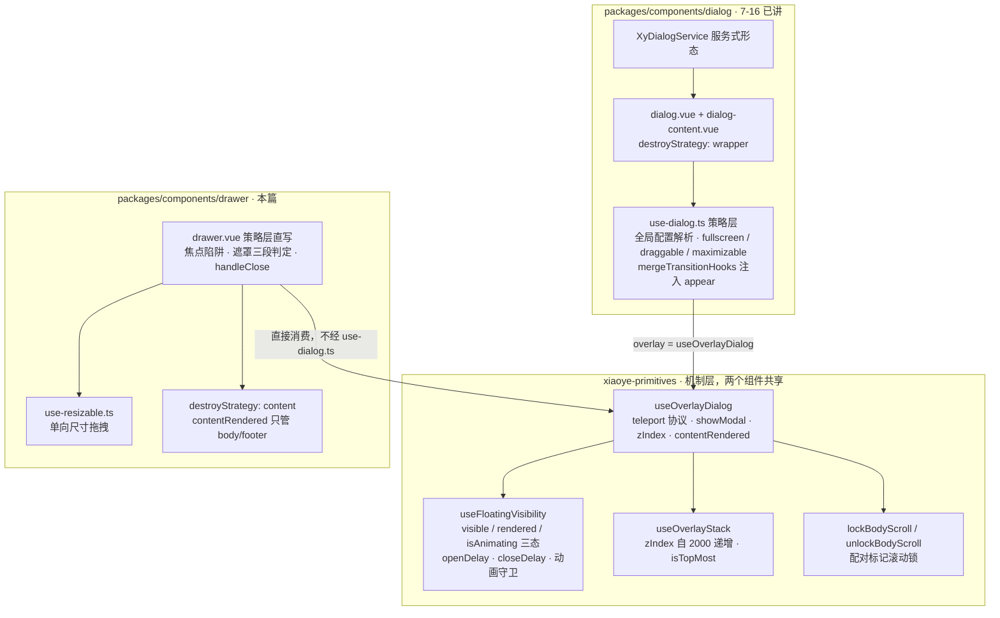
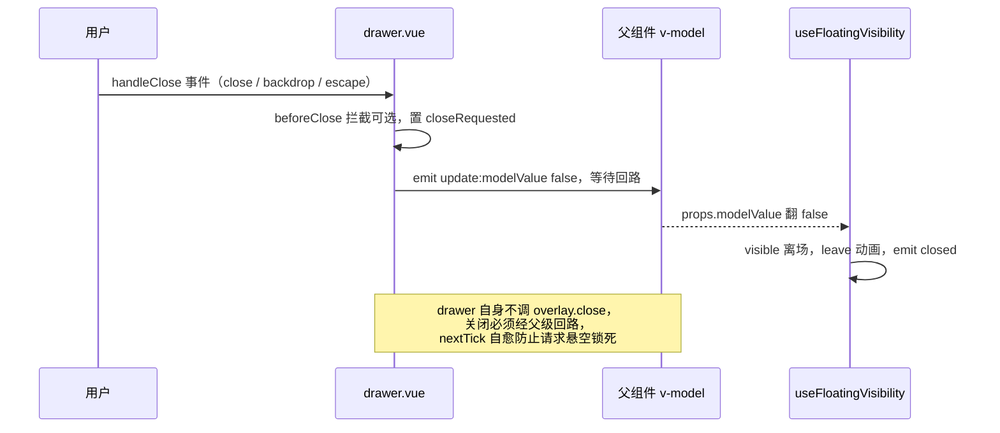
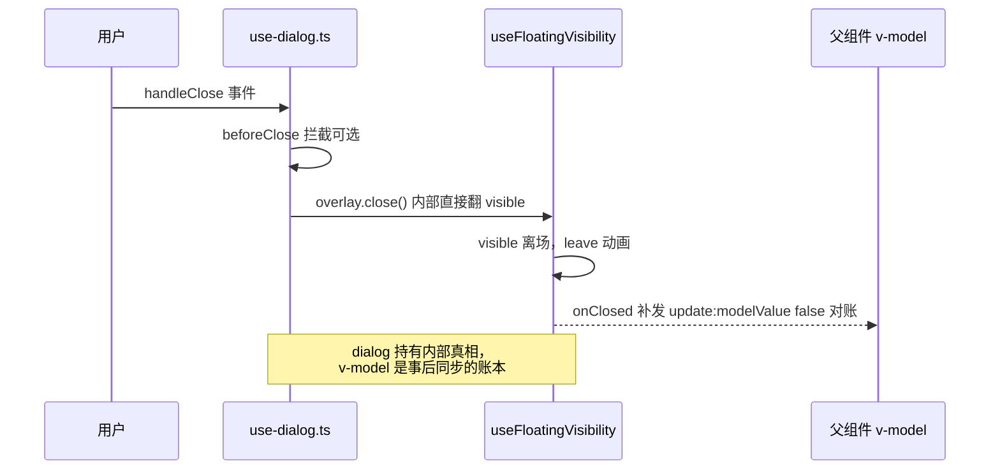

# 7-17 · Drawer：容器变体

> 本篇是第 7 卷"反馈与数据展示"的第十七篇，也是本卷浮层收尾的一篇。核心问题：**drawer 与 dialog 到底共享什么、差异在哪？** 7-16 已把 dialog 的全貌讲完——全局配置解析、拖拽与全屏、服务式形态、模态遮罩的关闭语义；本篇换一条主线，不再平铺 drawer 自身，而是以"差异矩阵"为纲：先给出共享面的实码定论（drawer 消费的是 primitives 的 `useOverlayDialog`，**不是** dialog 包内的 `use-dialog.ts`），再逐项拆开四个分叉面——关闭语义的属主（dialog 内部 `close()` 对 drawer 纯 emit）、方向四态（direction 与 placement 双向映射）、动画性格（滑入位移矩阵对缩放）、尺寸协商（size 属性、拖拽会话值与 CSS 兜底的三层裁决）。526 行的 `drawer.vue` 本篇以拼图方式全文展开——十三个行号区块散布在一、二、三、四、五、六、七、十节，首尾相接恰好覆盖 L1-526；`drawer.css` 的四方向 transform 矩阵整段展开；4-07 引过的焦点陷阱接线段归位全貌，测试与类型夹具补齐。末尾交付一张共享/分叉总表。所有代码摘自当前工作区实态，行号逐一核对过。

## 一、组件速览：manifest 单 kind，没有服务形态的浮层

先给组件档案。drawer 在 `component-manifest.json` 中登记在反馈组（`docsGroup: "feedback"`），紧挨着 7-16 讲过的 dialog 条目（L495-502）：

```json
// packages/components/component-manifest.json L503-510
{
  "name": "drawer",
  "docsGroup": "feedback",
  "docsText": "Drawer 抽屉",
  "installExports": ["XyDrawer"],
  "installChecks": [{ "kind": "component", "name": "xy-drawer" }],
  "styleImports": ["drawer"]
}
```

`installExports` 只有 `["XyDrawer"]` 一个值——这就是"drawer 无服务式形态"的实码定论，但要先把考据口径校正一下：**manifest 的 `installChecks` 对 dialog 同样只有单 kind**（`{ "kind": "component", "name": "xy-dialog" }`，L500），manifest 从不为服务单开 kind；notification 的服务形态也是直接把 `XyNotificationService` 塞进 `installExports`（L387），而不是增加 kind 条目。所以判断一个组件有没有服务形态，真相在组件 `index.ts`，不在 manifest 的 kind 数量上。dialog 的 `index.ts` 第 45 行有一句 `export { XyDialogService }`，而 drawer 的 `index.ts` 全文只有 `XyDrawer = withInstall(Drawer, "xy-drawer")` 一件出口；`packages/components/drawer/src/` 下也只有三个源文件——`drawer.vue`（526 行）、`drawer.ts`（67 行，纯类型）、`use-resizable.ts`（145 行，拖拽尺寸），没有 dialog 包里那种 `dialog-service.ts`、`service-state.ts` 的家族。命令式抽屉没有跟上，这是有意的切片（服务式要解决队列、容器挂载与 prompt 三件套，4-12 拆过 dialog 那套的成本），不是遗漏。

类型文件先读前半段，它是理解本篇方向四态的钥匙：

```ts
// packages/components/drawer/src/drawer.ts L1-23
import type { TransitionProps } from "vue";
import type Drawer from "./drawer.vue";

export const drawerPlacements = ["left", "right", "top", "bottom"] as const;
export const drawerDirections = ["ltr", "rtl", "ttb", "btt"] as const;

export type DrawerPlacement = (typeof drawerPlacements)[number];
export type DrawerDirection = (typeof drawerDirections)[number];
export type DrawerTransition = string | TransitionProps;
export type DrawerCloseReason = "close" | "backdrop" | "escape" | "programmatic";
export type DrawerModelValueChangeHandler = (value: boolean) => void;
export type DrawerResizeHandler = (event: MouseEvent, size: number) => void;

export interface DrawerHeaderSlotProps {
  close: () => void;
  titleId: string;
  titleClass: string;
}

export interface DrawerTitleSlotProps {
  titleId: string;
  titleClass: string;
}
```

两个常量数组先钉死一件事：本库 drawer 的方向词汇有**两套**——`drawerPlacements` 的 left/right/top/bottom 和 `drawerDirections` 的 ltr/rtl/ttb/btt，后者正是 Element Plus 的写法。这套双词汇怎么协同，第四节专拆。`DrawerCloseReason` 四值与 dialog 的 `DialogCloseReason` 同构：close（关闭按钮）、backdrop（遮罩）、escape（ESC）、programmatic（程序调用），第四节之前的测试会看到它们按序抵达 `beforeClose` 的第二个参数。

props 默认值一览（区块二，L27-57；完整 `DrawerProps` 接口在 `drawer.ts` L25-61，32 个可选属性，这里不再重复展开）：

```ts
// packages/components/drawer/src/drawer.vue L27-57
const props = withDefaults(defineProps<DrawerProps>(), {
  modelValue: false,
  title: "",
  size: 420,
  placement: "right",
  closeOnOverlay: true,
  closeOnClickModal: true,
  closeOnEsc: true,
  destroyOnClose: false,
  showClose: true,
  lockScroll: true,
  withHeader: true,
  appendToBody: true,
  appendTo: "body",
  modal: true,
  modalClass: "",
  modalPenetrable: false,
  openDelay: 0,
  closeDelay: 0,
  resizable: false,
  customClass: "",
  headerClass: "",
  bodyClass: "",
  footerClass: "",
  zIndex: undefined,
  headerAriaLevel: 2,
  modalFade: true,
  closeIcon: "mdi:close",
  fullscreen: false,
  transition: undefined
})
```

这份默认值表里藏着一个不在场的键：`closeOnPressEscape`（与 `closeOnClickModal` 同为新命名的 `closeOnEsc` 对偶）**没有默认值**。这不是遗漏，而是双命名兼容期的正确写法——旧名 `closeOnEsc` 的默认 `true` 就是兜底，新名只有被显式传入时才经由 `allowEscClose`（L173-175 的 `closeOnPressEscapePassed ? props.closeOnPressEscape : props.closeOnEsc`）接管。若给新名也配默认值，"用户没传"与"用户传了 true"就无法区分，第四节 vnode 探测的整套裁决就塌了。默认值里最值得对比的是 `size: 420`（数字，像素）与 `placement: "right"`——Element Plus 的同位默认是字符串 `'30%'` 与 `direction: 'rtl'`，两组默认值背后是两种尺寸观与两套方向词汇，分别在第四、六节展开。

## 二、共享面定论：一层机制基座，两份策略直写

先把最重要的定论放在前面：**drawer 与 dialog 的共享，不在组件层，而在 primitives 层。**

`drawer.vue` 的 import 列表里没有任何来自 `../../dialog` 的东西——它从 `xiaoye-primitives` 引入 `useOverlayDialog`、`useFocusTrap`、`useDismissibleLayer`、`useNamespace`，从 icon 包引入 `XyIcon`，仅此而已。dialog 包内的 `use-dialog.ts`（387 行）是 dialog 的私有策略层，全仓 grep 确认只被 dialog 包自己引用。也就是说，两个组件的关系是"同一层基座上的两栋房子"，而不是"一层楼上的两户隔断"。拼图从文件头开始（区块一，L1-26；第一节已引过的 L27-57 props 段与之相接）：

```ts
// packages/components/drawer/src/drawer.vue L1-26
<script setup lang="ts">
import { computed, getCurrentInstance, nextTick, ref, useAttrs, watch } from "vue"
import type { StyleValue } from "vue"
import {
  useDismissibleLayer,
  useFocusTrap,
  useNamespace,
  useOverlayDialog
} from "xiaoye-primitives"
import { warnOnce } from "xiaoye-primitives"
import { XyIcon } from "../../icon"
import { useResizable } from "./use-resizable"
import type {
  DrawerCloseReason,
  DrawerDirection,
  DrawerHeaderSlotProps,
  DrawerPlacement,
  DrawerProps,
  DrawerTitleSlotProps,
  DrawerTransition
} from "./drawer"

defineOptions({
  inheritAttrs: false
})

```

区块三（L58-91）是 emits、slots 与五份内部状态——`closing`、`closeRequested`、`downOnOverlay`、`headerTitlePresent` 加一个模块级的 `isClosingByBeforeClose`，它们是后面所有分叉面的主角，先把名字混个脸熟：

```ts
// packages/components/drawer/src/drawer.vue L58-91

const emit = defineEmits<{
  "update:modelValue": [value: boolean]
  open: []
  opened: []
  close: []
  closed: []
  "open-auto-focus": []
  "close-auto-focus": []
  "resize-start": [evt: MouseEvent, size: number]
  resize: [evt: MouseEvent, size: number]
  "resize-end": [evt: MouseEvent, size: number]
}>()

const slots = defineSlots<{
  header?: (props: DrawerHeaderSlotProps) => unknown
  title?: (props: DrawerTitleSlotProps) => unknown
  default?: () => unknown
  footer?: () => unknown
}>()

const attrs = useAttrs()
const instance = getCurrentInstance()
const ns = useNamespace("drawer")
const panelRef = ref<HTMLElement | null>(null)
const titleId = `xy-drawer-title-${Math.random().toString(36).slice(2, 10)}`
const bodyId = `xy-drawer-body-${Math.random().toString(36).slice(2, 10)}`
const titleClass = `${ns.base.value}__title`
const headerTitlePresent = ref(false)
const downOnOverlay = ref(false)
const closing = ref(false)
const closeRequested = ref(false)
let isClosingByBeforeClose = false

```

事件面与 dialog 的第一处差别就在 L67-69：drawer 的 resize 三事件载荷是 `(event, size)` 双参，dialog 是 `(event, width, height)` 三参——第六节展开。名字混完，回到主线。这个基座长这样：



`useOverlayDialog` 的内部编排（`packages/xiaoye-primitives/src/composables/use-overlay-dialog.ts` L42-68）在 4-05 讲浮层栈、4-07 讲滚动锁时都引过局部，这里补它最容易被讲错的一段——`destroyOnClose` 的两种销毁策略（L87-93）：

```ts
// packages/xiaoye-primitives/src/composables/use-overlay-dialog.ts L87-93
  const contentRendered = computed(() => {
    if (callbacks.destroyStrategy === "content" && toValue(options.destroyOnClose)) {
      return visible.value;
    }

    return rendered.value;
  });
```

以及 4-07 详细复盘过的配对式滚动锁，本篇只回收结论（L127-159）：

```ts
// packages/xiaoye-primitives/src/composables/use-overlay-dialog.ts L127-159
  const shouldLockBodyScroll = computed(() => {
    return Boolean(toValue(options.lockScroll)) && visible.value;
  });

  // 配对标记：只有本实例真正加过锁才允许解锁。
  // unlockBodyScroll 是无条件递减，若 watch immediate 在初始 false 时也调 unlock，
  // 混合配置（A lockScroll=true 开着、B lockScroll=false 挂载）会把 A 的锁减掉。
  let bodyScrollLocked = false;

  watch(
    shouldLockBodyScroll,
    (locked) => {
      if (locked && !bodyScrollLocked) {
        lockBodyScroll();
        bodyScrollLocked = true;
        return;
      }
      if (!locked && bodyScrollLocked) {
        unlockBodyScroll();
        bodyScrollLocked = false;
      }
    },
    { immediate: true }
  );

  // 兜底：组件卸载时 watcher 停止但不再触发回调，
  // 打开状态下直接卸载会导致计数泄漏，这里只偿还本实例的锁。
  onBeforeUnmount(() => {
    if (bodyScrollLocked) {
      unlockBodyScroll();
      bodyScrollLocked = false;
    }
  });
```

drawer 对这套基座的消费现场在 `drawer.vue` L177-245（区块六），一段 69 行的接线，值得整段读——注意解构清单里**没有** `close`：

```ts
// packages/components/drawer/src/drawer.vue L177-245
const {
  appendTo,
  contentRendered,
  handleAfterEnter,
  handleAfterLeave,
  isTopMost,
  rendered,
  showModal,
  teleportDisabled,
  visible,
  zIndex
} = useOverlayDialog({
  modelValue: () => props.modelValue,
  destroyOnClose: () => props.destroyOnClose,
  lockScroll: () => props.lockScroll,
  openDelay: () => props.openDelay,
  closeDelay: () => props.closeDelay,
  appendToBody: () => props.appendToBody,
  appendTo: () => props.appendTo,
  modal: () => props.modal,
  zIndex: () => props.zIndex
}, {
  destroyStrategy: "content",
  onOpen: () => {
    closing.value = false
    closeRequested.value = false
    emit("open")
    void nextTick(() => {
      if (!panelRef.value) {
        return
      }

      panelRef.value.scrollTop = 0
      panelRef.value.scrollLeft = 0
      panelRef.value.scrollTo?.({
        top: 0,
        left: 0
      })
    })
  },
  onClose: () => {
    closing.value = true
    emit("close")
  },
  onOpened: () => {
    closing.value = false
    emit("opened")
  },
  onClosed: () => {
    closing.value = false
    closeRequested.value = false
    emit("closed")
  }
})

const isPenetrable = computed(() => Boolean(props.modalPenetrable) && !showModal.value)
const allowOverlayClose = computed(() =>
  showModal.value &&
  (closeOnClickModalPassed.value ? props.closeOnClickModal : props.closeOnOverlay)
)
const drawerRootStyle = computed(() => ({
  zIndex: `${zIndex.value}`
}))
const transitionConfig = computed(() =>
  mergeTransitionHooks(props.transition, "xy-drawer-fade", {
    onAfterEnter: handleAfterEnter,
    onAfterLeave: handleAfterLeave
  })
)
```

逐行看：`destroyStrategy: "content"` 与 dialog 的 `"wrapper"`（`use-dialog.ts` L182）是这对孪生组件的第一个分叉开关，它的实际效果要到第八节结合模板才看得清，这里先记一个惊人的事实——**`contentRendered` 全仓只有 drawer 一个消费者**（`drawer.vue` L179 解构、L513 模板判断），dialog 压根没解构它；`onOpen` 回调里那段 `nextTick` 滚动复位，复位的是**面板自身**（`panelRef.scrollTop`），而 dialog 版（`use-dialog.ts` L186-195）复位的是滚动容器 `overlayRef` 和面板两处——容器几何不同，复位对象就不同。共享清单收拢成一张表：

| 共享机制 | 机制层出处 | drawer 接线点 |
| --- | --- | --- |
| 三态状态机 visible / rendered / isAnimating | `use-floating-visibility.ts` L53-249 | `drawer.vue` L177-194 |
| openDelay / closeDelay 延迟开合 | 同上 L112-156 | `drawer.vue` L192-193 |
| 浮层栈 zIndex（自 2000 递增）与 isTopMost | `use-overlay-stack.ts` L23、L50-59 | `drawer.vue` L187、L197、L237-239 |
| teleport / appendTo 协议 | `use-overlay-dialog.ts` L70-85 | `drawer.vue` L194-195、L476 |
| body 滚动锁（配对标记） | `use-overlay-dialog.ts` L127-159 | `drawer.vue` L191 |
| destroyOnClose 语义 | `use-overlay-dialog.ts` L58-67、L95-102 | `drawer.vue` L190、L199 |
| showModal / zIndex / isTopMost 出口 | `use-overlay-dialog.ts` L104-112、L169-173 | `drawer.vue` L232-236、L403-409 |
| 焦点陷阱 / 可关闭层基元 | `use-focus-trap.ts`、`use-dismissible-layer.ts` | `drawer.vue` L369-393、L418-427 |

## 三、分叉面一：关闭语义的属主——dialog 自己关，drawer 等父级

共享面讲完，第一个分叉面也是最深的分叉面：**关闭这条链路上，状态到底归谁改。**

dialog 的答案是"我自己关"。`use-dialog.ts` L169-209 是它对基座的消费现场，注意 `onClosed` 回调里的第二行：

```ts
// packages/components/dialog/src/use-dialog.ts L169-209
  const overlay = useOverlayDialog(
    {
      modelValue: () => props.modelValue,
      destroyOnClose: () => props.destroyOnClose,
      lockScroll: resolvedLockScroll,
      openDelay: () => props.openDelay,
      closeDelay: () => props.closeDelay,
      appendToBody: () => props.appendToBody,
      appendTo: () => props.appendTo,
      modal: () => props.modal,
      zIndex: () => props.zIndex
    },
    {
      destroyStrategy: "wrapper",
      onOpen: () => {
        closing.value = false;
        options.emitOpen();
        void nextTick(() => {
          options.overlayRef.value?.scrollTo?.({
            top: 0,
            left: 0
          });
          dialogElement.value?.scrollTo?.({
            top: 0,
            left: 0
          });
        });
      },
      onClose: () => {
        closing.value = true;
        options.emitClose();
      },
      onOpened: () => {
        options.emitOpened();
      },
      onClosed: () => {
        options.emitClosed();
        options.emitUpdateModelValue(false);
      }
    }
  );
```

dialog 的关闭动作走 `finishClose`（L283-289）：`overlay.close()` 直改 `useFloatingVisibility` 内部的 `visible`，视觉立即离场，然后 `onClosed` 回调**补发** `update:modelValue` false 给父级对账。也就是说 dialog 内部持有一份可见性真相，v-model 是事后同步的账本——这是 4-04 讲过的"内部态 + 受控对账"模式。

drawer 的答案是"我只提请求"。`drawer.vue` 的 `handleClose`（L327-367）与 `emitClose`（L313-325）全文如下（区块九，L312-368）：

```ts
// packages/components/drawer/src/drawer.vue L312-368

function emitClose() {
  closeRequested.value = true
  emit("update:modelValue", false)
  void nextTick(() => {
    if (!props.modelValue && !closing.value) {
      return
    }

    if (visible.value && !closing.value) {
      closeRequested.value = false
    }
  })
}

function handleClose(reason: DrawerCloseReason = "programmatic") {
  if (isClosingByBeforeClose || closing.value || closeRequested.value) {
    return
  }

  if (!props.beforeClose) {
    emitClose()
    return
  }

  isClosingByBeforeClose = true
  let doneCalled = false
  const done = (cancel?: boolean) => {
    if (doneCalled) {
      return
    }

    doneCalled = true
    isClosingByBeforeClose = false

    if (cancel) {
      closeRequested.value = false
      return
    }

    emitClose()
  }

  try {
    const result = props.beforeClose(done, reason)
    if (result && typeof (result as Promise<void>).catch === "function") {
      void (result as Promise<void>).catch(() => {
        isClosingByBeforeClose = false
        closeRequested.value = false
      })
    }
  } catch {
    isClosingByBeforeClose = false
    closeRequested.value = false
  }
}

```

对比 dialog 的同名函数（`use-dialog.ts` L291-323）有三处刻意的不同。**其一，drawer 不调 `overlay.close()`**——`emitClose` 只做一件事：置 `closeRequested` 标记、emit `update:modelValue` false，然后等父级把 prop 翻回来，`useFloatingVisibility` 的 modelValue watch（`use-floating-visibility.ts` L186-211）才驱动 `visible` 离场。dialog 是"内部先关、v-model 对账"，drawer 是"v-model 提案、父级裁决"——同一个基座提供了 `close()` 出口，drawer 的解构清单里却压根没有它，这是受控谱系两端的选择。**其二，guard 多一项**：dialog 的 `handleClose` 只查 `isClosingByBeforeClose || closing.value`（L292），drawer 多查一个 `closeRequested.value`（L328）——因为 drawer 的关闭请求发出后要等一个回路，请求在途期间必须挡住重复 emit。**其三，自愈逻辑**：`emitClose` 的 `nextTick` 里，若父级已同步（`!props.modelValue`）就保留标记防重复，若父级没响应（`visible` 仍为 true）就把标记清掉，允许再次请求。第三点有专门一条测试钉着：

```ts
// packages/components/drawer/__tests__/drawer.spec.ts L311-341
  it("beforeClose 进行中时会忽略重复关闭请求", async () => {
    const beforeClose = vi.fn();
    mountDrawer({
      beforeClose
    });

    await waitForTransition();

    const closeButton = document.body.querySelector(".xy-drawer__close") as HTMLButtonElement | null;
    closeButton?.click();
    closeButton?.click();
    document.dispatchEvent(new KeyboardEvent("keydown", { key: "Escape", bubbles: true }));
    await nextTick();

    expect(beforeClose).toHaveBeenCalledTimes(1);
  });

  it("外部未立即同步 modelValue 时不会锁死后续关闭请求", async () => {
    const wrapper = mountDrawer();

    await waitForTransition();

    const closeButton = document.body.querySelector(".xy-drawer__close") as HTMLButtonElement | null;
    closeButton?.click();
    await nextTick();

    closeButton?.click();
    await nextTick();

    expect(wrapper.emitted("update:modelValue")).toHaveLength(2);
  });
```

第二条用例的场景值得体会：父级没有立刻同步 `modelValue`（比如父组件在 `onUpdate:modelValue` 里做了一次异步校验），第一次点击的关闭请求悬空。若无自愈逻辑，`closeRequested` 永远为 true，用户再点关闭按钮就石沉大海——对话框关闭是"库内闭环"，抽屉关闭是"跨组件协商"，协商协议必须假设对面会迟到。两条关闭链路画成时序图，差异一目了然：





顺带把"无遮罩关闭语义"这对差异讲透。drawer 的遮罩元素是 `v-if="showModal"` 条件渲染的（`drawer.vue` L488），`modal: false` 时连遮罩 DOM 都不存在；此时点击外部关闭整个失效——`allowOverlayClose`（L233-236）要求 `showModal.value` 为真，遮罩不在，`backdrop` 这个关闭原因就永远不可能产生。那 `modal: false` 的抽屉还剩什么？根容器 `.xy-drawer` 是 `position: fixed; inset: 0` 的全屏 flex 容器（`drawer.css` L1-6），没有遮罩它仍然盖住整个视口、挡住下层一切点击——**无遮罩不等于穿透**。真正的穿透要再加 `modalPenetrable: true`，`isPenetrable`（L232）为真时根容器挂 `is-penetrable` 类，命中 `drawer.css` L8-10 的 `pointer-events: none`，下层页面才恢复可点。测试一正一反锁死这组语义：`modalPenetrable=true 且无遮罩时不会因外部点击关闭`（spec L382-392）、`modalPenetrable=true 时背景按钮仍可点击`（spec L394-456）。dialog 侧有同款 `is-penetrable`（`dialog.css` L21-23）与同款"无遮罩即挡层"几何，但有两个小分叉：dialog 关闭中会挂 `is-closing` 类并把面板 `pointer-events: none`（`dialog.css` L25-27），drawer 有 `closing` 这个 ref 却不落类名，只用于逻辑防抖；drawer 独有一个 `is-without-mask` 标记类（`drawer.vue` L483），全库 CSS 里没有任何规则消费它——它是留给业务方做样式钩子的状态位，这类"纯标记类"在 5-10 讲 Card 时提过一嘴，这里算浮层族的延伸案例。

## 四、分叉面二：方向四态——direction 与 placement 的双向映射

第一节已经看到两套方向词汇的常量定义，现在看它们怎么互转。`drawer.vue` L145-176（区块五，上接第五节的区块四 L92-144，下接第二节的区块六 L177-245）：

```ts
// packages/components/drawer/src/drawer.vue L145-176

const directionMap: Record<DrawerDirection, DrawerPlacement> = {
  ltr: "left",
  rtl: "right",
  ttb: "top",
  btt: "bottom"
}
const placementMap: Record<DrawerPlacement, DrawerDirection> = {
  left: "ltr",
  right: "rtl",
  top: "ttb",
  bottom: "btt"
}

const resolvedDirection = computed(() => props.direction ?? placementMap[props.placement])
const resolvedPlacement = computed(() => directionMap[resolvedDirection.value])
const closeOnClickModalPassed = computed(() => {
  const vnodeProps = instance?.vnode.props ?? {}
  return "closeOnClickModal" in vnodeProps || "close-on-click-modal" in vnodeProps
})
const closeOnPressEscapePassed = computed(() => {
  const vnodeProps = instance?.vnode.props ?? {}
  return "closeOnPressEscape" in vnodeProps || "close-on-press-escape" in vnodeProps
})
const customClassPassed = computed(() => {
  const vnodeProps = instance?.vnode.props ?? {}
  return "customClass" in vnodeProps || "custom-class" in vnodeProps
})
const allowEscClose = computed(() =>
  closeOnPressEscapePassed.value ? props.closeOnPressEscape : props.closeOnEsc
)

```

方向四态的实码定论：`direction` 取 `ltr / rtl / ttb / btt` 四值（与 EP 完全同词汇），`placement` 取 `left / right / top / bottom` 四值；`resolvedDirection = direction ?? placementMap[placement]`——**direction 优先覆盖 placement**，`resolvedPlacement` 再反向推导回来，两个 computed 互为镜像。覆盖关系有测试钉死（spec L86-100）：`placement: "left"` 配 `direction: "btt"` 时，根类是 `xy-drawer--bottom`、面板高度是 `280px`——方向以 direction 为准，尺寸随方向落到高度维度。

为什么要两套词汇？把两个 computed 的用途拆开看就明白了。`resolvedPlacement` 去了模板根类（`drawer.vue` L481 的 `xy-drawer--${resolvedPlacement}`）——CSS 类名要的是几何词，`xy-drawer--left` 自解释，`xy-drawer--ltr` 则要读者脑内先做一次翻译；`resolvedDirection` 去了 `useResizable` 的几何判定——第四节会看到它的 `isHorizontal` 判 `ltr || rtl`，读写轴向的语义词。EP 只有 direction 单套（默认 `'rtl'`），API 表面更小，但 CSS 类和内部判断都得背着 ltr/rtl 这种阅读方向隐喻走；本库多养一个 prop 和一张映射表，换回类名与几何判断的直白。文档页把这条决策写得很诚实："`placement` 仍然是项目内推荐写法；如果你需要使用 `direction`，它会优先覆盖 `placement`"——既有习惯不强制迁移，新词汇对齐生态，覆盖关系一刀切清。

这段代码里的三个 `*Passed` computed 是另一个值得驻足的模式：`instance?.vnode.props` 探测**用户到底传没传**某个 prop。drawer 的 props 表里有两组同义双名——`closeOnOverlay` / `closeOnClickModal`、`closeOnEsc` / `closeOnPressEscape`——前者是本库早期命名（Naive UI 系），后者是 dialog 系命名（也是 EP 命名）。消费点的裁决规则统一为：传了新名用新名，否则回落旧名（`allowEscClose` L173-175、`allowOverlayClose` L233-236）。`customClassPassed` 则服务于废弃告警（L464-466 的 `warnOnce`）。用 vnode.props 探测"传没传"而不是简单 `props.x ?? 默认`，是因为两个名字都有合法的 `true` 默认值——不探测就无法区分"用户显式传了 false"和"用户没传"，这是所有双命名兼容期的通用难题，4-04 讲受控双模时的 `modelValue in vnodeProps` 判定同源。

## 五、分叉面三：滑入 vs 缩放——四方向 transform 矩阵

5-10 引过 `drawer.css` L110-134 的头体三段与 dialog 的同构性，本篇把文件剩余的全部性格段展开。先看面板块的变量层（L34-81）——这是 CSS 层面的"共享面"证据：

```css
/* packages/theme/src/components/drawer.css L34-81 */
.xy-drawer__panel {
  --xy-drawer-panel-bg: var(
    --xy-drawer-bg,
    var(
      --xy-dialog-bg,
      var(
        --xy-bg-raised,
        color-mix(in srgb, var(--xy-bg-floating) 96%, var(--xy-bg-subtle))
      )
    )
  );
  --xy-drawer-panel-border: color-mix(
    in srgb,
    var(--xy-border-subtle) 84%,
    var(--xy-border)
  );
  --xy-drawer-section-bg: var(
    --xy-drawer-section-background,
    color-mix(in srgb, var(--xy-drawer-panel-bg) 98%, var(--xy-bg-subtle))
  );
  --xy-drawer-body-color: var(--xy-drawer-text-color, var(--xy-text-secondary));
  --xy-drawer-header-padding-y: 10px;
  --xy-drawer-header-padding-x: 16px;
  --xy-drawer-body-padding-y: 10px;
  --xy-drawer-body-padding-x: 16px;
  --xy-drawer-footer-padding-y: 10px;
  --xy-drawer-footer-padding-x: 16px;
  --xy-drawer-panel-shadow:
    0 0 0 1px color-mix(in srgb, var(--xy-bg-floating) 6%, transparent),
    0 12px 32px color-mix(in srgb, var(--xy-text-heading) 7%, transparent);
  --xy-drawer-header-bg: var(--xy-drawer-section-bg);
  --xy-drawer-body-bg: var(--xy-drawer-panel-bg);
  --xy-drawer-footer-bg: var(--xy-drawer-section-bg);
  position: relative;
  z-index: 1;
  display: flex;
  flex-direction: column;
  box-sizing: border-box;
  pointer-events: auto;
  width: min(100%, 420px);
  height: 100%;
  border: 1px solid var(--xy-drawer-panel-border);
  background: var(--xy-drawer-panel-bg);
  box-shadow: var(--xy-drawer-panel-shadow);
  outline: none;
  transition: transform var(--xy-transition-duration-fast) var(--xy-transition-timing);
  isolation: isolate;
}
```

看 `--xy-drawer-panel-bg` 的五级回落链：`--xy-drawer-bg` → `--xy-dialog-bg` → `--xy-bg-raised` → color-mix 兜底——抽屉的背景色默认**继承对话框的定制**，L152 的标题色同样是 `--xy-drawer-title-color, var(--xy-dialog-title-color, ...)` 双级回落。用户只定制过 dialog 的主题时，drawer 自动跟随；想单独定制 drawer 时，专属变量又在链头优先。共享在令牌层的形态不是"引用同一个变量"，而是"回落链上搭便车"，这比组件层的共享松耦合得多。L79 那行 `transition: transform ...` 是本节的引子——面板只过渡 transform 一个属性，滑入动画的全部秘密在文件尾部的矩阵里（L280-319，全段展开）：

```css
/* packages/theme/src/components/drawer.css L280-319 */
.xy-drawer-fade-enter-active,
.xy-drawer-fade-leave-active {
  overflow: hidden;
}

.xy-drawer-fade-enter-active .xy-drawer__overlay,
.xy-drawer-fade-leave-active .xy-drawer__overlay {
  transition: opacity var(--xy-transition-duration-fast) var(--xy-transition-timing);
}

.xy-drawer.is-no-modal-fade .xy-drawer__overlay,
.xy-drawer-fade-enter-active.is-no-modal-fade .xy-drawer__overlay,
.xy-drawer-fade-leave-active.is-no-modal-fade .xy-drawer__overlay {
  transition: none;
}

.xy-drawer-fade-enter-from .xy-drawer__overlay,
.xy-drawer-fade-leave-to .xy-drawer__overlay {
  opacity: 0;
}

.xy-drawer-fade-enter-from.xy-drawer--left .xy-drawer__panel,
.xy-drawer-fade-leave-to.xy-drawer--left .xy-drawer__panel {
  transform: translateX(-100%);
}

.xy-drawer-fade-enter-from.xy-drawer--right .xy-drawer__panel,
.xy-drawer-fade-leave-to.xy-drawer--right .xy-drawer__panel {
  transform: translateX(100%);
}

.xy-drawer-fade-enter-from.xy-drawer--top .xy-drawer__panel,
.xy-drawer-fade-leave-to.xy-drawer--top .xy-drawer__panel {
  transform: translateY(-100%);
}

.xy-drawer-fade-enter-from.xy-drawer--bottom .xy-drawer__panel,
.xy-drawer-fade-leave-to.xy-drawer--bottom .xy-drawer__panel {
  transform: translateY(100%);
}
```

对照 dialog 的动画段（`packages/theme/src/components/dialog.css` L282-303）：

```css
/* packages/theme/src/components/dialog.css L282-303 */
.xy-dialog-fade-enter-active,
.xy-dialog-fade-leave-active {
  transition: opacity var(--xy-transition-duration-fast) var(--xy-transition-timing);
}

.xy-dialog-fade-enter-active .xy-dialog__panel,
.xy-dialog-fade-leave-active .xy-dialog__panel {
  transition:
    transform var(--xy-transition-duration-fast) var(--xy-transition-timing),
    opacity var(--xy-transition-duration-fast) var(--xy-transition-timing);
}

.xy-dialog-fade-enter-from,
.xy-dialog-fade-leave-to {
  opacity: 0;
}

.xy-dialog-fade-enter-from .xy-dialog__panel,
.xy-dialog-fade-leave-to .xy-dialog__panel {
  transform: translateY(-10px) scale(0.985);
  opacity: 0;
}
```

两段并排读，组织方式的差异比视觉差异更值得学。**抽屉是满位移矩阵**：四个方向类各一组规则，`enter-from` 与 `leave-to` 共用同一个 `translate ±100%`——滑入方向和滑出方向天然互逆，一组选择器两用；矩阵的行键是第二、四节那张 `placementMap` 的四个值，JS 侧的双向映射表与 CSS 侧的四行矩阵一一对应，改一个方向词汇要同时动两处，映射的代价在这里显形。**对话框是单点缩放**：没有方向类参与，`translateY(-10px) scale(0.985)` 一行打完，浮起 10 像素加 1.5% 的收缩，是"从使用者的注意力中心长大"的动线。三个细节补齐全貌：其一，`overflow: hidden` 挂在过渡期根容器上（L280-283），滑入途中面板从屏幕外进来，若容器可滚会出现闪现的滚动条；其二，`modalFade: false` 走 `is-no-modal-fade` 只关**遮罩**的渐隐（L290-294），面板滑入照常——测试 L743-752 断言根类存在，这个 prop 是 drawer 独有的（dialog 无 modalFade）；其三，`xy-drawer__panel.is-dragging` 时 `transition: none`（L204-206），拖拽尺寸若被 transform 过渡拖着走，面板会以"弹簧"手感滞后于鼠标，拖拽期间必须断开过渡——第五节马上用到这条。

transition 的替换协议也在此收口：`transition` prop 接受字符串或完整 `TransitionProps`，`mergeTransitionHooks`（区块四，`drawer.vue` L92-144）负责合并——自定义配置缺 `name` 时回落 `"xy-drawer-fade"`，缺 `onAfterEnter` / `onAfterLeave` 时注入基座的钩子：

```ts
// packages/components/drawer/src/drawer.vue L92-144
function mergeTransitionHooks(
  transition: DrawerTransition | undefined,
  defaultName: string,
  hooks: {
    onAfterEnter: () => void
    onAfterLeave: () => void
  }
) {
  const callHook = (
    hook: ((element: Element) => void) | Array<(element: Element) => void> | undefined,
    element: Element
  ) => {
    if (!hook) {
      return
    }

    if (Array.isArray(hook)) {
      hook.forEach((entry) => {
        entry(element)
      })
      return
    }

    hook(element)
  }

  if (!transition) {
    return {
      name: defaultName,
      ...hooks
    }
  }

  if (typeof transition === "string") {
    return {
      name: transition,
      ...hooks
    }
  }

  return {
    ...transition,
    name: transition.name ?? defaultName,
    onAfterEnter: (element: Element) => {
      callHook(transition.onAfterEnter, element)
      hooks.onAfterEnter()
    },
    onAfterLeave: (element: Element) => {
      callHook(transition.onAfterLeave, element)
      hooks.onAfterLeave()
    }
  }
}
```

合并而不是覆盖，是因为状态机的清账依赖这两个钩子——`handleAfterLeave` 要在动画结束后清 `rendered`，被用户的自定义钩子顶掉就等于摧毁 `destroyOnClose`。有意思的是，这个函数在 `use-dialog.ts` L20-75 有一份几乎逐行相同的双写，唯一实质差异是 dialog 版在每个返回分支里多注入 `appear: true`——dialog 支持初始挂载即播动画（服务式 dialog 挂载即开，需要 appear），drawer 没有服务式形态，也就不需要 appear。同一个算法、一处参数、两种性格，这是"共享提取的度"最直观的标本，权衡档案里展开。

## 六、尺寸协商：size 属性、拖拽会话值与 CSS 兜底的三层裁决

尺寸是 drawer 与 dialog 差异最大的 prop 面：dialog 管 width/height 两个维度加 min/max 约束，drawer 只管**一个**维度——左右方向是宽度、上下方向是高度，另一个维度恒为 100%。裁决链在 `drawer.vue` L246-283（区块七，上接第二节的区块六 L177-245，下接第七节的区块八 L284-311）：

```ts
// packages/components/drawer/src/drawer.vue L246-283

const { isResizing, resolvedSize, handleDragStart } = useResizable(
  panelRef,
  () => resolvedDirection.value,
  () => props.size,
  () => props.resizable && !props.fullscreen,
  (event, evt, size) => {
    if (event === "resize-start") {
      emit("resize-start", evt, size)
      return
    }

    if (event === "resize-end") {
      emit("resize-end", evt, size)
      return
    }

    emit("resize", evt, size)
  }
)

const panelSizeStyle = computed(() => {
  if (props.fullscreen) {
    return {
      width: "100%",
      height: "100%"
    }
  }

  const isVertical = resolvedPlacement.value === "left" || resolvedPlacement.value === "right"
  const dimension = resolvedSize.value ?? (typeof props.size === "number" ? `${props.size}px` : props.size)

  return {
    width: isVertical ? dimension : "100%",
    height: isVertical ? "100%" : dimension
  }
})

```

`useResizable`（`use-resizable.ts`）的几何核心在 L32-68：

```ts
// packages/components/drawer/src/use-resizable.ts L32-68
  const customSize = ref<number | null>(null);
  const isResizing = ref(false);
  const isHorizontal = computed(() => {
    const value = toValue(direction);
    return value === "ltr" || value === "rtl";
  });
  const resolvedDirection = computed(() => toValue(direction));
  let startPointer = 0;
  let startSize = 0;

  function getViewportSize() {
    return isHorizontal.value ? window.innerWidth : window.innerHeight;
  }

  function getPanelSize() {
    const panel = panelRef.value;

    if (!panel) {
      return 0;
    }

    return isHorizontal.value ? panel.offsetWidth : panel.offsetHeight;
  }

  function getPointer(event: MouseEvent) {
    return isHorizontal.value ? event.pageX : event.pageY;
  }

  function getDirectionSign() {
    const value = resolvedDirection.value;
    return value === "ltr" || value === "ttb" ? 1 : -1;
  }

  function getNextSize(pointer: number) {
    const nextSize = startSize + getDirectionSign() * (pointer - startPointer);
    return clamp(nextSize, 4, getViewportSize());
  }
```

以及拖拽的起止与重置边界（L98-120）：

```ts
// packages/components/drawer/src/use-resizable.ts L98-120
  function handleDragStart(event: MouseEvent) {
    if (!toValue(enabled) || event.button !== 0) {
      return;
    }

    event.preventDefault();
    startPointer = getPointer(event);
    startSize = customSize.value ?? getPanelSize();
    isResizing.value = true;
    cleanupListeners();
    window.addEventListener("mousemove", handlePointerMove);
    window.addEventListener("mouseup", handlePointerUp);
    emit("resize-start", event, startSize);
  }

  watch(
    () => [toValue(size), resolvedDirection.value],
    () => {
      customSize.value = null;
      isResizing.value = false;
      cleanupListeners();
    }
  );
```

现在可以完整陈述**尺寸的三层裁决**了。第一层是 inline style：`panelSizeStyle` 永远产出 `width` 与 `height` 两键挂在面板上（`drawer.vue` L298 的 `panelStyle` 再叠 attrs.style），所以 CSS 里 `width: min(100%, 420px)` 的默认值（`drawer.css` L73）平时是"死"的——它只在 `size` 传空串导致 `addUnit` 产出空字符串、inline 值失效时接管，是给 `size: ""` 这类边界留的兜底，而不是给"不传 size"留的（不传时默认 420 已经走 inline）。第二层是拖拽会话值：`resolvedSize` 里 `customSize` 非 null 时**优先于 size prop**——用户拖过之后，受控的 `size` 就被会话值覆盖，直到 `watch([size, direction])` 检测到受控值或方向变化才把 `customSize` 清空。文档示例 resizable.vue 把这条语义写给用户："关闭后会保留本次拖拽结果……当你重新传入 `size` 或切换方向时，会回到新的受控尺寸"。第三层是拖拽过程的 clamp：`getNextSize` 把结果夹在 `4px` 到视口尺寸之间——上界防拖出屏幕，下界 4px 是个防"拖没了"的极小保底。方向符号 `getDirectionSign` 是四态方向在几何上的最后落地：ltr/ttb 朝正轴增大，rtl/btt 朝负轴增大——右侧抽屉往左拖（pageX 变小）面板应该变宽，所以符号取 -1。测试把这笔账算得很清楚（spec L712-741）：

```ts
// packages/components/drawer/__tests__/drawer.spec.ts L712-741
  it("resizable 模式支持拖拽调整尺寸并发出事件", async () => {
    const wrapper = mountDrawer({
      resizable: true,
      size: 300,
      direction: "rtl"
    });

    await nextTick();

    const panel = document.body.querySelector(".xy-drawer__panel") as HTMLElement | null;
    const dragger = document.body.querySelector(".xy-drawer__dragger") as HTMLElement | null;

    Object.defineProperty(panel, "offsetWidth", {
      configurable: true,
      get: () => 300
    });

    dragger?.dispatchEvent(createMouseEvent("mousedown", 300));
    window.dispatchEvent(createMouseEvent("mousemove", 260));
    await nextTick();

    expect(panel?.style.width).toBe("340px");
    expect(wrapper.emitted("resize-start")?.[0]?.[1]).toBe(300);
    expect(wrapper.emitted("resize")?.[0]?.[1]).toBe(340);

    window.dispatchEvent(createMouseEvent("mouseup", 260));
    await nextTick();

    expect(wrapper.emitted("resize-end")?.[0]?.[1]).toBe(340);
  });
```

`size: 300`、方向 rtl、鼠标从 300 拖到 260：`300 + (-1) × (260 - 300) = 340`，面板 340px，事件载荷 `resize-start` 报 300（起始尺寸）、`resize` / `resize-end` 报 340。注意载荷是**单个数字**——dialog 的 resize 三事件载荷是 `{ width, height }` 对象（`use-dialog.ts` L219-227 从 `useDialogResizable` 解构出宽高再转发），因为 dialog 双向都可变，drawer 单向可变，载荷形状跟着自由度走。还有一处小分叉：`addUnit` 在 `use-resizable.ts` L9-19 与 `use-dialog.ts` L12-18 双写，drawer 版空值返回 `""`、dialog 版返回 `undefined`——返回值最终拼进 style 对象时的清理语义不同，双写的两份从此各自演化。

## 七、焦点治理消费侧全景：4-07 的接线段与它的四个守卫

4-07 引过 `drawer.vue` L369-393 的焦点陷阱接线段（"策略全开"的那份），本篇把原文归位（区块十，L369-394，上接第三节的区块九 L312-368），接线段之下是四个测试用例，之上是 aria 链路：

```ts
// packages/components/drawer/src/drawer.vue L369-394
const focusTrap = useFocusTrap(panelRef, {
  active: () => visible.value,
  autoFocus: "first",
  restoreFocus: true,
  onAutoFocus: () => {
    emit("open-auto-focus")
  },
  onRestoreFocus: () => {
    emit("close-auto-focus")
  },
  onReleaseRequested: (event) => {
    if (!allowEscClose.value || !visible.value || !isTopMost()) {
      return
    }

    event.preventDefault()
    event.stopPropagation()
    handleClose("escape")
  },
  onFocusoutPrevented: (event) => {
    if (event.detail.focusReason === "pointer") {
      event.preventDefault()
    }
  }
})

```

只重述两个策略回调的分野——`onFocusoutPrevented` 只拦 pointer（鼠标点出去不拉回，键盘 Tab 逃逸拉回），`onReleaseRequested` 是 ESC 的面板内通道（栈顶才响应、`preventDefault` + `stopPropagation` 防止与 document 级监听重复关闭）。dialog 的接线（`use-dialog.ts` L259-269）则全部默认策略：不传两个回调，ESC 单走 `useDismissibleLayer` 一条通道。

ESC 的第二条通道，与遮罩点击的三段判定同住在下一段（区块十一，L395-428）：

```ts
// packages/components/drawer/src/drawer.vue L395-428
function handleOverlayMouseDown(event: MouseEvent) {
  downOnOverlay.value = showModal.value && event.target === event.currentTarget
}

function handleOverlayMouseUp(event: MouseEvent) {
  downOnOverlay.value = downOnOverlay.value && event.target === event.currentTarget
}

function handleOverlayClick(event: MouseEvent) {
  const canClose =
    showModal.value &&
    allowOverlayClose.value &&
    isTopMost() &&
    downOnOverlay.value &&
    event.target === event.currentTarget

  downOnOverlay.value = false

  if (canClose) {
    handleClose("backdrop")
  }
}

useDismissibleLayer({
  enabled: () => visible.value,
  refs: [panelRef],
  closeOnEscape: () => allowEscClose.value,
  closeOnOutside: false,
  isTopMost: () => isTopMost(),
  onDismiss: () => {
    handleClose("escape")
  }
})

```

与 dialog 的同构双写（`use-dialog.ts` L336-357）逐行一致，只在 `canClose` 的第二个条件上换成 `allowOverlayClose`——那是第三节讲过的双命名裁决。遮罩三段判定的耐心值得再夸一次：`mousedown` 与 `mouseup` 都必须落在遮罩自身（`target === currentTarget`），用户在遮罩上按下、拖进面板抬起再点击，不算关闭意图——spec L367-380 专门用"面板上抬起"这个刁钻动作验过。`useDismissibleLayer` 则把 ESC 挂在 document 上，与 `onReleaseRequested` 的面板捕获通道构成双保险：面板内的 `stopPropagation` 让事件到不了 document，两套编排收敛成"一次按键、一次关闭"，这是 4-07 的定论，此处不再展开。

拼图还缺一段。区块八（L284-311）夹在第六节的区块七 L246-283 与第三节的区块九 L312-368 之间，是 class 与 aria 的 computed 段：

```ts
// packages/components/drawer/src/drawer.vue L284-311
const panelAttrs = computed(() => {
  const { class: _class, style: _style, ...rest } = attrs
  return rest
})

const panelClasses = computed(() => [
  `${ns.base.value}__panel`,
  resolvedDirection.value,
  ns.is("fullscreen", props.fullscreen),
  props.customClass,
  attrs.class,
  ns.is("dragging", isResizing.value)
])

const panelStyle = computed<StyleValue>(() => [panelSizeStyle.value, attrs.style as StyleValue])
const overlayClasses = computed(() => [`${ns.base.value}__overlay`, props.modalClass])
const headerClasses = computed(() => [`${ns.base.value}__header`, props.headerClass])
const bodyClasses = computed(() => [
  `${ns.base.value}__body`,
  props.bodyClass,
  props.withHeader ? "" : "is-without-header"
])
const footerClasses = computed(() => [`${ns.base.value}__footer`, props.footerClass])

const ariaLabelledby = computed(() =>
  props.withHeader && (Boolean(props.title) || headerTitlePresent.value) ? titleId : undefined
)
const ariaLabel = computed(() => ariaLabelledby.value ? undefined : props.title || undefined)
```

`panelAttrs` 把 attrs 里的 `class` / `style` 剥掉、其余原样透传给面板元素（`drawer.vue` L490 的 `v-bind="panelAttrs"`），`class` / `style` 则并进 `panelClasses` / `panelStyle` 走受控合并——这是 `inheritAttrs: false` 组件处理透传的标准手势，4-03 讲标准解剖时提过。`panelClasses` 的第二位直接放 `resolvedDirection.value`（ltr/rtl/ttb/btt），而根类放的是 `resolvedPlacement`（第四节的映射表在此各司其职）；`is-without-header` 是 body 在无头部时的补偿 padding 钩子（`drawer.css` L142-144）。

`ariaLabelledby` 只在"标题真的渲染出来了"时才指向 `titleId`——判定依据是 DOM 查询而不是 props 推断，因为标题可能来自 `title` prop、`header` 插槽内部的 `titleId` 注入、或兼容期的 `title` 插槽三者之一，静态分析不如直接问 DOM。探测失败时回落 `aria-label`（L311），保证 `role="dialog"` 的面板永远有可读名（`drawer.vue` L491-492 挂 `role` 与动态 `aria-modal`，面板 `tabindex="-1"` 在 L493——4-07 引过这个行号，空容器兜底把焦点钉在面板上靠的就是它）。`headerAriaLevel` 默认 2，标题元素带 `role="heading"` 与 `aria-level`（L497-500），测试 L559-568 断言 `aria-level="5"` 与 `aria-labelledby` 非空。dialog.vue L123-135 有一份同构的双写探测，查的是 `dialogContentRef` 的内部面板——同样的算法，不同的根。

拼图的最后一块是 watch 与收尾段（区块十二，L429-473）：

```ts
// packages/components/drawer/src/drawer.vue L429-473
watch(
  () => props.modelValue,
  (value) => {
    if (value) {
      closeRequested.value = false
      return
    }

    downOnOverlay.value = false
  },
  {
    immediate: true
  }
)

watch(
  [visible, () => props.withHeader, () => props.title, () => Boolean(slots.header), () => Boolean(slots.title)],
  async () => {
    await nextTick()
    headerTitlePresent.value = Boolean(
      props.withHeader &&
      panelRef.value &&
      panelRef.value.querySelector(`#${titleId}`)
    )
  },
  {
    immediate: true,
    flush: "post"
  }
)

if (slots.title) {
  warnOnce("XyDrawer", "`title` 插槽已进入兼容模式，请优先改用 `header` 插槽。")
}

if (customClassPassed.value) {
  warnOnce("XyDrawer", "`custom-class` 已废弃，请改用组件原生 `class`。")
}

defineExpose({
  handleClose,
  afterEnter: handleAfterEnter,
  afterLeave: handleAfterLeave
})
</script>
```

第一个 watch 是第三节的 `closeRequested` 自愈协议在 prop 侧的镜像：父级把 `modelValue` 翻回 true（重新打开）时清掉残留的关闭请求标记，翻 false 时清掉遮罩按下标记。第二个 watch 就是上一段说的 DOM 探测本体，`flush: "post"` 保证查询时 DOM 已挂载。两段 `warnOnce` 是一次性废弃告警：`title` 插槽进入兼容模式（spec L571-593 验证告警与 `aria-labelledby` 接线），`custom-class` 废弃并指向原生 `class`（spec L595-607）——与第四节的 vnode 探测联动，只有用户真的传了旧 prop 才告警。`defineExpose` 三件套与 `drawer.ts` L63-67 的 `DrawerInstance` 类型一一对应，测试 L609-640 的 `wrapper.vm.handleClose()` 与 L627 起的焦点断言走的正是这条 expose 通道。

四个守卫用例里，前两个 4-07 引过行号，本篇把三连段完整展开（spec L642-710）：

```ts
// packages/components/drawer/__tests__/drawer.spec.ts L642-710
  it("焦点意外离开抽屉时会重新回到抽屉内部", async () => {
    document.body.innerHTML = `<button id="outside">outside</button>`;

    mountDrawer(
      {},
      {
        default: () => h("button", { class: "inside-button" }, "inside")
      }
    );

    await waitForTransition();

    const panel = document.body.querySelector(".xy-drawer__panel") as HTMLElement | null;
    const insideButton = document.body.querySelector(".inside-button") as HTMLButtonElement | null;
    const outsideButton = document.getElementById("outside") as HTMLButtonElement | null;

    insideButton?.focus();
    outsideButton?.focus();
    await waitForMacrotask();

    expect(document.activeElement).not.toBe(outsideButton);
    expect(panel?.contains(document.activeElement as Node)).toBe(true);
  });

  it("panel 自身聚焦时 Shift+Tab 会回到最后一个可聚焦元素", async () => {
    mountDrawer(
      {},
      {
        default: () => h("button", { class: "inside-last" }, "last")
      }
    );

    await waitForTransition();

    const panel = document.body.querySelector(".xy-drawer__panel") as HTMLElement | null;
    const lastButton = document.body.querySelector(".inside-last") as HTMLButtonElement | null;

    panel?.focus();
    panel?.dispatchEvent(new KeyboardEvent("keydown", { key: "Tab", shiftKey: true, bubbles: true }));
    await nextTick();

    expect(document.activeElement).toBe(lastButton);
  });

  it("无遮罩穿透模式下指针切换焦点不会被抽屉重新抢回", async () => {
    document.body.innerHTML = `<button id="outside">outside</button>`;

    mountDrawer(
      {
        modal: false,
        modalPenetrable: true
      },
      {
        default: () => h("button", { class: "inside-button" }, "inside")
      }
    );

    await waitForTransition();

    const insideButton = document.body.querySelector(".inside-button") as HTMLButtonElement | null;
    const outsideButton = document.getElementById("outside") as HTMLButtonElement | null;

    insideButton?.focus();
    outsideButton?.dispatchEvent(new MouseEvent("mousedown", { bubbles: true }));
    outsideButton?.focus();
    await waitForMacrotask();

    expect(document.activeElement).toBe(outsideButton);
  });
```

第一条是"陷阱"的本义（焦点逃逸拉回），第三条是同一段代码在穿透模式下的反向断言（`onFocusoutPrevented` 拦下 pointer 后不拉回），一正一反证明那个 `if (event.detail.focusReason === "pointer")` 的分支是策略而非遗漏；第二条覆盖面板自身持有焦点时的 Shift+Tab 环回。测试基建有两处可复用的耐心：`mountDrawer` 传 `stubs: { transition: false }` 强制真实 `<transition>` 运行（L20-24），`waitForTransition` 用双 rAF（jsdom 降级双 setTimeout）等动画帧（L45-58）——没有这两件，焦点类的断言会在渲染时序上随机翻车，dialog 与 drawer 两个 spec 共享同一套写法但各自维护副本。

## 八、测试全貌与类型夹具

`drawer.spec.ts` 全文 795 行、31 个用例，是全库浮层族最重的单组件测试之一。按叙事分组：关闭链路 8 条（关闭按钮、beforeClose 拦截 / 原因 / 重复防护 / 拦截期间不卸载、Escape、外部未同步自愈、关闭链路）；懒渲染与销毁 3 条（默认懒挂载、destroyOnClose 重挂载、拦截期间不提前卸载）；遮罩与穿透 5 条（遮罩点击、按下抬起错位不关、穿透不外关、穿透背景可点、appendTo 无遮罩）；嵌套与栈 2 条（嵌套只响应栈顶 ESC、嵌套遮罩只关顶层——4-05 的浮层栈语义在 drawer 上的复验）；焦点 4 条（第七节已展开）；尺寸与形态 4 条（方向覆盖、resizable 拖拽、fullscreen、modalFade）；API 兼容与插槽 5 条（title 插槽兼容告警、customClass 废弃告警、header/body/footerClass、header 插槽参数、modalClass/zIndex）。两个"兼容告警"用例都 spy 了 `console.warn` 验证 `warnOnce` 触发——废弃警告不只是打印，是被测试钉住的行为契约。

类型夹具 `tests/types/fixtures/drawer.ts`（146 行）覆盖 props 全量合法形态与 8 处 `@ts-expect-error` 反例。正面段（L15-57）：

```ts
// tests/types/fixtures/drawer.ts L15-57
const drawerProps: DrawerProps = {
  modelValue: true,
  title: "成员编辑面板",
  placement,
  direction,
  size: "45%",
  appendToBody: true,
  appendTo: "body",
  modal: true,
  modalClass: "drawer-mask",
  modalPenetrable: false,
  closeOnOverlay: true,
  closeOnClickModal: true,
  closeOnEsc: true,
  closeOnPressEscape: true,
  openDelay: 120,
  closeDelay: 80,
  destroyOnClose: false,
  showClose: true,
  lockScroll: true,
  withHeader: true,
  resizable: true,
  customClass: "legacy-drawer-panel",
  headerClass: "drawer-header",
  bodyClass: "drawer-body",
  footerClass: "drawer-footer",
  zIndex: 3100,
  headerAriaLevel: 3,
  modalFade: false,
  closeIcon: "mdi:close-circle-outline",
  fullscreen: false,
  transition: "xy-drawer-fade",
  beforeClose(done, reason) {
    const closeReason: DrawerCloseReason | undefined = reason;
    void closeReason;
    done();
  }
};

void drawerProps;

const drawerRef = ref<DrawerInstance>();
drawerRef.value?.handleClose("programmatic");
```

这 43 行把双命名四件套（closeOnOverlay + closeOnClickModal、closeOnEsc + closeOnPressEscape）同时合法共存的契约钉在了类型层；`size: "45%"` 钉住字符串尺寸；`drawerRef.value?.handleClose("programmatic")` 钉住 `DrawerInstance` 的 expose 类型（`drawer.ts` L63-67：`handleClose` / `afterEnter` / `afterLeave` 三件，与 `drawer.vue` L468-472 的 `defineExpose` 一一对应）。反例段有 8 个 `@ts-expect-error`：`placement: "center"`、`direction: "horizontal"`、`resizable: "yes"`、`customClass: 1`、`zIndex: "3000"`、`headerAriaLevel: false`、`transition: 1` 等——其中前两个正是方向四态的类型边界：placement 不收 center，direction 不收 horizontal，两套词汇各自闭合。`beforeClose(done, reason)` 的签名在夹具里被真实调用了一次，`DrawerCloseReason` 四值由此进入类型层的回归范围。

## 九、文档与示例矩阵

`apps/docs/examples/drawer/` 下有 9 个示例：basic、controlled、direction、fullscreen、header、modal、nested、placement、resizable。文档页（`apps/docs/components/drawer.md`）在"direction 与 placement 的区别"一节明确了默认值口径："默认 `size` 仍然是 `420`，默认 `append-to-body` 仍然是 `true`，以保持当前项目里的既有使用习惯"——与 `withDefaults` 实参一致（7-15 考据过 transfer 文档表格抄错默认值的旧案，drawer 这页对齐了）。把 resizable 示例全文放在这里，它是第六节三层裁决的用户视角：

```vue
<!-- apps/docs/examples/drawer/resizable.vue（全文） -->
<script setup lang="ts">
import { ref } from "vue";
import type { DrawerDirection } from "xiaoye-components";

const open = ref(false);
const direction = ref<DrawerDirection>("rtl");
const currentSize = ref<number | null>(null);

function handleResize(_: MouseEvent, size: number) {
  currentSize.value = size;
}
</script>

<template>
  <div class="xy-doc-stack">
    <xy-space wrap>
      <xy-button type="primary" @click="open = true">打开可拖拽抽屉</xy-button>
      <xy-button plain @click="direction = 'rtl'">右侧</xy-button>
      <xy-button plain @click="direction = 'ltr'">左侧</xy-button>
      <xy-button plain @click="direction = 'ttb'">顶部</xy-button>
      <xy-button plain @click="direction = 'btt'">底部</xy-button>
    </xy-space>

    <xy-space wrap>
      <xy-tag status="primary">direction={{ direction }}</xy-tag>
      <xy-tag status="neutral">最近一次尺寸：{{ currentSize ?? "未拖拽" }}</xy-tag>
    </xy-space>

    <xy-drawer
      v-model="open"
      title="可拖拽面板"
      :direction="direction"
      :size="direction === 'ttb' || direction === 'btt' ? 280 : 360"
      resizable
      @resize-start="handleResize"
      @resize="handleResize"
      @resize-end="handleResize"
    >
      <div class="xy-doc-stack">
        <p>拖动抽屉边缘可以实时调整尺寸，关闭后会保留本次拖拽结果。</p>
        <p>当你重新传入 `size` 或切换方向时，会回到新的受控尺寸。</p>
      </div>
    </xy-drawer>
  </div>
</template>
```

示例里藏着一个使用范式：`:size` 与 direction 联动（上下 280、左右 360）——因为第六节讲过 `watch([size, direction])` 会清空拖拽会话值，切方向等于宣告"尺寸参照系变了"，size 跟着重算才不会出现上下抽屉带着左右抽屉的 360px 高度这种错位。另外两个示例值得点名：direction.vue 演示了 ttb 顶部筛选层加 `beforeClose` 拦截的组合（顶部方向 + 隐藏 header + footer 放"解除拦截"按钮，是配置面板的标准姿势）；nested.vue 演示嵌套抽屉——注释写着"默认 `append-to-body` 为 `true`，所以嵌套抽屉会自动进入更高层级"，这正是第二节 teleport 协议的价值：两个都 append 到 body 的抽屉靠浮层栈的 zIndex 递增（自 2000 起）天然分层，spec L458-495 两条嵌套用例再保证只有栈顶响应 ESC 与遮罩。

## 十、差异矩阵总表：共享 / 分叉清单

把前八节的结论收进一张总表——这就是本篇的核心交付物：

| 维度 | dialog（7-16） | drawer（本篇） | 判定 |
| --- | --- | --- | --- |
| 状态机 / 延迟 / 浮层栈 / 滚动锁 / teleport | `useOverlayDialog` | 同一基座 | **共享**（机制层） |
| 关闭属主 | `overlay.close()` 内部先关，v-model 事后对账 | 纯 emit，等父级回路 | **分叉**（受控谱系两端） |
| `update:modelValue` false 时机 | `onClosed` 回调补发（use-dialog.ts L206） | `emitClose` 即时发出（drawer.vue L315） | **分叉** |
| 重复关闭防护 | `isClosingByBeforeClose / closing` | 再加 `closeRequested`（在途请求标记） | **分叉** |
| beforeClose(done, reason) 协议 | 有，四值原因 | 有，同四值 | 共享协议、双写实现 |
| 焦点陷阱策略 | 全默认（不传 onFocusout / onRelease 回调） | 全开（pointer 宽松 + ESC 面板内通道） | **分叉**（4-07 定论） |
| ESC 通道 | `useDismissibleLayer` 单通道 | 面板捕获 + document 双通道收敛 | **分叉**（结果一致） |
| 遮罩点击三段判定 | mousedown/up/click 同构 | 同构（drawer.vue L395-416） | 双写同构 |
| 动画 | `translateY(-10px) scale(0.985)` 缩放 | 四方向 `translate ±100%` 滑入矩阵 | **分叉** |
| appear 首挂动画 | mergeTransitionHooks 注入 `appear: true` | 无 appear（无服务式形态，无需首挂动画） | **分叉**（双写的真实差异） |
| modalFade 关遮罩渐隐 | 无此 prop | 有（drawer 独有） | **分叉** |
| 方向 | 无 | placement + direction 双 prop 双向映射，direction 优先 | drawer 独有 |
| 尺寸 | width/height + min/max 约束，载荷 `{width, height}` | 单向 size（数字加 px / 字符串原样）+ 拖拽会话值，载荷单数字 | **分叉** |
| 拖拽可调 | use-dialog-resizable（双向） | use-resizable（单向 + clamp(4, viewport)） | 双写不同构 |
| destroyStrategy | `"wrapper"`（contentRendered 无人消费，销毁走根 rendered） | `"content"`（唯一真实消费者：只销毁 body/footer） | **分叉** |
| 全局配置 | 接 `DialogGlobalConfig` 七项 | 不接（无 drawer 全局配置） | **分叉** |
| 服务式形态 | `XyDialogService`（index.ts L28） | 无（installExports 单值） | **分叉** |
| 穿透态类名 | `is-penetrable` + `is-closing`（pointer-events 双规则） | `is-penetrable` + `is-without-mask`（纯标记类，无 is-closing） | 微分叉 |
| 标题插槽兼容 | `$slots.title` 透传 | title 插槽兼容模式 + `warnOnce` | drawer 独有兼容段 |

拼图的最后归位在模板。区块十三（L474-526）——teleport、transition、根容器、遮罩、面板、头体脚、拖拽把手，全在这五十行里：

```html
<!-- packages/components/drawer/src/drawer.vue L474-526 -->

<template>
  <teleport :to="appendTo" :disabled="teleportDisabled">
    <transition v-bind="transitionConfig">
      <div
v-if="rendered" v-show="visible" :class="[
        ns.base.value,
        `${ns.base.value}--${resolvedPlacement}`,
        ns.is('fullscreen', props.fullscreen),
        !showModal ? 'is-without-mask' : '',
        isPenetrable ? 'is-penetrable' : '',
        !props.modalFade ? 'is-no-modal-fade' : ''
      ]" :style="drawerRootStyle">
        <div
v-if="showModal" :class="overlayClasses" @click="handleOverlayClick" @mousedown="handleOverlayMouseDown"
          @mouseup="handleOverlayMouseUp" />
        <aside
ref="panelRef" v-bind="panelAttrs" :class="panelClasses" :style="panelStyle" role="dialog"
          :aria-modal="showModal ? 'true' : 'false'" :aria-labelledby="ariaLabelledby" :aria-label="ariaLabel"
          :aria-describedby="bodyId" tabindex="-1" @click.stop @keydown.capture="focusTrap.handleKeydown">
          <header v-if="props.withHeader" :class="headerClasses">
            <template v-if="!slots.title">
              <slot name="header" :close="handleClose" :title-id="titleId" :title-class="titleClass">
                <span
v-if="props.title" :id="titleId" :class="titleClass" role="heading"
                  :aria-level="String(props.headerAriaLevel)">
                  {{ props.title }}
                </span>
              </slot>
            </template>
            <template v-else>
              <slot name="title" :title-id="titleId" :title-class="titleClass" />
            </template>
            <button
v-if="props.showClose" type="button" class="xy-drawer__close" aria-label="close"
              @click="handleClose('close')">
              <XyIcon :icon="props.closeIcon" :size="18" />
            </button>
          </header>
          <template v-if="contentRendered">
            <div :id="bodyId" :class="bodyClasses">
              <slot />
            </div>
            <footer v-if="slots.footer" :class="footerClasses">
              <slot name="footer" />
            </footer>
          </template>
          <div v-if="props.resizable && !props.fullscreen" class="xy-drawer__dragger" @mousedown="handleDragStart" />
        </aside>
      </div>
    </transition>
  </teleport>
</template>
```

这张表里最值得再咀嚼一行的是 destroyStrategy。名义上它是个对称的双值开关，实码却不对称：`contentRendered` 这个 computed 只有 drawer 消费（全仓唯一引用在 `drawer.vue` L179 与 L513），dialog 的 `"wrapper"` 策略在 dialog.vue 里没有对应物——dialog 的销毁是根节点 `v-if="overlay.rendered.value"`（`dialog.vue` L153）配合 `use-overlay-dialog.ts` L58-67 在 `onClose` 钩子里直接置 `rendered = false` 完成的。也就是说 drawer 的 `destroyOnClose` 是"内容先走、面板滑完再拆架子"（内容随 `visible` 卸载，面板壳播完 leave 动画后 `handleAfterLeave` 才清 `rendered`），dialog 的 `destroyOnClose` 是"根节点即刻整体离场"。spec L222-254 用一个 setupSpy 断言了 drawer 侧的"重开重挂载"（spy 两次调用），L256-276 断言了"拦截期间不提前卸载"——`closeRequested` 尚未落定前 `contentRendered` 不会翻 false，内容多留一口气等裁决。

## 十一、权衡档案与 EP 对照

本篇的权衡收进档案：

1. **共享提取的度：机制下沉，策略留守。** 状态机、栈、滚动锁、teleport 协议下沉进 primitives 的 `useOverlayDialog`（直接消费方只有 dialog 与 drawer 两个，tooltip / popover / dropdown 等轻浮层走的是更下面的 `useFloatingVisibility`）；dialog 专属的全局配置解析、fullscreen/draggable/maximizable 协议留在 `use-dialog.ts`，drawer 不沾。收益是两个组件的"性格"互不牵制；代价是 `mergeTransitionHooks`、遮罩三段判定、`handleClose` 骨架、标题 DOM 探测四处双写，合计约 150 行。判断标准一句话：**会因组件而异的策略留在消费侧，跨组件不变的机制才下沉**——dialog 版 mergeTransitionHooks 的 `appear: true` 与 drawer 版的无 appear，恰恰证明了"各留一份"才能各改各的。
2. **四方向的 transform 组织：JS 用语义词，CSS 用几何词。** 双 prop 双向映射表多养了一张表和两个 computed，换回 CSS 类名（`xy-drawer--left`）与拖拽轴向判定（`isHorizontal` 判 ltr/rtl）的各自直白；CSS 侧四行矩阵 `enter-from` / `leave-to` 共用一对 transform，滑入滑出互逆天然零成本。代价是改方向词汇要同步 JS 映射表与 CSS 矩阵两处——映射的维护成本被类型（两个 const 数组互为 key 源）压到最低。
3. **尺寸协商的三层裁决。** inline style 永远在场（CSS `min(100%, 420px)` 只兜 `size: ""` 的空值边界），拖拽会话值压过受控 size 直到受控值或方向变化才重置，clamp(4, viewport) 挡住物理边界。争议点在"拖拽值优先于受控 prop"这个反直觉顺序——更"纯"的做法是拖拽即 emit 尺寸让父级改 size，但那会把每次 mousemove 都变成一次受控回路；会话期覆盖是流畅度的让步，边界（watch 重置）把控制权还给父级。
4. **关闭属主的受控谱系两端。** dialog 内部 close 是"库内闭环"（服务式 dialog 没有父级可等，闭环是硬需求），drawer 纯 emit 是"协商协议"（抽屉常驻业务流，关闭前常要等父级保存/校验）。`closeRequested` 的自愈设计是协商协议的保险：对面迟到不锁死，对面拒绝（beforeClose cancel）就撤标。
5. **双命名兼容期的 vnode 探测。** 四个 `*Passed` computed 换取新旧两套命名各自"显式传值"的判定能力，`warnOnce` 把迁移压力做成一次性提示。与直接文档废弃相比，多付的是探测代码；换来的是存量调用零破坏迁移。

EP 对照一栏表（以 EP 2.x 的 el-drawer 为参照）：

| 维度 | Element Plus el-drawer | 本库 XyDrawer |
| --- | --- | --- |
| 与 dialog 的复用 | 源码级复用 dialog 包的 `useDialog` 组合式 | 只共享 primitives 的 `useOverlayDialog`，不碰 dialog 的策略层 |
| 方向词汇 | `direction` 单套，默认 `rtl` | `placement`（默认 `right`）+ `direction` 双套双向映射，direction 优先 |
| 默认尺寸 | `size: '30%'` 字符串 | `size: 420` 数字（addUnit 协商），CSS 兜底 `min(100%, 420px)` |
| 拖拽调尺寸 | 无 | `resizable` + 三事件，载荷单数字，clamp 视口 |
| 穿透模式 | 无 `modalPenetrable` | `modalPenetrable` + `is-penetrable` / `is-without-mask` |
| 关闭原因 | before-close 不带原因参数 | `beforeClose(done, reason)` 四值 `DrawerCloseReason` |
| 服务式形态 | 无 | 无（与 EP 同判；本库 dialog 有而 drawer 未跟进） |
| 焦点治理 | focus-trap 内建 | 同一 primitives 基元，策略参数外露 |

两种复用路线各有所图：EP 的"drawer 复用 dialog 的 useDialog"让两个组件的模态行为永远一致，代价是 drawer 背上了 dialog 的全部概念（包括它并不需要的部分）；本库的"机制下沉一层、策略各自直写"让 drawer 保住了自己的身量（526 行单文件、无全局配置、无服务），代价是本篇数出的那一串双写。没有免费的复用，只有想清楚的提取边界——这句是本篇的题眼。

下一篇进入第八卷《基础组件 · 数据篇》的开篇：8-01《Statistic：数值呈现》。从浮层容器回到页面里最安静的一类组件——统计数值，核心问题换成了"格式化管道与动画取舍"：`precision` 精度、`groupSeparator` 千分位、`decimalSeparator` 小数位与自定义 `formatter` 的管道顺序怎么定，数字要不要做滚动动画，`valueStyle` 与 title/prefix/suffix 三插槽的排版边界在哪。数据篇的第一块砖，我们从"怎么把一个数字排好看"砌起。
