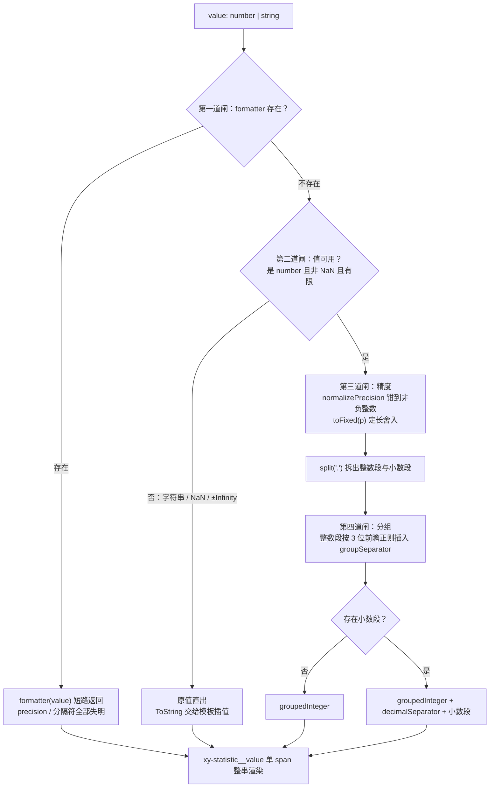
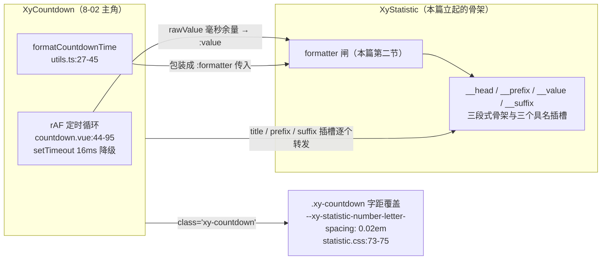

# 8-01 · Statistic：数值呈现

> 核心问题：**格式化管道与动画取舍** —— 一个只负责"把一个数摆出来"的组件，凭什么单独成篇？因为它把"数值如何变成屏幕上的文本"的全部决策压进了一个 computed：自定义 formatter、精度、千分位、小数点、占位直出，五条岔路必须排出唯一的先后顺序；而"数字要不要动"这个每家组件库都躲不开的问题，它用一个字回答了：不。本篇把这条管道逐闸拆开，再把这个"不"字背后的账一笔一笔算清楚。

开篇照例校准口径。本篇主角 `packages/components/statistic/src/statistic.vue` 当前工作区实测 107 行，类型层 `src/statistic.ts` 17 行，安装入口 `packages/components/statistic/index.ts` 8 行；单测 `packages/components/statistic/__tests__/statistic.spec.ts` 108 行、7 个用例，写作前实跑一遍，7 passed（vitest，752ms）；主题样式 `packages/theme/src/components/statistic.css` 75 行；类型夹具 `tests/types/fixtures/statistic.ts` 36 行；文档示例 `apps/docs/examples/statistic/` 下 5 个文件。有一处现场必须先声明：**`statistic.css` 当前是工作区未提交状态**——`git diff` 显示第 5、8、13 三行刚从裸字面量 `560 / 680` 换成 `var(--xy-font-weight-560)` / `var(--xy-font-weight-680)`，HEAD 里还是裸值（3-06 考据引用的正是 HEAD 态）。这是 3-06《字重十二档》"写死 → 沉淀 → 转正 → 全库替换"四步中最后一步的活体现场，第六节展开。除这三行外，本篇涉及的全部文件都是干净的已提交状态，所有行号即当前实态。

先把坐标钉进 8 卷的位置。第 5 卷拆的是基础组件的"结构债"，第 6 卷拆的是表单的"状态债"，第 7 卷拆的是反馈组件的"语义债"；第 8 卷走进数据展示区，第一站就撞上一个反直觉的事实：data 组 13 个组件里，Statistic 是逻辑最薄的一个——没有浮层、没有受控状态、没有事件，`defineEmits` 一条都没有——却是**决策密度**最高的之一。9 个 prop 里没有一个是为交互服务的，全部服务于"这个数以什么面貌出现在屏幕上"。6-09《InputNumber》守的是输入侧的精度（用户敲进来的数不能脏），本篇守的是展示侧的精度（接口吐出来的数不能糊），两头合起来才是数值组件的完整尊严。

## 一、先立骨架：17 行类型层与两段式的脸

Statistic 是 data 组第一个登记在册的组件（`packages/components/component-manifest.json:520-525`，全库 72 项清单里排第 59，`installExports` 只放行 `XyStatistic`，`installChecks` 断言 `xy-statistic` 可安装），样式经 `packages/theme/index.css:45` 的一行 `@import "./src/components/statistic.css"` 挂进全局。它是 4-03《标准组件解剖》"类型层-视图层-逻辑层"三件套里最短的一份样本——类型层全文如下，一眼可以看完：

```ts
// packages/components/statistic/src/statistic.ts:1-17
import type { StyleValue } from "vue";
import type Statistic from "./statistic.vue";

export type StatisticFormatter = (value: number | string) => string | number;
export type StatisticInstance = InstanceType<typeof Statistic>;

export interface StatisticProps {
  value?: number | string;
  title?: string;
  prefix?: string;
  suffix?: string;
  precision?: number;
  decimalSeparator?: string;
  groupSeparator?: string;
  formatter?: StatisticFormatter;
  valueStyle?: StyleValue;
}
```

九个 prop 可以分成三组：**值与格式**（`value`、`precision`、`decimalSeparator`、`groupSeparator`、`formatter`）、**结构文案**（`title`、`prefix`、`suffix`）、**样式逃生门**（`valueStyle`）。第一个值得停一秒的地方是 `value` 的类型：`number | string`，而不是 number。这是类型层先表态——统计值不总是数。`apps/docs/examples/statistic/review-panel.vue:11-12` 的"历史成交额"卡片就传了字符串 `"N/A"`：新商家没有历史样本，风控面板里占位文案和数字同列，这是真实业务形态，不是文档里的凑数例子。第二个值得停一秒的是 `StatisticFormatter` 的返回类型钉死在 `string | number`，不许返回 VNode——这个限制不是手紧，它是本篇第三节（整串渲染）和第五节（槽与 formatter 分工）两条权衡在类型层的收口，先按下不表。

视图层的脸是两段式：`__head` 标题在上，`__content` 容器里 prefix、value、suffix 三节沿基线横排。script 侧没有一行命令式逻辑，全部是 computed 与一个工具函数；组件入口的标准动作只有 props、slots、attrs 治理三件事：

```ts
// packages/components/statistic/src/statistic.vue:11-27
const props = withDefaults(defineProps<StatisticProps>(), {
  value: 0,
  title: "",
  prefix: "",
  suffix: "",
  precision: 0,
  decimalSeparator: ".",
  groupSeparator: ",",
  formatter: undefined,
  valueStyle: undefined
});

const slots = defineSlots<{
  title?: () => unknown;
  prefix?: () => unknown;
  suffix?: () => unknown;
}>();
```

默认值有两组容易忽略的信息。其一，`precision: 0` 意味着默认渲染整数——`toFixed(0)` 是管道的常态起点，小数是显式加出来的能力而不是默认行为；其二，`decimalSeparator: "."` 与 `groupSeparator: ","` 是英文世界默认，但它们是普通 prop 而非 locale 派生：`tests/types/fixtures/statistic.ts:23-27` 的夹具就示范了 `groupSeparator: " "`、`decimalSeparator: ","` 的欧式写法，组件不做任何 locale 猜测，把决定权整个交给调用方——这比内部藏一套 Intl 判断要诚实得多。

再看 attrs 治理。`defineOptions` 里 `inheritAttrs: false`（`statistic.vue:4`）之后，class 和 style 从 attrs 里手工拆走：

```ts
// packages/components/statistic/src/statistic.vue:29-43
const attrs = useAttrs();
const ns = useNamespace("statistic");

const nativeAttrs = computed<Record<string, unknown>>(() => {
  const rest = { ...attrs };
  delete rest.class;
  delete rest.style;
  return rest;
});

const hasTitle = computed(() => Boolean(slots.title) || props.title !== "");
const hasPrefix = computed(() => Boolean(slots.prefix) || props.prefix !== "");
const hasSuffix = computed(() => Boolean(slots.suffix) || props.suffix !== "");

const rootClasses = computed(() => [ns.base.value, attrs.class]);
```

`nativeAttrs` 把 class/style 剔除后其余透传属性 `v-bind` 到根元素，`attrs.class` 并进 `rootClasses` 与 `ns.base` 同挂根节点，`attrs.style` 显式绑根——这套"class 合流、style 显式、其余透传"的三分法是全库标准治理（4-02 起反复出现），Statistic 只是又一份干净样本。真正的新东西是 `hasTitle / hasPrefix / hasSuffix` 三个 computed，它们决定了"容器要不要渲染"，是第五节槽优先级宪法的前置条件，先记下。

## 二、格式化管道：displayValue 的四道闸

现在进入本篇核心。整个组件的智力全部集中在 `displayValue` 这一个 computed 里，它是一道**四闸串联的管道**——先看全景图，再逐闸拆：



对应源码，30 行，是本组件唯一的"逻辑层"：

```ts
// packages/components/statistic/src/statistic.vue:45-74
const displayValue = computed(() => {
  if (props.formatter) {
    return props.formatter(props.value);
  }

  if (typeof props.value !== "number" || Number.isNaN(props.value) || !Number.isFinite(props.value)) {
    return props.value;
  }

  const normalizedPrecision = normalizePrecision(props.precision);
  const [integerPart, decimalPart = ""] = props.value
    .toFixed(normalizedPrecision)
    .split(".");

  const groupedInteger = integerPart.replace(/\B(?=(\d{3})+(?!\d))/g, props.groupSeparator);

  if (!decimalPart) {
    return groupedInteger;
  }

  return `${groupedInteger}${props.decimalSeparator}${decimalPart}`;
});

function normalizePrecision(value: number | undefined) {
  if (typeof value !== "number" || Number.isNaN(value) || !Number.isFinite(value)) {
    return 0;
  }

  return Math.max(0, Math.floor(value));
}
```

**第一道闸是 formatter，也是唯一的一道短路闸。** 它排在所有判断之前：只要传了 formatter，管道其余部分整段蒸发，`precision`、`decimalSeparator`、`groupSeparator` 三个 prop 立刻失明。这不是实现偷懒，是语义必需——formatter 的契约是"完全接管展示结果"，如果它之后管道还偷偷补一层千分位，用户拿到的就不是自己格式化的结果，文档页 `apps/docs/components/statistic.md:43`"formatter 存在时会完全接管展示结果，内置的千分位、精度和分隔符不再生效"说的就是这条契约。单测 `statistic.spec.ts:37-47` 给了钉子：`value: 12000.345`、`precision: 2`，formatter 返回 `≈ ${value}`，断言渲染结果就是 `≈ 12000.345`——两位小数没了，千分位也没了。注意一个反向技巧：`apps/docs/examples/statistic/quota-health.vue:79` 用 `:formatter="item.title === 'API 调用量' ? compactFormatter : undefined"` 实现按行切换——`undefined` 就是"显式回落内置管道"的合法值，这也是默认值写 `formatter: undefined` 而不是省略的隐藏收益。

**第二道闸是有限性守卫。** `typeof !== "number"`、`Number.isNaN`、`!Number.isFinite` 三个条件一口气查完，任一中招就**原值直出**——注意是原值本身，不是 String 包装：`displayValue` 此刻可能拿着字符串 `"N/A"`、数字 `NaN` 或 `Infinity`，ToString 这一步交给模板插值统一做（`statistic.spec.ts:68-82` 断言了 `"N/A"` 直出和 `Infinity` 渲染成 `"Infinity"` 两个分支）。这一闸的顺序也有讲究：它必须在精度闸**之前**，因为 `NaN.toFixed(0)` 不报错、返回字符串 `"NaN"`，`Infinity.toFixed(0)` 返回 `"Infinity"`——如果先走精度，守卫就拿不到把非有限值"原样"交出去的机会，`value` 为 `Infinity` 时用户将看到一个被千分位正则扫过的字符串而不是原始值。防御的实质是：**组件承认自己只懂数字管道，管道外的值一律不加工**。

**第三道闸是精度。** `normalizePrecision` 是一段教科书式的防御：类型签名说 `precision?: number`，但运行时世界的 JS 调用方什么都可能传——`undefined`、`NaN`、`Infinity`、`-3`、`2.9`。函数分两层钳：先在第一分支把非有限数值打回 0，再用 `Math.max(0, Math.floor(value))` 把负数抬到 0、把小数向下取整。之后 `toFixed(p)` 一次完成两件事：四舍五入到 p 位 + 不足位补零。单测 `statistic.spec.ts:20-35` 是最硬的证据，值得整段看：

```ts
// packages/components/statistic/__tests__/statistic.spec.ts:20-35
it("precision 使用四舍五入并补零", async () => {
  const precision = ref(2);
  const wrapper = mount(() =>
    h(Statistic, {
      value: 268500.123456,
      precision: precision.value
    })
  );

  expect(wrapper.get(".xy-statistic__value").text()).toBe("268,500.12");

  precision.value = 4;
  await nextTick();

  expect(wrapper.get(".xy-statistic__value").text()).toBe("268,500.1235");
});
```

同一个值 `268500.123456`，precision 从 2 调到 4，结果从 `268,500.12` 变成 `268,500.1235`——第五位小数的 `5` 触发了进位，证明这是**四舍五入**而不是截断；而 precision 响应式变化后 `await nextTick()` 即重算，说明管道全程活在 computed 的依赖追踪里，没有任何手动刷新钩子。

> **权衡一：`toFixed` 舍入 vs EP 的 padEnd 截断补零。** 同一个 `precision` prop，Element Plus 的 Statistic 走的是另一条路（本地 node_modules 未安装 EP，以下以 EP dev 分支公开源码为参照）：`String(value).split(".")` 拆串后，小数段 `padEnd(precision, "0").slice(0, precision)`——只补零、只截断，**不进位**。拿 `12000.999` 配 `precision: 2` 对拍：EP 得 `12,000.99`，本库 `toFixed(2)` 得 `12,001.00`。两个语义各有市场：财务金额类指标必须四舍五入，分位上的进位是合规要求；计数器类指标截断更"诚实"，`999` 就是 `999`，不该因为展示精度被四舍五入成下一个整数。本库选了四舍五入并在文档 API 表里写明"小数位数，按四舍五入处理"（`apps/docs/components/statistic.md:58`）——EP 的选择默认截断但文档没把这层语义差异顶到前面，调用方迁移时最容易在这里踩坑。顺带一提，EP 的有限性判断只有 `isNumber(value)` 一道，`NaN` 会以数字身份走进它的拆串管道；本库把 `NaN` 显式拦在第二道闸外直出，行为等价（都渲染 "NaN"），但语义归属更干净。

**第四道闸是千分位分组。** `integerPart.replace(/\B(?=(\d{3})+(?!\d))/g, props.groupSeparator)` 这行正则是全管道最密的一行，拆开看两个部件：`(?=(\d{3})+(?!\d))` 是前瞻——当前位置右侧必须紧跟着若干组完整的 3 位数字且不能再多出零头，这保证分隔符只插在"3 的倍数"边界上；`\B` 是非词边界断言——负号与首位数字之间、纯数字串的最前端，这些位置都是词边界，被它排除在插入点之外。负数因此天然安全：`-1234567.89` 经第三道闸得到定长串 `-1234567.89`，分组只动整数段，`-` 后面是词边界插不进去，结果是 `-1,234,567.89`。三个顺序性细节值得点名：**先精度后分组**——分组作用在 `toFixed` 产出的定长字符串上，小数进位引起的整数变长会自然反映到分组里；**分组只扫整数段**——小数段不分组是国际惯例，`split(".")` 先拆后组就是为此；**分隔符是普通替换字符串**——传空串得纯数字串，传空格得法式风格，管道对分隔符的形态零假设。

管道也留了一处诚实的缺口，本篇不替它遮掩：当 `value` 大到 `1e21` 及以上，`toFixed` 会退回科学计数法字符串（如 `"1e+21"`），`split(".")` 拆不出小数段，分组正则对 `e+21` 无从下嘴，最终原样渲染 `1e+21`——没有千分位。中后台看板里这个量级罕见，但知道了就别把 `1e21` 的订单流水直接喂进来。此外 `groupSeparator` 若被传成多字符或空串，管道不做约束——它是字符串插值语义，不是枚举语义，约束做在类型层之外就属于过度设计。

## 三、整串渲染：为什么数字不拆 span

看完管道，看管道的尽头。模板全文 27 行：

```vue
<!-- packages/components/statistic/src/statistic.vue:81-107 -->
<template>
  <div :class="rootClasses" :style="attrs.style" v-bind="nativeAttrs">
    <div v-if="hasTitle" class="xy-statistic__head">
      <slot name="title">
        {{ props.title }}
      </slot>
    </div>

    <div class="xy-statistic__content">
      <span v-if="hasPrefix" class="xy-statistic__prefix">
        <slot name="prefix">
          {{ props.prefix }}
        </slot>
      </span>

      <span class="xy-statistic__value" :style="props.valueStyle">
        {{ displayValue }}
      </span>

      <span v-if="hasSuffix" class="xy-statistic__suffix">
        <slot name="suffix">
          {{ props.suffix }}
        </slot>
      </span>
    </div>
  </div>
</template>
```

实码定论：**value 不拆分**。`xy-statistic__value` 是一个 span，`{{ displayValue }}` 一把整串渲染——没有逐位 span，没有整数/小数分节点，没有千分位独立着色。这个问题值得认真对待，因为"数字拆 span"在业界并非冷门方案：逐位渲染能做翻牌动画、逐位配色、逐位计数器，antd 生态里不少统计卡片就是这么做的。那本库为什么一个 span 到底？

> **权衡二：整串渲染 vs 数字拆分渲染。** 拆分渲染的隐藏代价有三层。第一层是**语义割裂**：把 `57,454,157` 拆成十个节点，屏幕阅读器可能逐节点朗读（"5 7，逗号，4 5 4……"），复制到外部时 textContent 虽然还是整串，但节点边界会让 CSS 断行、字体回退在数字中间各奔东西。第二层是**管道信息丢失**——这是最致命的：管道有 formatter 逃生门，formatter 的返回类型是 `string | number`，一旦返回成品字符串，"哪几位是数字、分隔符在哪"的结构信息就永久蒸发了；模板若还想拆 span，只能对任意字符串做正则猜拆，猜错就是渲染事故。要让拆分成立，formatter 的返回类型就得收紧成结构化对象（比如 `{ groups: string[] }`），整条逃生门随之报废。第三层是**i18n 无底洞**：拆分点必须理解每种 locale 的千分位、小数点、负号、前缀位置，维护面无限大。整串渲染把这三层代价一次清零，唯一的"损失"是做不了逐位动画——而这正好引出下一节：本库认为那本来就不该做。

不拆 span 不等于放弃视觉稳定，替补选手藏在 CSS 里。看 `packages/theme/src/components/statistic.css:61-71`：

```css
/* packages/theme/src/components/statistic.css:61-71 */
.xy-statistic__value {
  min-width: 0;
  color: var(--xy-statistic-number-color);
  font-size: var(--xy-statistic-number-font-size);
  font-weight: var(--xy-statistic-number-font-weight);
  line-height: var(--xy-statistic-number-line-height);
  letter-spacing: var(--xy-statistic-number-letter-spacing);
  font-variant-numeric: tabular-nums;
  word-break: break-word;
  text-wrap: balance;
}
```

`font-variant-numeric: tabular-nums` 是这条定论里真正的点睛之笔：等宽数字让每一位数字占据相同宽度，值刷新时（`57,454,157` 变 `57,454,158`）容器宽度纹丝不动，KPI 卡片网格不会因为末位数字胖了一圈而抖动。**"数字看起来在稳稳地跳"的低配替代方案，是一个 CSS 属性，而不是一个动画系统**——这是本节权衡的最终结论。配套的 `word-break: break-word` 与 `text-wrap: balance` 处理超长数值的换行：前者允许在任意数字间断行，后者让两行数字长度均衡，避免 `9,876,543,` 挂在行尾的孤行难看。`min-width: 0` 则是 grid/flex 语境下防溢出的标准保险（根元素 `display: grid` + `min-width: 0`，`statistic.css:23-26`）。

## 四、动画取舍：count-up 为什么不进组件

现在回答标题里的另一半问题。实码定论先行：**本库 Statistic 没有任何 count-up 动画**。`statistic.vue` 的 107 行里没有 requestAnimationFrame、没有 tween、没有 easing，连一个过渡 class 都没有；`displayValue` 是纯 computed，`value` 从 A 变到 B，屏幕上就是从 A 直接变到 B。全库唯一一处 `requestAnimationFrame` 出现在 `packages/components/countdown/src/countdown.vue:44-59`——那是 8-02 的领地。

生态对照（同样先声明依据：本地未安装 EP 与 antd，以下以双方公开源码与官方文档为参照，写作时已逐项核对官网 API）：**Element Plus 的 Statistic 组件本体同样不在 value 变化时做动画**，但 EP 把配方放在了同一个包里——它的 statistic 包内含 `use-transition.ts`（基于 VueUse 的 useTransition 加 ease-out 缓动），官方文档专门有一个 CountUp 示例，用这个组合式函数生成滚动的 displayValue 再喂给组件，还能配按钮控制开始/暂停/恢复；**Ant Design 的官方 Statistic API 里没有任何动画 prop**，官方"动画效果"示例明确写着"给数值添加动画进入效果，需要配合 react-countup"，通过 formatter 把 CountUp 组件接进值通道。所以真实的生态图景是：主流三家**都不把 count-up 焊进组件本体**，分歧只在配方放哪——EP 配方随包发，antd 配方放文档 demo，本库连配方都不发。

> **权衡三：动画内置 vs 动画外置 vs 动画不做。** "不做"不是省事，是三笔账算下来的结论。第一笔是**场景账**：count-up 的信息价值在于让眼睛追踪"从多少涨到多少"，这要求值高频变化——实时大屏、竞拍、直播。而 Statistic 的主战场是管理后台的 KPI 卡，值来自轮询或手动刷新，一分钟变一次的数字配 600ms 缓动，动画播完下一次刷新还没来，纯开销。真正需要逐帧变数字的场景是倒计时，那是另一套 rAF 治理课题（节流、暂停、finish 幂等），8-02 的 Countdown 组件已经为此单独成军——**"动"是 Countdown 的本职，不是 Statistic 的义务**，组件边界替动画边界做了裁决。第二笔是**成本账**：内置动画意味着每帧重渲染、SSR 水合首帧不一致风险、`prefers-reduced-motion` 的尊重义务、以及单测里"断言中间态"的不确定性——四个成本换一个低频诉求，不划算。第三笔是**语义账**：一旦组件内置动画，`value` 的含义就从"要展示的数"变成"动画的目标值"，受控语义被侵蚀——业务传 100，组件先展示 0 再滚到 100，测试、快照、e2e 全都要理解这个隐式时序。

但"不做"不等于"做不了"。逃生门在第二节就铺好了：formatter 收 value 返回任意 `string | number`，用户在业务侧接一个 tween 完全成立，组件零改动：

```ts
// 业务侧逃生门示意：动画外挂，组件不动
import { ref } from "vue";
import { useTransition } from "@vueuse/core";

const target = ref(987654);            // 业务真实值（接口返回后直接赋值）
const eased = useTransition(target, {  // 缓动推进的响应式数值
  duration: 600
});
```

```vue
<!-- 模板里 -->
<xy-statistic :value="eased" :precision="0" />
```

EP 的官方 CountUp 示例正是这个思路的组件库版：动画循环活在组合式函数里，组件只负责把喂进来的数格式化好。本库的 `displayValue` expose（`statistic.vue:76-78`，`statistic.spec.ts:84-93` 断言 `value: 12345.678, precision: 2` 时 expose 值为 `"12,345.68"`）则为 e2e 留了确定性锚点——不管动画在外头怎么滚，最终渲染文本永远可以从组件实例上直接断言，测试不用对着 DOM 数数字。顺带把本节和第二节接起来：正因为管道全程是纯函数式的 computed，任何来源（接口轮询、tween、倒计时余量）喂进来的值都走同一套格式化，动画层与格式化层正交，谁也不侵入谁。

## 五、槽与 prop 的优先级宪法

管道讲完，回到结构。`title / prefix / suffix` 三个位置同时接受 prop 和同名插槽，优先级规则由第一节那三个 `hasX` computed 和模板里的插槽 fallback 共同构成，规则只有一句话：**插槽存在则插槽独占，插槽缺席则 prop 兜底，二者永不拼接**。机制在模板里看得清清楚楚（第三节引用的 `statistic.vue:83-104`）：`<slot name="title">{{ props.title }}</slot>` 的 fallback 内容只在插槽缺席时渲染，所以 prop 不会被"忘掉"，只是让位；而外层 `v-if="hasTitle"` 用 `Boolean(slots.title) || props.title !== ""` 保证两个来源都能点亮容器——只传插槽不传 prop 时标题容器照样出现。单测给了三方对拍：

```ts
// packages/components/statistic/__tests__/statistic.spec.ts:49-66
it("title prefix suffix 插槽会覆盖同名 prop", () => {
  const wrapper = mount(Statistic, {
    props: {
      title: "原始标题",
      prefix: "¥",
      suffix: "元"
    },
    slots: {
      title: () => "自定义标题",
      prefix: () => h("strong", "USD"),
      suffix: () => h("em", "月度")
    }
  });

  expect(wrapper.get(".xy-statistic__head").text()).toBe("自定义标题");
  expect(wrapper.get(".xy-statistic__prefix").text()).toBe("USD");
  expect(wrapper.get(".xy-statistic__suffix").text()).toBe("月度");
});
```

三个断言都是"插槽内容整体替换 prop"：`¥` 没有和 `<strong>USD</strong>` 拼在一起，`元` 也没有跟 `<em>月度</em>` 共存。这个"槽优先、不拼接"的惯例和全库 Card、Alert 等容器型组件一脉相承，成本几乎为零，收益是可预测。

> **权衡四：formatter 与插槽的分工边界。** 这是本篇第一个权衡的对偶面：formatter 和 title/prefix/suffix 插槽都叫"自定义"，但它们管的是两层完全不同的东西。**formatter 管值层**——它拿到原始 value，负责把它变成文本，且只能变成文本（返回类型 `string | number`，夹具 `tests/types/fixtures/statistic.ts:31-34` 用 `@ts-expect-error` 明确拒绝了返回 `{ text: "invalid" }` 对象的写法）；**插槽管结构层**——title/prefix/suffix 槽可以放 VNode、放组件、放任意排版，但它们碰不到 value，无法参与数值的格式化。这个分界的类型证据在夹具全文里：

```ts
// tests/types/fixtures/statistic.ts:1-36
import { h } from "vue";
import {
  XyStatistic,
  type StatisticFormatter,
  type StatisticProps
} from "xiaoye-components";

const formatter: StatisticFormatter = (value) =>
  typeof value === "number" ? `≈ ${value}` : value;

const statisticProps: StatisticProps = {
  title: "累计成交额",
  value: 1250000.56,
  precision: 2,
  prefix: "¥",
  suffix: "元",
  formatter
};

void formatter;
void statisticProps;

const statisticVNode = h(XyStatistic, {
  value: 9800,
  groupSeparator: " ",
  decimalSeparator: ","
});

void statisticVNode;

const invalidStatisticProps: StatisticProps = {
  // @ts-expect-error invalid formatter return type should be rejected
  formatter: () => ({ text: "invalid" })
};

void invalidStatisticProps;
```

看最后一组：formatter 试图返回结构化对象，类型检查当场拒绝。这不是吝啬，而是第三节整串渲染定论的类型侧回声——**值通道保持纯文本，结构通道交给插槽**，两个通道各自纯度拉满，才不会出现"formatter 返回了 VNode，模板却拿它去拆 span"的混沌。文档示例 `apps/docs/examples/statistic/formatter.vue:27-43` 演示的正是两个通道协作的标准姿势：formatter 做千分位到 K/M 的紧凑化，`#title` 槽放带副标题的排版，`#prefix` 槽放一个 `≈` 字符——值层结构层互不越界。还有一个容易漏看的细节：`defineSlots` 的类型里**没有默认插槽**，模板里也没有默认 `<slot />` 出口——传给 `xy-statistic` 的默认插槽内容会被静默丢弃。这不是疏忽：Statistic 的全部语义都锚定在 title/prefix/value/suffix 四个具名位置上，一个"随便塞内容"的默认插槽只会稀释这个契约，所以文档示例里所有说明文案（`<p class="...__note">`）都写在 `xy-statistic` 标签外面作为兄弟节点。

## 六、560/680 现场：statistic.css 与一次未提交的转正

前五节都在组件侧，这一节进样式侧——3-06《字重十二档》留下的伏笔在本篇兑现。3-06 考据过：statistic.css 的 L5/L8/L13 是全库字重 560/680 沉淀的源头样本，"在全局令牌层诞生之前就已经沉淀为 statistic 的组件 API"（`column/3-06-字重十二档-从8档到12档的扩档战争.md:119-121` 引 HEAD 态、`:148-169` 展开样本）。而当前工作区里，那场"扩档战争"的最后一步——转正后的全库替换——正落在这个文件的未提交改动上：

```diff
--- a/packages/theme/src/components/statistic.css
+++ b/packages/theme/src/components/statistic.css（工作区未提交）
   --xy-statistic-gap: 8px;
   --xy-statistic-head-gap: 6px;
   --xy-statistic-head-font-size: 13px;
-  --xy-statistic-head-font-weight: 560;
+  --xy-statistic-head-font-weight: var(--xy-font-weight-560);
   --xy-statistic-head-color: var(--xy-text-muted);
   --xy-statistic-number-font-size: var(--xy-font-size-2xl);
-  --xy-statistic-number-font-weight: 680;
+  --xy-statistic-number-font-weight: var(--xy-font-weight-680);
   --xy-statistic-number-color: var(--xy-text-heading);
   --xy-statistic-number-line-height: 1.15;
   --xy-statistic-number-letter-spacing: -0.04em;
   --xy-statistic-affix-font-size: var(--xy-font-size-md);
-  --xy-statistic-affix-font-weight: 560;
+  --xy-statistic-affix-font-weight: var(--xy-font-weight-560);
```

三行裸值换成三行 token 引用，渲染结果一个像素都不变（`--xy-font-weight-560: 560`，`packages/xiaoye-primitives/src/theme/tokens.css:219`；680 在 `:222`），但**资产归属变了**：从 statistic 的私有实测值，变成全库 12 档字重体系里的两个正式档位。变量段全文（工作区实态）如下，这也是 3-06 那份"5/8/13 沉淀样本"的完成态：

```css
/* packages/theme/src/components/statistic.css:1-27 */
.xy-statistic {
  --xy-statistic-gap: 8px;
  --xy-statistic-head-gap: 6px;
  --xy-statistic-head-font-size: 13px;
  --xy-statistic-head-font-weight: var(--xy-font-weight-560);
  --xy-statistic-head-color: var(--xy-text-muted);
  --xy-statistic-number-font-size: var(--xy-font-size-2xl);
  --xy-statistic-number-font-weight: var(--xy-font-weight-680);
  --xy-statistic-number-color: var(--xy-text-heading);
  --xy-statistic-number-line-height: 1.15;
  --xy-statistic-number-letter-spacing: -0.04em;
  --xy-statistic-affix-font-size: var(--xy-font-size-md);
  --xy-statistic-affix-font-weight: var(--xy-font-weight-560);
  --xy-statistic-affix-color: var(--xy-text-secondary);
  --xy-statistic-affix-gap: 10px;
  --xy-statistic-content-padding: 14px 16px;
  --xy-statistic-content-background: color-mix(
    in srgb,
    var(--xy-bg-subtle) 66%,
    var(--xy-bg-raised)
  );

  display: grid;
  gap: var(--xy-statistic-gap);
  width: 100%;
  min-width: 0;
}
```

16 个组件私有变量构成一张完整的可覆盖面，默认值的取材全部来自令牌三层架构的语义层与刻度层：标题 13px 手写（恰好是刻度层的 `--xy-font-size-sm`，但这里选择了直写）、数值字号指向 `--xy-font-size-2xl`（26px，`tokens.css:206`）、词缀字号指向 `--xy-font-size-md`（14px）；颜色侧标题用 `--xy-text-muted`（gray-500，说明位），词缀用 `--xy-text-secondary`（gray-700，次级强调位），数值用 `--xy-text-heading`（gray-950，`tokens.css:94-97`）——三档灰阶把"标题弱、数值强、词缀居中"的视觉层级排得干干净净，这正是 3-06 说的"次级强调 560、大数字 680"落位：标题与词缀两个 560 挡在 500 和 600 之间，数值一个 680 压住全场。变量段的消费点即任务清单里点名的 L36/L57/L65：`__head` 的 `font-weight: var(--xy-statistic-head-font-weight)`（L36）、`__prefix/__suffix` 的词缀字重（L57）、`__value` 的数值字重（L65）。

再看内容区的一处双主题手笔（`statistic.css:42-51`）：`__content` 用 `color-mix(in srgb, var(--xy-bg-subtle) 66%, var(--xy-bg-raised))` 调出一层"比页面底色深一丢丢"的面板底——66% 的 gray-25 拌进白色抬升层，亮色主题下是一层呼吸感的浅灰；切到暗色主题，两个锚点同时翻转（`tokens.css:264-267` 一带），color-mix 按同样的比例自动调出暗色版本，**一行公式服务两套主题，组件侧零适配代码**。这是 3-03《双主题机制》"语义层锚点 + mix 派生"套路在组件私变量里的一次复用。

最后一行是给 8-02 埋的钩子（`statistic.css:73-75`）：

```css
/* packages/theme/src/components/statistic.css:73-75 */
.xy-countdown {
  --xy-statistic-number-letter-spacing: 0.02em;
}
```

Statistic 的数值字距默认 **-0.04em**（负字距收紧大数字，Stripe 式排版惯例），而 Countdown 只用三行 CSS 把它翻正成 **+0.02em**：倒计时渲染的是 `HH:mm:ss` 这类含冒号的复合串，负字距会让冒号与数字贴得过近，正字距则给每秒跳动的字符留出呼吸位。没有继承、没有深层选择器，靠的就是父组件类名命中变量作用域——CSS 变量把"子类微调"从选择器战争降维成一行赋值。这行覆盖没有注释，"冒号贴字"的解读是从效果反推的，但结论方向不会错：**负字距属于静态展示数字，动态跳动的串需要正字距**，一个组件私有变量的默认值能被下游组件单独改写，正是第六节变量段存在的意义。

本节顺手记一笔文档漂移：`apps/docs/components/statistic.md:82-90` 的 CSS Variables 表与 `statistic.css` 实态已对不上——表里 `--xy-statistic-gap` 默认 `10px`（实为 8px）、数值字号 `30px`（实为 `var(--xy-font-size-2xl)` = 26px）、数值字重 `700`（实为 680 档）、词缀字号 `15px`（实为 14px）、词缀间距 `8px`（实为 10px），加上标题颜色、词缀颜色两处令牌指向过期，共七处默认值失真；另有 `head-gap`、`head-font-weight`、`number-line-height`、`number-letter-spacing`、`affix-font-weight`、`content-padding`、`content-background` 七个变量在表里没有登记。文档页正文的使用提示（`:43-46`）与源码一致，漂移只发生在变量表——这正是 4-01 讲过的"清单靠 manifest 管、但 CSS 变量没有 manifest"的治理空白，记账待还。

## 七、示例闭环与遗留缺口

收个尾。文档示例五个文件与源码能力一一对应：`basic.vue` 是四卡指标盘，`apps/docs/examples/statistic/basic.vue:50` 用 `:precision="item.title === '服务可用率' ? 3 : 2"` 演示按行精度（可用率给三位小数是 SLA 语境的真实需求）；`formatter.vue` 演示 formatter 与插槽的分工协作，其 compactFormatter 值得一读：

```ts
// apps/docs/examples/statistic/formatter.vue:2-16
function compactFormatter(value: number | string) {
  if (typeof value !== "number") {
    return value;
  }

  if (value >= 1_000_000) {
    return `${(value / 1_000_000).toFixed(1)}M`;
  }

  if (value >= 1_000) {
    return `${(value / 1_000).toFixed(1)}K`;
  }

  return value;
}
```

注意第一行的 `typeof !== "number"` 守卫——示例自己在教 formatter 作者：value 可能是字符串（`number | string` 是类型层的承诺），formatter 必须先接住非数分支再谈业务换算。这个守卫与组件第二道闸形成呼应：组件把字符串原样交给 formatter，formatter 决定原样返回还是加工，责任链无缝传递。`quota-health.vue` 演示 `value-style` 按健康度染色（`--xy-warning` / `--xy-brand` / `--xy-danger`）与 formatter 的条件回落；`settlement-board.vue` 和 `review-panel.vue` 演示统计值与状态标签、说明文案、占位字符串共存的看板形态——五个示例合起来恰好覆盖了九个 prop 的全部组合空间，没有为凑数而生的例子。

最后把本篇盘出的遗留缺口集中记账，按风险排序：**文档 CSS 变量表漂移**（`apps/docs/components/statistic.md:82-90`，七处默认值失真、七个新变量缺席，最高优，改起来只是十分钟的事，但"文档即契约"的债不能拖）；**`1e21` 以上科学计数法直出**（`toFixed` 的原生行为，可在第二道闸加量级分支，或文档声明边界）；**无 aria 语义增强**（当前对屏幕阅读器就是一段格式化文本，`57,454,157` 朗读尚可，但 `title` 与 `value` 无语义关联，可考虑 `role="group"` + `aria-label` 聚合，EP 同样未做，属于生态共同空白）；**分隔符零约束**（空串、多字符均被接受，语义上是特性，缺一条文档明示）。四条都有明确的修复形状，哪天发起数据展示组件的"第二轮修整"，这份清单就是起点。

## 下一篇预告

管道立完了，该接上那个真正在"动"的邻居。下一篇 8-02《Countdown：定时器治理》解剖的组件只有 141 行，却藏着全库唯一的 rAF 循环：`requestAnimationFrame` 为什么必须配 `setTimeout` 16ms 降级（`countdown.vue:44-59`）、`Math.max(target - Date.now(), 0)` 一行如何同时解决过冲与 finish 触发、`finished` 标志位如何给 finish 事件上幂等锁、以及 `HH:mm:ss` 格式串里 `[字面量]` 转义与逐单元 padStart 的解析顺序（`utils.ts:27-45`）。更重要的是它验证本篇的架构判断：Countdown 不自己长一张脸，而是整只骑在 XyStatistic 背上——

```vue
<!-- packages/components/countdown/src/countdown.vue:118-141 -->
<template>
  <XyStatistic
    class="xy-countdown"
    v-bind="attrs"
    :value="rawValue"
    :title="props.title"
    :prefix="props.prefix"
    :suffix="props.suffix"
    :value-style="props.valueStyle"
    :formatter="formatValue"
  >
    <template v-if="slots.title" #title>
      <slot name="title" />
    </template>

    <template v-if="slots.prefix" #prefix>
      <slot name="prefix" />
    </template>

    <template v-if="slots.suffix" #suffix>
      <slot name="suffix" />
    </template>
  </XyStatistic>
</template>
```

复用的全景是这张图——Countdown 的每一份输出，都能在本篇的管道里找到自己的入口：



被包装成 formatter 的 `formatCountdownTime` 本体在 `packages/components/countdown/src/utils.ts`，它把毫秒余量按 Y/M/D/H/m/s/S 七个时间单元从大到小逐级剥离，再按占位符的实际长度补零——`[字面量]` 转义的解析顺序留到 8-02 细讲：

```ts
// packages/components/countdown/src/utils.ts:27-45
export function formatCountdownTime(timestamp: number, format: string) {
  let timeLeft = Math.max(0, Math.floor(timestamp));
  const escapeRegex = /\[([^\]]*)]/g;

  const replacedText = TIME_UNITS.reduce((current, [name, unit]) => {
    const replaceRegex = new RegExp(`${name}+(?![^\\[\\]]*\\])`, "g");

    if (!replaceRegex.test(current)) {
      return current;
    }

    const value = Math.floor(timeLeft / unit);
    timeLeft -= value * unit;

    return current.replace(replaceRegex, (match) => String(value).padStart(match.length, "0"));
  }, format);

  return replacedText.replace(escapeRegex, "$1");
}
```

rAF 循环吐出的毫秒余量走 `:value` 进来，格式化结果经第一道闸直达 `__value`，title/prefix/suffix 插槽逐个转发，一个 class 触发第六节那行字距覆盖——本篇立的四闸管道与三段式骨架，在这里被完整复用了一次。复用的边界也要说准：Countdown 复用的是 formatter 闸与骨架，**不是**数字精度管道——它的值永远在第一道闸就短路，`toFixed`、千分位、`normalizePrecision` 对倒计时毫秒数根本不会执行。定时器本身为什么这样治理（rAF 与 setTimeout 的降级握手、过冲钳制、finish 幂等锁），我们 8-02 见。
