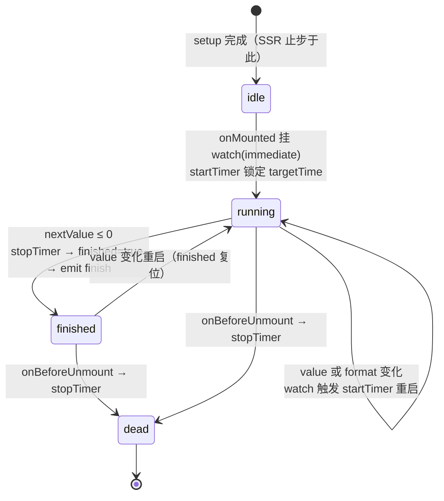
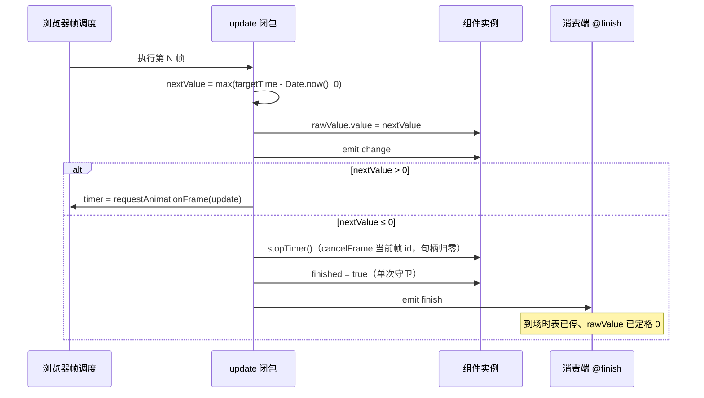
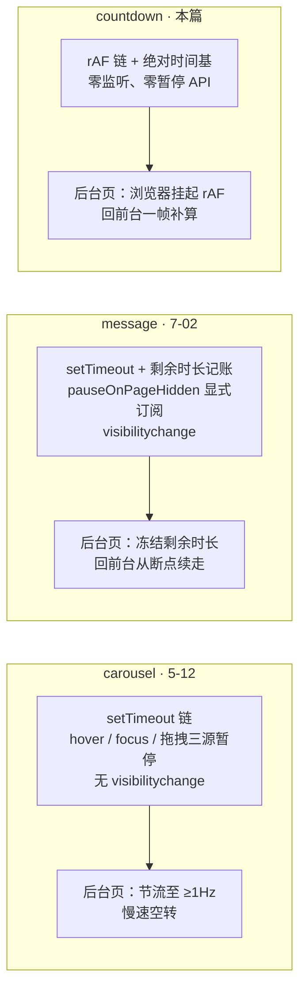

# 8-02 · Countdown：定时器治理

> 本篇是"组件深潜"卷数据展示组（8 卷）的第二篇。8-01 拆的是 Statistic 的格式化管道——一套"拿到数值、排出文字"的展示层协议；本篇拆 Countdown，表面上它是 Statistic 的第一个租户，实际上它回答的是另一个维度的问题：**时间从哪来、每帧算什么、什么时候停**。核心问题按大纲只有八个字——暂停/恢复与页面隐藏。但先亮底牌：读完全部 141 行源码你会发现，countdown 既没有 pause/resume API，也没有一行 visibilitychange 监听——它对这两个问题的回答方式，是让它们"不需要被回答"。这恰恰是本篇要展开的：定时器治理的第三条路线，与 5-12 carousel、7-02 message 的两条路线三方对照。

接到题目先复述一遍目标，防止写偏：countdown 是数据展示组里唯一"有状态"的展示组件（statistic 是纯函数式的渲染，countdown 自己驱动一个随时间前进的数值），它要管的事可以压成四件——**目标时间的三种入口怎么归一、剩余时间怎么算才不漂、计时器用什么机制驱动、终局（finish）之后怎么收场**。暂停/恢复与页面隐藏这两个"考据题眼"，本篇会给出实码定论而不是愿望清单：哪些是真的没有、为什么可以没有、真要加的时候正确姿势是什么。

先交代代码体量，给后面所有讨论一个标尺：`packages/components/countdown/src/countdown.vue` 全文 141 行，`countdown.ts` 18 行，`utils.ts` 45 行，`index.ts` 20 行——加起来 224 行，不到 carousel（1354 行）的六分之一。但定时器治理的三个关键决策（选型、时间基、隐藏策略）一个不缺，而且每个都和 carousel、message 做出了不一样的选择。组件小，账不薄。

## 一、外壳租赁协议：与 Statistic 的共享实码

先处理 8-01 的遗留问题：countdown 和 statistic 到底共享了什么？这个问题的实码定论分三层，一层比一层深。

**第一层：DOM 骨架与样式整包租赁。** 4-01 讲 manifest 时引过 `packages/components/component-manifest.json:527-534` 的 countdown 条目，其中 `styleImports` 是空数组——全库 72 个组件里只有 config-provider 和 countdown 是空的，而 countdown 的空数组含义在 `packages/theme/index.css:45` 里看得更直白：主题入口只有一行 `@import "./src/components/statistic.css";`，根本没有 countdown.css。countdown 自己的样式动作，是在 `packages/theme/src/components/statistic.css:73-75` 里追加了三行：

```css
.xy-countdown {
  --xy-statistic-number-letter-spacing: 0.02em;
}
```

倒计时数字需要等宽感更强的排列，只改了 statistic 的一个字距变量。这不是"countdown 复用 statistic 样式"那么客气——是 **countdown 根本没有自己的样式文件**，它在租 statistic 的整套 CSS 变量体系，租约上唯一的补充条款是三行字距覆盖。

**第二层：formatter 协议注入。** 8-01 讲过 statistic 的 `formatter` 逃生口：当数值展示不需要千分位、精度、小数分隔符这套默认管道时，调用方可以塞进一个自己的格式化函数。countdown 是这个逃生口在全库的**唯一跨组件消费者**（`rg "../../statistic" packages/components` 只命中 `countdown/src/countdown.vue:8` 一处）：

```ts
// packages/components/statistic/src/statistic.vue:45-48
const displayValue = computed(() => {
  if (props.formatter) {
    return props.formatter(props.value);
  }
```

statistic 的展示值 computed 第一步就问"有没有 formatter"，有就完全接管。countdown 侧的对接在模板里：

```vue
<!-- packages/components/countdown/src/countdown.vue:118-141 -->
<template>
  <XyStatistic
    class="xy-countdown"
    v-bind="attrs"
    :value="rawValue"
    :title="props.title"
    :prefix="props.prefix"
    :suffix="props.suffix"
    :value-style="props.valueStyle"
    :formatter="formatValue"
  >
    <template v-if="slots.title" #title>
      <slot name="title" />
    </template>

    <template v-if="slots.prefix" #prefix>
      <slot name="prefix" />
    </template>

    <template v-if="slots.suffix" #suffix>
      <slot name="suffix" />
    </template>
  </XyStatistic>
</template>
```

注意 `formatValue`（`countdown.vue:40-42`）的签名适配：statistic 的 `StatisticFormatter` 类型（`statistic.ts:4`）是 `(value: number | string) => string | number`，countdown 把它收窄成"数字走倒计时格式串、字符串原样透传"。这个适配层只有三行，但它保证了两件事：statistic 永远不知道 countdown 的存在（依赖方向是 countdown → statistic，单向），countdown 的格式化语义又完全自定义。

**第三层：props 与插槽的逐项转接。** 上面的模板里 `title / prefix / suffix / valueStyle` 四个 prop 是显式转发的，三个插槽是条件转发的（`v-if="slots.title"` 没传就不渲染对应容器）。为什么不全量 `v-bind="$props"`？因为 countdown 的 props 里有两个 statistic 没有的（`value` 的类型更宽、`format` 是自己的协议），转接必须手工逐项——这是"租赁外壳"的代价：每加一个共享 prop 都要改两处。目前的清单（`countdown.ts:9-16` 六个 props）是稳定面，代价可控。

转接的两端契约先看全貌（`countdown.vue:12-32`）：

```ts
const props = withDefaults(defineProps<CountdownProps>(), {
  value: 0,
  format: "HH:mm:ss",
  title: "",
  prefix: "",
  suffix: "",
  valueStyle: undefined
});

const emit = defineEmits<{
  (event: "change", value: number): void;
  (event: "finish"): void;
}>();

const slots = defineSlots<{
  title?: () => unknown;
  prefix?: () => unknown;
  suffix?: () => unknown;
}>();

const attrs = useAttrs();
```

六个 props、两个事件、三个插槽——注意事件清单里没有 progress 事件，countdown 对外只承诺 change（每帧的剩余毫秒）与 finish（终局一声）两个语义，一个"过程"一个"结果"，不多不少。

所以"格式化管道复用"的实码定论是：**复用的不是函数，是协议**。`formatCountdownTime` 是 countdown 的私有函数（statistic 不 import countdown），两边共享的是"formatter 接管展示"这条管道和整个 DOM/CSS 外壳。8-01 从展示端讲的管道，本篇从供给端接上——这是同卷两篇的分工。

还有一条暗线值得点出：`countdown.vue:2-5` 声明了 `inheritAttrs: false`，然后在模板里用 `v-bind="attrs"` 把外部属性转发给 XyStatistic。用户写在 `xy-countdown` 上的 `class="xy-countdown"`（或任意业务类名）会经 attrs 落到 statistic 的根元素上（statistic 的 `rootClasses` 在 `statistic.vue:43` 显式合并了 `attrs.class`）——正因为类名落在同一个根节点上，`statistic.css:73-75` 那三行 `.xy-countdown` 覆盖才能命中。样式租赁能成立，靠的是属性转发这条链路没断。

## 二、时间的入口：三种 value 与一个兜底

倒计时的第一问题是"从什么时刻开始倒数"。countdown 的回答写在 `countdown.ts:5`：`CountdownValue = number | Date | Dayjs`——但注意语义，这不是"剩余时长"而是"**截止时刻**"：number 按时间戳毫秒处理（文档 `apps/docs/components/countdown.md:55` 明说），Date 和 Dayjs 被 `valueOf()` 归一成 epoch 毫秒。归一函数在 `utils.ts:13-25`：

```ts
export function resolveCountdownValue(value: number | Date | Dayjs) {
  if (typeof value === "number") {
    return Number.isFinite(value) ? value : 0;
  }

  if (value instanceof Date) {
    const timestamp = value.getTime();
    return Number.isFinite(timestamp) ? timestamp : 0;
  }

  const timestamp = Number(value?.valueOf?.());
  return Number.isFinite(timestamp) ? timestamp : 0;
}
```

三分支一个兜底，结构简单，但有三个设计点值得停。

**其一，Date 分支是本库的加法。** EP 的同名组件里，`value` 的类型只有 `number | Dayjs`（element-plus 2.x 公开源码 `packages/components/countdown` 的 props 定义，本篇 EP 侧事实均以该源码为参照）——原生 Date 不在协议内。本库把它加进来，理由是消费端现实：`change-freeze.vue:13-14` 直接 `new Date(now + 18 * 60 * 1000)`，业务代码里的"截止时刻"最自然的载体就是 Date。三种入口不是拍脑袋并列，是"时间戳字面量、JS 原生时刻对象、dayjs 时刻对象"三种真实写法的收编。

**其二，`Number.isFinite` 兜底把非法值导向 0，而 0 的语义是"立即过期"。** 传 NaN、传无效 Date、传没有 `valueOf` 的对象，全部归到 0，随后（第六节会看到）`targetTime - Date.now()` 为负，被钳到 0，下一行就触发 finish。也就是说：**非法输入不会让组件崩溃或静默不动，而是走完一次完整的终局流程**。这个选择可以争论——另一种方案是 dev 模式告警+冻结——但"立刻过期"至少是自洽的：目标时刻非法，等价于"没有未来"。类型夹具 `tests/types/fixtures/countdown.ts:26-29` 用 `@ts-expect-error` 钉死了 `value: true` 必须被类型层拒绝，运行时兜底是类型防线之后的第二道闸。

**其三，dayjs 在这一层只借了类型。** 6-12 考据过：`rg "import dayjs" packages/components` 的运行时命中只有 date-picker 一处，`countdown/src/utils.ts:1` 的 `import type { Dayjs }` 是纯类型引用。这行 import 的考据价值在 6-12 里是"dayjs 边界"的注脚，在本篇要补上另一半——**countdown 敢不用 dayjs 运行时，是因为它根本不做日历算术**。date-picker 要算"3 月 31 日加一个月"、周一起止、闰年，离开 dayjs 必然失控；countdown 只做一件事：毫秒减法。`valueOf()` 一步把 dayjs 对象降维成数字，之后的时间轴上没有日历、没有时区、没有月份长短——这是"周算法规避"的极端版本：连算都不算，就没有算错。

## 三、格式串不只是模板：七档单位表与括号转义

格式化函数 `formatCountdownTime`（`utils.ts:27-45`）是 countdown 的核心算法段，也是全库与 EP 血缘最明显的函数——EP 的 `countdown/src/utils.ts` 里有一个几乎同构的实现：同一张七档单位表、同一个括号转义正则、同样的 padStart 策略。本库的版本：

```ts
const TIME_UNITS = [
  ["Y", 1000 * 60 * 60 * 24 * 365],
  ["M", 1000 * 60 * 60 * 24 * 30],
  ["D", 1000 * 60 * 60 * 24],
  ["H", 1000 * 60 * 60],
  ["m", 1000 * 60],
  ["s", 1000],
  ["S", 1]
] as const;

export function formatCountdownTime(timestamp: number, format: string) {
  let timeLeft = Math.max(0, Math.floor(timestamp));
  const escapeRegex = /\[([^\]]*)]/g;

  const replacedText = TIME_UNITS.reduce((current, [name, unit]) => {
    const replaceRegex = new RegExp(`${name}+(?![^\\[\\]]*\\])`, "g");

    if (!replaceRegex.test(current)) {
      return current;
    }

    const value = Math.floor(timeLeft / unit);
    timeLeft -= value * unit;

    return current.replace(replaceRegex, (match) => String(value).padStart(match.length, "0"));
  }, format);

  return replacedText.replace(escapeRegex, "$1");
}
```

（`utils.ts:3-45`。）

EP 的版本里这七档单位用 `MILLISECONDS_A_YEAR` 一类常量命名，常量值直接取自 dayjs 的常量表；本库改成 `1000 * 60 * 60 * 24 * 365` 的字面乘积——乘积本身自解释，还顺手把 dayjs 从运行时彻底请走（呼应上一节的"只借类型"）。这是移植中的本地化：**结构照搬，依赖切断**。

这段代码最值得写进笔记的是那条正则：`new RegExp(`${name}+(?![^\[\]]*\])`, "g")`。它干两件事：`+` 匹配连续占位符（`HH` 是一个整体，宽度为 2）；负向前瞻 `(?![^\[\]]*\])` 排除"后面跟着中括号包裹段"的占位符——也就是**中括号里的文字不参与替换**。测试 `countdown.spec.ts:55-74` 的两个用例把边界钉得很死：

```ts
it.each([
  ["DD [days] HH:mm:ss", "02 days 02:02:02"],
  ["HH:mm:ss:SSS", "50:02:02:002"]
])("支持格式串 %s", async (format, expected) => {
  const wrapper = mount(Countdown, {
    props: {
      value: dayjs()
        .add(2, "day")
        .add(2, "hour")
        .add(2, "minute")
        .add(2, "second")
        .add(2, "millisecond"),
      format
    }
  });

  await nextTick();

  expect(wrapper.get(".xy-statistic__value").text()).toBe(expected);
});
```

第一个用例验证转义（`[days]` 原样输出、`DD` 换成 `02`）；第二个用例藏着一个更深的机制——2 天 2 时 2 分 2 秒的毫秒数，用 `HH:mm:ss:SSS` 渲染出来是 `50:02:02:002` 而不是 `02:02:02:002`。原因在 reduce 的跳档逻辑：`if (!replaceRegex.test(current)) return current;`——**格式串里没出现的档位不做扣除**。`D` 不在格式串里，2 天的毫秒数就全部灌进下一档 `H`，2 天 = 48 小时 + 2 小时 = 50。所以格式串在这套实现里不只是显示模板，还是**时间切分协议**：你选择显示到哪一档，剩余时间就从哪一档开始切。用户写 `HH:mm:ss` 想展示"50 小时"这种总时长，正是这个语义（也是 EP 文档明说的行为，本库对齐）。

两个诚实的注脚。其一，Y 和 M 两档是商用近似：年按 365 天、月按 30 天（`utils.ts:4-5`），跨真实月长的倒计时用 `MM` 渲染会和日历天数漂移。本库没有修正它，理由和 dayjs duration 的老问题同源——**倒计时的语义是"剩余毫秒按固定单位切"，不是"日历时刻差"**；真要日历语义的，业务层自己用 dayjs 算差值，这又回到了第二节的边界：库不越界做日历算术。其二，`Math.floor(timestamp)`（`utils.ts:28`）意味着"还剩 999 毫秒"在 `HH:mm:ss` 下显示 `00:00:00`——展示层按"已确认走过的整段"向下取，而消费端做业务判断时都选向上取整：`format.vue:17-21` 的 `Math.ceil(value / 1000)` 算剩余整秒，`sla-board.vue:51-52` 的 `Math.ceil(remainingMs / 1000 / 60)` 算剩余整分钟。展示 floor、业务 ceil，一个"别虚报走过的时间"，一个"别低估剩余的风险"——两条语义线在同一毫秒上分岔，读码时值得留意。

## 四、选型：rAF 链、setTimeout 链与 setInterval（权衡之一）

现在进入本篇第一个大权衡：驱动 update 的计时器选什么。countdown 的实码是一段自封装的 rAF（`countdown.vue:34-59`）：

```ts
const rawValue = ref(0);
const displayValue = computed(() => formatCountdownTime(rawValue.value, props.format));

let timer: number | undefined;
let finished = false;

function formatValue(value: number | string) {
  return typeof value === "number" ? formatCountdownTime(value, props.format) : String(value);
}

function requestFrame(callback: FrameRequestCallback) {
  if (typeof window !== "undefined" && typeof window.requestAnimationFrame === "function") {
    return window.requestAnimationFrame(callback);
  }

  return window.setTimeout(() => callback(Date.now()), 16);
}

function cancelFrame(id: number) {
  if (typeof window !== "undefined" && typeof window.cancelAnimationFrame === "function") {
    window.cancelAnimationFrame(id);
    return;
  }

  window.clearTimeout(id);
}
```

先看两个变量声明：`timer` 和 `finished` 都是普通 `let`，不是 `ref`。这是 5-12 讲过的全库惯例在本库第二处典型落点——定时器句柄和终局标志都不参与任何渲染依赖，包成 ref 只会白白触发依赖收集。真正被渲染层观察的是它们的**结果**：`rawValue`（唯一可变状态）和 `displayValue`（纯派生）。

`requestFrame / cancelFrame` 的存在性检测值得读两遍：有 `requestAnimationFrame` 就用，没有就降级为 `setTimeout(callback, 16)`——16ms 是 60Hz 一帧的近似值。这个降级在 SSR 与旧环境两头站岗：服务端整个 `startTimer` 都不会被调（第七节讲为什么），浏览器端极端老环境则退化成秒轮询语义。注意 fallback 里 `callback(Date.now())` 传了个时间戳参数以求形似 rAF，但 `update()` 根本不消费这个参数——它有更硬的时间基（下一节），形似参数只是让降级路径和正路签名一致。

候选方案有三条路，本库的取舍可以放在三方坐标系里看：

| 方案 | 节拍来源 | 回调堆积 | 与渲染的关系 | 本库使用者 |
| --- | --- | --- | --- | --- |
| `setInterval` | 固定周期 | 有（回调执行慢于周期时排队） | 无 | （无） |
| `setTimeout` 自调度链 | 每跳重估 | 无 | 无 | message（自动关闭）、carousel（自动播放） |
| `requestAnimationFrame` 链 | 屏幕刷新 | 无 | **渲染本身** | countdown |

message 和 carousel 选 setTimeout 链的理由在各自篇章讲过：message 的关闭要"剩余时长记账"（暂停恢复续走，见第九节），carousel 的每跳等待时长可能不同（per-item duration，5-12 的 5.1 节）。countdown 为什么不同？因为它的展示频率天然等于渲染频率——`SSS` 格式要求毫秒级刷新，`HH:mm:ss` 只需要秒级，而格式串是 prop，组件在编译期不知道最坏情况，**静态选型只能按上界（每帧一次）设计**。rAF 的节拍就是屏幕刷新率，"每帧算一次、显示一次、通知一次"，三者对齐，不存在"算了很多次只显示一次"的浪费，也不存在"显示要刷新但计时器还没醒"的迟滞。

代价也真实存在：`HH:mm:ss` 这种秒级格式，rAF 依然每帧跑一遍 update、emit 一次 change——文档在 `countdown.md:57` 明确把节流责任推给消费端："change 会在每一帧同步剩余毫秒数；如果业务只关心整秒变化，建议在接收端自行节流"。这是"组件不节流"的分层决策：节流策略因业务而异（整秒？半秒？分钟？），组件层加一个 `precision` prop 就要预设一种语义，不如让 change 保持"帧级真相"，消费端自行降采样。第八节的三方对照里，这条还会再出现。

EP 对照的第三笔也落在这里：EP 的 rAF/cAF 走 `@element-plus/utils` 的跨浏览器封装，本库选择内联 14 行降级——封装层次不同，语义相同（rAF 存在性检测 + 定时器兜底）。EP 和本库在这道选择题上给出了同一个答案：**倒计时用 rAF 链，不用 setInterval**。

## 五、时间基：一行核心与漂移账本（权衡之二）

countdown 全组件的心脏只有一行（`countdown.vue:75`）：

```ts
const nextValue = Math.max(targetTime - Date.now(), 0);
```

它在 `startTimer` 的 `update` 闭包里执行（`countdown.vue:68-95` 全貌）：

```ts
function startTimer() {
  stopTimer();
  finished = false;

  const targetTime = resolveCountdownValue(props.value);

  const update = () => {
    const nextValue = Math.max(targetTime - Date.now(), 0);

    rawValue.value = nextValue;
    emit("change", nextValue);

    if (nextValue <= 0) {
      stopTimer();

      if (!finished) {
        finished = true;
        emit("finish");
      }

      return;
    }

    timer = requestFrame(update);
  };

  update();
}
```

读这一行要回答的问题是：剩余时间为什么用"截止时刻减当前时刻"，而不是"上次剩余减上次间隔"的递减法？

**递减法（relative decrement）** 是最容易写出的版本：挂载时记 `remaining = value`，每个 tick `remaining -= elapsed`。它有三笔漂移账：定时器回调的触发时刻本身有抖动（浏览器对 setTimeout/rAF 都只保证"不早于"，不保证"准时"），elapsed 的测量误差会**累积**；页面隐藏导致帧停止期间，递减法要么漏减（回来后倒计时慢了），要么需要一次性补减一大段（补多少？）；任何一帧的误差都永远留在账上。**绝对时间基（absolute deadline）** 则每帧都用 `目标时刻 - Date.now()` 现算——上一帧算错了？这一帧自动修正。误差不累积，因为根本没有"账本"，每一帧都是对物理事实的重新测量。

**为什么是 `Date.now()` 而不是 `performance.now()`？** 这是时间基权衡里最容易被含糊带过的一步，值得掰开。`performance.now()` 单调、不受系统校时影响，看起来更"专业"；但 countdown 的 `value` 语义是"距离墙上时钟的某个截止时刻"——`dayjs().add(2, "hour")`、`new Date(...)` 产出的都是 epoch 毫秒，是**挂在世界时间轴上的点**。两个输入如果是世界时间轴上的点，参照系就必须也是世界时间轴。用 `performance.now()` 意味着要么把 epoch 转成 performance 域（挂载时做一次换算，之后单调递减），要么承认语义已经变了。前者的代价是：设备休眠/锁屏期间，部分平台的 monotonic 时钟不推进（Chrome 在某些平台上 `performance.now()` 在睡眠期间不走），醒来后"deadline 早就过了"这个物理事实会被算成"还剩很久"——**deadline 语义下这是错的**。`Date.now()` 在休眠醒来后直接跳到正确的墙上时刻，下一帧 `targetTime - Date.now()` 自动变负、钳零、finish。用户手动改系统时钟（或 NTP 大步校时）确实会让数值跳变——但"跳变后立即显示正确剩余"恰好是截止时刻语义想要的自我修正。**选时间基不是选"更精确的钟"，是选"和 value 同一条时间轴的钟"。**

`Math.max(..., 0)` 的钳制补上最后一角：错过 deadline 后显示恒为 `00:00:00` 而不是负数，展示层的 `Math.floor`（上一节）也只在非负域工作。还有个默认值带来的隐藏语义：`withDefaults` 里 `value: 0`（`countdown.vue:13`），意味着裸写 `<xy-countdown />` 会立即走一遍 startTimer → nextValue = 0 → finish。"没有给出未来，等价于未来已经过去"——与第二节的非法值兜底殊途同归。

## 六、状态机：四态一标志

把前面的散点收进一张状态机图（本篇第一张 mermaid）：



四个状态（idle / running / finished / dead）只靠一个布尔（finished）和一个定时器句柄（timer）承载，外加一个可变 ref（rawValue）。状态机图里有两处需要文字展开的细节。

**第一处：watch 为什么注册在 `onMounted` 里（`countdown.vue:97-107`）？**

```ts
onMounted(() => {
  watch(
    () => [props.value, props.format] as const,
    () => {
      startTimer();
    },
    {
      immediate: true
    }
  );
});

onBeforeUnmount(() => {
  stopTimer();
});

defineExpose({
  displayValue
});
```

三个理由叠在一起。其一是 **emit 卫生**：`immediate: true` 让 watch 回调同步执行，而 `startTimer` 的第一次 `update()` 会立刻 emit change——同步 emit 如果发生在 setup 期间，监听器还没随渲染树装配完毕，语义含混；挪进 onMounted，第一次 change 一定发生在组件挂载之后。其二是 **SSR 安全**：onMounted 在服务端不执行，watch 不注册、startTimer 不跑、rAF 不被引用——服务端渲染出来的永远是 `rawValue = 0` 的 `00:00:00` 占位，水合后由客户端第一次 update 修正。这不是最理想的 SSR 表现（理想是服务端就算好初始剩余），但它是**零成本**的服务端安全：不用任何 `typeof window` 判断，生命周期本身当闸门。文档示例清一色的 `v-if="target"`（`basic.vue:16`、`format.vue:15` 等）在消费端补了另一半——目标时刻在 onMounted 才生成，水合前后不至于闪一帧错值。其三是 **清理免费**：在 setup/mounted 作用域里创建的 watch 随组件卸载自动销毁，不需要手动 stop——countdown 只需要手动清一样东西：定时器（`onBeforeUnmount` 里的 `stopTimer`，`countdown.vue:109-111`）。

**第二处：重启语义的宽度。** watch 的源是 `[props.value, props.format]` 数组，意味着 **format 变化也会整个重启计时器**。format 变化本不需要重启——`displayValue` 是 computed，`rawValue` 不变、format 变，展示自动重算。把它并进 watch 的实际效果是：改个格式串，`finished` 被复位、timer 重启、change 重发。这算不算缺陷，第八节有一个具体的边界案例（finish 之后再改 format 会再发一次 finish）——先记在这里，那是"用一张表驱动两个关注点"的代价。

另外注意 `countdown.vue:113-115` 的 expose 清单：**只有 `displayValue`**。这个清单的"短"是第九节的主角，先按住不表。

## 七、finish 的清理时序：先停表，再喊人

finish 分支的五行代码（`countdown.vue:80-89`）藏着全组件最讲究的时序决策，用一张时序图铺开（本篇第二张 mermaid）：



三个动作的顺序是刻意排的：**rawValue 先定格 → change 先发 → stopTimer → finished 置位 → finish 最后发**。到消费端的 finish 处理器执行时，它看到的是一个完全自洽的终态：定时器句柄已清空（`stopTimer` 幂等，`timer` 归 `undefined`）、`rawValue` 是 0、展示文本已是 `00:00:00`。消费端在 finish 里读 expose、读展示值，都不会撞到"半收场"状态。

细究起来，finish 分支里的 `stopTimer()` 在这一帧其实是**防御性空转**：`timer = requestFrame(update)` 的赋值只在续命分支（`countdown.vue:91`）发生，当前帧自身执行时并没有"下一帧"可取消——cancel 一个已经执行完的 rAF id 是无害 no-op。那这行为什么要写？两个理由：一是句柄卫生，保证 finish 之后的终态里 `timer === undefined`，任何后续路径（unmount、重启）都不会面对悬空句柄；二是对称性，`stopTimer` 是全组件唯一的"停表"入口（卸载、重启、终局三处共用），入口统一裁决——这正是 5-12 总结 carousel 定时器治理时的第一原则"点火权收敛"的镜像：**熄火权也要收敛**。

`finished` 标志的单次守卫，测试写得比源码更说明问题（`countdown.spec.ts:92-111`）：

```ts
it("finish 只会触发一次", async () => {
  const onFinish = vi.fn();
  const wrapper = mount(Countdown, {
    props: {
      value: Date.now() + 20,
      onFinish
    }
  });

  await nextTick();

  vi.advanceTimersByTime(100);

  expect(onFinish).toHaveBeenCalledTimes(1);

  vi.advanceTimersByTime(100);

  expect(onFinish).toHaveBeenCalledTimes(1);
  expect(wrapper.get(".xy-statistic__value").text()).toBe("00:00:00");
});
```

推进 200 毫秒、断言两次仍是 1 次，外加终态文案定格 `00:00:00`。注意测试对"重启"链路的覆盖（`countdown.spec.ts:113-131`）：value 和 format 同时变，断言展示刷新为新格式——但这个用例没覆盖"finish 之后改 format"的组合，那正是源码里唯一能二次触发 finish 的缝隙：finished 后改 format → watch 触发 startTimer → `finished = false` 复位 → update 同步执行 → nextValue 仍为 0 → 再走一遍 stopTimer + finish。**格式变化在语义上不该重置终局**，但数组的 watch 分不清"哪个成员变了"。这是一个真实的已知边界（本篇核对附录会记录）：影响面有限（value 早已过期时才会显现），但"用同一张表驱动两个关注点"的代价在这里现形——第八节的重启语义宽度，报账就在这。

消费端对"重启"还有一个框架级兜底值得点名：`change-freeze.vue:97-104` 的发布冻结窗口在"即将冻结 → 冻结中"两个阶段间切换同一个 countdown：

```vue
<xy-countdown
  v-if="currentTarget"
  :key="stage"
  class="countdown-freeze-panel__countdown"
  :value="currentTarget"
  :title="currentTitle"
  format="HH:mm:ss"
  @finish="handleFinish"
>
```

（`change-freeze.vue:97-105`；`handleFinish` 在 `change-freeze.vue:70-79`，pending → frozen → recovered 三段推进。）

`:key="stage"` 是关键一笔：组件没有任何 restart API，而 finish 之后的"再次起跑"依赖 value 变化触发 watch——如果两个阶段的目标时刻恰好相同（引用不变、值不变），watch 不会动，终局就卡死了。key 重挂是 Vue 生态对"彻底重来"的标准答案：整个实例重建，finished、timer、rawValue 全部归零。**库提供 watch 重启，框架提供 key 重启，两层兜底互补**——这也是"没有 pause/resume API"的组件在消费端长出来的惯用法。

## 八、暂停/恢复：一个不存在的 API 与它的正确姿势

现在正面回答考据题眼。任务清单里写着"暂停/恢复 API（pause/resume 或 expose 方法）"——实码定论先给出，再给推演。

**实码定论：没有。** `defineExpose` 只有 `displayValue`（`countdown.vue:113-115`），`rg -i "pause|resume|visibility" packages/components/countdown/` 零命中。文档 API 表（`countdown.md:88-92`）的 Exposes 一栏也只有一行。这不是遗漏，是可以从语义推出来的选择：countdown 的 `value` 是**截止时刻**，不是"余额"。审批面板 `approval-deadline.vue:36` 的 `@finish="timedOut = true"` 表达的业务事实是"审批窗口物理上关闭了"——这个事实不因用户切走标签页而悬置。给 deadline 型倒计时加 pause，等于提供"让审批窗口暂停关闭"的按钮，语义上是越权的。

但"可以没有"不等于"永远不需要"。真要给 countdown 加 pause/resume，正确姿势 message 已经写好了（`packages/components/message/src/message.vue:236-260`）。先看它的布防起点 `scheduleAutoClose`（`message.vue:208-234`）——暂停记账的两个变量在这一步落定：

```ts
function scheduleAutoClose(delay = props.duration) {
  clearTimer();

  if (
    !visible.value ||
    props.duration <= 0 ||
    typeof window === "undefined" ||
    pauseReasons.size > 0
  ) {
    return;
  }

  const nextDelay = Math.max(0, delay);

  if (nextDelay === 0) {
    close("auto");
    return;
  }

  autoCloseRemaining = nextDelay;
  autoCloseStartAt = Date.now();
  timer = window.setTimeout(() => {
    autoCloseRemaining = 0;
    autoCloseStartAt = 0;
    close("auto");
  }, nextDelay);
}
```

注意 `autoCloseStartAt = Date.now()`——message 的记账时间基也是墙上时钟，和 countdown 第五节的选型同源；差别只在 message 用它算"已流逝"，countdown 用它算"还剩余"。有了这两个变量，pause/resume 的折算才能闭环（`message.vue:236-260`）：

```ts
function pauseAutoClose(reason: "hover" | "focus" | "page-hidden") {
  if (props.duration <= 0 || !visible.value || pauseReasons.has(reason)) {
    return;
  }

  pauseReasons.add(reason);

  if (timer !== null && autoCloseStartAt !== 0) {
    const elapsed = Date.now() - autoCloseStartAt;
    autoCloseRemaining = Math.max(autoCloseRemaining - elapsed, 0);
    clearTimer();
  }
}

function resumeAutoClose(reason: "hover" | "focus" | "page-hidden") {
  if (!pauseReasons.delete(reason)) {
    return;
  }

  if (pauseReasons.size > 0 || !visible.value || props.duration <= 0) {
    return;
  }

  scheduleAutoClose(autoCloseRemaining > 0 ? autoCloseRemaining : props.duration);
}
```

message 的模型是"**暂停时把绝对时刻折算回剩余量，恢复时用剩余量重新起算**"：pause 时 `autoCloseRemaining -= (Date.now() - autoCloseStartAt)` 记账，resume 时 `scheduleAutoClose(remaining)` 续走；多暂停源用 `pauseReasons` Set 收敛（hover、focus、page-hidden 三种 reason 叠加，最后一个恢复才真正续走）。map 到 countdown：pause 时 `pausedRemaining = targetTime - Date.now()`，resume 时 `targetTime = Date.now() + pausedRemaining`。难点不在记账，在**与 watch 的相互作用**：resume 内部改 `targetTime`，如果 `targetTime` 是响应式的，会被自己的 watch 捕获触发一次多余的 startTimer——实现上需要一个"内部赋值绕过 watch"的通道（内部 ref 与 props 解耦，或令牌门控）。回看全库三个定时器样本（5-12 carousel、7-02 message、本篇 countdown），message 是唯一把"暂停后恢复"做全的，它的 `autoCloseStartAt / autoCloseRemaining` 双变量记账（`message.vue:227-228`）就是 countdown 若要补 API 时该抄的作业。

还有一条更轻的外置路线：什么 API 都不加，用受控模式模拟暂停——消费端在 pause 时把当前 `change` 的 `remainingMs` 捕获下来，把 `value` 换算成 `Date.now() + remainingMs` 冻结住；resume 时重新起算。组件协议零改动，暂停逻辑完全外置。知识矩阵给 8-02 的定语"无 paused prop 的外置协议"指的就是这条路：**countdown 的暂停是外置协议，不是内置开关**——当前实码连这条协议都没有正式封装，它是"组件的 select 语义天然支持、留白给消费端"的形态。

（本节前半是实码，后半是推演——哪些是 `countdown.vue` 里能指到行号的、哪些是以 message 实码为参照的设计推演，边界已在文中标明。）

## 九、页面隐藏：三种定时器治理样本对照（权衡之三）

第二个题眼：页面隐藏时怎么办。本库三个有定时器的组件给出了三种答案，三方对照是本篇的题眼图（本篇第三张 mermaid）：



**carousel：什么都不做。** 5-12 如实记录过：`carousel.vue` 全文没有 visibilitychange 监听，暂停面是 hover/focus/拖拽三源，后台页的 autoplay 靠浏览器把后台 setTimeout 节流到 ≥1Hz 才没有全速空转——"节流救场，不是设计"。缺口在 5-12 里被点名过，属于已知的 TODO 位置。它的暂停源长这样（`carousel.vue:894-906`）：

```ts
function handleMouseEnter() {
  hover.value = true;
  if (props.pauseOnHover) {
    pauseTimer();
  }
}

function handleMouseLeave() {
  hover.value = false;
  if (!dragging.value) {
    startTimer();
  }
}
```

注意 hover 暂停走的也是"停表即丢账"（5-12 引过的 `pauseTimer` 只清句柄不记账），所以 carousel 的暂停是**体验型**——鼠标回来了从零重新等一跳，剩余多少毫秒无关紧要；这与 message 的记账式暂停（回来从断点续走）是两种不同的暂停质量。

**message：显式订阅。** `pauseOnPageHidden` 为真的实例才挂 visibilitychange（`message.vue:369`），hidden 时 `pauseAutoClose("page-hidden")`（`message.vue:315`）、可见时 `resumeAutoClose("page-hidden")`（`message.vue:319`），prop 还支持动态挂卸（`message.vue:422-437`）。理由在 4-11/7-02 讲过：toast 的自动关闭时长是"用户注意力时长"——用户离开 30 秒，回来不该发现消息已经消失，暂停计时时长等于把"离开的时间"从寿命里剔除。**存活型暂停**。

**countdown：零监听，但不是"什么都不做"。** 区别在两件事的叠加：

其一，**rAF 在隐藏页里根本不跑**。HTML 规范里 rAF 回调绑定在"渲染更新"步骤上，隐藏的文档不发生渲染，帧回调整体挂起——这不是节流（setTimeout 在后台至少还以 1Hz 触发），是完全静止。于是 countdown 在后台的行为是：update 不执行、rawValue 不动、change 不发、CPU 不烧。**"选对计时器，浏览器替你治理"**——第九节选型权衡在这里兑现了第二笔红利：rAF 链的"隐藏页静止"是平台行为送的，setTimeout 链要靠显式监听才能买到同款。

其二，**绝对时间基让"静止"不产生漂移**。假设用户切走时还剩 60 秒，切回 5 分钟后：deadline 早已过去（墙上时钟的事实），回前台的第一帧 rAF 执行 update，`targetTime - Date.now()` 为大负数，钳零，**finish 在这一帧补发**。数值不慢、不快、不跳，一步到位。如果 countdown 用的是递减法，这段隐藏期就是漂移重灾区：要么漏减 5 分钟，要么需要监听 visibilitychange 自己补账——而"补账"这个动作，绝对时间基每帧免费奉送。

一个必须诚实标出的语义后果：**后台过期的 finish 是"延迟播报"**。审批面板 `approval-deadline.vue:29-47` 的实际行为是——审批在后台第 3 分钟就物理过期了，但 `timedOut` 状态要等用户回到标签页、第一帧跑完才翻转：

```vue
<div v-if="!timedOut" class="countdown-approval-panel__body">
  <div class="countdown-approval-panel__summary">
    <xy-countdown
      v-if="deadline"
      class="countdown-approval-panel__countdown"
      :value="deadline"
      format="HH:mm:ss"
      @finish="timedOut = true"
    >
      <template #title>
        <div class="countdown-approval-panel__title">
          距离自动退回
          <span>审批单 AP-20260326-018</span>
        </div>
      </template>
      <template #suffix>
        <span class="countdown-approval-panel__suffix">退回</span>
      </template>
    </xy-countdown>
```

（`approval-deadline.vue:29-47`；7-10 引过它的 finish → Result 组合承接，`approval-deadline.vue:66-78` 的 `status="warning"` 结果态就是这条链的终点。）

这个延迟是缺陷还是特性？对"给人看的状态机"，后台没人看，回前台那一刻翻转反而是对的；但如果业务需要的是"后台也必须准时发生的副作用"（真发请求、真退回单据），倒计时组件本来就不该是触发器——**那是服务端定时任务或 worker 的职责**。countdown 的定位是"展示deadline 的组件"，不是"执行 deadline 的引擎"，职责边界在它的 expose 清单（只有 displayValue）里其实早就写明了。三条路线的定性由此收束：carousel 的暂停是**体验型**（别打扰正在看的人），message 的暂停是**存活型**（别在没人看的时候死掉），countdown 的不暂停是**语义型**（deadline 是物理事实，隐藏只延迟播报、不改变事实）。

## 十、测试：fake timers 如何按住一帧

countdown 的测试（`__tests__/countdown.spec.ts`，162 行、9 个用例，本库实跑全绿）是全库 fake timers 用的最深的一个样本，因为要按住的不只是 setTimeout，还有 rAF。

全局铺底是双件套（`countdown.spec.ts:7-15`）：

```ts
describe("XyCountdown", () => {
  beforeEach(() => {
    vi.useFakeTimers();
    vi.setSystemTime(new Date("2026-03-26T00:00:00.000Z"));
  });

  afterEach(() => {
    vi.useRealTimers();
  });
```

`useFakeTimers` 伪造计时器，`setSystemTime` 把 `Date.now()` 钉死在 2026-03-26 零点——**这一步对本组件比对别的组件都关键**，因为 countdown 的时间基就是 `Date.now()`：时间基本身可控，`targetTime - Date.now()` 的每一项才是确定值。fake Date 和 rAF 链同炉共治，测试里"推进 100ms"同时推动墙上时钟和帧调度。

一个值得考据的底层事实：仓库的 `vitest.config.ts:10-20` **没有配置任何 `fakeTimers` 项**，全靠 vitest 4 的默认值。而 vitest 4 的默认 toFake 是"伪造 @sinonjs/fake-timers 已知的全部计时器，仅排除 nextTick 与 queueMicrotask"（`node_modules/vitest/dist/chunks/test.CTcmp4Su.js:3628` 的默认构造：`Object.keys(this._fakeTimers.timers).filter(...)`）——**requestAnimationFrame 在默认伪造清单里**。这就是"finish 只会触发一次"用例能绿的原因：`vi.advanceTimersByTime(100)` 推得动 rAF 队列。如果哪天有人把 toFake 收窄成"只伪造 setTimeout 一族"，countdown 的 rAF 链会当场失控、测试集体转红——fake timers 的覆盖面是这些测试的隐式依赖，值得在配置旁边写一行注释的位置。

九个用例的分组也值得走一遍，因为它们合起来恰好覆盖状态机的每条迁移边。渲染三态用三种 value 入口各挂一个实例（`countdown.spec.ts:31-53`）：

```ts
it("支持 number Date dayjs 三种 value 输入", async () => {
  const numberWrapper = mount(Countdown, {
    props: {
      value: Date.now() + 1000 * 60
    }
  });
  const dateWrapper = mount(Countdown, {
    props: {
      value: new Date(Date.now() + 1000 * 60 * 60)
    }
  });
  const dayjsWrapper = mount(Countdown, {
    props: {
      value: dayjs().add(2, "hour")
    }
  });

  await nextTick();

  expect(numberWrapper.get(".xy-statistic__value").text()).toBe("00:01:00");
  expect(dateWrapper.get(".xy-statistic__value").text()).toBe("01:00:00");
  expect(dayjsWrapper.get(".xy-statistic__value").text()).toBe("02:00:00");
});
```

change 语义用例（`L76-90`）断言"最后一次调用的参数是正数"——不是断言调用次数，因为帧数不确定，**只断言参数性质**是时间驱动组件测试的正确姿势：

```ts
it("会触发 change 事件", async () => {
  const onChange = vi.fn();
  const wrapper = mount(Countdown, {
    props: {
      value: Date.now() + 1000 * 60,
      onChange
    }
  });

  await nextTick();
  expect(onChange).toHaveBeenCalled();
  expect(typeof onChange.mock.calls.at(-1)?.[0]).toBe("number");
  expect(onChange.mock.calls.at(-1)?.[0]).toBeGreaterThan(0);
  wrapper.unmount();
});
```

重启链路（`L113-131`）让 value 与 format 同时变化，断言展示刷新为新格式——value 换成 dayjs 对象、格式串换成 `HH [hours]`，旧定时器被 stopTimer 掐掉、新 targetTime 落位，一次变更两条断言全验。expose 用例（`L151-161`）则只验一件事：

```ts
it("暴露 displayValue", async () => {
  const wrapper = mount(Countdown, {
    props: {
      value: Date.now() + 1000 * 60
    }
  });

  await nextTick();

  expect((wrapper.vm as { displayValue: string }).displayValue).toBe("00:01:00");
});
```

"暴露 displayValue"这个用例名本身就是 expose 清单的镜像：清单只有一项，测试也只有一项——API 面与测试面严格等宽。其中卸载用例的写法是个范本：

```ts
it("卸载后会停止继续触发 change", async () => {
  const onChange = vi.fn();
  const wrapper = mount(Countdown, {
    props: {
      value: Date.now() + 1000 * 60,
      onChange
    }
  });

  await nextTick();
  wrapper.unmount();
  const callCount = onChange.mock.calls.length;

  vi.advanceTimersByTime(100);

  expect(onChange.mock.calls.length).toBe(callCount);
});
```

（`countdown.spec.ts:133-149`。）"停止"是个否定性命题——无法枚举"不再发生什么"，测试的写法是快照卸载时刻的调用数，推进时间，断言计数不变。这个模式 message/carousel 的卸载测试同款，全库定时器组件的"死状验收"都长这样。

最后记一笔测试盲区，免得读者高估这套用例的覆盖面：fake timers 的世界是**确定性调度**，真实浏览器里"后台页 rAF 挂起、setTimeout 节流 ≥1Hz、锁屏期间时钟跳跃"这些平台行为在 jsdom + fake timers 里一概不可见。所以第九节讲的隐藏页行为，**没有测试覆盖，也无法在单测里覆盖**——它是平台契约，不是代码路径。文档与专栏（本篇）承担它的"规格说明"，实码与测试都验证不了它。这是诚实边界，不是缺陷申报。

## 十一、消费端全景与总账

文档示例目录 `apps/docs/examples/countdown/` 有七个场景，可以按消费深度分三层：**单体层** basic（`49 行`，v-if 延迟起跑 + finish 翻转文案）与 format（`58 行`，双卡对照 DD 档与 SSS 档，change 消费端 Math.ceil 降采样）；**列表层** payment-window（`162 行`）、sla-board（`161 行`）、campaign-waves（`182 行`）——三行到三行不等的列表里每个条目一条独立倒计时链；**状态机层** change-freeze 与 approval-deadline（第七、九节已展开）。组件自身留下的使用约定，全在文档的四条提示里（`apps/docs/components/countdown.md:53-58`）：

```markdown
## 使用提示

- `value` 支持 `number`、`Date` 和 `dayjs()`；`number` 按时间戳毫秒处理。
- `format` 支持 `Y / M / D / H / m / s / S` 和中括号转义，例如 `DD [days] HH:mm:ss`。
- `change` 会在每一帧同步剩余毫秒数；如果业务只关心整秒变化，建议在接收端自行节流。
- 组件样式完全复用 `xy-statistic` 的 CSS 变量，只额外增加了根类名 `xy-countdown`。
```

四条提示分别对应第二节（入口）、第三节（切分协议）、第四节（帧级 change）与第一节（样式租赁）——文档没有一句与实码对不上。列表层埋着一笔资源账值得算给架构决策者：每个 xy-countdown 实例一条 rAF 链，每帧一次 update + 一次 change emit——三个实例是六十分之一秒的常规开销，一百行订单列表挂一百条 rAF 链、每帧一百次 emit，就不是"可忽略"了。docs 的使用提示（`countdown.md:57`）把节流责任交给接收端，在列表场景这条提示从"建议"升级为"必做"：要么消费端降采样，要么列表行可见性驱动挂载（滚动出视口就 v-if 掉）——库没有替你做，也没有拦着你做。

全篇权衡总账，三条主线各归一句：

1. **选型（rAF 链 vs setTimeout 链 vs setInterval）**：展示频率 = 渲染频率的组件选 rAF；语义是"每跳等多久可能不同"的选 setTimeout 链；两者都要回避 setInterval 的堆积模型。countdown 与 EP 同选 rAF，message/carousel 同选 setTimeout——同一个库内三种选型各得其所，**选型跟着语义走，不跟"高级感"走**。
2. **时间基（绝对 deadline vs 相对递减，Date.now vs performance.now）**：value 是世界时间轴上的点，参照系必须同轴；`Date.now()` 的"不精确"（校时跳变）换来的是永不累积的误差与休眠唤醒后的自动修正。一行 `Math.max(targetTime - Date.now(), 0)` 抵得过一整套补账机制。
3. **页面隐藏（零监听 vs 显式订阅 vs 不作为）**：rAF 挂起 + 绝对时间基让 countdown 获得了"免费的治理"——回前台一帧补算、后台零消耗、finish 延迟但保序。carousel 的不作为是缺口（5-12 已记录），countdown 的不作为是设计——区别不在写了多少代码，在时间基选对了没有。

已知的边界清单，收在这里供后续迭代对照：finish 后改 format 会二次触发 finish（第七节，watch 数组源的副产品）；Y/M 档是 365/30 天商用近似（第三节）；无 pause/resume API，暂停语义只能外置协议（第八节，且当前无封装）；SSR 首屏固定渲染 00:00:00（第六节，生命周期当闸门的代价）；后台过期 finish 延迟播报（第九节，语义型不暂停的直接后果）。五个边界都有实码行号，没有一个是"藏着掖着"的。

EP 对照收束成一句：本库 countdown 与 EP 的 el-countdown 是**同一家族的两次施工**——同一张七档单位表、同一个括号转义正则、同样的 rAF + Date.now 内核、同样的无暂停 API；本库的增量在 Date 入口、isFinite 兜底、statistic 外壳的 formatter 注入与样式租赁三处，减量在手写乘积常量与内联降级。读懂这一篇，等于同时读懂了两家的 countdown。

---

下一篇预告：**8-03《Progress：SVG 描边》**。countdown 的时间是"看不见的表"——数值在变，形态不动；progress 的进度是"看得见的线"——数值变成一段 SVG 圆弧或一条横线，几何本身成为数据的一部分。line 与 circle 双形态的坐标系怎么各自建立，`stroke-dasharray / stroke-dashoffset` 如何把百分比换算成描边长度，双形态共享一套 props 时几何分岔收在哪里——8-01 的格式化管道、本篇的时间引擎，到 8-03 换成几何引擎，数据展示卷的三件套就此合拢。

---

*本篇代码引用核对于当前工作区实态：`packages/components/countdown/src/countdown.vue`（141 行；L2-5 / L7-10 / L12-19 / L21-24 / L26-30 / L34-59 / L40-42 / L44-50 / L52-59 / L61-66 / L68-95 / L72 / L75 / L80-89 / L91 / L94 / L97-107 / L109-111 / L113-115 / L118-141）、`src/countdown.ts`（18 行；L5 / L9-16）、`src/utils.ts`（45 行；L1 / L3-11 / L13-25 / L27-45 / L28 / L29 / L32 / L44）、`index.ts`（20 行）、`__tests__/countdown.spec.ts`（162 行；L7-15 / L17-29 / L31-53 / L55-74 / L76-90 / L92-111 / L113-131 / L133-149 / L151-161，实跑 9 用例全绿）、`packages/components/statistic/src/statistic.vue`（107 行；L32-37 / L43 / L45-48 / L82）、`src/statistic.ts`（L4）、`packages/theme/src/components/statistic.css`（75 行；L61-71 / L73-75）、`packages/theme/index.css:45`、`packages/components/component-manifest.json:527-534`、`tests/types/fixtures/countdown.ts`（31 行；L26-29）、`packages/components/message/src/message.vue`（504 行；L72 / L208-234 / L227-228 / L236-260 / L309-320 / L315 / L319 / L369 / L422-437）、`packages/components/carousel/src/carousel.vue`（1354 行；L660-693 / L894-906）、`vitest.config.ts:10-20`（无 fakeTimers 配置）、vitest 4.1.0 默认 toFake 考据（node_modules/vitest/dist/chunks/test.CTcmp4Su.js:3628，rAF 在默认伪造清单内）、`apps/docs/components/countdown.md`（92 行；L53-58 / L88-92）、`apps/docs/examples/countdown/`（basic.vue 49 行 L16、format.vue 58 行 L17-21、sla-board.vue 161 行 L51-52、payment-window.vue 162 行、campaign-waves.vue 182 行、change-freeze.vue 189 行 L70-79 / L97-105、approval-deadline.vue 163 行 L29-47 / L36 / L66-78）。EP 侧事实（CountdownValue 仅 number | Dayjs、同构的七档单位表与括号转义正则、rAF + Date.now 内核、无 pause/resume 与 visibilitychange、expose displayValue）以 element-plus 2.x 公开源码（packages/components/countdown）为参照核对，未引行号。本篇叙述与源码不符点自查：任务规格假设存在"暂停/恢复 API（pause/resume 或 expose 方法）"与"页面隐藏处理（visibilitychange）"——当前工作区实态两者皆无（`rg -i "pause|resume|visibility" packages/components/countdown/` 零命中，expose 仅 displayValue），文中已按实态以"为什么可以没有/外置协议如何成立/三方对照"展开，并以 message 实码为参照给出补 API 的设计推演（推演与实码边界已在第八节标明）；另据实码记录三处源码自察边界：finish 后改 format 会二次触发 finish、Y/M 档商用近似、SSR 首屏渲染 00:00:00，均非任务假设而是逐行读码所得，文中已如实标注。*
