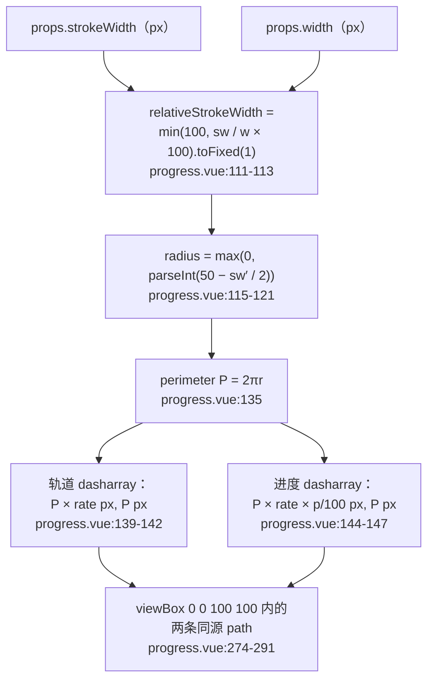
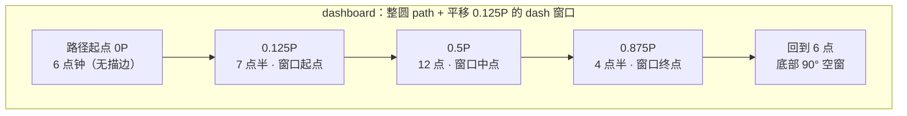

# 8-03 · Progress：SVG 描边

> 核心问题：line/circle 双形态的几何

进度条大概是所有组件里"看起来最简单、算起来最认真"的一个。`XyProgress` 也不例外：它在一个 `.vue` 文件里同时养着两套渲染范式——line 形态是纯 HTML 的三层 `div` 套一层百分比宽度，circle/dashboard 形态则是纯 SVG 的一条弧线 `path` 配两段 dash。前者的几何是小学算术，后者的几何是圆周率、弧长和虚线偏移的连账。这一篇我们就把这笔账从头算到尾：为什么 line 不用 SVG，circle 的半径和周长怎么从两个 props 推出来，`stroke-dasharray` 里的每个数字是怎么换算出来的，dashboard 的 3/4 圆又是靠哪半个格子平移出来的。

涉及的源码文件：

- `packages/components/progress/src/progress.ts`——类型与常量（41 行）；
- `packages/components/progress/src/progress.vue`——全部实现（315 行）；
- `packages/theme/src/components/progress.css`——样式与动画（237 行）；
- `packages/components/progress/__tests__/progress.spec.ts`——12 条用例（248 行）；
- `tests/types/fixtures/progress.ts`——类型夹具（36 行）；
- `apps/docs/examples/progress/`——四个文档示例。

## 一、先立账：progress.ts 的 41 行类型面

先看类型文件全文，它是后面所有几何账的"科目表"：

```ts
import type { SVGAttributes } from "vue";

export const progressTypes = ["line", "circle", "dashboard"] as const;
export const progressStatuses = ["", "success", "exception", "warning"] as const;

export type ProgressType = (typeof progressTypes)[number];
export type ProgressStatus = (typeof progressStatuses)[number];
export type ProgressStrokeLinecap = NonNullable<SVGAttributes["stroke-linecap"]>;

export interface ProgressColorStop {
  color: string;
  percentage: number;
}

export interface ProgressDefaultSlotProps {
  percentage: number;
  content: string;
  status: ProgressStatus;
}

export type ProgressColorMap = Array<string | ProgressColorStop>;
export type ProgressFormatter = (percentage: number) => string;
export type ProgressColor = string | ProgressColorMap | ProgressFormatter;

export interface ProgressProps {
  type?: ProgressType;
  percentage?: number;
  status?: ProgressStatus;
  indeterminate?: boolean;
  duration?: number;
  strokeWidth?: number;
  strokeLinecap?: ProgressStrokeLinecap;
  textInside?: boolean;
  width?: number;
  showText?: boolean;
  color?: ProgressColor;
  striped?: boolean;
  stripedFlow?: boolean;
  format?: ProgressFormatter;
}
```

（`packages/components/progress/src/progress.ts:1-40`）

三个值得停一停的点。

第一，`progress.ts:3` 用数组常量推联合类型：`progressTypes` 推出 `ProgressType`，`progress.ts:4` 推出 `ProgressStatus`。这里要修正一个旧印象——5-21 讲状态色体系时提过 progress，但精确核对实码后要说明：**progress 并没有直接复用 `ComponentStatus`**。全库的状态词汇 `ComponentStatus` 定义在 `packages/xiaoye-primitives/src/utils/types/common.ts:1`，是 `"neutral" | "primary" | "success" | "warning" | "danger"`，并且由包根 `packages/components/index.ts:4` 统一再导出；而 progress 用的是另一套 EP 系词汇：空串（无状态）、`success`、`exception`、`warning`。`danger` 在 progress 的世界里叫 `exception`，`neutral/primary` 在这里没有对应物（无状态就是空串）。这不是疏忽而是词汇分叉：进度条的"异常"是领域词（任务失败、链路出错），和标签页的"危险"语义并不同构，强行共用反而会把 `neutral` 这种"无状态"逼成显式取值。所以 progress 选择本地枚举、保持 EP 兼容的 API 面，代价是两套词汇之间需要一层心智映射——本篇第 6 节会看到状态色到描边色的映射恰好把这层词汇差"翻译"回令牌层。

第二，`progress.ts:8` 的 `ProgressStrokeLinecap` 直接从 Vue 的 `SVGAttributes` 里"偷"类型：`NonNullable<SVGAttributes["stroke-linecap"]>`。不手写 `"butt" | "round" | "square" | "inherit"`，而是引用 DOM 类型库里 SVG 属性的既有定义。这样 SVG 标准扩了枚举（比如 SVG 2 加的 `round`/`square`/`butt` 之外的值），这里的类型自动跟着走，而且传给 `<path :stroke-linecap>` 时类型天然对齐，不需要二次断言。

第三，`progress.ts:23` 的 `ProgressColor` 是三态联合：`string | ProgressColorMap | ProgressFormatter`。一个 `color` prop 同时接受"定值""分段数组""求值函数"三种策略——这是第 6 节的主角，先记下账目。

类型导出在 `packages/components/progress/index.ts:15-25` 全量抬到组件子入口，再经 `packages/components/exports.ts:44` 的 `export * from "./progress"` 汇入包根；安装与样式入口则由 `packages/components/component-manifest.json:536-541` 驱动（`installChecks` 校验 `xy-progress`、`styleImports` 引 `progress`）。类型夹具 `tests/types/fixtures/progress.ts:31-36` 用 `@ts-expect-error` 锁死 `"radial"` 这类非法 `type` 无法通过编译。

## 二、line 形态：div 填充条的"不 SVG"定论

先说结论：**line 形态实码里没有一个 SVG 节点**，它是三层 `div`：

```
__bar（弹性容器）
└─ __bar-outer（轨道，height = strokeWidth px，overflow: hidden，圆角胶囊）
   └─ __bar-inner（填充条，width = percentage%，绝对定位）
      └─ __bar-inner-text（内嵌文本，textInside 时）
```

模板实码（`packages/components/progress/src/progress.vue:235-266`）：

```html
<div v-if="isLine" :class="`${ns.base.value}__bar`">
  <div
    :class="`${ns.base.value}__bar-outer`"
    :style="{ height: `${normalizedStrokeWidth}px` }"
  >
    <div
      :class="[
        `${ns.base.value}__bar-inner`,
        {
          [`${ns.base.value}__bar-inner--indeterminate`]: props.indeterminate,
          [`${ns.base.value}__bar-inner--striped`]: props.striped || props.stripedFlow,
          [`${ns.base.value}__bar-inner--striped-flow`]: props.stripedFlow
        }
      ]"
      :style="barStyle"
    >
      <div
        v-if="showInnerText"
        :class="`${ns.base.value}__bar-inner-text`"
        :style="{ fontSize: `${Math.max(12, normalizedStrokeWidth * 0.9)}px` }"
      >
        <slot
          :percentage="normalizedPercentage"
          :content="content"
          :status="props.status"
        >
          <span>{{ content }}</span>
        </slot>
      </div>
    </div>
  </div>
</div>
```

进度本身就是 `__bar-inner` 的 `width` 百分比。这就是 line 形态的全部几何——一条线段的"已走部分"，用长度百分比表达就够了。

**权衡一：line 为什么是 div 而不是 SVG？** 把候选方案摆出来看。SVG 方案可以用 `<rect>` 或一条水平 `path` 加 dash 换算来做，和 circle 形态共享一套"描边几何"心智；div 方案则把进度退化为宽度百分比。实码选了 div，理由藏在填充条要承载的额外能力里。看填充条样式（`packages/theme/src/components/progress.css:50-71`）：

```css
.xy-progress__bar-inner {
  position: absolute;
  top: 0;
  left: 0;
  isolation: isolate;
  display: inline-flex;
  align-items: center;
  justify-content: flex-end;
  height: 100%;
  border-radius: inherit;
  background-color: var(--xy-progress-fill-color);
  color: white;
  white-space: nowrap;
  overflow: hidden;
  text-align: right;
  transition:
    width var(--xy-transition-duration-slow) var(--xy-transition-timing),
    background-color var(--xy-transition-duration-normal) var(--xy-transition-timing),
    opacity var(--xy-transition-duration-normal) var(--xy-transition-timing);
  will-change: width, transform;
  box-shadow: inset 0 -1px 0 color-mix(in srgb, var(--xy-text-heading) 5%, transparent);
}
```

三个 div 独享、SVG 要绕路的能力：一是 `transition: width`——宽度插值是布局动画，浏览器对 `div` 宽度过渡的支持最省心，SVG 里等效的是 `stroke-dasharray` 过渡（circle 形态确实这么干，`progress.css:144-150`），但线形场景宽度过渡语义更直白；二是条纹背景 `background-image: linear-gradient(135deg, ...)` 配 `background-size: 1.25rem 1.25rem`（`progress.css:91-103`）和条纹流动 `background-position` 动画（`progress.css:229-237`）——纯 CSS 绘图，SVG 里要塞 `<pattern>` 定义；三是内嵌文本直接当 flex 子元素排进填充条右端（`justify-content: flex-end`），天然随条宽裁切。渐变色同理：`barStyle` 里那个 `/gradient/i.test(color)` 分支（`progress.vue:96-100`）命中时把颜色写进 `background` 而不是 `backgroundColor`，CSS 渐变函数在 `background` 上是合法值。也就是说，line 形态把"颜色、纹理、文本、动画"四件事全部留在了 CSS 的主场，SVG 在这条赛道上没有任何加分项——这是"实码定论"的完整版：不是 SVG 做不到，而是 div 的每一步都更短。

`barStyle` 的完整逻辑（`packages/components/progress/src/progress.vue:88-107`）：

```ts
const barStyle = computed<CSSProperties>(() => {
  const style: CSSProperties = {
    width: props.indeterminate ? "42%" : `${normalizedPercentage.value}%`,
    animationDuration: `${normalizedDuration.value}s`
  };

  const color = currentColor.value;

  if (/gradient/i.test(color)) {
    style.background = color;
  } else {
    style.backgroundColor = color;
  }

  return style;
});

const progressTextSize = computed(() =>
  isLine.value ? 12 + normalizedStrokeWidth.value * 0.36 : normalizedWidth.value * 0.111111 + 2
);

const content = computed(() => props.format(normalizedPercentage.value));
```

注意 `width` 在 indeterminate 时固定为 `42%`（`progress.vue:90`）——不确定进度不是"无限宽"，而是一个 42% 宽的块在轨道上来回跑，动画定义在 CSS 侧（`progress.css:85-89`、`progress.css:215-227`）。另外 `progress.vue:106` 这一行的三目是双形态字号策略的分水岭，第 7 节展开。

## 三、circle 形态（上）：把圆装进 100×100 的归一化坐标系

转到本篇核心。circle 形态有一个所有几何账的共同前提：**SVG 画布是归一化的**。模板里写死 `<svg viewBox="0 0 100 100" aria-hidden="true">`（`progress.vue:273`），外部传进来的 `width`（圆的像素直径）只决定这个 100×100 逻辑坐标系被拉伸到多大，`strokeWidth`（像素）则必须先换算成逻辑坐标系里的值。换算入口在 `packages/components/progress/src/progress.vue:111-147`，这是本篇最值钱的 37 行，整段贴出：

```ts
const relativeStrokeWidth = computed(() =>
  Math.min(100, (normalizedStrokeWidth.value / normalizedWidth.value) * 100).toFixed(1)
);

const radius = computed(() => {
  if (!isLine.value) {
    return Math.max(0, Number.parseInt(`${50 - Number.parseFloat(relativeStrokeWidth.value) / 2}`, 10));
  }

  return 0;
});

const trackPath = computed(() => {
  const currentRadius = radius.value;
  const isDashboard = props.type === "dashboard";

  return `
    M 50 50
    m 0 ${isDashboard ? "" : "-"}${currentRadius}
    a ${currentRadius} ${currentRadius} 0 1 1 0 ${isDashboard ? "-" : ""}${currentRadius * 2}
    a ${currentRadius} ${currentRadius} 0 1 1 0 ${isDashboard ? "" : "-"}${currentRadius * 2}
  `;
});

const perimeter = computed(() => 2 * Math.PI * radius.value);
const rate = computed(() => (props.type === "dashboard" ? 0.75 : 1));
const strokeDashoffset = computed(() => `${(-1 * perimeter.value * (1 - rate.value)) / 2}px`);

const trailPathStyle = computed<CSSProperties>(() => ({
  strokeDasharray: `${perimeter.value * rate.value}px, ${perimeter.value}px`,
  strokeDashoffset: strokeDashoffset.value
}));

const circlePathStyle = computed<CSSProperties>(() => ({
  strokeDasharray: `${perimeter.value * rate.value * (normalizedPercentage.value / 100)}px, ${perimeter.value}px`,
  strokeDashoffset: strokeDashoffset.value
}));
```

先把换算链路画出来（这张图就是 circle 几何的总账）：



逐环拆解。

**第一环：`relativeStrokeWidth`（111-113）。** 描边宽度是相对量：`strokeWidth / width × 100`，即"描边占直径的百分比"。比如 `strokeWidth=6, width=120`，得到 `5.0`——在 100×100 的逻辑坐标系里描边宽 5 个单位，渲染到 120px 的实际画布上时 SVG 等比放大，正好还原成 6px。`Math.min(100, ...)` 是防退化：不管外部传多离谱的组合，描边永远不超过直径。`.toFixed(1)` 把结果收成一位小数字符串——注意它返回的是字符串，这既是 SVG 属性的展示格式，也是下一环 parseInt 前要再 parseFloat 的原因。

**第二环：`radius`（115-121）。** 描边是有宽度的，SVG 的 stroke 沿路径**两侧各铺一半**。要让描边外缘不出画布，路径（描边中线）的半径就必须从 50（画布半宽）向内收缩半个描边宽：`radius = 50 − relativeStrokeWidth / 2`。这就是"描边几何"和"中学圆几何"的唯一分歧点：周长不是按画布边缘算的，是按描边中线算的。`Number.parseInt` 做了一次取整——半径被向下截断成整数，最多少 1 个逻辑单位。这里有个容易误判的点：取整**不会**造成进度误差，因为第三环的周长就是按取整后的这条 path 算的，dash 账与实际弧长永远自洽；代价只是描边中线向内挪了零点几像素（120px 的圆上至多 0.6 逻辑单位 ≈ 0.72px），肉眼不可辨。`Math.max(0, ...)` 则兜住 `relativeStrokeWidth` 被 toFixed 后可能的浮点毛刺。

**第三环：`perimeter`（135）。** `2πr`，圆周长公式原样照抄。以默认 `width=126, strokeWidth=6` 为例：`relativeStrokeWidth = 6/126×100 = 4.7619… → "4.8"`，`radius = parseInt(50 − 2.4) = 47`，`perimeter = 2π×47 ≈ 295.31`。这三个数是 circle/dashboard 形态所有 dash 换算的底数。

**第四环：dash 账（139-147）。** SVG 虚线的规则是：`stroke-dasharray: a, b` 表示"画 a 长、空 b 长"循环；`stroke-dashoffset` 把整个图案沿路径平移（正值向起点方向退，负值向行进方向进）。实码把进度表达为 **dasharray 截断法**：

- 轨道 path：`dasharray = P×rate px, P px`。gap 设为一整圈 P，意味着"画完 P×rate 之后至少空一整圈"——在长度恰为 P 的 path 上，效果就是只画出前 `P×rate` 一段；
- 进度 path：`dasharray = P×rate×(p/100) px, P px`，同理只画出 `P×rate` 的前 `p%`。

顺带把一条常见口诀摆正：很多教程写"进度 = circumference × (1 − percentage/100)，赋给 dashoffset"。那是 **dashoffset 补差法**——先画满一整圈 dash，再用偏移把没走的部分"藏"到起点后面去，常见于 `<circle>` 元素画法。本组件的 circle 形态没有走这条路：`rate=1` 时 `strokeDashoffset` 的公式（137 行）算出来是 `−P×(1−1)/2 = 0px`，**circle 形态的 dashoffset 恒为零**，进度完全由 dasharray 第一段的长度表达。两法数学等价（周长 × p/100 的实线段，怎么画都是那一段弧），但截断法有个工程优势：动画过渡时插值的是 dasharray 首段长度，起点固定在路径起点，`progress.css:144-148` 直接 `transition: stroke-dasharray` 就能得到"从起点顺时针生长"的动画，不需要额外维护偏移量的联动。

这里还有一个很细但很见功力的防御：进度 path 上有 `:opacity="normalizedPercentage ? 1 : 0"`（`progress.vue:287`）。为什么 0% 时要把整条 path 藏掉？因为默认 `strokeLinecap: "round"`（`progress.vue:33`）——SVG 里"零长度 dash + round 端帽"是著名的"画点"行为（点状虚线正是靠这个机制实现的：`dasharray: 0 10; linecap: round` 就是一排圆点）。0% 进度意味着 dasharray 首段长度为 0，round 端帽仍会在路径起点（12 点钟位置）画出一个圆点，进度条凭空长出一颗痣。`opacity` 这一行就是把这颗痣按掉。一笔小账，但它解释了"为什么明明 dash 为 0 还要处理"。

## 四、trackPath：两段弧命令拼一个整圆

circle 形态用的不是 `<circle>` 元素，而是一条 `<path>`，`d` 属性由 `trackPath`（`progress.vue:123-133`）生成。circle 形态代入默认值（r=47）后是：

```
M 50 50        ← 笔先移到圆心（无绘制）
m 0 -47        ← 相对移动到 (50, 3)，即 12 点钟位置——路径起点
a 47 47 0 1 1 0 94    ← 第一段弧：半径 47 的半圆，到 (50, 97)，12 点 → 3 点 → 6 点
a 47 47 0 1 1 0 -94   ← 第二段弧：同参数半圆回到起点，6 点 → 9 点 → 12 点
```

四个关键参数：`a rx ry rot large-arc sweep dx dy`。这里 `rx=ry=r`、`rot=0`、`large-arc=1`（取大弧）、`sweep=1`（顺时针方向，SVG 屏幕坐标系 y 向下，sweep=1 即视觉顺时针）。每段弧的端点差恰好是直径（`0 ±2r`），所以 `large-arc` 在两半圆等价的情况下只是保底，真正决定走向的是 `sweep=1`。两段半圆首尾相接，拼出一个从 12 点钟起笔、顺时针一整圈的圆。

为什么不直接写 `<circle>`？因为 `<circle>` 的起笔位置固定在 3 点钟（`cx + r` 处），要让它从 12 点开始画进度还得补一个 `transform: rotate(-90deg)`；而 path 的起点由 `M/m` 直接给定，起笔即 12 点，dash 生长方向即视觉顺时针，一圈下来零变换。更重要的伏笔是 dashboard：同一段模板字符串里，`isDashboard` 把起点换到 6 点钟（`m 0 +r`）并反转第一段弧的落点——起点、方向、缺口位置全部由字符串插值控制，这是"用 path 弧命令统一两种圆形态"的真正收益，下一节展开。

用测试锁一下这条 path 的存在性（`packages/components/progress/__tests__/progress.spec.ts:51-64`）：

```ts
it("支持 circle 模式", () => {
  const wrapper = mount(XyProgress, {
    props: {
      type: "circle",
      percentage: 48,
      width: 120
    }
  });

  expect(wrapper.classes()).toContain("xy-progress--circle");
  expect(wrapper.get(".xy-progress__circle").attributes("style")).toContain("width: 120px;");
  expect(wrapper.findAll("path")).toHaveLength(2);
  expect(wrapper.get(".xy-progress__text").text()).toBe("48%");
});
```

`findAll("path")` 恰好 2 条：一条轨道、一条进度，同源 `d`，只靠 style 里的 dash 参数区分角色。这是双 path 方案的另一个好处：轨道和进度共享同一条几何定义，永远不会"轨道是圆、进度是椭圆"。

## 五、circle 形态（下）：dashboard 的 3/4 圆与半个格子的平移

dashboard 与 circle 共用全部换算链，唯一变量是 `rate`（`progress.vue:136`）：`type === "dashboard" ? 0.75 : 1`。轨道 dasharray 首段从 `P` 缩到 `0.75P`，直觉上"画 3/4 圈"——但**画哪 3/4** 才是几何账的关键。

dashboard 的路径起点在 6 点钟（`trackPath` 里 `m 0 +r`），顺时针经 9 点、12 点、3 点回到 6 点。如果只把 dash 缩到 0.75P 而不动 offset，画出来的窗口是"6 点 → 顺时针 270° → 3 点钟"，缺口开在右上——这不是仪表盘该有的样子。仪表盘的缺口应该**对称地开在正下方**，窗口从 7 点半扫到 4 点半。实码用一行偏移完成这个"转正"（`progress.vue:137`）：

```
strokeDashoffset = −P × (1 − rate) / 2 = −0.125P
```

负偏移把 dash 图案沿行进方向推进 `0.125P`（八分之一圈，45°）：原本从路径起点（6 点）开始的 `0.75P` 长实线段，平移后占据路径的 `[0.125P, 0.875P]` 区间。把路径长度换算回钟面位置：



`(1 − rate)/2` 这个"除以二"就是对称化的全部数学：缺口总长 `0.25P`（90°），前后各让出 `0.125P`（45°），窗口恰好以 12 点为对称轴。进度 dash（`circlePathStyle`，`progress.vue:144-147`）沿用同一个 offset——所以无论百分比多少，进度总是从 7 点半开始顺时针生长，与轨道窗口的起点严格对齐。拿测试用例（`spec.ts:66-79` 的 dashboard 72%）算一笔完整账：`width=126, strokeWidth=6` → `r=47`、`P≈295.31`；轨道 dash `0.75P ≈ 221.48px`；进度 dash `0.75P×0.72 ≈ 159.47px`；两者 offset 都是 `−0.125P ≈ −36.91px`。

circle 与 dashboard 的渲染模板是同一段（`packages/components/progress/src/progress.vue:268-293`）：

```html
<div
  v-else
  :class="`${ns.base.value}__circle`"
  :style="{ width: `${normalizedWidth}px`, height: `${normalizedWidth}px` }"
>
  <svg viewBox="0 0 100 100" aria-hidden="true">
    <path
      :class="`${ns.base.value}__circle-track`"
      :d="trackPath"
      :stroke-linecap="props.strokeLinecap"
      :stroke-width="relativeStrokeWidth"
      fill="none"
      :style="trailPathStyle"
    />
    <path
      :class="`${ns.base.value}__circle-path`"
      :d="trackPath"
      :stroke="stroke"
      fill="none"
      :opacity="normalizedPercentage ? 1 : 0"
      :stroke-linecap="props.strokeLinecap"
      :stroke-width="relativeStrokeWidth"
      :style="circlePathStyle"
    />
  </svg>
</div>
```

顺带说两个细节。一是 `stroke-linecap` 进了公开 API（`progress.ts:8`、`progress.vue:277/288`），它作用于 dash 的**两个端头**：`butt` 平头、`round` 圆头、`square` 方头（会向两端各伸长半个描边宽）。round 最常用，但注意端帽是"对称生长"的——`dasharray` 首段长度的两端各多出 `strokeWidth/2` 的视觉长度，所以 1% 进度的圆头进度条看起来会比 1% 的弧长"胖"一点；这是几何账之外的视觉账，EP 2.3 起也把 `stroke-linecap` 提为 prop（默认同样是 `round`），两边 API 面在这里对齐。二是非法值的兜底链：`normalizedWidth` 保证 `width ≥ strokeWidth + 1`（`progress.vue:62-64`），`normalizePositiveNumber` 把 `width=0` 打回 126、`strokeWidth=-8` 打回 6（`progress.vue:175-181`），测试专门验证了这条链（`spec.ts:234-247`）：兜底后 `relativeStrokeWidth = 6/126×100 → "4.8"`，断言 `stroke-width` 属性恰为 `"4.8"`——一位小数的 toFixed 精度在测试里被精确锁死。

轨道与进度的样式分工在 CSS 侧（`packages/theme/src/components/progress.css:139-150`）：

```css
.xy-progress__circle-track {
  stroke: var(--xy-progress-track-color);
  opacity: 0.96;
}

.xy-progress__circle-path {
  transition:
    stroke-dasharray var(--xy-transition-duration-slow) var(--xy-transition-timing),
    stroke var(--xy-transition-duration-normal) var(--xy-transition-timing),
    opacity var(--xy-transition-duration-normal) var(--xy-transition-timing);
  filter: drop-shadow(0 1px 3px color-mix(in srgb, var(--xy-progress-fill-color) 9%, transparent));
}
```

进度 path 的 `transition` 三个属性各司其职：`stroke-dasharray` 慢速跟随百分比（生长动画）、`stroke` 正常速度跟状态色（变色动画）、`opacity` 处理 0% 显隐。`drop-shadow` 给描边一圈极淡的同色投影，这是 SVG 的又一个主场能力——div 方案里等效要靠 `box-shadow`，但 shadow 无法沿圆弧描边走。

## 六、状态色 → 描边色的映射

5-21 埋的那条线在这里接上：状态怎么变成颜色。入口是 `STATUS_COLOR_MAP`（`packages/components/progress/src/progress.vue:19-24`）：

```ts
const STATUS_COLOR_MAP: Record<Exclude<ProgressStatus, ""> | "default", string> = {
  success: "var(--xy-success)",
  exception: "var(--xy-danger)",
  warning: "var(--xy-warning)",
  default: "var(--xy-brand)"
};
```

四个键、四个语义令牌。这正是第 1 节词汇分叉的"翻译层"：`ProgressStatus` 的 `exception` 翻到令牌层是 `--xy-danger`（`packages/xiaoye-primitives/src/theme/tokens.css:144`，亮色主题；暗色主题在 `tokens.css:314` 另有锚点），无状态落到 `--xy-brand`（`tokens.css:121`）。组件源码里**没有一行硬编码色值**，状态色体系完全构建在语义令牌上——换主题、调色板，progress 一行不用改。消费点有两处：`currentColor`（`progress.vue:80-86`）把令牌交给 `barStyle`（line 的填充背景）和 `stroke`（circle 的描边，`progress.vue:149`）——同一个映射函数喂两种渲染范式，状态语义在双形态间天然一致；CSS 侧 `is-success/is-warning/is-exception` 三个状态类（`progress.vue:76` 经 `useNamespace` 的 `is()` 生成，见 `packages/xiaoye-primitives/src/composables/use-namespace.ts:8`）给文本图标染色（`progress.css:203-213`）。

**权衡二（颜色策略）：状态色只是兜底，`color` prop 永远优先。** `currentColor` 的第一分支就是 `if (props.color)`（`progress.vue:81-83`）——只要业务传了 `color`，`STATUS_COLOR_MAP` 整体退位。三态策略的求解函数（`progress.vue:183-220`）：

```ts
function isColorStop(value: string | ProgressColorStop): value is ProgressColorStop {
  return typeof value === "object" && value !== null && "color" in value;
}

function getColors(color: ProgressColorMap) {
  const span = color.length > 0 ? 100 / color.length : 0;

  return color
    .map((item, index) =>
      isColorStop(item)
        ? item
        : {
            color: item,
            percentage: span * (index + 1)
          }
    )
    .sort((a, b) => a.percentage - b.percentage);
}

function getCurrentColor(percentage: number, color: ProgressProps["color"]) {
  if (typeof color === "function") {
    return color(percentage);
  }

  if (typeof color === "string") {
    return color;
  }

  const colors = getColors(color ?? []);

  for (const item of colors) {
    if (item.percentage > percentage) {
      return item.color;
    }
  }

  return colors.at(-1)?.color ?? STATUS_COLOR_MAP.default;
}
```

函数、字符串两个分支一眼即懂；分段数组的账有两处细节。其一，纯字符串项被 `getColors` 自动补齐锚点：按 `100 / length` 均分，第 i 项锚在 `span×(i+1)`——`["#a", "#b", "#c"]` 等价于锚在 33.3/66.7/100 的三段。其二，命中判据是 `item.percentage > percentage`（**严格大于**）再取最后兜底——百分比恰好压线时落在**下一段**。测试对这条边界有专门断言（`spec.ts:187-202`）：锚点 30/70/100 的分段色，`percentage=30` 返回的是第二段 `#f59e0b` 而不是第一段，`rgb(245, 158, 11)`。函数与数组的响应性也有测试兜着（`spec.ts:143-162`）：`percentage` 变化后 `computed` 重算、背景色随变。类型夹具 `tests/types/fixtures/progress.ts:12-29` 则把"数组混合锚点项 + 求值函数"两种写法都钉进了编译期。

还有一个跨形态的色域陷阱要记档：**渐变只在 line 形态真正生效**。`barStyle` 的 `/gradient/i` 分支（`progress.vue:96-100`）把渐变写进 CSS `background`，这是合法的；但 circle 形态的颜色走 SVG `stroke` 属性（`progress.vue:149`），SVG 的 paint 语法只认 `url(#id)` 引用、`none` 和颜色值，**不接受 CSS 渐变函数**——`stroke="linear-gradient(...)"` 是非法 paint，描边画不出来。要在 SVG 里渐变得先塞 `<defs><linearGradient id>` 再 `stroke="url(#id)"`，实码没有这条链路。文档示例 `apps/docs/examples/progress/circle.vue:28` 恰好给一个 circle 卡片传了 `linear-gradient(180deg, #0f766e, #2563eb)`，属于示例意图与实码能力的边界缺口，记录在案：circle + 渐变目前是"静默不生效"，不是任何形态都可用的通用能力。

## 七、文本的位置策略：line 内嵌 vs circle 居中

文案渲染是双形态分叉的最后一站，三个位置各有各的几何。判定位在 `progress.vue:65-67`：`showInnerText` 要求 line + `textInside` + 有内容；否则走外置文本。

**line 外置**：`__text` 是 flex 兄弟节点，字号 `12 + strokeWidth × 0.36`（`progress.vue:106`）——描边越粗字越大，默认 `strokeWidth=6` 得 14.16px。有状态时文本换图标（`progress.vue:151-165` 的 `statusIcon`）：

```ts
const statusIcon = computed(() => {
  if (props.status === "warning") {
    return props.type === "line" ? "mdi:alert-circle" : "mdi:alert";
  }

  if (props.status === "success") {
    return props.type === "line" ? "mdi:check-circle" : "mdi:check";
  }

  if (props.status === "exception") {
    return props.type === "line" ? "mdi:close-circle" : "mdi:close";
  }

  return "";
});
```

同一个状态，line 用带圈图标（`check-circle`）、circle 用裸图标（`check`）——circle 形态的图标叠在圆环中央，圆环本身就是"圈"，再套一层带圈图标就是圈套圈，视觉冗余。一个 computed 里藏着两条视觉规则，这是文本层对双形态几何的回应。

外置文本节点的完整实码（`packages/components/progress/src/progress.vue:295-313`）：

```html
<div
  v-if="showOuterText"
  :class="`${ns.base.value}__text`"
  :style="{ fontSize: `${progressTextSize}px` }"
>
  <slot
    :percentage="normalizedPercentage"
    :content="content"
    :status="props.status"
  >
    <span v-if="!props.status">{{ content }}</span>
    <XyIcon
      v-else
      :class="`${ns.base.value}__text-icon`"
      :icon="statusIcon"
      :size="Math.max(14, progressTextSize)"
    />
  </slot>
</div>
```

文本内容只有一条规则：无状态渲染格式化文案，有状态渲染图标；默认插槽在三种位置间原样透传，`showOuterText`（`progress.vue:67`）保证内嵌与外置互斥。

**line 内嵌**：文本作为填充条的 flex 子元素贴右排（模板 `progress.vue:251-263`），字号另算一档 `Math.max(12, strokeWidth × 0.9)`（`progress.vue:254`）——内嵌文本被描边厚度夹着，字号上限直接由厚度决定：`strokeWidth=18` 得 16.2px，`strokeWidth=6` 时顶到 12px 下限。`status.vue:61-67` 的示例组合正是这条链：`text-inside` 配 `:stroke-width="18"`。

**circle 居中**：文本完全不在 SVG 里，而是 HTML 绝对定位盖在圆心（`packages/theme/src/components/progress.css:170-185`）：

```css
.xy-progress--circle .xy-progress__text,
.xy-progress--dashboard .xy-progress__text {
  position: absolute;
  top: 50%;
  left: 0;
  display: flex;
  align-items: center;
  justify-content: center;
  width: 100%;
  margin: 0;
  padding: 0 14px;
  text-align: center;
  transform: translateY(-50%);
  line-height: 1.25;
  pointer-events: none;
}
```

字号走 `width × 0.111111 + 2`（`progress.vue:106`）——`0.111111` 就是 `1/9` 的浮点截断，即"直径的九分之一加 2px"，126 的默认直径得 16px。为什么文本不放 `<text>`？三个工程理由：复用——同一个默认插槽（`progress.vue:43-45` 的 `defineSlots`，入参类型 `ProgressDefaultSlotProps` 带 `percentage/content/status`）同时服务三种位置，插槽内容是 HTML，塞进 SVG 得整段换 `<foreignObject>`；排版——`line-height: 1.25`、`padding: 0 14px`、`pointer-events: none` 这些都是 HTML 语义，SVG `<text>` 里要另立一套；无障碍——SVG 根上挂了 `aria-hidden="true"`（`progress.vue:273`），几何装饰整体退出无障碍树，进度语义由根节点 `role="progressbar"` 承担（`progress.vue:224-234`），文本走 HTML 层自然可读。**权衡三**：把"几何"给 SVG、把"语义与排版"给 HTML，边界切在 svg 标签上，两边各自用最顺手的工具。

## 八、indeterminate：没有百分比的进度条

不确定态是几何账的"负一环"——没有数字，只有运动。JS 侧只做两件事：填充条宽度锁 42%（`progress.vue:90`），根节点摘掉确定值语义（`progress.vue:228-232`）：

```html
  <div
    :class="rootKls"
    :style="attrs.style"
    role="progressbar"
    :aria-valuenow="props.indeterminate ? undefined : normalizedPercentage"
    aria-valuemin="0"
    aria-valuemax="100"
    :aria-busy="props.indeterminate || undefined"
    :aria-valuetext="props.indeterminate ? undefined : content"
    v-bind="nativeAttrs"
  >
```

`aria-valuenow`、`aria-valuetext` 置空、`aria-busy` 置 true——读屏器不再播报假精确的百分比，改为感知"忙碌中"。动画全部在 CSS：`xy-progress-indeterminate` 关键帧让 42% 宽的块从 `translateX(-130%)` 荡到 `240%`（`progress.css:215-227`），配合 `overflow: hidden` 的轨道实现"擦肩而过"；`animationDuration` 由 `duration` prop 注入（`progress.vue:91`，归一化在 `progress.vue:60`，非法值兜回 3s）。`indeterminate` 与 `stripedFlow` 同开时两个动画串成逗号列表（`progress.css:109-113`）。注意 indeterminate 只在 line 形态有意义——circle 的 dash 生长动画依赖确定的百分比，模板里 `isLine` 分流已经把它挡在圆环之外，测试（`spec.ts:204-232`）验证了类名组合、`animationDuration: "3s"` 与 aria 行为的完整链路。

## 九、单文件双形态的组织账，以及与 EP 的对照

**权衡四：一个 `.vue` 文件装两种形态，为什么不拆？** 实码的选择是在同一个 `<script setup>` 里用 `isLine`（`progress.vue:57`）做 computed 分流：模板两大分支（235/268 的 `v-if/v-else`），共享 props 归一化（59-64）、颜色求解（80-86）、文本字号（105-107）、插槽与 aria。拆成 `progress-line.vue` + `progress-circle.vue` 的好处是各自内聚，代价是"颜色策略、格式化、插槽、无障碍"这批公共逻辑要么复制一份，要么再抽一层 composable——对一个总重 315 行的组件，抽层的复杂度超过内聚收益。当然也有被迫付出的"哨兵值"：`radius` 对 line 形态返回 0（`progress.vue:120`），`trackPath` 等一组 computed 在 line 下是死代码，`radius()` 返回 0 保持着类型上的诚实。这种"共享内核 + 模板分流"的形态，介于"两个组件"和"一个组件"之间，是中小型双形态组件的常见均衡点。

接着对 EP。这套 circle 几何与 Element Plus 的 progress 是**同构的**——对照 EP 源码（`element-plus/packages/components/progress/src/progress.vue`，示意摘录，非本仓库文件）：

```ts
// EP v2 的几何核心（凭 EP 开源实现对照，示意）
const radius = computed(() => {
  if (props.type === 'circle' || props.type === 'dashboard') {
    return Math.max(0, Number.parseInt(`${50 - relativeStrokeWidth.value / 2}`, 10))
  }
  return 0
})
const perimeter = computed(() => 2 * Math.PI * radius.value)
const rate = computed(() => (props.type === 'dashboard' ? 0.75 : 1))
// 轨道/进度 dasharray 与 offset 公式，与本库 progress.vue:139-147 一致
```

同构的不止几何：`M 50 50` 起笔的两段弧路径、`rate 0.75`、`(1 − rate)/2` 的偏移对称化、`width` 默认 126、`strokeWidth` 默认 6、`strokeLinecap` 默认 `round`、line 内嵌外置的双档字号（`12 + strokeWidth × 0.36` / `width × 0.111111 + 2`）、`STATUS_COLOR_MAP` 的四键结构与 `Record<Exclude<ProgressStatus, ""> | "default", string>` 的类型写法（EP 用 `--el-color-*`，本库换成语义令牌 `--xy-*`）——都是一一对应的。真正的分叉在三处：其一，**防御策略**，EP 对 `percentage` 走 props validator 只在开发态告警，本库选择运行时钳制——`clampPercentage` 把 140 收进 100（`progress.vue:167-173`），测试断言 `aria-valuenow` 与填充宽度双双归 100（`spec.ts:21-34`），非法 stroke/width/duration 也有 `normalizePositiveNumber` 兜底（`progress.vue:175-181`），这在第 5 节的 `"4.8"` 断言里被精确验证；其二，**状态图标走 iconify**（`mdi:*` 名称经 `XyIcon` 渲染，`progress.vue:306-311`），而不是组件库内置图标集；其三，**插槽类型化**——`defineSlots<default?: (props: ProgressDefaultSlotProps) => unknown>`（`progress.vue:43-45`）把插槽入参写成契约，EP 的插槽类型约束没有这么紧。整体可以概括为：几何继承 EP 的成熟答案，边界防御和类型面按本库自己的标准重做。

## 十、测试如何锁住几何

最后把测试当验收单过一遍——几何组件的测试要害在于"数字要精确到能复算"。除了前文引过的 circle 双 path（`spec.ts:51-64`）、dashboard 插槽（`spec.ts:66-79`）、分段色压线（`spec.ts:187-202`）、兜底宽度（`spec.ts:234-247`），基础用例（`spec.ts:7-19`）把"百分比→宽度→文案"的直线链条钉死：`percentage=66` 断言 `aria-valuenow="66"`、`__bar-inner` 内联样式 `width: 66%`、外置文本 `66%` 三处一致。`spec.ts:36-49` 验证 `textInside` 时外置文本节点**不渲染**（`wrapper.find(".xy-progress__text").exists()).toBe(false)`）且类名切到 `xy-progress--text-inside`，`format` 函数的返回值原样上屏。`spec.ts:106-141` 一口气覆盖颜色三态策略的最终计算值（断言到 `rgb()` 计算色）。这批测试的共同姿势是：不测实现细节，测**渲染产物上的可复算数字**——几何换算错了，最先崩的就是这些断言。

类型夹具（`tests/types/fixtures/progress.ts` 全文 36 行）则从编译侧兜住 API 面：`lineProps` 验证 line 态的组合（`percentage/status/stripedFlow/format`），`circleProps` 验证 circle 态的分段色数组（含字符串项混锚点项），`dynamicColorProps` 验证函数色，`invalidProps` 用 `@ts-expect-error` 保证 `"radial"` 永远编译不过（`progress.ts:31-36`）。运行时行为与类型契约双保险，这才是"几何账"的完整闭环。

## 结语

回看整笔账：line 形态把几何降维成 `width` 百分比，把颜色、纹理、文本、动画全部留在 CSS 主场；circle 形态用归一化 viewBox 抹平像素，用"半描边内缩"定半径、用 `2πr` 定周长、用 dasharray 截断法定进度、用 `0.125P` 平移把 dashboard 转正；状态色在令牌层完成从 `exception` 到 `--xy-danger` 的翻译；文本则站在 SVG 与 HTML 的边界上各取所长。一个 315 行的组件，把两套渲染范式的边界问题回答得干净利落——哪些进 SVG、哪些留 CSS、哪些交给 DOM 语义，每个决定都能在实码里指出对应的行号。

双形态写完，下一篇走进另一个"由状态驱动形态"的组件。8-04《Steps：状态派生》要拆的是步骤条：`steps` 容器如何把 `current` 派生成每一步的 `wait/process/finish/error` 状态，子项如何在没有显式 props 的情况下从注入里领到自己的角色——组件树里的状态广播机制，我们到那篇再算。

---

**本篇引用清单**：`packages/components/progress/src/progress.ts:1-40`；`packages/components/progress/src/progress.vue:19-24, 26-45, 50-67, 80-107, 111-147, 151-165, 167-181, 183-220, 224-234, 235-266, 268-293, 295-313`；`packages/theme/src/components/progress.css:50-71, 85-113, 139-150, 170-185, 203-213, 215-237`；`packages/components/progress/__tests__/progress.spec.ts:7-19, 21-34, 36-49, 51-64, 66-79, 106-141, 143-162, 187-202, 204-232, 234-247`；`tests/types/fixtures/progress.ts:1-36`；`packages/xiaoye-primitives/src/theme/tokens.css:121,130,137,144,291,300,307,314`；`packages/xiaoye-primitives/src/utils/types/common.ts:1`；`packages/xiaoye-primitives/src/composables/use-namespace.ts:8`；`packages/components/index.ts:4`；`packages/components/exports.ts:44`；`packages/components/component-manifest.json:536-541`；`apps/docs/examples/progress/{basic.vue:55-57, circle.vue:16-30, status.vue:61-67, animated.vue:53-59}`。
