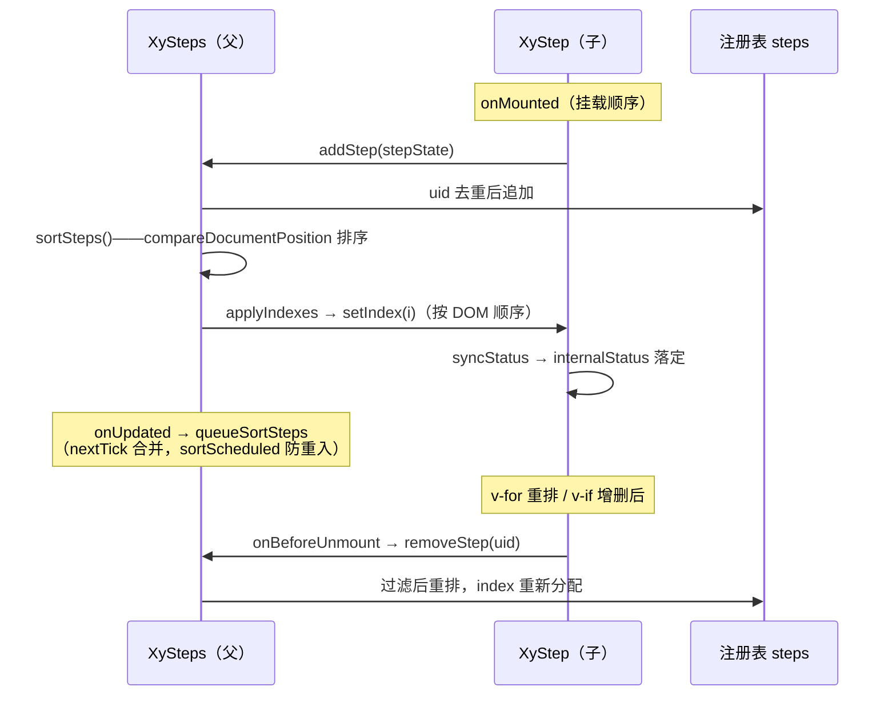
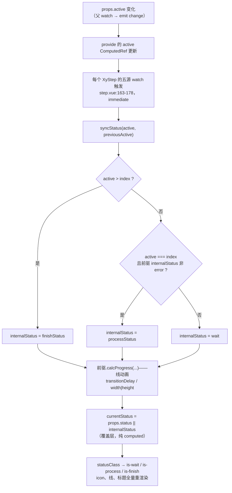

# 8-04 · Steps：状态派生

> 本篇是"组件深潜"卷数据展示组（8 卷）的第四篇。8-03 拆 Progress，几何把数值画成线；本篇拆 Steps——同一族"序列"组件，Progress 回答"一件事做了百分之几"，Steps 回答"一串事走到了第几件"。核心问题按大纲只有九个字：**步骤序列的当前态计算**。先亮底牌：读完父组件与子组件的全部源码你会发现，"当前走到哪"这件事不是父组件算好下发的，而是每个 `XyStep` 拿着注册表分配的 index **自己算**——状态派生的主导权在子，这与很多"容器组件"的直觉相反。本篇同时是 5-04《Breadcrumb：父收集子的注册模式》的续篇：steps 的注册段（`steps.vue:45-107`）当时作为"重装注册表"的对照组被引过，本篇全文展开；另外还要用一整节复盘一次刚落地的修复——`items` prop 的废弃战役，它是 5-04 考据里"steps+step 是注册模式同族"这个论断的一次延伸纠偏。

接到题目先复述一遍目标，防止写偏：步骤条要管的事可以压成四件——**子项从哪来**（items 数据驱动还是插槽声明，这正是修复战役的战场）、**顺序从哪来**（注册表与 DOM 顺序的对齐）、**每一步的状态怎么算**（wait/process/finish 的派生算法与 error 阻断语义）、**状态怎么变成视觉**（icon、线动画、simple 与垂直模式）。这四件事里，前两件是 5-04 的旧话重提，后两件才是本篇的新账——尤其是第三件，"状态派生"存在三种可能的实现思路，本篇要给出实码定论而不是教科书选项。

先交代代码体量，给后面所有讨论一个标尺：`packages/components/steps/src/steps.vue` 当前实态 143 行，`steps.ts` 21 行，`step.vue` 230 行，`context.ts` 30 行，`index.ts` 20 行，合计 444 行；配上 275 行的单测（8 用例实跑全绿）、454 行的主题 CSS 和 84 行的类型夹具。5-04 引用注册段时记的是"steps.vue 144 行"，与当前 143 行的差额恰恰来自本篇要讲的 items 修复——修完之后行号变了，本篇所有引用一律按当前工作区实态重新核对。

## 一、items 废弃修复：一次双轨 API 的软着陆

先讲最新的一笔账。2026-09-16 前后完成的这轮修复，改动面精确到三个文件、三十余行——`git diff` 里看得清清楚楚：`steps.ts` 增加 5 行，`steps.vue` 增加 4 行，`steps.spec.ts` 增加 26 行。三个文件各干一件事：类型层立牌、运行时告警、测试锁行为。

修复的动因要从"双轨"说起。此前的 steps 支持 `items` 数组配置（数据驱动：把 `{ title, description, status }[]` 交给父组件，父自己渲染子项），与 `XyStep` 插槽模式并存。听上去是"多给一种选择"，实际是把同一个组件的两个根本问题劈成了两套答案：子项来源一套（v-for 手写 `xy-step`）与另一套（`items` 数组），注册时序一套与另一套，重排兜底一套与另一套。更要命的是 5-04 那个论断——steps 的父组件是**货真价实的注册表**，它感知的是"注册上来的实例"：`addStep` 收 `StepState`、`compareSteps` 按 DOM 位置排序、`applyIndexes` 直接调用子注册上来的方法。而 items 模式下子项是父自己造的 vnode，根本不走注册——同一组件里两套子项机制，双轨的维护面是两倍，语义却只有一套。修复的裁决很干脆：**统一为插槽模式**，items 传入时开发期告警。

先看类型层立的全文——`steps.ts` 如今总共 21 行，items 段是仅有的"负资产"：

```ts
// packages/components/steps/src/steps.ts（全文 21 行）
export const stepsDirections = ["horizontal", "vertical"] as const;
export const stepsStatuses = ["wait", "process", "finish", "error", "success"] as const;

export type StepsDirection = (typeof stepsDirections)[number];
export type StepsStatus = (typeof stepsStatuses)[number];
export type StepsChangeHandler = (newValue: number, oldValue: number) => void;

export interface StepsProps {
  space?: number | string;
  active?: number;
  direction?: StepsDirection;
  alignCenter?: boolean;
  simple?: boolean;
  finishStatus?: StepsStatus;
  processStatus?: StepsStatus;
  /**
   * 仅用于开发期捕获误用：XySteps 不支持 items prop。
   * @deprecated 请使用默认插槽渲染 XyStep。
   */
  items?: unknown;
}
```

注意这个废弃段的三个设计选择，每一个都对应"直接删掉"的一种代价。**第一，`items?: unknown` 而不是删除字段。** props 接口里若没有这个字段，`<xy-steps :items="list">` 里的 `items` 会被 Vue 当作未声明的 attr 透传到根元素上，落成 DOM 里的一个 `items="[object Object]"`——静默失败，用户毫无知觉；声明成字段，至少类型层能挂上 `@deprecated`，IDE 会划线提示，文档生成器会标注废弃。**第二，类型是 `unknown` 而不是具体的数组类型。** 故意不给 `StepsItem[]` 这样的可用类型——传了也类型不友好，把"这东西还能用"的错觉掐死在写代码的环节。**第三，运行时 `warnOnce` 而不是静默或报错。** 静默等于没修，直接 throw 会把存量调用方一次性炸穿；开发期告警一次、生产环境零成本，是废弃 API 的标准姿态。三件事合起来，是一次典型的"软着陆"：**编译可过（不破坏存量构建）、运行时有声（告警不沉默）、升级有路（JSDoc 写明替代方案）**。

运行时那一半在 `steps.vue` 的 setup 顶层，紧挨着 props 声明：

```vue
// packages/components/steps/src/steps.vue:26-28
if (props.items !== undefined) {
  warnOnce("XySteps", "不支持 items prop，请使用默认插槽渲染 XyStep。");
}
```

`warnOnce` 来自 `xiaoye-primitives` 的开发工具集（`packages/xiaoye-primitives/src/utils/vue/dev.ts:27-40`），值得把它的实现摊开看，因为全库的废弃告警都走这一条路：

```ts
// packages/xiaoye-primitives/src/utils/vue/dev.ts:27-40
export function warnOnce(scope: string, message: string) {
  if (!isDev()) {
    return;
  }

  const key = `${scope}:${message}`;

  if (warnedMessages.has(key)) {
    return;
  }

  warnedMessages.add(key);
  console.warn(`[${scope}] ${message}`);
}
```

三个细节：`isDev()`（同文件 L3-25）按 `VITEST` 环境变量、`MODE === "test"`、`import.meta.env.DEV/PROD` 的顺序判定，生产构建直接短路——告警代码虽然进了 bundle 的分支，但常量折叠后生产环境是一行空判断；模块级 `Set` 按 `scope:message` 去重，同一个组件即使挂载一百次也只告警一次；输出格式 `[XySteps] 不支持 items prop，请使用默认插槽渲染 XyStep。` 把组件名和替代方案一句话给全。测试用例锁的正是这个字符串（第五节展开）。

还有一个容易忽略的时序边界：这个 `if` 判断写在 setup **顶层同步执行**，不是 watch——它只看挂载那一瞬间的 `props.items`。如果调用方先不传、运行时再把一个响应式数组绑上去（`:items="list"` 从 `undefined` 变为数组），告警不会触发。这是"软着陆"刻意的取舍：误用的高发形态是初始就传（从旧版本迁移的存量代码几乎全是这种形态），为低频的动态后补再加一个 watch，成本收益不成立。但边界就是边界，记在案：**items 告警只覆盖初始传入**。

**权衡一：双轨废弃的代价与收益。** 保留 items 双轨的收益是"数据驱动写法更省事"——一段 JSON 就能渲染流程，不用写模板。但数据驱动的真正主场是 options 型表单组件（checkbox、select，6-06/6-15 讲过），它们的子项是**值**的渲染，没有实例身份；steps 的子项要参与注册表、要被分配 index、要上报状态机，天生是"实例"而非"值"。为省一段模板把实例机制复制一份，账算不平。废弃的代价是存量调用方要迁回插槽写法——换来的是单一子项机制、单一重排时机、单一维护面。这类"API 面做减法"的决策，比加法的决策难做得多，也值得记下来。

## 二、父组件全文：注册表、排序与协议下发

5-04 引过 `steps.vue:45-107` 的注册段，本节把全文展开，补上它没讲的另一半：props 与协议的声明、change 事件的桥接、provide 的完整载荷。

```vue
// packages/components/steps/src/steps.vue:1-43
<script setup lang="ts">
defineOptions({
  name: "XySteps"
});

import { computed, nextTick, onMounted, onUpdated, provide, shallowRef, watch } from "vue";
import { useNamespace, warnOnce } from "xiaoye-primitives";
import { stepsContextKey } from "./context";
import type { StepState } from "./context";
import type { StepsProps } from "./steps";

const props = withDefaults(defineProps<StepsProps>(), {
  space: "",
  active: 0,
  direction: "horizontal",
  alignCenter: false,
  simple: false,
  finishStatus: "finish",
  processStatus: "process"
});

const emit = defineEmits<{
  change: [newValue: number, oldValue: number];
}>();

if (props.items !== undefined) {
  warnOnce("XySteps", "不支持 items prop，请使用默认插槽渲染 XyStep。");
}

const ns = useNamespace("steps");
const steps = shallowRef<StepState[]>([]);
const rootClasses = computed(() => [
  ns.base.value,
  `${ns.base.value}--${props.simple ? "simple" : props.direction}`
]);
const orientation = computed(() => (props.simple ? "horizontal" : props.direction));
const active = computed(() => props.active);
const direction = computed(() => props.direction);
const alignCenter = computed(() => props.alignCenter);
const simple = computed(() => props.simple);
const space = computed(() => props.space);
const finishStatus = computed(() => props.finishStatus);
const processStatus = computed(() => props.processStatus);
```

两处值得停一下。其一，`steps` 是 `shallowRef<StepState[]>` 而不是深层 `ref`——`StepState` 里装的是 `Ref`、回调方法这些本就不该被深度代理的东西，浅响应让"数组换了"才触发更新，成员内部状态的变化由成员自己的 ref 管理，两条响应式链互不穿透。其二，`rootClasses` 与 `orientation` 里都出现了同一个三元：`props.simple ? ... : props.direction`——**simple 优先级高于 direction**。simple 模式强制水平：根类挂 `xy-steps--simple` 而不是 `xy-steps--vertical`，`aria-orientation` 也固定 `horizontal`。这不是 CSS 层的覆盖，是语义层的改写——simple 模式根本没有"垂直"这个形态。测试用例四专门锁了这一点（`steps.spec.ts:145`：传 `simple: true, direction: "vertical"` 后 `aria-orientation` 断言为 `horizontal`）。

接着是注册与排序的正文，5-04 引过的部分原样在此，便于对照：

```ts
// packages/components/steps/src/steps.vue:45-107
let sortScheduled = false;

function compareSteps(left: StepState, right: StepState) {
  const leftEl = left.el.value;
  const rightEl = right.el.value;

  if (leftEl && rightEl && leftEl !== rightEl && typeof Node !== "undefined") {
    const position = leftEl.compareDocumentPosition(rightEl);

    if (position & Node.DOCUMENT_POSITION_FOLLOWING) {
      return -1;
    }

    if (position & Node.DOCUMENT_POSITION_PRECEDING) {
      return 1;
    }
  }

  return left.uid - right.uid;
}

function applyIndexes(list: StepState[]) {
  list.forEach((step, index) => {
    step.setIndex(index);
  });
}

function sortSteps() {
  const ordered = [...steps.value].sort(compareSteps);

  if (ordered.some((step, index) => steps.value[index]?.uid !== step.uid)) {
    steps.value = ordered;
  }

  applyIndexes(ordered);
}

function queueSortSteps() {
  if (sortScheduled) {
    return;
  }

  sortScheduled = true;

  void nextTick(() => {
    sortScheduled = false;
    sortSteps();
  });
}

function addStep(step: StepState) {
  if (steps.value.some((item) => item.uid === step.uid)) {
    return;
  }

  steps.value = [...steps.value, step];
  sortSteps();
}

function removeStep(uid: number) {
  steps.value = steps.value.filter((item) => item.uid !== uid);
  sortSteps();
}
```

5-04 给这段的判词是"注册的不是 uid，是整个状态机"——`StepState`（`context.ts:5-14`）携带 `uid`、`el`（根元素引用，专供 `compareSteps` 做 DOM 位置比较）、`index`、`internalStatus`、`lineStyle` 和两个回调 `setIndex`/`calcProgress`。本篇补三个 5-04 没展开的点。**第一，`compareSteps` 的兜底链。** 两个元素都在 DOM 里时用 `compareDocumentPosition` 判先后（`DOCUMENT_POSITION_FOLLOWING` 表示 right 在 left 之后，返回 -1）；元素还没挂载（`el` 为 null，注册发生在子组件 `onMounted`，理论上已挂载，但 KeepAlive/异步组件的边界下不保证）就退回 `uid` 比较——uid 是 Vue 递增分配的，接近创建顺序，是"比没有强"的次优解。**第二，`sortSteps` 的写前检查。** 排完先比对 uid 序列，只有真的变了才替换数组——shallowRef 的更新靠整体替换触发，不检查的话每轮 update 都会白触发一轮依赖更新。**第三，`queueSortSteps` 的合并调度。** `sortScheduled` 布尔闸 + `nextTick`，一帧内多次触发只排一次序；`addStep`/`removeStep` 里却是直接 `sortSteps()` 同步排——注册/注销是低频离散事件，当场排完还能让子组件在同一个 tick 里拿到正确 index；`onUpdated` 是高频事件（父组件任何重渲染都会触发），必须合并。

剩下的一半：事件桥接与协议下发。

```ts
// packages/components/steps/src/steps.vue:109-143
watch(
  () => props.active,
  (newValue, oldValue) => {
    emit("change", newValue, oldValue);
  }
);

provide(stepsContextKey, {
  active,
  direction,
  alignCenter,
  simple,
  space,
  finishStatus,
  processStatus,
  steps,
  addStep,
  removeStep,
  orderSteps: queueSortSteps
});

onMounted(() => {
  sortSteps();
});

onUpdated(() => {
  queueSortSteps();
});
</script>

<template>
  <div :class="rootClasses" role="list" :aria-orientation="orientation">
    <slot />
  </div>
</template>
```

provide 的载荷分两组：八个 `ComputedRef`（active、direction、alignCenter、simple、space、finishStatus、processStatus 外加注册表 `steps`）是**读协议**，三个方法（`addStep`/`removeStep`/`orderSteps`）是**写协议**。注意 provide 的是 `ComputedRef` 而不是原始值——子组件读到的是响应式引用，父侧 props 变化时子侧无需任何转发代码。`change` 事件是父组件唯一对外的行为输出：`active` 变化的新旧值对，语义是"流程位置发生了迁移"，配合 rollback 这类打回场景的父层状态机用（第五节看示例）。模板薄到只剩一个 `role="list"` 的容器加默认插槽——父组件 143 行里没有一行在描述"每一步长什么样"，它是纯粹的注册表 + 协议路由。

时序上还有一张图值得画——从子项挂载到序号落定的完整链路，也是 5-04 "异步组件挂载顺序不等于 DOM 顺序"那个坑的解法全景：



**权衡二：注册模式 vs items 数据驱动，为何终审留下注册。** 把第一节的结论放回架构视角：4-09 讲 group 模式时的分界线是"值问题用协议，序数问题用注册表"。steps 的每一步需要三样东西——序数（我是第几步）、邻居关系（我的前驱是谁，线动画要联动它）、反向通道（父要能调用子的 `setIndex`/`calcProgress`）。数据驱动的 items 模式能给序数（数组下标天然是序数），给不了干净的邻居关系与反向通道——父造的 vnode 没有实例句柄，联动只能靠 props 层层下钻或者事件层层上抛。注册表是这三样东西的最短路径。items 修复的本质，是承认当初引入双轨时没有算这笔账。

## 三、状态派生：syncStatus 与三种实现思路

进入本篇核心。先立靶子：**"每一步该是什么状态"有三种实现思路**——

1. **父算好下发**：父组件在 `active` 变化时遍历注册表，算出每个子的状态，逐个写入。集中、直观，但父必须感知每个子的身份，且"子的显式 status 覆盖"（`<xy-step status="error">`）这种子内逻辑会被拖到父里，还要处理"注册表顺序变化时重算"的边界。
2. **子自己比 index**：每个子组件在 `active` 变化时，拿父下发的 `active` 与自己被分配的 `index` 比较，自己算自己。状态计算本地化，覆盖逻辑天然留在子内。
3. **computed 派生**：把状态写成 `computed(() => ...)`，依赖 `active` 与 `index`，声明式、无时序。

本库的实码定论是**第 2 种的变体：子算状态，但用 watch 命令式同步而非 computed 声明式派生**。为什么不是 1、为什么不是 3，先看实码再回答。

子组件的状态底座在 `step.vue` 的开场：

```ts
// packages/components/steps/src/step.vue:24-44
const parent = inject(stepsContextKey, null);
const currentInstance = getCurrentInstance();
const itemRef = ref<HTMLElement | null>(null);
const index = ref(parent ? -1 : 0);
const internalStatus = ref<StepsStatus>("wait");
const lineStyle = ref<CSSProperties>({});

const fallbackDirection = computed<StepsDirection>(() => "horizontal");
const currentDirection = computed(() => (parent?.simple.value ? "horizontal" : parent?.direction.value) ?? fallbackDirection.value);
const currentActive = computed(() => parent?.active.value ?? 0);
const isSimple = computed(() => parent?.simple.value ?? false);
const isVertical = computed(() => currentDirection.value === "vertical");
const isCenter = computed(() => !isSimple.value && !isVertical.value && Boolean(parent?.alignCenter.value));
const stepCount = computed(() => parent?.steps.value.length || 1);
const isLast = computed(() => {
  if (!parent || !currentInstance) {
    return true;
  }

  return parent.steps.value.at(-1)?.uid === currentInstance.uid;
});
```

注意 `index = ref(parent ? -1 : 0)` 的双重语义：有父时从 -1 起步，表示"尚未被注册表分配"——在 `setIndex` 被父调用之前，这个子没有序数；无父时（孤儿场景，`XyStep` 脱离 `XySteps` 单独渲染）固定 0，状态恒为 wait，组件不至于崩。这是"注册模式的孤儿兜底"，与 breadcrumb 同款。

核心算法登场——`setIndex` 与 `syncStatus`：

```ts
// packages/components/steps/src/step.vue:107-148
function setIndex(value: number) {
  index.value = value;
  syncStatus(currentActive.value, currentActive.value);
}

function calcProgress(status: StepsStatus, active: number, previousActive: number) {
  const stepDiff = active - previousActive;
  let transitionDelay = 0;

  if (Math.abs(stepDiff) !== 1) {
    transitionDelay =
      stepDiff > 0 ? Math.max(index.value + 1 - previousActive, 0) * 150 : -Math.max(index.value + 1 - active, 0) * 150;
  }

  const progress = status === (parent?.processStatus.value ?? "process") || status === "wait" ? 0 : 100;

  lineStyle.value = {
    transitionDelay: `${transitionDelay}ms`,
    borderWidth: progress && !isSimple.value ? "1px" : "0px",
    [isVertical.value ? "height" : "width"]: `${progress}%`
  };
}

function syncStatus(active: number, previousActive: number) {
  if (!parent || index.value < 0) {
    internalStatus.value = "wait";
    return;
  }

  const previousStep = parent.steps.value[index.value - 1];
  const previousStatus = previousStep?.internalStatus.value ?? "wait";

  if (active > index.value) {
    internalStatus.value = parent.finishStatus.value;
  } else if (active === index.value && previousStatus !== "error") {
    internalStatus.value = parent.processStatus.value;
  } else {
    internalStatus.value = "wait";
  }

  previousStep?.calcProgress(internalStatus.value, active, previousActive);
}
```

`syncStatus` 的三分支就是状态派生的全部：`active > index` → `finishStatus`（默认 "finish"）；`active === index` 且前驱非 error → `processStatus`（默认 "process"）；否则 wait。两个易被略过的语义藏在分支里。

**语义一：error 阻断。** `previousStatus !== "error"` 这个条件意味着——当前步想亮 process，它的前驱不能是 error 形态。前驱的 `internalStatus` 何时会是 error？当 `processStatus` 被配成 `"error"` 且流程停在前驱上。此时流程的"当前位置"视觉上是错误态，后续步骤全部退回 wait，不再有 process 高亮——错误像闸门一样挡住流程推进。这个语义从测试用例二可反推（`processStatus: "error"` 时当前步是 `is-error` 而前序是 `is-success`），它是审批流"卡在错误节点"的组件层表达。

**语义二：链式流水线。** `previousStep` 从注册表按 `index - 1` 取，读的是前驱的 `internalStatus`——子的状态依赖前驱的状态，这看起来像响应式循环依赖，实码里它是**顺序执行**的：`applyIndexes` 从 index 0 开始逐个调用 `setIndex`，每个 `setIndex` 里同步调 `syncStatus`，所以算到 index i 时，index i-1 的状态刚刚落定。一条从 0 流向末尾的更新流水线，前驱的值永远是新的。这也顺带回答了"为什么注册表要保证顺序"——顺序错了，`steps[index - 1]` 取到的就不是真正的前驱，error 阻断语义会失真。

`syncStatus` 的最后一行是整个派生机制里最"重装"的一笔：算完自己的状态后，**调用前驱注册上来的 `calcProgress`**，让前驱头上的那条线知道该填充到什么程度。线的视觉模型是"每一步头上的线表达'我到下一步'的完成度，由**下一步的状态**反推"：我是 finish/success/error → 前驱线 100%；我是 process/wait → 前驱线 0。当前步左侧的线永远是暗的——这与 EP 的视觉约定一致。`calcProgress` 里的 150ms 阶梯延迟是多步跳转的动画编排：单步移动（`|stepDiff| === 1`）立即过渡；跨多步前进时每段线按 `(index + 1 - previousActive) * 150` 依次点亮，形成波浪式的接力动画；跨多步回退时负的 `transition-delay` 让 CSS 过渡从"中途"开始——倒放不从满宽慢慢缩，直接跳到目标段的起点再收尾。

现在回答"为什么不是思路 1、也不是思路 3"。思路 1（父算好下发）输在两处：error 阻断要读前驱状态，父集中算就得维护一张全量状态快照并自己保证计算顺序——本质上把子的流水线搬进父，代码一行不少、耦合多一层；且显式 `status` 覆盖是子的 props，父要下钻才能感知。思路 3（computed 派生）输在**一个副作用和一个旧值**：`syncStatus` 的最后一步写的是**别的组件**的 `lineStyle`——在 computed 里写外部可变状态是 Vue 的反模式（computed 应无副作用，写别人的 ref 会造成难以追踪的隐式依赖和重复执行）；同时 error 阻断和线动画都需要 `previousActive`（active 变化**前**的值），computed 表达不出"上一次的 active"，watch 的新旧值参数是唯一自然载体。所以实码的形态是：**派生逻辑本地化（思路 2 的内核）+ watch 命令式同步（向思路 3 妥协的结果）**——`internalStatus` 是 ref 不是 computed，写入由 watch 触发。

触发器是子组件的五源 watch：

```ts
// packages/components/steps/src/step.vue:163-178
watch(
  [
    () => parent?.active.value ?? 0,
    () => parent?.processStatus.value ?? "process",
    () => parent?.finishStatus.value ?? "finish",
    () => parent?.direction.value ?? "horizontal",
    () => parent?.simple.value ?? false
  ],
  ([active], previousValues) => {
    const previousActive = typeof previousValues?.[0] === "number" ? previousValues[0] : active;
    syncStatus(active, previousActive);
  },
  {
    immediate: true
  }
);
```

五个源，一个出口。`active` 是主变量；`processStatus`/`finishStatus` 变了要重算（状态映射是运行时可切的）；`direction`/`simple` 变了也要重算——因为 `calcProgress` 里线的方向（width/height）依赖它们。`immediate: true` 让子组件在建立 watch 的那一刻就跑一遍 `syncStatus`，此时 index 可能还是 -1，算法里 `index.value < 0` 的守卫返回 wait，等注册表排好序、`setIndex` 下发后自然修正。这条"先跑一次、占位等待、序号到了再修正"的链路，就是注册模式组件初始化的标准时序。整条状态派生流画成图：



最后一层是覆盖层。`step.vue:66` 只有一行，却是状态机对外的真正出口：

```ts
// packages/components/steps/src/step.vue:66-67
const currentStatus = computed<StepStatus>(() => props.status || internalStatus.value);
const statusClass = computed(() => ns.is(currentStatus.value, Boolean(currentStatus.value)));
```

`currentStatus = props.status || internalStatus`——显式覆盖优先，派生态兜底。关键的分层在于：**显式 `status` 只影响 `currentStatus`（视觉态），从不写回 `internalStatus`（注册表内的派生态）**。回看 rollback 示例（`apps/docs/examples/steps/rollback.vue:38`）：打回场景里业务把第二步 `:status="riskStatus"`（error），同时 `active` 停在 1——第二步显示 error（覆盖层生效），但它的 `internalStatus` 仍是 process 派生值，第三步读到的"前驱状态"不受污染。覆盖是"贴在表面的一层皮"，不是"改写内部的账本"——这让显式覆盖可以随时撤销（恢复 `status=""`），流程状态无损回到底层派生。`StepStatus` 类型（`step.ts:3`）定义为 `"" | StepsStatus`，空串即"未覆盖"的哨兵值。

## 四、视觉态：序号、线、icon、simple 与垂直

状态派生出了 class，剩下的派生都是"状态 → 视觉"的翻译。先是布局三件套 `itemStyle`：

```ts
// packages/components/steps/src/step.vue:83-105
const itemStyle = computed<CSSProperties>(() => {
  if (isSimple.value) {
    return {};
  }

  const style: CSSProperties = {};
  const currentSpace = parent?.space.value ?? "";

  if (typeof currentSpace === "number") {
    style.flexBasis = `${currentSpace}px`;
  } else if (currentSpace) {
    style.flexBasis = currentSpace;
  } else {
    const denominator = Math.max(stepCount.value - (isCenter.value ? 0 : 1), 1);
    style.flexBasis = `${100 / denominator}%`;

    if (!isVertical.value && isLast.value) {
      style.maxWidth = `${100 / Math.max(stepCount.value, 1)}%`;
    }
  }

  return style;
});
```

`space` 的三分支：数字按 px、字符串（`"25%"`、`"120px"` 都行）直接当 `flex-basis`、空则均分。均分的分母有个 `isCenter` 分岔——居中模式不减 1（每一步的线都居中延伸到相邻图标中心，最后一步也占满一份），非居中减 1（最后一步没有线，让出一份宽度）；`isLast` 时的 `maxWidth` 再把末步压回 `100/stepCount`，防止它凭"无线"的优势挤宽。这些几何细节在 CSS 侧（`steps.css:190-193` 的 `left: 50%; right: -50%`）还有对应配合，布局账两头各付一半。

icon 的派生是另一段"状态 → 视觉"：

```ts
// packages/components/steps/src/step.vue:48-65
const builtInIconName = computed(() => {
  if (customIconName.value) {
    return customIconName.value;
  }

  if (currentStatus.value === "success") {
    return "mdi:check";
  }

  if (currentStatus.value === "error") {
    return "mdi:close";
  }

  return "";
});
const isStatusIcon = computed(
  () => !customIconName.value && (currentStatus.value === "success" || currentStatus.value === "error")
);
```

三层优先级：显式 `icon` prop → 状态图标（success 打勾、error 打叉）→ 数字序号（模板里 `{{ index + 1 }}`）。注意状态图标的判定用的是 `currentStatus` 而非 `internalStatus`——显式 `status="success"` 的步骤同样会从序号翻成对勾，覆盖层贯通到 icon。wait/process/finish 三态没有内置图标，finish 也不打勾——只有终态语义的 success/error 才配得上图标，这与 EP 的取值集合一致（EP 同样只在 success/error 两态出图标），差别只在图标源：EP 用自家 SVG 图标，本库走 5-01 的 mdi 图标基座。simple 模式下还有一层降维：模板 L224 用箭头（`__arrow`，CSS 里两笔 45°/-45° 旋转的伪元素拼成 V 形，`steps.css:277-295`）替代线，description 槽被整体丢弃（`v-else-if` 不渲染，CSS `steps.css:345-347` 再 `display: none` 双保险）。

主题侧的状态色段是视觉翻译的终点站，也是 3-06 字重考据的老熟人：

```css
/* packages/theme/src/components/steps.css:297-343（节选 297-335） */
.xy-steps__item.is-wait {
  color: var(--xy-steps-wait-color);
}

.xy-steps__item.is-process {
  color: var(--xy-steps-process-color);
}

.xy-steps__item.is-process .xy-steps__icon {
  transform: scale(1.03);
  background: color-mix(in srgb, var(--xy-brand-soft) 60%, var(--xy-bg-raised));
  box-shadow:
    0 0 0 2px color-mix(in srgb, var(--xy-bg-raised) 94%, transparent),
    0 0 0 5px color-mix(in srgb, var(--xy-brand) 8%, transparent);
}

.xy-steps__item.is-finish {
  color: var(--xy-steps-finish-color);
}

.xy-steps__item.is-finish .xy-steps__icon {
  background: color-mix(in srgb, var(--xy-brand-soft) 62%, var(--xy-bg-raised));
}

.xy-steps__item.is-success {
  color: var(--xy-steps-success-color);
}

.xy-steps__item.is-success .xy-steps__icon {
  background: color-mix(in srgb, var(--xy-success-soft) 54%, var(--xy-bg-raised));
}

.xy-steps__item.is-error {
  color: var(--xy-steps-error-color);
}

.xy-steps__item.is-error .xy-steps__icon {
  background: color-mix(in srgb, var(--xy-danger-soft) 78%, var(--xy-bg-raised));
}
```

文件头（`steps.css:1-17`）把这五个色的变量锚定好：wait 挂 `--xy-text-muted`、process/finish 挂 `--xy-brand`、success/error 各挂语义色——**状态枚举的五个值在 CSS 变量层一一落座**，这就是第二节"五值枚举"的视觉对账单。process 态的 `scale(1.03)` 加双环 `box-shadow` 是"当前位置"的呼吸感；线的基座（`__line`/`__line-inner`，`steps.css:132-154`）则是一条 2px 轨道加 `transition: width` 的填充层，`calcProgress` 写入的内联样式驱动它。垂直模式（`steps.css:215-222`）把线转 90°——`top/bottom` 撑满、宽度锁 2px、`calcProgress` 相应切换 `height`。3-06 引过的 `--xy-font-weight-650` 就在本文件的标题段（`steps.css:164`），不再重复记账。全库 72 个组件里，steps 的 CSS 是少数"状态类名密度高于布局类名"的文件——454 行里接近三分之一在写 `is-*` 状态，这正是状态派生组件的样式特征：布局一次写完，状态按枚举排列。

## 五、测试、类型夹具与示例

8 个测试用例（实跑全绿）按派生机制的层次排布，恰好可以当"验收清单"读。前六个覆盖基础状态流转（`steps.spec.ts:9-38`：active=1 时三步分别是 is-finish/is-process/is-wait，当前步带 `aria-current="step"`）、状态映射切换（L40-72：`finishStatus: "success"` + `processStatus: "error"` 时 class 跟随重算，`change` 事件携带 `[2, 0]` 新旧值对）、vertical/alignCenter（L74-116）、simple（L118-146，含 `aria-orientation` 强制 horizontal 的断言）、显式覆盖与插槽（L148-180）、space（L182-201）。这里展开最后两个——它们分别锁住本篇最重的两个机制：动态重排与 items 告警。

```ts
// packages/components/steps/__tests__/steps.spec.ts:203-274
it("动态重排后序号与 DOM 顺序保持一致", async () => {
  const Demo = defineComponent({
    components: {
      XySteps,
      XyStep
    },
    setup() {
      const items = ref(["first", "second", "third"]);

      return {
        items
      };
    },
    template: `
      <xy-steps>
        <xy-step
          v-for="item in items"
          :key="item"
          :title="item"
        />
      </xy-steps>
    `
  });

  const wrapper = mount(Demo);
  const api = wrapper.vm as unknown as {
    items: string[];
  };

  await nextTick();
  api.items = ["third", "first", "second"];
  await nextTick();
  await nextTick();
  await nextTick();

  expect(wrapper.findAll(".xy-steps__title").map((node) => node.text())).toEqual([
    "third",
    "first",
    "second"
  ]);
  expect(wrapper.findAll(".xy-steps__icon-inner-text").map((node) => node.text())).toEqual([
    "1",
    "2",
    "3"
  ]);
});

it("传入 items prop 时开发期给出告警", () => {
  const warnSpy = vi.spyOn(console, "warn").mockImplementation(() => {});

  try {
    mount(XySteps, {
      props: {
        items: []
      },
      slots: {
        default: `
          <xy-step title="一" />
        `
      },
      global: {
        components: {
          XyStep
        }
      }
    });

    expect(warnSpy).toHaveBeenCalledWith("[XySteps] 不支持 items prop，请使用默认插槽渲染 XyStep。");
  } finally {
    warnSpy.mockRestore();
  }
});
```

重排用例构造了 5-04 坑三的现场：`v-for` 用 `:key="item"`，数组整体换序后 Vue 按 key 复用组件实例（DOM 顺序变了，实例的 `onMounted` 不会重跑），注册表里的顺序因此失真——用例断言的是**标题文本顺序与序号文本（1/2/3）重新对齐**，也就是 `onUpdated → queueSortSteps → compareDocumentPosition → applyIndexes` 这条修复链真的把 index 按 DOM 位置重发了。连打三个 `nextTick` 不是玄学：父重渲染、`onUpdated` 触发、`nextTick` 里的排序执行、子组件 class/文本再渲染，链路恰好两三拍。告警用例则是修复战役的配套测试：`vi.spyOn(console, "warn")` 截获输出，锁死 `[XySteps] 不支持 items prop，请使用默认插槽渲染 XyStep。` 全文——字符串锁死意味着改文案就改测试，防止告警文案与文档脱节；`try/finally` 里 `mockRestore` 保证不污染其他用例的告警环境。

类型夹具 `tests/types/fixtures/steps.ts`（84 行）押的是类型层的注：前半段构造合法的 `StepsProps`/`StepProps`（L15-31），中段用 `h()` 全家桶验证运行时形态（L33-52），其中 `h(XySteps.Item as never, ...)` 同时验了 `index.ts:12-18` 挂载的 `XySteps.Item` 静态子组件入口；后段三连 `@ts-expect-error`（L55-77）分别锁 `direction: "row"`、`finishStatus: "done"`、`status: "pending"` 三个非法字面量——五值枚举与双方向枚举的守门员。夹具里没有 items 相关断言：`unknown` 类型上传任何值都合法（这是软着陆的设计，不是遗漏），类型层的废弃信号由 `@deprecated` 的 IDE 划线承担，不进类型测试。

文档示例七个场景（`apps/docs/examples/steps/`）按消费深度排成一条线：`basic.vue`（60 行）父层 `ref` 推进 `active`，最标准的受控接法；`status.vue`（21 行）一屏演示 `finish-status="success"` + `process-status="error"` 的状态映射与显式 `status` 覆盖并存；`rollback.vue`（134 行）是状态派生的"业务级"消费——三个场景按钮切换 `active` 与 `:status`，覆盖层与派生层配合演出"命中规则 → 打回补充 → 重新提交"；`wizard.vue`（120 行）把步骤条接进分步表单面板，`active` 驱动内容面板切换；`vertical.vue`（16 行）与 `sidebar.vue`（111 行）展示垂直模式，后者用 `#title`/`#description` 结构化插槽塞进时间、处理人与摘要；`simple.vue`（12 行）是最小样本，四个 title 外加一个 `#icon` 插槽。值得注意的是**没有任何一个示例使用 items**——文档侧已经与修复后的单轨完全对齐（`apps/docs/components/steps.md` 全文无 items 字样），只有源码里那 5 行类型加 4 行告警还在原地站岗，等存量调用方迁移。

## 六、EP 对照与权衡总账

把本库 steps 放到 Element Plus 旁边（EP 侧以 element-plus 2.x 公开源码为参照，不引行号）。**结构上，两家是同族：`el-steps` + `el-step` 双组件，子项以独立组件声明，父 provide 协议、子注册实例，状态算法同构**——EP 的 `el-step` 同样是在子组件里比较 index 与 active，`active > index` 给 `finishStatus`、相等给 `processStatus`、否则 wait，连"前驱 error 则当前步不亮 process"的阻断语义都同款；`calcProgress` 的 150ms 阶梯 `transition-delay` 与跨多步回退的负延迟，本库与 EP 同源。状态枚举 `wait/process/finish/error/success` 五值、`finishStatus`/`processStatus` 的默认映射，两家逐字一致。可以说本库 steps 的状态机内核是 EP 的同一次施工。

差异集中在三处，且三处都是"同一个问题的不同答案"。**第一，items 之争。** EP 从未提供 items 数组配置——`el-steps` 至今只有组件声明一种子项来源；本库曾引入 items 与插槽双轨并存，修复战役中废弃。终局两家站在同一边（单轨、插槽、注册模式），但路径不同：EP 是没走过弯路，本库是走了弯路折返。对读者更有价值的是后者——弯路留下的 `items?: unknown` + `warnOnce` + 配套测试，是一份"如何体面地收回一个 API"的完整标本；EP 那边反而没有这段可讲。**第二，排序兜底。** EP 的注册是 push 即顺序，不校验 DOM 位置；本库付了 `compareSteps`（`compareDocumentPosition`）+ `onUpdated` 合并重排的成本，换 v-for 换序、异步组件插入等失序场景的自愈。**第三，可达性。** 本库在容器上给 `role="list"` + `aria-orientation`、在子项上给 `role="listitem"` + `aria-current="step"`（`step.vue:199`，判定条件 `currentActive === index`，与视觉态无关——显式覆盖 error 的步骤不会误标 aria-current），这套语义标注是本库在 EP 骨架上的自增层。

全篇权衡总账，三条主线各归一句：

1. **双轨废弃（items vs 插槽注册）**：子项是"实例"而非"值"的组件，数据驱动配置是伪选项——items 的废弃不是功能裁剪，是把组件的身份认知从"配置渲染器"掰回"注册表容器"。软着陆三件套（unknown 类型 + warnOnce + 测试锁文案）让这次收回没有炸伤存量。
2. **状态派生属主（父算 vs 子算 vs computed）**：实码定论是子算 + watch 同步——邻居联动（calcProgress 写前驱线）与旧值依赖（previousActive）两个硬约束，让"父集中算"多一层耦合、让"computed 派生"违反无副作用原则。派生逻辑本地化、写入用 watch，是这套约束下的最优解，EP 的同构算法是旁证。
3. **注册模式（序数问题的正解）**：`StepState` 全量注册、DOM 位置排序、`setIndex` 反向调用——5-04 的"重装注册表"在本篇补完了另一半：注册表不仅是"父知道有谁"，更是"状态流水线的物理载体"，`steps[index - 1]` 的前驱读取与 `applyIndexes` 的顺序执行，共同保证了 error 阻断语义的正确性。

已知的边界清单，收在这里供后续迭代对照：items 告警只覆盖初始传入，动态后补不告（第一节）；`space` 不校验负数与非法字符串，`flex-basis` 原样下发（第四节）；孤儿子项 `index` 恒 0、状态恒 wait，`aria-current` 会误标（`step.vue:27` 的 `parent ? -1 : 0` 与 L199 的组合边界）；`processStatus`/`finishStatus` 若配成 `wait`，`calcProgress` 的 progress 恒 0，线动画退化为静态（L121 的取值链依赖这两个 prop 与 wait/process 的区分）；simple 模式的 description 是"模板不渲染 + CSS 隐藏"双保险，插槽函数仍随实例传入，但在条件渲染下不会被调用、不产生 vnode（L225-227 的 `v-else-if` 不满足即跳过整个分支）。五个边界都有实码行号，没有一个是藏着掖着的。

---

下一篇预告：**8-05《Timeline：slot 扫描与 vnode 注入》**。steps 的子项靠注册表点名，timeline 的子项却常常是模板里手写的 `xy-timeline-item` 列表——它怎么知道"最后一项"是谁、怎么往插槽渲染出来的 vnode 里注入上下文？slot 扫描拿到的是 vnode 数组而不是实例，"item/group 的最后一项判定"要换一套完全不同的兵器（这正是大纲里 8-05 与 5-04 挂钩的原因：注册模式解决不了的问题，slot 扫描来补位）。从"注册表派生状态"到"slot 扫描注入 vnode"，序列组件的两条子项路线将在下一篇合流。

---

*本篇代码引用核对于当前工作区实态：`packages/components/steps/src/steps.vue`（143 行；L1-10 / L12-28 / L26-28 / L30-43 / L45-64 / L66-80 / L82-93 / L95-107 / L109-114 / L116-128 / L130-136 / L139-143）、`src/steps.ts`（21 行；L1-6 / L8-21 / L16-20，items 段 L16-20）、`src/step.vue`（230 行；L24-44 / L48-65 / L66-67 / L83-105 / L107-110 / L112-128 / L121 / L130-148 / L163-178 / L180-190 / L193-230 / L199 / L224-227）、`src/context.ts`（30 行；L5-14 / L16-30）、`src/step.ts`（L3-10）、`index.ts`（20 行；L10-18）、`__tests__/steps.spec.ts`（275 行；L9-38 / L40-72 / L74-116 / L118-146 / L145 / L148-180 / L182-201 / L203-248 / L250-274，vitest 4.1.0 实跑 8 用例全绿）、`packages/theme/src/components/steps.css`（454 行；L1-17 / L132-154 / L164 / L190-193 / L215-222 / L277-295 / L297-335 / L345-347）、`tests/types/fixtures/steps.ts`（84 行；L15-31 / L33-52 / L55-77）、`packages/xiaoye-primitives/src/utils/vue/dev.ts`（93 行；L3-25 / L27-40）、`apps/docs/examples/steps/`（basic.vue 60 行 / status.vue 21 行 / rollback.vue 134 行 L38 / wizard.vue 120 行 / vertical.vue 16 行 / sidebar.vue 111 行 / simple.vue 12 行）、`apps/docs/components/steps.md`（110 行，全文无 items 残留）、`packages/components/steps/index.ts` 经 rg 核对。items 废弃修复（steps.ts +5 行 / steps.vue +4 行 / steps.spec.ts +26 行）经 `git diff HEAD` 核对为工作区未提交改动，文中按当前工作区实态叙述。EP 侧事实（el-steps/el-step 双组件、无 items 配置、子算状态与 error 阻断语义同构、150ms 阶梯 transition-delay 同源、五值状态枚举一致、success/error 才出状态图标）以 element-plus 2.x 公开源码（packages/components/steps）为参照核对，未引行号。本篇叙述与源码不符点自查：任务规格记"steps.vue 144 行 / step.vue 231 行"，当前实态分别为 143 行与 230 行（wc -l），差额与 items 修复段增删及 5-04 成文时点口径有关，文中已按实态行号引用；任务规格记修复日期 2026-09-16，git 历史中该修复尚未形成独立 commit（三个文件均为未提交工作区改动），文中以 git diff 佐证改动面而不引 commit 号；任务规格"simple 模式（若有）"——实码存在，无矛盾；另据实码自察边界五条（items 动态后补不告警、space 无校验、孤儿 step aria-current 误标、processStatus 配 wait 时线动画退化、simple 下插槽函数仍传入），均为逐行读码所得，已在第六节边界清单标注。*
