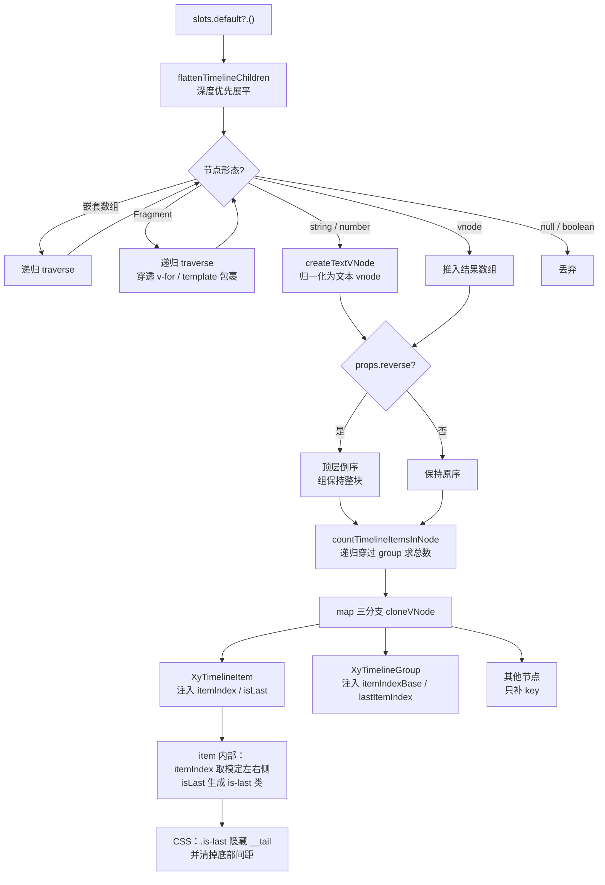
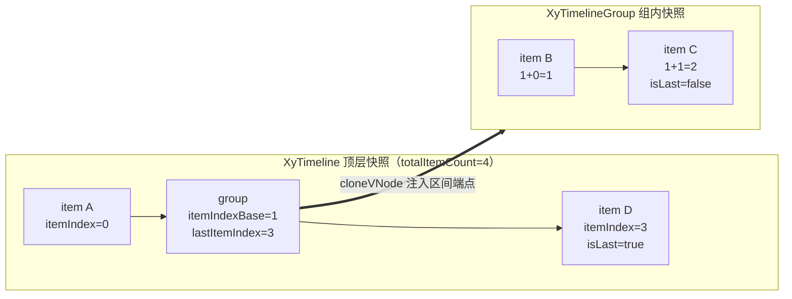

# 8-05 · Timeline：slot 扫描与 vnode 注入

8-04 的结尾留了一个交接问题：steps 的子项靠注册表点名，timeline 的子项却常常是模板里手写的 `xy-timeline-item` 列表——它怎么知道"最后一项"是谁、怎么往插槽渲染出来的 vnode 里注入上下文？这篇就来还这笔债。核心问题只有一个：**item/group 的"最后一项"判定**。看着小，背后牵出的是整个"列表型组件父子协作"的第二条路线——不走注册、不收实例，直接扫描 default slot 的 vnode 快照，再用 `cloneVNode` 把算好的位置信息塞回子节点。

先给体量一个直观感受：`packages/components/timeline/src/` 下六个文件，`timeline.ts` 115 行、`timeline-item.vue` 156 行、`timeline-group.vue` 103 行、`render.ts` 79 行，外加 `context.ts` 10 行和两个纯类型文件（`timeline-item.ts` 31 行、`timeline-group.ts` 5 行）；测试 `packages/components/timeline/__tests__/timeline.spec.ts` 590 行。四个实现文件里，`render.ts` 和 `timeline.ts` 的渲染函数几乎全是"扫描 + 计数 + 注入"这一件事。4-09 曾把 timeline-group 归为 group 模式里的"父渲染子"象限（当时引的是 `timeline-group.vue:38-45`），5-12 对照 carousel 引过 `render.ts:12-43`，5-07 又把它点名为 timeline 血统——这篇是这条血统的完整解剖。

## 一、问题的形状：为什么"最后一项"需要一套新兵器

### 1.1 EP 的答案是纯 CSS，但它的答案有前提

Element Plus 的 `el-timeline` 对"最后一项"的处理非常干脆：连线画在每个 item 上，最后一项的尾巴用一条 CSS 规则隐藏——`packages/theme-chalk/src/timeline.scss` 里写着 `.el-timeline-item:last-child .el-timeline-item__tail { display: none; }`。不需要 JS，不需要任何父子协作：浏览器自己知道谁是 `:last-child`。

但这条规则的成立有个隐含前提：**`xy-timeline` 的直接子元素里，最后一个必须恰好是 timeline-item**。`:last-child` 看的是 DOM 兄弟序列，不认识组件语义。只要 slot 里混进任何一个别的元素——一段说明文字、一个空态占位、一个普通的 `div`——它就会成为 `last-child`，而真正语义上的最后一项的尾巴就再也藏不掉了。

### 1.2 本库的前提被测试亲手打破

这个前提恰恰是本库不愿接受的。`packages/components/timeline/__tests__/timeline.spec.ts:215-242` 有一条专门的用例：

```ts
it("默认插槽中的非 TimelineItem 子内容仍可渲染", async () => {
  const wrapper = mount(XyTimeline, {
    props: {
      reverse: true
    },
    slots: {
      default: `
        <xy-timeline-item timestamp="2026-03-20">节点一</xy-timeline-item>
        <div class="extra-node">额外说明</div>
        <xy-timeline-item timestamp="2026-03-21">节点二</xy-timeline-item>
      `
    },
    global: {
      components: {
        XyTimelineItem
      }
    }
  });

  await nextTick();

  const childTexts = Array.from(wrapper.element.children).map((node) =>
    (node as Element).textContent?.replace(/\s+/g, " ").trim()
  );

  expect(wrapper.find(".extra-node").exists()).toBe(true);
  expect(childTexts).toEqual(["节点二2026-03-21", "额外说明", "节点一2026-03-20"]);
});
```

混入的非 item 元素要原样渲染、参与 reverse，同时语义上的"最后一项"判定完全不受它干扰——节点二的尾巴该藏就藏。一旦把这条需求写进测试，`:last-child` 就出局了：CSS 只认识 DOM 序，而这里要的是"只数 item 的序"。判定必须发生在 JS 侧，发生在**渲染函数拿到 vnode 快照之后、任何东西挂载之前**。

### 1.3 权衡一：注册模式 vs slot 扫描

第一条路线是注册模式，5-04（breadcrumb）、8-04（steps）、5-12（carousel）已经解剖过三遍：子组件 `onMounted` 时把 uid（或完整状态对象）登记进父的名册，父排序后派发 index，子再渲染。它的强项是**持久的、可反查的名册**——carousel 要靠它拿 DOM 句柄做几何计算，steps 要靠它算进度线。但它有两个 timeline 付不起的成本：

- **时序成本**。isLast 是"全局统计量"：最后一个注册者出现之前，谁都不知道自己是最后一个。注册模式下"最后一项"要么靠二次渲染收敛，要么靠 CSS 兜底——而 1.2 已经证明 CSS 兜底在本库不成立。扫描模式没有这个问题：渲染函数里 `slots.default?.()` 拿到的是**本次渲染的完整快照**，总数在第一个子组件挂载之前就同步算完了，isLast 在首次渲染就正确，零二次渲染、零闪烁。
- **结构成本**。注册要求每个子项都是"真的组件实例"，都要走完整的 setup → mount → unmount 生命周期。而 timeline 的 slot 里允许混入纯 div（1.2 的用例），纯 div 没有实例可注册。扫描模式对"是不是组件"完全无感——它只看 vnode。

代价同样真实，4-09 的四象限表里给"父渲染子"标注的风险是"父侵入子的渲染；子 vnode 结构变化（包层 wrapper）就要适配"。这句风险在 timeline 里落到实处，就是 2.2 要讲的 name 字符串匹配。5-12 的考据给过一句定论："timeline 的序数只影响'点在哪条线上、是不是最后一项'这类展示语义，渲染快照够了"——本篇把这个"够了"展开成完整论证：**同一类问题（列表父子），序数的杀伤力不同，方案就不同；timeline 的序数是纯展示语义，所以选了最轻的一次性快照方案。**

先看整条管线长什么样，后面逐段拆：



## 二、render.ts：79 行的扫描管线全解

`packages/components/timeline/src/render.ts` 全文 79 行，是这个组件库里最纯粹的"vnode 工具层"——不 import 任何业务组件，只跟 Vue 的 vnode 结构打交道。三个导出函数、两个内部函数，逐个看。

### 2.1 展平：flattenTimelineChildren（12-43）

```ts
export function flattenTimelineChildren(children?: VNodeArrayChildren) {
  const result: VNode[] = [];

  const traverse = (nodes?: VNodeArrayChildren) => {
    (nodes ?? []).forEach((child) => {
      if (Array.isArray(child)) {
        traverse(child);
        return;
      }

      if (typeof child === "string" || typeof child === "number") {
        result.push(createTextVNode(String(child)));
        return;
      }

      if (!isVNode(child)) {
        return;
      }

      if (child.type === Fragment && Array.isArray(child.children)) {
        traverse(child.children as VNodeArrayChildren);
        return;
      }

      result.push(child);
    });
  };

  traverse(children);

  return result;
}
```

这段代码（`render.ts:12-43`，5-12 已引过区间，本篇展开）干的事是把 default slot 的 children 处理成**一维 vnode 数组**。五种输入形态，五种去处：

- **嵌套数组**：递归。`h(Component, null, () => [a, [b, c]])` 这种手写嵌套不会丢节点。
- **string / number**：归一化。注意这不是"过滤"，是**包装**——裸字符串没法挂 key，先用 `createTextVNode` 变成正经 vnode，后面的 cloneVNode 补 key 才有对象可挂（3.1 的 `timeline-item-${index}` 才落得下去）。
- **null / boolean / undefined**：`!isVNode(child)` 丢弃。这是整个 traverse 里唯一的"过滤"动作，而且过滤的是"无效 vnode"，不是文本。
- **Fragment**：递归穿透。这一步是给模板用户准备的：`<template v-for>`、`v-if` 包裹、或者组件模板里天然产生的 Fragment，都会被拆开，里面的 item 直接进入平铺序列。
- **其余 vnode**：原样推入。

有一个叙述上的常见误会必须在这里纠正：**这个函数不过滤注释节点，也不过滤文本节点**。注释 vnode（`type === Comment`）和编译器产出的文本 vnode 都是正经 vnode，走的是最后一个分支被原样推入。真实的"过滤"发生在管线的更上游——模板编译器默认开启 whitespace 压缩，元素之间的纯空白文本节点在编译期就被摘掉了；注释节点默认只在开发构建保留、生产构建直接丢弃（编译器 `comments` 选项的默认值跟 `__DEV__` 走）。所以运行时管线里见不到它们，不是因为这里滤掉了，而是因为它们根本没被造出来。这是个很健康的分层：编译期能解决的问题不挪到运行时，`render.ts` 就不需要为"页面注释"这种不属于自己的问题写一行代码。

### 2.2 身份判定：按 name 字符串点名

```ts
function getComponentName(node: VNode) {
  if (typeof node.type === "object" && node.type !== null) {
    return (node.type as { name?: string }).name ?? "";
  }

  return "";
}

export function isTimelineItemVNode(node: VNode) {
  return getComponentName(node) === "XyTimelineItem";
}

export function isTimelineGroupVNode(node: VNode) {
  return getComponentName(node) === "XyTimelineGroup";
}
```

`render.ts:4-10` 的 `getComponentName` 只处理 `typeof node.type === "object"` 的情形——有状态组件（SFC / `defineComponent`）的 type 是组件选项对象，`name` 就挂在对象上。两个判定函数（`render.ts:45-51`）于是成了两行字符串比较。

这里有一个刻意的取舍值得单独拎出来：**为什么比 name 字符串，而不是比对组件对象同一性**（比如 `node.type === XyTimelineItem`）？对象同一性看起来更"类型安全"，但它惧怕两种真实场景：一是双拷贝安装——用户同时引入了两个版本的包，模板里解析到的组件对象和扫描时 import 到的不是同一个引用，同一性判定直接漏判；二是 HMR 热替换后组件对象被重建。name 字符串对这些结构性变化免疫。它的弱点也直白：4-09 预言的"包层 wrapper 就要适配"在这里应验——用户若写一个 `function MyItem() { return h(XyTimelineItem, ...) }` 这样的函数式包装，`node.type` 是函数而不是对象，`getComponentName` 返回空串，包装层内的 item 就不会被注入序号（组内的 isLast 会失灵）。这是"扫描系"的固有税：**扫描认的是"形态签名"，不认"血统"**。注册模式靠实例身份（uid）就没有这个问题，因为注册发生在实例内部、不依赖外部形态。两头都占是不存在的，库的选择依据是使用概率：模板里直写 `xy-timeline-item` 是压倒性主流（文档示例 `apps/docs/examples/timeline/basic.vue:30-49` 全是这么写的），函数式包装是长尾。

### 2.3 组内计数：resolveTimelineGroupSlot 与 countTimelineItemsInNode

```ts
function resolveTimelineGroupSlot(node: VNode) {
  if (!node.children || typeof node.children !== "object" || Array.isArray(node.children)) {
    return [];
  }

  const slot = (node.children as { default?: Slot }).default;

  if (typeof slot !== "function") {
    return [];
  }

  return flattenTimelineChildren(slot());
}

export function countTimelineItemsInNode(node: VNode): number {
  if (isTimelineItemVNode(node)) {
    return 1;
  }

  if (isTimelineGroupVNode(node)) {
    return resolveTimelineGroupSlot(node).reduce((count, child) => {
      return count + countTimelineItemsInNode(child);
    }, 0);
  }

  return 0;
}
```

`resolveTimelineGroupSlot`（`render.ts:53-65`）从 group 的 vnode 上"抠"出它的 default slot 并再次展平。组件 vnode 的 `children` 字段装的就是插槽对象——模板编译产物是 `{ default: () => [...] }`，`h(Group, null, () => [...])` 的函数式 children 会被 Vue 的 `normalizeChildren` 归一化成 `{ default, _ctx }` 对象（这是本篇成文时用仓库内的 Vue 3 实际跑过的：两种写法落到 vnode 上的 children 形态完全一致），两种写法都能被 `typeof === "object"` 的守卫接住。守卫里的 `Array.isArray` 排除法在 2.4 会再出现一次。

`countTimelineItemsInNode`（`render.ts:67-79`）是一个漂亮的**互递归**：item 计 1，group 打开自己的 slot 递归数，其他计 0。它回答的问题是"这个节点背后**语义上**站着几个 item"——注意 group 自己不算 1，它是个容器；混入的 div 也不算，它不是 item。这个计数是 isLast 判定的分子分母。

### 2.4 一个实测边界：数组形态 children 的计数盲区

上面的守卫 `Array.isArray(node.children)` 在正常路径下是防御性的，但它恰好挡住了一种真实写法：`h(XyTimelineGroup, null, [h(XyTimelineItem, ...)])`——**数组形态**的 children（既不是函数也不是插槽对象）。用仓库内 Vue 实测：这种写法落到 vnode 上的 children 保持数组原样（Vue 不会替组件 vnode 把数组 children 归一化成插槽对象），于是守卫命中、返回空数组、计数为 0。后果是：这个 group 的 itemIndexBase 会从 0 重新起算、组内 item 的 isLast 全部为 false（尾巴藏不掉）。渲染本身不受影响——组件实例初始化插槽时会把数组 children 转成 default slot，所以 item 照常显示，只是**序号系统失明**。

这不是理论风险堆积：模板写法（slot 对象）和 `h(..., () => [...])` / `h(..., { default: () => [...] })` 都安全，唯独裸数组形式会踩中。本篇把它标注为已知边界而不是缺陷——测试与文档示例均未使用该形态，但读源码时值得知道守卫不是白写的，它挡掉的东西里有一类是"挡住之后系统静默降级"的。

## 三、timeline.ts：一次渲染完成点数与注入

### 3.1 渲染管线（41-87）

现在看主管道。`packages/components/timeline/src/timeline.ts:41-87`：

```ts
setup(props, { attrs, slots }) {
  const ns = useNamespace("timeline");
  const mode = computed(() => props.mode);
  const density = computed(() => props.density);

  provide(timelineContextKey, {
    mode,
    density
  });

  return () => {
    const flattened = flattenTimelineChildren(slots.default?.());
    const orderedChildren = props.reverse ? [...flattened].reverse() : flattened;
    const totalItemCount = orderedChildren.reduce((count, node) => {
      return count + countTimelineItemsInNode(node);
    }, 0);
    let itemIndex = 0;

    const children = orderedChildren.map((node, nodeIndex) => {
      if (isTimelineItemVNode(node)) {
        const currentItemIndex = itemIndex;

        itemIndex += 1;

        return cloneVNode(node, {
          itemIndex: currentItemIndex,
          isLast: currentItemIndex === totalItemCount - 1,
          key: node.key ?? `timeline-item-${currentItemIndex}`
        });
      }

      if (isTimelineGroupVNode(node)) {
        const itemIndexBase = itemIndex;

        itemIndex += countTimelineItemsInNode(node);

        return cloneVNode(node, {
          itemIndexBase,
          lastItemIndex: totalItemCount - 1,
          key: node.key ?? `timeline-group-${nodeIndex}`
        });
      }

      return cloneVNode(node, {
        key: node.key ?? `timeline-child-${nodeIndex}`
      });
    });
```

逐行拆解这条管线（`timeline.ts:52-87`）：

**第一步，展平**（52 行）。slot 快照进 `flattenTimelineChildren`，出来一维数组。

**第二步，反转**（53 行）。`props.reverse` 时 `[...flattened].reverse()`。这里有个看似多余、实则克制的拷贝：`flattened` 本身就是每次渲染新建的数组，直接原地 reverse 也没有副作用——但那样会把"展平函数的返回值可以随便改"变成一个隐式契约，哪天 `flattenTimelineChildren` 加了缓存，原地 reverse 就变成 bug。一层浅拷贝买一个"不依赖上游实现细节"的保险。更重要的是反转的**粒度**：只反顶层，group 作为整块参与反转、组内顺序不动。`timeline.spec.ts:244-279` 的用例专门锁这个语义——单独节点、一个组、一个普通 div 三者顶层反转，组内"节点一、节点二"顺序原样。

**第三步，点数**（54-56 行）。对反转后的序列逐节点求 `countTimelineItemsInNode`，得到 `totalItemCount`。注意顺序：先反转、后点数——两者其实可以交换（求和与顺序无关），但先反转保证了"序数语义"和"视觉顺序"用的是同一个序列，alternate 模式的奇偶编号才和屏幕上的左右一致。

**第四步，注入**（59-87 行）。一个 `map` 三分支，全部用 `cloneVNode` 收尾：

- **item 分支**：领取全局递增的 `itemIndex`，注入 `isLast: currentItemIndex === totalItemCount - 1`。这就是全篇的核心一行——"最后一项"判定在这里完成，一次渲染、同步完成。
- **group 分支**：注入的是**区间端点**而不是逐个序号——`itemIndexBase` 是本组第一项的全局序号，`lastItemIndex` 直接把全局最后一项的序号传进去，组内自己展开（4.1 详述）。
- **其他分支**：只补 key，什么都不注入。混入的 div 不需要序号，父组件也不假装它需要。

**关于 key 的兜底**。`node.key ?? ...` 的顺序是"用户 key 优先"：模板里 `v-for` 写的 `:key` 原样保留，没有 key 的节点才用序号兜底。这个兜底不是为了好看——`cloneVNode` 产出的子列表要交给 Vue 的 diff，带稳定 key 的列表在 reverse 切换时走"移动"而不是"重建"，item 内部状态（比如用户写在 item 里的浮层开关）不会因反转而丢。

### 3.2 权衡二：vnode 注入 vs provide——本库的真实答案是混合制

把 3.1 的代码读细一点会发现一个有意思的事实：**timeline 并不是"只用 vnode 注入"**。`timeline.ts:46-49` 明明白白写着 `provide(timelineContextKey, { mode, density })`，`context.ts:4-9` 定义了这份上下文：

```ts
export interface TimelineContext {
  mode: ComputedRef<TimelineMode>;
  density: ComputedRef<TimelineDensity>;
}

export const timelineContextKey: InjectionKey<TimelineContext> = Symbol("xiaoye-timeline");
```

所以正确的表述是：**环境量走 provide，位置量走注入**。mode（start/alternate/...）和 density（default/compact）是"无论你是第几个、你都该知道"的属性——它们与位置无关，天然属于上下文注入；而且 item 还要支持脱离 timeline 单独使用（测试里大量 `mount(XyTimelineItem, ...)`），`timeline-item.vue:38-39` 用 `timelineContext?.mode.value ?? "start"` 优雅降级，这是 provide/inject 的经典双模结构（5-04 讲过的"有父则受管，无父则自治"）。

而 itemIndex / isLast 是"你**必须**知道自己是第几个、总共几个"的属性。为什么这两类不能都走 provide？因为 provide 表达的是**共享状态的引用**，不表达**坐标**。理论上可以设计一个"provide 一个计数器、每个 item 在 setup 里领取下一个号"的方案，但拆开看全是洞：领号发生在 setup 同步期，条件渲染的 item 会被跳过（号断档，alternate 的奇偶全错）；更要命的是 isLast——没有一个子项在别的子项 setup 之前知道总数，除非等所有兄弟挂载完再二次广播。而扫描注入是在父的渲染函数里对着**完整快照**算的：总数先知、序号顺发、一次渲染收敛。这就是两条技术路线的分水岭：**provide 给"引用"，注入给"坐标"；坐标这种一次性的、可从快照推导的信息，不值得为它建一套持久的通信协议。**

反过来的问题也要问：为什么 mode/density 不走注入、跟着 cloneVNode 一起塞？因为那样会把父组件和子组件的**渲染深度**绑死——注入只发生在父的直接 children 层（item）和一层 group 展开层，如果 item 里面还有自己的子组件需要感知 mode（比如嵌套在 item 里的什么东西），cloneVNode 够不到；provide 沿组件树无限下潜，还不怕用户包层 wrapper（2.2 说的 name 匹配税，provide 没有）。两类信息各走各的协议，恰好是两种机制优点的正交使用。

### 3.3 inheritAttrs 的手工拆合

`timeline.ts:26` 声明 `inheritAttrs: false`，渲染收尾处（`timeline.ts:89-111`）手工拆合：

```ts
const nativeAttrs = {
  ...attrs
};

delete nativeAttrs.class;
delete nativeAttrs.style;

return h(
  "div",
  {
    ...nativeAttrs,
    class: [
      ns.base.value,
      `${ns.base.value}--${props.mode}`,
      `${ns.base.value}--${props.density}`,
      ns.is("reverse", props.reverse),
      attrs.class
    ],
    style: attrs.style,
    role: "list"
  },
  children
);
```

class 和 style 从 attrs 里摘出来、排到自家 class 数组末尾合并，其余属性（事件监听、aria、id、data-*）整体透传到根 div。为什么多此一举？因为 `inheritAttrs: false` 之下一切归自己管，而 `class: [自家类, attrs.class]` 这种写法保证用户的类永远排在自家类之后——覆盖优先级由数组顺序兜底，且不需要深度合并逻辑。同时根节点带着 `role: "list"`，与 item 的 `role: "listitem"`（`timeline-item.vue:100`）配对，列表语义走原生 ARIA。这类"拆合"在浮层系组件里常见（要把 attrs 转给浮层而不是根节点），timeline 这里是最简单的版本：全留根上，只重排 class。

## 四、跨组连续编号：itemIndexBase 的接力

### 4.1 group 的注入映射

顶层把 group 当成"一个占 N 个序号的黑盒"，黑盒内部怎么展开？看 `packages/components/timeline/src/timeline-group.vue:44-66`——4-09 引过的 38-45 行（`useSlots`、inject context、density、`return () =>` 起手）之后的正文：

```ts
return () => {
  const flattened = flattenTimelineChildren(slots.default?.());
  const itemIndexBase = props.itemIndexBase ?? 0;
  const lastItemIndex = props.lastItemIndex ?? -1;
  let itemIndex = 0;

  const children = flattened.map((node, nodeIndex) => {
    if (!isTimelineItemVNode(node)) {
      return cloneVNode(node, {
        key: node.key ?? `timeline-group-child-${nodeIndex}`
      });
    }

    const currentItemIndex = itemIndexBase + itemIndex;

    itemIndex += 1;

    return cloneVNode(node, {
      itemIndex: currentItemIndex,
      isLast: currentItemIndex === lastItemIndex,
      key: node.key ?? `timeline-group-item-${currentItemIndex}`
    });
  });
```

结构上和顶层如出一辙：展平、map、三分支。区别只在序号的**算法**：顶层是"领取全局自增号"，组内是"基址 + 组内偏移"——`currentItemIndex = itemIndexBase + itemIndex`，而 `isLast` 直接和顶层传下来的 `lastItemIndex` 比对。顶层对 group 分支注入的 `lastItemIndex: totalItemCount - 1`（`timeline.ts:79`）把全局最后一项的序号原样送达，组内最后一个 item 拿它一比便知。**这就是接力**：父算不出"组内谁是最后"，子算不出"全局总共有几项"，于是父传区间端点、子做局部加法，信息在两级渲染函数之间正好够用，不多传一个字节。

### 4.2 alternate 跨组测试的坐标演算

这套接力对不对，`timeline.spec.ts:281-315` 用 alternate 模式做了一次精确到序号的验收：

```ts
it("alternate 模式在跨组时保持连续编号", async () => {
  const wrapper = mount(XyTimeline, {
    props: {
      mode: "alternate"
    },
    slots: {
      default: `
        <xy-timeline-item>节点 A</xy-timeline-item>
        <xy-timeline-group title="第二组">
          <xy-timeline-item>节点 B</xy-timeline-item>
          <xy-timeline-item>节点 C</xy-timeline-item>
        </xy-timeline-group>
        <xy-timeline-item>节点 D</xy-timeline-item>
      `
    },
    global: {
      components: {
        XyTimelineGroup,
        XyTimelineItem
      }
    }
  });

  await nextTick();

  const sideClasses = wrapper.findAll(".xy-timeline-item").map((node) => {
    if (node.classes().includes("xy-timeline-item--side-start")) {
      return "start";
    }

    return "end";
  });

  expect(sideClasses).toEqual(["start", "end", "start", "end"]);
});
```

把坐标算一遍：A 领全局 0；group 占区间 [1, 2]（base=1），组内 B=1+0=1、C=1+1=2；D 领全局 3。item 的 side 由 `itemIndex % 2` 决定（`timeline-item.vue:59-71`），0/1/2/3 → start/end/start/end——**编号线性贯穿组边界**，这就是"跨组连续编号"的全部含义。假如 group 的计数有半点偏差（比如 2.4 的数组 children 盲区），这个奇偶序列立刻错乱成 start/end/start/start 之类，测试直接爆。



### 4.3 权衡三：一层注入的设计边界

接力方案的适用半径有多大？看 `timeline-group.vue:50-55` 对非 item 分支的处理：只补 key，**什么都不注入**。嵌套在 group 里的又一个 group，会被当成"其他节点"跳过——它的 `itemIndexBase` 落回 prop 默认值 0，`lastItemIndex` 落回 -1，组内 item 的 `isLast` 判定 `currentItemIndex === -1` 永远为假，尾巴全部藏不掉。也就是说，**注入链只铺了两层**（timeline → item，timeline → group → item），第三层（group → group → item）是断的。

诚实地说这是一条设计边界而不是疏漏：支持任意深度嵌套需要把"区间端点"改成"沿树下传的游标协议"，复杂度上了一个台阶，而文档示例（`apps/docs/examples/timeline/grouped.vue` 的两段式分组）和全部 590 行测试都只覆盖单层分组。timeline-group 的 props 接口（`timeline-group.ts:1-5`，只有 title/description/divider 三个公开 prop）也从未把嵌套用法写进契约。这个权衡的判断依据还是 1.3 那句话——序数服务于展示语义，展示语义没出现的场景不为它建协议。值得记入"使用须知"的倒是 2.4 那条：嵌套 group 是**显式选择不支持**，数组 children 是**静默降级**，后者的危害大于前者。

## 五、注入的落地：item 把序号变成类名与连线

### 5.1 注入的 props 如何声明、如何消费

回到子组件侧。父注入的 `itemIndex` / `isLast` 要能被 `cloneVNode` 塞进去，必须先被声明为 props——`timeline-item.vue:14-32`：

```ts
interface TimelineItemInternalProps extends TimelineItemProps {
  itemIndex?: number;
  isLast?: boolean;
}

const props = withDefaults(defineProps<TimelineItemInternalProps>(), {
  timestamp: "",
  hideTimestamp: false,
  center: false,
  placement: "bottom",
  type: "",
  color: "",
  size: "normal",
  icon: "",
  hollow: false,
  state: "default",
  itemIndex: 0,
  isLast: false
});
```

注意这个**内部接口**的设计：`TimelineItemInternalProps extends TimelineItemProps`，把 `itemIndex` / `isLast` 挂在扩展接口里而不是公开的 `TimelineItemProps`（`timeline-item.ts:20-31`，只含 timestamp/hideTimestamp/center/placement/type/color/size/icon/hollow/state 十个公开 prop）上。公开类型层（`packages/components/timeline/index.ts:16-26` 导出的也确实是 `TimelineItemProps`）从不宣传这两个 prop——它们是父组件与子组件之间的**私有协议**，走的是 Vue 的 props 管道（所以 cloneVNode 注入的是 props 而不是 attrs），但对使用者的类型提示里不可见。默认值兜底（`itemIndex: 0, isLast: false`）则保证了脱离父组件单独使用时永远成立。

注入的消费端是两个 computed。第一个，rootKls（`timeline-item.vue:73-87`）：

```ts
const rootKls = computed(() => [
  ns.base.value,
  `${ns.base.value}--${props.type || "neutral"}`,
  `${ns.base.value}--${props.size}`,
  `${ns.base.value}--${currentDensity.value}`,
  `${ns.base.value}--${currentMode.value}`,
  `${ns.base.value}--side-${side.value}`,
  `${ns.base.value}--placement-${props.placement}`,
  `${ns.base.value}--state-${props.state}`,
  ns.is("headerless", !hasHeader.value),
  ns.is("center", props.center),
  ns.is("hollow", isHollowNode.value),
  ns.is("last", props.isLast),
  ns.is("custom-dot", hasDotSlot.value)
]);
```

`ns.is("last", props.isLast)` 就是"最后一项"判定的最终落点——注入的布尔量变成 `is-last` 类名。第二个，side（`timeline-item.vue:59-71`）：alternate 模式下偶数序在 start 侧、alternate-reverse 模式下偶数序在 end 侧，**"is 第奇/偶数个"的语义在这里由 item 自己派生**，父组件只递一个序号，不递"is 第奇数个"这种派生结论——派生规则属于 item 自己的展示策略，父不越权。

### 5.2 CSS：连线隐藏与流程态

`packages/theme/src/components/timeline.css` 里，注入最终改写的只有两处，但这两处是整个"时间轴"视觉的收口。先是 item 的三栏网格与连线本体（`timeline.css:88-116` 的网格与 is-last、`timeline.css:146-158` 的 tail 与隐藏）：

```css
.xy-timeline-item {
  --xy-timeline-node-size: 14px;
  --xy-timeline-tail-color: color-mix(
    in srgb,
    var(--xy-border-subtle) 76%,
    var(--xy-bg-subtle)
  );
  --xy-timeline-node-color: var(--xy-text-secondary);
  position: relative;
  display: grid;
  grid-template-columns: minmax(0, 1fr) var(--xy-timeline-center-width) minmax(0, 1fr);
  column-gap: var(--xy-timeline-side-gap);
  min-width: 0;
  padding-bottom: var(--xy-timeline-item-gap);
}

.xy-timeline-item--start {
  grid-template-columns: var(--xy-timeline-center-width) minmax(0, 1fr);
  column-gap: max(10px, calc(var(--xy-timeline-side-gap) - 4px));
}

.xy-timeline-item--end {
  grid-template-columns: minmax(0, 1fr) var(--xy-timeline-center-width);
  column-gap: max(10px, calc(var(--xy-timeline-side-gap) - 4px));
}

.xy-timeline-item.is-last {
  padding-bottom: 0;
}

.xy-timeline-item__tail {
  position: absolute;
  top: calc(var(--xy-timeline-node-size) / 2 + 6px);
  bottom: 0;
  left: 50%;
  width: 2px;
  transform: translateX(-50%);
  background: var(--xy-timeline-tail-color);
}

.xy-timeline-item.is-last .xy-timeline-item__tail {
  display: none;
}
```

每个 item 画一段绝对定位的 2px 连线（`__tail`），从节点中心往下顶到自身底部；相邻 item 的线段首尾相接，视觉上连成一条轴。`.is-last` 做两件事：`display: none` 掐掉最后一段线，`padding-bottom: 0` 掐掉最后一个 item 的底部留白——只藏线不收间距，容器底部会多出一段无意义的空白，这两条规则必须成对。对照 1.1 的 EP：同样的收口，EP 用 `:last-child` 选择器在 CSS 层解决，本库用 `is-last` 类在 JS 判定后解决——**选择器从"DOM 兄弟"换成了"语义序数"**，换来的是 1.2 那个混入测试可以成立。

type 色板与流程态则全部经由 CSS 变量管线（`timeline.css:126-144, 228-234, 251-257`）：`--primary/--success/--warning/--danger` 五个修饰类各自覆写 `--xy-timeline-node-color`，`state="current"` 的节点放大一圈加双环阴影，`state="pending"` 的尾巴换成 `repeating-linear-gradient` 虚线。移动端断点（`timeline.css:441-474`）把 alternate 布局整体压回单侧两栏——中轴布局在窄屏上没有生存空间。

### 5.3 timestamp/type/color 的归属澄清

规格书里常把"timestamp/type/color 的 props 下发"和"最后一项判定"并列表述，落到源码上必须拆清楚：**这三者不是父组件下发的**。它们是使用者在 `xy-timeline-item` 上直接声明的 props（`tests/types/fixtures/timeline.ts:36-47` 的夹具把十个公开 prop 一次配齐），流向是"用户 → item 自身的 class 与 CSS 变量"：type 变修饰类（`timeline-item.vue:75`）、color 变内联 CSS 变量（`timeline-item.vue:89-94` 的 `rootStyle`，测试 `timeline.spec.ts:463-474` 验证 `--xy-timeline-node-color: #0ea5e9` 确实落到 style 属性上）、timestamp 只决定渲染哪一种时间戳布局（`timeline-item.vue:42-50` 的 center/inline 分流与 `placement` 的上下位置）。父组件对这些一无所知，也不需要知道。真正由父下发的只有四个：item 拿 `itemIndex` / `isLast`，group 拿 `itemIndexBase` / `lastItemIndex`。一句话总结这条边界：**外观属性自己声明、位置属性父算好塞给你**。

## 六、测试与类型夹具如何锁住这条管线

590 行测试里，和扫描注入直接相关的断言分三层。

第一层是行为层：1.2 的混入用例、3.1 的两个 reverse 用例（`timeline.spec.ts:173-213`，模板字符串与 `h()` 手写两种形态都验）、4.2 的跨组编号。它们锁定的是"判定结果"。

第二层是样式契约层。测试文件开头（`timeline.spec.ts:17-19`）把 CSS 源码整个读进来当断言对象：

```ts
const timelineCssText = normalizeCssValue(
  readFileSync(resolve(process.cwd(), "packages/theme/src/components/timeline.css"), "utf8")
);
```

于是 `timeline.spec.ts:67-77` 可以断言"start 模式必须是左侧两栏网格"、`timeline.spec.ts:317-328` 断言"alternate 必须保留三栏中轴"——**类名到布局的映射被钉进测试**。这层防的是另一种回归：JS 注入一切正常、类名都挂对了，但 CSS 改版把三栏改没了，行为测试全绿而视觉崩塌。读文件而非挂载后取 computed style，换来的是断言可以精确到选择器与属性级别，且不依赖 jsdom 的布局实现（jsdom 不算 grid 布局）。

第三层是类型层。`tests/types/fixtures/timeline.ts:53-92` 用 `h()` 把 Group / Item 组合出与文档一致的嵌套结构（同时验了 `XyTimeline.Item` 静态挂载，对应 `packages/components/timeline/index.ts:35-43` 的 `XyTimeline.Group = XyTimelineGroup`），`tests/types/fixtures/timeline.ts:96-129` 用五个 `@ts-expect-error` 把非法 mode / density / type / placement / state 全部钉死。类型夹具对"注入 prop"只字未提——`TimelineItemProps` 里没有 itemIndex/isLast，这正是 5.1 说的私有协议不进公开类型。

文档侧的形态与测试互相印证：`apps/docs/examples/timeline/basic.vue:30-49` 是最典型的模板直写形态（`v-for` 出 item、结构化插槽补 title/meta），`grouped.vue:75-100` 则是 group + mode/reverse 联动开关的完整形态。库对"模板手写列表"的支持度，从示例到测试到实现是同一条主线。

## 七、权衡总账与 EP 对照

| 维度 | Element Plus `el-timeline` | 本库 `xy-timeline` |
| --- | --- | --- |
| 最后一项判定 | `.el-timeline-item:last-child .el-timeline-item__tail { display: none }`，纯 CSS | JS 扫描计数，`cloneVNode` 注入 `isLast`，类名 `is-last` |
| 混入非 item 子元素 | 语义最后一项的尾巴藏不掉 | 显式支持（`timeline.spec.ts:215-242`），判定只数 item |
| 子项身份 | 不需要（无协作） | name 字符串匹配（`render.ts:45-51`），包装层会失明 |
| 分组 | 无 | `xy-timeline-group`，区间端点接力，跨组连续编号 |
| 反转 | 无 | `reverse` 顶层反转，组保持整块 |
| mode 布局 | 无（单侧） | start / alternate / alternate-reverse / end 四模式 + compact 密度 |
| 上下文 | 无 | mode/density 走 provide，序号走注入，混合制 |

把全篇的四个权衡收拢成一句话各自的版本：

1. **扫描 vs 注册**：位置信息是展示语义时，扫描快照一次收敛；需要持久名册（几何、DOM 句柄）时才上注册。timeline 选扫描，carousel 选注册，5-12 的判断在本篇得到完整论证。
2. **vnode 注入 vs provide**：不是二选一。环境量（mode/density）走 provide 沿树下潜，位置量（itemIndex/isLast）走注入一次发牌——两种机制的适用面正交。
3. **最后一项判定**：`:last-child` 只认 DOM 序；语义序数判定必须回到 JS。判定的时机（渲染快照期）比判定的实现（cloneVNode）更关键——它决定了首渲染是否正确。
4. **name 匹配 vs 对象匹配**：字符串点名对双拷贝、HMR 免疫，但函数式包装层会失明。选它的理由是主流用法（模板直写）的覆盖率，不是技术全面性。

## 结语

回到 8-04 留下的那个问题："注册模式解决不了的问题，slot 扫描来补位"——现在可以给出更精确的版本了。不是"解决不了"，而是**不值得**：timeline 的序数只服务展示语义，为它建注册表、付二次渲染的代价，是用重武器打轻目标。slot 扫描把"父子协作"压缩进了父组件一次渲染函数的执行过程里：展平、点数、注入，三步全在 vnode 层面完成，子组件甚至不知道自己被编号过（它只是恰好声明了两个内部 prop）。代价同样清楚——扫描认形态不认血统，注入链只铺两层，这些边界都被源码诚实地留在原地。

序列组件的两条子项路线至此合流完毕：注册系（breadcrumb / steps / carousel）管"要协作的列表"，扫描系（timeline）管"只要点名的列表"。数据展示卷接下来的位置，要交给一个完全不同的物种——`xy-scheduler`，排期日历。它的网格引擎、拖拽命中、事件布局算法，全仓库没有一篇再"逻辑全在自己手里"：**8-06《Scheduler：fullcalendar 集成》**将打开数据展示卷的第一个外包样本——把日历引擎外包给 FullCalendar v6，自己只画边界：第三方实例的生命周期谁管、props 怎么映射成库的 options、库的回调怎么变回 Vue 事件、fullcalendar 的默认样式怎么融入自家令牌体系。从"自己写引擎"到"给引擎画边界"，封装的哲学要换一套了。

---

*本篇代码引用核对于当前工作区实态：`packages/components/timeline/src/render.ts`（79 行；getComponentName L4-10、flattenTimelineChildren L12-43、isTimelineItemVNode L45-47、isTimelineGroupVNode L49-51、resolveTimelineGroupSlot L53-65、countTimelineItemsInNode L67-79）、`timeline.ts`（115 行；modes/densities L12-13、inheritAttrs L26、provide L46-49、渲染管线 L52-87、attrs 拆合 L89-111）、`timeline-group.vue`（103 行；setup 起手 L37-45（4-09 引 L38-45）、注入映射 L44-66、非 item 分支 L50-55、section 渲染 L73-99）、`timeline-item.vue`（156 行；defineOptions L2-4、内部接口 L14-17、withDefaults L19-32、inject L36-39、center 分流 L42-50、side L59-71、rootKls L73-87、rootStyle L89-94、模板根 L100-112）、`context.ts`（10 行）、`timeline-item.ts`（31 行；公开 props L20-31）、`timeline-group.ts`（5 行）、`index.ts`（45 行；Group/Item 挂载 L35-43）、`packages/theme/src/components/timeline.css`（489 行；item 网格 L88-102、start/end 两栏 L104-112、is-last L114-116 与 L156-158、type 色板 L126-144、tail L146-154 与 L160-166、current L228-234、pending L251-257、移动端 L441-474）、`packages/components/timeline/__tests__/timeline.spec.ts`（590 行；CSS 读取 L17-19、混入 L215-242、reverse+group L244-279、跨组编号 L281-315、三栏断言 L317-328、color 变量 L463-474）、`tests/types/fixtures/timeline.ts`（130 行；h 组合 L53-92、非法 props L96-129）、`apps/docs/examples/timeline/basic.vue`（L30-49）、`grouped.vue`（L75-100）、`packages/components/component-manifest.json`（timeline 条目 L555）。EP 对照依据 element-plus 仓库 theme-chalk/src/timeline.scss 的 `:last-child` 隐藏规则（dev 分支，线上核实）。*
