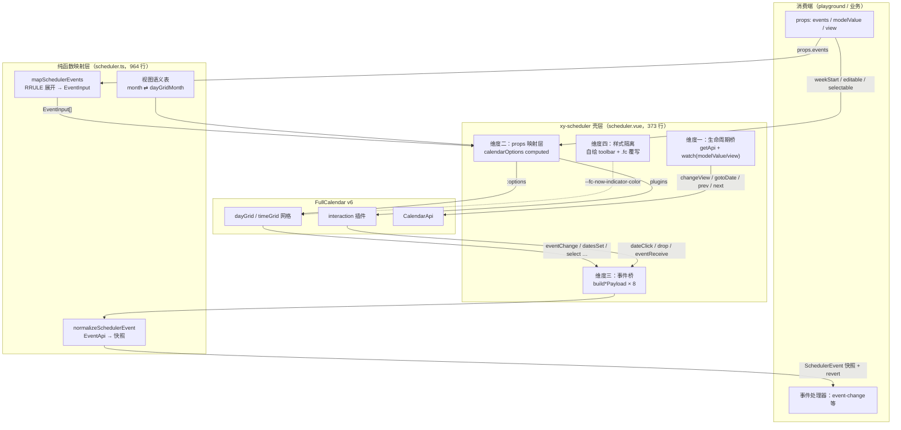
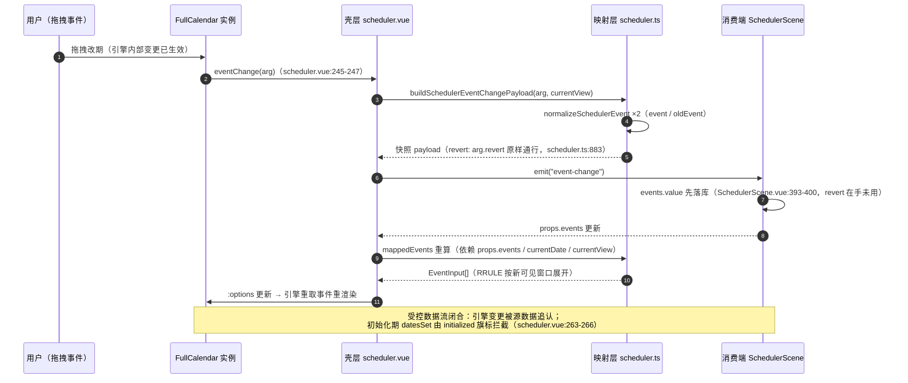

# 8-06 · Scheduler：fullcalendar 集成

数据展示卷写到第六篇，第一次遇到一个绕不开的问题：**第三方库的组件化封装边界**。前五篇的 statistic、countdown、progress、steps、timeline，核心逻辑都在自己手里——SVG 是自己画的，定时器是自己管的，时间引擎是自己写的。而 scheduler（排期日历）不一样：日历网格、拖拽命中、事件布局算法、跨日事件跨越渲染，这些是 years of engineering 的硬骨头，自研不现实，也没有必要。于是 `xy-scheduler` 做了一个全仓库最重的"二次封装"决定：把网格引擎外包给 FullCalendar v6，自己只做壳。

这带来一串必须回答的问题——第三方实例的生命周期谁管？props 怎么变成库的 options？库的回调怎么变回 Vue 的事件？库的默认样式怎么融入自己的令牌体系？边界划在哪里，决定了这个组件日后是"可维护的外包"还是"失控的缝合"。

同族的两个伙伴把这个问题逼得更清楚：按系列规划，8-12 的 audio-player 外包音频引擎给 howler，8-13 的 video-player 外包播放器内核给 video.js——它们仨是数据展示卷里的"第三方封装"三兄弟。本篇借 scheduler 把**封装边界的四维框架**立起来：生命周期桥、props 映射层、事件桥、样式隔离。后两篇会直接复用这套框架，看同一族组件在四个维度上做出了哪些不同的选择。

先给体量一个直观感受：`packages/components/scheduler/src/scheduler.ts` 964 行，`scheduler.vue` 373 行，加起来 1337 行——是全仓库最大的基础组件之一。但读下去会发现一个反直觉的事实：真正"封装 fullcalendar"的代码只有 scheduler.vue 的三百多行，而且其中没有一行碰 Calendar 构造器，没有一行写挂载销毁。964 行的 scheduler.ts 几乎全是**纯函数映射层**。这个比例本身就是答案的一半。

## 一、选型题：EP 没有的那一块拼图

先说结论成立的背景。Element Plus 的表单、反馈、数据展示各卷都有可对标物，唯独"排期/调度日历"是空白的：EP 的 `el-calendar` 只是一个月历面板——展示某月日期网格、提供 `date-cell` 插槽让你往格子里塞自定义内容，没有时间轴视图、没有事件模型、没有拖拽改期。要在 Vue 生态里做"会议编排、值班表、日程面板"这类产品，社区的现实选项大致三条：

1. **直接用 `@fullcalendar/vue3`**：官方 Vue3 适配器直接暴露 `<FullCalendar :options>`，能力完整，但 options 面一百多个、类型直接漏出 FullCalendar 领域模型（`EventApi`、`CalendarOptions`）、默认样式与自家设计体系割裂、工具栏文案和视图语义全是库的词汇；
2. **自研网格**：布局算法（跨日事件怎么摆、撞车怎么折叠、`dayMaxEvents` 怎么截断）是纯粹的深水区，投入产出比极差；
3. **包装 fullcalendar，但封住它的面**：引擎外包，边界自己画。

本库选了第三条，并且把选择写进了依赖治理：`packages/components/package.json` 的 dependencies 块（53-59 行）显式声明五个 `@fullcalendar/*` 包——

```json
  "dependencies": {
    "@floating-ui/dom": "^1.6.13",
    "@fullcalendar/core": "^6.1.20",
    "@fullcalendar/daygrid": "^6.1.20",
    "@fullcalendar/interaction": "^6.1.20",
    "@fullcalendar/timegrid": "^6.1.20",
    "@fullcalendar/vue3": "^6.1.20",
    "@iconify/vue": "^5.0.0",
```

三个事实值得逐一拆开。**其一，是直接依赖，不是 peerDependencies。** 组件库对运行时依赖的态度通常在"打包进去"和"用户自己装"之间摇摆，这里选择了最直接的方案：`@fullcalendar/*` 作为 `packages/components` 的 dependencies 声明，用户 `install xiaoye-components` 时自动带上，不需要理解 FullCalendar 的插件体系才能用上排期组件。代价是依赖树耦合了库的版本决策（`^6.1.20`），收益是"开箱即用"——这与 howler、video.js 在同包 dependencies 里的声明（64 行、66 行）完全一致，是"第三方封装族"的统一治理。

**其二，按需插件引入，全量核心只引一次。** 五个包各司其职：`core` 是引擎本体，`daygrid` 提供月视图网格，`timegrid` 提供周/日时间轴网格，`interaction` 提供点击、框选、拖放能力，`vue3` 是官方适配器。scheduler.vue 的导入段（14-21 行）把它们逐一拉进来：

```ts
import dayGridPlugin from "@fullcalendar/daygrid";
import interactionPlugin, {
  type DateClickArg,
  type DropArg,
  type EventReceiveArg
} from "@fullcalendar/interaction";
import timeGridPlugin from "@fullcalendar/timegrid";
import FullCalendar from "@fullcalendar/vue3";
```

FullCalendar 的架构是插件制的——只要 `core` 也能跑，月/周/日三种视图恰好由 daygrid + timegrid 覆盖，interaction 只在需要交互时挂上。值得注意的是类型也沿着插件包导入：`DateClickArg`、`DropArg`、`EventReceiveArg` 来自 `@fullcalendar/interaction` 而非 core，这是 FullCalendar v6 的类型组织方式，映射层（scheduler.ts:12）同样遵守。

**其三，RRULE 没有引库。** FullCalendar 生态处理重复事件的标准姿势是引入 `@fullcalendar/rrule` 适配 rrule.js，本库没有——`rg '"rrule"' package.json` 零命中，重复事件展开是 scheduler.ts 里约 250 行自研实现（第七节展开）。这是"依赖治理"与"能力边界"的一次显式交换：不引 rrule.js 及其适配层，换来的是只支持常用子集（DAILY/WEEKLY/MONTHLY/YEARLY + interval/count/until/byweekday/bymonthday/bymonth/wkst），文档页（`apps/docs/components/scheduler.md`）把边界写得很诚实："rrule 只支持当前组件约定的常用子集，不等价于完整调度引擎"、"当前版本不支持资源排程、时间轴和 Premium 能力"。

还有一个容易被忽略的依赖事实：根 `package.json` 的 devDependencies（39-47 行）也声明了同一组 `@fullcalendar/*`。这不是冗余，而是 2-08 考据过的"根提升"策略——playground 的 `SchedulerScene.vue` 直接 `import { Draggable } from "@fullcalendar/interaction"` 做外部拖拽源，playground 零依赖声明，全靠根包 devDependencies 提升兜底。

## 二、四维封装边界：一张总图

把 scheduler.vue 与 scheduler.ts 的全部职责摊开，封装边界可以归纳成四个维度，每个维度回答一个问题：

| 维度 | 回答的问题 | 实码落点 |
| --- | --- | --- |
| 生命周期桥 | 第三方实例什么时候生、什么时候死、props 变了谁去通知它 | `@fullcalendar/vue3` 适配器 + `getApi()` + 两个 watch |
| props 映射层 | 自己的 props 怎么变成库的 options，透传还是封闭映射 | `calendarOptions` computed（scheduler.vue:140-167） |
| 事件桥 | 库的回调参数怎么变回自己的事件 payload | `buildScheduler*Payload` 八个构建器 + `normalizeSchedulerEvent` |
| 样式隔离 | 库的默认样式怎么融入自家令牌体系，覆写还是接管 | `scheduler.css` 自绘 toolbar + `.fc` 作用域最小覆写 |



四张图景先立住，接下来一维一维往下钻。图的下方先垫一个体量事实：`tests/types/fixtures/scheduler.ts` 的类型夹具只有 42 行——它证明这个 1337 行组件的**公开类型面其实很小**：一个 `SchedulerEvent`、一个 `SchedulerProps`、八个 payload 接口、两个插槽 props 接口。封装做得好不好，先看类型面有没有把 FullCalendar 的领域模型漏出去——`CalendarOptions`、`EventApi`、`CalendarApi` 这些库名词，一个都没有出现在 `scheduler/index.ts` 的导出清单里（21-37 行只导出 `Scheduler*` 前缀的自有类型）。

## 三、维度一：生命周期桥——把实例托付给官方适配器

最反直觉的一件事先说：**scheduler.vue 里没有任何生命周期钩子**。`rg "onMounted|onBeforeUnmount|onUnmounted" scheduler.vue` 零命中。挂载、销毁、options 热更新，全部委托给 `@fullcalendar/vue3` 适配器（21 行 `import FullCalendar from "@fullcalendar/vue3"`），组件与实例之间只剩一根细线：

```ts
const calendarRef = ref<{ getApi: () => CalendarApi } | null>(null);
```

模板里 `<FullCalendar ref="calendarRef" :options="calendarOptions">`（362 行），需要命令式操作时通过唯一的 expose 出口拿 API：

```ts
function getCalendarApi() {
  return calendarRef.value?.getApi() ?? null;
}

defineExpose({
  getApi: getCalendarApi
});
```

对照同族两家，这个选择的分量才显出来。video-player 是"手管生命周期"的样本：`video-player.vue` 里 `playerRef.value?.dispose()` 之后 `videojs(videoRef.value, {...})` 重建（54-55 行），卸载时再 `dispose()`（119 行）——实例的生死、props 变更时的重建策略，全是组件自己的代码。audio-player 同构：`createHowl()`（82 行）负责 `new Howl({...})`（114 行）的创建与销毁时机。而 scheduler 选了第四种姿态：**适配器管生死，组件只管意图**。`changeView`、`gotoDate`、`prev`、`next`、`today` 这些命令全部经由 `getApi()` 发出，实例的创建销毁细节对壳层不可见。

委托不等于没有桥。FullCalendar 有两个"仅挂载时生效"的 options——`initialView` 和 `initialDate`（scheduler.vue:144-145），它们的名字就在声明语义：初始化视图与初始日期，后续 props 变化不会生效。而 `view` 和 `modelValue` 是受控 props，父组件改了必须同步到实例，于是有了两个同步函数：

```ts
function syncViewFromProps(view: SchedulerView) {
  const calendarApi = getCalendarApi();

  if (!calendarApi) {
    return;
  }

  const nextView = resolvedViews.value.includes(view) ? view : resolvedViews.value[0]!;
  const targetView = toFullCalendarView(nextView);

  if (calendarApi.view.type !== targetView) {
    calendarApi.changeView(targetView);
  }
}

function syncDateFromProps(value?: string) {
  const calendarApi = getCalendarApi();

  if (!calendarApi || !value) {
    return;
  }

  const nextDate = normalizeSchedulerAnchorDate(value);
  const currentAnchor = formatSchedulerDate(calendarApi.getDate());

  if (nextDate && currentAnchor !== nextDate) {
    calendarApi.gotoDate(value);
  }
}
```

两个函数共享同一条纪律：**先比较、后命令**。`calendarApi.view.type !== targetView` 不满足就不 `changeView`，`currentAnchor !== nextDate` 不满足就不 `gotoDate`——不是防御性废话，而是防回流循环的关键（后文马上看到回流从哪里来）。三个 watch 把它们接上（287-307 行）：`watch(() => props.view, syncViewFromProps)`、`watch(resolvedViews, ...)` 处理视图集合收缩时当前视图被剔除的兜底、`watch(() => props.modelValue, syncDateFromProps)`。

回流闸门在 `handleDatesSet` 里。`datesSet` 是 FullCalendar 在日期范围变化时必发的回调——包括用户点"今天"、切视图、翻页，也包括**初始化完成的那一刻**。如果不设防，初始化那次 `datesSet` 会触发 `update:modelValue`，父组件回写 props，watch 再触发 `gotoDate`，虽然同步函数里的比较能拦住，但语义上已经污染了"初始化"与"用户操作"两种来源。组件的解法是 `initialized` 旗标：

```ts
function handleDatesSet(arg: DatesSetArg) {
  const nextView = fromFullCalendarView(arg.view.type);
  const nextDate = formatSchedulerDate(getCalendarApi()?.getDate() ?? arg.start);
  const viewChanged = nextView !== currentView.value;
  const dateChanged = nextDate !== currentDate.value;

  currentTitle.value = arg.view.title;
  currentView.value = nextView;
  currentDate.value = nextDate;

  if (!initialized.value) {
    initialized.value = true;
    return;
  }

  if (viewChanged) {
    emit("update:view", nextView);
  }

  if (dateChanged) {
    emit("update:modelValue", nextDate);
  }

  emit("view-change", buildSchedulerViewChangePayload(arg, nextDate));
}
```

这个函数是整个生命周期桥里信息密度最高的一段，三层身份叠在一起：**其一**，它是实例状态的回读器——`fromFullCalendarView` 把 `timeGridWeek` 翻译回 `week`（映射层的事，第四节），`currentTitle` 直接取库算好的 `arg.view.title`（"2026年3月"这类文案是 FullCalendar 按 locale 生成的，不值得自己再写一遍日期格式化）；**其二**，它是单向数据流的回流出口——`update:view` / `update:modelValue` 双向绑定从这里发出；**其三**，`currentDate.value = nextDate` 一行同时是两样东西：RRULE 展开的锚点参数（131-138 行的 `mappedEvents` 依赖它），以及防循环闸门——`syncDateFromProps` 里比较的 `currentAnchor` 之所以总是相等、从而拦住 `gotoDate`，正是因为 `currentDate` 已经先行更新成了目标值。**回读状态既喂映射层，又封回流路**，一个 ref 两个职责，这是委托式生命周期桥最精巧的一处接线。

`defineExpose` 的克制也值得记一笔：只暴露 `getApi` 一项。prev/next/today/切视图在壳层内部有 toolbar handler（207-227 行）自己调 API，但没有作为组件方法暴露。暴露 `getApi` 而不是 `prev()/next()/today()` 的差别是哲学级的：前者承认"边界之外还有一个完整引擎"，把 FullCalendar 的全部命令能力（`addEvent`、`scrollToTime`、`getEvents`……）留给真正需要的调用者；后者假装边界内什么都有，迟早要一个一个往外包。这是"命令式 API 暴露"维度上的一种最小面设计——**面最小，能力不减**。

## 四、维度二：props→options 映射层——封闭面，不是透传面

FullCalendar 的 `CalendarOptions` 是一个一百多项的大平面。封装组件时最省事的做法是透传：`v-bind="$attrs"` 或者开一个 `options?: Partial<CalendarOptions>` 让用户深合并。本库选了相反的路——**封闭映射**。全部 props 到 options 的转换收敛在一个 computed 里，全文引用如下：

```ts
const calendarOptions = computed<CalendarOptions>(() => ({
  plugins: [dayGridPlugin, timeGridPlugin, interactionPlugin],
  locales: [zhCnLocale],
  locale: resolvedLocale.value,
  initialView: toFullCalendarView(resolvedView.value),
  initialDate: props.modelValue,
  headerToolbar: false,
  height: props.height,
  firstDay: props.weekStart,
  dayMaxEvents: true,
  moreLinkClick: "popover",
  nowIndicator: props.showNowIndicator,
  editable: hasEditableInteractions.value,
  droppable: props.droppable,
  selectable: props.selectable,
  selectMirror: props.selectMirror,
  eventStartEditable: hasEditableInteractions.value,
  eventDurationEditable: hasEditableInteractions.value,
  eventResizableFromStart: hasEditableInteractions.value,
  events: mappedEvents.value,
  dateClick: handleDateClick,
  drop: handleDrop,
  select: handleDateSelect,
  eventClick: handleEventClick,
  eventChange: handleEventChange,
  eventReceive: handleEventReceive,
  datesSet: handleDatesSet
}));
```

逐组拆解这 27 行的映射决策。**插件与 locale 是硬编码注入**：`plugins` 数组用户碰不到，三个插件恰好支撑 `month/week/day` 三视图；`locales: [zhCnLocale]` 把中文语言包打包进 options（13 行 `import zhCnLocale from "@fullcalendar/core/locales/zh-cn"`），`resolvedLocale` 做了一个务实特判（127-129 行）——`zh-cn` 时传 locale 对象，其他字符串原样透传给 FullCalendar 自己解析。不注册的语言包传字符串过去只是不生效，不会炸。

**视图语义是三级翻译的第一级。** 组件对外的视图名是产品语言（`month`/`week`/`day`），FullCalendar 的视图名是引擎语言（`dayGridMonth`/`timeGridWeek`/`timeGridDay`）。翻译表在映射层：

```ts
export type SchedulerView = "month" | "week" | "day";
export type SchedulerDateInput = string | Date;
export type SchedulerRRuleInput = string | Record<string, unknown>;

export interface SchedulerEvent {
  id: string;
  title: string;
  start: SchedulerDateInput;
  end?: SchedulerDateInput;
  allDay?: boolean;
  rrule?: SchedulerRRuleInput;
  duration?: string;
  editable?: boolean;
  className?: string | string[];
  sourceId?: string;
  occurrenceStart?: string;
  extendedProps?: Record<string, unknown>;
}

export interface SchedulerProps {
  modelValue?: string;
  view?: SchedulerView;
  views?: SchedulerView[];
  events?: SchedulerEvent[];
  locale?: string;
  editable?: boolean;
  droppable?: boolean;
  selectable?: boolean;
  selectMirror?: boolean;
  weekStart?: 0 | 1 | 2 | 3 | 4 | 5 | 6;
  height?: string | number;
  showNowIndicator?: boolean;
}
```

（上引为 scheduler.ts:14-46 的完整公开类型面——注意 `SchedulerEvent` 里没有任何 FullCalendar 名词。）

```ts
const VIEW_TO_FULLCALENDAR: Record<SchedulerView, "dayGridMonth" | "timeGridWeek" | "timeGridDay"> =
  {
    month: "dayGridMonth",
    week: "timeGridWeek",
    day: "timeGridDay"
  };

type NormalizedRRuleFrequency = "DAILY" | "WEEKLY" | "MONTHLY" | "YEARLY";

interface NormalizedSchedulerRRule {
  freq: NormalizedRRuleFrequency;
  dtstart: Date;
  interval: number;
  count?: number;
  until?: Date;
  byweekday?: number[];
  bymonthday?: number[];
  bymonth?: number[];
  wkst?: number;
}

export function toFullCalendarView(view: SchedulerView) {
  return VIEW_TO_FULLCALENDAR[view];
}

export function fromFullCalendarView(viewType: string): SchedulerView {
  switch (viewType) {
    case "timeGridWeek":
      return "week";
    case "timeGridDay":
      return "day";
    case "dayGridMonth":
    default:
      return "month";
  }
}
```

（scheduler.ts:135-170。`fromFullCalendarView` 的 `default` 分支把一切未知视图收敛回 `month`——包括 FullCalendar Premium 视图名，这是"防漏"而不是"省事"。）

**props 有自己的归一化层，翻译发生在归一化之后。** `views` 允许用户传 `["month", "month", "week"]` 这种脏数据，`resolvedViews` computed（101-108 行）去重、过滤非法项、空则回退全量三视图；`resolvedView` 再保证 `view` 落在 `views` 集合内，否则取集合首项。工具栏按钮的渲染（`viewButtons`，116-121 行）直接吃归一化结果，单视图时按钮组整组隐藏——测试用例 2（spec 62-78 行）专门锁了这两个行为。

**事件级 editable 策略是映射层里最细的一刀。** `hasEditableInteractions`（123-125 行）：

```ts
const hasEditableInteractions = computed(
  () => props.editable || props.events.some((event) => Boolean(event.editable))
);
```

根 props `editable` 为 false 时，只要任何一个事件自带 `editable: true`，日历级四个开关（`editable` / `eventStartEditable` / `eventDurationEditable` / `eventResizableFromStart`）就整体打开——否则 FullCalendar 的根开关关死时，事件级 `editable: true` 根本不生效。然后映射层在**每个事件**上做二级决策（725-731 行）：`editable: event.editable ?? rootEditable`——事件没声明就跟根走，声明了以事件为准。两级开关合起来，实现了"整体只读日历里嵌一个可拖的例外事件"。这是封闭映射才能做的事：透传面做不到"根据 events 内容反过来决定 options"，因为它没有这层响应式的观察点。

现在正面回答**权衡一：封闭映射 vs 透传**。封闭的代价是真实的：FullCalendar 一百多个 options，这个组件只露出了十几个，用户想要 `businessHours`、`slotDuration`、`weekNumberCalculation`，现阶段只能等组件演进——**表达力直接收窄**。收益同样是真实的：公开类型面与库解耦（FullCalendar 升大版本时迁移成本被映射层吸收，消费端零改动）；options 的合法性由组件负责（`dayMaxEvents: true` + `moreLinkClick: "popover"` 这类体验决策不散落进每个业务）；可测试性极好（第八节的测试策略正是建立在"options 是一个可整体断言的封闭对象"上）。这个仓库的通用判断是：**组件库的封装价值恰恰在"替用户做决定"，透传是把决定权连同责任一起推回去**。真需要 FullCalendar 全量能力的高级用户，`defineExpose` 的 `getApi` 已经把引擎递到了手上——options 面收窄，命令面不收窄。

## 五、维度三：事件桥——快照化 payload 与 revert 的原样通行

事件桥的方向与映射层相反：映射层是"我的类型 → 库的类型"，事件桥是"库的回调参数 → 我的事件"。难点在 FullCalendar 的回调参数是活对象——`EventApi` 上挂着 `setProp`、`setStart`、`moveStart` 一票可变方法，日期字段是 `Date` 实例，身份语义依赖库内部状态。直接 emit 出去，消费端就与 FullCalendar 的领域模型焊死了。本库的解法是**快照化**：把 `EventApi` 拍平成纯数据接口 `SchedulerEvent`，全文引用归一化函数：

```ts
export function normalizeSchedulerEvent(
  event: Pick<
    EventApi,
    | "id"
    | "title"
    | "start"
    | "end"
    | "startStr"
    | "endStr"
    | "allDay"
    | "classNames"
    | "extendedProps"
  >
): SchedulerEvent {
  const extendedProps = {
    ...(event.extendedProps ?? {})
  };
  const sourceId =
    typeof extendedProps.schedulerSourceId === "string"
      ? extendedProps.schedulerSourceId
      : undefined;
  const occurrenceStart =
    typeof extendedProps.schedulerOccurrenceStart === "string"
      ? extendedProps.schedulerOccurrenceStart
      : undefined;

  delete extendedProps.schedulerSourceId;
  delete extendedProps.schedulerOccurrenceStart;

  const normalizedStart = event.allDay
    ? event.startStr || (event.start ? formatSchedulerDate(event.start) : "")
    : event.startStr || (event.start ? formatSchedulerDateTime(event.start) : "");
  const normalized: SchedulerEvent = {
    id: event.id,
    title: event.title,
    start: normalizedStart,
    allDay: event.allDay
  };

  if (sourceId) {
    normalized.sourceId = sourceId;
  }

  if (occurrenceStart) {
    normalized.occurrenceStart = occurrenceStart;
  }

  if (event.endStr) {
    normalized.end = event.endStr;
  } else if (event.end) {
    normalized.end = event.allDay
      ? formatSchedulerDate(event.end)
      : formatSchedulerDateTime(event.end);
  }

  if (event.classNames.length) {
    normalized.className = [...event.classNames];
  }

  if (Object.keys(extendedProps).length) {
    normalized.extendedProps = extendedProps;
  }

  return normalized;
}
```

（scheduler.ts:792-856。）三个细节定义了快照的质量。**其一，日期走 `startStr/endStr` 优先**：FullCalendar 对同一个事件同时维护 `Date` 对象与 ISO 字符串表示，字符串优先意味着时区解释权留给原始输入，组件不做第二次时区翻译——`Date` 只在字符串缺失时兜底格式化。**其二，可选字段全部按"有则带、无则缺"组装**：payload 里没有 `end: undefined`、没有 `className: []`，消费端的 `toMatchObject` 断言和可选链消费都干净。**其三，也是最关键的——`schedulerSourceId` 与 `schedulerOccurrenceStart` 从 `extendedProps` 里读出后当场删除**：这两个内部协议字段不进消费端的 `extendedProps`，而是提升为 `SchedulerEvent` 的一等公民 `sourceId` / `occurrenceStart`。它们的写入端在重复事件展开时（770-776 行）：每个展开实例的 `extendedProps` 里塞进源事件 id 与实例起始时刻。一来一回，重复事件的拖拽结果能说清"改的是哪个源事件的哪一次实例"。

payload 构建器是事件桥的最后一跳，八个构建器全部是纯函数，全文引用核心四个：

```ts
export function buildSchedulerDateClickPayload(arg: DateClickArg): SchedulerDateClickPayload {
  return {
    date: arg.dateStr,
    allDay: arg.allDay,
    view: fromFullCalendarView(arg.view.type),
    nativeEvent: arg.jsEvent
  };
}

export function buildSchedulerEventClickPayload(arg: EventClickArg): SchedulerEventClickPayload {
  return {
    event: normalizeSchedulerEvent(arg.event),
    view: fromFullCalendarView(arg.view.type),
    nativeEvent: arg.jsEvent
  };
}

export function buildSchedulerEventChangePayload(
  arg: EventChangeArg,
  currentView: SchedulerView
): SchedulerEventChangePayload {
  return {
    event: normalizeSchedulerEvent(arg.event),
    oldEvent: normalizeSchedulerEvent(arg.oldEvent),
    relatedEvents: arg.relatedEvents.map((event) => normalizeSchedulerEvent(event)),
    revert: arg.revert,
    view: currentView
  };
}

export function buildSchedulerDateSelectPayload(arg: DateSelectArg): SchedulerDateSelectPayload {
  return {
    start: arg.startStr,
    end: arg.endStr,
    allDay: arg.allDay,
    view: fromFullCalendarView(arg.view.type)
  };
}

export function buildSchedulerDropPayload(arg: DropArg): SchedulerDropPayload {
  return {
    date: arg.dateStr,
    allDay: arg.allDay,
    view: fromFullCalendarView(arg.view.type),
    nativeEvent: arg.jsEvent
  };
}

export function buildSchedulerEventReceivePayload(
  arg: EventReceiveArg
): SchedulerEventReceivePayload {
  return {
    event: normalizeSchedulerEvent(arg.event),
    relatedEvents: arg.relatedEvents.map((event) => normalizeSchedulerEvent(event)),
    revert: arg.revert,
    view: fromFullCalendarView(arg.view.type)
  };
}
```

（scheduler.ts:858-915，另有两个：`buildSchedulerViewChangePayload` 917-927、两个插槽 props 构建器 929-964。）

**revert 的处理是事件桥里最微妙的一笔。** 看类型（63-69 行）：

```ts
export interface SchedulerEventChangePayload {
  event: SchedulerEvent;
  oldEvent: SchedulerEvent;
  relatedEvents: SchedulerEvent[];
  revert: () => void;
  view: SchedulerView;
}
```

`revert` 是 FullCalendar 给的回调，调用它就把这次拖拽/缩放退回原状。构建器对它的处理是**原样通行**（883 行、912 行两处 `revert: arg.revert`，一个字都不包）——没有 `() => arg.revert()` 的再包一层，没有 try/catch，没有改为"返回 oldEvent 让用户自己恢复"。为什么快照化到如此彻底的 payload 里，唯独留一个活的函数引用？因为 revert 的撤销能力**在库的内部状态里**，快照拍不走：消费端拿到 `oldEvent` 数据只能改自己的数据，改不动 FullCalendar 已经落盘的那次内部变更，而拖拽是用户即时操作，等数据流走一圈再"恢复"就已经晚了——引擎内的撤销必须是原子的、同步的。所以事件桥的粒度在这里分了岔：**数据快照化，能力原样通行**。

这也带出**权衡二：事件桥的转换粒度**。粒度粗一点的做法是直接 `emit("eventChange", arg)`——零转换成本，FullCalendar 的全部信息（包括 `EventApi` 的方法）都在，但类型面从此漏库、消费端与引擎焊死、payload 不可序列化（打日志、跨线程都麻烦）。粒度细一点的做法是把 revert 也藏掉，只给 `oldEvent` 数据让消费端自己走数据流恢复——类型面最纯，但撤销语义变成了"异步数据流重放"，与拖拽的即时性不匹配。本库取中间态：**EventApi 拍平成 SchedulerEvent 快照（可序列化、零方法、库类型不漏出），revert 函数保真透传（能力不降级）**。这个中间态是有意识地"不对称"：凡数据，一律快照；凡引擎内即时能力，一律通行。

事件桥的全部 handler 是薄到不能再薄的一层（229-251 行）：`function handleEventChange(arg: EventChangeArg) { emit("event-change", buildSchedulerEventChangePayload(arg, currentView.value)); }`——转一次手，仅此而已。薄是有意的：桥越薄，出错的表面积越小；所有的"翻译智能"都下沉到 scheduler.ts 的纯函数里，纯函数可单测、可复用、可脱离 Vue 实例验证。测试里直接调用 `buildSchedulerDateClickPayload`（spec:14 行导入、159-166 行构造合成参数调用）正是这个设计的红利。

## 六、维度四：样式隔离——自绘 chrome，最小覆写网格

样式维度的第一个决策在模板里：`headerToolbar: false`（146 行）。FullCalendar 自带的工具栏（上一页/下一页/今天按钮、标题、视图切换）整个关掉，组件自己画了一个 toolbar——用 `xy-scheduler__toolbar` 的三段式结构（导航组、标题、视图组），按钮的 hover/focus-visible/激活态全部按自家令牌体系实现，还带 `role="tablist"` 与 `aria-pressed` 的可达性标注（341-358 行）。**chrome 归自己，网格归引擎**——工具栏是产品语言（"今天"、月/周/日），网格是引擎语言（timeGrid 的时刻轴），两者本就该用两套代码。

网格一侧的样式工作出乎意料地少。`packages/theme/src/components/scheduler.css` 全文 107 行，其中与 FullCalendar 相关的只有一段：

```css
.xy-scheduler__surface {
  border: 1px solid var(--xy-border-subtle);
  border-radius: var(--xy-radius-lg);
  background: var(--xy-bg-raised);
  box-shadow: var(--xy-shadow-0);
  padding: 12px;
  overflow: auto;
}

.xy-scheduler .fc {
  --fc-now-indicator-color: var(--xy-danger);
  color: var(--xy-text-primary);
  max-width: 100%;
}

@media (max-width: 768px) {
  .xy-scheduler__toolbar {
    align-items: flex-start;
  }

  .xy-scheduler__title {
    width: 100%;
    order: -1;
  }

  .xy-scheduler__surface {
    padding: 12px;
  }
}
```

（scheduler.css:79-107。）`.xy-scheduler .fc` 选择器只做三件事：覆写 FullCalendar 的一个 CSS 变量 `--fc-now-indicator-color` 指到自家 `--xy-danger`，把网格文字色接到 `--xy-text-primary`，限制 `max-width`。**没有一条 `.fc-timegrid-slot`、`.fc-daygrid-day` 的深度覆写。**

为什么能这么少？两个原因。其一是 FullCalendar v6 的架构红利：v6 把基础样式随 JS 运行时注入，不再需要单独的 CSS 文件——全仓库 `rg "fullcalendar.*\.css" packages apps` 零命中印证了这一点，theme 层没有、也不需要导入任何 `@fullcalendar/*/index.css`。库的默认样式天然在位，组件只需在其上做增量。其二是 FullCalendar 本身有 CSS 变量主题面（`--fc-*` 系列），覆写变量而非覆写规则，意味着不与库的内部选择器耦合——库升级改了内部 DOM 类名，变量覆写依然成立。

这段极简覆写背后是**权衡三：样式覆写 vs 皮肤接管**。激进方案是把 FullCalendar 的网格样式整体接管——重写时刻轴、事件块的每一处视觉，让网格完全长成本库的样子；代价是与库的内部实现深度耦合，v6 到 v7 的升级税极高，且每次库改 DOM 都要跟修。保守方案是全盘接受库的默认视觉；代价是"组件库里嵌着一个风格异质的第三方块"，暗色主题下尤其刺眼。本库取的是**令牌化最小覆写**：chrome 全自绘保证产品语言统一；网格靠一个变量注入（`nowIndicator`）+ 文字色接线完成主题融合，其余默认视觉照单全收。诚实地说，这是有残余代价的——网格的边框色、事件块底色仍跟随 FullCalendar 默认主题变量，与自家 `--xy-border-subtle` 并非同源；但这个残差被限制在一个组件、一层选择器里，升级安全性换视觉纯度，账算得过来。

 toolbar 的令牌消费（1-77 行）则是全仓库令牌约定的标准示范：`--xy-border-subtle`、`--xy-radius-lg`、`--xy-bg-raised` 这些语义层与刻度层令牌，配合 `color-mix` 做 hover 态的品牌色混色（50 行 `color-mix(in srgb, var(--xy-brand) 18%, var(--xy-border))`）——第三方封装组件的"壳"，样式规格与其他 71 个组件完全同规。样式入口经 `packages/theme/index.css:51` 的 `@import "./src/components/scheduler.css"` 挂进聚合层，manifest 里 `styleImports: ["scheduler"]`（component-manifest.json:572）驱动安装器的按需样式。

## 七、映射层深水区：RRULE 展开的自研边界

第一、二节都留了同一个尾巴：不引 rrule 库，那 250 行自研展开长什么样。入口是 `mapSchedulerEvents`（781-790 行）——普通事件走 `mapSchedulerEvent` 做轻映射，带 `rrule` 的事件走 `expandRecurringEvent` 展开。看完整链路：

```ts
export function mapSchedulerEvent(event: SchedulerEvent, rootEditable = false): EventInput {
  return {
    ...event,
    rrule: undefined,
    editable: event.editable ?? rootEditable
  };
}

function expandRecurringEvent(
  event: SchedulerEvent,
  options: SchedulerEventMappingOptions
): EventInput[] {
  const rule = parseSchedulerRRule(event.rrule, parseSchedulerDateInput(event.start) ?? undefined);

  if (!rule) {
    return [];
  }

  const { start, end } = getVisibleRange(options.anchorDate, options.view, options.weekStart);
  const duration = resolveEventDurationMs(event);
  const occurrences =
    rule.freq === "DAILY"
      ? expandDailyOccurrences(rule, start, end)
      : rule.freq === "WEEKLY"
        ? expandWeeklyOccurrences(rule, start, end)
        : rule.freq === "MONTHLY"
          ? expandMonthlyOccurrences(rule, start, end)
          : expandYearlyOccurrences(rule, start, end);

  return occurrences.map((occurrence, index) => {
    const occurrenceEnd = duration > 0 ? addMilliseconds(occurrence, duration) : undefined;

    return {
      ...event,
      id: `${event.id}__${occurrence.getTime()}__${index}`,
      start: event.allDay ? formatSchedulerDate(occurrence) : formatSchedulerDateTime(occurrence),
      end:
        occurrenceEnd && event.allDay
          ? formatSchedulerDate(occurrenceEnd)
          : occurrenceEnd
            ? formatSchedulerDateTime(occurrenceEnd)
            : undefined,
      rrule: undefined,
      duration: undefined,
      editable: event.editable ?? options.rootEditable ?? false,
      extendedProps: {
        ...event.extendedProps,
        schedulerSourceId: event.id,
        schedulerOccurrenceStart: event.allDay
          ? formatSchedulerDate(occurrence)
          : formatSchedulerDateTime(occurrence)
      }
    };
  });
}

export function mapSchedulerEvents(
  events: SchedulerEvent[],
  options: SchedulerEventMappingOptions
) {
  return events.flatMap((event) =>
    event.rrule
      ? expandRecurringEvent(event, options)
      : mapSchedulerEvent(event, options.rootEditable)
  );
}
```

（scheduler.ts:725-790。）四个设计决策藏在里面。

**决策一：按可见窗口展开，不做全量物化。** `getVisibleRange`（299-333 行）按锚点日期 + 当前视图算出可视区间——day 视图是当天，week 视图是 `startOfWeek` 到 +7 天，month 视图是"首日所在周的周一"到"末日所在周的周日 + 1 天"。展开器只在这个窗口内产出实例。周起止的算法就是 6-12 引过的那段（224-237 行）：

```ts
function startOfWeek(date: Date, weekStart: SchedulerProps["weekStart"] = 1) {
  const normalized = stripTime(date);
  const offset = (normalized.getDay() - weekStart + 7) % 7;

  normalized.setDate(normalized.getDate() - offset);
  return normalized;
}
```

`(getDay() - weekStart + 7) % 7` 一行算出回退天数，`weekStart` 是 0-6 可配的 prop（默认 1 周一），RRULE 展开窗口与日历网格共用同一套周起始约定——`firstDay: props.weekStart`（148 行）把同一个值传给 FullCalendar，**两边永远看到同一周**。这个"同一份 weekStart 喂两个消费者"的细节，是自研算术才能做到的对齐；如果网格用 FullCalendar 的 `firstDay` 而展开用另一个库的周语义，月视图首尾周的重复事件就会错位。

**决策二：实例身份是复合的。** 展开实例的 id 是 `${event.id}__${occurrence.getTime()}__${index}`（759 行）——源 id + 时间戳 + 序号。时间戳保证同一实例跨视图重算时身份稳定（同一时刻展开出的同一实例 id 相同，FullCalendar 的事件 diff 能对上），序号兜底同毫秒碰撞。而源事件的真身通过 `extendedProps.schedulerSourceId` 与 `schedulerOccurrenceStart` 搭载（770-776 行），等事件桥的 `normalizeSchedulerEvent` 读出提升——一来一回，形成完整闭环：**展开时写入协议字段 → FullCalendar 内部携带 → 回调时读出并删除 → 消费端拿到 sourceId/occurrenceStart**。第五节的"往返协议"到这里闭环。

**决策三：duration 解析秒级精度。** `duration: "01:00"` 这类 `HH:MM[:SS]` 字符串由 `parseDurationToMs`（258-282 行）解析成毫秒，加到每个实例起点上；没有 duration 时回退 `end - start`，再回退全日事件一天。这是 rrule.js 的 `dtstart + duration` 语义的子集化移植。

**决策四：count/until 是展开器的终止条件。** `pushOccurrence`（556-583 行）统一处理三个终止判定——早于 dtstart 跳过、超过 until 停、count 计满停，四个 expand 函数（597-723 行）按 freq 各自推进游标，游标推进粒度分别是 `interval` 天、`interval * 7` 天、`interval` 月、`interval` 年。`while (cursor < rangeEnd && (!rule.until || cursor <= rule.until))` 的双条件保证 until 优先于窗口边界。

为什么不用 rrule.js？账是这样的：rrule.js 全量实现 RFC 5545 的 RRULE 语法（含 BYSETPOS、BYHOUR、EXDATE 等几十个部件），加 `@fullcalendar/rrule` 适配层又是依赖+胶水；而排期场景 90% 的重复需求是"每周一/每周工作日/每月几号/每年一次 + 到某天为止"。本库用约 250 行纯函数覆盖这个子集，换取：零新增依赖、展开窗口可控（rrule.js 的展开是无窗口概念的，大 until 值会全量枚举）、错误输入静默降级（`parseSchedulerRRule` 解析失败返回 null，事件直接不渲染而不是抛错）。边界同样清晰：`FREQ=SECONDLY/MINUTELY/HOURLY` 不支持，`BYSETPOS` 不支持——文档页明说"不等价于完整调度引擎"。这是第七节里最典型的一次**依赖治理换能力边界**的交换，与选 FullCalendar 本身（外包网格引擎）方向恰好相反——**该外包的外包到极致，该自研的自研到够用为止**。

解析侧还有一层兼容：`parseRRuleStringInput`（498-530 行）支持 iCal 原文格式——`"DTSTART:20260302T100000\nRRULE:FREQ=WEEKLY;BYDAY=MO,TH;UNTIL=20260531"` 这种字符串直接进 `parseRRuleParts`，`RRULE_KEY_MAP`（342-353 行）把 `BYDAY` 映射到内部的 `byweekday`。对象与字符串两种入口殊途同归，测试用例 4（spec:112-141 行）用字符串形态锁了这条路径。

## 八、测试策略：不 mock 库，mock 参数

对第三方封装组件，测试的第一反应通常是 mock 掉第三方库。本库反着来：**FullCalendar 真挂载，mock 的是回调参数**。`scheduler.spec.ts` 432 行、9 个用例，没有任何一处 `vi.mock("@fullcalendar/vue3")`——第 8 行导入的就是真组件，挂载时 `attachTo: document.body` 让它真实渲染 DOM。

这个选择的底气来自第四节的封闭映射：`calendarOptions` 是一个封闭对象，测试可以通过 FullCalendar 组件的 props 拿到它，**直接读取映射结果做断言，也可以手动调用其中的回调 handler 模拟引擎行为**。看框选（select）用例的完整玩法：

```ts
  it("支持 selectable 并回传 date-select", async () => {
    const wrapper = mount(XyScheduler, {
      attachTo: document.body,
      props: {
        modelValue: "2026-03-24",
        view: "week",
        selectable: true,
        events: baseEvents
      }
    });

    await waitForCalendarRender();

    const calendar = wrapper.findComponent(FullCalendar as never) as any;
    const options = calendar.props("options") as CalendarOptions;

    expect(options.selectable).toBe(true);
    expect(options.selectMirror).toBe(true);

    (options.select as ((arg: DateSelectArg) => void) | undefined)?.({
      start: new Date("2026-03-24T00:00:00"),
      end: new Date("2026-03-26T00:00:00"),
      startStr: "2026-03-24",
      endStr: "2026-03-26",
      allDay: true,
      view: calendar.vm.getApi().view
    } as DateSelectArg);

    await nextTick();

    expect(wrapper.emitted("date-select")?.[0]?.[0]).toMatchObject({
      start: "2026-03-24",
      end: "2026-03-26",
      allDay: true,
      view: "week"
    });
  });
```

（scheduler.spec.ts:180-216。）四步曲：真挂载 → `calendar.props("options")` 拿到映射产物 → 断言映射字段（`selectable`、`selectMirror` 都是从 props 翻译过来的）→ **合成一个 `DateSelectArg` 直接调用 options 里的 `select` handler**，然后断言 emit 出来的 payload。引擎被"架空"了——不模拟鼠标拖拽，直接以引擎的口吻调用桥上的回调。参数是合成的（`as DateSelectArg`），但**形状是真实的**（照着 FullCalendar 的类型构造），桥的两侧都被覆盖：映射侧读 options 断言，事件侧调 handler 断言 payload。

`event-change` 用例（278-355 行）更进一步：先断言 `options.events` 里两个事件的 `editable` 分别是 false/true（第四节的两级开关），再合成一个带 `classNames: ["is-important"]`、`extendedProps: { owner: "运营" }` 的 `EventChangeArg` 调 `options.eventChange`，断言快照保真——`classNames` 数组化、`extendedProps` 透传、`revert` 是那个传入的 `vi.fn()` 本尊。385-416 行的用例则专门锁重复事件实例的归一化：合成 `extendedProps` 里带 `schedulerSourceId` 的变更事件，断言 `sourceId` / `occurrenceStart` 被正确提升。

等待渲染有一个专用工具（32-36 行）：

```ts
async function waitForCalendarRender() {
  await nextTick();
  await Promise.resolve();
  await nextTick();
}
```

双 `nextTick` 夹一个微任务——Vue 的响应式更新走一个 tick，FullCalendar 适配器内部对 options 的消化再走一轮异步，`Promise.resolve()` 垫进微任务队列等它排空。这是"不 mock 库"策略的代价面：真挂载意味着真异步，测试稳定依赖这个手写的冲刷序列。`afterEach` 里 `document.body.innerHTML = ""` 清场，因为 FullCalendar 的弹出层（`moreLinkClick: "popover"`）挂在 body 上，普通 wrapper unmount 收不掉。

对比一下 mock 方案会失去什么：mock 掉 `@fullcalendar/vue3`，映射层的翻译逻辑照样可测（options 是个纯对象），但**映射结果是否真的被引擎接受**就无法验证了——比如 `firstDay` 传了 1 网格是不是真的周一起步、RRULE 展开的事件是不是真的渲染出来（用例 3 直接查 `document.body.querySelectorAll(".fc-event-title")` 数量大于 1）。真挂载 + 合成参数的组合，用"引擎真的在跑"换来了映射层与真实 DOM 之间的那一段盲区覆盖。代价也很诚实：这些测试隐式依赖 FullCalendar 内部实现（`props("options")` 的可达性、回调触发路径），库升级大版本时测试可能要先于业务代码报警——但对封装组件来说，这恰恰是测试该干的活。

类型夹具层面，`tests/types/fixtures/scheduler.ts`（42 行全文参与 `pnpm typecheck:types`）锁住公开类型面：`SchedulerEvent[]` / `SchedulerProps` 的合法构造（3-32 行），以及一个反向断言（36-41 行）：

```ts
const invalidProps: SchedulerProps = {
  // @ts-expect-error invalid view
  view: "timeline"
};

void invalidProps;
```

`"timeline"` 必须编译报错——视图联合类型收窄成三值，FullCalendar 的开放视图字符串进不来。类型面上的"封闭"，最后由 `@ts-expect-error` 钉死。

## 九、消费端对照：1011 行 Scene 的受控实践

组件的边界设计得对不对，最诚实的检验是看最大消费方用得顺不顺。2-08 已经考据过：playground 的 `SchedulerScene.vue` 全文 1011 行，是 `xy-scheduler` 的最大消费方，也是 2-08 引用 `revert` payload 段（scheduler.ts:63-90、883、912）时的考据现场。本篇从封装边界的角度重看它的消费姿势。

先看接线（651-665 行）：

```vue
      <xy-scheduler
        v-model="focusDate"
        v-model:view="view"
        :events="events"
        editable
        droppable
        selectable
        height="auto"
        @date-click="handleDateClick"
        @date-select="handleDateSelect"
        @drop="handleDrop"
        @event-click="handleEventClick"
        @event-change="handleEventChange"
        @event-receive="handleEventReceive"
      />
```

（scheduler.vue:651-665。）`v-model` 加 `v-model:view` 双受控，四个交互开关全开——双向绑定链的两端（`update:modelValue` / `update:view`）在第三节都见过出处。

核心的消费策略在 `handleEventChange`（393-400 行）：

```ts
function handleEventChange(payload: SchedulerEventChangePayload) {
  events.value = events.value.map((event) =>
    event.id === payload.event.id ? payload.event : event
  );
  selectedEventId.value = payload.event.sourceId ?? payload.event.id;
  selectedOccurrenceStart.value = String(payload.event.occurrenceStart ?? payload.event.start);
  latestAction.value = `拖拽更新：${payload.event.title} -> ${payload.event.start}`;
}
```

这就是 2-08 点过的"**先落库**"策略：拖拽发生后，把 payload 的快照事件直接写回 `events` 源数组。数据流从此走一圈：`events.value` 变更 → `mappedEvents` 重算 → `calendarOptions.events` 更新 → FullCalendar 重取事件重渲染——**引擎内的那次变更被源数据"追认"**，受控单向数据流闭合。这条闭环的完整链路值得单独画一张时序图，它把第三节的回流闸门与第五节的 revert 通行串在了一起：



`payload.revert` 就在手边（类型 67 行），全程一次都没被调用：受控世界里不需要"退回引擎内状态"，需要重置时走的是另一条路——`resetScene`（305 行）把 `initialEvents` 深拷贝回 `events.value`，整个场景从源头重来。2-08 的结论"revert 回调在手而不用"在这里得到完整上下文：**组件把 revert 通行到 payload 是为了不给消费端留死角，消费端不用它是数据流架构使然**——两者不矛盾，反而是边界设计健康的标志：能力给了，用不用是消费端基于自己架构的自由。

与 Scene 并列的还有文档侧的一族示例：`apps/docs/examples/scheduler/` 下 7 个文件（basic 72 行、views 41 行、recurring/selectable/editable 各 32 行、slots 60 行、business-template 361 行）。其中 business-template（业务接入模板）是给真实业务准备的骨架：`ScheduleApiRow` 接口 → `computed` 把接口行映射成 `SchedulerEvent[]`（含 repeat 字段翻译成 rrule）→ `date-select` 开抽屉新建 → `event-change` 回写。它演示的正是这套封装边界对真实业务的适配方式：**接口数据停在 `SchedulerEvent` 这一层，FullCalendar 的名词从头到尾没有出现**。

## 十、权衡复盘

把全篇的设计决策收拢成一张账：

1. **依赖直装而非 peer**（第一节）：`@fullcalendar/*` 五包进 `packages/components` dependencies，按需插件（daygrid/timegrid/interaction）+ vue3 适配器，开箱即用换版本耦合；RRULE 反向操作——不引 rrule.js，约 250 行自研展开换能力子集与展开窗口可控。
2. **生命周期外包给官方适配器**（第三节）：不写一行挂载销毁，`getApi()` 单口通行命令；`initialDate/initialView` 的一次性语义用 watch + gotoDate/changeView 补桥；`initialized` 旗标拦截初始化期的 datesSet 回流；`currentDate` 一身二职——映射锚点兼回流闸门。
3. **封闭映射而非透传**（第四节）：options 全量收敛进一个 computed，视图名三级翻译、views 归一化、事件级 editable 两级开关；表达力收窄换类型面解耦与体验决策收口，真全量需求由 `getApi` 兜底。
4. **数据快照、能力通行**（第五节）：`EventApi` 拍平成可序列化快照，库类型零漏出；唯独 `revert` 原样透传——引擎内即时撤销不可快照化，这是事件桥粒度上有意识的"不对称"。
5. **chrome 自绘、网格最小覆写**（第六节）：`headerToolbar: false` 换来自家 toolbar 的令牌化实现；网格侧仅注入一个 `--fc-*` 变量 + 文字色接线，v6 运行时注入样式让覆写成本趋近于零；视觉纯度让位升级安全性，残差记录在案。
6. **先落库而非 revert**（第九节）：消费端以受控数据流追认引擎变更，revert 在手而不用，resetScene 走源头重置——组件给能力，消费端选策略。

## 十一、小结

回到标题：fullcalendar 集成，集成出来的到底是什么？答案是**一层壳 + 一层纯函数映射**：373 行的 scheduler.vue 里没有一行碰引擎内部——不建实例、不销毁实例、不覆写一条网格规则，它只做三件事，把 props 翻译成 options（封闭 computed）、把回调翻译成 payload（纯函数构建器）、把命令翻译成 API 调用（getApi 单口）；964 行的 scheduler.ts 更是彻底，除类型外全部是无状态纯函数——视图翻译、日期解析、RRULE 展开、payload 组装，全部可以脱离 Vue、脱离 FullCalendar 实例单独测试。"第三方封装"在这里不是"把别人的东西包起来"，而是**把别人的东西翻译成本库的语言**：类型语言（`SchedulerEvent` 而非 `EventApi`）、视图语言（`month` 而非 `dayGridMonth`）、样式语言（`--xy-*` 而非 `--fc-*`）、数据流语言（受控 props 而非引擎内状态）。四维边界——生命周期桥、props 映射、事件桥、样式隔离——就是四条翻译协议，8-12 与 8-13 的 howler、video.js 封装会再次校验这套框架。

下一篇预告：**8-07《Descriptions：schema 化渲染》**。scheduler 把"事件怎么渲染"交给了 FullCalendar 的数据协议，descriptions 则把"字段怎么渲染"交给自己定义的 schema——一组列配置描述 label/value/span，组件按声明渲染整个描述列表，与 el-descriptions 的 column 响应式断点、受控填充模式对照着看：声明式渲染的边界能划到哪里，数据驱动与模板灵活性的天平往哪边偏。

---

*本篇代码引用核对于当前工作区实态：`packages/components/scheduler/src/scheduler.vue`（373 行；L13-21 / L53-55 / L57-70 / L72-82 / L84-87 / L89-93 / L95-99 / L101-121 / L123-125 / L127-129 / L131-138 / L140-167 / L169-175 / L177-205 / L207-227 / L229-251 / L253-277 / L279-285 / L287-307 / L310-373，无 onMounted/onBeforeUnmount/onUnmounted 命中）、`src/scheduler.ts`（964 行；L12 / L14-46 / L50-97 / L67 / L88 / L135-170 / L156-170 / L172-218 / L220-252 / L224-237 / L258-297 / L299-333 / L335-363 / L472-530 / L556-583 / L597-723 / L725-790 / L759 / L770-776 / L792-856 / L858-915 / L883 / L912 / L917-927）、`index.ts`（40 行；L21-39）、`__tests__/scheduler.spec.ts`（432 行 9 用例；L8 / L13-14 / L17-30 / L32-36 / L38-40 / L44-60 / L62-78 / L80-110 / L112-141 / L143-178 / L180-216 / L218-276 / L278-355 / L357-431）、`packages/components/package.json`（L53-61 dependencies 五包 `^6.1.20`、L64 howler、L66 video.js）、根 `package.json`（L39-47 devDependencies 同组声明）、`packages/theme/src/components/scheduler.css`（107 行；L1-77 / L79-92 / L94-107）、`packages/theme/index.css:51`、`packages/components/component-manifest.json:566-573`、`tests/types/fixtures/scheduler.ts`（42 行；L3-32 / L36-41）、`apps/playground/src/components/SchedulerScene.vue`（1011 行；L15 / L95-121 / L305 / L380-400 / L393-400 / L451-469 / L651-665）、`apps/docs/examples/scheduler/`（basic.vue 72 行 / views.vue 41 行 / recurring.vue 32 行 / selectable.vue 32 行 / editable.vue 32 行 / slots.vue 60 行 / business-template.vue 361 行）、`apps/docs/components/scheduler.md`（能力边界小节）、`packages/components/video-player/src/video-player.vue`（L54-55 / L119）、`packages/components/audio-player/src/audio-player.vue`（L82 / L114）。依赖治理实测：`rg '"rrule"'` 两级 package.json 零命中；`rg "fullcalendar.*\.css"` packages+apps 零命中（v6 运行时注入样式）；`@fullcalendar/*` 为 packages/components 直接 dependencies 而非 peer。EP 侧事实（无排期/调度日历组件、el-calendar 为月历面板 + date-cell 插槽、无时间轴视图与事件拖拽）以 element-plus 2.x 公开文档与源码为参照核对，未引行号；FullCalendar v6 侧事实（插件制架构、initialDate/initialView 仅初始化生效、datesSet 初始化必发、v6 样式运行时注入、`--fc-*` CSS 变量主题面、EventApi 可变方法与 revert 语义）以仓库 node_modules 内 @fullcalendar 6.1.x 与官方文档为参照核对。本篇叙述与源码不符点自查：任务规格假设需精读"fullcalendar 实例生命周期（挂载/销毁/更新）"与"命令式 API 暴露（expose）"——实态 scheduler.vue 无任何生命周期钩子（rg 零命中），挂载/销毁/更新全部委托 @fullcalendar/vue3 适配器，expose 仅 `getApi` 一项，文中按"委托式生命周期桥 + 最小命令面"的实态展开，并以 video-player/audio-player 的手写生命周期为对照补全另一极；任务规格行号引用（scheduler.ts 63-90 / 883 / 912 / 224-234 / 67，SchedulerScene 1011 行）逐项核对相符；文中全部源码引用块与实码做逐字比对（含缩进），除两张 mermaid 示意图外全部命中源文件原文。*
