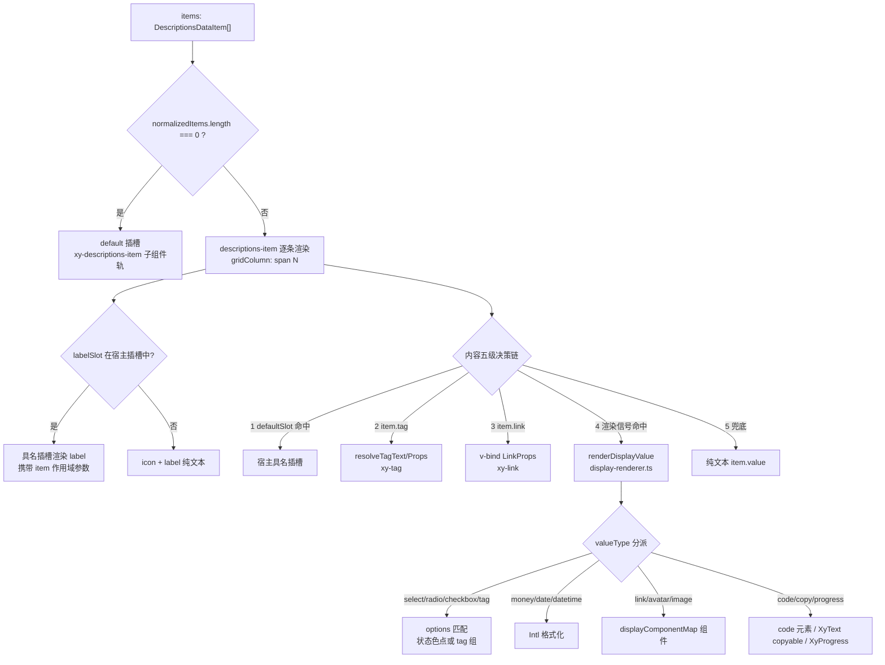
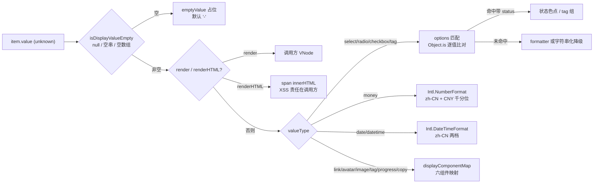
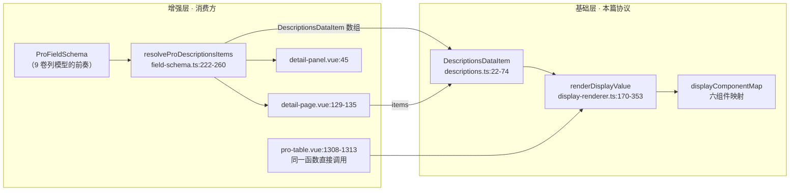

# 8-07 · Descriptions：schema 化渲染

> 本篇是"组件深潜"卷数据展示组（8 卷）的第七篇，也是全卷从"单体组件"走向"渲染协议"的转折点。前面六篇拆的都是"一个组件管一种呈现"；本篇拆的 descriptions，表面上是一个详情页键值对列表，实际上它交出的是一套**数据驱动的渲染协议**：一个 `items` 数组声明"有哪些字段、每个字段长什么样"，组件负责把声明翻译成 DOM——这正是 9 卷 pro-table 列模型的思维雏形。核心问题按大纲只有八个字——数据驱动的描述列表。但"数据驱动"三个字里藏着至少四道题：items 数组与 `xy-descriptions-item` 子组件的双轨 API 谁主谁辅、"一行多列"的 span 合并到底是谁在算、值的类型怎么自动映射成渲染组件、以及这套协议有没有被更上层的增强组件复用。本篇全部给实码定论，并顺手接回三处旧考据：5-03 在 link 篇引过的 `xy-link` 消费段（`descriptions.vue:157-162`）、5-21 在 tag 篇引过的 `ComponentStatus` 复用（`descriptions.ts:3/14`）、7-06 在 collapse-transition 篇留下的"descriptions 消费 collapse-transition（展开更多？）"悬案——答案是"不是展开更多，是整块收起"，第五节见分晓。

接到题目先复述一遍目标，防止写偏：descriptions 的职责是把"结构化的键值对信息"渲染成详情页布局。它要回答的问题可以压成四件——**字段从哪来（数组还是子组件）、每行占几列（span 怎么算）、每个值怎么渲染（纯文本/标签/链接/富展示）、以及这套声明式渲染能否被 pro 层直接接管**。四道题的答案共同构成一个词：schema 化。schema 化不是"支持传个数组"这么浅，它的完整含义是：**把 UI 的描述从模板语法迁移到数据结构**——数据结构可以被接口返回、被配置系统生成、被类型系统校验、被上层组件二次加工，而模板不行。这是本篇要立起来的分析框架，9 卷拆 pro-table 列模型时会原样复用。

先交代代码体量，给后面所有讨论一个标尺：`packages/components/descriptions/src/descriptions.vue` 全文 175 行，`descriptions.ts` 86 行，`descriptions-item.vue` 46 行，`context.ts` 11 行，`index.ts` 33 行——本体合计 351 行；但它真正的渲染心脏在共享层：`packages/components/shared/display-renderer.ts` 353 行、`display-value-type.ts` 102 行、`display-component-map.ts` 15 行，加上 `packages/theme/src/components/descriptions.css` 88 行和 184 行测试，这套"描述列表子系统"总量约 1100 行。体量不大，但它同时是基础组件、共享渲染协议、增强层底座三个角色的交点——账不薄。

## 一、双轨 API 的实码定论：items 优先，插槽兜底

descriptions 同时暴露两套 API：`items` 数组 prop 和 `xy-descriptions-item` 子组件。很多库的双轨是"并存"的——子组件照常渲染，数组只是补充。本库的实码不是这样，关键在 `descriptions.vue:134` 这一行：

```vue
<slot v-if="normalizedItems.length === 0" />
```

`v-if` 挂在 default 插槽上：**items 非空时，子组件轨道整体不渲染**；只有 items 为空（或干脆不传）时，default 插槽才被打开。双轨是互斥的，且有明确的优先级——schema 轨是主轨，子组件轨是静态页面的书写糖。manifest（`packages/components/component-manifest.json:575-583`）把两个标签都注册进安装器（`xy-descriptions` 与 `xy-descriptions-item`），文档示例六个场景里三个用 items 轨、三个用子组件轨；而 pro 层消费（第六节）全部走 schema 轨——数据一旦来自接口，schema 就是唯一现实选项，主轨身份在生态里成立。

先看子组件轨的完整实现，`packages/components/descriptions/src/descriptions-item.vue` 全文 46 行：

```vue
<script setup lang="ts">
import { computed, inject } from "vue";
import { useNamespace } from "xiaoye-primitives";
import { descriptionsKey } from "./context";

export interface DescriptionsItemProps {
  label?: string;
  span?: number;
  className?: string;
  labelClassName?: string;
  contentClassName?: string;
}

const props = withDefaults(defineProps<DescriptionsItemProps>(), {
  label: "",
  span: 1,
  className: "",
  labelClassName: "",
  contentClassName: ""
});

const ns = useNamespace("descriptions-item");
const descriptions = inject(descriptionsKey, null);
const labelStyle = computed(() =>
  descriptions?.labelWidth.value ? { width: `${descriptions.labelWidth.value}` } : undefined
);
</script>

<template>
  <div
    :class="[
      ns.base.value,
      props.className,
      descriptions?.border.value ? 'is-bordered' : '',
      `is-${descriptions?.direction.value ?? 'horizontal'}`
    ]"
    :style="{ gridColumn: `span ${Math.max(props.span, 1)} / span ${Math.max(props.span, 1)}` }"
  >
    <div :class="['xy-descriptions-item__label', props.labelClassName]" :style="labelStyle">
      <slot name="label">{{ props.label }}</slot>
    </div>
    <div :class="['xy-descriptions-item__content', props.contentClassName]">
      <slot />
    </div>
  </div>
</template>
```

这段代码有一个和全库惯例很不一样的缺席：**descriptions-item 没有向父组件注册自己**。回忆 5-04 breadcrumb、5-15 menu、5-16 row 的父子关系——那些组件里子组件都要在 mounted 时把自己塞进父的集合，因为父需要知道"全集"才能编排（收集子菜单、计算 gutter 分摊、汇总激活项）。descriptions-item 只 `inject(descriptionsKey, null)` 拿展示参数（`context.ts:4-9` 里只有 border、direction、labelWidth、size 四个 ComputedRef），不做任何上行通信。为什么可以这么省？因为本库把"行编排"整个交给了 CSS Grid——父不需要知道子组件的全集，浏览器替它排（第四节展开）。**子组件从"被父编排的单元"退化成"带样式的布局原子"**，这是 grid 化布局对组件树结构最深的改写。

schema 轨的类型定义在 `descriptions.ts`，这是本篇真正的主角——它就是 descriptions 的"schema 语言"（全文 86 行，整段引出）：

```ts
import type { VNodeChild } from "vue";
import type { SelectOptionGroup } from "../../select";
import type { ComponentSize, ComponentStatus } from "xiaoye-primitives";
import type { SelectOption } from "xiaoye-primitives";
import type { LinkProps } from "../../link";
import type { TagProps } from "../../tag";

export interface DescriptionsDataTag {
  text: string;
  props?: TagProps;
}

export interface DescriptionsDisplayOption extends SelectOption {
  status?: ComponentStatus | "info";
  color?: string;
}

export interface DescriptionsDisplayOptionGroup extends Omit<SelectOptionGroup, "options"> {
  options: DescriptionsDisplayOption[];
}

export interface DescriptionsDataItem {
  label: string;
  value?: unknown;
  row?: Record<string, unknown>;
  span?: number;
  icon?: string;
  tag?: string | DescriptionsDataTag;
  link?: LinkProps;
  valueType?:
    | "text"
    | "select"
    | "radio"
    | "checkbox"
    | "tag"
    | "progress"
    | "link"
    | "image"
    | "avatar"
    | "money"
    | "date"
    | "datetime"
    | "code"
    | "copy";
  options?: Array<DescriptionsDisplayOption | DescriptionsDisplayOptionGroup>;
  formatter?: (
    row: Record<string, unknown>,
    column: DescriptionsDataItem,
    value: unknown,
    rowIndex: number
  ) => unknown;
  render?: (
    value: unknown,
    context: {
      row: Record<string, unknown>;
      column: DescriptionsDataItem;
      rowIndex: number;
    }
  ) => VNodeChild;
  renderHTML?: (
    value: unknown,
    context: {
      row: Record<string, unknown>;
      column: DescriptionsDataItem;
      rowIndex: number;
    }
  ) => string;
  emptyValue?: string;
  className?: string;
  labelClassName?: string;
  contentClassName?: string;
  labelSlot?: string;
  defaultSlot?: string;
}

export interface DescriptionsProps {
  column?: number;
  border?: boolean;
  size?: ComponentSize;
  title?: string;
  extra?: string;
  labelWidth?: string | number;
  direction?: "horizontal" | "vertical";
  collapse?: boolean;
  items?: DescriptionsDataItem[];
}
```

这里先落第一个设计权衡的结论。**schema 数组 vs 子组件双轨，不是二选一，而是分工**：数组轨的每个字段都是数据——`value` 可以来自接口、`options` 可以是字典表、`formatter/render/renderHTML` 可以是纯函数，整个 items 可以被序列化、被测试直接 mount 进 props（测试第四节全是 `mount(XyDescriptions, { props: { items } })`）；子组件轨的每个字段都是模板——只能写在 SFC 里，无法被数据管道加工。本库的选择是：**数据能力全给数组轨，子组件轨只保留"写静态文档页"的最低配置（label/span/三个 className 和两个插槽）**，连值的富渲染（tag/link/valueType）都不给子组件轨——子组件轨道的值渲染完全由使用者的 default 插槽内容决定。这个不对称是刻意的：富渲染协议只实现一份（第三节），写在插槽机制里而不是组件机制里，pro 层才能用同一个协议接管两种场景。

还有一个细节值得点出：schema 轨并没有把插槽机制排除在外。`descriptions.ts:71-73` 的 `labelSlot/defaultSlot` 两个字段允许某个条目声明"我的标签/内容从宿主模板的某个具名插槽取"——数组声明骨架、插槽注入血肉，两条轨道在条目粒度上融合。测试第三条用例（`descriptions.spec.ts:44-96`）专门验证了这个组合：items 里声明 `labelSlot: "owner-label"`，宿主模板提供 `<template #owner-label="{ item }">`，渲染时命中（146 行 `slots[item.labelSlot]` 的查找逻辑在第二节引用）。这是双轨设计里最有意思的一笔：**schema 是默认轨道，插槽是每条目可插拔的逃生口**。

## 二、一个默认插槽里的五级决策链

schema 轨的渲染逻辑全部在 `descriptions.vue` 的模板里。先看全貌——`descriptions.vue:99-144` 是外壳与 body 的 grid 开口，`145-175` 是逐条渲染的决策链收尾：

```vue
<template>
  <div
    :class="[
      ns.base.value,
      `${ns.base.value}--${mergedSize}`,
      props.border ? 'is-bordered' : '',
      `is-${props.direction}`
    ]"
  >
    <div v-if="props.title || props.extra || $slots.title || $slots.extra" class="xy-descriptions__header">
      <div class="xy-descriptions__title">
        <slot name="title">
          <div class="xy-descriptions__title-main">
            <span>{{ props.title }}</span>
            <button
              v-if="props.collapse"
              type="button"
              class="xy-descriptions__toggle"
              @click="toggleCollapse"
            >
              <XyIcon
                icon="mdi:chevron-down"
                :class="['xy-descriptions__toggle-icon', collapsed ? 'is-collapsed' : '']"
                :size="14"
              />
            </button>
          </div>
        </slot>
      </div>
      <div class="xy-descriptions__extra">
        <slot name="extra">{{ props.extra }}</slot>
      </div>
    </div>
    <xy-collapse-transition>
      <div v-show="!collapsed" class="xy-descriptions__body" :style="{ gridTemplateColumns }">
        <slot v-if="normalizedItems.length === 0" />
        <descriptions-item
          v-for="(item, index) in normalizedItems"
          v-else
          :key="`${item.label}-${item.value ?? ''}`"
          :label="item.label"
          :span="item.span"
          :class-name="item.className"
          :label-class-name="item.labelClassName"
          :content-class-name="item.contentClassName"
        >
```

```vue
          <template #label>
            <slot v-if="item.labelSlot && slots[item.labelSlot]" :name="item.labelSlot" :item="item" />
            <span v-else class="xy-descriptions__item-label">
              <xy-icon v-if="item.icon" :icon="item.icon" :size="14" />
              {{ item.label }}
            </span>
          </template>
          <slot
            v-if="item.defaultSlot && slots[item.defaultSlot]"
            :name="item.defaultSlot"
            :item="item"
          />
          <xy-tag v-else-if="item.tag" v-bind="resolveTagProps(item)">
            {{ resolveTagText(item) }}
          </xy-tag>
          <xy-link v-else-if="item.link" v-bind="item.link">
            {{ item.value }}
          </xy-link>
          <descriptions-display-value
            v-else-if="shouldUseDisplayRenderer(item)"
            :item="item"
            :row-index="index"
          />
          <template v-else>
            {{ item.value }}
          </template>
        </descriptions-item>
      </div>
    </xy-collapse-transition>
  </div>
</template>
```

内容区的五级 if-else 决策链，按优先级从高到低依次是：



决策链的每级都有讲究，逐级过一遍。

**第一级：`defaultSlot` 命中宿主插槽**（152-156 行）。`slots[item.defaultSlot]` 的写法值得停一下——27 行把 `useSlots()` 断言成 `Record<string, ((payload?: unknown) => unknown) | undefined>`，就是为了能用字符串下标动态查插槽。Vue 模板里 `<slot :name="动态名">` 会被编译器警告无法静态分析，这里用"先查 slots 表、命中再渲染 `<slot :name>`"的守卫式写法绕开了限制，还顺手保证了"声明的插槽名不存在时静默降级到下一级"。

**第二、三级：tag 与 link**——这就是 5-03 考据引过的消费段。精确到行：157-159 是 `xy-tag` 段（`resolveTagProps` 把 `DescriptionsDataTag.props` 展开成 tag 的 props，`resolveTagText` 在 56-62 行处理"tag 是字符串就当文本、是对象就取 text，都没有就 stringify value"），160-162 是 `xy-link` 段：

```vue
<xy-link v-else-if="item.link" v-bind="item.link">
  {{ item.value }}
</xy-link>
```

5-03 当时的视角是"link 被谁消费"；本篇的视角反过来——**link 的消费方把整个 `LinkProps` 原样透传**（`v-bind="item.link"`），descriptions 自己不认识 link 的任何一个属性，只负责把 `item.value` 塞进默认插槽当文本。这是 schema 化的一个通用手法：**schema 字段存的是"下游组件的 props 包"，宿主组件只透传不解释**。同样的手法出现在 tag（`props?: TagProps`）和第六节 pro 层的 `componentProps` 里。透传的好处是 link/tag 的能力演进（新的状态、新的下划线模式）不需要 descriptions 跟着发版；代价是类型上 item.link 的合法性完全依赖 `LinkProps` 的引用（`descriptions.ts:5`），运行时零校验——传错属性只会静默无效。

**第四级：display 渲染器**。门槛函数在 `descriptions.vue:72-81`：

```ts
function shouldUseDisplayRenderer(item: DescriptionsDataItem) {
  return Boolean(
    item.valueType ||
    item.options?.length ||
    item.formatter ||
    item.render ||
    item.renderHTML ||
    item.emptyValue
  );
}
```

六个信号命中任意一个，值就交给 `renderDisplayValue`（第三节）。注意 `emptyValue` 也在信号里——一个"只想给空值换个占位符"的字段也会被抬进完整渲染管线，这是刻意的：空值处理（null/""/[] 的归一）本身是渲染协议的一部分，单走 `{{ item.value }}` 兜底的话 null 会渲染成空串而不是占位符。五个信号不命中就走第五级纯文本兜底（168-170 行）——一个没有任何展示诉求的字段，渲染成本就是一个文本插值。

**优先级链的边界**也在这里说清：tag/link 短路在 display 渲染器**之前**，意味着一个同时带 `tag` 和 `valueType: "money"` 的条目，money 协议会被静默忽略。这不是缺陷而是优先级设计——tag/link 是"调用方已经决定了 UI 形态"的显式附件，display 协议是"交给组件按类型渲染"的声明，显式永远压过声明。类型夹具 `tests/types/fixtures/descriptions.ts:46-59` 恰好构造了这种重叠（同一 item 同时有 `valueType: "tag"`、`options` 和 `tag` 字段）来验证类型合法性，但运行时行为以决策链为准：tag 赢。使用者在 schema 里应该把这两类字段视为互斥。

## 三、display 协议：值类型到组件的映射表

第四级决策链背后的实现是 `packages/components/shared/` 三件套。先看映射表 `display-component-map.ts` 全文 15 行：

```ts
import { XyAvatar } from "../avatar";
import { XyImage } from "../image";
import { XyLink } from "../link";
import { XyProgress } from "../progress";
import { XyTag } from "../tag";
import { XyText } from "../text";

export const displayComponentMap = {
  avatar: XyAvatar,
  image: XyImage,
  link: XyLink,
  progress: XyProgress,
  tag: XyTag,
  text: XyText
} as const;
```

六行映射就是"值类型 → 渲染组件"的全部表体：avatar、image、link（3 行，5-03 引过的正是这行 import）、progress、tag（13 行，5-21 引过的消费点之一）、text。5-21 的视角是 ComponentStatus 从 primitives 流入 tag 的 props；本篇补上另一半——**status 在 display 协议里先落在 option 上**（`display-value-type.ts:4-7` 的 `DisplayOptionLike` 给 `SelectOption` 扩展了 `status?: ComponentStatus | "info"` 与 `color`，`descriptions.ts:3/14` 的 `DescriptionsDisplayOption` 是同一协议在 descriptions 侧的镜像类型），渲染时再转成 tag 的 status 或状态色点。类型从令牌层流入组件 props 的那条线，在这里拐了个弯：option 层先承接语义状态，渲染层再分发。

渲染主函数 `display-renderer.ts:170-251`，先看前半段——最高优先级逃生口与 valueType 分派的骨架：

```ts
export function renderDisplayValue<TRow, TColumn extends DisplayColumnLike<TRow, TColumn>>({
  value,
  row,
  rowIndex,
  column
}: {
  value: unknown;
  row: TRow;
  rowIndex: number;
  column: TColumn;
}) {
  const context: DisplayContext<TRow, TColumn> = {
    row,
    rowIndex,
    column
  };

  if (column.render) {
    return column.render(value, context);
  }

  if (column.renderHTML) {
    return h("span", {
      class: "xy-display-value__html",
      innerHTML: column.renderHTML(value, context)
    });
  }

  switch (column.valueType) {
    case "select":
    case "radio":
    case "checkbox":
      return renderOptionDisplay(value, column, context, "text");
    case "tag":
      return renderOptionDisplay(value, column, context, "tag");
    case "progress": {
      if (isDisplayValueEmpty(value)) {
        return renderEmptyValue(column.emptyValue);
      }

      const percentage = typeof value === "number" ? value : Number(value);

      if (Number.isNaN(percentage)) {
        return h(
          "span",
          { class: "xy-display-value__text" },
          column.formatter
            ? resolveFormattedText(value, column, context)
            : stringifyDisplayValue(value, column.emptyValue)
        );
      }

      return h("span", { class: "xy-display-value__progress" }, [
        h(displayComponentMap.progress, {
          percentage,
          showText: true,
          format: column.formatter
            ? () => resolveFormattedText(value, column, context)
            : undefined
        })
      ]);
    }
    case "link": {
      if (isDisplayValueEmpty(value)) {
        return renderEmptyValue(column.emptyValue);
      }

      const href = String(value);
      const text = column.formatter
        ? resolveFormattedText(value, column, context)
        : href;

      return h(
        displayComponentMap.link,
        {
          href,
          target: "_blank",
          underline: "hover"
        },
        () => text
      );
    }
```

这段代码里最值钱的是函数签名那行泛型：`renderDisplayValue<TRow, TColumn extends DisplayColumnLike<TRow, TColumn>>`。`DisplayColumnLike`（22-31 行）是一个**结构化的最小协议**——只要一个类型长着 `valueType/options/formatter/render/renderHTML/emptyValue` 这六个口子，就能进这套渲染管线，`TRow`/`TColumn` 由调用方填充。descriptions 传进来的是 `DescriptionsDataItem`；第六节会看到 pro-table 传的是自己的列类型——**同一个函数、两套 schema、零适配层**。这就是本篇要立的框架：schema 化的复用单位不是组件，是渲染函数。

`valueType` 的完整分派还有后半段（`display-renderer.ts:252-352`）：avatar 映射成 `src` 32px 的 XyAvatar、image 包一层 44px 容器、money 走 `formatDisplayMoney`、date/datetime 走 `formatDisplayDate`、code 渲染成 `<code>` 元素、copy 渲染成 `copyable: true` 的 XyText、default 分支用 Fragment 包纯文本。options 匹配的核心在 `renderOptionDisplay`（97-168 行）：先把值归一成数组（`getDisplayOptionValues`，`display-value-type.ts:99-101`），在拍平的 options 里用 `Object.is` 逐个匹配（55-71 行），匹配不到时降级为 formatter 或字符串化。5-21 引过的 157-167 行正是 tag 模式的收尾——匹配成功的每个 option 渲染成一个带 status 的 XyTag：

```ts
return h(
  "span",
  { class: "xy-display-value__tag-group" },
  matchedOptions.map((option) =>
    h(
      displayComponentMap.tag as any,
      option.status ? { status: option.status } : undefined,
      () => option.label
    )
  )
);
```

text 模式（126-155 行）则在 option 带 status/color 时渲染"状态色点 + 文案"的组合——`is-{status}` 类名挂在一个 8px 圆点上，色值由 `packages/xiaoye-primitives/src/theme/shared/display-value.css:39-57` 的五个语义变量提供。值类型自动映射的完整管线画成图：



现在回答任务规格里那句"数字→格式化？"的问句——**实码定论：不存在基于值类型的自动推断**。`value` 是 `unknown`，一个 `128000.5` 不会因为它是数字就自动加千分位——`stringifyDisplayValue`（`display-value-type.ts:21-45`）对 number 只做 `String(value)`，千分位必须显式声明 `valueType: "money"`。"自动映射"只发生在两个显式的地方：一是 `valueType` 字符串到组件的查表（display-component-map），二是 pro 层从字段声明的 `component` 反推 `valueType`（第六节的 `componentDisplayValueTypeMap`）。所有隐式魔法都被关掉了，为什么？看 `formatDisplayMoney` 的实现就知道（`display-value-type.ts:68-85`）：

```ts
export function formatDisplayMoney(value: unknown, emptyValue?: string) {
  if (isDisplayValueEmpty(value)) {
    return resolveDisplayEmptyValue(emptyValue);
  }

  const amount = typeof value === "number" ? value : Number(value);

  if (Number.isNaN(amount)) {
    return stringifyDisplayValue(value, emptyValue);
  }

  return new Intl.NumberFormat("zh-CN", {
    style: "currency",
    currency: "CNY",
    minimumFractionDigits: 2,
    maximumFractionDigits: 2
  }).format(amount);
}
```

币种硬编码 CNY、locale 硬编码 zh-CN、位数固定两位小数——这不是一个可以放心"自动"套到所有数字上的格式化器，套错了就是把订单号格式化成 ¥128,000.50。**格式化策略带着业务语义，业务语义必须显式声明**——这是值类型自动映射的第一条边界。第二条边界是 `renderHTML`（191-196 行）：返回值直接进 `innerHTML`，零消毒。测试用例的措辞"可信 HTML"（`descriptions.spec.ts:162`）就是这个契约的文档化——schema 化把渲染权交出去的同时也把安全责任交了出去。第三条边界在空值：`isDisplayValueEmpty` 只认 null、空串、空数组（13-19 行），`0` 和 `false` 是有效值——统计类的零值详情字段不会被误吞成 "-"，但反过来 `NaN` 会走 stringify 渲染出字面量 "NaN"，money 分支的 NaN 兜底（75-77 行）救了 money，救不了 default 分支。

## 四、span 与 border：把行列算法还给 CSS Grid

任务规格点名的"列数 span 分配算法（一行多列的合并逻辑）"，实码定论可能会让期待一段算法的读者失望：**JS 里没有这个算法，它在 CSS 里**。JS 侧的全部贡献是两行——`descriptions.vue:29` 把 column 翻译成 grid 模板：

```ts
const gridTemplateColumns = computed(() => `repeat(${Math.max(props.column, 1)}, minmax(0, 1fr))`);
```

加上 `descriptions-item.vue:37` 把 span 翻译成 `gridColumn: span N / span N`（`Math.max(props.span, 1)` 的下限钳制就写在同一个绑定里）。一行多列的"合并"就是 CSS Grid 的 auto-placement：某个条目声明 span 2，后续条目自动顺延到下一格，一行填不满自动换行——**没有末行补位计算、没有剩余列数统计、没有隐式空单元格 VNode**。看 CSS 侧的实现（`packages/theme/src/components/descriptions.css:46-88`）：

```css
.xy-descriptions__body {
  display: grid;
  gap: 12px;
}

.xy-descriptions-item {
  display: flex;
  gap: 12px;
  min-width: 0;
  padding: 12px 14px;
  border-radius: var(--xy-radius-lg);
  background: color-mix(in srgb, var(--xy-bg-subtle) 88%, var(--xy-bg-floating));
}

.xy-descriptions-item.is-bordered {
  border: 1px solid color-mix(in srgb, var(--xy-border-subtle) 84%, var(--xy-border));
  background: var(--xy-bg-raised);
  box-shadow:
    0 0 0 1px color-mix(in srgb, var(--xy-bg-floating) 14%, transparent),
    0 1px 4px color-mix(in srgb, var(--xy-text-heading) 5%, transparent);
}

.xy-descriptions-item.is-vertical {
  flex-direction: column;
  gap: 8px;
}

.xy-descriptions-item__label {
  flex: 0 0 auto;
  color: var(--xy-text-muted);
}

.xy-descriptions__item-label {
  display: inline-flex;
  align-items: center;
  gap: 6px;
}

.xy-descriptions-item__content {
  min-width: 0;
  color: var(--xy-text-heading);
  word-break: break-word;
}
```

这里落第二个设计权衡：**grid 布局 vs table 布局**，也是本篇唯一的 EP 对照主战场。Element Plus 的 el-descriptions 内部是一张真正的 `<table>`：子组件的扁平集合要在运行时被展开成行列矩阵，逐项计算 colspan，最后一行不满时还要渲染补位的空白单元格（以 element-plus 2.x 公开源码为参照，不给行号）；`border` 模式渲染的是真实表格线。本库的 grid 路线把这三件事全部消掉了——auto-placement 接管补位（空位就是空格子，连"空白单元格"节点都不需要）、`column` 变成一个 CSS 函数、`border` 从"表格线"重新设计成"卡片描边"（is-bordered 给每个条目加边框、投影和抬升背景，60-66 行，配合 `color-mix` 的双主题配方是 3-03 讲过的机制）。两条路线的深层差异在**信息的表达权**：table 路线里"行列"是 DOM 结构的一部分，JS 必须持续维护它；grid 路线里"行列"是样式层的推论，DOM 始终是扁平的条目列表。扁平 DOM 的直接红利是 v-for 的 key 稳定性和 transition 友好（body 外面包着 7-06 的 xy-collapse-transition，table 结构的高度动画要绕很多弯）；代价是失去 table 的语义化（屏幕阅读器不再把它当表格读）和真正的跨列边框对齐——详情页场景里这两样都算不上刚需。

不过"没有算法"不等于"没有边界"，这里有一处两层的真实不对称：基础层对 span **只有下限钳制没有上限钳制**——`Math.max(props.span, 1)` 保证 span 至少为 1，但一个 `span: 5` 撞上 `column: 3` 时，JS 不拦，CSS Grid 会按规范横跨四条轨道、在显式网格之外撑出隐式轨道，等分布局就此破坏。上限钳制被放到了 pro 层：`packages/pro-components/field-schema.ts:154-160` 的 `resolveProFieldSpan` 用 `Math.max(1, Math.min(columns, Math.floor(field.span)))` 双向收口。**基础层信任调用者（类型层面 `span?: number` 无约束），增强层替调用者兜底**——这是"库内分层"的典型分工，但也意味着直接消费基础组件的业务代码要自己记住这条边界。文档页 `apps/docs/components/descriptions.md:76` 的 span 文档只写了"占据列数"，没有提上限——一个值得后续补的使用提示。

vertical 方向顺带交代：`direction: "vertical"` 只是给条目加了 `flex-direction: column`（68-71 行），标签换到内容上方，行编排逻辑零改动——对比 EP 需要在 table 里重排 label 行和 value 行的两组单元格，grid 路线的方向切换成本是三行 CSS。`labelWidth` 同理：`descriptions-item.vue:24-26` 把它变成 label 元素的固定 width（flex 布局下 `flex: 0 0 auto`，73-74 行），而不是 table 路线的 colgroup 列宽——每个条目各管各的标签宽，跨条目不对齐，这是 grid 路线为扁平 DOM 付出的真实代价，文档在 vertical 示例（`apps/docs/examples/descriptions/vertical.vue`，label-width 96）里的用法默认你接受这种"近似对齐"。

## 五、collapse：整块收起，不是"展开更多"

7-06 拆 collapse-transition 时留下过一句考据："descriptions 消费 collapse-transition（展开更多？）"。实码定论先给出：**不是逐条目的"展开更多"，是整个内容区的收起/展开**。消费段就是 `descriptions.vue:132-173`——`<xy-collapse-transition>` 包住整个 body，内部用 `v-show="!collapsed"` 控制显隐。为什么用 7-06 的结论反推这是必然选择：collapse-transition 的实现依赖"元素始终在 DOM 里、只动 height"的前提，`v-if` 切换会让过渡失灵，所以这里的 `v-show` 不是偏好而是**协议对齐**——消费 collapse-transition 的组件必须保持内容常驻。

折叠的触发端在 header 里（113-124 行）：collapse 为 true 时标题旁渲染一个按钮，图标是 `mdi:chevron-down`，收起时旋转 180 度（`descriptions.css:33-39` 的 transform 过渡）。状态机极简，`descriptions.vue:31` 和 83-89 行：

```ts
const collapsed = ref(props.collapse);

function toggleCollapse() {
  if (!props.collapse) {
    return;
  }

  collapsed.value = !collapsed.value;
}
```

这里有一个值得记录的边界：`collapsed` 只在初始化时读了一次 `props.collapse`，之后 props 变化不会同步进来——运行时把 `collapse` 从 true 改成 false，已收起的内容不会自动展开，按钮也会消失但状态卡在收起。测试用例（`descriptions.spec.ts:98-117`）只覆盖了"初始收起 + 点击展开"的路径，没有覆盖 props 中途变更——这是全组件唯一的"单向初始化"状态，与 4-04 讨论过的受控/非受控谱系对照，collapse 属于"非受控但只有初始值"的最简形态。对一个详情页折叠开关来说够用，但如果未来要做"受控展开"，需要补 `collapsed` 的 watch 或 v-model 通道，7-06 的 transition 协议不用动。

还要点一处"谁在收"：collapse 收的是 body——包括子组件轨道渲染的全部内容。header（标题、extra、折叠按钮）永远在场，这保证了"收起后至少还有标题可点"。文档示例 `apps/docs/examples/descriptions/data-driven.vue`（32 行）是 collapse 的标准姿势：`title="审核详情" :column="2" collapse :items="items" border`——标题、双列、默认收起、items 驱动、边框一行属性全开，接口回显 + 默认收起 + 可展开——这正是 schema 化的目标场景：详情页组件拿到接口返回的 items 数组就完事，模板里一个手写字段都不用写。

## 六、pro 层收口：field-schema 到 detail-page 的转换管线

任务规格问"pro 层 detail-page 是否基于 descriptions"——实码定论：**是，而且不止 detail-page**。先看转换函数，`packages/pro-components/field-schema.ts:222-260`：

```ts
export function resolveProDescriptionsItems(
  schema: ProFieldSchema[],
  model: Record<string, unknown>,
  _rowIndex = 0
): DescriptionsDataItem[] {
  return schema
    .filter((field) => !resolveProFieldHidden(field, model))
    .map((field) => ({
      label: field.label,
      value: readProFieldValue(model, field.prop),
      row: model,
      valueType: resolveProFieldValueType(field),
      options: field.options,
      formatter: field.formatter
        ? (_row, _column, value, nextRowIndex) =>
            field.formatter?.(value, createProFieldDisplayContext(model, field, nextRowIndex))
        : undefined,
      render: field.render
        ? (value, context) =>
            field.render?.(
              value,
              createProFieldDisplayContext(context.row, field, context.rowIndex)
            )
        : undefined,
      renderHTML: field.renderHTML
        ? (value, context) =>
            field.renderHTML?.(
              value,
              createProFieldDisplayContext(context.row, field, context.rowIndex)
            ) ?? ""
        : undefined,
      emptyValue: field.emptyValue,
      span: field.span,
      defaultSlot: field.slot,
      className: undefined,
      labelClassName: undefined,
      contentClassName: undefined
    }));
}
```

这个函数是"schema 化"三个字的完整体现，四件事值得逐一点名。第一，`ProFieldSchema` 是表单与展示共用的统一 schema（9 卷的主角），转换器把它的 `prop` 通过 `readProFieldValue`（170-181 行，支持 `a.b.c` 路径取值）映射到 descriptions 的 `value`，把整包 `model` 挂在 `row` 上——这正是 `DescriptionsDataItem.row` 字段（`descriptions.ts:25`）存在的原因：**formatter/render 回调的 row 参数在 descriptions 场景是可选的（默认空对象），在 pro 场景才有完整行数据**，协议字段为上层留了口子。第二，三个渲染回调都做了**签名转接**：ProFieldSchema 的 formatter 签名是 `(value, context)`，descriptions 的 formatter 签名是 `(row, column, value, rowIndex)`，转换层用闭包把后者翻译回前者——上层 schema 的书写体验保持一致，底层协议的签名也不用迁就。第三，`resolveProFieldValueType`（183-193 行）实现了"半自动映射"：字段声明了 valueType 就用，否则查 `componentDisplayValueTypeMap`（57-70 行）从表单组件名反推（select → "select"、avatar → "avatar"……）——**一个字段在表单态是 xy-select、在详情态自动变成 valueType: "select" 的状态色点展示**，这是 4-10 泛型组件一节"一份 schema 两态消费"理想的只读侧落地。第四，`hidden` 过滤（228 行）让详情区块可以按 model 动态裁剪字段——schema 不只是渲染声明，还是业务逻辑的载体。

消费端在 detail-page 与 detail-panel。`packages/pro-components/detail-page/src/detail-page.vue:43-49`：

```ts
function resolveSectionItems(section: DetailSectionItem) {
  if (section.schema?.length) {
    return resolveProDescriptionsItems(section.schema, section.model ?? {});
  }

  return section.items ?? [];
}
```

schema 优先、items 兜底——pro 层把基础层的双轨逻辑原样抬了一级。模板消费在 129-135 行：`<xy-descriptions border :column="section.descriptionsProps?.column ?? 2" v-bind="section.descriptionsProps" :items="resolveSectionItems(section)" />`，一个详情区块的渲染收敛到一个组件调用。detail-panel 走同一条路（`detail-panel.vue:45` 的 `computed(() => resolveProDescriptionsItems(props.schema, props.model))`），crud-page 的详情抽屉（`crud-page.vue:176`）透传 `descriptionsProps` 给 detail-page——三个增强组件、一条转换管线、一个基础组件。三层关系画成图：



图里最值得看的是 pro-table 那条线：`pro-table.vue:33` 直接 import `renderDisplayValue`，在 1296-1314 行的列渲染兜底分支里传入表格自己的列对象（1308-1313 调用）——**表格单元格的只读渲染和描述列表的值渲染是同一个函数**。这就是"前奏"的确切含义：9 卷拆 pro-table 列模型时，它的 schema（valueType/options/formatter/render/renderHTML/emptyValue）与 descriptions 的 schema 是同一套 `DisplayColumnLike` 协议的两个实例，本篇把协议的静态部分（类型与映射表）拆完了，9 卷拆它的动态部分（编辑态、排序、筛选如何长在同一个列对象上）。schema 化的终点不是一个组件，是**一套可以在"任意容器里渲染任意值"的公共渲染层**——detail 页、表格单元格、未来的图表 tooltip，理论上都挂在这一个函数上。

## 七、测试、夹具与文档的镜像核对

`packages/components/descriptions/__tests__/descriptions.spec.ts` 全文 184 行，五个用例正好对应前五节的五条主线：基础渲染与标题额外区（7-24 行，子组件轨）、span/border/vertical（26-42 行，断言 `attributes("style")` 含 `span 2`——直接钉住了 grid 路线的实现细节）、items 轨的 icon/tag/link/动态插槽（44-96 行，第一节的双轨融合）、collapse（98-117 行，第五节）、display 协议全家桶（119-183 行，第三节）。最后这个用例值得整段引用，它是 display 协议的"验收清单"：

```ts
it("items 写法支持 valueType、formatter、render、renderHTML 和 emptyValue", () => {
  const wrapper = mount(XyDescriptions, {
    props: {
      items: [
        {
          label: "状态",
          value: "enabled",
          valueType: "select",
          options: [
            {
              label: "启用",
              value: "enabled",
              status: "success"
            }
          ]
        },
        {
          label: "预算",
          value: 128000.5,
          valueType: "money"
        },
        {
          label: "更新时间",
          value: "2026-04-18T14:30:00+08:00",
          valueType: "datetime"
        },
        {
          label: "空值",
          value: null,
          emptyValue: "暂无备注"
        },
        {
          label: "格式化",
          value: "小叶",
          formatter: (_row, _column, value) => `负责人：${String(value ?? "-")}`
        },
        {
          label: "render",
          value: "稳定",
          render: (value) => h("strong", { class: "desc-render" }, String(value ?? "-"))
        },
        {
          label: "html",
          value: "可信 <strong class='desc-html'>HTML</strong>",
          renderHTML: (value) => `<span>${String(value ?? "")}</span>`
        },
        {
          label: "复制",
          value: "workspace-token",
          valueType: "copy"
        }
      ]
    }
  });

  expect(wrapper.text()).toContain("启用");
  expect(wrapper.find(".xy-display-value__status-dot.is-success").exists()).toBe(true);
  expect(wrapper.text()).toContain("¥128,000.50");
  expect(wrapper.text()).toContain("2026/04/18");
  expect(wrapper.text()).toContain("暂无备注");
  expect(wrapper.text()).toContain("负责人：小叶");
  expect(wrapper.find(".desc-render").exists()).toBe(true);
  expect(wrapper.find(".desc-html").exists()).toBe(true);
  expect(wrapper.find(".xy-text__action").exists()).toBe(true);
});
```

九条断言九个协议点：options 匹配 + 状态色点（`is-success` 类名）、money 的 CNY 千分位（¥128,000.50 正是 `Intl.NumberFormat` zh-CN 输出）、datetime 的 `2026/04/18`（zh-CN 两档日期格式）、emptyValue 占位、formatter 接管、render VNode、renderHTML 直插、copy 的 `xy-text__action`（XyText copyable 的复制按钮类名）。测试断言全部钉在"协议的可观察行为"上而不是实现细节上——除了第 40 行那个 `span 2` 的 style 断言，那是特意钉死的：布局路线（grid）是这个组件的架构决策，测试要防止有人悄悄改回 table。

类型夹具 `tests/types/fixtures/descriptions.ts`（85 行）补齐类型侧验收：前半段构造 `DescriptionsProps` 与 `DescriptionsDataItem[]` 的合法组合（含 `valueType: "money"`、`render` 返回 `h(...)`），后半段 80-83 行用 `@ts-expect-error` 钉住非法 direction——schema 语言的所有字面量联合都被夹具覆盖，`pnpm typecheck:types` 兜底。文档侧六个示例（`apps/docs/examples/descriptions/`：basic 41 行、bordered 8 行、data-driven 32 行、display-protocol 32 行、items 30 行、vertical 9 行）与文档页（`apps/docs/components/descriptions.md`，106 行）的 API 表逐项对得上：43 行那句"items 现在也支持 valueType / formatter / render / renderHTML / emptyValue，适合和列表页共用统一的只读显示规则"是全库文档里对 display 协议跨容器复用最直白的一句自述——"和列表页共用"六个字，就是第六节 pro-table 那条线的官方注脚。

## 八、权衡总账与 EP 对照

全篇三条主线各归一句：

1. **双轨 API（schema 数组优先 + 子组件插槽兜底）**：互斥而非并存，数组轨是数据（可序列化、可测试、可被 pro 层加工），子组件轨是模板糖（只配了 label/span/className 三件套，富渲染协议只在数组轨实现一份）；条目级 `labelSlot/defaultSlot` 让插槽作为逃生口融回 schema。判据：**数据能到的地方用 schema，手写才需要的地方用插槽**。
2. **span 分配（CSS Grid auto-placement 替代 JS 行列算法）**：JS 只做 `Math.max` 下限钳制，末行补位、跨列合并全部交给浏览器；代价是失去表格语义与跨条目标签对齐，以及基础层不设 span 上限（pro 层 `resolveProFieldSpan` 用 `Math.min(columns, ...)` 收口）。判据：**布局是样式层的推论，不是 DOM 结构的债务**。
3. **值类型映射（显式查表，零隐式推断）**：`valueType` 字符串到六组件的 `displayComponentMap` 查表 + pro 层 component 到 valueType 的半自动反推，除此之外没有任何"数字自动千分位"式的魔法——格式化策略带着业务语义（CNY、zh-CN 硬编码），显式声明是边界也是护栏；`renderHTML` 的 innerHTML 直插把安全责任显式移交给调用方。判据：**协议替你省掉的是模板，不是决策**。

EP 对照收束成一句：el-descriptions 与 XyDescriptions 解决同一个问题，但站在布局路线的两端——EP 是 table 路线（子组件收集、运行时行列矩阵、空白补位、真表格边框、无 schema API，label/value 只能插槽书写），本库是 grid 路线（items 主轨 + 插槽兜底、CSS Grid 编排、卡片化边框、display 协议整套值类型映射）。EP 的描述列表是一个组件；本库的描述列表是一个**协议 + 一个挂载点**——协议（display-renderer 三件套）同时服务表格单元格，挂载点（xy-descriptions）同时服务 pro 层三个增强组件。读懂这一篇的 items 数组，等于提前读懂了 9 卷的 columns 配置。

---

下一篇预告：**8-08《Tree：tree-store 状态管理》**。descriptions 的数据是扁平的——一个 items 数组、一层 for 循环，schema 化的复杂度都在"每个值怎么渲染"；tree 的数据是递归的——节点带子节点、子节点再带子节点，勾选、展开、懒加载的每一项状态都会沿着层级传播。把节点状态散落在每个节点组件里，还是收拢到一个集中的 tree-store 里统一调度？扁平 id 到树形结构的索引怎么建、勾选联动（父子半选传播）在哪里算、惰性渲染凭什么敢只渲染可见节点——8-07 用 schema 把渲染从模板里搬进数据，8-08 要用 store 把状态从组件里搬进数据中心，数据展示卷的最后一块硬骨头。

---

*本篇代码引用核对于当前工作区实态：`packages/components/descriptions/src/descriptions.vue`（175 行；L2-11 / L13-23 / L26-28 / L29 / L30 / L31 / L33-54 / L56-62 / L64-70 / L72-81 / L83-89 / L91-96 / L99-144 / L108-131 / L113-124 / L132-173 / L134 / L135-143 / L138 / L145-175 / L145-151 / L152-156 / L157-159 / L160-162 / L163-167 / L168-170）、`src/descriptions.ts`（86 行，全文引出；L1-6 / L3 / L8-11 / L13-16 / L22-74 / L25 / L30-44 / L45 / L46-51 / L52-59 / L60-67 / L68 / L71-73 / L76-86）、`src/descriptions-item.vue`（46 行；L6-12 / L22-26 / L30-38 / L37 / L39-44）、`src/context.ts`（11 行；L4-9 / L11）、`index.ts`（33 行）、`__tests__/descriptions.spec.ts`（184 行；L7-24 / L26-42 / L40 / L44-96 / L98-117 / L119-183 / L162 / L175-182）、`packages/components/shared/display-renderer.ts`（353 行；L16-31 / L22-31 / L35-37 / L39-53 / L55-71 / L73-79 / L81-95 / L97-168 / L126-155 / L157-167 / L170-251 / L170-353 / L181-196 / L187-189 / L191-196 / L198-204 / L205-231 / L232-251 / L252-352 / L313-320 / L321-335 / L336-352）、`shared/display-value-type.ts`（102 行；L4-7 / L9-11 / L13-19 / L21-45 / L47-66 / L68-85 / L75-77 / L87-97 / L99-101）、`shared/display-component-map.ts`（15 行；L3 / L8-15 / L13）、`packages/theme/src/components/descriptions.css`（88 行；L25-39 / L33-39 / L46-49 / L46-88 / L51-58 / L60-66 / L68-71 / L73-74 / L78-82 / L84-88）、`packages/xiaoye-primitives/src/theme/shared/display-value.css`（88 行；L39-57）、`packages/components/component-manifest.json:575-583`、`tests/types/fixtures/descriptions.ts`（85 行；L4-37 / L39-75 / L46-59 / L80-83）、`packages/pro-components/field-schema.ts`（260 行；L57-70 / L154-160 / L170-181 / L183-193 / L222-260）、`packages/pro-components/detail-page/src/detail-page.vue`（192 行；L43-49 / L129-135）、`packages/pro-components/detail-panel/src/detail-panel.vue`（176 行；L45 / L105 / L146 / L156）、`packages/pro-components/pro-table/src/pro-table.vue`（1779 行；L33 / L1296-1314 / L1308-1313）、`packages/pro-components/crud-page/src/crud-page.vue:176`、`apps/docs/components/descriptions.md`（106 行；L25 / L31 / L37-38 / L43 / L61 / L76 / L85）、`apps/docs/examples/descriptions/`（basic.vue 41 行 / bordered.vue 8 行 / data-driven.vue 32 行 / display-protocol.vue 32 行 / items.vue 30 行 / vertical.vue 9 行）、`packages/components/descriptions/index.ts`（XyDescriptions.Item 双名导出）。EP 侧事实（el-descriptions/el-descriptions-item 双组件无 schema API、table + colgroup 布局、运行时行列矩阵与末行空白补位、border 用真实表格线）以 element-plus 2.x 公开源码为参照核对，未引行号。本篇叙述与源码不符点自查：任务考据 7-06 的"descriptions 消费 collapse-transition（展开更多？）"按实态定论为整块 body 收起/展开而非逐条展开更多（descriptions.vue:132-173 + v-show）；任务考据 5-03 所指 xy-link 消费段 157-162 实为 tag+link 合段，xy-link 精确位于 160-162；任务规格问句"数字→格式化？"按实态定论为否——无 typeof 级自动推断，money/date 必须显式 valueType；"span 分配算法"按实态定论为基础层无 JS 算法（纯 CSS Grid，仅 Math.max 下限钳制、无上限钳制），上限收口在 pro 层 field-schema.ts:154-160；另据逐行读码记录四处源码自察边界：条目 key 取 `label-value` 拼接可能撞键（descriptions.vue:138）、collapse 仅初始值单向不同步 props 变更（L31）、money/date 的 locale 与币种硬编码 zh-CN/CNY 不可配置（display-value-type.ts:65/79-84）、renderHTML 直插 innerHTML 无消毒（display-renderer.ts:191-196），均已在正文相应小节如实标注。*
