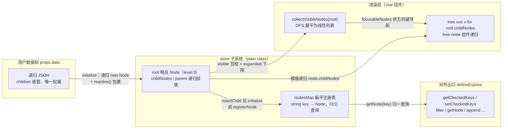
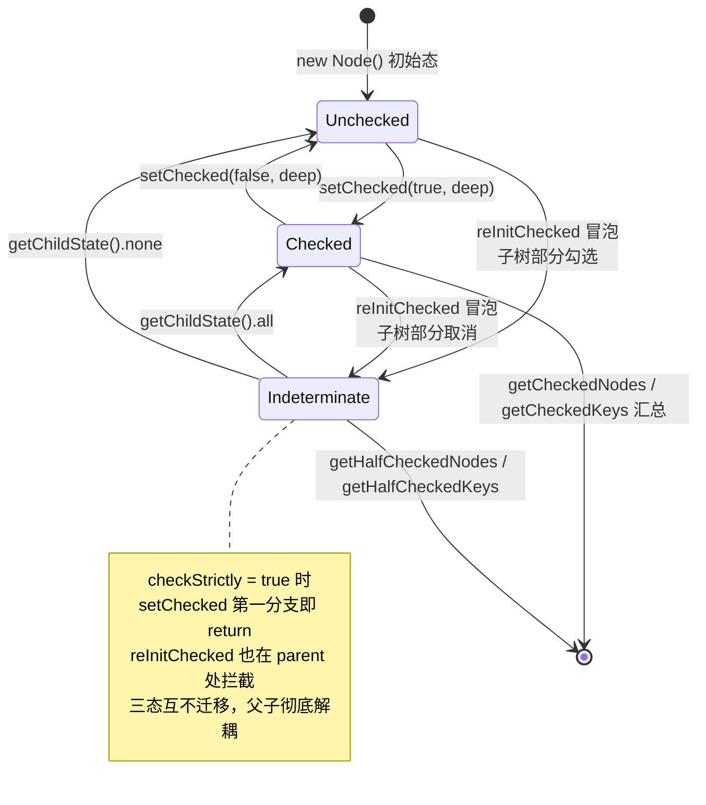

# 8-08 · Tree：tree-store 状态管理

> 本篇是"组件深潜"卷数据展示组（8 卷）的第八篇，也是全卷首个为单一组件配出千行级独立 store 子系统的一篇——上一卷 7 卷拆到 transfer、dialog 时，我们处理的还是"状态在组件里"的世界；本篇要拆的 tree，是本库第一个把状态整体搬出组件、搬进一个非 Vue 的 plain class 数据中心的组件。6-16 拆 tree-select 时立过一条上下分工：**组合层（tree-select 怎么把树接进浮层与输入框）归 6 卷，树自身的状态管理（TreeStore/Node 两个类怎么把勾选、展开、懒加载、过滤管起来）归 8 卷**——那篇里一句"全部留在 8 卷的领地"欠下的账，本篇一次结清。核心问题按大纲是十个字——**扁平化存储与树形渲染的互转**。这十个字里至少压着五道题：用户手里递归嵌套的 JSON，怎么变成可查询、可批量操作的节点索引；渲染层为什么选组件递归而不是展平数组；勾选的父子半选传播到底在哪里算；懒加载的异步补层怎么不撕裂状态机；filter 为什么是"可见性标记"而不是渲染层过滤。本篇全部给实码定论，并顺手接回三处旧考据：6-16 引过的 `nodesMap`（`tree-store.ts:17`）、filter 主体（`tree-store.ts:68-94`）与 currentNodeKey 匹配段（`node.ts:171-172`）本篇全文展开；7-06 在 collapse-transition 篇留下的"tree-node.vue:65-85/102 消费实证"在本篇第十二节兑现；7-07 引过的 empty 消费段（`tree.vue:32-36`）在第一节顺带核对。

接到题目先复述一遍目标，防止写偏：tree 的职责是把一棵递归的树形数据渲染成可展开、可勾选、可过滤、可懒加载的节点列表。它要回答的问题可以压成四件——**状态放哪里（散在节点组件里还是收进一个 store）、树形与扁平两套表示怎么互转、节点状态（expanded/checked/current/visible/loading）怎么迁移与传播、以及这套 store 与用户手里的原始数据树谁说了算**。四道题的答案共同指向同一个设计决策：**节点状态既不放 Vue 组件里，也不放响应式数据树里，而是放进一个手写的对象图（TreeStore + Node），再被 reactive() 重新接回 Vue 的响应式系统**。这是本篇要立起来的分析框架，9 卷 pro-table 的行列模型会再次面对同样的选择。

先交代代码体量，给后面所有讨论一个标尺：`packages/components/tree/src/model/` 下 `tree-store.ts` 全文 441 行、`node.ts` 591 行、`util.ts` 69 行（另有拖拽模型 `use-drag-node.ts` 424 行，不属于本篇主战场）；视图层 `tree.vue` 526 行、`tree-node.vue` 448 行、`tree-node-content.vue` 55 行；类型层 `tree.ts` 274 行、`tree.type.ts` 147 行；样式 `packages/theme/src/components/tree.css` 192 行；测试 `__tests__/tree.spec.ts` 1177 行；类型夹具 `tests/types/fixtures/tree.ts` 150 行；文档示例 `apps/docs/examples/tree/` 16 个场景。**store 状态子系统（tree-store + node + util，约 1100 行）与视图层（tree.vue + tree-node.vue + tree-node-content.vue，约 1030 行）几乎一比一**——一个组件的逻辑层和视图层等量，这是本库至今唯一的样本，也是"树的状态管理值得一个独立子系统"这句话最直接的证据。

## 一、入口：一段 setup 里 store 的落地

先看 tree.vue 的 script 部分，store 是在这里被创建并被注入整棵组件树的。`packages/components/tree/src/tree.vue:92-128`：

```ts
// packages/components/tree/src/tree.vue:92-128
const store = ref(
  new TreeStore({
    key: props.nodeKey,
    data: props.data,
    lazy: props.lazy,
    props: props.props,
    load: props.load,
    currentNodeKey: props.currentNodeKey ?? null,
    checkStrictly: props.checkStrictly,
    checkDescendants: props.checkDescendants,
    defaultCheckedKeys: props.defaultCheckedKeys,
    defaultExpandedKeys: props.defaultExpandedKeys,
    autoExpandParent: props.autoExpandParent,
    defaultExpandAll: props.defaultExpandAll,
    filterNodeMethod: props.filterNodeMethod,
    accordion: props.accordion
  })
);

store.value.initialize();

const root = ref<Node>(store.value.root);
const instance = getCurrentInstance();
const visibleNodes = computed(() => collectVisibleNodes(root.value));
const focusableNodes = computed(() => collectFocusableNodes(root.value));
const isEmpty = computed(() => visibleNodes.value.length === 0);
const isBusy = computed(() => {
  let busy = false;

  root.value.eachNode((node) => {
    if (node.loading) {
      busy = true;
    }
  });

  return busy;
});
```

这 37 行里有三个值得驻足的细节。其一，`store` 本身是一个 `ref`——ref 会把对象值转成 reactive 代理，TreeStore 实例连同它的字段（包括 `root` 指向的整张 Node 图）一起进入 Vue 的响应式系统；而非 root 的每个新节点在 insertChild 里还会再显式过一次 `reactive()`（下一节展开），跨节点传播的状态写入因此都能精确触发重渲染；其二，`store.value.initialize()` 在 setup 里同步执行，首屏渲染之前整棵节点树已经建好，模板第一帧拿到的就是完整的 `root.childNodes`；其三，`visibleNodes`/`focusableNodes`/`isEmpty`/`isBusy` 四个 computed 全部从 store 的节点图里派生——isEmpty 判空不看 `props.data`，看的是"展平后的可见节点数"（所以 7-07 那段 empty 消费 `tree.vue:32-36` 的 `v-if="isEmpty"`，判的是 store 的状态而不是数据长度，懒加载失败或全树被过滤时同样走空态）。

store 收到的配置项，类型契约在 `tree.type.ts:77-92` 的 `TreeStoreOptions`——对照 `tree.ts:23/32/34/40` 的四个 prop 声明（`nodeKey?: string`、`defaultCheckedKeys?: TreeKey[]`、`currentNodeKey?: TreeKey | null`、`lazy?: boolean`），可以确认一条边界：**props 里所有"一次性注入"的配置（key、data、默认勾选、默认展开、当前节点键）在构造时传给 store；而所有"可响应变更"的配置走另一条通道**。`tree.vue:303-312` 的 watchEffect 把 `props`、`load`、`lazy`、`filterNodeMethod`、`autoExpandParent`、`defaultExpandAll`、`accordion`、`checkDescendants` 八项在每次依赖变化时同步进 store 实例——构造注入 + watchEffect 回写双轨，store 不感知 Vue，props 的变化由视图层翻译给它。

## 二、TreeStore 与 Node：两类对象，一处集中

store 子系统的主角是两个 plain class。先看 TreeStore 的全部状态字段，`packages/components/tree/src/model/tree-store.ts:14-39`：

```ts
// packages/components/tree/src/model/tree-store.ts:14-39
export default class TreeStore {
  currentNode: Node | null = null;
  currentNodeKey: TreeKey | null = null;
  nodesMap: TreeStoreNodesMap = {};
  root!: Node;
  data!: TreeData;
  lazy = false;
  load?: TreeStoreOptions["load"];
  filterNodeMethod?: TreeStoreOptions["filterNodeMethod"];
  key?: string;
  defaultCheckedKeys?: TreeKey[];
  checkStrictly = false;
  checkDescendants = false;
  defaultExpandedKeys?: TreeKey[];
  autoExpandParent = false;
  defaultExpandAll = false;
  accordion = false;
  props: TreeOptionProps = {
    children: "children",
    label: "label",
    disabled: "disabled"
  };

  constructor(options: TreeStoreOptions) {
    Object.assign(this, options);
  }
```

再看 Node 的状态字段，`packages/components/tree/src/model/node.ts:99-125`：

```ts
// packages/components/tree/src/model/node.ts:99-125
let nodeIdSeed = 0;

class Node {
  id = nodeIdSeed++;
  text: string | null = null;
  checked = false;
  indeterminate = false;
  data!: TreeData | TreeNodeData;
  expanded = false;
  parent: Node | null = null;
  visible = true;
  isCurrent = false;
  store!: TreeStore;
  isLeafByUser: boolean | undefined = undefined;
  isLeaf: boolean | undefined = undefined;
  level = 0;
  loaded = false;
  childNodes: Node[] = [];
  loading = false;
  loadFailed = false;
  isEffectivelyChecked = false;

  constructor(options: TreeNodeOptions) {
    Object.assign(this, options);

    if (this.parent) {
      this.level = this.parent.level + 1;
    }
  }
```

两张字段表放在一起，第一个设计权衡就浮出来了。

**权衡一：store 集中 vs 节点自治。** 把节点状态放进每个 `tree-node` 组件实例的 ref 里（节点自治）看似更"Vue"——展开态天然是局部的，组件卸载状态自然回收。但树组件的状态从来不是局部的：勾选要沿层级双向传播，半选要从叶子向上汇聚，`setCheckedKeys` 要批量回显，拖拽换父之后勾选态要跟着节点走，按 key 查节点要做索引。这些操作的对象是**整张节点图**而不是单个节点，放在组件实例里，每一次跨层联动都要靠 provide/inject 或事件层层转手，复杂度是 O(深度) 的、且每次拖拽都要重接状态。本库（与 EP 同源）的答案是：状态全部收进 Node 类实例，Node 之间的父子关系构成树，TreeStore 持有 root 哨兵和扁平索引，19 个对外实例方法（`tree.type.ts:108-128` 的 `TreeExposes` 全部转发自 store）做数据出口。组件只剩一件事——**投影**。`tree-node.vue` 里没有一处"状态所有"的 ref，全部是对 `props.node` 字段的读取与事件转发。

但"集中"不等于"脱离响应式"。关键一步在 `node.ts:276-282` 的 insertChild：

```ts
      insertedNode = reactive(
        new Node({
          data: child.data,
          parent: this,
          store: this.store
        })
      ) as Node;

      insertedNode.initialize();
```

每个新节点被 `reactive()` 包裹后才挂进 `childNodes`——Node 的 `checked/expanded/visible/isCurrent/loading` 字段由此进入 Vue 的响应式系统，模板里 `node.expanded`、`node.isCurrent` 的读取全部是响应式依赖。于是形成了一个精巧的分层：**Vue 管"值的变更会触发重渲染"（reactive 代理），plain class 管"值的变更规则"（setChecked/expand/filter 的手写状态机）**。这就是为什么 store 子系统能做到 441 + 591 行却不引一行 Vue 的响应式 API（`node.ts:1` 只 import 了 `reactive` 一个函数）——它站在响应式系统的旁边，而不是里面。

这个架构的代价同样真实：Node 的派生状态（半选、叶子态）不能借 `computed` 自动推导，只能手写重算函数，并且要小心维护"何时重算"的调用点——第五节的 `reInitChecked` 和 `tree-node.vue:168-206` 那五个 watch 就是这个代价的具象化。

## 三、双结构互转（上）：数据树 → 节点树 → 扁平索引

现在进入本篇的核心问题：扁平化存储与树形渲染的互转。先说清这个系统里同时存在**三套表示**：

1. **用户数据树**：`props.data`，递归 JSON，children 嵌套——用户手里唯一的权威数据；
2. **节点树**：`Node` 实例通过 `childNodes`/`parent` 双向挂链构成的递归对象图，挂在 `store.root` 之下；
3. **扁平索引**：`tree-store.ts:17` 的 `nodesMap: TreeStoreNodesMap`（类型定义在 `tree.type.ts:42-44`，键为字符串化的 key，值为 Node）——6-16 引过它的声明，本篇展开它的维护机制。

三套表示的互转是双向的。正向建树发生在 `initialize()`：`tree-store.ts:41-66` 中，`new Node({ data: this.data, store: this })` 把整个数组交给一个 level 0 的**哨兵根节点**，随后递归展开——root 的 `setData`（`node.ts:189-209`）识别"level 0 且 data 是数组"，遍历调用 `insertChild`，每个子节点构造后调 `initialize()`，`initialize` 里再对自己的 children 重复 setData……直到整棵树建完。节点树建好之后，每个节点在 `initialize` 的第一步就完成索引注册，`node.ts:132`：

```ts
    this.store.registerNode(this);
```

注册与注销的完整实现，`packages/components/tree/src/model/tree-store.ts:180-203`：

```ts
// packages/components/tree/src/model/tree-store.ts:180-203
  registerNode(node: Node): void {
    if (!node || !node.data) {
      return;
    }

    const lookupKey = node.key ?? node.id;
    const stringKey = String(lookupKey);
    const existingNode = this.nodesMap[stringKey];

    if (this.key && existingNode && existingNode !== node) {
      warnOnce("Tree", `检测到重复的 node-key：${stringKey}。请确保树节点 key 全局唯一。`);
    }

    this.nodesMap[stringKey] = node;
  }

  deregisterNode(node: Node): void {
    node.childNodes.forEach((child) => {
      this.deregisterNode(child);
    });

    const lookupKey = node.key ?? node.id;
    delete this.nodesMap[String(lookupKey)];
  }
```

三个细节定义了这张索引的健壮性。**键的归一**：`String(lookupKey)`——无论业务数据用 number 还是 string 做 id，索引键统一转字符串，`getNode`（`tree-store.ts:111-124`）查询时同样 `String(key)` 归一，`tree.spec.ts:669-694` 里 `getNodePath(111)` 用数字查、fixture `tests/types/fixtures/tree.ts:123` 里 `getNode(1)` 同样用数字，跨类型查询由此畅通。**无 key 的兜底**：`node.key ?? node.id`——`node.key` 是一个 getter（`node.ts:216-222`），从数据上取 `nodeKey` prop 指定的字段，取不到时回退到 `$treeNodeId` 这个内部注入键；连数据都没有 key 的懒加载树（`tree.spec.ts:954-997` 的无 node-key 用例）也不至于索引失效。**重复告警**：同键二次注册且不是同一实例时 `warnOnce`——这是本库在 EP 静默覆盖行为之上加的一层开发期防御，`tree.spec.ts:121-137` 用 `vi.spyOn(console, "warn")` 锁死了这条告警文案。

注销则是递归的：`deregisterNode` 先深后浅地把整棵子树从索引里摘除（`node.childNodes.forEach` 先递归，再删自己），与 `removeChild`（`node.ts:309-326`）的调用配对。**索引的生命周期与节点树严格同步**——建树即注册、摘除即注销，`nodesMap` 永远是节点树的镜像投影，不存在第二个维护者。

这里还藏着一个反向的"互转"：数据对象被挂上了一个不可见的内部键。`packages/components/tree/src/model/util.ts:4-25`：

```ts
// packages/components/tree/src/model/util.ts:4-25
export const NODE_KEY = "$treeNodeId";

export function markNodeData(node: Node, data: TreeNodeData | null): void {
  if (!data || data[NODE_KEY] !== undefined) {
    return;
  }

  Object.defineProperty(data, NODE_KEY, {
    value: node.id,
    enumerable: false,
    configurable: false,
    writable: false
  });
}

export function getNodeKey(key: string | undefined, data: TreeNodeData | null | undefined) {
  if (!data) {
    return undefined;
  }

  return data[key ?? NODE_KEY] as TreeKey | undefined;
}
```

`markNodeData` 用 `Object.defineProperty` 把自增 `node.id` 以**不可枚举、不可配置、不可写**三个描述符写回用户数据对象。不可枚举保证了 `JSON.stringify` 与 `v-for` 遍历看不见它（不会污染接口回传）；不可写保证了同一数据对象不会拿到两个节点身份。为什么必须回写？因为树有一个单侧依赖无法满足的场景：**同一份 data 对象可能被多处引用（拖拽、复用、外部共享），组件 diff 时需要区分"同一个节点"和"两个恰好同数据的节点"**——`node.key` 的回退链（`getNodeKey(undefined, this.data)`）就靠这个注入键兜底。这是数据树与节点树之间唯一的"数据树侧"写入，且写得极轻：一个隐藏字段。

## 四、双结构互转（下）：collectVisibleNodes——把递归树展平成线性列表

节点树建好了、索引建好了，渲染层怎么消费？本库的答案是**组件递归**：`tree.vue:20-30` 对 `root.childNodes` 做 `v-for`，每个 `tree-node` 再对 `node.childNodes` 递归 `v-for` 自己（`tree-node.vue:73-83`），树形结构完全由组件嵌套表达。

但还有第二个消费方向——**把递归树展平成线性列表**。`packages/components/tree/src/model/util.ts:45-69`：

```ts
// packages/components/tree/src/model/util.ts:45-69
export function collectVisibleNodes(root: Node) {
  const nodes: Node[] = [];

  const traverse = (list: Node[]) => {
    list.forEach((node) => {
      if (!node.visible) {
        return;
      }

      nodes.push(node);

      if (node.expanded && node.childNodes.length > 0) {
        traverse(node.childNodes);
      }
    });
  };

  traverse(root.childNodes);

  return nodes;
}

export function collectFocusableNodes(root: Node) {
  return collectVisibleNodes(root).filter((node) => !node.disabled);
}
```

这段代码就是"扁平化与树形互转"命题里**从树到扁平**的那一半：深度优先遍历，`visible` 为假剪枝、`expanded` 为假不再下探，产出的数组恰好是**视觉顺序**——屏幕上从上到下的节点序列。消费点在第一节引过的 `tree.vue:115-116`：`visibleNodes` 喂给 `isEmpty`，`focusableNodes` 喂给键盘导航——`tree.vue:213-301` 的方向键移动全部建立在这个线性列表上：`ArrowDown` 是 `currentIndex + 1`，`ArrowUp` 是 `currentIndex - 1`，环回用取模，过滤后"只在可见节点间移动"（`tree.spec.ts:558-581`）不需要任何额外代码，因为展平本身已经把不可见节点排除了。

三套表示、两次互转，现在可以画出全系统的数据流了：



**权衡二：递归渲染 vs 展平渲染。** 树的渲染有两种主流实现：展平数组渲染（把可见节点算成一个带 level 的数组，一层 `v-for` + 缩进样式，虚拟滚动友好）和递归组件渲染（本库的选择）。选递归组件的收益在第十二节的样式里现形：`tree-node.vue:65-85` 里子节点被包在一个真实的 DOM 容器 `xy-tree__children` 中，`xy-collapse-transition` 才有"一个高度可动画的整层容器"可挂——展平渲染没有这层容器，展开动画就得逐节点做、或者放弃整层动画（7-06 考据的"height 过渡必须 JS 参与"，前提正是这层容器存在）。代价同样明确：DOM 深度等于树的深度，深树之下浏览器要维护大量嵌套容器，且递归组件天然不便做行级虚拟滚动——本库 tree 没有 `height` prop 与虚拟列表，不是遗漏，是路线的自洽结果。而查询与遍历并没有跟着 DOM 结构走：`nodesMap` 管 O(1) 点查、`collectVisibleNodes` 管线性遍历，**渲染用递归、运算用扁平，两套互转各取所需**。

## 五、勾选状态机：getChildState 与向上冒泡

勾选是 store 子系统里最重的一块状态。核心是一个纯函数与一个递归函数，`packages/components/tree/src/model/node.ts:15-70`：

```ts
// packages/components/tree/src/model/node.ts:15-70
function getChildState(nodes: Node[]): TreeNodeChildState {
  let all = true;
  let none = true;
  let isEffectivelyChecked = true;

  nodes.forEach((node) => {
    if (node.checked !== true || node.indeterminate) {
      all = false;
    }

    if (node.checked !== false || node.indeterminate) {
      none = false;
    }

    if (!node.isEffectivelyChecked) {
      isEffectivelyChecked = false;
    }
  });

  return {
    all,
    none,
    half: !all && !none,
    isEffectivelyChecked
  };
}

function reInitChecked(node: Node): void {
  if (node.childNodes.length === 0 || node.loading) {
    node.isEffectivelyChecked = node.disabled || node.checked;
    return;
  }

  const { all, none, half, isEffectivelyChecked } = getChildState(node.childNodes);

  node.isEffectivelyChecked = isEffectivelyChecked;

  if (all) {
    node.checked = true;
    node.indeterminate = false;
  } else if (half) {
    node.checked = false;
    node.indeterminate = true;
  } else if (none) {
    node.checked = false;
    node.indeterminate = false;
  }

  const { parent } = node;

  if (!parent || parent.level === 0 || node.store.checkStrictly) {
    return;
  }

  reInitChecked(parent);
}
```

`getChildState` 是**半选的定义**：`half = !all && !none`——子节点既非全勾也非全不勾，父节点即半选（`tree.type.ts:29-34` 的 `TreeNodeChildState` 四字段与之逐一对应）。`reInitChecked` 则是**向上的汇聚泵**：从任一节点出发，用子节点状态重算自己的三态，然后继续向上，直到 root 哨兵（`parent.level === 0` 处截停，哨兵本身不是业务节点）或 `checkStrictly` 拦截。

勾选状态机的完整流转如下：



注意一个容易被误读的点：`indeterminate` 在数学上是派生态（由子节点推出），但在实现里是**存储态**——它被写进 Node 字段、被 `tree-node.vue` 的 checkbox 直接消费（`:indeterminate="node.indeterminate"`，`tree-node.vue:42`）、被 `check-change` 事件的第三参转发（`tree.ts:230-233`）。把派生值物化进存储，换来的是视图层零计算，代价是**每次子树变化都必须记得重算**——这就是第六节 `setChecked` 尾部那行 `reInitChecked(this.parent)` 存在的理由，也是 `tree-node.vue:192-197` 专门 watch `childNodes.length`（懒加载补层后子状态集合变了）再调 `reInitChecked` 的理由。手写状态机的"重算时机"清单，比状态机本身更容易出错。

## 六、setChecked：一个四参签名扛起的联动语义

向下传播的核心是 Node 的 `setChecked`，`packages/components/tree/src/model/node.ts:417-472`：

```ts
// packages/components/tree/src/model/node.ts:417-472
  setChecked(value?: boolean | "half", deep = false, recursion = false, passValue = false) {
    this.indeterminate = value === "half";
    this.checked = value === true;
    this.isEffectivelyChecked = !this.childNodes.length && (this.disabled || this.checked);

    if (this.store.checkStrictly) {
      return;
    }

    if (!(this.shouldLoadData() && !this.store.checkDescendants)) {
      const handleDescendants = () => {
        if (!deep) {
          return;
        }

        this.childNodes.forEach((child) => {
          passValue = passValue || value !== false;

          const nextChecked = child.disabled && child.isLeaf ? child.checked : passValue;
          child.setChecked(nextChecked, deep, true, passValue);
        });

        const { all, half, isEffectivelyChecked } = getChildState(this.childNodes);

        if (!all) {
          this.checked = all;
          this.indeterminate = half;
        }

        this.isEffectivelyChecked = this.childNodes.length === 0
          ? this.disabled || this.checked
          : isEffectivelyChecked;
      };

      if (this.shouldLoadData()) {
        this.loadData(
          () => {
            handleDescendants();
            reInitChecked(this);
          },
          {
            checked: value !== false
          }
        );
        return;
      }

      handleDescendants();
    }

    if (!this.parent || this.parent.level === 0 || recursion) {
      return;
    }

    reInitChecked(this.parent);
  }
```

一个四参签名，四个语义开关，值得逐一拆开：

- **`value: boolean | "half"`**——三态合一的写入值，`"half"` 字面量专门用于把节点钉在半选态（store 侧 `_initDefaultCheckedNodes` 之外的路径几乎不用它，它更多是类型完备性的守门）；
- **`deep`**——向下传播许可。`deep=false` 时只改自己，`handleDescendants` 里第一道门（`if (!deep) return`）直接短路；
- **`recursion`**——向上冒泡豁免。向下传播调子节点时传 `true`（`child.setChecked(nextChecked, deep, true, passValue)`），保证**一次用户操作只触发一次冒泡**，而不是每个子节点都向上泵一遍——O(子树) 的传播被折叠成"子树内传播一次 + 叶末一次冒泡到根"；
- **`passValue`**——传播值锁定。`passValue || value !== false` 意味着：取消勾选（false）只锁第一个子层级，子孙层级传下去的是锁定后的 `passValue`；而勾选（true）会一路传 true。配合 `child.disabled && child.isLeaf ? child.checked : passValue`（435 行）——**禁用的叶子豁免于传播**，勾选它不是你的权力，取消也不是。

三个布尔参数接力的结果，是三种联动语义在同一函数里的统一：

**权衡三：父子联动语义的分层。** 默认态是完整联动（勾父全选子、子变父半选）；`checkStrictly=true` 时函数第二行就 `return`——父子互不传播，`reInitChecked` 也在 parent 处被同一开关拦截（`node.ts:65`），双向同时剪断，这是一致性设计（同一开关管两个方向的传播，不会出现"向下严格、向上仍汇聚"的半吊子状态）；而 disabled 叶子的豁免是第三层语义：**"联动"不等于"覆盖一切"，节点的不可操作性优先于父节点的传播意图**。`tree.spec.ts:811-837` 的用例把这层语义钉死：defaultCheckedKeys 同时含 `"1-1"` 与 disabled 的 `"1-2"`，回显后 `getCheckedKeys()` 是 `["1", "1-1", "1-2"]`——disabled 叶子被计入父节点联动链的勾选集合，父节点 `"1"` 的勾选状态把它的勾算作"全勾达成"的一部分，但它是被豁免项，用户点掉父节点时它跟着隐式取消，再次勾上时它不需要用户显式操作。语义自洽，但确实微妙——微妙到必须用测试锁住。

视图层如何触发这套状态机？`packages/components/tree/src/tree-node.vue:347-366`：

```vue
// packages/components/tree/src/tree-node.vue:347-366
    function handleCheckChange(value: CheckboxValue) {
      let nextValue = value === true;

      if (!tree.props.checkStrictly && props.node.childNodes.length > 0) {
        nextValue = props.node.childNodes.some((child) => !child.isEffectivelyChecked);
      }

      props.node.setChecked(nextValue, !tree.props.checkStrictly);

      nextTick(() => {
        const store = tree.store.value;

        tree.emit("check", props.node.data, {
          checkedNodes: store.getCheckedNodes(),
          checkedKeys: store.getCheckedKeys(),
          halfCheckedNodes: store.getHalfCheckedNodes(),
          halfCheckedKeys: store.getHalfCheckedKeys()
        });
      });
    }
```

这里的 `isEffectivelyChecked`（Node 上第 117 行的字段）是本库相对 EP 的一个自有扩展，值得单独说清。它回答的问题是：**disabled 叶子算不算"已勾选"？** 规则在 `reInitChecked` 的叶末分支（`node.ts:44`）：`node.disabled || node.checked`——禁用的叶子永远视为有效勾选。于是点击父节点 checkbox 时的切换目标不再是"取反当前 checked"，而是扫描子树：只要还有任何一个子节点"没有有效勾选"，本次点击就是"全选"；全部有效勾选了，本次点击才是"取消全选"。`tree.spec.ts:839-875` 的 lazy + disabled 用例锁定了行为：父节点 a 勾选后，disabled 叶子 b 不进 `getCheckedKeys()`，非禁用的 c 在列——如果没有 `isEffectivelyChecked`，这个场景下用户第二次点击父节点将无法把"含 disabled 叶子的子树"整体取消（disabled 叶子勾不上，`getChildState` 的 `all` 永远为 false，父节点永远半选）。这个字段是为"禁用 + 联动 + 懒加载"三态交叉补的一块拼图。

`check` 事件的载荷是 `tree.type.ts:94-99` 的 `CheckedInfo` 四件组（`checkedKeys/checkedNodes/halfCheckedKeys/halfCheckedNodes`），在 `nextTick` 里**事后全量取**——而不是在 setChecked 过程中逐步收集。这也是一个值得一记的选择：事件载荷不需要"增量"，需要的是"此刻的完整真相"，那就在传播稳定之后一次性问 store 要，避免在状态机内部插桩。

## 七、_setCheckedKeys：批量回显时的全量重放

单个节点的联动讲完了，批量回显（`setCheckedKeys` / `setCheckedNodes`，权限树的刚需）走的是 store 侧的另一条路，`packages/components/tree/src/model/tree-store.ts:282-354`：

```ts
// packages/components/tree/src/model/tree-store.ts:282-354
  _setCheckedKeys(
    key: string,
    leafOnly = false,
    checkedKeys: Record<TreeKey, boolean>
  ) {
    const allNodes = this._getAllNodes().sort((left, right) => left.level - right.level);
    const cache: Record<TreeKey, boolean> = Object.create(null);
    const lookupKeys = Object.keys(checkedKeys);

    allNodes.forEach((node) => {
      if (node.level > 0) {
        node.setChecked(false, false);
      }
    });

    const cacheCheckedChild = (node: Node) => {
      node.childNodes.forEach((child) => {
        const childKey = (child.data as TreeNodeData)?.[key] as TreeKey | undefined;

        if (childKey !== undefined) {
          cache[childKey] = true;
        }

        if (child.childNodes.length > 0) {
          cacheCheckedChild(child);
        }
      });
    };

    allNodes.forEach((node) => {
      if (node.level === 0) {
        return;
      }

      const nodeKey = (node.data as TreeNodeData)?.[key] as TreeKey | undefined;

      if (nodeKey === undefined) {
        return;
      }

      const checked = lookupKeys.includes(String(nodeKey));

      if (!checked) {
        if (node.checked && !cache[nodeKey]) {
          node.setChecked(false, false);
        }

        return;
      }

      if (node.childNodes.length > 0) {
        cacheCheckedChild(node);
      }

      if (node.isLeaf || this.checkStrictly) {
        node.setChecked(true, false);
        return;
      }

      node.setChecked(true, true);

      if (leafOnly) {
        node.setChecked(false, false, true);
        node.eachNode((current) => {
          if (current !== node && !current.isLeaf) {
            current.setChecked(false, false, true);
          }

          current.reInitChecked();
        });
      }
    });
  }
```

这是 store 全文里最难读的 73 行，但它的骨架只有一句话：**清零、排序、重放**。

第一步清零有讲究：`if (node.level > 0)`——root 哨兵被排除在外。哨兵的 `setChecked(false, false)` 若参与清零，`deep=false` 虽然不会传播，但会污染哨兵自身的状态语义；更重要的是清零的对象是"业务节点"，哨兵不是业务节点。第二步排序：`sort((left, right) => left.level - right.level)`——**父必在子之前被处理**，这是重放语义成立的前提：父节点重放时通过 `setChecked(true, true)` 向下传播，子节点随后被重放时若也在用户列表里，只是幂等地再设一次。第三步重放里的 `cache` 是次序保护：`cacheCheckedChild` 把"将被父节点联动勾选的子树 key"先记入缓存，后面的重放循环里，key 不在用户列表的节点只有"未被任何父联动"（不在 cache）时才被显式清掉——避免"父的联动重放"与"子的清零"互相打架。

`leafOnly` 分支是最绕的一段，读法是先看清它做的四个动作，再用测试断言反推意图。以 `tree.spec.ts:397-413` 的用例为准：baseTreeData 中 id=1 → 11 → 111 是一条链、叶子只有 111，`setCheckedKeys([1], true)` 之后断言 `getCheckedKeys().sort()` 等于 `[1, 11, 111]`、`getHalfCheckedKeys()` 为空数组——**整条父链保持 checked，而不是半选**。对照代码走一遍：key=1 命中用户列表，节点 1 非叶非 strict，走 `setChecked(true, true)` 向下传播，1/11/111 全部勾上（这一步与不开 leafOnly 的默认行为相同）；随后 leafOnly 追加三个动作——`node.setChecked(false, false, true)` 把父自己取消（第三参 `recursion=true` 豁免向上冒泡，这是第六节那个参数第一次派上大用场）、`eachNode`（`node.ts:569-582` 的前序遍历）把每个非叶后代同样取消、逐节点 `reInitChecked()` 重算。关键在重算的次序：eachNode 是前序遍历，处理节点 1 时 11 与 111 还处于联动全勾态，`getChildState().all` 为 true，`checked` 被写回 true（`node.ts:52-54`）；处理 11 时 111 仍勾，同理写回 true——清零与重算互相抵消，净效果与默认传播一致。那 leafOnly 改变什么？差异只在**子树里存在"勾不上"的节点**（典型是 disabled 叶子）时显形：默认传播会让父节点被钉在传播路径的半选态上，而 leafOnly 的"取消-重算"让父链按子树实态重新收敛，不保留传播途中留下的中间态。这段实现（连同上文的 `cache`）是从 EP 继承的防御式写法，EP 2.x 的同名方法几乎逐行同构——读码时以测试行为为准绳，而不是以参数名望文生义。

这段解读里有实现的意图重构成分，如实标注：`_setCheckedKeys` 的 cache 与 leafOnly 组合是**从 EP 继承的防御式写法**（EP 2.x 的同名方法几乎逐行同构），意图靠 `tree.spec.ts:397-413` 与 `811-837` 两个用例锁定，读码时以测试行为为准绳。

## 八、懒加载：异步补层时的状态接力

懒加载是树状态机与异步世界的接口。初始化入口在 `tree-store.ts:48-63`——root 哨兵若处于 lazy 模式且传入了 `load`，首层子节点不来自 `data` 数组而来自异步回调；每个懒节点的加载实现在 `packages/components/tree/src/model/node.ts:531-567`：

```ts
// packages/components/tree/src/model/node.ts:531-567
  loadData(
    callback?: (data?: TreeData) => void,
    defaultProps: TreeNodeLoadedDefaultProps = {}
  ) {
    if (!this.store.lazy || !this.store.load || this.loaded || this.loading) {
      callback?.();
      return;
    }

    this.loading = true;
    this.loadFailed = false;

    const resolve = (children: TreeData) => {
      if (this.level > 0 && !Array.isArray(this.data)) {
        const targetChildren = this.getChildren(true);

        if (targetChildren) {
          targetChildren.splice(0, targetChildren.length, ...children);
        }
      }

      this.childNodes = [];
      this.doCreateChildren(children, defaultProps);
      this.loaded = true;
      this.loading = false;
      this.loadFailed = false;
      this.updateLeafState();
      callback?.(children);
    };

    const reject = () => {
      this.loading = false;
      this.loadFailed = true;
    };

    this.store.load(this, resolve, reject);
  }
```

五处状态写点构成一个微型状态机：`loading → (loaded | loadFailed)`，`loading/loaded/loadFailed` 三个字段（`node.ts:113/115/116`）分别驱动 `tree-node.vue` 的三处视图——loading 图标（49-51 行）、`aria-busy`（12 行）、失败重试提示（55-62 行 `加载失败，点击重试`，配 `tree.css:44-47` 的 `is-load-failed` 红色描边）。`reject` 只翻一个标志位，**不抛异常、不改 childNodes**——失败态被显式建模，用户再点一次展开图标就重新走 `loadData`，`tree.spec.ts:300-340` 验证了"reject → 重试 → resolve"全链路。

resolve 回调里有一行极易被忽略的回写：`targetChildren.splice(0, targetChildren.length, ...children)`——**懒加载的结果被写回用户数据树的 children 字段**（`getChildren(true)` 是 forceInit 的取值，`node.ts:474-494`）。这是第十节"谁说了算"权衡的先声：懒加载不是把数据存在 Node 里就完事，store 主动把异步补的层同步回权威数据树，外部再次读取 `props.data` 时看到的是补全后的树。

懒加载与勾选状态的接力有两条通道。其一，expand 触发加载时透传当前勾选态，`node.ts:359-375`：

```ts
    if (this.shouldLoadData()) {
      this.loadData(
        (data) => {
          if (Array.isArray(data)) {
            if (this.checked) {
              this.setChecked(true, true);
            } else if (!this.store.checkStrictly) {
              reInitChecked(this);
            }
          }

          done();
        },
        this.checked ? { checked: true } : {}
      );
      return;
    }
```

`{ checked: true }` 作为 defaultProps 进 `doCreateChildren` → `insertChild` 的 FakeNode → 新 Node 构造时的 `Object.assign(this, options)`——**"加载前父节点已勾选"这一事实，在新子节点诞生的瞬间就被继承**，不需要事后补勾。`shouldLoadData` 的定义在 `node.ts:397-399`（`lazy && load && !loaded && !isLeaf`），updateLeafState（`node.ts:401-415`）则是叶子态在懒加载下的仲裁者：未加载且用户声明了 `isLeaf`（`props.isLeaf` 映射）就信用户（`isLeafByUser`），否则未加载的一律先按"非叶"处理——这就是 `tree.spec.ts:342-362` "props.isLeaf 在懒加载下提前标记叶子节点"的根据：声明了 isLeaf 的节点连展开图标都不渲染。

其二，`checkDescendants` 控制勾选懒节点时**要不要主动拉取后代来传播勾选**。`node.ts:426` 的守卫 `!(this.shouldLoadData() && !this.store.checkDescendants)`：默认 false 时勾选未加载的懒节点不触发加载，勾选只停留在自身（`tree.spec.ts:877-900`：`load` 一次都不被调，`getCheckedKeys()` 只有 `[1]`）；true 时 `setChecked` 走 loadData 回调传播（`tree.spec.ts:902-926`：load 被调一次，keys 是 `[1, 11]`）。而 `checkStrictly` 优先于两者（`tree.spec.ts:928-952`：即使 `checkDescendants=true`，strict 模式下 setChecked 第二行就 return，不加载、不传播）。三个开关的优先级在测试里被钉成了铁律：**strict > checkDescendants > 默认联动**。

## 九、filter：可见性标记而不是渲染过滤

filter 的完整实现在 `packages/components/tree/src/model/tree-store.ts:68-95`（6-16 引过 68-94 的主体，95 行是方法闭合括号，本篇补全引用）：

```ts
// packages/components/tree/src/model/tree-store.ts:68-95
  filter(value: FilterValue): void {
    const traverse = (node: TreeStore | Node) => {
      const childNodes = node instanceof TreeStore ? node.root.childNodes : node.childNodes;

      childNodes.forEach((child) => {
        child.visible = !value
          ? true
          : Boolean(this.filterNodeMethod?.call(child, value, child.data as TreeNodeData, child));
        traverse(child);
      });

      if (!(node instanceof TreeStore) && !node.visible && childNodes.length > 0) {
        node.visible = childNodes.some((child) => child.visible);
      }

      if (!value) {
        return;
      }

      if (!(node instanceof TreeStore) && node.visible && !node.isLeaf) {
        if (!this.lazy || node.loaded) {
          node.expand();
        }
      }
    };

    traverse(this);
  }
```

20 行代码里是三层语义的叠加。**第一层，自上而下打标**：每个节点先按 `filterNodeMethod` 判定自身可见性（注意 `.call(child, ...)`——filterNodeMethod 的 this 是节点自身，`tree.ts:212-215` 的函数类型签名 `FilterNodeMethodFunction`（`tree.type.ts:71-75`）三个入参 value/data/node 与之对应）。**第二层，自下而上回捞**：自身不可见但有任一子可见的节点被翻成可见——**祖先链保留**，命中的叶子永远不会悬空。**第三层，自动展开**：可见且非叶的节点被 `expand()`，过滤结果直接以展开形态呈现；`!this.lazy || node.loaded` 守卫保证未加载的懒节点不会为了一次过滤被强拉接口。

**权衡四：filter 为什么做在 store 的可见性标记上，而不是渲染层。** 备选方案是渲染层过滤——渲染时对每个节点调 filterNodeMethod、或对展平列表做 filter 运算。前者每个组件都要感知过滤上下文（provide 进去一个关键词，computed 逐层判定），祖先链保留要在每个组件里重复"看子节点"的逻辑；后者与递归渲染路线冲突（展平列表只在键盘导航里用）。本库的方案把过滤收敛成 store 上的一次 O(N) 全树标记：`visible` 是 Node 的存储字段（`node.ts:107`），渲染层的全部配合只有两行——`tree-node.vue:3` 的 `v-show="node.visible"` 与 `tree-node.vue:227` 的 `is-hidden` 类（`tree.css:36-38` 的 `display: none`）。代价是**过滤结果物化进存储**，关键词没变、数据没变时标记也恒定，幂等重放无害（6-16 已经指出 tree-select 里 filter 双重调用只是同帧多做一遍全树标记）；收益是祖先链、自动展开、懒加载守卫这三层语义只需要写一次，且键盘导航的 `collectVisibleNodes` 剪枝直接复用同一个字段——**一个 `visible` 字段同时服务过滤与展平**，这是标记方案最漂亮的连带收益。`tree.spec.ts:258-298` 的用例验证了三层语义在 filter + lazy 组合下的接力：已加载分支命中过滤后祖先链完整、懒节点保持展开态。

## 十、数据同步与增删改：store 与用户数据树的双向权威

现在回答第五道题：store 的节点图与用户的 `props.data`，谁说了算？实码的答案是——**双向权威，分工明确**：数据结构（增删节点、children 数组）以用户数据树为准，store 增删时回写；视图状态（勾选、展开、当前）以 store 为准，数据替换时 store 重建。

先看数据替换的入口，`packages/components/tree/src/model/tree-store.ts:97-124`：

```ts
// packages/components/tree/src/model/tree-store.ts:97-124
  setData(newVal: TreeData): void {
    const instanceChanged = newVal !== this.root.data;

    if (instanceChanged) {
      this.nodesMap = {};
      this.root.setData(newVal);
      this._initDefaultCheckedNodes();
      this.setCurrentNodeKey(this.currentNodeKey);
      return;
    }

    this.root.updateChildren();
  }

  getNode(data: TreeKey | TreeNodeData | Node): Node | null {
    if (data instanceof Node) {
      return data;
    }

    const lookupKey = this.key ?? NODE_KEY;
    const key = typeof data === "object" ? getNodeKey(lookupKey, data) : data;

    if (key === undefined || key === null) {
      return null;
    }

    return this.nodesMap[String(key)] ?? null;
  }
```

`setData` 用一个引用比较切出两条路径：**整树换引用**（`newVal !== this.root.data`）时推倒重建——nodesMap 清空、root.setData 递归重挂、默认勾选重放、当前节点按 key 恢复（`tree-store.ts:104`，这一行保证了 `tree.spec.ts:696-736` "数据替换后 current 高亮不重复"的语义）；**引用不变、内部变异**（用户 push/splice 了 children）时走 `root.updateChildren()` 做增量对账。增量对账的核心在 Node 侧，`node.ts:496-529`：

```ts
// packages/components/tree/src/model/node.ts:496-529
  updateChildren(): void {
    const newData = this.getChildren() ?? [];
    const oldData = this.childNodes.map((node) => node.data as TreeNodeData);
    const newDataMap = new Map<TreeKey, { index: number; data: TreeNodeData }>();
    const newNodes: Array<{ index: number; data: TreeNodeData }> = [];

    newData.forEach((item, index) => {
      const key = item[NODE_KEY] as TreeKey | undefined;
      const isNodeExists =
        key !== undefined && oldData.some((oldItem) => oldItem && oldItem[NODE_KEY] === key);

      if (isNodeExists && key !== undefined) {
        newDataMap.set(key, { index, data: item });
      } else {
        newNodes.push({ index, data: item });
      }
    });

    if (!this.store.lazy) {
      oldData.forEach((item) => {
        const oldKey = item?.[NODE_KEY] as TreeKey | undefined;

        if (oldKey !== undefined && !newDataMap.has(oldKey)) {
          this.removeChildByData(item);
        }
      });
    }

    newNodes.forEach(({ index, data }) => {
      this.insertChild({ data }, index);
    });

    this.updateLeafState();
  }
```

对账的键不是业务 nodeKey，而是第三节那个隐藏注入键 `$treeNodeId`——**以"数据对象身份"为对账单位**：数据对象还在（按对象上的注入键比对）就不重建，新的插入，旧且不见的移除（懒加载模式下移除被豁免，避免未加载分支的数据回写搅局）。这解释了 `markNodeData` 必须存在的另一半理由：没有注入键，增量对账无法区分"旧对象还在"与"新对象恰好同 key"。触发端是 `tree-node.vue:168-176` 对 `props.node.getChildren()` 的 deep watch——用户数据树被外部变异时，从数据侧拉一次 updateChildren，`tree.spec.ts:738-776` 的自定义 children/label 映射用例验证了 push 子节点后 store 与视图同步。

反过来，store 侧的增删也回写数据树。`insertChild`（`node.ts:254-297`）里 `batch=false` 的分支：非批量插入时先 `getChildren(true)` 拿到数据树的 children 数组（必要时 forceInit 出一个空数组），把新 data push/splice 进去——**append/insertBefore/insertAfter/拖拽落点这些 store 操作，全部同时改了节点图和用户数据**。批量通道 `doCreateChildren`（`node.ts:380-391`）传 `batch=true` 跳过回写，再由 loadData 的 resolve 显式回写（第八节那行 splice）——批量路径自己管理回写时机，避免逐条 splice 的 O(N²)。remove（`store:136-148`）与 removeChild（`node.ts:309-326`）同理：先从数据数组里 splice 掉 data（`node.ts:311-315`），再从节点图摘除并递归注销索引。`tree.spec.ts:364-395` 的用例串起 setCurrentKey/setCheckedKeys/append/insertBefore/insertAfter/remove 全套命令式 API，`apps/docs/examples/tree/methods.vue`（73 行）则是文档侧的同款演示。

**权衡五：双向同步的边界。** 这套双向权威的收益是"用户手里的 data 永远是真的"——增删改查后把 props.data 交给后端或另一个组件，不需要从 store 反向导出；代价是**每一次节点操作都要维护两个世界的同步**，sync 代码散落在 insertChild/removeChild/loadData/updateChildren 四处，漏一处就是状态分裂。备选方案是"store 单一权威"（数据进 store 后不再回写，导出靠 getTreeData 类方法），省掉同步但改变了使用直觉——Vue 生态里数据归使用者，是更深的约定。本库选了尊重约定的那条路，并为此多写了约两百行同步代码。判断题的答案不在性能，在所有权：**树是数据的视图，不是数据的仓库**。

## 十一、当前节点与展开键：一对双写的状态

展开与当前节点是 store 里另外两组状态。展开侧的入口有三：`defaultExpandAll`（`node.ts:147-152`，建树时直接写 `expanded`）、`defaultExpandedKeys`（store 的 `setDefaultExpandedKeys`，`tree-store.ts:383-390` 逐 key expand；建树期则由 `node.ts:158-167` 在每个节点 initialize 时匹配）、以及运行时 `expand()`。`Node.expand`（`node.ts:336-378`）是展开态的单一入口，两个修饰开关：`accordion` 手风琴（展开自己前把兄弟全部 collapse，`node.ts:338-344`）、`expandParent` 自动展开父链（`node.ts:346-353` 的 while 循环沿 parent 一路把 `expanded` 写 true）。`autoExpandParent` prop（`tree.ts:156-159`，默认 true）把这个开关接到 defaultExpandedKeys 与 setCurrentKey 上——`tree.spec.ts:201-227` 对比了 true/false 两种形态：defaultExpandedKeys 给到叶子 key 时，true 会连带展开整条父链（3 个 is-expanded），false 则只有目标节点自己拿 expanded、父链收着（0 个 is-expanded，直到用户点开）。6-16 引过的 `node.ts:171-172`（`this.store.currentNodeKey !== undefined && this.key === this.store.currentNodeKey`）就在 initialize 的当前节点恢复段——建树过程中 currentNodeKey 命中的节点直接夺下 isCurrent。

当前节点侧的写入口是 `setCurrentNode`/`setCurrentNodeKey`（`tree-store.ts:401-440`），二者都把 `isCurrent` 做成**单写互斥**：设新之前先把旧的翻 false，确保任意时刻至多一个 `is-current`（`tree.css:25-29` 的 `--highlight-current` 高亮因此不需要做互斥假设）。`tree-node.vue:297-322` 的 handleClick 里有一处按条件分流的写入：有 nodeKey 走 `setCurrentNodeKey(nodeIdentifier.value)`、没有则走 `setCurrentNode(props.node)`——同一份用户意图，两种 store 入口，只为保证 currentNodeKey 字段与实际当前节点的一致性。`tree.vue:457-458` 的 `setCurrentKey`（6-16 引过的 requireNodeKey 段）同样先验 nodeKey 再操作 store——**凡涉及 key 的对外 API，nodeKey 是硬前提**，这个 6-16 考据过的门槛（`tree.vue:75-87` 的构造期检查 + `tree.vue:138-142` 的 requireNodeKey 工具）把"无 key 树上调 getCheckedKeys"这类操作直接拦在异常层，而不是让它们静默返回错误结果。

## 十二、消费实证：collapse-transition、键盘导航与权限批改

store 状态机的三个消费现场，收掉三处旧考据。

**其一，collapse-transition（7-06 考据兑现）。** `packages/components/tree/src/tree-node.vue:65-85`（import 在 102 行）：

```vue
// packages/components/tree/src/tree-node.vue:65-85
    <xy-collapse-transition>
      <div
        v-if="!renderAfterExpand || childNodeRendered"
        v-show="expanded"
        :class="`${ns.base.value}__children`"
        role="group"
        @click.stop
      >
        <tree-node
          v-for="child in node.childNodes"
          :key="getChildKey(child)"
          :node="child"
          :props-mapping="propsMapping"
          :accordion="accordion"
          :render-after-expand="renderAfterExpand"
          :show-checkbox="showCheckbox"
          :render-content="renderContent"
          @node-expand="handleChildNodeExpand"
        />
      </div>
    </xy-collapse-transition>
```

7-06 立过的结论"height 过渡必须 JS 参与"在这里获得完美宿主：`expanded`（store 的 Node 字段）驱动 `v-show`，`xy-collapse-transition` 用 JS 读容器真实高度做 enter/leave 的 height 过渡——整层子树作为**一个**可测高容器，动画才可能是"一整层抽屉"而不是逐行抖动。`renderAfterExpand`（`tree.ts:124-127`，默认 true）与 `childNodeRendered`（`tree-node.vue:160/199-206`，首次 expanded 后才置 true）再叠一层惰性：**没展开过的分支连 DOM 都不建**，v-if 挡在动画容器外面——大树的初始渲染成本只与"默认展开的可见节点数"相关。`tree.spec.ts:778-796` 验证了 false 形态（先渲染结构、v-show 收起）与 true 形态的 DOM 差异。缩进与层级线的实现则完全交给样式层：`tree.css:157-164` 的 `.xy-tree__children` 用 `margin-left: 12px; padding-left: 10px` + `border-left` 画层级线——与 `tree-node.vue:240-242` 的 `paddingLeft: (level - 1) * indent` 内联缩进双轨并存，前者管"层的容器感"，后者管"行的缩进量"。

**其二，键盘导航消费展平列表。** `tree.vue:213-301` 的 handleKeydown 是第四节 `collectVisibleNodes` 的直接消费者：ArrowDown/Up 在 `focusableNodes` 上环形移动、ArrowRight 未展开时点开、已展开时进第一个可见子、ArrowLeft 对称收拢或跳父、Enter/Space 优先命中 checkbox 否则点击节点——roving tabindex（`tree.vue:159-172` 的 focusTreeItem 把 tabindex 收敛到单个 treeitem）+ 可见列表环回，整套实现约 90 行，不依赖任何 store 之外的 DOM 状态。disabled 节点在 `collectFocusableNodes`（`util.ts:67-69`）里被过滤，`tree.spec.ts:623-646` 验证 Tab 焦点序列跳过禁用节点。

**其三，权限批改示例消费 store 的全部查询面。** `apps/docs/examples/tree/permission-batch.vue`（441 行，文档侧最重的 tree 示例）：`getCheckedKeys`/`getHalfCheckedKeys` 驱动勾选计数与半选徽标（133-136 行的 syncSelection）、`setCheckedKeys` 回显三个角色的权限预设与增删（170-213 行）、`getNodePath`（`tree.vue:387-405`，沿 parent 链向上收集再 reverse）渲染面包屑路径（215-223 行）、以及 138-168 行手写的 BFS `collectLeafKeys`——这个函数恰好是 `collectVisibleNodes` 的同款遍历范式的业务翻版，说明 store 暴露的 Node 图（`getNode` 返回的是活的 Node 实例）足以支撑业务层二次开发。`tree.spec.ts:175-199` 对应的组件层用例（defaultCheckedKeys 回显 + checkStrictly 切换）锁住这些 API 的语义。

lazy 的文档示例 `apps/docs/examples/tree/lazy.vue`（58 行）是第八节状态机的标准用法，`packages/components/tree/src/model` 之外再看一眼它的用户侧形态：

```ts
// apps/docs/examples/tree/lazy.vue:13-45
function load(
  node: { level: number; data?: LazyNodeData },
  resolve: (data: LazyNodeData[]) => void,
  reject: () => void
) {
  window.setTimeout(() => {
    if (node.level === 1 && node.data?.id === 1) {
      resolve([
        { id: 11, label: "华东区" },
        { id: 12, label: "华南区", isLeaf: true }
      ]);
      return;
    }

    if (node.level === 1 && node.data?.id === 2) {
      resolve([
        { id: 21, label: "图片资源", isLeaf: true },
        { id: 22, label: "文档资源", isLeaf: true }
      ]);
      return;
    }

    if (node.level > 2) {
      reject();
      return;
    }

    resolve([
      { id: Number(`${node.data?.id ?? 0}1`), label: "下级节点 A", isLeaf: true },
      { id: Number(`${node.data?.id ?? 0}2`), label: "下级节点 B", isLeaf: true }
    ]);
  }, 320);
}
```

`LoadFunction` 的三参签名（`tree.type.ts:66-70`：rootNode/resolve/reject）在这里全部出场：resolve 补层、reject 进失败态、`isLeaf: true` 走 isLeafByUser 提前标记叶子（不渲染展开图标、不触发下一层加载）。`lazy-strategy.vue`（72 行）则演示 `checkDescendants` 的开关对 `setChecked(1, true, true)` 行为的影响，与第八节的测试语义一一对应。

## 十三、EP 对照：同源重构的骨架与分叉

把 xy 的 store 子系统与 EP（element-plus 2.x）的 tree-store 并排读，结论是明确的：**同源重构**——TreeStore/Node 双类架构、`nodesMap` 字段名、`registerNode/deregisterNode`、`_initDefaultCheckedNodes/_setCheckedKeys` 的下划线私有命名、`setChecked(value, deep, recursion, passValue)` 四参签名、`getChildState` 的 all/none/half 三元组、`$treeNodeId` 隐藏注入键、`node-key` 硬门槛、甚至 `tree-node.vue` 里那个 deep watch `getChildren()` 的同步手法——骨架层面是逐行级别的移植关系。这符合本库的一贯策略（4-03 的三件套解剖里说过，交互语义成熟的组件以 EP 的行为面为兼容目标），tree 是兼容得最彻底的一个。

分叉发生在六处，全部是本库的增量：

1. **重复 key 告警**：EP 的 registerNode 对重复 key 静默覆盖（后注册者顶掉先注册者，索引指向后者）；本库 `tree-store.ts:189-191` 加了 `warnOnce`（`xiaoye-primitives` 的去重告警工具），开发态控制台只告警一次，且**不阻止注册**——告警与可用性解耦。
2. **isEffectivelyChecked**：EP 的 `TreeNodeChildState` 只有 all/none/half 三字段；本库加了第四个"有效勾选"字段与 Node 上的同名状态，专治"disabled 叶子卡死父节点取消勾选"的死角（第六节的 lazy + disabled 用例在 EP 上是 known issue 级别的行为分歧）。
3. **loadFailed 失败态**：EP 的 loadData reject 后节点回到"可再点展开"的静默状态，无任何视觉与语义标记；本库加了 `loadFailed` 字段、`is-load-failed` 样式（`tree.css:44-47`）、`role="status"` 的重试提示（`tree-node.vue:55-62`）——异步失败从"什么都没发生"变成"显式的第四态"。
4. **键盘导航与 aria 全家桶**：EP 的 el-tree 没有内置方向键导航（以 element-plus 2.x 公开源码与官方文档为参照核对），焦点管理基本交白卷；本库 `tree.vue:213-301` 完整实现了 roving tabindex + 方向键 + Enter/Space，`tree-node.vue` 上补齐 `aria-level/aria-posinset/aria-setsize/aria-busy/aria-multiselectable`（`tree.spec.ts:648-667` 有专门断言）。这一块是本库在 store 派生数据（collectVisibleNodes/collectFocusableNodes）上长出的纯增量能力，EP 没有对位物。
5. **清零守卫**：`_setCheckedKeys` 的清零循环本库限定 `node.level > 0`（`tree-store.ts:291-295`），root 哨兵不参与清零——对同构写法的一个防御性收口，避免哨兵状态被批量回显触碰。
6. **props 映射的 class 扩展**：`TreeOptionProps`（`tree.type.ts:46-53`）在 EP 的 children/label/disabled/isLeaf/class 五项之外加了 `contentClass`（节点内容区的类，`tree-node.vue:270-282` 消费），`tests/types/fixtures/tree.ts:70-78` 对函数与对象两种形态做了类型锁定。

对照收束成一句：**EP 的 tree-store 是状态机的权威实现，本库把它整体接收之后，补的是"防御（重复 key、批量清零）、健壮（失败态、有效勾选）、无障碍（键盘 + aria）"三个方向的增量**——骨架没动，因为骨架是对的；分叉处全部有测试与示例锚定，因为分叉处最容易漂。

## 收束：三条判据

把本篇的五个权衡压成三条判据，留给 9 卷的 pro-table 检验：

1. **状态的所有权跟操作粒度走**：跨节点图的操作（联动、批量回显、过滤、索引查询）归 store 的 plain class，单节点的视图投影归组件——判据是"操作的最小遍历范围"，不是"状态距离视图的远近"。
2. **两套表示各自服务各自的问题**：递归树服务渲染（组件递归 + 动画容器），扁平索引服务运算（O(1) 点查），展平列表服务顺序遍历（键盘导航）——互转函数（initialize/collectVisibleNodes）各只有一处定义，互转的方向与目的同样清晰。
3. **派生值物化必须配重算清单**：indeterminate/visible/isLeaf 这些"可推导"的字段一旦物化进存储，每一次引发它的变化都要有对应的重算调用点——reInitChecked 的调用链与 watch 的五个触发点，就是这份清单的实体。

---

下一篇预告：**8-09《Table：列模型与固定列》**。tree 把状态从组件里搬进了 store，table 要搬的是**列**——一个 columns 数组声明表格的结构，组件负责把声明翻译成表头、行与单元格；而"固定列"三个字背后是另一场硬仗：sticky 定位、列宽分配、横向滚动时固定列与滚动容器的联动，以及列模型与 pro-table（9 卷）列协议的前后呼应。tree 的递归渲染与 table 的行列矩阵，是数据展示卷最后两块不同的渲染范式——8-08 管的是"深度"，8-09 管的是"宽度"。

---

*本篇代码引用核对于当前工作区实态：`packages/components/tree/src/model/tree-store.ts`（441 行，全文精读；L14-39 / L41-66 / L68-95 / L97-124 / L111-124 / L136-148 / L180-203 / L205-226 / L228-233 / L282-354 / L291-295 / L383-390 / L401-440）、`model/node.ts`（591 行，全文精读；L1 / L15-70 / L44 / L52-54 / L65 / L99-125 / L132 / L144-152 / L158-167 / L171-172 / L189-209 / L216-222 / L254-297 / L276-282 / L309-326 / L311-315 / L336-378 / L359-375 / L380-391 / L397-399 / L401-415 / L417-472 / L435 / L474-494 / L496-529 / L531-567 / L569-582）、`model/util.ts`（69 行；L4-25 / L45-69 / L67-69）、`model/use-drag-node.ts`（424 行，通读）、`src/tree.vue`（526 行；L20-30 / L32-36 / L75-87 / L92-128 / L115-116 / L115-128 / L138-142 / L159-172 / L213-301 / L303-312 / L387-405 / L457-458 / L457-464）、`src/tree.ts`（274 行；L23 / L32 / L34 / L40 / L124-127 / L136-139 / L156-159 / L212-215 / L230-233）、`src/tree.type.ts`（147 行；L13-16 / L29-34 / L42-44 / L46-53 / L66-70 / L71-75 / L77-92 / L94-99 / L108-128 / L114）、`src/tree-node.vue`（448 行；L3 / L12 / L42 / L49-51 / L55-62 / L65-85 / L102 / L160 / L168-176 / L192-197 / L199-206 / L227 / L240-242 / L270-282 / L297-322 / L347-366）、`src/tree-node-content.vue`（55 行）、`src/tokens.ts`（8 行）、`src/instance.ts`（3 行）、`index.ts`（66 行，XyTree 值导出与类型全导）、`packages/theme/src/components/tree.css`（192 行；L25-29 / L36-38 / L44-47 / L157-164）、`__tests__/tree.spec.ts`（1177 行；L121-137 / L175-199 / L201-227 / L258-298 / L300-340 / L342-362 / L364-395 / L397-413 / L415-436 / L558-581 / L623-646 / L648-667 / L669-694 / L696-736 / L738-776 / L778-796 / L811-837 / L839-875 / L877-900 / L902-926 / L928-952 / L954-997）、`tests/types/fixtures/tree.ts`（150 行；L70-78 / L123）、`apps/docs/examples/tree/`：lazy.vue（58 行，L13-45）、filtering.vue（54 行）、permission-batch.vue（441 行，L133-136 / L138-168 / L170-213 / L215-223）、lazy-strategy.vue（72 行）、methods.vue（73 行）等 16 个场景。6-16 旧考据接回：tree-store.ts:17（nodesMap 声明）、68-94（filter 主体）、node.ts:171-172（currentNodeKey 建树恢复）、tree.vue:75-87 / 138-142 / 457-458（nodeKey 门槛）、tree.ts:23/32/34/40、tree.type.ts:13-16 / 42-44 / 46-53 / 71-75 / 94-99 / 114；7-06 旧考据兑现：tree-node.vue:65-85 / 102（collapse-transition 消费）；7-07 旧考据核对：tree.vue:32-36（empty 消费段）。EP 侧事实（TreeStore/Node 双类、nodesMap、$treeNodeId、setChecked 四参、_setCheckedKeys level 排序重放、getChildState all/none/half、filter 同构、registerNode 静默覆盖、el-tree 无内置键盘导航、loadData reject 无失败态 UI、TreeOptionProps 无 contentClass）以 element-plus 2.x 公开源码为参照核对，未引 EP 行号。本篇叙述与源码不符点自查：任务考据"tree-store.ts 68-94"实为 filter 方法 68-95（95 行为方法闭合括号），文中按 68-95 引用；任务考据"tree.type.ts 94"单行实为 CheckedInfo 接口 94-99，文中按 94-99 引用；任务考据"tree.vue 32-35 empty 消费段"实为 32-36（div 容器 36 行闭合，slot 与 xy-empty 主体 33-35），文中按 32-36 引用；第七节 leafOnly 用例的行为解读（setCheckedKeys([1], true) 后父节点保持 checked 而非半选）以测试断言 `getHalfCheckedKeys()` 为空数组为准，属意图重构而非源码注释，文中已如实标注；另据逐行读码记录两处实现边界：filterNodeMethod 以 .call(child) 绑定 this 为节点自身（tree-store.ts:75，类型签名未体现 this 语义）、updateChildren 对账键为 $treeNodeId 而非业务 nodeKey（node.ts:503，外部更换数据对象引用即使 key 相同也会触发重建），均已在正文相应小节如实标注。*
