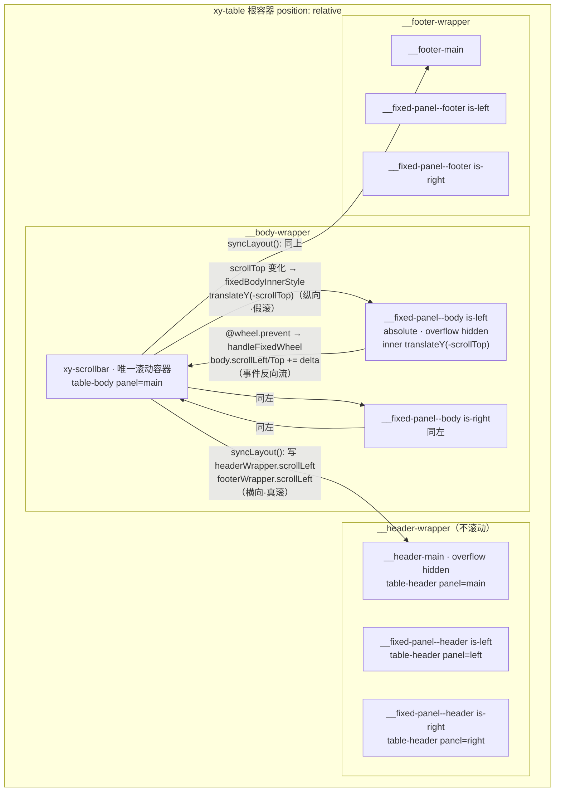
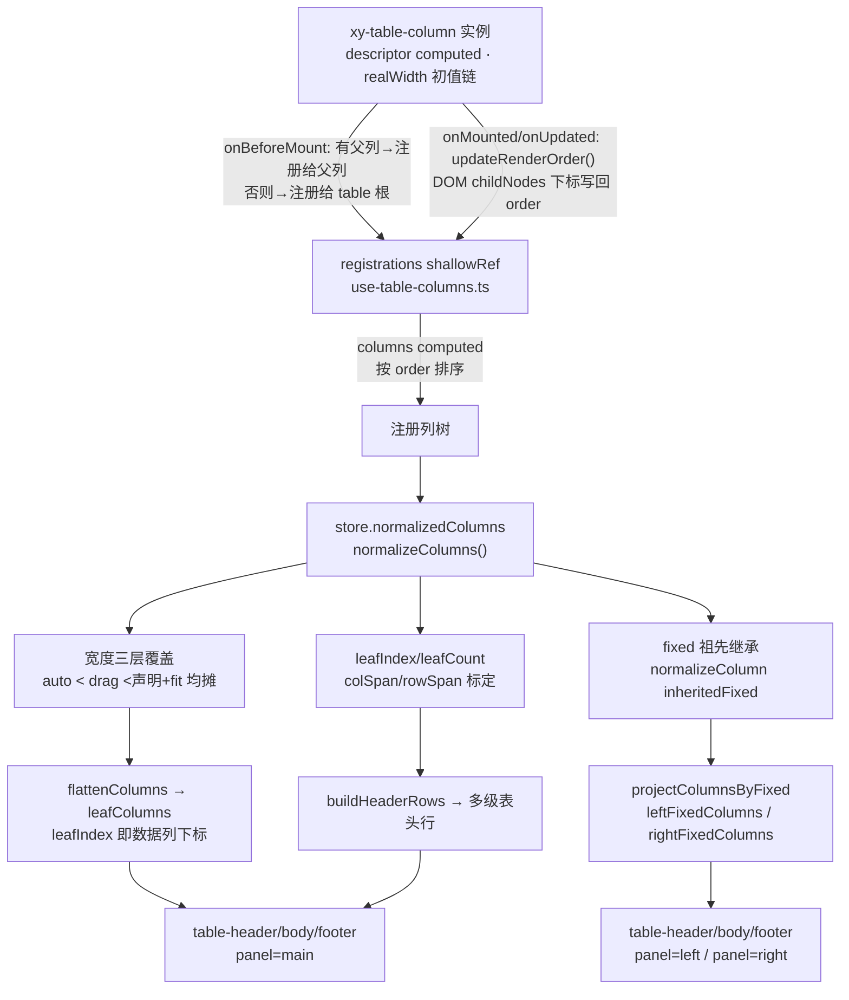

# 8-09 · Table：列模型与固定列

表格是组件库里最后一个"怪兽级"组件：它要把 `<xy-table-column>` 这种**声明式子组件**翻译成一棵真正的 `<table>` DOM 树，要在横向溢出时让一部分列钉死在左右两侧，还要在 72 个组件里唯一一个把 `xy-scrollbar` 拉进自己肚子里当内部零件（5-18 的考据，本篇展开）。本篇的核心问题是任务书上那句"DOM 镜像的代价与替代方案"——但真正动笔前必须先纠正一个时代直觉：**CSS `position: sticky` 是现代正解、DOM 镜像（Element Plus 老方案）已淘汰**，这句话作为行业趋势成立，作为本库的实码描述**不成立**。本库的固定列恰恰是镜像方案，而且不是 element-ui 那种"双表同步"，而是升级版的"三段式镜像面板"：表头、表体、合计各三份，共九张 `<table>`。全库搜索 `position: sticky` 在 `packages/components/table/` 与 `packages/theme/src/components/table.css` 中零命中。为什么 2026 年新写的组件库还要选镜像？这篇从列模型讲到同步管线，把这笔账算清楚。

先给结论的坐标：

- **列模型**：`xy-table-column` 以 provide/inject 注册进 `useTableColumns`（`packages/components/table/src/use-table-columns.ts:4-26`），经 `store` 的 `normalizeColumns` 完成宽度三层覆盖、fixed 继承、colSpan/rowSpan/leafIndex 标定（`packages/components/table/src/util.ts:69-150`），再投影出 main/left/right 三套列清单分别渲染（`packages/components/table/src/util.ts:299-335`）。
- **固定列**：镜像面板方案。主表在唯一的滚动容器里滚，左右固定面板是 `position: absolute` 的独立 `<table>`，纵向用 `translateY(-scrollTop)` 追平（`packages/components/table/src/table.vue:556-558`），横向靠表头容器被写入 `scrollLeft`（`packages/components/table/src/table-layout.ts:56-62`），滚轮在面板上被拦截后转发给主容器（`packages/components/table/src/table-layout.ts:80-90`）。
- **代价**：DOM 副本 ×3、行高同步管线（ResizeObserver + rAF）、auto 布局的克隆测量表、展开行占位、append 区的 padding 模拟——每一项都有一段专属源码，本篇逐个拆。

## 一、定论先行：九张表与三条同步通道

打开 `packages/components/table/src/table.vue` 的模板骨架，数一数 `<table>` 的份数。表头区（`table.vue:924-995`）渲染一份 main 的 `table-header`，再按 `store.hasLeftFixedColumns` / `hasRightFixedColumns` 各渲染一份左、右面板的 `table-header`；表体区（`table.vue:997-1177`）在 `xy-scrollbar` 里放 main 的 `table-body`，滚动容器外面再放左右两个 `xy-table__fixed-panel--body`；合计区（`table.vue:1179-1212`）同样三份 `table-footer`。组件为了拿住这九张表，一口气声明了九个 ref：

```ts
// packages/components/table/src/table.vue:219-231
const mainHeaderTableRef = ref<TableSectionExpose | null>(null);
const leftHeaderTableRef = ref<TableSectionExpose | null>(null);
const rightHeaderTableRef = ref<TableSectionExpose | null>(null);
const bodyScrollbarRef = ref<TableScrollbarExpose | null>(null);
const mainBodyTableRef = ref<TableSectionExpose | null>(null);
const leftBodyTableRef = ref<TableSectionExpose | null>(null);
const rightBodyTableRef = ref<TableSectionExpose | null>(null);
const mainFooterTableRef = ref<TableSectionExpose | null>(null);
const leftFooterTableRef = ref<TableSectionExpose | null>(null);
const rightFooterTableRef = ref<TableSectionExpose | null>(null);
let rowHeightSyncFrame: number | null = null;
let rowHeightResizeObserver: ResizeObserver | null = null;
let autoLayoutSyncFrame: number | null = null;
```

左右固定面板的表体长这样（以左面板为例，右面板 `table.vue:1132-1176` 逐行同构）：

```html
<!-- packages/components/table/src/table.vue:1086-1130 -->
<div
  v-if="store.bodyRows.value.length > 0 && store.hasLeftFixedColumns.value"
  class="xy-table__fixed-panel xy-table__fixed-panel--body is-left"
  :style="leftFixedStyle"
  @wheel.prevent="handleFixedWheel($event)"
>
  <div class="xy-table__fixed-panel-inner" :style="fixedBodyInnerStyle">
    <table-body
      ref="leftBodyTableRef"
      :store="store"
      :columns="store.leftFixedColumns.value"
      panel="left"
      :row-class-name="props.rowClassName"
      :row-style="props.rowStyle"
      :cell-class-name="props.cellClassName"
      :cell-style="props.cellStyle"
      :clickable="props.clickable"
      :striped="mergedStripe"
      :highlight-current-row="props.highlightCurrentRow"
      :indent="props.indent"
      :span-method="props.spanMethod"
      :tooltip-formatter="props.tooltipFormatter"
      :preserve-expanded-content="props.preserveExpandedContent"
      :table-layout="props.tableLayout"
      :show-header="props.showHeader"
      :virtual="props.virtual"
      :virtual-item-size="resolvedVirtualItemSize"
      :virtual-overscan="props.virtualOverscan"
      :scroll-top="layout.scrollTop.value"
      :viewport-height="layout.bodyClientHeight.value"
      :expanded-row-mode="hasExpandedRows ? 'placeholder' : 'none'"
      :main-table-width="mainTableWidth"
      :left-fixed-width="leftFixedWidth"
      :right-fixed-width="rightFixedWidth"
      @row-click="handleRowClick"
      @row-dblclick="handleRowDblclick"
      @row-contextmenu="handleRowContextmenu"
      @cell-click="handleCellClick"
      @cell-dblclick="handleCellDblclick"
      @cell-contextmenu="handleCellContextmenu"
      @cell-mouse-enter="handleCellMouseEnter"
      @cell-mouse-leave="handleCellMouseLeave"
    />
  </div>
</div>
```

这段模板浓缩了镜像方案的全部工程事实，值得逐行读：

1. **面板不是"列"，是"整张表"**。`table-body` 收到的 `columns` 是 `store.leftFixedColumns`——完整列树里被投影出的固定列子树（含分组表头结构），它自己渲染一张带 `<colgroup>`、`<thead>` sizing 行、`<tbody>` 的完整 `<table>`。这就是"镜像"的本义：固定列区域是主表某几列的完整克隆。
2. **同一份 store，两处渲染**。镜像表不复制数据、不复制状态，`store` 是同一个对象，`bodyRows`、`isRowSelected`、`isHoveredRow` 全部读同一批响应式状态。element-ui 时代镜像表最头疼的"选中态、hover 态两表不同步"，在本库里因为状态源唯一而天然消失——镜像的是 **DOM**，不是**状态**。
3. **滚动是三条通道**：面板自身 `overflow: hidden`（CSS 定死）不产生滚动；纵向靠 `fixedBodyInnerStyle` 的 transform 追平（`table.vue:556-558`）；滚轮事件被 `@wheel.prevent` 拦截后走 `handleFixedWheel` 反向推主容器（`table-layout.ts:80-90`）。

两条同步通道的样式与逻辑实码：

```css
/* packages/theme/src/components/table.css:196-228 */
.xy-table__fixed-panel {
  position: absolute;
  top: 0;
  bottom: 0;
  overflow: hidden;
  z-index: 6;
  pointer-events: none;
  background: var(--xy-table-surface-background-resolved);
}

.xy-table__fixed-panel > * {
  pointer-events: auto;
}

.xy-table__fixed-panel.is-left {
  left: 0;
  box-shadow: 1px 0 0 color-mix(in srgb, var(--xy-table-border-color) 96%, transparent);
}

.xy-table__fixed-panel.is-right {
  right: 0;
  box-shadow: -1px 0 0 color-mix(in srgb, var(--xy-table-border-color) 96%, transparent);
}

.xy-table__fixed-panel--body {
  top: 0;
  bottom: 0;
}

.xy-table__fixed-panel-inner {
  min-width: 100%;
  will-change: transform;
}
```

```ts
// packages/components/table/src/table-layout.ts:40-90
function syncLayout(emitScroll = false) {
  const body = bodyWrapperRef.value;

  if (!body) {
    return;
  }

  scrollLeft.value = body.scrollLeft;
  scrollTop.value = body.scrollTop;
  bodyClientWidth.value = body.clientWidth;
  bodyClientHeight.value = body.clientHeight;
  hasHorizontalScroll.value = body.scrollWidth > body.clientWidth;
  hasVerticalScroll.value = body.scrollHeight > body.clientHeight;
  showLeftShadow.value = body.scrollLeft > 0;
  showRightShadow.value = body.scrollLeft + body.clientWidth < body.scrollWidth - 1;

  if (headerWrapperRef.value) {
    headerWrapperRef.value.scrollLeft = body.scrollLeft;
  }

  if (footerWrapperRef.value) {
    footerWrapperRef.value.scrollLeft = body.scrollLeft;
  }

  if (
    emitScroll &&
    (lastEmittedScroll.scrollLeft !== scrollLeft.value ||
      lastEmittedScroll.scrollTop !== scrollTop.value)
  ) {
    lastEmittedScroll = {
      scrollLeft: scrollLeft.value,
      scrollTop: scrollTop.value
    };
  }
}

function handleBodyScroll() {
  syncLayout(true);
}

function handleFixedWheel(event: WheelEvent) {
  const body = bodyWrapperRef.value;

  if (!body) {
    return;
  }

  body.scrollLeft += event.deltaX;
  body.scrollTop += event.deltaY;
  syncLayout(true);
}
```

注意表头的横向同步用的是**写 `scrollLeft`** 而不是 transform：`__header-main` 在 `table.css:190-194` 里是 `overflow: hidden` 的普通容器，里面那张 main 表头有完整宽度，于是"表头跟着横向滚"实际上是让这个隐藏滚动条的容器自己滚动。这与固定面板的 `translateY` 是两套机制——横向"真滚"（浏览器原生滚动模型，浏览器负责合成），纵向"假滚"（transform 位移，JS 负责写入）。为什么纵向不也用真滚？因为固定面板的滚动必须**严格等于**主容器的滚动，一旦面板自己成为滚动容器，就要处理双方滚动事件的竞态与回弹差异；transform 是单向写入，主容器是唯一事实源，面板永远只是投影。这个"单向数据流"的滚动架构是本库镜像方案比 element-ui 干净的根本原因。



## 二、EP 对比：两代镜像与一次 sticky 化，本库为何"倒退"

把方案谱系摆出来，本库的位置才看得清。

**element-ui（Vue 2 / EP 1.x 时代）**：`.el-table__fixed` 是绝对定位的独立容器，里面是一张只含固定列的完整表格副本，通过监听主表 `scroll` 事件同步。它的痛点三连：行高靠 CSS 兜底但动态内容（换行、按钮换行）频繁错位，于是暴露 `doLayout` 让用户手动补救；hover 高亮靠 `mouse-enter/leave` 事件手工给镜像表的对应行加类；事件绑定要在两份 DOM 上做复杂的代理去重。**状态与 DOM 都镜像**，同步面极大。

**Element Plus 2.x**：把固定列重写为 `position: sticky`——`td/th` 直接贴 `left/right` 偏移，表头与表体合并进同一个滚动容器，DOM 副本消失，行高天然一致，hover 天然一致。这是"现代正解"的由来，也是本篇任务书那句考据的出处。EP 为此付出的代价是结构重构：滚动容器模型改变、旧版大量按 `__fixed` DOM 结构写的样式与测试全部重写。

**本库（2026 年新写）**：明明站在 EP sticky 化之后，却回到镜像——而且不是.element-ui 的双表，是九表。选择不是考古冲动，是四条约束的交集：

1. **真 `<table>` 语义**。本库三张 section 都是货真价实的 `<table>/<thead>/<tbody>/<tfoot>`（`header.vue:305-317`、`body.vue:550`、`footer.vue:79-87`），为的是 `colspan/rowspan`、表格阅读模式、`aria-rowcount/aria-colcount`（`table.vue:906-907`）。sticky 在 `td` 上虽可用，但 `rowspan` 跨行合并的单元格一旦被钉住，视觉上会"跨过"未固定的中间行，语义与视觉立即撕裂；`spanMethod` 是本库一等公民（`body.vue:167-172` 的 `normalizeSpanResult` 全表预计算跳格），镜像方案里 rowspan 照常工作，因为镜像表里那几列的 rowspan 关系和主表完全一致。
2. **表头不在滚动容器里**。sticky 表头方案要求 header 和 body 共享滚动容器或各自 sticky，而本库的表头是独立容器、由 `scrollLeft` 写入驱动（上文）。独立表头让"表头吸顶 + 表尾吸底 + `maxHeight` 语义"三件事都不需要 sticky 参与：`height`/`maxHeight` 只作用在 `__body-wrapper`（`table.vue:612-615` 的 `bodyWrapperStyle`），表头天然常驻。
3. **虚拟滚动是 transform 友好型**。本库虚拟滚动（`virtual` prop，`table.vue:104-106` 默认参数）用的是 spacer 行方案：上下两个 `<td>` 占位撑开总高（`body.vue:605-616` 与 `764-774`），窗口行原样渲染。主表纵向滚动是原生 scrollTop，固定面板用 `translateY(-scrollTop)` 投影即可对齐；虚拟模式下固定面板收到与主表相同的 `scrollTop/viewportHeight`（`table.vue:1114-1115`），两边窗口裁剪结果天然一致。若走 sticky，spacer 行的占位 `td` 也要跨列 sticky，二者叠加的边界条件（overscan 行进入视口瞬间的闪烁）远比 transform 投影难控。
4. **展开行的占位策略**。有 expand 列时，固定面板里的展开内容渲染为 `visibility: hidden` 的占位行（`body.vue:494-513` 的 `resolveExpandedContentStyle` 在 placeholder 模式下按 `mainTableWidth` 撑宽、测试 `table.spec.ts:1999-2032` 断言左右面板 `tr` 数量与主表一致为 3），确保左右高度永远追得上主表。sticky 方案没有"第二份 DOM"，展开行在横向滚动时是整行穿过固定列下方的——这正是 EP sticky 表格至今保留的一个视觉特性：展开内容会从固定列"底下"滑过。镜像方案里固定列永远盖在展开内容之上，视觉语义更"柱子"。这是取舍而非优劣：占位行让镜像方案付出每行一次的额外渲染，换来固定区域的绝对稳定。

一句话定论：**sticky 淘汰的是"状态 + DOM 双镜像"的老镜像；本库保留镜像的壳，用"状态单源 + transform 投影 + 事件反向流"把镜像的同步成本压到三条单向通道**。剩下真正要还的债，是行高与列宽的几何同步——下一节就是还债现场。

## 三、列模型：从 slot 注册到三套列清单

固定列只是列模型的消费者。先把生产线看完。

### 3.1 注册：子组件自报家门

`xy-table-column`（`packages/components/table/src/table-column.vue`）不渲染任何表格内容——它的模板只有一个隐藏容器（`table-column.vue:238-242`，仅在"无 prop 且默认插槽里嵌了子列"时用来探测子列 vnode）。真正的列定义在 `descriptor` computed 里（`table-column.vue:114-162`），关键三行：

```ts
// packages/components/table/src/table-column.vue:114-123（节选）
const descriptor = computed<TableResolvedColumn<T>>(() => ({
  uid,
  key: props.columnKey ?? props.prop ?? props.property ?? uid,
  type: props.type,
  prop: props.prop ?? props.property,
  label: props.label,
  columnKey: props.columnKey,
  width: props.width,
  minWidth: props.minWidth,
  realWidth: toNumberSize(props.width ?? props.minWidth),
  // ...
```

`realWidth` 在列声明处就有了初值（`width ?? minWidth`，字符串可解析数字、否则回落默认值），后面所有布局计算都基于这个 number。注册发生在 `onBeforeMount`（`table-column.vue:211-218`）：有父列上下文就注册给父列（分组列），否则注册给 table 根——两级 inject/provide 的注册协议定义在 `packages/components/table/src/tokens.ts:4-28`，`tableColumnContextKey` 携带 `level`，分组嵌套深度由此累加（`table-column.vue:107-112`）。

注册表本体只有 27 行：

```ts
// packages/components/table/src/use-table-columns.ts:4-26
export function useTableColumns<T = Record<string, unknown>>() {
  const registrations = shallowRef<TableColumnRegistration<T>[]>([]);
  const sortRegistrations = (items: TableColumnRegistration<T>[]) =>
    items.slice().sort((left, right) => left.order.value - right.order.value);

  const registerColumn: TableContext<T>["registerColumn"] = (column) => {
    registrations.value = sortRegistrations([...registrations.value, column]);
  };

  const unregisterColumn: TableContext<T>["unregisterColumn"] = (uid) => {
    registrations.value = registrations.value.filter((column) => column.uid !== uid);
  };

  const columns = computed(() =>
    sortRegistrations(registrations.value).map((column) => column.descriptor.value)
  );

  return {
    columns,
    registerColumn,
    unregisterColumn
  };
}
```

`order` 是列的排序键，初值取组件实例 uid。但 uid 是注册顺序，不是**模板书写顺序**——用户把某列在模板里挪个位置，vnode 顺序变了，注册顺序没变。于是有 `updateRenderOrder`（`table-column.vue:195-209`）：`onMounted` 与每次 `onUpdated` 时，用 `instance.subTree.el` 拿到本列的锚点注释节点，在父容器 `childNodes` 里找到自己的下标写回 `order.value`。注册模型是"响应式集合 + DOM 序校正"的混合体——这是 slot 注册模式（5-04 Breadcrumb 引过同款）在表格上的最强形态，因为表格对列顺序是像素级敏感的。注册与注销的完整生命周期：

```ts
// packages/components/table/src/table-column.vue:184-235
const registration = {
  uid,
  order,
  descriptor
} as TableColumnRegistration<T>;

function resolveAnchorNode() {
  const node = (instance?.subTree?.el ?? instance?.vnode?.el) as Node | null | undefined;
  return node ?? null;
}

function updateRenderOrder() {
  const anchorNode = resolveAnchorNode();

  if (!anchorNode?.parentNode) {
    return;
  }

  const targetNode = anchorNode as ChildNode;
  const siblings = Array.from(anchorNode.parentNode.childNodes);
  const nextOrder = siblings.indexOf(targetNode);

  if (nextOrder >= 0 && nextOrder !== order.value) {
    order.value = nextOrder;
  }
}

onBeforeMount(() => {
  if (parentColumn) {
    parentColumn.registerChildColumn(registration);
    return;
  }

  table?.registerColumn(registration);
});

onMounted(() => {
  updateRenderOrder();
});

onUpdated(() => {
  updateRenderOrder();
});

onBeforeUnmount(() => {
  if (parentColumn) {
    parentColumn.unregisterChildColumn(uid);
    return;
  }

  table?.unregisterColumn(uid);
});
```

注意一个类型上的细节：`registration` 对象里装的是 `order`（`Ref<number>`）与 `descriptor`（`ComputedRef<TableResolvedColumn<T>>`）这两个**响应式引用本身**，不是值——注册表持有引用，列声明任何变化（改 `width`、改 `label`）都沿着 `descriptor` 直接流到 store 的 computed 链，不需要重新注册。`v-if` 切换列时 `onBeforeUnmount` 注销、重新挂载时再注册，`order` 在 `onMounted` 里被 DOM 序校正覆盖，`table.spec.ts:1338` 的"运行时切换 v-if 列时会按最新顺序渲染单元格"用例锁的就是这条链。

### 3.2 归一化：一次遍历做完五件事

`normalizeColumns`（`util.ts:69-150`）是列模型的中枢，一次深度优先遍历同时完成宽度覆盖、fit 均摊、fixed 继承、colSpan/rowSpan/leafIndex 标定：

```ts
// packages/components/table/src/util.ts:69-150
export function normalizeColumns<T>(
  columns: TableResolvedColumn<T>[],
  widthOverrides: Record<string, number>,
  tableShowOverflowTooltip?: TableOverflowTooltip,
  tableTooltipEffect?: TableOverflowTooltipOptions["effect"],
  tableTooltipOptions?: TableOverflowTooltipOptions,
  fit = true,
  containerWidth?: number
) {
  const maxLevel = getMaxLevel(columns);
  let leafIndex = 0;
  const leafWidthOverrides: Record<string, number> = {};
  const hasWidthOverride = (uid: string) =>
    Object.prototype.hasOwnProperty.call(widthOverrides, uid);

  const baseColumns = columns.map((column) =>
    normalizeColumn(
      column,
      widthOverrides,
      tableShowOverflowTooltip,
      tableTooltipEffect,
      tableTooltipOptions,
      maxLevel,
      column.fixed
    )
  );
  const leafColumns = flattenColumns(baseColumns);

  if (fit && containerWidth && containerWidth > 0) {
    const totalWidth = leafColumns.reduce((sum, column) => sum + column.realWidth, 0);
    const extraWidth = Math.floor(containerWidth - totalWidth);

    if (extraWidth > 0 && leafColumns.length > 0) {
      const flexibleColumns = leafColumns.filter(
        (column) => column.width === undefined && !hasWidthOverride(column.uid)
      );
      const nonOverriddenColumns = leafColumns.filter((column) => !hasWidthOverride(column.uid));
      const targetColumns =
        flexibleColumns.length > 0
          ? flexibleColumns
          : nonOverriddenColumns.length > 0
            ? nonOverriddenColumns
            : leafColumns;
      const evenExtra = Math.floor(extraWidth / targetColumns.length);
      let remainder = extraWidth % targetColumns.length;

      targetColumns.forEach((column) => {
        leafWidthOverrides[column.uid] = column.realWidth + evenExtra + (remainder > 0 ? 1 : 0);
        if (remainder > 0) {
          remainder -= 1;
        }
      });
    }
  }

  const normalize = (column: TableResolvedColumn<T>): TableResolvedColumn<T> => {
    const children = column.children.map(normalize);
    const isLeaf = children.length === 0;
    const realWidth = isLeaf
      ? (leafWidthOverrides[column.uid] ?? column.realWidth)
      : children.reduce((sum, child) => sum + child.realWidth, 0);
    const leafCount = isLeaf ? 1 : children.reduce((sum, item) => sum + item.leafCount, 0);
    const normalized: TableResolvedColumn<T> = {
      ...column,
      children,
      realWidth,
      leafCount,
      colSpan: leafCount,
      rowSpan: isLeaf ? maxLevel - column.level + 1 : 1,
      leafIndex: isLeaf ? leafIndex : (children[0]?.leafIndex ?? leafIndex)
    };

    if (isLeaf) {
      normalized.leafIndex = leafIndex;
      leafIndex += 1;
    }

    return normalized;
  };

  return baseColumns.map(normalize);
}
```

五件事各有讲究：

- **宽度覆盖合并**：`widthOverrides` 入参是 `{...autoWidthOverrides, ...widthOverrides}`（`store/index.ts:117-123`）——拖拽宽度压过 auto 测量宽度压过声明宽度，同一张表里三层覆盖的优先级在这一个展开式里定死。
- **fixed 继承**：`normalizeColumn`（`util.ts:152-199`）把父列的 `fixed` 传给全部子孙（第 161 行 `inheritedFixed ?? column.fixed`）。这是"分组列 fixed 向子列传播"的源头，测试 `table.spec.ts:1806-1834` 专门锁了它：二级分组标 `fixed="left"`、孙子里有一列标 `fixed="right"`，断言右面板**不存在**——孙子继承了祖先的 left，自己的 right 被覆盖。这个语义值得停一下：EP 里同级声明冲突会告警，本库直接规定"祖先优先级最高"，规则简单但不可表达"同组内一左一右"，是拿表达力换确定性。
- **fit 均摊的三级目标**：容器有富余宽度时，先只摊给"没写 width 且没被覆盖"的弹性列；没有弹性列就摊给所有未被拖拽覆盖的列；再没有就摊给全部列。每列分到 `evenExtra`，余数按顺序一列 1px 分完（`remainder` 递减）。**没有弹性比例（flex 权重）机制**——富余宽度严格均分，`minWidth` 只在初值链里生效（`width ?? minWidth`，不可声明"我至少 200、弹性更多"）。这是列宽分配的第一处权衡：EP 用 `min-width` 参与 flex 比例分配（`fit` 模式下按权重分富余），本库选择了"声明宽度 = 绝对宽度 + 均摊补零"的朴素模型，换来三表（main/左/右）`<colgroup>` 可以用同一组确定的像素值（`header.vue:281-286` 的 `resolveColWidth` 同时写 `width` 与 `minWidth` 双保险），任何弹性分配在三表模型下都要面临"主表分到的宽度与镜像表重算结果不一致"的撕裂风险——均摊牺牲表达力，买的是三表像素级一致的确定性。
- **leafIndex/leafCount/colSpan/rowSpan**：叶子列获得全局递增的 `leafIndex`（列数据下标的唯一真相），分组列的 `colSpan` 是叶子数、`rowSpan` 是 `maxLevel - level + 1`——多级表头的 `<th colspan rowspan>` 直接由这四个字段渲染（`header.vue:325-344`），`buildHeaderRows`（`util.ts:260-282`）把列树摊成行数组。
- **类型列的默认宽**：初值链的兜底在 `resolveColumnWidth`（`util.ts:573-594`）：selection 52、index 64、expand 56、普通列 160（`config.ts:3-6`）。`type` 列在模型里只是"有默认宽 + 有专用单元格渲染"的普通列：selection 渲染 checkbox（`body.vue:644-651`）、expand 渲染三角按钮（`body.vue:653-677`）、index 在 `getCellValue` 里特判（`store/index.ts:635-645`，支持函数与偏移量两种 `index` 声明）。没有独立的"类型系统"，四个 `TableColumnType`（`table.ts:10`）是渲染分支的枚举而已。



### 3.3 投影：固定列树是怎么裁出来的

三层覆盖里最"动"的一层是拖拽。`resizable` 列的表头右缘挂着一个 8px 宽的命中区（`table.css:503-511`），`mousedown` 进入手写拖拽循环（`table-header/header.vue:163-211`）：

```ts
// packages/components/table/src/table-header/header.vue:163-211
function startResize(column: TableResolvedColumn<T>, event: MouseEvent) {
  if (event.button !== 0 || !canResizeColumn(column)) {
    return;
  }

  event.preventDefault();
  event.stopPropagation();

  const startCell = (event.currentTarget as HTMLElement | null)?.closest("th");
  const tableElement = startCell?.closest(".xy-table");

  if (!startCell || !tableElement) {
    return;
  }

  const startX = event.clientX;
  const startCellRect = startCell.getBoundingClientRect();
  const tableLeft = tableElement.getBoundingClientRect().left;
  const startWidth = startCellRect.width;
  const oldWidth = Math.round(startWidth);
  const startLeft = startCellRect.right - tableLeft;
  const startColumnLeft = startCellRect.left - tableLeft;
  const minLeft = startColumnLeft + 40;
  const previousCursor = document.body.style.cursor;
  const previousUserSelect = document.body.style.userSelect;

  document.body.style.cursor = "col-resize";
  document.body.style.userSelect = "none";
  emit("header-dragstart", startLeft);

  const handleMouseMove = (moveEvent: MouseEvent) => {
    const nextLeft = Math.max(minLeft, startLeft + (moveEvent.clientX - startX));
    emit("header-dragmove", nextLeft);
  };

  const handleMouseUp = (upEvent: MouseEvent) => {
    window.removeEventListener("mousemove", handleMouseMove);
    window.removeEventListener("mouseup", handleMouseUp);
    document.body.style.cursor = previousCursor;
    document.body.style.userSelect = previousUserSelect;

    const finalLeft = Math.max(minLeft, startLeft + (upEvent.clientX - startX));
    const newWidth = Math.max(40, Math.round(finalLeft - startColumnLeft));
    props.store.setColumnWidth(column.uid, newWidth);
    emit("header-dragend", newWidth, oldWidth, column, upEvent);
  };

  window.addEventListener("mousemove", handleMouseMove);
  window.addEventListener("mouseup", handleMouseUp);
}
```

拖拽期间组件不直接改宽度，只 emit `header-dragstart/dragmove` 让 table.vue 挪一根列宽参考线 `__column-resize-proxy`（模板在 `table.vue:913-918`，水平位置由 `resizeProxyStyle` 的 `left` 驱动，`table.vue:632-634`）；`mouseup` 时才把最终宽度一次性写入 `store.setColumnWidth`。**拖拽过程零重排、松手一次布局**——若 mousemove 里实时写列宽，三表 colgroup 每帧重排的代价在宽表上会直接掉帧。另一处细节是 40px 下限写死在两处（`minLeft` 与 `newWidth`），与 store 侧 `Math.max(40, ...)`（`store/index.ts:1177`）三重兜底。`canResizeColumn`（`header.vue:226-236`）还尊重 `allowDragLastColumn` prop：末列不可拖时禁用，因为末列拖宽会联动表格总宽，与 `fit` 语义打架。（顺带记一笔：这根参考线与后文 4.4 节的两处死样式同病——`__column-resize-proxy` 在主题里同样没有规则，`v-show` 与 `left` 都在动，但没有 `position: absolute` 的定位基底，参考线实际不可见。）

镜像方案要求左右面板各自拿到"自己那份列树"，`projectColumnsByFixed`（`util.ts:299-335`）做深度投影——叶子按 `fixed` 归属筛选，分组节点的子列全被裁掉则整组消失，留下的分组重新计算 `leafCount/colSpan/realWidth/rowSpan`，最后过一遍 `finalizeColumnTree`（`util.ts:609-639`）重排 leafIndex：

```ts
// packages/components/table/src/util.ts:299-335
export function projectColumnsByFixed<T>(
  columns: TableResolvedColumn<T>[],
  section: Exclude<TableSection, "main">
) {
  const project = (column: TableResolvedColumn<T>): TableResolvedColumn<T> | null => {
    const children = column.children
      .map((child) => project(child))
      .filter((item): item is TableResolvedColumn<T> => Boolean(item));

    if (children.length === 0 && column.fixed !== section) {
      return null;
    }

    const leafCount =
      children.length > 0 ? children.reduce((sum, item) => sum + item.leafCount, 0) : 1;
    const realWidth =
      children.length > 0
        ? children.reduce((sum, item) => sum + item.realWidth, 0)
        : column.realWidth;

    return {
      ...column,
      fixed: section,
      children,
      leafCount,
      colSpan: leafCount,
      rowSpan: children.length > 0 ? 1 : column.rowSpan,
      realWidth
    };
  };

  return finalizeColumnTree(
    columns
      .map((column) => project(column))
      .filter((item): item is TableResolvedColumn<T> => Boolean(item))
  );
}
```

投影结果在 store 里派生为四份 computed（`store/index.ts:133-136`）：`leftFixedColumns/rightFixedColumns`（树，给 header 的多级结构）与 `leftFixedLeafColumns/rightFixedLeafColumns`（叶子，给宽度求和）。面板总宽是纯求和（`table.vue:550-555`）：

```ts
// packages/components/table/src/table.vue:547-558
const mainTableWidth = computed(() =>
  store.leafColumns.value.reduce((total, column) => total + column.realWidth, 0)
);
const leftFixedWidth = computed(() =>
  store.leftFixedLeafColumns.value.reduce((total, column) => total + column.realWidth, 0)
);
const rightFixedWidth = computed(() =>
  store.rightFixedLeafColumns.value.reduce((total, column) => total + column.realWidth, 0)
);
const fixedBodyInnerStyle = computed(() => ({
  transform: props.virtual ? undefined : `translateY(-${layout.scrollTop.value}px)`
}));
```

`getFixedOffsets`（`util.ts:337-366`）还产出了第三份几何数据——每个固定列在面板内的左右偏移表，这是为 sticky 迁移预留的形状（sticky 化时每个 `td` 的 `left: getFixedOffsets().left[uid]` 就地可用），当前版本里它像一座建好未通车的大桥：模板与 CSS 都没有消费 `fixedOffsets`，镜像面板用的是"整块面板 + 整体 transform"，不需要逐列偏移。这份死数据与后文两处死样式一起，构成了"从镜像迁往 sticky 的半张图纸"。

还有一个容易忽视的细节：固定面板的渲染条件带 `store.bodyRows.value.length > 0`（`table.vue:1087/1133`），空态时左右面板整体不渲染——空态只需要一张 100% 宽的空表。运行时从"无固定列"切到"有固定列"，`v-if` 直接挂载新面板，`table.spec.ts:1267-1302` 验证了这条链路：`nameFixed` 从 `false` 改为 `"left"` 两个 nextTick 后，左面板出现且表头文本就位。`fixed` 支持 `boolean | "left" | "right"`（`table.ts:11`），`normalizeFixed`（`table.ts:469-479`）把 `true` 归一为 `"left"`——`fixed` 裸写等于左固定，与 EP 语义一致。

## 四、还债现场：镜像方案的同步管线

方案选型定了，代价就要逐项还。镜像方案的债有四笔：行高、列宽、滚轮、周边区域。

### 4.1 行高同步：ResizeObserver + rAF 的调度链

主表与镜像表的行高各自由内容决定，两边内容不同（镜像表没有展开内容、只有部分列），换行行为必然不同。本库的解法是**测量取胜**：每行取三表中的最大 `getBoundingClientRect().height`，回写为显式 `style.height`。核心在 `table.vue:293-338`：

```ts
// packages/components/table/src/table.vue:293-338
function syncFixedPanelRowHeights() {
  rowHeightResizeObserver?.disconnect();

  const headerTables = [
    getSectionTable(mainHeaderTableRef),
    getSectionTable(leftHeaderTableRef),
    getSectionTable(rightHeaderTableRef)
  ];
  const bodyTables = [
    getSectionTable(mainBodyTableRef),
    getSectionTable(leftBodyTableRef),
    getSectionTable(rightBodyTableRef)
  ];
  const footerTables = [
    getSectionTable(mainFooterTableRef),
    getSectionTable(leftFooterTableRef),
    getSectionTable(rightFooterTableRef)
  ];
  const allTables = [...headerTables, ...bodyTables, ...footerTables];

  allTables.forEach(clearTableRowHeights);

  if (!store.hasFixedColumns.value) {
    return;
  }

  syncTableGroupRowHeights(headerTables);
  syncTableGroupRowHeights(bodyTables);
  syncTableGroupRowHeights(footerTables);
  observeRowHeightTables();
}

function scheduleFixedPanelRowHeightSync() {
  if (typeof window === "undefined") {
    return;
  }

  if (rowHeightSyncFrame !== null) {
    window.cancelAnimationFrame(rowHeightSyncFrame);
  }

  rowHeightSyncFrame = window.requestAnimationFrame(() => {
    rowHeightSyncFrame = null;
    syncFixedPanelRowHeights();
  });
}
```

四个细节暴露了这条管线的成熟度：

1. **先清零再测量**。`clearTableRowHeights`（`table.vue:237-245`）先把所有 `tr` 的显式高度清空——上一轮写入的高度若不清掉，本轮测到的是"被上一轮钉死的值"，误差会滚雪球。测量必须发生在"无干预的自然布局"上。
2. **按 section 分组同步**。表头、表体、表尾三组各自独立取最大值，避免表尾行高被表体行高污染（三组的视觉基准不同）。
3. **无固定列时早退**，但**清零照做**——从有固定列切回无固定列，残留的显式行高会让主表行高僵死。
4. **rAF 合帧**。`scheduleFixedPanelRowHeightSync` 把并发触发合并到下一帧，`onBeforeUnmount` 里取消未执行帧（`table.vue:531-534`）。触发源有三类：watch 列宽/行数/固定列变化（`table.vue:471-493`）、watch 九张表 ref 换绑（`table.vue:495-516`）、ResizeObserver 回调（`table.vue:458-469`，同时触发 auto 列宽重测）。测试 `table.spec.ts:1836-1875` mock 掉 rAF 立即执行，给六个 `tr` 分别注入不同的 `getBoundingClientRect` 返回值，断言三表同行高度都被钉成组内最大——这条管线是被测试钉死的行为，不是隐式副作用。

与 element-ui 对比：EP 老方案把行高交给"重新布局"（`doLayout` 全量重算），本质是同一种测量取胜，但触发靠用户手动调用；本库把它做成 ResizeObserver 驱动的自动管线，`doLayout`（`table.vue:789-794`）退化为手动兜底入口——内部就是依次调用 auto 列宽同步、layout 同步、scrollbar update、行高同步四件事。

### 4.2 auto 布局的克隆测量表：最贵的一笔债

`tableLayout="fixed"`（默认）下所有宽度来自声明与均摊，不需要测量；但 `table-layout="auto"` 模式（`table.ts:12`，CSS 端 `table.css:154-156` 切换 `--xy-table-layout: auto`）的语义是"列宽由内容决定"——这就必须测量 DOM。麻烦在于：body 表的 `<thead>` 位置放着一个隐藏的 sizing 表头（`body.vue:558-604`，`table.css:258-300` 把它压成零高零字号），用来给 auto 表格提供表头内容参与测宽；但**固定面板的存在让 body 表的宽度约束失真**（面板盖在上面不改变滚动宽度，但 `min-width: 100%` 的约束会让"内容总宽小于容器"的测量结果偏小）。于是 `createAutoLayoutMeasurementTable`（`table.vue:387-441`）造了一张**克隆表**：

```ts
// packages/components/table/src/table.vue:387-441（节选）
function createAutoLayoutMeasurementTable(sourceTable: HTMLTableElement) {
  if (sourceTable.getBoundingClientRect().width <= 0 || layout.bodyClientWidth.value <= 0) {
    return sourceTable;
  }

  const measurementHost = document.createElement("div");
  const measurementTable = sourceTable.cloneNode(true) as HTMLTableElement;
  const width = Math.max(
    layout.bodyClientWidth.value,
    bodyScrollbarRef.value?.wrapRef?.clientWidth ?? 0,
    rootRef.value?.clientWidth ?? 0
  );

  measurementHost.setAttribute("aria-hidden", "true");
  measurementHost.style.position = "absolute";
  measurementHost.style.left = "0";
  measurementHost.style.top = "0";
  measurementHost.style.width = width > 0 ? `${width}px` : "100%";
  measurementHost.style.height = "0";
  measurementHost.style.overflow = "hidden";
  measurementHost.style.visibility = "hidden";
  measurementHost.style.pointerEvents = "none";
  measurementHost.style.zIndex = "-1";

  measurementTable.querySelectorAll("colgroup").forEach((element) => {
    element.remove();
  });
  // ……把 sizing 表头恢复为正常 thead 参与 auto 测宽，重建 colgroup 后量 th 宽
```

`cloneNode(true)` 整树克隆、摘掉旧 colgroup、恢复 sizing 表头、按"已知列宽 + 未知列放行"重建 colgroup，挂到 `zIndex: -1` 的隐形宿主里量 `th` 的 `getBoundingClientRect().width`（`table.vue:364-374`），量完立刻 `measureTable.parentElement?.remove()`（`table.vue:376-378`）。每个 auto 模式的数据/列变更帧都要付一次"整表克隆 + 布局 + 删除"的成本。这是镜像方案的债被放大的一处：sticky 单表方案里 auto 布局是浏览器原生的（`table-layout: auto` 本身就是浏览器算的），根本不需要 JS 测量。**镜像方案必须把布局算法从浏览器手里收回来自己做**，因为三张表要共享同一组列宽，而浏览器只会各自为政。测量值由 store 侧的宽度覆盖 API 收编，这一组函数同时服务拖拽与 auto 测量两条产线：

```ts
// packages/components/table/src/store/index.ts:1174-1219
function setColumnWidth(uid: string, width: number) {
  widthOverrides.value = {
    ...widthOverrides.value,
    [uid]: Math.max(40, Math.round(width))
  };
}

function hasColumnWidthOverride(uid: string) {
  return Object.prototype.hasOwnProperty.call(widthOverrides.value, uid);
}

function syncAutoColumnWidths(widths: Record<string, number>) {
  const nextWidths: Record<string, number> = {};

  Object.entries(widths).forEach(([uid, width]) => {
    if (!Number.isFinite(width)) {
      return;
    }

    const normalizedWidth = Math.max(40, Math.round(width));

    if (normalizedWidth > 0) {
      nextWidths[uid] = normalizedWidth;
    }
  });

  const previousEntries = Object.entries(autoWidthOverrides.value);
  const nextEntries = Object.entries(nextWidths);

  if (
    previousEntries.length === nextEntries.length &&
    nextEntries.every(([uid, width]) => autoWidthOverrides.value[uid] === width)
  ) {
    return;
  }

  autoWidthOverrides.value = nextWidths;
}

function clearAutoColumnWidths() {
  if (Object.keys(autoWidthOverrides.value).length === 0) {
    return;
  }

  autoWidthOverrides.value = {};
}
```

`syncAutoColumnWidths` 收下测量值时做了两件防御：`Math.max(40, Math.round(width))` 归一（亚像素测量值四舍五入、40px 以下禁止回灌，防止内容为空的列把宽度测成 0 然后自我坍缩）；与上一次结果逐项全等则**短路不写 ref**——测量本身不改变布局，若每次都写回会形成"测量 → 渲染 → 再测量"的无限循环，这个全等短路是 auto 模式稳定性的关键一环。`clearAutoColumnWidths` 则只在非空时赋值（`store/index.ts:1213-1219`），避免空对象引用替换触发无谓的 `normalizedColumns` 重算。切换 `tableLayout` 回 `fixed` 时由 watch 调用它清场（`table.vue:857-872`）。

### 4.3 展开行占位与 append 区的几何模拟

有 expand 列时，主表的展开行 `<td colspan="全列数">` 撑开整行（`body.vue:741`），镜像表必须造一个等高的影子行，否则纵向 transform 之后左右错位。`body.vue` 的 `expandedRowMode`（`"content" | "placeholder" | "none"`，`body.vue:24`）就是干这个的：主表用 `content`，镜像表在存在 expand 列时用 `placeholder`（`table.vue:1116` 的 `:expanded-row-mode="hasExpandedRows ? 'placeholder' : 'none'"`），占位内容 `visibility: hidden; pointer-events: none`（`table.css:674-677`），宽度按 `mainTableWidth` 撑（`body.vue:494-503`）。没有 expand 列时镜像表直接 `none`——影子行都省了，因为普通数据行三表行数恒等。

`append` 插槽（表格底部的附加区）更微妙：它渲染在滚动容器内、表格之外（`table.vue:1076-1083`），横向滚动时 append 区是跟随内容滚动的，于是它的左边缘会被滚出视野，固定列"盖不住"它。本库的补法是给 append 区注入 padding（`table.vue:620-625`）：

```ts
// packages/components/table/src/table.vue:620-625
const appendWrapperStyle = computed(() => ({
  width: mainTableWidth.value > 0 ? toCssSize(mainTableWidth.value) : undefined,
  minWidth: "100%",
  paddingLeft: leftFixedWidth.value > 0 ? toCssSize(leftFixedWidth.value) : undefined,
  paddingRight: rightFixedWidth.value > 0 ? toCssSize(rightFixedWidth.value) : undefined
}));
```

左侧有固定列，append 内容就整体右移一个左面板宽——内容滚到最左时，起始文字恰好出现在左面板的右侧边缘，视觉上"固定列区域的 append 部分为空"。这是用几何预留模拟"列盖住内容"，sticky 方案在 append 区同样需要这类预留（EP 的 append 也是靠padding 处理），说明这笔债不属于镜像专属，属于"固定列"这个概念本身。

### 4.4 滚动状态与阴影：一个半成品的现场

`scrollingStateClass`（`table.vue:559-577`）根据 `showLeftShadow/showRightShadow` 计算出 `is-scrolling-none/left/middle/right` 四态挂到根元素（`table.vue:601`）。但检索 `table.css`，**这四个类没有任何规则消费**——`is-scrolling` 在主题包中零命中。固定列的边界视觉实际由两条常驻样式承担：面板自身的 1px 内描边 `box-shadow`（`table.css:210-218`，用 `color-mix` 把边框色调淡 4%），以及 `--xy-table-shadow-size: 12px`（`table.css:110`）驱动的渐变阴影 `.xy-table__fixed-shadow`（`table.css:725-750`）——而后者在组件模板中**同样零消费**。也就是说：阴影体系是按"四态控制渐变显隐"设计的（EP 正是 `is-scrolling-middle` 时才显示 `fixed-shadow` 渐变），现状是"描边常驻 + 渐变和状态类都停在半空"。类似地，`getFixedOffsets` 建好未用、`header.vue:381-388` 渲染的 `xy-table__caret-wrapper`/`xy-table__sort-caret` 排序小三角在主题里没有样式（`table.css:465-483` 定义的 `__sort-trigger`/`__sort-icon` 反而无人引用）——两套排序图标的痕迹互不咬合，是 EP 时代 sort-caret 命名的残留。这几处"图纸与施工不符"不影响功能（描边已提供边界感），但读源码时要知道它们是待接线的桩，不是已生效的机制。

## 五、三处设计权衡的总结账

**权衡一：sticky vs 镜像。** sticky 赢在 DOM 单份、行高/事件天然一致、浏览器合成不占 JS；镜像赢在 rowspan/expand 语义完整、表头模型独立、虚拟滚动与固定列解耦。本库的镜像不是 element-ui 的复刻——把"状态镜像"砍掉了（单 store 渲染两处），把"事件镜像"砍掉了（镜像表自己也是正常的事件源，`row-click` 从镜像表同样 emit，`table.vue:1120-1127`），只保留几何镜像，同步面收敛为行高、列宽、scrollTop 三个数。代价前文列了四笔；收益是上文四条约束全部满足。若未来放弃真 `<table>` 语义（改 div-grid）或放弃 `spanMethod`，sticky 迁移的图纸（`getFixedOffsets`）已在，但那是另一个组件了。

**权衡二：列宽分配——均摊 vs 弹性。** 声明宽度绝对化 + 富余均摊（`util.ts:97-122`），没有 flex 权重、`minWidth` 不参与分配。换取的是：三表 colgroup 用同一组确定像素（`resolveColWidth` 双写 width/minWidth），auto 模式测量结果可以精确回灌。失去的是：用户无法声明"这列至少 200、多余给多点"——只能靠 `tableLayout="auto"` 整表交给测量。这个取舍在三表模型下其实是被迫的：任何弹性分配都要求"分配时刻"有唯一的容器宽度事实源，而镜像表与主表的可用宽度在滚动条出现与否的瞬间可能不一致，均摊把这个问题从根上消掉。

**权衡三：scrollbar 封装度——全库唯一内部消费方。** 表体的滚动容器不是裸 `overflow: auto`，而是 `xy-scrollbar`（`table.vue:1001-1011`）：自绘 thumb 负责视觉（5-18 的第一档），`native`/`always`/`tabindex` 三个 prop 从 table 透传（`table.vue:93-96` 默认值段，`table.css:186-188` 还为 `scrollbarAlwaysOn` 开了 `scrollbar-gutter: stable both-edges` 防止 thumb 出现/消失引起表头错位）。table 是全库唯一把 xy-scrollbar 当内部零件的组件，也是唯一消费 `scrollTo/setScrollLeft/setScrollTop/update` 四个方法（`table.vue:796-812` 的实例方法直接转发给 `bodyScrollbarRef`）的组件。封装度选择的理由：表格是横向+纵向双向滚动的唯一高频场景，原生滚动条在 320px 高的表格里出现双十字滚动条时视觉权重过大；而表格又要求 `scroll` 事件有统一出口（`table.vue:728-741` 的 `emitScrollState` 用 `"${scrollLeft}:${scrollTop}"` 字符串键去重，`lastScrollEventKey` 在 174 行初始化）。把 scrollbar 内置，等于把 5-18 的自绘几何直接借来当表格的滚动状态源。

**权衡四（附带）：列状态键的归一。** 排序/筛选状态不挂在列实例上，而以 `columnKey ?? prop` 为键集中存于 store（`getColumnStateKey`，`table.ts:460-462`）：`sortProp/sortOrder/filterValues` 支持 props 受控优先（`store/index.ts:152-157`）、`cycleSortOrder` 按 `sortOrders` 数组循环（默认 `["ascending", "descending", null]`，`table.ts:423-433` 归一去重）、`sortable="custom"` 时 `processedNodes` 跳过内置排序只发 `sort-change` 事件（`store/index.ts:282`）。类型侧 `TableSortState`（`table.ts:34-37`）只有 `prop/order` 两个可选字段——排序状态故意瘦身为"单列生效"，没有多列排序的 `sorts:[]`。筛选的生效点在 `matchesFilter`（`util.ts:404-423`）：多值 some 匹配、自定义 `filterMethod` 优先、树形行"自身不匹配但子匹配则保留"（`store/index.ts:256-274` 的递归过滤）。这些状态全部经过 `resolvedFilterValues`（`store/index.ts:158-179`）三层合流（列 `filteredValue` > props `filterValues` > 内部状态），与 4-04 的受控/非受控双模协议完全同构。

## 六、测试与类型夹具：这套模型被什么锁着

`packages/components/table/__tests__/table.spec.ts`（3892 行）按能力域分 describe，与列模型直接相关的关键用例：

- `运行时切换列 width 与 fixed 时，会同步更新列宽和固定分区`（1267-1302 行）——fixed 布尔/方向运行时切换、colgroup 宽度响应式更新；
- `fixed body panel 会渲染左右分区并复用行状态`（1970-1997 行）——12 行数据左右面板各渲染 12 行、内容一致；
- `展开行在 fixed 面板中会渲染占位行，保持左右分区高度同步`（1999-2032 行）——主表 3 行（含展开行）时左面板也是 3 行且存在占位展开行；
- `分组列 fixed 会向子列传播，保持固定分区一致`（1806-1834 行）——祖先 fixed 覆盖孙子的 right；
- `doLayout 会同步主表与 fixed 面板的行高`（1836-1875 行）——mock 三表不同行高，断言按组取最大回写。

类型夹具 `tests/types/fixtures/table.ts` 把模型契约钉在编译层：31-56 行穷举 `TableInstance` 全部方法（`table.ts:403-421` 的接口在 4-10 泛型篇引过，这里每个方法都有调用断言）；185-205 行验证三种类型列的声明约束——selection 列允许 `selectable/reserveSelection/fixed`，index 列的 `index` 字段接受函数，expand 列允许固定；163-179 行验证 `rowKey` 的深层路径泛型（`table.ts:160-174` 的 `TablePath` 递归类型）在 `"meta.identity.id"` 这类嵌套键上的收窄，以及非法键 `@ts-expect-error` 报错。

文档示例侧，`apps/docs/examples/table/fixed-resizable.vue:37-60` 是固定列的标准展示位：左右各两组固定列、`height="320"`、`:fit="false"` 关闭均摊让 1180px 声明总宽横向溢出，恰好同时点亮镜像面板、边界描边与列拖拽三个特性；`append-scroll.vue:56` 则演示 append 区 + `scrollbar-always-on` 的滚动状态回显。工具栏那句提示"向右横向滚动后，可以直接观察固定列边界阴影与表头边界状态"，对应的正是 4.4 节那套（描边生效、渐变待接线）的现状。

## 七、收束：列模型是 9 卷的地基

回头看本篇开头的定论：本库固定列是**状态单源、几何镜像**的三段式面板，sticky 未能取代它的原因不在 CSS 兼容性，而在真 `<table>` 语义 + `spanMethod` + 独立表头 + 虚拟滚动这组约束的交集。镜像的全部代价——行高同步管线、克隆测量表、展开占位、append 几何预留——都已显式落码并被测试钉住；`is-scrolling-*` 状态类、`fixed-shadow` 渐变、`fixedOffsets` 偏移表三处"建好未接线"的桩，则诚实标注了从镜像通往 sticky 的剩余距离。

这套列模型还有一层意义：它是 9 卷《ProTable（上）：配置模型》（9-24）的地基——pro-table 的"一份列配置声明 14 种渲染与编辑器"，最终都要降维成这里的 `TableResolvedColumn` 树与 main/left/right 三套投影。理解了本篇，9 卷的列配置引擎只是在 `descriptor` 的上游多套了一层 schema 翻译。

下一篇 8-10《Pagination：页码窗口》，我们离开九张表的重量级现场，去看 `xy-pagination` 里那个轻巧但精妙的问题：当总页数 500、当前页 499，页码条上的省略号"…"应该出现在哪几个位置、窗口怎么随当前页滑动——椭圆省略的窗口算法，以及它与 table 组件的联动边界。

---

**附：本篇引用源码坐标速查**

| 文件 | 行号区间 | 内容 |
| --- | --- | --- |
| `packages/components/table/src/table.vue` | 93-96 | scrollbar 相关 props 默认值（5-18 引过） |
| 同上 | 219-231 | 九张表的 ref 与三个调度句柄 |
| 同上 | 293-338 | 行高同步管线 + rAF 调度 |
| 同上 | 387-441 | auto 布局克隆测量表 |
| 同上 | 547-558 | 三表宽度 computed 与 translateY |
| 同上 | 559-577 | scrollingStateClass 四态（主题未消费） |
| 同上 | 620-625 | append 区固定列 padding 预留 |
| 同上 | 1001-1084 | xy-scrollbar 消费段（5-18 引过） |
| 同上 | 1070-1074 | empty 消费段（7-07 引过） |
| 同上 | 1086-1130 | 左固定面板模板（右面板 1132-1176 同构） |
| `packages/components/table/src/table-layout.ts` | 40-90 | syncLayout 三通道 + handleFixedWheel |
| `packages/components/table/src/use-table-columns.ts` | 4-26 | 列注册表 |
| `packages/components/table/src/table-column.vue` | 114-162 / 184-235 | descriptor 与注册生命周期 |
| `packages/components/table/src/util.ts` | 69-150 | normalizeColumns 五合一 |
| 同上 | 299-335 / 337-366 | fixed 投影与偏移表 |
| 同上 | 573-594 | 类型列默认宽 |
| `packages/components/table/src/store/index.ts` | 117-145 / 1174-1219 | 列宽覆盖与派生 |
| `packages/theme/src/components/table.css` | 174-188 | scrollbar 段（5-18 引过） |
| 同上 | 196-228 | fixed-panel 全套 |
| 同上 | 725-750 | fixed-shadow 渐变（模板未消费） |
| `packages/components/table/__tests__/table.spec.ts` | 1267-1302 / 1806-1834 / 1970-2032 | fixed 相关关键用例 |
| `tests/types/fixtures/table.ts` | 31-56 / 185-205 | 实例方法与类型列夹具 |
| `apps/docs/examples/table/fixed-resizable.vue` | 37-60 | 固定列标准示例 |
