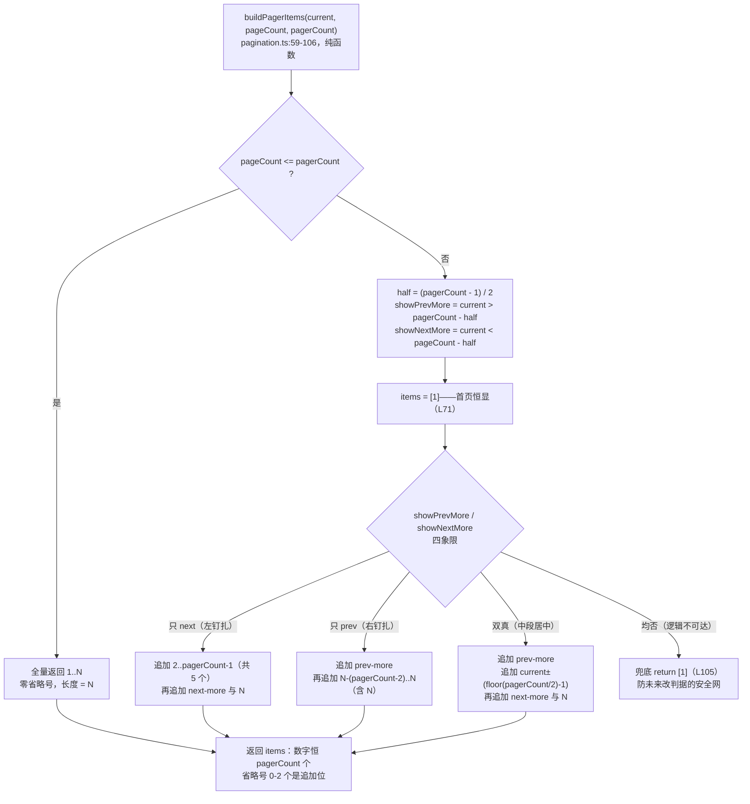
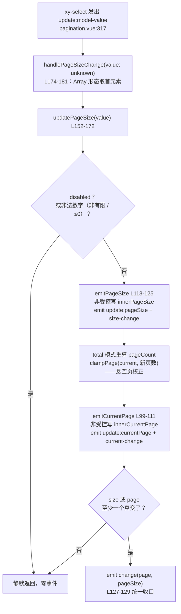

# 8-10 · Pagination：页码窗口

> 本篇是"组件深潜"卷数据展示组（8 卷）的第十篇。按大纲（`column/02-分卷大纲.md:146`）本篇的核心问题只有九个字：**椭圆省略的窗口算法**——总页数超过 `pager-count` 时显示哪几页、两个省略号在什么条件下出现又何时消失、边界页 1 与 N 如何恒显、当前页怎么在窗口里居中偏移。先亮底牌：这个窗口**不是**"当前页永远居中"的几何滑动窗口，而是**阈值钉扎制**——窗口一旦滑到边界就被钉住，对侧省略号随之消失；而钉扎的全部判据只有两个不等式，共四行代码。这套算法被抽成一个导出的纯函数 `buildPagerItems`，与组件完全解耦；但讽刺的是，单测并没有为它立起边界矩阵——本篇会用实码跑出矩阵补上这笔账。

接到题目先复述一遍目标，防止写偏。分页器要管的事可以压成五件：**总页数从哪来**（`total / pageSize / pageCount` 三源归一的优先级）、**页码窗口怎么折**（本篇核心，第二节展开）、**layout 怎么编排**（`->` 把一行布局劈成左右两簇，模板为此付出了整段复制的代价）、**当前页与每页条数的受控语义**（双桥模式与事件收口）、**sizes 下拉怎么来**（内部直接复用 select 组件，不是自绘）。第五件是任务规格里的一个问句——"sizes——内部消费 select？"——实码定论：是的，`pagination.vue:5` 直接 `import XySelect from "../../select"`，6-15 那颗泛型浮层受控组件被整个塞进了分页器。

先交代代码体量，给后面所有讨论一个标尺。`packages/components/pagination/src/pagination.vue` 当前实态 442 行，`pagination.ts` 106 行，`index.ts` 18 行，合计 566 行；配上 214 行的单测（10 用例实跑全绿）、298 行的主题 CSS、37 行的类型夹具、96 行的文档页和 6 个示例（basic 54 行 / disabled 3 行 / filter-reset 72 行 / layout 20 行 / server-sync 32 行 / size 18 行）。清单注册在 `packages/components/component-manifest.json:605-611`，`styleImports` 指向 `pagination`。全文件 `wc -l` 合计 1410 行——在 72 个基础组件里，pagination 是极少数"逻辑文件里没有一行 Vue 运行时代码"的组件：`pagination.ts` 只有类型与三个纯函数，连 `vue` 都不 import。

## 一、页数从哪来：三源归一与一个纯函数文件

窗口算法的输入不是三样，是四样：当前页、总页数、`pager-count`，外加一个"总页数本身从哪来"的前置问题。`pagination.ts:40-106` 一次性给出了答案，这段是本篇引用的第一个大块——三个纯函数全文：

```ts
// packages/components/pagination/src/pagination.ts:40-106
export function clampPage(page: number, pageCount: number) {
  if (page < 1) {
    return 1;
  }

  if (page > pageCount) {
    return pageCount;
  }

  return page;
}

export function normalizePagerCount(value: number | undefined) {
  const fallback = 7;
  const input = Number.isInteger(value) ? Number(value) : fallback;
  const limited = Math.min(21, Math.max(5, input));
  return limited % 2 === 0 ? limited - 1 : limited;
}

export function buildPagerItems(
  currentPage: number,
  pageCount: number,
  pagerCount: number
): Array<number | "prev-more" | "next-more"> {
  if (pageCount <= pagerCount) {
    return Array.from({ length: pageCount }, (_, index) => index + 1);
  }

  const halfPagerCount = (pagerCount - 1) / 2;
  const showPrevMore = currentPage > pagerCount - halfPagerCount;
  const showNextMore = currentPage < pageCount - halfPagerCount;
  const items: Array<number | "prev-more" | "next-more"> = [1];

  if (!showPrevMore && showNextMore) {
    for (let page = 2; page < pagerCount; page += 1) {
      items.push(page);
    }

    items.push("next-more", pageCount);
    return items;
  }

  if (showPrevMore && !showNextMore) {
    items.push("prev-more");

    const startPage = pageCount - (pagerCount - 2);
    for (let page = startPage; page <= pageCount; page += 1) {
      items.push(page);
    }

    return items;
  }

  if (showPrevMore && showNextMore) {
    items.push("prev-more");

    const offset = Math.floor(pagerCount / 2) - 1;
    for (let page = currentPage - offset; page <= currentPage + offset; page += 1) {
      items.push(page);
    }

    items.push("next-more", pageCount);
    return items;
  }

  return items;
}
```

三个函数三件事。**`clampPage`** 是页码值的一维钳制：任何来源的页码（jumper 输入、prev/next 步进、换每页条数后的校正）最终都要过它，保证落回 `[1, pageCount]`。**`normalizePagerCount`** 处理的是"每页显示几个按钮"这个配置本身的合法性：非整数回退 7、压进 `[5, 21]`、偶数减一取奇。实跑一遍归一表：`3 → 5`、`4 → 5`、`7 → 7`、`8 → 7`、`7.5 → 7`、`22 → 21`、`undefined → 7`。为什么必须奇数？因为窗口算法的核心量 `halfPagerCount = (pagerCount - 1) / 2` 要求"中窗两侧对称"——偶数会让 half 落在半格上，`2..pagerCount-1` 的循环长度与中窗宽度对不齐。为什么 5 是下限？`pagerCount = 3` 时中窗只剩 1 格，两个省略号加首尾页已经把窗口撑爆，钉扎逻辑退化；21 是上限，纯粹是防呆——没人需要一屏 40 个按钮。

这里有一个与 Element Plus 的第一处分岔，值得单独记账。EP 侧对 `pager-count` 用的是 prop validator（element-plus `packages/components/pagination/src/pagination.ts`）：

```ts
pagerCount: {
  type: Number,
  validator: (value: unknown) => {
    return (
      isNumber(value) &&
      Math.trunc(value) === value &&
      value > 4 &&
      value < 22 &&
      value % 2 === 1
    );
  },
}
```

validator 的语义是"非法就开发期告警、调用方自己改"；本库的 `normalizePagerCount` 语义是"非法就静默归一成最近的合法值"。一个是契约式（你得听我的），一个是修复式（我替你修好）。修复式的代价是"传错了也没有任何信号"——`pager-count="8"` 会被悄悄改成 7，调试时这是个隐形变量；契约式的代价是控制台红字。本库选修复式，与全库"配置尽量不炸"的姿态一致（6-09 的 InputNumber 精度钳制、6-11 的 Slider step 吸附都是同一路数），但两边的取舍都成立，这里如实并陈。

总页数本身则由组件里的 `pageCountBridge` 归一（`pagination.vue:72-82`）：`pageCount` 显式传入时优先（`Math.max(1, props.pageCount)`，负数与 0 都被抬到 1）；否则 `total / pageSize` 向上取整；两者都没有就退回 1。优先级"显式总页数 > 总条数换算"与 EP 一致——EP 文档同样注明 page-count 传入时优先于 total。这个桥的存在让窗口算法的签名里只需要一个 `pageCount`，不用感知 total 的存在。

**权衡一：pager-count 的校验策略——validator 告警 vs 静默归一。** 这笔账在组件库层面是个立场题：EP 的 validator 把非法值挡在"开发期红字"这一层，生产环境里非法值会怎样行为未定义；本库把它挡在"运行时钳制"这一层，任何输入都有确定行为但没有信号。写组件库的人倾向于前者（错误要早爆），用组件库的人往往喜欢后者（页面别白屏）。本库几乎全库取"确定行为"，这大概是最集中的三次表态之一（另两次见 `normalizePagerCount` 与下文 jumper 的清空跳页）。

## 二、窗口算法：阈值钉扎，不是几何居中

进入本篇核心。先立靶子：**"总页数超出 pager-count 时显示哪几页"存在两种思路**——

1. **几何居中制**：把当前页永远放窗口正中，窗口往两边滑，滑到头用 `Math.max / Math.min` 钳回边界。直觉、对称，但要显式处理"钳到边界后窗口贴边"的退化形态，省略号的出现条件反而变成"窗口钳过没有"的派生结果。
2. **阈值钉扎制**：先算两个布尔——"该不该显示前省略号 / 该不该显示后省略号"，再按四个象限（全显 / 只前 / 只后 / 双省略）各自成段地生成页码数组。窗口的"居中"只是双省略象限里的一个巧合，不是设计目标。

本库的实码定论是**第 2 种，而且与 EP 逐字同源**。两个判据（`pagination.ts:69-70`）：

```ts
const showPrevMore = currentPage > pagerCount - halfPagerCount;
const showNextMore = currentPage < pageCount - halfPagerCount;
```

`halfPagerCount = (pagerCount - 1) / 2`。拿默认 `pagerCount = 7` 翻译成人话：`showPrevMore` 在当前页大于 4 时为真（即第 5 页起才需要"…往左还有"），`showNextMore` 在当前页小于"总页数减 3"时为真（倒数第 3 页起"…往右还有"就该消失）。这两个不等式同时是**窗口的边界守卫**：任务规格里问"当前页居中偏移的 clamp 在哪"——答案是**没有一个显式的 clamp**。双省略象限里窗口是 `currentPage ± offset`（`offset = Math.floor(pagerCount / 2) - 1`，7 档时即 ±2），它能不越界，靠的正是这两个阈值的逻辑保证：能走进双省略象限意味着 `currentPage ≥ 5`，所以 `currentPage - 2 ≥ 3 > 1`（左窗沿压不穿首页）；同时 `currentPage ≤ N - 4`，所以 `currentPage + 2 ≤ N - 2 < N`（右窗沿压不穿末页）。clamp 藏在阈值判定里，不在偏移计算里——这是阈值钉扎制最优雅的一点，也是它和"居中制 + Math.max/min"在代码形态上最容易认错的分岔。

四个象限各自的产出，用默认 7 档、总页数 100 实跑一遍（直接跑仓库里的 `buildPagerItems`，不是手算）：

| 当前页 | 走进的象限 | 实际渲染（… 代表 more） | 数组长度 |
| --- | --- | --- | --- |
| 1–4 | 只 next | `1 2 3 4 5 6 … 100` | 8 |
| 5–96 | 双省略 | `1 … 48 49 50 51 52 … 100`（当前页 50 时） | 9 |
| 97–100 | 只 prev | `1 … 95 96 97 98 99 100` | 8 |
| ≤100 且页数 ≤7 | 全显 | `1 2 3 4 5 6 7` | 7 |

这张表里藏着三条实码定论。**其一，滑动临界点精确在 4→5 与 96→97**：第 4 页还在"左钉扎"形态（窗口钉在开头，2..6 五个页码紧贴首页 1），第 5 页窗口瞬间弹到居中；第 96 页还居中，第 97 页窗口瞬间钉到结尾（N-5..N 六个页码贴住末页）。**其二，不变量：数字按钮恒等于 pagerCount 个**——三种折叠形态下数字页码都是 7 个，省略号是"额外追加"的 0 到 2 个。推论有点反直觉：中段（双省略）的条带比两端宽 1 个位（9 vs 8），条带总宽度会随翻页"呼吸"。EP 用同一套公式，同款呼吸。**其三，`pagination.ts:105` 的兜底 `return items`（只含 `[1]`）在 `pageCount > pagerCount` 的前提下逻辑不可达**——两个布尔至少一个为真，否则会推出 `N ≤ pagerCount` 与前提矛盾。它防的不是数学，是将来有人改判据时留下的安全网。

整条判定流画成图：



省略号不是装饰，是可点的。点击行为在 `pagination.vue:193-203`：

```ts
// packages/components/pagination/src/pagination.vue:193-207
function handlePagerItemClick(item: number | "prev-more" | "next-more") {
  if (typeof item === "number") {
    updatePage(item);
    return;
  }

  const delta = normalizedPagerCount.value - 2;
  updatePage(
    item === "prev-more" ? currentPageBridge.value - delta : currentPageBridge.value + delta
  );
}

function isActivePage(item: number | "prev-more" | "next-more") {
  return typeof item === "number" && item === currentPageBridge.value;
}
```

步长 `delta = pagerCount - 2 = 5`，恰好等于中窗宽度（`2 × offset + 1 = 5`）——点一下省略号，窗口整体翻过一个身位，落在上一窗的窗口尾/下一窗的窗口头附近。EP 的 `onPagerClick` 里同样是 `const pagerCountOffset = props.pagerCount - 2`，连 aria 播报都用这个数（EP 的省略号 aria-label 是"向前/向后 {pagerCount - 2} 页"）。边界上也有同款"撞墙"行为：第 5 页点前省略号，`5 - 5 = 0`，被 `clampPage` 拉回第 1 页——窗口刚展开时，省略号背后没有一整个身位的纵深，只能撞到首页。这不是 bug，是阈值钉扎制的固有边界，两家行为一致。

**权衡二（本篇最重的）：窗口的生成策略——哨兵数组一次成型 vs 模板分层渲染。** EP 的 pager（`packages/components/pagination/src/components/pager.vue`，dev 分支）把"页码数组"和"省略号开关"拆成两份状态：`pagers` computed 只算**中段数字**（首尾 1 和 N 由模板固定渲染，省略号 li 用 `v-if="showPrevMore"` 挂在模板层），而 `showPrevMore / showNextMore` 是两个 ref，靠一个 watch 从 props 同步——computed 管数组、watch 管开关，同一套判据维护在两处：

```ts
// element-plus packages/components/pagination/src/components/pager.vue（dev 分支，节选）
const pagers = computed(() => {
  const pagerCount = props.pagerCount
  const halfPagerCount = (pagerCount - 1) / 2
  const currentPage = Number(props.currentPage)
  const pageCount = Number(props.pageCount)
  let showPrevMore = false
  let showNextMore = false
  if (pageCount > pagerCount) {
    if (currentPage > pagerCount - halfPagerCount) {
      showPrevMore = true
    }
    if (currentPage < pageCount - halfPagerCount) {
      showNextMore = true
    }
  }
  const array: number[] = []
  if (showPrevMore && !showNextMore) {
    const startPage = pageCount - (pagerCount - 2)
    for (let i = startPage; i < pageCount; i++) {
      array.push(i)
    }
  } else if (!showPrevMore && showNextMore) {
    for (let i = 2; i < pagerCount; i++) {
      array.push(i)
    }
  } else if (showPrevMore && showNextMore) {
    const offset = Math.floor(pagerCount / 2) - 1
    for (let i = currentPage - offset; i <= currentPage + offset; i++) {
      array.push(i)
    }
  } else {
    for (let i = 2; i < pageCount; i++) {
      array.push(i)
    }
  }
  return array
})

watch(
  () => [props.pageCount, props.pagerCount, props.currentPage],
  ([pageCount, pagerCount, currentPage]) => {
    const halfPagerCount = (pagerCount - 1) / 2
    let showPrev = false
    let showNext = false
    if (pageCount > pagerCount) {
      showPrev = currentPage > pagerCount - halfPagerCount
      showNext = currentPage < pageCount - halfPagerCount
    }
    quickPrevHover.value &&= showPrev
    quickNextHover.value &&= showNext
    showPrevMore.value = showPrev
    showNextMore.value = showNext
  },
  { immediate: true }
)
```

本库的答法是**把首尾页、省略号、数字全部编进同一个数组**，省略号是字符串哨兵 `"prev-more" / "next-more"`，模板一个 `v-for` 吃掉整张数组，判据只算一次。收益有三：单一状态源（不会有"数组与开关短暂失同步"的中间帧）；算法可以抽成无依赖纯函数导出（`pagination.ts:59` 的签名里没有任何 Vue 类型，index.ts 也没导出它，但它**可以**被直接单测）；模板里省略号与数字共用同一套 class/aria 逻辑。代价是类型层把 `number | "prev-more" | "next-more"` 的联合渗进了模板的每一个判断（`isActivePage`、`:key="String(pager)"`、两个渲染同字符 `…` 的 `v-if` 分支——`pagination.vue:283-285` 里 prev-more 与 next-more 渲染的是同一个字符，只靠 `is-more` class 区分样式）。EP 那边同一集合的循环写法也不同：右钉扎用 `i < pageCount` 排他循环再在模板补 N，本库用 `page <= pageCount` 包含循环——结果集一致，写法两个流派。顺带一提，EP 的省略号有 hover/focus 双触发形态（`quickPrevHover / quickPrevFocus`，悬停时 `…` 换成 d-arrow-left 双箭头图标），本库的省略号是静态的 `…`——这是视觉层的显式裁剪，不是遗漏。

## 三、受控双桥：current 与 pageSize 的三层语义

窗口是纯函数，状态是活的。当前页与每页条数都走"受控优先、非受控兜底、v-model 通知"的三层协议——4-04 讲过的受控/非受控双模，在 pagination 里是最完整的一个样本。先看状态底座（`pagination.vue:42-97`）：

```vue
// packages/components/pagination/src/pagination.vue:42-97
const ns = useNamespace("pagination");
const { size: globalSize } = useConfig();
const innerCurrentPage = ref(props.defaultCurrentPage);
const innerPageSize = ref(props.defaultPageSize);
const mergedSize = computed(() => props.small ? "sm" : (props.size ?? globalSize.value));
const isCurrentPageControlled = computed(() => typeof props.currentPage === "number");
const isPageSizeControlled = computed(() => typeof props.pageSize === "number");
const layoutItems = computed(() =>
  props.layout
    .split(",")
    .map((item) => item.trim())
    .filter(Boolean) as PaginationLayoutKey[]
);
const rightWrapperIndex = computed(() => layoutItems.value.indexOf("->"));
const leftLayoutItems = computed(() =>
  rightWrapperIndex.value >= 0
    ? layoutItems.value.slice(0, rightWrapperIndex.value)
    : layoutItems.value
);
const rightLayoutItems = computed(() =>
  rightWrapperIndex.value >= 0 ? layoutItems.value.slice(rightWrapperIndex.value + 1) : []
);
const currentPageBridge = computed(() => props.currentPage ?? innerCurrentPage.value);
const pageSizeBridge = computed(() => props.pageSize ?? innerPageSize.value);
const pageSizeOptions = computed<SelectOption<number>[]>(() =>
  props.pageSizes.map((size) => ({
    label: `${size} 条`,
    value: size
  }))
);
const pageCountBridge = computed(() => {
  if (typeof props.pageCount === "number") {
    return Math.max(1, props.pageCount);
  }

  if (typeof props.total === "number") {
    return Math.max(1, Math.ceil(props.total / pageSizeBridge.value));
  }

  return 1;
});
const normalizedPagerCount = computed(() => normalizePagerCount(props.pagerCount));
const pagerItems = computed(() =>
  buildPagerItems(currentPageBridge.value, pageCountBridge.value, normalizedPagerCount.value)
);
const showPagination = computed(() => {
  if (!layoutItems.value.length) {
    return false;
  }

  if (props.hideOnSinglePage && pageCountBridge.value <= 1) {
    return false;
  }

  return typeof props.total === "number" || typeof props.pageCount === "number";
});
```

五个关键点。**其一，受控判定是 `typeof props.currentPage === "number"`**——不传（undefined）即非受控，传了即受控；没有"半受控"中间态。**其二，双桥**：`currentPageBridge = props.currentPage ?? innerCurrentPage.value`，读的永远是桥；写的时候看 `isControlled` 决定写不写 inner。**其三，`small` 优先于 `size`**（L46 的三元），`size` 再兜底全局配置链的 `globalSize`——三级尺寸源，`small: true` 是硬覆盖。**其四，layout 的 `->` 解析**：`split(",") → trim → filter` 之后 `indexOf("->")` 一刀两断，右簇由 CSS 的 `margin-left: auto`（`pagination.css:21-23`）推到行尾。**其五，`showPagination` 的三重门**：layout 为空不渲染；`hideOnSinglePage` 且总页数 ≤ 1 不渲染；`total` 与 `pageCount` 都不是数字也不渲染——防御到最后，组件宁可消失也不渲染一个"共 undefined 条"。

写入路径是全部事件语义的收口（`pagination.vue:99-150`）：

```vue
// packages/components/pagination/src/pagination.vue:99-150
function emitCurrentPage(nextPage: number) {
  if (nextPage === currentPageBridge.value) {
    return false;
  }

  if (!isCurrentPageControlled.value) {
    innerCurrentPage.value = nextPage;
  }

  emit("update:currentPage", nextPage);
  emit("current-change", nextPage);
  return true;
}

function emitPageSize(nextPageSize: number) {
  if (nextPageSize === pageSizeBridge.value) {
    return false;
  }

  if (!isPageSizeControlled.value) {
    innerPageSize.value = nextPageSize;
  }

  emit("update:pageSize", nextPageSize);
  emit("size-change", nextPageSize);
  return true;
}

function emitCombinedChange(page: number, pageSize: number) {
  emit("change", page, pageSize);
}

function updatePage(nextPage: number, source?: "prev" | "next") {
  if (props.disabled) {
    return;
  }

  const page = clampPage(nextPage, pageCountBridge.value);
  const changed = emitCurrentPage(page);

  if (!changed) {
    return;
  }

  if (source === "prev") {
    emit("prev-click", page);
  } else if (source === "next") {
    emit("next-click", page);
  }

  emitCombinedChange(page, pageSizeBridge.value);
}
```

`emitCurrentPage` 的返回值是个容易被略过的设计：它返回"这次写入是否真的改变了值"，`updatePage` 拿这个布尔决定要不要继续发 `prev-click / next-click / change`——**同值点击是静默的**，单测 `pagination.spec.ts:137-138` 正好锁了这个语义（disabled 组件上点 next，`emitted()` 为空对象）。事件扇出共六路：`update:currentPage / current-change`（页码对）、`update:pageSize / size-change`（条数对）、`prev-click / next-click`（带来源标记的步进专属事件），最后所有变化统一再发一个 `change(page, pageSize)` 收口——这是给"只关心'请求参数变了'"的调用方准备的聚合通道，server-sync 示例（`apps/docs/examples/pagination/server-sync.vue:7-12`）消费的正是它。

最丰富的一条链路是换每页条数。它不只是换 pageSize——**总页数变了，当前页可能悬空**（第 10 页、每页 10 条、总数 95，切到每页 50 条后总共只剩 2 页）：

```vue
// packages/components/pagination/src/pagination.vue:152-181
function updatePageSize(value: number | null) {
  if (props.disabled) {
    return;
  }

  if (typeof value !== "number" || !Number.isFinite(value) || value <= 0) {
    return;
  }

  const pageSizeChanged = emitPageSize(value);
  const nextPageCount =
    typeof props.total === "number" ? Math.max(1, Math.ceil(props.total / value)) : pageCountBridge.value;
  const nextPage = clampPage(currentPageBridge.value, nextPageCount);
  const currentChanged = emitCurrentPage(nextPage);

  if (!pageSizeChanged && !currentChanged) {
    return;
  }

  emitCombinedChange(nextPage, value);
}

function handlePageSizeChange(value: unknown) {
  if (Array.isArray(value)) {
    updatePageSize(typeof value[0] === "number" ? value[0] : null);
    return;
  }

  updatePageSize(typeof value === "number" ? value : null);
}
```

三个细节。**第一，非法值守卫**（L157-159）：非数字、非有限、非正数一律静默丢弃——size select 的 options 由内部生成（`pagination.vue:66-71` 的 `` `${size} 条` ``），理论上不会出非法值，这道门防的是透传进来的脏数据。**第二，`nextPageCount` 只在 `total` 模式下重算**（L162-163）——`pageCount` 模式下总页数是调用方声明的，换 pageSize 不改写它，当前页也就不校正（钳制用的是旧页数）。**第三，`handlePageSizeChange` 的 `Array.isArray` 分支**是个防御性补丁：内部 select 是单选，正常只会吐数字，这个分支在防"select 的 value 形态将来变化"或消费方透传了数组形态的值——宁可写一行死代码也不让类型系统之外的形态炸进 emit 链。这条链路有单测压阵（`pagination.spec.ts:46-69`）：当前页 10、总数 95、每页 10 条，切到 50 条后断言 `update:pageSize` 发 50、`update:currentPage` 发 2、`change` 发 `[2, 50]`——一次交互、三组事件、校正链全绿。

`change(page, pageSize)` 收口画成图：



**权衡三：受控 current 语义——桥上只读、写入分流、prop 回写 inner。** 这套三层协议里最讲究的是两个 watch（`pagination.vue:213-229`）：受控模式下 props.currentPage 变化时**同步回写 innerCurrentPage**。inner 在受控期间根本没人读（桥被 props 短路），回写图什么？图的是**模式的平滑迁移**：父组件某天把 `:current-page` 绑定摘掉，组件瞬间切回非受控态，此时 inner 若停在旧值，页码会跳变；回写让 inner 永远追踪最新受控值，摘绑定的那一刻状态连续。这是 4-04 里"受控优先"模式的标准姿势，pagination 是全库实现得最完整的一处。但同一段还有一处**不对称**值得记账（`pagination.vue:231-239`）：总页数收缩时（total 变小导致 pageCount 降），watch 只在非受控模式下钳 inner，**受控模式既不回写也不发事件**——父组件若不同步修正，页码会停在越界值上：窗口里找不到 50 这个数字、`aria-current` 无处落座、next 按钮因 `currentPageBridge >= pageCountBridge` 永久禁用。对照组是换 sizes 路径——那条路在受控模式下会主动 emit 校正后的页码（L165 的 `emitCurrentPage` 无条件走 emit 分支）。同一个"页码悬空"问题，两条路径两种态度；受控调用方务必自己处理 total 收缩，这是协议里最该写进文档却只在实码里可见的一条。

顺带把 jumper 的账记了。快捷跳页是原生 `<input type="number">`（`pagination.vue:330-337`，min=1、max=pageCount、`:value` 单向绑定桥、`@change` 提交），`handleJumperChange`（L183-191）把 `event.target.value` 过 `Number()` 后直接进 `updatePage`。边界在这里：`Number("") === 0`，`Number.isFinite(0)` 为真——**把跳页框清空后失焦，组件会跳到第 1 页**。EP 侧 jumper 是 `el-input` 封装，空值会被拦在输入组件层；本库的原生 input 把这个边界直接交给了 `clampPage`。行为确定（跳 1），但恐怕和多数用户的预期（留在原地）不同——如实记录，属于"确定行为派"的又一次表态。

## 四、layout 编排：-> 分裂与模板复制的代价

layout 是字符串协议：`"prev, pager, next, jumper, ->, total"`。解析已在第三节看过（`pagination.vue:49-63`），渲染端的结构值得单独说：`->` 把条目劈成 `leftLayoutItems` 与 `rightLayoutItems` 两簇，各自进一个 `<template v-for>`——而这两个 `<template v-for>` 的内部，是**几乎逐字复制的两大段模板**。左簇 `pagination.vue:253-344`，右簇 L348-439，各 92 行，prev/pager/next/sizes/total/jumper/slot 七种条目的全部标记写了两遍。这不是偷懒，是无子组件架构下的必然：本库没有像 EP 那样把分页器拆成 prev/next/sizes/jumper/total/pager 六七个子组件文件，而是 442 行单文件。收益是单文件内聚、无 props 转发损耗；代价就是这两段 92 行的镜像——改一处忘了另一处，左右两簇行为就会分叉。如果未来 layout 条目再增一种，这份复制会从 92 行涨到 184 行以上，届时拆子组件的收益会压过成本——现在的账算平，是个"临界的单文件"。

两段镜像里有一处恒等函数的遗痕（`pagination.vue:209-211`）：

```vue
// packages/components/pagination/src/pagination.vue:209-211
function renderLayoutItem(item: PaginationLayoutKey) {
  return item;
}
```

它把入参原样返回，模板里全部 `v-if="renderLayoutItem(item) === 'prev'"` 都等价于 `v-if="item === 'prev'"`。这层间接没有类型收益（两个写法在 vue-tsc 里都会收窄联合类型），读起来更像一次渲染函数重构的遗留——照录为观察，不改判：它是死重，但无害。

页码窗的模板本体不长，值得全文过一遍（左簇节选，右簇同构）：

```vue
// packages/components/pagination/src/pagination.vue:265-288
        <ul
          v-else-if="renderLayoutItem(item) === 'pager'"
          class="xy-pagination__pager"
          role="list"
          aria-label="分页页码"
        >
          <li v-for="pager in pagerItems" :key="String(pager)">
            <button
              type="button"
              :class="[
                'xy-pagination__pager-item',
                isActivePage(pager) ? 'is-active' : '',
                pager === 'prev-more' || pager === 'next-more' ? 'is-more' : ''
              ]"
              :disabled="props.disabled"
              :aria-current="isActivePage(pager) ? 'page' : undefined"
              @click="handlePagerItemClick(pager)"
            >
              <span v-if="pager === 'prev-more'">…</span>
              <span v-else-if="pager === 'next-more'">…</span>
              <span v-else>{{ pager }}</span>
            </button>
          </li>
        </ul>
```

模板里看得出哨兵数组策略的痕迹：一个 `v-for` 同时服务数字与省略号，`:key` 用 `String(pager)` 把 `"prev-more"` 与 `"1"` 放进同一个 key 空间（这意味着窗口滑动时 Vue 会按 key 复用 DOM 节点，翻页只有变化的位会 patch——纯函数输出顺序稳定，这个复用是安全的）。prev/next 的禁用判定也顺带交代（L258/L294）：`:disabled="props.disabled || currentPageBridge <= 1"` 与 `>= pageCountBridge`——全局禁用与边界禁用做或，页码按钮则只挂全局禁用（当前页本身可点，但 `emitCurrentPage` 的同值短路让点击静默）。

**权衡四：sizes 复用 select——浮层协议的白得与透传税。** sizes 条目的全文（`pagination.vue:301-343`，连同 total/jumper/slot 一起引）：

```vue
// packages/components/pagination/src/pagination.vue:301-343
        <label
          v-else-if="renderLayoutItem(item) === 'sizes'"
          class="xy-pagination__sizes"
        >
          <span>每页</span>
          <xy-select
            :model-value="pageSizeBridge"
            :options="pageSizeOptions"
            :disabled="props.disabled"
            :size="mergedSize"
            :teleported="props.teleported"
            :append-to="props.appendSizeTo"
            :popper-class="props.popperClass"
            :popper-style="props.popperStyle"
            :fit-trigger-width="false"
            dropdown-min-width="108px"
            @update:model-value="handlePageSizeChange"
          />
        </label>

        <span v-else-if="renderLayoutItem(item) === 'total'" class="xy-pagination__total">
          共 {{ props.total ?? pageCountBridge * pageSizeBridge }} 条
        </span>

        <label
          v-else-if="renderLayoutItem(item) === 'jumper'"
          class="xy-pagination__jumper"
        >
          <span>前往</span>
          <input
            type="number"
            :min="1"
            :max="pageCountBridge"
            :value="currentPageBridge"
            :disabled="props.disabled"
            @change="handleJumperChange"
          >
          <span>页</span>
        </label>

        <div v-else-if="renderLayoutItem(item) === 'slot'" class="xy-pagination__slot">
          <slot />
        </div>
```

sizes 消费的就是 6-15 的 `XySelect`，options 由 `pageSizes` 现场映射成 `` `${size} 条` ``。复用 select 白得了什么：下拉浮层定位、`teleported` 的 body 挂载、键盘导航、尺寸链（`:size="mergedSize"` 接住了 small/size/globalSize 三级源）。代价是**透传税**——`teleported / appendSizeTo / popperClass / popperStyle` 四个本来属于 select 浮层体系的 props 被二次暴露在 pagination 上（`pagination.ts:30-33`），文档 API 表也得多四行；外加两个视觉微调：`:fit-trigger-width="false"` + `dropdown-min-width="108px"` 让下拉宽度与触发器解绑（CSS 侧 `pagination.css:171-173` 把触发器锁在 108px）。EP 的 sizes 同样是复用 el-select——这个选择在两家罕见地一致，因为自绘一个下拉的成本（定位、翻转、teleport、键盘）对谁都不划算。total 条目还有个小账本：`props.total ?? pageCountBridge * pageSizeBridge`——只传 `pageCount` 不传 `total` 时，"共 N 条"是**页数 × 每页条数的估算值**（估算，因为末页通常不满），文档 API 没写这个近似，用的时候心里要有数。`slot` 条目则是 layout 协议对默认插槽的点名——layout 里写 `slot`，默认插槽的内容就渲染在那里，layout 示例（`apps/docs/examples/pagination/layout.vue:17`）用它塞了一个共 286 条的 tag。

主题侧挑四处最有信息量的写。第一处是根条目（`pagination.css:1-11`）的 `font-variant-numeric: tabular-nums`（L9）——页码是纯数字，等宽数字让窗口滑动、数字跳变时条带不抖动，一行 CSS 顶掉了所有 JS 宽度补偿。第二处是 pager 的 ul（L84-94）：`gap: 4px` 管间距、`list-style: none`（L92）去 marker，配合 `li::marker { content: "" }`（L105-107）双保险；`font-size: 0`（L93）是老手艺——吃掉 li 之间的空白符节点间隙，li 内部按钮再恢复自己的字号。第三处是激活态（L109-113）：brand 色 + `color-mix(in srgb, var(--xy-brand-soft) 50%, var(--xy-bg-floating))` 的软底 + bold 字重；省略号位 `is-more`（L115-117）比数字位窄 4px（28 vs 32）。第四处是 3-06 的老熟人——箭头字重段：

```css
/* packages/theme/src/components/pagination.css:224-233 */
.xy-pagination__button--prev > span,
.xy-pagination__button--next > span {
  font-size: 22px;
  font-weight: var(--xy-font-weight-light);
  translate: 0 -1px;
}

.xy-pagination__total {
  font-size: var(--xy-font-size-md);
}
```

`pagination.css:227` 就是 3-06《字重十二档》表格里 300 档的收编位点——当时记的是字面值 `font-weight: 300`，如今实码已是 `var(--xy-font-weight-light)`，位点没动、值已令牌化。前后翻页箭头用 22px 的 300 细体配 `translate: 0 -1px` 的光学居中，是"大号符号用轻字重"的排版惯例；同一文件里 jumper 的原生 number input 还要手动摘 WebKit 的步进按钮（L198-202 的 `::-webkit-inner-spin-button` + `appearance: textfield`），原生 input 的每一步微调都比组件化的 input 多一行 CSS——这也是 sizes 选 select、jumper 却没选 input-number 的注脚（jumper 语义太薄，不值得引入整颗组件）。

## 五、a11y 定论、测试账本与消费现场

a11y 的实码定论分四层，逐条按码说话。**第一，没有 nav landmark**：根元素是普通 `div`（`pagination.vue:243-251`），没有 `<nav>` 也没有 `role="navigation"`——分页器通常紧贴某个列表，页面级 landmark 留给真正的站点导航，这是取舍不是缺失。**第二，语义落在 ul 上**：`role="list"` + `aria-label="分页页码"`（L268-269）。注意这个 `role="list"` 不是废话——`pagination.css:92` 的 `list-style: none` 会让 Safari/VoiceOver 剥离 ul 的隐式 list 语义，显式补写 role 是把被浏览器优化掉的语义赎回来，与 L105 的 `::marker` 清理一起构成"视觉去列表化、语义保列表化"的一对。**第三，页码是真按钮**：`<button type="button">` 白得 role=button、Space/Enter 激活、禁用自动出 tab 序——对照 EP 的 pager：EP 用的是 `li[tabindex]` + `@keyup.enter` 手工补键盘，`aria-current` 也是布尔表达式（渲染成 "true"/"false"）；本库是原生 button + `aria-current="page"`（L280，标准 "page" 词元），可达性实现路径明显更短。**第四，文案可换**：prev/next 的 `aria-label` 默认"上一页 / 下一页"，`prevText / nextText` 传入时跟随覆盖（L259/L295）——屏幕阅读器播报与可见文案同步；jumper 与 sizes 用原生 `label` 包裹输入控件，隐式关联。

测试账本：`pagination.spec.ts` 214 行 10 用例，vitest 实跑 10 passed。按覆盖面排：基础切页与省略号存在性（L9-27）、prev/next 事件与来源标记（L29-44）、换 sizes 的校正链（L46-69）、teleport/appendSizeTo/popperClass 透传（L71-91）、layout/`->`/slot/hideOnSinglePage（L93-121）、pageCount 模式 + background + disabled 全禁（L123-139）、默认值与 jumper（L157-185）、背景态类名三连（L141-155 / L187-199 / L201-213）。前两个用例值得展开，它们锁的是事件协议而不是视觉：

```ts
// packages/components/pagination/__tests__/pagination.spec.ts:9-44（节选 9-27）
it("支持基础页码切换和省略号", async () => {
  const wrapper = mount(XyPagination, {
    props: {
      currentPage: 5,
      total: 200,
      pageSize: 10
    }
  });

  const pagerItems = wrapper.findAll(".xy-pagination__pager-item");
  expect(pagerItems.some((item) => item.text() === "…")).toBe(true);

  const pageSix = pagerItems.find((item) => item.text() === "6");
  await pageSix?.trigger("click");

  expect(wrapper.emitted("update:currentPage")?.[0]).toEqual([6]);
  expect(wrapper.emitted("current-change")?.[0]).toEqual([6]);
  expect(wrapper.emitted("change")?.[0]).toEqual([6, 10]);
});
```

同时要如实指出测试的缺口：**窗口边界没有专测**。第一用例只断言"当前页 5、总数 200 时存在 `…`"——这是存在性断言，不是边界断言；4→5、96→97 两个滑动临界、省略号点击的 ±5 步长、`clampPage` 的三个分支、`normalizePagerCount` 的归一表，全部没有断言压阵。讽刺之处在于 `buildPagerItems / clampPage / normalizePagerCount` 都是导出的纯函数——单测它们不需要挂载组件、不需要 jsdom，十几行就能把窗口矩阵锁死，但实码没写。本篇第二节的矩阵表（直接跑仓库实码生成）算是补了一份"活文档"，可它替代不了 CI 里的断言；这是本篇读完最想提的一笔改进账。

类型夹具 `tests/types/fixtures/pagination.ts` 37 行，押的是类型层的注：全部 19 个 props 的合法构造（`pagerCount: 9`、`layout` 用模板字符串把 `PaginationLayoutKey` 变量拼进去，L3/L13）、以及一条 `@ts-expect-error`（L32-37）锁死 `background: "yes"` 的非法字面量。`PaginationLayoutKey`（`pagination.ts:4-12`）把 layout 的八个合法键立成字面量联合，但注意运行时并不校验：layout 字符串里拼错一个词，解析端照单全收（L53 的 cast 是信任型断言），落进模板后所有 `v-else-if` 都不匹配——**静默不渲染，没有告警**。这是 layout 协议的类型层/运行时落差，与第一节 pagerCount 的"静默归一"一脉相承。

消费现场六个示例串成一条业务线。`basic.vue` 是 v-model 双绑定的标准接法（`v-model:current-page` + `v-model:page-size`，footer 用 tag 回显）；`server-sync.vue` 展示分页器作为请求状态的一部分——`computed` 从 `currentPage / pageSize` 派生 `page / pageSize / offset / limit` 四元组，`change` 收口事件的存在让"参数变了"有单点监听；`layout.vue` 演示 `->` 编排与 `background`；`size.vue` 一屏三尺寸（默认 / small / size="lg"）；`disabled.vue` 三行最小禁用样本；最有业务含量的是 `filter-reset.vue:33-35`：

```vue
// apps/docs/examples/pagination/filter-reset.vue:33-35
watch([keyword, status], () => {
  currentPage.value = 1;
});
```

筛选条件变化时把当前页打回 1——这不是组件内建的能力（组件不知道"筛选"的存在），是业务层配合 `v-model:current-page` 的固定舞步。它和第三节的"total 收缩受控不通知"边界正好互为对照：**页码悬空的第一责任人在调用方**，组件给的是工具（桥、事件、钳制），不是保姆。

## 六、EP 对照总账与边界清单

把本库 pagination 放到 Element Plus 旁边（EP 侧以 dev 分支公开源码为参照，第二节已引其 pager.vue 与 pagination.ts 的 validator）。**同源的部分比不同源的多**：窗口判据的两个不等式、`halfPagerCount` 与 `offset` 的取法、省略号点击步长 `pagerCount - 2`、`page-count` 优先于 `total`、sizes 复用 select、甚至"数字恒 pagerCount 个、省略号追加"的呼吸形态——本库这套窗口算法就是 EP 血统，只是把血统里的每个器官都重新接到了自己的协议上。差异集中在五处，每一处都是"同一个问题的两种答案"：**其一，状态形态**——EP 双份状态（computed 数组 + watch 同步的开关 ref），本库哨兵单数组；**其二，配置纠错**——EP validator 告警，本库静默归一；**其三，DOM 语义**——EP li[tabindex]+手工 Enter+布尔 aria-current，本库原生 button+`aria-current="page"`；**其四，视觉交互**——EP 省略号 hover/focus 变双箭头，本库静态 `…`；**其五，文件形态**——EP 拆 pager/sizes/jumper/total 等子组件，本库 442 行单文件加两段 92 行镜像模板。

全篇权衡总账，五条主线各归一句：

1. **窗口滑动策略（阈值钉扎 vs 几何居中）**：实码定论阈值钉扎——两个不等式同时充当省略号开关与窗口边界守卫，"居中"只是双省略象限的巧合；哨兵单数组让算法成为可单测的纯函数，代价是联合类型渗进模板。
2. **pager-count 校验（validator 告警 vs 静默归一）**：本库选"任何输入都有确定行为"，偶数减一、越界钳制、非整数回退——没有信号是它的税。
3. **受控 current 语义（双桥 + 受控优先 + watch 回写）**：inner 追踪受控值保证模式迁移时状态连续；但 total 收缩路径受控不通知，与 sizes 路径的主动校正构成不对称——调用方第一责任。
4. **sizes 复用 select vs 自绘**：复用白得浮层体系全部能力，代价是四个浮层 props 的透传税；jumper 则反向选择原生 input——语义薄不值得整颗组件，两处对照正好画出"复用边界"。
5. **单文件巨石 vs EP 七子组件**：442 行单文件 + 两段镜像模板，现在的临界账算得平；layout 条目再扩张就该拆了。

已知的边界清单，收在这里供后续迭代对照：jumper 清空或输入非法后失焦，`Number("") === 0` 经 `clampPage` 落到第 1 页（`pagination.vue:183-191` 的守卫只拦 NaN）；layout 未知 key 静默不渲染、无开发期告警（L49-54 的信任型 cast）；`pageCount` 模式下换 pageSize 不重算总页数、当前页不校正（L162-163 的 total-only 重算）；total 收缩且受控时组件不发任何事件、页码停在越界值（L231-239 只管非受控回写）；只传 `pageCount` 时 total 文案是 `pageCount × pageSize` 估算值（L322）；中段条带（9 位）比边界态（8 位）宽一个位，条带宽度随翻页呼吸（EP 同款）；窗口边界矩阵与省略号步长无单测（第二节矩阵表为实码跑出，待补 CI 断言）。七条全部有实码行号，没有藏着掖着的。

---

下一篇预告：**8-11《Charts：echarts 封装》**。pagination 的一切逻辑都活在 DOM 里，主题靠 CSS 变量渗透；而 charts 的画布是 canvas——echarts 不认 CSS 变量，令牌要喂进 canvas 就必须先把 `tokens.css` 的值读出来、翻译成 echarts 的 option。从"CSS 变量自动渗透"到"令牌跨渲染层的手工翻译"，是两种主题接入范式的分水岭；加上 init/dispose 生命周期与 resize 监听的治理，8-11 要回答的是：第三方渲染库的封装边界究竟画在哪。数据篇还剩三篇，窗口算法的"纯函数 + 组件薄壳"形态，会在这三篇里反复回响。

---

*本篇代码引用核对于当前工作区实态：`packages/components/pagination/src/pagination.vue`（442 行；L5 / L13-30 / L32-40 / L42-97 / L99-150 / L152-181 / L183-191 / L193-207 / L209-211 / L213-239 / L242-251 / L253-344 / L265-288 / L301-343 / L348-439）、`src/pagination.ts`（106 行；L4-12 / L17-38 / L40-50 / L52-57 / L59-106）、`index.ts`（18 行；L1-18）、`packages/components/pagination/__tests__/pagination.spec.ts`（214 行；L9-27 / L29-44 / L46-69 / L71-91 / L93-121 / L123-139 / L137-138 / L141-155 / L157-185 / L187-213，vitest 实跑 10 用例全绿）、`packages/theme/src/components/pagination.css`（298 行；L1-11 / L9 / L21-23 / L84-94 / L105-107 / L109-117 / L142-164 / L171-173 / L198-202 / L224-233 / L227 / L246-298）、`tests/types/fixtures/pagination.ts`（37 行；L3 / L13 / L32-37）、`apps/docs/components/pagination.md`（96 行）、`apps/docs/examples/pagination/`（basic.vue 54 行 / disabled.vue 3 行 / filter-reset.vue 72 行 L33-35 / layout.vue 20 行 L17 / server-sync.vue 32 行 L7-12 / size.vue 18 行）、`packages/components/component-manifest.json:605-611`、`column/02-分卷大纲.md:146`、`column/3-06-字重十二档-从8档到12档的扩档战争.md:116/557` 经 rg 核对。第二节窗口矩阵与第一节 pager-count 归一表由 node 直接执行仓库实码 `buildPagerItems` / `normalizePagerCount`（逐字转录）跑出：N=100、pagerCount=7 时当前页 1-4 / 5-96 / 97-100 分别产出 8 / 9 / 8 项、数字恒 7 个；`3→5、4→5、8→7、7.5→7、22→21`。EP 侧事实（窗口判据与 offset 公式逐字同源、pagers computed 与 showPrevMore/showNextMore watch 双份状态、onPagerClick 步长 pagerCount-2 且 aria-label 同播、hover/focus 时 MoreFilled 换 DArrowLeft/DArrowRight、pager 项为 li[tabindex]+keyup.enter 且 aria-current 为布尔、pager-count validator 为 isNumber/Math.trunc/>4/<22/奇数）以 element-plus dev 分支 `packages/components/pagination/src/components/pager.vue` 与 `src/pagination.ts` 原文核对（curl 拉取），未引行号。本篇叙述与源码不符点自查：任务规格"窗口算法——当前页居中偏移的 clamp"按实码定论为**无显式 clamp**，边界由 showPrevMore/showNextMore 阈值守卫隐式保证，显式 clampPage 只管页码值本身；任务规格"sizes——内部消费 select？"定论为是（`pagination.vue:5` 复用 `../../select`）；任务规格"a11y——nav role？"定论为**无 nav/role="navigation"**，语义在 ul(role="list")+button(aria-current="page")+aria-label 层；任务规格"测试核心用例（窗口边界）"与实态不符——实码无窗口边界专测，仅有省略号存在性断言，文中已如实指出并附实跑矩阵；任务考据"pagination.css:227 处 300 字重档"与实态相符，且该位点已从字面值 300 收编为 `var(--xy-font-weight-light)`（3-06 成文时点为字面值）；另据逐行读码补记四处源码自察边界：jumper 清空跳第 1 页、layout 未知 key 静默丢弃、pageCount 模式换 pageSize 不校正当前页、total 收缩受控模式不通知，均已在正文相应小节标注。*
