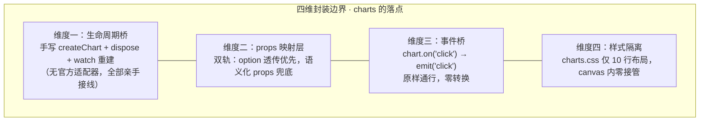
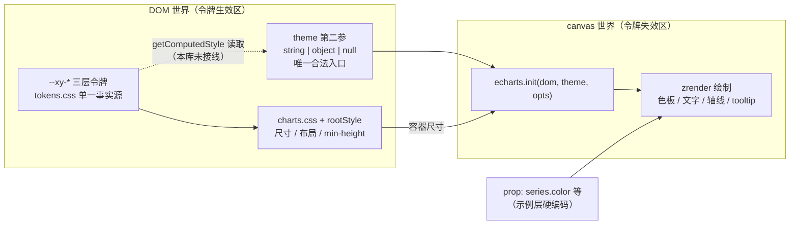
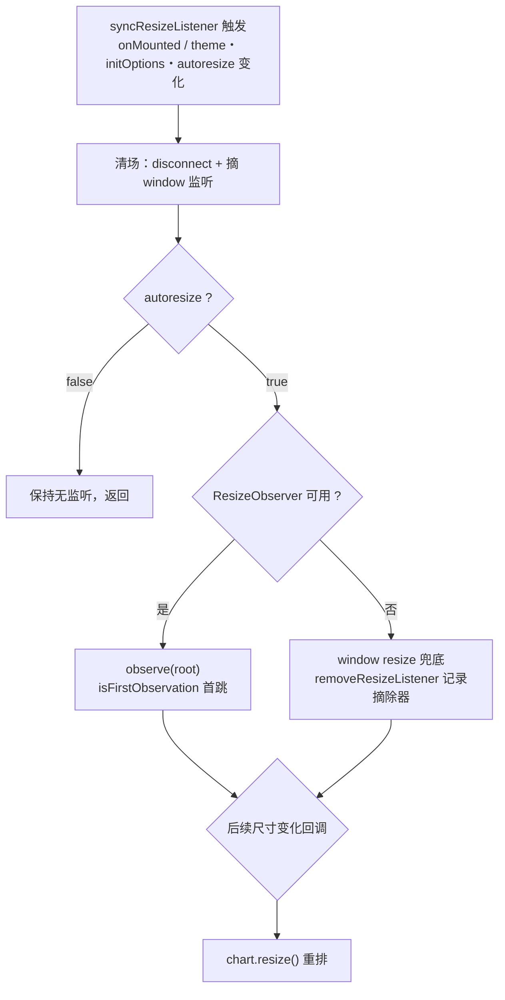

# 8-11 · Charts：echarts 封装

数据展示卷写到 charts，撞上了这个系列至今最特殊的一个组件：前面所有的组件，无论多复杂，渲染的最终形态都是 DOM——而 charts 的最终形态是 canvas。这一字之差把两件根深蒂固的约定同时打破了：CSS 变量喂不进 canvas，`ResizeObserver` 的意义从"观察自己的内容"变成"替引擎做重排"。第三卷精心搭建的三层令牌体系，在这里走到了它的物理边界。

按 8-06 立下的"第三方封装"四维框架——生命周期桥、props 映射层、事件桥、样式隔离——本篇做这套框架的第二次校验。8-06 的 scheduler 是"委托式"封装的极致：手写生命周期一行都没有，全部托付 `@fullcalendar/vue3`。charts 则是另一个极端：echarts 没有 Vue 适配器，生命周期桥必须亲手写。同族第三兄弟 audio-player（8-12 的 howler 封装）与第四兄弟 video-player（8-13 的 video.js 封装）也都没有官方适配器，本篇手写的这套桥，正是后两篇的预演。

而本篇的核心问题只有一个：**主题令牌如何喂给 canvas**。答案要先说结论——实码给出的定论是"还没喂"。这个"还没"比任何精巧的桥接实现都更值得展开，因为它暴露了令牌体系的一类结构性盲区，也解释了为什么这个坑迟早要修。

## 一、四维框架的第二份答卷

先把 8-06 的四维表格在 charts 上重新填一遍，两张答卷并排看，"第三方封装"在不同引擎面前的形态差异立刻显形：

| 维度 | 8-06 scheduler（fullcalendar） | 8-11 charts（echarts） |
| --- | --- | --- |
| 生命周期桥 | 委托式：`@fullcalendar/vue3` 适配器 + `getApi()` 单口 | 手写式：`onMounted` init、`onBeforeUnmount` dispose、watch 重建 |
| props 映射层 | 封闭映射：一个 computed 收敛全部 options | 双轨制：`option` 整体透传优先 + 语义化 props 生成糖 |
| 事件桥 | 快照化：`EventApi` 拍平成纯数据，仅 revert 原样通行 | 原样通行：click 参数直接 emit |
| 样式隔离 | 自绘 chrome + `.fc` 作用域最小覆写，令牌接管视觉 | DOM 层 10 行布局样式、零令牌；canvas 内部完全让渡 |



四个维度里有三个都取了与 scheduler 相反的选择。这不是风格分歧，是两个引擎的差异决定的：fullcalendar 是"配置驱动的大对象 + 官方 Vue 适配器"，echarts 是"命令式实例 + setOption 增量协议"。适配器的有无，直接决定了生命周期桥是委托还是手写；而 echarts 的 option 本身就是一份自描述的纯数据协议，映射层的存在感被压缩到了"要不要替用户写 option"这一件事上——这正是第三节双轨制的由来。

## 二、维度一：生命周期桥——手写全家桶与 shallowRef 的边界

没有官方适配器，生命周期桥就得一砖一瓦砌。先看砌的核心——`createChart`：

```ts
// packages/components/charts/src/charts.vue:148-170
function createChart() {
  if (!rootRef.value) {
    return
  }

  chartRef.value?.dispose()
  chartRef.value = init(rootRef.value, props.theme, props.initOptions)

  if (computedOption.value) {
    chartRef.value.setOption(computedOption.value, props.setOptionOptions)
  }

  if (props.loading) {
    chartRef.value.showLoading(props.loadingOptions)
  }

  chartRef.value.on("click", (params: unknown) => {
    emit("click", params)
  })

  emit("init", chartRef.value)
  emit("ready", chartRef.value)
}
```

23 行里藏着四个决策。**其一，`chartRef.value?.dispose()` 放在 init 之前**——createChart 是可重入的：onMounted 会调用它，`[theme, initOptions]` 的 watch（charts.vue:260-270）也会调用它。echarts 的 `init` 在同一个 DOM 上重复调用会返回已存在的实例并告警，前置 dispose 让"重建"语义收敛成幂等的"先杀后生"，不管 createChart 被触发几次，结果都是一台干净的新实例。

**其二，`init` 的第二参就是 `props.theme`**。echarts 的签名是 `init(dom?, theme?: string | object | null, opts?: EChartsInitOpts)`，主题名或主题对象从 prop 一路直通，组件不做任何加工——这个直通正是第四节核心问题的入口，先按下。

**其三，事件挂载与状态恢复都跟着实例重建走**。click 监听器在每次 createChart 里重新 `on`，loading 状态在重建时按 `props.loading` 现值重放——因为 dispose 会把旧实例连同它的一切监听一起带走，新实例必须从 props 重新推导全部副作用。这与 5-12 carousel 的结论同构：实例重建 = 所有订阅关系重建，漏一条就是幽灵事件。

**其四，`init` 与 `ready` 在同一 tick 连发**。两个事件的 payload 相同（都是实例），语义差异只在文档约定里：init 表示"创建完成"，ready 表示"实例可用"。当前实现里两者同时成立，ready 更像是给未来"异步首帧渲染完成"预留的插槽——API 表面先留好，实现暂时合并。

实例的载体选了 `shallowRef`：

```ts
// packages/components/charts/src/charts.vue:33-36
const rootRef = ref<HTMLDivElement | null>(null)
const chartRef = shallowRef<any>(null)
let resizeObserver: ResizeObserver | null = null
let removeResizeListener: (() => void) | null = null
```

这不是随手一写。echarts 实例内部挂着 zrender 引擎、数以百计的 model、大量闭包和 WebGL/canvas 上下文，如果用普通 `ref`，Vue 的 `reactive` 会对它做深度代理——第一次访问就把整棵内部状态树遍历包一遍，性能税沉重，更危险的是深度代理会拦截实例内部状态的读写，setOption 驱动的内部更新可能与响应式系统互相干扰。`shallowRef` 保证实例引用本身是响应式的（重建时能触发更新），内部状态原样透传。vue-echarts 同样用 shallowRef 存实例，这是 Vue 封装大型命令式对象的标准姿势。两处 `let` 的普通变量（RO 实例与 window 监听移除器）则干脆绕开响应式——监听器不需要被追踪，只需要被清理。

生与死的两端：

```ts
// packages/components/charts/src/charts.vue:279-292
onMounted(async () => {
  await nextTick()
  createChart()
  syncResizeListener()
})

onBeforeUnmount(() => {
  resizeObserver?.disconnect()
  resizeObserver = null
  removeResizeListener?.()
  removeResizeListener = null
  chartRef.value?.dispose()
  chartRef.value = null
})
```

`onMounted` 里先 `await nextTick()` 再建实例：确保模板渲染与样式计算完全落定，`init` 读容器尺寸时拿到的是稳定值——echarts init 时若容器尺寸为零，图表会画成 0×0，这个 nextTick 是"读几何前等布局稳定"的惯例防线，与 5-13 affix 的"先量再算"同门。卸载侧的顺序是 RO 先 disconnect、监听器先摘除、最后 dispose——先停观察者再杀实例，避免 dispose 过程中触发最后一次 resize 回调打到已死的实例上。`chartRef.value = null` 收尾，让 expose 出去的 chart 引用同步失效。

还有一条隐线：**重建的触发条件收得极窄**。五个 watch 里只有 `[theme, initOptions]`（charts.vue:260-270，deep）走 createChart 全量重建，其余三类变化——option 更新、loading 翻转、loadingOptions 变化——都走实例上的增量 API（setOption / showLoading / hideLoading），autoresize 变化只重挂监听器。文档页的使用约定把这条边界明示给了用户："theme、initOptions 变化时会重建图表实例；普通数据更新优先直接更新 option"。重建是重操作（dispose + init + 全量 setOption），把它留给"只能重建"的初始化参数，其余一律增量——这是生命周期桥的成本意识。

## 三、维度二：props 映射——options 双轨的实码定论

任务考据清单里的问题：charts 的 options 是"传入 option"还是"语义化 props"？实码定论是：**两条轨都真实存在，option 轨优先，语义化轨是生成糖**。交汇点在 `computedOption`：

```ts
// packages/components/charts/src/charts.vue:43-127
const computedOption = computed(() => {
  if (props.option) {
    return props.option
  }
  
  if (!props.type || !props.data.length) {
    return undefined
  }
  
  return generateOption(props.type, props.data, props.xKey, props.yKeys, props.nameKey, props.valueKey)
})

function generateOption(
  type: string,
  data: Record<string, unknown>[],
  xKey: string,
  yKeys: string[],
  nameKey: string,
  valueKey: string
): EChartsCoreOption {
  const option: EChartsCoreOption = {
    tooltip: {
      trigger: 'axis'
    },
    legend: {
      data: yKeys.length ? yKeys : undefined
    }
  }
  
  switch (type) {
    case 'line':
      option.xAxis = {
        type: 'category',
        data: data.map(item => item[xKey])
      }
      option.yAxis = {
        type: 'value'
      }
      option.series = yKeys.map(key => ({
        name: key,
        type: 'line',
        data: data.map(item => item[key])
      }))
      break
      
    case 'bar':
      option.xAxis = {
        type: 'category',
        data: data.map(item => item[xKey])
      }
      option.yAxis = {
        type: 'value'
      }
      option.series = yKeys.map(key => ({
        name: key,
        type: 'bar',
        data: data.map(item => item[key])
      }))
      break
      
    case 'pie':
      option.series = [{
        type: 'pie',
        data: data.map(item => ({
          name: item[nameKey],
          value: item[valueKey]
        }))
      }]
      break
      
    case 'area':
      option.xAxis = {
        type: 'category',
        data: data.map(item => item[xKey])
      }
      option.yAxis = {
        type: 'value'
      }
      option.series = yKeys.map(key => ({
        name: key,
        type: 'line',
        areaStyle: {},
        data: data.map(item => item[key])
      }))
      break
```

`generateOption` 把五个语义化 type（`ChartsType = 'line' | 'bar' | 'pie' | 'area' | 'radar'`，charts.ts:9）翻译成 echarts option：直角坐标系三兄弟（line/bar/area，area 只是 line 加了个空 `areaStyle`）共用 category x 轴 + value y 轴 + series map 的骨架；pie 走 `nameKey`/`valueKey` 抽取 `{name, value}` 对；radar 把 yKeys 映射成 indicator 数组。逻辑层是 92 行的纯函数（L55-146），不吃任何响应式，输入 props 输出 option，可脱离组件单测——与 8-06 把翻译智能下沉到 scheduler.ts 纯函数的取向完全一致。

但轨道的流量分布极不均匀。文档站 13 个示例（apps/docs/examples/charts/）**全部**走 `:option` 整体透传，没有一个使用 type/data/xKey/yKeys；语义化轨道在文档里零曝光。API 文档的属性表（charts.md）甚至只列了 `option`/`theme`/`width`/`height` 等项，type/data 一族不在表内。实码层面的定论因此要说完整：**双轨制是"有实现、无主推"**——语义化轨更像给轻量场景预留的便利糖（"给我一个柱状图，数据长这样"），而库的真实立场是"图表的本体语言就是 echarts option，组件不发明第二套 DSL"。

这个立场值得和 scheduler 的"封闭映射"对照着看。8-06 的选择是全量收敛：FullCalendar 的配置面被组件的 props 封闭掉，表达力换类型面。charts 的选择是反向的：echarts option 的全量表达力原样放行，组件只在旁边补了一条低配糖轨。差异的根源在配置面的体量与迭代速度——日历的配置面是有限的、可枚举的，封闭得住；图表的配置面是无限的（echarts 文档 2000+ 页），封闭它等于替 echarts 维护一份镜像类型，收益为负。**透传优先 + 薄糖兜底**，是"配置面无限大"的引擎唯一划算的封装姿势。

代价在 watch 上。option 的同步走 deep watch：

```ts
// packages/components/charts/src/charts.vue:218-230
watch(
  () => computedOption.value,
  (option) => {
    if (!chartRef.value || !option) {
      return
    }

    chartRef.value.setOption(option, props.setOptionOptions)
  },
  {
    deep: true
  }
)
```

`deep: true` 意味着 option 的任何一层嵌套变化（哪怕只改了 series[0].data 的一个数字）都会触发 setOption。便利的代价是每次变化都要对整棵 option 树做深度遍历比对——中后台报表的 option 轻则百行，高频更新场景下这是一笔可观的税。vue-echarts 的对应实现选择 watch option 引用本身（不 deep），要求用户换引用才触发。本库取了"深度响应式直觉优先"的一端：Vue 用户默认对象改属性就该生效，库替这层直觉付遍历成本。这也是一处明确的权衡：**对大 option 高频更新的重型场景，deep watch 不划算，正确姿势是整对象换引用或走 expose 的 setOption**——expose 面里的 `setOption(option, opts)`（charts.vue:176-178）就是给这类场景留的旁路，第二个参数缺省时回落 props 的 `setOptionOptions`，与声明式路径共享 notMerge/lazyUpdate 语义。

## 四、核心问题：主题令牌如何喂给 canvas

现在正面回答标题问题。先看库自己的样式文件——charts 的全部 CSS：

```css
/* packages/theme/src/components/charts.css —— 全文 10 行 */
.xy-charts {
  position: relative;
  width: 100%;
}

.xy-charts__surface {
  width: 100%;
  height: 100%;
  min-height: 240px;
}
```

10 行，没有一个 `--xy-*`。尺寸与布局走令牌体系（容器宽高由组件 rootStyle 计算，min-height 兜底），颜色、字体、轴线、图例、tooltip——图表真正的"皮肤"——一概不在。再对组件源码做全量检索：charts.vue、charts.ts、echarts.ts 里没有 `getComputedStyle`、没有 `--xy-`、没有任何颜色常量。第三卷考据时留下的"charts 零令牌消费"结论，在当前工作区实态下依然成立。

结论先亮出来：**主题令牌到 canvas 之间，这座桥在本库的实码里还没有修。** canvas 的颜色世界完全由 echarts 自己的默认主题接管——`props.theme` 直通 `init` 第二参，传 undefined 时 echarts 用内置默认色板；语义化轨道生成的 option 同样零色值，连 series 颜色都没有注入。组件做了"壳的令牌化"（容器尺寸、布局），但"画的令牌化"是空白。



这张图里有一条实线、一条虚线、一条未画出的线。实线是尺寸：DOM 容器的宽高经由 init 时的几何读数进入 canvas——这条线是通的。虚线是主题：`theme` 参数是 echarts 给外部主题留的唯一合法入口，本库把 prop 原样透传，但没有任何机制把 `--xy-*` 令牌翻译成 theme 对象塞进去。未画出的线是双向同步：CSS 变量变化（暗色主题切换）时 canvas 无动于衷，因为 zrender 拿到的是绘制时刻的颜色快照，不存在"重读 CSS 变量"的机制。

为什么没修？把"要修"的成本摆出来，会发现这不是一行代码的事。假设要桥接，标准方案长这样：初始化时 `getComputedStyle` 把一批语义令牌（`--xy-*` 的角色色、文字色、分隔线色）读出来，组装成 echarts theme 对象（color 数组、textStyle、axisLine 颜色等十余个键），传给 init；然后监听主题切换（`data-theme` 属性变化或库内的主题事件），dispose 旧实例、重读令牌、重建新实例——或者用 echarts 的 `setTheme`/重建路径重刷。工程量之外还有三个结构性难题：**其一，SSR 与测试环境没有 `getComputedStyle`**，桥接代码必须带环境守卫；**其二，canvas 不响应后续变量变化**，令牌值必须快照后手动重灌，双主题切换的每一条路径都要接上重建钩子；**其三，映射面要人为拍板**——`--xy-*` 的语义角色（primary/success/warning…）映射到 echarts 色板的前几位还是全量 12 色，图表文字色映射到哪一档，这些是设计决策，不是技术决策，做错了比不做更难改。

库内还有一个旁证说明这是全库级空白而非 charts 单点：5-09 的 watermark 是另一个 canvas 组件，它的水印文字颜色默认值是硬编码的 `rgba(0,0,0,.15)`（watermark.vue:84 `props.font?.color ?? "rgba(0,0,0,.15)"`），不读任何令牌；它的 `getComputedStyle`（watermark.vue:189）只用来读宿主的 `position` 做布局修补，不碰颜色。两个 canvas 组件，同一个选择：**令牌止步于 DOM，canvas 内要么硬编码要么透传**。

这就是权衡一：**令牌桥接 vs 硬编码/透传**。修桥换来的是"图表跟主题走"的视觉一致性，代价是映射面设计、双主题重建钩子、环境守卫三座山；不修桥的代价是暗色主题下图表仍是亮色画布——只是这个代价当前由消费端承担（传 theme 对象或自行配色），库本身保持中立。以本库"壳令牌化、芯让渡"的取舍，这个空白是自知的选择而非遗漏；但若未来把"双主题一致性"提为产品级承诺，桥必须修，且应修在 echarts.ts（模块注册层）而非组件里——生成 theme 对象是纯函数，可单测，与 useChartsModules 同居一层正好。

## 五、维度三：事件桥——原样通行的理由

事件桥只有一条正式通道：click。实码在 createChart 里已经见过了——`chartRef.value.on("click", (params: unknown) => { emit("click", params) })`，零转换，原样通行。

8-06 的 scheduler 对同样的场景做了完全相反的事：`EventApi` 拍平成 `SchedulerEvent` 快照，类型面不漏库。为什么 charts 敢直接透传？因为 echarts 的 click 参数（`ECElementEvent`/`CallbackParams`）**天然就是快照**——它是引擎在触发时刻组装的纯数据对象：seriesName、dataIndex、value、name、marker、color，全是值类型或冻结的引用，没有 `setProp` 这类可变方法，没有挂活的引擎内部状态。emit 出去既可序列化、可打日志，也不会把 echarts 的类型面焊进消费端（charts 的 click payload 类型就是刻意放宽的 `ChartsClickHandler = (params: unknown) => void`，charts.ts:8——`unknown` 而非 echarts 的 `ECElementEvent`，库类型零漏出，消费端自己窄化）。事件桥的"快照化"不是态度问题，是参数是否已经是快照的事实问题：FullCalendar 给的是活对象所以必须拍平，echarts 给的是死数据所以直通。docs 文档页的使用约定也照实写："点击交互统一通过 click 事件抛出原始 ECharts 参数"——"原始"二字就是桥的宽度。

另一个细节：`on("click")` 的重挂在第二节说过是重建语义的一部分。而 expose 的命令式通道（resize/setOption/showLoading/hideLoading，charts.vue:294-300）不算事件桥，算命令桥——方向相反：消费端调用 → 转发实例方法。`defineExpose({ chart: chartRef, ... })` 里的 chart 经 Vue 的 expose 解包规则自动褪掉 shallowRef 外壳，消费端拿到的直接是 echarts 实例本体——这是一个逃生舱口：四维边界没覆盖到的引擎能力（dispatchAction、getDataURL、convertToPixel……），用户拿实例直呼。与 scheduler 的 `getApi` 单口通行是同一个设计词：**壳收窄 API 面，但永远留一个到达引擎本体的口**。

## 六、resize：一个 RO 的克制

5-12 carousel 挂了两个 ResizeObserver（宽度观察 + autoHeight 高度观察），charts 只有一个，但它的观察语义更重——canvas 不会自适应容器，容器尺寸变了，图表不清 resize 就是画布变形或留白，RO 在这里不是优化项而是正确性前提。看全量实现：

```ts
// packages/components/charts/src/charts.vue:188-216
function syncResizeListener() {
  resizeObserver?.disconnect()
  resizeObserver = null
  removeResizeListener?.()
  removeResizeListener = null

  if (!props.autoresize) {
    return
  }

  if (typeof ResizeObserver !== "undefined" && rootRef.value) {
    let isFirstObservation = true
    resizeObserver = new ResizeObserver(() => {
      if (isFirstObservation) {
        isFirstObservation = false
        return
      }
      resize()
    })
    resizeObserver.observe(rootRef.value)
    return
  }

  if (typeof window !== "undefined") {
    const handler = () => resize()
    window.addEventListener("resize", handler)
    removeResizeListener = () => window.removeEventListener("resize", handler)
  }
}
```

三段式结构：先无条件清场（disconnect + 摘 window 监听），再按 `autoresize` 分岔，RO 可用走观察、不可用走 window resize 降级。三个值得停留的点：

**首跳旗标是 RO 规范的强制配套。** ResizeObserver 的规范行为是 `observe()` 之后必然立即回调一次（报告初始尺寸），不跳过的话，每次 syncResizeListener 都会白触发一轮 `chart.resize()`——与"重建后首次回调"叠加，就是每次 mount/重建/切换 autoresize 都有一轮空转。isFirstObservation 闭包每次 syncResizeListener 重建，首跳在每个观察生命周期内恰好生效一次，自洽闭环。测试把这一点单独立了用例（第六节细看）。

**window resize 降级是渐进增强，不是多余防御。** `typeof ResizeObserver !== "undefined"` 的守卫为老浏览器与 jest/happy-dom 类测试环境兜底。但降级路径的正确性缺口也在这里：window resize 只覆盖"窗口变化"，容器因 flex/grid 收缩、侧边栏折叠、tab 切换而变化时窗口并不 resize——图表躺在响应式布局里就会失真。这是权衡二：**RO 的全覆盖 vs window 的兼容性**。本库取"RO 优先、window 兜底"，2026 年的浏览器生态里 RO 覆盖率已近满格，降级路径实际是为极端环境保留的最低正确性；代价是兜底路径在"容器变窗口不变"场景下静默失效——一个诚实的、记录在案的残余缺陷。

**与 echarts 的 initOptions 有一处暗层耦合。** `EChartsInitOpts` 里有 `width`/`height` 字段——echarts 支持显式指定初始尺寸。本库没透出这两个字段的用法约束，但 autoresize 的 RO 会持续以容器实际尺寸为准调 resize，若用户同时传了 initOptions.width，初始绘制与后续重排会分道扬镳。组件没做互斥校验，靠文档约定兜住——`initOptions` 变化触发重建（L260-270），重建后 RO 重挂，`isFirstObservation` 又会把重建后的首次回调跳掉——时序上依然自洽，但"initOptions 固定尺寸 + autoresize 开启"的组合语义是模糊地带，值得在文档里显式警告。

resize 的判定流整体是这样一个瀑布：



## 七、依赖治理：28 个模块的按需注册

echarts 6 的包体足以让任何组件库三思：全量引入的 `echarts` 主包压缩后约 1MB 级别，而绝大多数中后台场景只用其中一小角。charts 的解法在依赖声明与模块注册两层同时做——先看注册层的全文，这是本篇信息密度最高的 65 行：

```ts
// packages/components/charts/src/echarts.ts —— 全文 65 行
import { use, init } from "echarts/core";
import type { EChartsCoreOption, EChartsInitOpts, EChartsType, SetOptionOpts } from "echarts/core";
import { LineChart, BarChart, PieChart, ScatterChart, RadarChart, GaugeChart, FunnelChart } from "echarts/charts";
import {
  AriaComponent,
  AxisPointerComponent,
  DataZoomComponent,
  DataZoomInsideComponent,
  DataZoomSliderComponent,
  DatasetComponent,
  GridComponent,
  LegendComponent,
  MarkAreaComponent,
  MarkLineComponent,
  MarkPointComponent,
  PolarComponent,
  RadarComponent,
  TitleComponent,
  ToolboxComponent,
  TooltipComponent,
  TransformComponent
} from "echarts/components";
import { LabelLayout, UniversalTransition } from "echarts/features";
import { CanvasRenderer, SVGRenderer } from "echarts/renderers";

export const defaultChartsModules = [
  CanvasRenderer,
  SVGRenderer,
  LineChart,
  BarChart,
  PieChart,
  ScatterChart,
  RadarChart,
  GaugeChart,
  FunnelChart,
  GridComponent,
  PolarComponent,
  TooltipComponent,
  AxisPointerComponent,
  LegendComponent,
  TitleComponent,
  DatasetComponent,
  TransformComponent,
  DataZoomComponent,
  DataZoomInsideComponent,
  DataZoomSliderComponent,
  ToolboxComponent,
  RadarComponent,
  MarkPointComponent,
  MarkLineComponent,
  MarkAreaComponent,
  AriaComponent,
  LabelLayout,
  UniversalTransition
];

use(defaultChartsModules);

export type ChartsModule = Parameters<typeof use>[0];
export type { EChartsCoreOption, EChartsInitOpts, EChartsType, SetOptionOpts };
export { init };

export function useChartsModules(modules: ChartsModule) {
  use(modules);
}
```

结构一句话说清：**默认注册 28 个模块，同时留一个补注册口**。`echarts/core` 只含引擎骨架与 `use` 协议，所有图表类型、组件、渲染器都是独立模块，`use([...])` 按需登记后才进入产物。默认集合覆盖中后台的主流需求：2 个渲染器（Canvas + SVG，renderer 由 initOptions.renderer 选择）、7 个图表（line/bar/pie/scatter/radar/gauge/funnel）、17 个组件（grid/polar/tooltip/legend/title/dataset/dataZoom 全家/toolbox/mark 三件/aria…）、2 个 feature（LabelLayout、UniversalTransition）。Tree-shaking 的前提全部满足：`echarts/core`、`echarts/charts` 等子入口都是纯 ESM，具名导入 + 构建侧 shake，未注册的 treemap/sunbox/tree/boxplot 等几十个模块不会进产物。

`useChartsModules` 是给默认集合之外的逃生口，类型 `ChartsModule = Parameters<typeof use>[0]` 直接从 echarts 的 `use` 签名上反推——echarts 升级扩充 use 的参数类型，这个别名自动跟新，零维护。消费端补注册的姿势在示例里反复演示：

```ts
// apps/docs/examples/charts/calendar-heatmap.vue:2-23
import { HeatmapChart } from "echarts/charts";
import { CalendarComponent, VisualMapContinuousComponent } from "echarts/components";
import { useChartsModules } from "@xiaoye/components";

useChartsModules([CalendarComponent, VisualMapContinuousComponent, HeatmapChart]);

const calendarData = [
  ["2026-04-01", 35],
  ["2026-04-02", 48],
  ["2026-04-03", 56],
  ["2026-04-04", 42],
  ["2026-04-05", 38],
  ["2026-04-06", 66],
  ["2026-04-07", 72],
  ["2026-04-08", 81],
  ["2026-04-09", 64],
  ["2026-04-10", 58],
  ["2026-04-11", 44],
  ["2026-04-12", 39],
  ["2026-04-13", 77],
  ["2026-04-14", 83]
];
```

依赖声明侧，`echarts: ^6.0.0` 走的是与 fullcalendar 同款的**直接 dependencies 策略**（packages/components/package.json:63，与 howler:64、vditor:65、video.js:66 同列）——不搞 peerDependencies，装了 xiaoye-components 就开箱即用，代价是版本耦合由库承担。这与 8-06 的结论一致：**依赖直装换开箱体验，API 适配层收窄版本敏感面**。值得额外一提的是 `use(defaultChartsModules)` 写在模块顶层（L57）：import 即注册，副作用发生在模块求值时——这要求 echarts.ts 必须被组件入口引用（index.ts:10 正是），注册才必然发生；代价是"想完全自定义模块集合"的用户没法绕开默认 28 件套，多注册的模块只是冗余不会出错（use 幂等），这是一个"宁多勿缺"的取向。

这就是权衡三：**默认全注册 vs 纯按需**。vue-echarts 的哲学是纯按需：`use` 是唯一入口，用户不注册就什么都画不出来——包体最小，上手多一步。本库的哲学是"默认即主流"：28 件套覆盖九成场景，零配置出图，包体多付一点；冷门模块（graphic/calendar/visualMap/timeline/sankey/heatmap）走 useChartsModules 显式补。文档示例里 extended-modules、calendar-heatmap、timeline-quarterly、sankey-service-flow 四个示例专门演示补注册，把"哪些在默认集合、哪些要补"的边界演示成了肌肉记忆。一个隐藏的边界是 **echarts 的 tree-shaking 只对"用没用"负责，不对"注册了但没用"负责**——默认 28 件套只要 import 了 charts 组件就全量进产物，哪怕页面只画一个饼图。真要极限抠包体，vue-echarts 的纯按需路线才是答案；本库把包体与体验的天平明显压向了体验。

## 八、测试：把 echarts 换成 Symbol

charts.spec.ts 268 行，一个真实的 echarts 都没加载。mock 策略分三层，第一层是实例替身：

```ts
// packages/components/charts/__tests__/charts.spec.ts:6-21
const echartsCoreMock = vi.hoisted(() => {
  const chart = {
    setOption: vi.fn(),
    showLoading: vi.fn(),
    hideLoading: vi.fn(),
    resize: vi.fn(),
    dispose: vi.fn(),
    on: vi.fn()
  };

  return {
    chart,
    init: vi.fn(() => chart),
    use: vi.fn()
  };
});
```

`vi.hoisted` 让 mock 工厂先于 `vi.mock` 的提升执行——vitest 会把所有 `vi.mock` 调用提升到文件顶，被引用的变量必须在提升后仍可用，hoisted 就是为此准备的语法。`init` 返回的替身只有六个方法，恰好是组件会触碰的全部表面：组件测的是"壳的接线"，不是"引擎的绘制"，替身越小，测试对壳的约束越清晰。

第二层是模块替身——echarts/core、echarts/charts、echarts/components、echarts/features、echarts/renderers 五个 vi.mock，28 个模块全部换成 Symbol：

```ts
// packages/components/charts/__tests__/charts.spec.ts:88-101
vi.mock("echarts/core", () => ({
  init: echartsCoreMock.init,
  use: echartsCoreMock.use
}));

vi.mock("echarts/charts", () => ({
  LineChart: echartsModuleTokens.LineChart,
  BarChart: echartsModuleTokens.BarChart,
  PieChart: echartsModuleTokens.PieChart,
  ScatterChart: echartsModuleTokens.ScatterChart,
  RadarChart: echartsModuleTokens.RadarChart,
  GaugeChart: echartsModuleTokens.GaugeChart,
  FunnelChart: echartsModuleTokens.FunnelChart
}));
```

用 Symbol 而不是 `vi.fn()` 做模块替身是精确的选择：模块对象在本库里的用途只有一个——被收进数组传给 `use`。Symbol 有唯一标识，测试里断言 `use` 的实参数组就能逐项核对"默认注册了哪些模块"（spec:153-191 的用例一，28 项逐一比对），还能验证 `useChartsModules([extra])` 的追加语义。换成 vi.fn() 反而制造噪音——这些"函数"从不被调用。

第三层是 RO 替身，它带着一点行为设计：

```ts
// packages/components/charts/__tests__/charts.spec.ts:54-86
const resizeObserverMock = vi.hoisted(() => {
  const instances: Array<{
    callback: ResizeObserverCallback;
    observe: ReturnType<typeof vi.fn>;
    disconnect: ReturnType<typeof vi.fn>;
    emit: (entries?: ResizeObserverEntry[]) => void;
  }> = [];

  class MockResizeObserver {
    callback: ResizeObserverCallback;
    observe = vi.fn(() => {
      this.callback([], this as unknown as ResizeObserver);
    });
    disconnect = vi.fn();

    constructor(callback: ResizeObserverCallback) {
      this.callback = callback;
      instances.push({
        callback,
        observe: this.observe,
        disconnect: this.disconnect,
        emit: (entries = []) => {
          callback(entries, this as unknown as ResizeObserver);
        }
      });
    }
  }

  return {
    MockResizeObserver,
    instances
  };
});
```

两处刻意为之：**observe 会同步触发一次 callback**——复刻真实 RO "observe 后必发首回调"的规范行为，这让"首跳旗标"的测试是真刀真枪：如果组件忘了 isFirstObservation，首回调就会触发 resize，用例会抓住它。**instances 暴露 emit**——测试拿到 RO 实例后手动发射回调，驱动"后续尺寸变化 → resize"的断言。首跳用例的全过程：

```ts
// packages/components/charts/__tests__/charts.spec.ts:243-267
  it("自动尺寸监听会跳过首次 ResizeObserver 回调，仅在后续尺寸变化时 resize", async () => {
    mount(XyCharts, {
      props: {
        option: {
          xAxis: {
            type: "category",
            data: ["一月"]
          },
          yAxis: {
            type: "value"
          },
          series: [{ type: "line", data: [1] }]
        }
      }
    });

    await nextTick();

    expect(resizeObserverMock.instances).toHaveLength(1);
    expect(echartsCoreMock.chart.resize).not.toHaveBeenCalled();

    resizeObserverMock.instances[0].emit();

    expect(echartsCoreMock.chart.resize).toHaveBeenCalledTimes(1);
  });
```

四个用例的分工：模块注册清单、挂载与 option 同步、loading 与 dispose 转发、RO 首跳。组件 307 行的职责面被测试完整钉住——这正是"壳测试"哲学的样板：**替身保真引擎的接口形状，断言只针对壳的接线行为**。

类型面的验收另有一张卷子：tests/types/fixtures/charts.ts（43 行），核心是对 expose 面 与 useChartsModules 的可调用性验收：

```ts
// tests/types/fixtures/charts.ts:25-43
declare const instance: ChartsInstance;
declare const module: ChartsModule;

instance.resize();
instance.setOption({
  series: [
    {
      type: "bar",
      data: [1, 2]
    }
  ]
});
instance.showLoading();
instance.hideLoading();
useChartsModules([GraphicComponent]);
useChartsModules(module);

void props;
void XyCharts;
```

`ChartsModule` 既能收数组（GraphicComponent）也能收单模块（module），类型随 `Parameters<typeof use>[0]` 与 echarts 对齐——夹具不跑运行时，只让 tsc 验证"公开类型在真实用法下不崩"。

## 九、EP 对照：为什么官方组件库不收图表

对照 Element Plus 把一件事说透：EP 的 70+ 组件里没有一个图表。这不是遗漏而是行业共识——Ant Design Vue 同样不带图表，图表组件在 Vue 生态里几乎清一色外置：直接用 echarts，或用 vue-echarts 这类专项封装。理由在第六节已经展开了一半：图表的配置面无限大、引擎版本迭代快（echarts 4→5→6 三代 breaking）、双渲染器、SSR 特殊路径——收进组件库等于背上第二套"库中库"的维护包袱。

本库把 charts 收进 manifest 的同时，实际做的是"收壳不收芯"：引擎（echarts）照常是直接依赖，组件只承诺生命周期、尺寸同步、模块注册与 loading 联动四件壳事；图表能力本体从 `option` prop 原样放行。与 vue-echarts 对照，两者的公共部分高度一致——都基于 `echarts/core` + `use` 按需注册、都 shallowRef 存实例、都 autoresize 默认开启、都透传 theme——差异在三处：vue-echarts 纯按需（不注册不渲染）而本库默认 28 件套；vue-echarts 支持 provide/inject 的 THEME_KEY 全局主题注入而本库 theme 只走 prop；vue-echarts 无语义化数据轨而本库留了 type/data 一族糖 props（未主推）。EP 的空位由生态补齐，本库的选择是让"壳"符合自家规范（withInstall、manifest、样式收口、expose 面类型化），把引擎差异挡在稳定的 API 表面之后——对外是 xiaoye-components 的组件，对内是 echarts 的直通车。

## 十、权衡复盘

全篇的决策收拢成账：

1. **手写生命周期桥而非等适配器**（第二节）：echarts 无官方 Vue 适配器，createChart 幂等可重入（前置 dispose），重建触发面收窄到 [theme, initOptions]，其余变化全走增量 API；shallowRef 存实例躲开深度代理，expose 的 chart 经解包直通引擎本体。
2. **双轨制：option 透传优先 + 语义化薄糖**（第三节）：配置面无限大的引擎，封闭映射必亏（对照 scheduler 的封闭是配置面可枚举的前提）；语义化轨 94 行纯函数有实现无主推，真实立场是"option 即本体语言"。代价是 deep watch 的遍历税，重型场景由 expose 的 setOption 旁路兜底。
3. **令牌桥接暂缓，壳令牌化先行**（第四节）：canvas 吃不到 CSS 变量是物理边界，theme 第二参是唯一入口；修桥需付映射面设计、双主题重建、环境守卫三座山，当前由消费端承担配色责任——watermark 的硬编码默认色是全库同款取向，空白自知且记录在案。
4. **事件桥原样通行**（第五节）：echarts 的 click 参数天然是纯数据快照，无需 scheduler 式拍平；payload 类型刻意 `unknown` 防库类型漏出。
5. **RO 优先、window 兜底、首跳必配**（第六节）：canvas 组件的 resize 是正确性前提；降级路径在"容器变窗口不变"场景静默失效，是记录在案的残余缺陷；initOptions.width 与 autoresize 的组合语义是文档欠账。
6. **默认 28 件套 + 补注册口**（第七节）：体验压过包体的取舍；模块顶层 use 副作用注册，`Parameters<typeof use>[0]` 反推类型零维护；极限抠包体场景仍建议纯按需路线。
7. **Symbol 替身 + 行为保真 RO mock**（第八节）：壳测试哲学，替身只含壳触碰的表面，observe 首回调保真让首跳旗标被真实验证。

## 十一、小结

回到标题：echarts 封装，封出来的是什么？307 行组件 + 65 行注册层 + 35 行类型层，构成一台"壳机"——它不画一笔图，只管四件事：把实例的生死管起来（手写生命周期桥），把配置的语言放过去（option 双轨），把点击传回来（原样通行），把尺寸跟上去（RO 首跳）。四维框架在第二次校验里呈现的规律开始显形：**封装形态不取决于品味，取决于引擎给不给适配器、配置面是否可枚举、回调参数是否已是快照**。scheduler 与 charts 的四处相反选择，每处都能追溯到引擎的某个事实。

而令牌与 canvas 之间的那条未修之桥，是本篇留下的最重要一块路标：全库的令牌体系在 canvas 面前有一条结构性盲区，当前以"壳令牌化、芯让渡"绕行，若未来双主题一致性升级为产品承诺，桥应修在 echarts.ts 的注册层——纯函数生成 theme，环境守卫护航，双主题切换接重建钩子。8-12 的 howler、8-13 的 video.js 同为 canvas/媒体域，这条盲区还会以别的形式撞上来。

下一篇预告：**8-12《AudioPlayer：howler 封装》**。同样是第三方封装四维框架的第三次校验，但换了一族引擎：howler 没有渲染层——音频的"canvas"是 Web Audio 节点图与播放状态机，令牌桥接的盲区以"进度条与音量条的视觉如何跟状态联动"的形式重现；生命周期桥面对的则是一个全局单例引擎（AudioContext）的解锁时机问题。charts 手写的这套桥，正好是它的脚手架。

---

*本篇代码引用核对于当前工作区实态：`packages/components/charts/src/charts.vue`（307 行；L12-28 withDefaults、L30 emit、L33-36 实例与监听器载体、L38-41 rootStyle、L43-53 computedOption、L55-146 generateOption、L148-170 createChart、L172-186 命令式方法、L188-216 syncResizeListener、L218-230 option deep watch、L232-246 loading watch、L248-258 loadingOptions watch、L260-270 theme/initOptions 重建 watch、L272-277 autoresize watch、L279-292 生命周期两端、L294-300 defineExpose、L303-307 模板）、`src/charts.ts`（35 行；L3-9 类型别名与 ChartsType、L11-27 ChartsProps、L29-35 ChartsInstance）、`src/echarts.ts`（65 行全文；L26-55 defaultChartsModules 28 项、L57 顶层 use、L59 ChartsModule、L63-65 useChartsModules）、`packages/components/charts/index.ts`（22 行；L12-19 类型导出、L19 值导出、L21 withInstall）、`__tests__/charts.spec.ts`（268 行；L6-21 实例替身、L23-52 Symbol 令牌、L54-86 MockResizeObserver、L88-131 五个 vi.mock、L133-150 全局 stub 与清理、L153-191 注册清单用例、L193-218 同步用例、L220-241 loading/dispose 用例、L243-267 首跳用例）、`packages/theme/src/components/charts.css`（10 行全文，零令牌）、`packages/theme/index.css:70`、`tests/types/fixtures/charts.ts`（43 行；L25-43 摘引）、`packages/components/component-manifest.json:613-618`、`packages/components/exports.ts:14`、`packages/components/package.json:63`（echarts ^6.0.0 直接 dependencies，L64 howler、L65 vditor、L66 video.js）、`apps/docs/components/charts.md`（125 行；使用约定与 API 表）、`apps/docs/examples/charts/`（basic 25 行 / calendar-heatmap 76 行 / combo 52 行 / dashboard-board 96 行 / donut-distribution 32 行 / extended-modules 76 行 / interactive 80 行 / loading-actions 120 行 / page-analysis 124 行 / page-container-analytics 114 行 / radar-gauge-funnel 142 行 / sankey-service-flow 49 行 / timeline-quarterly 92 行，共 13 例）。对照源码：`packages/components/watermark/src/watermark.vue:84`（canvas 默认色硬编码）、`watermark.vue:189`（getComputedStyle 仅读 position）、`packages/components/carousel/src/carousel.vue`（双 RO 对照，见 5-12）。echarts 侧事实（`init(dom?, theme?: string|object|null, opts?: EChartsInitOpts)` 签名、EChartsInitOpts 的 renderer/devicePixelRatio/ssr/width/height 字段、echarts/core 的 use 按需协议、observe 后必发首回调的 RO 规范行为、vue-echarts 的 use/THEME_KEY/shallowRef/autoresize 事实、EP 无图表组件）以 node_modules 内 echarts 6.0.x 类型文件（types/dist/shared.d.ts:11297、11073-11083）与 element-plus 2.x 公开文档为参照核对，未引行号处均为包外事实。本篇叙述与源码不符点自查：任务规格假设"主题生成——getComputedStyle 翻译令牌成 theme 对象或硬编码色值"二选一，实码定论为第三态"零桥接"（theme 直通 echarts 默认主题，组件与样式零令牌零色值，语义化轨道亦无颜色注入），文中按实态展开并给出未来的修桥方案落点；任务规格问"charts.css 若有全文展开"——实有且仅 10 行，全文引出；文档示例 13 例全走 option 轨、零语义化 props、零 theme 传参、零令牌色值（extended-modules 示例 graphic 的 fill "#eff6ff" 等为示例层硬编码），与语义化轨道"有实现无主推"的定论互为印证；charts.vue:305 的 `xy-charts__surface` 为硬编码类名而非 ns 派生 modifier、charts.vue:34 实例载体类型为 `shallowRef<any>` 而非 charts.ts 已备的 `ChartsECharts`，两处为实码瑕疵，已在文中如实记认；loading-actions.vue:3 从全量包 "echarts" 导入类型且手写本地 ChartsExpose 类型，与 interactive.vue 使用包内 ChartsInstance 不一致，属示例层欠同步；测试用例 4 的标题与断言经与 spec:243-267 逐字核对相符；文中 12 段带行号引用块已用脚本与当前实码逐行比对（忽略空行行内空白），全部命中。*
