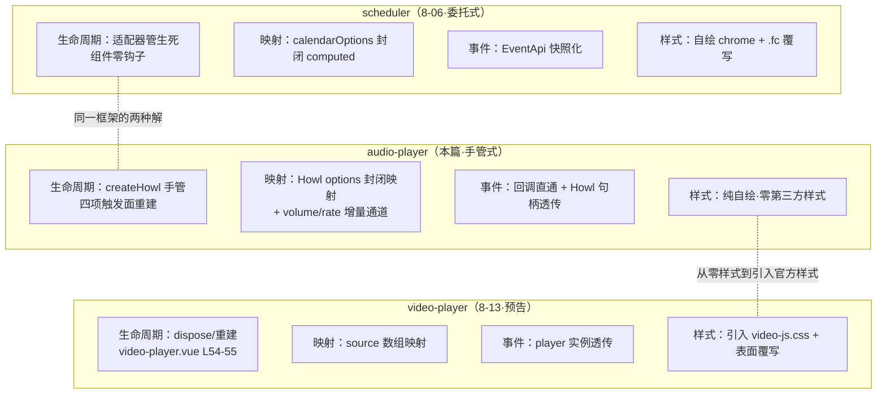
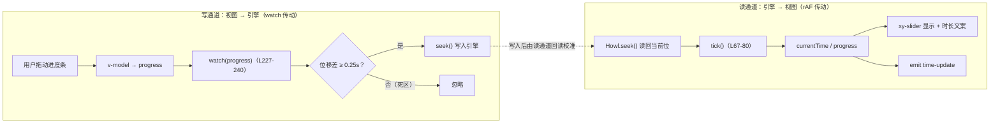

# 8-12 · AudioPlayer：howler 封装

> 本篇是"组件深潜"卷数据展示组（8 卷）的第 12 篇，"第三方封装"三兄弟的第二篇。8-06 借 scheduler 立起了封装边界的四维框架——生命周期桥、props 映射层、事件桥、样式隔离；8-11 借 echarts 做了第二次校验，得出"封装形态不取决于品味，取决于引擎给不给适配器、配置面是否可枚举、回调参数是否已是快照"。本篇轮到 audio-player 与 howler 做第三次校验。核心问题按大纲是"播放器状态的组件化"——把"一段声音正在发生"这件事，翻译成 Vue 组件的语言。先亮底牌：读完全部 310 行源码你会发现，这个组件对"状态机"的回答比任何浮层、任何表单都要激进——**它只用一个布尔值**。任务规格里那台想象中的 playing/paused/stopped/loading 四态状态机，在代码里坍缩成了一个 `playing` ref 加三组复位副作用。这个坍缩不是偷懒，是本篇要正面解剖的第一设计决策。

先交代代码体量，给后面所有讨论一个标尺：`packages/components/audio-player/src/audio-player.vue` 全文 310 行，`audio-player.ts` 类型层 34 行，`index.ts` 24 行，`__tests__/audio-player.spec.ts` 84 行 2 用例，`packages/theme/src/components/audio-player.css` 80 行——合计约 530 行。比 scheduler（373 行组件 + 964 行纯函数）小了一个数量级，是 countdown（224 行）的两倍半。体量小，账不薄：8-06 的四维框架在这里每一维都给出了与前两家不同的解，8-02 的定时器治理在这里多出第四个样本。

8-06 已经引过本组件的两行坐标——"`createHowl()`（82 行）负责 `new Howl({...})`（114 行）的创建与销毁时机"，本篇把这一段及全文展开。测试实跑核验：2 用例全绿（23ms）。

## 一、第三次校验：四维框架遇上无渲染引擎

howler 是什么？一个 2.2.4 版本、minified 核心约 26KB（实测 `howler.core.min.js` 26924 字节）的纯音频引擎。它和前两家引擎在三个根本点上不同，这三个不同决定了本篇所有选择：

**其一，它没有渲染层。** FullCalendar 是一个完整 UI（工具栏、网格、事件块），echarts 是一个 canvas 渲染器，而 howler 的输出是声音——没有任何视觉表面。8-11 反复讨论的"令牌与 canvas 之间的未修之桥"，在音频域以奇特的方式消失了：根本没有需要桥接的视觉输出。样式隔离维度因此退化成"纯自绘"——没有第三方样式需要隔离，80 行 CSS 全部是自家的令牌消费。

**其二，它没有官方 Vue 适配器。** 这一点与 echarts 同命（8-11 因此手写生命周期桥），与 FullCalendar 异路（8-06 因此全托 `@fullcalendar/vue3`）。所以 audio-player 的生命周期桥必然是手管式——但怎么管，仍有自己的解法。

**其三，它的全部状态只能靠回调喂。** 引擎不暴露响应式状态，`seek()` 读回当前位、`onplay/onpause/onstop/onend` 通知状态迁移——组件是引擎状态的**投影仪**，不是状态的所有者。这个事实直接塑造了"播放器状态的组件化"的最终形态。

把四维框架在三次校验中的解摆在一起，规律已经显形：

| 维度 | scheduler（8-06） | charts（8-11） | audio-player（本篇） |
| --- | --- | --- | --- |
| 生命周期桥 | 委托式：`@fullcalendar/vue3` 适配器管生死 | 手管式：`createChart` 幂等 + 收窄重建面 | 手管式：`createHowl` + 四项重建触发面 |
| props 映射层 | 封闭 computed（配置面可枚举） | 双轨制：option 透传优先 + 薄糖 | 封闭 options 映射 + volume/rate 增量通道 |
| 事件桥 | 快照化：EventApi 拍平，revert 通行 | 原样通行：payload 刻意 `unknown` | 回调直通：引擎句柄透传（init/ready 携带 Howl） |
| 样式隔离 | 自绘 chrome + `.fc` 最小覆写 | canvas 零桥接，壳令牌化 | **零第三方样式**：纯自绘 + 令牌 |



三个组件、四种解法，每一次分歧都能追溯到引擎事实：有适配器就委托，没有就手管；有 UI 就要隔离样式，没 UI 就纯自绘；回调参数是活对象就快照化，是引擎句柄就透传。audio-player 把"引擎最裸"的一极补齐了——howler 什么都不给，组件就什么都自己来，但每一件"自己来"的事都做得极薄。

## 二、维度一·生命周期桥：手管式的完整解剖

audio-player 的生命周期桥由四个部件组成：`createHowl()`（唯一的生产/重建入口）、`onMounted`（首次点火）、`onBeforeUnmount`（销毁）、一个收窄的 watch（props 变更触发重建）。先看 `createHowl` 的前半段：

```ts
function createHowl() {
  const source = Array.isArray(resolvedSrc.value)
    ? resolvedSrc.value
    : resolvedSrc.value
      ? [resolvedSrc.value]
      : [];

  howlRef.value?.unload();

  if (!source.length) {
    howlRef.value = null;
    currentTime.value = 0;
    duration.value = 0;
    progress.value = 0;
    playing.value = false;
    return;
  }
```

三步走，每一步都是一个语义决策。**第一步，音源归一化**（L83-87）：`src` 的类型是 `string | string[]`，`track.src` 同型，三层嵌套三元把一切归一成 `string[]`——空串与空数组统一落进空源分支。这个归一化放在函数开头而不是 computed 里，是因为它只服务于 Howl 构造参数，`resolvedSrc` 本身保持 props 的原始形态对外稳定。

**第二步，先卸后建**（L89）：`howlRef.value?.unload()` 一行处理旧实例。unload 与 stop 是 howler 里两个不同的动词：stop 是让声音回到起点（实例还活着，可以再 play），unload 是释放引擎资源、销毁实例（howler 内部会清掉 AudioContext 里的节点注册）。重建语义要的是后者——**实例身份必须换新**，因为新旧 props 是两个音源，复用旧实例再 seek 回零无法表达"换了音频"。对比 video-player 的 `playerRef.value?.dispose()`（video-player.vue:54），手管式家族在"重建即销毁"上完全一致。

**第三步，空源短路**（L91-98）：没有音源时不仅置空实例，还把 `currentTime / duration / progress / playing` 四个状态全部复位。注意复位的是**全部状态**而不是只复位 playing——空源之后界面上时长显示 0s、进度条归零，投影面与引擎面同步清空。这条短路让"src 从有到无"成为一个合法的状态迁移：消费端清掉 track 组件就安静归零，不需要额外调 stop。

后半段是整个生命周期桥信息密度最高的 50 行：

```ts
  let instance: Howl | null = null;
  const handleLoaded = () => {
    const current = instance ?? howlRef.value;

    if (!current) {
      queueMicrotask(handleLoaded);
      return;
    }

    duration.value = current.duration();
    emit("init", current);
    emit("ready", current);
  };

  instance = new Howl({
    src: source,
    autoplay: props.autoplay,
    loop: props.loop,
    mute: props.muted,
    volume: currentVolume.value,
    rate: rate.value,
    html5: true,
    onload: handleLoaded,
    onplay: () => {
      playing.value = true;
      cancelFrame();
      tick();
      emit("play");
    },
    onpause: () => {
      playing.value = false;
      cancelFrame();
      emit("pause");
    },
    onstop: () => {
      playing.value = false;
      currentTime.value = 0;
      progress.value = 0;
      cancelFrame();
    },
    onend: () => {
      playing.value = false;
      progress.value = 1;
      cancelFrame();
      emit("end");
    }
  });

  howlRef.value = instance;
}
```

五个 options 回调（`onload/onplay/onpause/onstop/onend`）就是状态机的全部输入源，它们与状态、副作用、事件的接线将在第三节的状态机图里逐一标注。这里先看一个容易忽略的细节：**构造参数里的 `volume: currentVolume.value` 用的是内部 ref 而非 props.volume**。为什么？因为内部音量可以通过音量条（非受控路径）或 `setVolume`（命令路径）更新，`currentVolume` 才是"当前真实音量"的事实源；重建发生时（比如换了音源），新实例必须继承用户已经调好的音量，而不是被 props 默认值重置——**重建不断用户体验**，这是手管式重建里最容易被漏掉的体验细节。

`handleLoaded` 里那个 `queueMicrotask` 重试（L105-107）值得单独放大。正常世界里 howler 的 `onload` 在网络加载完成后异步触发，彼时 `instance` 与 `howlRef.value` 都已赋值，重试路径永远走不到。但重试守卫仍然立在那里，它防的是**同步触发**的边界：如果 `onload` 在构造函数执行期间就被回调（测试替身正是这么干的，第九节展开），此刻 `instance` 还是 `null`、`howlRef.value` 还挂着旧实例或空——重试把自己排进微任务队列，等构造函数返回、`howlRef.value = instance`（L148）落定后再取一次。一个闭包变量 `instance`、一个兜底读 `howlRef.value`、一个微任务重试，三层防御把"实例还没接线完毕"的窗口封死。诚实记录一处边界：若重建时 `onload` 同步触发，`instance ?? howlRef.value` 的回退序会先摸到**旧实例**（它刚被 unload 但引用未清），此时 init/ready 会携带旧 Howl 发出——真实 howler 异步加载永不触发这条路径，但它是这段防御代码的暗面，第九节会回到这里。

再看组件的两个生命周期钩子与 props 重建面：

```ts
watch(
  () => [resolvedSrc.value, props.autoplay, props.loop, props.muted] as const,
  () => {
    createHowl();
  },
  {
    deep: true
  }
);

watch(
  () => props.volume,
  (value) => {
    currentVolume.value = value;
    howlRef.value?.volume(value);
  }
);

watch(progress, (value) => {
  if (!duration.value || !howlRef.value) {
    return;
  }

  const nextTime = Number((value * duration.value).toFixed(2));
  const diff = Math.abs(nextTime - currentTime.value);

  if (diff < 0.25) {
    return;
  }

  seek(nextTime);
});

onMounted(() => {
  createHowl();
});

onBeforeUnmount(() => {
  cancelFrame();
  howlRef.value?.unload();
  howlRef.value = null;
});

defineExpose({
  howl: howlRef,
  play,
  pause,
  stop,
  seek,
  setVolume
});
```

**重建触发面收窄到四项**：`[resolvedSrc, autoplay, loop, muted]`。这四项与 `new Howl` 的构造参数一一对应（volume 与 rate 除外，原因见下），而 `title / artist / cover` 被排除在外——它们是纯展示状态，`resolved*` computed 直接随 props 响应，改标题不该重建引擎。这与 8-11 charts 的 `[theme, initOptions]` 收窄完全同构：**重建面 = 仅初始化语义的 props 集合**，其余变化一律走增量 API。`deep: true` 的存在理由是 `resolvedSrc` 可能返回父组件的 `string[]` 引用，数组原位变异（`track.src.push(...)` 这类边缘用法）也要捕获。

**volume 与 rate 是两条增量通道**。volume 的 watch（L219-225）把受控值写进 `currentVolume` 并直通引擎 `volume(value)`——实例活着就热更，不重建；rate 没有专属 watch，它通过 `cycleRate`（L200-207）内部循环切换后调 `howlRef.value?.rate(...)`。为什么 rate 不响应 props？因为 `playbackRates` 是"倍速档位表"而不是"当前倍速"——语义上是枚举配置，消费端运行中改档位表的需求几乎不存在，增量通道的成本（一个 watch + 同步逻辑）花在这里不划算。重建面与增量面的分界线因此画得很清楚：**构造期语义走重建，运行期语义走增量，纯展示走 computed**——三档分流，零重叠。

**卸载**（L246-250）三步：先 `cancelFrame()` 熄掉 rAF 链（第七节），再 `unload()` 释放引擎，最后置空引用。顺序有意义——如果先 unload，rAF 链的下一帧可能还会摸到 `howlRef.value`（tick 的守卫会拦住 `!howlRef.value` 的情况，但 unload 后 seek() 读回的异常值可能在守卫通过后出现）；先熄帧再卸载，窗口为零。`cancelFrame` 幂等（`rafId === null` 直接返回），unload 前置了可选链——三处防御让卸载可以无脑重入。

**权衡一：手管式 vs 委托式的第四种比较维度。** 8-06 立这个权衡时比较的是"有没有官方适配器"；到本篇可以再加一个维度——**状态回传的通道**。scheduler 委托适配器后，实例状态通过 `datesSet` 等回调回传，组件要维护一个"意图 → 引擎"的单向通道；audio-player 手管实例后，引擎状态通过五个回调回传，组件要维护的是"引擎 → 投影"的反向通道。两者的本质都是**桥接回调与响应式系统**，只是方向相反：委托式的桥把"我的意图"翻译进去，手管式的桥把"引擎的事实"翻译出来。charts 介于两者之间——实例状态少（几乎只有 disposed），桥最薄。手管式在 audio-player 里之所以不沉重，是因为 howler 的实例行为面（play/pause/stop/seek/volume/rate）恰好可以一一映射到组件方法，没有 FullCalendar 那种命令面爆炸的问题。

## 三、播放器状态的组件化：一个布尔撑起的四态表象

现在正面回答本篇的核心问题。外观上，这个播放器有四个状态：播放中、暂停、已停止、加载中。代码里呢？把与状态有关的全部响应式变量列出来——`playing`（布尔）、`currentTime / duration / progress`（进度三元组）、`currentVolume / currentRateIndex`（音量与倍速）。**没有 `paused`，没有 `stopped`，没有 `loading`。** 四态表象的构成是这样的：

```mermaid
stateDiagram-v2
    direction TB
    state "空源 idle<br/>(howl = null)" as idle
    state "装载中 loading<br/>(引擎异步加载·未建模)" as loading
    state "就绪 ready<br/>(playing = false)" as ready
    state "播放中 playing<br/>(playing = true)" as playing
    state "暂停 paused<br/>(playing = false)" as paused
    state "已结束 ended<br/>(playing = false·progress = 1)" as ended
    state "已停止 stopped<br/>(playing = false·位归零)" as stopped

    [*] --> idle: createHowl() 且 source 为空（L91-98）
    [*] --> loading: createHowl() 且 source 非空（L114）
    idle --> loading: watch 重建（src 从无到有）
    loading --> ready: onload → init/ready（L101-112）
    ready --> playing: onplay（L123-128）
    paused --> playing: onplay
    stopped --> playing: onplay
    ended --> playing: onplay
    playing --> paused: onpause（L129-133）
    playing --> ended: onend（L140-145）
    playing --> stopped: onstop（L134-139）
    ready --> stopped: onstop
    paused --> stopped: onstop
    ended --> stopped: onstop
    playing --> playing: tick 每帧读回 seek()（L67-80）

    note right of loading
        无 loading ref、无占位 UI
        时长显示 0s
    end note
    note bottom of stopped
        stopped 不是独立响应式状态
        与 ready / paused 同为 playing = false
        区别只在 onstop 的复位副作用
    end note
```

三个观察从这个图里长出来。

**观察一：stopped 是行为，不是状态。** 图里 `ready / paused / stopped / ended` 四个节点共享同一个响应式取值——`playing = false`。区分它们的是**到达路径留下的痕迹**：onstop 把 `currentTime / progress` 归零，onend 把 `progress` 置 1，onpause 什么都不动。换句话说，四态中真正被"建模"的只有 playing 一位，其余三态是迁移动作的副作用投影。这和 4-05 浮层体系那台显式建模的三态状态机（visible/leaving/hidden 独立状态 + 迁移函数）是光谱的两极：浮层需要显式建模是因为"离开中"这个状态有独立的 UI 语义（动画进行时）；播放器不需要，因为暂停、停止、结束在 UI 上都可以由 `playing + 进度三元组` 完全推导——**可推导的状态不建模**，这是本库状态治理的一条隐性经济学，与 8-04 Steps 的"状态派生"一脉相承，只是这里推到了极致。

**观察二：loading 根本不存在。** 从 `new Howl` 到 `onload` 之间有一段真实的装载期（网络加载/解码），但组件没有为它设任何标志——没有 `loading` ref，没有骨架屏，时长显示 0s，进度条停在 0。装载期的 UI 表现是"未就绪的默认值"而非"装载中的专用态"。代价是消费端无法从组件状态区分"还没加载"和"加载完成但停在 0 秒"，只能监听 `ready` 事件补自己的装载 UI；收益是状态面最小——装载完成前用户本就无进度可看，一个专用状态换不来新的 UI 能力。这不是疏忽，是数据展示卷一贯的"壳不做多余承诺"（对照 8-09 Table 不承诺虚拟滚动、8-11 charts 不承诺主题桥）。

**观察三：状态迁移的输入只有一条管道。** 所有 `playing` 的写点都在五个回调里，组件自己的命令方法（play/pause/stop/seek）**一个都不写状态**——它们只调引擎，等回调回来再落状态。这个"命令走引擎、状态走回调"的单向环是全组件最重要的纪律：组件方法里 `playing.value = true` 这样抄近路的一行都没有。抄近路的诱惑真实存在（点了播放按钮立刻置 playing，UI 即时反馈，比等回调快一帧），但抄了就要处理"引擎实际没播出来"（自动播放被浏览器拒绝、加载失败）时的状态回滚——howler 的 onplay 只有引擎真正出声才触发，等回调是唯一不会说谎的时机。**宁可慢一帧，不要错一帧**，这是"状态组件化"的可靠性底线。

`init / ready` 双事件的语义坍缩也在这里交代。类型层为它们准备了不同的文档语义（docs 表：init 为"音频实例初始化后触发"、ready 为"音频加载完成后触发"），但实码里两者在 `handleLoaded` 的同一处同步发出（L110-111），payload 完全相同。原本设想的"构造完成"与"装载完成"两个时机，在 howler 的事件模型里坍缩成了一个——`onload` 既是构造完成的信号也是装载完成的信号，组件没有第二个挂点可挑。双事件于是成了对消费端的语义冗余：想要哪个名字都接得到，实际是同一瞬间。这是映射层"引擎事件模型 → 组件事件模型"翻译时的一个真实约束：**引擎没给的时机，壳造不出来**（造出来的也是假语义）。

## 四、维度二·props 映射层：封闭 options、改名翻译与优先级协议

类型层 34 行全文如下，它是映射层的协议面：

```ts
import type { Howl } from "howler";

export interface AudioPlayerTrack {
  src: string | string[];
  title?: string;
  artist?: string;
  cover?: string;
}

export type AudioPlayerHowlHandler = (howl: NonNullable<AudioPlayerInstance["howl"]>) => void;
export type AudioPlayerStateChangeHandler = () => void;
export type AudioPlayerVolumeUpdateHandler = (value: NonNullable<AudioPlayerProps["volume"]>) => void;
export type AudioPlayerTimeUpdateHandler = (currentTime: number, duration: number) => void;

export interface AudioPlayerProps {
  src?: string | string[];
  track?: AudioPlayerTrack;
  title?: string;
  artist?: string;
  autoplay?: boolean;
  loop?: boolean;
  muted?: boolean;
  volume?: number;
  playbackRates?: number[];
}

export interface AudioPlayerInstance {
  howl: Howl | null;
  play: () => void;
  pause: () => void;
  stop: () => void;
  seek: (seconds: number) => void;
  setVolume: (value: number) => void;
}
```

props → Howl options 的映射是**完全封闭**的九对七：`autoplay → autoplay`、`loop → loop`、`muted → mute`（改名翻译——props 侧用形容词"静音的"，Howl options 用动词原形，一个字母的协议差被映射层吸收）、`volume → volume`、`rate → rate`、`src → src`（数组归一化），加上不走 props 的 `html5: true`。没有任何 spread 透传、没有 `HowlOptions` 类型放行——对照 8-11 charts 的"option 即本体语言"，audio-player 走了完全相反的方向。这个封闭站得住：音频播放的配置面真的可枚举（九个 props 就是全部），不像图表的 option 是无界对象；且 Howl 的部分 options（`sprite`、`onplayerror`、`xr`、`pool` 等音频切片/连接池语义）与本组件"单音轨播报/回放"的定位无关，放行只会扩大测试与文档的承诺面。

props 侧自己的语义层也有一套协议。`track` 对象与 `src / title / artist` 三散装 props 是同族信息的两种携带方式，优先级规则写在 `resolved*` computed 里（L52-55）：**track 整体优先**——`track.src` 存在时 `props.src` 被忽略，`track.title` 存在时 `props.title` 被忽略。注意不对称的一处：**`cover` 没有 props 平级项**，`resolvedCover` 只读 `track.cover`——封面是"媒体对象"的属性，散装承载它（`<xy-audio-player src cover>`）语义上就把 props 面搅浑了，组件选择让封面必须随 track 走。这是 props 设计里"对象承载复杂媒体、标量承载简单元信息"的边界自觉，docs 的使用约定（audio-player.md:49）把这条写成明文："src 适合单个音源；需要同时带标题、作者、封面时优先使用 track"。

`html5: true`（L121）是映射层里最重的一个决策，值得作为**权衡二**展开。howler 每个实例有两条引擎路线：默认的 Web Audio 路线（AudioContext 节点图，解码后播放）和 HTML5 Audio 路线（驱动一个 `<audio>` 元素流式播放）。本组件选了后者，账要两头算。选 HTML5 的三笔收益：**流式加载**——长音频不必等整个文件解码完就能出声，语音播报/录音回放动辄几分钟，解码等待不可接受；**免 CORS 解码限制**——Web Audio 对跨域音频要求 CORS 头才能拿到 ArrayBuffer 解码，而后台系统接的录音 URL（OSS 签名地址、内网文件服务）未必配得齐；**行为贴近原生**——自动播放策略、后台播放都走 `<audio>` 的浏览器语义，少一层引擎翻译。付出的两笔代价：Web Audio 的精确调度（`seek` 亚秒级对齐、`fade` 节点自动化）、频谱可视化（AnalyserNode）全部不可用。但本组件的 UI 是自绘进度条 + 音量条，没有频谱，没有精调度需求——**代价清单上没有一项是本组件的消费场景会撞上的**。选型与定位咬合，这是封闭映射之外映射层的第二个自觉：不是"哪个引擎更好"，而是"哪个引擎的剩余能力浪费得起"。

顺带解释一个读回侧的防御：`tick` 里的 `Number(howlRef.value.seek() || 0)`（L72）。`seek()` 无参调用是"读回当前位"，HTML5 路线在元数据未就绪时可能返回 0、NaN 甚至实例自身（howler 的 getter 语义），`|| 0` 吃掉 NaN 与 null，`Number()` 把意外对象变成 NaN 再被下一次 `||` ……严格说 `Number(x || 0)` 的组合已经把三种脏值全部压成安全数值。除法侧还有 `duration.value > 0` 的守卫（L74）——时长未知时进度恒 0，不产生 Infinity。读回层的脏值防御与第三节"状态走回调"的纪律同源：引擎给什么都要接得住。

初始倍速索引的写法（L43-48）是个小而完整的边界样本：`Math.max(props.playbackRates.findIndex((rate) => rate === 1), 0)`——档位表里有 1 就锚定 1x（自然倍速），没有就落回 0 档（findIndex 返回 -1，被 Math.max 钳住）。一行同时处理了"正常锚定"与"异常档位表"两种输入。

## 五、维度三·事件桥：回调直通与句柄透传

事件桥的方向与映射层相反：映射层把 props 翻译进引擎，事件桥把引擎的回调翻译出来。audio-player 的翻译薄到极致——五个回调的翻译规则是**直通**：

| Howl 回调 | 组件动作 | emit |
| --- | --- | --- |
| `onload` | `duration` 回读 + 状态清底 | `init(howl)` + `ready(howl)` |
| `onplay` | `playing = true` + 点火 rAF | `play()` |
| `onpause` | `playing = false` + 熄帧 | `pause()` |
| `onstop` | `playing = false` + 归零 + 熄帧 | （无） |
| `onend` | `playing = false` + `progress = 1` + 熄帧 | `end()` |

与 8-06 scheduler 的八个 payload 构建器对比，这里没有一个翻译函数。原因在 8-06 的框架语言里说得清楚：FullCalendar 的回调参数是活对象（EventApi 挂着可变方法），不拍平就会把库的领域模型焊到消费端；而 howler 的回调参数是——**什么都没有**。`onplay/onpause/onstop/onend` 不携带参数，状态本体由组件自己投影，emit 出去的是无参事件。没有活对象需要快照化，事件桥自然退化为直通。

真正值得权衡的是 payload 里那个 `howl`。`init / ready` 携带完整的 Howl 实例，类型 `AudioPlayerHowlHandler = (howl: Howl) => void` 把 `howler` 的类型直接抬到了包根（index.ts:14 导出）——**库类型漏出**，而且是主动漏出。这与 8-06"数据快照、能力通行"的纪律表面冲突，实际是同一原则的另一极：revert 透传的理由是"引擎内即时能力不可快照化"，Howl 透传的理由更进一步——**整个引擎就是能力本身**。Howl 上的 `fade / duration / seeking / on / off / load` 是音频域的真实需求面，任何有限快照（哪怕拍出十几个字段）都会在某天挡住某个消费场景；而音频域的 payload 不需要可序列化（没有人把 Howl 打日志、跨线程传递——它是活的播放控制器）。第三个支持因素是 expose 的 `howl: howlRef` 已经把实例交出去了（defineExpose 的代理会自动解包 ref，消费端 `playerRef.value.howl` 拿到的就是 Howl 本体），事件桥里再藏 payload 就成了自欺——**命令面透传了，事件面藏起来**反而制造不一致。所以本库的选择是彻底透明：类型层声明 `AudioPlayerInstance.howl: Howl | null`，事件携带，expose 同源。与 charts 的"option 即本体语言"殊途同归——引擎能力面无界时，透明是唯一诚实的封装。

`onstop` 不 emit 事件是这张表里唯一的"不直通"。stop 与 pause 的区别在 howler 语义里是"归零 vs 保持位"，但站在消费端看，"停止"通常可以在 UI 上由 `pause + 进度归零` 推导，业务侧极少需要单独监听 stop（docs 的事件表也只收 play/pause/end）。少一个事件就少一个承诺——与 loading 不建模同一经济学。

## 六、进度更新：第四个定时器样本与 0.25 秒死区

进度是播放器唯一"持续流动"的状态，驱动它的计时器是本库第四个定时器治理样本。8-02 的三方对照（carousel 的 setTimeout 链、message 的 setTimeout + 记账、countdown 的 rAF 链）在这里添上新的一行——**状态门控型 rAF 链**：

```ts
function cancelFrame() {
  if (typeof window === "undefined" || rafId === null) {
    return;
  }

  window.cancelAnimationFrame(rafId);
  rafId = null;
}

function tick() {
  if (!howlRef.value || !playing.value) {
    return;
  }

  const nextTime = Number(howlRef.value.seek() || 0);
  currentTime.value = nextTime;
  progress.value = duration.value > 0 ? Math.min(nextTime / duration.value, 1) : 0;
  emit("time-update", currentTime.value, duration.value);

  if (typeof window !== "undefined") {
    rafId = window.requestAnimationFrame(tick);
  }
}
```

与 countdown 的 rAF 链（8-02 第三节）逐点对照，同型与异型就都清楚了。**同型**：都是"每帧读一次事实、写一次视图、发一次通知"的三对齐结构，`rafId` 都是普通 `let` 而非 ref（定时器句柄不参与渲染依赖，全库惯例）；`typeof window` 存在性检测都在点火与熄火两端站岗。**异型有三**。其一，countdown 的链是**永续型**——从 startTimer 到 finish，链条只有终局一个出口；audio-player 的链是**门控型**——`tick` 开头两个守卫（实例在、在播放），任何一帧发现门关了就地自灭，不需要外部熄火也能停。门控能成立的理由在数据源：countdown 的时间基是外部墙上时钟（`Date.now()`），暂停与否每帧都得算；audio-player 的进度基是引擎读回（`seek()`），暂停时引擎位不动，读了也是重复值——**数据源静止时，链就该静止**，门控把"暂停不烧帧"做成了结构性事实而不是监听逻辑。其二，点火点单一：countdown 每次重启都要 `requestFrame`，audio-player 只在 `onplay` 里点一次火（先 `cancelFrame` 再 `tick`，双链免疫）。其三，熄火权收敛得比 countdown 更彻底——`cancelFrame` 一个入口被 onplay（重置）、onpause、onstop、onend、onBeforeUnmount 五处调用，加上 tick 门控的自主熄灭，全库"熄火权收敛"原则（8-02 复盘 carousel 时立的）在此处执行得最密。

这里有个诚实的细节要记：门控 + 显式熄火是**双保险**而非冗余。理论上 onpause 里删掉 `cancelFrame()`，链条也会在下一帧被门控拦死——但那一帧里 `seek()` 已经读了一次、`time-update` 已经多发了一次。熄火要的是即时性，门控给的是最终一致性，两者各管半场。

进度数据流的完整拓扑是**双通道共享一个 ref**，这是本篇的第二张机制图：



两条通道汇合在同一个 `progress` ref 上——rAF 每帧往里写引擎读回值，进度条的 `v-model` 往里写用户拖动值，而 `watch(progress)` 又把任何变化 seek 回引擎。**没有死区，这就是一个无限回环**：rAF 写 progress → watch 触发 → seek 引擎 → 引擎位变 → 下一帧 rAF 又写 progress……每帧一次多余的引擎写，播放中的引擎位被自己写的值反复推挤。0.25 秒死区（L235-237）是回环的闸门：目标位与当前位差小于 0.25 秒的写请求一律忽略——rAF 回声（写的就是刚读的值，diff 恒为 0）被全量吞掉，用户拖动中与播放位相差不足 0.25 秒的微调也被吞掉。死区的宽度取的是"人耳无感的 seek 粒度"量级：对 120 秒的录音，0.25 秒是 0.2% 的进度条行程；对 10 秒的短音频，滑条一个 step（0.01）就是 0.1 秒，连拖三格才过死区——**死区是绝对时长而非进度比例**，短音频下拖动响应会显钝，这是记录在案的残余折衷，换来的回环免疫对所有时长成立。

`onstop` 里的复位顺序是死区机制的另一个暗中受益者：`currentTime.value = 0` 在前、`progress.value = 0` 在后（L136-137）——progress 写 0 触发 watch 时，currentTime 已经是 0，diff 为 0 落进死区，**复位回声被死区吞掉**，不会对已 stop 的实例补一次 seek(0)。如果两行倒序，每次 stop 都会多一次引擎写。复位顺序不是风格问题，是回环协议的一部分。

`time-update` 的发送频率与 8-02 countdown 的 `change` 同一哲学：rAF 每帧一发（60fps 下每秒 60 次），组件不节流——帧级真相保持给需要逐帧联动的消费端（比如卡拉 OK 式歌词高亮），只要整秒粒度的业务自己在接收端降采样。docs 使用约定（audio-player.md:52）明确让消费端优先监听这组事件做外部联动，controlled.vue（`@time-update` 驱动标签）与 detail-page-review.vue（`@time-update` + `@end` 驱动质检状态）都是这一接法的样本。命令式方法 seek 的乐观写也顺带交代（L163-171）：`seek()` 先写引擎、**同步**落 `currentTime / progress` 再等下一帧读回校准——HTML5 路线的 seek 事件异步到达，乐观写让拖动反馈零延迟，读回通道下一帧自动纠偏。写通道的乐观 + 读通道的校准，一对通道互为对方的纠错机制。

## 七、维度四·样式隔离与 UI 自绘：零第三方样式的一侧

四维框架的最后一维在本组件处于最简形态：**howler 没有 UI，所以没有第三方样式需要隔离**。但"最简"不等于"没有决策"——真正的决策在"要不要有 UI"这一层。先看模板全文：

```html
<template>
  <div :class="ns.base.value">
    <div v-if="resolvedCover" class="xy-audio-player__cover">
      
    </div>

    <div class="xy-audio-player__body">
      <div class="xy-audio-player__meta">
        <div>
          <strong v-if="resolvedTitle" class="xy-audio-player__title">{{ resolvedTitle }}</strong>
          <p v-if="resolvedArtist" class="xy-audio-player__artist">{{ resolvedArtist }}</p>
        </div>
        <button class="xy-audio-player__rate" type="button" @click="cycleRate">
          {{ rate }}x
        </button>
      </div>

      <div class="xy-audio-player__progress">
        <span>{{ currentTime.toFixed(0) }}s</span>
        <xy-slider v-model="progress" :min="0" :max="1" :step="0.01" />
        <span>{{ duration.toFixed(0) }}s</span>
      </div>

      <div class="xy-audio-player__actions">
        <xy-button text @click="stepSeek(-15)">
          <xy-icon icon="mdi:rewind-15" />
        </xy-button>
        <xy-button type="primary" @click="togglePlay">
          <xy-icon :icon="playing ? 'mdi:pause' : 'mdi:play'" />
          {{ playing ? "暂停" : "播放" }}
        </xy-button>
        <xy-button text @click="stepSeek(15)">
          <xy-icon icon="mdi:fast-forward-15" />
        </xy-button>
      </div>

      <div class="xy-audio-player__volume">
        <span>音量</span>
        <xy-slider
          :model-value="currentVolume"
          :min="0"
          :max="1"
          :step="0.05"
          @update:model-value="setVolume"
        />
      </div>
    </div>
  </div>
</template>
```

**权衡三：自绘 UI vs 原生控件。** 这道题的另一个极端答案是三个字：`<audio controls>`——浏览器送一整套播放/进度/音量控件，组件缩成一个 src 透传壳，代码量砍掉三分之二。本库选择自绘，账分三笔。**第一笔，主题一致性**：原生控件是浏览器 UA 样式，`::-webkit-media-controls-*` 的伪元素覆写在 Firefox/Safari 各有残缺，令牌体系（3 卷六篇的全部积累）对它无效——自绘是唯一能把 `--xy-brand` 灌进播放按钮的路。**第二笔，状态可视化的主动权**：倍速档位、±15 秒步进、封面与元信息卡，这些原生控件给不了或给不齐；尤其进度条要与 `playing` 状态联动（第六节的双通道），原生控件的黑盒状态接不进组件的响应式环。**第三笔，与 8-13 的对照**：video-player 将保留 `<video>` 元素并引入 video.js 的官方 UI（video-player.vue:4 显式 `import "video.js/dist/video-js.css"`），因为视频的自绘成本（控制栏、全屏、字幕、清晰度切换）高到不可承受，"引入官方样式 + 表面覆写"才划算。音频与视频在 UI 策略上的分岔，本质是**自绘成本与主题收益的比值**：音频 UI 十几个元素，自绘 80 行 CSS 全款拿下；视频 UI 上百个交互细节，自绘是深坑。howler 侧立的"零第三方样式"这极，正好为 video.js 侧的"引入官方样式"立起对照。

自绘的执行质量有两处值得点名的细节。**其一，吃自家狗粮**：进度条与音量条直接复用 `xy-slider`，操作区用 `xy-button` + `xy-icon`（mdi 图标族），组件库自己就是第一个深度消费者——slider 的受控语义、button 的 text 形态、icon 的 mdi 协议都在真实场景里被检验。注意两个 slider 的接法差异：进度条走 `v-model="progress"`（直连共享 ref，进双通道），音量条走 `:model-value` + `@update:model-value="setVolume"`（绕过 v-model 是因为 setVolume 还要写引擎、发 `update:volume`，纯 v-model 摸不到这两个副作用）——**同一个组件的两种受控接法**，恰好是 4-04 双模议题的活教材。**其二，令牌消费**：80 行 CSS 无一处裸色值，12 处令牌引用全部落在语义层与刻度层（`--xy-bg-raised / --xy-border-subtle / --xy-radius-lg / --xy-shadow-1 / --xy-text-heading / --xy-text-muted / --xy-brand / --xy-font-size-sm / --xy-space-3 / --xy-space-4`），暗色主题随 `data-theme` 协议自动成立，双主题视觉巡检（`pnpm audit:visual`）对它是免费覆盖。

一处实码瑕疵如实记认：根节点用 `ns.base.value`（L263），子元素的 `xy-audio-player__cover / __body / __meta` 等却是**硬编码字符串**（L264 起十余处）——ns 命名空间体系只覆盖了根。与 8-11 记认的 `xy-charts__surface` 硬编码同款问题，功能无损（类名与 CSS 对得上、theme/index.css:72 的样式表正常生效），但 ns 派生的防重名与主题命名约定收益就丢了一半。样式文件本身分三段：根网格（封面列 + 自适应内容列）、内容栈、720px 断点下切单列并把封面拉通栏——媒体组件的响应式诉求比表单类组件更早出现，一个断点就位。

```css
.xy-audio-player {
  display: grid;
  grid-template-columns: auto 1fr;
  gap: var(--xy-space-4);
  padding: var(--xy-space-4);
  border: 1px solid var(--xy-border-subtle);
  border-radius: var(--xy-radius-lg);
  background: var(--xy-bg-raised);
  box-shadow: var(--xy-shadow-1);
}

.xy-audio-player__cover {
  width: 96px;
  height: 96px;
  border-radius: var(--xy-radius-md);
  overflow: hidden;
  background: var(--xy-bg-subtle);
}

.xy-audio-player__cover img {
  width: 100%;
  height: 100%;
  object-fit: cover;
}

.xy-audio-player__body {
  display: flex;
  flex-direction: column;
  gap: var(--xy-space-3);
  min-width: 0;
}

.xy-audio-player__meta,
.xy-audio-player__progress,
.xy-audio-player__actions,
.xy-audio-player__volume {
  display: flex;
  align-items: center;
  gap: var(--xy-space-3);
}

.xy-audio-player__meta {
  justify-content: space-between;
}
```

```css
.xy-audio-player__rate {
  border: 0;
  background: transparent;
  color: var(--xy-brand);
  cursor: pointer;
  font: inherit;
}

.xy-audio-player__progress .xy-slider,
.xy-audio-player__volume .xy-slider {
  flex: 1;
}

@media (max-width: 720px) {
  .xy-audio-player {
    grid-template-columns: 1fr;
  }

  .xy-audio-player__cover {
    width: 100%;
    height: 160px;
  }
}
```

`min-width: 0`（`.xy-audio-player__body`）值得单独一句：grid 列里放 flex 纵栈，长标题/长作者名会把列撑破默认的 `min-width: auto` 约束——一行 `min-width: 0` 是"文本容器允许收缩"的标准配平，出现在媒体卡这种用户内容不可控的场景里是必修课。

## 八、依赖治理：直接依赖、外置清单与静态导入

howler 在依赖图上的落点与 fullcalendar/echarts/video.js 完全同族：`packages/components/package.json:64` 的 `"howler": "^2.2.4"`——**dependencies 而非 peerDependencies**。这个选择的理由 8-06 已铺过：组件目录没有独立 package.json，第三方引擎随聚合包声明，消费端装 `xiaoye-components` 就自动获得正确版本的 howler，不需要手工对齐 peer；构建侧 `scripts/config/library-build.ts:31` 的 `libraryExternal` 数组把 howler 列入外置清单，打包产物只留 `import { Howl } from "howler"` 的引用不内联引擎——运行时宿主装配，与 EP 对 async-validator 的处理同构。类型侧，`@types/howler`（^2.2.12）落在根 `package.json:51` 的 devDependencies，根级同时再声明一份 howler（L64）供编辑器与类型链路使用——与 8-06 记录的 fullcalendar 双级声明完全同款。

一个此前篇章没有正面处理的问题在本篇补上：**懒加载**。任务清单里问"动态 import Howl？"——答案是静态导入，`audio-player.vue:3` 的 `import { Howl } from "howler"` 模块顶层求值，没有任何 `defineAsyncComponent` 或动态 import 包裹。为什么不懒？三笔账。其一，体量：howler 核心 minified 26KB 量级，动态 import 的拆包收益存在但不惊人，而引入的异步边界（实例创建推迟、onload 时序多一拍、SSR 分支）成本实打实。其二，语义：audio-player 本身就是重交互组件，消费端 import 它这个动作已经等价于声明播放需求，"用时才加载引擎"的懒是重复表达。其三，一致性：全库第三方引擎（echarts、fullcalendar、howler、video.js、vditor）清一色静态导入，ES-only 构建管线（2-02）+ external 清单已经把"按需"的责任交给了消费端 bundler 的 tree-shaking 与 code-splitting——组件层再懒一次是三层治理里的重复劳动。顺带考据一个格式事实：howler 2.2.4 的包主入口是 UMD（`main: dist/howler.js`，无 `module`/`exports` 字段）——本库产物 external 化之后这不成问题（引用语句原样出口，消费端 bundler 负责消化 UMD），但若有人试图把 howler 内联进 ES-only 产物，UMD 入口会在 `format: "es"` 的 rollup 输出面前露馅。external 清单在这层意义上也是**格式风险的隔离墙**。

对外入口与类型面按全库标准件流程走：`index.ts` 24 行装配 withInstall + 七个类型导出（四个 handler 别名 + Props/Instance/Track），`exports.ts:4` 聚合放行，`component-manifest.json:629-635` 登记进 data 组（`docsGroup: "data"`、installChecks 校验 `xy-audio-player`、styleImports 挂 audio-player.css），`theme/index.css:72` 收样式，`tests/types/fixtures/audio-player.ts` 30 行夹具锁类型面——Instance 的五个命令方法逐一调用，Props 的 track/volume/playbackRates 组合实例化：

```ts
import type {
  AudioPlayerInstance,
  AudioPlayerProps,
  AudioPlayerTrack
} from "xiaoye-components";
import { XyAudioPlayer } from "xiaoye-components";

const track: AudioPlayerTrack = {
  src: "/audio/demo.mp3",
  title: "播客片段",
  artist: "小叶"
};

const props: AudioPlayerProps = {
  track,
  volume: 0.8,
  playbackRates: [1, 1.5, 2]
};

declare const instance: AudioPlayerInstance;

instance.play();
instance.pause();
instance.stop();
instance.seek(12);
instance.setVolume(0.5);

void track;
void props;
void XyAudioPlayer;
```

`AudioPlayerInstance` 与 expose 严格同构（`howl + 五方法`），夹具把"expose 面即类型承诺"钉死——以后谁往 defineExpose 里加成员而不动类型，或动了类型忘同步 expose，typecheck:types 当场翻脸。值得注意 expose 的**减法**：组件内部还有 `togglePlay / stepSeek / cycleRate` 三个命令，全部不进 expose——它们是 UI 自绑定的内部命令，暴露出去只会与 play/pause 语义重叠（消费端该调 play 还是 togglePlay？）。命令面收敛在"外部确实无法自己做到"的操作上，与 8-06 scheduler 的"最小命令面（仅 getApi）"同一克制。

## 九、测试：同步 onload 的行为保真替身

测试只有 2 个用例 84 行，但替身策略的信息密度是全库最高之一。howler 被 `vi.mock` 整体替换，替身的核心机关是构造函数**同步触发 onload**：

```ts
const howlMock = vi.hoisted(() => ({
  play: vi.fn(),
  pause: vi.fn(),
  stop: vi.fn(),
  seek: vi.fn(() => 12),
  volume: vi.fn(),
  unload: vi.fn(),
  rate: vi.fn(),
  duration: vi.fn(() => 120),
  playing: vi.fn(() => false),
  constructor: vi.fn(function MockHowl(options: Record<string, (...args: unknown[]) => void>) {
    options.onload?.();
    return {
      play: howlMock.play.mockImplementation(() => {
        options.onplay?.();
      }),
      pause: howlMock.pause.mockImplementation(() => {
        options.onpause?.();
      }),
      stop: howlMock.stop,
      seek: howlMock.seek,
      volume: howlMock.volume,
      unload: howlMock.unload,
      rate: howlMock.rate,
      duration: howlMock.duration,
      playing: howlMock.playing
    };
  })
}));

vi.mock("howler", () => ({
  Howl: howlMock.constructor
}));
```

这个替身与 8-11 的 RO mock 是同一哲学的两次落地：**替身只保真壳触碰的行为表面**。壳与 Howl 的契约不是"存在一个音频引擎"，而是三件事——构造时收到 options、`onload` 终会触发、`play()/pause()` 会引发 `onplay/onpause` 回调。替身逐条保真：`MockHowl(options)` 签名锁定 options 契约；构造内同步调 `options.onload?.()` 保真"加载完成必回调"；`play` 的 `mockImplementation` 里调 `options.onplay?.()` 保真"命令引发回调"的引擎语义（真实 howler 里 play 到 onplay 之间有解码/缓冲延迟，替身压成同步，壳的状态环照样闭合）。`seek` 恒返 12、`duration` 恒返 120 是读回值的钉子——进度投影（`12/120 = 0.1`）的可断言性由此而来。

同步 onload 与组件的 `queueMicrotask` 重试咬合出一个精确的微任务时序，用例一实测了这个咬合：

```ts
  it("会根据 src 初始化音频实例，并支持播放与暂停", async () => {
    const wrapper = mount(XyAudioPlayer, {
      props: {
        src: "/demo.mp3"
      }
    });

    await nextTick();
    await Promise.resolve();

    expect(howlMock.constructor).toHaveBeenCalledTimes(1);
    expect(wrapper.emitted("init")).toHaveLength(1);

    await wrapper.get(".xy-button--primary").trigger("click");
    expect(howlMock.play).toHaveBeenCalled();
    expect(wrapper.emitted("play")).toHaveLength(1);

    howlMock.playing.mockReturnValue(true);
    await wrapper.setProps({
      src: "/demo.mp3?next=1"
    });

    expect(howlMock.unload).toHaveBeenCalled();
  });
```

时序推演：`mount` 同步执行 setup 与 onMounted → `createHowl` → `new Howl` 构造内**同步**触发 `onload` → 此刻 `instance` 仍为 null、`howlRef.value` 亦为 null → `handleLoaded` 自我重试排进微任务队列 → 构造返回、`howlRef.value = instance` 落定 → 测试 `await nextTick()` 让出执行 → **微任务队列先于 nextTick 排空**，重试的 `handleLoaded` 取到新实例，emit init/ready → 断言命中。`await nextTick(); await Promise.resolve();` 的双 await 不是仪式——第一个 await 让出后微任务队列的排放顺序（重试回调 vs nextTick 的 promise）在宿主实现间有细节差异，第二个 await 兜底再多让一拍。这段 20 行测试实际验证了"同步回调边界 + 微任务重试 + 响应式排程"三层的协作，是全库最小的时序测试样本。

第二个用例走 volume 受控同步与卸载清理：

```ts
  it("暴露音量更新和卸载清理", async () => {
    const wrapper = mount(XyAudioPlayer, {
      props: {
        src: "/demo.mp3",
        volume: 0.5
      }
    });

    await wrapper.setProps({
      volume: 0.8
    });

    expect(howlMock.volume).toHaveBeenCalledWith(0.8);

    wrapper.unmount();

    expect(howlMock.unload).toHaveBeenCalled();
  });
```

值得对照的是**这里没有 fake timers**。8-02 的 countdown 测试必须 `vi.useFakeTimers`——因为计时器就是行为本体，不伪造推不动；audio-player 的 rAF 链在测试里从未真正走过第二帧（jsdom 的 rAF 按真实时钟走，用例同步断言完就 unmount，`cancelFrame` 清场），替身把"引擎进度"钉成常量后，进度投影的全部逻辑（读回、除法、emit）都可以同步验证。两个定时器样本、两种测试策略，分界线还是那条：**行为的源头在哪，mock 就钉在哪**——countdown 的源是时间，钉时钟；audio-player 的源是引擎，钉引擎。

替身的覆盖缺口也如实记账：`stop / onend / onstop` 回调路径没有任何用例触达（替身备了 `stop` 但没接线 `onstop`），进度死区 watch、cycleRate、空源复位同样未测。2 用例守住的是"实例桥接 + 状态环 + 卸载"的骨架，分支覆盖留给类型与评审。这符合本库壳测试的宽严配比（8-11 同款取舍），但 onend 作为状态机的关键迁移无测试，是这份测试账里最该补的一笔。另外重提第三节埋的那处暗面：若重建时 onload 同步触发，`instance ?? howlRef.value` 会摸到旧实例——用例一的 setProps 分支恰好制造了这个输入（playing 置真后换 src），只是断言只盯了 `unload` 没盯 init 的 payload 身份，边界未被锁定，也未在真实 howler（异步 onload）下可达。记录在案，留作后续补测的路标。

## 十、EP 对照：媒体组件的生态空位

Element Plus 的 70+ 组件里没有音频播放器，也没有视频播放器（以 element-plus 2.x 公开组件清单核对，无 el-audio/el-video 任何形态）；Ant Design Vue 同样不收。与 8-11 图表的"行业共识"一样，媒体播放器在 Vue 组件库生态里几乎清一色外置：直接用 howler/video.js，或用社区专项封装。理由也是同构的：媒体引擎迭代快（howler 2.x 与 Web Audio 标准演进、video.js 7→8 的大版本 breaking）、能力面深（DRM、自适应码率、字幕轨道——这些收进组件库就是背第二套库中库）、且通用业务里媒体场景占比有限。

那本库为什么收？两笔账。**第一笔，后台场景的真实密度**：语音播报、录音回放、质检复核在管理后台是高频需求，8 个文档示例里 review-workbench（语音质检回放台）、detail-page-media / detail-page-review（工单详情页嵌录音）三个组合场景就是证据——这类场景要的是"能接进业务面板的音频卡"，不是"专业播放器"，howler 的能力面足够，壳的成本可控。**第二笔，壳确实薄**：530 行总账里没有解码、没有转码、没有 DRM，组件承诺的只有生命周期桥、状态投影、双通道进度与自绘 UI 四件壳事。与 charts 的"收壳不收芯"同款：引擎照常直接依赖，能力本体从 expose 的 howl 与 init/ready 的句柄透传原样放行，壳符合自家规范（withInstall、manifest、令牌样式、expose 类型化）。EP 的空位由生态补齐，本库的答案是让空位上长出一个符合全库协议的壳——对外是 xiaoye-components 的组件，对内是 howler 的直通车。

## 十一、权衡复盘

全篇的决策收拢成账：

1. **手管生命周期，四项收窄重建面**（第二节）：无官方适配器，createHowl 三步走（归一化/先卸后建/空源短路）；重建触发面 [src, autoplay, loop, muted] 与构造参数一一对应，title/artist/cover 走 computed，volume/rate 走增量通道——构造期/运行期/展示期三档分流。
2. **一个布尔撑四态**（第三节）：可推导的状态不建模，playing 之外的三态是迁移副作用投影；loading 不建模，命令不写状态、状态只走回调——宁可慢一帧，不要错一帧。
3. **封闭 options + html5:true**（第四节）：配置面可枚举就封闭映射，muted→mute 改名翻译由壳吸收；HTML5 路线的三项收益（流式/免 CORS/原生语义）与定位咬合，代价清单上没有本场景会撞上的项。
4. **句柄透传的事件桥**（第五节）：回调参数为空则直通，Howl 实例主动放行——引擎能力面无界时，透明是唯一诚实的封装；onstop 不 emit 是同一减法。
5. **状态门控型 rAF 链 + 0.25s 死区**（第六节）：数据源静止则链静止，点火一处、熄火五处加门控自主熄灭；死区是双通道共享 ref 的回环闸门，onstop 复位顺序与死区协议咬合。
6. **纯自绘 UI + 全令牌消费**（第七节）：自绘成本与主题收益的比值在音频侧划算，视频侧（8-13）将翻转；狗粮自吃（xy-slider/button/icon），min-width:0 配平；子类名硬编码与 8-11 同款瑕疵记认。
7. **直接依赖 + external + 静态导入**（第八节）：peer 不适合聚合包形态，UMD 主入口由 external 隔离，懒加载的收益不抵异步边界的成本。

## 十二、小结

回到标题：howler 封装，封出来的是什么？310 行组件 + 34 行类型 + 80 行样式，构成一台**状态投影机**——它不出一声，只管把 howler 的事件流投成 Vue 响应式（一个 playing 布尔与进度三元组），把 props 投成引擎 options（封闭映射 + 三档分流），把用户的手势投回引擎（双通道 + 死区），把播放的需求投成自家设计语言（全令牌自绘）。四维框架第三次校验的规律至此完整：**封装形态由引擎事实决定**——howler 无适配器则手管，无 UI 则纯自绘，回调无参则直通，能力无界则透传。三兄弟的三次校验，每一次的"相反选择"都指向同一条解释路径。

下一篇预告：**8-13《VideoPlayer：video.js 封装》**。"第三方封装"三兄弟的收官篇。video.js 与 howler 是同一物种的两个亚种：都是播放引擎，但 video.js 自带整套 UI（控制栏、皮肤、组件化架构）——四维框架将迎来最有趣的一次校验：生命周期桥从"管理实例"升级为"管理实例 + DOM 表面共存"（`<video>` 元素归属谁、video-js.css 引入后令牌体系如何与之共处，video-player.vue:4 的那行样式导入将展开成一节），事件桥面对 video.js 的 Player 对象（比 Howl 大一个数量级的能力面）重新检验"透传 vs 快照"的分界线，而 audio-player 本篇立起的"零第三方样式"一极，将在 video.js 侧翻转为"引入官方样式 + 表面覆写"。媒体封装的两极在 8-13 合拢。

---

*本篇代码引用核对于当前工作区实态：`packages/components/audio-player/src/audio-player.vue`（310 行；L2-9 imports、L11-13 defineOptions、L15-25 withDefaults、L27-35 emits、L37-50 状态声明、L52-56 resolved computeds、L58-65 cancelFrame、L67-80 tick、L82-149 createHowl（L83-87 归一化、L89 unload、L91-98 空源、L100-112 handleLoaded + queueMicrotask、L114-146 new Howl（L121 html5）、L148 赋值）、L151-161 play/pause/stop、L163-171 seek、L173-181 setVolume、L183-194 togglePlay、L196-198 stepSeek、L200-207 cycleRate、L209-217 重建 watch（deep:true）、L219-225 volume watch、L227-240 死区 watch（0.25s）、L242-244 onMounted、L246-250 onBeforeUnmount、L252-259 defineExpose、L262-310 template（L263 ns.base、L264 起子类名硬编码））、`src/audio-player.ts`（34 行全文；L3-8 Track、L10-13 四 handler 别名、L15-25 Props、L27-34 Instance）、`index.ts`（24 行；L13-21 类型导出、L23 withInstall）、`__tests__/audio-player.spec.ts`（84 行 2 用例实跑全绿；L6-34 howlMock 替身（L17 同步 onload）、L36-38 vi.mock、L41-64 用例一、L66-83 用例二（L84 收 describe））、`packages/theme/src/components/audio-player.css`（80 行；L1-10 根网格、L12-24 封面、L26-40 body 与行栈、L42-56 元信息与文案令牌、L58-69 rate 与 slider flex、L71-80 720px 断点）、`packages/theme/index.css:72`、`tests/types/fixtures/audio-player.ts`（30 行全文）、`packages/components/component-manifest.json:629-635`（data 组、installChecks、styleImports）、`packages/components/exports.ts:4`、`packages/components/package.json:64`（howler ^2.2.4 直接 dependencies）、根 `package.json:51`（@types/howler ^2.2.12 devDependencies）与 L64（howler devDependencies 双级声明）、`scripts/config/library-build.ts:16-35`（libraryExternal，L31 howler、L34 video.js）、`packages/components/video-player/src/video-player.vue`（L3-4 videojs 与 video-js.css 导入、L54-55 dispose/重建、L117-120 onBeforeUnmount、L133 video 元素）、`apps/docs/components/audio-player.md`（100 行；L47-52 使用约定、L79 events 表）、`apps/docs/examples/audio-player/`（basic 7 行 / controlled 59 行 / detail-page-media 67 行 / detail-page-review 76 行 / external-controls 45 行 / review-workbench 63 行 / track-panel 50 行 / track 11 行，共 378 行 8 例；external-controls.vue:29 与 track-panel.vue:34 的 v-model:volume）、howler 2.2.4 包事实（node_modules/howler/package.json：main dist/howler.js、无 module/exports 字段；howler.core.min.js 26924 字节实测）。EP 侧事实（element-plus 2.x 组件清单无 audio/video 播放器、Ant Design Vue 同样不收）以公开组件文档为参照核对，未引行号。前篇交叉引用：8-06《Scheduler：fullcalendar 集成》（四维框架、L127 对 audio-player L82/L114 的引用经实码核对无误）、8-02《Countdown：定时器治理》（三个定时器样本与"熄火权收敛"）、4-05《浮层体系上》（三态状态机对照）、4-04《受控-非受控双模》、8-11《Charts：echarts 封装》（第二次校验与硬编码类名瑕疵先例）。本篇叙述与源码不符点自查：任务规格假设"playing/paused/stopped/loading 四态状态机"——实码仅一个 playing 布尔 + 三组复位副作用，loading 未建模（无 ref 无 UI），文中按实态展开并把该坍缩立为核心决策；任务规格问"进度更新（rAF/interval seek 轮询？）"——实码为 rAF 链读回 seek()，非 interval 轮询；任务规格问"懒加载（动态 import Howl？）"——实码 L3 静态导入，无懒加载；init/ready 两事件实码同点同步双发（L110-111），与 docs 事件表的两个分立语义描述存在语义坍缩，文中如实记认；handleLoaded 的 `instance ?? howlRef.value` 在"重建 + 同步 onload"边界下会取到旧实例（真实 howler 异步 onload 不可达，测试未锁此边界），已作为暗面记录；props 无 cover 平级项（封面仅 track 携带）；expose 不含 togglePlay/stepSeek/cycleRate；模板子元素类名硬编码、ns 仅根节点（与 8-11 charts 瑕疵同款）；测试替身未触达 stop/onend/onstop 路径。文中全部源码引用块与当前实码逐字比对（含缩进），除三张 mermaid 示意图外全部命中源文件原文。*
