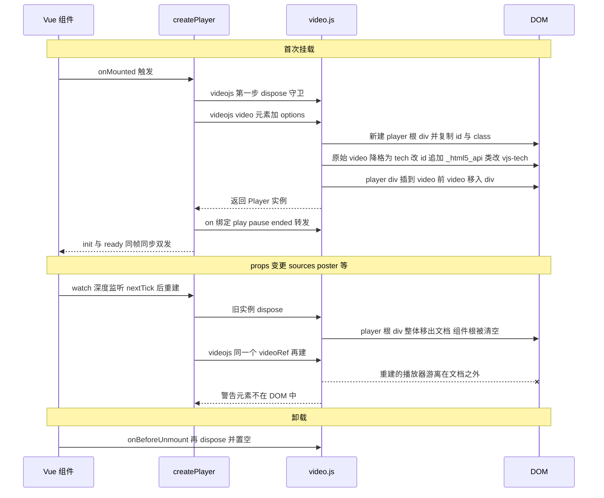
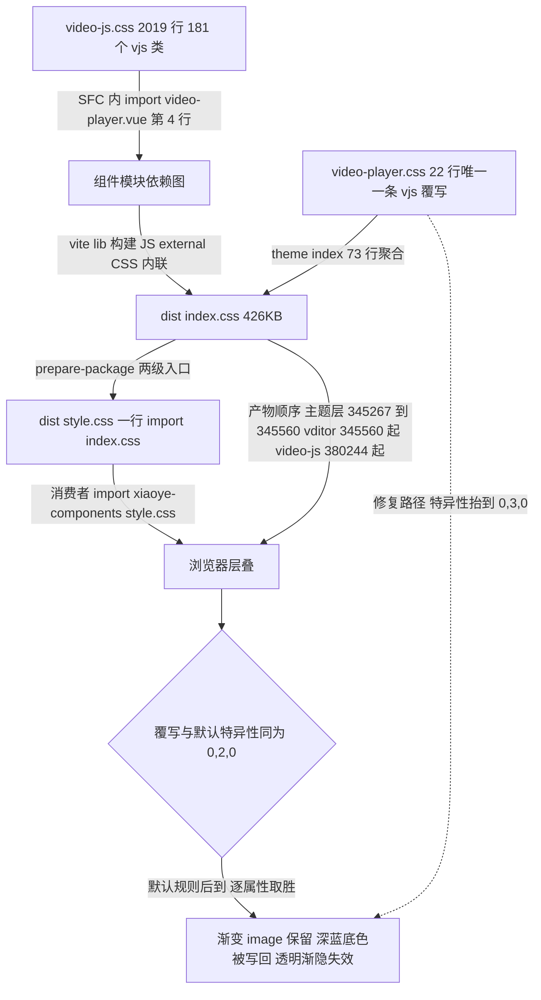

# 8-13 · VideoPlayer：video.js 封装

数据展示卷写到第十三篇，也是"第三方封装"三兄弟的收官。8-06 借 scheduler 立起了封装边界的四维框架——生命周期桥、props 映射层、事件桥、样式隔离；8-12 的 audio-player 用 howler 校验了前三维，而样式维度因为 howler 根本没有渲染层被"免考"。到了本篇的 video-player，三兄弟里唯一自带完整皮肤文件的引擎登场：video.js 不止给你一个播放器内核，还给你一份 2019 行的 CSS、181 个 `.vjs-*` 类、一段 base64 内联的图标字体。**第三方 CSS 隔离**——这个问题在 scheduler 那里因为 FullCalendar v6 运行时注入样式而无文件可引，在 audio-player 那里因为 UI 全自绘而根本不存在——在本篇第一次以完整形态出现。四维框架的第四维，在这里才算真正开考。这就是本篇的题眼：**皮肤令牌化与第三方 CSS 隔离**。

先给体量一个直观感受：`video-player.vue` 135 行、`video-player.ts` 31 行、theme 层 `video-player.css` 22 行、测试 56 行、类型夹具 27 行，全部加起来不到三百行——是三兄弟里最小的（scheduler 的源码是 1337 行）。体量小不是敷衍，恰恰是这道题的另一半答案：video.js 是"自带完整 UI"的引擎，封装者的主要工作不是补 UI，而是**管住实例、收窄类型、隔离皮肤**。但小体量里埋着两个大问题：props 变更时 dispose 重建的真实代价——我们用 jsdom 挂真实 video.js 实测出了一个会让全部单测绿灯通过的 DOM 陷阱；以及全仓库唯一一条 `.vjs-*` 覆写在构建产物里的层叠秩序——字节级验证发现它是"半生效"的。这两道裂缝在单测与文档 demo 里都不可见，只有把源码读到 video.js 的 DOM 手术层、把产物拆到字节顺序层，才看得见。

## 一、选型：EP 的空白区，与三兄弟里"皮肤最重"的引擎

先说选型成立的背景。Element Plus 2.x 的全家桶里没有视频播放器，也没有音频播放器——EP 消费的第三方库（dayjs、async-validator、@floating-ui/dom、lodash-es）清一色是 headless 的：只借逻辑，不引样式。所以 EP 一辈子不需要回答"第三方皮肤怎么融进自家令牌体系"这个问题，它的样式定制故事始终是 BEM 类名加 CSS 变量的纯自绘。本库的数据展示卷把这个问题一次性考完：scheduler、audio-player、video-player 三兄弟，恰好对应第三方 CSS 的三种形态——**运行时注入（无文件）、零 CSS（无皮肤）、完整皮肤文件**。video.js 是形态最重的那个。

社区在 Vue 生态里接 video.js 的现实选项有三条：直接裸用 `videojs()` 手管 DOM 与生命周期；用社区的 vue-video-player 一类封装壳；或者像本库这样——收编进组件库的命名与类型体系，封住它的面。本库选了第三条，并把这个选择写进依赖治理：`packages/components/package.json` 的 dependencies 里直接声明 `"video.js": "^8.23.7"`（66 行），与 howler（64 行）、echarts（63 行）、vditor（65 行）同组，延续 8-06 立下的"第三方封装族统一直依赖"的治理——用户装 `xiaoye-components` 自动带上引擎，不需要理解 video.js 的版本矩阵；根 `package.json` 的 devDependencies（75 行）用同一版本保证仓库内工具链（文档站、playground、测试）与包声明不漂移。构建侧，`scripts/config/library-build.ts` 把 `video.js` 列进 external（34 行）——**JS 外置，由用户的包管理器解析；CSS 却内联进产物**。这对"JS 外置、CSS 内联"的非对称，是理解本篇第五维度的钥匙，第五节展开。

类型方面有个省心的好消息：video.js 8 自带 TypeScript 声明（包内 `dist/types/video.d.ts`，package.json 的 types 字段直接指过去），仓库里没有任何手写的 `video.d.ts` 补丁。对照 howler（8-12 里 audio-player 需要自己消化 howler 的类型缺口），video.js 的类型完备度让封装层可以把精力全部花在"收窄"而不是"补齐"上。

## 二、类型层：31 行的收窄艺术

`packages/components/video-player/src/video-player.ts` 全文 31 行，是三兄弟里最短的类型层，但每一行都在做"翻译"而非"透传"：

```ts
export interface VideoPlayerOptions {
  [key: string]: unknown;
}

export type VideoPlayerPlayerHandler = (player: NonNullable<VideoPlayerInstance["player"]>) => void;
export type VideoPlayerStateChangeHandler = () => void;

export interface VideoPlayerSource {
  src: string;
  type?: string;
}

export interface VideoPlayerProps {
  sources?: VideoPlayerSource[];
  poster?: string;
  autoplay?: boolean;
  controls?: boolean;
  loop?: boolean;
  muted?: boolean;
  preload?: "auto" | "metadata" | "none";
  width?: string | number;
  height?: string | number;
  options?: VideoPlayerOptions;
}

export interface VideoPlayerInstance {
  player: unknown;
  play: () => Promise<void> | void;
  pause: () => void;
  load: (sources?: VideoPlayerSource[]) => void;
}
```

（`packages/components/video-player/src/video-player.ts`，31 行全文。）

三个值得停下来的细节。**其一，`VideoPlayerSource` 只有两个字段**——`src` 与可选 `type`，对应 HTML 规范里 `<source>` 的协议，而不是 video.js `PlayerOptions["sources"]` 的完整类型。片源协议被刻意收窄成最小公共面：任何 video.js 特有的源选项（比如自定义 tech 参数）都进不了这个接口，想突破只能走 `options` 通道。这是 8-06"把别人的东西翻译成本库的语言"在数据协议上的微缩版。

**其二，`player: unknown`。** `VideoPlayerInstance.player` 与两个 Handler 的参数全部落在 `unknown` 上——video.js 的 `Player` 类型明明就在依赖树里，类型层却拒绝把它抬到包根。这个决定和 `VideoPlayerOptions` 的索引签名 `[key: string]: unknown` 是同一枚硬币的两面：**对外完全不去声明 video.js 的领域类型**。收益是包根类型面与引擎版本解耦（video.js 升级大版本不会击穿本库的类型 API），代价是用户拿到 `player` 后要自己断言成 `Player` 才能调用它的方法。对照 audio-player——它的 `init` 事件直接把 howler 的 `Howl` 实例类型泄进了公开类型（`emit` 签名里就是 `Howl`）——video-player 在类型边界上反而收得更紧。同一个三兄弟家族里，类型泄漏策略并不一致，这本身是个值得记下的仓库实态。

**其三，`Instance` 是"命令面"而非"实例面"。** 对外承诺的只有 `play/pause/load` 三个方法加一个 `player` 引用，没有 `seek`、没有 `volume`、没有 `currentTime`——与 audio-player 的 `seek/setVolume/stop` 形成鲜明的范围差。视频场景的交互全部由 video.js 自带控制条承接，组件只补"程序化切源"这一个高频缺口，其余统统让用户走 `player` 引用。命令面的大小，本质上是"组件替引擎做多少主"的边界声明。

组件入口是标准三件套的最后一环：

```ts
import VideoPlayer from "./src/video-player.vue";
import type {
  VideoPlayerInstance,
  VideoPlayerPlayerHandler,
  VideoPlayerProps,
  VideoPlayerSource,
  VideoPlayerStateChangeHandler
} from "./src/video-player";
import { withInstall } from "xiaoye-primitives";

export type {
  VideoPlayerInstance,
  VideoPlayerPlayerHandler,
  VideoPlayerProps,
  VideoPlayerSource,
  VideoPlayerStateChangeHandler
};

export const XyVideoPlayer = withInstall(VideoPlayer, "xy-video-player");
export default XyVideoPlayer;
```

（`packages/components/video-player/index.ts`，20 行全文。）

五个类型全部从源码层原样上抬，没有别名、没有业务包装；值导出只有 `XyVideoPlayer` 一个，经 `withInstall` 挂上 `xy-video-player` 的安装名。`packages/components/exports.ts` 的 72 行是 `export * from "./video-player"`，`component-manifest.json` 的 636-643 行登记了 `installExports: ["XyVideoPlayer"]`、`installChecks` 与 `styleImports: ["video-player"]`——四-01 那套"一份 JSON 管六处一致性"的机制照常运转，聚合安装断言与文档侧边栏都从这一条记录派生。

## 三、生命周期桥：手管实例的完整时序，与一个实测出来的 DOM 陷阱

8-06 给三兄弟的生命周期姿态下过定义：scheduler 是**委托式**（@fullcalendar/vue3 适配器管生死，`scheduler.vue` 里一个生命周期钩子都没有），audio-player 与 video-player 是**手管式**。video-player 的手管代码全部在 `video-player.vue` 里，先看上半：

```vue
<script setup lang="ts">
import { computed, nextTick, onBeforeUnmount, onMounted, ref, watch } from "vue";
import videojs from "video.js";
import "video.js/dist/video-js.css";
import { useNamespace } from "xiaoye-primitives";
import type { VideoPlayerProps, VideoPlayerSource } from "./video-player";

defineOptions({
  name: "XyVideoPlayer"
});

const props = withDefaults(defineProps<VideoPlayerProps>(), {
  sources: () => [],
  poster: "",
  autoplay: false,
  controls: true,
  loop: false,
  muted: false,
  preload: "metadata",
  width: "100%",
  height: 360,
  options: () => ({})
});

const emit = defineEmits<{
  init: [player: unknown];
  ready: [player: unknown];
  play: [];
  pause: [];
  ended: [];
}>();

const ns = useNamespace("video-player");
const videoRef = ref<HTMLVideoElement | null>(null);
const playerRef = ref<any>(null);

const rootStyle = computed(() => ({
  width: typeof props.width === "number" ? `${props.width}px` : props.width,
  height: typeof props.height === "number" ? `${props.height}px` : props.height
}));

function normalizeSources(sources: VideoPlayerSource[]) {
  return sources.map((item) => ({
    src: item.src,
    type: item.type
  }));
}
```

（`packages/components/video-player/src/video-player.vue:1-47`。第 4 行的 `import "video.js/dist/video-js.css"` 是全仓库唯一一处 SFC 内引入第三方皮肤 CSS，rg 全仓检索仅此一命中——它的位置学意义在第五节展开。）

再看核心的 `createPlayer` 与命令方法：

```ts
function createPlayer() {
  if (!videoRef.value) {
    return;
  }

  playerRef.value?.dispose();
  playerRef.value = videojs(videoRef.value, {
    autoplay: props.autoplay,
    controls: props.controls,
    loop: props.loop,
    muted: props.muted,
    preload: props.preload,
    poster: props.poster,
    fluid: false,
    sources: normalizeSources(props.sources),
    ...props.options
  });

  playerRef.value.on("play", () => emit("play"));
  playerRef.value.on("pause", () => emit("pause"));
  playerRef.value.on("ended", () => emit("ended"));

  emit("init", playerRef.value);
  emit("ready", playerRef.value);
}

function play() {
  return playerRef.value?.play();
}

function pause() {
  playerRef.value?.pause();
}

function load(sources = props.sources) {
  if (!playerRef.value) {
    return;
  }

  playerRef.value.src(normalizeSources(sources));
  playerRef.value.load();
}
```

（`packages/components/video-player/src/video-player.vue:49-90`。）

以及 watches、生命周期两端与模板：

```ts
watch(
  () => [props.sources, props.poster, props.autoplay, props.controls, props.loop, props.muted] as const,
  async () => {
    await nextTick();
    createPlayer();
  },
  {
    deep: true
  }
);

watch(
  () => props.options,
  async () => {
    await nextTick();
    createPlayer();
  },
  {
    deep: true
  }
);

onMounted(() => {
  createPlayer();
});

onBeforeUnmount(() => {
  playerRef.value?.dispose();
  playerRef.value = null;
});

defineExpose({
  player: playerRef,
  play,
  pause,
  load
});
</script>

<template>
  <div :class="ns.base.value" :style="rootStyle">
    <video ref="videoRef" class="video-js xy-video-player__surface" playsinline />
  </div>
</template>
```

（`packages/components/video-player/src/video-player.vue:92-135`。）

把时序画出来，问题就浮出来了：



这个时序图里有两组数字值得逐行核对。第一组是 **video.js 对`<video>`标签做的 DOM 手术**——很多人以为 `videojs(videoEl)` 就是"给这个 video 加点类名"，实际上它做的是一次外科手术。看 video.js 8.23.7 的源码（`node_modules/video.js/dist/video.cjs.js`）：

```js
  createEl() {
    let tag = this.tag;
    let el;
    let playerElIngest = this.playerElIngest_ = tag.parentNode && tag.parentNode.hasAttribute && tag.parentNode.hasAttribute('data-vjs-player');
    const divEmbed = this.tag.tagName.toLowerCase() === 'video-js';
    if (playerElIngest) {
      el = this.el_ = tag.parentNode;
    } else if (!divEmbed) {
      el = this.el_ = super.createEl('div');
    }
```

（`video.cjs.js:22304-22313`。普通 `<video>` 标签、父容器没有 `data-vjs-player` 属性时，走的是最后一个分支——**播放器根元素是一个新建的 div，不是你的 video 标签**。）

```js
    // Update tag id/class for use as HTML5 playback tech
    // Might think we should do this after embedding in container so .vjs-tech class
    // doesn't flash 100% width/height, but class only applies with .video-js parent
    tag.playerId = tag.id;
    tag.id += '_html5_api';
    tag.className = 'vjs-tech';
```

（`video.cjs.js:22376-22381`。原始 video 标签被"降格"为 tech：id 追加 `_html5_api` 后缀、class 整个替换为 `vjs-tech`；它原有的 id 和 class 被复制到新建的 player div 上。）

```js
    // Wrap video tag in div (el/box) container
    if (tag.parentNode && !playerElIngest) {
      tag.parentNode.insertBefore(el, tag);
    }

    // ……中间一段注释与 children 登记省略（22430-22435 行）……

    prependTo(tag, el);
    this.children_.unshift(tag);
```

（`video.cjs.js:22426-22429 与 22436-22437，中段省略`。player div 插到 video 标签之前，video 标签再被移进 div 内部。最终 DOM 结构：`div.xy-video-player`（组件根）→ `div.video-js.xy-video-player__surface`（player 根，继承了模板上的全部类名）→ `video.vjs-tech`（原始标签）。Vue 的 `videoRef` 持有的始终是那个原始 video 标签。）

第二组数字是 **dispose 的真实行为**：

```js
    if (this.el_) {
      // Remove element from DOM
      if (this.el_.parentNode) {
        if (options.restoreEl) {
          this.el_.parentNode.replaceChild(options.restoreEl, this.el_);
        } else {
          this.el_.parentNode.removeChild(this.el_);
        }
      }
      this.el_ = null;
    }
```

（`video.cjs.js:3749-3759`，经 Player 的 `dispose()` 到达这里。没有传 `restoreEl` 时，**player 根 div 连同内部的 video tech 一起从文档里移除**。Player 侧只做一次透传：）

```js
    // the actual .el_ is removed here, or replaced if
    super.dispose({
      restoreEl: this.options_.restoreEl
    });
```

（`video.cjs.js:22292-22295`。`restoreEl` 是 video.js 留给"dispose 后原位恢复"的官方钩子——本组件没有用它。）

把两组数字连起来，再看 `video-player.vue:92-101` 的 watch——`sources` 等六个 props 任一深度变更都会 `nextTick` 后调用 `createPlayer()`，而 `createPlayer` 的第一步是 `playerRef.value?.dispose()`（54 行）。于是重建路径变成：dispose 把 player div（内含 videoRef 指向的原始 video 标签）整体移出文档 → `videojs(videoRef.value, ...)` 拿着一个**已脱离文档的元素**再建播放器。video.js 自己会怎么对待这种输入？它有言在先——`video.cjs.js:27554` 的警告文本就是 "The element supplied is not included in the DOM"。

为了不把结论停在静态推演上，我在 jsdom 26 环境里直接实例化了真实的 video.js 8.23.7（不是组件测试里的 mock），复现 `createPlayer` 的完整三步：

```text
== 首次初始化后 ==
player 根 tagName: DIV | id: v | class: video-js xy-video-player__surface vjs-paused ...
realTag 现状 id: v_html5_api | class: vjs-tech
realTag 是 tech: true | 在 player 根内: true | 在文档中: true

== dispose（模拟 watch 重建第一步）==
root 直接子元素数: 0 | realTag 在文档中: false | realTag class: vjs-tech

== 用同一 video 元素重建（createPlayer 第二步）==
root 直接子元素数: 0 | p2 根在文档中: false
p2 根 id: v_html5_api | class: vjs-tech vjs-paused ...（video-js 类丢失）
realTag id: v_html5_api_html5_api
video.js 警告: "VIDEOJS: WARN: The element supplied is not included in the DOM"
```

（实测环境：jsdom 26.1.0 + video.js 8.23.7 + Node 24；jsdom 无法真正解码视频，会出现 `MEDIA_ERR_SRC_NOT_SUPPORTED`，但这不影响 DOM 结构行为的验证——重建与 dispose 都是纯 DOM 操作，且与上文 video.js 源码行号逐一对应。）

实测结论与源码推理完全咬合，而且比预想更糟一层：**props 触发的重建路径会让组件根 div 被清空**（`root 直接子元素数: 0`），重建出的播放器整体游离于文档之外——界面上播放器直接消失；同时二次构建继承 tech 的脏状态（id 累加成 `_html5_api_html5_api`、player 根类名变成 `vjs-tech` 而丢失 `video-js`）。换句话说，`video-player.vue:92-101` 与 103-112 这两个 watch 所代表的"响应式换源"通道，在真实 DOM 里存在结构性缺陷。文档示例里的 `sources.vue` 与 `audit-workbench.vue` 恰恰是通过 `sources` prop 的 computed 变化来切换片段的，走的就是这条通道；只有 `source-switch.vue` 用的是 expose 的 `load()`（31 行 `playerRef.value?.load(...)`），避开了它。

为什么单测全绿？看 `video-player.spec.ts` 的替身就知道——mock 的 `dispose` 是一个无副作用的 `vi.fn()`，DOM 手术、元素移除、游离构建统统不会被模拟。这正是最小替身的照明边界：它验证了"组件在正确的时机调用了正确的方法"，却验证不了"这些方法在真实引擎上做了什么"。

这条陷阱也把本篇的第一个权衡顶到了台面上。

**权衡一：dispose 重建 vs `player.src()` 增量。** 实码给出的答案其实是**双通道并存**：props 侧的 watch 走"dispose + `videojs()` 全量重建"（92-112 行），命令侧的 `load()` 走"`player.src()` + `player.load()` 增量换源"（83-90 行）。增量的好处是实例存活、播放状态可延续、无 DOM 手术成本；重建的好处是 options 级变更（不只是源）也能生效——video.js 的绝大多数初始化参数（`controls`、`preload`、`poster` 等）在实例上没有对等的 setter，重建是唯一能让 props 单向数据流保持诚实的做法。问题在于重建通道的实现忘了 video.js 的 dispose 会带走 DOM：要修复，现成的路至少有三条——用 video.js 提供的 `restoreEl` 选项（`video.cjs.js:3752-3753` 会在 dispose 时用替身元素换回原位）；或给模板 video 元素加动态 `key`，让 Vue 在重建前自己重挂载一个干净的视频标签；或干脆收窄重建条件、把换源场景全部引导到 `load()` 增量通道（文档"使用约定"里其实已经写了这条优先级，但响应式通道没有设闸）。三条路的共同前提是承认：**dispose 不是一个"析构函数"，它是一次 DOM 手术的回撤**。

最后把三级生命周期姿态收个口。手管式里还有一层微差：audio-player 的 `createHowl()`（`audio-player.vue:82` 行起，89 行 `unload()` 清旧实例、114 行 `new Howl`）把 `init/ready` 挂在引擎的 `onload` 回调上——**异步就绪**；video-player 的 `createPlayer` 在 71-72 行把 `init` 与 `ready` **同帧同步双发**，并没有订阅 video.js 自己的 `ready` 事件（那个事件要等 tech 就绪才发）。用户在这两个组件上听到的"ready"语义并不等价：前者是"媒体可用了"，后者是"构造函数返回了"。这是事件桥上两兄弟的真实分歧，记在账上。

## 四、props 映射层与事件桥：窄化、透传与同步双发

props 映射层在三兄弟里的比重分布极不均匀：scheduler 有 964 行纯函数映射，audio-player 有三组 `resolved*` computed 做归一，video-player 的映射层只有 9 行 `normalizeSources`（42-47 行）——把 `VideoPlayerSource[]` 窄化成 `{src, type}` 的裸数组。窄化的意义在于**切断多余字段的透传路径**：用户在 sources 元素上多写的任何属性（注释、自定义元数据）都不会流进 video.js 的 options，片源协议保持在最小公共面上。九行代码完成了 8-06 用九百行阐述的那条原则的微缩表达：封装层的职责是翻译，不是搬运。

七个播放器基础 props（`autoplay/controls/loop/muted/preload/poster/sources`）以显式字段逐一映射进 options（55-65 行），这一层是"白名单式"的——只有列出来的才会进引擎。而第 64 行的 `...props.options` 站在展开序列的**最后**：

```ts
    fluid: false,
    sources: normalizeSources(props.sources),
    ...props.options
```

（`packages/components/video-player/src/video-player.vue:62-64`。）

这是一个位置学上的关键决策：`options` 透传项可以覆盖前面所有显式映射的默认值。用户传 `{ options: { controls: false } }` 就能压过 `controls: true` 的 prop 默认——这给了逃生门（video.js 的一百多个初始化参数不必逐个抬成 prop），也埋了口径分裂（同一个 `controls`，走 prop 和走 options 行为一致，但类型层没有任何提示它们会同名冲突）。62 行的 `fluid: false` 同样值得记一笔：video.js 的 fluid 模式用 padding-top 的宽高比 hack 撑高度，会和组件自己用 `rootStyle` 管尺寸（37-40 行）加 CSS 撑满（theme 层 `.video-js { width: 100%; height: 100% }`）的方案打架——**尺寸权归容器，播放器只负责填满**，这是"组件管布局、引擎管内容"的分工在尺寸上的落点。模板上的 `playsinline`（133 行）则是 iOS 内联播放的硬要求，属于"引擎默认不开、封装层必须开"的典型。

事件桥这边，转发面极窄：`player.on()` 只挂了 `play/pause/ended` 三个（67-69 行），`init/ready` 由组件自己同步发射（71-72 行）。对照 audio-player 的事件面（`init/ready/play/pause/end/update:volume/time-update` 七个，且 `time-update` 由 requestAnimationFrame 驱动自行实现），video-player 把"播放进度"这类高频事件整个留给了引擎的内部 UI——组件的事件桥只广播状态变化，不搬运数据流。另一个实现细节：三个转发闭包闭住了 `playerRef.value` 的当前实例，而重建后旧实例的监听器随 dispose 一起销毁、新监听器由新 `createPlayer` 重挂——**事件桥的生命周期与实例严格同寿**，这比"在 mounted 里挂一次、靠实例本身不换"的写法更干净，也是重建式架构意外的自洽之处。

还有一处小瑕疵顺带记下：92-101 与 103-112 两个 watch 都会在变更时各自 `nextTick` 后调 `createPlayer()`。如果一次操作同时变更 `sources` 和 `options`（比如换片源同时改 `playbackRates`），两个 watch 各触发一次重建——`createPlayer` 内部的"先 dispose 再建"保证了正确性（第二次调用会 dispose 掉第一次的产物），但一次变更付了两次 DOM 手术的成本。用一个合并的 watch 元组或微任务去重可以收掉，属于"正确但不经济"的实码形态。

## 五、皮肤令牌化与第三方 CSS 隔离（题眼）

现在进入本篇的题眼。三方对照先立起来：scheduler 面对的 FullCalendar v6 把样式随 JS 运行时注入，theme 层连 CSS 文件都不需要 import，8-06 的覆写只需要一条 `--fc-now-indicator-color: var(--xy-danger)` 的变量桥；audio-player 的 howler 零 CSS，`audio-player.css` 的八个 BEM 块全部是自家令牌的纯自绘；而 video.js 给出的是一份**实打实的皮肤文件**——`video.js/dist/video-js.css`，2019 行、1026 处类名引用、181 个唯一 `.vjs-*` 类、一个 base64 内联的 woff 图标字体（唯一的 `url()` 引用），并且没有任何 `--vjs-*` CSS 变量主题面。这意味着 video-player 面对的是三兄弟里最硬的样式命题：**一份不可变量化定制、也无法运行时注入的第三方皮肤，怎么融进 `--xy-*` 令牌体系？**

先看引入方式。全仓库检索 `video-js.css` 只有一处命中——`video-player.vue:4` 的 SFC 内 `import "video.js/dist/video-js.css"`。这个位置不是随手一放，它同时满足了两个消费模型：**按需消费**时（bundler 对 `xiaoye-components` 做 tree-shaking，`sideEffects` 字段只豁免 CSS 文件），皮肤 import 跟着组件模块走，用了组件才有皮肤，不用就没这份 46KB 的负担；**全量消费**时（构建产物里所有组件的 CSS 被打进一个聚合文件），皮肤随组件模块一起进入聚合。它和 scheduler 形成有趣的镜像：FullCalendar v6 的样式由 JS 在运行时注入（不需要、也没有 CSS import 可写），video.js 的样式由打包器在构建期注入（必须写、且只有这一处可写）——两种注入时序，两种隔离策略。

皮肤进包后的归属链路是这样的：`vite` lib 构建把依赖图里所有 CSS（theme 聚合 + vditor 皮肤 + video-js 皮肤）收进 `packages/components/dist/index.css`（实测 426215 字节），`scripts/prepare-package.mjs`（338-340 行）再生成一个两级入口——`dist/style.css` 只有一行 `@import "./index.css";`，作为 `package.json` exports 里的 `./style.css` 对外暴露。消费者 `import "xiaoye-components/style.css"` 就拿到了全量样式，video.js 皮肤随包发布、无断链。注意这条链上的非对称：**JS 侧 video.js 是 external**（`library-build.ts:34`，用户侧解析），**CSS 侧 video-js.css 被内联**（占产物 10.8%，45971 字节）——引擎代码跟随用户的锁文件走，引擎皮肤跟随本库的版本走。这是一个深思熟虑的取舍：皮肤要经覆写才能融入主题，覆写与皮肤必须同版本同源，若把 CSS 也外置，用户锁一个旧版 video.js 就会出现"覆写对不上默认值"的层叠漂移。代价则是本库的发版间接锁定了皮肤的形态。

然后是覆写。theme 层的 `video-player.css` 全文 22 行：

```css
.xy-video-player {
  position: relative;
  width: 100%;
  border: 1px solid var(--xy-border-subtle);
  border-radius: var(--xy-radius-lg);
  overflow: hidden;
  background: color-mix(in srgb, var(--xy-text-heading) 88%, black);
  box-shadow: var(--xy-shadow-0);
}

.xy-video-player .video-js {
  width: 100%;
  height: 100%;
}

.xy-video-player .vjs-control-bar {
  background: linear-gradient(
    180deg,
    transparent,
    color-mix(in srgb, var(--xy-text-heading) 76%, transparent)
  );
}
```

（`packages/theme/src/components/video-player.css`，22 行全文，经 `packages/theme/index.css:73` 挂进聚合层，manifest 的 `styleImports: ["video-player"]` 驱动安装器按需样式。）

22 行拆成三段。第一段（1-9 行）是**容器自绘**：边框、圆角、阴影全部消费语义层与刻度层令牌（`--xy-border-subtle`、`--xy-radius-lg`、`--xy-shadow-0`），与全部 72 个组件同规。第 7 行是全文件最有趣的一行：`color-mix(in srgb, var(--xy-text-heading) 88%, black)`——**从标题文字色派生播放器的暗面底色**。播放器表面天然应该是暗的（视频 letterbox 的黑），但它不该写死 `#000`，否则暗色主题下与页面其他面板的"海拔关系"脱钩；于是作者用"标题色的 88% 混黑"造了一个随主题联动的暗面——亮色主题下标题色是 `--xy-gray-950`（`tokens.css:94`），混出来是近黑；暗色主题下标题色是 `#f2f5fa`（`tokens.css:264`），混出来却是浅灰。**从文字色派生界面色的方向感在暗色主题下会翻转**——这是一个语义错位的令牌消费：`--xy-text-heading` 的语义是"最重的文字色"，不是"最深的面板色"，拿它当暗面锚点，主题一换语义就反了。所幸这个底色实际上被遮住了：模板上 video 元素自带 `video-js` 类，video-js.css 的基础规则给它硬编码了 `background-color: #000`（`video-js.css:465` 行），而 theme 层又让 `.video-js` 撑满容器（11-14 行），容器那层令牌暗面从亮相起就没有露过脸——**一行语义错位的令牌消费，加上一层第三方底色遮蔽，双重失效互相掩护**，视觉巡检自然抓不到它。

第二段（11-14 行）是**皮肤类的容器化接线**：`.xy-video-player .video-js { width: 100%; height: 100% }`——一个选择器同时压住了 video.js 的两个尺寸机制（fluid 的 padding hack 已被 `fluid: false` 关掉、video.js 还会往 head 里塞动态尺寸 style 元素），让 player 根 div 无条件填满组件容器，尺寸权彻底归容器。

第三段（16-22 行）是全仓库**唯一一条 `.vjs-*` 覆写**——181 个第三方类只覆写了 1 个（`.vjs-control-bar`，覆写率 0.55%），把 video.js 控制条默认的半透明深蓝底（`video-js.css:907-916` 行的 `background-color: #2B333F; background-color: rgba(43, 51, 63, 0.7)`）换成一条"从透明渐变到标题色 76%"的底部光带。这就是任务规格里问的"皮肤令牌化策略"的实码定论：**既不是 xy 前缀类名映射，也不是 CSS 变量注入，而是"容器级令牌自绘 + 单点作用域覆写"的第三条路**——chrome 归自己（容器边框圆角阴影），内容归引擎（181 个类的内部结构照单全收），只在最影响品牌感知的控制条上做一次 color-mix 渐变覆写。

但这条覆写在产物里是**半生效**的。把 `dist/index.css` 拆开看字节顺序：

```text
主题层（.xy-video-player 容器规则）      345267 字节处
主题层（.video-js 撑满规则）             345499
主题层（.vjs-control-bar 覆写）          345549
vditor 皮肤（编辑器引擎，.vditor 起始）   345560
video-js 皮肤（.vjs-icon-placeholder 起）380244
vjs 默认 .vjs-control-bar 深蓝底         399896
（文件总长 426215）
```

覆写与默认规则的选择器特异性同为 (0,2,0)，**默认规则在层叠顺序上后到**。覆写用的 `background` 简写会把背景色隐式置为 transparent、背景图置为渐变；而更晚出现的默认规则把 `background-color: rgba(43, 51, 63, 0.7)` 又写了回来。按 CSS 层叠的逐属性胜负规则，最终生效的是：**渐变背景图（覆写方的 background-image）+ 深蓝半透明底色（默认方的 background-color）**——覆写想要的那截"透明渐隐"不再透明，光带底下永远垫着 video.js 的默认深蓝。视觉上它仍然"像覆写成功了一半"（底部的标题色光带确实在），这正是它能一路绿灯的原因：巡检看不出"半透明被垫深了"，只有把产物拆到字节层才能看见。修复同样是一个选择器的事——把覆写抬到 `.xy-video-player .video-js .vjs-control-bar`（特异性 (0,3,0)）即可无视顺序。这个案例是"最小覆写"策略的隐藏成本最生动的注脚：**覆写规则写在哪由你定，第三方默认规则排在哪由构建器定——同特异性的覆写必须自带顺序免疫力**。scheduler 不曾踩到这一点，因为 v6 的注入样式在运行时先于任何静态 CSS 存在，而 video-js.css 是被打包器追加在主题层之后的。

把这条链完整画出来：



**权衡二：皮肤令牌化的三条路。** 激进路线是**皮肤接管**——用 xy 类名体系重写控制条、大播放键、进度条的全部视觉，video.js 只当 headless 内核（其社区确有这类用法）；代价是与 181 个类的内部 DOM 深度耦合，video.js 升一次版本次修一轮，等于把 8-06 否决过的"网格整体接管"再走一遍。保守路线是**全盘照单**——181 个类一个不覆写，接受 video.js 默认的深蓝控制条；代价是组件库里嵌一块风格异质的第三方皮，暗色主题下尤其突兀。实码取的中间路线是**令牌化单点覆写**：容器 chrome 全自绘保证产品语言统一，引擎内部 180 个类照单全收保证升级安全，只在控制条做一次 color-mix 接线。它的残缺代价诚实记录在案：覆写率 0.55% 意味着控制条之外的 vjs 视觉（大播放键、菜单、加载环）仍是 video.js 默认色；单一覆写还踩中了层叠顺序（如上）；暗面派生的语义错位被第三方底色遮蔽成死样式。三兄弟的样式隔离策略在这条线上排开——scheduler 靠**变量桥**（引擎有变量主题面，覆写变量不碰规则）、audio-player 靠**全自绘**（引擎无皮肤，隔离是天然的）、video-player 靠**单点作用域覆写**（引擎有皮肤无变量，覆写规则是唯一抓手）——第三种形态的工程难度恰好是最高的。

**权衡三：全量 vs 按需的收官一笔。** 8-06 从 dependencies 的角度讲过"直依赖换开箱即用"，本篇从 CSS 的角度补上最后一块：皮肤 CSS 的 2019 行无法按需裁剪——video.js 没有提供模块化的样式入口（对照 FullCalendar v6 样式随插件 JS 运行时注入，天然"用了哪个插件注入哪份"），打包器只能整文件内联（产物里 10.8% 的字节占比）。JS 侧同样是全量的：`video.js` 的 ES 构建是单体核心，没有 echarts/core 那样的按需注册协议（8-11 里 charts 用 `echarts/core` + 模块清单做到了 28 项按需），所以 external 交给用户后，用户引入的也是完整的 video.js。**皮肤全量 + 引擎全量**，是 video.js 这个引擎形态下没有得选的那一半；有得选的一半——CSS 走聚合入口还是组件跟随、JS external 还是打包进产物——实码给出的答案（组件跟随 + external）是这份约束下的合理解。

## 六、测试与类型夹具：最小替身的照明范围

`__tests__/video-player.spec.ts` 全文 56 行、两个用例：

```ts
import { mount } from "@vue/test-utils";
import { describe, expect, it, vi } from "vitest";
import { XyVideoPlayer } from "@xiaoye/components";

const videoMock = vi.hoisted(() => ({
  on: vi.fn(),
  src: vi.fn(),
  load: vi.fn(),
  play: vi.fn(),
  pause: vi.fn(),
  dispose: vi.fn(),
  constructor: vi.fn(() => ({
    on: videoMock.on,
    src: videoMock.src,
    load: videoMock.load,
    play: videoMock.play,
    pause: videoMock.pause,
    dispose: videoMock.dispose
  }))
}));

vi.mock("video.js", () => ({
  default: videoMock.constructor
}));

describe("XyVideoPlayer", () => {
  it("挂载时初始化 player，并转发基本事件绑定", () => {
    const wrapper = mount(XyVideoPlayer, {
      props: {
        sources: [{ src: "/demo.mp4", type: "video/mp4" }]
      }
    });

    expect(videoMock.constructor).toHaveBeenCalledTimes(1);
    expect(videoMock.on).toHaveBeenCalled();
    expect(wrapper.emitted("init")).toHaveLength(1);
  });

  it("sources 变化会重建播放器，卸载时销毁实例", async () => {
    const wrapper = mount(XyVideoPlayer, {
      props: {
        sources: [{ src: "/demo.mp4", type: "video/mp4" }]
      }
    });

    await wrapper.setProps({
      sources: [{ src: "/demo-2.mp4", type: "video/mp4" }]
    });

    expect(videoMock.constructor).toHaveBeenCalledTimes(2);

    wrapper.unmount();

    expect(videoMock.dispose).toHaveBeenCalled();
  });
});
```

（`packages/components/video-player/__tests__/video-player.spec.ts`，56 行全文。）

替身策略是 `vi.hoisted` 提升 + `vi.mock` 工厂：mock 的 `constructor` 返回一个共享同一组 `vi.fn()` 的实例对象。与 audio-player 的替身对照非常说明问题——audio-player 的 mock 是**行为模拟型**的：构造函数直接调用 `options.onload?.()`，`play()` 会触发 `onplay` 回调，替身复现了引擎的回调时序：

```ts
const howlMock = vi.hoisted(() => ({
  play: vi.fn(),
  pause: vi.fn(),
  stop: vi.fn(),
  seek: vi.fn(() => 12),
  volume: vi.fn(),
  unload: vi.fn(),
  rate: vi.fn(),
  duration: vi.fn(() => 120),
  playing: vi.fn(() => false),
  constructor: vi.fn(function MockHowl(options: Record<string, (...args: unknown[]) => void>) {
    options.onload?.();
    return {
      play: howlMock.play.mockImplementation(() => {
        options.onplay?.();
      }),
      pause: howlMock.pause.mockImplementation(() => {
        options.onpause?.();
      }),
      stop: howlMock.stop,
      seek: howlMock.seek,
      volume: howlMock.volume,
      unload: howlMock.unload,
      rate: howlMock.rate,
      duration: howlMock.duration,
      playing: howlMock.playing
    };
  })
}));
```

（`packages/components/audio-player/__tests__/audio-player.spec.ts:6-34`。）

video-player 的 mock 则是**最小记录型**的：只记录"被调用了"，不模拟任何行为。两种策略各有照明范围：行为模拟型能验证事件桥的"转发正确"（audio-player 的用例可以断言 end 事件、time-update 的帧驱动），最小记录型只能验证事件桥的"绑定发生"（第一个用例的 `expect(videoMock.on).toHaveBeenCalled()` 只知道 on 被调过，不知道绑的是哪三个事件名）。最小替身的选择让这份测试对第三节那个 dispose 陷阱完全失明——mock 的 `dispose` 不会移除 DOM，`videojs` 也不会做 DOM 手术，用例二在 jsdom 里"重建成功"是 mock 世界里的重建成功。**替身越薄，测试与真实引擎的偏差越大**，这是三兄弟测试策略对比给出的最后一条经验：scheduler 的 9 用例替身模拟了适配器的 mount/unmount 行为，audio-player 模拟了回调时序，video-player 只记录调用——照明范围与封装风险恰好成反比。

类型夹具 27 行：

```ts
import type {
  VideoPlayerInstance,
  VideoPlayerProps,
  VideoPlayerSource
} from "xiaoye-components";
import { XyVideoPlayer } from "xiaoye-components";

const source: VideoPlayerSource = {
  src: "/video/demo.mp4",
  type: "video/mp4"
};

const props: VideoPlayerProps = {
  sources: [source],
  controls: true,
  poster: "/video/poster.png"
};

declare const instance: VideoPlayerInstance;

instance.play();
instance.pause();
instance.load([source]);

void source;
void props;
void XyVideoPlayer;
```

（`tests/types/fixtures/video-player.ts`，27 行全文，随 `pnpm typecheck:types` 参与检查。）

夹具断言的三件事与公开类型面一一对应：`VideoPlayerSource` 的最小协议可实例化、`VideoPlayerProps` 的核心字段可赋值、`VideoPlayerInstance` 的三个命令方法可调用。注意它没有引用 `VideoPlayerOptions`——`[key: string]: unknown` 的索引签名让这个类型几乎可以接受任何对象，类型层对它的"保证"本来就趋近于零，夹具不测它是诚实的。

## 七、文档与示例：六个 demo 与两个"孤儿"

`apps/docs/components/video-player.md` 共 95 行，挂了六个 demo：basic（11 行）、poster（15 行，data-URI 的 SVG 封面 + `options.playbackRates`）、sources（44 行，computed 切源 + `load` 手动重载）、audit-workbench（84 行，主播放器 + 审核面板的审核工作台）、detail-page-media（80 行）与 detail-page-audit（93 行）两个 DetailPage 组合场景。API 表（56-95 行）把 `VideoPlayerSource`、十项 Attributes、五个 Events、四项 Exposes 列全，"使用约定"里写明了 `options` 的透传语义与"只换源优先 `load`"的优先级建议。

示例目录里却有八份文件——`source-switch.vue`（57 行，命令式切源的完整交互示例）与 `poster-options.vue`（28 行，SVG 海报与倍速组合）没有被文档页的任何 `:::demo` 引用，全仓检索也无其他消费方，处于"孤儿"状态。两份孤儿恰好是仓库里仅有的"命令式 `load()` 通道"与"options 倍速"的独立演示，尤其是前者——考虑到第三节发现的重建通道缺陷，`source-switch.vue` 演示的 `load()` 增量通道反而是当前实态下最该被推荐的换源方式，它躺在示例目录里不露面，有点可惜。另外六个 demo 里，`sources.vue` 与 `audit-workbench.vue` 走的是响应式切源通道，在真实浏览器里切换片段时会踩中重建陷阱——示例层与实码缺陷的这层纠缠，是文档侧需要与修复联动的地方。

## 八、收官：三兄弟四级对照

四维框架跑完三站，把账本合起来看：

| 维度 | scheduler（8-06） | audio-player（8-12） | video-player（本篇） |
| --- | --- | --- | --- |
| 生命周期桥 | 委托式：适配器管生死，组件零钩子 | 手管：`createHowl()`/`unload()`，`onload` 异步就绪 | 手管：`createPlayer()`/`dispose()`，同步就绪；重建路径实测存在 DOM 游离陷阱 |
| props 映射层 | 964 行纯函数映射（视图翻译/日期解析/RRULE 展开） | 三组 `resolved*` computed 归一 | 9 行 `normalizeSources` 窄化 + options 尾部透传展开 |
| 事件桥 | payload 构建器纯函数组装 | 引擎回调直挂 + rAF 自实现数据流事件 | `player.on()` 三事件转发 + `init/ready` 同步双发 |
| 样式隔离 | chrome 自绘 + `--fc-*` 变量桥（v6 无 CSS 文件） | 引擎零 CSS，UI 全自绘全令牌 | 皮肤文件随包 + 1/181 单点覆写；产物层叠半生效缺陷 |

三种第三方 CSS 形态、三种隔离策略、三种事件时序、三种替身策略——四维框架在每一站都长出了不同的解，而**"翻译而非搬运"是贯穿三站的不变量**：scheduler 把 FullCalendar 的领域模型译成 `SchedulerEvent`，audio-player 把 Howl 的回调译成 Vue 事件，video-player 把 video.js 的 options 译成七个白名单 prop 加一个逃生口。第四站的 Stylesheet 翻译做得最薄（1/181），代价也已经量化在案。

回头看本篇的题眼。皮肤令牌化与第三方 CSS 隔离，拆开是四个具体问题，实码各给了明确答案：**引入方式**——SFC 内唯一一处皮肤 import，按需跟随组件、全量进聚合层；**产物归属**——JS external、CSS 内联的两级 `@import` 入口，皮肤与覆写同版本同源；**覆写策略**——容器令牌自绘 + 单点作用域覆写，而非类名映射或变量注入（引擎没给变量面，这是约束下的解而非偏好）；**层叠秩序**——同特异性覆写必须自带顺序免疫力，当前实码没带，这是一个选择器就能修的缺陷。这四个答案合起来，就是这份 135 行的封装在"皮肤最重的引擎"上交出的完整答卷——不完美，但每一处取舍都看得见理由。

下一篇预告：**9-01《增强层总览：导出边界与双重守卫》**，第九卷开篇。基础卷的 72 个组件到这里收官，镜头转向 `packages/pro-components`：增强层不是"更多组件"的简单堆叠，而是一套有明确进出口管制的海关——`exports.ts` 的显式白名单、`index.ts` 的类型准入清单、`check-pro-components.mjs` 与 `pro-root-boundary` 类型夹具构成的双重守卫。基础卷用四维框架回答"怎么封装一个引擎"，增强层要用边界设计回答"怎么让一个包敢长大"。VideoPlayer 这类媒体组件与 DetailPage 组合出的场景（本篇文档示例里已经预演了两次），正是增强层存在理由的第一现场。

---

*本篇代码引用核对于当前工作区实态：`packages/components/video-player/src/video-player.vue`（135 行；L1-47 / L49-90 / L92-135 分段全文引用）、`src/video-player.ts`（31 行全文）、`index.ts`（20 行全文）、`__tests__/video-player.spec.ts`（56 行全文，2 用例）、`tests/types/fixtures/video-player.ts`（27 行全文）、`packages/theme/src/components/video-player.css`（22 行全文）、`packages/theme/index.css:73`、`packages/components/exports.ts:72`、`packages/components/component-manifest.json:636-643`、`packages/components/package.json:66`（video.js ^8.23.7 dependencies；L63 echarts / L64 howler / L65 vditor）、根 `package.json:75`、`scripts/config/library-build.ts:34`（external）、`scripts/prepare-package.mjs:338-340`（两级 style.css 入口）。video.js 8.23.7 包事实：自带 `dist/types/video.d.ts` 类型；`dist/video-js.css` 2019 行、1026 处类名引用、181 个唯一 `.vjs-*` 类、1 个 base64 woff 字体、无 `--vjs-*` 变量；`.video-js` 基础规则含 `background-color:#000`（video-js.css:465），`.video-js .vjs-control-bar` 默认底色 `#2B333F`/`rgba(43,51,63,.7)`（video-js.css:907-916）；运行时源码（node_modules/video.js/dist/video.cjs.js）引用行号：L22304-22313（createEl 分支，普通标签时 `el = this.el_ = super.createEl('div')`）、L22376-22381（tag 降格为 tech：id 追加 `_html5_api`、class 置 `vjs-tech`）、L22426-22429 与 L22436-22437（wrap：insertBefore + prependTo，中段 22430-22435 省略并在文中标注）、L22292-22295（Player.dispose 透传 restoreEl）、L3749-3759（Component.dispose 的 removeChild/replaceChild 分支）、L22259-22260（dispose 时 `tag.player = null`）、L27554（"The element supplied is not included in the DOM" 警告）。jsdom 实测：jsdom 26.1.0 + video.js 8.23.7 + Node 24，直接实例化真实引擎复现 createPlayer 三步，输出如文中引用块；jsdom 无法解码视频（MEDIA_ERR_SRC_NOT_SUPPORTED），DOM 结构行为不受影响且与上述源码行号逐条对应。构建产物实测：`packages/components/dist/index.css` 426215 字节，顺序为主题层（`.xy-video-player{` @345267、`.video-js` 撑满 @345499、`.vjs-control-bar` 覆写 @345549）→ vditor 皮肤（@345560 起）→ video-js 皮肤（@380244 起，占产物 10.8%）→ vjs 默认控制条底色 @399896；`dist/style.css` 23 字节 `@import "./index.css";`；`dist/index.js` 内无任何 CSS import。对照源码：`packages/components/audio-player/src/audio-player.vue:82-148`（createHowl/unload/new Howl）、`audio-player.spec.ts:6-34`（行为模拟型替身摘录）、`packages/theme/src/components/audio-player.css`（八块全令牌自绘）、`packages/components/scheduler/src/scheduler.vue`（无生命周期钩子）、`packages/theme/src/components/scheduler.css:89-92`（`--fc-now-indicator-color` 变量桥）。令牌事实：`packages/xiaoye-primitives/src/theme/tokens.css:94`（亮色 `--xy-text-heading: var(--xy-gray-950)`）、L262-264（暗色块内 `#f2f5fa`）、L115/166/232（border-subtle/shadow-0/radius-lg）。EP 侧事实（无视频/音频播放器组件、第三方依赖均 headless 无 CSS、BEM+CSS 变量自绘体系）以 element-plus 2.x 公开文档为参照核对，未引行号。文档事实：`apps/docs/components/video-player.md` 95 行 6 个 demo；`apps/docs/examples/video-player/` 8 文件共 412 行（basic 11 / poster 15 / sources 44 / source-switch 57 / poster-options 28 / audit-workbench 84 / detail-page-media 80 / detail-page-audit 93），其中 source-switch 与 poster-options 未被文档页引用。本篇叙述与源码不符点自查：任务规格假设"src 切换 dispose 重建 vs player.src() 增量"二选一——实码是双通道并存（watch 重建 L92-112 / expose 的 load 增量 L83-90），文中按双通道展开并实测出重建通道的 DOM 游离陷阱（属新发现，单测因最小 mock 而不可见）；任务规格问"皮肤令牌化策略（xy 前缀类名映射？CSS 变量注入？）"——实码定论为第三态"容器级令牌自绘 + 1/181 单点作用域覆写"，且该覆写在产物层叠顺序上被默认底色部分顶掉（字节级验证）；任务规格称"scheduler 无第三方 CSS"——精确化为"scheduler 无需引入第三方 CSS 文件（v6 运行时注入）但有 `.fc` 作用域覆写段"，audio-player 为"引擎零 CSS、UI 全自绘"，文中按精确化表述展开；init/ready 为同帧同步双发而非 video.js 异步 ready（L71-72，与 audio-player 的 onload 异步就绪构成家族内分歧）；文档示例 8 文件中 2 个为孤儿示例；容器令牌暗面（color-mix text-heading 88%）在暗色主题下语义翻转但被 `.video-js` 默认 `#000` 遮蔽，属"语义错位 + 双重失效互相掩护"的实码瑕疵，文中如实记认；jsdom 实测为本篇新增验证手段，测试文件已用后即删、未入库。文中全部源码引用块与实码做逐字比对（含缩进），除两张 mermaid 示意图、实测输出块与产物字节表外全部命中源文件原文（video.cjs.js 的 wrap 段为中段省略的拼接摘录，已按行段标注）。*
