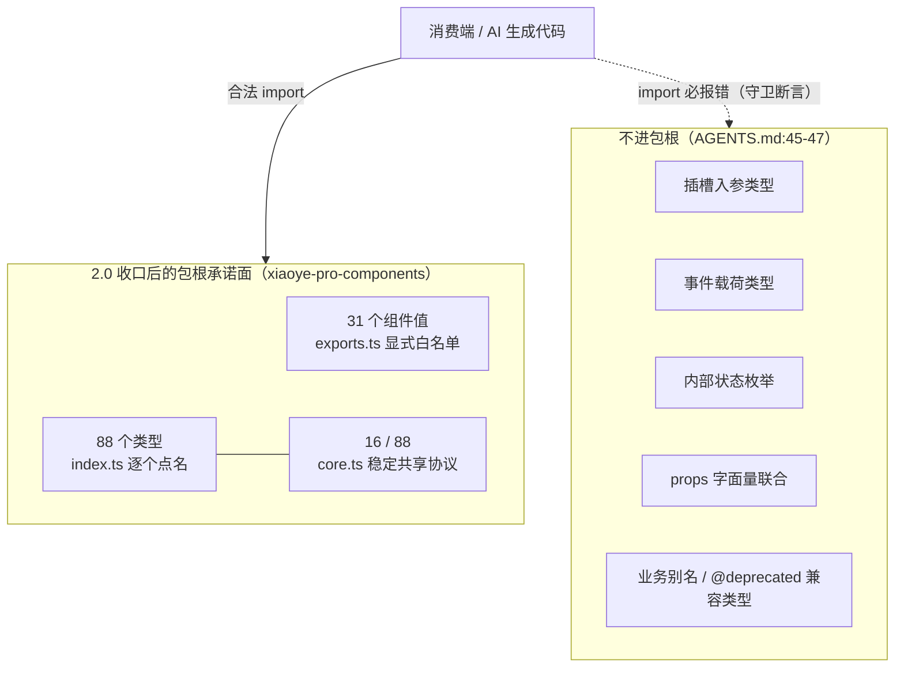
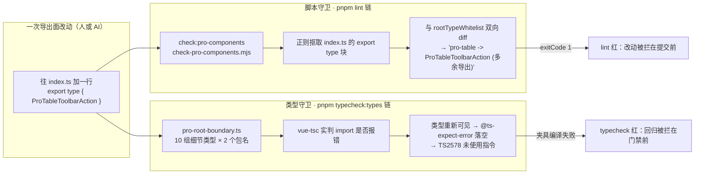

# 9-01 · 增强层总览：导出边界与双重守卫

> 第九卷开篇，我们从基础层切到增强层。前八卷里，`packages/components` 的 72 个基础组件讲的是"如何把 UI 原子做对"；从这一篇起，主角换成 `packages/pro-components`——面向中后台业务的增强层。开篇不急着拆某个组件，先回答一个统领全卷的问题：**为什么 2.0 要做一次 API 面大收口？**
>
> 先给结论：因为对一类特殊的"读者"来说，npm 包的导出面不只是接口，而是**被逐字引用的法律条文**。这类读者有两个——依赖 `dist/types/index.d.ts` 写代码的消费端开发者，以及在这个 monorepo 里大量生成 `import type` 语句的 AI 协作者。API 面每宽一寸，兼容承诺就重一分，AI 生成代码的耦合深度就深一层。2.0 的收口不是审美洁癖，而是把"包根只承诺什么"从一句文档（`AGENTS.md` 增强层导出规则，`AGENTS.md:30-54`）变成两台可以互相兜底的机器：一台脚本守卫（`scripts/check-pro-components.mjs`，挂在 lint 链上），一台类型守卫（`tests/types/fixtures/pro-root-boundary.ts`，挂在 typecheck 链上）。本篇逐层拆开这五个文件，看一次收口是怎么被"立法"并且"执法"的。

## 一、先看货：31 个增强组件与一张 manifest

增强层现在有多少货？答案写在 `packages/pro-components/component-manifest.json` 里——31 个条目，覆盖五大业务分组：form（增强表单 9 个）、page（增强页面 11 个）、data（增强数据 5 个）、detail（增强详情 3 个）、workflow（增强流程 3 个），9 + 11 + 5 + 3 + 3 合计 31，与条目总数自洽。每个条目五个字段，先用 form 组开头的原文看结构：

```json
// packages/pro-components/component-manifest.json（L1-73：form 组 9 条完整原文）
[
  {
    "name": "search-form",
    "docsGroup": "form",
    "docsText": "SearchForm 搜索表单",
    "installExports": ["XySearchForm"],
    "installChecks": [{ "kind": "component", "name": "xy-search-form" }],
    "styleImports": ["search-form"]
  },
  {
    "name": "pro-form",
    "docsGroup": "form",
    "docsText": "ProForm 增强表单",
    "installExports": ["XyProForm"],
    "installChecks": [{ "kind": "component", "name": "xy-pro-form" }],
    "styleImports": ["pro-form"]
  },
  {
    "name": "overlay-form",
    "docsGroup": "form",
    "docsText": "OverlayForm 浮层表单",
    "installExports": ["XyOverlayForm"],
    "installChecks": [{ "kind": "component", "name": "xy-overlay-form" }],
    "styleImports": ["overlay-form"]
  },
  {
    "name": "dialog-form",
    "docsGroup": "form",
    "docsText": "DialogForm 弹窗表单",
    "installExports": ["XyDialogForm"],
    "installChecks": [{ "kind": "component", "name": "xy-dialog-form" }],
    "styleImports": ["dialog-form"]
  },
  {
    "name": "drawer-form",
    "docsGroup": "form",
    "docsText": "DrawerForm 抽屉表单",
    "installExports": ["XyDrawerForm"],
    "installChecks": [{ "kind": "component", "name": "xy-drawer-form" }],
    "styleImports": ["drawer-form"]
  },
  {
    "name": "steps-form",
    "docsGroup": "form",
    "docsText": "StepsForm 分步表单",
    "installExports": ["XyStepsForm"],
    "installChecks": [{ "kind": "component", "name": "xy-steps-form" }],
    "styleImports": ["steps-form"]
  },
  {
    "name": "filter-panel",
    "docsGroup": "form",
    "docsText": "FilterPanel 筛选面板",
    "installExports": ["XyFilterPanel"],
    "installChecks": [{ "kind": "component", "name": "xy-filter-panel" }],
    "styleImports": ["filter-panel"]
  },
  {
    "name": "request-form",
    "docsGroup": "form",
    "docsText": "RequestForm 请求表单",
    "installExports": ["XyRequestForm"],
    "installChecks": [{ "kind": "component", "name": "xy-request-form" }],
    "styleImports": ["request-form"]
  },
  {
    "name": "login-form",
    "docsGroup": "form",
    "docsText": "LoginForm 登录表单",
    "installExports": ["XyLoginForm"],
    "installChecks": [{ "kind": "component", "name": "xy-login-form" }],
    "styleImports": ["login-form"]
  },
```

五个字段各管一摊，值得逐个点名：

- `name`：kebab-case 主名，既是目录名，也是文档页文件名（`apps/docs/pro-components/<name>.md`）。
- `docsGroup` / `docsText`：文档侧边栏分组与展示文案，五个合法分组在 TS 层被收窄成字面量联合（`component-manifest.ts:3` 的 `"form" | "data" | "detail" | "page" | "workflow"`）。
- `installExports`：**这个组件公开的值导出名单**。当前 31 条每条恰好一个名字——`installExports` 就是值导出白名单的数据形态。
- `installChecks`：聚合安装后要验证的注册结果。类型定义在 `component-manifest.ts:5-8`，`kind` 有 `component | directive | globalProperty` 三种（指令与全局属性是给 `message` 这类函数式 API 预留的通道）；当前 31 条全部是 `component`，各自声明一个 kebab-case 全局组件名如 `xy-search-form`。
- `styleImports`：样式文件名，对应 `packages/theme/src/pro/<name>.css`。

数据有了，接下来是消费方。`packages/pro-components/component-manifest.ts` 把这份 JSON 加载成类型安全的派生层，其中与本篇最相关的三个导出：

```ts
// packages/pro-components/component-manifest.ts（L60-70：manifest 的四个派生导出）
export const proPublicComponentNames = proComponentManifest.map((entry) => entry.name);

export const proInstallableComponentExportNames = proComponentManifest.flatMap(
  (entry) => entry.installExports
);

export const proInstallCheckEntries = proComponentManifest.flatMap((entry) => entry.installChecks);

export const proThemeStyleImportNames = Array.from(
  new Set(proComponentManifest.flatMap((entry) => entry.styleImports))
);
```

注意这个设计的方向：**manifest 是源，其余全是派生**。根入口 `index.ts` 从 `proInstallableComponentExportNames` 拿安装名单，安装测试从 `proInstallCheckEntries` 拿断言清单（第四节会看到），脚本守卫从 JSON 直接比对文档、示例、单测、样式、类型夹具五套配套文件是否存在。数据只写一处，一致性交给机器——这正是 2-05 讲过的 `check:components` 思路在增强层的姊妹篇。

再看 data 与 workflow 两组里两个"代表组件"的条目，后面讲类型白名单时要反复回到 `pro-table`：

```json
// packages/pro-components/component-manifest.json（L106-113：ProTable 条目；L202-209：ListPage 条目）
  {
    "name": "pro-table",
    "docsGroup": "data",
    "docsText": "ProTable 增强表格",
    "installExports": ["XyProTable"],
    "installChecks": [{ "kind": "component", "name": "xy-pro-table" }],
    "styleImports": ["pro-table"]
  },
```

```json
// packages/pro-components/component-manifest.json（L202-209：ListPage 条目）
  {
    "name": "list-page",
    "docsGroup": "page",
    "docsText": "ListPage 列表页面容器",
    "installExports": ["XyListPage"],
    "installChecks": [{ "kind": "component", "name": "xy-list-page" }],
    "styleImports": ["list-page"]
  },
```

31 个组件、31 份条目，再加上一层派生 TS——货与账本对上了。但 manifest 只回答"有哪些组件公开"，没回答"公开到什么深度"。深度问题落在两个入口文件上，先看浅的那个。

## 二、exports.ts：一行一个名字的值导出白名单

`packages/pro-components/exports.ts` 是增强层最短的核心文件，全文 31 行，一行导出一个组件值：

```ts
// packages/pro-components/exports.ts（L1-31：全文，显式值导出白名单）
export { XySearchForm } from "./search-form";
export { XyProForm } from "./pro-form";
export { XyOverlayForm } from "./overlay-form";
export { XyDialogForm } from "./dialog-form";
export { XyDrawerForm } from "./drawer-form";
export { XyStepsForm } from "./steps-form";
export { XyFilterPanel } from "./filter-panel";
export { XyRequestForm } from "./request-form";
export { XyLoginForm } from "./login-form";
export { XyPageToolbar } from "./page-toolbar";
export { XyPageHeader } from "./page-header";
export { XyPageContainer } from "./page-container";
export { XyAvatarMenu } from "./avatar-menu";
export { XyProTable } from "./pro-table";
export { XyHeaderTabs } from "./header-tabs";
export { XyNoticeCenter } from "./notice-center";
export { XyStatCard } from "./stat-card";
export { XyColumnSettingPanel } from "./column-setting-panel";
export { XySavedViewTabs } from "./saved-view-tabs";
export { XyTableFilterDrawer } from "./table-filter-drawer";
export { XyImportResultTable } from "./import-result-table";
export { XyAuditTimeline } from "./audit-timeline";
export { XyDetailPanel } from "./detail-panel";
export { XyDetailPage } from "./detail-page";
export { XyAsyncStateContainer } from "./async-state-container";
export { XyListPage } from "./list-page";
export { XyCrudPage } from "./crud-page";
export { XySplitLayoutPage } from "./split-layout-page";
export { XyApprovalFlowPanel } from "./approval-flow-panel";
export { XyImportWizard } from "./import-wizard";
export { XyExportTaskPanel } from "./export-task-panel";
```

这个文件和 Element Plus 的同名位置构成一组耐人寻味的对照。EP 的组件包入口（element-plus 仓库的 `packages/components/index.ts`）用的是一长串 `export * from './button'` 式的逐目录转发：每个组件目录导出什么，包根就有什么，**类型面与实现面等宽**。这个选择在 EP 的语境里完全合理——它面向的是"全量安装、按需摇树"的海量前端生态，组件目录里的每个命名导出都是有意公开的，`export *` 省掉了逐项维护的成本，tree-shaking 由构建器和 `sideEffects` 标记兜底。

本库在这里做了相反的选择：**一个组件只转发一个值**。`AGENTS.md:41` 把这条规则写成了白纸黑字："exports.ts 只允许显式导出正式公开增强组件值，例如 XyProTable、XyListPage；不要在这里使用 export *，也不要把组件类型从这里抛到包根。"

为什么值得为 31 个组件写 31 行？两个原因。第一，**值导出面应该与 manifest 逐项对账**。`check-pro-components.mjs` 会用正则从 exports.ts 里抠出每一个 `export { X } from "./mod"` 块，与 manifest 的 `installExports` 做双向 diff——用的是 `export *`，展开后的名字根本不会出现在正则捕获里，比对立刻缺块报错。也就是说，这份脚本**不需要一条专门"禁止 export *"的规则**：白名单比对的存在本身就让 `export *` 活不过 lint。禁令不是被写出来的，是被数据结构挤死的。第二，**值是组件的最小公开承诺**。每个增强组件目录的 `index.ts` 里可能还有工具函数、组合式辅助、内部常量——它们可以有使用者（其他增强组件、单测、文档示例），但没有包根提名的资格。想进包根？先改 manifest 的 `installExports`，让改动经过一次显式评审。

还有一层是写给人看的：31 行、每行一个名字、按 form → page → data → detail → workflow 的 manifest 顺序排列，`git blame` 打开这个文件，任何一个组件是什么时候公开的、在哪个 commit 里动的，一目了然。`export *` 的 diff 只会告诉你"转发行数变了"，不会告诉你"承诺面变了"。

## 三、index.ts：根入口白名单与幂等安装锁

`packages/pro-components/index.ts`（183 行）是包根真正的大门。它的结构分三段：值导出转发（L1-6）、类型导出白名单（L7-144）、聚合安装逻辑（L146-183）。先看第一段与第二段的开头：

```ts
// packages/pro-components/index.ts（L1-36：头部与类型白名单开篇）
import type { App, Plugin } from "vue";
import "./style.css";
import * as ProComponentExports from "./exports";
import { proInstallableComponentExportNames } from "./component-manifest";

export * from "./exports";
export type {
  SearchFormField,
  SearchFormInstance,
  SearchFormProps
} from "./search-form";
export type {
  ProFormInstance,
  ProFormProps
} from "./pro-form";
export type {
  OverlayFormInstance,
  OverlayFormProps,
  OverlayFormSubmitPayload
} from "./overlay-form";
export type {
  DialogFormInstance,
  DialogFormProps,
  DialogFormSubmitPayload
} from "./dialog-form";
export type {
  DrawerFormInstance,
  DrawerFormProps,
  DrawerFormSubmitPayload
} from "./drawer-form";
export type {
  StepsFormInstance,
  StepsFormProps,
  StepsFormStep
} from "./steps-form";
export type { FilterPanelProps } from "./filter-panel";
```

（L37-46 的 request-form/login-form 两个类型块从略。）

值得停下来看的第一个细节是 L3 的 `import * as ProComponentExports`：index.ts 用命名空间导入的方式把 exports.ts 整体拿到手里，然后 L6 `export * from "./exports"` 转发。这里出现的是全包**唯一一处** `export *`——它转发的是那个被前文白名单钉死的最小值面，所以是安全的：值导出的自由度已经在 exports.ts 一层被没收了，index.ts 的 `export *` 只是语法糖，不是新的口子。类型则不同：**类型导出必须是逐个点名的**，L7 起 120 多行全是 `export type { ... } from "./xxx"` 的显式列举，一个类型一行都没有通配的余地。

这份类型白名单不是随手的清单，它有一套分类学。通读 L7-144，能进包根的类型只有四类：

1. **主 Props**——每个组件必有，如 `ProTableProps`、`ListPageProps`；
2. **主 Instance**——组件实例引用类型，如 `ProTableInstance`、`OverlayFormInstance`、`DetailPanelInstance`；
3. **主数据类型**——组件对外的核心数据形状，如 `ProTableColumn`（列配置）、`SearchFormField`（字段描述）、`ApprovalFlowNode`（审批节点）、`ExportTaskItem`（导出任务条目）；
4. **core.ts 的稳定共享协议**——L127-144 一次性导入的 16 个 `Pro*` 前缀类型。

而以下几类**永远不进根入口**（`AGENTS.md:45` 原文）：插槽入参、事件载荷、组件内部状态枚举、props 字面量联合、对共享类型的业务别名。它们只活在组件自己的 `packages/pro-components/<name>/index.ts` 或源码内部。第四节的守卫篇会展示这批"落选者"的具体名字。

类型白名单的最后一段是 core 协议，也是下一篇的主角，这里先看它的形状：

```ts
// packages/pro-components/index.ts（L127-144：core.ts 稳定共享协议的 16 个类型）
export type {
  ProActionRef,
  ProDisplayFormatter,
  ProDisplayHtmlRenderer,
  ProDisplayOption,
  ProDisplayOptionGroup,
  ProDisplayRenderContext,
  ProDisplayRenderer,
  ProDisplayValueType,
  ProFieldSchema,
  ProFieldSchemaBuiltinComponent,
  ProFieldSchemaOption,
  ProPageAction,
  ProRequestActionRef,
  ProRequestContext,
  ProRequestData,
  ProRequestResult
} from "./core";
```

数一数总量：L7-126 是 31 个组件各自的主类型合计 72 个，L127-144 是 core 的 16 个，**根入口的类型承诺面 = 88 个类型，一个不多**。这 88 与 31 就是 2.0 收口之后的全部公共类型面。

第二段（L146-183）是 4-02 已经拆过的 `INSTALL_KEY` 幂等锁，这里做一次衔接性回顾：

```ts
// packages/pro-components/index.ts（L146-183：INSTALL_KEY 幂等锁与聚合安装）
const INSTALL_KEY = Symbol.for("xiaoye-pro-components:installed");

function isInstallableExport(value: unknown): value is Plugin {
  return (
    (typeof value === "function" || typeof value === "object") &&
    value !== null &&
    "install" in value &&
    typeof (value as { install?: unknown }).install === "function"
  );
}

const installableExports = Array.from(
  new Set(
    proInstallableComponentExportNames
      .map((name) => ProComponentExports[name as keyof typeof ProComponentExports])
      .filter(isInstallableExport)
  )
) as Plugin[];

export function install(app: App) {
  const appWithInstallFlag = app as App & {
    [INSTALL_KEY]?: boolean;
  };

  if (appWithInstallFlag[INSTALL_KEY]) {
    return;
  }

  appWithInstallFlag[INSTALL_KEY] = true;

  installableExports.forEach((component) => {
    app.use(component);
  });
}

export default {
  install
};
```

三个要点各用一句话回顾：安装名单来自 `proInstallableComponentExportNames`（manifest 派生），组件实例从 L3 的命名空间导入里按名取用，`isInstallableExport` 做运行时形状校验兜住类型断言的风险；`Symbol.for` 的全局注册表语义保证幂等标记跨实例可查；第二次 `install` 直接 return，避免 31 次 `app.use` 触发 Vue 运行时的 "Component … has already been registered in target app" 重复注册警告——这个行为在 `packages/pro-components/__tests__/install.spec.ts` 里有真实断言，第五节全文引用。

## 四、为什么收口：API 面即公共承诺

有了三个文件的事实底座，可以正面回答本篇的核心问题了。把时间线摊开：

- **0.3.1（2026 年 4 月中）**：CHANGELOG `packages/pro-components/CHANGELOG.md:47-56` 出现条目"收口组件公开边界并准备发布"——收口的立法动作在开源前就已经启动，对应提交 `658326b feat: 收口组件公开边界并准备发布`。
- **1.0.0（2026 年 5 月下旬）**：开源版本发布，白名单与守卫随包面世。
- **2.0.0（2026 年 9 月中）**：bot 提交 `4423210 chore: version packages`（github-actions[bot]，changesets release 流水线产物）把这批包推上 2.0.0——同一批里 `xiaoye-components` 与 `xiaoye-primitives` 走的是 1.0.0 → 1.1.0 的 minor，唯独 `xiaoye-pro-components` 直接 1.0.0 → 2.0.0，一次 major 跳跃。major 的语义只有一个：**包根的导出面不再是 1.0 时代的宽面，升级即可能有 import 变红**。

那为什么非要收？把动因拆成三层。

**第一层，类型导出是把实现细节升格成兼容承诺。** 一个 `ProTableToolbarAction`（工具栏动作的形状）这种类型，本质是组件内部实现的投影：内部一重构，它就得跟着变。只要它躺在包根，每一次内部演进就自动升级成 breaking change——要么破坏消费者，要么背着旧形状不敢动。细节类型与实现的耦合最深、变更频率最高，恰恰是最不该被公开承诺的东西。收口的本质是把**承诺面**（88 个稳定类型）和**实现面**（组件内部的所有形状）之间划出一条法定的线。

**第二层，这个仓库是 AI 协作研发的，API 面的宽窄会被放大。** 本专栏从 1-01 起反复出现一个事实：这个 monorepo 的相当一部分代码是 AI 生成的。AI 写代码时有一个显著的倾向——**能引类型就引类型**，而它引用的候选名单就是 `.d.ts` 里能看到的一切。API 面宽的时代，AI 会顺手 `import type { ProTableToolbarAction }` 把组件内部形状焊死在业务代码里；等你想重构 ProTable 工具栏时，爆炸半径已经从"组件内部"扩散到"所有被 AI 引用过细节类型的业务文件"。收口之后，AI 的合法引用名单被物理压缩到 88 个类型上，生成代码的耦合深度有了上限。这也是为什么本库把规则同时写进 `AGENTS.md`（给 AI 读的规格）和两台守卫机器（给 AI 犯错时兜底的执法）——对人类协作者，文档写清楚就够了；对 AI 协作者，**规则必须可机器校验，否则等于没写**。

**第三层，类型产物的断链会被消费端默认值掩盖。** 2.0 批次里那份 `tidy-pandas-listen` changeset 记录过一个触目惊心的数字：1.0.0 产物中对 primitives 的断链相对引用约 **200 处**，被消费端 `skipLibCheck` 的默认值长期掩盖（`tsconfig/base.json:15` 本仓自己也是 `skipLibCheck: true`）。类型面越大，产物断链的表面积越大、被掩盖的故障点越多。收口让类型面从"实现面的影子"收敛成"一份可审计的清单"，审计才有下手的地方。



当然，收口有真实的破坏性代价，下一节的双守卫正是围着这份代价建的。

## 五、双重守卫：一台查文本，一台查语义

规则写在 `AGENTS.md:48-50`，原文只有三行，却是本篇真正的题眼：

> - 增强层根入口边界由两层守卫共同维护：
>   - `scripts/check-pro-components.mjs` 会校验组件值导出白名单和根入口类型白名单。
>   - `tests/types/fixtures/pro-root-boundary.ts` 会校验一批已降级的细节类型无法再从根入口导入。

两台机器挂在两条不同的流水线上。脚本守卫挂在 lint 链——根 `package.json:16` 的 `pnpm lint` 五段串行里有 `check:pro-components`（L15 定义为 `node scripts/check-pro-components.mjs`）；类型守卫挂在 `pnpm typecheck:types`（L19，`vue-tsc -p tests/types/tsconfig.json --noEmit`，该工程把 `tests/types/fixtures` 全量纳入 include）。一次提交想突破边界，要在两台机器上同时蒙混过关。

先看类型守卫，因为它直接兑现了第四节的破坏性代价。`tests/types/fixtures/pro-root-boundary.ts` 全文 43 行：

```ts
// tests/types/fixtures/pro-root-boundary.ts（L1-44：全文，@ts-expect-error 断言阵）
// @ts-expect-error 根入口不再暴露 ProTable 工具栏动作细节类型
import type { ProTableToolbarAction } from "@xiaoye/pro-components";
// @ts-expect-error 根入口不再暴露 ProTable 排序载荷细节类型
import type { ProTableSortChangePayload } from "@xiaoye/pro-components";
// @ts-expect-error 根入口不再暴露 ProTable 单元格插槽细节类型
import type { ProTableCellSlotProps } from "@xiaoye/pro-components";
// @ts-expect-error 根入口不再暴露审批动作别名
import type { ApprovalFlowAction } from "@xiaoye/pro-components";
// @ts-expect-error 根入口不再暴露时间线内部状态枚举
import type { AuditTimelineStatus } from "@xiaoye/pro-components";
// @ts-expect-error 根入口不再暴露浮层表单容器细节类型
import type { OverlayFormContainer } from "@xiaoye/pro-components";
// @ts-expect-error 根入口不再暴露浮层表单模式细节类型
import type { OverlayFormMode } from "@xiaoye/pro-components";
// @ts-expect-error 根入口不再暴露详情面板容器细节类型
import type { DetailPanelContainer } from "@xiaoye/pro-components";
// @ts-expect-error 根入口不再暴露分栏布局字面量类型
import type { SplitLayoutPageLayout } from "@xiaoye/pro-components";
// @ts-expect-error 根入口不再暴露 SearchForm 内建组件枚举
import type { SearchFormFieldBuiltinComponent } from "@xiaoye/pro-components";

// @ts-expect-error 经 xiaoye-pro-components 包名解析到同一根入口，同样不再暴露 ProTable 工具栏动作细节类型
import type { ProTableToolbarAction as XiaoyeProTableToolbarAction } from "xiaoye-pro-components";
// @ts-expect-error 经 xiaoye-pro-components 包名解析到同一根入口，同样不再暴露 ProTable 排序载荷细节类型
import type { ProTableSortChangePayload as XiaoyeProTableSortChangePayload } from "xiaoye-pro-components";
// @ts-expect-error 经 xiaoye-pro-components 包名解析到同一根入口，同样不再暴露 ProTable 单元格插槽细节类型
import type { ProTableCellSlotProps as XiaoyeProTableCellSlotProps } from "xiaoye-pro-components";
// @ts-expect-error 经 xiaoye-pro-components 包名解析到同一根入口，同样不再暴露审批动作别名
import type { ApprovalFlowAction as XiaoyeApprovalFlowAction } from "xiaoye-pro-components";
// @ts-expect-error 经 xiaoye-pro-components 包名解析到同一根入口，同样不再暴露时间线内部状态枚举
import type { AuditTimelineStatus as XiaoyeAuditTimelineStatus } from "xiaoye-pro-components";
// @ts-expect-error 经 xiaoye-pro-components 包名解析到同一根入口，同样不再暴露浮层表单容器细节类型
import type { OverlayFormContainer as XiaoyeOverlayFormContainer } from "xiaoye-pro-components";
// @ts-expect-error 经 xiaoye-pro-components 包名解析到同一根入口，同样不再暴露浮层表单模式细节类型
import type { OverlayFormMode as XiaoyeOverlayFormMode } from "xiaoye-pro-components";
// @ts-expect-error 经 xiaoye-pro-components 包名解析到同一根入口，同样不再暴露详情面板容器细节类型
import type { DetailPanelContainer as XiaoyeDetailPanelContainer } from "xiaoye-pro-components";
// @ts-expect-error 经 xiaoye-pro-components 包名解析到同一根入口，同样不再暴露分栏布局字面量类型
import type { SplitLayoutPageLayout as XiaoyeSplitLayoutPageLayout } from "xiaoye-pro-components";
// @ts-expect-error 经 xiaoye-pro-components 包名解析到同一根入口，同样不再暴露 SearchForm 内建组件枚举
import type { SearchFormFieldBuiltinComponent as XiaoyeSearchFormFieldBuiltinComponent } from "xiaoye-pro-components";

void 0;
```

这个文件是一张**倒置的断言阵**：20 条 `import type`，每条都顶着一行 `@ts-expect-error`，断言"这个导入必须报错"。十组细节类型——工具栏动作、排序载荷、单元格插槽入参、审批动作别名、时间线状态枚举、浮层容器与模式、详情面板容器、分栏布局字面量、内建组件枚举——正是收口时从根入口降级下去的"落选者"名单。`@ts-expect-error` 的语义是双向的：目标行**没有**错误时，TS 会报 TS2578 "Unused '@ts-expect-error' directive"，整个夹具编译失败。于是这道守卫的触发逻辑恰好反过来：**有人把某个细节类型重新加回根入口 → import 不再报错 → expect-error 落空 → typecheck 红**。它守的不是"现在没有"，而是"永远不许回来"。

十组 × 两个包名的设计也有讲究。`tsconfig/base.json` 的 paths 里，`@xiaoye/pro-components`（L22）与 `xiaoye-pro-components`（L33）都指向 `packages/pro-components/index.ts` 这同一个物理根入口——前者是仓内别名，后者是 npm 包名。夹具用两个名字各断言一遍，等于同时锁住了"仓内引用绕后门"和"消费端 npm 视角"两条路径。末尾的 `void 0;` 则是防"文件无副作用声明被 tree-shake 掉"的最小占位。

再看脚本守卫。`scripts/check-pro-components.mjs` 全文 331 行，本库的脚本守卫一贯是"零依赖 Node 直读文件 + 正则抠事实 + 双向 diff"的风格。第一段事实是那份手写的根入口类型白名单预期表：

```js
// scripts/check-pro-components.mjs（L10-75：rootTypeWhitelist——根入口类型白名单的预期表）
const rootTypeWhitelist = {
  "search-form": ["SearchFormField", "SearchFormInstance", "SearchFormProps"],
  "pro-form": ["ProFormInstance", "ProFormProps"],
  "overlay-form": ["OverlayFormInstance", "OverlayFormProps", "OverlayFormSubmitPayload"],
  "dialog-form": ["DialogFormInstance", "DialogFormProps", "DialogFormSubmitPayload"],
  "drawer-form": ["DrawerFormInstance", "DrawerFormProps", "DrawerFormSubmitPayload"],
  "steps-form": ["StepsFormInstance", "StepsFormProps", "StepsFormStep"],
  "filter-panel": ["FilterPanelProps"],
  "request-form": ["RequestFormProps", "RequestFormSubmitContext"],
  "login-form": [
    "LoginFormInstance",
    "LoginFormModel",
    "LoginFormProps",
    "LoginFormThirdPartyItem"
  ],
  "page-toolbar": ["PageToolbarProps"],
  "page-header": ["PageHeaderProps", "PageIcon", "PageMetaItem"],
  "page-container": ["PageContainerProps"],
  "avatar-menu": ["AvatarMenuCommand", "AvatarMenuItem", "AvatarMenuProps"],
  "pro-table": ["ProTableColumn", "ProTableInstance", "ProTableProps"],
  "header-tabs": ["HeaderTabItem", "HeaderTabsMenuAction", "HeaderTabsProps"],
  "notice-center": [
    "NoticeCenterAction",
    "NoticeCenterItem",
    "NoticeCenterProps",
    "NoticeCenterTab"
  ],
  "stat-card": ["StatCardProps", "StatTrend"],
  "column-setting-panel": ["ColumnSettingPanelColumn", "ColumnSettingPanelProps"],
  "saved-view-tabs": ["SavedViewTabItem", "SavedViewTabsProps"],
  "table-filter-drawer": ["TableFilterDrawerProps"],
  "import-result-table": ["ImportResultSummary", "ImportResultTableProps"],
  "audit-timeline": ["AuditTimelineAttachment", "AuditTimelineEntry", "AuditTimelineProps"],
  "detail-panel": ["DetailPanelInstance", "DetailPanelProps"],
  "detail-page": [
    "DetailPageAction",
    "DetailPageAttachmentFile",
    "DetailPageBreadcrumbItem",
    "DetailPageProps"
  ],
  "async-state-container": ["AsyncStateContainerProps"],
  "list-page": ["ListPageActionRef", "ListPageBatchAction", "ListPageProps"],
  "crud-page": ["CrudPageProps"],
  "split-layout-page": ["SplitLayoutPageProps"],
  "approval-flow-panel": ["ApprovalFlowNode", "ApprovalFlowPanelProps"],
  "import-wizard": ["ImportWizardProps", "ImportWizardStep"],
  "export-task-panel": ["ExportTaskItem", "ExportTaskPanelProps"],
  core: [
    "ProDisplayFormatter",
    "ProDisplayHtmlRenderer",
    "ProDisplayOption",
    "ProDisplayOptionGroup",
    "ProDisplayRenderContext",
    "ProDisplayRenderer",
    "ProDisplayValueType",
    "ProActionRef",
    "ProFieldSchema",
    "ProFieldSchemaBuiltinComponent",
    "ProFieldSchemaOption",
    "ProPageAction",
    "ProRequestActionRef",
    "ProRequestContext",
    "ProRequestData",
    "ProRequestResult"
  ]
};
```

注意它的形制：与 index.ts 的 L7-144 逐项同构（这正是"预期表"的含义），`core` 作为第 32 个键和 31 个组件并列——脚本视角里，core 协议就是一个"虚拟组件"。这份表和 index.ts、`tests/types/fixtures/xiaoye-pro-components.ts`（495 行的聚合夹具）三处必须永远一致，不一致就是守卫要抓的漂移。

然后是比对引擎。脚本用两组正则分别从 exports.ts 抠命名值导出、从 index.ts 抠 `export type` 块（支持多行，L237-240 的 `[\s\S]*?` 就是为此），再做双向 diff：

```js
// scripts/check-pro-components.mjs（L98-139：命名导出的抠取与双向 diff）
function normalizeNamedExports(source, regex) {
  const result = {};

  for (const match of source.matchAll(regex)) {
    const names = match[1]
      .split(",")
      .map((value) => value.trim())
      .filter(Boolean)
      .sort();

    result[match[2]] = names;
  }

  return result;
}

function diffNamedExportMap(expected, actual) {
  const messages = [];
  const expectedKeys = Object.keys(expected).sort();
  const actualKeys = Object.keys(actual).sort();

  diff(expectedKeys, actualKeys).forEach((key) => {
    messages.push(`${key} (缺少导出块)`);
  });

  diff(actualKeys, expectedKeys).forEach((key) => {
    messages.push(`${key} (多余导出块)`);
  });

  expectedKeys.forEach((key) => {
    if (!actual[key]) {
      return;
    }

    const missing = diff(expected[key], actual[key]).map((name) => `${key} -> ${name} (缺少导出)`);
    const extra = diff(actual[key], expected[key]).map((name) => `${key} -> ${name} (多余导出)`);

    messages.push(...missing, ...extra);
  });

  return messages.sort();
}
```

最后是主校验区。脚本把 11 类一致性检查排成一个数组，逐项过滤、逐项报错：

```js
// scripts/check-pro-components.mjs（L226-331：事实采集、11 类校验与收尾）
const componentDirs = listProComponentDirs();
const exportsSource = readFile("packages/pro-components/exports.ts");
const rootIndexSource = readFile("packages/pro-components/index.ts");
const exportedComponentNames = collectByRegex(
  exportsSource,
  /export(?:\s+\{[^}]+\}\s+from|\s+\*\s+from)\s+"\.\/*([^"]+)";/g
);
const exportedComponentValues = normalizeNamedExports(
  exportsSource,
  /export\s+\{([^}]+)\}\s+from\s+"\.\/*([^"]+)";/g
);
const rootTypeExports = normalizeNamedExports(
  rootIndexSource,
  /export type\s+\{([\s\S]*?)\}\s+from\s+"\.\/*([^"]+)";/g
);
const docComponentNames = listBasenames("apps/docs/pro-components", ".md").filter(
  (name) => name !== "overview"
);
const exampleDocNames = listBasenames("apps/docs/examples/pro", ".md").filter(
  (name) => name !== "overview"
);
const typeFixtureNames = listBasenames("tests/types/fixtures", ".ts").filter((name) =>
  componentNames.includes(name)
);
const unitTestNames = listProComponentTestGroups();
const styleImportNames = collectByRegex(
  readFile("packages/pro-components/style.css"),
  /@import "\.\.\/theme\/src\/pro\/([^.]+)\.css";/g
);
const docFiles = fs
  .readdirSync(path.join(repoRoot, "apps/docs/pro-components"))
  .filter((name) => name.endsWith(".md"))
  .map((name) => `apps/docs/pro-components/${name}`);
const exampleDocFiles = fs
  .readdirSync(path.join(repoRoot, "apps/docs/examples/pro"))
  .filter((name) => name.endsWith(".md"))
  .map((name) => `apps/docs/examples/pro/${name}`);
const proTypeFixtureExists = fs.existsSync(
  path.join(repoRoot, "tests/types/fixtures/xiaoye-pro-components.ts")
);

const mismatches = [
  {
    message: "增强公开组件目录缺失：",
    values: diff(componentNames, componentDirs)
  },
  {
    message: "增强导出入口与 manifest 不一致：",
    values: [
      ...diff(componentNames, exportedComponentNames),
      ...diff(exportedComponentNames, componentNames).map((name) => `${name} (多余导出)`)
    ]
  },
  {
    message: "增强值导出白名单与 manifest 不一致：",
    values: diffNamedExportMap(
      Object.fromEntries(
        manifest.map((entry) => [entry.name, [...entry.installExports].sort()])
      ),
      exportedComponentValues
    )
  },
  {
    message: "增强组件文档缺失：",
    values: diff(componentNames, docComponentNames)
  },
  {
    message: "增强示例文档缺失：",
    values: diff(componentNames, exampleDocNames)
  },
  {
    message: "增强类型夹具缺失：",
    values: diff(componentNames, typeFixtureNames)
  },
  {
    message: "增强组件单测缺失：",
    values: diff(componentNames, unitTestNames)
  },
  {
    message: "增强样式入口缺失：",
    values: diff(styleNames, styleImportNames)
  },
  {
    message: "增强文档 demo 引用缺失：",
    values: [
      ...collectDocDemoMismatches(docFiles),
      ...collectDocDemoMismatches(exampleDocFiles)
    ]
  },
  {
    message: "增强聚合包类型夹具缺失：",
    values: proTypeFixtureExists ? [] : ["tests/types/fixtures/xiaoye-pro-components.ts"]
  },
  {
    message: "增强根入口类型白名单与约定不一致：",
    values: diffNamedExportMap(rootTypeWhitelist, rootTypeExports)
  }
];

mismatches
  .filter((entry) => entry.values.length > 0)
  .forEach((entry) => fail(entry.message, entry.values));

if (process.exitCode !== 1) {
  console.log(`增强组件一致性校验通过，共校验 ${componentNames.length} 个增强组件。`);
}
```

这 11 类检查里，第二、三、十一项直接执法导出边界，其余八项（目录、文档、示例文档、类型夹具、单测、样式、demo 引用、聚合夹具）守的是"公开一个组件的配套义务"——想通过 manifest 公开组件？文档页、示例页、类型夹具、单测、样式文件一样都不能少。值导出白名单那一项还顺便完成了对 `export *` 的绞杀：`export * from` 会被 L229-232 的第一条正则捕获模块名，却不会出现在只认命名导出的第二条正则（L233-236）里，于是比对表缺块，报"缺少导出块"。

现在可以把两台机器放在一起看了：



两台机器**看似冗余，实则各查一种真相**。脚本守卫查的是"源码文本里写了什么"——它读的是 `.ts` 源文件，用正则抠导出语句，比对的是"预期表 vs 实际文本"。类型守卫查的是"编译器眼里的世界"——它通过 tsconfig paths 和包名解析走完整个模块解析链，验证的是"这些名字是否真的不可导入"。中间隔着的每一层（paths 别名、包 exports 字段、构建 dts 产物、tsconfig include 范围）都可能让"文本上没写"与"语义上拿不到"产生偏差。举两个脚本守卫够不着的场景：其一，`index.ts` 文本合规，但构建配置把某个子入口的 dts 打进了根类型产物——文本 diff 全绿，消费端却真能 import 到细节类型，这时只有 vue-tsc 会红；其二，反过来，有人改了 `tsconfig/types` 的 include 范围把 boundary 夹具悄悄排除——文本检查毫无感知，但只要夹具还在被编译，任何 expect-error 落空都逃不掉（而把夹具排除出 include 这件事本身，也会被脚本守卫的"增强类型夹具缺失"与 2-05 讲过的"夹具全量挂载"约定夹住）。**一层守卫防呆，两层守卫防的是"绕过第一层的方式"本身。**

## 六、三处权衡：白名单、双层、以及收口的账单

把上面的机制抽象一下，这一节的三个设计决策各自是一个权衡题，而不是一道有标准答案的题。

**权衡一：白名单 vs 黑名单。** 面对同一问题"哪些类型不许出包根"，工业界常见做法是黑名单——列一份禁导清单（比如 lint 的 no-restricted-imports 配置），名单之外皆自由。本库选了白名单：根入口能导什么逐项列出，名单之外皆禁止。代价与收益都很直白。白名单的代价是**维护成本前置**：每新增一个组件、每新增一个主类型，都要同步改三处（index.ts、rootTypeWhitelist、聚合夹具）——收口的成本没有消失，只是变成了每次改动的固定税。收益是**默认安全**：一个新成员（或一个 AI）想顺手导出一个内部类型，黑名单体系里他要先知道"这东西在禁运名单上吗"（而禁运清单永远滞后于实现），白名单体系里他撞上的是校验红——不需要知道历史，只需要会读报错。对 AI 协作场景这个差别尤其关键：黑名单要求改代码的智能体具备"制度知识"，白名单把知识外化成了机器可判定的状态。本库在 `AGENTS.md:45` 把禁运类别写成启发式（"插槽入参、事件载荷、内部状态枚举……默认不应出现"），但执法始终走白名单比对——**启发式负责教，白名单负责判，两者不混用**。

**权衡二：脚本守卫 vs 类型守卫，为什么两层都要。** 上一节末尾说了分工，这里补一笔经济学。脚本守卫便宜：331 行零依赖 Node，毫秒级跑完，报错信息还带中文定位（"pro-table -> X (多余导出)"），适合挂在每次 lint 里高频跑。类型守卫贵：`typecheck:types` 要冷启动 vue-tsc，把 100+ 个夹具全部编译一遍，秒级到十秒级开销。如果只有类型守卫，"加了多余导出"的反馈延迟到 typecheck 才出现，而且报错形态是一句 TS 编译错误（TS2305 "Module has no exported member"——咦，这句报错甚至可能误指向夹具本身），定位成本高；如果只有脚本守卫，前文说的那类"文本合规但语义泄漏"的偏差将永久逍遥法外。所以真正的分工不是重复，而是**频率分层**：高频廉价的文本校验拦截 95% 的日常手滑，低昂贵的编译校验守住最后 5% 的语义真相。这两层的关系，和测试金字塔里"单元测试 + 端到端测试"的关系是同构的——砍掉任何一层，另一层的报错都会变得又慢又难懂。

**权衡三：收口的破坏性代价，谁来买单。** 收口是诚实的 breaking change：boundary 夹具里的十组类型（`ProTableToolbarAction`、`ProTableSortChangePayload`、`ProTableCellSlotProps`、`ApprovalFlowAction`、`AuditTimelineStatus`、`OverlayFormContainer`、`OverlayFormMode`、`DetailPanelContainer`、`SplitLayoutPageLayout`、`SearchFormFieldBuiltinComponent`）从根入口消失，所有 import 过它们的消费端代码在升级 2.0 后直接编译失败。本库为此付的账单有三笔：一是**版本账**——2.0.0 的 major 跳跃就是这十组类型的墓碑，升级者从版本号就能预知 import 会红；二是**迁移指引账**——`AGENTS.md:46-47` 明确了去处：子入口（`packages/pro-components/<name>/index.ts`）或源码层，兼容类型必须标 `@deprecated` 只留源码层；三是**生态账**——本库当前消费者以仓内文档站、playground 和作者自己的业务为主，破坏半径可控，这也是"在 2.0 就把边界收干净"的时机判断：**等生态大了再收口，每拖一个版本，破坏半径翻一倍**。相比之下，EP 的 `export *` 风格从未做过这种收口——它的类型面始终与实现面等宽，代价是 EP 内部重构类型时必须长期背着 `@deprecated` 兼容别名。两种路线没有绝对优劣，但本库的选择把"今天的一次性阵痛"换成了"未来的零兼容税"。

## 七、配套证据链：安装断言与依赖单向

边界收口之后，"31 个公开组件必须真的可用"由另一条断言链兜底。`packages/pro-components/__tests__/install.spec.ts` 全文 35 行（4-01 引过，这里从增强层视角再看一遍）：

```ts
// packages/pro-components/__tests__/install.spec.ts（L1-35：全文，聚合安装幂等断言）
import { createApp, defineComponent, h } from "vue";
import { describe, expect, it, vi } from "vitest";
import XiaoyeProComponents from "../index";
import { proInstallCheckEntries } from "../component-manifest";

describe("XiaoyeProComponents", () => {
  it("重复 install 到同一个 app 时保持幂等", () => {
    const app = createApp(
      defineComponent({
        render() {
          return h("div");
        }
      })
    );

    const warnSpy = vi.spyOn(console, "warn").mockImplementation(() => {});

    XiaoyeProComponents.install(app);
    XiaoyeProComponents.install(app);

    proInstallCheckEntries.forEach((entry) => {
      if (entry.kind === "component") {
        expect(app.component(entry.name)).toBeTruthy();
      }
    });

    expect(
      warnSpy.mock.calls.some((args) =>
        String(args[0]).includes("already been registered in target app")
      )
    ).toBe(false);

    warnSpy.mockRestore();
  });
});
```

注意断言的驱动方式：测试不手写 31 个组件名，而是遍历 manifest 派生的 `proInstallCheckEntries`——manifest 加组件，测试自动覆盖。两次 install 后，31 个 kebab-case 全局名逐个 `app.component(name)` 查验，同时监听 Vue 运行时的 "already been registered in target app" 警告确认幂等锁没有失手。这个文件与基础层的同款安装测试（聚合安装断言体系）互为镜像：两个包的安装行为被各自的 manifest 数据驱动，断言逻辑零重复。

最后补一块拼图：增强层对外的依赖关系。`packages/pro-components/package.json` 的 L3 与 L44-48（4-01 引过）：

```json
// packages/pro-components/package.json（L3 与 L44-48：版本与 peerDependencies）
  "version": "2.0.0",
  "peerDependencies": {
    "vue": "^3.5.0",
    "vue-router": "^4.6.0",
    "xiaoye-components": "workspace:^"
  },
```

`xiaoye-components` 以 `workspace:^` 挂在 peerDependencies——增强层不内联基础库，运行时要求宿主同时安装基础包。结合 core.ts 的导入头（`core.ts:1-3`：从 `vue`、`xiaoye-components`、`xiaoye-primitives` 分别取 `VNodeChild`、`ButtonType`/`SelectOptionGroup`、`ComponentStatus`/`SelectOption`），增强层的依赖图是一条严格的单向链：**pro → base → primitives**，上层可以引用下层的类型与组件，下层对上层零感知。这条单向性不是巧合，它是 API 面收口能在增强层独立推进的前提：增强层 2.0 的 breaking 不需要基础层陪葬（同一批次里基础层走 1.1.0 minor），因为边界之下没有反向耦合。

## 八、收口的账单与下一篇

照例记一份清醒的代价清单：

- **三处同步是固定税**。每新增/调整一个增强组件的公开类型，index.ts、rootTypeWhitelist、聚合夹具三处必须同步——守卫把漂移拦下来了，但拦下之后改三处的还是人（或 AI）。这个成本是白名单路线的固有属性，只要公开面还在生长，它就一直在线。
- **正则抠源码的固有脆弱**。脚本守卫依赖 `export type\s+\{...\}` 的书写形态，遇到单行压缩写法或注释里的干扰文本可能有误报漏报。当前仓库 Prettier 统一格式化，风险被代码风格兜住，但这是"靠约定兜底"而非"靠语法树兜底"——若未来形态失控，迁移到 AST 解析（如 acorn/ts-morph）是预留的升级路径。
- **boundary 夹具是样本不是全集**。20 条断言覆盖 10 组代表性细节类型，是收口时刻的"判例集"，而非全部降级类型的穷举。新降级的类型要主动补进夹具，否则它只受白名单单向保护（脚本层），没有双向断言（类型层）。
- **manifest 的 installChecks 三种 kind 只用了一种**。`directive` 与 `globalProperty` 通道已定义未启用，31 条全是 `component`——这是面向函数式 API（message/notification 风格）预留的扩展位，未来启用时聚合安装断言（`install.spec.ts:21-25` 的 kind 分支）已就位。

回到核心问题：**为什么 2.0 要做一次 API 面大收口？** 因为这个仓库的公共类型面，同时是三种读者的合同——消费端开发者的兼容合同、AI 协作者的引用词典、维护者自己的重构自由度。1.0 之前，这份合同被实现细节写得越来越厚；2.0 把它重新签成了一份薄合同：31 个组件值、88 个白名单类型，多一个名字都要过 manifest、过白名单、过双守卫。收口买回来的不只是整洁，而是三件更贵的东西：**内部重构的自由**（实现细节不再被合同绑架）、**AI 生成代码的耦合上限**（引用词典物理收窄）、**边界回归的可判定性**（两台机器替人盯梢）。这 88 个类型里，有 16 个不属于任何单个组件——它们是横跨 31 个组件的公共协议层：请求返回怎么收敛（`ProRequestData`/`ProRequestResult`）、动作引用长什么样（`ProActionRef`/`ProRequestActionRef`）、字段 schema 怎么描述（`ProFieldSchema` 三件套）、展示渲染怎么定制（`ProDisplay*` 七件套）。这是增强层真正的地基，也是下一篇的主角——**9-02《core.ts 协议层》**将钻进 `packages/pro-components/core.ts` 的 145 行源码，拆开这 16 个协议类型的设计：为什么请求结果要兼容数组与分页对象两种形态、`ProActionRef` 如何成为表单/表格/页面容器共用的动作句柄、字段 schema 的内建组件联合为什么会被刻意钉死为字面量集合。协议层看懂了，9-03 起逐个拆 ProTable 与 ListPage 时才有的放矢——下篇见。
