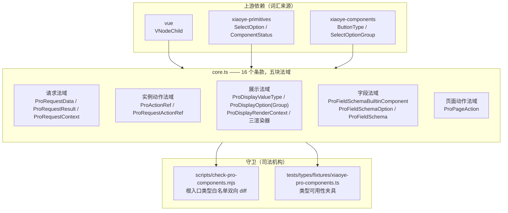
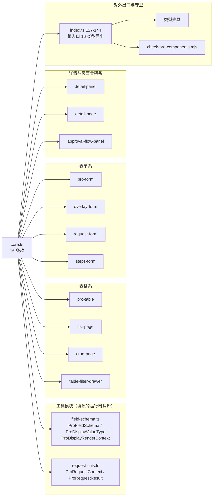

# 9-02 · core.ts 协议层

> 本篇是 9 卷"增强层（pro-components）"的第二篇。9-01 拆的是 core 在导出边界中的地位——它为什么能以一个非组件文件的身份挤进根入口类型白名单；本篇往下钻一层，回答一个更本质的问题：**增强层内部的"宪法"到底写了哪些条款？**这些条款凭什么被三十多个增强组件共同遵守，凭什么半年只修订过一次，又凭什么在"集中协议"与"各组件自带"之间留下几处耐人寻味的违约现场。核心问题按大纲只有一句话——增强层内部的"宪法"有哪些条款——但"宪法"两个字里至少藏着五道题：条款分成几块法域、谁在消费它们、谁在守卫它们、修订规则是什么、以及它与基础层类型划出的边界在哪里。本篇全部给实码定论，并为 9-03《field-schema：一份 schema 三形态》埋好引线。

接到题目先复述一遍目标，防止写偏：`packages/pro-components/core.ts` 不是组件，没有模板、没有样式、没有安装器，全文 145 行，只有一件事——**用 TypeScript 类型声明增强层所有组件共享的稳定协议**。它要回答的问题可以压成五件：请求怎么发（请求协议）、组件实例暴露什么动作（实例协议）、数据怎么渲染成展示层（展示协议）、表单和详情的字段怎么声明（字段协议）、页面按钮怎么配置（动作协议）。五件合起来，就是 AGENTS.md 里那句"类型只允许导出每个公开增强组件的主 Props / Instance / 主数据类型，以及 `core.ts` 里的稳定共享协议类型"中后半句的全部内容。9-01 已经讲过它凭什么进根入口（边界问题），本篇讲它写进去的是什么（内容问题）。

先交代体量，给全文一个标尺：`core.ts` 全文 145 行，导出 16 个类型，零运行时代码（连一个函数都没有）；它的直接消费方是 11 个增强组件（`pro-table`、`list-page`、`crud-page`、`pro-form`、`overlay-form`、`request-form`、`steps-form`、`detail-panel`、`detail-page`、`approval-flow-panel`、`table-filter-drawer`）加 2 个工具模块（`field-schema.ts`、`request-utils.ts`），外加根入口 `index.ts` 的导出段和类型夹具、一致性守卫脚本两处"司法机构"。用 `rg 'from "../core|from "./core|from "../../core' packages/pro-components --files-with-matches` 数出来正好 16 个文件。一份 145 行的文件被 1/3 的增强层组件直接引用——这个密度在整座 monorepo 里仅次于 `xiaoye-primitives` 的类型工具。账不大，但它是增强层所有"页面级组件"的地基，条款值得逐条读。

## 一、宪法从哪来：73 行长到 145 行的三次增补

先看这份文件的出身。`git log --follow -- packages/pro-components/core.ts` 给出四次提交：

```text
dc9ca28 2026-09-14 fix(build): 基础设施依赖治理与产物断链修复
323e9a7 2026-04-21 feat(xiaoye-ui): 完成前台基础组件库 Phase 1 + Phase 2 核心组件
3622d97 2026-03-30 feat: integrate admin component capabilities
a32e399 2026-03-30 feat: 新增 pro 组件并增强表单与表格能力
```

初版（a32e399）只有 73 行。最有信息量的是把初版和现版摆在一起看，宪法不是一次写成的，而是"增补修正案"式的生长。初版的字段协议长这样：

```ts
// 初版 core.ts（a32e399，2026-03-30，全文 73 行）节选
export type ProFieldSchemaBuiltinComponent =
  | "input"
  | "textarea"
  | "select"
  | "date-picker"
  | "time-picker"
  | "time-select"
  | "input-number"
  | "switch"
  | "auto-complete";

export type ProFieldSchemaOption<T = string | number> = SelectOption<T> | SelectOptionGroup<T>;

export interface ProFieldSchema {
  prop: string;
  label: string;
  component?: ProFieldSchemaBuiltinComponent;
  componentProps?: Record<string, unknown>;
  options?: ProFieldSchemaOption[];
  slot?: string;
  span?: number;
  hidden?: boolean | ((model: Record<string, unknown>) => boolean);
  disabled?: boolean | ((model: Record<string, unknown>) => boolean);
  required?: boolean;
  help?: string;
  placeholder?: string;
}
```

对照现版（`core.ts:77-124`），有三处关键差异：第一，`ProFieldSchemaBuiltinComponent` 从 9 个成员扩到 23 个（后来补进了 `checkbox` 系、`radio` 系、`cascader`、`transfer`、`avatar`、`image`、`progress`、`tag`、`timeline`、`tree`、`steps`）；第二，`ProFieldSchema` 从 12 个成员扩到 17 个，新增的五个全部是展示侧的 `valueType`、`formatter`、`render`、`renderHTML`、`emptyValue`；第三，初版的 `ProFieldSchemaOption` 直接复用基础层的 `SelectOption | SelectOptionGroup`，现版换成了带 `status`/`color` 扩展的 `ProDisplayOption`。换句话说，**初版宪法只有"表单一半"，展示协议是后来长出来的**——一个组件库先解决"字段怎么编辑"，再解决"同一份声明怎么渲染成只读视图"，这个生长顺序本身就是产品思路的考古证据。

再看最近一次修订（dc9ca28，2026-09-14）动了什么：

```diff
-import type { ButtonType, SelectOptionGroup } from "@xiaoye/components";
-import type { ComponentStatus, SelectOption } from "@xiaoye/primitives";
+import type { ButtonType, SelectOptionGroup } from "xiaoye-components";
+import type { ComponentStatus, SelectOption } from "xiaoye-primitives";
```

一次"基础设施依赖治理"提交里，core.ts 唯一的变化是把 scoped 别名换成 npm 包名。**从 3 月 30 日出生到 9 月，条款正文一个字没改过，只动了两行 import**。这就是"稳定共享协议"六个字的实码含义：改动自由度被压缩到了极点。为什么能做到、值不值得这么做，第五节展开；先把条款本身逐条读完。

## 二、逐条读条款：16 个类型，五块法域

16 个导出按职能可以划成五块法域。先给全景图——上游依赖、五法域与两道守卫的关系：



下面逐法域过堂。每一段都是当前工作区实码，行号逐一核对过。

### 2.1 请求法域：一份请求，两种合法形状

`core.ts:1-25`，宪法的开头三行 import 加第一块法域：

```ts
import type { VNodeChild } from "vue";
import type { ButtonType, SelectOptionGroup } from "xiaoye-components";
import type { ComponentStatus, SelectOption } from "xiaoye-primitives";

export interface ProRequestData<T = Record<string, unknown>> {
  data: T[];
  total?: number;
  extra?: Record<string, unknown>;
}

export type ProRequestResult<T = Record<string, unknown>> = T[] | ProRequestData<T>;

export interface ProRequestContext {
  action: string;
  params: Record<string, unknown>;
  page: number;
  pageSize: number;
  signal?: AbortSignal;
}
```

三个条款，三条设计决定。**第一，`ProRequestResult` 是联合类型**：后端习惯返回裸数组的直接给 `T[]`，规范返回 `{ data, total, extra }` 的给 `ProRequestData`，两种形状都合法，归一化工作下沉到工具层（本节末尾）。对比 antd ProTable 生态的 request 约定 `{ data, total, success }`——那边用 `success` 布尔表达业务成败，本库不设这个位：**成功就是 resolve，失败就是 reject，失败通道交还给 Promise 本身**。这不是偷懒，是把"业务失败"从数据形状里赶出去，避免每个消费方都要写一遍 `if (!res.success) return` 的样板。

**第二，`ProRequestContext` 把"请求上下文"协议化**。`action` 标明这次请求的语义动词（reload/refresh/reset/load/submit），`params` 是业务参数，`page`/`pageSize` 是分页现场，`signal?: AbortSignal` 让中断成为一等公民——消费方拿到上下文就能把 signal 传进 `fetch`。这里正是一处 EP 对比的好地方：Element Plus 本体的 `el-table` + `el-pagination` 没有任何内建远程请求协议，排序、筛选、翻页事件全靠业务侧自行接线；社区 admin 模板各自封装 hook，请求参数的形状互不兼容，换一个模板就要重写一遍数据层。本库把"组件怎么向业务要数据"这件事本身写进宪法，五个字段定死，谁来实现都长一个样。代价也藏在里面——`page` 和 `pageSize` 是必填，对提交型请求毫无意义（第五节夹具处会看到被迫填 `1/1` 的现场），这是"一份上下文覆盖所有请求场景"这个决定的天生税。

**第三，两种形状的归一化在 `request-utils.ts`（全文 33 行）**：

```ts
import type { ProRequestContext, ProRequestResult } from "./core";

export function normalizeProRequestResult<T>(result: ProRequestResult<T>) {
  if (Array.isArray(result)) {
    return {
      data: result,
      total: result.length,
      extra: {}
    };
  }

  return {
    data: result.data,
    total: result.total ?? result.data.length,
    extra: result.extra ?? {}
  };
}

export function createProRequestContext(
  action: string,
  params: Record<string, unknown>,
  page: number,
  pageSize: number,
  signal?: AbortSignal
): ProRequestContext {
  return {
    action,
    params,
    page,
    pageSize,
    signal
  };
}
```

注意这个文件的定位：它**不在 core.ts 里**。core 是纯类型宪法，归一化函数是普通工具，住在旁边的 `request-utils.ts`。宪法的纪律之一就是"条款与执法分开"——类型进 core，逻辑进 utils，core.ts 里连一个函数都没有，所以它永远不参与运行时打包，纯类型出产物。

### 2.2 实例动作法域：三个动词与一条休眠条款

`core.ts:21-25` 与 `core.ts:140-145`，一头一尾：

```ts
export interface ProActionRef {
  reload: () => Promise<void>;
  refresh: () => Promise<void>;
  reset: () => Promise<void>;
}
```

```ts
export interface ProRequestActionRef extends ProActionRef {
  state: {
    loading: boolean;
    error: unknown;
  };
}
```

`ProActionRef` 只有三个动词：`reload`、`refresh`、`reset`。这三个词不是随手起的，pro-table 的实现（`pro-table.vue:909-933`）给它们定出了精确的分工——`reload` 与 `refresh` 都是以当前页码、当前参数重发请求，差别只在传给 `ProRequestContext.action` 的语义动词不同（服务端日志与埋点可以区分"用户点了刷新"和"程序自动重载"）；`reset` 则是真重置：

```ts
async function reload() {
  await requestReload("reload");
}

async function refresh() {
  await requestReload("refresh");
}

async function reset() {
  currentPageState.value = props.defaultCurrentPage;
  pageSizeState.value = props.defaultPageSize;
  cancelEdit();
  closeContextmenu();
  selectedRows.value = [];
  if (searchModel.value) {
    Object.keys(searchModel.value).forEach((key) => {
      searchModel.value![key] = undefined;
    });
  }
  if (filterModel.value) {
    Object.keys(filterModel.value).forEach((key) => {
      filterModel.value![key] = undefined;
    });
  }
  await requestReload("reset");
}
```

页码页大小回到默认、编辑态取消、右键菜单关闭、选中行清空、搜索模型与筛选模型逐键清空，最后才以 `action: "reset"` 重发。**"reset 是状态清理 + 重新请求的复合动词"——这条语义约定写在实现里，但契约写在 `ProActionRef` 上**：任何增强组件只要声明自己 extends `ProActionRef`，用户就可以按这套语义调用，不用读实现。

`ProRequestActionRef` 则是一条耐人寻味的**休眠条款**：全仓检索它只出现在三处——`core.ts:140` 的定义、`index.ts:140` 的根入口导出、`check-pro-components.mjs:70` 的白名单登记，**没有任何一个组件实际实现或消费它**。它预留了"带状态的请求实例"（`loading`/`error` 暴露给外部）的形状，但至今没有组件认领。宪法的修订规则由此可见一斑：加一条暂无人用的条款是允许的（它只是类型，不产生产物体积），但一旦进了根入口白名单，删除它就要走双向 diff 的门禁（第四节）——预留的代价是永远背着一条"声明了但没执法"的条款。

### 2.3 展示法域：14 种值类型与同构的三渲染器

`core.ts:27-51`，展示协议的词表与选项：

```ts
export type ProDisplayValueType =
  | "text"
  | "select"
  | "radio"
  | "checkbox"
  | "tag"
  | "progress"
  | "link"
  | "image"
  | "avatar"
  | "money"
  | "date"
  | "datetime"
  | "code"
  | "copy";

export interface ProDisplayOption<T = string | number> extends SelectOption<T> {
  status?: ComponentStatus | "info";
  color?: string;
}

export interface ProDisplayOptionGroup<T = string | number>
  extends Omit<SelectOptionGroup<T>, "options"> {
  options: ProDisplayOption<T>[];
}
```

这段是"复用还是自造"的最佳样本（第五节细说权衡）。`ProDisplayOption` 走**继承扩展**：基础层 `SelectOption` 的 `label`/`value`/`disabled`/`description` 四件套原样保留（定义在 `packages/xiaoye-primitives/src/utils/types/common.ts:3-8`），只追加 `status` 与 `color` 两个展示增强字段。`status` 的类型是 `ComponentStatus | "info"`——`ComponentStatus` 是 primitives 的五态词表 `"neutral" | "primary" | "success" | "warning" | "danger"`（`common.ts:1`），而 `"info"` 是 Element Plus 用户肌肉记忆里的第六态。**"宪法收编方言"**：五态是本库的正音，`"info"` 是兼容位，EP 习惯的语义色不用改口也能写。`ProDisplayOptionGroup` 走**改写式复用**：`Omit<SelectOptionGroup<T>, "options">` 把基础层分组的 `options` 槽位挖掉，换成 `ProDisplayOption<T>[]`——分组外壳照抄基础层，组内成员必须升级成带状态色的展示选项。基础层的分组定义在 `packages/components/select/src/select.ts:5-9`，一个 `Omit` 就完成了"结构继承、成员替换"，这是 TypeScript 里比 `extends` 更精准的复用手法。

`core.ts:53-75`，渲染协议：

```ts
export interface ProDisplayRenderContext<
  TRow = Record<string, unknown>,
  TColumn = unknown
> {
  row: TRow;
  column: TColumn;
  rowIndex: number;
}

export type ProDisplayFormatter<
  TRow = Record<string, unknown>,
  TColumn = unknown
> = (value: unknown, context: ProDisplayRenderContext<TRow, TColumn>) => unknown;

export type ProDisplayRenderer<
  TRow = Record<string, unknown>,
  TColumn = unknown
> = (value: unknown, context: ProDisplayRenderContext<TRow, TColumn>) => VNodeChild;

export type ProDisplayHtmlRenderer<
  TRow = Record<string, unknown>,
  TColumn = unknown
> = (value: unknown, context: ProDisplayRenderContext<TRow, TColumn>) => string;
```

三个渲染器，**同一个入参签名 `(value, context)`，三种返回类型**：`ProDisplayFormatter` 返回 `unknown`（算出来的数据，继续走默认渲染管道）、`ProDisplayRenderer` 返回 `VNodeChild`（接管渲染，产出 Vue 节点）、`ProDisplayHtmlRenderer` 返回 `string`（产出 HTML 字符串，走 `v-html` 通道）。入参统一的好处是配置方可以"换渲染器不换签名"——把 `formatter` 升级成 `render` 只改键名；返回类型分三档则把"数据加工、节点接管、HTML 注入"三种信任级别分开。`context` 里只放三样：`row`、`column`、`rowIndex`，默认泛型 `Record<string, unknown>` 给没有强类型诉求的场景兜底，泛型参数留给 `ProTableColumn<T>` 这类需要行类型的场合。对比 Element Plus 的 `el-table-column` 的 `formatter`——它的签名是 `(row, column, cellValue, index)` 行优先——本库把 `value` 提到第一个参数位、行信息收进 `context` 对象：**"值优先、上下文打包"**，这对"同一格数据换四种渲染器"的场景更顺手，但也埋下了与基础层表格 formatter 签名不同构的种子（第五节谈这个张力）。

### 2.4 字段法域：一份 schema 的全部词汇表

`core.ts:77-124`，宪法最长的连续条款（48 行），9-03 的主舞台，本篇先立骨架：

```ts
export type ProFieldSchemaBuiltinComponent =
  | "input"
  | "textarea"
  | "select"
  | "checkbox"
  | "checkbox-group"
  | "radio"
  | "radio-button"
  | "radio-group"
  | "cascader"
  | "date-picker"
  | "time-picker"
  | "time-select"
  | "input-number"
  | "switch"
  | "auto-complete"
  | "transfer"
  | "avatar"
  | "image"
  | "progress"
  | "tag"
  | "timeline"
  | "tree"
  | "steps";

export type ProFieldSchemaOption<T = string | number> =
  | ProDisplayOption<T>
  | ProDisplayOptionGroup<T>;

export interface ProFieldSchema {
  prop: string;
  label: string;
  component?: ProFieldSchemaBuiltinComponent;
  valueType?: ProDisplayValueType;
  componentProps?: Record<string, unknown>;
  options?: ProFieldSchemaOption[];
  formatter?: ProDisplayFormatter<Record<string, unknown>, ProFieldSchema>;
  render?: ProDisplayRenderer<Record<string, unknown>, ProFieldSchema>;
  renderHTML?: ProDisplayHtmlRenderer<Record<string, unknown>, ProFieldSchema>;
  emptyValue?: string;
  slot?: string;
  span?: number;
  hidden?: boolean | ((model: Record<string, unknown>) => boolean);
  disabled?: boolean | ((model: Record<string, unknown>) => boolean);
  required?: boolean;
  help?: string;
  placeholder?: string;
}
```

17 个成员可以划成四组来记。**身份组**：`prop`（数据路径，支持 `a.b.c` 点路径，`field-schema.ts:170-181` 的 `readProFieldValue` 用 `split(".").reduce` 实现）与 `label`。**渲染组**：`component`（编辑/展示用哪个基础组件）、`valueType`（只读态按什么值类型渲染）、`componentProps`（原样下发给基础组件的 props 包）、`options`（选项词表，注意它直接复用展示法域的 `ProFieldSchemaOption`——字段协议与展示协议在这里接驳）。**定制组**：`formatter`/`render`/`renderHTML` 三渲染器直接从展示法域引入，`TColumn` 固定为 `ProFieldSchema` 自身（列即字段）、`emptyValue`（空值占位文案）、`slot`（整格让位给具名插槽）、`span`（详情栅格跨列）。**行为组**：`hidden` 与 `disabled` 都是 `boolean | ((model) => boolean)`——布尔给静态场景，函数给联动场景，联动逻辑以纯函数形式声明在 schema 里，运行时按当前 model 求值。这套"布尔或函数"的二元签名让 schema 保持可序列化（函数除外——这是协议里唯一自觉放行的不可序列化成员），静态导出、AI 生成、低代码平台托管都还有路可走。

`ProFieldSchemaBuiltinComponent` 的 23 个成员值得单独停一下：它是**字符串字面量联合，不是 `Component` 类型**。这是一个有意识的决定——schema 要能过 `structuredClone`、能走 `JSON.stringify` 进配置库、能被后端下发、能被 AI 工具直接产出；一旦放进 `Component` 引用，这份声明就退化成只能在运行时构造的内存对象。字符串词表必然需要一个"词表到组件"的翻译层，这个翻译层就是 `field-schema.ts:31-55` 的 `builtInComponentMap`（第六节）。协议用字符串、实现做映射，**词表与实现的分离正是协议层的本职**。

### 2.5 页面动作法域：ProPageAction 的 11 个成员

`core.ts:126-145`，宪法收尾：

```ts
export interface ProPageAction {
  key: string;
  label: string;
  type?: ButtonType;
  plain?: boolean;
  text?: boolean;
  link?: boolean;
  danger?: boolean;
  disabled?: boolean;
  loading?: boolean;
  icon?: string;
  visible?: boolean;
}

export interface ProRequestActionRef extends ProActionRef {
  state: {
    loading: boolean;
    error: unknown;
  };
}
```

`ProPageAction` 是所有"页面级按钮"的通用形状：`key` 供事件回传识别、`label` 文案、`type`/`plain`/`text`/`link`/`danger` 五个外观位直接搬运基础层 `ButtonType` 的词汇、`disabled`/`loading` 状态位、`icon` 用图标名字符串、`visible` 控制可见。两个细节见设计口味：一是 `visible` 而不是让业务方自己 `v-if` 掉数组元素——数组是数据，可见性也是数据的一部分，配置驱动的页面里按钮显隐经常来自接口权限字段；二是 `icon` 是 `string` 而非组件——与本库 icon 体系（图标名走全局注册）一致，再次保持了 schema 的可序列化。`key/label` 必填、其余九个可选，最简配置 `[{ key: "create", label: "新增" }]` 就能用，这也是"宪法条款要给人留最短路径"的体现。

## 三、消费网：谁在遵守宪法

条款读完了，看执法现场。16 个引用文件（`rg 'from "../core|from "./core|from "../../core' packages/pro-components --files-with-matches`）里，除 core 自身与根入口外，11 个组件目录加 2 个工具模块构成消费网：



网状结构里有两条主轴：**字段法域（ProFieldSchema）一统表单与详情**，**请求法域（ProRequestContext/Result）+ 实例法域（ProActionRef）一统列表与页面**。抽四个代表段过目。

代表段一，`list-page/src/list-page.ts` 全文 43 行——它是"聚合式组件如何转授协议"的标准答案：

```ts
import type { SearchFormField } from "../../search-form";
import type { ButtonType } from "xiaoye-components";
import type {
  ProTableColumn,
  ProTableEditableConfig,
  ProTableVirtualConfig,
  ProTableWorkbenchConfig
} from "../../pro-table/src/pro-table";
import type { ProActionRef, ProPageAction, ProRequestContext, ProRequestResult } from "../../core";

export interface ListPageBatchAction {
  key: string;
  label: string;
  type?: ButtonType;
  danger?: boolean;
  disabled?: boolean;
  loading?: boolean;
  icon?: string;
}

export interface ListPageProps<T = Record<string, unknown>> {
  title?: string;
  description?: string;
  searchModel?: Record<string, unknown>;
  searchFields?: SearchFormField[];
  data?: T[];
  columns: ProTableColumn<T>[];
  request?: (params: Record<string, unknown>, ctx: ProRequestContext) => Promise<ProRequestResult<T>>;
  toolbarActions?: ProPageAction[];
  batchActions?: ListPageBatchAction[];
  immediate?: boolean;
  pageSize?: number;
  workbench?: ProTableWorkbenchConfig;
  editable?: ProTableEditableConfig<T>;
  virtual?: ProTableVirtualConfig;
}

export interface ListPageActionRef extends ProActionRef {
  clearSelection: () => void;
}

/** @deprecated 请改用 ListPageBatchAction。 */
export type BatchActionBarAction = ListPageBatchAction;
```

四个动作只做了三件事：`request` 的函数签名原样使用 `ProRequestContext`/`ProRequestResult`（协议直接外漏给业务方）；`toolbarActions` 用 `ProPageAction[]`（条款即配置）；`ListPageActionRef extends ProActionRef` 再补一个 `clearSelection`（实例协议做增量扩展）。ListPage 自己几乎不发明类型——它把 core 的条款和 pro-table 的条款拼起来，这就是协议层存在的意义：**上层组件的类型工作量被压缩到"选择和组装"**。顺带注意第 42-43 行：兼容别名 `BatchActionBarAction` 标了 `@deprecated` 且只留在组件子入口——这正是 AGENTS.md"旧兼容类型只保留在源码层"纪律的执行样例。

代表段二，`request-form/src/request-form.ts` 全文 26 行——展示"协议怎么被继承扩展"：

```ts
import type { FormRules } from "xiaoye-components";
import type { ComponentSize } from "xiaoye-primitives";
import type { ProActionRef, ProFieldSchema, ProRequestContext } from "../../core";

export interface RequestFormSubmitContext extends ProRequestContext {
  model: Record<string, unknown>;
}

export interface RequestFormProps {
  title?: string;
  description?: string;
  model: Record<string, unknown>;
  schema?: ProFieldSchema[];
  rules?: FormRules;
  labelWidth?: string | number;
  labelPosition?: "left" | "top";
  size?: ComponentSize;
  readonly?: boolean;
  immediate?: boolean;
  initialRequest?: (ctx: ProRequestContext) => Promise<Record<string, unknown>>;
  submitRequest?: (ctx: RequestFormSubmitContext) => Promise<unknown>;
}

export interface RequestFormInstance extends ProActionRef {
  submit: () => Promise<boolean>;
}
```

两条继承线在这里交汇：`RequestFormSubmitContext extends ProRequestContext` 在请求上下文上追加 `model`（提交载荷），`RequestFormInstance extends ProActionRef` 在实例动作上追加 `submit`。**协议的扩展方式被统一成"extends + 增量成员"**，没有一处是重写一个平行形状。这就是集中协议与各自为政最大的差别：各自为政时每个组件的"上下文"长得相似但互不相容，集中协议下它们通过继承链共享同一套祖先词汇，`ctx.action`、`ctx.params` 永远在同一个位置。

代表段三，`pro-table/src/pro-table.vue:871-905` 的请求执行体——宪法条款在运行时怎么被"执法"，尤其是竞态守卫：

```ts
async function requestReload(action = "reload") {
  if (!props.request) {
    return;
  }

  const requestId = ++latestRequestId;
  requestLoading.value = true;
  requestError.value = null;

  try {
    const params = buildRequestParams();
    const result = await props.request.request(
      params,
      createProRequestContext(action, params, currentPageState.value, pageSizeState.value)
    );
    const normalized = normalizeProRequestResult(result);

    if (requestId !== latestRequestId) {
      return;
    }

    internalData.value = normalized.data as ProTableRow[];
    requestTotal.value = normalized.total;
    emit("request-success", internalData.value.slice());
  } catch (error) {
    if (requestId !== latestRequestId) {
      return;
    }

    requestError.value = error;
    emit("request-error", error);
  } finally {
    if (requestId === latestRequestId) {
      requestLoading.value = false;
    }
  }
}
```

三处细节都是请求协议的执行力证明。其一，`buildRequestParams()`（`pro-table.vue:862-868`）把 `requestParams`、搜索模型、筛选模型、保存视图 key 合并成一个参数包，业务方拿到的 `params` 是"全量现场"；其二，`createProRequestContext(action, params, currentPageState.value, pageSizeState.value)` 在调用现场组装上下文——协议的构造也被工具函数收口，`action` 动词从组件内部一路透传给业务方；其三，`requestId` 递增比对做竞态守卫，过期响应一律丢弃。**协议层不承诺竞态安全，执法层必须自己兜**——这也解释了为什么 core.ts 保持纯类型：条款是静态的约定，执行策略（守卫、中断、缓存）属于各组件的实现自由。

代表段四，`list-page/src/list-page.vue:29-52`——协议在事件与实例暴露两端的镜像：

```ts
const emit = defineEmits<{
  "toolbar-action": [action: ProPageAction];
  "batch-action": [action: ListPageBatchAction, selection: Record<string, unknown>[]];
  "selection-change": [selection: Record<string, unknown>[]];
  "request-success": [payload: Record<string, unknown>[]];
  "request-error": [error: unknown];
}>();

const slots = useSlots() as Record<string, ((payload?: unknown) => unknown) | undefined>;
const tableRef = ref<ProTableInstance<any> | null>(null);
const visibleToolbarActions = computed(() =>
  props.toolbarActions.filter((action) => action.visible !== false)
);

function handleBatchAction(action: ListPageBatchAction, selection: Record<string, unknown>[]) {
  emit("batch-action", action, selection);
}

defineExpose({
  reload: () => tableRef.value?.reload() ?? Promise.resolve(),
  refresh: () => tableRef.value?.refresh() ?? Promise.resolve(),
  reset: () => tableRef.value?.reset() ?? Promise.resolve(),
  clearSelection: () => tableRef.value?.clearSelection()
});
```

事件载荷 `toolbar-action` 直接以 `ProPageAction` 为类型——用户点击工具栏按钮时拿到的对象就是宪法里的形状，`key` 识别动作、其余成员随取随用；`defineExpose` 的 `reload/refresh/reset` 逐字镜像 `ProActionRef` 的三个动词再转授给内层 pro-table。**协议在"props 进、事件出、实例暴露"三个端口保持同一形状**，业务方学一次到处用。另外两处细节：第 39-41 行 `visibleToolbarActions` 是 `ProPageAction.visible` 条款的执法现场（`visible !== false` 才透传）；第 12 行 `ListPageProps<any>` 的 `any` 则是聚合组件的妥协——泛型链路在这里断了一拍，是协议消费网里少数的粗糙处，如实记下。

剩下的消费方按"用了哪条法域"归档即可：`crud-page/src/crud-page.ts` 一个接口里同时用了字段法域（`formSchema`/`detailSchema` 都是 `ProFieldSchema[]`）、页面动作法域（`toolbarActions: ProPageAction[]`）和表格系类型，是"一份 CRUD 页面吃下三种协议"的最全样本；`detail-panel/src/detail-panel.ts:2` 与 `pro-form`、`overlay-form`、`steps-form`、`table-filter-drawer` 全部只用 `ProFieldSchema` 一条条款；`detail-page/src/detail-page.ts:2-3` 连续两条 `import type ... from "../../core"`（一条引 `ProPageAction`、一条引 `ProFieldSchema`，顺手可合而未合的整理痕迹）；`approval-flow-panel/src/approval-flow-panel.ts:1` 只引 `ProPageAction`。消费密度从"一条"到"四条"不等，但**没有任何一个组件绕开 core 自造同义类型**——除了下节的三个违约现场。

## 四、守卫：白名单与夹具如何冻结宪法

条款有人遵守还不够，还要有人看守。守卫机构有三处。

第一处，根入口导出。`packages/pro-components/index.ts:127-144` 把 16 个类型名逐一显式导出——没有 `export *`：

```ts
export type {
  ProActionRef,
  ProDisplayFormatter,
  ProDisplayHtmlRenderer,
  ProDisplayOption,
  ProDisplayOptionGroup,
  ProDisplayRenderContext,
  ProDisplayRenderer,
  ProDisplayValueType,
  ProFieldSchema,
  ProFieldSchemaBuiltinComponent,
  ProFieldSchemaOption,
  ProPageAction,
  ProRequestActionRef,
  ProRequestContext,
  ProRequestData,
  ProRequestResult
} from "./core";
```

第二处，一致性脚本的双向 diff。`scripts/check-pro-components.mjs:57-74` 登记了 core 的类型白名单，并在 `check-pro-components.mjs:320-322` 用 `diffNamedExportMap(rootTypeWhitelist, rootTypeExports)` 校验——**少导出一个报错，多导出一个也报错**：

```js
core: [
  "ProDisplayFormatter",
  "ProDisplayHtmlRenderer",
  "ProDisplayOption",
  "ProDisplayOptionGroup",
  "ProDisplayRenderContext",
  "ProDisplayRenderer",
  "ProDisplayValueType",
  "ProActionRef",
  "ProFieldSchema",
  "ProFieldSchemaBuiltinComponent",
  "ProFieldSchemaOption",
  "ProPageAction",
  "ProRequestActionRef",
  "ProRequestContext",
  "ProRequestData",
  "ProRequestResult"
]
```

16 项与 `core.ts` 的导出一一对应。这个白名单就是宪法"生效条款清单"的机器可读版：想给 core 加类型，必须同步改这里，改动被门禁看见；想悄悄在根入口多漏一个内部类型，`diff` 直接标"多余导出"。9-01 讲过这套边界怎么挡住细节类型外泄，本篇要补的是它的另一面——**它同样挡住"静默删除"**：谁想把 `ProRequestActionRef` 这条休眠条款删掉，也得先改白名单、过 `pnpm check:pro-components`，修订动作永远留痕。

第三处，类型夹具。`tests/types/fixtures/xiaoye-pro-components.ts` 从聚合包根入口把 core 类型导入并实际构造值，`fixtures:175-197` 是展示法域的消费段：

```ts
const displayValueType: ProDisplayValueType = "copy";

const displayOptions: ProDisplayOption[] = [
  {
    label: "审核中",
    value: "reviewing",
    status: "warning"
  }
];

const fieldSchema: ProFieldSchema[] = [
  {
    prop: "status",
    label: "状态",
    valueType: displayValueType,
    options: displayOptions
  }
];

const displayContext = {} as ProDisplayRenderContext<
  { status: string },
  ProFieldSchema
>;
```

`fixtures:270-280` 则是请求法域的扩展消费段——`RequestFormSubmitContext extends ProRequestContext` 的实例：

```ts
const requestFormContext: RequestFormSubmitContext = {
  action: "submit",
  params: {
    name: "控制台"
  },
  page: 1,
  pageSize: 10,
  model: {
    name: "控制台"
  }
};
```

注意这里被迫填上的 `page: 1, pageSize: 10`——一个提交表单的上下文里，分页字段毫无意义却必须填，因为 `ProRequestContext` 把它们声明为必填。`request-form.vue:52` 的实现同样要写 `createProRequestContext(action, {}, 1, 1)` 来凑齐签名。夹具把这个别扭如实固定了下来：**协议的刚性通过夹具可见，未来若把 `page/pageSize` 改为可选，这一处夹具与两处实现会同时简化**——这就是宪法修订的成本收益核算都能落到具体行号的案例。三处守卫合起来构成闭环：core 改动 → 白名单必改 → 夹具必过 → 16 个导出名双向锁定。修订成本被抬高到"必然留痕、必然过门禁"的程度，换来的是第五节要谈的稳定性承诺。

## 五、三次权衡：宪法制定时的取舍

### 5.1 集中协议 vs 各组件自带：以及三个违约现场

第一个权衡是位置：共享类型放 core.ts，还是各组件自己声明？集中协议的收益在第三节已经看到——上层组件免于发明类型、签名跨组件一致、业务方学一次到处用；代价是耦合与僵化：任何一个条款的调整都波及全部消费方。本库的选择是"核心条款集中、边缘形状自理"，但执行得并不彻底——`pro-table/src/pro-table.ts` 留下了三个违约现场。

现场一，`pro-table.ts:31-42` 的 `ProTableToolbarAction` 与 `core.ts:126-138` 的 `ProPageAction` 几乎逐字相同，只少一个 `danger`：

```ts
export interface ProTableToolbarAction {
  key: string;
  label: string;
  type?: ButtonType;
  plain?: boolean;
  text?: boolean;
  link?: boolean;
  disabled?: boolean;
  loading?: boolean;
  icon?: string;
  visible?: boolean;
}
```

现场二，`pro-table.ts:94-101` 的 `ProTableDisplayOption`/`ProTableDisplayOptionGroup` 与 core 的 `ProDisplayOption`/`ProDisplayOptionGroup`（`core.ts:43-51`）同形复制——都是 `SelectOption` 加 `status`/`color`、都是 `Omit` 换 `options`。现场三，`pro-table.ts:109-123` 的 `ProTableColumn.valueType` 把 `ProDisplayValueType` 的 14 个成员联合**逐字内联**了一遍：

```ts
  valueType?:
    | "text"
    | "select"
    | "radio"
    | "checkbox"
    | "tag"
    | "progress"
    | "link"
    | "image"
    | "avatar"
    | "money"
    | "date"
    | "datetime"
    | "code"
    | "copy";
```

为什么违约？把 `pro-table.ts:103-156` 的 `ProTableColumn` 全文摆出来就明白了：

```ts
export interface ProTableColumn<T = ProTableRow> extends TableColumnProps<T> {
  key?: string;
  children?: ProTableColumn<T>[];
  slot?: string;
  headerSlot?: string;
  hidden?: boolean;
  valueType?:
    | "text"
    | "select"
    | "radio"
    | "checkbox"
    | "tag"
    | "progress"
    | "link"
    | "image"
    | "avatar"
    | "money"
    | "date"
    | "datetime"
    | "code"
    | "copy";
  formatter?: (
    row: T,
    column: TableResolvedColumn<T>,
    value: unknown,
    rowIndex: number
  ) => unknown;
  render?: (
    value: unknown,
    context: {
      row: T;
      column: ProTableColumn<T>;
      rowIndex: number;
    }
  ) => VNodeChild;
  renderHTML?: (
    value: unknown,
    context: {
      row: T;
      column: ProTableColumn<T>;
      rowIndex: number;
    }
  ) => string;
  emptyValue?: string;
  editable?: boolean | ((row: T, rowIndex: number) => boolean);
  editor?: ProFieldSchemaBuiltinComponent | Component;
  editorProps?: Record<string, unknown> | ((row: T) => Record<string, unknown>);
  editorSlot?: string;
  options?:
    | Array<ProTableDisplayOption | ProTableDisplayOptionGroup>
    | ((row: T) => Array<ProTableDisplayOption | ProTableDisplayOptionGroup>);
  exportable?: boolean;
  printable?: boolean;
}
```

`ProTableColumn` 是强泛型类型：`formatter` 的签名是 `(row: T, column: TableResolvedColumn<T>, value, rowIndex)`——行优先，与 core 的 `(value, context)` 值优先不同构；`render` 的 `context.column` 要携带 `ProTableColumn<T>` 自己而不是泛泛的 `TColumn`；`options` 还允许 `(row: T) => [...]` 的行级函数。core 的展示协议默认泛型是 `Record<string, unknown>`，套进强类型列模型会把 `T` 的精度磨平——于是表格系选择"形状对齐、类型自理"。**这不是疏忽，是"值优先通用协议"与"行优先强类型列协议"两个签名体系的有意分治**；但内联复制 14 个字符串字面量仍然留下了漂移隐患：将来给 `ProDisplayValueType` 加 `"datetime-range"`，`ProTableColumn.valueType` 不会跟着变，除非有人记得补这个违约现场。协议一致性靠白名单守住了"导出边界"，守不住"形状复制"——这是当前架构真实的边界，如实记账。

同场的还有"法外之地"：`SearchFormField`（search-form 的字段类型）同样被 pro-table（`pro-table.ts:18`）、list-page（`list-page.ts:1`）、crud-page（`crud-page.ts:2`）跨组件引用，却没有进 core。为什么它豁免？因为它是 search-form 自己的主数据类型，先于"共享需求"存在于组件内；core 收编的是"没有归属地的协议"——请求、实例、展示、字段、页面动作这五块本来就是跨组件的公共词汇。**共享不是收编的充分条件，"公共词汇 vs 某组件的私有主类型"才是分界线**。

### 5.2 协议稳定性承诺：把修订成本锁进门禁

第二个权衡是变更自由度。集中协议最大的风险是"牵一发动全身"，本库的对策是把修订成本结构化。第一层是物理事实：core.ts 是纯类型文件，16 个类型全部进了根入口白名单（`check-pro-components.mjs:57-74`），增删任何一项都要同时改 `index.ts:127-144`、白名单、类型夹具三处，`pnpm check:pro-components` 与 `pnpm typecheck:types` 双门禁兜底。第二层是修订方向的不对称性：**扩大是兼容的，收缩是破坏的**。给 `ProFieldSchemaBuiltinComponent` 加一个成员（9 到 23 的历史）是安全的——联合类型扩员不破坏旧消费者；给 `ProFieldSchema` 加可选成员（12 到 17 的历史）也安全——可选属性新增向后兼容；反过来，删成员、必填化、改函数签名才是破坏性修订，要走 major。初版到现版的三次增补全部落在"安全方向"上，半年间破坏性修订次数为零（`git log --follow` 四次提交里唯一动到条款正文的只有 import 路径治理）。第三层是"休眠条款"策略：`ProRequestActionRef` 至今无人消费但保留在位——它占用的是零运行时成本（纯类型不进产物），保留的是未来扩展的词汇位。**"稳定"不是"不变"，而是"变更方向受控、变更动作可见"**，这是协议层能被 11 个组件长期信任的真正原因。

### 5.3 与基础层类型的边界：词汇复用，Props 不复用

第三个权衡是 core 与基础层的关系——复用到什么程度？core.ts 的三条 import（`core.ts:1-3`）给出了精确答案：从 `vue` 拿 `VNodeChild`（渲染返回类型的通用词汇），从 `xiaoye-primitives` 拿 `SelectOption`/`ComponentStatus`（数据词表），从 `xiaoye-components` 拿 `ButtonType`/`SelectOptionGroup`（组件域词表）。三类复用的共同点是**只借词汇，不借组件 Props**。`ProDisplayOption extends SelectOption` 是借"选项"这个词的基础语义；`ProPageAction.type?: ButtonType` 是借"按钮类型"的既有词表；但没有一个条款写成 `extends InputProps` 或 `Omit<TableProps, ...>`。

为什么在 Props 层止步？因为 Props 是基础层最容易变的部分——基础组件迭代一个 prop 的默认值、拆分一个 prop，都会顺着 extends 链传导进增强协议，再传导进 11 个增强组件和所有业务方。词汇表（`SelectOption`、`ComponentStatus`、`ButtonType`）的演化频率远低于 Props，借词的风险敞口小得多。需要"组件形状"的地方，协议用字符串词表绕开：`ProFieldSchema.component` 是 23 个字符串，运行时由 `field-schema.ts:31-55` 的 `builtInComponentMap` 翻译成真实组件：

```ts
const builtInComponentMap: Record<string, Component> = {
  input: XyInput,
  textarea: XyInput,
  select: XySelect,
  checkbox: XyCheckbox,
  "checkbox-group": XyCheckboxGroup,
  radio: XyRadioGroup,
  "radio-button": XyRadioGroup,
  "radio-group": XyRadioGroup,
  cascader: XyCascader,
  "date-picker": XyDatePicker,
  "time-picker": XyTimePicker,
  "time-select": XyTimeSelect,
  "input-number": XyInputNumber,
  switch: XySwitch,
  "auto-complete": XyAutoComplete,
  transfer: XyTransfer,
  avatar: XyAvatar,
  image: XyImage,
  progress: XyProgress,
  tag: XyTag,
  timeline: XyTimeline,
  tree: XyTree,
  steps: XySteps
};
```

23 个词表成员对 23 个映射键（`textarea` 复用 `XyInput`、`radio` 系三个词共用 `XyRadioGroup`），未登记的词回落到 `XyInput`（`field-schema.ts:97-103` 的 `resolveProFieldComponent`）。**协议层声明"叫什么名字"，实现层决定"是谁"**——基础组件重命名、替换实现，协议不受影响；这正是 9-03 要展开的 schema 机制的第一层：词表到组件的翻译。

还有一个反直觉的对照值得记下：同样面对"字段渲染"，本库**没有**让 `ProFieldSchema` 直接 extends 基础层 `DescriptionsDataItem` 或某个表单组件的 Props，而是让展示协议独立成域，再由桥接函数把协议翻译成基础层形状——`field-schema.ts:222-260` 的 `resolveProDescriptionsItems` 把 `ProFieldSchema[]` 逐字段映射成基础层 `DescriptionsDataItem[]`：

```ts
export function resolveProDescriptionsItems(
  schema: ProFieldSchema[],
  model: Record<string, unknown>,
  _rowIndex = 0
): DescriptionsDataItem[] {
  return schema
    .filter((field) => !resolveProFieldHidden(field, model))
    .map((field) => ({
      label: field.label,
      value: readProFieldValue(model, field.prop),
      row: model,
      valueType: resolveProFieldValueType(field),
      options: field.options,
      formatter: field.formatter
        ? (_row, _column, value, nextRowIndex) =>
            field.formatter?.(value, createProFieldDisplayContext(model, field, nextRowIndex))
        : undefined,
      render: field.render
        ? (value, context) =>
            field.render?.(
              value,
              createProFieldDisplayContext(context.row, field, context.rowIndex)
            )
        : undefined,
      renderHTML: field.renderHTML
        ? (value, context) =>
            field.renderHTML?.(
              value,
              createProFieldDisplayContext(context.row, field, context.rowIndex)
            ) ?? ""
        : undefined,
      emptyValue: field.emptyValue,
      span: field.span,
      defaultSlot: field.slot,
      className: undefined,
      labelClassName: undefined,
      contentClassName: undefined
    }));
}
```

桥接层替每个签名差异写适配：core 的 `(value, context)` 渲染器被包成 descriptions 的 `(row, column, value, rowIndex)` 行优先签名，`hidden` 在入口先过滤，`prop` 点路径经 `readProFieldValue` 求值。**"翻译而非耦合"**——基础层升级（比如 `DescriptionsDataItem` 加字段）只影响这一个函数，协议本身纹丝不动。这是第五节三个权衡的共同底色：core 用最小的词汇借用面、最浅的耦合深度，换最大的演化自由。

## 六、收束：宪法的五句话，与 9-03 的三形态

把 145 行收成五句话：**请求法域**规定"一份请求两种形状、上下文五字段、失败走 reject"；**实例动作法域**规定"reload/refresh/reset 三动词语义、reset 是清理加重发的复合动作"；**展示法域**规定"14 种值类型、选项带语义色（五态加 info 方言）、三渲染器同参不同返"；**字段法域**规定"schema 的 17 个成员、23 个内置组件词表、布尔或函数的声明式联动"；**页面动作法域**规定"页面按钮的 11 个成员、可见性也是数据"。守卫体系让每条修订都留痕，三个违约现场提醒我们协议边界之外仍有形状复制在发生——它们不是失败，是集中协议在强类型局部模型面前的真实妥协。

下一篇 9-03《field-schema：一份 schema 三形态》就从这个悬而未决的形状进入：`ProFieldSchema` 一份声明，凭什么同时驱动三种形态——表单态（`component`/`componentProps`/`hidden`/`disabled` 走 `resolveProFieldProps`/`resolveProFieldHidden` 求值成受控表单）、展示态（`valueType`/`formatter`/`render`/`renderHTML` 走值类型渲染管道）、详情态（`resolveProDescriptionsItems` 翻译成基础层 `DescriptionsDataItem`）。同一份 schema 在 `pro-form`、`detail-panel`、`crud-page` 的 `formSchema` 与 `detailSchema` 之间被复用、被翻译、被求值，词表到组件的 `builtInComponentMap` 只是第一层翻译——span 怎么钳制、placeholder 怎么推导、点路径怎么求值、隐藏字段怎么从详情里消失，这些运行时函数才是"一份 schema 三形态"的真正机械。宪法规定了词汇，9-03 讲语法和翻译官。
