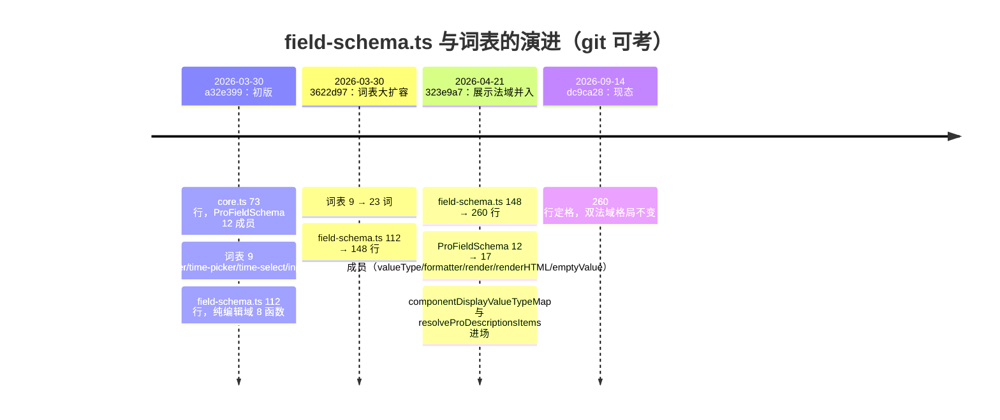
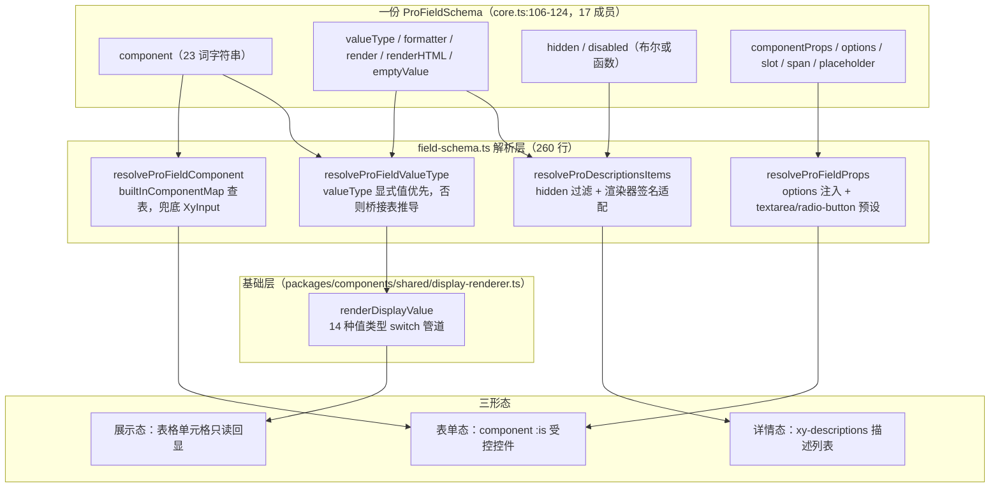

# 9-03 · field-schema：一份 schema 三形态

> 本篇是 9 卷"增强层（pro-components）"的第三篇。9-02 把 `core.ts` 这部"宪法"逐条读完，结尾埋了一条引线：宪法规定了词汇（23 个内置组件词表、17 个成员的字段协议），但"语法和翻译官"另有其人——它们住在 `packages/pro-components/field-schema.ts`，260 行，零组件、零模板，却是 `pro-form`、`detail-panel`、`table-filter-drawer`、`pro-table`、`detail-page` 五类页面级组件共同依赖的解析层。本篇回答核心问题：**23 个内建组件如何被字符串引用？**以及顺着这个问题长出来的下半句：同一份 `ProFieldSchema`，凭什么能同时驱动编辑态、展示态、详情态三种截然不同的渲染形态？全部结论以当前工作区实码为准，行号逐一核对。

接到题目先复述一遍目标，防止写偏。`field-schema.ts` 在 9-02 里被引过四段（31-55、97-103、170-181、222-260），那些是"片段引用"；本篇要把它 260 行全文摊开，回答四件事：一是这份文件从哪来——git 考据显示它从 112 行的纯编辑域长成 260 行的"编辑 + 展示"双法域，内置组件词表从 9 个成员扩到 23 个；二是"字符串引用组件"这套机制的两端怎么闭合——类型端的字面量联合与运行时端的映射表如何咬合，查不到词时兜底给谁；三是"三形态"到底指哪三态——这个问题不能用想象作答，得让消费方的实码开口，本篇的定论是**表单态、展示态、详情态**，三者分别由 field-schema 的编辑法域、基础层的值类型渲染管道、以及 `resolveProDescriptionsItems` 的翻译函数承运；四是这套设计留下了哪些权衡与违约现场——`search-form` 手里那份 21 词的私有词表就是最醒目的一处。

先交代体量，给全文一个标尺：`field-schema.ts` 全文 260 行（`wc -l` 实测），没有 `defineComponent`，没有样式，只有两张模块级映射表和 13 个导出函数（一个 `cloneProValue` 加 12 个 resolve 族）。它的上游是 `core.ts` 的三个类型（`ProFieldSchema`、`ProDisplayValueType`、`ProDisplayRenderContext`）和 `xiaoye-components` 的 20 个组件值；下游是五个增强组件的 `.vue` 文件。如果说 9-02 的 `core.ts` 是"写了什么条款"，本篇的 `field-schema.ts` 就是"条款怎么被执行"——宪法与法院的关系。

## 一、出身考据：112 行到 260 行的两次扩容

老规矩，先 `git log --follow -- packages/pro-components/field-schema.ts`。它与 `core.ts` 同批诞生、同批演进，四次提交：

```text
dc9ca28 2026-09-14 fix(build): 基础设施依赖治理与产物断链修复
323e9a7 2026-04-21 feat(xiaoye-ui): 完成前台基础组件库 Phase 1 + Phase 2 核心组件
3622d97 2026-03-30 feat: integrate admin component capabilities
a32e399 2026-03-30 feat: 新增 pro 组件并增强表单与表格能力
```

初版（a32e399）112 行，函数清单全部长在"编辑域"：`cloneProValue`、`resolveProFieldHidden`、`resolveProFieldDisabled`、`resolveProFieldComponent`、`resolveProFieldPlaceholder`、`resolveProFieldProps`、`resolveProFieldSpan`、`updateProModelValue`——八个函数无一例外在回答"schema 怎么变成一个能输入的控件"。词表 9 个成员，`core.ts` 里的 `ProFieldSchema` 也只有 12 个成员：没有 `valueType`，没有 `formatter`，没有 `render`/`renderHTML`，没有 `emptyValue`。也就是说，初版的 schema 只会一种形态——表单态。

第一次扩容在 3622d97：词表从 9 词猛增到 23 词（新增 checkbox 家族三词、radio 家族三词、cascader、transfer、以及 avatar/image/progress/tag/timeline/tree/steps 七个展示倾向的词），文件长到 148 行。第二次扩容在 323e9a7：文件一步到位 260 行，`componentDisplayValueTypeMap`、`readProFieldValue`、`resolveProFieldValueType`、`createProFieldDisplayContext`、`normalizeProFieldDisplayValue`、`resolveProDescriptionsItems` 六个展示域成员进场，`core.ts` 的 `ProFieldSchema` 同步从 12 成员扩到 17 成员——这就是 9-02 讲过的"展示法域并入宪法"的执行侧。用一张时间线收拢：



这条时间线里藏着一个值得停下来想一秒的事实：**词表的扩张发生在"展示法域"之前**。3622d97 把 avatar、image、progress、tag 这些"看起来是展示组件"的词塞进编辑域词表时，`resolveProFieldComponent` 还只会把它们渲染成表单控件；直到 323e9a7 桥接表进场，这些词才真正获得"编辑写一次、展示自动对"的能力。演进的顺序揭示了设计的意图：词表先服务于"让调用方少写 import"，展示能力是后来才被识别出的第二收益。

## 二、词表两端：字面量联合与映射表怎么咬合

"23 个内建组件被字符串引用"这句话，在仓库里对应两段实码。第一段在 `core.ts`——**类型端**，`packages/pro-components/core.ts:77-100`：

```ts
// packages/pro-components/core.ts:77-100
export type ProFieldSchemaBuiltinComponent =
  | "input"
  | "textarea"
  | "select"
  | "checkbox"
  | "checkbox-group"
  | "radio"
  | "radio-button"
  | "radio-group"
  | "cascader"
  | "date-picker"
  | "time-picker"
  | "time-select"
  | "input-number"
  | "switch"
  | "auto-complete"
  | "transfer"
  | "avatar"
  | "image"
  | "progress"
  | "tag"
  | "timeline"
  | "tree"
  | "steps";
```

数一遍，23 个成员，全部 kebab-case 字符串字面量——与 `AGENTS.md` "组件命名统一以 kebab-case 主名为准"的约定同构。这 23 个词不是 23 个组件，而是 **23 个"字段角色"**：`input` 与 `textarea` 共享 `XyInput`（后者只是加 `type: "textarea"` 的预设），`radio`、`radio-button`、`radio-group` 三词共享 `XyRadioGroup`，`checkbox` 与 `checkbox-group` 分别对应单复选形态。于是 23 个字符串键在运行时端收敛成 20 个组件值——这正是 `field-schema.ts` 顶部 import 列表的长度（`packages/pro-components/field-schema.ts:3-24` 恰好引入 20 个 `Xy*` 组件）。

第二段实码是**运行时端**的映射表与桥接表，`packages/pro-components/field-schema.ts:31-70`：

```ts
// packages/pro-components/field-schema.ts:31-70
const builtInComponentMap: Record<string, Component> = {
  input: XyInput,
  textarea: XyInput,
  select: XySelect,
  checkbox: XyCheckbox,
  "checkbox-group": XyCheckboxGroup,
  radio: XyRadioGroup,
  "radio-button": XyRadioGroup,
  "radio-group": XyRadioGroup,
  cascader: XyCascader,
  "date-picker": XyDatePicker,
  "time-picker": XyTimePicker,
  "time-select": XyTimeSelect,
  "input-number": XyInputNumber,
  switch: XySwitch,
  "auto-complete": XyAutoComplete,
  transfer: XyTransfer,
  avatar: XyAvatar,
  image: XyImage,
  progress: XyProgress,
  tag: XyTag,
  timeline: XyTimeline,
  tree: XyTree,
  steps: XySteps
};

const componentDisplayValueTypeMap: Partial<
  Record<NonNullable<ProFieldSchema["component"]>, ProDisplayValueType>
> = {
  select: "select",
  checkbox: "checkbox",
  "checkbox-group": "checkbox",
  radio: "radio",
  "radio-button": "radio",
  "radio-group": "radio",
  avatar: "avatar",
  image: "image",
  progress: "progress",
  tag: "tag"
};
```

两张表各司其职。`builtInComponentMap` 回答"这个词渲染成什么组件"，键与 `ProFieldSchemaBuiltinComponent` 的 23 个字面量一一对应；`componentDisplayValueTypeMap` 回答"这个词在展示侧等价于哪种值类型"，10 个键收敛到 7 种值类型（select/checkbox/radio/avatar/image/progress/tag）。它的键类型写法值得注意：`NonNullable<ProFieldSchema["component"]>`——不是抄一遍字面量联合，而是从协议类型上"摘"下来的。这意味着将来词表加词，桥接表的键类型会自动跟着放宽，TypeScript 会提醒你补桥（当然，不补也能过编译，因为整张表是 `Partial` 的——这是一个宽松的取舍，第七节会回到它）。

一个容易误读的细节：`builtInComponentMap` 的类型标注是 `Record<string, Component>` 而不是 `Record<ProFieldSchemaBuiltinComponent, Component>`。字面上这削弱了类型约束——拼错的词在赋值处不会报错，只会查不到。实际防线放在消费端：`resolveProFieldComponent` 查表失败时兜底 `XyInput`（见下一节），而 schema 的 `component` 字段类型仍是字面量联合，**写错词在调用方声明 schema 时就会被编译器拦下**。类型夹具 `tests/types/fixtures/search-form.ts:36-41` 用一条 `@ts-expect-error` 把这道防线钉死在 CI 里：

```ts
// tests/types/fixtures/search-form.ts:36-41
const invalidField: SearchFormField = {
  prop: "oops",
  label: "错误字段",
  // @ts-expect-error unsupported builtin component
  component: "color-picker"
};
```

`color-picker` 不在任何词表里，`@ts-expect-error` 断言"这里必须报错"——一旦哪天有人把词表放宽成 `string`，这条夹具反而会因"未使用的 expect-error"而失败。字符串词表的可维护性靠的就是这种双向钉子。

## 三、编辑法域：查表之外的五道解析

查表只是第一步。一个字符串变成一个受控控件，中间还有五道解析，全部在编辑法域里。先看入口函数与它的兜底，`packages/pro-components/field-schema.ts:97-160`：

```ts
// packages/pro-components/field-schema.ts:97-160
export function resolveProFieldComponent(field: ProFieldSchema) {
  if (!field.component) {
    return XyInput;
  }

  return builtInComponentMap[field.component] ?? XyInput;
}

export function resolveProFieldPlaceholder(field: ProFieldSchema) {
  if (field.placeholder) {
    return field.placeholder;
  }

  if (field.componentProps?.placeholder !== undefined) {
    return field.componentProps.placeholder;
  }

  const componentName = field.component ?? "input";
  const selectLike = [
    "select",
    "date-picker",
    "time-picker",
    "time-select",
    "auto-complete"
  ].includes(componentName);

  return `${selectLike ? "请选择" : "请输入"}${field.label}`;
}

export function resolveProFieldProps(field: ProFieldSchema) {
  const componentName = field.component ?? "input";
  const nextProps = {
    ...field.componentProps,
    placeholder: resolveProFieldPlaceholder(field)
  } as Record<string, unknown>;

  if (
    componentName === "select" ||
    componentName === "auto-complete" ||
    componentName === "checkbox-group" ||
    componentName === "radio-group"
  ) {
    nextProps.options = field.options ?? [];
  }

  if (componentName === "textarea") {
    nextProps.type = "textarea";
  }

  if (componentName === "radio-button") {
    nextProps.options = field.options ?? [];
    nextProps.type = "button";
  }

  return nextProps;
}

export function resolveProFieldSpan(field: ProFieldSchema, columns: number) {
  if (!field.span) {
    return 1;
  }

  return Math.max(1, Math.min(columns, Math.floor(field.span)));
}
```

五道解析各有一条值得标注的规则。**第一道，组件解析**：`field.component` 缺省查不到词，一律兜底 `XyInput`——schema 协议里 `component` 本就是可选字段，"不写"等价于"最普通的输入框"，这让最简 schema 只需要 `prop` 和 `label` 两个成员就能工作。**第二道，占位文案**：优先级固定为 `field.placeholder > field.componentProps.placeholder > 自动生成`，自动生成时还要分词性——`selectLike` 五词（select、date-picker、time-picker、time-select、auto-complete）生成"请选择"，其余生成"请输入"。文档 `apps/docs/pro-components/search-form.md:147` 把这条优先级写进了公开契约，说明它被视为稳定语义而非实现细节。**第三道，props 注入**：四类"选项型"组件自动把 schema 的 `options` 灌进 props；`textarea` 与 `radio-button` 两个"伪词"在这里现出原形——它们不是独立组件，而是共享组件的 props 预设（`type: "textarea"`、`type: "button"`）。词表的本质在此显露：**词是给调用方看的角色名，组件才是运行时的实体，中间靠预设翻译**。**第四道，栅格钳制**：`span` 被钳制在 `[1, columns]` 区间，负数与小数不会击穿布局。**第五道，联动求值**：`hidden`/`disabled` 支持布尔或 `(model) => boolean` 函数双写法（83-95 行的两个 resolve 函数），加上 162-181 行的 `updateProModelValue` 与 `readProFieldValue`（后者支持 `a.b.c` 点路径求值），编辑域收口。

这五道解析合起来的效果是：消费方拿到一个 `ProFieldSchema` 后，只需要三行模板就能把它变成受控控件——这正是 `pro-form.vue:160-170` 的样子，第五节展开。

编辑域还有一位不起眼但位置关键的成员：`cloneProValue`（`field-schema.ts:72-81`）。它的实现只有三步——先用 `toRaw` 把响应式代理脱回原始对象，再走 `structuredClone`，环境不支持时回退 `JSON.parse(JSON.stringify(...))`。它服务的不是渲染而是**提交边界**：`pro-form` 的 `submit` 事件载荷是 `cloneProValue(props.model)`（`pro-form.vue:92`），`steps-form` 同样只用它做提交快照（`steps-form.vue:6`）。为什么要克隆？因为 `model` 是调用方的响应式对象，如果事件直接把代理抛出去，父组件在异步提交期间对载荷做的任何改动都会反向污染表单当前值——克隆在边界处切断了这条隐式引用链。一段"复制对象"的代码被提升到协议工具层，说明仓库把"事件载荷不可回写"当作跨组件的纪律，而不是某个组件的局部习惯。

## 四、三形态解析流：以实码定论"三态"

现在回答本篇标题。"三形态"不是修辞，而是 field-schema.ts 里三条真实并存的解析通道。以实码定论：

- **表单态**：`component` 词表走 `resolveProFieldComponent/resolveProFieldProps`，渲染成可输入控件并双向绑定 model——消费方 `pro-form`、`table-filter-drawer`、`pro-table` 的行内编辑器；
- **详情态**：整份 schema 经 `resolveProDescriptionsItems` 翻译成基础层 `DescriptionsDataItem[]`，喂给 `xy-descriptions`——消费方 `pro-form` 的 `readonly` 模式、`detail-panel`、`detail-page`；
- **展示态**：以"列"身份消费时，`valueType`/`formatter`/`render`/`renderHTML` 走基础层 `renderDisplayValue` 值类型渲染管道——消费方 `pro-table` 的单元格（8-07 讲过基础层那段，本篇第六节做对照）。

三条通道共享同一份 17 成员协议（`packages/pro-components/core.ts:106-124`：prop、label、component、valueType、componentProps、options、formatter、render、renderHTML、emptyValue、slot、span、hidden、disabled、required、help、placeholder），各取所需、互不阻塞。画出完整解析流：



定论之外有一处边界必须说清，否则叙述会越界：**三条通道的"主力"并不都在 field-schema.ts 里**。表单态与详情态的解析函数是 field-schema 的私产（且不挂在包根出口上——`packages/pro-components/index.ts:128-143` 只导出 `core.ts` 的类型，12 个 resolve 函数全部留在文件内）；展示态的管道却在基础层 `display-renderer.ts`，pro 层只做"值类型求值"（`resolveProFieldValueType`，183-193 行）然后把渲染交回去。这种"解析在上、渲染在下"的分野，是 8-07 埋下的分层决策，下一节看消费实证时会反复碰到。

## 五、消费实证：三个代表性现场

field-schema 的下游是五个 `.vue` 文件。挑三个代表性现场逐段读。

### 现场 A：pro-form 的双态切换

`packages/pro-components/pro-form/src/pro-form.vue` 是编辑法域的标准消费者，也是"一份 schema 两态切换"的现场。先看编辑态的渲染段（141-171 行，节选关键 30 行）：

```vue
<!-- packages/pro-components/pro-form/src/pro-form.vue:141-173 -->
<div v-else class="xy-pro-form__grid" :style="gridStyle">
  <div
    v-for="field in visibleSchema"
    :key="field.prop"
    class="xy-pro-form__field"
    :style="{ gridColumn: `span ${resolveProFieldSpan(field, normalizedColumns)}` }"
  >
    <xy-form-item
      :label="field.label"
      :prop="field.prop"
      :required="field.required"
      :help="field.help"
    >
      <slot
        v-if="field.slot && slots[field.slot]"
        :name="field.slot"
        :field="field"
        :model="props.model"
      />
      <component
        :is="resolveProFieldComponent(field)"
        v-else
        v-bind="{
          ...resolveProFieldProps(field),
          modelValue: props.model[field.prop],
          disabled: resolveProFieldDisabled(field, props.model),
          'onUpdate:modelValue': (value: unknown) =>
            updateProModelValue(props.model, field.prop, value)
        }"
      />
    </xy-form-item>
  </div>
</div>
```

一个 `<component :is>` 吃掉整个词表：字符串经 `resolveProFieldComponent` 变成组件值，`v-bind` 一次性灌入解析后的 props、受控值与更新回调。`slot` 成员优先于词表——调用方想完全接管某个字段时，用同名插槽覆盖即可。`visibleSchema` 在进模板前已经过 `resolveProFieldHidden` 过滤（57-59 行），联动隐藏的字段连 DOM 都不产生。

然后是同一份 schema 的另一副面孔。`readonly` 为真且 schema 非空时（67-68 行的两个 computed），模板走 `v-else` 分支（175-191 行）：

```vue
<!-- packages/pro-components/pro-form/src/pro-form.vue:175-191 -->
<xy-descriptions
  v-else
  class="xy-pro-form__descriptions"
  border
  :column="props.readonlyDescriptionsProps?.column ?? normalizedColumns"
  :label-width="props.readonlyDescriptionsProps?.labelWidth ?? props.labelWidth"
  :direction="
    props.readonlyDescriptionsProps?.direction ??
    (props.labelPosition === 'left' ? 'horizontal' : 'vertical')
  "
  v-bind="props.readonlyDescriptionsProps"
  :items="readonlyItems"
>
```

`readonlyItems` 来自 `resolveProDescriptionsItems(visibleSchema.value, props.model)`——详情态通道。切态的决定权在消费方（`readonly` 是 `ProFormProps` 的成员，`pro-form.ts:16`），切换的成本是零：调用方不写第二份 schema、不渲染"禁用的输入框"，同一份声明直接换皮。文档 `apps/docs/pro-components/pro-form.md:26` 把这条写成行为契约："当 `schema + readonly` 同时成立时，字段区会自动切成只读详情展示，而不是继续渲染禁用输入组件。"示例 `apps/docs/examples/pro/pro-form/readonly-schema.vue:42` 的描述文案更进一步点破动机："当页面进入查看态时，schema 会自动切成 Descriptions 只读渲染，而不是展示一组禁用输入框。"

### 现场 B：table-filter-drawer 的纯转交

`table-filter-drawer` 是消费链最短的样本——它的 props 类型直接把字段协议搬了过来（`packages/pro-components/table-filter-drawer/src/table-filter-drawer.ts:4-10`）：`fields?: ProFieldSchema[]`。模板里一行转交（`table-filter-drawer.vue:39-44`）：

```vue
<!-- packages/pro-components/table-filter-drawer/src/table-filter-drawer.vue:39-44 -->
<xy-pro-form
  :model="props.model"
  :schema="props.fields"
  :show-submit="false"
  :show-reset="false"
/>
```

没有一处自己的解析逻辑，抽屉只管容器语义（开合、底部动作），字段渲染全权委托 `XyProForm`。示例 `apps/docs/examples/pro/table-filter-drawer/basic.vue:11-27` 里那份 `component: "input"` / `component: "select"` 的字段声明，与 pro-form 文档示例里的 schema 写法逐字同构——**协议的复用让"高级筛选抽屉"成为了表单协议的免费福利**。`pro-table` 的工作台筛选同源：`views.filterFields` 的类型就是 `ProFieldSchema[]`，类型夹具 `tests/types/fixtures/pro-table.ts:114-126` 验证了这条链路。

### 现场 C：pro-table 的编辑器桥

`pro-table` 的展示单元格走展示态管道（1308-1313 行直接调基础层 `renderDisplayValue`），但它的**行内编辑器**又折回编辑法域——列声明里的 `editor: "select"` 字符串（示例 `apps/docs/examples/pro/pro-table/editable-row.vue:43`）要被翻译成控件。翻译分两步，`packages/pro-components/pro-table/src/pro-table.vue:523-565`：

```ts
// packages/pro-components/pro-table/src/pro-table.vue:523-565
function resolveEditorField(column: ProTableColumn<ProTableRow>, row: ProTableRow) {
  return {
    prop: column.prop ?? column.key ?? "",
    label: column.label ?? column.prop ?? column.key ?? "",
    component:
      typeof column.editor === "string" || column.editor == null ? column.editor ?? "input" : "input",
    componentProps:
      typeof column.editorProps === "function" ? column.editorProps(row) : column.editorProps ?? {},
    options: typeof column.options === "function" ? column.options(row) : column.options,
    placeholder: undefined
  };
}

function resolveEditorVNode(
  row: ProTableRow,
  rowIndex: number,
  column: ProTableColumn<ProTableRow>
) {
  const editorSlotName = column.editorSlot;

  if (editorSlotName && slots[editorSlotName]) {
    return slots[editorSlotName]?.({
      row,
      rowIndex,
      column,
      value: getDraftValue(row, column),
      update: (value: unknown) => updateDraft(row, column, value)
    });
  }

  const field = resolveEditorField(column, row);
  const component =
    typeof column.editor === "string" || column.editor == null
      ? resolveProFieldComponent(field)
      : column.editor;

  return h(component as any, {
    ...resolveProFieldProps(field),
    modelValue: getDraftValue(row, column),
    "onUpdate:modelValue": (value: unknown) => updateDraft(row, column, value),
    size: tableDensity.value
  });
}
```

`resolveEditorField` 造了一个"伪 schema"——把列的 `editor`/`editorProps`/`options` 现场拼成 `ProFieldSchema` 的形状，随即复用 field-schema 的 `resolveProFieldComponent/resolveProFieldProps` 完成查表与 props 解析。这里有个精心的类型开口：`ProTableColumn.editor` 的类型是 `ProFieldSchemaBuiltinComponent | Component`（`pro-table.ts:148`），**字符串之外还接受真组件对象**；`resolveEditorVNode` 用 `typeof column.editor === "string"` 分流——字符串走词表，组件对象直接 `h()` 渲染。一列之内，两种引用方式和平共处，这是字符串协议在真实场景里放开的第一个逃生门（第二个在 search-form，第七节）。

### 翻译官的第三现场：detail-panel 与 detail-page

详情态通道的两个纯消费者都只有一行核心代码。`detail-panel.vue:45`：`const detailItems = computed(() => resolveProDescriptionsItems(props.schema, props.model))`，其 props 类型 `schema?: ProFieldSchema[]`（`detail-panel.ts:11`）；`detail-page.vue:5` 同样只 import `resolveProDescriptionsItems`。加上只用 `cloneProValue` 做提交快照的 `steps-form.vue:6`，五个消费方对 13 个导出函数的取用各有侧重——**协议层提供全量词汇，消费方各取所需**。

## 六、与 8-07 对照：桥接表与签名适配

9-02 的结尾给本篇留了两道题：span 怎么钳制、点路径怎么求值——前文已答。这里补上更重要的对照：**pro 层 field-schema 与基础层 display-renderer 的分层协作**。基础层的入口签名（`packages/components/shared/display-renderer.ts:170-198`，8-07 引过 170-251 段）：

```ts
// packages/components/shared/display-renderer.ts:170-204（节选）
export function renderDisplayValue<TRow, TColumn extends DisplayColumnLike<TRow, TColumn>>({
  value,
  row,
  rowIndex,
  column
}: {
  value: unknown;
  row: TRow;
  rowIndex: number;
  column: TColumn;
}) {
  const context: DisplayContext<TRow, TColumn> = {
    row,
    rowIndex,
    column
  };

  if (column.render) {
    return column.render(value, context);
  }

  if (column.renderHTML) {
    return h("span", {
      class: "xy-display-value__html",
      innerHTML: column.renderHTML(value, context)
    });
  }

  switch (column.valueType) {
    case "select":
    case "radio":
    case "checkbox":
      return renderOptionDisplay(value, column, context, "text");
```

基础层的约定是"鸭子类型"：`DisplayColumnLike` 只要求列长得像（有 `valueType`/`options`/`formatter` 等形状即可），不要求真的实现某个接口。pro 层的职责因此收敛为两件翻译。第一件是**词汇翻译**：`resolveProFieldValueType`（`field-schema.ts:183-193`）规定 `valueType` 显式值优先，否则用 `componentDisplayValueTypeMap` 从 `component` 词推导——调用方写 `component: "select"` 而没写 `valueType`，只读回显依然正确。第二件是**签名翻译**，藏在详情态的出口函数里，`packages/pro-components/field-schema.ts:222-260`：

```ts
// packages/pro-components/field-schema.ts:222-260
export function resolveProDescriptionsItems(
  schema: ProFieldSchema[],
  model: Record<string, unknown>,
  _rowIndex = 0
): DescriptionsDataItem[] {
  return schema
    .filter((field) => !resolveProFieldHidden(field, model))
    .map((field) => ({
      label: field.label,
      value: readProFieldValue(model, field.prop),
      row: model,
      valueType: resolveProFieldValueType(field),
      options: field.options,
      formatter: field.formatter
        ? (_row, _column, value, nextRowIndex) =>
            field.formatter?.(value, createProFieldDisplayContext(model, field, nextRowIndex))
        : undefined,
      render: field.render
        ? (value, context) =>
            field.render?.(
              value,
              createProFieldDisplayContext(context.row, field, context.rowIndex)
            )
        : undefined,
      renderHTML: field.renderHTML
        ? (value, context) =>
            field.renderHTML?.(
              value,
              createProFieldDisplayContext(context.row, field, context.rowIndex)
            ) ?? ""
        : undefined,
      emptyValue: field.emptyValue,
      span: field.span,
      defaultSlot: field.slot,
      className: undefined,
      labelClassName: undefined,
      contentClassName: undefined
    }));
}
```

这段是全文技术密度最高的一段，三个动作一次完成。**过滤**：`hidden` 求值后字段直接消失，详情里不会出现"隐藏但占位"的空行。**求值**：`readProFieldValue` 用点路径从 model 里挖值，schema 的 `prop` 因此可以写 `owner.name` 这类嵌套键。**适配**：core 协议的渲染器签名是"值优先"的 `(value, context)`（`core.ts:62-75` 的 `ProDisplayFormatter/Renderer/HtmlRenderer` 三兄弟），而基础层 descriptions 的约定是"行优先"的 `(row, column, value, rowIndex)`——翻译官在这里逐个包了一层：把 field 的 `(value, context)` 渲染器裹进 `(row, column, value, nextRowIndex)` 的lambda，`createProFieldDisplayContext` 在调用瞬间重新拼出 `{ row, column, rowIndex }` 上下文。`renderHTML` 还多兜了一层 `?? ""`，保证 HTML 渲染器漏返回时不会把 `undefined` 灌进 `innerHTML`。

值得点破的是 `valueType` 走桥接表而非词表全集的选择：`componentDisplayValueTypeMap` 只有 10 个键（select、checkbox 家族、radio 家族、avatar、image、progress、tag），23 词中其余 13 词在详情态退化为纯文本回显。这不是遗漏而是语义判断——input、date-picker 这类词的"值"本来就是字符串或日期，没有"回显成组件"的必要；而 select 不桥接就会显示原始 value 而非 label。**桥接表记录的是"编辑词与展示词之间真正存在语义落差"的那部分**，10 个键正是落差的清单。

最后补一条导出边界的观察，它解释了这份文件的一个"反常"：13 个导出函数个个是消费方的命脉，却没有一个出现在包根出口上。`packages/pro-components/index.ts:128-143` 的类型导出段只放行 `core.ts` 的协议类型（`ProFieldSchema`、`ProFieldSchemaBuiltinComponent`、`ProFieldSchemaOption` 均在其中），运行时函数一个不导。这不是疏漏，是 9-01 讲过的根入口白名单规则在起作用——`AGENTS.md` 写明根入口"只允许导出正式公开增强组件值"与 `core.ts` 稳定协议类型，解析器属于实现细节。这条边界的价值在语义版本上：函数签名不是公开 API，内部重构（改参数顺序、合并函数、加内部参数）都不构成破坏性变更；调用方拿到的词汇面只剩"类型 + 组件"，心智负担最小。9-02 说 core.ts 是宪法，field-schema 是法院——而法院不对当事人开放立案窗口，当事人（调用方）只能拿到判决书（渲染结果），这个比喻在导出边界上也成立。

## 七、设计权衡三则

### 权衡一：字符串引用 vs 组件对象

字符串词表的本质收益有两个。其一是**可序列化**：一份纯字符串的 schema 可以躺进 JSON、存进数据库、由后端或低代码平台下发——组件对象做不到这一点（序列化即丢失）。其二是**认知减负**：调用方不需要 import 二十个组件、不需要知道"勾选组到底叫 XyCheckbox 还是 XyCheckboxGroup"，写 `"checkbox-group"` 就够了，TypeScript 的字面量联合还提供自动补全。代价也有两个：映射表成为必须维护的第二事实源（词表加词要同步改映射表），以及跨包绑定的重量——`field-schema.ts` 顶部固定 import 20 个组件值，编辑能力因此整体住在 pro 层。

仓库的实际选择是折中而非站队：协议层 `ProFieldSchema.component` 坚持纯字符串（它要跨三形态、要可序列化），而场景层两处开口——`ProTableColumn.editor` 与 `SearchFormField.component` 都是 `词表 | Component` 联合，接受真组件对象直传。规律清晰可辨：**越靠近序列化边界的协议越纯字符串，越贴近渲染现场的入口越允许组件对象**。antd 的 ProForm 把这条路走得更远（见第八节），但"词表为主、对象为逃生门"的形状是一致的。

### 权衡二：schema 集中 vs 各表自带

field-schema.ts 的存在本身就是"集中"路线的胜利：五个消费方共享 12 个解析函数，placeholder 生成规则、options 注入规则、span 钳制规则全库唯一。但集中有一个刺眼的例外——**`search-form` 从初版起就没接入 field-schema**。`packages/pro-components/search-form/src/search-form.vue:69-91` 自带一张 21 键的本地映射表，143-197 行自带一套 `resolveFieldComponent/resolveFieldPlaceholder/resolveFieldProps`：

```ts
// packages/pro-components/search-form/src/search-form.vue:143-197
function resolveFieldComponent(field: SearchFormField) {
  if (!field.component) {
    return XyInput;
  }

  if (typeof field.component === "string") {
    return builtInComponentMap[field.component] ?? XyInput;
  }

  return field.component;
}

function resolveFieldSlotName(field: SearchFormField) {
  return field.slot ?? field.prop;
}

function resolveFieldPlaceholder(field: SearchFormField) {
  if (field.placeholder) {
    return field.placeholder;
  }

  if (field.componentProps?.placeholder !== undefined) {
    return field.componentProps.placeholder;
  }

  const componentName =
    typeof field.component === "string" ? field.component : field.component ? "custom" : "input";
  const selectLike = ["select", "date-picker", "time-picker", "time-select"].includes(componentName);

  return `${selectLike ? "请选择" : "请输入"}${field.label}`;
}

function resolveFieldProps(field: SearchFormField) {
  const componentName =
    typeof field.component === "string" ? field.component : field.component ? "custom" : "input";
  const nextProps = {
    ...field.componentProps,
    placeholder: resolveFieldPlaceholder(field)
  } as Record<string, unknown>;

  if (
    componentName === "select" ||
    componentName === "checkbox-group" ||
    componentName === "radio-group"
  ) {
    nextProps.options = field.options ?? [];
  }

  if (componentName === "radio-button") {
    nextProps.options = field.options ?? [];
    nextProps.type = "button";
  }

  return nextProps;
}
```

并行的代价肉眼可见：本地 `selectLike` 只有 4 词（field-schema 是 5 词，多一个 auto-complete），本地 options 注入名单少了 auto-complete，placeholder 的分词逻辑从此有了两份可能漂移的副本。git 考据显示这不是"迁移未完成"，而是从 a32e399 起就存在的**有意分叉**：`SearchFormField` 的类型（`search-form.ts:30-45`）比 `ProFieldSchema` 多出 `collapsible`（折叠语义）与 `rules`（校验规则）两个成员，`component` 还接受组件对象——搜索栏是查询语义的专属场景，它需要场景化的自由。9-02 曾把这类现象称作"形状复制"，并给出过判断：这不是失败，是集中协议在强类型局部模型面前的真实妥协。本篇补一个量化注脚：妥协的面积恰是词表的 2 词之差（23 − 21）加一个组件对象开口。

顺带钉一组数字免得含混：`SearchFormFieldBuiltinComponent`（`search-form.ts:5-26`）21 词 = 全集 23 词减去 `textarea` 与 `auto-complete`。搜索栏不要多行文本（查询条件不需要 textarea）可以理解，auto-complete 的缺席则更像历史分层的时间差——它是初版 9 词的成员，却在 search-form 的私有词表里没有跟上。

### 权衡三：只读态切换的归属

"只读"放在哪一层，是个容易想当然的问题。最直觉的答案是把编辑器禁用——基础层 `xy-form` 也确实支持整表 `disabled`。但 pro-form 的选择是把切态权收到 schema 消费层：`readonly` 为真时根本不渲染表单，直接渲染 descriptions。两种方案的用户体验差异是实质性的：禁用输入框保留了编辑器的视觉骨架（框线、占位符、禁用灰），用户看到的是"这里本可以改但不能改"；descriptions 呈现的是纯粹的信息陈列，用户看到的是"这是详情"。查看态的正确心智是后者。这个决策写进了公开文档与测试：`pro-form.spec.ts:22` 的用例名就叫"schema + readonly 时切换为 descriptions 只读展示"，断言 `.xy-descriptions` 存在而 `.xy-form` 不存在。

把切态权放在消费层还有一层架构红利：**基础层保持纯粹**。`xy-form` 不需要知道"只读"有几种呈现哲学，`xy-descriptions` 也不需要知道"我只读的内容可能来自一份表单 schema"——翻译职责由 pro 层的 `resolveProDescriptionsItems` 独自承担。代价同样真实：详情态的表达力被 `DescriptionsDataItem` 的字段面封顶，所以 field-schema 才需要那三段签名适配；假如详情协议哪天缺了某个表达位（比如 `{ row, column, value }` 之外的第四参），受窄的就是整个只读态。归属决策没有对错，只有"谁替谁承担翻译成本"的分配。

### 附：编辑词与展示词为何是两张表

还有一个更深的拆分值得单独一提：本仓库没有像"一个 valueType 走天下"那样设计，而是把**编辑词表（component，23 词）与展示值类型（valueType，14 值，`core.ts:27-41`）拆成两个协议**，再用 `componentDisplayValueTypeMap` 桥接。拆分的动机：编辑词回答"用什么控件收集值"，展示值回答"用什么形态回显值"，两者的自然集合并不重合（编辑侧有 transfer、tree，展示侧用不上；展示侧有 money、copy、code，编辑侧无此需求）。桥接表 10 键恰好落在两个集合的交集语义上。这个设计让 8-07 的基础层管道不用为一套它不关心的编辑词买单，也让编辑词表的扩张不牵动展示协议——两次词表演进（9→23）都没有动过 `ProDisplayValueType` 的 14 值，即是证据。

## 八、生态对照：Element Plus 没有这一层，antd 把它做成了产品

把视野拉出仓库。**Element Plus 没有字段 schema 协议**：el-form 只提供容器与校验编排，每个字段都要手写 `el-form-item` 加具体控件，动态表单要自己封装 `v-for + <component :is>` + 一份私有的组件映射；"列的值类型回显"同样缺位，el-table 的列只有 `formatter` 函数与作用域插槽，没有 `"money"`/`"tag"` 这类值类型词汇。换句话说，本篇读的这 260 行加上它依赖的基础层 `display-renderer.ts`，在 EP 的世界里是每个中后台团队各写一遍、各错一遍的那部分代码——字符串词表、联动求值、占位文案生成、只读切态，全都散落在业务仓库里。

**ant Design 的 ProComponents 把这条路走到了产品级**：`BetaSchemaForm` 用 columns 数组声明字段（`valueType: "select"`、`fieldProps` 透传、`request` 远程选项），`ProTable` 的列协议与表单 schema 共享同一套 `valueType`，甚至能用列配置自动生成查询表单。与本仓库对照，两点分野最有意思。其一，antd 用单一 `valueType` 双驱动（既是表单控件选择器又是展示回显器），本仓库拆成 component/valueType 两协议再桥接——单表更省心，双表更精确，代价是桥接表这层额外维护面。其二，antd 的逃生门是 `render`/`renderFormItem` 函数与直接传组件类型，本仓库对应 render/renderHTML/slot 三写法外加场景层的 `| Component` 开口——协议封闭度上本仓库更紧，把"非常规字段"明确挤进逃生门而不是留在主协议里。两条路线没有高下，但"协议的有无"这个 0/1 差别，决定了使用者是在描述界面还是在拼装界面。

## 九、守卫：三形态留在测试与夹具里的证据

协议的三条通道各有守卫。表单态：`packages/pro-components/search-form/__tests__/search-form-builtins.spec.ts:7` 的用例"支持 radio-group / checkbox-group / cascader / transfer 等扩展内建组件"，挂载后逐个断言 `.xy-radio-group`、`.xy-checkbox-group`、`.xy-cascader`、`.xy-transfer` 真实存在——字符串进、组件 DOM 出，链路闭合。详情态：`pro-form.spec.ts:22-66` 断言只读切态后 `.xy-form` 消失，且 `"¥128,000.50"` 出现在文本里——这一行同时验证了详情态与展示态的合流：`valueType: "money"` 的字段经 `resolveProDescriptionsItems` 翻译、由基础层格式化管道渲染，两个层的协作被一个断言钉住。类型侧：`tests/types/fixtures/xiaoye-pro-components.ts:71` 从根入口导入 `ProFieldSchema`，185-192 行声明一份含 `valueType` 的 schema、310-318 行把它喂给 `DetailPanelProps.schema`；`tests/types/fixtures/pro-table.ts:104-126` 验证 `views.searchFields/filterFields` 的词表写法；`search-form.ts` 夹具的 `@ts-expect-error` 守着词表边界（第二节已引）。夹具守类型、spec 守行为、脚本守导出白名单——三层守卫与 9-01 讲过的双重边界守卫同构。

```ts
// packages/pro-components/pro-form/__tests__/pro-form.spec.ts:22-66
it("schema + readonly 时切换为 descriptions 只读展示", () => {
  const wrapper = mount(XyProForm, {
    props: {
      title: "成员信息",
      readonly: true,
      showSubmit: false,
      showReset: false,
      model: {
        owner: "小叶",
        status: "reviewing",
        budget: 128000.5
      },
      schema: [
        {
          prop: "owner",
          label: "负责人"
        },
        {
          prop: "status",
          label: "状态",
          valueType: "tag",
          options: [
            {
              label: "审核中",
              value: "reviewing",
              status: "warning"
            }
          ]
        },
        {
          prop: "budget",
          label: "预算",
          valueType: "money"
        }
      ]
    }
  });

  expect(wrapper.find(".xy-descriptions").exists()).toBe(true);
  expect(wrapper.find(".xy-form").exists()).toBe(false);
  expect(wrapper.text()).toContain("负责人");
  expect(wrapper.text()).toContain("小叶");
  expect(wrapper.text()).toContain("审核中");
  expect(wrapper.text()).toContain("¥128,000.50");
});
```

## 十、收束：260 行的账本，与 9-04 的查询语义

把 260 行收成本篇的三句话。**第一句，词即角色**：23 个字符串是字段角色而非组件清单，`input/textarea` 共用 `XyInput`、radio 家族三词共用 `XyRadioGroup`，23 键收敛为 20 组件值，`textarea`/`radio-button` 两个伪词靠 props 预设兑现；类型端字面量联合管"写错词"，运行时映射表管"查到词"，`XyInput` 兜底管"没写词"。**第二句，态即通道**：同一份 17 成员协议被三条解析通道分食——表单态走 `resolveProFieldComponent/Props` 五道解析，详情态走 `resolveProDescriptionsItems` 的过滤、点路径求值与三段签名适配，展示态走 `resolveProFieldValueType` 求值后交由基础层 `renderDisplayValue` 管道；通道间靠 `componentDisplayValueTypeMap` 十键桥接，让"只写 component"也能获得正确回显。**第三句，集中有裂缝，裂缝有逻辑**：search-form 的 21 词私有词表与两处 `| Component` 开口不是技术债的随机分布，而是"序列化边界纯字符串、渲染现场留逃生门"这一规律的落点。

下一篇 9-04《SearchForm：查询语义》就从那道裂缝的另一侧开讲：`search-form` 为什么值得一套独立的 21 词协议与本地解析族——查询表单不是"少几个字段的编辑表单"，它有自己的一组语义：`collapsible` 折叠把低频条件收进"展开更多"（`visibleFields` 的求值顺序是 hidden 先于 collapsible，search-form.vue:96-106），Enter 提考把 input 单词段的回车键桥接成 submit（`isInputEnterSubmitEnabled` 刻意排除 textarea），`submitOnReset` 让重置不是清空而是"清空后立刻再查一次"，`validateOnSearch` 默认关闭承认了"查询很少需要校验"的现实。同一个 field-schema 的词汇宇宙里，编辑语义与查询语义的分野，正是 9-04 要逐行拆解的题目。
