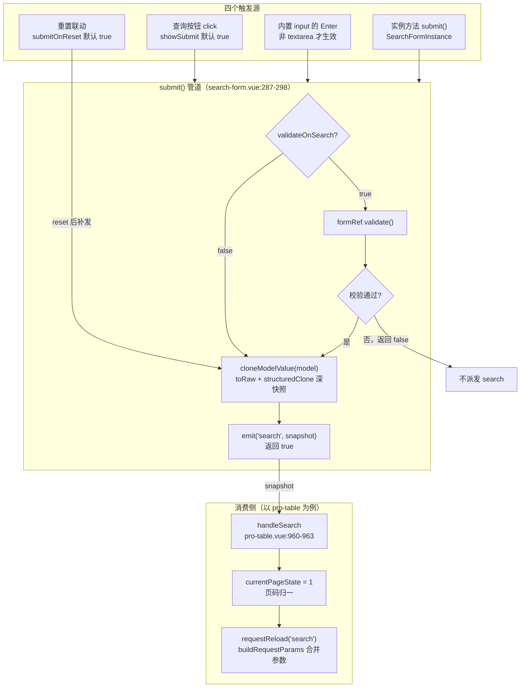
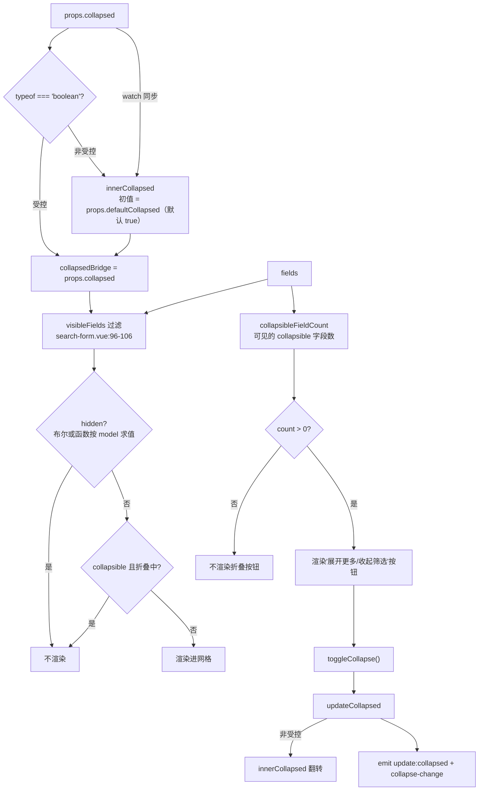

# 9-04 · SearchForm：查询语义

> 本篇是 9 卷"增强层（pro-components）"的第四篇。9-02 拆了 core.ts 这部"宪法"，9-03 讲了 field-schema 的"一份声明三种形态"；本篇往下走进第一个真正的**业务预设组件**——`xy-search-form`。它的核心问题按大纲只有一句话——**查询/重置与折叠的字段布局**——但这十三个字里至少藏着三道题：查询这件事什么时候发生（触发语义）、重置回到哪里（重置语义）、字段多到一行放不下的时候怎么办（折叠布局）。本篇全部给实码定论，行号逐一核对过当前工作区，并为 9-05《ProForm：schema 驱动表单》埋好引线。

接到题目先复述一遍目标，防止写偏：`packages/pro-components/search-form` 是增强层 form 组的第一个条目（`packages/pro-components/component-manifest.json:2-9`），它要做的事可以用一句话概括——**普通 form 的"提交流程"被特化为"查询参数收集"**。`xy-form` 面向的是"填一张表、校验、提交、落库"的写路径；`xy-search-form` 面向的是"给几个条件、点一下查询、表格刷新"的读路径。读路径和写路径对表单组件的要求完全不同：写路径要强校验、要完整、要防误提交；读路径要轻、要快、要允许半填、要随时回到默认。SearchForm 的全部源码（397 行的 `search-form.vue` + 74 行的 `search-form.ts`）都在回答这三道题。

先交代体量与边界，给全文一个标尺。`search-form` 目录四个文件：`index.ts`（17 行，安装入口）、`src/search-form.ts`（74 行，纯类型）、`src/search-form.vue`（397 行，唯一实现）、`__tests__/` 两个用例文件（393 行 + 72 行）。样式住在 `packages/theme/src/pro/search-form.css`（73 行），经 `packages/pro-components/style.css:2` 的 `@import` 汇入。导出边界是标准三件套：`packages/pro-components/exports.ts:1` 显式导出组件值 `XySearchForm`，`packages/pro-components/index.ts:7-11` 显式导出三个类型（`SearchFormField`、`SearchFormInstance`、`SearchFormProps`），`scripts/check-pro-components.mjs:11` 的根入口类型白名单逐名锁定——少导出报错、多导出也报错。类型夹具 `tests/types/fixtures/xiaoye-pro-components.ts:76` 导入 `SearchFormField` 并在 `86-93` 行实际构造了一个字段数组。历史考据方面，`git log --follow` 显示 search-form 与 core.ts 同批出生（a32e399，2026-03-30），至今四次提交、实现正文零重构——和 9-02 讲过的宪法一样，这是个"生下来就长对了"的组件。

## 一、SearchFormField：field-schema 的查询特化

先回答与 9-02、9-03 的关系问题。9-02 结尾留了一句话：`SearchFormField` 是增强层的"法外之地"——它被 pro-table（`packages/pro-components/pro-table/src/pro-table.ts:18`）、list-page（`packages/pro-components/list-page/src/list-page.ts:1`）、crud-page（`packages/pro-components/crud-page/src/crud-page.ts:2`）三个组件跨目录引用，却始终没有进 core。为什么豁免？9-02 已经立过论：**收编的标准是"公共词汇 vs 某组件的私有主类型"**——`SearchFormField` 是 search-form 自己的主数据类型，先于"共享需求"存在，所以留在组件子入口。但"留在子入口"不等于"和 ProFieldSchema 没关系"。把两个类型摆在一起，会发现前者是后者的**查询特化**：同一套 schema 思想，按"读路径"裁剪。

先看查询特化的全貌，`packages/pro-components/search-form/src/search-form.ts:5-45`：

```ts
export type SearchFormFieldBuiltinComponent =
  | "input"
  | "select"
  | "checkbox"
  | "checkbox-group"
  | "radio"
  | "radio-button"
  | "radio-group"
  | "cascader"
  | "date-picker"
  | "time-picker"
  | "time-select"
  | "input-number"
  | "switch"
  | "transfer"
  | "avatar"
  | "image"
  | "progress"
  | "tag"
  | "timeline"
  | "tree"
  | "steps";

export type SearchFormFieldOption<T = string | number> = SelectOption<T> | SelectOptionGroup<T>;

export interface SearchFormField {
  prop: string;
  label: string;
  component?: SearchFormFieldBuiltinComponent | Component;
  componentProps?: Record<string, unknown>;
  options?: SearchFormFieldOption[];
  slot?: string;
  span?: number;
  hidden?: boolean | ((model: Record<string, unknown>) => boolean);
  disabled?: boolean | ((model: Record<string, unknown>) => boolean);
  collapsible?: boolean;
  rules?: XyFormRule[];
  required?: boolean;
  help?: string;
  placeholder?: string;
}
```

对照 9-03 拆过的 `ProFieldSchema`（`packages/pro-components/core.ts:106-124`，17 个成员），`SearchFormField` 的 14 个成员可以做一笔精确的增删账。**砍掉的五个**全是展示法域的成员——`valueType`、`formatter`、`render`、`renderHTML`、`emptyValue`。这五个服务于"同一份声明怎么渲染成只读视图"（详情态、单元格态），而查询表单永远是编辑态，只读渲染管道在这里毫无意义。**加回来的两个**是 `collapsible` 与 `rules`——前者是本篇第三节的绝对主角（折叠标记），后者是字段级校验规则（`XyFormRule[]`），因为 `validateOnSearch` 开启时查询前要校验，规则得有地方声明（`core.ts` 的 `ProFieldSchema` 反而没有 `rules`——详情渲染不需要）。**一收一放的一处**是 `component` 的类型：`ProFieldSchema.component` 是纯字符串词表（schema 可序列化的铁律），而 `SearchFormField.component` 是 `SearchFormFieldBuiltinComponent | Component`——**查询场景给了自定义组件的逃生门**。查询条件的形态五花八门（级联、范围、树选），业务方不想等词表扩员时，直接塞一个 Vue 组件进来也能跑。代价是这条字段失去了可序列化保证——但查询表单本来就是前端现场配置的，不走后端下发，这笔账划算。

把对照的另一半也摆出来，`packages/pro-components/core.ts:106-124` 的 `ProFieldSchema`（9-03 已逐成员拆过，这里只看形状）：

```ts
export interface ProFieldSchema {
  prop: string;
  label: string;
  component?: ProFieldSchemaBuiltinComponent;
  valueType?: ProDisplayValueType;
  componentProps?: Record<string, unknown>;
  options?: ProFieldSchemaOption[];
  formatter?: ProDisplayFormatter<Record<string, unknown>, ProFieldSchema>;
  render?: ProDisplayRenderer<Record<string, unknown>, ProFieldSchema>;
  renderHTML?: ProDisplayHtmlRenderer<Record<string, unknown>, ProFieldSchema>;
  emptyValue?: string;
  slot?: string;
  span?: number;
  hidden?: boolean | ((model: Record<string, unknown>) => boolean);
  disabled?: boolean | ((model: Record<string, unknown>) => boolean);
  required?: boolean;
  help?: string;
  placeholder?: string;
}
```

逐成员对齐着读，“查询特化”四个字就落到了实处：`prop`/`label`/`componentProps`/`options`/`slot`/`span`/`hidden`/`disabled`/`required`/`help`/`placeholder` 十一个成员原样保留——这是编辑态与展示态共享的骨架；五个展示成员消失；两个查询成员补位。

连内建词表的规模都透着特化：`SearchFormFieldBuiltinComponent` 21 个成员，比 `ProFieldSchemaBuiltinComponent`（23 个）少了 `textarea` 和 `auto-complete`。textarea 是"长文本录入"控件，查询场景几乎没有；auto-complete 在本库的查询叙事里由 `xy-input` 的关联能力承接。词表的增删不是随手的，是按"这个控件会不会出现在筛选栏"筛过一遍的。词表到组件的翻译层就在实现文件里，`search-form.vue:69-91` 的私有映射表：

```ts
const builtInComponentMap: Record<string, Component> = {
  input: XyInput,
  select: XySelect,
  checkbox: XyCheckbox,
  "checkbox-group": XyCheckboxGroup,
  radio: XyRadioGroup,
  "radio-button": XyRadioGroup,
  "radio-group": XyRadioGroup,
  cascader: XyCascader,
  "date-picker": XyDatePicker,
  "time-picker": XyTimePicker,
  "time-select": XyTimeSelect,
  "input-number": XyInputNumber,
  switch: XySwitch,
  transfer: XyTransfer,
  avatar: XyAvatar,
  image: XyImage,
  progress: XyProgress,
  tag: XyTag,
  timeline: XyTimeline,
  tree: XyTree,
  steps: XySteps
};
```

21 个词表成员对 21 个映射键（`radio` 系三个词共用 `XyRadioGroup`），未登记的名字回落 `XyInput`（`resolveFieldComponent`，`search-form.vue:143-153`）。它与 `field-schema.ts:31-55` 那张 23 键的映射表是**平行实例而非同一张表**——又一处形状复制：查询词表比全量词表少两个键，共享一张表反而要做键集过滤，两份小表各管各的词表，算是有意为之的分治。

类型文件的收尾两段（`search-form.ts:47-74`）是 Props 与 Instance 协议，本篇后面反复引用，先整段放在这里：

```ts
export interface SearchFormProps {
  model: Record<string, unknown>;
  fields: SearchFormField[];
  rules?: FormRules;
  labelWidth?: string | number;
  labelPosition?: "left" | "top";
  size?: ComponentSize;
  columns?: number;
  collapsed?: boolean;
  defaultCollapsed?: boolean;
  submitText?: string;
  resetText?: string;
  expandText?: string;
  collapseText?: string;
  showSubmit?: boolean;
  showReset?: boolean;
  submitOnReset?: boolean;
  validateOnSearch?: boolean;
}

export interface SearchFormInstance {
  validate: () => Promise<boolean>;
  submit: () => Promise<boolean>;
  reset: () => void;
  resetFields: () => void;
  clearValidate: () => void;
  toggleCollapse: (force?: boolean) => void;
}
```

17 个 props 里，有 9 个直接服务于查询/重置/折叠三道题（`columns`、`collapsed`、`defaultCollapsed`、`submitText`、`resetText`、`expandText`、`collapseText`、`submitOnReset`、`validateOnSearch`），其余是透传给内层 `xy-form` 的布局参数。`SearchFormInstance` 六个动词里 `submit` 特别值得停一下：签名是 `() => Promise<boolean>`——**查询是可以失败的**。校验不通过时它 resolve 成 `false` 而不是 reject，实例调用方（比如某个把 SearchForm 嵌进抽屉的页面）可以据此决定要不要继续往下走。`toggleCollapse` 带 `force?: boolean` 参数，既当开关又当设定器，这是第五节的伏笔。

## 二、查询语义：触发矩阵与数据流

现在进入核心问题第一道：**查询这件事什么时候发生**。把 `search-form.vue` 的全部触发通道数一遍，答案是一张五行矩阵——四个真实入口，加一个"刻意缺席"的入口。

先给查询数据流的全景图：



四个触发源汇进同一个 `submit()` 管道。看实码，`search-form.vue:287-298`：

```ts
async function submit() {
  if (props.validateOnSearch) {
    const valid = await formRef.value?.validate();

    if (!valid) {
      return false;
    }
  }

  emit("search", cloneModelValue(props.model));
  return true;
}
```

十二行里三个决定。**第一，校验是可选门**：`validateOnSearch` 默认 `false`（`search-form.vue:55`）——查询表单默认不校验。这和写路径表单（`xy-pro-form` 的提交前必校验）是根本分歧：查询条件错了顶多是查不到数据，阻拦用户的成本大于收益；只有当某个条件有硬性约束（比如时间范围必填）时才显式开这扇门。测试 `search-form.spec.ts:99-139` 把这条门禁钉死了：`validateOnSearch: true` 且字段 `required` 时，空模型点查询不派发 `search`、页面出现"请输入关键词"，填值后再点才派发。

**第二，载荷是深快照**。`emit("search", cloneModelValue(props.model))` 传出去的不是 model 引用，而是 `search-form.vue:128-136` 造的深拷贝：

```ts
function cloneModelValue(value: Record<string, unknown>) {
  const rawValue = toRaw(value);

  if (typeof globalThis.structuredClone === "function") {
    return globalThis.structuredClone(rawValue);
  }

  return JSON.parse(JSON.stringify(rawValue)) as Record<string, unknown>;
}
```

`toRaw` 先剥掉顶层 reactive 代理（Vue 的响应式转换是"读时懒包"，原始 target 里的嵌套值保持裸态，所以一层 toRaw 就够），然后 `structuredClone` 深拷贝，老环境回落 `JSON` 往返。为什么要快照？因为查询参数会被消费方长期持有——pro-table 把它并进请求参数、可能塞进保存视图、可能进埋点日志；如果传引用，用户改一个字段的值，"上一次查询的条件"就被静默改写了，竞态与归因全都说不清。**"事件载荷一律快照"是 4-08 讲过的全局约定在查询语义下的执行**。顺带如实记一笔：这个函数与 `field-schema.ts:72-81` 的 `cloneProValue` 几乎逐字相同，两处各自实现、互不引用——增强层里又一处"复制而非复用"的现场，和 9-02 记的三个违约现场同属一类。

触发、校验、快照、派发的全流程，第一个测试用例（`packages/pro-components/search-form/__tests__/search-form.spec.ts:12-62`）一次性钉死了四件事——折叠隐藏、展开、查询载荷、重置回初值：

```ts
it("支持按 schema 渲染字段、折叠扩展和查询重置", async () => {
  const model = reactive({
    keyword: "账单中心",
    owner: "小叶"
  });
  const fields: SearchFormField[] = [
    {
      prop: "keyword",
      label: "关键词",
      component: "input"
    },
    {
      prop: "owner",
      label: "负责人",
      component: "input",
      collapsible: true
    }
  ];

  const wrapper = mount(XySearchForm, {
    props: {
      model,
      fields,
      submitOnReset: false
    }
  });

  expect(wrapper.text()).not.toContain("负责人");

  await wrapper.get(".xy-search-form__toggle").trigger("click");
  await nextTick();

  expect(wrapper.text()).toContain("负责人");

  await wrapper.get(".xy-button--primary").trigger("click");

  expect(wrapper.emitted("search")?.[0]?.[0]).toEqual({
    keyword: "账单中心",
    owner: "小叶"
  });

  model.keyword = "已修改";
  await nextTick();
  await wrapper.findAll("button")[1]?.trigger("click");

  expect(model.keyword).toBe("账单中心");
  expect(wrapper.emitted("reset")?.[0]?.[0]).toEqual({
    keyword: "账单中心",
    owner: "小叶"
  });
});
```

注意首行断言的时序：`defaultCollapsed: true` 生效，标记了 `collapsible` 的"负责人"字段初始不渲染；点一次 `.xy-search-form__toggle` 才出现——折叠语义和查询语义在同一个用例里交接。

**第三，返回值参与契约**：校验失败返回 `false`，成功返回 `true`。`SearchFormInstance.submit` 的 `Promise<boolean>` 签名（`search-form.ts:69`）由此兑现。

再看两个特殊的触发源。一个是 **Enter 提交**，实码在 `search-form.vue:212-238`：

```ts
function isInputEnterSubmitEnabled(field: SearchFormField) {
  const componentName =
    typeof field.component === "string" ? field.component : field.component ? "custom" : "input";

  if (componentName !== "input") {
    return false;
  }

  return field.componentProps?.type !== "textarea";
}

function createFieldKeydownHandler(field: SearchFormField) {
  const originalHandler = field.componentProps?.onKeydown;

  return (event: KeyboardEvent) => {
    if (typeof originalHandler === "function") {
      originalHandler(event);
    }

    if (!isInputEnterSubmitEnabled(field) || event.key !== "Enter") {
      return;
    }

    event.preventDefault();
    void submit();
  };
}
```

两个细节都是"查询表单的用户习惯"实码化。其一，Enter 只有**内置 input 且非 textarea** 才生效——`component !== "input"` 直接 false，`componentProps.type === "textarea"` 再排除一次（多行文本里按 Enter 是换行不是查询，这是从 IME 时代传下来的规矩）。select、date-picker 的 Enter 不触发查询，测试 `search-form.spec.ts:282-349` 用三段模型把这条边界完整钉死。其二，`createFieldKeydownHandler` 是**事件组合而非事件覆盖**：业务方在 `componentProps.onKeydown` 里写的处理器先执行，然后才追加提交逻辑——如果这里用 `{ ...componentProps, onKeydown: 提交 }` 直接覆盖，业务方挂的快捷键监听会被静默吞掉。样式上这与 4-09 讲 group 复合模式时的"属性下发不吞属性"是同一纪律。

另一个特殊触发源是**重置联动**，它是下一节的主角，这里先记数据流：`reset()` 末尾在 `submitOnReset` 为真时用**同一个快照**补发一次 `search`（`search-form.vue:307-309`）——重置在语义上是"回到初始查询"，列表自然要刷回初始结果。

最后说那个**刻意缺席的第五入口：字段变化即查（immediate）**。搜遍 `search-form.vue`，`watch` 只有一个，监听的是 `props.collapsed`（`search-form.vue:119-126`）；`model` 上没有任何侦听器，`updateModelValue`（`search-form.vue:138-141`）只写不报。也就是说，用户改了 select、选完日期、勾了复选框，**什么都不会发生**，必须等四个触发源之一。这不是遗漏，是权衡，第三节专门过堂。

## 三、权衡一：立即查 vs 按钮查

现在把"字段变化即查"的缺席正式立为一个设计权衡。支持 immediate 的理由很充分：条件少、请求便宜、用户不用瞄准按钮，改完即见，交互上"所改即所得"。但反对的理由在这个组件的定位下更硬，至少有四条。防抖、竞态守卫这类问题在 pro-table 的请求执行体（`pro-table.vue:871-907`，`requestId` 递增比对）里已有答案，但答案的存在不等于答案的便宜。

**第一条，请求风暴**。查询表单的字段不是单值——date-picker 的范围、cascader 的路径、transfer 的多选，每一步中间态都会触发 change。用户把"创建时间"从 3 月调到 9 月，immediate 模式下可能连发六七个请求，每个都要防抖、都要竞态守卫——防抖窗口选多长都是猜。**按钮查把"提交时机"的决定权交给用户，竞态问题在源头就薄了一层**。

**第二条，半填状态不可查**。字段间常有依赖（A 选完 B 才有意义，`hidden`/`disabled` 的函数式联动正是为此而生，`search-form.vue:96-106` 与 `208-210`）。immediate 模式下，A 一变立刻查，此刻 B 还是旧值或空值，查回来的是"用户根本不想要的中间结果"；按钮查保证用户把条件组好才发车。

**第三条，成本归属**。列表页的查询背后是分页、排序、筛选的复合请求（pro-table 的 `buildRequestParams` 要合并 `requestParams`、搜索模型、筛选模型、视图 key 四路参数，`pro-table.vue:862-869`），服务端成本高。immediate 适合"输入联想"（auto-complete 那类），不适合"列表重查"——本库把两类场景分给了两个组件，而不是让一个组件背负两种性格。

**第四条，与消费方的接线成本**。pro-table 的 `handleSearch`（`pro-table.vue:960-963`）做的是"页码归一 + 重发请求"：

```ts
function handleSearch() {
  currentPageState.value = 1;
  void requestReload("search");
}

function handleSearchReset() {
  currentPageState.value = 1;
  void requestReload("reset");
}
```

如果字段变化即查，这对接线就要在每一层中间加防抖与节流，业务方心智负担反而上来了。

但"按钮查"也有真实代价：**纯键盘用户的效率**。于是有了 Enter 那条折中——input 是查询表单里最高频的字段，"输完关键词回车"是肌肉记忆，内置 input（非 textarea）的 Enter 补上了按钮查的主要痛点，又不会像 select 的 change 那样连发。文档示例的 meta 区专门写了一句提示："普通输入框按 Enter 会直接触发查询，select 和 textarea 不会"（`apps/docs/examples/pro/search-form/collapsible.vue:63`）——实现者认为这条边界值得被用户看见。

这里正是一处 EP 对比的好位置：**Element Plus 没有任何查询表单预设**。`el-form` + `el-form-item` 拼筛选栏，查询按钮自己绑 `@click`、自己收参数，重置自己写（调用 `resetFields` 还是自己清 model 全凭手写），折叠展开自己维护一个布尔加 `v-show`——EP 官方对此的立场是"表单是表单，列表是列表"，两者之间的那层"查询语义"完全留给生态（vue-element-admin、各类 admin 模板各自封装，形状互不兼容）。而 antd 的 ProComponents 走了另一个极端：ProTable 内建查询表单（`search` 配置项），连"查询按钮区"都替你排好（submitter/optionRender 一堆定制点）。本库的选择在两者之间：**把查询语义做成独立组件**（`xy-search-form`），但不与表格焊死——pro-table 通过 `views.searchFields` 接它，也可以整个 `#search` 插槽换掉（`pro-table.vue:1621-1627`）；也可以完全脱离表格单用（`apps/docs/pro-components/search-form.md:19-21` 的"何时不使用"甚至明确建议：字段少于三个且无折叠需求时，直接用 `xy-form` inline 更轻量）。组件边界画在哪，比实现本身更值得琢磨。

## 四、重置语义：回到 defaults，不是清空

核心问题第二道：**重置回到哪里**。直觉答案有两个候选——"清空"（所有字段变空）和"回到默认"（所有字段回到初始值）。这个组件的答案是后者，而且答案不是它自己做的，是**委托给了基础层 form 的语义**。看实码，`search-form.vue:300-310`：

```ts
function reset() {
  formRef.value?.resetFields();
  formRef.value?.clearValidate();

  const payload = cloneModelValue(props.model);
  emit("reset", payload);

  if (props.submitOnReset) {
    emit("search", payload);
  }
}
```

`resetFields` 是基础层 `xy-form` 的能力。它的语义链条在 `packages/components/form/src/form-item.vue`：每个 form-item **在 setup 时记录一次初值**（`form-item.vue:62-64`）：

```ts
const initialValue = ref(
  props.prop && form ? cloneValue(getPathValue(form.props.model, props.prop) as never) : undefined
);
```

`resetField` 被调用时把 model 写回这个记录值（`form-item.vue:136-143`）：

```ts
function resetField() {
  if (!form || !props.prop) {
    return;
  }

  setPathValue(form.props.model, props.prop, cloneValue(initialValue.value));
  clearValidate();
}
```

注意是"挂载时刻的 model 值"，不是 `undefined` 也不是空串——**"默认值"是数据自己的属性，不是组件的猜测**。测试 `search-form.spec.ts:53-61` 给了铁证：model 初始 `keyword: "账单中心"`，用户改成"已修改"，点重置后断言 `model.keyword` 回到 `"账单中心"`——不是 `""`。

```ts
// packages/pro-components/search-form/__tests__/search-form.spec.ts:52-61
    model.keyword = "已修改";
    await nextTick();
    await wrapper.findAll("button")[1]?.trigger("click");

    expect(model.keyword).toBe("账单中心");
    expect(wrapper.emitted("reset")?.[0]?.[0]).toEqual({
      keyword: "账单中心",
      owner: "小叶"
    });
```

这就是权衡二：**重置回初始值 vs 重置清空**。回到初始值的语义覆盖了一个非常实用的场景——页面带着 URL 参数初始化（`?status=enabled` 进来，模型初始就是 `status: "enabled"`），用户筛了一圈想"回到进来的样子"，重置一键归位；清空语义做不到这一点，还得业务方在 reset 回调里手工填回 URL 参数。代价是心智成本："重置"不是"清空"，model 初始给什么，重置就回什么——初始模型里塞了脏数据的话，脏数据会被"重置"保下来。基础层语义复用的红利在这里兑现：search-form 的 reset 只有 11 行，因为初值记录、校验清理、字段注册的脏活全是 `xy-form` 干的。

重置函数里还有两处精确的设计。**其一，`clearValidate` 跟在 `resetFields` 后面**——回写初值本身不会清校验状态，得显式补一刀，否则"重置了但红字还在"是最败好感的体验组合。**其二，`submitOnReset` 默认 `true`（`search-form.vue:54`）**：重置后自动补发一次 `search`，且补发的 payload 与 `reset` 事件的是**同一个快照对象**（`search-form.vue:304` 克隆一次、两处共用）——"列表当前展示的结果"和"筛选栏显示的条件"永远一致。这是权衡二的延长线：**重置之后查不查？** 不查的话，筛选栏已经回到默认、表格里还挂着上次的结果，两块区域事实脱节，用户会怀疑"重置没生效"；查的话，多一次请求，但状态一致。默认值的取舍（查）和 `submitOnReset: false` 的逃生门（测试 `search-form.spec.ts:141-168` 钉死了 false 时不补发）同时给了。对照 antd ProTable 的行为——它的重置按钮同样会触发表单重置并重新请求——"重置即查询"可以说是这类组件的**行业共识默认值**，本库与它对齐，但没有学它把重置语义焊进表格，而是留在查询组件自己身上。

同一套代码栈里其实并存着**两种重置语义**，如实记账：search-form 的重置是"回初值"，而 pro-table 实例的 `reset()`（`pro-table.vue:917-934`，即 `ProActionRef` 三动词之一）对 `searchModel` 的处理是**逐键置 `undefined`**：

```ts
async function reset() {
  currentPageState.value = props.defaultCurrentPage;
  pageSizeState.value = props.defaultPageSize;
  cancelEdit();
  closeContextmenu();
  selectedRows.value = [];
  if (searchModel.value) {
    Object.keys(searchModel.value).forEach((key) => {
      searchModel.value![key] = undefined;
    });
  }
  if (filterModel.value) {
    Object.keys(filterModel.value).forEach((key) => {
      filterModel.value![key] = undefined;
    });
  }
  await requestReload("reset");
}
```

一个是"回默认"（form-item 初值记录），一个是"清空"（置 undefined），两层并存在同一条调用链上。它不是 bug——pro-table 的 `reset` 是"整页状态复位"（页码、选中、编辑、筛选一起清），粒度本就比筛选栏按钮粗；但它确实意味着：先调 `proTableRef.reset()` 再看筛选栏，字段显示的是空而非初始默认值。**同一套系统里"reset"一词的两种执法，读代码时值得留神**。这个细节也呼应 9-02 的结论：`ProActionRef` 的三个动词只约定了"要发生什么"，约定的粒度到组件边界为止，内部的语义细节各组件自理。

最后补一个折叠与重置相互作用的暗面，文档"行为约定"里没有记载：**折叠中的字段不参与重置**。原因在注册机制——`visibleFields` 是用 `v-for` 渲染的（`search-form.vue:337-341`），折叠等于**卸载**而非隐藏；而基础层 form 的 `resetFields` 只遍历**当前注册的字段**（`form.vue:51-63` 的 addField/removeField，`form-item.vue:174-181` 挂载注册、卸载注销）。于是：一个标记了 `collapsible` 的字段在折叠状态下，用户点"重置"，它的值**不会**回到初始值；等展开后，表单里显示的还是旧值。快照语义倒是自洽的（`reset`/`search` 载荷里它保持原值），但这仍是"折叠 = 卸载"这个实现选择的真实代价。第五节展开折叠策略时，这条要计入权衡账本。

## 五、折叠布局：字段标记制，不是行数阈值

核心问题第三道：**字段多到放不下怎么办**。先给折叠判定的完整判定图：



读这张图有三个层次。

**第一层：状态归属——受控/非受控双模**。`collapsedBridge = props.collapsed ?? innerCollapsed.value`（`search-form.vue:94-95`）：外层传了布尔就是受控模式，真实状态在外层；没传就走内层 `innerCollapsed`，初值取 `defaultCollapsed`（**默认 `true`，一出生就是折叠的**）。`updateCollapsed`（`search-form.vue:278-285`）在非受控时才改内层，事件则无论受控与否都双发——`update:collapsed` 供 `v-model:collapsed` 语法糖、`collapse-change` 供显式监听，两种消费风格各取所需。而 `watch(() => props.collapsed)`（`119-126`）看似多余实则精细：它保证受控模式的每次 prop 变化都同步进 `innerCollapsed`，将来外层从受控切回非受控（把 `collapsed` 改回 `undefined`），内层值不会跳回出厂状态。测试 `search-form.spec.ts:351-392` 把受控模式的纪律钉得很死：受控时点击折叠按钮**只派发事件、不改渲染**，外层 `setProps` 之后视图才变——"受控组件不替主人做决定"，和 4-04 讲的受控/非受控双模规范完全同构。`toggleCollapse(force?)` 的可选参数让实例调用方可以"确保展开"（`toggleCollapse(true)`）而不必先读当前状态。

**第二层：折叠的粒度——字段标记制**。哪些字段会被折叠？答案不是"第二行开始自动折叠"，而是**只有显式标记了 `collapsible: true` 的字段**（`search-form.vue:104`，`!(collapsedBridge.value && field.collapsible)`）。配套地，折叠按钮的显隐也是自动推导的：`collapsibleFieldCount` 数出"当前可见的 collapsible 字段数"（`107-113`，hidden 的不计入——藏在联动后面的字段不算数），大于零才渲染"展开更多/收起筛选"按钮（`114`）。于是一个没有任何 `collapsible` 标记的 SearchForm，哪怕 `defaultCollapsed: true`，也**一个字段都不会少、一个按钮都不会多**——文档基础示例（`apps/docs/examples/pro/search-form/basic.vue:11-37`）正是这样：三个字段无标记，组件安静地当普通筛选栏用。标记制长什么样，看文档折叠示例的 schema 原文（`apps/docs/examples/pro/search-form/collapsible.vue:14-57`）：

```ts
const fields: SearchFormField[] = [
  {
    prop: "keyword",
    label: "关键词",
    component: "input",
    span: 2
  },
  {
    prop: "status",
    label: "状态",
    component: "select",
    options: [
      { label: "待处理", value: "processing" },
      { label: "处理中", value: "running" },
      { label: "已归档", value: "done" }
    ]
  },
  {
    prop: "scene",
    label: "场景",
    slot: "scene",
    collapsible: true
  },
  {
    prop: "owner",
    label: "负责人",
    component: "input",
    hidden: (currentModel) => currentModel.scene === "待处理",
    collapsible: true
  },
  {
    prop: "assistant",
    label: "协作人",
    component: "input",
    disabled: (currentModel) => currentModel.status === "running",
    collapsible: true
  },
  {
    prop: "date",
    label: "创建日期",
    component: "date-picker",
    collapsible: true
  }
];
```

六个字段里前两个不标记（永远可见），后四个标记 `collapsible`（折叠候选）；其中"负责人"还叠加了 `hidden` 联动——hidden 先于折叠判定（`96-106` 的过滤顺序），所以"场景 = 待处理"时它连展开态都不渲染，折叠计数也把它除外。`meta` 插槽还把 `hidden-count` 递出来（`search-form.vue:364-370`），业务方想做"已折叠 3 项"这类提示有现成数据。

**第三层：布局的骨架——CSS Grid 与跨列钳制**。看模板主体，`search-form.vue:336-362`：

```html
<div class="xy-search-form__grid" :style="gridStyle">
  <div
    v-for="field in visibleFields"
    :key="field.prop"
    class="xy-search-form__field"
    :style="{ gridColumn: `span ${resolveFieldSpan(field)}` }"
  >
    <xy-form-item
      :label="field.label"
      :prop="field.prop"
      :rules="field.rules"
      :required="field.required"
      :help="field.help"
    >
      <slot
        v-if="slots[resolveFieldSlotName(field)]"
        :name="resolveFieldSlotName(field)"
        v-bind="getFieldSlotProps(field)"
      />
      <component
        :is="resolveFieldComponent(field)"
        v-else
        v-bind="resolveFieldRenderProps(field)"
      />
    </xy-form-item>
  </div>
</div>
```

网格是 `repeat(columns, minmax(0, 1fr))`（`gridStyle`，`115-117`；`columns` 经 `Math.max(1, Math.floor(...))` 归一，`93`）。`minmax(0, 1fr)` 是这里真正的功臣：CSS Grid 里裸写 `1fr` 等价于 `minmax(auto, 1fr)`，隐式下限是内容的 min-content——一个长占位符的输入框就能把整列撑破、把邻列挤扁；下限锁 0 之后列宽绝对均分，配合 `.xy-search-form__field { min-width: 0 }`（`packages/theme/src/pro/search-form.css:19-21`），长内容只能在自己的格子里省略，祸不及邻居。字段槽位上的插槽优先于内建组件（`350-354`，`slots[resolveFieldSlotName(field)]` 存在就让位，插槽名缺省跟随 `prop`），插槽入参打包了 `field`/`model`/`value`/`update` 四件（`267-276`）——受控值回写走 `update` 回调，文档示例里用两个按钮模拟的"场景"字段（`collapsible.vue:65-80`）就是这么接的。

插槽让位之前，每个内建组件拿到的 props 都经过同一段解析管道（`search-form.vue:159-197`）——placeholder 三级优先、options 按词表透传：

```ts
function resolveFieldPlaceholder(field: SearchFormField) {
  if (field.placeholder) {
    return field.placeholder;
  }

  if (field.componentProps?.placeholder !== undefined) {
    return field.componentProps.placeholder;
  }

  const componentName =
    typeof field.component === "string" ? field.component : field.component ? "custom" : "input";
  const selectLike = ["select", "date-picker", "time-picker", "time-select"].includes(componentName);

  return `${selectLike ? "请选择" : "请输入"}${field.label}`;
}

function resolveFieldProps(field: SearchFormField) {
  const componentName =
    typeof field.component === "string" ? field.component : field.component ? "custom" : "input";
  const nextProps = {
    ...field.componentProps,
    placeholder: resolveFieldPlaceholder(field)
  } as Record<string, unknown>;

  if (
    componentName === "select" ||
    componentName === "checkbox-group" ||
    componentName === "radio-group"
  ) {
    nextProps.options = field.options ?? [];
  }

  if (componentName === "radio-button") {
    nextProps.options = field.options ?? [];
    nextProps.type = "button";
  }

  return nextProps;
}
```

这段与 `field-schema.ts:105-152` 的 `resolveProFieldPlaceholder`/`resolveProFieldProps` 又是一对平行实例——逻辑同构，词表不同（查询版的 `selectLike` 少了 `auto-complete`，也没有 `textarea` 的 `type` 改写），连同上面的映射表，构成"查询特化"在实现层的影子：协议分了家，实现也各自成章。

跨列数字被双重钳制，`search-form.vue:259-265`：

```ts
function resolveFieldSpan(field: SearchFormField) {
  if (!field.span) {
    return 1;
  }

  return Math.max(1, Math.min(normalizedColumns.value, Math.floor(field.span)));
}
```

schema 作者写 `span: 99` 会被钳到 `columns`，写 `span: 0` 回落 1——**schema 是不受信任的输入**，布局的合法性由实现兜底。这与 9-03 说的"span 怎么钳制"是同一处机制的现场。

样式文件不长，全文 73 行（`packages/theme/src/pro/search-form.css`），容器是"筛选卡片"视觉——渐变底加 `color-mix` 描边（`1-11`），网格与字段槽位只做三件事：gap、min-width 清零、label 最小高度（`13-29`）：

```css
.xy-search-form {
  display: flex;
  flex-direction: column;
  gap: 16px;
  padding: 20px;
  border: 1px solid color-mix(in srgb, var(--xy-border) 90%, var(--xy-mix-light));
  border-radius: var(--xy-radius-lg);
  background:
    linear-gradient(180deg, color-mix(in srgb, var(--xy-bg-muted) 60%, var(--xy-mix-light)), transparent 84px),
    var(--xy-bg-container);
}

.xy-search-form__grid {
  display: grid;
  gap: 16px;
  min-width: 0;
}

.xy-search-form__field {
  min-width: 0;
}
```

动作区一条虚线分隔（`31-38`），左边 `meta`、右边 `actions-main`（`40-52`）。最值得注意的是尾部媒体查询：

```css
/* packages/theme/src/pro/search-form.css:58-72 */
@media (max-width: 960px) {
  .xy-search-form {
    padding: 16px;
  }

  .xy-search-form__actions {
    flex-direction: column;
    align-items: stretch;
  }

  .xy-search-form__actions-main {
    width: 100%;
    justify-content: flex-start;
  }
}
```

注意它做了什么、没做什么：**960px 以下只把动作区改成纵向堆叠，网格列数一个像素都没动**——`columns` 是 prop，静态值，窄屏下 3 列还是 3 列，字段窄就窄了。这直接引出本篇权衡三。

## 六、权衡三：折叠策略——标记制 vs 阈值制

把折叠策略的三种流派摆在一起看。**流派一，字段标记制**（本库）：哪些字段可折叠由 schema 作者逐个声明，折叠按钮按需出现。收益是**可预测**——折叠行为写死在声明里，不随屏宽、字号、文案长度漂移；字段的主次之分（"关键词、状态是常用条件，部门、协作人、日期是次要条件"）本来就是业务判断，机器猜不如人标。代价也明摆着：字段多时要逐个补 `collapsible: true`，样板代码变长；而且**没有自适应**——没人盯着屏幕宽度，"第一行放得下几个"永远不重算。

**流派二，列宽阈值制**（antd ProTable 查询表单的方案）：按 `span` 配置计算一行能放几个字段，`defaultCollapsed` 时只保留第一行、其余自动折进"展开"。收益是自适应与省心——schema 作者只管声明字段和权重（span），折叠机器自己算。代价是**结果随环境漂移**：屏宽、labelWidth、字段文案一变，"哪些字段被折叠"就变，昨天折叠的是部门、今天是日期，用户的学习成本被转嫁给了布局算法；实现上还需要测量或断点推算，复杂度高一个量级。

**流派三，纯 CSS 方案**（EP 生态的手作惯例）：字段全渲染，容器限高 + `overflow: hidden` + "展开"按钮切换——最省事，但被隐藏的字段仍占 DOM、表单校验状态仍然在册，"看不见但活着"的状态最容易出诡异 bug。

本库选了流派一，但把流派一做到"按钮自动化"：标记制的手工性被 `showCollapseToggle` 的自动推导抵消了大半——标记了才有按钮，没标记组件自动退化为平铺表单。`defaultCollapsed: true` 的默认值值得再咬一口：**组件默认相信"筛选栏应该是收起的"**——中后台的筛选栏十有八九是次要字段居多的长表单，折叠是常态，展开是动作。这个默认值和 `submitOnReset: true` 一样，都是"行业共识默认值"级别的决定：antd ProTable 的 `defaultCollapsed` 同样默认 `true`。

现在把第四节埋的暗面接回来：**折叠 = 卸载**（`v-for` 只遍历 `visibleFields`）在这套权衡里的账。好处是真实的——折叠字段不渲染 DOM，长表单的渲染成本、form-item 的注册开销都省了；而代价在第四节已经看到：折叠中的字段不在 `resetFields` 的注册表里，重置够不着它们。两个方案其实都摆在过台面上：改成 `v-show` 隐藏就两头兼顾（重置可达 + 状态保留），但要付出"折叠字段仍全量渲染"的成本，且"隐藏字段参与校验"会引入新问题（`validateOnSearch` 开启时，折叠的必填字段会让查询永远失败——卸载制下这个问题天然不存在）。最终代码选了卸载制，并把"重置够不着折叠字段"作为已知代价留了下来。**没有无代价的折叠方案，只有代价摆在哪一层的选择**——这是三个权衡共享的底色。

## 七、消费实证：三层接线与分工边界

语义讲完，看它怎么被真实消费。SearchForm 在增强层里有完整的消费梯度。

**第一层，pro-table 直连**。`packages/pro-components/pro-table/src/pro-table.ts:177-185` 的 `ProTableViewsConfig` 把接线协议化：

```ts
export interface ProTableViewsConfig {
  searchModel?: Record<string, unknown>;
  searchFields?: SearchFormField[];
  savedViews?: ProTableSavedViewItem[];
  activeViewKey?: string;
  filterModel?: Record<string, unknown>;
  filterFields?: ProFieldSchema[];
  filterTitle?: string;
}
```

注意 `searchModel`/`searchFields` 与 `filterModel`/`filterFields` 在**同一个配置里并排**——这就是查询侧分工边界的类型化表达：`searchModel` 配 `SearchFormField[]`，走轻量筛选栏（常用条件、少而快、直接摆在表格上方）；`filterFields` 配的是 `ProFieldSchema[]`，走 `filter-panel`/`table-filter-drawer` 的重筛选（字段多、低频、收进抽屉）。运行时两者在 `buildRequestParams`（`pro-table.vue:862-868`）汇合：

```ts
function buildRequestParams() {
  return {
    ...(props.request?.requestParams ?? {}),
    ...(searchModel.value ?? {}),
    ...(filterModel.value ?? {}),
    ...(activeViewKey.value ? { activeViewKey: activeViewKey.value } : {})
  };
}
```

搜索模型、筛选模型、保存视图 key 三路合并成一个请求参数包——**SearchForm 管入口形态，参数合流的事它一概不碰**，这也是它能保持 397 行的原因。模板接线在 `pro-table.vue:1621-1631`：

```html
<div v-if="hasSearch" class="xy-pro-table__search">
  <slot name="search">
    <xy-search-form
      v-if="searchModel && searchFields.length > 0"
      :model="searchModel"
      :fields="searchFields"
      @search="handleSearch"
      @reset="handleSearchReset"
    />
  </slot>
</div>
```

`hasSearch` 的判定（`pro-table.vue:250-253, 275`）是 `slots.search || searchFields.length > 0`——业务方可以整体换掉内建 SearchForm（插槽优先），只留事件语义。注意接线里**没有绑 `collapsed`**：折叠状态完全交给组件自治（非受控 + 默认折叠），表格只关心 `search`/`reset` 两个事件——消费方用到的语义面越窄，组件越稳。

**第二层，页面骨架转授**。list-page 把自己的 `searchModel`/`searchFields` props 原样下传给 pro-table 的 `views`（`packages/pro-components/list-page/src/list-page.vue:75-82`），并把 `#search` 插槽透传（`102-104`）；crud-page 在 render 函数里做同一件事（`packages/pro-components/crud-page/src/crud-page.vue:132-133`）。类型源头在 `list-page.ts:24-25`——`searchFields?: SearchFormField[]` 直接引用 search-form 的主类型，一行 import 完成协议复用，这正是 9-02 说的"上层组件的类型工作量被压缩到选择和组装"。

**第三层，类型夹具与文档**。`tests/types/fixtures/xiaoye-pro-components.ts:86-93` 构造了最小字段数组参与全库类型门禁；文档侧 `apps/docs/pro-components/search-form.md` 的"行为约定"段（145-153 行）把 placeholder 三级优先级、Enter 边界、受控折叠纪律逐条立了字据，`apps/docs/examples/admin.md` 的组合示例则把 SearchForm + ProTable + OverlayForm 串成一个真实后台骨架。

对照文档 API 表还能发现一处文档与实码的**覆盖差**：`SearchFormProps` 实际有 17 个成员，文档 Attributes 表（`search-form.md:100-111`）只列了 10 个——`labelWidth`、`labelPosition`、`size`、`showSubmit`、`showReset`、`expandText`、`collapseText` 七个漏了记载。另外文档 Slots 表也没提 `meta` 插槽的 `hidden-count` 入参。功能都在、行为都对，只是字据不全——如实记下。

## 八、收束：查询语义的六句话与 9-05 的岔路

把这篇收成六句话。**定位**：search-form 是"读路径表单"的预设，把普通 form 的提交流程特化为查询参数收集。**字段协议**：`SearchFormField` 是 `ProFieldSchema` 的查询特化——砍掉展示五件套、加上 `collapsible` 与 `rules`、给 `component` 开了自定义组件的逃生门，作为"组件私有主类型"留在子入口而不进 core。**查询语义**：四入口（按钮、input Enter、实例 submit、重置联动）汇入同一管道，校验默认关闭、载荷一律深快照，字段变化即查被刻意缺席。**重置语义**：回初始值不清空（委托 form-item 初值记录），重置即查询是默认（同一快照双发），与 pro-table 实例级的"清空式 reset"并存但粒度不同。**折叠语义**：字段标记制 + 按钮自动推导 + 受控/非受控双模，折叠即卸载，代价是折叠字段不参与重置。**布局**：CSS Grid 固定列数 + 跨列钳制 + `minmax(0,1fr)`，响应式只做了动作区。

下一篇 9-05《ProForm：schema 驱动表单》在这个岔路口转向写路径：同样是 schema 驱动，`xy-pro-form` 用的却是 `ProFieldSchema` 全量协议（17 个成员一个不砍），它要回答的是 SearchForm 没问过的问题——**Grid 布局怎么承载整表单的分区与跨列、只读态怎么整表切换**（display 管道整表接管，而不是查询表单的"永远编辑态"）、以及校验在提交语义下为什么从"可选门"变回"必经门"。查询表单把 form 做轻，ProForm 把 form 做全——同一个 schema 思想，读路径与写路径各长成一棵树，9-05 从写路径那棵讲起。
