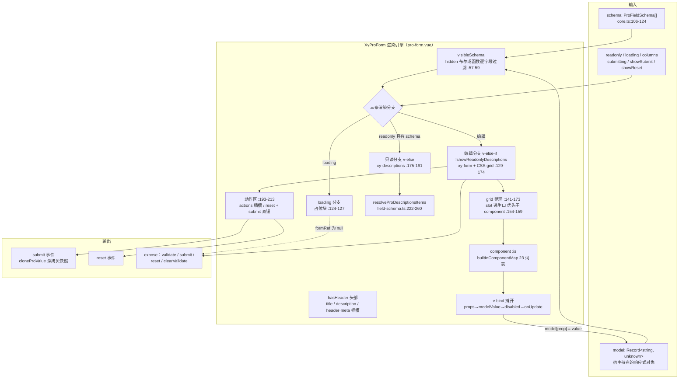
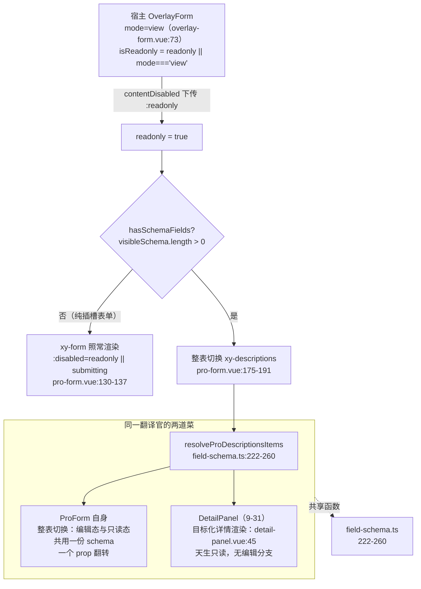

# 9-05 · ProForm：schema 驱动表单

> 本篇是 9 卷"增强层（pro-components）"的第五篇。9-02 拆了协议层 `core.ts`，9-03 拆了翻译官 `field-schema.ts`——一份 `ProFieldSchema` 声明凭什么同时驱动表单态、展示态、详情态三种形态，单个 `resolveProFieldXxx` 函数的机械已经逐个过堂。本篇往上抬一层，拆**装配车间**：`XyProForm`。它是增强层表单族的渲染引擎，9-06 到 9-10 的五个形态（overlay-form、dialog-form、drawer-form、steps-form、request-form）本质上都是它的容器变体——引擎只有一台，变的只是外壳。核心问题按大纲只有一句话——**Grid 布局与只读态整表切换**——但这句话里至少藏着四道题：schema 到基础组件的渲染管线长什么样、字段网格为什么自建 CSS grid 而不接 5-16/5-17 栅格的水、只读态为什么是"整表切换成 Descriptions"而不是"一组禁用输入框"、提交动作为什么要 validate 前置加深拷贝快照。本篇全部给实码定论，并为 9-06《OverlayForm：多态容器》埋好引线。

接到题目先复述一遍目标，防止写偏：`XyProForm` 要解决的问题，是"中后台表单的最后一公里"。基础层 6-17/6-18 给了 `xy-form` 校验编排和 `xy-form-item` 消息链路，但每写一个页面，你仍要手写 N 个 `xy-form-item`、对齐 N 次 label 宽度、重复写一遍"提交前 validate、提交中禁用、重置后清校验"的动作区编排。ProForm 把这三件事收进一个组件：字段可以用 `schema` 数组声明（也可以退回默认插槽手写），布局用 `columns` 一个数字声明，动作区用 `showSubmit`/`showReset` 两个布尔声明；再往外送两份礼物——`readonly` 一个 prop 把整张表切进只读详情渲染，`loading` 一个 prop 把表单体整个换成占位。

先交代体量，给全文一个标尺：`pro-form` 组件目录四个文件加起来 323 行——`src/pro-form.ts` 31 行（纯类型）、`src/pro-form.vue` 216 行、`index.ts` 9 行、`__tests__/pro-form.spec.ts` 67 行；它还共享两份基础设施：9-03 拆过的 `field-schema.ts`（260 行，八个渲染函数）和 9-02 拆过的 `core.ts` 的字段法域。216 行的 vue 文件里，脚本段 108 行、模板段 107 行——脚本里有一半是 computed 和两个动作函数，逻辑密度不高；真正值钱的是**三条渲染分支的编排**：loading 占位、schema 网格编辑态、descriptions 只读态，外加一个动作区。本篇就按这条主线走。

## 一、引擎与宿主：谁在消费这台渲染机

先看这台引擎在增强层里的位置。`XyProForm` 从 `pro-form/index.ts:7` 经 `withInstall` 挂上安装器，值导出走 `exports.ts:2`，类型导出走根入口 `index.ts:13-15`（只放 `ProFormProps` / `ProFormInstance` 两个主类型，符合 9-01 立下的根入口边界）。直接 `import { XyProForm }` 它的增强组件有四个：

```text
packages/pro-components/overlay-form/src/overlay-form.vue:12   （9-06/9-07/9-08 三形态的宿主）
packages/pro-components/steps-form/src/steps-form.vue          （9-09 分步表单）
packages/pro-components/request-form/src/request-form.vue:3    （9-10 请求表单）
packages/pro-components/table-filter-drawer/src/table-filter-drawer.vue （9-28 筛选抽屉）
```

注意 dialog-form 和 drawer-form **不直接**消费 ProForm——它们是 overlay-form 的特化薄壳（9-07/9-08 的主题），pro-form 的水只流到 overlay-form 那一层。这张消费清单本身就是"引擎论"的第一份证据：五篇容器变体文章，共享同一个 `formRef`、同一套 `ProFormProps` 转发、同一条 schema 渲染管线。

引擎对宿主暴露的契约面浓缩在 31 行的类型文件里（`packages/pro-components/pro-form/src/pro-form.ts:1-31`，全文照录）：

```ts
import type { ComponentSize } from "xiaoye-primitives";
import type { DescriptionsProps, FormProp, FormRules } from "xiaoye-components";
import type { ProFieldSchema } from "../../core";

export interface ProFormProps {
  title?: string;
  description?: string;
  model: Record<string, unknown>;
  schema?: ProFieldSchema[];
  rules?: FormRules;
  labelWidth?: string | number;
  labelPosition?: "left" | "top";
  size?: ComponentSize;
  columns?: number;
  loading?: boolean;
  readonly?: boolean;
  readonlyDescriptionsProps?: Omit<DescriptionsProps, "items" | "title" | "extra">;
  submitting?: boolean;
  submitText?: string;
  resetText?: string;
  showSubmit?: boolean;
  showReset?: boolean;
}

export interface ProFormInstance {
  validate: () => Promise<boolean>;
  submit: () => Promise<boolean>;
  reset: (prop?: FormProp | FormProp[]) => void;
  clearValidate: (prop?: FormProp | FormProp[]) => void;
}
```

20 个 props、4 个实例方法，`model` 是唯一没有 `?` 的必填项——这个签名本身就是第五节"模型归宿主所有"的类型化宣言。`readonlyDescriptionsProps` 的 `Omit` 把 `items/title/extra` 三键剔出配置面：`items` 由 schema 翻译而来，`title/extra` 由引擎自己的 header 负责，宿主可配的只剩 `column/labelWidth/direction` 这些"只读态长相"键。类型先行封死越界，比运行时校验便宜得多。

dialog 分支的内嵌段与 drawer 分支高度同构（`overlay-form.vue:282-298`），差别集中在浮层尺寸默认值与下面这段要说的 loading 传递位置：

```vue
    <xy-pro-form
      v-if="contentVisible"
      ref="formRef"
      :model="props.model"
      :schema="props.schema"
      :rules="props.rules"
      :label-width="props.labelWidth"
      :label-position="props.labelPosition"
      :size="props.size"
      :loading="props.loading"
      :readonly="isReadonly"
      :submitting="props.submitting"
      :show-reset="false"
      :show-submit="false"
    >
      <slot v-if="$slots.default" :model="props.model" :readonly="isReadonly" />
    </xy-pro-form>
```

一个有意思的不对称：drawer 分支的 loading 占位是宿主自己渲染的（202-205 行，引擎根本没挂载），dialog 分支却把 `:loading` 直传给引擎、由引擎的 loading 分支渲染占位。同一家容器，两种 loading 落法，外加只读入参的差别——drawer 传 `contentDisabled`（提交中也算只读），dialog 传 `isReadonly`（提交禁用走 `submitting` 单独通道）。drawer 抽屉有固定的展开动画，宿主接管占位可以让加载态与动画并行；dialog 是即时内容区，交给引擎更省事。9-06 会把这对差异当作容器层的正式议题。

宿主是怎么把引擎嵌进容器的？看 overlay-form drawer 分支的内嵌段（`packages/pro-components/overlay-form/src/overlay-form.vue:200-238`）：

```vue
    <div :class="[ns.base.value, ns.is('loading', props.loading)]">
      <template v-if="contentVisible">
        <div v-if="props.loading" class="xy-overlay-form__loading">
          <strong>正在准备表单内容</strong>
          <span>基础数据就绪后会恢复编辑区。</span>
        </div>
        <xy-pro-form
          v-else-if="hasSchema"
          ref="formRef"
          :model="props.model"
          :schema="props.schema"
          :rules="props.rules"
          :label-width="props.labelWidth"
          :label-position="props.labelPosition"
          :size="props.size"
          :readonly="contentDisabled"
          :show-submit="false"
          :show-reset="false"
          class="xy-overlay-form__form"
        >
          <template v-for="(_, name) in formSlots" :key="name" #[name]="slotProps">
            <slot :name="name" v-bind="slotProps ?? {}" />
          </template>
        </xy-pro-form>
        <xy-form
          v-else
          ref="formRef"
          :model="props.model"
          :rules="props.rules"
          :label-width="props.labelWidth"
          :label-position="props.labelPosition"
          :size="props.size"
          :disabled="contentDisabled"
          class="xy-overlay-form__form"
        >
          <div class="xy-overlay-form__content">
            <slot :model="props.model" :mode="props.mode" :readonly="isReadonly" />
          </div>
        </xy-form>
      </template>
    </div>
```

这一段有三处宿主契约值得先立起来，后面三节都会回扣：

**其一，`hasSchema` 是引擎的点火钥匙**（`overlay-form.vue:79`，`computed(() => (props.schema?.length ?? 0) > 0)`）。schema 非空走 `xy-pro-form`，为空退回裸 `xy-form` + 默认插槽——容器给引擎留了"不点火"的出口，纯手写表单不必被 schema 协议绑架。

**其二，动作区收归容器**。宿主显式传 `:show-submit="false" :show-reset="false"`（216-217 行），把 ProForm 的 footer 整个关掉，动作按钮放在 drawer 的 `#footer` 具名插槽里自己渲染（242-268 行）。原因很直接：浮层容器的按钮要和"取消/关闭"同排、要吃 `mode` 的文案映射（`create: "创建"`、`edit: "保存"`、`view: ""`，67-71 行），ProForm 内置的"重置 + 保存"双钮编排对浮层场景是多余的。引擎提供动作区，容器有权不用。

**其三，只读判定上移**。宿主传给引擎的不是裸 `props.readonly`，而是 `contentDisabled`（215 行）——`computed(() => isReadonly.value || props.submitting)`（77 行），其中 `isReadonly = readonly || mode === "view"`（73 行）。`mode="view"` 这个容器级语义，最终翻译成引擎级 `readonly`，再由引擎翻译成 descriptions 整表切换。三段翻译链，正是第四节的主题。

把"schema 进、视图出"的完整管线画成全景图，本篇的所有章节都挂在这张图上：



三条分支的优先级在模板上是严格串行的：`v-if="props.loading"`（124 行）→ `v-else-if="!showReadonlyDescriptions"`（130 行）→ `v-else`（175 行的 descriptions）。loading 压过一切，只读压过编辑，这个顺序决定了"loading 中的只读表显示占位而不是详情"——先等数据，再谈只读。

## 二、一条渲染管线走完 17 个 schema 成员

引擎的本体是编辑分支里那个 33 行的 grid 循环（`pro-form.vue:141-173`）。schema 进来后要经过五道工序才能变成 DOM，逐一过堂。

**第一道，隐藏过滤。** `visibleSchema`（57-59 行）对每个字段跑 `resolveProFieldHidden`——布尔直接用，函数传 `props.model` 求值（`field-schema.ts:83-88`）。注意过滤发生在 computed 里，依赖了 `props.model`，所以 `hidden: (model) => !model.needInvoice` 这类"随输入联动显隐"的字段，每次 model 变化都会重算——声明式联动的运行时成本，就是这条 computed 的重算。被过滤掉的字段同时从 grid 布局和只读详情里消失（第四节会看到只读侧 228 行再过滤一次，两道闸门各自把关）。

**第二道，网格展开。** 每个 schema 项包一层 `<div class="xy-pro-form__field" :style="{ gridColumn: span ${resolveProFieldSpan(field, normalizedColumns)} }">`（142-146 行）。`resolveProFieldSpan`（`field-schema.ts:154-160`）把声明的 span 钳制在 `[1, columns]` 区间——`columns: 3` 时传 `span: 5` 得到 3，传 `0.5` 取整得 1。钳制是必须的：CSS grid 里 `grid-column: span 5` 超过实际列数不会报错，但会产生隐式网格行，布局直接塌掉。`normalizedColumns` 本身也过一遍 `Math.max(1, Math.floor(props.columns))`（56 行），负数、小数、0 一次归一。

**第三道，插槽逃生口判定。** `field.slot && slots[field.slot]` 成立时，整个 `<component>` 被短路，改渲染同名作用域插槽，入参是 `{ field, model }`（154-159 行）。逃生口的优先级**高于**内置组件映射，这是"schema 管八成、slot 管两成"的分工线——第六节展开这个权衡。

**第四道，组件解析与属性摊开。** 这是管线的心脏，把循环体的 154-170 行单独摘出来看：

```vue
            <slot
              v-if="field.slot && slots[field.slot]"
              :name="field.slot"
              :field="field"
              :model="props.model"
            />
            <component
              :is="resolveProFieldComponent(field)"
              v-else
              v-bind="{
                ...resolveProFieldProps(field),
                modelValue: props.model[field.prop],
                disabled: resolveProFieldDisabled(field, props.model),
                'onUpdate:modelValue': (value: unknown) =>
                  updateProModelValue(props.model, field.prop, value)
              }"
            />
```

`resolveProFieldComponent`（`field-schema.ts:97-103`）查 `builtInComponentMap`——9-03 讲过的 23 个字符串词表（`core.ts:77-100`）到 23 个基础组件的映射；查不到**回退 XyInput**，而不是报错。这个回退是个性格鲜明的决定：schema 写错组件名的后果是"全部字段变输入框"，静默但可查（视觉上一眼看出），换来的是"词表扩档不用改消费方"——初版词表只有 9 个成员（9-02 考古过），扩到 23 个的过程中没有任何 ProForm 侧代码变动。词表本体值得整段读一遍（`field-schema.ts:31-55`）：

```ts
const builtInComponentMap: Record<string, Component> = {
  input: XyInput,
  textarea: XyInput,
  select: XySelect,
  checkbox: XyCheckbox,
  "checkbox-group": XyCheckboxGroup,
  radio: XyRadioGroup,
  "radio-button": XyRadioGroup,
  "radio-group": XyRadioGroup,
  cascader: XyCascader,
  "date-picker": XyDatePicker,
  "time-picker": XyTimePicker,
  "time-select": XyTimeSelect,
  "input-number": XyInputNumber,
  switch: XySwitch,
  "auto-complete": XyAutoComplete,
  transfer: XyTransfer,
  avatar: XyAvatar,
  image: XyImage,
  progress: XyProgress,
  tag: XyTag,
  timeline: XyTimeline,
  tree: XyTree,
  steps: XySteps
};
```

23 个键是 16 个编辑类加 7 个展示类（avatar/image/progress/tag/timeline/tree/steps）——展示类组件出现在"表单"词表里并不违和，它们是只读分支的候补渲染件（第四节翻译表里 `resolveProFieldValueType` 会把 `tag`/`avatar`/`image`/`progress` 映射成对应的 valueType），同时编辑态下声明 `component: "tag"` 也合法——descriptions 之外的展示诉求（比如某个字段在编辑表单里就要渲染成标签）直接复用同一张表。一张表喂两条分支，词表的复用密度比它的长度更值得注意。

`v-bind` 对象的摊开顺序是这段的精髓。`resolveProFieldProps`（`field-schema.ts:126-152`）先把 `componentProps` 整包展开、补上推导的 placeholder 和 options：

```ts
export function resolveProFieldProps(field: ProFieldSchema) {
  const componentName = field.component ?? "input";
  const nextProps = {
    ...field.componentProps,
    placeholder: resolveProFieldPlaceholder(field)
  } as Record<string, unknown>;

  if (
    componentName === "select" ||
    componentName === "auto-complete" ||
    componentName === "checkbox-group" ||
    componentName === "radio-group"
  ) {
    nextProps.options = field.options ?? [];
  }

  if (componentName === "textarea") {
    nextProps.type = "textarea";
  }

  if (componentName === "radio-button") {
    nextProps.options = field.options ?? [];
    nextProps.type = "button";
  }

  return nextProps;
}
```

三个 `if` 是词表到组件属性的"形变"层：`textarea` 不是独立组件而是 input 的 `type`，`radio-button` 是 radio-group 加 `type: "button"`——schema 词表按"业务语义"命名，组件属性按"实现"命名，中间这层翻译让 schema 声明者永远不需要知道 input 和 textarea 在实现层是同一个组件。再看外层的摊开顺序：`...resolveProFieldProps(field)` 在前，`modelValue`、`disabled`、`onUpdate:modelValue` 在后——**v-bind 对象字面量里后写的键覆盖先写的**，所以哪怕用户在 `componentProps` 里塞了 `disabled`，也会被 `resolveProFieldDisabled(field, model)` 的求值结果覆盖（166 行）。这是刻意的：联动态的 disabled 是引擎的职责，用户想静态禁用应该写在 schema 的 `disabled` 字段里（布尔或函数），而不是混进 `componentProps`。同理 `modelValue` 覆盖一切——受控权在引擎手里，`componentProps` 里写 `modelValue` 是无效的。

**第五道，模型回写。** `onUpdate:modelValue` 直连 `updateProModelValue`（`field-schema.ts:162-168`）：

```ts
export function updateProModelValue(
  model: Record<string, unknown>,
  prop: string,
  value: unknown
) {
  model[prop] = value;
}
```

五行函数，背后是 ProForm 最根本的一个架构决定：**模型归宿主所有**。`ProFormProps.model` 是必填的 `Record<string, unknown>`（`pro-form.ts:8`），没有 `update:model` 事件、没有内部副本——引擎拿到的就是宿主 `reactive()` 对象的引用，直接原地赋值。对比基础层 input 的受控/非受控双模（4-04 拆过）：输入类组件必须支持 `v-model` 的单向数据流，因为它们可能被任意场景复用；而 ProForm 是页面级编排件，它的 model 天然就是页面状态的一部分，拷贝一份再同步回去只会制造两个真相。宿主因此获得了完全的模型主权：在任意 `@submit` 之外的时刻改 model，表单即时响应；schema 的 `hidden`/`disabled` 函数读到的也是同一份真相。代价是深拷贝的责任也归了引擎——`@submit` 派发的不能是这个引用（宿主一改，快照就漂了），所以有了第五节的 `cloneProValue`。

还有一个细节藏在读值侧：只读分支的取值走 `readProFieldValue`（`field-schema.ts:170-181`），支持 `"a.b.c"` 点路径；编辑分支的 `props.model[field.prop]`（165 行）却只支持平铺 key。**点路径只读、平铺读写**的不对称，本质是"读可以容错降级（读不到就 undefined），写不能猜（往 `a.b` 写值得先保证 `a` 存在）"——与其在引擎里实现路径写入的中间对象创建，不如把编辑态的 prop 约束在平铺 key，这是 9-03 埋过的一笔，本篇从引擎消费视角再确认一次。

## 三、Grid 布局选型：自建 CSS grid，不接栅格的水

现在回答本篇的第一个核心问题。基础层明明有 5-16/5-17 拆过的 `xy-row`/`xy-col`——24 栅格制、五档响应式断点、3020 行静态展开的 col.css——ProForm 为什么看都不看一眼，自己起了个 CSS grid？先立实码定论，布局一共三段：

```css
.xy-pro-form__body,
.xy-pro-form__grid {
  display: flex;
  flex-direction: column;
  gap: 16px;
}

.xy-pro-form__grid {
  display: grid;
}
```

`packages/theme/src/pro/pro-form.css:37-46`——外层留 flex（表单项之间的纵向 gap），`__grid` 用后写的 `display: grid` 覆盖。列模板不在 CSS 里，在 JS 的 computed 里（`pro-form.vue:60-62`）：

```ts
const normalizedColumns = computed(() => Math.max(1, Math.floor(props.columns)));
const visibleSchema = computed(() =>
  props.schema.filter((field) => !resolveProFieldHidden(field, props.model))
);
const gridStyle = computed(() => ({
  gridTemplateColumns: `repeat(${normalizedColumns.value}, minmax(0, 1fr))`
}));
```

模板上再配每个字段的 `:style="{ gridColumn: `span ${resolveProFieldSpan(field, normalizedColumns)}` }"`（146 行）。三段合起来：`repeat(2, minmax(0, 1fr))` 的等宽网格，字段凭 `grid-column: span N` 占格。git 考古显示这个选型是**一次定型的**——初版（a32e399，2026-03-30）179 行的 pro-form.vue 里，`gridStyle`、`gridColumn span` 与现版逐字相同，从未有过 row/col 版本。选型不是演化出来的，是出生时就想清楚了。为什么？三个理由。

**理由一：语义不匹配。** 24 栅格的 span 是"视口宽度的二十四分之几"，服务的对象是自由排版；ProForm 的 span 是"在 columns 列网格里占几列"，服务的对象是表单字段的宽窄档位。后者有天然的上界——列数就是 `columns`，所以 `resolveProFieldSpan` 才敢做 `[1, columns]` 的硬钳制；前者没有上界（24 格内任意组合 + offset/push/pull 三个自由度）。拿 24 栅格装表单，要么浪费 22 档（表单里几乎只会用 24、12、8、6 四种 span），要么被 offset 系列诱惑着做出不齐整的表单。antd 的 Form 用 `Row/Col` 包字段，那是历史包袱——它的 ProForm 一样要为"span 要不要乘 24/columns"做换算；CSS grid 的 `repeat(N, minmax(0, 1fr))` 让"列数"成为一等公民，`columns` 这个 prop 才可能只有一个数字那么薄。

**理由二：结构成本不匹配。** row/col 方案要求每个字段套两层组件：`xy-row`（provide gutter）+ `xy-col`（inject gutter、算 padding、拼类名）。col.vue 是 99 行组件 + 3020 行 CSS 的大家伙，为的是断点响应式和 offset/push/pull 四件套。ProForm 的字段循环已经是 `v-for` 生成的一层 div，套 row/col 意味着 v-for 里要手动分组（每 columns 个字段一行）或者放弃"一行流式换行"——grid 天然解决换行（`grid-auto-flow: row` 默认行为），一个容器搞定。gutter 下发那根 provide 水管（5-16 的主题）对表单更是无用功：表单字段间的间距是 `gap: 16px` 一行 CSS，不需要 Row 的负 margin 抵消魔法。

**理由三：`minmax(0, 1fr)` 是为表单内容定制的。** 写 `repeat(2, 1fr)` 的话，列的隐式最小宽度是 `auto`——一个超长的不可断字符串（URL、哈希值）会把所在列撑爆，把旁边列挤扁。`minmax(0, 1fr)` 把最小宽度钉死为 0，列宽严格等分，长内容在字段内部滚动或换行。这是 CSS grid 圈的著名细节，用在这里恰好治表单的病：表单字段值是用户不可控的，布局必须不可击穿。这个细节 row/col 的百分比宽度方案同样要处理（col.css 里 `max-width` 那套），但 grid 一行就写完了。

代价也要如实记：**这套网格没有响应式**。`columns` 是静态数字，没有 `columns: { lg: 3, md: 2, xs: 1 }` 的断点映射，`gridStyle` 里也没有 `@media`。对比 col.css 五个 `@media` 窗口各 100 块的响应式矩阵（5-17 的主题），ProForm 的网格在窄屏上仍是两列。这是一个有意识的省略：浮层宿主（drawer 560px、dialog 720px）宽度本来就固定，页面级宿主真的需要响应式时，`columns` 是个普通 prop，宿主可以自己按断点传值。把响应式留给容器，引擎保持一个数字的单纯——这是本篇第一处设计权衡的完整答案：**自建 grid 放弃了响应式和栅格词汇，换来了 columns/span 的语义直给、一层 DOM 的结构成本、和不可击穿的等分布局。**

## 四、只读态整表切换：一条渲染分支，不是一组禁用输入框

第二个核心问题。先考古：只读态在 ProForm 里换过一次实现。初版（a32e399）里 `readonly` 的语义是"全部禁用"——`<xy-form :disabled="props.readonly || props.submitting">`，所有输入框灰掉，值还在输入框里。323e9a7（2026-04-21，与 core.ts 展示协议 valueType/formatter/render/renderHTML/emptyValue 同一次"宪法增补"）把它换成了**整表切换**：`readonly` 且 schema 非空时，整个 `xy-form` 不渲染，换上 `xy-descriptions`。现版的分支核心（`pro-form.vue:66-68`）：

```ts
const hasSchemaFields = computed(() => visibleSchema.value.length > 0);
const showReadonlyDescriptions = computed(() => props.readonly && hasSchemaFields.value);
const readonlyItems = computed(() => resolveProDescriptionsItems(visibleSchema.value, props.model));
```

三个 computed 各管一件事，先看这两个条件合取的深意。`readonly && hasSchemaFields`——**两个条件缺一不可**：

- 只读但 schema 为空（纯默认插槽模式）：字段是宿主手写的，引擎没有词汇把它们翻译成 descriptions，只能退回禁用方案——xy-form 照常渲染，`:disabled="props.readonly || props.submitting"`（137 行）兜住。此时 readonly 的语义是"这一张表只准看"。
- 有 schema 但没开 readonly：descriptions 分支根本不参与，纯编辑态。
- 两者同时成立：整表切换。

也就是说 `showReadonlyDescriptions` 是"引擎有词汇且宿主要求只读"的交集——词汇（schema）是翻译的前提，这个合取把"禁用兜底"和"翻译升级"的边界画得清清楚楚。

再看切换后的渲染目标（`pro-form.vue:175-191`）：

```vue
    <xy-descriptions
      v-else
      class="xy-pro-form__descriptions"
      border
      :column="props.readonlyDescriptionsProps?.column ?? normalizedColumns"
      :label-width="props.readonlyDescriptionsProps?.labelWidth ?? props.labelWidth"
      :direction="
        props.readonlyDescriptionsProps?.direction ??
        (props.labelPosition === 'left' ? 'horizontal' : 'vertical')
      "
      v-bind="props.readonlyDescriptionsProps"
      :items="readonlyItems"
    >
      <template v-for="(_, name) in descriptionSlots" :key="name" #[name]="slotProps">
        <slot :name="name" v-bind="slotProps ?? {}" />
      </template>
    </xy-descriptions>
```

三个绑定都带默认值推导：列数继承编辑态的 `columns`，label 宽度继承 `labelWidth`，direction 从 `labelPosition` 推导（left 横排、top 竖排）——**只读态不是另一个组件的另一种长相，而是同一张表的另一个视角**，编辑/只读切换时视觉骨架不变。`v-bind` 放在 `:column` 等显式绑定之后（185 行），宿主用 `readonlyDescriptionsProps` 可以覆盖一切推导。`descriptionSlots`（70-79 行）把 `actions/header/meta` 三个引擎自有插槽剥离后，其余插槽原样透传给 descriptions（188-190 行）——schema 字段声明了 `slot: "ownerTip"` 时，编辑态它是字段插槽，只读态它变成 descriptions 的 `defaultSlot` 桥（第四节翻译表里的 `defaultSlot: field.slot`），一个插槽名两种落点。

值翻译的重活全部委托给 9-03 拆过的 `resolveProDescriptionsItems`（`field-schema.ts:222-260`），翻译官全文照录，再从引擎消费视角记一笔翻译账：

```ts
export function resolveProDescriptionsItems(
  schema: ProFieldSchema[],
  model: Record<string, unknown>,
  _rowIndex = 0
): DescriptionsDataItem[] {
  return schema
    .filter((field) => !resolveProFieldHidden(field, model))
    .map((field) => ({
      label: field.label,
      value: readProFieldValue(model, field.prop),
      row: model,
      valueType: resolveProFieldValueType(field),
      options: field.options,
      formatter: field.formatter
        ? (_row, _column, value, nextRowIndex) =>
            field.formatter?.(value, createProFieldDisplayContext(model, field, nextRowIndex))
        : undefined,
      render: field.render
        ? (value, context) =>
            field.render?.(
              value,
              createProFieldDisplayContext(context.row, field, context.rowIndex)
            )
        : undefined,
      renderHTML: field.renderHTML
        ? (value, context) =>
            field.renderHTML?.(
              value,
              createProFieldDisplayContext(context.row, field, context.rowIndex)
            ) ?? ""
        : undefined,
      emptyValue: field.emptyValue,
      span: field.span,
      defaultSlot: field.slot,
      className: undefined,
      labelClassName: undefined,
      contentClassName: undefined
    }));
}
```

| schema 侧（ProFieldSchema） | descriptions 侧（DescriptionsDataItem） | 翻译动作 |
| --- | --- | --- |
| `prop: "a.b"` 点路径 | `value` | `readProFieldValue` 逐段求值（231 行） |
| `hidden` 布尔或函数 | （无对应） | 入口再过滤一次（228 行） |
| `valueType` / `component` | `valueType` | `resolveProFieldValueType`：显式声明优先，否则查 component→valueType 映射表（233 行） |
| `formatter(value, context)` | `formatter(row, column, value, rowIndex)` | 闭包重排参数顺序，注入 `createProFieldDisplayContext`（235-238 行） |
| `render` / `renderHTML` | 同名不同签名 | 同上重排（239-252 行） |
| `options` | `options` | 直传，`tag` 型 valueType 靠它出语义色 |
| `slot` | `defaultSlot` | 改名桥接（256 行） |

测试把这条链钉死了（`packages/pro-components/pro-form/__tests__/pro-form.spec.ts:22-66`）：

```ts
  it("schema + readonly 时切换为 descriptions 只读展示", () => {
    const wrapper = mount(XyProForm, {
      props: {
        title: "成员信息",
        readonly: true,
        showSubmit: false,
        showReset: false,
        model: {
          owner: "小叶",
          status: "reviewing",
          budget: 128000.5
        },
        schema: [
          {
            prop: "owner",
            label: "负责人"
          },
          {
            prop: "status",
            label: "状态",
            valueType: "tag",
            options: [
              {
                label: "审核中",
                value: "reviewing",
                status: "warning"
              }
            ]
          },
          {
            prop: "budget",
            label: "预算",
            valueType: "money"
          }
        ]
      }
    });

    expect(wrapper.find(".xy-descriptions").exists()).toBe(true);
    expect(wrapper.find(".xy-form").exists()).toBe(false);
    expect(wrapper.text()).toContain("负责人");
    expect(wrapper.text()).toContain("小叶");
    expect(wrapper.text()).toContain("审核中");
    expect(wrapper.text()).toContain("¥128,000.50");
  });
```

`xy-form` 不存在（61 行）证明是整表切换而非隐藏；`审核中` 证明 valueType tag + options 的语义色渲染走通；`¥128,000.50` 证明 money 值类型的格式化走通。还有一个反向细节：`visibleSchema` 为空时 `hasSchemaFields` 为 false，只读分支整体失效——**空 schema 的只读表不是空 descriptions，而是禁用的插槽表单**，两个测试用例正好各钉住一个分支。

引擎层的用例钉住了切换本身，宿主层的用例则钉住了"容器语义翻译成引擎 prop"的那条链——overlay-form 的 `mode="view"` 用例（`packages/pro-components/overlay-form/__tests__/overlay-form.spec.ts:190-231`）：

```ts
  it("mode=view 且使用 schema 时切换为只读详情展示", async () => {
    const wrapper = mount(XyOverlayForm, {
      props: {
        open: true,
        container: "drawer",
        drawerProps: {
          appendToBody: false
        },
        mode: "view",
        model: {
          owner: "小叶",
          status: "reviewing"
        },
        schema: [
          {
            prop: "owner",
            label: "负责人"
          },
          {
            prop: "status",
            label: "状态",
            valueType: "tag",
            options: [
              {
                label: "审核中",
                value: "reviewing",
                status: "warning"
              }
            ]
          }
        ]
      }
    });

    await nextTick();

    expect(wrapper.find(".xy-descriptions").exists()).toBe(true);
    expect(wrapper.text()).toContain("负责人");
    expect(wrapper.text()).toContain("小叶");
    expect(wrapper.text()).toContain("审核中");
    expect(wrapper.text()).not.toContain("保存");
  });
```

用例没有传 `readonly`，只传了 `mode: "view"`——断言 descriptions 出现，证明 `mode=view → isReadonly → contentDisabled → :readonly` 的四段翻译链在容器层真实生效；`not.toContain("保存")` 同时证明 `submitTextMap.view = ""`（69-71 行）把提交按钮的文案清空、`showSubmitAction` 随之关闭——查看态在容器层连"保存"两个字都不该有。文档示例把这条链再演示一遍（`apps/docs/examples/pro/pro-form/readonly-schema.vue:39-49`）：

```vue
<template>
  <xy-pro-form
    title="方案详情"
    description="当页面进入查看态时，schema 会自动切成 Descriptions 只读渲染，而不是展示一组禁用输入框。"
    :model="formModel"
    :schema="schema"
    readonly
    :show-submit="false"
    :show-reset="false"
  />
</template>
```

页面作者的全部工作量是两个 prop：`readonly` 翻转形态、`show-submit/show-reset` 关掉动作区——schema 和 model 一字不改地延续编辑态的声明（示例全文见 `apps/docs/examples/pro/pro-form/readonly-schema.vue:39-49`）。这正是"整表切换"与"再写一个详情组件"的差异所在：后者要求把 schema 翻译逻辑再实现一遍或复制一遍，前者只是同一台引擎换了一条渲染分支。

为什么这个切换值得作为核心问题单独立节？因为它回答了一个产品级问题：**查看态的用户要什么？** 禁用输入框方案给的是"一组灰掉的交互件"——鼠标放上去是 `not-allowed` 光标，长文本截断在 input 里无法完整阅读，复制经常带出输入框的格式，视觉重心仍是"表单"而非"信息"。descriptions 方案给的是"信息卡片"——label/value 成对、tag 有语义色、money 有格式、长文本自然换行。同一个问题还有第三种解法：为查看态单写一个详情页。三种解法在增强层里各有一席，画出分支与分工图：



右下角就是本篇第二处设计权衡——**只读切换放在哪一层**。答案分了三层各司其职：触发层在宿主（OverlayForm 把 `mode="view"` 翻译成 `contentDisabled`，77 行），执行层在引擎（ProForm 的渲染分支），词汇层在共享翻译官（`resolveProDescriptionsItems` 同时服务 ProForm 的整表切换和 DetailPanel 的天生只读——`detail-panel.vue:11` import、45 行调用，9-31 的 schema→descriptions 转换就是同一个函数）。"整表切换"与"目标化详情"不是竞争方案，而是同一翻译官的两道菜：ProForm 的只读态强调"**这张表进入查看模式**"（与编辑态同位切换，值、布局、插槽全部延续），DetailPanel 强调"**这是为查看而生的容器**"（无编辑分支、带时间线插槽和 actions）。至于为什么初版的禁用方案要被替换——禁用态语义上是"不可编辑"而非"只读展示"，屏幕阅读器会把 disabled input 读成不可用控件而非文本，长文本的可读性问题也前文说过了；整表切换把"看"和"改"在 DOM 层面彻底分开，是无障碍和可读性的双重正确。

## 五、提交编排：validate 前置、深拷贝快照与 loading 下的空转

引擎的另一条主线是动作。先看动作函数本体（`pro-form.vue:81-100`）：

```ts
async function submit() {
  if (props.readonly) {
    return false;
  }

  const valid = await formRef.value?.validate();

  if (!valid) {
    return false;
  }

  emit("submit", cloneProValue(props.model));
  return true;
}

function reset(prop?: FormProp | FormProp[]) {
  formRef.value?.resetFields(prop);
  formRef.value?.clearValidate(prop);
  emit("reset", cloneProValue(props.model));
}
```

`submit` 的三道闸门按序排列：**readonly 拦截 → validate 前置 → 深拷贝派发**。readonly 拦截放在最前面是整表切换的配套——descriptions 分支下 formRef 是 null，validate 会拿到 undefined，如果不拦截，readonly 表单的 `submit()` 会因为 `valid` 求值为 undefined 而返回 false，看似"碰巧正确"，实则依赖了 `!undefined === true` 的巧合；显式拦截把这个正确性从巧合变成契约。validate 前置（86 行）意味着**引擎的 submit 事件语义里已经内嵌了"校验通过"**——宿主的 `@submit` 处理器永远不必再写一遍校验，9-06 到 9-10 五个宿主的提交逻辑全部受益于这条前置。基础层 `xy-form` 的 `validate()`（`packages/components/form/src/form.vue:65-75`）并行收集全部字段的校验结果再 `every(Boolean)`，返回 `Promise<boolean>`——引擎拿布尔做闸门，错误展示由 form-item 的消息链路（6-18）完成，引擎不碰错误 UI。

派发的是 `cloneProValue(props.model)`，不是 model 本身。看实现（`field-schema.ts:72-81`）：

```ts
export function cloneProValue<T>(value: T): T {
  const rawValue =
    value !== null && typeof value === "object" ? (toRaw(value) as T) : value;

  if (typeof globalThis.structuredClone === "function") {
    return globalThis.structuredClone(rawValue);
  }

  return JSON.parse(JSON.stringify(rawValue)) as T;
}
```

两个细节：`toRaw` 先脱掉 Vue 的响应式 Proxy——`structuredClone` 无法克隆 Proxy，直接克隆会抛 DataCloneError；回退的 `JSON.parse(JSON.stringify())` 兜底老环境（顺手丢掉 undefined 和函数，对表单 model 是可接受的损耗）。第二节说过模型归宿主所有，派发快照是"所有权"的互补面：**宿主改自己的模型不影响已派发的事件载荷，事件载荷也不反向污染宿主模型**——如果派发引用，宿主在异步提交期间继续编辑，提交处理器手里的"快照"会悄悄变值，这是数据竞争的温床。reset 同理（99 行），重置后的 model 也以快照派发。

instance 层再往外暴露四个动作（102-107 行）：

```ts
defineExpose({
  validate: () => formRef.value?.validate() ?? Promise.resolve(true),
  submit,
  reset,
  clearValidate: (prop?: FormProp | FormProp[]) => formRef.value?.clearValidate(prop)
});
```

`validate` 的 `?? Promise.resolve(true)` 值得单独审：内部 form 不存在（loading 中、或只读整表切换后）时，validate 返回**通过**。对比宿主 overlay-form 的同名方法（`overlay-form.vue:117`）：

```ts
async function validate() {
  return formRef.value?.validate() ?? false;
}
```

引擎失败开放（无表单即无校验可言，返回 true 让流程继续），容器失败关闭（无表单时提交必须被挡住，返回 false）。同一个空引用，两层两种语义，都不是随手写的——引擎的 `validate` 单独暴露给页面调用（"帮我看看现在能不能提交"），loading 中表单还没就绪，返回 true 表示"没有校验在拦你"；容器的 `validate` 是 submit 链路的内部闸门，拿不到表单说明内容区根本没挂载，此时放行等于提交空数据。失败开放/失败关闭的选择标准，是**这个函数被调用时"表单不存在"意味着什么**。

loading 与动作区的关系还有一处静默设计：`v-if="props.loading"` 分支（124-127 行）渲染占位块时，整个 xy-form 不挂载，动作区 footer 却照常渲染（193 行）——占位表单旁边挂着可点的"保存"按钮，会不会误提交？不会：submit 走到 validate 时 `formRef.value?.validate()` 为 undefined，`!valid` 成立返回 false；且宿主层（如 overlay-form 的 121 行）也有 `props.loading` 前置拦截。双保险都是"逻辑正确"而非"按钮禁用"——这是可议的余量：视觉上按钮可点、点击后静默无效，体验上不如禁用反馈明确；但反过来看，动作区是 `actions` 插槽可完全替换的，引擎对按钮视觉的干预越少，插槽作者的自由度越大。动作区本体不长（`pro-form.vue:193-213`），值得整段过目：

```vue
    <div v-if="props.showReset || props.showSubmit || $slots.actions" class="xy-pro-form__footer">
      <slot
        name="actions"
        :model="props.model"
        :submit="submit"
        :reset="reset"
        :submitting="props.submitting"
      >
        <xy-button v-if="props.showReset && !props.readonly" @click="reset()">
          {{ props.resetText }}
        </xy-button>
        <xy-button
          v-if="props.showSubmit && !props.readonly"
          type="primary"
          :loading="props.submitting"
          @click="submit"
        >
          {{ props.submitText }}
        </xy-button>
      </slot>
    </div>
```

三个渲染条件构成一层"插槽优先"的窄门：外层 `v-if` 只要三个来源（showReset/showSubmit/actions 插槽）任一成立就渲染容器；默认内容里每个按钮再各自判 `!props.readonly`——只读态下即使宿主忘了传 `show-reset: false`，重置和保存按钮也会自动消失（第一节 OverlayForm 显式传 false 是双保险，不是唯一防线）。`actions` 插槽的入参把三个活体动作（`submit/reset/submitting`）和模型一起交给插槽作者——宿主可以加"暂存"按钮、可以调换顺序、可以接自己的异步逻辑，引擎只负责默认路径。`submitting` 态走的是另一条路：`:disabled="props.readonly || props.submitting"`（137 行）禁掉整表 + 提交按钮 `:loading="props.submitting"`（207 行）给出旋转反馈。**loading 静默拦截、submitting 显式反馈**，两个异步态用了两种表达，分界线是"用户还需要不需要操作"：loading 时表单未就绪无从操作，submitting 时表单可见但锁定。

## 六、收束：一台引擎的三张面孔，与 9-06 的容器

把 216 行收成三句话。**渲染引擎**：schema 经"隐藏过滤 → 网格展开 → 逃生口判定 → 组件解析 → 模型回写"五道工序变成编辑表单，23 词表查不到回退输入框，v-bind 摊开顺序保证受控权在引擎。**布局选型**：自建 CSS grid（`repeat(N, minmax(0, 1fr))` + `grid-column: span`），放弃 24 栅格的响应式与 offset 自由度，换回 `columns` 一个数字的语义直给和不可击穿的等分。**只读切换**：`readonly && hasSchemaFields` 合取触发整表切换，`resolveProDescriptionsItems` 一个函数同时喂饱 ProForm 的查看态和 DetailPanel 的天生只读；提交链路上 readonly 拦截、validate 前置、深拷贝快照、失败开放/失败关闭分层的四个决定，让五个容器宿主不必重复写一行提交编排。

最后做一次同位对比收束。Element Plus 的表单没有 schema 协议——`el-form-item` 逐个手写，布局交给 `el-row`/`el-col`，查看态没有官方方案（业务各写各的只读页）；ant-design 系的 ProForm 有完整 schema 协议（BetaSchemaForm 用 `columns` 声明字段，字段渲染收口在 ProField），但它的 schema 到只读的桥是另一个组件（ProDescriptions 各自吃一份配置），编辑与只读共享的是"协议"而不是"渲染分支"。xy 的 ProForm 走的是第三条路：schema 协议 + slot 逃生口 + **同一渲染体内的整表切换**——逃生口保证 schema 表达不了的字段（自定义控件、复杂联动）不会被协议锁死（`field.slot` 优先于 `<component>`，154-159 行）；整表切换保证只读态不用二次声明（同一份 schema、同一个 model、一个 readonly prop 翻转）。协议管共性、插槽管个性、分支管形态，三者在一台 216 行的引擎里各就各位。

下一篇 9-06《OverlayForm：多态容器》就从本篇埋下的宿主契约进入：`container` 一个 prop 怎么在 drawer/modal 两副皮囊之间切换（模板根部两个并列的浮层组件）、`mode="view"` 怎么翻译成 `contentDisabled` 再喂给引擎的 `readonly`、为什么 schema 为空时要退回裸 `xy-form`、以及 `resetOnClose`/`destroyOnClose` 这对关闭语义怎么编排本篇第五节那台 `formRef`。引擎已经点着了，下一篇看它怎么被装进抽屉和弹窗。

## 附：本篇引用源码清单（行号核对于当前工作区实态）

```text
packages/pro-components/pro-form/src/pro-form.ts            5-23 / 25-30
packages/pro-components/pro-form/src/pro-form.vue           28-45 / 47-50 / 56-68 / 70-79
                                                            81-100 / 102-107 / 111-127
                                                            129-174 / 141-173 / 154-170
                                                            175-191 / 193-213
packages/pro-components/pro-form/index.ts                   1-9
packages/pro-components/pro-form/__tests__/pro-form.spec.ts 7-20 / 22-66
packages/pro-components/field-schema.ts                     31-55 / 57-70 / 72-81 / 83-95
                                                            97-103 / 105-124 / 126-152
                                                            154-160 / 162-168 / 170-181 / 222-260
packages/pro-components/core.ts                             77-100 / 106-124
packages/theme/src/pro/pro-form.css                         1-9 / 37-46 / 61-63
packages/pro-components/overlay-form/src/overlay-form.vue   67-79 / 116-118 / 120-133 / 200-238
                                                            271-298
packages/pro-components/overlay-form/src/overlay-form.ts    14-34 / 36-40
packages/pro-components/overlay-form/__tests__/overlay-form.spec.ts 190-231
packages/pro-components/detail-panel/src/detail-panel.vue   11 / 45 / 103-114
packages/pro-components/dialog-form/src/dialog-form.vue     47-61
packages/pro-components/drawer-form/src/drawer-form.vue     47-61
packages/pro-components/steps-form/src/steps-form.vue       142-156 / 192-197
packages/pro-components/request-form/src/request-form.vue   125-141
packages/pro-components/index.ts                            13-15
packages/pro-components/exports.ts                          2
packages/components/form/src/form.vue                       65-75
packages/pro-components/steps-form/__tests__/steps-form.spec.ts 57（用例起始行）
packages/pro-components/style.css                           3
apps/docs/examples/pro/pro-form/basic.vue                   19-34
apps/docs/examples/pro/pro-form/readonly-schema.vue         39-49
apps/docs/pro-components/pro-form.md                        24-26 / 42-50
column/02-分卷大纲.md                                       157-165
column/5-16-Row-栅格的provide侧与gutter下发.md              （gutter provide 侧结论）
column/5-17-Col-响应式断点矩阵.md                           （col.css 3020 行静态展开结论）
```
