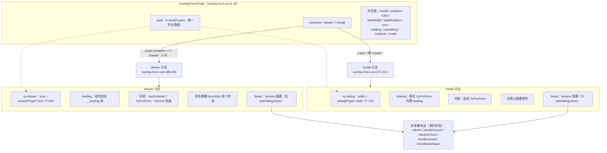
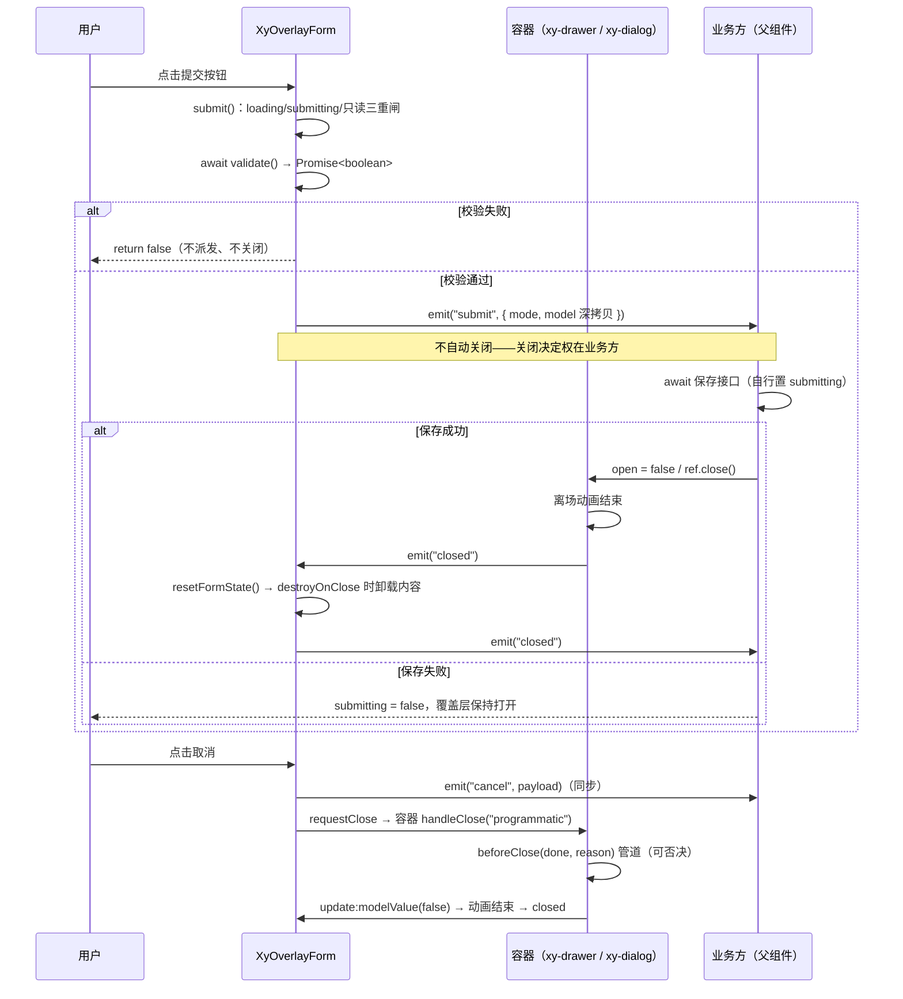
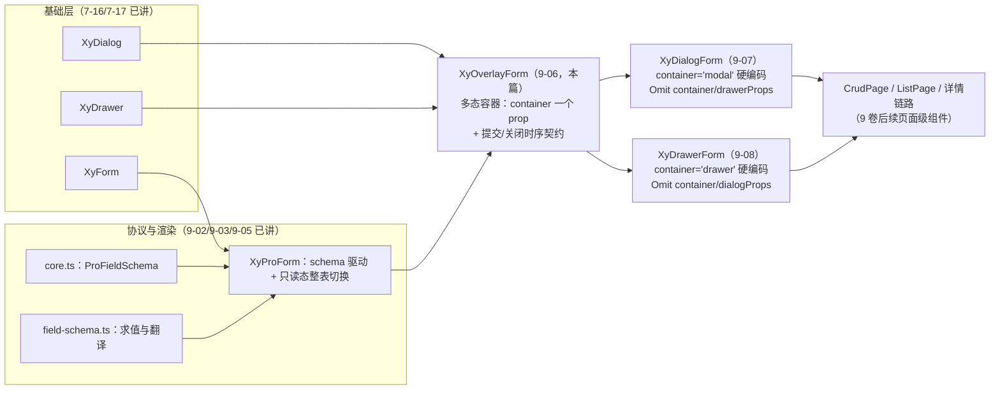

# 9-06 · OverlayForm：多态容器

> 本篇是 9 卷"增强层（pro-components）"的第六篇。9-05 讲完 ProForm——schema 驱动表单与"只读态整表切换"；本篇往上盖一层盖板：表单写好了，**放在哪个容器里打开？**后台系统里这个问题有个更俗的名字：这条编辑链路，走抽屉还是走弹窗？传统做法是业务方自己二选一，然后各写一遍 `<xy-drawer><xy-form>...</xy-form></xy-drawer>` 和 `<xy-dialog><xy-form>...</xy-form></xy-dialog>`——校验、提交、关闭、重置、卸载五件事全在业务里复制两份。OverlayForm 的回答是把这段收口进一个组件：`container="drawer" | "modal"` 一个 prop 切换容器形态，五件事只写一次。核心问题按大纲只有一句话——drawer/modal 一个 prop 切换的实现——但这句话里至少藏着四道题：切换的机械是什么（动态组件还是条件分支）、两个容器 props 面的差异（drawer 的 `size` vs dialog 的 `width`）怎么抹平、内嵌的 ProForm 与提交/关闭的时序怎么治理、以及它和 9-07/9-08 两个"特化薄壳"的分工逻辑。本篇全部给实码定论。

接到题目先复述一遍目标，防止写偏：`packages/pro-components/overlay-form/` 要回答的是"覆盖层表单"这一种交互心智的**容器无关化**——表单内容、校验规则、提交回调、关闭生命周期全部只声明一次，容器形态退化为一个可切换的选项。它不是 dialog 或 drawer 的替代品（那两个组件 7-16/7-17 已经在基础层讲透了），而是站在它们肩上的**组合层**：把 `XyDialog`/`XyDrawer` 的开合语义与 `XyProForm` 的 schema 渲染协议焊在一起，再把"提交成功之后谁负责关、关闭之后要不要重置、要不要卸载"这一串时序问题定成契约。9-02 引过它的 import 段（那条 `import type { ProFieldSchema } from "../../core"`，`src/overlay-form.ts:3`），9-05 引过它消费 ProForm 的渲染段；本篇把整个组件拆开看。

先交代体量，给全文一个标尺：`overlay-form` 四件套——`src/overlay-form.ts` 40 行（纯类型）、`src/overlay-form.vue` 322 行（视图 + 逻辑）、`index.ts` 17 行（安装入口）、`__tests__/overlay-form.spec.ts` 232 行（6 个用例），合计 411 行；外加 `packages/theme/src/pro/overlay-form.css` 39 行样式。也就是说，"抽屉表单 + 弹窗表单"两套业务样板的总价，在这座仓库里被压到了 400 行出头——而且这 400 行里真正属于"多态"的只有 `v-if`/`v-else` 两个切换点、各几行差异化绑定（`size` vs `width`、ref 与 class 后缀）和 1 个 prop。

## 一、类型层先行：40 行里定下的四份契约

`src/overlay-form.ts` 全文 40 行，零运行时，只有四个导出。先看全景：

```ts
import type { DialogProps, DrawerProps, FormRules } from "xiaoye-components";
import type { ComponentSize } from "xiaoye-primitives";
import type { ProFieldSchema } from "../../core";

export type OverlayFormContainer = "drawer" | "modal";
export const overlayFormModes = ["create", "edit", "view"] as const;
export type OverlayFormMode = (typeof overlayFormModes)[number];

export interface OverlayFormSubmitPayload {
  mode: OverlayFormMode;
  model: Record<string, unknown>;
}

export interface OverlayFormProps {
  open?: boolean;
  container?: OverlayFormContainer;
  mode?: OverlayFormMode;
  title?: string;
  model: Record<string, unknown>;
  schema?: ProFieldSchema[];
  rules?: FormRules;
  labelWidth?: string | number;
  labelPosition?: "left" | "top";
  size?: ComponentSize;
  loading?: boolean;
  submitting?: boolean;
  readonly?: boolean;
  submitText?: string;
  cancelText?: string;
  resetOnClose?: boolean;
  destroyOnClose?: boolean;
  drawerProps?: Omit<Partial<DrawerProps>, "modelValue" | "title">;
  dialogProps?: Omit<Partial<DialogProps>, "modelValue" | "title">;
}

export interface OverlayFormInstance {
  validate: () => Promise<boolean>;
  submit: () => Promise<boolean>;
  close: () => void;
}
```

（`packages/pro-components/overlay-form/src/overlay-form.ts:1-41`）

四份契约逐条过。**第一份是容器契约**：`OverlayFormContainer`（第 5 行）。注意它的取值词表是 `"drawer" | "modal"`，不是 `"drawer" | "dialog"`——这是词汇层的第一处考据。OverlayForm 在这里说的是**浮层形态**（4-05 浮层体系里的模态抽屉与模态弹窗），不是**组件名**；到了 9-07 的特化壳，词汇才换成组件词（`DialogForm`）。一个库同时用"形态词"描述多态选项、用"组件词"命名单态壳，两套词汇各司其职，`container` 因此不必与任何具体组件名绑死。

**第二份是载荷契约**：`OverlayFormSubmitPayload`（第 9-12 行）只有两个字段——`mode` 和 `model`。`mode` 让一个提交回调同时服务新建/编辑/查看三条链路；`model` 是表单数据的**深拷贝**（深拷贝的机械在第三节讲），提交出去的模型与组件内部的响应式模型断开引用，业务方在回调里改它不会反噬界面。这份载荷同时是 `submit` 和 `cancel` 的事件参数——取消也带当前模型，业务方可以拿它做"放弃修改确认"的 diff。

**第三份是 props 契约**：`OverlayFormProps`（第 14-34 行）18 个属性分四组。容器组（`open`/`container`/`title`）与内容组（`model`/`schema`/`rules`/`labelWidth`/`labelPosition`/`size`）是多态共享面；状态组（`loading`/`submitting`/`readonly`/`mode`）是与容器无关的生命周期闸门；透传组（`drawerProps`/`dialogProps`）是逃生舱。透传组里藏着本篇第一个值得停下来看的设计：

```ts
drawerProps?: Omit<Partial<DrawerProps>, "modelValue" | "title">;
dialogProps?: Omit<Partial<DialogProps>, "modelValue" | "title">;
```

（`src/overlay-form.ts:32-33`）

`Omit<Partial<DrawerProps>, "modelValue" | "title">`——逃生舱故意挖掉了两个洞：`modelValue` 与 `title`。挖掉的理由不是"防止使用者写错"，而是**所有权声明**：覆盖层的开合状态由 `open`（`v-model:open`）独占管理，标题由 `resolvedTitle`（按 mode 自动补全）独占管理，这两个字段的最终决定权在 OverlayForm，不在使用方。如果 `drawerProps` 里允许传 `title`，就会出现"组件按 mode 算好了标题、又被透传对象悄悄覆盖"的双头管理。`Omit` 在这里不是防御性编程，是把"谁拥有什么"写进类型签名——9-07 会看到，特化壳的 `Omit` 派生类型正是从这两个 Omit 顺流而下的。

**第四份是实例契约**：`OverlayFormInstance`（第 36-40 行）三个方法——`validate`、`submit`、`close`。注意 `close` 返回 `void` 而 `submit` 返回 `Promise<boolean>`：关闭是即时意图（容器层可能被 `beforeClose` 否决，但实例不承诺等待），提交是异步过程（校验要等 Promise 落定）。这组签名在第五节的时序治理里是主角。

## 二、实现定论：v-if 双分支，不是 `<component :is>`

"一个 prop 切换容器"最容易想到的机械是动态组件：把 `XyDialog`/`XyDrawer` 塞进 `<component :is>`，props 用联合类型分发。OverlayForm 的实码没有走这条路。先看切换架构的全貌，再解释为什么。



图上最关键的结构信息是：**分支只发生在模板层，脚本层没有任何分岔**。`submit`/`handleCancel`/`requestClose`/`handleClosed` 全是单份实现，两个分支共享同一套函数引用与同一个 `formRef`。这正是"多态容器"的实码含义——不是两套逻辑按容器分发，而是**一份逻辑 + 两个模板分支**。

模板层的切换点只有两处，先看 drawer 分支的开头：

```vue
<template>
  <xy-drawer
    v-if="props.container === 'drawer'"
    ref="drawerRef"
    v-bind="props.drawerProps"
    :model-value="props.open"
    :title="resolvedTitle"
    :size="props.drawerProps?.size ?? 560"
    class="xy-overlay-form xy-overlay-form--drawer"
    @update:model-value="emit('update:open', $event)"
    @closed="handleClosed"
  >
```

（`packages/pro-components/overlay-form/src/overlay-form.vue:188-198`）

以及 modal 分支的对应位置（`v-else`，即 `container === 'modal'` 时渲染）：

```vue
  <xy-dialog
    v-else
    ref="dialogRef"
    v-bind="props.dialogProps"
    :model-value="props.open"
    :title="resolvedTitle"
    :width="props.dialogProps?.width ?? 720"
    class="xy-overlay-form xy-overlay-form--modal"
    @update:model-value="emit('update:open', $event)"
    @closed="handleClosed"
  >
```

（`packages/pro-components/overlay-form/src/overlay-form.vue:271-280`）

### 权衡一：动态组件 vs 条件分支——类型安全买走了重复

为什么不用 `<component :is>`？算三笔账就清楚了。

第一笔，**props 面不相交**。drawer 的横向尺寸叫 `size`（`packages/components/drawer/src/drawer.ts:28`，`string | number`），dialog 的叫 `width`（`packages/components/dialog/src/dialog.ts:49`，`string | number`）。动态组件的 props 必须声明成两者的并集，类型检查器从此失去"你在 drawer 上写 width 会报错"的能力——并集成员里永远"合法"，错的用法编译通过。条件分支下，每个分支的绑定各自对着具体组件检查，`size` 写在 drawer 分支、`width` 写在 dialog 分支，写错位置是模板编译期就能被 vue-tsc 拦下的错误。

第二笔，**插槽面不相交**。drawer 有独立的 footer 模板结构，dialog 的 footer 行为细节与 `stickyFooter`/`bodyMaxHeight` 等属性耦合；两个分支的 footer 各写一份（242-268 行与 300-320 行），actions 插槽的入参可以按容器裁剪（这个裁剪在下一节会变成一处值得注意的不对称）。动态组件配合动态插槽几乎必然退化成 `v-if` 分支的插槽分法，等于绕一圈回到原地。

第三笔，**实例类型不相交**。脚本层要同时持有 `drawerRef`（`DrawerInstance`）和 `dialogRef`（`DialogInstance`）两个句柄——`requestClose` 要按容器调对应的 `handleClose`。动态组件的 ref 只有一个、类型只能 `any` 化；双分支下两个 ref 各自带类型（`src/overlay-form.vue:56-57`），`requestClose` 的分派是类型安全的。

代价同样明码标价：footer 的按钮组、`@update:model-value` 与 `@closed` 的接线在两个分支里各写一遍，322 行的模板里大约 50 行是"分岔带来的重复"。OverlayForm 的选择是**用类型安全买走重复**——重复的是声明，不重复的是行为；声明重复可以靠类型检查兜底，行为分叉却没有任何工具能兜底。这也解释了为什么全库对"动态组件"的使用很克制：整条链路上唯一一次 `<component :is>` 在 9-05 的 pro-form 里（`pro-form.vue:160-170`），那背后是 `builtInComponentMap`（`field-schema.ts:31`）之下"23 个字段组件共享同一份 props 协议"的**同类分发**；drawer 与 dialog 是协议不兼容的**异类**，同类归一，异类分叉，分叉比归一诚实。

## 三、props 抹平：三道工序把两个容器焊成一个心智

两个容器的 props 面差异不止 `size`/`width` 一处。OverlayForm 的抹平做了三道工序。

**工序一：默认值抹平**。`:size="props.drawerProps?.size ?? 560"`（195 行）与 `:width="props.dialogProps?.width ?? 720"`（277 行）——抽屉默认 560 宽，弹窗默认 720 宽。这两个数不是拍脑袋：抽屉偏列表侧栏场景（窄），弹窗偏表单居中场景（宽）。差异被吸收进组件默认值之后，使用方在两种容器下写同一份业务代码，不需要感知"换容器要换尺寸 prop"。

**工序二：所有权抹平（v-bind 顺序）**。Vue 3 中 `v-bind="obj"` 与独立属性同时存在时，**按书写顺序后者覆盖前者**。OverlayForm 把 `v-bind="props.drawerProps"` 写在 192 行、独立绑定写在 193-198 行——即使逃生舱里混进了与显式绑定同名的键，胜出的一定是显式绑定。加上类型层已经 Omit 掉 `modelValue`/`title`，双保险之下：开合状态、标题、尺寸三个关键字段的覆盖路径全部收敛为一条，且每条都有默认值。

**工序三：状态语义抹平**。`title` 进来后不直通容器，而是先过 `resolvedTitle`：

```ts
const props = withDefaults(defineProps<OverlayFormProps>(), {
  open: false,
  container: "drawer",
  mode: "create",
  title: "",
  schema: () => [],
  rules: () => ({}),
  labelWidth: "112px",
  labelPosition: "top",
  size: "md",
  loading: false,
  submitting: false,
  readonly: false,
  submitText: "",
  cancelText: "",
  resetOnClose: false,
  destroyOnClose: false,
  drawerProps: () => ({}),
  dialogProps: () => ({})
});

const emit = defineEmits<{
  "update:open": [value: boolean];
  submit: [payload: OverlayFormSubmitPayload];
  cancel: [payload: OverlayFormSubmitPayload];
  closed: [];
}>();
```

（`src/overlay-form.vue:26-52`）

`title` 为空时按 `mode` 自动补全：`modeTextMap`（61-65 行）给出"新建/编辑/查看"前缀，`resolvedTitle = props.title || \`${modeTextMap[props.mode]}内容\``（74 行）——业务方不传标题，三种模式各得一个得体默认。动作区文案同理：`submitTextMap`（67-71 行）让 create 态按钮叫"创建"、edit 态叫"保存"、view 态是空串；`showSubmitAction = !isReadonly && resolvedSubmitText !== ""`（78 行）——view 态的提交按钮就这样从模板里消失，取消按钮的文案也从"取消"换成了"关闭"（75 行）。三种模式 × 两种容器的文案矩阵，收敛在三个 computed 里，容器与模式两个维度正交。

### 考据发现：抹平的未竟之处——三处分支不对称

抹平不是完美的。逐行对读两个分支，有三处实码不对称，全部如实记录：

**其一，命名插槽转发只活在 drawer 分支。** drawer 分支的 `XyProForm` 上有这段：

```vue
        <xy-pro-form
          v-else-if="hasSchema"
          ref="formRef"
          :model="props.model"
          :schema="props.schema"
          :rules="props.rules"
          :label-width="props.labelWidth"
          :label-position="props.labelPosition"
          :size="props.size"
          :readonly="contentDisabled"
          :show-submit="false"
          :show-reset="false"
          class="xy-overlay-form__form"
        >
          <template v-for="(_, name) in formSlots" :key="name" #[name]="slotProps">
            <slot :name="name" v-bind="slotProps ?? {}" />
          </template>
        </xy-pro-form>
```

（`src/overlay-form.vue:206-223`）

`formSlots` 是在脚本层剥离了 `actions` 后的插槽集合（80-83 行，actions 留给 footer 消费），通过动态插槽名逐个转发。而 modal 分支的 `XyProForm`（282-298 行）只透传默认插槽：`<slot v-if="$slots.default" :model :readonly />`。也就是说，schema 渲染路径上业务方通过 `ProFieldSchema.slot` 声明的具名字段插槽（9-03 的"插槽即字段"），在抽屉里生效、在弹窗里静默失效。这是多态抹平目前最实质的一处欠账。

**其二，loading 的实现路径分岔。** drawer 分支自绘 loading 块（202-205 行，`xy-overlay-form__loading`，样式在 `overlay-form.css:7-20`），并把 ProForm 的 `:loading` 留空；modal 分支把 `:loading` 交给 ProForm 内置的 loading 段（291 行，`pro-form.vue:124-127`）。两边视觉文案几乎一致（"正在准备表单内容" vs "正在准备表单"），但 DOM 结构与样式归属不同。

**其三，也是最有讨论价值的一处：readonly 的入参不对称。** drawer 分支给 ProForm 传的是 `:readonly="contentDisabled"`，而 `contentDisabled = isReadonly || props.submitting`（77 行）——**提交中也被算进了只读**。对照 modal 分支：`:readonly="isReadonly"`、`:submitting="props.submitting"`（292-293 行）分开传。回看 ProForm 内部，`showReadonlyDescriptions = computed(() => props.readonly && hasSchemaFields.value)`（`pro-form.vue:67`）——`readonly` 一旦为真且有 schema，整张表单就切换成 Descriptions 只读详情渲染。于是 drawer 分支会出现这样的行为：点击提交 → 业务方置 `submitting=true` → **整张 schema 表单瞬间闪切成只读详情**，提交完成（`submitting=false`）再闪回表单。ProForm 自己已经用 `:disabled="props.readonly || props.submitting"`（`pro-form.vue:137`）处理了提交中的禁用，drawer 分支把 `submitting` 揉进 `readonly` 属于双重处理且副作用越界——modal 分支的传法才是 ProForm 期望的形状。这是"多态容器"标题之下最诚实的一条实码注脚：两个分支共享同一份脚本逻辑，但模板层的抹平仍有缝隙，而缝隙恰好在"提交时序"这个本篇主题上。

顺带记录插槽参数面的第四处不对称：drawer 分支的 actions 插槽给到 `model/mode/readonly/submitting/submit/cancel/close` 七个入参（244-253 行），modal 分支只给 `model/submit/cancel/readonly` 四个（302-308 行）——弹窗里自定义动作区拿不到 `submitting` 与 `close`。

## 四、内嵌 ProForm 与双内容路径：schema 与手写表单的并存

内容区的渲染是三态：loading → schema 驱动（`hasSchema` 为真走 `XyProForm`）→ 手写兜底（drawer 分支独有，`hasSchema` 为假落到裸 `XyForm` + 默认插槽）：

```vue
      <template v-if="contentVisible">
        <div v-if="props.loading" class="xy-overlay-form__loading">
          <strong>正在准备表单内容</strong>
          <span>基础数据就绪后会恢复编辑区。</span>
        </div>
        <xy-pro-form
          v-else-if="hasSchema"
          ref="formRef"
          ...（props 分发同上，此处省略）
        </xy-pro-form>
        <xy-form
          v-else
          ref="formRef"
          :model="props.model"
          :rules="props.rules"
          :label-width="props.labelWidth"
          :label-position="props.labelPosition"
          :size="props.size"
          :disabled="contentDisabled"
          class="xy-overlay-form__form"
        >
          <div class="xy-overlay-form__content">
            <slot :model="props.model" :mode="props.mode" :readonly="isReadonly" />
          </div>
        </xy-form>
      </template>
```

（`src/overlay-form.vue:201-239`，`xy-pro-form` 的 props 分发已在上一节引全，此处省略的是 206-223 行）

两个 ref 指向同一个 `formRef`（58 行声明，`FormExpose` 类型见 19-24 行）——不管内容走哪条路径，校验、重置都从同一个句柄拿。这个兜底分支解释了 placements 示例（`apps/docs/examples/pro/overlay-form/placements.vue:91-113`）的两种用法：同一个列表页里"完整编辑"给三个 `xy-form-item` 手写、不给 schema，"快速说明"给两个字段——都没有 `schema`，全部走 `XyForm` 兜底；schema 路径则由 view-mode 示例（`apps/docs/examples/pro/overlay-form/view-mode.vue:46-53`）示范：传 `schema` 且 `mode="view"`，直接得到 Descriptions 只读详情。

view 态是本组件对 9-05"只读态整表切换"最直接的复用：`isReadonly = computed(() => props.readonly || props.mode === "view")`（73 行），为真且有 schema 时，ProForm 内部把 `ProFieldSchema[]` 经 `resolveProDescriptionsItems` 翻译成基础层 `XyDescriptions` 的 items（`pro-form.vue:175-191`）。文档页的表述很克制："当 `mode='view'` 时，会直接切到只读详情展示协议，而不是继续显示禁用态字段控件"（`apps/docs/pro-components/overlay-form.md:28`）——"协议"这个词是从 9-03 的"一份 schema 三形态"里长出来的：view 态不是表单的残缺态，是同一份 schema 的第三形态。

提交载荷的深拷贝也在这层：

```ts
function cloneModelValue(value: Record<string, unknown>) {
  const rawValue = toRaw(value);

  if (typeof globalThis.structuredClone === "function") {
    return globalThis.structuredClone(rawValue);
  }

  return JSON.parse(JSON.stringify(rawValue)) as Record<string, unknown>;
}

function buildPayload(): OverlayFormSubmitPayload {
  return {
    mode: props.mode,
    model: cloneModelValue(props.model)
  };
}
```

（`src/overlay-form.vue:85-100`）

`toRaw` 先剥响应式代理，`structuredClone` 优先、JSON 序列化兜底。这与 9-05 ProForm 的 `cloneProValue`（`pro-form.vue:92` 提交时同样深拷贝 model）是同一思想的两次实现：**提交边界上的模型必须是快照，不是引用**——区别是 ProForm 走 `field-schema.ts` 的共享工具，OverlayForm 自己内联了一份。为什么不同用一份工具？因为 OverlayForm 的 model 是 `Record<string, unknown>` 任意深度结构（可能塞 editor 的富文本、级联数组），`structuredClone` 对 Date/RegExp/循环引用的容忍度比 JSON 高；而 `cloneProValue` 面向的是 schema 字段值。两次实现、两种取舍，不算优雅，但在各自的类型边界里都成立。

## 五、提交与关闭的时序治理：不自动关闭，是把决定权还给业务

现在到本篇核心问题的第二半：提交回调与容器关闭的时序。先把实码的全貌钉在墙上——

```ts
function requestClose(reason: DrawerCloseReason | DialogCloseReason = "programmatic") {
  if (props.container === "drawer" && drawerRef.value) {
    drawerRef.value.handleClose(reason as DrawerCloseReason);
    return;
  }

  if (props.container === "modal" && dialogRef.value) {
    dialogRef.value.handleClose(reason as DialogCloseReason);
    return;
  }

  emit("update:open", false);
}

async function validate() {
  return formRef.value?.validate() ?? false;
}

async function submit() {
  if (props.loading || props.submitting || isReadonly.value) {
    return false;
  }

  const valid = await validate();

  if (!valid) {
    return false;
  }

  emit("submit", buildPayload());
  return true;
}

function handleCancel() {
  emit("cancel", buildPayload());
  requestClose("programmatic");
}
```

（`src/overlay-form.vue:102-138`）

先回答任务里那个最直接的问题：**提交成功会自动关闭吗？不会。**`submit()` 的全部工作是：三重闸（`loading`/`submitting`/只读态直接短路）→ `await validate()` → 校验失败返回 `false` → 校验通过 `emit("submit", payload)` 后返回 `true`。事件派发完，函数结束，覆盖层纹丝不动。组件没有 `Promise` 化提交回调（不接受业务方在 submit 里返回 Promise 然后等它落定再关），也没有任何内部定时器去猜"提交什么时候算成功"。关闭的三条路全部在业务方手里：`v-model:open` 置 `false`、实例 `close()`、或者 actions 插槽里自己拼按钮。

组件唯一"擅自"关闭的路径是 `handleCancel`：取消是用户的即时意图，同步 `emit("cancel")` 后立即 `requestClose("programmatic")`——取消不需要等任何异步结果。而 `requestClose` 的实现透露了更深一层时序设计：它**不走 `emit("update:open", false)` 直通模型，而是先拿容器实例的 `handleClose`**。为什么绕这一道？因为基础层在关闭语义上埋了 `beforeClose` 管道：`use-dialog.ts:291-323` 的 `handleClose` 会先检查 `props.beforeClose`，存在则把关闭决定权交给 `done(cancel?)` 回调（可否决、可异步）；drawer 侧同构实现见 `drawer.vue:327-367`。OverlayForm 的 `requestClose` 钻进这条管道，意味着业务方仍可以在 `drawerProps.beforeClose` 里做"有未保存修改先确认"的拦截——多态容器没有吞掉基础层的关闭语义，而是把调用权转交。兜底分支（两个 ref 都拿不到时）才退化为直接 `emit("update:open", false)`。

这里有个类型层的小考据：`requestClose` 的参数类型是 `DrawerCloseReason | DialogCloseReason`，转手却要 `as DrawerCloseReason` / `as DialogCloseReason` 各 cast 一次。看两个类型的定义——`DrawerCloseReason`（`drawer.ts:10`）与 `DialogCloseReason`（`dialog.ts:3`）都是 `"close" | "backdrop" | "escape" | "programmatic"`，成员逐字相同。但 TypeScript 只认名义上写出的两个独立别名，`handleClose(reason?: DrawerCloseReason)` 的参数收窄到单一联合，宽联合实参就得 cast。四个字符串写两遍、还得 cast 才能互通，这是"基础层两个平行组件"留下的类型债——7-17 讲 drawer 时问过"与 dialog 共享什么"，答案是运行时共享（浮层栈、焦点陷阱、滚动锁），类型不共享。OverlayForm 没有替基础层还这笔债，只是用 cast 把它封在了这一个函数里。

时序全貌用一张序列图收拢：



这张图里还有一个藏在基础层的细节值得点名：两个容器补发 `update:modelValue(false)` 的**时机不同**。drawer 在 `emitClose` 里请求关闭时就发（`drawer.vue:313-315`），dialog 却在离场动画结束的 `onClosed` 里才补发（`use-dialog.ts:204-207`）。OverlayForm 对这个差异零处理——两个分支都只是 `@update:model-value="emit('update:open', $event)"` 透传。透传意味着业务方在 `update:open` 里看到的是两个容器各自的原生节奏；真正的统一收口发生在 `closed` 事件上（下一节）。多态抹平的边界画得很清楚：**视觉与开合节奏不抹平（那是容器的人格），生命周期语义抹平（那是覆盖层的契约）**。

### 权衡三：受控 `submitting` vs Promise 化提交——EP 对照下的第三条路

把 Element Plus 摆进来对照，这个取舍才显出轮廓。EP 的组合式做法是 `<el-dialog><el-form>` 手工拼装：`elForm.validate()` 返回的 Promise 在校验失败时 **reject**（携带未通过字段），业务方要写 `try/catch` 或 `.then/.catch` 才能走通"校验→请求→关闭"三段；EP 没有任何"表单 + 容器"的收口组件，关闭时机永远由业务在回调里手写 `dialogVisible.value = false`。OverlayForm 做了两个不同的决定：

其一，`validate(): Promise<boolean>`——**失败不 reject，折叠成 `false`**（`src/overlay-form.vue:116-118`，`formRef.value?.validate() ?? false`）。`await validate()` 后面跟一个 `if (!valid)` 就够了，不存在异常路径。校验失败是表单交互的正常分支，不是异常——这个语义决定让 `submit()` 全函数没有一个 `try/catch`。

其二，提交通道是"**受控状态 + 同步事件**"而不是"Promise 回调"。业务方把接口请求的 pending 态接到 `submitting` prop 上，成功后自行关闭——`submitting` 同时驱动提交按钮的 loading（260、313 行）和 ProForm 的禁用（`pro-form.vue:137`）。代价是业务方要多管一个状态位；收益是**时序的每一步都可观测**：哪一刻在等接口、哪一刻决定关闭，全在业务代码里明写着。Promise 化提交（组件内部 `await onSubmit()` 成功即关）看起来更"自动"，但把"失败要不要提示、失败后表单状态、部分成功怎么办"全埋进了组件的黑盒。对"编辑成功后可能要跳转、可能要刷新列表、可能要连开下一条"的后台链路，把关闭决定权还给业务方是更诚实的默认——`emit("submit")` 之后覆盖层纹丝不动，是特性，不是没做完。

## 六、关闭生命周期：先重置，后卸载

`closed` 是两个容器对齐的第二个契约点。drawer 的 `closed` 在浮层 `onClosed`（离场动画结束）时发出（`drawer.vue:225-229`），dialog 同构（`use-dialog.ts:204-207`）。OverlayForm 把两个分支的 `@closed` 接到同一个 `handleClosed`：

```ts
function resetFormState() {
  if (!props.resetOnClose) {
    return;
  }

  formRef.value?.reset?.();
  formRef.value?.resetFields?.();
  formRef.value?.clearValidate?.();
}

function handleClosed() {
  resetFormState();
  if (props.destroyOnClose) {
    contentVisible.value = false;
  }
  emit("closed");
}

watch(
  () => props.open,
  (value) => {
    if (value) {
      contentVisible.value = true;
    }
  }
);

watch(
  () => props.destroyOnClose,
  (value) => {
    if (!value) {
      contentVisible.value = true;
      return;
    }

    if (!props.open) {
      contentVisible.value = false;
    }
  }
);

defineExpose({
  validate,
  submit,
  close: () => requestClose("programmatic")
});
```

（`src/overlay-form.vue:140-185`）

三个细节。**第一，顺序是先重置、后卸载。**`handleClosed` 里 `resetFormState()` 在 `contentVisible.value = false` 之前——重置要调用 `formRef` 上的方法，卸载会把 `formRef` 变成 `null`（模板里 `ref="formRef"` 随节点消失），顺序颠倒则重置永远落空。一行代码的先后，是"关闭后重置"与"关闭后卸载"两个 feature 能同时成立的前提；232 行测试里专门有一个用例把两个开关同时打开验证这一点（`__tests__/overlay-form.spec.ts:131-188`，断言 reset 三连各调用一次且内容卸载）。

**第二，`destroyOnClose` 是 OverlayForm 自持的，不是透传给容器的。**`DrawerProps` 里明明有同名 prop（`drawer.ts:35`），OverlayForm 却没有透传它，而是自己养了一个 `contentVisible`：初始值 `props.open || !props.destroyOnClose`（59 行），包住内容区的 `v-if`（201 行）。为什么不用容器自带的？三个理由：其一，容器自带的卸载发生在容器内部，OverlayForm 的 `formRef` 会跟着被抽走，`handleClosed` 里先重置后卸载的顺序反而不可控；其二，modal 分支的内容由外层 `v-if` 包着，只有自持一个 `contentVisible` 才能让两种容器对"卸载"给出完全一致的行为与时机；其三，`watch(destroyOnClose)`（167-179 行）支持**运行时切换**——把 destroy 关掉时立即恢复内容可见、打开时若当前未开则立即卸载，容器自带的 prop 没有这种响应式补偿。代价是这 30 行（59 + 150-156 + 158-179）成了 OverlayForm 的私有权责，但换来的是"`resetOnClose` + `destroyOnClose`"两个开关在 drawer/modal 两个分支上行为逐位一致。

**第三，重置是"尽力而为"的三连击。**`reset?.()` / `resetFields?.()` / `clearValidate?.()` 全部可选调用，因为两条内容路径暴露的 API 不齐：`XyProForm` 暴露 `reset`/`clearValidate`（`pro-form.vue:102-107`），裸 `XyForm` 只暴露 `validate`/`validateField`/`resetFields`/`clearValidate`（`packages/components/form/src/form.vue:114-119`），没有 `reset`。于是 schema 路径上 `reset?.()` 生效、手写路径上是空操作——另一处"抹平未竟"的实码注脚，好在 `resetFields` 兜住了字段值复位。

测试对生命周期的验证策略也值得记一笔：`spec.ts:53-89` 通过 `wrapper.vm.formRef = { reset, resetFields, clearValidate }` 直接往实例代理上注入 mock——`<script setup>` 的顶层绑定经由实例代理暴露，赋值即写入 setupState 的 ref。这比驱动真实表单跑一遍校验再断言要直接得多，代价是测试与"formRef 是个 ref"的实现细节耦合；`spec.ts:91-129` 的卸载用例则用真实组件（挂载计数探针）验证 mounted/unmounted 次数，一虚一实两条腿。

## 七、示例与测试：三个示例、五个用例、两处组合

文档侧，OverlayForm 的示例放在 `apps/docs/examples/pro/overlay-form/`（注意是 `pro/` 子目录，不是基础组件的平铺目录）三个文件：`placements.vue`（129 行，覆盖层编辑场景，示范同一列表里抽屉与弹窗两种容器并存）、`close-lifecycle.vue`（115 行，resetOnClose 与 destroyOnClose 的挂载/卸载计数对照）、`view-mode.vue`（56 行，view 态 Descriptions 协议）。文档页 `apps/docs/pro-components/overlay-form.md:23-28` 给了它一个明确的生态位："在收口后的公开体系里，它应是 `CrudPage`、`ListPage` 和详情链路的上游编辑容器"——这句话把 OverlayForm 定位成 9-14 以后页面级组件的零件，而不只是终局组件。

组合层还有两处真实消费：`apps/docs/examples/editor/overlay-form-publisher.vue` 用它承载富文本发布的抽屉链路；`apps/docs/examples/admin.md` 的管理台样板把它当标准编辑容器。示例层最有信息量的是 placements 里那句文案："体量较大、需要保留列表上下文时走抽屉；字段较少、只想做快速确认时走弹窗"（`placements.vue:57-59`）——这不是给容器选型定死规则，而是把"同一心智、两种体感"的选择标准交还给了交互判断。

测试侧 6 个用例覆盖：drawer/modal 渲染分支（25-37、39-51 行）、resetOnClose（53-89）、destroyOnClose 卸载重建（91-129）、双开组合（131-188）、view 态 Descriptions（190-231，断言 `.xy-descriptions` 存在、文本含"审核中"、**不含"保存"**——提交按钮确实随 mode 消失）。如实记录覆盖面：`emit("submit")` 的校验时序路径没有专测——`submit()` 的三重闸与 `validate` 折叠逻辑目前只被类型层和 ProForm 自己的用例间接看守，这是 400 行组件里测试网的最后一处网眼。

## 八、分工逻辑：多态收口在上，特化薄壳在下

最后回答本篇必须讲清的分工题：OverlayForm 已经多态了，为什么还要 9-07/9-08 的 DialogForm/DrawerForm？先看薄壳的完整实现——`dialog-form.vue` 全文 61 行：

```vue
<script setup lang="ts">
import { ref, useSlots } from "vue";
import { XyOverlayForm } from "../../overlay-form";
import type { OverlayFormInstance, OverlayFormSubmitPayload } from "../../overlay-form";
import type { DialogFormProps } from "./dialog-form";

defineOptions({
  name: "XyDialogForm"
});

const props = withDefaults(defineProps<DialogFormProps>(), {
  open: false,
  mode: "create",
  title: "",
  schema: () => [],
  rules: () => ({}),
  labelWidth: "112px",
  labelPosition: "top",
  size: "md",
  loading: false,
  submitting: false,
  readonly: false,
  submitText: "",
  cancelText: "",
  resetOnClose: false,
  destroyOnClose: false,
  dialogProps: () => ({})
});

const emit = defineEmits<{
  "update:open": [value: boolean];
  submit: [payload: OverlayFormSubmitPayload];
  cancel: [payload: OverlayFormSubmitPayload];
  closed: [];
}>();

const slots: ReturnType<typeof useSlots> = useSlots();
const overlayFormRef = ref<OverlayFormInstance | null>(null);

defineExpose({
  validate: () => overlayFormRef.value?.validate() ?? Promise.resolve(false),
  submit: () => overlayFormRef.value?.submit() ?? Promise.resolve(false),
  close: () => overlayFormRef.value?.close()
});
</script>

<template>
  <xy-overlay-form
    ref="overlayFormRef"
    v-bind="props"
    container="modal"
    @update:open="emit('update:open', $event)"
    @submit="emit('submit', $event)"
    @cancel="emit('cancel', $event)"
    @closed="emit('closed')"
  >
    <template v-for="(_, name) in slots" :key="name" #[name]="slotProps">
      <slot :name="name" v-bind="slotProps ?? {}" />
    </template>
  </xy-overlay-form>
</template>
```

（`packages/pro-components/dialog-form/src/dialog-form.vue:1-61`）

抽屉侧 `drawer-form.vue` 与它逐行镜像，唯一的实质差异是 `container="drawer"`（51 行）与默认值里的 `drawerProps`。薄壳的类型文件也只有 10 行，精髓在第 7 行：

```ts
export type DialogFormProps = Omit<OverlayFormProps, "container" | "drawerProps">;
```

（`packages/pro-components/dialog-form/src/dialog-form.ts:7`）

`DrawerFormProps = Omit<OverlayFormProps, "container" | "dialogProps">`（`drawer-form/src/drawer-form.ts:7`）与之镜像。`Instance`/`SubmitPayload` 直接类型别名借用 OverlayForm 的——薄壳连类型都不肯复制一份。样式更是零新增：`packages/theme/src/pro/dialog-form.css` 与 `drawer-form.css` 全文各一行 `@import "./overlay-form.css";`——三个组件共用一份 39 行样式。

分工逻辑三层。**第一层是 props 面收窄**：`Omit` 之后，DialogForm 的使用者在 IDE 里根本看不到 `container` 和 `drawerProps`——"这个组件没有抽屉形态"不是文档约定，是类型系统的判决。而它底下的 OverlayForm 拿到了 `drawerProps` 的 Omit 白名单的红利：9-07 的 `Omit` 不是从零设计的，是从第二节那两个 Omit 顺流而下的——多态层先把不可变字段锁死，特化层再把"可变维度"锁死，每往下一层，自由度少一个、语义多一分。

**第二层是心智成本**：列表页百分之九十的场景容器是固定的（这页就是要弹窗，那页就是要抽屉），固定场景写 `container="modal"` 是无意义的决策负担。薄壳把这个决策从使用方挪到了组件选型时——选 DialogForm 的那一刻，容器问题已经不存在了。大纲里 9-07 的核心问题"Omit 派生类型的封装范式"说的正是这层：**多态给能力，特化给承诺**。

**第三层是维护经济性**：61 行 × 2 的薄壳换来了一个关键的结构保证——所有行为逻辑只存在于 OverlayForm 一处。改提交时序、改文案映射、补上面第三节那几处不对称，都是改一个文件；薄壳永远自动继承。若反过来做两个独立的全量组件，第三节那些不对称就不会是"缝隙"，而会是"两套各自演化的实现"。`v-bind="props"` + 事件四连转发 + 插槽全透传，是薄壳的全部机械——多到足够把 OverlayForm 的完整 API 面原样举起，少到不值得为它单独写一篇行为分析。所以 9-07 讲的是范式（Omit 派生 + 转发边界），不是行为。

一张谱系图收拢三者与上下游的关系：



## 九、收束：一个 prop 的四道工序，与 9-07 的一行 Omit

把 322 行收成四句话：**实现上**，"一个 prop 切换"的实码是 `v-if/v-else` 双分支而非动态组件——脚本层一份逻辑，模板层两份声明，类型安全买走了重复；**抹平上**，默认值（560/720）、v-bind 顺序（显式绑定后置胜出）、`Omit` 白名单（`modelValue`/`title` 所有权上收）三道工序把两个异构容器焊成一个心智，但命名插槽转发、loading 路径、readonly 入参三处不对称提醒我们焊缝仍在；**时序上**，提交是"受控 `submitting` + 同步事件"，不自动关闭、校验失败折叠成布尔而不 reject，`requestClose` 钻进容器层 `beforeClose` 管道，取消与提交走了两条完全不同的关闭路径；**生命周期上**，`closed` 之后的"先重置、后卸载"顺序与自持 `contentVisible`，让 `resetOnClose`/`destroyOnClose` 两个开关在两种容器上行为逐位一致。而它自己的生态位只有一句话：多态收口在上游，下游两片 61 行的薄壳用 `Omit` 把自由度换成承诺。

下一篇 9-07《DialogForm：特化薄壳》就从这篇留下的"承诺"进入：上面引的 61 行里，`withDefaults` 那 16 条默认值与 OverlayForm 逐字重复、`defineExpose` 的三个方法全都挂着 `?? Promise.resolve(false)` / `?.` 兜底、模板里 `v-bind="props"` 要跟四个事件转发和插槽全透传共处——薄壳真的薄吗？`Omit<OverlayFormProps, "container" | "drawerProps">` 这一行派生类型在重构 OverlayForm 时会怎么传导？`OverlayFormInstance` 直接别名借用，特化壳的实例类型边界在哪？9-07 把这 61 行逐行拆开，回答"特化为什么值得独立成篇"，并为 9-08 的镜像对称收好引线——多态容器讲完了分发，特化薄壳讲的是封装。
