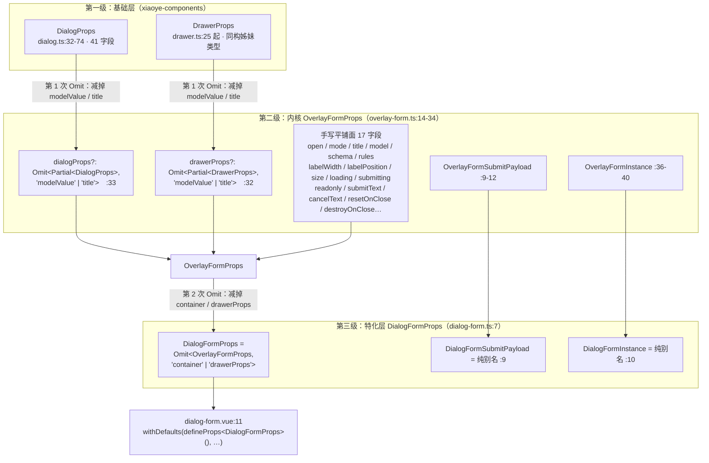
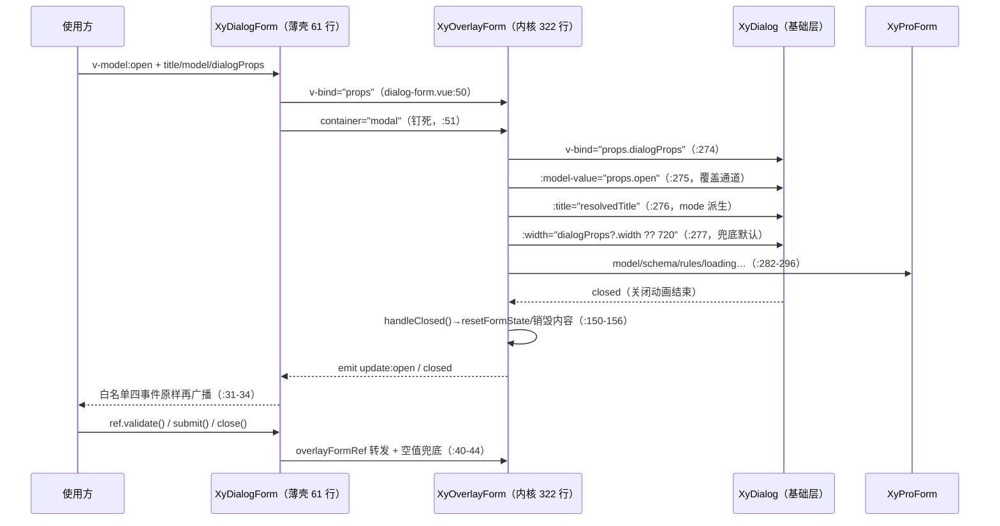

# 9-07 · DialogForm：Omit 派生类型的封装范式

> 本篇是 9 卷"增强层（pro-components）"的第七篇。9-06 拆完了 OverlayForm 的多态容器——一个 `container` prop 在抽屉与弹窗两种形态之间切换的整套实现；本篇顺着它的产品线往下走半步，看两个"单态特化"里的第一个：`XyDialogForm`。核心问题按大纲只有一句话——Omit 派生类型的封装范式——但这九个字里至少压着五道题：`DialogFormProps` 到底从哪里派生、用什么运算符派生、派生的时候屏蔽了什么又留下了什么、派生出来的契约由谁二次声明、以及这个"特化薄壳"到底有多薄——它是 overlay-form 的 `container="modal"` 薄壳，还是一套平行实现。本篇照旧全部给实码定论：dialog-form 自己的两个源文件一共 71 行，加上镜像的 drawer-form 两个文件也不过 142 行，却装下了本库类型派生体系里最完整的一条链，并为下一篇 9-08《DrawerForm：对称特化》埋好引线。

接到题目先复述一遍目标，防止写偏：`packages/pro-components/dialog-form` 是增强层 31 个组件里最不像"组件"的组件——它没有自己的弹窗、没有自己的表单、没有一行业务逻辑，全文两个源文件（`src/dialog-form.ts` 10 行、`src/dialog-form.vue` 61 行，用 `wc -l` 数出来一共 71 行）。它存在的唯一理由，是把 overlay-form 那个"既可以抽屉也可以弹窗"的多态面，**收窄成一个"这里明确就是弹窗"的单态面**。而收窄的主要工具不在模板层、不在逻辑层，在类型层：一个 `Omit<OverlayFormProps, "container" | "drawerProps">`。所以本篇真正要解剖的标本，是一段只有一行长的类型代码，以及它背后那条从基础层 `DialogProps` 一路派生到公开入口的三级链。9-06 讲多态容器时给过一个结论：dialog-form 与 drawer-form 是单态特化，"薄壳"的薄，薄在类型层的 Omit 派生加值层的少量默认值——本篇就是把这句话展开成账本。

## 一、先看货：一个 10 行的类型文件，一个 61 行的薄壳

先看类型文件全文。这就是本篇的主角，10 行里 7 行是 import：

```ts
// packages/pro-components/dialog-form/src/dialog-form.ts（全文 10 行）
import type {
  OverlayFormInstance,
  OverlayFormProps,
  OverlayFormSubmitPayload
} from "../../overlay-form/src/overlay-form";

export type DialogFormProps = Omit<OverlayFormProps, "container" | "drawerProps">;

export type DialogFormSubmitPayload = OverlayFormSubmitPayload;
export type DialogFormInstance = OverlayFormInstance;
```

三个导出，三种派生姿势，信息密度极高。第 7 行是本篇的题眼：`DialogFormProps` 是一个**类型别名 + Omit 运算**——从 `OverlayFormProps` 里减掉 `container` 和 `drawerProps` 两个属性名，剩下的全部属性原样继承。第 9、10 行是两个**纯别名**（type alias）：`DialogFormSubmitPayload` 就是 `OverlayFormSubmitPayload`，`DialogFormInstance` 就是 `OverlayFormInstance`，连 Omit 都不需要——提交载荷与实例协议在两种容器形态之间没有任何差异，别名即收口。注意第 1 到 5 行的 import：dialog-form 的类型依赖只有一个文件——overlay-form 的类型源码。它不 import `core.ts`（9-02 拆协议层时列过 core 的 11 个直接消费方，dialog-form 不在其中，因为它通过 overlay-form 间接消费 `ProFieldSchema`），也不 import 基础层的 `xiaoye-components`。全库很难找出第二个依赖面这么窄的组件：**它连"宪法"都是听内核转述的**。

再看视图层全文。61 行里值得逐段读的有四段：

```vue
<!-- packages/pro-components/dialog-form/src/dialog-form.vue（全文 61 行） -->
<script setup lang="ts">
import { ref, useSlots } from "vue";
import { XyOverlayForm } from "../../overlay-form";
import type { OverlayFormInstance, OverlayFormSubmitPayload } from "../../overlay-form";
import type { DialogFormProps } from "./dialog-form";

defineOptions({
  name: "XyDialogForm"
});

const props = withDefaults(defineProps<DialogFormProps>(), {
  open: false,
  mode: "create",
  title: "",
  schema: () => [],
  rules: () => ({}),
  labelWidth: "112px",
  labelPosition: "top",
  size: "md",
  loading: false,
  submitting: false,
  readonly: false,
  submitText: "",
  cancelText: "",
  resetOnClose: false,
  destroyOnClose: false,
  dialogProps: () => ({})
});

const emit = defineEmits<{
  "update:open": [value: boolean];
  submit: [payload: OverlayFormSubmitPayload];
  cancel: [payload: OverlayFormSubmitPayload];
  closed: [];
}>();

const slots: ReturnType<typeof useSlots> = useSlots();
const overlayFormRef = ref<OverlayFormInstance | null>(null);

defineExpose({
  validate: () => overlayFormRef.value?.validate() ?? Promise.resolve(false),
  submit: () => overlayFormRef.value?.submit() ?? Promise.resolve(false),
  close: () => overlayFormRef.value?.close()
});
</script>

<template>
  <xy-overlay-form
    ref="overlayFormRef"
    v-bind="props"
    container="modal"
    @update:open="emit('update:open', $event)"
    @submit="emit('submit', $event)"
    @cancel="emit('cancel', $event)"
    @closed="emit('closed')"
  >
    <template v-for="(_, name) in slots" :key="name" #[name]="slotProps">
      <slot :name="name" v-bind="slotProps ?? {}" />
    </template>
  </xy-overlay-form>
</template>
```

第一段，`defineOptions` 与 defineProps（第 7 到 28 行）：组件名 `XyDialogForm`，props 的类型参数就是那个 Omit 派生出来的 `DialogFormProps`，配 16 项默认值。第二段，defineEmits（第 30 到 35 行）：四个事件，`submit`/`cancel` 的载荷类型直接复用内核的 `OverlayFormSubmitPayload`——事件面也是派生的。第三段，defineExpose（第 40 到 44 行）：三个实例方法，全部一行转发，外加 `?? Promise.resolve(false)` 的空值兜底。第四段，模板（第 47 到 61 行）：`v-bind="props"` 整体透传之后，**显式写死 `container="modal"`**，四个事件原样再广播，插槽用一个动态 `v-for` 循环整体转发。

把四段看完，"薄壳"的构造就齐了：类型收窄（Omit）、值层钉死（`container="modal"`）、事件白名单（四个 emit）、插槽全转发（一个 v-for）、实例三动作转发（defineExpose）。除了这五件事，这个文件什么都不做。剩下的 322 行真逻辑全部在 overlay-form 里——下一节我们把那条类型派生链完整铺开。

## 二、Omit 派生链：从 DialogProps 到 DialogFormProps 的三级链

要理解第 7 行那个 Omit 在 Omit 什么，必须先看它的派生对象 `OverlayFormProps` 的全文。内核类型文件 40 行：

```ts
// packages/pro-components/overlay-form/src/overlay-form.ts（全文 40 行）
import type { DialogProps, DrawerProps, FormRules } from "xiaoye-components";
import type { ComponentSize } from "xiaoye-primitives";
import type { ProFieldSchema } from "../../core";

export type OverlayFormContainer = "drawer" | "modal";
export const overlayFormModes = ["create", "edit", "view"] as const;
export type OverlayFormMode = (typeof overlayFormModes)[number];

export interface OverlayFormSubmitPayload {
  mode: OverlayFormMode;
  model: Record<string, unknown>;
}

export interface OverlayFormProps {
  open?: boolean;
  container?: OverlayFormContainer;
  mode?: OverlayFormMode;
  title?: string;
  model: Record<string, unknown>;
  schema?: ProFieldSchema[];
  rules?: FormRules;
  labelWidth?: string | number;
  labelPosition?: "left" | "top";
  size?: ComponentSize;
  loading?: boolean;
  submitting?: boolean;
  readonly?: boolean;
  submitText?: string;
  cancelText?: string;
  resetOnClose?: boolean;
  destroyOnClose?: boolean;
  drawerProps?: Omit<Partial<DrawerProps>, "modelValue" | "title">;
  dialogProps?: Omit<Partial<DialogProps>, "modelValue" | "title">;
}

export interface OverlayFormInstance {
  validate: () => Promise<boolean>;
  submit: () => Promise<boolean>;
  close: () => void;
}
```

这条链的完整拓扑是三级。第一级在基础层：`DialogProps` 与 `DrawerProps`。第二级在内核 `OverlayFormProps`（`overlay-form.ts:14-34`）：它自己声明了 19 个字段，其中第 32、33 行是两个**容器通道**——`drawerProps?: Omit<Partial<DrawerProps>, "modelValue" | "title">` 与 `dialogProps?: Omit<Partial<DialogProps>, "modelValue" | "title">`。第三级在特化层 `DialogFormProps`（`dialog-form.ts:7`）：再从 `OverlayFormProps` 上 Omit 掉 `container` 与 `drawerProps`。画成图：



这张图里有两件事必须实码定论。

**第一件：派生用的不是 extends，也不是交叉，是类型别名加 Omit。** 这里先立起本篇第一个设计权衡——**权衡一：运算符派生 vs 手写 Props**。题目问"Omit/Pick/交叉/接口 extends——实码定论"，答案是分层的：特化层两个 Props（dialog-form 与 drawer-form）用的是 `type X = Omit<Y, ...>`；内核的两个容器通道用的是 `Omit<Partial<...>, ...>`（Omit 与 Partial 的复合）；而 `OverlayFormProps` 自身的 17 个“表单面”字段，**既不是从 ProFormProps 派生的，也不是交叉出来的，是手写平铺的**。把 `pro-form.ts:5-23` 的 `ProFormProps`（17 个字段）和 `OverlayFormProps` 摆在一起看：title、model、schema、rules、labelWidth、labelPosition、size、loading、readonly、submitting、submitText 这十一个字段是同名同型的逐字重抄，而 `ProFormProps` 独有的 description、columns、resetText、readonlyDescriptionsProps 一个都没有出现在 OverlayFormProps 上，`OverlayFormProps` 独有的 open、container、mode、cancelText、resetOnClose、destroyOnClose 与两个通道字段也不属于 ProFormProps。也就是说，这条链上只有"容器通道"和"特化收窄"用了运算符派生，表单面本身是刻意手写的。为什么？因为 OverlayForm 的表单面是 ProForm 的**语义子集**而非结构子集——它要的是"浮层里够用的那部分表单配置"，而不是 ProForm 的完整配置面；Omit 派生只能做减法，做不出"挑九个留八个"的语义挑选（那是 Pick 的活，但 Pick 列表一旦超过十个字段，可读性反而不如手写）。这是本库对"派生还是手写"的判断标准：**形状跟随用 Omit，语义挑选用手写**。

**第二件：这段一行长的类型代码有过一次形态修正，证据在 git 里。** dialog-form 出生于 323e9a7（2026-04-21，"完成前台基础组件库 Phase 1 + Phase 2 核心组件"），当时的写法是：

```diff
// git diff 323e9a7..dc9ca28 -- packages/pro-components/dialog-form/src/dialog-form.ts
// drawer-form.ts 有一模一样的镜像改动，此处从略
-export interface DialogFormProps extends Omit<OverlayFormProps, "container" | "drawerProps"> {}
+export type DialogFormProps = Omit<OverlayFormProps, "container" | "drawerProps">;
```

出生时是 `interface ... extends Omit<...> {}`——用接口继承一个 Omit 交叉类型，再留一对空花括号。2026-09-14 的 dc9ca28（基础设施依赖治理）把它改成了纯类型别名。这是**权衡二：type 别名 vs interface extends**。这次改动看着像洁癖，实际修了三件事：其一，`extends Omit<...>` 在语义上是撒谎的——接口继承表达的是"我是它的一种"，而 dialog-form 对 overlay-form 的关系是"我是收窄后的它"，收窄用赋值语义（`=`）比继承语义（`extends`）诚实；其二，空花括号 `{}` 会骗过一些工具链对"接口是否有扩展点"的判断，也让 dts 里多出一层无意义的 `interface DialogFormProps` 节点；其三，也是最实际的——`interface extends` 一个来自 Omit 的对象类型，在某些 TS 版本组合下会触发"接口能否静态扩展"的边界检查，而类型别名没有这层限制。drawer-form.ts 在同一次提交里做了镜像修正。**一处两个单词的写法差异，在两个镜像文件里同步演化，这正是"对称特化"应有的纪律**——9-08 会看到这对镜像的完整对照。

Omit 派生的代价也要摊开说——顺带补上**权衡一的另一半**：派生 vs 手写在可读性上的交换。4-10 泛型篇讲过一个呼应点：发布管线的后处理（`scripts/prepare-package.mjs:424`）会把公开入口的组件值声明统一降级成 `SFCWithInstall<any>`（`withInstall` 的类型形状定义在 `packages/xiaoye-primitives/src/utils/vue/with-install.ts:3-5`），泛型签名不进 dts。对 DialogForm 这种非泛型组件，这个降级意味着**公开 dts 里组件值的类型面几乎完全依赖 Props 类型**——也就是说，`DialogFormProps` 那条 Omit 链在发布产物里就是全部契约。而 Omit 链的 dts 是"延迟展开"的：消费者在编辑器里 hover `DialogFormProps`，看到的是 `Omit<OverlayFormProps, "container" | "drawerProps">` 这个算式本身，不是字段清单；要看到字段必须再跳一层 `OverlayFormProps`，再跳一层 `DialogProps`。手写 Props 的展开成本是零，派生 Props 的可读性成本是三次跳转。本库接受这笔代价的理由有二：一是 derived types 保证字段清单**永远与内核同步**，手写清单则每一处增删都要三处手改（这正是"一处失同步、全链说谎"的隐患）；二是 `pnpm typecheck:types` 的夹具体系（下文第五节）把派生链的最终形状钉死在测试里，hover 看不清的，夹具看得清。

## 三、屏蔽面的选择学：拿走什么，留下什么

Omit 的第一个参数是"留下什么"，第二个参数才是"拿走什么"——封装范式的全部学问在第二个参数里。这条链上一共做了两次 Omit，拿走了四个属性名，我们逐个盘问。

**第一次 Omit 在通道层（`overlay-form.ts:32-33`）：拿走 `modelValue` 与 `title`。** 先看被拿走的对象长什么样。基础层 `DialogProps`（`packages/components/dialog/src/dialog.ts:32-74`）一共 41 个字段：

```ts
// packages/components/dialog/src/dialog.ts:32-74（全文引用）
export interface DialogProps {
  modelValue?: boolean;
  title?: string;
  appendToBody?: boolean;
  appendTo?: string | HTMLElement;
  beforeClose?: DialogBeforeCloseFn;
  destroyOnClose?: boolean;
  closeOnClickModal?: boolean;
  closeOnPressEscape?: boolean;
  lockScroll?: boolean;
  modal?: boolean;
  modalPenetrable?: boolean;
  openDelay?: number;
  closeDelay?: number;
  top?: string;
  modalClass?: string;
  panelClass?: string;
  width?: string | number;
  zIndex?: number;
  center?: boolean;
  alignCenter?: boolean;
  closeIcon?: string | Component;
  draggable?: boolean;
  overflow?: boolean;
  fullscreen?: boolean;
  resizable?: boolean;
  minWidth?: string | number;
  maxWidth?: string | number;
  minHeight?: string | number;
  maxHeight?: string | number;
  maximizable?: boolean;
  stickyHeader?: boolean;
  stickyFooter?: boolean;
  bodyMaxHeight?: string | number;
  loading?: boolean;
  loadingText?: string;
  headerClass?: string;
  bodyClass?: string;
  footerClass?: string;
  showClose?: boolean;
  headerAriaLevel?: string;
  transition?: DialogTransition;
}
```

41 个字段，通道层只拿走两个：`modelValue` 和 `title`。这两个恰好是**必须死的**——`modelValue` 是受控源，overlay-form 用自己的 `open` 接管了它（模板 `overlay-form.vue:275` 把 `:model-value="props.open"` 绑给 xy-dialog），如果通道里还能传 `modelValue`，同一个受控源就有了两个写入口，"弹窗到底听谁的"会变成运行时才知道答案的悬案；`title` 也不是简单透传，overlay-form 用 `resolvedTitle`（`overlay-form.vue:74`）把它变成了 **mode 派生值**——`props.title || `${modeTextMap[props.mode]}内容``，空标题会按 create/edit/view 自动生成"新建内容/编辑内容/查看内容"。把这两个从通道类型里 Omit 掉，等于把"受控源唯一"和"标题派生权"两条编译进了类型系统：使用者想写 `:dialog-props="{ modelValue: true }"`，TypeScript 直接拒绝，运行时根本轮不到出场。这条经验可以压成一句话：**凡是内核接管的 prop，必须从通道类型里除名；凡是不接管的，全部留给 Partial 透传**——width、closeOnClickModal、beforeClose、fullscreen 这些纯容器配置，一个都不拦，`Omit<Partial<DialogProps>, ...>` 里的 Partial 保证全部可选。

顺带盘问两个"看起来该屏蔽但其实不在类型层屏蔽"的候选。一个是 **footer**：`DialogProps` 的 41 个字段里根本没有 footer——本库的对话框底栏是插槽不是 prop（`overlay-form.vue:300-320` 里 overlay-form 自己渲染 `<template #footer>` 放动作按钮）。所以 footer 的屏蔽不是 Omit 做的，是**插槽接管**做的：内核占住了 #footer 插槽位，外部想自定义动作区只能走 `actions` 具名插槽（`overlay-form.vue:302-308`）。另一个是 **on-\* 事件**：本库基础组件的事件全部走 `defineEmits` 声明（`packages/components/dialog/src/dialog.vue:19-33` 一共声明了 13 个事件，从 `update:modelValue` 到 `resize-end`），事件从来不是 Props 类型的成员，所以通道类型里天然没有 on-\* 可屏蔽。但类型层不设防不等于运行时全放行——facade 层的事件出口是一份**显式白名单**：`dialog-form.vue:31-34` 只声明 `update:open`、`submit`、`cancel`、`closed` 四个。底层 dialog 的 open、opened、close、maximize、restore、resize 等 13 个事件，一个都不穿透到 dialog-form 的使用者面前。类型屏蔽靠 Omit，事件屏蔽靠白名单，两套机制各管一段。

第二次 Omit 在特化层（`dialog-form.ts:7`）：拿走 `container` 与 `drawerProps`。这是**权衡三：屏蔽面的宽窄**——屏蔽得越少，类型越"完整"但越失真；屏蔽得越多，类型越诚实但 facade 越僵硬。注意这是**一对**屏蔽，不是两个独立决定。`container` 是多态开关，dialog-form 的语义就是"消灭这个开关"，必须拿走，没有悬念；但为什么 `drawerProps` 要跟着陪葬？设想只 Omit `container` 的版本：使用者拿到一个"只能是弹窗"的组件，props 里却还躺着一个 `drawerProps`——一个永远不会被消费的字段（模板里 `container="modal"` 已钉死，drawer 分支是死代码）。类型在撒谎：它承诺了一个无效的配置面。**屏蔽开关就必须屏蔽开关的另一半**，`"container" | "drawerProps"` 作为联合一起进 Omit，类型才与运行时一致。对照 `drawer-form.ts:7` 的 `Omit<OverlayFormProps, "container" | "dialogProps">`——镜像成立，各自拿走自己的开关与对方的通道。

运行时还有一道双保险值得点破：模板里 `v-bind="props"` 写在 `container="modal"` **之前**（`dialog-form.vue:50-51`）。Vue 的绑定覆盖规则是后者胜，所以即便有人绕过类型系统在运行时塞进一个 container 值（比如 `as any`），显式绑定也会把它压掉。类型层 Omit 管住编译期，模板层绑定顺序管住运行期，同一道屏蔽做了两次。这种"类型承诺 + 运行时兜底"的双写，在 4-10 泛型篇讲 `keyword as T` 时出现过一次，这里是它的镜像版本——那次是类型向运行时让步，这次是运行时向类型对齐。

整条运行时的数据与事件链画出来是这样：



## 四、类型收口的两难：内部组件消费与 props 二次声明

Omit 派生解决了"契约形状从哪来"，但没解决"契约默认值谁说了算"。这是薄壳范式最实际的收口难题。第一处收口在默认值清单上，实码给出的答案是**二次声明**：facade 的 `withDefaults` 把内核的默认值清单几乎原样抄了一遍。把两份清单并排放着看：

```ts
// packages/pro-components/overlay-form/src/overlay-form.vue:26-45（内核侧，18 项）
const props = withDefaults(defineProps<OverlayFormProps>(), {
  open: false,
  container: "drawer",
  mode: "create",
  title: "",
  schema: () => [],
  rules: () => ({}),
  labelWidth: "112px",
  labelPosition: "top",
  size: "md",
  loading: false,
  submitting: false,
  readonly: false,
  submitText: "",
  cancelText: "",
  resetOnClose: false,
  destroyOnClose: false,
  drawerProps: () => ({}),
  dialogProps: () => ({})
});
```

facade 侧（`dialog-form.vue:11-28`）的 16 项与之唯一的差别：没有 `container`（被 Omit 了），`drawerProps` 换成了 `dialogProps`。两份清单的存在不是冗余装饰——由于 facade 用 `v-bind="props"` 整体透传，**facade 的默认值才是实际生效的那份**（显式传下去的 prop 会覆盖内核 withDefaults 的兜底）。于是出现了一笔"同步税"：内核改一个默认值（比如把 labelWidth 从 112px 调成 96px），必须记得同步改 dialog-form 与 drawer-form 两处镜像，否则 facade 会继续把旧默认值显式传下去，内核的新默认值永远轮不到生效——而且这种漂移不报错、不崩测试，只会让两个组件的默认表现悄悄分叉。本库目前用"镜像文件 + 同提交改动"的纪律扛着这笔税（dc9ca28 那次类型修正就是双文件同步改的），没有上自动化校验。如果要给这个范式挑一处最值得加固的软肋，就是它：**默认值清单本质上是第三份手写面**——Omit 收窄了类型面，却收窄不了 withDefaults 的字面量清单。

第二处收口在实例协议上。facade 的 defineExpose（`dialog-form.vue:40-44`）不是裸转发，是带兜底的再包装：

```ts
defineExpose({
  validate: () => overlayFormRef.value?.validate() ?? Promise.resolve(false),
  submit: () => overlayFormRef.value?.submit() ?? Promise.resolve(false),
  close: () => overlayFormRef.value?.close()
});
```

内核的 expose（`overlay-form.vue:181-185`）是直接把三个函数抛出去，返回值类型由内核实现保证；facade 面对的是"内部 ref 可能还是 null"的现实（组件刚挂载、v-if 未渲染），所以 `validate` 兜底 `Promise.resolve(false)`、`submit` 兜底 `false`——语义被统一成"没挂载等于校验失败/提交未执行"，而不是抛 `Cannot read properties of null`。`close` 没有兜底，因为它返回 void，`?.` 短路后天然是 undefined。三个方法两种待遇，差别全部来自返回值类型——这就是"类型收口"四个字在实例协议上的样子：**兜底形状跟着返回类型走**。

第三处收口在关闭生命周期上，这段逻辑 dialog-form 完全没有参与，但它决定了 `closed` 事件与 `resetOnClose`/`destroyOnClose` 两个 props 的真实语义，值得顺着请求关闭的入口读一遍内核（`overlay-form.vue:95-118`）：

```ts
// packages/pro-components/overlay-form/src/overlay-form.vue:95-118（原文）
function buildPayload(): OverlayFormSubmitPayload {
  return {
    mode: props.mode,
    model: cloneModelValue(props.model)
  };
}

function requestClose(reason: DrawerCloseReason | DialogCloseReason = "programmatic") {
  if (props.container === "drawer" && drawerRef.value) {
    drawerRef.value.handleClose(reason as DrawerCloseReason);
    return;
  }

  if (props.container === "modal" && dialogRef.value) {
    dialogRef.value.handleClose(reason as DialogCloseReason);
    return;
  }

  emit("update:open", false);
}

async function validate() {
  return formRef.value?.validate() ?? false;
}
```

`requestClose` 是多态内核里少数必须感知 container 的地方：同一个关闭请求，drawer 形态要调 `DrawerInstance.handleClose`，modal 形态要调 `DialogInstance.handleClose`（两个 Instance 类型分别在 `packages/components/drawer/src/drawer.ts:63-66` 与 `packages/components/dialog/index.ts:40-42`，都把 `handleClose` 挂在实例暴露面上）。参数类型是两个 CloseReason 的联合，进分支后再 `as` 收窄到各自容器的字面量——又见 4-10 讲过的"运行时对类型承诺的诚实让步"，这里的原因是两个容器各自声明了名字相同、定义独立的 reason 联合，内核不愿为此引入一个归一化类型。而取消按钮的链路（`overlay-form.vue:135-156`）把"取消、重置、销毁、广播"四步收在两个函数里：

```ts
// packages/pro-components/overlay-form/src/overlay-form.vue:135-156（原文）
function handleCancel() {
  emit("cancel", buildPayload());
  requestClose("programmatic");
}

function resetFormState() {
  if (!props.resetOnClose) {
    return;
  }

  formRef.value?.reset?.();
  formRef.value?.resetFields?.();
  formRef.value?.clearValidate?.();
}

function handleClosed() {
  resetFormState();
  if (props.destroyOnClose) {
    contentVisible.value = false;
  }
  emit("closed");
}
```

两处细节值得点名。其一，`handleCancel` 先发 `cancel` 事件再请求关闭，事件载荷与 `submit` 同构（`buildPayload` 的 mode 加 model 深拷贝快照），使用者在 cancel 里拿到的 model 与提交时的形状完全一致——事件协议的对称性是这么来的。其二，`resetFormState` 连调 `reset`、`resetFields`、`clearValidate` 三个方法名（对照 `overlay-form.vue:19-24` 的 FormExpose，三者都是可选成员）——Element Plus 的 el-form 只有 `resetFields` 一个名字，本库的基础层 form 三个都暴露，内核索性三个全调一遍，多调的方法名在不存在时被 `?.` 静默吞掉。这是兼容性收口里"宁可多按一次门铃"的朴素解法。至于 `destroyOnClose`，还有一处值得留意的缝隙：OverlayFormProps 在 `overlay-form.ts:31` 自己声明了这个字段并用 contentVisible（`overlay-form.vue:59`、`150-156`、`167-179`）实现了内容销毁，但通道类型 `Omit<Partial<DialogProps>, "modelValue" | "title">` 并没有把基础层 DialogProps 里的同名 `destroyOnClose`（`dialog.ts:38`）除名——理论上可以通过 `dialog-props` 再传一份同名配置触发基础容器自己的销毁语义。两条同名通道并存目前互不干扰（基础层的销毁发生在面板层，内核的销毁发生在内容层），但它属于"受控源唯一"原则的一个未闭合案例，与 modelValue 被 Omit 的待遇相比，是屏蔽面上可以再收紧一格的地方。

第四处收口回到 4-10 的呼应上。`SFCWithInstall<any>` 降级之后，模板里写 `<xy-dialog-form>` 拿不到编译器层面的 props 校验（除非显式标注 `DialogFormProps`），于是这条 Omit 派生链的实际执法者是三台机器：编译期的 `defineProps<DialogFormProps>`（源码内消费）、类型夹具（`pnpm typecheck:types` 消费）、运行时单测（vitest 消费）。类型在源码内被消费一次（defineProps 的类型参数），在夹具里被消费两次（构造合法对象断言形状），这个"类型必须被消费"的原则，正是本库与"类型只写不用"流派的分野。

把这套范式放到 Element Plus 的坐标系里对比一次。EP 没有 DialogForm——它的世界观是 ElDialog 与 ElForm 自由组合，"弹窗表单"由业务方手写：`<el-dialog v-model="visible" title="编辑">` 里嵌 `<el-form :model="form">`，footer 插槽里自己摆按钮。这个自由组合的代价是三重状态漂移：`visible` 的受控源、表单 `model` 的数据源、提交 loading 态，三个状态由业务方手工对齐，reset 时机要自己挂在 `@closed` 上。EP 的 props 体系以运行时声明为主（defineComponent 的 props 对象），TypeScript 从中反推类型，组件间想表达"我要的是 DialogProps 去掉某几个字段"这种关系，惯用法是再声明一个手写接口——形状与内核之间没有机器保证的联系。本库这条 Omit 链的做法恰好相反：**关系本身是代码**。`Omit<Partial<DialogProps>, "modelValue" | "title">` 不只是描述了"dialogProps 长什么样"，它把"受控源已被接管、标题已被派生"这两条架构决策编码成了编译期事实。EP 的自由组合把复杂度留给业务方的运行时，本库的派生链把复杂度收进库方的编译期——两者没有绝对优劣，但在"31 个增强组件共享一套浮层内核"的目标下，后者的杠杆明显更长。

## 五、守卫与夹具：薄壳的证明责任

薄壳的价值主张是"逻辑零重复"，所以它的测试也薄得恰到好处。全文 51 行：

```ts
// packages/pro-components/dialog-form/__tests__/dialog-form.spec.ts（全文 51 行）
import { mount } from "@vue/test-utils";
import { nextTick } from "vue";
import { describe, expect, it } from "vitest";
import { XyDialog } from "@xiaoye/components";
import { XyDialogForm, XyOverlayForm } from "@xiaoye/pro-components";

describe("XyDialogForm", () => {
  it("固定以 modal 容器渲染覆盖层表单", () => {
    const wrapper = mount(XyDialogForm, {
      props: {
        open: true,
        model: {
          name: "成员台账"
        }
      }
    });

    expect(wrapper.findComponent(XyOverlayForm).exists()).toBe(true);
    expect(wrapper.findComponent(XyDialog).exists()).toBe(true);
  });

  it("转发 update:open、submit、cancel 和 closed 事件", async () => {
    const wrapper = mount(XyDialogForm, {
      props: {
        open: true,
        model: {
          name: "成员台账"
        }
      }
    });

    const overlay = wrapper.findComponent(XyOverlayForm);
    const payload = {
      mode: "edit" as const,
      model: {
        name: "成员台账"
      }
    };

    overlay.vm.$emit("update:open", false);
    overlay.vm.$emit("submit", payload);
    overlay.vm.$emit("cancel", payload);
    overlay.vm.$emit("closed");
    await nextTick();

    expect(wrapper.emitted("update:open")?.[0]?.[0]).toBe(false);
    expect(wrapper.emitted("submit")?.[0]?.[0]).toEqual(payload);
    expect(wrapper.emitted("cancel")?.[0]?.[0]).toEqual(payload);
    expect(wrapper.emitted("closed")).toHaveLength(1);
  });
});
```

两个用例恰好对准薄壳仅有的两条职责：第一条验证"容器钉死"——挂载后内部必须同时存在 `XyOverlayForm` 与 `XyDialog`，即 modal 形态真的被选中（对照 9-06 的 overlay-form 测试，那里验证的是 container prop 的切换，这里验证的是切换结果被锁死）；第二条验证"事件白名单"——从内部 overlay-form 手工 emit 四个事件，断言 facade 原样透传。表单逻辑、校验逻辑、关闭生命周期一条都不测，因为它们属于 overlay-form 的测试职责——**薄壳的测试只测薄壳自己引入的东西**，这是组件测试边界的一个干净样本。

类型侧的守卫分三层。第一层是独立夹具 `tests/types/fixtures/dialog-form.ts`（34 行）：

```ts
// tests/types/fixtures/dialog-form.ts（全文 34 行）
import type {
  DialogFormInstance,
  DialogFormProps,
  DialogFormSubmitPayload
} from "xiaoye-pro-components";

const dialogFormProps: DialogFormProps = {
  open: true,
  mode: "edit",
  title: "编辑成员",
  model: {
    name: "成员台账"
  },
  dialogProps: {
    width: 720
  }
};

void dialogFormProps;

const dialogFormPayload: DialogFormSubmitPayload = {
  mode: "edit",
  model: {
    name: "成员台账"
  }
};

void dialogFormPayload;

declare const dialogFormInstance: DialogFormInstance;

void dialogFormInstance.validate;
void dialogFormInstance.submit;
void dialogFormInstance.close;
```

三个类型各构造一次合法用法。最有信息量的是 `dialogProps: { width: 720 }` 这四行——它断言的不是一个字段存在，而是那条 `Omit<Partial<DialogProps>, "modelValue" | "title">` 通道**真的能通**：width 从基础层 41 字段一路穿过两次 Omit 和一次 Partial 到达使用者。反过来，这份夹具里刻意没有的东西同样重要：没有 `container`，没有 `drawerProps`，没有 `dialogProps: { modelValue: true }`——它们若被写进来，`pnpm typecheck:types` 会直接编译失败。通道通不通要正向断言，屏蔽严不严只能靠"负面缺席"来守，夹具的留白本身就是断言。第二层是根入口聚合夹具 `tests/types/fixtures/xiaoye-pro-components.ts:135-140`，那里的 `dialogFormProps` 只写了 `open` 与 `model` 两项——顺手钉死了另一个事实：`model` 是 OverlayFormProps 里**唯一没有 `?` 的必填字段**（`overlay-form.ts:19`），别的都可以省，它不行。第三层是边界守卫 `tests/types/fixtures/pro-root-boundary.ts:11-14`，用两个 `@ts-expect-error` 断言 `OverlayFormContainer` 与 `OverlayFormMode` 无法从根入口导入——`container` 这个字符串字面量类型被降级出了公开面。这与 facade 屏蔽形成了一个漂亮的呼应：**facade 拿走了 container 字段，边界守卫拿走了 container 类型的名字**。而 `DialogFormProps.mode` 的类型仍然是那个 `"create" | "edit" | "view"` 字面量联合（`overlay-form.ts:6-7` 的 as const 推导）——降级的是类型的名字，不是类型的形状，使用者在 `mode: "edit"` 处依然获得字面量补全与拼写检查。

根入口与守卫脚本的登记处也在实码里。`packages/pro-components/index.ts:21-25` 导出三个类型（与白名单严格一致），`exports.ts:4` 导出组件值，`scripts/check-pro-components.mjs:10-15` 的白名单原文：

```js
// scripts/check-pro-components.mjs:10-15（截选）
const rootTypeWhitelist = {
  "search-form": ["SearchFormField", "SearchFormInstance", "SearchFormProps"],
  "pro-form": ["ProFormInstance", "ProFormProps"],
  "overlay-form": ["OverlayFormInstance", "OverlayFormProps", "OverlayFormSubmitPayload"],
  "dialog-form": ["DialogFormInstance", "DialogFormProps", "DialogFormSubmitPayload"],
  "drawer-form": ["DrawerFormInstance", "DrawerFormProps", "DrawerFormSubmitPayload"],
```

dialog-form 登记了恰好三个类型——与 `dialog-form.ts` 的三个导出一一对应，多导出一个细节类型（比如按 AGENTS.md 的边界规则，绝不该出现在根入口的容器字面量类型）就会被 `pnpm check:pro-components` 拦下。manifest 里的登记同样薄：`component-manifest.json:26-33` 一条八行的条目，`styleImports` 指向 `dialog-form`——而这个样式文件的全部内容是一行：

```css
/* packages/theme/src/pro/dialog-form.css（全文 1 行） */
@import "./overlay-form.css";
```

连样式都是薄壳：没有一行自己的 CSS，纯转发内核样式（`packages/pro-components/style.css:4-6` 里 overlay-form、dialog-form、drawer-form 三个 import 相邻而列，顺序就是层级）。至此可以给"薄"字下一个完整的实码定义：**类型层一行 Omit，样式层一行 @import，逻辑层零行**。

不过文档页有一处措辞值得较真。`apps/docs/pro-components/dialog-form.md:31` 写的是"`DialogFormProps` **继承自** `OverlayFormProps` 的属性（Omit 掉 `container / drawerProps`）"——括号里是对的，"继承自"三个字不精确：实码是类型别名赋值（`type X = Omit<Y, ...>`），不是接口继承（`interface X extends Y`），两者的差别正是第二节 git 考古里那次修正的全部意义。同页第 9 行“轻包装版本”、第 19 行“语义化 facade，不是第二套弹窗表单内核”的定性则与实码完全一致。这一处属于“结论对、用词漂”，不影响使用者，但作为源码深化篇，措辞的精度就是内容的精度。

同一页还有一处比措辞更要紧的出入。`apps/docs/pro-components/dialog-form.md:71` 承诺“其余插槽会原样透传给内部的 `xy-pro-form`（例如 schema 字段的 `[field.slot]` 插槽）”，但顺着实现读，这条承诺在弹窗形态下没有完全兑现：overlay-form 的抽屉分支确实把除 `actions` 外的全部具名插槽转发给 xy-pro-form（`overlay-form.vue:80-83` 的 formSlots 先剥离 actions，`:220-222` 动态转发），而弹窗分支的 xy-pro-form 只有默认插槽一个入口（`overlay-form.vue:297`）——schema 字段用 `slot: "remark"` 这类声明引用的具名插槽，在 modal 形态下到不了 pro-form 的具名插槽位，自定义内容会静默不渲染。这是共享内核里一处真实的形态不对称：facade 与文档都假设了“插槽全转发”，实码只有抽屉形态做到了。facade 的插槽全转发（`dialog-form.vue:57-59`）忠实到岗，缺口出在内核的 modal 分支——记录在案，算作本篇审计出的一笔欠账。

## 六、实码定论：薄壳而非平行实现，drawer-form 是它的镜像

最后正面回答第六节之前反复出现的那道题：dialog-form 与 overlay-form 的实现共享度到底如何？是 `overlay-form mode="dialog"` 的薄壳，还是平行实现？实码给出的定论是**前者，且共享度是 100% 的逻辑共享**。这里顺势立起**权衡四：薄壳 vs 平行实现**——平行实现的好处是两个组件可以各自演化、互不牵连，代价是 322 行内核逻辑从此存在两份，任何一处 bug 修复都要双写；薄壳的好处是逻辑只有一份，代价是 facade 必须跟着内核的形状走（withDefaults 同步税就是赎金）。dialog-form 用 61 行证明了选了哪边：dialog-form.vue 的模板里只有一个节点——`<xy-overlay-form>`（`dialog-form.vue:48-60`），不 import 任何基础层组件，不出现 XyDialog/XyProForm 的任何直接引用；表单渲染、校验、关闭生命周期、model 快照克隆（`overlay-form.vue:85-93` 的 structuredClone 降级 JSON）、请求关闭的 reason 分派（`overlay-form.vue:102-114`）全部只在 overlay-form.vue 的 322 行里存在一份。要验证"零平行"有一个简单的反证：dialog-form 的 61 行里没有任何一段 if/else 或 computed 含业务语义——五个职责段（类型收窄、默认值、事件、插槽、expose）全是机械转发。平行实现只需一行业务代码就会露出马脚，而这里一行都没有。

对照文档给出的使用动机也成立。`apps/docs/examples/pro/dialog-form.md:11` 的示例导语写："明确是弹窗承接时，用 facade 比 `overlay-form + container="modal"` 更直接。"那个"更直接"的对照写法在 9-06 的示例里还留着原文（`apps/docs/examples/pro/overlay-form/placements.vue:115-120`）：

```vue
<!-- apps/docs/examples/pro/overlay-form/placements.vue:115-120：facade 之前的写法 -->
    <xy-overlay-form
      v-model:open="modalOpen"
      container="modal"
      title="覆盖层编辑：快速补充"
      :model="modalModel"
    >
```

多写一个 `container="modal"`，代价不只是四个字符：类型上 `OverlayFormProps` 还向你敞开着 `drawerProps` 通道和 drawer 形态的一切可能，阅读者要自己在脑内完成"这里其实是单态"的收窄。facade 把这步收窄从每个使用者的脑内挪进了类型定义里的一次性支付。facade 自己的示例（`apps/docs/examples/pro/dialog-form/basic.vue`）因此干净得多：

```vue
<!-- apps/docs/examples/pro/dialog-form/basic.vue（全文 40 行） -->
<script setup lang="ts">
import { reactive, ref } from "vue";

const open = ref(false);
const formModel = reactive({
  name: "成员台账",
  owner: "小叶"
});
const feedback = ref("尚未提交");

function handleSubmit() {
  feedback.value = `已通过弹窗提交：${formModel.name} / ${formModel.owner}`;
  open.value = false;
}
</script>

<template>
  <div class="xy-pro-demo-stack">
    <xy-button type="primary" @click="open = true">打开弹窗编辑</xy-button>

    <xy-dialog-form
      v-model:open="open"
      title="编辑成员"
      :model="formModel"
      :dialog-props="{ width: 640 }"
      @submit="handleSubmit"
    >
      <xy-form-item label="名称" prop="name">
        <xy-input v-model="formModel.name" placeholder="请输入名称" />
      </xy-form-item>
      <xy-form-item label="负责人" prop="owner">
        <xy-input v-model="formModel.owner" placeholder="请输入负责人" />
      </xy-form-item>
    </xy-dialog-form>

    <xy-card header="最近结果">
      {{ feedback }}
    </xy-card>
  </div>
</template>
```

注意第 25 行 `:dialog-props="{ width: 640 }"`——这正是那条通道在真实用法里的样子：容器细节配置走 `dialog-props`，组件自身的开合走 `v-model:open`，两条线泾渭分明。这个示例还顺带展示了薄壳的插槽转发在起作用：两个 `xy-form-item` 经 dialog-form 的动态插槽循环（`dialog-form.vue:57-59`）进入 overlay-form，再进入无 schema 时的默认插槽（`overlay-form.vue:236`）。

镜像的另一半，drawer-form 的类型文件也值得放在这里全文亮一次，作为"对称特化"的物证：

```ts
// packages/pro-components/drawer-form/src/drawer-form.ts（全文 10 行）
import type {
  OverlayFormInstance,
  OverlayFormProps,
  OverlayFormSubmitPayload
} from "../../overlay-form/src/overlay-form";

export type DrawerFormProps = Omit<OverlayFormProps, "container" | "dialogProps">;

export type DrawerFormSubmitPayload = OverlayFormSubmitPayload;
export type DrawerFormInstance = OverlayFormInstance;
```

与 dialog-form.ts 逐行对照，唯一的差异是第 7 行 Omit 联合里的第二个成员：`drawerProps` 换成 `dialogProps`。视图层同样：`drawer-form.vue:51` 把 `container` 钉成 `"drawer"`，其余 60 行与 dialog-form.vue 完全同构。两份文件、两个 Omit、两处钉死——单态特化的全部成本，就是这三个词的差异。这就是本库"特化薄壳"范式的全貌：**多态内核负责复用，特化薄壳负责语义，Omit 负责让类型说真话**。

把本篇的账本合上，这一范式可复述成四条：一，派生关系要写成代码——形状减法用 `type X = Omit<Y, ...>`，语义挑选才手写；二，屏蔽面成对拿走——开关与它的专属通道一起除名，受控源与被派生值在通道层除名；三，类型层的屏蔽要配一道运行时双保险（显式绑定写在 `v-bind` 之后、事件白名单显式再广播）；四，薄壳的测试与样式都只薄壳自己——测试两条职责，样式一行转发。

下一篇 9-08《DrawerForm：对称特化》将把这对镜像中的另一半摆上解剖台：`Omit<OverlayFormProps, "container" | "dialogProps">` 那一侧的默认值差异（为什么 overlay-form 的默认 container 是 drawer）、抽屉分支独有的 `size ?? 560` 宽度兜底与 loading 占位渲染、以及 `drawerProps` 通道与 `DrawerProps` 的对接细节——顺带正面回答一个悬了两篇的问题：这对镜像什么时候值得合并成一个泛型化的 `XyOverlayForm` facade，什么时候不值得。到那边见。
