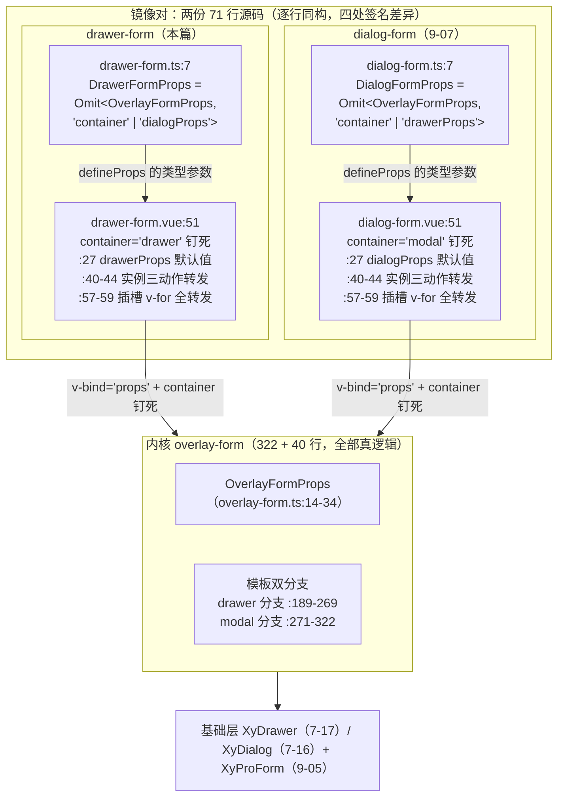
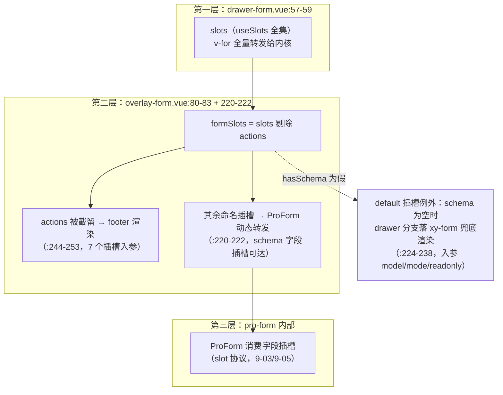
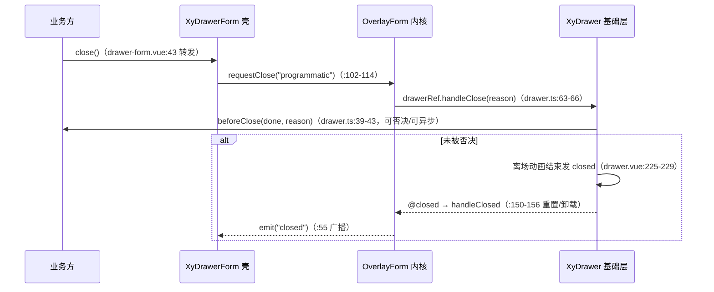

# 9-08 · DrawerForm：对称特化

> 本篇是 9 卷"增强层（pro-components）"的第八篇。9-07 把镜像的另一半——`XyDialogForm`——摆上了解剖台，结尾留了四个承诺：`Omit<..., "dialogProps">` 那一侧的默认值差异（为什么 overlay-form 的默认 container 是 drawer）、抽屉分支独有的 `size ?? 560` 宽度兜底与 loading 占位渲染、`drawerProps` 通道与 `DrawerProps` 的对接细节、以及"这对镜像什么时候值得合并成一个泛型化的 facade"。本篇全部兑现。核心问题按大纲只有一句话——**与 dialog-form 的镜像关系**——但"镜像"这个词里至少压着四道题：两个源文件逐行同构到什么程度、类型层那对互为倒影的 Omit 各自拿走了什么、运行时镜像在哪些地方故意不对称（9-06 考据的三条缝隙在 drawer 侧是坑还是优势）、以及维护一对镜像与合并成一个抽象之间的账怎么算。全部给实码定论。

## 一、复述目标：一只 71 行的镜像

接到题目先复述一遍目标，防止写偏：`packages/pro-components/drawer-form` 是 9-07 那只"特化薄壳"的孪生兄弟——同样没有自己的抽屉、没有自己的表单、没有一行业务逻辑，同样只有两个源文件（`src/drawer-form.ts` 10 行、`src/drawer-form.vue` 61 行，`wc -l` 数出来一共 71 行，与 dialog-form 的 71 行分毫不差）。它存在的唯一理由，是把 overlay-form 那个多态面**收窄成"这里明确就是抽屉"**——列表页侧滑编辑、详情页右栏录入这类"我确定要抽屉"的业务心智，需要一个名字直说这件事的组件，而不是让业务方在 `XyOverlayForm` 上写 `container="drawer"` 再默记这个值不许变。

收窄的主要工具与 9-07 同款：类型层一个 Omit，值层一处钉死。先把两个源文件的全文摆出来，这是本篇一切对照的底稿。

```ts
// packages/pro-components/drawer-form/src/drawer-form.ts（全文 10 行）
import type {
  OverlayFormInstance,
  OverlayFormProps,
  OverlayFormSubmitPayload
} from "../../overlay-form/src/overlay-form";

export type DrawerFormProps = Omit<OverlayFormProps, "container" | "dialogProps">;

export type DrawerFormSubmitPayload = OverlayFormSubmitPayload;
export type DrawerFormInstance = OverlayFormInstance;
```

```vue
<!-- packages/pro-components/drawer-form/src/drawer-form.vue（全文 61 行） -->
<script setup lang="ts">
import { ref, useSlots } from "vue";
import { XyOverlayForm } from "../../overlay-form";
import type { OverlayFormInstance, OverlayFormSubmitPayload } from "../../overlay-form";
import type { DrawerFormProps } from "./drawer-form";

defineOptions({
  name: "XyDrawerForm"
});

const props = withDefaults(defineProps<DrawerFormProps>(), {
  open: false,
  mode: "create",
  title: "",
  schema: () => [],
  rules: () => ({}),
  labelWidth: "112px",
  labelPosition: "top",
  size: "md",
  loading: false,
  submitting: false,
  readonly: false,
  submitText: "",
  cancelText: "",
  resetOnClose: false,
  destroyOnClose: false,
  drawerProps: () => ({})
});

const emit = defineEmits<{
  "update:open": [value: boolean];
  submit: [payload: OverlayFormSubmitPayload];
  cancel: [payload: OverlayFormSubmitPayload];
  closed: [];
}>();

const slots: ReturnType<typeof useSlots> = useSlots();
const overlayFormRef = ref<OverlayFormInstance | null>(null);

defineExpose({
  validate: () => overlayFormRef.value?.validate() ?? Promise.resolve(false),
  submit: () => overlayFormRef.value?.submit() ?? Promise.resolve(false),
  close: () => overlayFormRef.value?.close()
});
</script>

<template>
  <xy-overlay-form
    ref="overlayFormRef"
    v-bind="props"
    container="drawer"
    @update:open="emit('update:open', $event)"
    @submit="emit('submit', $event)"
    @cancel="emit('cancel', $event)"
    @closed="emit('closed')"
  >
    <template v-for="(_, name) in slots" :key="name" #[name]="slotProps">
      <slot :name="name" v-bind="slotProps ?? {}" />
    </template>
  </xy-overlay-form>
</template>
```

样式侧比 9-07 说的还要薄：`packages/theme/src/pro/drawer-form.css` 全文一行 `@import "./overlay-form.css";`（`packages/pro-components/style.css:6` 引入的正是这一行）。薄壳连自己的样式都没有，三个覆盖层表单组件共用一份 39 行的 `overlay-form.css`。

"对称特化"这四个字是本篇的题眼。它不是说 drawer-form 是 dialog-form 的复制——复制是懒惰的重复；它说的是：**两个文件是同一个决定的两次签名**。这个决定叫"把多态面收窄成单态面"，dialog-form 在弹窗一侧签了一次名，drawer-form 在抽屉一侧签了另一次，两次签名的笔迹逐行同构，只有签名人不同。下面先把同构证明做实，再逐处清点差异。

## 二、逐行同构：镜像的四处签名差异

把 `dialog-form.vue` 的全文（9-07 已引过，这里再摆一次方便对照）与上面的 `drawer-form.vue` 并排放着，用 diff 的眼光看。61 行对 61 行，从 `defineOptions` 到收尾的 `</template>`，结构逐行咬合：第 7 到 9 行是组件名声明，第 11 到 28 行是 16 项默认值，第 30 到 35 行是四个事件的显式白名单，第 37 到 38 行是插槽集合与内核句柄，第 40 到 44 行是三个实例方法的一行转发，第 47 行开始模板——`v-bind="props"` 整体透传之后显式钉死容器，四个事件原样再广播，最后一个动态 `v-for` 把全部插槽转发给内核。

```vue
<!-- packages/pro-components/dialog-form/src/dialog-form.vue（全文 61 行，镜像对照底稿） -->
<script setup lang="ts">
import { ref, useSlots } from "vue";
import { XyOverlayForm } from "../../overlay-form";
import type { OverlayFormInstance, OverlayFormSubmitPayload } from "../../overlay-form";
import type { DialogFormProps } from "./dialog-form";

defineOptions({
  name: "XyDialogForm"
});

const props = withDefaults(defineProps<DialogFormProps>(), {
  open: false,
  mode: "create",
  title: "",
  schema: () => [],
  rules: () => ({}),
  labelWidth: "112px",
  labelPosition: "top",
  size: "md",
  loading: false,
  submitting: false,
  readonly: false,
  submitText: "",
  cancelText: "",
  resetOnClose: false,
  destroyOnClose: false,
  dialogProps: () => ({})
});

const emit = defineEmits<{
  "update:open": [value: boolean];
  submit: [payload: OverlayFormSubmitPayload];
  cancel: [payload: OverlayFormSubmitPayload];
  closed: [];
}>();

const slots: ReturnType<typeof useSlots> = useSlots();
const overlayFormRef = ref<OverlayFormInstance | null>(null);

defineExpose({
  validate: () => overlayFormRef.value?.validate() ?? Promise.resolve(false),
  submit: () => overlayFormRef.value?.submit() ?? Promise.resolve(false),
  close: () => overlayFormRef.value?.close()
});
</script>

<template>
  <xy-overlay-form
    ref="overlayFormRef"
    v-bind="props"
    container="modal"
    @update:open="emit('update:open', $event)"
    @submit="emit('submit', $event)"
    @cancel="emit('cancel', $event)"
    @closed="emit('closed')"
  >
    <template v-for="(_, name) in slots" :key="name" #[name]="slotProps">
      <slot :name="name" v-bind="slotProps ?? {}" />
    </template>
  </xy-overlay-form>
</template>
```

两份 61 行全文的真实差异，是**四处签名，不是四处逻辑**：

1. **组件名**（`drawer-form.vue:8` vs `dialog-form.vue:8`）：`XyDrawerForm` vs `XyDialogForm`——kebab-case 主名随之是 `xy-drawer-form` vs `xy-dialog-form`（`withInstall` 的第二参数，见各自 `index.ts:15`）。
2. **容器钉死值**（`drawer-form.vue:51` vs `dialog-form.vue:51`）：`container="drawer"` vs `container="modal"`——注意取值词沿用了内核的形态词表 `"drawer" | "modal"`（`overlay-form.ts:5`），不是基础层组件名"dialog"，这是 9-06 考据过的词汇分工：内核说形态，特化壳说场景。
3. **通道 prop 名**（`drawer-form.vue:27` vs `dialog-form.vue:27`）：默认值清单的最后一项是 `drawerProps: () => ({})` vs `dialogProps: () => ({})`。
4. **Omit 联合的第二个成员**（`drawer-form.ts:7` vs `dialog-form.ts:7`）：`Omit<OverlayFormProps, "container" | "dialogProps">` vs `Omit<OverlayFormProps, "container" | "drawerProps">`——各自拿走自己的开关与**对方的**通道。

除此之外，122 行镜像源码里没有一个字符的逻辑差异。连类型文件的后三个导出都是同一组纯别名：`DrawerFormSubmitPayload = OverlayFormSubmitPayload`、`DrawerFormInstance = OverlayFormInstance`（`drawer-form.ts:9-10`），与 dialog-form 的 9-10 行互为摹本——提交载荷与实例协议在两种容器形态之间没有任何差异，别名即收口。

画成图，这对镜像与内核的关系是这样的：



这张图里最值得看的是箭头的方向：两个特化壳的 `defineProps` 类型参数各自来自自己的 Omit 运算，而它们的运行时身份都是"带着一枚钉死的 `container` 去调内核"。**壳的全部知识只有一句话，剩下的 322 行真逻辑都在内核**——这就是为什么两个壳能保持逐行同构而不腐化：它们没有自己的状态、没有自己的分支，没有任何"长大"的接口面。

### 权衡一：镜像维护 vs 抽象合并——这对镜像什么时候值得合并

9-07 把这个问题悬了两篇，本篇正面回答。仓库自己的大纲里就留着决策痕迹：`column/02-分卷大纲.md:212` 的合并决策点清单里明确写着"dialog-form+drawer-form（9-07/9-08）……均保持独立成篇"。组件层同理——完全可以想象一个合并方案：

```ts
// 假想中的合并方案：一个泛型 facade 管两种特化（仓库未采纳，此处为示意）
export function createOverlayFormFacade<K extends "drawer" | "modal">(
  container: K
): DefineComponent<OverlayFormFacadeProps<K>>;
// K = "drawer" 时 props 里有 drawerProps、没有 dialogProps
// K = "modal" 时 props 里有 dialogProps、没有 drawerProps
```

方案在类型层是成立的——条件类型加泛型工厂，`OverlayFormFacadeProps<"drawer">` 照样能算出"有 drawerProps 无 dialogProps"的形状。仓库没走这条路，实码给了三个理由。**其一，SFC 的 `defineProps` 吃不到运行时泛型**：`.vue` 文件里 `defineProps<T>()` 的 `T` 必须是编译期可解析的类型（宏机制），没法接一个"等调用方传参才确定"的泛型参数；真要泛型化就得放弃 SFC 单文件形态、改用 `defineComponent` + 渲染函数，而渲染函数写模板（尤其三层插槽转发）的成本远高于 61 行的薄壳。**其二，两个名字是两个业务承诺**：`xy-drawer-form` 在文档、清单、安装断言里是独立的登记项（`component-manifest.json:35-40` 的 `installExports: ["XyDrawerForm"]`、`installChecks` 里的 `xy-drawer-form`），业务方在清单里检索"抽屉表单"要能命中一个名字——工厂函数返回的匿名组件没有这个检索入口。**其三，镜像的维护成本被 git 证伪了**：这套镜像 71 行里没有一行可变逻辑，演化事件只有类型写法修正这种"一行改动"，而 2026-09-14 的 dc9ca28 恰好留下了镜像同步演化的直接证据：

```diff
// git show dc9ca28 -- packages/pro-components/drawer-form/src/drawer-form.ts
-export interface DrawerFormProps extends Omit<OverlayFormProps, "container" | "dialogProps"> {}
+export type DrawerFormProps = Omit<OverlayFormProps, "container" | "dialogProps">;

// 同一次提交（dc9ca28，2026-09-14），dialog-form.ts 的镜像改动：
-export interface DialogFormProps extends Omit<OverlayFormProps, "container" | "drawerProps"> {}
+export type DialogFormProps = Omit<OverlayFormProps, "container" | "drawerProps">;
```

9-07 已把这次改动从 dialog 侧讲了三遍理由（赋值语义比继承语义诚实、空花括号骗工具链、dts 多一层无意义节点），本篇补的是**对称性本身**：一处两个单词的写法修正，在同一次提交里精确落到两个镜像文件的同一行——`index.ts` 也各自同步（两个文件的 `index.ts` 各改 2 行）。镜像维护最怕的是"改了一边忘另一边"，而这对镜像的演化史恰恰是"一次提交、两处同步"。当镜像的维护成本如此之低、而合并的代价（放弃 SFC、放弃独立检索名）如此之高时，**保持镜像就是更便宜的抽象**。这是本篇的第一处权衡：合并省掉的是 71 行重复，付出的是一个运行时工厂、一份更绕的 dts、和两个消失的业务名词；镜像付出的是 71 行重复，换来的是两个可以直接在 manifest 里登记、在文档里检索、在 dts 里 hover 出算式的实体。这笔账在 71 行量级下，镜像赢。

## 三、类型镜像：一条 Omit 链的对称面与对接面

特化壳的 Omit 不是凭空运算的，它的运算对象是内核的 props 全集。9-06/9-07 都引过 `OverlayFormProps`（`overlay-form.ts:14-34`），本篇从 drawer 侧再引一次，重点看两个容器通道：

```ts
// packages/pro-components/overlay-form/src/overlay-form.ts:14-34
export interface OverlayFormProps {
  open?: boolean;
  container?: OverlayFormContainer;
  mode?: OverlayFormMode;
  title?: string;
  model: Record<string, unknown>;
  schema?: ProFieldSchema[];
  rules?: FormRules;
  labelWidth?: string | number;
  labelPosition?: "left" | "top";
  size?: ComponentSize;
  loading?: boolean;
  submitting?: boolean;
  readonly?: boolean;
  submitText?: string;
  cancelText?: string;
  resetOnClose?: boolean;
  destroyOnClose?: boolean;
  drawerProps?: Omit<Partial<DrawerProps>, "modelValue" | "title">;
  dialogProps?: Omit<Partial<DialogProps>, "modelValue" | "title">;
}
```

这条链上的对称面，9-07 已经立好了骨架：通道层一次 Omit（内核从两个基础层 Props 上各挖掉 `modelValue` 与 `title` 两个"必须死的"字段，把受控源唯一与标题派生权编译进类型），特化层一次 Omit（两个壳各自拿走 `container` 与对方的通道）。drawer 侧与 dialog 侧在这两次 Omit 上**逐字同构**，唯一的不对称是特化层 Omit 联合的第二个成员——而正是这个成员让两个类型"各说各的真话"：`DrawerFormProps` 的使用者永远看不到 `dialogProps`（写了直接编译错），因为抽屉表单里不存在弹窗通道；`DialogFormProps` 的使用者永远看不到 `drawerProps`。镜像的两侧各自屏蔽对方的通道，类型面因此与运行时严格一致——9-07 的"屏蔽开关就必须屏蔽开关的另一半"在 drawer 侧的读法是：**收窄成抽屉，就要把弹窗的陪葬品一起下葬**。

### drawerProps 通道与 DrawerProps 的对接细节

9-07 预告的第三个议题在这里兑现：`drawerProps` 通道的另一头是基础层的 `DrawerProps`（`packages/components/drawer/src/drawer.ts:25-61`，32 个字段），通道类型 `Omit<Partial<DrawerProps>, "modelValue" | "title">`（`overlay-form.ts:32`）意味着抽屉表单的使用者可以合法配置其中 30 个字段。这 30 个字段里有一批是 dialog 侧根本没有的**抽屉独有面**——这正是"镜像对称、对接面不对称"的第二层：

- `placement`/`direction`（`drawer.ts:29-30`）：抽屉的贴边方位与滑出方向（基础层默认 `placement: "right"`，见 `drawer.vue:31`），弹窗没有方位概念；
- `resizable`（`drawer.ts:51`）：抽屉宽度可拖拽调节（配套 `resize`/`resize-start`/`resize-end` 三个事件，`drawer.vue:67-69`），弹窗的 resize 是另一套（`dialog.ts:30-32` 的高宽双维）；
- `modalPenetrable`（`drawer.ts:48`）：抽屉特有的遮罩可穿透模式——侧滑编辑"不遮住列表"的形态开关。

也就是说，drawer-form 的使用者通过 `drawerProps` 能表达的东西，严格多于 dialog-form 通过 `dialogProps` 能表达的"对应物"：两个通道都是 30 个字段的合法面，但字段集不同。镜像在壳层对称，在基础层对接面上诚实承认两个容器的物种差异——这不是失同步，是**对称中的不对称被类型保留了下来**。

类型夹具把这条链的最终形状钉进了类型测试。`tests/types/fixtures/drawer-form.ts` 全文 34 行：

```ts
// tests/types/fixtures/drawer-form.ts（全文 34 行）
import type {
  DrawerFormInstance,
  DrawerFormProps,
  DrawerFormSubmitPayload
} from "xiaoye-pro-components";

const drawerFormProps: DrawerFormProps = {
  open: true,
  mode: "create",
  title: "新建成员",
  model: {
    name: ""
  },
  drawerProps: {
    size: 640
  }
};

void drawerFormProps;

const drawerFormPayload: DrawerFormSubmitPayload = {
  mode: "create",
  model: {
    name: "成员台账"
  }
};

void drawerFormPayload;

declare const drawerFormInstance: DrawerFormInstance;

void drawerFormInstance.validate;
void drawerFormInstance.submit;
void drawerFormInstance.close;
```

夹具只做三件事：`DrawerFormProps` 上合法地写一个含 `drawerProps.size` 的完整对象（第 14-16 行——若有人把 Omit 链改坏，比如 `drawerProps` 被误删或 `size` 的类型收窄出错，`pnpm typecheck:types` 直接红）；payload 与 instance 两个别名借用品各自摸一遍。同一个夹具体系里还有根入口侧的镜像登记：`tests/types/fixtures/xiaoye-pro-components.ts:11` 导入 `XyDrawerForm`、46-47 行导入两个类型别名、149-157 行声明 `drawerFormProps`、435 行 `void XyDrawerForm`——壳的公开面从组件目录到包根各有一条夹具在守。

## 四、默认值重锚定：420 到 560，undefined 到 720

壳的值层除了钉死 `container`，还有一件容易被忽略的事：它把内核的 16 项默认值**原样抄了一遍**（`drawer-form.vue:11-28`，与 `dialog-form.vue:11-28` 逐字同构）。为什么要抄？因为 `defineProps` 的默认值必须写在类型参数之后同一个宏调用里，壳无法"继承"内核的默认值——Vue 的 props 默认值是运行时对象，不是类型可传递的东西。于是这 16 项在三个文件（内核 + 两个壳）里各存一份，这是镜像对里唯一一处"真重复"，也是它最脆弱的一处：内核改默认值，两个壳必须同步改。目前两侧逐字一致，但这里没有工具兜底，靠的是镜像纪律（dc9ca28 证明的纪律）。

真正有意思的是**容器尺寸的默认值**——9-07 预告的"为什么 overlay-form 的默认 container 是 drawer"和"`size ?? 560` 宽度兜底"都在这一节兑现。先看内核模板两个分支的尺寸绑定：

```vue
<!-- packages/pro-components/overlay-form/src/overlay-form.vue:189-198（drawer 分支开头） -->
<xy-drawer
  v-if="props.container === 'drawer'"
  ref="drawerRef"
  v-bind="props.drawerProps"
  :model-value="props.open"
  :title="resolvedTitle"
  :size="props.drawerProps?.size ?? 560"
  class="xy-overlay-form xy-overlay-form--drawer"
  @update:model-value="emit('update:open', $event)"
  @closed="handleClosed"
>
```

```vue
<!-- packages/pro-components/overlay-form/src/overlay-form.vue:271-281（modal 分支开头） -->
<xy-dialog
  v-else
  ref="dialogRef"
  v-bind="props.dialogProps"
  :model-value="props.open"
  :title="resolvedTitle"
  :width="props.dialogProps?.width ?? 720"
  class="xy-overlay-form xy-overlay-form--modal"
  @update:model-value="emit('update:open', $event)"
  @closed="handleClosed"
>
```

两个默认数的背后是**三层默认值的重锚定**。第一层在基础层：抽屉的默认 `size` 是 420（`drawer.vue:30`），弹窗的默认 `width` 干脆是 `undefined`（`dialog.ts:141-145`，交给 CSS 决定）。第二层在内核：抽屉被抬高到 560、弹窗被定为 720（`overlay-form.vue:195` 与 `:277`）。第三层在通道：`drawerProps.size` 一旦传值就覆盖内核默认——注意 `v-bind="props.drawerProps"`（192/274 行）写在前、独立绑定写在后，Vue 3 按书写顺序后者胜出，所以覆盖路径收敛为一条（9-06 讲过的"v-bind 顺序所有权"，此处不展开）。

为什么是 560 和 720？实码给出的是产品语义而非玄学：抽屉的 420 是通用侧栏默认（通知、详情预览都够用），而**表单抽屉**要容纳 `labelPosition: "top"` 的表单项加一组 footer 按钮，420 偏窄，560 是表单场景的重新锚定；弹窗基础层不设默认（通用容器不做产品假设），内核敢定 720，因为"覆盖层表单"这个语义已经收窄到"装一张表单"——装表单的弹窗值得一个固定宽度。默认值的每一次收窄都跟着语义收窄走：**容器越通用，默认值越保守；语义越特化，默认值越具体**。这也顺带回答了"默认 container 为什么是 drawer"（`overlay-form.vue:28`）：裸用 `XyOverlayForm` 不传 `container` 时落抽屉形态，因为内核的产品假设是"后台编辑链路里抽屉是更高频的形态"；而两个特化壳都显式钉死容器，这个默认值只对裸用内核的人生效——特化壳存在的意义之一，就是让使用方不必依赖任何默认值。

### 权衡二：容器默认值差异——默认值是产品意见，EP 把它留给视口

这组数字值得和 Element Plus 对比着看（EP 2.x 行为）：`el-drawer` 的 `size` 默认 `'30%'`，`el-dialog` 的 `width` 默认 `'50%'`——两个都是**百分比**，容器宽度随视口伸缩。本库的基础层与内核全部用**像素**：420、560、720。差别不是审美，是两类产品判断。百分比默认值把"表单有多宽"这个问题交还给用户的屏幕分辨率——同一份业务代码在 4K 屏上是 1200px 的巨幅抽屉、在 1080p 上是 570px，表单项的排版宽度不可预测；像素默认值把排版责任收到组件库手里，代价是极端视口下的适配要使用方自己通过通道覆盖。对一个以 schema 驱动表单为核心交付物的增强层来说，可预测的排版宽度更重要——schema 字段的栅格布局（`pro-form` 的 `columns`）是在固定列宽假设下设计的，容器宽度漂移会直接打乱字段密度。第二个对比维度是**默认值的归属层**：EP 的默认值在基础层组件上，没有"场景层重新锚定"的机会；本库把"通用容器默认（420/undefined）"与"表单场景默认（560/720）"分成两层，让同一只抽屉在 7-17 的通用语境与 9-08 的表单语境里可以有不同宽度。这是本篇第二处权衡：**默认值放在哪一层，就是在决定"产品意见"由谁发表**——本库选择让增强层发表场景意见，基础层保持沉默。

## 五、运行时镜像的缝隙：三条缝隙的 drawer 侧展开

前两节讲的都是"镜像有多对称"，本节讲镜像**故意不对称**的地方——9-06 在 OverlayForm 篇里考据过三条分支缝隙，当时的视角是"多态容器的抹平不彻底"；本篇换到 drawer 侧重新展开，视角变成"**这些不对称对抽屉表单的使用者意味着什么**"。先摆材料，drawer 分支全文 81 行：

```vue
<!-- packages/pro-components/overlay-form/src/overlay-form.vue:189-269（drawer 分支全文） -->
<xy-drawer
  v-if="props.container === 'drawer'"
  ref="drawerRef"
  v-bind="props.drawerProps"
  :model-value="props.open"
  :title="resolvedTitle"
  :size="props.drawerProps?.size ?? 560"
  class="xy-overlay-form xy-overlay-form--drawer"
  @update:model-value="emit('update:open', $event)"
  @closed="handleClosed"
>
  <div :class="[ns.base.value, ns.is('loading', props.loading)]">
    <template v-if="contentVisible">
      <div v-if="props.loading" class="xy-overlay-form__loading">
        <strong>正在准备表单内容</strong>
        <span>基础数据就绪后会恢复编辑区。</span>
      </div>
      <xy-pro-form
        v-else-if="hasSchema"
        ref="formRef"
        :model="props.model"
        :schema="props.schema"
        :rules="props.rules"
        :label-width="props.labelWidth"
        :label-position="props.labelPosition"
        :size="props.size"
        :readonly="contentDisabled"
        :show-submit="false"
        :show-reset="false"
        class="xy-overlay-form__form"
      >
        <template v-for="(_, name) in formSlots" :key="name" #[name]="slotProps">
          <slot :name="name" v-bind="slotProps ?? {}" />
        </template>
      </xy-pro-form>
      <xy-form
        v-else
        ref="formRef"
        :model="props.model"
        :rules="props.rules"
        :label-width="props.labelWidth"
        :label-position="props.labelPosition"
        :size="props.size"
        :disabled="contentDisabled"
        class="xy-overlay-form__form"
      >
        <div class="xy-overlay-form__content">
          <slot :model="props.model" :mode="props.mode" :readonly="isReadonly" />
        </div>
      </xy-form>
    </template>
  </div>

  <template #footer>
    <div class="xy-overlay-form__footer">
      <slot
        name="actions"
        :model="props.model"
        :mode="props.mode"
        :readonly="isReadonly"
        :submitting="props.submitting"
        :submit="submit"
        :cancel="handleCancel"
        :close="requestClose"
      >
        <xy-button @click="handleCancel">
          {{ resolvedCancelText }}
        </xy-button>
        <xy-button
          v-if="showSubmitAction"
          type="primary"
          :loading="props.submitting"
          :disabled="props.loading"
          @click="submit"
        >
          {{ resolvedSubmitText }}
        </xy-button>
      </slot>
    </div>
  </template>
</xy-drawer>
```

对照 modal 分支（`overlay-form.vue:271-322`，全文 52 行在 9-06 已分段引过，此处不重复整段，只摘要对照），三条缝隙的 drawer 侧读法如下。

### 缝隙一：readonly 传递——drawer 侧的"提交中闪切"为什么更容易被看见

drawer 分支给 ProForm 传的是 `:readonly="contentDisabled"`（215 行），而 `contentDisabled` 的定义在脚本层：

```ts
// packages/pro-components/overlay-form/src/overlay-form.vue:73-83（readonly 派生与插槽筛分）
const isReadonly = computed(() => props.readonly || props.mode === "view");
const resolvedTitle = computed(() => props.title || `${modeTextMap[props.mode]}内容`);
const resolvedCancelText = computed(() => props.cancelText || (isReadonly.value ? "关闭" : "取消"));
const resolvedSubmitText = computed(() => props.submitText || submitTextMap[props.mode]);
const contentDisabled = computed(() => isReadonly.value || props.submitting);
const showSubmitAction = computed(() => !isReadonly.value && resolvedSubmitText.value !== "");
const hasSchema = computed(() => (props.schema?.length ?? 0) > 0);
const formSlots = computed<Record<string, ((payload?: unknown) => unknown) | undefined>>(() => {
  const { actions: _actions, ...rest } = slots;
  return rest;
});
```

`contentDisabled = isReadonly || props.submitting`（77 行）——**提交中也被算进只读**。modal 分支传的是 `:readonly="isReadonly"`、`:submitting="props.submitting"`（292-293 行）分开传。结合 ProForm 内部 `showReadonlyDescriptions = computed(() => props.readonly && hasSchemaFields.value)`（`pro-form.vue:67`），drawer 分支在 schema 表单上的行为是：点击提交 → 业务方在 `@submit` 里置 `submitting=true` → 整张表单瞬间闪切成 Descriptions 只读详情 → 提交完成再闪回。9-06 把它定性为"双重处理且副作用越界"（ProForm 自己已经用 `:disabled="props.readonly || props.submitting"`（`pro-form.vue:137`）处理了提交中的禁用）。

drawer 侧的展开要补两层。**第一层是可感知度**：抽屉编辑的典型交互是"列表页右侧滑出、提交后留在原页"——提交瞬间用户的注意力还在表单上（没有页面跳转、没有路由变化），闪切的视觉扰动比弹窗场景（提交后往往紧接关闭）更容易被看见。**第二层是触发距离**：这条坑的触发链是"业务方在 `@submit` 里自己置 `submitting`"，而抽屉表单的高频用法恰恰是"提交即关闭"（文档示例 `basic.vue:11-14` 的 `handleSubmit` 就是提交后立即 `open.value = false`）——提交即关闭的业务写不写 `submitting` 都无从闪切；只有"提交后抽屉保持打开等结果"的场景（比如提交后继续编辑、或提交失败的行内反馈）才会置 `submitting` 并暴露这条缝隙。也就是说，这条不对称在 drawer 侧是**低频但高感知**的坑：撞上它的人不多，撞上的人看到的动静很大。实码层面的结论与 9-06 一致：modal 分支的传法（readonly 与 submitting 分开）才是 ProForm 期望的形状，drawer 分支的 `contentDisabled` 是待收敛的历史缝隙——顺带一提，兜底路径（无 schema 落 `xy-form`，224-238 行）传的是 `:disabled="contentDisabled"`（232 行），`disabled` 语义下"提交中禁用"反而是正确的表达，同一个值在两条路径上一个过界一个合适，更说明这个计算属性本该只服务 disabled。

### 缝隙二：命名插槽转发只在 drawer 分支——drawer 侧的实打实功能优势

drawer 分支的 ProForm 上有这段（220-222 行）：

```vue
<template v-for="(_, name) in formSlots" :key="name" #[name]="slotProps">
  <slot :name="name" v-bind="slotProps ?? {}" />
</template>
```

modal 分支的 ProForm 上只有一行默认插槽转发（297 行 `<slot v-if="$slots.default" :model="props.model" :readonly="isReadonly" />`），**没有任何命名插槽转发**。配合脚本层的 `formSlots`（80-83 行，剔除 `actions` 后的全部插槽集合），后果是：schema 字段级插槽（`[field.slot]`，9-03/9-05 讲过的 ProFieldSchema 插槽协议）在 drawer 侧可以透到 ProForm 生效，在 modal 侧传了也到不了 ProForm。文档页 `apps/docs/pro-components/drawer-form.md` 的插槽表把这写成了公开承诺："其余插槽会原样透传给内部的 `xy-pro-form`（例如 schema 字段的 `[field.slot]` 插槽）"。

从 drawer 侧看，这是一条**功能优势清单**：在抽屉表单里，某个 schema 字段可以用自定义渲染替换内置控件、可以塞一个字段级说明插槽——modal 侧做不到（这是内核分支的客观差异，9-07 从 dialog 侧把它列为"dialog-form 的能力边界"，本篇从 drawer 侧读出的是 drawer-form 的能力余量）。为什么要剔除 `actions`？这是插槽转发链上唯一一处必须小心的设计：`actions` 是内核自己消费的插槽（渲染在 footer，244-253 行），如果任它混进 `formSlots` 被转发进 ProForm，同一个名字的插槽就会同时被内核 footer 和 ProForm 消费——要么双渲染、要么递归。转发链的完整拓扑画出来是三层：



modal 分支的同一张图要砍掉 B2（无命名插槽转发）、B1 的入参从 7 个缩到 4 个（302-308 行，只有 `model/submit/cancel/readonly`）、D 由 ProForm 内部的兜底承担（`pro-form.vue:140` 的 `<slot v-if="!hasSchemaFields" ...>`，入参只有 `model/readonly`，没有 `mode`）。三层转发链每一层都只做转发不做加工（`v-bind="slotProps ?? {}"` 原样透传入参），**加工只发生在"筛"这个动作上**——drawer 侧筛出的是"字段插槽可达"的完整面。

### 缝隙三：actions 入参 7 个 vs 4 个——drawer 侧的动作区自治能力

drawer 分支的 actions 插槽入参是 `model/mode/readonly/submitting/submit/cancel/close` 七个（244-253 行），modal 分支只有 `model/submit/cancel/readonly` 四个（302-308 行）——弹窗侧的自定义动作区拿不到 `submitting` 与 `close`。drawer 侧的读法：抽屉表单的动作区可以做出**完整自治的自定义动作条**——用 `submitting` 做提交按钮的 loading 与防重复点击，用 `close` 做"保存并新建"这类"动作完成后编程式关闭"的编排，甚至用 `mode` 切换按钮文案。9-06 把这个不对称记为差异，本篇把它读成 drawer 侧的协议超集：**内核给抽屉分支的动作区发了更多权限**。文档页 `drawer-form.md` 的 Slots 表如实登记了七参签名，modal 侧文档只能登记四参——同一对镜像的公开 API 文档也因此不对称。这里的账要算平：多的三个入参不是内核偏心，而是抽屉场景的产品预期更高——抽屉是"留在原页的编辑会话"，动作区承担的编排职责（连续录入、提交后保持、行内反馈）天然比弹窗（提交即走）重。

### 本篇补齐的差异清单：loading 双路径与 footer 的 disabled 兜底

9-06 讲过 loading 的实现路径分岔（drawer 自绘占位块、modal 交给 ProForm），本篇对着上面的 81 行全文补一个 9-06 没有点名的连带差异：**footer 提交按钮的 disabled 兜底只在 drawer 分支存在**。drawer 分支的提交按钮写着 `:disabled="props.loading"`（261 行），modal 分支的提交按钮（310-314 行）没有这一条。原因藏在 loading 双路径里：modal 分支把 `:loading` 传给了 ProForm（291 行），加载态由 ProForm 内部消化，footer 按钮不需要再防"加载中误点提交"；drawer 分支的 ProForm **没有接 `:loading`**（206-219 行的绑定清单里没有这个 prop），加载态由自绘占位块（202-205 行，`xy-overlay-form__loading`，样式在 `overlay-form.css:7-20`）接管——占位块替掉的是表单体，footer 不在替换范围内，所以按钮必须自己补一条 disabled。这是"一处不对称引发另一处不对称"的实例：**镜像的差异会沿着依赖链繁殖**，loading 的路径分岔繁殖出了 footer 的兜底分岔。对使用者的含义：drawer 表单在 loading 期间是"内容区占位 + footer 锁定"的组合态，modal 表单是"整表交 ProForm"的单一态——视觉节奏不同，但"不能在加载中提交"的语义两侧一致。

## 六、与基础层 drawer 的接线：关闭管道、类型债与生命周期对齐

特化壳自己不碰基础层，但它内核的 drawer 分支处处是 7-17 讲过的抽屉语义的延续。接线的第一处是**关闭管道**。壳的 `close()`（`drawer-form.vue:43`）一行转发给内核的 `requestClose`，内核的分派逻辑：

```ts
// packages/pro-components/overlay-form/src/overlay-form.vue:102-114
function requestClose(reason: DrawerCloseReason | DialogCloseReason = "programmatic") {
  if (props.container === "drawer" && drawerRef.value) {
    drawerRef.value.handleClose(reason as DrawerCloseReason);
    return;
  }

  if (props.container === "modal" && dialogRef.value) {
    dialogRef.value.handleClose(reason as DialogCloseReason);
    return;
  }

  emit("update:open", false);
}
```

drawer 侧的接线链是：`requestClose` → `drawerRef.handleClose` → 基础层 `beforeClose` 管道。`DrawerInstance` 类型（`drawer.ts:63-66`）显式声明了 `handleClose: (reason?: DrawerCloseReason) => void`，`DrawerProps.beforeClose`（`drawer.ts:39-43`）的签名带 `reason` 参数——这意味着 drawer-form 的使用者仍然可以在 `drawerProps.beforeClose` 里拿到关闭原因（`"programmatic"` 或用户触发的 `"close"/"backdrop"/"escape"`）做"有未保存修改先确认"的拦截。9-06 已把这条管道讲透（drawer 侧实现在 `drawer.vue:327-367`），本篇强调壳层的含义：**壳的 `close()` 转发的是"带原因的关闭请求"，不是"置 open 为 false"**——关闭语义的完整深度穿透了三层封装到达使用者的 `drawerProps`。三层关闭链的时序画出来是：




第二处是那个 `as` 类型债。`requestClose` 的参数类型是 `DrawerCloseReason | DialogCloseReason`，转手却要各 cast 一次——两个类型（`drawer.ts:10` 与 `dialog.ts:3`）成员逐字相同（`"close" | "backdrop" | "escape" | "programmatic"`），但 TS 按别名隔离，`handleClose` 的参数收窄到单一联合就得 cast。9-06 把它定性为"基础层两个平行组件留下的类型债"，本篇补 drawer 侧的一句：drawer-form 的使用者感知不到这笔债（cast 封死在内核一个函数里），但每个想在自己的 `beforeClose` 里**同时服务两种容器**的人会重新撞上它——那时两个 `reason` 类型又是名义上不相干的两个别名。

第三处是生命周期对齐。`closed` 事件两侧都接在容器的离场动画结束点（drawer 的 `closed` 在 `drawer.vue:225-229` 发出），内核把两个分支的 `@closed` 接到同一个 `handleClosed`（150-156 行：先按 `resetOnClose` 重置、再按 `destroyOnClose` 卸载 `contentVisible`、最后向壳广播）。壳的广播（`drawer-form.vue:55`）就是使用者看到的 `closed`。而 `destroyOnClose` 本身是内核自持的 `contentVisible` 而非透传（9-06 讲过的三理由：formRef 归属、双分支一致、运行时可切换），overlay-form 的测试（`overlay-form/__tests__/overlay-form.spec.ts:53-131` 的三个 `resetOnClose`/`destroyOnClose` 用例）都在 drawer 形态下验证——**抽屉形态是多态内核的测试默认舞台**，这也是"默认 container 是 drawer"的另一个注脚。

## 七、测试镜像与守卫登记

壳的测试与壳同构。`drawer-form.spec.ts` 全文 51 行：

```ts
// packages/pro-components/drawer-form/__tests__/drawer-form.spec.ts（全文 51 行）
import { mount } from "@vue/test-utils";
import { nextTick } from "vue";
import { describe, expect, it } from "vitest";
import { XyDrawer } from "@xiaoye/components";
import { XyDrawerForm, XyOverlayForm } from "@xiaoye/pro-components";

describe("XyDrawerForm", () => {
  it("固定以 drawer 容器渲染覆盖层表单", () => {
    const wrapper = mount(XyDrawerForm, {
      props: {
        open: true,
        model: {
          name: "成员台账"
        }
      }
    });

    expect(wrapper.findComponent(XyOverlayForm).exists()).toBe(true);
    expect(wrapper.findComponent(XyDrawer).exists()).toBe(true);
  });

  it("转发 update:open、submit、cancel 和 closed 事件", async () => {
    const wrapper = mount(XyDrawerForm, {
      props: {
        open: true,
        model: {
          name: "成员台账"
        }
      }
    });

    const overlay = wrapper.findComponent(XyOverlayForm);
    const payload = {
      mode: "create" as const,
      model: {
        name: "成员台账"
      }
    };

    overlay.vm.$emit("update:open", false);
    overlay.vm.$emit("submit", payload);
    overlay.vm.$emit("cancel", payload);
    overlay.vm.$emit("closed");
    await nextTick();

    expect(wrapper.emitted("update:open")?.[0]?.[0]).toBe(false);
    expect(wrapper.emitted("submit")?.[0]?.[0]).toEqual(payload);
    expect(wrapper.emitted("cancel")?.[0]?.[0]).toEqual(payload);
    expect(wrapper.emitted("closed")).toHaveLength(1);
  });
});
```

与 `dialog-form.spec.ts`（同目录结构，51 行）逐行对照，差异只有两处签名级别的改动：第 4-5 行的 import（`XyDialog`/`XyDialogForm` 换成 `XyDrawer`/`XyDrawerForm`）与第 34 行的 `mode` 值（dialog 侧用例写 `"edit"`、drawer 侧写 `"create"`）。两条用例的职责分工与 9-07 的总结一致：第一条钉死"容器钉死"（find 到 `XyOverlayForm` 证明走的是内核、find 到 `XyDrawer` 证明渲染的确实是抽屉而非弹窗——这条用例就是"镜像不对称"的运行时断言：换了壳，find 到的容器组件必须跟着换）；第二条钉死"事件白名单"（四个事件逐一转发，载荷逐位相等）。真逻辑的重测由内核测试承担（`overlay-form.spec.ts` 覆盖 drawer/modal 双形态与生命周期），壳的测试只测壳自己的两件事——**测试的镜像结构与源码的镜像结构是同一份镜像**。

壳的公开面登记清单（对应 9-01 讲的双重守卫体系）在 drawer 侧的落点：

- `packages/pro-components/component-manifest.json:35-40`：`name: "drawer-form"`、`docsGroup: "form"`、`installExports: ["XyDrawerForm"]`、`installChecks` 的 `xy-drawer-form`、`styleImports: ["drawer-form"]`；
- `packages/pro-components/exports.ts:5`：`export { XyDrawerForm } from "./drawer-form";`（显式值导出，不走 `export *`）；
- `packages/pro-components/index.ts:27-30`：三个类型（`DrawerFormInstance/Props/SubmitPayload`）从包根导出——恰好落在 9-01/9-07 讲的根入口类型白名单内（"每个公开增强组件的主 Props / Instance / 主数据类型"）；
- `scripts/check-pro-components.mjs:15`：`"drawer-form": ["DrawerFormInstance", "DrawerFormProps", "DrawerFormSubmitPayload"]`——根入口类型白名单的校验源；
- `packages/pro-components/style.css:6` → `packages/theme/src/pro/drawer-form.css:1`：一行 `@import`。

最后看使用侧的完整闭环，文档示例 `apps/docs/examples/pro/drawer-form/basic.vue`：

```vue
<!-- apps/docs/examples/pro/drawer-form/basic.vue（全文 40 行） -->
<script setup lang="ts">
import { reactive, ref } from "vue";

const open = ref(false);
const formModel = reactive({
  name: "工作台首页",
  owner: "运营团队"
});
const feedback = ref("尚未提交");

function handleSubmit() {
  feedback.value = `已通过抽屉提交：${formModel.name} / ${formModel.owner}`;
  open.value = false;
}
</script>

<template>
  <div class="xy-pro-demo-stack">
    <xy-button type="primary" @click="open = true">打开抽屉编辑</xy-button>

    <xy-drawer-form
      v-model:open="open"
      title="编辑工作台"
      :model="formModel"
      :drawer-props="{ size: 560 }"
      @submit="handleSubmit"
    >
      <xy-form-item label="名称" prop="name">
        <xy-input v-model="formModel.name" placeholder="请输入名称" />
      </xy-form-item>
      <xy-form-item label="负责人" prop="owner">
        <xy-input v-model="formModel.owner" placeholder="请输入负责人" />
      </xy-form-item>
    </xy-drawer-form>

    <xy-card header="最近结果">
      {{ feedback }}
    </xy-card>
  </div>
</template>
```

40 行示例把三层接线都演到了：`v-model:open`（壳的受控协议 → 内核的 `update:open` → 基础层容器的 `update:modelValue`）、`:drawer-props="{ size: 560 }"`（通道透传——传的值恰好等于内核默认，等于白传，但示例用它在教通道的写法）、默认插槽里手写 `xy-form-item`（schema 为空的兜底路径，落在 224-238 行的 `xy-form` 上）、`@submit` 里提交即关闭（第五节说的"高频用法"，绕开了 submitting 闪切）。一个示例覆盖四条链路，是"壳薄、内核厚"的最好使用侧证明。

顺带记一处文档与实码的措辞差：`apps/docs/pro-components/drawer-form.md` 的 API 段写 "`DrawerFormProps` 继承自 `OverlayFormProps` 的属性（Omit 掉 `container / dialogProps`）"——"继承"一词在 9-07 的考据里恰恰是被 dc9ca28 淘汰的语义（改成了赋值语义的类型别名），文档的"继承"应读作"派生"；插槽表登记的 `actions` 七参与 `default` 三参（`{ model, mode, readonly }`）与实码一致（244-253 行、236 行）。

## 八、结语：镜像即契约

把本篇的账本合上。"对称特化"在这套代码里的含义可以压成四条。**一，同构是刻意的**：两份 71 行、四处签名差异、同一次提交里同步演化的类型修正（dc9ca28）——镜像不是历史遗留的重复，是被 git 纪律维护着的活契约。**二，不对称是诚实的**：Omit 联合里互为倒影的第二个成员、互斥的通道 prop、抽屉侧多出的三个 actions 入参、schema 字段插槽的单侧可达——每一处不对称都对应着一个真实差异（容器物种、场景预期、插槽拓扑），没有一处是失同步事故。**三，默认值分了层**：420/undefined 在基础层保持通用沉默，560/720 在内核发表表单场景的产品意见，通道覆盖保底——EP 的百分比默认值把这个问题交还给视口，本库把它收进语义分层。**四，合并被论证为不划算**：SFC 泛型边界、独立检索名、以及"71 行无逻辑镜像的维护成本趋近于零"三条实码理由，支撑了大纲里"dialog-form+drawer-form 保持独立成篇"的决策。对称特化的边界也就画在这里：**当镜像里开始出现真正的逻辑分叉时，才是重新考虑合并的时机**——而只要壳还只是"一个钉死的值加一条 Omit"，镜像就是最便宜的抽象。

下一篇 9-09《StepsForm：分步表单》回到 9-05 ProForm 埋下的另一条产品线：表单不止要选容器，还要能**分步**——`XyStepsForm`（源码在 `packages/pro-components/steps-form/`）要回答的是跨步骤模型共享与分步校验：多步之间同一份 `model` 怎么流转、每一步校验各自跑还是最后一起跑、上一步回到下一步时状态怎么保持、以及它和 Steps（8-04）与 ProForm（9-05）两个已有组件的接线方式。到那边见。
