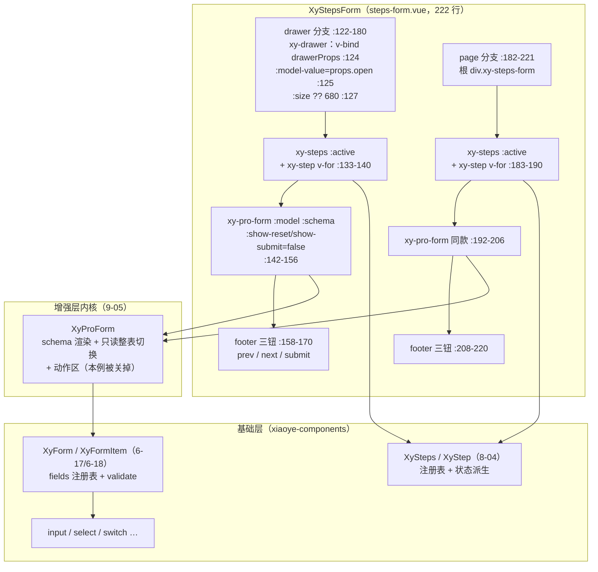
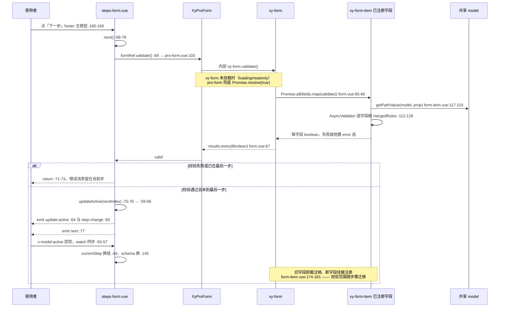
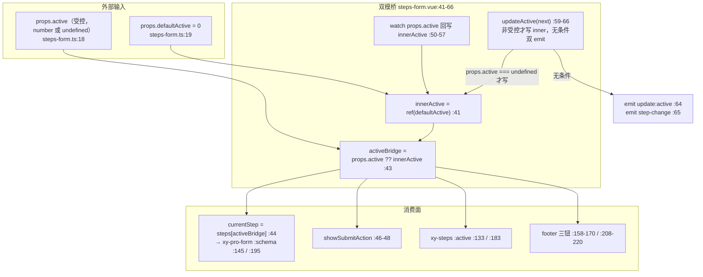

# 9-09 · StepsForm：分步表单

> 本篇是 9 卷"增强层（pro-components）"的第九篇。9-05 拆完装配车间 `XyProForm` 时留过一张清单：overlay-form、dialog-form、drawer-form、steps-form、request-form 五个"容器变体"共享同一台渲染引擎——前三个已在 9-06/9-07/9-08 里过堂完毕，本篇轮到第四个：`XyStepsForm`。核心问题按大纲只有一句话——**跨步骤模型共享与分步校验**——但这句话里至少压着五道题：所有步骤的字段值放在哪里、步骤切换时谁负责搬运；"下一步"之前的校验到底校验哪一部分字段，基础层 `xy-form` 的 `validateField` 范围限定用上了没有；步间导航的状态在受控与非受控之间怎么桥接；最后一步提交时抛出去的模型快照是怎么做出来的；以及它和 8-04 的 `Steps`、和 9-34 要写的 `ImportWizard` 各自分什么工。本篇照旧全部给实码定论：steps-form 自己的账面不大——src 两个文件共 257 行、样式 16 行、测试 98 行——但"分步"两个字背后的校验范围问题，会一路追问到基础层 form 的字段注册表，顺带在 git 里挖出一个 8-04 废弃战役遗留的违约现场。

接到题目先复述一遍目标，防止写偏：`packages/pro-components/steps-form` 要解决的问题，是把"基础信息 -> 补充配置 -> 提交确认"这类分阶段录入流程，收进一个组件里——步骤条、当前步的表单体、上一步/下一步/提交三个动作，全部由它编排。它不是把 `xy-steps` 和 `xy-pro-form` 摆在一行的胶水代码：**步骤条吃哪份数据、表单体渲染哪一组字段、校验只放行哪一部分输入、提交时交出什么形状的数据**，这四件事在源码里各有明确的答案。本篇先看类型面和视图面的全貌（第一节），再逐题解剖跨步模型共享（第二节）、分步校验（第三节）、步间导航（第四节），最后盘它与基础层 Steps、与 import-wizard 的分工（第五节），合账并给出 Element Plus 坐标系下的对照（第六节）。

## 一、先看货：35 行类型文件与 222 行双分支视图

先看类型文件全文。steps-form 的类型面没有 9-07 那种一行 Omit 的戏剧性，它的信息密度在**结构选择**上：

```ts
// packages/pro-components/steps-form/src/steps-form.ts（全文 35 行）
import type { ProFieldSchema } from "../../core";
import type { DrawerProps } from "xiaoye-components";
import type { DescriptionsProps } from "xiaoye-components";

export interface StepsFormStep {
  key: string;
  title: string;
  description?: string;
  schema?: ProFieldSchema[];
}

export interface StepsFormProps {
  model: Record<string, unknown>;
  steps: StepsFormStep[];
  placement?: "page" | "drawer";
  open?: boolean;
  title?: string;
  active?: number;
  defaultActive?: number;
  loading?: boolean;
  readonly?: boolean;
  readonlyDescriptionsProps?: Omit<DescriptionsProps, "items" | "title" | "extra">;
  submitting?: boolean;
  nextText?: string;
  prevText?: string;
  submitText?: string;
  drawerProps?: Omit<Partial<DrawerProps>, "modelValue" | "title">;
}

export interface StepsFormInstance {
  next: () => Promise<void>;
  prev: () => Promise<void>;
  submit: () => Promise<void>;
  close: () => void;
}
```

三个接口，三个层次。`StepsFormStep`（5-10 行）是"步骤"的一等公民化：一个步骤就是 `key` 加标题描述，外加一个**可选的 `schema` 数组**——注意类型来源，`ProFieldSchema` 从 `../../core` 引入（第 1 行），这正是 9-02 列过的"core.ts 直接消费方"名单里 steps-form 的位置：它和 pro-form、overlay-form、table-filter-drawer 一样，只消费 `ProFieldSchema` 这一条条款。`StepsFormProps`（12-28 行）15 个字段里只有一个必填——第 13 行的 `model: Record<string, unknown>`，**没有 `?`**。整个分步表单的模型哲学就压在这个没有问号的字段上：所有步骤共享一个数据对象，由使用方持有，组件不替你拆步暂存。`StepsFormInstance`（30-35 行）四个动作——`next`/`prev`/`submit` 是三个异步方法，`close` 是同步方法——与 9-06 OverlayForm 的 `validate/submit/close` 三动作相比，steps-form 把 `validate` 换成了 `next/prev` 一对导航动作：**校验不再单独暴露，它被编进了"下一步"的流程里**。这是分步表单与普通表单容器在实例协议上的第一个分野，第三节的时序图会展开它。

`drawerProps?: Omit<Partial<DrawerProps>, "modelValue" | "title">`（27 行）这条通道是 9-06/9-07 讲过的同款配方——受控源与被派生值在通道层除名，其余容器配置 Partial 透传。`rg` 数了一遍，全增强层这条配方的消费方共四个（overlay-form、table-filter-drawer、detail-panel、steps-form），配方一致性可见一斑。

再看视图层。`steps-form.vue` 全文 222 行，结构是"一段 script（1-119）加两段镜像模板"：

```vue
<!-- packages/pro-components/steps-form/src/steps-form.vue:1-119（script 段全文） -->
<script setup lang="ts">
import { computed, ref, watch } from "vue";
import { XyButton, XyDrawer, XyStep, XySteps } from "xiaoye-components";
import { XyProForm } from "../../pro-form";
import type { ProFormInstance } from "../../pro-form/src/pro-form";
import { cloneProValue } from "../../field-schema";
import type { StepsFormProps } from "./steps-form";

defineOptions({
  name: "XyStepsForm"
});

const props = withDefaults(defineProps<StepsFormProps>(), {
  steps: () => [],
  placement: "page",
  open: false,
  title: "",
  active: undefined,
  defaultActive: 0,
  loading: false,
  readonly: false,
  readonlyDescriptionsProps: () => ({}),
  submitting: false,
  nextText: "下一步",
  prevText: "上一步",
  submitText: "提交",
  drawerProps: () => ({})
});

const emit = defineEmits<{
  "update:active": [value: number];
  "update:open": [value: boolean];
  "step-change": [value: number];
  next: [value: number];
  prev: [value: number];
  submit: [payload: Record<string, unknown>];
  cancel: [];
  closed: [];
}>();

const innerActive = ref(props.defaultActive);
const formRef = ref<ProFormInstance | null>(null);
const activeBridge = computed(() => props.active ?? innerActive.value);
const currentStep = computed(() => props.steps[activeBridge.value]);
const resolvedTitle = computed(() => props.title || "分步表单");
const showSubmitAction = computed(
  () => !props.readonly && activeBridge.value === props.steps.length - 1
);

watch(
  () => props.active,
  (value) => {
    if (typeof value === "number") {
      innerActive.value = value;
    }
  }
);

function updateActive(nextValue: number) {
  if (props.active === undefined) {
    innerActive.value = nextValue;
  }

  emit("update:active", nextValue);
  emit("step-change", nextValue);
}

async function next() {
  const valid = await formRef.value?.validate();

  if (!valid || activeBridge.value >= props.steps.length - 1) {
    return;
  }

  const nextIndex = activeBridge.value + 1;
  updateActive(nextIndex);
  emit("next", nextIndex);
}

async function prev() {
  if (activeBridge.value <= 0) {
    return;
  }

  const nextIndex = activeBridge.value - 1;
  updateActive(nextIndex);
  emit("prev", nextIndex);
}

async function submit() {
  if (props.readonly) {
    return;
  }

  const valid = await formRef.value?.validate();

  if (!valid) {
    return;
  }

  emit("submit", cloneProValue(props.model));
}

function close() {
  emit("update:open", false);
}

function handleCancel() {
  emit("cancel");
  close();
}

defineExpose({
  next,
  prev,
  submit,
  close
});
</script>
```

script 段 119 行里值得逐段读的有五段。第一段 import（2-7 行）：基础层四个组件 `XyButton`、`XyDrawer`、`XyStep`、`XySteps` 一次引入，增强层只引 `XyProForm` 和它的 `ProFormInstance` 类型——第 5 行直接从 `../../pro-form/src/pro-form` 拿实现文件里的类型，绕过包入口，request-form 是同款姿势（`request-form.vue:5`），这是容器变体们共享引擎类型时的惯例；再加 `cloneProValue`（第 6 行）。第 3 行同时引入 `XyStep` 这件事值得先记一笔：本篇第五节的 git 考古会说明，这一行是刚刚才出现的——HEAD 上它还不存在，而那背后是 8-04 讲过的 `items` prop 废弃战役。

第二段 defineProps（13-28 行）：14 项默认值，其中 `active: undefined` 一项是有意为之的"非默认"——它保持了 `active` 的受控语义探针地位（`undefined` 才是非受控，第四节展开）。第三段 defineEmits（30-39 行）：八个事件，四个 `update:active`/`step-change`/`next`/`prev` 管导航，四个 `update:open`/`cancel`/`closed`/`submit` 管容器与提交。注意 `next`/`prev` 与 `update:active` 是**并存**的：前者是行为通知（"确实前进了"），后者是受控协议（"我请求变成这个值"），两层语义在第五节对照 import-wizard 时会有用。

第四段是状态骨架（41-57 行）：

- `innerActive`（41 行）：非受控模式下的内存态，初值 `defaultActive`；
- `formRef`（42 行）：指向内部 `XyProForm` 的实例句柄，类型是 9-05 的 `ProFormInstance`——分步校验的唯一入口；
- `activeBridge`（43 行）：`props.active ?? innerActive.value`，受控值优先的双模桥，4-04 讲过的受控/非受控双模在导航态上的又一次落地；
- `currentStep`（44 行）：`props.steps[activeBridge.value]`——**当前步对象是全组件唯一"步骤指针"，schema 渲染、插槽入参都从它派生**；
- `showSubmitAction`（46-48 行）：提交按钮的显隐条件是"非只读且已到最后一步"。

第五段是四个动作函数（59-111 行）：`updateActive` 负责写状态加双 emit，`next` 先校验后推进，`prev` 只推进不校验，`submit` 校验通过后抛出模型深拷贝快照。这四个函数是本篇后三节的主角，先按下不表。

模板段是两份镜像。抽屉分支（122-180 行）：

```vue
<!-- packages/pro-components/steps-form/src/steps-form.vue:122-180（drawer 分支全文） -->
  <xy-drawer
    v-if="props.placement === 'drawer'"
    v-bind="props.drawerProps"
    :model-value="props.open"
    :title="resolvedTitle"
    :size="props.drawerProps?.size ?? 680"
    class="xy-steps-form xy-steps-form--drawer"
    @update:model-value="emit('update:open', $event)"
    @closed="emit('closed')"
  >
    <div class="xy-steps-form__body">
      <xy-steps :active="activeBridge">
        <xy-step
          v-for="step in props.steps"
          :key="step.key"
          :title="step.title"
          :description="step.description"
        />
      </xy-steps>

      <xy-pro-form
        ref="formRef"
        :model="props.model"
        :schema="currentStep?.schema ?? []"
        :loading="props.loading"
        :readonly="props.readonly"
        :readonly-descriptions-props="props.readonlyDescriptionsProps"
        :submitting="props.submitting"
        :show-reset="false"
        :show-submit="false"
      >
        <template v-if="$slots.default" #default>
          <slot :step="currentStep" :active="activeBridge" />
        </template>
      </xy-pro-form>

      <div class="xy-steps-form__footer">
        <xy-button :disabled="activeBridge === 0" @click="prev">{{ props.prevText }}</xy-button>
        <xy-button
          v-if="activeBridge < props.steps.length - 1"
          type="primary"
          @click="next"
        >
          {{ props.nextText }}
        </xy-button>
        <xy-button v-else-if="showSubmitAction" type="primary" :loading="props.submitting" @click="submit">
          {{ props.submitText }}
        </xy-button>
      </div>
    </div>

    <template #footer>
      <div class="xy-steps-form__drawer-footer">
        <slot name="footer">
          <xy-button @click="handleCancel">关闭</xy-button>
        </slot>
      </div>
    </template>
  </xy-drawer>
```

页面分支（182-222 行）：

```vue
<!-- packages/pro-components/steps-form/src/steps-form.vue:182-222（page 分支全文） -->
  <div v-else class="xy-steps-form">
    <xy-steps :active="activeBridge">
      <xy-step
        v-for="step in props.steps"
        :key="step.key"
        :title="step.title"
        :description="step.description"
      />
    </xy-steps>

    <xy-pro-form
      ref="formRef"
      :model="props.model"
      :schema="currentStep?.schema ?? []"
      :loading="props.loading"
      :readonly="props.readonly"
      :readonly-descriptions-props="props.readonlyDescriptionsProps"
      :submitting="props.submitting"
      :show-reset="false"
      :show-submit="false"
    >
      <template v-if="$slots.default" #default>
        <slot :step="currentStep" :active="activeBridge" />
      </template>
    </xy-pro-form>

    <div class="xy-steps-form__footer">
      <xy-button :disabled="activeBridge === 0" @click="prev">{{ props.prevText }}</xy-button>
      <xy-button
        v-if="activeBridge < props.steps.length - 1"
        type="primary"
        @click="next"
      >
        {{ props.nextText }}
      </xy-button>
      <xy-button v-else-if="showSubmitAction" type="primary" :loading="props.submitting" @click="submit">
        {{ props.submitText }}
      </xy-button>
    </div>
  </div>
</template>
```

两段并排一读就能发现：`xy-steps` 块、`xy-pro-form` 块、footer 块在两个分支里**逐字相同**（145 行的 `:schema="currentStep?.schema ?? []"` 与 195 行同一行代码一字不差；`ref="formRef"` 也是两处各挂一份，靠 Vue 的模板 ref 在任一时刻只有一个分支渲染来保证唯一）。差异只在最外层包裹：抽屉分支多出 `v-bind="props.drawerProps"`、`:model-value="props.open"`、`:title="resolvedTitle"`、`:size ?? 680` 四个绑定和 `#footer` 具名插槽。这里先立起本篇第一个结构性观察（它同时也是第四节的权衡四）：**222 行里有约 90 行是双分支镜像**。9-06 的 overlay-form 选择了"多态内核"——一个组件内部按 `container` 分支渲染，dialog-form/drawer-form 再做单态薄壳；steps-form 则选择了"外层 v-if 平铺两个分支"。为什么同样的"页面或抽屉"诉求，两处选择了不同结构？第四节给实码定论。

组件诞生于 a32e399（2026-03-30，"feat: 新增 pro 组件并增强表单与表格能力"），此后只有一次提交级改动：dc9ca28（2026-09-14，基础设施依赖治理）把基础层引用从 `@xiaoye/components` 统一改成 npm 包名 `xiaoye-components`：

```diff
// dc9ca28 对 steps-form 的改动（git show dc9ca28 -- packages/pro-components/steps-form 摘录）
-import type { DrawerProps } from "@xiaoye/components";
-import type { DescriptionsProps } from "@xiaoye/components";
+import type { DrawerProps } from "xiaoye-components";
+import type { DescriptionsProps } from "xiaoye-components";
```

登记录入按 AGENTS.md 的清单走：`steps-form/index.ts:11` 一行 `withInstall(StepsForm, "xy-steps-form")` 完成 4-02 的安装协议包装；`component-manifest.json:42-49` 八行条目（`installExports: ["XyStepsForm"]`、`installChecks` 指向 `xy-steps-form`、`styleImports: ["steps-form"]`），`exports.ts:6` 导出组件值，包根 `index.ts:31-35` 导出三个类型（与 `check-pro-components.mjs:16` 的白名单 `"steps-form": ["StepsFormInstance", "StepsFormProps", "StepsFormStep"]` 严格一致——三个类型恰好是 35 行类型文件的全部导出，一个不多），样式 `style.css:7` 一行 `@import "../theme/src/pro/steps-form.css"` 指向一个 16 行的布局文件。样式薄得和功能相称：

```css
/* packages/theme/src/pro/steps-form.css（全文 16 行） */
.xy-steps-form {
  display: flex;
  flex-direction: column;
  gap: 18px;
}

.xy-steps-form__footer {
  display: flex;
  justify-content: flex-end;
  gap: 12px;
}

.xy-steps-form__drawer-footer {
  display: flex;
  justify-content: flex-end;
}
```

三个选择器全是布局（纵向栈、footer 右对齐），没有任何视觉皮肤——步骤条的样子来自 8-04 的 steps，表单的样子来自 9-05 的 pro-form。steps-form 自己的视觉贡献只有"间距"。

整个组件的拓扑画出来是这样：



这张图交代了 9-05 引用清单里 `steps-form.vue 142-156 / 192-197` 那两段"消费段"的确切位置：142-156 是抽屉分支的 `xy-pro-form` 全节点，192-197 是页面分支同一节点的开头六行——两个变体各自消费一次引擎，pro-form 在这里被用成"无动作区、按步骤换 schema"的裸渲染面。

## 二、跨步骤模型共享：单模型全量持有的账

现在回答核心问题的一半：所有步骤的字段值放在哪里？

实码答案短到只有一行：第一节引过的两段模板里的 `:model="props.model"`（144 行、194 行）。`model` 是使用方 `reactive` 出来的对象，steps-form 原样递给 `XyProForm`，pro-form 再原样递给 `xy-form`（`pro-form.vue:132`），每个字段组件通过 `updateProModelValue(props.model, field.prop, value)` 直接写进这个对象（`pro-form.vue:167-169`）。**组件全程不持有任何字段值的副本，不区分"这一步的字段"和"那一步的字段"**——所有步骤的输入都落在同一个 `model` 的不同 key 上，唯一区分步骤的东西是"哪一组 key 当前被渲染"。用第 1 步的 schema 只含 `name/owner`、第 2 步只含 `enabled/remark` 的 `basic.vue` 示例来说，`formModel` 四个 key 从挂载第一刻起就全部存在，第 2 步编辑时第 1 步的值安静地待在对象里，回退时它们又出现在界面上——**"跨步骤共享"不是被实现的，是被"不拆"实现的**。

这套"单模型全量持有"是本篇的**权衡一：单模型全量持有 vs 每步暂存合并**。后一种方案的形状是：每个步骤一个独立数据容器，"下一步"通过时把当前步的值合并进总模型，回退时再拆回来。它的理论收益是每步的数据边界清晰、提交时可以选择性汇总；代价清单则长得多——合并要写深浅拷贝策略（嵌套对象、数组字段合并是经典雷区），回退要决定"已合并的值是保留还是回滚"，受控 `active` 被外部直接跳步时合并逻辑要补上中间步骤的空缺，`loading` 期间异步预填的数据要和暂存区做同步。steps-form 的实码里这些代码**一行都不存在**，因为它选了另一边：数据只有一份，步骤只是"视图过滤条件"。付出的代价同样要摊开说：其一，提交载荷是**全量 model**——第 2 步提交时 payload 里带着第 1 步的所有字段，组件不做筛选，要不要用是提交回调的事（`submit` 事件的载荷类型就是整个 `Record<string, unknown>`，`steps-form.vue:36`）；其二，模型里存在"当前步看不到但仍然生效"的字段——校验范围问题（下一节）由此而来；其三，字段名冲突没有防线，两个步骤的 schema 若声明了同一个 `prop`，它们写的是同一个 key，后渲染的覆盖先渲染的，组件不告警。三笔代价换来的收益是：回退天然保数据、步骤增删不迁移数据结构、与 `xy-form` 的 model 协议零适配。对一个"分阶段录入同一份申请材料"的主场景，这笔账是划算的——分步表单的分步是**认知的分步，不是数据的分步**。

提交时刻的模型快照是这条数据流的终点。`submit`（90-102 行）校验通过后执行 `emit("submit", cloneProValue(props.model))`，快照由 9-03 拆过的 `cloneProValue` 完成：

```ts
// packages/pro-components/field-schema.ts:72-81（原文）
export function cloneProValue<T>(value: T): T {
  const rawValue =
    value !== null && typeof value === "object" ? (toRaw(value) as T) : value;

  if (typeof globalThis.structuredClone === "function") {
    return globalThis.structuredClone(rawValue);
  }

  return JSON.parse(JSON.stringify(rawValue)) as T;
}
```

`toRaw` 先剥响应式代理，`structuredClone` 优先、JSON 序列化兜底。这里和 9-05 引擎的 `submit`（`pro-form.vue:92`）是同一个函数的两次调用——引擎的提交快照协议被 steps-form 原样继承。深拷贝在这一刻是必需品而不是洁癖：`model` 是使用方的 reactive 对象，若 emit 出去的是引用，提交回调里对 payload 的任何修改（比如补充审计字段）都会直接污染表单界面；分步场景还多一层——提交之后表单往往还留在最后一步，快照保证了"提交时的数据"和"界面上还在编辑的数据"从此各走各的。顺带看一眼双击防护的责任划分：`submit` 函数自身没有任何防重入判断，守门交给了按钮层——提交钮绑了 `:loading="props.submitting"`（167/217 行），而 `xy-button` 内部 `isDisabled = props.disabled || props.loading`（`use-button.ts:30`），`handleClick` 在禁用态直接短路（`use-button.ts:52-54`）。submitting 期间的连点被按钮吃掉，函数层零成本。

把这个模型协议放到 Element Plus 与 Ant Design 的坐标系里对照一次。Element Plus 官方组件里**没有 StepsForm**——`el-steps` 与 `el-form` 的组合由业务方手写，"当前步渲染哪些字段、下一步前校验什么、提交时数据怎么汇总"三个问题每个项目各答一遍；Model 共享倒是常见的朴素写法（每个步骤手写 `v-if` 的表单项绑同一个 reactive 对象），但没有任何机制保证步骤间字段名不撞、卸载的校验状态被清理。Ant Design ProComponents 里有现成的 `StepsForm`，而它的模型协议与 steps-form 相反：每一步是独立的 `StepsForm.StepForm` 子表单，各自持有字段状态，步骤的 `onFinish` 触发"提交当前步并自动前进"，全部步骤的值在最终 `onFinish` 时才由容器汇总合并——是教科书式的"每步暂存 + 末步合并"。两种协议没有绝对优劣：antd 的按步 onFinish 让"每步一个独立保存动作"（例如先存草稿再传附件）很好写，但跨步回退时值在哪个容器里、合并时的浅拷贝策略是什么，心智负担都压在使用者身上；steps-form 的单模型让"随时回退、数据都在"成为零成本默认，但"只想提交当前步"这种需求就没有表达位。**本库把这个取舍钉在了 Props 类型上**——`model` 无问号、必填、无每步容器，类型即文档。

## 三、分步校验：结构性范围限定，不是 validateField 范围限定

核心问题的另一半：点"下一步"时校验的到底是什么？

先看入口的实码。`next`（68-78 行）：

```ts
async function next() {
  const valid = await formRef.value?.validate();

  if (!valid || activeBridge.value >= props.steps.length - 1) {
    return;
  }

  const nextIndex = activeBridge.value + 1;
  updateActive(nextIndex);
  emit("next", nextIndex);
}
```

一行 `formRef.value?.validate()`，把校验完全委托给 9-05 的 `ProFormInstance`。往下追一层，pro-form 的 expose（`pro-form.vue:102-107`）把 `validate` 转发给内部 `xy-form`，再往下是基础层 form 的全部真相：

```ts
// packages/components/form/src/form.vue:65-91（原文）
async function validate() {
  const results = await Promise.all(fields.map((field) => field.validate()));
  const valid = results.every(Boolean);

  if (!valid && props.scrollToError) {
    fields.find((field, index) => !results[index])?.element?.scrollIntoView({
      behavior: "smooth",
      block: "center"
    });
  }

  return valid;
}

async function validateField(prop?: FormProp | FormProp[], trigger?: FormTrigger) {
  const targets = normalizeProps(prop);
  const results = await Promise.all(targets.map((field) => field.validate(trigger)));
  return results.every(Boolean);
}

function resetFields(prop?: FormProp | FormProp[]) {
  normalizeProps(prop).forEach((field) => field.resetField());
}

function clearValidate(prop?: FormProp | FormProp[]) {
  normalizeProps(prop).forEach((field) => field.clearValidate());
}
```

答案在这 27 行里：`validate()` 对 `fields` 注册表做 `Promise.all` 全量并发校验——**而"fields 注册表"里只有当前挂载着的字段**。6-17 拆过这条注册表的生命周期：每个 `xy-form-item` 在 `onMounted` 里 `addField`、`onBeforeUnmount` 里 `removeField`（`form-item.vue:174-181`），且 `validate()` 对没有 `prop` 的展示型表单项恒返回 true（`form-item.vue:87-90`）。于是"分步校验"的实现机制浮出水面，这也是本篇的**权衡二：validateField 范围限定 vs 结构性范围限定**。按 prop 名单限定校验范围的写法是：`next` 时调 `validateField(props.steps[activeBridge.value]` 的字段名数组`)`——基础层有这个 API（上面 79-83 行），但 steps-form **没有用它**，连 `props.rules` 这个表单级规则通道都没有透传（`StepsFormProps` 的 15 个字段里没有 rules，pro-form 的 `:rules` 在两个分支里都没绑）。它选的是另一条路：**让"不在当前步的字段"根本不存在于注册表里**。schema 通道下，`:schema="currentStep?.schema ?? []"`（145/195 行）随步骤整体换组，pro-form 的 `visibleSchema` 再滤掉 hidden 字段（`pro-form.vue:57-59`），上一步骤的字段节点随渲染切换被卸载，注册表同步缩表；插槽通道下，范围限定交还给使用者的 `v-if`——官方示例 `drawer-release.vue` 里每个 `xy-form-item` 都挂着 `v-if="active === 0"` 这类条件（`drawer-release.vue:40-55`），切步即卸载。两条通道殊途同归：`validate()` 全量并发的"全量"永远等于"当前步"。

校验规则从哪里来也要交代清楚，这里有一个容易误读的边界。`ProFieldSchema`（`core.ts:106-124`）里与校验相关的字段只有 `required?: boolean`（121 行），pro-form 渲染 schema 字段时只给 `xy-form-item` 传 `label/prop/required/help` 四个 prop（`pro-form.vue:148-152`），而 `xy-form-item` 对 `required` 的处理是**内建一条必填规则**插进 mergedRules（`form-item.vue:72-77`，消息按 label 派生"请填写XX"）。所以 schema 通道的校验能力只有"必填"一档；正则、长度、自定义 validator 这些规则，只能走插槽通道手写 `xy-form-item` 并给它绑 `:rules`（form-item 自己接受 rules prop，`form-item.vue:69`），或者干脆不依赖组件、把复杂校验放进提交回调。文档页 `steps-form.md` 的 API 表里没有 rules 行——文档与实码在这条边界上是诚实的：**steps-form 管的是"分步时校验的时机与范围"，不管"校验规则的 expressiveness"**。

把"下一步"按钮点击后的完整链路画成时序图：



这张图末尾的 Note 是分步校验的精髓：**校验范围不是被检查出来的，是随渲染迁移的**。`next` 的两段式返回条件（`!valid ||` 已在最后一步）也值得读一句：在最后一步上调用暴露的 `next()`，校验仍会执行（错误消息会显示出来），只是不推进——校验与导航在最后一步解耦，`showSubmitAction` 接管按钮位。

顺着这条链做四则边界审计，前三则是实码可证的行为边界，第四则是本篇实测出的示例层失真：

**审计一：`loading` 态下校验空转放行。** pro-form 的模板里，`loading` 为 true 时 `xy-form` 根本不渲染，取而代之的是加载占位（`pro-form.vue:124-127`）。此时 `formRef` 在 pro-form 内部指向 null，它的 `validate` 走 `?? Promise.resolve(true)` 兜底（`pro-form.vue:103`）——于是"下一步"在 loading 期间点了会**免校验直接过**。这不是 steps-form 的 bug，是"结构性范围限定"的自然推论：字段不在注册表里，就没有东西可校验，空注册表的 `every(Boolean)` 恒真。要堵住它，使用者该在 loading 期间禁用按钮（传 `:loading` 的同时自己控制动作区）——组件把这层防线留给了宿主。

**审计二：受控 `active` 跳步可以绕过中间步骤的校验。** `activeBridge` 接受任意受控值，父组件把 `active` 从 0 直接改成 2，第 1 步的校验从未执行。同样地，最后一步的 `submit` 只校验最后一步**已挂载**的字段——第 1 步的必填字段若从未被走过一遍，提交时不会有人拦它。分步校验的真实保证因此要念准：**它保证"顺序走完流程的人每一步都被守门"，不保证"到达最后一步的数据全量合法"**。文档页 `steps-form.md:30` 把"跨步回填策略"划出边界声明，实码层面这条边界的准确形状就是上面这句话。补全量守门需要组件在提交时按全部步骤的 schema 脱离渲染跑一遍 model 校验——那是在 field-schema 层重造一台 async-validator 编排机器，成本与收益在当前定位下不成比例，组件选择了不做并把边界写进文档。

**审计三：`prev` 不校验。** `prev`（80-88 行）只有边界守卫没有 `validate`——回退永远放行。方向上的不对称是有语义的：前进是"宣称这一步完成了"，必须守门；回退是"我要回去改"，拦它没有意义，而且校验失败的红字状态本来就该留着让人改。对比 antd StepsForm 的 `pre` 同样不校验，这是两家不约而同的共识。

**审计四：官方示例里的"双通道幻觉"。** 这是本篇写作中实测出的一处示例与实码不符，值得记录全过程。`basic.vue` 是文档站的头号示例，它的 steps 声明了 schema（`basic.vue:9-47`），同时又写了一整段默认插槽，里面的 `xy-form-item` 还挂着 `v-if="!reviewMode && currentActive === 0"` 这样的切步条件（`basic.vue:85-98`）——看上去在演示"schema 与插槽混用"。但 pro-form 的渲染分派是互斥的：`<slot v-if="!hasSchemaFields">`（`pro-form.vue:140`），schema 有字段时默认插槽整个不实例化。本篇用一条临时用例实测：schema 与插槽并存挂载后，插槽探针节点不存在、字段标签由 schema 通道渲染、插槽内容连同它的 `v-if` 范围限定从未生效——**basic.vue 的整段插槽是死代码**，真正干活的是 schema 通道（连 `valueType: "tag"` 的 `enabled` 字段在编辑态也退化为默认输入框，`resolveProFieldComponent` 只认 `component` 不认 `valueType`，`field-schema.ts:97-103`）。这层幻觉的代价是双向的：读者以为示例里的 `xy-form-item` 在参与渲染与校验注册（它们若真渲染，带着的 `prop` 会进校验注册表），实际切步范围限定走的是 schema 换组；反过来，想演示插槽通道就该像 `drawer-release.vue` 一样不给 schema。第二节基于 basic.vue 的数据流描述不受影响——`formModel` 的四个 key 经 schema 的 `updateProModelValue` 写入——但它的"界面"全部出自 schema 通道，与插槽无关。

## 四、步间导航与状态桥：activeBridge、双 emit 与双分支镜像

导航态的完整数据结构只有 41-66 行那三块：`innerActive` 内存态、`activeBridge` 桥、`updateActive` 写入口。画成图：



四个消费面全部只读 `activeBridge`，没人直接读 `props.active` 或 `innerActive`——单一代入点。`updateActive` 的写法藏着两个细节。其一，**非受控分支只在 `props.active === undefined` 时写 `innerActive`**：受控模式下 inner 不动（由 watch 保持同步），一切以外部回写为准。其二，**双 emit 无条件执行**：`update:active`（受控协议，让 `v-model:active` 生效）与 `step-change`（行为通知，"步骤确实要变了"）各发各的。9 卷前几篇反复出现的"受控源唯一"原则在这里的形态是：写路径分叉（受控/非受控各写各的源），通知路径汇合（两个事件都发，谁需要谁听）。

事件顺序的账也要记准。点一次"下一步"且校验通过，事件的落地顺序是：`update:active`（64 行）→ `step-change`（65 行）→ `next`（77 行）。`next` 事件特意放在 `updateActive` 之后并且携带新索引，语义是"已经决定前进到 newIndex"而非"请求前进"——监听方在 `@next` 里做埋点、做懒加载下一步数据，拿到的是既成事实。`prev` 与之对称（87 行）。

`prev` 与 `next` 的另一个差异在返回值设计上：两个都是 `async function`，但 `prev` 函数体内没有任何 `await`——它的 `Promise<void>` 签名（`steps-form.ts:32`）纯粹是为了与 `next`/`submit` 在 `StepsFormInstance` 里形状对称。实例协议的整齐在这里压过了最小实现原则，这类"为了 expose 面一致而多写的 async"是无害的一致性税。

接下来是第四节的两处设计判断，各立一个权衡。**权衡三：导航编排收容器 vs 收基础层**——steps-form 没有把"下一步/上一步"下放给步骤条。8-04 拆过 `xy-steps` 的协议面：它 provide 的是读协议（active、direction、注册表）加注册方法，`step` 节点的头部**没有点击跳转的交互**，父组件唯一的对外事件是 `change`（active 变化的新旧值对）。steps-form 对这套协议的消费因此极薄：只绑一个 `:active="activeBridge"`（133/183 行），不给 step 任何点击行为，导航权完全收在 footer 的两个按钮和受控 `active` 上。这是一个克制的选择：步骤条在这里是**进度显示**不是**导航控件**——如果点第 3 步的标题就能跳过去，审计二的"绕过校验"就从受控用法的外部性变成组件内建的默认行为，分步校验的守门语义会被自己的 UI 击穿。想要"可点的步骤条"，正确姿势是在受控模式下由父组件自己决定放行条件，而不是让容器替你放行。

再看权衡四的现场。第二节并排引过的两个分支，抽屉版 59 行、页面版 41 行，其中约 40 行逐字重复。消掉这 90 行镜像的备选方案至少有三个：抽一个内部子组件（把 steps+form+footer 包成 `StepsFormBody`）；用 `<component :is>` 动态包裹（抽屉/页面两种外壳统一成一个动态节点）；或者学 overlay-form 走"多态内核"（一个组件里按 container 分支渲染，9-06 的路）。实码三个都没选，平铺了两个分支。给出的理由要从"消镜像的成本"看：`xy-drawer` 不是一个纯包裹节点——它有受控的 `model-value`/`update:model-value` 开合协议、有 `#footer` 具名插槽放关闭按钮、有 `closed` 动画事件、有 `size ?? 680` 的兜底；把这些装进 `component :is` 意味着动态节点的 props 与插槽都要条件化，可读性反而塌掉；抽内层子组件则要多一层 props/插槽/事件的透传面（footer 插槽要穿两层才能到 drawer 的具名插槽位），对一个总共 222 行的组件，透传层的成本超过镜像层的成本。overlay-form 之所以值得多态内核，是因为它有 322 行真逻辑共享；steps-form 的分支之间共享的只有模板骨架，没有一段逻辑分支。**镜像 90 行的维护风险主要是"改一处忘一处"，而这个风险被两个分支逐字相同的现状压到很低——任何一次修改在 diff 里都会呈现出必须成对的形状**。这是小组件的诚实选择：不为想象中的增长预付抽象成本。

顺带补一个与 9-06 的对照数字：steps-form 抽屉的宽度兜底是 `:size="props.drawerProps?.size ?? 680"`（127 行），overlay-form 抽屉是 `?? 560`（`overlay-form.vue:195`）。同一个"通道值优先、组件兜底"的写法，两个组件给了不同的默认宽——分步表单的步骤条占横向空间，680 比 560 宽出一截，这个数字差异是两个容器各自使用场景的体感校准，不是失同步。还有一处双模不对称要点名：`active` 有完整的非受控桥（`innerActive`），**`open` 没有**——抽屉开合只有受控一种模式（`:model-value="props.open"` 直绑 props，`close()` 只 emit `update:open`），文档表格如实把 `open` 标注为"受控模式"。为什么开合不做双模？抽屉分步表单几乎总是由外层业务状态驱动（列表页点"发起流程"才打开），开合源留在使用方手里能避免"内外两个开合真相"；而 `active` 的非受控桥服务的是"页面内自走流程"的轻用法。两个导航量、两种模式供给，各对其场景。

## 五、与 Steps 的组合、与 import-wizard 的分工

第五节收两笔关系账。第一笔是 8-04 的 Steps。上文说过消费面的样子：`xy-steps` 拿 `:active`、`xy-step` 拿 `title/description`，纯读协议，不点跳。但这条消费关系在 git 里有一个反转的现场，值得完整讲一遍，因为它把 8-04 的"items 废弃战役"接到了增强层的地面上。HEAD（dc9ca28）版本的 steps-form，渲染步骤条用的是**items 传参**：

```vue
<!-- HEAD（dc9ca28）版本的 xy-steps 用法：git show HEAD:.../steps-form.vue 第 132-141 行 -->
<xy-steps
  :active="activeBridge"
  :items="
    props.steps.map((step) => ({
      key: step.key,
      title: step.title,
      description: step.description
    }))
  "
/>
```

8-04 拆过这场废弃战役的三个设计选择：`items` 字段保留但类型降为 `unknown`、运行时 `warnOnce` 告警一次、JSDoc 指路插槽写法。软着陆的代价是"存量调用方要迁回插槽写法"——而 HEAD 上的 steps-form 就是那个尚未迁移的存量调用方：`XySteps` 对 items 的处理是 `warnOnce` 后**当作不存在**（`steps.vue:26-28`），默认插槽为空，于是步骤条渲染出一个空壳，开发期控制台里躺着一条 `[XySteps] 不支持 items prop` 的告警。本篇写作时，工作区里正躺着一组尚未提交的改动把这里修掉了：`steps-form.vue` 引入 `XyStep` 并在两个分支里改成插槽渲染 `xy-step`（即本文引用的 133-140/183-190 行实态），测试同步补了一个回归用例：

```ts
// packages/pro-components/steps-form/__tests__/steps-form.spec.ts:39-55（工作区新增用例）
  it("步骤条真实渲染 xy-step 节点", () => {
    const wrapper = mount(XyStepsForm, {
      props: {
        model: {},
        steps: [
          { key: "basic", title: "基础信息" },
          { key: "confirm", title: "确认信息" }
        ]
      }
    });

    expect(wrapper.findAll(".xy-steps__item")).toHaveLength(2);
    expect(wrapper.findAll(".xy-steps__title").map((node) => node.text())).toEqual([
      "基础信息",
      "确认信息"
    ]);
  });
```

用例断言的不是"步骤配置存在"，而是 `.xy-steps__item` 节点**真实渲染出两个**——这正是"items 传参静默失败"的对症检测：改成再传 items 的写法，DOM 里一个节点都没有，断言立刻红。8-04 的战役在基础层收了官，最后一个违约现场在增强层清掉，本篇把它记为一次跨层联动的实码存照。**这也回答了"与 8-04 steps 的关系"的实码定论：steps-form 消费基础层 Steps 组件做导航条，消费面只有 active 下发与标题描述渲染，状态派生（wait/process/finish，`step.vue:130-148`）全部留在 Steps 内部，两层职责零交叉。**

第二笔账是测试全貌。98 行三个用例，恰好对准三条职责：

```ts
// packages/pro-components/steps-form/__tests__/steps-form.spec.ts（全文 98 行）
import { mount } from "@vue/test-utils";
import { defineComponent, h, nextTick } from "vue";
import { describe, expect, it, vi } from "vitest";
import { XyStepsForm } from "@xiaoye/pro-components";

describe("XyStepsForm", () => {
  it("支持渲染步骤并推进到下一步", async () => {
    const wrapper = mount(XyStepsForm, {
      props: {
        model: {
          name: "小叶"
        },
        steps: [
          {
            key: "basic",
            title: "基础信息"
          },
          {
            key: "confirm",
            title: "确认信息"
          }
        ]
      },
      slots: {
        default: ({ step }: { step: { title: string } }) =>
          h("div", { class: "step-slot" }, step.title)
      }
    });

    expect(wrapper.text()).toContain("基础信息");

    await wrapper.get(".xy-button--primary").trigger("click");
    await nextTick();

    expect(wrapper.emitted("update:active")?.[0]?.[0]).toBe(1);
    expect(wrapper.emitted("next")?.[0]?.[0]).toBe(1);
  });

  it("步骤条真实渲染 xy-step 节点", () => {
    const wrapper = mount(XyStepsForm, {
      props: {
        model: {},
        steps: [
          { key: "basic", title: "基础信息" },
          { key: "confirm", title: "确认信息" }
        ]
      }
    });

    expect(wrapper.findAll(".xy-steps__item")).toHaveLength(2);
    expect(wrapper.findAll(".xy-steps__title").map((node) => node.text())).toEqual([
      "基础信息",
      "确认信息"
    ]);
  });

  it("readonly + schema 时使用只读展示协议并隐藏提交动作", () => {
    const wrapper = mount(XyStepsForm, {
      props: {
        readonly: true,
        model: {
          owner: "小叶",
          status: "reviewing"
        },
        steps: [
          {
            key: "review",
            title: "复核信息",
            schema: [
              {
                prop: "owner",
                label: "负责人"
              },
              {
                prop: "status",
                label: "状态",
                valueType: "tag",
                options: [
                  {
                    label: "审核中",
                    value: "reviewing",
                    status: "warning"
                  }
                ]
              }
            ]
          }
        ]
      }
    });

    expect(wrapper.find(".xy-descriptions").exists()).toBe(true);
    expect(wrapper.text()).toContain("负责人");
    expect(wrapper.text()).toContain("小叶");
    expect(wrapper.text()).toContain("审核中");
    expect(wrapper.text()).not.toContain("提交");
  });
});
```

第一个用例（7-37 行）验证推进协议：非受控模式下点主按钮，`update:active` 与 `next` 两个事件各落一笔、值都是 1——注意用例里的 steps 没有任何 schema，插槽渲染标题，主按钮能推进隐含了"空 schema 步骤的校验恒过"（空注册表 `every(Boolean)` 恒真，审计一的孪生情形）。第二个用例即前述回归。第三个用例（57-97 行，9-05 引用清单里那行"57"的出处）验证只读协议：`readonly: true` 加 schema 步骤，渲染出来的是 `xy-descriptions`（pro-form 的只读整表切换在分步容器里原样生效，`valueType: "tag"` 的选项映射成"审核中"标签），且页面上连"提交"两个字都没有——`showSubmitAction` 的 `!props.readonly` 条件（46-48 行）把只读态的提交按钮连根拔掉。校验逻辑、镜像分支的抽屉形态，测试里一条都不直接覆盖：前者属于 xy-form/pro-form 的测试职责（薄容器的测试只测自己引入的东西，9-07 立过的规矩），后者是纯模板分支，靠两个镜像块逐字相同来兜。

第三笔账是 9-34 的 import-wizard。把它的模板全文放进来对照，分工一目了然：

```vue
<!-- packages/pro-components/import-wizard/src/import-wizard.vue:37-79（模板全文） -->
<template>
  <xy-card class="xy-import-wizard" :header="props.title">
    <xy-steps :active="activeBridge">
      <xy-step
        v-for="step in props.steps"
        :key="step.key"
        :title="step.title"
        :description="step.description"
      />
    </xy-steps>
    <div class="xy-import-wizard__body">
      <slot :step="currentStep" :active="activeBridge" />
    </div>
    <div class="xy-import-wizard__footer">
      <xy-button
        :disabled="activeBridge === 0"
        @click="
          () => {
            const prevIndex = activeBridge - 1;
            updateActive(prevIndex);
            emit('prev', prevIndex);
          }
        "
      >
        上一步
      </xy-button>
      <xy-button
        v-if="activeBridge < props.steps.length - 1"
        type="primary"
        @click="
          () => {
            const nextIndex = activeBridge + 1;
            updateActive(nextIndex);
            emit('next', nextIndex);
          }
        "
      >
        下一步
      </xy-button>
      <xy-button v-else type="primary" @click="emit('finish')">完成</xy-button>
    </div>
  </xy-card>
</template>
```

两兄弟的骨架几乎同构：同样的 `innerActive`/`activeBridge`/`updateActive` 三件套（`import-wizard.vue:24-34`），同样的 `xy-steps` + 插槽体 + 三钮 footer。差异全部在"步骤与数据的关系"上，而且每一处都指向同一个方向：import-wizard **没有 `model` prop**（`import-wizard.ts` 的 Props 里没有它），没有表单体、没有校验、没有 readonly、没有提交快照——body 是一个裸插槽，"下一步"内联在模板里、不经过任何校验，最后一步的按钮事件叫 `finish` 而不是 `submit`。它是**分步编排的通用壳**：步骤里放上传组件、放结果表格、放任何东西，数据流自己管自己。steps-form 则是分步编排的**表单特化**：`model` + `schema`/表单插槽 + 校验守门 + 提交快照，四件事一样不少。大纲（`column/02-分卷大纲.md:188`）把 9-34《ImportWizard：导入向导》的前置依赖标成 9-09，正是这个分工的注脚——导入向导的分步上传/校验/结果编排，复用的是 steps-form 这里趟出来的"分步导航三件套"，而把"每步是什么内容"完全交给插槽。顺带一个实现层的小对照：import-wizard 的前进/后退逻辑内联在模板的箭头函数里（51-75 行），steps-form 把同样的逻辑收进 `next`/`prev` 两个函数并暴露出去——后者能被 `ref` 调用、能被测试直接驱动，前者连一个 `defineExpose` 都没有（`import-wizard.ts` 全文 12 行也只有 Props 两个接口，没有 Instance 类型）。同族组件里"要不要把编排逻辑收进 expose 面"，steps-form 给的是更完整的答案。

## 六、合账：实码定论与 EP 坐标系

把本篇的定论合拢。先正面回答两个悬了一路的问题，再给对照表。

**其一，跨步骤模型共享的实码定论：单模型全量持有。** `model` 是唯一的必填 prop，两个分支原样直传，无暂存、无合并、无每步容器；步骤只是渲染与校验的过滤条件；提交时 `cloneProValue` 抛出全量深拷贝快照。代价（全量载荷、跨步字段残留、字段名冲突无防线）与收益（回退保数据、零合并逻辑、与 xy-form 协议零适配）在第二节摊过，选型钉在 `model` 的无问号类型上。

**其二，分步校验的实码定论：结构性范围限定。** 不用 `validateField` 的 prop 名单，不透传表单级 rules；校验范围 = 当前挂载的字段集 = 当前步的 schema 组或插槽 `v-if` 组。规则能力的供给面是"schema.required 内建必填 + 插槽内手写 form-item rules"两条；保证的是顺序流程的逐步守门，不是全量数据完整性；loading 空转放行与受控跳步绕过是两个已知行为边界，示例层的"双通道幻觉"（basic.vue 的死插槽）是第三笔记录在案的失真，边界形状与文档页的边界声明吻合。

把全套账画成一张对照表收束：

| 维度 | 实码答案 | 关键证据 |
| --- | --- | --- |
| 模型协议 | 单模型全量持有，无每步暂存 | `model` 必填无 `?`（`steps-form.ts:13`）；`:model="props.model"` 直传（`steps-form.vue:144/194`） |
| 提交载荷 | 全量 model 深拷贝快照 | `cloneProValue(props.model)`（`steps-form.vue:101`） |
| 校验范围 | 结构性限定：当前挂载字段集 | `formRef.validate()`（`:69`）→ 注册表全量（`form.vue:65-77`）+ 挂载即注册（`form-item.vue:174-181`） |
| 校验规则 | schema.required 内建必填 + 插槽手写 rules | `core.ts:121`、`form-item.vue:72-77`；StepsFormProps 无 rules 通道 |
| 导航状态 | activeBridge 双模桥 + 双 emit | `steps-form.vue:41-66` |
| 步骤条角色 | 纯进度显示，导航权收容器 | `:active` 只读绑定（`:133/:183`），step 无点击 |
| 容器形态 | 双分支镜像平铺 | drawer 122-180 / page 182-221 |
| 与 Steps 关系 | 消费做导航条，读协议 only | 8-04 状态派生留在 Steps 内部 |
| 与 import-wizard 分工 | 表单特化 vs 通用分步壳 | 有无 `model`/校验/提交快照 |

最后把 Element Plus 的坐标钉死：**EP 官方没有 StepsForm 组件**（截至写作时），`el-steps + el-form` 的分步组合是每家业务的自留地，分步校验靠手写 `validate` 回调、模型共享靠自觉的命名纪律；antd ProComponents 的 `StepsForm` 有完整封装但走"每步独立子表单 + 末步汇总"路线。本库的 steps-form 在两者之间占了一个明确的位置：比 EP 的自由组合多了**编排骨架与守门语义**（校验时机、导航协议、提交快照都收进组件），比 antd 的 StepsForm 少了**每步独立数据域**（换来的是回退零成本与单模型直觉）。对一个以"中后台分阶段录入"为主场景的增强层来说，这个位置是选过的，不是折中出来的——`StepsFormStep.schema` 把每步的字段清单声明成数据，`ProFieldSchema` 让这些清单与全库的字段协议同构，`StepsFormInstance` 让流程可以被外部程序驱动。分步表单的"分步"因此不止是 UI 编排，它是一条从类型层贯通到运行时的协议链。

下一篇 9-10《RequestForm：请求表单》回到表单家族的最后一个容器变体。steps-form 把"分步"这件事做成了纯前端编排——不碰网络；request-form 补的正是这一块：`initialRequest`/`submitRequest` 两个异步协议如何接进 pro-form（`request-form.vue:41-64` 的 load 管线与 66-96 的 submit 管线）、`XyAsyncStateContainer` 如何接管 loading/error 的呈现、`initialSnapshot` 如何支撑 reset 回滚、以及"提交成功后表单停在什么状态"的协议设计。初始加载与提交的异步协议，到那边拆。

---

## 附：本篇引用文件与行号清单

```text
packages/pro-components/steps-form/src/steps-form.ts        1 / 5-10 / 12-28 / 13 / 18 / 19 / 27 / 30-35（全文 35 行）
packages/pro-components/steps-form/src/steps-form.vue       2-7 / 13-28 / 30-39 / 41-57 / 59-66 / 68-78 / 80-88 / 90-102
                                                            104-111 / 113-118 / 122-180 / 124 / 125 / 127 / 133-140
                                                            142-156 / 144 / 145 / 158-170 / 160-166 / 182-222
                                                            183-190 / 192-206 / 194 / 195 / 208-220（全文 222 行）
packages/pro-components/steps-form/index.ts                 11
packages/pro-components/steps-form/__tests__/steps-form.spec.ts   7-37 / 39-55 / 57-97（全文 98 行）
packages/pro-components/pro-form/src/pro-form.vue           57-59 / 102-107 / 103 / 124-127 / 132 / 140 / 148-152 / 167-169
packages/pro-components/pro-form/src/pro-form.ts            25-30
packages/pro-components/field-schema.ts                     72-81 / 97-103
packages/pro-components/core.ts                             106-124（121）
packages/pro-components/exports.ts                          6
packages/pro-components/index.ts                            31-35
packages/pro-components/component-manifest.json             42-49
packages/pro-components/style.css                           7
packages/theme/src/pro/steps-form.css                       1-16（全文 16 行）
packages/components/form/src/form.vue                       65-91（65-77 / 79-83）
packages/components/form/src/form-item.vue                  72-77 / 87-90 / 174-181
packages/components/steps/src/steps.vue                     26-28
packages/components/steps/src/step.vue                      130-148
packages/components/button/src/use-button.ts                30 / 52-54
packages/pro-components/import-wizard/src/import-wizard.vue 24-34 / 37-79
packages/pro-components/overlay-form/src/overlay-form.vue   195
packages/pro-components/request-form/src/request-form.vue   41-64 / 66-96（下一篇引线）
apps/docs/pro-components/steps-form.md                      30 / 36-54（Attributes 表无 rules 行）
apps/docs/examples/pro/steps-form/basic.vue                 4-48 / 85-98（85-98 为实测不渲染的死插槽）
apps/docs/examples/pro/steps-form/drawer-release.vue        32-57（40-55 的 v-if 是插槽通道的范围限定）
column/02-分卷大纲.md                                       163-164 / 188
git 考古                                                    a32e399（2026-03-30 出生）/ dc9ca28（2026-09-14 import 治理）
                                                            HEAD 版 xy-steps items 用法（132-141，226 行版）与工作区未提交修复
```
