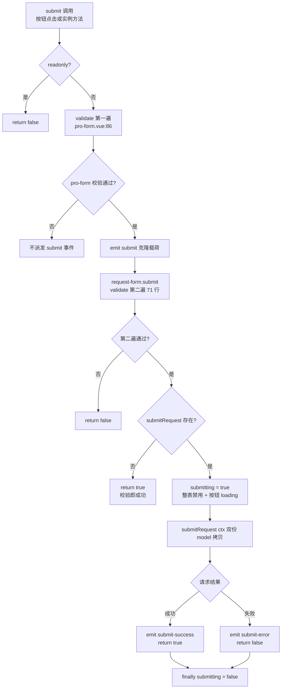

# 9-10 · RequestForm：请求表单

> 本篇是 9 卷"增强层（pro-components）"的第十篇。9-05 拆了表单族的渲染引擎 `XyProForm`，9-06 到 9-09 依次过了它四个容器变体——overlay-form 的多态外壳、dialog-form 与 drawer-form 的 Omit 特化、steps-form 的分步编排。本篇拆第五个、也是最后一个容器变体：`XyRequestForm`。它是五兄弟里唯一一个**把"异步"写进协议**的：前四个变体解决的是"表单放在哪里、长什么样"，request-form 解决的是"表单的数据从哪来、到哪去"——初始加载（fetch）把服务端数据回填进 model，提交（submit）把用户输入送回接口，一进一出构成"读一次、改一次"的异步闭环。核心问题按大纲只有一句话——**初始加载与提交的异步协议**——但这句话里至少藏着五道题：fetch/submit 为什么被设计成一进一出的两个回调而不是一个通用 request；回填为什么用 `Object.assign` 合并而不是整体替换、快照在什么时机定格；提交后行为（成功提示、重置、关闭）为什么一件都不内建、全部归属页面层；`page/pageSize` 这对分页刚性税在表单场景如何现身；以及它与 9-25 pro-table 请求段共享同一个 `request-utils.ts`，严谨度为什么差出一个竞态令牌。本篇全部给实码定论，并为 9-11《LoginForm：登录预设》埋好引线。

接到题目先复述一遍目标，防止写偏：`XyRequestForm` 要解决的业务场景，是"编辑回显 + 提交"的异步闭环。基础层 6-17 给了 `xy-form` 校验编排，9-05 给了 `XyProForm` 的 schema 渲染管线与只读态整表切换，但"先拉详情再编辑"这条最常见的中后台动线依然要业务自己写：`onMounted` 里发请求、拿到结果合并进 model、失败要占位、提交前校验、提交中禁用、提交后把结果交给页面去提示或跳转。request-form 把这六件事收进一个组件协议：`initialRequest` 一个 prop 承接初始加载，`submitRequest` 一个 prop 承接提交，`loading/error` 两个状态交给异步状态容器渲染，`request-success/request-error/submit-success/submit-error` 四个事件把结果与错误原样上抛——组件负责"异步的骨架"，业务负责"异步的意义"。

先交代体量，给全文一个标尺：`request-form` 组件目录四个文件共 245 行——`src/request-form.ts` 26 行（纯类型）、`src/request-form.vue` 142 行（脚本段至 117 行、模板段 119-142 共 24 行）、`index.ts` 9 行、`__tests__/request-form.spec.ts` 68 行（两个用例）；它共享的基础设施有两份，9-02 拆过的 `request-utils.ts`（33 行，全库只有它和 pro-table 两个消费者）和 9-05 拆过的 `pro-form` 渲染引擎，外加 5 行专属样式。246 行里真正的协议密度集中在 `request-form.vue` 的两个 async 函数上——`load`（41-64 行）与 `submit`（66-96 行），加起来 56 行，是本篇的两块主板。本篇就按"协议层 → 加载 → 回填 → 提交 → 提交后 → 对照 → 定论"这条主线走。

## 一、定位与体量：ProForm 家族里唯一带异步协议的容器

先看导出链路。`XyRequestForm` 从 `request-form/index.ts` 经 `withInstall` 挂上安装器，全文 9 行：

```ts
// packages/pro-components/request-form/index.ts（全文 9 行）
import RequestForm from "./src/request-form.vue";
import type { RequestFormProps, RequestFormSubmitContext } from "./src/request-form";
import { withInstall } from "xiaoye-primitives";

export type { RequestFormProps, RequestFormSubmitContext };

export const XyRequestForm = withInstall(RequestForm, "xy-request-form");

export default XyRequestForm;
```

值导出走 `exports.ts:8` 的 `export { XyRequestForm } from "./request-form"`，类型导出走根入口 `index.ts:38-40`（`RequestFormProps` 与 `RequestFormSubmitContext` 两个主类型，符合 9-01 立下的根入口边界——注意 `RequestFormSubmitContext` 算"主数据类型"，因为它是 `submitRequest` 回调的入参签名，脱离它这个 prop 就无法声明）；清单登记在 `component-manifest.json:59-64`，样式经 `style.css:9` 引入 `packages/theme/src/pro/request-form.css`——这份样式全文只有 6 行，一个 `flex` 纵向布局加 16px 间距，是增强层最薄的组件样式之一，因为视觉骨架几乎全部继承自 pro-form。

再说清一个消费关系，这是本篇第一个"实码定论"。用 `rg` 扫全库，`request-utils.ts` 的消费者只有两个：

```text
packages/pro-components/request-form/src/request-form.vue:6   （本篇主角）
packages/pro-components/pro-table/src/pro-table.vue           （9-25 请求段）
```

而 `request-form` 自身在增强层内部**没有任何上层消费者**——全库 `rg "request-form|RequestForm"` 扫出来，除导出入口、清单、夹具、文档之外只剩它自己的源码与测试。9-22 的 crud-page 不消费它（第八节给实码），overlay-form/dialog-form/drawer-form/steps-form 也不认识它。所以 request-form 在生态里的位置是：**ProForm 家族的末端变体、请求协议的最小消费单元**——它把 `core.ts` 的 `ProRequestContext` 和 `request-utils.ts` 的工厂函数接到表单上，再往上没有更复杂的组合了（9-25 的 pro-table 是平行的另一个协议消费者，不是它的宿主）。

与 ProFormProps 对照，request-form 的转发面收得很紧。`request-form.vue:125-138` 向 `xy-pro-form` 只透传十个 prop：title、description、model、schema、rules、labelWidth、labelPosition、size、readonly、submitting。ProFormProps 里剩下的 `columns`、`readonlyDescriptionsProps`、`loading`、`submitText`、`resetText`、`showSubmit`、`showReset` 七个 prop 一律不透传——网格用 pro-form 默认的 2 列，按钮文案用默认的"保存/重置"，动作区不可隐藏。这个"不转发"是刻意的：request-form 的差异化价值在异步协议，不在配置面，配置面宽了反而稀释定位。其中 `loading` 不透传还有一层结构原因，第三节展开——request-form 的加载态走了另一条渲染通道，根本轮不到 pro-form 的占位出场。

## 二、协议层三件套：RequestFormProps / SubmitContext / Instance

类型文件 9-02 已引过全文，这里为了自洽再完整亮一次，逐段读：

```ts
// packages/pro-components/request-form/src/request-form.ts（全文 26 行）
import type { FormRules } from "xiaoye-components";
import type { ComponentSize } from "xiaoye-primitives";
import type { ProActionRef, ProFieldSchema, ProRequestContext } from "../../core";

export interface RequestFormSubmitContext extends ProRequestContext {
  model: Record<string, unknown>;
}

export interface RequestFormProps {
  title?: string;
  description?: string;
  model: Record<string, unknown>;
  schema?: ProFieldSchema[];
  rules?: FormRules;
  labelWidth?: string | number;
  labelPosition?: "left" | "top";
  size?: ComponentSize;
  readonly?: boolean;
  immediate?: boolean;
  initialRequest?: (ctx: ProRequestContext) => Promise<Record<string, unknown>>;
  submitRequest?: (ctx: RequestFormSubmitContext) => Promise<unknown>;
}

export interface RequestFormInstance extends ProActionRef {
  submit: () => Promise<boolean>;
}
```

三条协议线索都在这 26 行里。**第一条：两个请求回调的返回类型不对称**。`initialRequest` 约定返回 `Promise<Record<string, unknown>>`——必须是对象，因为它要被合并进 model；`submitRequest` 约定返回 `Promise<unknown>`——接口返回单号也好、整个实体也好、什么也不返回也好，组件不关心形状，只负责原样装进 `submit-success` 事件的载荷。一进一出的不对称，正对应"读回来的数据要落进表单、写出去的响应业务自管"这两种截然不同的数据处理责任。这也是 request-form 与 pro-table 协议形态的第一处分岔（第七节展开）：pro-table 的 `request` 返回 `ProRequestResult`（数组或分页对象），所以需要 `normalizeProRequestResult` 归一化；request-form 的两个回调各自只有一个确定的返回语义，归一化层在这里没有存在的必要——`request-utils.ts` 的两个函数，它只消费了 `createProRequestContext` 一个。

**第二条：`RequestFormSubmitContext extends ProRequestContext` 追加 `model`**（第 5-7 行）。这正是 9-02 结尾那句"协议的扩展方式被统一成 extends + 增量成员"的表单侧样本。但追加 `model` 的同时，`ProRequestContext` 的 `page/pageSize` 必填字段也被一并继承了下来——这就是 9-02 考据过的"分页刚性税"在表单场景的现身。看类型夹具里的完整实例：

```ts
// tests/types/fixtures/request-form.ts（全文 31 行）
import type { RequestFormProps, RequestFormSubmitContext } from "@xiaoye/pro-components";

const props: RequestFormProps = {
  title: "请求表单",
  model: {
    name: "小叶"
  },
  readonly: true,
  schema: [
    {
      prop: "name",
      label: "名称"
    }
  ],
  immediate: false
};

const submitContext: RequestFormSubmitContext = {
  action: "submit",
  params: {
    name: "小叶"
  },
  page: 1,
  pageSize: 10,
  model: {
    name: "小叶"
  }
};

void props;
void submitContext;
```

一个提交表单的上下文里被迫填上 `page: 1, pageSize: 10`——第 23-24 行，与 `xiaoye-pro-components.ts:270-280` 那段同源的 `requestFormContext` 完全一致。夹具是用户侧视角：为了过类型检查，业务不得不给一个毫无分页语义的提交填两个占位数。实现侧同样要付这笔税，但付的数值不一样：`request-form.vue:52` 写的是 `createProRequestContext(action, {}, 1, 1)`——**page/pageSize 各填 1**。也就是说，夹具里的 `1/10` 与实现里的 `1/1` 数值并不同源，真正同源的是"必须凑齐签名"这件事本身：两边都在为协议的刚性让路，谁填什么值纯粹是占位。这一点比 9-02 的表述还要再进一步——刚性税不仅收在业务侧，也收在实现侧，而且两边的"补缴金额"互不引用、各自拍脑袋。若未来把 `page/pageSize` 改为可选（或拆出一个无分页的 `ProFormRequestContext`），这里两处实现加两处夹具会同时简化。

**第三条：`RequestFormInstance extends ProActionRef` 追加 `submit`**（第 24-26 行）。`ProActionRef`（`core.ts:21-25`）要求 reload/refresh/reset 三个动作各返回 `Promise<void>`，request-form 的实例把它们全部对到 `load` 上，再补一个 `submit: () => Promise<boolean>`。这个 boolean 的语义第五节细读——它是整条提交协议的"结果汇总位"。

顺带补全上下文类型。`ProRequestContext` 与它的近亲在 `core.ts` 里的原貌（9-02 已引，这里截取请求法域三段）：

```ts
// packages/pro-components/core.ts:5-25
export interface ProRequestData<T = Record<string, unknown>> {
  data: T[];
  total?: number;
  extra?: Record<string, unknown>;
}

export type ProRequestResult<T = Record<string, unknown>> = T[] | ProRequestData<T>;

export interface ProRequestContext {
  action: string;
  params: Record<string, unknown>;
  page: number;
  pageSize: number;
  signal?: AbortSignal;
}

export interface ProActionRef {
  reload: () => Promise<void>;
  refresh: () => Promise<void>;
  reset: () => Promise<void>;
}
```

注意第 18 行的 `signal?: AbortSignal`——协议层为取消请求留了位置，但本篇会核实：整条 request-form 链路上没有任何一处传递过 signal。协议给了承诺，实现没有兑现，这是第七节对照 pro-table 时的共同发现。

## 三、初始加载协议：load() 的六步编排

进入主板一。`load` 是全部加载路径的唯一汇聚点——挂载、刷新、重载、重置、重试五种触发全部落到它身上，只靠 `action` 参数区分语义：

```ts
// packages/pro-components/request-form/src/request-form.vue:41-64
async function load(action = "load") {
  if (!props.initialRequest) {
    initialSnapshot.value = { ...model };
    return;
  }

  loading.value = true;
  error.value = null;

  try {
    const result = await props.initialRequest(
      createProRequestContext(action, {}, 1, 1)
    );

    Object.assign(model, result);
    initialSnapshot.value = { ...result };
    emit("request-success", result);
  } catch (requestError) {
    error.value = requestError instanceof Error ? requestError.message : "加载失败";
    emit("request-error", requestError);
  } finally {
    loading.value = false;
  }
}
```

六步编排逐段过。**第零步是短路**（42-45 行）：没有 `initialRequest` 时，直接把 model 的当前浅拷贝定格为初始快照就返回——不设 loading、不发请求。这让 request-form 可以作为"带请求边界的 ProForm"渐进接入：第一版页面还没接详情接口时，先用本地 model 把表单跑起来，接口就绪后补一个 `initialRequest` prop，模板与提交链路一行不改。文档示例 basic.vue 走的正是这条接入路径（第六节引全文）。

**第二步与第三步是状态切换**（47-48 行）：`loading` 置真、`error` 清空。注意顺序——先清 error 再发请求，意味着重试场景下上一轮的错误占位会立刻让位给 loading 占位，不会出现"错误文案和加载动画同屏"的脏状态。

**第四步是协议调用**（50-53 行）：`createProRequestContext(action, {}, 1, 1)`。三个实参各有一句话可说：`action` 原样透传，业务侧可据以区分"首次加载"与"手动刷新"；`params` 是**空对象**——表单加载没有查询参数，要带参数（比如路由上的 id）业务得闭包进 `initialRequest` 回调里，这是"表单请求"与"列表请求"的又一处分野；`page/pageSize` 填 1/1，第二节说过的实现侧刚性税。另外注意工厂只传了四个参数，第五个 `signal` 形参缺席——`createProRequestContext` 的签名（`request-utils.ts:24`）里 signal 是可选的，不传就是 `undefined`，协议里那句 `signal?: AbortSignal` 至此彻底落空。

**第五步是回填三连**（55-57 行）：`Object.assign(model, result)` 把服务端数据合并进 model；`initialSnapshot.value = { ...result }` 把**服务端返回的那一份**（不是合并后的 model）定格为快照；`emit("request-success", result)` 把原始结果上抛。三行的次序不可调换——先合并才有可编辑的数据，先定格快照才有后续 reset 的基准，先上抛事件业务才能在下一拍拿到数据。这三行也是第四节的主角，这里按下不表。

**第六步是错误与收尾**（58-63 行）。catch 里有一个隐性的类型决策：`error.value` 存的是**字符串**——`Error` 实例取 `message`，其他一切（字符串抛出、对象抛出、undefined）统一折成"加载失败"四个字；而 `request-error` 事件携带的是**原始错误**。也就是说，UI 层拿简化文案，业务层拿全量现场，两个消费者各取所需。finally 里 `loading` 复位，无论成败。

这六步的 UI 呈现走的是 `async-state-container`（44 行的小组件，增强层里只有 request-form 与 detail-page 两个消费者），这里看它对 request-form 生效的那段分支：

```ts
<!-- packages/pro-components/async-state-container/src/async-state-container.vue:23-44 -->
<template>
  <div class="xy-async-state-container">
    <slot v-if="props.loading" name="loading">
      <div class="xy-async-state-container__state is-loading">
        <strong>{{ props.loadingText }}</strong>
      </div>
    </slot>
    <slot v-else-if="props.error" name="error" :error="props.error">
      <div class="xy-async-state-container__state is-error">
        <strong>加载失败</strong>
        <xy-text type="danger">{{ props.error }}</xy-text>
        <xy-button type="primary" plain @click="emit('retry')">重新加载</xy-button>
      </div>
    </slot>
    <slot v-else-if="props.empty" name="empty">
      <div class="xy-async-state-container__state is-empty">
        <xy-empty :title="props.emptyTitle" :description="props.emptyDescription" />
      </div>
    </slot>
    <slot v-else />
  </div>
</template>
```

`v-if / v-else-if / v-else` 三分支是互斥整替：loading 时整张表单被"正在加载数据"占位替换，error 时整张表单被"加载失败 + 重试按钮"替换，正常时才渲染默认插槽——也就是 request-form 模板里包着的那个 `xy-pro-form`。回看 request-form 的模板段（119-142 行）：

```html
<!-- packages/pro-components/request-form/src/request-form.vue:119-142 -->
<template>
  <xy-async-state-container
    :loading="loading"
    :error="error"
    @retry="load('retry')"
  >
    <xy-pro-form
      ref="formRef"
      :title="props.title"
      :description="props.description"
      :model="model"
      :schema="props.schema"
      :rules="props.rules"
      :label-width="props.labelWidth"
      :label-position="props.labelPosition"
      :size="props.size"
      :readonly="props.readonly"
      :submitting="submitting"
      @submit="submit"
    >
      <slot v-if="$slots.default" :model="model" />
    </xy-pro-form>
  </xy-async-state-container>
</template>
```

两处值得停留。其一，`@retry="load('retry')"`——重试按钮的点击被翻译成一次带 `action: "retry"` 的加载，于是业务在 `initialRequest` 回调里可以分辨"用户点了重试"和"挂载时自动加载"，为埋点或差异化参数留了口子。至此 `action` 的词汇表集齐六个值：`"initial"`（挂载，105 行）、`"load"`（函数默认参，41 行）、`"reload"`（expose，112 行）、`"refresh"`（expose，113 行）、`"reset"`（重置，100 行）、`"retry"`（重试，123 行）——其中 `"load"` 这个默认值实际上从不以缺省形式触发，五个调用点全部显式传参，它只是签名上的兜底。action 不参与任何组件内部分支，纯透传，这是"语义由业务定义、通道由组件铺设"的又一样本。

其二，`loading` prop 没有透传给 `xy-pro-form`。pro-form 自己有一套加载占位——`pro-form.vue:124-127` 的"正在准备表单 / 字段和默认值就绪后会恢复编辑"——但 request-form 不传 `loading`，那段占位在 request-form 场景里**永远不可达**。加载态的呈现权被整体上移给了 async-state-container：pro-form 的 loading 是"表单骨架在、内容未就绪"的字段级占位，而 request-form 的 loading 是"整个数据源未就绪"的容器级占位，两者语义不同，request-form 选了后者。这个选择有个直观的代价：加载期间连标题、按钮都看不到——用户面对的是一块纯占位而非骨架屏。对"读一次、改一次"的后台表单来说，这个取舍可以接受；但对加载缓慢的复杂页签表单，就略显粗放。这是协议形态的第一处设计权衡的余波，第四节收束时再评。

## 四、回填时序：Object.assign 合并语义与快照的两个边界

55-57 行那三连，值得单独一节，因为"回填"是编辑回现场景里最容易出微妙 bug 的一步。先看整条异步闭环的时序全景：

```mermaid
sequenceDiagram
    participant Page as 页面层
    participant RF as XyRequestForm
    participant PF as XyProForm
    participant API as initialRequest / submitRequest

    Page->>RF: mount（model / initialRequest / submitRequest）
    RF->>RF: onMounted → load("initial")
    RF->>API: createProRequestContext("initial", {}, 1, 1)
    API-->>RF: Promise&lt;Record&lt;string, unknown&gt;&gt;
    RF->>RF: Object.assign(model, result) 回填
    RF->>RF: initialSnapshot = { ...result } 定格快照
    RF-->>Page: emit request-success(result)
    Page->>PF: 用户编辑 model（默认插槽 / schema 驱动）
    PF->>RF: @submit（pro-form 内部 validate 后 emit）
    RF->>RF: submit()：readonly 门 → validate 门 → 提交门
    RF->>API: submitRequest({ ...ctx("submit"), model })
    API-->>RF: Promise&lt;unknown&gt;
    RF-->>Page: emit submit-success / submit-error
    Page->>Page: 提示 / 关闭 / 跳转（组件不接管）
```

时序里有三个"定格时刻"需要精确辨析。**第一，快照的内容是 `result` 不是合并后的 model**（56 行 `{ ...result }`）。这决定了 reset 的恢复范围：只有服务端返回过的键会被恢复。配合回填是 `Object.assign` 合并语义这一点（55 行），边界就显形了——假设 model 初始有 `name` 和 `remark` 两个键，接口只返回 `{ name: "账单中心" }`，那么 `remark` 保留页面初始值进入编辑；用户把 `remark` 改得面目全非后调用实例 `reset()`，98-101 行先把 model 恢复成快照（只含 `name`），`remark` 的现值原样留下，**用户对 remark 的修改不会被 reset 撤销**。浅合并的快照是"服务端视野的快照"，不是"用户编辑起点的快照"。对多数场景两者等价（接口返回全量字段），但对增量接口或本地附加字段，这里就是认知陷阱。反过来说，合并语义也有明确的好处：增量回显不用业务自己兜底——接口只回传变更字段时，其余字段不被清空。替换语义（`model = { ...result }` 直接换引用）在受控场景里会打断父组件的 reactive 绑定，`Object.assign` 原地合并保住了 `props.model` 这个受控源的身份（34 行 `const model = props.model as Record<string, unknown>` 自始至终指向同一个对象）——这也是为什么 request-form 的 model 没有做成 `v-model` 双向协议，而是"传入即共享"：父组件持有 reactive 对象，组件就地改写，两边永远看同一份数据。

**第二，快照的定格时机有三个**。有请求：成功时定格服务端结果（56 行）。无请求但有挂载：`onMounted` 的 else 分支（106-108 行）定格 model 现值。这三个时机关口合起来决定了 reset 的基准。看 reset 全文与挂载段：

```ts
// packages/pro-components/request-form/src/request-form.vue:98-109
async function reset() {
  Object.assign(model, initialSnapshot.value);
  await load("reset");
}

onMounted(() => {
  if (props.immediate) {
    void load("initial");
  } else {
    initialSnapshot.value = { ...model };
  }
});
```

reset 是"快照恢复 + 重新加载"的双重动作：先把 model 合并回快照，再发一次 `action: "reset"` 的加载——如果接口数据在编辑期间可能已被别人改过，reset 顺带拿回了最新值。注意 `immediate` 为 false 时 onMounted 只定格快照不发请求，此时若业务后来手动调 `reload()`，成功后快照会被服务端结果覆盖——定格时机随数据源走，规则是统一的：**快照永远等于"最近一次成功加载的数据"**。

**第三，reset 有两套语义并存，而且互不相认**。实例 `reset()`（快照恢复 + 重新请求）只能由父组件通过 ref 调用；而表单底部动作区的"重置"按钮走的是另一条路——pro-form 自己的 `reset`（`pro-form.vue:96-100`：`resetFields` + `clearValidate` + emit），它把字段恢复到 xy-form 记录的初始值、清掉校验痕迹，**不发任何请求、不碰快照**。更关键的是，request-form 的模板根本没有监听 pro-form 的 `reset` 事件（125-138 行只有 `@submit`）。于是同一个组件身上同时存在两个"重置"：点按钮是表单字段级恢复，调 `reset()` 是数据级恢复，两者恢复的基准（form initial value vs 服务端快照）、副作用（清校验 vs 重新请求）都不同。这是当前实现里语义最容易混淆的一处，若要收敛，最自然的方案是 request-form 接管 pro-form 的 reset 事件、把按钮点击统一引到实例 `reset()` 上——代价是"未加载完就想重置"这类边角要重新想清楚。

这一节顺带收掉第三节末尾的悬念——加载协议的第二个边界：**load 没有竞态保护**。快速连续触发 `reload()` / `refresh()` / 重试时，两个请求并发在途，后发者未必后至，谁先 resolve 谁先 `Object.assign`，慢响应随后到达会**覆盖掉新数据**——旧值回滚的脏帧在 UI 上一闪而过，快照也被同样污染。对照物在第七节：pro-table 用 `latestRequestId` 自增令牌解决了同一个问题。request-form 没抄这份作业，公平地说，表单加载的触发频率远低于列表（没有翻页、没有筛选联动），竞态窗口暴露面小得多，但"读一次"不等于"只读一次"，这是一笔真实的欠账，不是理论洁癖。

## 五、提交协议：submit() 的四道门

主板二。submit 是全组件最长的一个函数（66-96 行，31 行），也是.boolean 返回值协议的出处：

```ts
// packages/pro-components/request-form/src/request-form.vue:66-96
async function submit() {
  if (props.readonly) {
    return false;
  }

  const valid = await formRef.value?.validate();

  if (!valid) {
    return false;
  }

  if (!props.submitRequest) {
    return true;
  }

  submitting.value = true;

  try {
    const result = await props.submitRequest({
      ...createProRequestContext("submit", { ...props.model }, 1, 1),
      model: { ...model }
    });
    emit("submit-success", result);
    return true;
  } catch (submitError) {
    emit("submit-error", submitError);
    return false;
  } finally {
    submitting.value = false;
  }
}
```

四道门依次过。**门一，只读短路**（67-69 行）：readonly 下直接返回 false，提交动作根本不存在——这与 pro-form 内部 submit 的只读短路（`pro-form.vue:82-84`）形成双保险，readonly 的表单连动作区都不渲染（`pro-form.vue:201-211` 两个按钮都有 `!props.readonly` 条件），所以门一实际很难被走到，它的存在更多是"实例方法不依赖 UI 状态"的自洽：哪怕业务绕过按钮直接调 `formRef.submit()`，只读语义也不破。

**门二，校验**（71-75 行）。这里藏着一个本篇必须点破的事实：**这是一条双重校验链路**。触发路径是：pro-form 动作区的主按钮点击 pro-form 内部的 `submit`（`pro-form.vue:81-94`），它先 `validate`，通过后 `emit("submit", cloneProValue(props.model))`；request-form 模板 137 行 `@submit="submit"` 接住这个事件，进入本函数——而本函数第 71 行**又调了一次** `formRef.value?.validate()`。一次用户点击，xy-form 的校验跑两遍。两遍校验之间数据不会变（同一拍同步连续执行），所以结果一致、无害；但 `emit` 载荷是 `cloneProValue` 深拷贝、第二次 validate 校验的却是原对象——语义上"提交的快照"与"校验的数据"已经不是一个引用。这显然不是精心设计而是薄壳叠加的自然结果：pro-form 的 submit 事件协议是"我已校验、给你克隆"，request-form 却选择不信这个前置、自己再守一道门。好处是实例 `submit()` 可以脱离 pro-form 的事件链独立调用（比如自定义动作区通过 actions 插槽绕开默认按钮），坏处是双倍校验开销与"谁才是提交入口"的模糊。改进方向明确：信任 pro-form 的校验前置、把 request-form 的 validate 降为无 pro-form 时的兜底——但目前这版，双重校验就是实态。

**门三，无提交请求即成功**（77-79 行）：`submitRequest` 缺席时，校验通过直接返回 true。这与加载侧的短路对称——文档页（`apps/docs/pro-components/request-form.md:45`）把它写成"未提供时校验通过即视为提交成功"。渐进接入的第二级台阶：页面先有校验壳，接口就绪后补 prop，submit-success 事件才开始派发。

**门四，提交请求**（81-95 行）。`submitting` 置真后构造载荷——85-86 行是全篇最值得盯三秒的两行：

```ts
...createProRequestContext("submit", { ...props.model }, 1, 1),
model: { ...model }
```

`props.model` 与 `model` 是同一个引用（34 行），所以这两行是**同一份数据的两次浅拷贝**：一份垫进 `params`（刚性税要求 ProRequestContext 的 params 必须有值，表单没有别的参数可给，就把 model 自己塞进去），一份给协议真正新增的 `model` 键。业务侧收到的 ctx 里 `ctx.params` 与 `ctx.model` 内容完全相同——这就是刚性税的第二种收法：不只强迫你填 page/pageSize，还诱导你把不相关的字段填进 params，让上下文里出现语义重复的两组数据。展开顺序也有讲究：先 spread 上下文、再覆盖 `model` 键，保证 `model` 不被上下文里的同名键顶掉。请求成功的形状 `Promise<unknown>` 二节已述；失败路径（90-92 行）只派发 `submit-error`，**不写任何内部状态**——这是与 load 最不对称的一笔：加载失败有 error 占位、有重试按钮，提交失败除了一个事件什么都不留，表单停留在用户输入的原样上。这不是疏忽而是职责边界：提交失败的处置（提示语、保留还是回滚、要不要关浮层）天然属于业务决策，组件替业务决定任何一个都会错——这正是第三处设计权衡的主角，下一节单独展开。

先把提交态的 UI 呈现交代完。`submitting` 这个 ref 的消费方是 pro-form，经 136 行 `:submitting="submitting"` 下发，pro-form 内部两处使用：

```html
<!-- packages/pro-components/pro-form/src/pro-form.vue:193-213 -->
<div v-if="props.showReset || props.showSubmit || $slots.actions" class="xy-pro-form__footer">
  <slot
    name="actions"
    :model="props.model"
    :submit="submit"
    :reset="reset"
    :submitting="props.submitting"
  >
    <xy-button v-if="props.showReset && !props.readonly" @click="reset()">
      {{ props.resetText }}
    </xy-button>
    <xy-button
      v-if="props.showSubmit && !props.readonly"
      type="primary"
      :loading="props.submitting"
      @click="submit"
    >
      {{ props.submitText }}
    </xy-button>
  </slot>
</div>
```

一处是按钮 loading（207 行，主按钮转菊花），另一处在模板更上面——`pro-form.vue:137` 的 `:disabled="props.readonly || props.submitting"`：**提交中整张表单禁用**，不只是按钮。这比常见的"只锁提交键"更彻底：异步提交期间用户改不了任何一个字段，杜绝了"请求已带走的快照被用户继续编辑"导致的提交数据与界面状态不一致。代价是长请求下的体验僵直（用户想边等边改备注也不行），但"读一次改一次"的表单里，提交期间的可编辑几乎总是歧义而非便利——宁可僵直，不可漂移。

把四道门画成流程，本篇第二张图：



最后补上 submit 的返回值账目：readonly 短路、校验失败、请求失败三种情形都返回 false，无 submitRequest 与请求成功返回 true。这个 `Promise<boolean>` 是给"实例调用方"的握手协议——页面可以用 `const ok = await formRef.value.submit()` 做 if 分支，而按钮点击方只能依赖事件。两条通知通道（返回值与事件）并存、信息互补，是增强层实例协议的标准做法（pro-table 的 reload 无返回值，靠事件；request-form 因为有"成功与否"的二值语义，返回值就有了存在的理由）。

## 六、提交后行为归属：组件只 emit，不接管

现在正面回答第三处权衡：提交成功之后，提示谁来弹？表单谁来清？浮层谁来关？request-form 的答案是——**组件一件都不做，四事件原样上抛，后续行为百分之百归属页面层**。submit-success 只带请求结果（88 行），不触发 reset、不触发清校验、不派发任何消息服务调用；submit-error 只带原始错误（91 行），不留内部痕迹。

对照家族内部就有现成的反例基因：overlay-form 的提交事件 payload 是 `{ mode, model }`（`overlay-form.ts:9-12`），开合状态走 `v-model:open`，关闭权同样在页面手里。也就是说"提交后不自动关"是这个家族的一致纪律——对比一些社区方案在提交回调里内建 `ElMessage.success` + `emit("close")` + `resetFields` 的三连，本库把这三件事全部留给页面，理由有三：其一，同一张表单在弹窗、抽屉、整页三种容器里的提交后行为天然不同（弹窗要关、整页要跳转），组件层无解；其二，成功提示的文案、目标路由、是否刷新列表都是业务语义，组件内建必然沦为约定俗成的默认值，而默认值是隐性契约；其三，四个事件已经把全部原始信息（结果、错误）送到页面，组件再做任何加工都是信息损耗。文档页把这条边界写得直白（`apps/docs/pro-components/request-form.md:22-26`）：不内建错误映射、字段级回滚和复杂请求缓存策略，更复杂的数据依赖和多段提交仍建议由页面层编排。

组件只铺骨架，业务接入长什么样？官方示例 basic.vue 全文：

```html
<!-- apps/docs/examples/pro/request-form/basic.vue（全文 41 行） -->
<script setup lang="ts">
import { reactive, ref } from "vue";

const formModel = reactive({
  name: "默认审批流",
  owner: "小叶",
  enabled: true
});

const latestMessage = ref("尚未提交。");

function handleSubmitSuccess() {
  latestMessage.value = "提交成功，当前示例只演示表单请求边界。";
}
</script>

<template>
  <div class="xy-pro-demo-stack">
    <xy-request-form
      title="审批流设置"
      description="当前示例关闭即时请求，只演示加载/提交边界。"
      :model="formModel"
      :immediate="false"
      @submit-success="handleSubmitSuccess"
    >
      <xy-form-item label="流程名称" prop="name">
        <xy-input v-model="formModel.name" placeholder="请输入流程名称" />
      </xy-form-item>
      <xy-form-item label="负责人" prop="owner">
        <xy-input v-model="formModel.owner" placeholder="请输入负责人" />
      </xy-form-item>
      <xy-form-item label="启用状态" prop="enabled">
        <xy-switch v-model="formModel.enabled" />
      </xy-form-item>
    </xy-request-form>

    <xy-card header="说明">
      {{ latestMessage }}
    </xy-card>
  </div>
</template>
```

三个细节印证前文：`immediate="false"` 关掉挂载即请求（model 现值定格为快照），是最小接入形态；`initialRequest`/`submitRequest` 双双缺席，提交链路止步于门三"校验即成功"，页面只在 `submit-success` 里写一句文案——注意这个事件在无 submitRequest 时**不会派发**（门三直接 return true，没走到 emit），示例里它其实永远等不到触发，这也是"边界示例"的边界：它演示的是接线方式，不是运行效果。默认插槽手写 `xy-form-item` 时每个输入框直接 `v-model` 到父组件的 `formModel`（27/30/33 行）——而 `formModel` 本身（第 4-8 行）就是组件内部的 `props.model` 本尊，"传入即共享"的受控模式在这里一目了然。

只读形态的示例则展示了家族协议的复用：

```html
<!-- apps/docs/examples/pro/request-form/readonly.vue（全文 42 行） -->
<script setup lang="ts">
const formModel = {
  name: "审批流模板",
  owner: "小叶",
  status: "enabled"
};

const schema = [
  {
    prop: "name",
    label: "流程名称"
  },
  {
    prop: "owner",
    label: "负责人"
  },
  {
    prop: "status",
    label: "状态",
    valueType: "tag",
    options: [
      {
        label: "启用",
        value: "enabled",
        status: "success"
      }
    ]
  }
];
</script>

<template>
  <xy-request-form
    title="审批流查看"
    description="当请求表单只承担加载和查看职责时，可以直接开启 readonly。"
    :model="formModel"
    :schema="schema"
    :immediate="false"
    readonly
  />
</template>
```

`readonly` 一个 prop，pro-form 内部整表切换成 `xy-descriptions` 只读渲染（9-05 的核心机制原样生效），valueType 为 tag 的字段走状态标签渲染。请求表单 + 只读态 = "请求回来只给看"的详情场景——fetch 协议的另一半用途。测试也钉住了这条复用链，两个用例加起来 68 行全文：

```ts
// packages/pro-components/request-form/__tests__/request-form.spec.ts（全文 68 行）
import { flushPromises, mount } from "@vue/test-utils";
import { defineComponent, h } from "vue";
import { describe, expect, it, vi } from "vitest";
import { XyRequestForm } from "@xiaoye/pro-components";

describe("XyRequestForm", () => {
  it("支持初始化请求并回填模型", async () => {
    const model = {
      name: ""
    };
    const initialRequest = vi.fn().mockResolvedValue({
      name: "账单中心"
    });

    const wrapper = mount(XyRequestForm, {
      props: {
        title: "编辑成员",
        model,
        initialRequest
      }
    });

    await flushPromises();

    expect(initialRequest).toHaveBeenCalledTimes(1);
    expect(wrapper.text()).toContain("编辑成员");
    expect(model.name).toBe("账单中心");
    expect(wrapper.emitted("request-success")?.[0]?.[0]).toEqual({
      name: "账单中心"
    });
  });

  it("readonly 时复用只读展示协议而不是继续渲染提交表单", () => {
    const wrapper = mount(XyRequestForm, {
      props: {
        title: "查看成员",
        readonly: true,
        immediate: false,
        model: {
          name: "账单中心",
          status: "enabled"
        },
        schema: [
          {
            prop: "name",
            label: "名称"
          },
          {
            prop: "status",
            label: "状态",
            valueType: "tag",
            options: [
              {
                label: "启用",
                value: "enabled",
                status: "success"
              }
            ]
          }
        ]
      }
    });

    expect(wrapper.find(".xy-descriptions").exists()).toBe(true);
    expect(wrapper.text()).toContain("账单中心");
    expect(wrapper.text()).toContain("启用");
  });
});
```

用例一（7-31 行）钉的是加载协议的最小闭环：mock `initialRequest`，flushPromises 后断言"调用一次、model 已回填、事件载荷原样"——55-57 行那三连的对外承诺全部落进断言。用例二（33-67 行）钉的是只读复用：`.xy-descriptions` 存在即证明走的是 pro-form 的只读通道而非禁用表单。两条覆盖面对 143 行的实现来说明显偏薄：submit 的四道门、reset 双语义、error 重试、双重校验，都没有直接用例。这符合"测试只钉协议承诺"的取向——回填与只读正是两个最容易被后续重构破坏的对外行为——但提交链路至今裸奔，算测试账上真实的欠条。

## 七、对照 pro-table 请求段：同一个 request-utils，两种严谨度

9-02 把 `request-utils.ts`（33 行）当作"条款与执法分开"的样本引过全文，本篇为了对照再完整亮一次：

```ts
// packages/pro-components/request-utils.ts（全文 33 行）
import type { ProRequestContext, ProRequestResult } from "./core";

export function normalizeProRequestResult<T>(result: ProRequestResult<T>) {
  if (Array.isArray(result)) {
    return {
      data: result,
      total: result.length,
      extra: {}
    };
  }

  return {
    data: result.data,
    total: result.total ?? result.data.length,
    extra: result.extra ?? {}
  };
}

export function createProRequestContext(
  action: string,
  params: Record<string, unknown>,
  page: number,
  pageSize: number,
  signal?: AbortSignal
): ProRequestContext {
  return {
    action,
    params,
    page,
    pageSize,
    signal
  };
}
```

两个消费者对这 33 行的使用姿势截然不同。pro-table 用全两个函数：`normalizeProRequestResult` 归一化 `ProRequestResult` 的两种形状（数组或分页对象），`createProRequestContext` 构造带真实分页状态的上下文。request-form 只用后者，且传的是占位值。根本原因在协议形态：pro-table 的 `request` 签名是 `(params, ctx) => Promise<ProRequestResult<T>>`（`pro-table.ts:171`）——列表请求天然带查询参数与分页，返回形状有两种可能，所以要归一化；request-form 的 `initialRequest` 签名是 `(ctx) => Promise<Record<string, unknown>>`——表单加载没有查询参数（model 就是全部状态）、返回必然是单个对象，协议在类型层就把归一化的必要性消灭了。**协议形态决定了工具层的使用密度**，这是同一份 request-utils 在两个组件里长出两种用法的第一层原因。

第二层原因在严谨度。pro-table 的请求段（9-25 引过 862-905，这里扩到完整函数）：

```ts
// packages/pro-components/pro-table/src/pro-table.vue:862-907
function buildRequestParams() {
  return {
    ...(props.request?.requestParams ?? {}),
    ...(searchModel.value ?? {}),
    ...(filterModel.value ?? {}),
    ...(activeViewKey.value ? { activeViewKey: activeViewKey.value } : {})
  };
}

async function requestReload(action = "reload") {
  if (!props.request) {
    return;
  }

  const requestId = ++latestRequestId;
  requestLoading.value = true;
  requestError.value = null;

  try {
    const params = buildRequestParams();
    const result = await props.request.request(
      params,
      createProRequestContext(action, params, currentPageState.value, pageSizeState.value)
    );
    const normalized = normalizeProRequestResult(result);

    if (requestId !== latestRequestId) {
      return;
    }

    internalData.value = normalized.data as ProTableRow[];
    requestTotal.value = normalized.total;
    emit("request-success", internalData.value.slice());
  } catch (error) {
    if (requestId !== latestRequestId) {
      return;
    }

    requestError.value = error;
    emit("request-error", error);
  } finally {
    if (requestId === latestRequestId) {
      requestLoading.value = false;
    }
  }
}
```

876 行 `const requestId = ++latestRequestId` 是全段的灵魂：每次请求领取自增令牌，await 返回后三处核对（888、896、903）——结果不新鲜就丢弃、错误不新鲜就不入状态、loading 只由最新请求复位。列表请求触发源多（翻页、筛选、搜索、视图切换、暴露方法），并发是常态，令牌是刚需。request-form 的 load（第三节全文）没有这道工序：五类触发里 reload/refresh/reset 理论上可并发，后至的旧响应会覆盖新状态。同一个作者群、同一个工具文件、相邻的两个组件，严谨度差了一个数量级——合理解释是触发频率的真实差异（列表每页每次都发请求，表单"读一次"），但这笔账必须记下：**request-form 抄了 pro-table 的协议（同一个 ctx 工厂、同一对事件命名 request-success/request-error），没抄它的并发防御**。加上第二节发现的 signal 全链路缺席（core.ts:18 声明、request-utils.ts:24 形参、两处调用点都只传四参），请求协议在 request-form 这侧的完成度可以概括为：同步语义完整，取消与竞态语义空转。

还有一处正向差异值得记：**buildRequestParams 的多源合并是列表专属的**。pro-table 862-868 行把 requestParams、搜索模型、筛选模型、视图 key 四层参数按优先级摊平；表单加载没有这个需求——model 是唯一状态，参数就一个路由 id，闭包进业务回调足矣。协议没有为了对称而把 params 做成组件可配 prop，而是让 ctx.params 留空、参数编排权交给业务回调——这是"不为不存在的需求建通道"的克制，与第一节"七个 prop 不转发"是同一种克制。

## 八、crud-page 实码定论：谁在消费请求表单

任务清单里悬着的一个问题必须实码了结：9-22 的 crud-page 消费 request-form 吗？答案是否定的，证据在 `crud-page.vue` 的结构里。crud-page 的组成是 `XyListPage` + `XyOverlayForm` + `XyDetailPanel`（4-6 行 import），三段式渲染（152-181 行），其中编辑表单走的是 overlay-form：

```html
<!-- packages/pro-components/crud-page/src/crud-page.vue:156-167 -->
<xy-overlay-form
  v-model:open="formOpen"
  :container="props.formType === 'drawer' ? 'drawer' : 'modal'"
  :mode="currentRow ? 'edit' : 'create'"
  title="编辑内容"
  :model="formModel"
  :schema="props.formSchema"
  :rules="props.formRules"
  @submit="emit('submit', $event.model)"
>
```

而它的 `request-success/request-error` 两个事件（40-41 行声明）是透传给 `XyListPage` 的（142-144 行），源自列表请求而非表单请求。编辑回显更是完全同步的本地操作——`openEdit`（94-99 行）直接 `Object.assign(formModel, row)`，行数据已在列表手里，回显不需要任何请求：

```ts
// packages/pro-components/crud-page/src/crud-page.vue:94-99
function openEdit(row: Record<string, unknown>) {
  currentRow.value = row;
  Object.assign(formModel, row);
  formOpen.value = true;
  emit("open-edit", row);
}
```

这个定论反过来把"请求表单的业务场景"刻得更清楚：编辑回显有两种来源，**行数据同步回显**（列表页点编辑，数据就在手边，crud-page 的 Object.assign 一步到位）与**详情接口异步回显**（编辑页独立路由、或详情体量过大不进列表、或需要多接口拼装——这时才需要"先拉详情再编辑"的 fetch 协议）。crud-page 覆盖前者，request-form 服务后者，两者在"回显"这个动词上同源、在数据链路上互不相交。全库扫描的结论：request-form 是叶子组件，没有增强层宿主，它的宿主是业务页面本身。

## 九、EP 对照与账本

对照 Element Plus 收个尾。EP 的 `<el-form>` 只有 model/rules/validate 三个核心概念，**没有任何请求协议**——没有初始加载钩子、没有提交回调、没有加载态与错误态的容器语义。EP 生态里"编辑回显 + 提交"的标准写法散在页面层：`onMounted` 里调接口拿详情、`Object.assign(ruleForm, row)` 回显（EP 官方 form 示例正是这个写法）、提交前 `formRef.validate()`、成功后 `ElMessage.success` 加 `resetFields()`。四步全是业务样板，每个编辑页抄一遍；error 占位、提交中整表禁用、快照恢复这些细节，多数项目干脆不做。request-form 做的事，本质是把这四步样板收编为组件协议：`initialRequest` 对应 onMounted 的那次请求，`Object.assign` 回填连实现都同款（55 行），`submitRequest` 对应提交函数，`loading/error` 对应手写的占位分支。EP 的哲学是"表单只管表单，异步是业务的事"；本库的哲学是"异步骨架也是表单的一部分，重复四次的样板就该有组件形态"。两种哲学的代价对照也很直白：EP 不需要为表单请求付 `page/pageSize` 的刚性税，因为它压根没有表单请求协议——协议收编了样板，也收编了协议自身的税。

把本篇的账本合上，可复述成五条：一，fetch/submit 是两条不对称协议——initialRequest 必须返回对象（要回填）、submitRequest 返回 unknown（业务自管），一进一出的类型差异就是责任差异；二，回填是 `Object.assign` 原地合并、受控源引用不换，快照只含服务端键、定格在"最近一次成功加载"，浅合并的增量回显与 reset 恢复范围是同一枚硬币的两面；三，提交后行为零内建，四事件上抛原始信息，关闭/提示/重置全部归属页面——与 overlay-form 的"不自动关"一脉相承；四，提交链路有双重校验、加载链路无竞态令牌，pro-table 的 latestRequestId 作业没有抄，signal 全链路空转，这是异步协议在 request-form 这侧的两笔欠账；五，刚性税双重现身——夹具填 1/10、实现填 1/1，params 塞进 model 的冗余拷贝，都是 `ProRequestContext` 必填分页字段在表单场景的变形记。

下一篇 9-11《LoginForm：登录预设》将把解剖刀从"协议容器"换到"业务预设"：`LoginFormProps` 里没有 initialRequest 也没有 submitRequest——同为表单族，它把提交彻底交还页面（`submit: () => Promise<boolean>` 的签名与 request-form 的实例方法同形，动机却完全不同），把配置面做成了 Props 主战场（usernamePlaceholder、rememberLabel、thirdPartyItems 逐个命名），`LoginFormModel` 更是增强层少见的固定形状 model（username/password/remember 三键锁死）。为什么业务预设组件要反协议化、配置面命名到什么粒度才不碎、`focus(field)` 这种带着业务方位词的实例方法如何设计——到那边见。

---

### 本篇引用源码清单

```text
packages/pro-components/request-form/src/request-form.vue   13-25 / 27-32 / 34 / 36-39
                                                            41-64 / 42-45 / 50-53 / 55-57
                                                            58-63 / 66-96 / 67-69 / 71-75
                                                            77-79 / 83-87 / 98-109 / 111-116
                                                            119-142 / 125-138 / 136 / 137
packages/pro-components/request-form/src/request-form.ts    1-26（全文）
packages/pro-components/request-form/index.ts               1-9（全文）
packages/pro-components/request-form/__tests__/request-form.spec.ts  7-31 / 33-67（全文 68 行）
packages/pro-components/request-utils.ts                    1-33（全文）/ 24
packages/pro-components/core.ts                             5-25 / 13-19 / 18 / 21-25 / 140-145
packages/pro-components/pro-form/src/pro-form.vue           81-94 / 82-84 / 86 / 96-100
                                                            124-127 / 137 / 193-213 / 201-211 / 207
packages/pro-components/async-state-container/src/async-state-container.vue  23-44
packages/pro-components/pro-table/src/pro-table.vue         862-868 / 871-907 / 876 / 888 / 896 / 903
packages/pro-components/pro-table/src/pro-table.ts          170-175 / 171
packages/pro-components/overlay-form/src/overlay-form.ts    9-12
packages/pro-components/crud-page/src/crud-page.vue         4-6 / 40-41 / 94-99 / 142-144 / 156-167
packages/pro-components/exports.ts                          8
packages/pro-components/index.ts                            38-40
packages/pro-components/component-manifest.json             59-64
packages/pro-components/style.css                           9
packages/theme/src/pro/request-form.css                     1-5（全文）
tests/types/fixtures/request-form.ts                        1-31（全文）/ 23-24
tests/types/fixtures/xiaoye-pro-components.ts               270-280
apps/docs/pro-components/request-form.md                    9 / 22-26 / 43-45
apps/docs/examples/pro/request-form/basic.vue               1-41（全文）
apps/docs/examples/pro/request-form/readonly.vue            1-42（全文）
column/02-分卷大纲.md                                       164（9-10 篇目行）
column/9-02-core.ts-协议层.md                               （刚性税考据：694 行段）
column/9-05-ProForm-schema驱动表单.md                       （引擎论与只读态机制）
```
