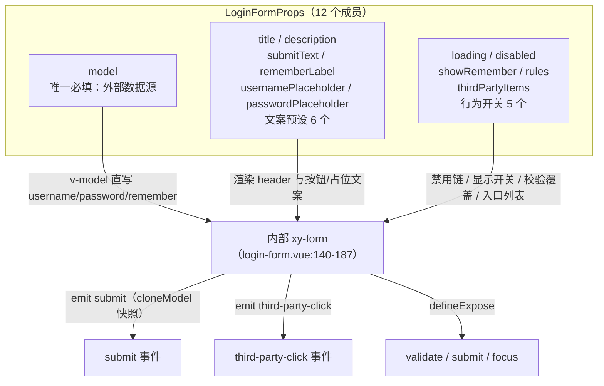
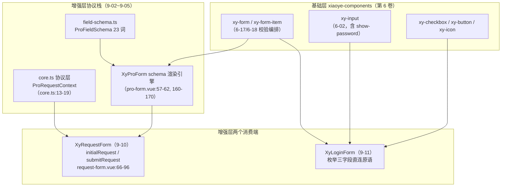

# 9-11 · LoginForm：登录预设

> 本篇是 9 卷"增强层（pro-components）"的第十一篇。9-04 用 SearchForm 开了"业务预设"的头，但那仍是字段数组驱动的预设——字段种类可以变；9-05 拆了 schema 渲染引擎，9-06 到 9-10 把它包装成五层容器与异步协议。本篇遇到的是整个增强层里**预设浓度最高**的一个组件：`xy-login-form`。核心问题按大纲只有一句话——**业务预设组件的配置面设计**——但这句话里至少藏着四道题：字段固定到什么程度（枚举还是 schema）、开关给多少个、给到什么粒度、逃生口留不留、以及密码这种敏感数据过手时存储的边界在哪。本篇全部给实码定论，行号逐一核对过当前工作区，并为 9-12《FilterPanel：筛选面板》埋好引线。

接到题目先复述一遍目标，防止写偏：`packages/pro-components/login-form` 要回答的问题是——**登录这件事，到底能不能做成一个组件**。登录页是每个后台系统都要写、又几乎没有两家完全相同的页面：有的要验证码，有的要短信，有的要扫码，有的要第三方 OAuth。把这样一个"不可枚举"的业务场景做成预设组件，赌注只有一个：配置面必须收敛到刚好覆盖"最大公约数"，超出的部分不是"加配置"而是"离开这个组件"。本篇的全部内容，就是这个赌注在 506 行源码里兑现的样子。

先交代体量，给全文一个标尺：`login-form` 组件目录四个文件加起来 413 行——`src/login-form.ts` 34 行（纯类型）、`src/login-form.vue` 208 行（唯一实现，脚本段 125 行 + 模板段 83 行）、`index.ts` 18 行（安装入口）、`__tests__/login-form.spec.ts` 153 行（六个用例）；样式住在 `packages/theme/src/pro/login-form.css`（93 行），经 `packages/pro-components/style.css:10` 的 `@import` 汇入。`git log --follow` 显示它历经三次提交（`3622d97` admin 能力集成初生、`323e9a7`、`dc9ca28` 依赖治理），实现正文至今没有结构性重构。它是增强层"业务预设"族（9-11 login-form、9-16 avatar-menu、9-19 stat-card）里第一个在专栏里正面解剖的样本。

## 一、三个预期落空：先划清边界

按惯例，拆解之前先把"你以为它有、其实没有"的三件事摆在桌面上——这三件事恰好就是这个组件的设计边界。

**第一件，没有验证码。** 整个 208 行的实现里没有 `captcha` 字样，`LoginFormModel` 只有三个字段（`src/login-form.ts:3-7`）：`username`、`password`、`remember`。这不是遗漏，是声明过的决策——文档页 `apps/docs/pro-components/login-form.md:9` 写明"只处理登录主链路，不承接注册、短信验证码和 OAuth 实现"，场景示例 `apps/docs/examples/pro/login-form/workbench.vue:34` 里更是直接挂了一行警示标签："注册、验证码、OAuth 流程不在当前首版范围"。验证码的字段形态（图形/短信/滑块）、刷新时机、校验协议，每一个都是不可枚举的变量，收进来任何一个，配置面就要为此开一个洞。

**第二件，没有任何插槽。** `login-form.vue` 的模板里一个 `<slot>` 都没有——没有 `fields` 插槽、没有 `footer` 插槽、没有 `header` 插槽。对比同卷的 ProForm：`pro-form.vue:140` 给默认插槽传 `:model`、`:readonly`，`:154-159` 给每个字段开 `field.slot` 逃生口，`:193-199` 给动作区开 `actions` 插槽。LoginForm 把这套体系全部拒绝了。原因在第五节展开，这里先给结论：**预设组件的逃生口就是"不用这个组件"**，一旦开了插槽，"登录主链路"这个语义承诺就开始漏水。

**第三件，没有任何存储。** 在 `packages/pro-components/` 全目录和 login-form 的四个文档示例里检索 `localStorage`、`sessionStorage`，匹配数为零。"记住我"只是一个随模型上抛的布尔值，存什么、存多久、存哪里，组件一概不管。这是本篇第六节的主题，也是预设组件对"安全敏感数据"的表态方式。

三件"没有"摆完，剩下"有什么"就是干净的：**三个枚举字段、两个事件、一个第三方入口列表、三个实例方法**。这就是配置面的全部版图。

## 二、34 行类型文件：配置面的第一现场

预设组件的配置面设计，第一现场不在模板，而在类型文件。`packages/pro-components/login-form/src/login-form.ts`（全文 34 行）照录：

```ts
import type { FormRules } from "xiaoye-components";

export interface LoginFormModel {
  username: string;
  password: string;
  remember?: boolean;
}

export interface LoginFormThirdPartyItem {
  key: string;
  label: string;
  icon?: string;
}

export interface LoginFormProps {
  model: LoginFormModel;
  title?: string;
  description?: string;
  loading?: boolean;
  disabled?: boolean;
  submitText?: string;
  showRemember?: boolean;
  rememberLabel?: string;
  usernamePlaceholder?: string;
  passwordPlaceholder?: string;
  rules?: FormRules;
  thirdPartyItems?: LoginFormThirdPartyItem[];
}

export interface LoginFormInstance {
  validate: () => Promise<boolean>;
  submit: () => Promise<boolean>;
  focus: (field?: "username" | "password") => void;
}
```

四个类型，四个角色。`LoginFormModel` 是数据契约：三个字段全部具名、全部有 TypeScript 字面类型，`remember` 可选（`remember?: boolean`——关掉记住我的场景不必传它）。`LoginFormProps` 是配置面：12 个成员。`LoginFormThirdPartyItem` 是第三方入口的展示协议。`LoginFormInstance` 是命令面：validate、submit、focus 三个方法。

把 12 个 props 按去向分三类，配置面的设计逻辑就浮出来了：



这张图里有一个关键观察：**12 个 props 里没有一个是"字段开关"意义上的结构性开关**。`showRemember` 是唯一接近的，但它控制的只是渲染与否（`login-form.vue:172` 的 `v-if`），模型里的 `remember` 字段始终存在、始终可传——关掉的是"显示"，不是"存在"。没有 `showCaptcha`，没有 `fields` 数组，没有 `columns` 布局参数。与 9-04 的 SearchForm 对照非常清楚：SearchForm 的 `fields: SearchFormField[]`（`packages/pro-components/search-form/src/search-form.ts:49`）让字段"可枚举可配置"，是**数组预设**；LoginForm 连数组都不要，字段直接焊死在模板里，是**枚举预设**。预设浓度从"字段可换"到"字段即组件身份"，中间差着一整个配置面的量级。

导出边界照旧是标准三件套：`packages/pro-components/exports.ts:9` 显式导出组件值 `XyLoginForm`，`packages/pro-components/index.ts:43-49` 显式导出四个类型，`scripts/check-pro-components.mjs:19-24` 的根入口类型白名单逐名锁定四个名字。类型夹具 `tests/types/fixtures/xiaoye-pro-components.ts:100-118` 构造了完整的 `LoginFormModel` 与第三方数组，`:491` 声明实例——9-01 立的边界规矩，在最小组件上同样生效。

## 三、脚本段 125 行：默认值、校验覆盖与提交链路

实现的第一段是 `withDefaults` 的默认值面（`src/login-form.vue:32-44`）：

```ts
const props = withDefaults(defineProps<LoginFormProps>(), {
  title: "欢迎登录",
  description: "请输入账号信息后继续访问控制台。",
  loading: false,
  disabled: false,
  submitText: "登录",
  showRemember: true,
  rememberLabel: "记住我",
  usernamePlaceholder: "请输入用户名",
  passwordPlaceholder: "请输入密码",
  rules: () => ({}),
  thirdPartyItems: () => []
});
```

十一个默认值，六个是中文文案。这里藏着预设组件配置面设计的第一个实质决策：**文案定制的粒度停在"占位与按钮"，不停在"结构"**。标题、描述、两个占位符、记住我标签、提交按钮文案——这六个字符串涵盖了登录页换语言、换品牌、换称呼的全部高频需求；而"在哪一行放什么字段"这种结构级定制，一个 prop 都不给。定制面越窄，组件承诺越硬：任何 `<xy-login-form>` 渲染出来的东西，字段序列必然是用户名、密码、（记住我）、提交按钮——S 端的截图评审、E2E 测试的选择器、新人的认知成本，全部被这个承诺托底。

第二个决策在校验规则的合并语义上。`login-form.vue:59-75`：

```ts
const inputDisabled = computed(() => props.disabled || props.loading);
const resolvedRules = computed<FormRules>(() => ({
  username: [
    {
      required: true,
      message: "请输入用户名",
      trigger: ["blur", "change"]
    }
  ],
  password: [
    {
      required: true,
      message: "请输入密码",
      trigger: ["blur", "change"]
    }
  ],
  ...props.rules
}));
```

默认规则两条：用户名必填、密码必填，双触发器（blur + change）。合并方式是对象展开，`...props.rules` 放在最后。`FormRules` 是按 prop 名分组的对象，展开的语义是**键级整体替换，不是数组合并**：你传 `rules: { username: [{ min: 4, ... }] }`，默认的"用户名必填"就被整个换掉了，而不是追加一条。这个语义被测试用例钉死（`__tests__/login-form.spec.ts:54-84`，用例名就叫"自定义 rules 会覆盖默认校验并阻止提交"）。为什么不提供合并？因为必填规则和长度规则叠加时，"谁先报错、报哪条"的优先级是业务方的事，预设组件替人决定合并顺序，只会制造第二种意外。键级替换语义简单、可预测、能整体关闭默认校验——三行代码换三个性质，划算。

第三个决策在提交链路上。`login-form.vue:99-118`：

```ts
async function submit() {
  if (inputDisabled.value) {
    return false;
  }

  const valid = await validate();

  if (!valid) {
    if (!model.username) {
      focus("username");
    } else if (!model.password) {
      focus("password");
    }

    return false;
  }

  emit("submit", cloneModel());
  return true;
}
```

这里有三个值得逐个点名的细节。其一，`submit` 返回 `Promise<boolean>`——通用表单的事件回调不返回值，预设组件把"提交成功与否"变成方法返回值，调用方可以直接 `if (await formRef.value.submit())` 分支；同时 `emit("submit", ...)` 与返回值并存，模板场景用事件、命令场景用返回值，一条链路两种消费。其二，校验失败时的**焦点回退**：用户名为空聚焦用户名，否则密码为空聚焦密码。通用表单组件不知道"哪个字段该先聚焦"——它面对的是任意字段序列；预设组件知道，因为字段是焊死的。这是"枚举预设"独有的红利：结构封闭换来了行为上的体贴。其三，`inputDisabled`（`login-form.vue:58`）把 `disabled` 与 `loading` 合成一个禁用链，`submit` 的第一行先挡提交态——loading 中的回车、双击全部哑火，与按钮上的 `:loading`/`:disabled` 透传（`login-form.vue:178-186`）构成同一道闸门的两面。

`keyup.enter` 的绑定（`login-form.vue:155`、`:168`）让两个输入框都回车即提交，这是登录页的手感标配，但组件只绑 `keyup.enter` 不绑表单原生 submit——校验前置的 `await validate()` 是 async 的，原生 submit 的事件时序管不住 async 校验，显式 `@click`/`@keyup.enter` → async 函数的链路才能保证"校验通过才 emit"。

第四个细节是 `cloneModel`（`login-form.vue:77-84`）：

```ts
function cloneModel() {
  const rawModel = toRaw(model);
  return {
    username: rawModel.username,
    password: rawModel.password,
    remember: rawModel.remember
  };
}
```

`model` 在 `login-form.vue:55` 处以 `const model = props.model as LoginFormModel` 的方式直接别名外部传入的对象——这是 9-04 以来的家族惯例：**数据源归业务方所有，组件借道响应式直写**。`cloneModel` 用 `toRaw` 剥掉响应式代理，再手工挑出三个字段构成全新对象。等价于浅拷贝，但绕开了 proxy 的 get 依赖追踪，同时保证 `emit` 出去的载荷是一个**提交时刻的快照**：业务方在回调里改 `model.password`，不会污染已经上抛的载荷；载荷也不会因为持有响应式引用而让后续输入继续"变值"。四个字段之外一个不多给，`FormData` 化的白名单在类型层（`LoginFormModel`）和运行时（挑字段）各锁了一道。

实例暴露收口在 `login-form.vue:120-124`：`defineExpose<LoginFormInstance>({ validate, submit, focus })`，三个方法与 34 行类型文件里的 `LoginFormInstance` 逐一同名同型——类型即契约，暴露即实现。

## 四、模板段 83 行：原语红利与第三方协议

模板从 `login-form.vue:127` 起到 208 行止，全文如下（节去首尾各一行的标签）：

```vue
<template>
  <section
    :class="[
      ns.base.value,
      inputDisabled ? 'is-disabled' : '',
      props.loading ? 'is-loading' : ''
    ]"
  >
    <header v-if="props.title || props.description" class="xy-login-form__header">
      <h2 v-if="props.title" class="xy-login-form__title">{{ props.title }}</h2>
      <p v-if="props.description" class="xy-login-form__description">{{ props.description }}</p>
    </header>

    <xy-form
      ref="formRef"
      :model="formModel"
      :rules="resolvedRules"
      label-position="top"
      :disabled="inputDisabled"
      class="xy-login-form__form"
    >
      <xy-form-item prop="username">
        <xy-input
          ref="usernameRef"
          v-model="model.username"
          :placeholder="props.usernamePlaceholder"
          prefix-icon="mdi:account-outline"
          :disabled="inputDisabled"
          @keyup.enter="submit"
        />
      </xy-form-item>

      <xy-form-item prop="password">
        <xy-input
          ref="passwordRef"
          v-model="model.password"
          type="password"
          show-password
          :placeholder="props.passwordPlaceholder"
          prefix-icon="mdi:lock-outline"
          :disabled="inputDisabled"
          @keyup.enter="submit"
        />
      </xy-form-item>

      <div v-if="props.showRemember" class="xy-login-form__remember">
        <xy-checkbox v-model="model.remember" :disabled="inputDisabled">
          {{ props.rememberLabel }}
        </xy-checkbox>
      </div>

      <xy-button
        type="primary"
        block
        :loading="props.loading"
        :disabled="inputDisabled"
        @click="submit"
      >
        {{ props.submitText }}
      </xy-button>
    </xy-form>

    <div v-if="props.thirdPartyItems.length > 0" class="xy-login-form__third-party">
      <div class="xy-login-form__divider">
        <span>其他登录方式</span>
      </div>

      <div class="xy-login-form__third-party-actions">
        <xy-button
          v-for="item in props.thirdPartyItems"
          :key="item.key"
          plain
          :disabled="inputDisabled"
          @click="emit('third-party-click', item)"
        >
          <xy-icon v-if="item.icon" :icon="item.icon" :size="16" />
          {{ item.label }}
        </xy-button>
      </div>
    </div>
  </section>
</template>
```

逐段看。结构上是一个 `section` 根元素（注意不是 `form`——原生表单语义被刻意避开，理由已在第三节说过：async 校验链路不与原生 submit 时序纠缠），三段式布局：`header`（`v-if="props.title || props.description"`，两个子元素各自再判空，标题描述可以单独缺）、`xy-form` 主链路、第三方区。三段式对应 `login-form.css` 里的三组类名，布局全靠 flex 纵排加 `--xy-space-5` 沟距，没有任何定位魔法。

主链路里最值得讲的是密码框那一行 `show-password`。这个"密码可见切换"不是 LoginForm 实现的——它只是把 6-02 讲过的 `XyInput` 的同名 prop 打开。真正的切换机制住在基础层：`packages/components/input/src/input.vue:88` 的 `passwordVisible` ref、`:185-195` 的 `currentInputType`（`passwordVisible ? "text" : "password"` 的类型摆动）、`:373-374` 的 `togglePasswordVisible` 翻转、`:513` 的 aria-label（`'hide password' : 'show password'`）随状态换词。预设组件在这里的角色是**选配员**：登录场景永远该开 `show-password`，于是焊死为开；注册场景或许不需要，那是另一个组件的事。这正是"原语完备 + 预设选配"分层的红利——6-02 一次性把密码切换做对（状态、图标、aria、切 text 时光标保位），9-11 只需要一个布尔属性就继承全部。对照多数组件库的登录页写法：原语层给了 `show-password`，然后每个项目自己决定开不开、怎么开——本库把这个决定替你做了，并且做得不可推翻（`LoginFormProps` 里没有 `showPassword` 开关）。

第三方登录区（`login-form.vue:189-206`）是一段自足的小协议：`thirdPartyItems` 数组驱动渲染（`key` 做 v-for 锚、`label` 做按钮文案、`icon` 可选做 `xy-icon`），点击只做一件事——`emit('third-party-click', item)`。组件**不发起任何授权流程**，甚至不知道"第三方登录"之后该跳哪里。文档示例 `apps/docs/examples/pro/login-form/third-party.vue:21` 的描述文案把这层意思说得很直白："账号密码和第三方入口可以共存，但真正的授权流程由应用层处理。" 分隔线"其他登录方式"也是焊死的文案（`login-form.vue:191`）——`thirdPartyItems` 为空数组时整个区块 `v-if` 消失，分隔线不会裸露。这个协议的设计口径是"展示与行为分离"：组件负责让所有第三方入口长得一致（同一套按钮样式、同一套图标规格、同一套禁用链），行为留白。与第三节焦点回退同类：**能预设的全预设，不能预设的一概不碰**。

## 五、与 9-10 的分层定论：预设不走协议栈

任务清单里最关键的一问：LoginForm 是否消费 RequestForm 或 ProForm？实码定论——**不消费**。`login-form.vue:1-12` 的 import 区只有两个来源：`vue` 的三个 API，和 `"xiaoye-components"` 的六个基础组件加一个类型（`XyButton`、`XyCheckbox`、`XyForm`、`XyFormItem`、`XyIcon`、`XyInput`、`FormRules`），外加 `xiaoye-primitives` 的 `useNamespace`。没有一行 import 来自 `../pro-form` 或 `../request-form`。两条表单链路在同一层背对背：



RequestForm 的形态是"协议"：`request-form.ts:20-21` 的 `initialRequest` / `submitRequest` 两个函数 prop、`request-form.vue:41-64` 的 load 编排、`:66-96` 的 submit 编排、模板 `:119-142` 的 `xy-async-state-container` 包 `xy-pro-form` 双层嵌套——loading/error/重试由 AsyncStateContainer 统管，字段渲染由 schema 引擎统管，它自己只剩协议黏合。LoginForm 的形态是"预设"：没有 schema（字段名不进字符串）、没有请求协议（登录请求的差异太大——token 放哪、错误码怎么读、要不要二次验证，组件层不可能预设）、没有异步容器（loading 是一个普通 prop，由业务方在鉴权请求的前后置里翻转）。它的模板是 12 个原语标签的平铺直叙。

为什么登录不走 schema？把两条路摆在一起，答案是收益方向相反。schema 的收益是**字段的任意组合能力**：同一个 `ProFieldSchema` 声明能驱动表单态、展示态、详情态三种形态（9-03 的主题），换来的是字段名退化为字符串 `prop`、类型面回到 `Record<string, unknown>`（`request-form.ts:12` 的 `model: Record<string, unknown>`）。登录恰恰相反：它不需要任意组合——字段集合全球几乎收敛；它**极度需要类型**——`model.username` / `model.password` 的每一次读写都在 `LoginFormModel` 的看管之下，业务方少写一个字段名，编译期就报错。为一个不需要的灵活性，付出类型收窄的代价，这笔账在登录场景是亏的。所以增强层的分层是：**schema + 异步协议服务"任意表单"（RequestForm），枚举 + 类型化模型服务"语义固定的表单"（LoginForm）——预设不是协议的简化版，是协议的平行选项**。这也解释了第二节那个观察的深层原因：LoginForm 不接入 schema 管线，就没有 `field.slot` 逃生口可开，"零插槽"不是忘了开，是这条链路上根本没有开口的机制。

## 六、存储安全边界：remember 只收集意图

"记住我"是登录组件最容易越界的地方，值得单独一节。先看实码里它的一生：模板 `login-form.vue:173` 把 `model.remember` 绑给 `xy-checkbox`；提交时 `cloneModel` 把这个布尔随载荷上抛（`login-form.vue:82`）；之后组件对它再无任何动作。没有 `localStorage.setItem`，没有 cookie 写入，没有"记住用户名"的自动回填——`rg "localStorage|sessionStorage"` 在 `packages/pro-components/` 全目录的匹配为零。

这个"什么都不做"是经过计算的。`remember` 的真实语义是**意图表达**："我愿意在下次访问时被更快地认出来。"而兑现这个意图的存储决策，每一项都依赖业务上下文，组件层无法预设，也不该预设：

- **存什么**：只存用户名（回填方便但泄露账号存在性）、存长效 token（方便但扩大被盗面）、还是服务端 session + 短效凭证，是安全等级的选择；
- **存哪里**：localStorage 对 XSS 无防护，cookie 的 HttpOnly/SameSite 需要服务端配合，根本不是前端单方面能定的；
- **存多久**：七天免登录还是当次会话，是产品策略。

组件若擅自把 `username` 写进 localStorage，等于替所有接入方做了一次安全声明——而 XSS 防护水位、合规要求（个人信息的本地存储在不同法域有不同约束）都不是组件作者能背书的。所以本库的答案是把"记住我"降格为一个纯数据字段：**组件收集意图，鉴权层兑现意图**。顺带把"密码不落盘"也一并了结——组件层连"盘"都不碰，密码除了一次性随 submit 载荷交给业务方（这是登录请求的本职）之外，在任何地方都没有第二份持久化副本；提交载荷还是第三节说的快照对象，emit 完即与组件脱钩。

这也是预设组件与工具库的一条分界线：工具库（如 utils 层的 storage 封装）可以提供存储能力，因为调用方显式选择何时用；预设组件 bundled 了业务语义，任何一个"顺手"的副作用都会随组件扩散到所有接入方。LoginForm 在这件事上的克制，是"预设组件的安全姿态"的完整表态：**配置面里可以没有验证码，但代码里也不可以有 localStorage**。

## 七、93 行样式：语义令牌与一条分隔线

样式文件 `packages/theme/src/pro/login-form.css` 共 93 行，容器块（`:1-14`）与记住我行（`:41-47`）：

```css
.xy-login-form {
  display: flex;
  flex-direction: column;
  gap: var(--xy-space-5);
  padding: var(--xy-space-6);
  border: 1px solid var(--xy-border);
  border-radius: var(--xy-radius-xl);
  background: var(--xy-bg-container);
  box-shadow: var(--xy-shadow-1);
}

.xy-login-form.is-disabled {
  opacity: 0.78;
}
```

容器消费的全部是语义层令牌：`--xy-space-5/6` 刻度、`--xy-border`、`--xy-radius-xl`、`--xy-bg-container`、`--xy-shadow-1`——3-01 立的"组件只吃语义层与刻度层"规矩，93 行无一例外。禁用态不碰任何子元素，只给根一个 `opacity: 0.78`，与模板根元素的 `is-disabled` 类（`login-form.vue:131`）一一对应：禁用的视觉表达是"整体降透明"，而不是逐个子组件改色——一道类名管全表，禁用链从 prop（`inputDisabled`）一路走到 CSS，中间没有断点。

文件里最讲究的一段是第三方区的分隔线（`:55-73`）：

```css
.xy-login-form__divider {
  position: relative;
  text-align: center;
}

.xy-login-form__divider::before {
  content: "";
  position: absolute;
  inset: 50% 0 auto;
  border-top: 1px solid var(--xy-border);
}

.xy-login-form__divider span {
  position: relative;
  padding: 0 var(--xy-space-3);
  color: var(--xy-text-secondary);
  background: var(--xy-bg-container);
  font-size: 13px;
}
```

经典的两层叠法：伪元素画一条贯通的 1px 顶边线（`inset: 50% 0 auto` 让线钉在行高中点），文字 span 升到 `position: relative` 压在线上，并用 `background: var(--xy-bg-container)`——注意是容器背景而不是透明——把身后的线"擦"出一段缺口。这里有个暗坑被背景色化解了： LoginForm 整个容器自带 `--xy-bg-container` 底色（`:8`），若 span 用透明背景，线会从文字两侧穿过；用容器同色填充，视觉上就是"线—字—线"的断口。硬编码一个 `#fff` 都会在这套双主题（3-03）里翻车，令牌化消费在这里救的是正确性而不只是可维护性。

响应式只有一段（`:81-93`）：640px 以下容器 padding 从 `--xy-space-6` 降到 `--xy-space-5`、标题从 28px 降到 24px、第三方按钮组从横排 `flex-wrap` 转纵排。移动端登录是高频场景，但组件层只做这三步轻量让位——卡片主体布局（哪一列、多宽）依旧留给页面层，与第四节"结构不预设"的口径一致。

## 八、153 行测试：六个用例的分工

`__tests__/login-form.spec.ts` 六个用例，按"渲染—提交—校验—状态—协议—命令"分工。渲染与提交两个用例（`:8-52`）确认了基本盘：标题描述记住我齐全时 `findAll("input")` 恰好 3 个（`:25`——两个文本输入 + checkbox 的原生 input，字段数焊死到测试里）；submit 成功时事件载荷 `toEqual({ username, password, remember })`（`:47-51`）——快照语义的回归锚。

校验用例（`:54-84`）是第五节覆盖语义的证据现场：

```ts
it("自定义 rules 会覆盖默认校验并阻止提交", async () => {
  const model = reactive({
    username: "ab",
    password: "secret",
    remember: false
  });
  const wrapper = mount(XyLoginForm, {
    props: {
      model,
      rules: {
        username: [
          {
            min: 4,
            message: "用户名至少 4 位",
            trigger: ["blur", "change"]
          }
        ]
      }
    }
  });

  const valid = await (wrapper.vm as unknown as { validate: () => Promise<boolean> }).validate();

  expect(valid).toBe(false);
  expect(wrapper.text()).toContain("用户名至少 4 位");

  await wrapper.findComponent(XyButton).trigger("click");
  await nextTick();

  expect(wrapper.emitted("submit")).toBeUndefined();
});
```

状态透传用例（`:86-102`）断言 `loading`/`disabled` 同时置真时提交按钮拿到两个 prop；协议用例（`:104-129`）通过 `findAllComponents(XyButton)[1]`——第二个按钮，即第三方入口——触发点击并断言 `third-party-click` 载荷原样上抛；命令用例（`:131-152`）用 `attachTo: document.body` 挂到真实 DOM，断言 `focus("password")` 后 `document.activeElement` 指向第二个 input，再走一次命令式 submit。六个用例没有一个测文案默认值之外的渲染细节，也没有 mock 任何存储——因为根本没有存储可 mock。测试面与配置面同构：配置面收敛，测试就不需要为"各种排列组合"布防，153 行对 208 行实现，比例健康。

## 九、对照 Element Plus：预设层是一次表态

把同一个登录表单放到 Element Plus 的世界里，标准写法是纯手拼——EP 的组件清单里没有 LoginForm 这样的业务预设，登录页由使用者用原语自己搭：

```vue
<!-- Element Plus 对照样例（非本库源码） -->
<template>
  <el-form ref="formRef" :model="model" :rules="rules" label-position="top">
    <el-form-item prop="username">
      <el-input v-model="model.username" placeholder="请输入用户名">
        <template #prefix><el-icon><User /></el-icon></template>
      </el-input>
    </el-form-item>
    <el-form-item prop="password">
      <el-input
        v-model="model.password"
        type="password"
        show-password
        placeholder="请输入密码"
      >
        <template #prefix><el-icon><Lock /></el-icon></template>
      </el-input>
    </el-form-item>
    <el-form-item>
      <el-checkbox v-model="model.remember">记住我</el-checkbox>
    </el-form-item>
    <el-button type="primary" :loading="loading" @click="handleSubmit">
      登录
    </el-button>
  </el-form>
</template>

<script setup lang="ts">
import { reactive, ref } from "vue";
import type { FormInstance, FormRules } from "element-plus";

const formRef = ref<FormInstance>();
const loading = ref(false);
const model = reactive({ username: "", password: "", remember: false });
const rules: FormRules = {
  username: [{ required: true, message: "请输入用户名", trigger: "blur" }],
  password: [{ required: true, message: "请输入密码", trigger: "blur" }]
};

async function handleSubmit() {
  const valid = await formRef.value?.validate().catch(() => false);
  if (!valid) return;
  loading.value = true;
  /* 鉴权请求与 loading 翻转由项目自理 */
}
</script>
```

40 行模板 + 20 行脚本，每个项目都在重写这 60 行，且各自的长相、校验触发器、loading 编排、回车行为都不尽相同——EP 的哲学是把原语给全（`show-password`、`:loading`、`label-position`），组合留给人。本库在原语完备（6-02/6-17 已交付同款能力）之上多走了一层：**把"登录"这个名字本身做成组件**。收益是这 60 行样板连同六个文案默认值、焦点回退、回车链路、第三方区布局一起消失，接入方只剩一个 `model` 与两个事件；代价是第五节分析过的——灵活性边界从此焊死，验证码进不来、插槽开不了。预设层不是对原语层的否定，是一次表态：**中后台系统里，有些组合的复用频率高到值得为它放弃可变性**。EP 用"没有预设"把这个判断留给社区模板，本库用 208 行实现把这个判断收进组件库——两条路线没有对错，但每一条都要说清楚自己在赌什么。

## 十、收束：506 行的账本，与 9-12 的筛选面板

把 login-form 目录四文件加样式共 506 行收成本篇的三句话。**第一句，枚举即承诺**：三个字段焊死在类型与模板两处，换来 `LoginFormModel` 的完整类型看管、submit 快照的确定载荷、焦点回退的行为体贴——配置面从 12 个 props 收敛，测试面随之收敛到 153 行。**第二句，预设不走协议栈**：不消费 ProForm/RequestForm，schema 服务任意表单、枚举服务语义固定的表单，两条平行链路背靠同一个基础层；"零插槽"是这条链路的必然而不是取舍的遗漏，预设组件的逃生口就是不用它。**第三句，敏感数据的预设姿态是不动作**：remember 只收集意图，零存储、零回填、零持久化，`toRaw` 快照上抛后即脱钩——组件层能替业务方做的决定是长相与手感，永远不是安全策略。

下一篇 9-12《FilterPanel：筛选面板》回到"卡片化筛选的组合方式"：与 9-04 SearchForm 的字段数组、本篇的枚举三字段都不同，FilterPanel 要处理的是筛选区块的组合与协作——面板如何组织多组筛选器、选中态如何收拢、与列表页家族（9-03 ProTable 那一侧）如何对接。它的配置面是"容器预设"的第三种形态，正好把本篇立起的"预设浓度光谱"（数组 → 枚举 → 容器组合）补上第三档。到那边见。
