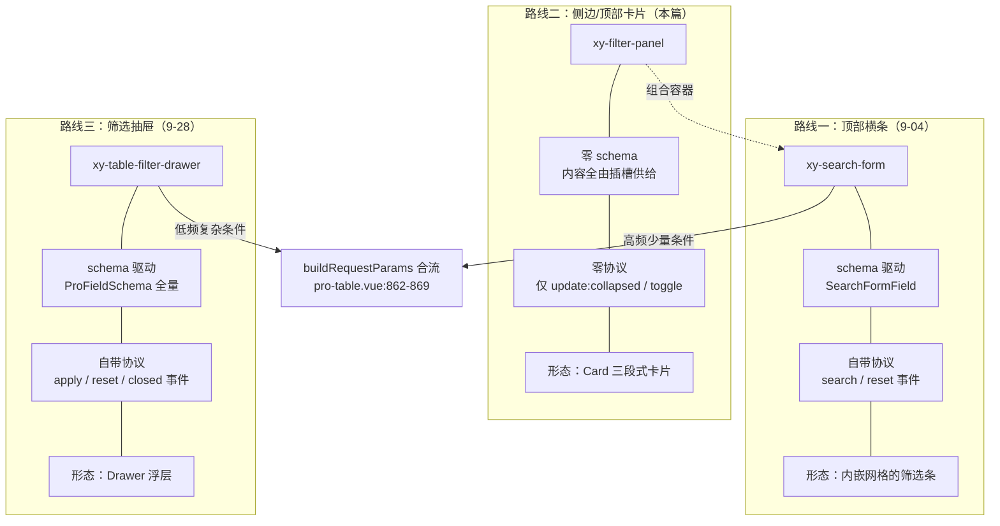
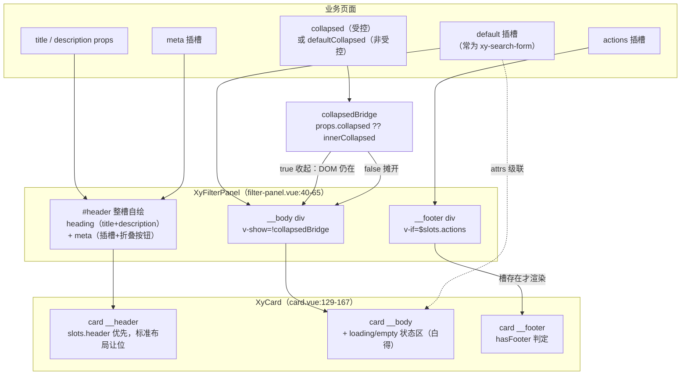

# 9-12 · FilterPanel：筛选面板

> 本篇是 9 卷"增强层（pro-components）"的第十二篇，按大纲（`column/02-分卷大纲.md:166`）回答的核心问题只有一句话——**卡片化筛选的组合方式**。前置篇是 9-04：那篇拆完了三条筛选路线中的第一条（`xy-search-form`，顶部横条 + 查询语义），本篇走第二条——`xy-filter-panel`，一张包住筛选区的卡片；第三条（`xy-table-filter-drawer`，schema 驱动的筛选抽屉）在 9-28 展开，但本篇必须先把两条路线的分工边界用实码定论——因为大纲里 9-12 与 9-28 各占一个条目，而它们共享同一个问题域。另有一条来自知识点矩阵（`column/01-知识点全集矩阵.md:187`）的硬任务：**"双 filter-panel 重名辨析"**——这个仓库里住着两个都叫 filter-panel 的东西，一个是基础层表格的内建筛选浮层，一个是增强层的页面筛选卡片，本篇要把这桩重名案审清。

接到题目先复述目标：`packages/pro-components/filter-panel` 要回答的不是"怎么筛"，而是"筛选区**长成什么容器**"。它的全部源码是这个仓库里罕见的迷你体量——`src/filter-panel.vue`（65 行）、`src/filter-panel.ts`（7 行）、`index.ts`（9 行）、`__tests__/filter-panel.spec.ts`（25 行）、样式 `packages/theme/src/pro/filter-panel.css`（40 行），合计不足一百五十行。5 个 props、2 个事件、3 个插槽，没有一行 schema、没有一行查询派发、没有一行已选条件管理——文档把话说得极白："当前不内建字段 schema、查询派发和预设管理"（`apps/docs/pro-components/filter-panel.md:24`）。一个增强层组件做到近乎"零语义"，不是偷懒，是**站位**：它把自己压缩成一个纯粹的形态容器，把筛选的全部语义留给组合进来的内容。本篇全部行号逐一核对过当前工作区实态，文末附核对清单。

## 一、筛选版图：三条路线与两种工作

先给全景。同一个"筛选"问题域，增强层交出了三个组件，按"形态 × 驱动 × 协议"三个维度切开，正好三条路线：



读这张图要抓一个二分法：**三条路线里做的是两种工作**。search-form 和 table-filter-drawer 做的是"语义工作"——它们各自持有 schema、各自定义查询协议（search/apply/reset），用户点按钮之后发生什么由它们负责；filter-panel 做的是"形态工作"——它对筛选的语义一无所知，只负责把一片内容装进一张带标题、可折叠、有动作区的卡片。前者是控件，后者是容器。这张图还有一条容易看漏的虚线：filter-panel 自己不接入合流点，它通过**组合** search-form 来间接接入——这是"卡片化筛选的组合方式"七个字的第一个定论，第五节展开。

分工边界不只是图上说说，pro-table 的类型层把它钉进了配置协议。`packages/pro-components/pro-table/src/pro-table.ts:177-185`：

```ts
export interface ProTableViewsConfig {
  searchModel?: Record<string, unknown>;
  searchFields?: SearchFormField[];
  savedViews?: ProTableSavedViewItem[];
  activeViewKey?: string;
  filterModel?: Record<string, unknown>;
  filterFields?: ProFieldSchema[];
  filterTitle?: string;
}
```

`searchModel`/`searchFields` 配 `SearchFormField[]`，渲染成表格上方的横条（9-04 第七节已拆过接线）；`filterModel`/`filterFields` 配 `ProFieldSchema[]`——注意类型，是全量 schema 而非查询特化——它们流向哪里？流向抽屉，不是卡片。`pro-table.vue:1769-1777`：

```html
<xy-table-filter-drawer
  v-if="filterFields.length > 0 && filterModel"
  v-model:open="filterDrawerOpen"
  :title="props.views?.filterTitle ?? '筛选条件'"
  :model="filterModel"
  :fields="filterFields"
  @apply="handleFilterApply"
  @reset="handleFilterReset"
/>
```

触发按钮在工作台上（`pro-table.vue:1545` 的"筛选"文本按钮，显隐由 `pro-table.vue:235` 的 `workbench.filter || views?.filterFields?.length` 推导），点开后走 `openFilterDrawer`（`pro-table.vue:787-793`）。**这就是实码定论：pro-table 的主链路只接横条与抽屉，`XyFilterPanel` 不在其中**——全仓搜索确认它没有被任何增强组件消费，只在文档层被页面骨架示例引用（`apps/docs/examples/pro/split-layout-page/workspace.vue:65`）。它的客户是**业务页面**，不是组件家族。这个定位差异直接决定了它"零语义"的取舍：组件间的接线需要协议，而留给业务方的自由组装恰恰需要"无协议"——协议是约束，自由来自空白。

三条路线的分工终表，留一张给 9-28 复用：

| 维度 | search-form（9-04） | filter-panel（本篇） | table-filter-drawer（9-28） |
| --- | --- | --- | --- |
| 形态 | 顶部横条（内嵌网格） | 侧边/顶部卡片 | 右侧抽屉 |
| 驱动 | `SearchFormField` 查询特化 schema | 无 schema，插槽自由供给 | `ProFieldSchema` 全量 schema |
| 协议 | `search`/`reset` 事件 + `submit()` 实例 | 仅 `update:collapsed`/`toggle` | `apply`/`reset`/`closed` 事件 |
| 折叠 | 字段级标记制（折叠=卸载） | 整块级开关（折叠=v-show 隐藏） | 无（抽屉本身就是收纳） |
| 消费方 | pro-table / list-page / crud-page | 业务页面（文档侧边栏示例） | pro-table 直连 |

## 二、65 行的全貌：一份零语义的清单

先读类型文件全文，`packages/pro-components/filter-panel/src/filter-panel.ts:1-7`：

```ts
export interface FilterPanelProps {
  title?: string;
  description?: string;
  collapsed?: boolean;
  defaultCollapsed?: boolean;
  collapsible?: boolean;
}
```

五个成员摆出来，一眼就能分出两组：`title`/`description` 是头部文案组，喂给卡片的标题区；`collapsed`/`defaultCollapsed`/`collapsible` 是折叠组，组件唯一的行为逻辑全在这三个词上。没有 `model`、没有 `fields`、没有 `columns`——对比 search-form 的 17 个 props（`search-form.ts:47-65`）和 table-filter-drawer 的 5 个（其中 `model` 必填、`fields` 持 schema），FilterPanel 的 props 表上没有任何一个"筛选语义"的字段。类型即契约，7 行类型文件就是"零语义容器"的书面声明。

实现文件的前半段是标准的受控/非受控双模骨架，`packages/pro-components/filter-panel/src/filter-panel.vue:11-26` 的关键三行：

```ts
const props = withDefaults(defineProps<FilterPanelProps>(), {
  title: "",
  description: "",
  collapsed: undefined,
  defaultCollapsed: false,
  collapsible: true
});
```

```ts
const innerCollapsed = ref(props.defaultCollapsed);
const collapsedBridge = computed(() => props.collapsed ?? innerCollapsed.value);
```

`collapsed` 显式默认 `undefined`——这个写法是"受控/非受控双模"的签名：外层传了布尔就是受控（真实状态在外层），不传就落回内层 `innerCollapsed`。`collapsedBridge` 的 `??` 合流与 9-04 拆过的 `search-form.vue:94-95` 逐字同构，连 4-04 立过的"受控组件不替主人做决定"纪律也原样继承。行为逻辑只有一个函数，`filter-panel.vue:28-37` 全文：

```ts
function toggleCollapse() {
  const nextValue = !collapsedBridge.value;

  if (props.collapsed === undefined) {
    innerCollapsed.value = nextValue;
  }

  emit("update:collapsed", nextValue);
  emit("toggle", nextValue);
}
```

十行三个决定。**第一，翻转基于桥值而非内层值**——`!collapsedBridge.value`，受控模式下翻转的是"外层当前的值"，内层不参与，这是双模组件最容易写错的点（写成 `!innerCollapsed.value` 会在受控模式下状态错乱）。**第二，写内层有前提**——`props.collapsed === undefined` 才落笔，受控时内层保持只读，测试把这步钉死过（9-04 的 `search-form.spec.ts:351-392` 同款纪律）。**第三，事件双发无条件**——`update:collapsed` 供 `v-model:collapsed` 语法糖，`toggle` 供显式监听，无论受控与否都发，两种消费风格各取所需。

对照 9-04 引过的 search-form 同位置代码，`search-form.vue:278-285`：

```ts
function updateCollapsed(nextValue: boolean) {
  if (!isCollapsedControlled.value) {
    innerCollapsed.value = nextValue;
  }

  emit("update:collapsed", nextValue);
  emit("collapse-change", nextValue);
}
```

逻辑同构，但有一处**刻意的简化**值得如实记账：search-form 有一道 `watch(() => props.collapsed)`（`search-form.vue:119-126`），保证受控模式的每次 prop 变化都同步进内层，将来从受控切回非受控时内层值不跳变；FilterPanel 没有这道 watch——受控期间用户在外面改了十次 `collapsed`，一旦把 prop 撤回 `undefined`，内层值还是**组件出生时**的 `defaultCollapsed`，不是最后同步到的状态。为什么省？search-form 的折叠是页面上的高频交互（字段多、用户常收常放），受控切换内外模式虽罕见但状态漂移会被用户看见；FilterPanel 折叠的是整块筛选区，交互频率低一个量级，为一条极冷路径多养一个 watcher 不划算。这是"同构不同款"的又一现场——协议姿势一致，实现深度按需裁剪。当然代价要认：这个行为差异没有任何测试覆盖，属于"读码才知道"的暗面。

测试文件全文照录，`packages/pro-components/filter-panel/__tests__/filter-panel.spec.ts:6-25`：

```ts
describe("XyFilterPanel", () => {
  it("支持渲染标题并切换折叠状态", async () => {
    const wrapper = mount(XyFilterPanel, {
      props: {
        title: "筛选条件"
      },
      slots: {
        default: () => h("div", { class: "filter-content" }, "筛选项")
      }
    });

    expect(wrapper.text()).toContain("筛选条件");
    expect(wrapper.find(".filter-content").exists()).toBe(true);

    await wrapper.get(".xy-button").trigger("click");

    expect(wrapper.emitted("update:collapsed")?.[0]?.[0]).toBe(true);
    expect(wrapper.emitted("toggle")?.[0]?.[0]).toBe(true);
  });
});
```

一个用例 20 行，钉了三件事：标题渲染、默认插槽透传、点击折叠按钮后**双事件各发一次且载荷为 `true`**。对照组是 search-form 的 393 行测试（9-04 引过四个用例）和 pro-table 的上千行测试——**测试行数是语义面的镜子**：search-form 的测试要钉校验门、快照、Enter 边界、折叠卸载、重置联动，因为它语义面大；FilterPanel 只有"渲染 + 折叠"两个行为可钉，25 行刚好覆盖。零语义组件连测试都是轻的，这不是缺席，是表面积本就小。受控模式的纪律测试（受控时点击只发事件不改视图）在这里缺席，算是覆盖面的诚实缺口——但逻辑与 search-form 逐字同构，风险敞口有限。

## 三、组合深读一：站在 card 肩上，让位要彻底

现在进入核心问题的第一层：FilterPanel 与 Card 的组合深度。5-10 已经给过结论的骨架——"整槽让位"的典型样本（`column/5-10-Card-容器类组件的slot约定.md:615`）。本篇把整个模板全量摆开，看这张卡片是怎么"站在肩膀上"组装出来的，`packages/pro-components/filter-panel/src/filter-panel.vue:40-65`：

```vue
<template>
  <xy-card :class="ns.base.value">
    <template #header>
      <div class="xy-filter-panel__header">
        <div class="xy-filter-panel__heading">
          <div v-if="props.title" class="xy-filter-panel__title">{{ props.title }}</div>
          <p v-if="props.description" class="xy-filter-panel__description">{{ props.description }}</p>
        </div>
        <div class="xy-filter-panel__meta">
          <slot name="meta" />
          <xy-button v-if="props.collapsible" text @click="toggleCollapse">
            {{ collapsedBridge ? "展开筛选" : "收起筛选" }}
          </xy-button>
        </div>
      </div>
    </template>

    <div v-show="!collapsedBridge" class="xy-filter-panel__body">
      <slot />
    </div>

    <div v-if="$slots.actions" class="xy-filter-panel__footer">
      <slot name="actions" />
    </div>
  </xy-card>
</template>
```

模板只有 26 行，三段全部借 Card 的骨架成形。**头部走的是整槽让位**（42-55）：标准布局装不下"标题 + 描述 + meta + 折叠按钮"的四元结构，于是整个 `#header` 接管，Card 侧的 `header-extra` 布局一并让位——5-10 的原话是"整槽让位含 extra 一并被吞"，实码回看就是这十行：`xy-filter-panel__header` 自己做 flex 两栏（左 heading 右 meta），`title` 与 `description` 的条件渲染是 FilterPanel 自己的 `v-if`，跟 Card 的 header/extra props 再无关系。Card 侧的让位逻辑在 `card.vue:129-141`：

```vue
<div :class="cardClasses">
  <div v-if="hasStructuredHeader" :class="headerClasses">
    <slot v-if="slots.header" name="header" />
    <div v-else class="xy-card__header-inner">
      <div v-if="props.header" class="xy-card__header-main">
        {{ props.header }}
      </div>
      <div v-if="hasExtra" class="xy-card__header-extra">
        <slot name="extra">{{ props.extra }}</slot>
      </div>
    </div>
  </div>
```

`slots.header` 一存在，`v-else` 分支（含 `header-main`/`header-extra` 标准布局）整块跳过——让位彻底，不留半套结构在同一张卡里打架。**底部走的是二次判定**：`filter-panel.vue:61-63` 的 `$slots.actions` 判定把 5-10 讲的"footer 靠存在性驱动"约定往上抬了一层——Card 自己也会因 `hasFooter`（`card.vue:103`）判一次空，FilterPanel 先判一次自己的槽，槽不存在就不往 Card 的 footer 槽里塞东西，两层判定接力，空卡的下边缘自然收拢。**主体走的是最薄透传**：default 插槽的内容被包进 `xy-filter-panel__body` 再落进 Card 的 body——多包一层是为了给 `v-show` 挂钩（下一节的主角）。

组合的深度不止于插槽，还有一层**隐式的 attrs 级联**。FilterPanel 的根节点是 `xy-card` 组件，于是所有 FilterPanel 未声明的属性都会顺着 Vue 的 fallthrough 链落到 Card 上，被 Card 的 props 声明捕获——业务方写 `<xy-filter-panel shadow="hover" bordered loading>`，这三个词在 FilterPanel 的词汇表里不存在，却会原样抵达 Card 并生效。这是"站在肩膀上"的第三层含义：**子组件的未声明属性自动成为父组件的接口**。它的收益是零成本继承——Card 的 `shadow` 三态、`bordered`、`size`、甚至 `loading`/`empty` 数据态全套白得（一个 `loading` 的筛选卡片，筛选区自动变成加载骨架）；它的代价是接口不可见——这些能力不会出现在 FilterPanel 的文档 API 表里（`filter-panel.md:28-37` 的 Attributes 表只有 5 行），用的人得知道 fallthrough 这层机制。显式转发（逐个 prop 转传）可读但啰嗦，隐式级联省事但隐晦，FilterPanel 选了后者——对一个只有 65 行的容器，这笔账划算，但读码时值得知道这张"看不见的 props 表"的存在。

样式文件给组合深度提供了最硬的证据，`packages/theme/src/pro/filter-panel.css` 全文 40 行：

```css
.xy-filter-panel__header {
  display: flex;
  align-items: flex-start;
  justify-content: space-between;
  gap: 16px;
}

.xy-filter-panel__heading {
  display: flex;
  flex-direction: column;
  gap: 8px;
}

.xy-filter-panel__title {
  font-size: 18px;
  font-weight: var(--xy-font-weight-semibold);
}

.xy-filter-panel__description {
  margin: 0;
  color: var(--xy-text-secondary);
}

.xy-filter-panel__meta,
.xy-filter-panel__footer {
  display: flex;
  align-items: center;
  gap: 12px;
}

.xy-filter-panel__body {
  display: flex;
  flex-direction: column;
  gap: 16px;
}

.xy-filter-panel__footer {
  justify-content: flex-end;
  padding-top: 16px;
}
```

**40 行里没有一条边框、背景、阴影、圆角**——`.xy-filter-panel` 根类在本文件里甚至没有出现，卡片的全部视觉（描边、海拔、内边距、分段分隔线）都由 `.xy-card` 的样式供给。FilterPanel 的样式只做"内容排布"：头部两栏、标题字重、描述色、动作区右对齐。对照同目录的 search-form.css（73 行，自带渐变底加 `color-mix` 描边，9-04 引过全文）——同样是筛选容器，一个把视觉外包给 Card，一个自绘卡片壳。这就是**权衡一：卡片化组合的"视觉外包 vs 自绘"**。外包的收益是主题一致性与能力继承（Card 换肤、换密度、换变体，FilterPanel 自动跟随，一行样式都不用改），代价是多一层组件嵌套和上文的隐式接口；自绘的收益是独立可控（渐变底这种 Card 给不了的个性），代价是把"卡片"重新造了一遍——两个组件在同一批源码里给出了两种答案，选择依据正是各自的站位：SearchForm 是"内容自带形态"的控件，要任何容器里都能辨认；FilterPanel 是"形态本身"的容器，视觉就该是 Card 的视觉。顺带一处细节：24-29 行 `.xy-filter-panel__meta` 与 `__footer` 共享一条选择器分组（同是"横排 + 居中 + 12px 间距"的行容器），而 37-40 行 footer 又单独追加右对齐与上内边距——分组表达共性，追加表达差异，40 行里也有分层。

## 四、组合深读二：折叠的两种执法

模板里最值得停下来的一行是 57 行：`<div v-show="!collapsedBridge" ...>`。**折叠 = `v-show` 隐藏，不是卸载**。这个选择和 9-04 拆过的 search-form 正好相反——search-form 的折叠字段用 `v-for` 只遍历 `visibleFields`（`search-form.vue:337-341`），折叠等于卸载，连带产生"折叠中的字段不参与 resetFields"的暗面（`form.vue:51-63` 的注册表里根本没有它们）。同一个仓库，两种折叠执法，不是精神分裂，是**折叠对象的本性不同**：

- search-form 折叠的是**字段**——它们注册进 `xy-form` 的字段表，参与校验、参与重置；卸载制的收益（折叠字段不渲染、不注册、不参与校验）对它是对的，代价（重置够不着）由 schema 作者用标记制自觉规避。
- FilterPanel 折叠的是**整块内容**——一个黑盒。里面可能是 search-form，可能是自定义 DOM，可能是棵树、个图表。容器对黑盒的唯一正确姿势是**不动它**：`v-show` 保 DOM、保组件状态、保滚动位置，展开瞬间原样回来。若用卸载制，用户折叠一次再展开，黑盒里的表单值、输入焦点、加载的数据全部清零——这对"折叠只是暂时收起"的语义是灾难。

再对一对默认值。FilterPanel 的 `defaultCollapsed: false`（`filter-panel.vue:15`），search-form 的 `defaultCollapsed: true`（`search-form.vue:47`）——**一个默认摊开，一个默认收起**。9-04 解释过 search-form 默认收起的理由（次要字段居多的长表单，折叠是常态）；FilterPanel 默认摊开的理由是镜像的：一张侧边筛选卡片，摊开才可见、才可发现——筛选区要是默认收成一条标题，用户可能根本不知道这里有筛选项。两者合起来读出一个更深的默认值哲学：**默认值不是"组件 preferences"，是"形态的服务对象"**——横条服务于"少而快"的高频路径（收起保清净），卡片服务于"可见可发现"的探索路径（摊开保触达）。

折叠组第三个词 `collapsible` 默认 `true`（`filter-panel.vue:16`），控制 50-52 行那个 text 按钮的渲染。有一个细节藏在按钮文案里：

```vue
<xy-button v-if="props.collapsible" text @click="toggleCollapse">
  {{ collapsedBridge ? "展开筛选" : "收起筛选" }}
</xy-button>
```

文案"展开筛选/收起筛选"是**硬编码在组件里的中文**。对照 search-form：它有 `expandText`/`collapseText` 两个 props（`search-form.ts:59-60`）供业务方换文案。这个不对等是有意的还是缺位的？从体量看更像有意的——FilterPanel 全组件只有这一处文案，为它开两个 props 会让 7 行的类型文件膨胀近半；从风险看可以接受——标题、描述都是 props，按钮文案要本地化的业务方有 `meta` 插槽逃生门（自己放按钮 + `v-model:collapsed`）。但如实记录这处不对称：**同是"筛选折叠按钮"，一个组件给了文案接口，另一个没给**，这是读 API 表时值得知道的真实差异。

把三节内容合起来，FilterPanel 的装配与折叠数据流是这样一张图：



虚线那条是第三节说的 attrs 级联：落在 FilterPanel 根上的未声明属性（`loading`、`shadow`、`bordered`……）继续下坠到 Card， Card 的数据态区接住——筛选卡片因此自带"加载中"与"暂无数据"两个状态，而 FilterPanel 自己一行状态代码都没写。

## 五、组合深读三：与 SearchForm 的嵌套装配

"卡片化筛选的组合方式"最典型的成品长什么样，看官方示例全文，`apps/docs/examples/pro/filter-panel/basic.vue`：

```vue
<script setup lang="ts">
import { reactive } from "vue";
import type { SearchFormField } from "@xiaoye/pro-components";

const searchModel = reactive({
  keyword: "",
  status: "processing"
});

const searchFields: SearchFormField[] = [
  {
    prop: "keyword",
    label: "关键词",
    component: "input",
    span: 2
  },
  {
    prop: "status",
    label: "状态",
    component: "select",
    options: [
      { label: "处理中", value: "processing" },
      { label: "待跟进", value: "pending" },
      { label: "已完成", value: "done" }
    ]
  }
];
</script>

<template>
  <xy-filter-panel
    title="高级筛选"
    description="把筛选条件和动作区统一包进一块可折叠区域。"
  >
    <xy-search-form :model="searchModel" :fields="searchFields" />

    <template #actions>
      <xy-space>
        <xy-button plain>保存为预设</xy-button>
        <xy-button type="primary">应用筛选</xy-button>
      </xy-space>
    </template>
  </xy-filter-panel>
</template>
```

44 行示例，三层组合一次讲完。**第一层是容器嵌控件**：`xy-search-form` 整个落进 default 插槽——schema（`searchFields`）与数据（`searchModel`）都是 SearchForm 的事，FilterPanel 对它们零感知；两层组件的接口完全不交叉，拆掉任何一层另一方照常工作。**第二层是动作区上浮**：`#actions` 里放"保存为预设"和"应用筛选"——注意这两个动作都不是 SearchForm 协议里的（SearchForm 自己的查询/重置按钮在 `showSubmit`/`showReset` 控制下渲染在自己的动作区），示例把它们放进卡片 footer，等于在 SearchForm 之上又铺了一层"页面级动作"——这正是 FilterPanel 作为"页面容器"的角色：控件级动作归控件，页面级动作归容器。**第三层是 meta 预留**：头部右侧的 `meta` 插槽在本示例空着，它是留给"已选条件提示"一类信息的接口（本节末尾回到这个话题）。

同一组件的第二种摆位在分栏示例里，`apps/docs/examples/pro/split-layout-page/workspace.vue:59-78`：

```vue
<xy-split-layout-page
  layout="aside-main"
  title="分栏工作区：筛选与主内容"
  description="左侧筛选或导航，右侧主结果区。"
>
  <template #aside>
    <xy-filter-panel title="筛选条件">
      <xy-search-form :model="searchModel" :fields="searchFields" />
    </xy-filter-panel>
  </template>
  <template #main>
    <xy-pro-table
      title="规则列表"
      description="这里承接主表格、看板或图表。"
      :data="rows"
      :columns="columns"
      :pagination="false"
    />
  </template>
</xy-split-layout-page>
```

`aside-main` 布局的左槽放一张 FilterPanel——这就是"侧边卡片"的标准场景：筛选区与结果区左右分栏、同时可见。对比 basic 示例的**顶部卡片**（筛选区横在表格上方，收起时只剩标题条）与 workspace 示例的**侧边卡片**（筛选区常驻左栏，宽屏下不占主区高度），两种摆位对应两种信息密度策略：顶部卡片省横向空间、适合条件行数可折叠的场景；侧边卡片常驻可见、适合条件多到值得一个专属列的场景。FilterPanel 对两种摆位零适配——它不做任何布局假设，摆哪都行，这正是零语义容器的又一个红利：**形态自由来自不持立场**。

数据流的终点回到 9-04 引过的合流点，`pro-table.vue:862-869`：

```ts
function buildRequestParams() {
  return {
    ...(props.request?.requestParams ?? {}),
    ...(searchModel.value ?? {}),
    ...(filterModel.value ?? {}),
    ...(activeViewKey.value ? { activeViewKey: activeViewKey.value } : {})
  };
}
```

注意这张图里 filter-panel 的位置：**不在**。SearchForm 的 `searchModel` 在这里合流，FilterPanel 完全不出现——它只是 SearchForm 外面那层壳。业务页面里如果用 FilterPanel 包了 SearchForm 再接 pro-table，数据链路是"FilterPanel（壳）→ SearchForm（协议）→ 业务层 handleSearch → pro-table 合流"，壳对数据一无所知。这引出本篇最后一问：**已选条件的可视化（chips）**。用户筛了三个条件，筛选区顶部应当出现"状态：启用 ×、负责人：小叶 ×"这样的已选 chips，点 × 移除条件——这是现代筛选界面的标配，antd 的 QueryFilter 内建了它。FilterPanel 有吗？没有，而且**在当前架构下做不了**：chips 的渲染需要每个字段的 label 与值格式化规则，这些元数据只存在于 schema 里，而 FilterPanel 没有 schema——它连字段是什么都不知道，无从渲染"状态=启用"还是"status=enabled"。这就把 chips 的归宿推向了两个有 schema 的组件（search-form 或 table-filter-drawer 的增强方向），9-28 的矩阵条目已经预留了"四件套筛选家族终表"（`column/01-知识点全集矩阵.md:203`）。FilterPanel 给业务方的现实出路是 `meta` 插槽：知道字段含义的是业务方自己，把 chips 拼在 meta 里、通过 `v-model:collapsed` 之外的自主状态管理条件移除——粗糙，但契约干净。这里恰好放 EP 对比：**Element Plus 同样没有筛选面板预设**，`el-card` + `el-form` 手拼筛选卡片是 EP 生态的手工活，chips 更是无从谈起；EP 官方的立场和 9-04 说的一样——"表单是表单，卡片是卡片"，之间的语义层留给生态。antd 走的是另一个极端，ProComponents 的 QueryFilter 把"schema + 折叠 + chips + 查询按钮"焊成一个组件，能力强但形态被焊死（只能横条，想要侧边卡片得自己另起炉灶）。本库的三组件分治处在两极之间：**语义拆给两个控件（按 schema 类型分），形态留给一个容器（按摆位自由）**，组合的自由度最高，代价是 chips 这类跨组件语义暂时悬空。

## 六、重名辨析与 9-28 的分工：两个 filter-panel、一个抽屉

按知识点矩阵的要求，本节审"双 filter-panel 重名案"。第一个当事人在基础层，`packages/components/table/src/filter-panel.vue`——它没有独立目录，是 table 组件的内建零件，组件名 `XyTableFilterPanel`（第 8-10 行的 `defineOptions`），297 行，是表格列头筛选漏斗点开后弹出的**浮层**。它的模板主体，`table/src/filter-panel.vue:223-296`：

```vue
<template>
  <teleport :to="teleportTarget" :disabled="!shouldTeleport">
    <section
      v-if="props.open"
      ref="panelRef"
      :class="['xy-table__filter-panel', props.panelClass]"
      :style="floatingStyle"
      role="dialog"
      aria-modal="false"
      @click.stop
    >
      <template v-if="props.multiple">
        <div ref="rootRef" class="xy-table__filter-panel-content" tabindex="-1">
          <div class="xy-table__filter-checkbox-group">
            <label
              v-for="option in props.options"
              :key="`${option.text}-${option.value}`"
              class="xy-table__filter-option xy-table__filter-checkbox"
              @click.prevent="handleMultipleOptionToggle(option.value)"
            >
              <xy-checkbox :model-value="isSelected(option.value)" />
              <span class="xy-table__filter-checkbox-label">{{ option.text }}</span>
            </label>
          </div>
        </div>

        <div class="xy-table__filter-panel-footer">
          <button
            class="xy-table__filter-panel-action"
            :class="{ 'is-disabled': !hasDraftSelection }"
            type="button"
            :disabled="!hasDraftSelection"
            @click="handleConfirm"
          >
            确定
          </button>
          <button class="xy-table__filter-panel-action" type="button" @click="handleReset">重置</button>
        </div>
      </template>

      <ul
        v-else
        ref="rootRef"
        class="xy-table__filter-panel-list"
        role="radiogroup"
        tabindex="-1"
        aria-label="筛选选项"
        @keydown="handleKeydown"
      >
        <li
          role="radio"
          class="xy-table__filter-option"
          :class="{ 'is-selected': props.selectedValues.length === 0 }"
          :tabindex="checkedIndex === 0 ? 0 : -1"
          :aria-checked="props.selectedValues.length === 0"
          @click="handleOptionSelect()"
        >
          清除筛选
        </li>
        <li
          v-for="option in props.options"
          :key="`${option.text}-${option.value}`"
          role="radio"
          class="xy-table__filter-option"
          :class="{ 'is-selected': isSelected(option.value) }"
          :tabindex="checkedIndex === props.options.findIndex((item) => Object.is(item.value, option.value)) + 1 ? 0 : -1"
          :aria-checked="isSelected(option.value)"
          @click="handleOptionSelect(option.value)"
        >
          {{ option.text }}
        </li>
      </ul>
    </section>
  </teleport>
</template>
```

teleport、floating-ui 定位（60-70 行的 `useFloatingPanel`）、全局浮层栈（59 行的 `useOverlayStack`）、Esc/点外关闭（72-81 行的 `useDismissibleLayer`）、单选/多选双形态、键盘导航（176-220 行）——4-05/4-06 两卷讲的浮层体系全套在册。它最有个性的机制是**草稿态**，`table/src/filter-panel.vue:110-119`：

```ts
watch(
  () => [props.open, props.selectedValues] as const,
  () => {
    draftSelectedValues.value = [...props.selectedValues];
  },
  {
    immediate: true,
    deep: true
  }
);
```

勾选先落 `draftSelectedValues`，点"确定"才 `emit("select", [...draft])`（165-168 行）——**草稿确认制**：浮层里的每次勾选都不立即生效，生效时机由用户显式确认。这是 8-09 表格筛选浮层的既有结论，此处不展开，只需要它的"生效时机"这一面。

第二个当事人就是本篇主角 `XyFilterPanel`。两个名字在 BEM 类名上撞得更近：浮层的样式类是 `.xy-table__filter-panel`（`packages/theme/src/components/table.css:529`），卡片的根类是 `.xy-filter-panel`——都在 `filter-panel` 这个词上重叠。审案的结论是：**重名，但不重物**。三个层面的辨析：

| 维度 | `XyTableFilterPanel`（基础层浮层） | `XyFilterPanel`（增强层卡片） |
| --- | --- | --- |
| 归属 | `packages/components/table/src/`，table 的私有零件，不对外导出 | `packages/pro-components/filter-panel/`，经 `withInstall` 公开导出（`exports.ts:7`） |
| 语义 | 单元格级筛选交互：选项列表、草稿态、确认/重置 | 页面级筛选容器：标题、折叠、动作区，零筛选语义 |
| 形态 | 浮层（teleport + floating-ui + 浮层栈） | 常驻卡片（Card 三段式） |
| 生命周期 | 随触发开关（`v-if="props.open"`） | 随页面常驻，折叠只是 `v-show` |
| 导出边界 | 不导出，仅 table 内部（`table.vue:936/961/986` 三处引用） | 公开组件，清单登记（`component-manifest.json:51-56`） |
| 类名命名空间 | `xy-table__filter-panel`（挂在 table 命名空间下） | `xy-filter-panel`（独立 pro 命名空间） |

重名的成因也说得清：两件事物在各自语境里都天然叫"筛选面板"——浮层是"一次筛选操作的小面板"，卡片是"承载筛选区的页面面板"。库的命名纪律（BEM 块名 + 组件名前缀）保证了没有实际冲突：DOM 上 `.xy-table__filter-panel` 永远出现在表格浮层栈里，`.xy-filter-panel` 永远是页面布局节点；组件注册表里一个是 `XyTableFilterPanel`（未注册全局），一个是 `XyFilterPanel`。**重名无害的真正保险是命名空间纪律，不是命名本身**——这是给所有"抽公共组件"时刻的提醒：起名撞车不可怕，撞进同一个作用域才可怕。

而"生效时机"这条线还能把第三个当事人串进来，凑成一张三策略对照。第三个当事人是 9-28 的主角，模板全文，`packages/pro-components/table-filter-drawer/src/table-filter-drawer.vue:29-72`：

```vue
<template>
  <xy-drawer
    v-bind="props.drawerProps"
    :model-value="props.open"
    :title="props.title"
    :size="props.drawerProps?.size ?? 420"
    class="xy-table-filter-drawer"
    @update:model-value="emit('update:open', $event)"
    @closed="emit('closed')"
  >
    <xy-pro-form
      :model="props.model"
      :schema="props.fields"
      :show-submit="false"
      :show-reset="false"
    />

    <template #footer>
      <div class="xy-table-filter-drawer__footer">
        <xy-button
          @click="
            () => {
              emit('reset', { ...props.model });
              close();
            }
          "
        >
          重置
        </xy-button>
        <xy-button
          type="primary"
          @click="
            () => {
              emit('apply', { ...props.model });
              close();
            }
          "
        >
          应用筛选
        </xy-button>
      </div>
    </template>
  </xy-drawer>
</template>
```

类型文件顺带一录，`table-filter-drawer.ts:1-10`——`drawerProps` 的 `Omit<Partial<DrawerProps>, "modelValue" | "title">` 正是 9-07 讲过的 Omit 派生封装范式在抽屉上的重演：

```ts
import type { DrawerProps } from "xiaoye-components";
import type { ProFieldSchema } from "../../core";

export interface TableFilterDrawerProps {
  open?: boolean;
  title?: string;
  model: Record<string, unknown>;
  fields?: ProFieldSchema[];
  drawerProps?: Omit<Partial<DrawerProps>, "modelValue" | "title">;
}
```

现在三策略同台：**草稿确认制**（表格浮层：勾选进草稿，确定才生效，`emit("select", [...draft])`）、**直绑快照制**（筛选抽屉：pro-form 直接双向绑定 `model`，改动即生效于模型，但请求参数以 `apply` 事件载荷 `{ ...props.model }` 浅拷贝为准——生效时机以"提交快照"为准绳）、**无语义外包制**（FilterPanel：生效时机、载荷形状、确认动作全部外包给内容组件与业务层）。三策略的分布不是随机的，跟着**交互隔离度**走：浮层的改动发生在主界面之上，不能让主界面数据跟着勾选抖动，所以要草稿隔离；抽屉内是独立的表单空间，模型改动无碍外界，但请求只认提交时刻的快照，防的是"关抽屉时模型已变"的竞态；卡片常驻在页面里，与内容组件天然同域，隔离本来就不存在，干脆不设。**生效时机策略是交互隔离需求的一一映射**——把三个组件的这处差异读完，"什么时候该让状态先生效"这道设计题就有了三把现成的尺子。

顺带把 9-28 的伏笔埋实：抽屉模板里 `show-submit`/`show-reset` 双 false（39-44 行）关掉 ProForm 自己的动作区，footer 自拼重置/应用按钮（46-70 行）——这与 EP 用户每天干的事（`el-drawer` 的 `#footer` 自己放按钮、自己绑事件）是同一种手工，TableFilterDrawer 的价值正是把这份手工封装掉；同时 `drawerProps` 透传 + `size` 默认 420（32 行，兜底值取自 `drawer.vue:30` 的同款默认）的"透传 + 关键值兜底"姿势，与 9-07 的 dialog-form 是一个模子。FilterPanel 与 TableFilterDrawer 的最终分工一句话：**一个管形态不管语义（容器），一个管语义顺带给定形态（控件）**；业务侧边筛选卡片选前者，表格工作台的次级筛选选后者——后者已被 pro-table 直连（1769-1777 行），前者留给页面自由组装。两条路线、两个名字、三种生效策略，筛选家族的版图在本篇立完了骨架，终表留给 9-28 收口。

## 七、收束：卡片化筛选的三句话与 9-13 的岔路

把这篇收成三句话。**形态**：FilterPanel 是"零语义容器"——5 个 props、7 行类型、65 行实现，把筛选区的标题、折叠、动作区装进 Card 三段式，schema 与查询协议一概不留，客户是业务页面而非组件家族（pro-table 主链路只接横条与抽屉，实码为证）。**组合**：与 Card 的组合有三层深度——`#header` 整槽让位（extra 一并被吞）、`$slots.actions` 存在性二次判定、未声明 attrs 顺 fallthrough 级联成 Card 的隐式接口（loading/shadow 白得）；40 行样式里没有一条视觉声明，卡片视觉全数外包。**分工**：三条筛选路线各司其职——横条（search-form）走高频少条件，卡片（FilterPanel）做侧边/顶部的形态容器，抽屉（table-filter-drawer）接低频复杂筛选；两个 filter-panel 重名不重物，浮层草稿、抽屉快照、卡片外包，三种生效时机策略映射三种交互隔离需求。chips（已选条件可视化）在无 schema 的容器里无从成立，这是 FilterPanel 的诚实边界，也是 meta 插槽存在的理由。

下一篇 9-13《PageToolbar：工具条》从"筛选的容器"走向"动作的容器"：大纲给它的核心问题是"纯布局件的设计纪律"（`column/01-知识点全集矩阵.md:188` 的 I13 条目写着"heading/actions/default 三区 + 零逻辑纪律"）——与本篇互为镜像：FilterPanel 借 Card 的壳承载内容，PageToolbar 连壳都不借，heading、actions、default 三区全是自己的插槽，零 props、零逻辑；要回答的问题是：**当一个组件真的什么逻辑都没有，它的"设计"还剩下什么？**答案大概率还是 slot 约定——从 5-10 到 9-12 一路铺过来的那条主线，在下篇到达它最纯粹的形态。

---

*本篇代码引用核对于当前工作区实态：`packages/pro-components/filter-panel/src/filter-panel.vue`（65 行）、`filter-panel.ts`（7 行）、`index.ts`（9 行）、`__tests__/filter-panel.spec.ts`（25 行）、`packages/theme/src/pro/filter-panel.css`（40 行）、`packages/components/card/src/card.vue`（168 行）、`packages/components/table/src/filter-panel.vue`（297 行）、`packages/theme/src/components/table.css`（`.xy-table__filter-panel` 段 529-618 行）、`packages/pro-components/table-filter-drawer/src/table-filter-drawer.vue`（72 行）、`table-filter-drawer.ts`（10 行）、`packages/pro-components/search-form/src/search-form.ts`（74 行）、`search-form.vue`（对照段 94-126、278-285 行）、`packages/pro-components/pro-table/src/pro-table.ts`（177-185 行）、`pro-table.vue`（235、787-793、862-869、1545、1769-1777 行）、`packages/pro-components/component-manifest.json`（51-56 行）、`exports.ts`（7 行）、`index.ts`（36 行）、`apps/docs/pro-components/filter-panel.md`（52 行）、`apps/docs/examples/pro/filter-panel/basic.vue`（44 行）、`apps/docs/examples/pro/split-layout-page/workspace.vue`（80 行）。EP 侧事实：Element Plus dev 分支无筛选面板/查询表单预设，`el-card` 与 `el-drawer` 的筛选组装均为消费方手工；antd ProComponents 的 QueryFilter 内建 schema、折叠与已选条件区。*
