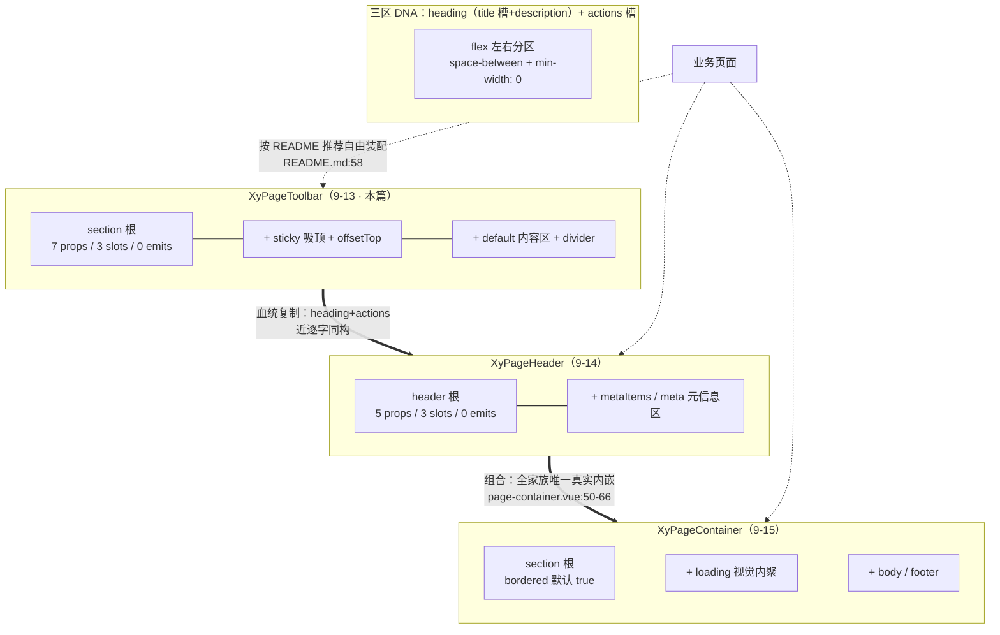
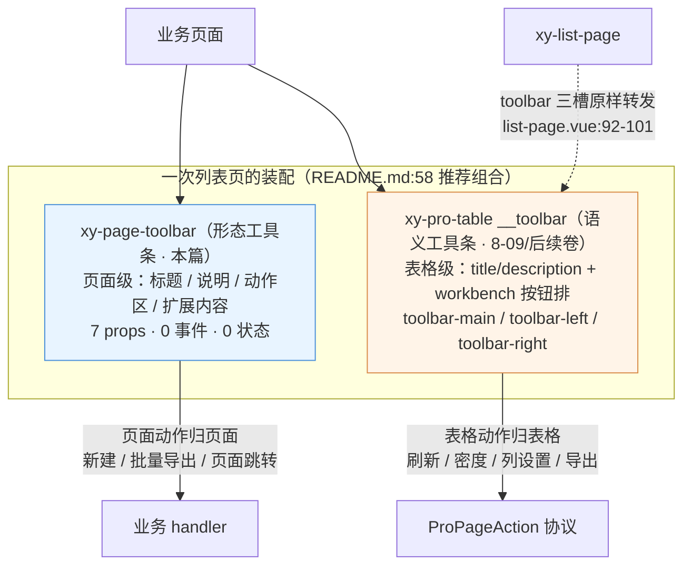

# 9-13 · PageToolbar：工具条

> 本篇是 9 卷"增强层（pro-components）"的第十三篇，按大纲（`column/02-分卷大纲.md:167`）回答的核心问题只有一句话——**纯布局件的设计纪律**。前置篇 9-12 的结尾（`column/9-12-FilterPanel-筛选面板.md:616`）给本篇留了一道题："当一个组件真的什么逻辑都没有，它的'设计'还剩下什么？"那篇还顺手下了一个断言——PageToolbar"零 props、零逻辑"。本篇精读全部源码后的第一件事就是修正这半句：**"零逻辑"在 7-07 立下的工程定义上成立，"零 props"不成立**——`PageToolbarProps` 有 7 个成员，吸顶、卡片化、内容分隔线全在里面。但这个修正恰恰让本篇更有意思：一个有 7 个 props 的组件，凭什么还算"纯布局件"？纯布局件的设计纪律，到底在约束什么、又放过什么？

接到题目先复述目标：`packages/pro-components/page-toolbar` 要回答的不是"工具条上放什么"——那是 pro-table 内建工作台的事——而是"页面顶部的标题、说明与动作区**长成什么骨架**"。它的全部源码是本仓库增强层里最轻的一档：`src/page-toolbar.vue`（55 行）、`src/page-toolbar.ts`（11 行）、`index.ts`（8 行）、`__tests__/page-toolbar.spec.ts`（38 行）、样式 `packages/theme/src/pro/page-toolbar.css`（61 行），合计 173 行；对外导出面只有 1 个组件值加 1 个类型（`packages/pro-components/exports.ts:10`、`packages/pro-components/index.ts:47`）。没有 emits、没有 expose、没有 watch、没有 ref、没有一次 DOM 测量。本篇全部路径与行号均已逐一核对当前工作区实态，其中有一处与任务考据不符的发现（page-toolbar 并没有被 page-header 或 list-page 内嵌）会在第一节如实报告，文末附完整核对清单。

## 一、页面骨架族的底座：三件套谱系的真相

先立全景。README 把三个组件并排写在"页面骨架"一行（`README.md:29`）："页面骨架：`PageContainer`、`PageHeader`、`PageToolbar`"；推荐组合表里它们再次同框（`README.md:58`）；清单侧三个条目的 `docsGroup` 同为 `"page"`（`packages/pro-components/component-manifest.json:75-80` 及 page-header、page-container 两条）。"页面骨架三件套"是成立的，但**它们之间的谱系关系，和多数人第一反应的不一样**。

任务考据里有一条"page-header/list-page 内嵌 page-toolbar 的段"。我把全仓（排除 node_modules 与产物目录）搜了一遍：`xy-page-toolbar` 与 `PageToolbar` 的全部出现点，除了组件自身五个文件，只剩 README 的三处推荐、文档站的示例与 API 页（`apps/docs/examples/pro/page-toolbar/`、`apps/docs/pro-components/page-toolbar.md`）、进度表（`apps/docs/guide/PROGRESS.md:149`）、类型夹具（`tests/types/fixtures/page-toolbar.ts`、`tests/types/fixtures/xiaoye-pro-components.ts:23`）、守卫脚本白名单（`scripts/check-pro-components.mjs:25`）和聚合样式导入（`packages/pro-components/style.css:11`）。**没有任何一个 pro 组件在模板里内嵌 `xy-page-toolbar`**。page-container 唯一真实内嵌的是 page-header（`page-container.vue:50-66`）；list-page 里那个叫 toolbar 的东西是转发给 pro-table 的插槽组（`list-page.vue:92-101`），与本组件无涉。这个发现不是坏消息，反而是本篇的定论之一：**page-toolbar 是三件套里唯一不被家族复用的成员——它是留给业务页面的底座，不是家族的内件**。它先立，但立完就让位。

那"先立最底层"立的是什么？把三个组件的模板骨架并排看：page-toolbar 是 `section` 根下"header（heading + actions）+ content"两段；page-header 是 `header` 根下"main（heading + actions）+ meta"两段；page-container 是 `section` 根下"header + body + footer"三段。三者共享同一份 DNA——**heading（title + description）与 actions 的左右分区**。看这份 DNA 的两次表达，`page-toolbar.vue:39-49`：

```vue
<div class="xy-page-toolbar__header">
  <div class="xy-page-toolbar__heading">
    <slot name="title">
      <h2 v-if="props.title" class="xy-page-toolbar__title">{{ props.title }}</h2>
    </slot>
    <p v-if="props.description" class="xy-page-toolbar__description">{{ props.description }}</p>
  </div>
  <div v-if="$slots.actions" class="xy-page-toolbar__actions">
    <slot name="actions" />
  </div>
</div>
```

与 `page-header.vue:29-40`：

```vue
<div class="xy-page-header__main">
  <div class="xy-page-header__heading">
    <slot name="title">
      <h2 v-if="props.title" class="xy-page-header__title">{{ props.title }}</h2>
    </slot>
    <p v-if="props.description" class="xy-page-header__description">{{ props.description }}</p>
  </div>

  <div v-if="$slots.actions" class="xy-page-header__actions">
    <slot name="actions" />
  </div>
</div>
```

两段代码只差类名前缀与一个空行，**近逐字同构**。连样式层都是孪生的：`page-toolbar.css:1-7` 与 `page-header.css:1-7` 的根类七行完全一致（column flex、`--xy-space-4` 间距与内边距、`--xy-radius-lg` 圆角），`is-bordered` 三行（边框、容器底色、`--xy-shadow-1` 投影）、24px 标题、`--xy-text-secondary` 描述全部成对出现。所以三件套的谱系不是组件树上的组合关系，而是**同一份模板 DNA 的三次分叉**：page-toolbar 分叉出吸顶与内容区，page-header 分叉出 meta 元信息区，page-container 拿 page-header 做头部（唯一一次真实组合）再分叉出 loading 与 footer。血统靠复制传播，组合只发生在最外层——谱系图如下：



虚线是关键：三件套对业务页面是**并列的可选件**，不是层层包裹的必经之路。你可以只用 page-toolbar 顶一条工具栏，也可以 page-container 套 page-header 再在 body 里自己铺工具条。底座的意义不是"被上面调用"，而是"给页面一套已经校准过的骨架词汇"——heading 怎么排、actions 怎么折行、吸顶怎么留偏移，这些决定做过一次，业务页面就不再各写各的。这是纯布局件在家族里的站位：**它不解决语义，它消灭布局的分叉**。

那"唯一一次真实组合"长什么样，把 page-container 的头部装配段全文摆出来，`page-container.vue:47-66`：

```vue
<template>
  <section :class="rootClasses">
    <slot v-if="$slots.header" name="header" />
    <xy-page-header
      v-else-if="showDefaultHeader"
      :title="props.title"
      :description="props.description"
      :meta-items="props.metaItems"
      :divider="props.divider"
      :bordered="false"
    >
      <template v-if="$slots.extra || $slots.actions" #actions>
        <slot name="actions">
          <slot name="extra" />
        </slot>
      </template>
      <template v-if="$slots.meta" #meta>
        <slot name="meta" />
      </template>
    </xy-page-header>
```

三个条件连环：业务方塞了 `#header` 就整体接管（49 行），没塞才看 `showDefaultHeader`（props 或插槽有没有头部的材料，`page-container.vue:33-41` 的五项布尔合成）；接上之后 page-container 把自己的 `actions`/`extra`/`meta` 三个槽映射进 page-header 的对应槽（58-65 行），并把 `:bordered` 硬编码为 `false`——**容器已经在带壳，头部不再自带第二层壳**。page-toolbar 若也要被这样组合，得先回答"它的 default 内容区在 page-container 的 body 语义里算什么"，这正是它没有被组合、而由业务页面对着 README 推荐表自由拼装的深层原因。

## 二、55 行全貌：零逻辑判定的逐条执行

类型文件全文照录，`packages/pro-components/page-toolbar/src/page-toolbar.ts:1-11`：

```ts
import type { CSSProperties } from "vue";

export interface PageToolbarProps {
  title?: string;
  description?: string;
  divider?: boolean;
  sticky?: boolean;
  offsetTop?: number;
  bordered?: boolean;
  style?: CSSProperties;
}
```

7 个成员分三组：`title`/`description` 是头部文案组；`divider`/`bordered` 是形态开关组；`sticky`/`offsetTop` 是吸顶组；最后一个 `style` 单独说（第四节的权衡二）。注意这份类型里**没有任何一个语义字段**：没有 `actions`（没有"新建/导出"的速记配置）、没有 `loading`、没有 `breadcrumb`、没有 `back`、没有 `size`、没有 `density`。对照 9-04 拆过的 search-form 17 个 props、8-09 表格列模型的体量，这 7 个成员里唯一的"行为感"是 sticky——而它严格说也只是两个视觉类名加一个 top 值。**类型即契约：11 行类型文件声明了这个组件只关心"长什么样"，对"是什么页面"一无所知。**

实现文件全文分两段看。script 段，`packages/pro-components/page-toolbar/src/page-toolbar.vue:1-34`：

```ts
<script setup lang="ts">
import { computed } from "vue";
import type { CSSProperties } from "vue";
import { useNamespace } from "xiaoye-primitives";
import type { PageToolbarProps } from "./page-toolbar";

defineOptions({
  name: "XyPageToolbar"
});

const props = withDefaults(defineProps<PageToolbarProps>(), {
  title: "",
  description: "",
  divider: false,
  sticky: false,
  offsetTop: 0,
  bordered: false,
  style: undefined
});

const ns = useNamespace("page-toolbar");
const rootClasses = computed(() => [
  ns.base.value,
  props.bordered ? "is-bordered" : "",
  props.sticky ? "is-sticky" : ""
]);
const rootStyle = computed<CSSProperties>(() => ({
  ...(props.style ?? {}),
  ...(props.sticky
    ? {
        top: `${props.offsetTop}px`
      }
    : {})
}));
</script>
```

现在用 7-07 立下的"无逻辑组件"工程定义逐条验收（`column/7-07-Empty-无逻辑组件的规范.md:97`）：那条定义说，零逻辑"零"的是三样东西——**没有可变状态**（没有一个 `ref` 被写入，所有 computed 都是 props + slots 到视图的纯映射）、**没有对外行为**（`defineEmits` 零条，实例方法零个）、**没有副作用**（没有 `watch`、没有定时器、没有 DOM 测量）。逐条对：状态面，全文件没有一个 `ref`/`reactive`，两个 computed 均为 props 到类名与样式的纯映射；行为面，`defineEmits` 与 `defineExpose` 双双缺席，组件没有任何事件可听、没有任何方法可调；副作用面，无 watch、无定时器、无 `getBoundingClientRect`。**三条全中，判定成立**。和 empty 对比还有一层递进：empty 有 5 个 computed 加一整套 SVG 图形资产（82 行），page-toolbar 只有 2 个 computed 加一个 `section`（55 行）——它把 7-07 的规范又往下压了一档，压到"连图形都没有，只有分区"。

template 段全文，`page-toolbar.vue:37-55`：

```vue
<template>
  <section :class="rootClasses" :style="rootStyle">
    <div class="xy-page-toolbar__header">
      <div class="xy-page-toolbar__heading">
        <slot name="title">
          <h2 v-if="props.title" class="xy-page-toolbar__title">{{ props.title }}</h2>
        </slot>
        <p v-if="props.description" class="xy-page-toolbar__description">{{ props.description }}</p>
      </div>
      <div v-if="$slots.actions" class="xy-page-toolbar__actions">
        <slot name="actions" />
      </div>
    </div>

    <div v-if="$slots.default" :class="['xy-page-toolbar__content', props.divider ? 'is-divider' : '']">
      <slot />
    </div>
  </section>
</template>
```

19 行模板里只有三种语法：插槽分发、`v-if` 存在性判定、类名拼接。没有 `v-for`、没有 `v-model`、没有动态组件、没有 transition。模板里的每一处分支最终都收敛到一个"渲染 / 不渲染"的布尔门——7-07 给无逻辑组件模板画的这条画像（`column/7-07-Empty-无逻辑组件的规范.md:143`），在这里第二次兑现。根标签选 `section` 而不是 `div` 也是一个不做声明的语义决定：工具条是页面上的一个**章节性区块**，`section` 比 `div` 多传达这一层文档结构，却不预设任何标题层级——层级的事交给 41-43 行那个默认 `h2`。

还有一处层面级的小差异值得记账：这个组件的 `ns` 只用了一次（`ns.base.value` 出根类名），六个子级类名全是 `xy-page-toolbar__` 开头的**字面量字符串**。对照基础层的 space——42 行里 `ns.base.value`、`` `${ns.base.value}--${props.direction}` ``、`ns.is('wrap', ...)` 三个助手全用上了（`space.vue:36`）。翻遍增强层，filter-panel（7 处字面量）、page-header（9 处字面量）全是一个习惯：**pro 层只在根上走 `useNamespace`，子级类名直接写字面量**。省掉的是 BEM 助手的调用噪声，换来的是类名与样式文件的可搜索性直接对齐（在 `page-toolbar.css` 里搜 `__header` 一搜一个准）。这是两个层面各自沉淀出的书写惯例，读增强层源码时值得先知道。

## 三、三区插槽：API 收敛到极致的规范

核心问题"纯布局件的设计纪律"，一半的答案在插槽组织上。三个插槽、零作用域入参，分工是一条 7-07 已经立过的纪律的延续——**prop 只承载"字符串能表达的东西"，凡是需要组件组合的内容，一律走插槽**（`column/7-07-Empty-无逻辑组件的规范.md:175`）。逐区看：

**标题区是"prop 打底、插槽夺权"的双通道**。41-43 行 `<slot name="title">` 的回退内容是 `h2` 默认标题——注意插槽回退的语义：**只有父级没填 `#title` 时才渲染**。所以传了 `title` prop 又填了 `#title` 插槽的业务方，prop 会被整个吞掉。这个先后关系把两种内容通道摆得清清楚楚：`title` prop 服务"一句话标题"的 80% 场景（一个字符串就够），`#title` 插槽服务"标题区要放图标、状态标签、面包屑"的 20% 场景（需要组件组合）。prop 是插槽的默认值，插槽是 prop 的逃生门——两者不并存，边界干净。

**描述区是单通道，这是一处值得记账的不对称**。44 行 `<p v-if="props.description">` 只有 prop 没有插槽——标题给了逃生门，描述没给。对照 9-12 给 FilterPanel 记的账（折叠按钮文案硬编码、靠 meta 插槽逃生），page-toolbar 的做法是反向的：**它不给 description 配槽，等价于宣称"描述区永远是文字"**。理由能从体量上推出来：多一个槽就多一行 `$slots` 判定和一行文档 API（`apps/docs/pro-components/page-toolbar.md:31-37` 的 Slots 表每行都是承诺），对一个立志做纯布局件的组件，每个接口都要回答"这个自由是布局自由还是语义自由"——描述区接受富内容的自由属于后者，收掉。真要放富内容？`#title` 槽整个换掉标题区，描述自己用 default 区补。口径收敛到"三个槽、零作用域"，这是把 9-01 立的导出边界纪律（插槽入参不上根入口，`column/9-01-增强层总览-导出边界与双重守卫.md:438` 的类型白名单里这个组件只有 `PageToolbarProps` 一个名字）在组件内部贯彻到了插槽层。

**动作区与内容区都是"存在即渲染"**。46 行 `v-if="$slots.actions"`、51 行 `v-if="$slots.default"`——插槽没填，容器 div 连同它的 flex 布局整体消失，不会留一个空盒子把 `space-between` 撑出鬼影。这是 5-10 讲 Card 时立过的"footer 靠存在性驱动"约定的继续推广：**纯布局件的每个分区都应该可以被业务方整体省略**。heading 区没有这层判定，因为 `title`/`description` 各有自己的 `v-if`，两个字段都空时 heading 降级为空 div——一个不可见的空壳，无伤大雅但严格说不算"整体省略"，算这 19 行里唯一一处不彻底。

官方示例全文只有 15 行，正好把三区用法走了一遍，`apps/docs/examples/pro/page-toolbar/basic.vue:1-15`：

```vue
<template>
  <xy-page-toolbar
    title="成员管理"
    description="统一承接页面级动作和筛选区"
    bordered
    divider
  >
    <template #actions>
      <xy-button type="primary">新建成员</xy-button>
      <xy-button plain>批量导出</xy-button>
    </template>

    <xy-card>这里可以继续承接筛选区、统计标签或说明文案。</xy-card>
  </xy-page-toolbar>
</template>
```

三个值得停一拍的细节。其一，`#actions` 里放的是两个 `xy-button`——动作区的语义（哪些按钮、什么顺序、什么类型）100% 归业务方，工具条只负责把它们排在右边、间距 `--xy-space-2`、可折行（`page-toolbar.css:45-50`）。其二，default 区放的是一张 `xy-card`——内容区对内容类型零假设，卡片、搜索表单、统计标签、一段说明文字都行，9-12 那篇说过 FilterPanel 的 default 是"一个黑盒"，这里同样成立。其三，示例同时开了 `bordered` 与 `divider`——这两个形态开关正是下一节的主角。

拿 Element Plus 对照这一节，差异比相似更醒目。**EP 的组件目录里没有页面工具条这个品类**：离得最近的 `el-page-header` 是一个语义预设件——默认渲染一个返回箭头加 "Back" 文案，`el-avatar`/`el-breadcrumb` 往里放都要靠专属插槽，一出生就带着"这是个导航返回头"的路由假设；而 page-toolbar 连返回键的概念都没有，矩阵给 9-14 立的条目就叫"零返回键零路由假设"（`column/01-知识点全集矩阵.md:189`，下篇展开）。EP 也没有"heading + actions 左右分区"的布局件——`el-space` 只管间距，`el-container` 只管大框架，中间那一层"页面头部骨架"在 EP 生态里是每个项目自己用 flex 手搓的。本库把这个手搓动作收编成组件，收编的代价恰恰是本篇的问题本身：**一个几乎不写逻辑的组件，纪律必须全部落在"不写什么"上**——不写语义字段、不写事件、不写状态、不写文案，只写分区。

## 四、样式全文与四个设计权衡

样式文件 61 行全文照录，`packages/theme/src/pro/page-toolbar.css:1-61`：

```css
.xy-page-toolbar {
  display: flex;
  flex-direction: column;
  gap: var(--xy-space-4);
  padding: var(--xy-space-4);
  border-radius: var(--xy-radius-lg);
}

.xy-page-toolbar.is-bordered {
  border: 1px solid var(--xy-border);
  background: var(--xy-bg-container);
  box-shadow: var(--xy-shadow-1);
}

.xy-page-toolbar.is-sticky {
  position: sticky;
  z-index: 30;
  background: color-mix(in srgb, var(--xy-bg-container) 88%, transparent);
  backdrop-filter: blur(12px);
}

.xy-page-toolbar__header {
  display: flex;
  justify-content: space-between;
  gap: var(--xy-space-4);
  align-items: flex-start;
}

.xy-page-toolbar__heading {
  min-width: 0;
}

.xy-page-toolbar__title {
  margin: 0;
  color: var(--xy-text-primary);
  font-size: 24px;
  line-height: 1.2;
}

.xy-page-toolbar__description {
  margin: var(--xy-space-2) 0 0;
  color: var(--xy-text-secondary);
}

.xy-page-toolbar__actions {
  display: flex;
  align-items: center;
  flex-wrap: wrap;
  gap: var(--xy-space-2);
}

.xy-page-toolbar__content.is-divider {
  padding-top: var(--xy-space-4);
  border-top: 1px solid var(--xy-border);
}

@media (max-width: 720px) {
  .xy-page-toolbar__header {
    flex-direction: column;
  }
}
```

任务考据里问的"左右分区（左标题/右动作？）"由 22-27 行给出实证答案：`__header` 是 `justify-content: space-between` 的横向 flex，左侧 `__heading`（标题加描述，`min-width: 0` 防长标题撑爆），右侧 `__actions`——**左标题、右动作，确认无误**。这段样式里埋着四个值得展开的设计权衡。

**权衡一：吸顶的执法——6 行 CSS 对 394 行 JS。**`is-sticky` 的全部吸顶逻辑是 `position: sticky` 加 `z-index: 30` 加毛玻璃背景（15-20 行），JS 侧的配套只有 rootStyle 里一行 `top` 映射（`page-toolbar.vue:29-33`）。对照基础层的 affix——394 行，滚动容器探测（`affix.vue:116-118` 的 overflow 正则判定）、`scrollTop` 监听（`affix.vue:147-150`、`185`）、fixed 切换与事件抛出，一整套几何计算。同一个"吸顶"需求，两套执法。CSS sticky 的收益是零监听、零测量、交给排版引擎，代价也要认三条：它只在**最近的滚动祖先**内生效，滚动容器不是工具条的业务方时行为会出乎意料；`offsetTop` 只是 `top` 值的直译，不是 affix 那种"滚动过阈值才钉住"的触发语义；钉住瞬间没有任何事件可听（组件根本没事件）。EP 用户面对同一需求是两条路自己选：自写 `position: sticky` 的 CSS，或者上 `el-affix` 的 JS 方案——本库把两条路分给了两个层面的两个组件，增强层工具条取 CSS 端（够用的场景最省），基础层固钉守 JS 端（精确的场景才付几何的钱）。

**权衡二：`style` 升格为 prop——显式契约换隐式便利。**`style` 出现在 `PageToolbarProps` 里（`page-toolbar.ts:10`）且在 `withDefaults` 里显式给了 `undefined`（`page-toolbar.vue:18`），这在本仓库是个孤例级的写法：绝大多数组件任由 `style`/`class` 走 Vue 的 attrs 透传，根本不声明。声明之后运行时行为变了——我用仓库同款 Vue 3.5.30 做过 SSR 实测：父级传入的 `style` 对象被捕获为 prop（`props.style` 拿到对象），同时**从 `$attrs` 里消失**，不再参与 Vue 的自动合并。于是 27-34 行的 `rootStyle` 成了唯一的合并点，合并顺序由代码写死：`props.style` 先展开，sticky 的 `top` 后展开——**吸顶偏移压过用户样式里可能存在的同名 `top`**。若不声明，Vue 的透传合并也能工作，但合并顺序归 Vue 管、类型契约归文档外。声明化的收益是三条：契约进类型（文档 API 表 `apps/docs/pro-components/page-toolbar.md:29` 有它一行、类型夹具 `tests/types/fixtures/page-toolbar.ts` 有它一票）、合并顺序可控、吸顶优先级有书面保证；代价是失去自动合并的"免费"，必须手动绑定。对一个要把 `top` 和用户样式搅在一起的组件，这笔交易划算——**显式契约买到的不是功能，是"谁赢"的确定性**。

**权衡三：`bordered` 与 `divider`——两颗视觉开关的不同射程。**根类默认是"裸"的：1-7 行只有排版（column、gap、padding、radius），没有一条背景与描边——工具条默认透明地叠在页面自己的容器上，这正是"底座"的自觉：嵌进任何页面都不带自己的壳。`is-bordered` 一开（9-13 行），整圈边框、容器底色、`--xy-shadow-1` 投影一次给齐，布局件就地升级成卡片。**为什么默认裸、可选壳？**因为页面骨架的第一站位是"嵌套者"，壳是可选项不是默认值——对照 page-container 的 `bordered` 默认 `true`（`page-container.vue:18`）：家族里最外层的容器默认带壳，最内层的工具条默认裸奔，射程由嵌套深度决定。`divider` 的射程更窄：它只作用于 default 内容区（52-55 行的 `border-top` 加 `padding-top`），不是根边框——对照 page-header 的 `is-divider` 是根节点的 `border-bottom`（`page-header.css:15-17`）。**同一个词，在两兄弟身上一条切在头部之下、一条切在根的下缘**，这是 DNA 复制谱系的代价：语义没有跟着代码一起复制，读 API 表时得逐个组件确认。

**权衡四：720px 断点——一处读码才知道的暗面。**57-61 行的媒体查询把 `__header` 在窄屏切竖排，这是三区布局唯一的响应式行为，但断点取值是 `720px`——**整个 pro 样式层的孤例**：page-header、search-form、pro-table、detail-page、list-page、split-layout-page、overlay-form、detail-panel 的断点清一色 `960px`，login-form 独用 `640px`（各文件 `@media` 行已逐一核对）。960 折页头、720 才折工具条，从"工具条动作更密、应更早竖排"的语义讲不通（720 比 960 更晚），更像是三件套分头实现时各自调参、没有回头拉齐的产物。如实记账：这不是会出错的行为（每个断点各自工作正常），是**家族一致性的一个缺口**——纯布局件的纪律约束了 JS，没约束住 CSS 常量的跨文件对齐。

## 五、两个 toolbar 与两个布局件：对照收束

第一节的搜索结果里有一条必须正面处理：仓库里其实住着**两个都叫 toolbar 的东西**。第二个在 pro-table 里，`pro-table.vue:1505-1527`：

```vue
<div v-if="hasToolbar" class="xy-pro-table__toolbar">
  <div class="xy-pro-table__toolbar-main">
    <slot name="toolbar-main">
      <h3 v-if="props.title" class="xy-pro-table__title">{{ props.title }}</h3>
      <p v-if="props.description" class="xy-pro-table__description">
        {{ props.description }}
      </p>
    </slot>
  </div>
  <div class="xy-pro-table__toolbar-extra">
    <slot name="toolbar-left" />

    <div v-if="resolvedWorkbench.density" class="xy-pro-table__density">
      <xy-button
        v-for="density in ['sm', 'md', 'lg']"
        :key="density"
        :type="tableDensity === density ? 'primary' : 'default'"
        text
        @click="setDensity(density as ProTableDensity)"
      >
        {{ density.toUpperCase() }}
      </xy-button>
    </div>
```

（同结构的右侧收尾在 `pro-table.vue:1569` 的 `<slot name="toolbar-right" />`。）工作台按钮排的下半段更直白，`pro-table.vue:1544-1570`：

```vue
<xy-button v-if="resolvedWorkbench.refresh" text @click="handleRefresh">刷新</xy-button>
<xy-button v-if="resolvedWorkbench.filter" text @click="openFilterDrawer">筛选</xy-button>
<xy-button
  v-if="resolvedWorkbench.treeToggle && tableRef?.bodyRows?.length"
  text
  @click="tableRef?.setAllTreeRowsExpanded(true)"
>
  展开树
</xy-button>
<xy-button
  v-if="resolvedWorkbench.treeToggle && tableRef?.bodyRows?.length"
  text
  @click="tableRef?.setAllTreeRowsExpanded(false)"
>
  收起树
</xy-button>
<xy-button v-if="resolvedWorkbench.columnSetting" text @click="settingsOpen = !settingsOpen">
  列设置
</xy-button>
<xy-button v-if="resolvedWorkbench.export" text @click="handleExport()">导出</xy-button>
<xy-button v-if="resolvedWorkbench.print" text @click="handlePrint">打印</xy-button>
<xy-button v-if="resolvedWorkbench.fullscreen" text @click="toggleFullscreen()">
  {{ fullscreen ? "退出全屏" : "全屏" }}
</xy-button>

<slot name="toolbar-right" />
```

八个按钮人人带 `v-if`、八个动作全部直绑内部方法——每个动作背后都是表格工作台的协议与状态。对比 page-toolbar 的 19 行模板（第二节），"语义工具条"的复杂度全在动作协议上，形态骨架其实一模一样。

注意它的骨架——main 区是 `title` 槽加 `h3` 回退、description 回退，extra 区左槽右槽夹一排 workbench 按钮——**和 page-toolbar 的三区 DNA 又是同构的**，但它是"语义工具条"：density 密度切换、刷新、筛选、列设置、导出、全屏，每个按钮背后都是表格工作台的协议（`toolbarActions`、`emit("toolbar-action")`）。list-page 的 92-101 行把这组插槽原样转发（`toolbar-main`/`toolbar-left`/`toolbar-right` 三槽穿透），8-09 表格卷与后续的 list-page 卷拆的是这一套；本篇的 page-toolbar 则是"形态工具条"：零按钮、零协议、零状态，只有分区。两个 toolbar 的关系可以用一张装配图收束：



两个工具条在推荐组合里上下同框、各管一段：**页面级的动作放 page-toolbar（没有协议，事件直接归业务层），表格级的动作放 pro-table 工作台（走 `ProPageAction` 协议）**。分界线就是"有没有协议"——page-toolbar 的零事件不是缺陷，是把协议从布局件里赶出去之后留下的干净。这也顺手回应了 9-12 结尾的预告问题："当一个组件真的什么逻辑都没有，它的'设计'还剩下什么？"答案是：剩下**分区词汇表**（heading/actions/default 的命名与排布）、**双通道纪律**（prop 管文字、插槽管组合）、**存在性渲染**（空区不留壳）、**视觉预设开关**（bordered/sticky/divider 四个词）——四样全是"约定"，没有一样是"计算"。slot 约定这条从 5-10 铺过来的主线，在这里到达它最纯粹的形态：**整个组件就是一个 slot 约定**。

再看横跨两个层面的布局件对照。基础层的 space，全文 42 行（`space.vue:1-41`，末行为空），5-22 给过定论：对子项 vnode 零遍历、间距走容器 `gap` 方案、"物理上不存在遍历这个动作"（`column/5-22-Space-间距的运行时方案.md:65`）。这里把它全量摆出来与 page-toolbar 并排看，是"布局件"这个词在两个层面的两种最小形态，`packages/components/space/src/space.vue:1-41`：

```vue
<script setup lang="ts">
import { computed } from "vue";
import { useNamespace } from "xiaoye-primitives";

export interface SpaceProps {
  size?: number | "sm" | "md" | "lg";
  direction?: "horizontal" | "vertical";
  wrap?: boolean;
  align?: "start" | "center" | "end" | "stretch";
}

const props = withDefaults(defineProps<SpaceProps>(), {
  size: "md",
  direction: "horizontal",
  wrap: false,
  align: "center"
});

const ns = useNamespace("space");

const gap = computed(() => {
  if (typeof props.size === "number") {
    return `${props.size}px`;
  }

  return {
    sm: "8px",
    md: "12px",
    lg: "16px"
  }[props.size];
});
</script>

<template>
  <div
    :class="[ns.base.value, `${ns.base.value}--${props.direction}`, ns.is('wrap', props.wrap)]"
    :style="{ gap, alignItems: props.align, flexWrap: props.wrap ? 'wrap' : 'nowrap' }"
  >
    <slot />
  </div>
</template>
```

两个组件共享同一条底线——**对内容零感知**：space 不看子项一眼（没有 `useSlots()`、没有 `slots.default?.()`），page-toolbar 不知道 default 区里是什么。差别只在维度：space 的布局是"均匀的一维"（间隔所有子项），page-toolbar 的布局是"分语义的二维"（左标题右动作上内容）。基础层布局件收敛到一维是因为它服务一切场景，增强层布局件敢做二维是因为它认准了页面这个场景——**布局件的自由度，跟着它的站位走**：

| 维度 | `XySpace`（5-22 · 基础层） | `XyPageToolbar`（本篇 · 增强层） |
| --- | --- | --- |
| 体量 | 42 行（vue 单文件，无独立类型文件） | 55+11+8 行（三件套）+ 61 行样式 |
| 关心的维度 | 子项之间的**间距** | 页面上的**分区** |
| 对内容的感知 | 零（不遍历子项 vnode） | 零（不对 default 做任何处理） |
| 布局手段 | 容器 `gap` 行内样式 | flex 分区 + 存在性渲染 |
| 语义假设 | 无 | 无（连页面是什么都不管） |
| 响应式 | 无 | 720px 断点竖排 |
| 视觉预设 | 无（裸布局） | bordered / sticky 可选 |

两者共享同一条底线——**对内容零感知**：space 不看子项一眼，page-toolbar 不知道 default 区里是什么。差别只在维度：space 的布局是"均匀的一维"（间隔所有子项），page-toolbar 的布局是"分语义的二维"（左标题右动作上内容）。基础层布局件收敛到一维是因为它服务一切场景，增强层布局件敢做二维是因为它认准了页面这个场景——**布局件的自由度，跟着它的站位走**。

## 六、测试与夹具：轻表面积的完整证据链

测试文件全文 38 行，`packages/pro-components/page-toolbar/__tests__/page-toolbar.spec.ts:6-37`：

```ts
describe("XyPageToolbar", () => {
  it("支持标题、描述、actions 与默认内容", () => {
    const wrapper = mount(XyPageToolbar, {
      props: {
        title: "成员中心",
        description: "统一承接列表页顶部操作区",
        bordered: true,
        divider: true
      },
      slots: {
        actions: '<button class="toolbar-action">新建</button>',
        default: '<div class="toolbar-content">筛选区域</div>'
      }
    });

    expect(wrapper.text()).toContain("成员中心");
    expect(wrapper.text()).toContain("统一承接列表页顶部操作区");
    expect(wrapper.find(".toolbar-action").exists()).toBe(true);
    expect(wrapper.find(".toolbar-content").exists()).toBe(true);
    expect(wrapper.classes()).toContain("is-bordered");
  });

  it("sticky 模式会带上固定样式", () => {
    const wrapper = mount(XyPageToolbar, {
      props: {
        sticky: true,
        offsetTop: 64
      }
    });

    expect(wrapper.classes()).toContain("is-sticky");
    expect(wrapper.attributes("style")).toContain("top: 64px");
  });
});
```

9-12 记过一条账："测试行数是语义面的镜子"。FilterPanel 25 行钉渲染加折叠，search-form 393 行钉校验门加快照加边界——本篇 38 行钉两件事：**三区的渲染组合**（标题、描述进文本流，actions/default 两个插槽内容落位，`is-bordered` 类挂根）和**吸顶的类名与样式**（`is-sticky` 类加 `top: 64px` 行内样式，`offsetTop` 到 `top` 的映射被字面断言钉死）。没有测的：`divider` 只作为 props 传入却没断言 `__content.is-divider` 类（第一个用例传了 `divider: true`，断言只查了 `is-bordered`，算一处覆盖缺口）；`#title` 插槽夺权回退内容的行为无测试；720px 媒体查询属纯 CSS，vitest 环境外无从钉起。轻测试与轻表面积自洽，但缺口如实记下——这是"读码才知道"清单的又一条。

类型侧的证据链在两份夹具里。专用的 `tests/types/fixtures/page-toolbar.ts` 全文 16 行：

```ts
import { h } from "vue";
import { XyPageToolbar, type PageToolbarProps } from "@xiaoye/pro-components";

const props: PageToolbarProps = {
  title: "成员中心",
  description: "统一承接页面顶部操作区",
  sticky: true,
  offsetTop: 64,
  bordered: true,
  divider: true
};

const vnode = h(XyPageToolbar, props);

void props;
void vnode;
```

`PageToolbarProps` 的六成员组合字面量加一次 `h(XyPageToolbar, props)` 的挂载编译——7 个 props 里有 6 个被编译期点过名（唯一没被点的是 `style`，聚合夹具补位，`tests/types/fixtures/xiaoye-pro-components.ts:230` 附近有同款 props 断言）。聚合夹具同时从包根导入 `XyPageToolbar` 值与 `PageToolbarProps` 类型（`xiaoye-pro-components.ts:23`、`:66`），把 9-01 的根入口白名单（值 `exports.ts:10`、类型 `index.ts:47`、守卫 `scripts/check-pro-components.mjs:25` 的 `"page-toolbar": ["PageToolbarProps"]`）从两侧各钉了一颗钉子。一个 173 行的组件，测试加夹具 54 行，**证据链的密度与表面积成正比，一分不多一分不少**。

## 七、收束：纯布局件的设计纪律，四条

把本篇收成四条纪律，它们合起来就是"API 收敛到极致"的操作定义。**一、语义清零**：类型层没有任何字段回答"这是什么页面"，7 个 props 全部回答"长什么样"；事件零条、实例方法零个、可变状态零个——7-07 的零逻辑三条件逐条成立，且比 empty 更轻（2 个 computed、无图形资产）。**二、双通道不越界**：prop 只管字符串，`#title` 槽管组合并整体夺权；description 单通道是收敛的自觉而非遗漏；三个插槽零作用域入参，根入口类型白名单里只有主 Props 一个名字。**三、空区不留壳**：actions 与 default 都做存在性判定，分区可以被整体省略——纯布局件的每个格子都得是可删的。**四、视觉预设可开可关**：默认裸布局当嵌套者，bordered 就地卡片化，sticky 用 6 行 CSS 借排版引擎的力，`style` 升格 prop 买下"谁赢"的确定性。四条之外留两条暗面在档：720px 断点是家族孤例，divider 一词两义随 DNA 复制分叉——纯布局件的纪律管住了 JS 与接口，CSS 常量与词汇表的一致性还得靠人回头拉齐。

下一篇 9-14《PageHeader：页头》沿着三件套往中间一层走：大纲给它的核心问题是"meta 区与动作区的结构"（`column/02-分卷大纲.md:168`），矩阵条目钉的是"metaItems 双通道 + 零返回键零路由假设"（`column/01-知识点全集矩阵.md:189`）。本篇已经铺好了两块垫脚石——它和 page-toolbar 共享那份近逐字同构的三区 DNA（第一节的两段对照），又把 `divider` 用成了根部的 `border-bottom`（第四节的权衡三）；下篇要拆的新东西是 `metaItems` 数据与 `#meta` 插槽的双通道结构，以及那枚 EP `el-page-header` 默认渲染、而它坚决不渲染的返回箭头：**页头这个品类在 EP 手里是导航件，在这里是纯信息件**。三件套走到第二层，骨架词汇表的下一章是"元信息区"。

---

*本篇代码引用核对于当前工作区实态：`packages/pro-components/page-toolbar/src/page-toolbar.vue`（55 行）、`src/page-toolbar.ts`（11 行）、`index.ts`（8 行）、`__tests__/page-toolbar.spec.ts`（38 行）、`packages/theme/src/pro/page-toolbar.css`（61 行）、`packages/pro-components/page-header/src/page-header.vue`（60 行）、`packages/pro-components/page-container/src/page-container.vue`（89 行）、`packages/theme/src/pro/page-header.css`（83 行）、`packages/pro-components/pro-table/src/pro-table.vue`（toolbar 段 1505-1527、1569 行）、`packages/pro-components/list-page/src/list-page.vue`（92-101 行）、`packages/components/space/src/space.vue`（42 行）、`packages/components/affix/src/affix.vue`（394 行，116-118/147-150/185 行）、`tests/types/fixtures/page-toolbar.ts`（16 行）、`tests/types/fixtures/xiaoye-pro-components.ts`（23/66/230 行）、`packages/pro-components/component-manifest.json`（75-80 行）、`exports.ts`（10 行）、`index.ts`（47 行）、`style.css`（11 行）、`scripts/check-pro-components.mjs`（25 行）、`README.md`（29/58/72 行）、`apps/docs/guide/PROGRESS.md`（149 行）、`apps/docs/pro-components/page-toolbar.md`（37 行）、`apps/docs/examples/pro/page-toolbar/basic.vue`（15 行）、`column/02-分卷大纲.md`（167-169 行）、`column/01-知识点全集矩阵.md`（188-190 行）。EP 侧事实：Element Plus 无页面工具条品类，最近似件为 `el-page-header`（默认渲染返回箭头与 Back 文案，导航预设）与 `el-space`/`el-container`；吸顶路径为自写 CSS 或 `el-affix`（JS 测量）。`style` 升格 prop 的运行时行为（捕获为 prop 并从 $attrs 消失）已用仓库同款 Vue 3.5.30 SSR 实测确认。与考据不符处：page-toolbar 未被 page-header/list-page 或任何 pro 组件内嵌，消费实证为 README 推荐组合、文档示例、类型夹具与清单登记；9-12 结尾"零 props"的说法与实态不符（实有 7 props）。*
