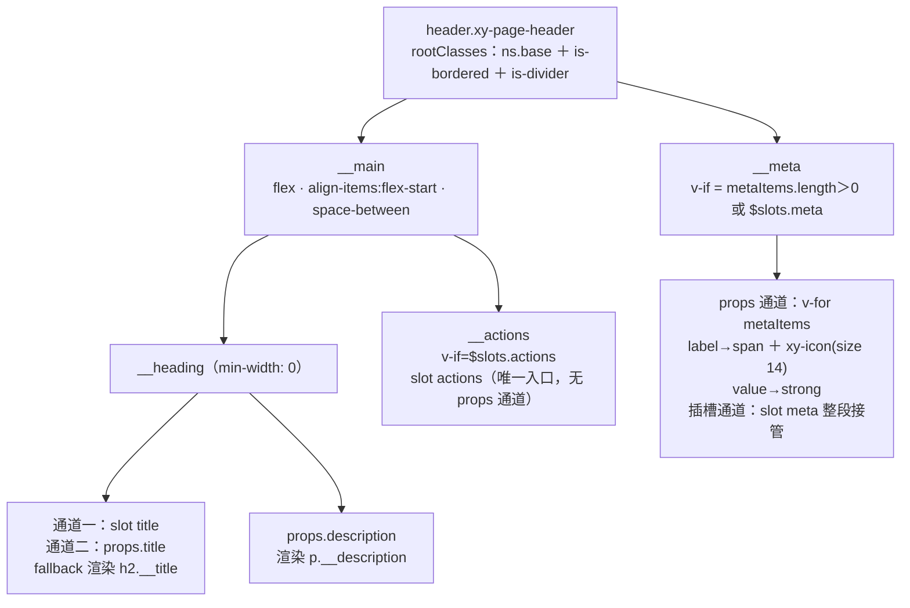
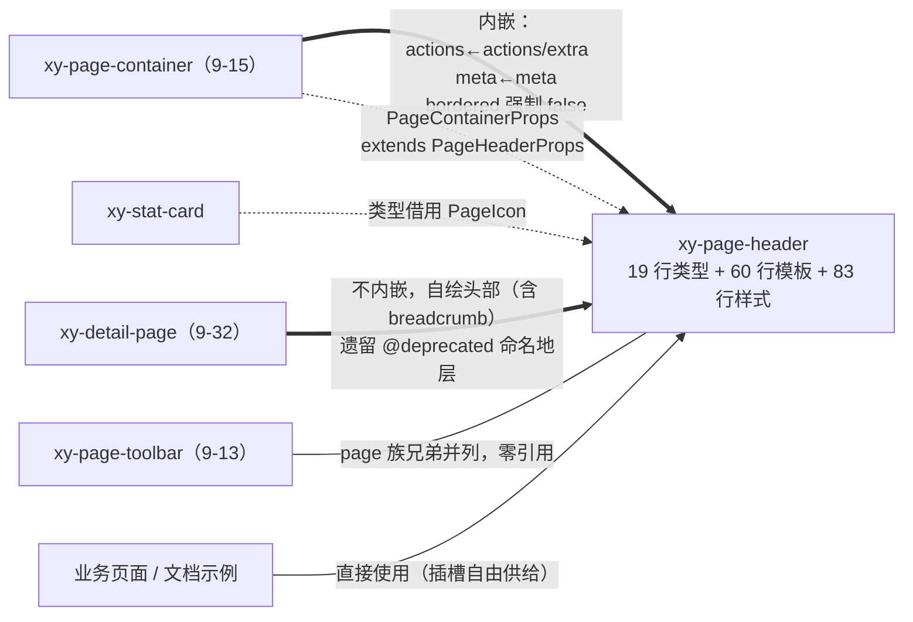

# 9-14 · PageHeader：页头

> 本篇是 9 卷"增强层（pro-components）"的第十四篇，按大纲（`column/02-分卷大纲.md:168`）回答的核心问题只有一句话——**meta 区与动作区的结构**。前置篇是 9-13：那篇定了"纯布局件的设计纪律"，本篇把这个纪律放到页头这个最有争议的组件形态上再压一遍秤。知识点矩阵给本篇立的条目原话是："页头结构与 meta 区（metaItems 双通道 + 零返回键零路由假设）"（`column/01-知识点全集矩阵.md:189`）——两括号里各藏一条本篇必须用实码钉死的定论。

接到题目先复述目标：`packages/pro-components/page-header` 要回答的不是"页头长什么样"，而是"页头这块在中后台页面里被写烂了千百遍的摘要区，**应该由哪几块骨头拼成、每块骨头留给谁**"。它的全部源码比 9-12 的 FilterPanel 还薄——`src/page-header.ts`（19 行）、`src/page-header.vue`（60 行）、`index.ts`（8 行）、`__tests__/page-header.spec.ts`（42 行）、样式 `packages/theme/src/pro/page-header.css`（83 行），合计约 212 行。5 个 props、**0 个事件**、3 个插槽。没有返回键、没有 breadcrumb、没有 router 集成、没有 emits 声明——在一个标题就叫"页头"的组件里，把这些"页头标配"全部砍掉，不是没做完，是读完生态史之后刻意不做的：Element Plus 已把自家 PageHeader 标记为 deprecated 并计划在下一个大版本移除，ant design 的 PageHeader 在 v4 弃用、v5 直接移除。两大库先后"劝退"同一个组件，而本库仍然做了一个页头——这个"仍然做"与那些"砍掉"之间的张力，就是本篇的主线。本篇全部路径与行号逐一核对过当前工作区实态，文末附核对清单。

## 一、生态史：一个被两大库先后"劝退"的组件

先补课，因为这段生态史直接解释了本库源码的每一处减法。

ant design 的 PageHeader 在 v4.1.0 作为官方布局件引入，4.x 后期被标记 deprecated，v5.0 从主包移除，官方迁移指引指向 `@ant-design/pro-components` 的 PageContainer——**页头被从"通用组件库"除名，发配到"业务组件层"**。Element Plus 走得更早：2022 年 12 月的 PR #12821 直接在源码上标注 `@deprecated PageHeader will be removed in NEXT_VERSION`，至今官方文档页挂着醒目的弃用警示，且历史上这颗组件还经历过"先移除又加回来"的反复。EP 仓库里社区问过"为什么要弃用一个这么常用的组件"， 得到的解释很直白：它只提供"返回箭头 + 标题 + 内容 + extra"这几行标记，外加一个 `back` 事件——任何团队用 `el-icon` 加一个 `ArrowLeft` 十分钟能拼一个，而且各自的返回逻辑（`router.back()`、`router.push(列表页)`、浏览器 history）根本不该由组件库替业务决定。

把两家的弃用理由收拢，其实是同一句话：**页头不是控件，是布局件；而布局件一旦绑定了返回语义，就绑定了路由生态，通用库替不了这个主**。本库的 page-header 把这句话反向写成了源码纪律——矩阵条目叫"零返回键零路由假设"。验证只要一条命令：

```console
$ rg -n "back|breadcrumb|Breadcrumb|emit" packages/pro-components/page-header/
（无任何命中，rg 退出码 1）
```

`page-header.ts` 与 `page-header.vue` 全文零处命中。没有 `defineEmits`，没有 `onBack`，没有 `breadcrumbs` prop。对照 EP 的 PageHeader——它的全部家当是 `icon`/`title`/`content` 三个 props、一个 `back` 事件和几个同名插槽——本库连这份"最低配"都拒绝了。这不是能力问题，是站位问题，第一节末尾的定论先押在这里：**返回区不是页头的骨头，是页面的骨头**。

那么本库页头到底留了哪几块骨头？先上分区结构全图：



读这张图抓三个结构事实：**其一**，根节点是语义化的 `<header>` 元素，不是 `div`——页头的文档语义被写进了模板第一行（`page-header.vue:28`）。**其二**，第一层是 `__main` 与 `__meta` 的上下两行：上行是"标题块 × 动作块"的左右对置，下行是元信息的自由铺排——这就是核心问题"meta 区与动作区的结构"的答案骨架：**动作区与标题同层对置，meta 区独占一行下沉**。**其三**，三个插槽三种接法：`title` 是"插槽包 props"的 fallback 模式，`meta` 是"props 数组 + 插槽整段接管"的双通道模式，`actions` 是"纯插槽、零 props"的让权模式。三种接法对应三种内容的稳定性预期，第三、四节逐一拆。

## 二、19 行类型文件：meta 区的书面契约

类型文件全文，`packages/pro-components/page-header/src/page-header.ts:1-19`：

```ts
export type PageIcon = string;

export interface PageMetaItem {
  label?: string;
  value?: string | number;
  icon?: PageIcon;
  className?: string;
  labelClassName?: string;
  valueClassName?: string;
}

export interface PageHeaderProps {
  title?: string;
  description?: string;
  metaItems?: PageMetaItem[];
  divider?: boolean;
  bordered?: boolean;
}
```

19 行拆成三组读。

**第一组：`PageHeaderProps` 的五个成员，没有一个是行为。** `title`/`description` 是文案，`metaItems` 是数据，`divider`/`bordered` 是视觉预设。没有 `model`、没有 `fields`、没有 `loading`、没有 `actions`——注意最后这个缺席：页头右上的按钮组在 antd PageHeader 里叫 `extra`，本库在 props 层**根本没有对应的槽位**，动作区唯一的供给方式是插槽（下节展开）。对比 9-12 拆过的 FilterPanel（5 个 props、零语义），page-header 的 5 个 props 走的是另一条极简路线：它有语义（标题、说明、元信息），但语义全部是**展示语义**，没有一个交互语义。展示语义可以数据化，交互语义必须让权——这是 props 表上的分界线。

**第二组：`PageMetaItem` 的六个字段，三内容 + 三钩子。** 内容侧 `label`（可选标签）、`value`（`string | number` 值）、`icon`（图标名）；钩子侧 `className`（整项类名）、`labelClassName`、`valueClassName`（两段子区类名）。这个六字段结构就是"meta 区与动作区的结构"在类型层的投影：meta 区的每一条被定义成**"标签 → 值"的二元组**，而不是自由的键值对、更不是 schema。为什么不做 schema？仓库里明明有现成的 `ProFieldSchema`（9-03 已拆，一份 schema 三形态）。因为 meta 区的数据形态和详情区的数据形态稳定性不同——详情区的字段要联动 valueType、formatter、render、hidden（`packages/pro-components/core.ts:110-124` 那张 15 字段的表），而页头 meta 区的诉求永远是"负责人：小叶"这种**一行两段**的字面量。给它的通道一旦是 schema，业务就要为三个字段的展示写一份 15 字段协议的子集；是 `PageMetaItem` 六字段，两分钟写完。**meta 区用字面量数组不用 schema，是把"配置成本"压到展示复杂度以下的取舍**——展示需求涨到六字段装不下那天，正确动作是走 `#meta` 插槽整段接管，而不是给 `PageMetaItem` 加字段。

**第三组：`export type PageIcon = string;` 的别名经济学。** 第一行单独给图标起了个名字，而它的定义就是 `string`。为什么？看消费方：`packages/pro-components/stat-card/src/stat-card.ts:1-3`：

```ts
import type { PageIcon } from "../../page-header";

export type StatTrend = "up" | "down" | "flat";
```

stat-card 的 `icon?: PageIcon`（`stat-card.ts:6`）直接借用了这个名字。`PageIcon` 表面是页头的类型，实际是**"字符串图标名"这个仓库级约定的别名锚点**——今天它锚定 `XyIcon` 的字符串入口（文档 `apps/docs/pro-components/page-header.md:35` 原话："沿用 `XyIcon` 的字符串图标入口"），明天若图标协议升级（比如换成组件类型），只需改一行别名定义，两个组件的类型层同步迁移。一个 `string` 别名的成本约等于零，换来的是协议演进的单一收口——这是类型层里最便宜的"防腐层"。顺带核对边界：`PageHeaderProps`/`PageIcon`/`PageMetaItem` 三个类型从根入口导出（`packages/pro-components/index.ts:48-52`），属于 9-01 定的"每个公开增强组件的主 Props / 主数据类型"白名单，不越界。

最后钉本节标题的反面：这份 19 行的契约里，**没有任何返回区的位置**。EP 的 PageHeader 自带一枚默认渲染的返回箭头图标和一个点击左侧触发的 `back` 事件，antd 的还有 `backIcon`/`onBack`/`breadcrumb`——本库一个都没留。设计权衡一就在这里：**返回键被明确排除出页头协议**。理由有三层：返回行为与路由实例强耦合，增强层组件不应假设调用方用不用 vue-router（零路由假设）；返回按钮该去哪（breadcrumb 尾部？工具条？浏览器手势？）是信息架构问题，不是组件问题；一旦收编了返回键，页头就得接管 `router.back()` 失败时的降级（无历史可回怎么办），语义面会指数膨胀——EP 的弃用恰好证明这条路走不通。本库把 breadcrumb 留给基础层 `xy-breadcrumb` 组件，让业务页面自己决定要不要、放哪、点了去哪。

## 三、60 行模板解剖：双通道与对置结构

script 段全文，`packages/pro-components/page-header/src/page-header.vue:1-25`：

```vue
<script setup lang="ts">
import { computed } from "vue";
import { useNamespace } from "xiaoye-primitives";
import { XyIcon } from "xiaoye-components";
import type { PageHeaderProps } from "./page-header";

defineOptions({
  name: "XyPageHeader"
});

const props = withDefaults(defineProps<PageHeaderProps>(), {
  title: "",
  description: "",
  metaItems: () => [],
  divider: false,
  bordered: false
});

const ns = useNamespace("page-header");
const rootClasses = computed(() => [
  ns.base.value,
  props.bordered ? "is-bordered" : "",
  props.divider ? "is-divider" : ""
]);
</script>
```

25 行 script 里只有两个逻辑：默认值表和类名表。默认值表有两处值得停一秒：`metaItems: () => []` 用工厂函数给引用类型发默认值（`title: ""` 是字面量所以直接给），这是 `defineProps` 运行时约束的标准写法；`divider`/`bordered` 双双默认 `false`——这颗默认值种子在第五节会长成"page-container 默认 `bordered: true`"的镜像对照，先记下。`rootClasses` 是 4-03 拆过的标准三件套写法：`ns.base.value` 出 `xy-page-header` 基类（`useNamespace` 的机制 4-03 已拆，不重复），两个视觉预设转成 `is-` 状态类。注意类名逻辑里**没有** `is-has-meta`、`is-has-actions` 之类的"内容存在性"类——结构状态不外泄到类名层，CSS 不需要为内容组合写变体。

template 段全文，`page-header.vue:27-60`：

```vue
<template>
  <header :class="rootClasses">
    <div class="xy-page-header__main">
      <div class="xy-page-header__heading">
        <slot name="title">
          <h2 v-if="props.title" class="xy-page-header__title">{{ props.title }}</h2>
        </slot>
        <p v-if="props.description" class="xy-page-header__description">{{ props.description }}</p>
      </div>

      <div v-if="$slots.actions" class="xy-page-header__actions">
        <slot name="actions" />
      </div>
    </div>

    <div v-if="props.metaItems.length > 0 || $slots.meta" class="xy-page-header__meta">
      <slot name="meta">
        <div
          v-for="(item, index) in props.metaItems"
          :key="`${item.label ?? 'meta'}-${index}`"
          :class="['xy-page-header__meta-item', item.className]"
        >
          <span :class="['xy-page-header__meta-label', item.labelClassName]">
            <xy-icon v-if="item.icon" :icon="item.icon" :size="14" />
            {{ item.label }}
          </span>
          <strong :class="['xy-page-header__meta-value', item.valueClassName]">
            {{ item.value }}
          </strong>
        </div>
      </slot>
    </div>
  </header>
</template>
```

34 行模板，按"上行 → 下行"两段拆。

**上行 `__main`：标题块与动作块的对置。** `__main` 的布局职责在 CSS 里（`page-header.css:19-24`）：`display: flex; align-items: flex-start; justify-content: space-between; gap: var(--xy-space-4)`。两个子块从此对峙：左边 `__heading` 装 `title` 插槽（带 fallback 的 `h2`）与 `description`，右边 `__actions` 装 actions 插槽。`align-items: flex-start` 意味着动作区顶齐标题第一行而不是垂直居中——按钮多到换行时向下生长，不把标题挤离视线。

这里藏着设计权衡二：**`__heading` 的 `min-width: 0`（`page-header.css:26-28`）**。flex 行内，子项的默认 `min-width` 是 `auto`——标题是不可换行的长英文串或长 URL 时，标题块会被内容撑到拒绝收缩，把右侧动作区整个挤出容器。`min-width: 0` 是 flex 溢出治理的教科书手筋，让标题块成为可收缩方、动作区成为不可牺牲方。为 60 行的组件专门给标题块加这一行，是因为页头是全页面**唯一**"左侧内容长度不可预估、右侧按钮数量不可预估、两者必须共存一行"的位置：列表页标题可能是一个长订单名，动作区可能是四个按钮。这行 CSS 是"meta 区与动作区的结构"在极端输入下的保险丝。

**上行右侧：`v-if="$slots.actions"`（`page-header.vue:37`）的存在性检测。** actions 包装 div 只在插槽供给内容时渲染——没有动作的页面，DOM 里不出现空的右列，`space-between` 自动退化为标题独占。对照 antd 的做法（`extra` 是 prop，空不空由调用方保证），插槽存在性检测把"有没有动作区"的决定权从调用方契约收回组件内部，这是 5-10 讲 card 插槽约定时同款手法（card.vue 的 `hasHeaderSlot`/`hasExtra`/`hasFooter` 三个 computed，`packages/components/card/src/card.vue:98-104`）。两代组件的对照还揭示了一个演进：card 的插槽表用 `defineSlots` 显式声明六槽（`card.vue:85-92`），page-header 没写 `defineSlots`——60 行的体量里插槽签名靠文档表（`apps/docs/pro-components/page-header.md:40-47`）背书，这是一个可以接受的省略，但也意味着插槽名拼错不会有类型报错，只有静默失效。

**下行 `__meta`：双通道渲染。** 外层 `v-if="props.metaItems.length > 0 || $slots.meta"`（`page-header.vue:42`）是**通道并联**：两条供给线任一有货，meta 区就出现。内部是 `slot name="meta"` 包着 `v-for`——熟悉 4-03/9-05 的读者认得出，这是"插槽 + 默认内容"的 fallback 模式：插槽有内容则 props 数据被整段忽略，插槽为空则逐条渲染 `PageMetaItem`。双通道的两端各有深意：

- **props 通道**（`page-header.vue:44-56`）：一条 meta 渲染成 `__meta-item` 内的"label 段 + value 段"。label 段是 `<span>`，里面条件挂一枚 `<xy-icon :size="14">`（50 行）；value 段是 `<strong>`（53 行）——**语义标签直接承担了视觉层次**：`strong` 的默认加粗 + CSS 的 `--xy-text-primary`（`page-header.css:75-77`），让"值比标签重"不靠任何额外类名成立。三个 className 钩子在此逐层挂上：`item.className` 上根（47 行）、`labelClassName` 上标签（49 行）、`valueClassName` 上值（53 行）——六字段的类型契约在模板里一个不多一个不少地兑现。`xy-icon` 是 PascalCase 导入 kebab-case 使用（4 行 import，50 行模板），Vue 编译器的名字归一化在起作用，与全仓"模板统一 kebab-case"的约定（AGENTS.md 代码约定）一致。
- **插槽通道**（43 行）：整段接管。meta 区的展示形态如果超出"标签→值"二元组——比如要放三枚徽标、一个链接组、一段行内统计——props 通道就该认输，插槽通道兜底。双通道不是冗余，是**展示复杂度的分档器**：字面量走数据，超纲走模板。

props 通道里还有一个值得抠到行的细节：`:key="`${item.label ?? 'meta'}-${index}`"`（46 行）。`label` 是可选字段，`undefined` 直接进模板字符串会渲染出 `"undefined-0"` 这种难看的 key；`?? 'meta'` 兜底后 key 变成 `"meta-0"`。但注意 `-index` 尾巴——这个 key 策略本质仍是索引键，metaItems 若在头部插入一项，后续所有条目都会换 key 重建。对纯展示的静态 meta 区这是可接受的（条目不持有内部状态），但它在源码里留下了一个诚实的边界：**metaItems 被假定为"渲染后不再重排"的数据**。如果哪天 meta 区要动效重排，这个 key 策略是第一个要重写的地方。

**语义化标签的整体选择**也值得单独记一笔：根是 `<header>`，标题是 `<h2>`，说明是 `<p>`，值是 `<strong>`——page-header 的模板没有用过一个 `div` 承载内容语义（`__main`/`__heading`/`__actions`/`__meta` 四个包装层才是 div）。`<h2>` 是一个可访问性权衡三：页头标题用 h2 还是 h1，取决于页面是否已有站点级 h1（后台壳层通常有侧边导航 h1 或仅 logo）。本库选 h2 是保守解——h1 让给站点壳层；同时 `title` 插槽整段可替换（31-33 行），需要 h1 或需要嵌 badge 的调用方自己接管标签。**fallback 给一个可用的默认，语义争议留给插槽**，这个模式在 EP 的 el-text/el-title 之争里没有输家，因为它不给结论。

## 四、83 行样式：裸态默认与两副面孔

样式文件 `packages/theme/src/pro/page-header.css` 分三段读。第一段，根与两个视觉变体，`page-header.css:1-17`：

```css
.xy-page-header {
  display: flex;
  flex-direction: column;
  gap: var(--xy-space-4);
  padding: var(--xy-space-4);
  border-radius: var(--xy-radius-lg);
}

.xy-page-header.is-bordered {
  border: 1px solid var(--xy-border);
  background: var(--xy-bg-container);
  box-shadow: var(--xy-shadow-1);
}

.xy-page-header.is-divider {
  border-bottom: 1px solid var(--xy-border);
}
```

根是纵向 flex，两行（`__main` 与 `__meta`）之间用 `gap: var(--xy-space-4)` 隔开——16px 的档位来自刻度层（`packages/xiaoye-primitives/src/theme/tokens.css:240`）。两个变体类各司其职：`is-bordered` 是**整卡化**（整圈边框 + 容器底色 + `--xy-shadow-1` 投影，tokens.css:167 的阴影一档），`is-divider` 是**仅底线**（`border-bottom`）。注意二者的正交性：可以只开一个（裸头加底线 / 卡片不要底线），也可以同开（文档示例 `apps/docs/examples/pro/page-header/basic.vue:26-27` 就是 `divider bordered` 双开——卡片化之后底线变成"头部与后续内容的分界"，但 page-header 自身只有两行，这条底线实际画在组件底缘）。正交预设比 `variant: "card" | "line"` 的互斥枚举多给了一种组合自由，代价是调用方要理解两个布尔的叠加语义——文档表（`page-header.md:26-27`）用两行说明兜住了。

这里浮现设计权衡四：**裸态默认与镜像默认值**。page-header 自己的 `divider`/`bordered` 默认全 `false`——裸页头。而它唯一的组件消费方 page-container 把 `bordered` 的默认值翻成 `true`（`packages/pro-components/page-container/src/page-container.vue:18`），再在渲染 page-header 时强制 `:bordered="false"`（`page-container.vue:56`）——卡片化视觉由容器根节点的 `is-bordered`（`page-container.vue:28-32`）承担，内嵌的 page-header 永远裸着。这组三处联动的默认值编排读出来的结论是：**"独立用的页头默认是裸的，进容器的页头永远裸着，卡是容器的卡"**。如果 page-header 默认带卡，它与 page-container 叠用时就会出现"卡中卡"的双层边框；裸态默认 + 容器翻卡，让两种用法各自的默认路径都不需要写覆盖样式。默认值即接口——组件的默认 props 表就是它的推荐用法说明书。

第二段，`__main` 区样式（`page-header.css:19-47`）：

```css
.xy-page-header__main {
  display: flex;
  align-items: flex-start;
  justify-content: space-between;
  gap: var(--xy-space-4);
}

.xy-page-header__heading {
  min-width: 0;
}

.xy-page-header__title {
  margin: 0;
  font-size: 24px;
  line-height: 1.2;
  color: var(--xy-text-primary);
}

.xy-page-header__description {
  margin: var(--xy-space-2) 0 0;
  color: var(--xy-text-secondary);
}

.xy-page-header__actions {
  display: inline-flex;
  gap: var(--xy-space-2);
  flex-wrap: wrap;
  justify-content: flex-end;
}
```

`__title` 的 `font-size: 24px` 是一个诚实的缺口：全文件唯一没有走令牌的视觉量。仓库刻度层有字号体系，但页头标题的 24px 没有对应的刻度档，索性硬编码（`page-header.css:32`）。24px 与 `line-height: 1.2` 的组合是后台标题的常见锚点（约等于桌面端 h2 的视觉重量），`margin: 0` 清掉 h2 的浏览器默认边距——`__description` 的 `margin: var(--xy-space-2) 0 0`（38 行）只在标题与说明之间塞 8px，垂直节奏由根的 gap 与这两个 margin 共同编排。`__actions` 的 `flex-wrap: wrap` + `justify-content: flex-end`（44-46 行）保证按钮组溢出时右对齐换行——与 960px 断点（见下）共同构成页头的全部响应式行为。

第三段，meta 区与断点，`page-header.css:49-83`：

```css
.xy-page-header__meta {
  display: flex;
  flex-wrap: wrap;
  gap: var(--xy-space-3);
}

.xy-page-header__meta-item {
  display: inline-flex;
  align-items: center;
  gap: var(--xy-space-2);
  padding: 10px 12px;
  border-radius: var(--xy-radius-md);
  background: color-mix(in srgb, var(--xy-bg-muted) 68%, var(--xy-mix-light));
}

.xy-page-header__meta-label,
.xy-page-header__meta-value {
  display: inline-flex;
  align-items: center;
  gap: 6px;
}

.xy-page-header__meta-label {
  color: var(--xy-text-secondary);
}

.xy-page-header__meta-value {
  color: var(--xy-text-primary);
}

@media (max-width: 960px) {
  .xy-page-header__main {
    flex-direction: column;
  }
}
```

`__meta` 是 `flex-wrap: wrap` 的自由铺排，条目间距 `--xy-space-3`（12px，tokens.css 刻度层），每条自成一个 `__meta-item` 小胶囊：`padding: 10px 12px`、`--xy-radius-md` 圆角、以及一行最值得看的背景——`color-mix(in srgb, var(--xy-bg-muted) 68%, var(--xy-mix-light))`（61 行）。这是 3-03 拆过的 **mix-light 反转技巧**在增强层的实际消费样本：`--xy-mix-light` 在亮色主题是纯白（tokens.css:254），在暗色主题被反转为 `var(--xy-bg-container)`（tokens.css:344）——于是这条 `color-mix` 在亮色下产出"68% 浅灰底 + 白"的柔和胶囊，在暗色下产出"68% 深底 + 容器色"的同构柔和胶囊，**一行 CSS 双主题各得其所**，组件层没有写任何 `[data-theme="dark"]` 分支。meta 胶囊的视觉强度刻意低于 `is-bordered` 的整卡：页头的层级秩序是"标题最重（text-primary + 24px）→ meta 值次之（text-primary + strong）→ meta 标签最轻（text-secondary）→ meta 底板半隐（68% 混合）"，四档灰度把"这是辅助信息"写进了色彩权重里。

最后的 `@media (max-width: 960px)` 只做一件事：`__main` 从左右对置塌缩为上下堆叠（79-83 行）。设计权衡五：**响应式只做一处**。meta 区不参与塌缩——它本来就是 `flex-wrap: wrap` 的流式布局，窄屏下自动换行，无需断点；动作区塌到标题下方后仍保持 `justify-content: flex-end`（右对齐），按钮多则换行。页头的响应式问题本质上只有一个——"标题和按钮抢一行"——所以断点也只需要一个。960px 这个值与仓库其他 pro 组件的断点保持同一档，没有为页头单独发明媒体查询常量。

## 五、组合实证：page 家族的真实接线

本节回答任务书里两个"实码定论"问题，全部以 rg 结果为证。

**定论一：page-header 不内嵌 page-toolbar。** 全仓检索 `page-toolbar|PageToolbar` 在 `packages/pro-components/page-header/` 目录零命中（rg 退出码 1）。9-13 与 9-14 这两颗组件是 `docsGroup: "page"` 下的**并列兄弟**，清单里两条目肩并肩，`packages/pro-components/component-manifest.json:82-89`：

```json
  {
    "name": "page-header",
    "docsGroup": "page",
    "docsText": "PageHeader 页面头部",
    "installExports": ["XyPageHeader"],
    "installChecks": [{ "kind": "component", "name": "xy-page-header" }],
    "styleImports": ["page-header"]
  },
```

彼此零引用。它们的模板确实长得像——都有 `title`/`description` props、同构的 heading/actions 对置结构——但分工在插槽表上分岔了：

| 维度 | page-toolbar（9-13） | page-header（本篇） |
| --- | --- | --- |
| 定位 | 工具条：标题 + 动作 + **扩展内容** | 页头：标题 + 说明 + **元信息** + 动作 |
| props | `title`/`description`/`divider`/`sticky`/`offsetTop`/`bordered`/`style`（`page-toolbar.ts:3-11`） | `title`/`description`/`metaItems`/`divider`/`bordered`（`page-header.ts:12-18`） |
| 独有结构 | `default` 插槽内容区 + sticky 吸顶 | meta 双通道区 |
| meta 区 | 无 | `PageMetaItem[]` + `#meta` 插槽 |
| 动作区 | `#actions` 插槽 | `#actions` 插槽（同构） |
| 消费方 | 业务页面 | page-container 内嵌 + 业务页面 |

工具条的下半张脸是内容（筛选条、标签组走 default 插槽），页头的下半张脸是元信息（metaItems 走数据）——**同构的上行，分岔的下行**。既然下行结构互斥，就谁也不包谁，业务页面按需取用（详情页可以 page-header + page-toolbar 上下叠用，分例见文档 page-toolbar 的"列表页 + 详情页 + 运营面板"定位描述）。

**定论二：唯一的组件级消费方是 page-container。** 全仓检索 `xy-page-header|XyPageHeader` 在增强层源码中的命中只有 page-container 一处（import 在 `page-container.vue:6`，模板在 `page-container.vue:50-66`）。渲染段原文，`packages/pro-components/page-container/src/page-container.vue:47-66`：

```vue
<template>
  <section :class="rootClasses">
    <slot v-if="$slots.header" name="header" />
    <xy-page-header
      v-else-if="showDefaultHeader"
      :title="props.title"
      :description="props.description"
      :meta-items="props.metaItems"
      :divider="props.divider"
      :bordered="false"
    >
      <template v-if="$slots.extra || $slots.actions" #actions>
        <slot name="actions">
          <slot name="extra" />
        </slot>
      </template>
      <template v-if="$slots.meta" #meta>
        <slot name="meta" />
      </template>
    </xy-page-header>
```

20 行里有三个接线细节，每个都是 9-15 的伏笔，本篇先把接线头理清。**其一**，类型层的继承先于模板层的内嵌：`PageContainerProps extends PageHeaderProps`（`packages/pro-components/page-container/src/page-container.ts:2-10`）——page-container 的 props 表**原样收编** page-header 的全部五个 props，模板里 `:title`/`:description`/`:meta-items`/`:divider` 才有东西可传。类型继承把"容器默认头部协议 = 页头协议"写进了编译期契约，容器加自己的 `loading`/`shadow`/`bodyClass` 等成员都是叠加，不是重定义。**其二**，`:bordered="false"` 的强制裸化（56 行），即第四节权衡四的第三处联动：卡由容器出，页头永远裸。**其三**，插槽桥接有优先级：容器把 `#actions` 与 `#extra` 两个入口合流到 page-header 的 `#actions`（58-62 行，`actions` 插槽优先、`extra` 兜底——`extra` 是 antd PageHeader 的命名遗产，容器为迁移成本留了一道 synonyms 门），把 `#meta` 直通（63-65 行）。另外 `showDefaultHeader`（`page-container.vue:33-41`）的推导——没给 `#header` 插槽、且五个头部信号（title/description/metaItems/extra/actions）任一存在——决定了内嵌与否，这套"插槽全权接管 vs 委托默认渲染"的双模留到 9-15 展开。

**定论三：detail-page 不消费 page-header，自绘头部。** 任务考据里"detail-page 内嵌 page-header 段"的直觉很合理——detail-page 恰好也有一段"标题 + 说明 + meta + actions"的头部——但实码否决了它：`packages/pro-components/detail-page/src/detail-page.vue:61-85` 的头部段：

```vue
    <div class="xy-detail-page__header">
      <div class="xy-detail-page__header-main">
        <xy-breadcrumb
          v-if="props.breadcrumbs.length > 0"
          class="xy-detail-page__header-breadcrumb"
        >
          <xy-breadcrumb-item
            v-for="item in props.breadcrumbs"
            :key="item.label"
            :href="item.href"
          >
            {{ item.label }}
          </xy-breadcrumb-item>
        </xy-breadcrumb>

        <div class="xy-detail-page__header-heading">
          <h2 v-if="props.title" class="xy-detail-page__header-title">{{ props.title }}</h2>
          <p v-if="props.description" class="xy-detail-page__header-description">
            {{ props.description }}
          </p>
        </div>

        <div v-if="$slots.meta" class="xy-detail-page__header-meta">
          <slot name="meta" />
        </div>
      </div>
```

（后续 88-107 行是 actions 段，逐个 `xy-button` 渲染 `ProPageAction[]` 协议——`packages/pro-components/core.ts:126-138` 定义的 key/label/type/plain/text/link/danger/disabled/loading/icon/visible 十一字段动作协议。）detail-page 为什么宁可抄一遍 heading/actions 对置也不内嵌 page-header？因为它的头部多了**第四块骨头：breadcrumb 返回区**（63-74 行，`xy-breadcrumb` + `xy-breadcrumb-item` 渲染 `breadcrumbs: DetailPageBreadcrumbItem[]`）。page-header 按本篇第二节的定论不收返回区，detail-page 的页面语义又**必须**有返回区（详情页天然要"回到列表"）——既然 page-header 装不下，就自绘。这段自绘头部恰是第一节定论的活证据：**返回区是页面的骨头**，页面骨架组件（detail-page）自己长，通用页头组件（page-header）不背。不过 detail-page 的类型文件里留着一段"考古地层"，`packages/pro-components/detail-page/src/detail-page.ts:6-13`：

```ts
export interface DetailPageBreadcrumbItem {
  label: string;
  href?: string;
}

export type DetailPageAction = ProPageAction;
/** @deprecated 请改用 DetailPageBreadcrumbItem。 */
export type PageHeaderBreadcrumbItem = DetailPageBreadcrumbItem;
```

`PageHeaderBreadcrumbItem`（13 行）与 `PageHeaderAction`（33-34 行，`/** @deprecated 请改用 DetailPageAction。 */`）两个别名以 `PageHeader` 为前缀、被 `@deprecated` 标记——命名地层学 reading：曾经 detail-page 的这些协议类型想过以 page-header 为名义家族（或曾从别处以这个名字导出），后来类型重命名收敛到 `DetailPage*` / `ProPageAction`，旧名降级为源码层兼容别名（9-01 定的边界纪律：旧兼容类型只留源码层、显式 `@deprecated`、不上根入口——检索根入口 `packages/pro-components/index.ts` 确认这两个别名未导出，纪律成立）。这层遗迹反证了 page-header 与"返回区"的历史纠葛：**本库不是没想过让 page-header 管 breadcrumb，是最终把它从协议里删除了**。

消费关系全景收一张图：



实线是运行时组合，虚线是类型层引用。注意 stat-card 那条最细的虚线：一个统计卡片组件对页头组件的**唯一**依赖是一个类型别名——增强层组件之间的耦合可以低到"只共享一个名词"。

## 六、42 行测试与 34 行示例：结构面的最小钉子

测试全文，`packages/pro-components/page-header/__tests__/page-header.spec.ts:1-42`：

```ts
import { mount } from "@vue/test-utils";
import { describe, expect, it } from "vitest";
import { XyPageHeader } from "@xiaoye/pro-components";

describe("XyPageHeader", () => {
  it("支持标题、描述、metaItems 与 actions 渲染", () => {
    const wrapper = mount(XyPageHeader, {
      props: {
        title: "成员中心",
        description: "统一承接页面标题与辅助信息",
        metaItems: [
          {
            label: "负责人",
            value: "小叶",
            icon: "mdi:account"
          }
        ]
      },
      slots: {
        actions: '<button class="page-header-action">新建成员</button>'
      }
    });

    expect(wrapper.text()).toContain("成员中心");
    expect(wrapper.text()).toContain("统一承接页面标题与辅助信息");
    expect(wrapper.text()).toContain("负责人");
    expect(wrapper.text()).toContain("小叶");
    expect(wrapper.find(".page-header-action").exists()).toBe(true);
  });

  it("divider 和 bordered 会带上对应视觉类名", () => {
    const wrapper = mount(XyPageHeader, {
      props: {
        divider: true,
        bordered: true
      }
    });

    expect(wrapper.classes()).toContain("is-divider");
    expect(wrapper.classes()).toContain("is-bordered");
  });
});
```

两个用例各钉一面。**用例一钉结构面**：props 通道的三种内容（title/description/metaItems）各断言一次文本存在，actions 走插槽通道断言按钮节点存在——一个用例横跨双通道，恰好复现第三节的"meta 双通道 + actions 纯插槽"结构。`import { XyPageHeader } from "@xiaoye/pro-components"`（第 3 行）从**包根入口**导入而非组件内路径，测试对象与业务方的消费路径严格同一，顺带为 9-01 的导出边界持续站岗。**用例二钉视觉面**：divider/bordered 双开断言两个 `is-` 类共存于根——第四节说的"正交预设可叠加"由此被测试锁死。

42 行的覆盖面也有诚实的缺口：`#meta` 插槽通道没有用例（双通道的插槽一侧零覆盖）、`#title` fallback 替换没有用例、key 合成策略没有用例。但对照第三节的源码结构可以看出这些缺口的实害等级——插槽通道的渲染分支是 Vue 内建语义（fallback 模式在 9-05/9-12 的表单族测试里已被反复钉过），page-header 没有为它写任何自定义逻辑；真正"组件自己写的逻辑"只有 rootClasses 一行三元表达式和 key 合成一处，前者被用例二覆盖，后者是纯展示。**测试行数与自研逻辑量成正比**，这条 9-12 已经验证过的规律，在 page-header 上再次成立。

文档示例全文，`apps/docs/examples/pro/page-header/basic.vue:1-34`：

```vue
<script setup lang="ts">
const metaItems = [
  {
    label: "负责人",
    value: "小叶",
    icon: "mdi:account-circle"
  },
  {
    label: "更新时间",
    value: "2026-03-30 14:20",
    icon: "mdi:clock-outline"
  },
  {
    label: "环境",
    value: "生产环境",
    icon: "mdi:rocket-launch-outline"
  }
];
</script>

<template>
  <xy-page-header
    title="成员中心"
    description="统一承接页面标题、说明和辅助元信息。"
    :meta-items="metaItems"
    divider
    bordered
  >
    <template #actions>
      <xy-button plain>导出日报</xy-button>
      <xy-button type="primary">新建成员</xy-button>
    </template>
  </xy-page-header>
</template>
```

三条 metaItems 恰好覆盖六字段的核心三件（label/value/icon），图标走 `mdi:` 字符串入口——`PageIcon = string` 的别名经济学在示例里看得见实物。动作区两个 `xy-button`（普通 + primary）演示了"动作区是插槽自由供给"的让权模式：示例里放按钮，业务里放 `xy-dropdown` + `xy-button` 组合同样成立。`divider bordered` 双开则把视觉预设的正交性演示给文档读者。示例与测试共用同一组文案（"成员中心""小叶""新建成员"），文档、测试、实现三者咬合。

最后核对文档 API 表与源码的一致性（`apps/docs/pro-components/page-header.md`）：Attributes 五行（21-27 行）与 `PageHeaderProps` 五成员一一对应，默认值列与 `withDefaults` 表逐字一致；`PageMetaItem` 表六行（29-38 行）与类型六字段对应，`icon` 行的"沿用 `XyIcon` 的字符串图标入口"备注呼应 `PageIcon` 别名；Slots 表三行（40-47 行）与模板三个插槽对应。文档的缺项也与源码一致：没有 Events 表——**因为组件没有事件**，"0 个事件"从源码一路贯彻到文档目录结构，这是"零返回键零路由假设"在文档层的最终兑现。

## 七、收束：页头的骨头清单与下一篇

把本篇的定论收进一张清单。page-header 的结构答案是：**标题/说明块与动作区同层对置（`__main`，space-between），meta 区独占下行（双通道：`PageMetaItem[]` 字面量数组为默认、`#meta` 插槽整段接管为逃生口）；动作区纯插槽零 props，返回区零 props 零事件**。三个设计权衡的锚点：返回区被从页头协议里删除（EP/antd 先后弃用的生态信号反向印证），meta 区用六字段字面量不用 schema（配置成本压到展示复杂度以下），裸态默认值与容器翻卡的镜像编排（默认值即接口，卡是容器的卡）。加上 `min-width: 0` 的溢出保险丝、`color-mix` + `mix-light` 的双主题一行解、960px 单断点的克制，这个 212 行的组件把"结构留给插槽、数据留给 props、语义留给标签、路由留给页面"四句话各落了一处实码。

Element Plus 在弃用公告里实际上给所有组件库出了一道题：页头这种"人人都造、造了就后悔"的东西，边界画在哪才能不做错？本库的答案是画在**结构**上——只收编"标题、说明、元信息、动作位"这四个无争议的展示结构，把返回、路由、面包屑、按钮协议全部留给外层。page-header 因此成为增强层里第一个"负资产式"组件：它增加的代码极少，消掉的重复模板却遍布每个中后台页面的开头。

下一篇按大纲推进到 page 家族的收口之作——9-15《PageContainer：页面容器》（`column/02-分卷大纲.md:169`），核心问题是"**loading 视觉的内聚**"。本篇已经埋好了它的三颗钉子：`PageContainerProps extends PageHeaderProps` 的类型继承、`:bordered="false"` 的强制裸化与插槽桥接的优先级合流，下一篇拆 `showDefaultHeader` 的推导、`#header` 插槽全权接管的双模，以及它从基础层 loading 组件借来的那套视觉配置管线（`page-container.vue:4` 的 `resolveLoadingVisualConfig` 从 `components/loading/src/shared` 深处牵出来的线）——容器如何把"壳"与"态"焊在同一颗组件里。

---

### 附：本篇引用路径与行号核对清单

| 引用 | 位置 |
| --- | --- |
| PageHeaderProps / PageMetaItem / PageIcon 全文 | `packages/pro-components/page-header/src/page-header.ts:1-19` |
| script 段（默认值表、rootClasses） | `packages/pro-components/page-header/src/page-header.vue:1-25` |
| template 段（title 插槽 31-33、actions 37-39、meta 双通道 42-58、key 合成 46、xy-icon 50） | `packages/pro-components/page-header/src/page-header.vue:27-60` |
| 组件入口（withInstall 与类型导出） | `packages/pro-components/page-header/index.ts:1-8` |
| 样式（根 1-7、is-bordered 9-13、is-divider 15-17、__main 19-24、min-width 26-28、__title 30-35、__actions 42-47、__meta 49-53、__meta-item 55-62、断点 79-83） | `packages/theme/src/pro/page-header.css:1-83` |
| 测试全文（结构面 6-29、视觉面 31-41） | `packages/pro-components/page-header/__tests__/page-header.spec.ts:1-42` |
| 文档 API（Attributes 21-27、PageMetaItem 29-38、Slots 40-47） | `apps/docs/pro-components/page-header.md:21-47` |
| 文档示例全文 | `apps/docs/examples/pro/page-header/basic.vue:1-34` |
| 容器内嵌 page-header 段 | `packages/pro-components/page-container/src/page-container.vue:47-66`（bordered 强制 false 在 56） |
| 容器类型继承 | `packages/pro-components/page-container/src/page-container.ts:1-10` |
| detail-page 自绘头部段 | `packages/pro-components/detail-page/src/detail-page.vue:61-85`（actions 段 88-107） |
| detail-page 命名地层（@deprecated 别名） | `packages/pro-components/detail-page/src/detail-page.ts:6-13`、`33-34` |
| ProPageAction 协议 | `packages/pro-components/core.ts:126-138` |
| stat-card 借用 PageIcon | `packages/pro-components/stat-card/src/stat-card.ts:1-6` |
| 根入口类型导出 | `packages/pro-components/index.ts:48-52`（导出值在 `packages/pro-components/exports.ts:11`） |
| 清单条目 | `packages/pro-components/component-manifest.json:82-89` |
| 样式聚合 | `packages/pro-components/style.css:12` |
| 令牌锚点 | `packages/xiaoye-primitives/src/theme/tokens.css:105`（bg-muted）、`167`（shadow-1）、`240`（space-4）、`254/344`（mix-light 双主题） |
| card 插槽约定对照 | `packages/components/card/src/card.vue:85-92`、`98-104` |
| 大纲与矩阵条目 | `column/02-分卷大纲.md:167-169`、`column/01-知识点全集矩阵.md:189` |
