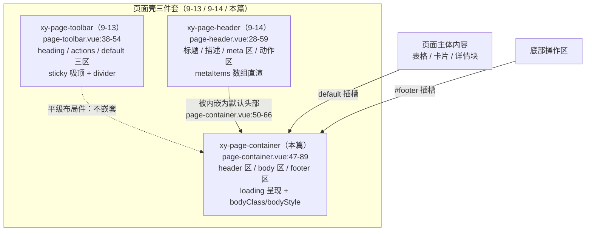
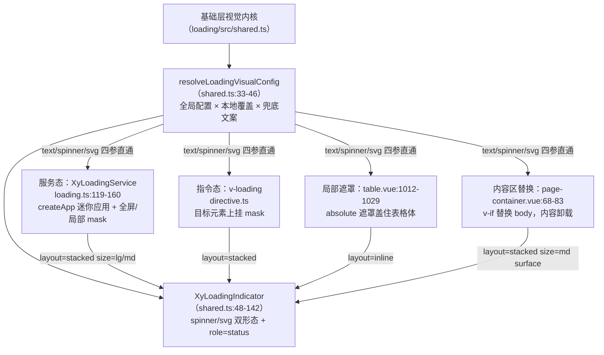

# 9-15 · PageContainer：页面容器

> 本篇是 9 卷"增强层（pro-components）"的第十五篇，按大纲（`column/02-分卷大纲.md:169`）回答的核心问题只有一句话——**loading 视觉的内聚**。前置篇是 9-13《PageToolbar：工具条》与 9-14《PageHeader：页头》：工具条立完了"纯布局件"的纪律，页头拆完了 meta 区与动作区的结构，本篇把页面壳三件套的最后一口气补上——`xy-page-container`，页面壳本壳。知识点矩阵给本篇的条目（`column/01-知识点全集矩阵.md:190`）写得更直白："loading 视觉内聚（组件级内嵌 XyLoadingIndicator + 内容区替换语义）"——前半句是手段，后半句是定论，本篇的全部戏份都围着这两句转。

接到题目先复述目标：`packages/pro-components/page-container` 要回答的不是"页面怎么布局"，而是"页面在**等数据的时候长什么样**"。页面级 loading 的呈现位置与呈现方式——整页遮罩、内容区局部遮罩、还是骨架或整块替换——是页面壳组件最核心的设计决策，没有之一。这个组件的全部自有源码是本系列里的轻量级：`src/page-container.vue`（89 行）、`src/page-container.ts`（10 行）、`index.ts`（8 行）、`__tests__/page-container.spec.ts`（51 行）、样式 `packages/theme/src/pro/page-container.css`（38 行），合计 196 行；但它真正的主角不在自己家里，而在基础层——`packages/components/loading/src/shared.ts`（142 行）里的 `XyLoadingIndicator` 与 `resolveLoadingVisualConfig`。一个页面壳组件，把"loading 长什么样"这道题的答案整个外包给基础层 loading 的视觉内核，自己只做一个决定：**呈现在哪里、以什么方式**。本篇全部路径与行号逐一核对过当前工作区实态，文末附核对清单；动手前先交代一处考据校准：任务书里提到"内容区滚动"，实码里 page-container 没有实现任何滚动容器——`page-container.css` 全文没有一条 `overflow` 或滚动相关声明，页面滚动交给文档流或业务自己包 `xy-scrollbar`，这个叙述在源码层面不成立，后文按实码展开。

## 一、三件套收口：页面壳的最后一块拼图

先给谱系全景。9 卷从 9-13 起连排三个"页面件"，它们不是三个平行组件，而是同一道题——"中后台页面壳怎么拆"——的三次切分：



三者的关系一句话：**toolbar 与 header 是平级的布局件，container 是它们的载体**。page-container 的模板里显式内嵌了 `XyPageHeader`（`page-container.vue:6` 导入，50-66 行渲染），却没有引用 page-toolbar——工具条留给业务按需放进 body 或 header 插槽，页面壳不替主人决定"筛选条长在哪"。这张图还有一处容易看漏的细节：page-container 传给内嵌页头的 `:bordered="false"` 是硬编码（56 行），页头自身的边框被钉死关闭，容器层自己的 `bordered`（默认 `true`，18 行）接管了这个词——**同一个 prop 名在父子两层被刻意截获重定向**，这是第二节的权衡三。

体量先摆清。page-container 自有源码 196 行，其中模板 42 行、逻辑 44 行、类型 10 行、测试 51 行、样式 38 行；它的依赖账单却横跨两层：基础层的 loading 视觉内核（`shared.ts`）、基础层的全局配置链（`useConfig`，4-08 的 provide/inject 链路）、增强层的页头（`page-header`）。全仓搜索确认：**没有任何增强组件消费 page-container**——list-page、crud-page、detail-page 都不经过它（9-21/9-22 的薄预设走的是 pro-table 直连路线），它的客户是业务页面与文档示例（`apps/docs/examples/avatar/page-collaboration.vue:2`、`apps/docs/examples/charts/page-container-analytics.vue:75`、`apps/docs/examples/pro/login-form/workbench.vue:12`）。这与 9-12 拆 filter-panel 时的发现同款：页面件不进组件家族的组合链，它们的组合对象是"页面"这个更大的东西。

## 二、89 行全貌：类型继承与一份"截获"清单

先读类型文件全文，`packages/pro-components/page-container/src/page-container.ts:1-10`：

```ts
import type { CSSProperties } from "vue";
import type { PageHeaderProps } from "../../page-header";

export interface PageContainerProps extends PageHeaderProps {
  loading?: boolean;
  bordered?: boolean;
  shadow?: boolean;
  bodyClass?: string;
  bodyStyle?: CSSProperties;
}
```

十行五个成员，第一行就藏着本组件最重要的类型决策：`extends PageHeaderProps`。页头的五个 props——`title`/`description`/`metaItems`/`divider`/`bordered`（`page-header.ts:12-18`）——被整体继承，因为 page-container 内嵌了 PageHeader 当默认头部，页头的词汇表原样上浮为页面壳的词汇表。类型测试夹具把这笔继承写成了证明题，`tests/types/fixtures/xiaoye-pro-components.ts:253-261`：

```ts
const pageContainerProps: PageContainerProps = {
  ...pageHeaderProps,
  loading: false,
  shadow: true,
  bodyClass: "page-container-body",
  bodyStyle: {
    padding: "24px"
  }
};
```

`...pageHeaderProps` 的展开赋值能在 `pnpm typecheck:types` 里通过，就是"PageContainerProps 是 PageHeaderProps 的超集"的编译期证词。五个自有成员按职责分三组：`loading` 是状态组（本篇第三节的主角）；`bordered`/`shadow` 是壳视觉组；`bodyClass`/`bodyStyle` 是 body 区的逃生门组。注意 `bordered` 在这里被**重新声明**（第 6 行）——父接口里已有这个名字（`page-header.ts:17`），子接口再写一遍同类型成员不是冗余，是把"默认值要变"这件事顶到类型层：页头的 `bordered` 默认 `false`（`page-header.vue:16`），容器要的默认是 `true`（有边框的卡片壳），实现层的 `withDefaults` 因此能逐字写出 `bordered: true`。

再看实现文件全文，89 行一次读完整，`packages/pro-components/page-container/src/page-container.vue:1-89`：

```vue
<script setup lang="ts">
import { computed, useSlots } from "vue";
import { useConfig, useNamespace } from "xiaoye-primitives";
import { XyLoadingIndicator, resolveLoadingVisualConfig } from "../../../components/loading/src/shared";
import type { LoadingGlobalConfig } from "../../../components/loading/src/types";
import { XyPageHeader } from "../../page-header";
import type { PageContainerProps } from "./page-container";

defineOptions({
  name: "XyPageContainer"
});

const props = withDefaults(defineProps<PageContainerProps>(), {
  title: "",
  description: "",
  metaItems: () => [],
  divider: false,
  bordered: true,
  loading: false,
  shadow: false,
  bodyClass: "",
  bodyStyle: undefined
});

const ns = useNamespace("page-container");
const slots = useSlots();
const { loading: globalLoading } = useConfig<unknown, LoadingGlobalConfig>();
const rootClasses = computed(() => [
  ns.base.value,
  props.bordered ? "is-bordered" : "",
  props.shadow ? "is-shadow" : ""
]);
const showDefaultHeader = computed(
  () =>
    !slots.header &&
    (Boolean(props.title) ||
      Boolean(props.description) ||
      props.metaItems.length > 0 ||
      Boolean(slots.extra) ||
      Boolean(slots.actions))
);
const loadingVisual = computed(() =>
  resolveLoadingVisualConfig(globalLoading.value, "加载中...", false)
);
</script>

<template>
  <section :class="rootClasses">
    <slot v-if="$slots.header" name="header" />
    <xy-page-header
      v-else-if="showDefaultHeader"
      :title="props.title"
      :description="props.description"
      :meta-items="props.metaItems"
      :divider="props.divider"
      :bordered="false"
    >
      <template v-if="$slots.extra || $slots.actions" #actions>
        <slot name="actions">
          <slot name="extra" />
        </slot>
      </template>
      <template v-if="$slots.meta" #meta>
        <slot name="meta" />
      </template>
    </xy-page-header>

    <div :class="['xy-page-container__body', props.bodyClass]">
      <div v-if="props.loading" class="xy-page-container__loading">
        <xy-loading-indicator
          :text="loadingVisual.text"
          :spinner="loadingVisual.spinner"
          :svg="loadingVisual.svg"
          :svg-view-box="loadingVisual.svgViewBox"
          layout="stacked"
          size="md"
          surface
        />
      </div>
      <div v-else class="xy-page-container__body-inner" :style="props.bodyStyle">
        <slot />
      </div>
    </div>

    <footer v-if="$slots.footer" class="xy-page-container__footer">
      <slot name="footer" />
    </footer>
  </section>
</template>
```

逻辑层有三个值得逐行停下的点。**第一是第 27 行的全局配置接入**：`useConfig<unknown, LoadingGlobalConfig>()`——第一个类型参数（dialog 配置）留 `unknown` 不用，第二个参数精确指到基础层 loading 的 `LoadingGlobalConfig`（`packages/components/loading/src/types.ts:8-18`：text/background/spinner/svg/svgViewBox/delay/minDuration 等）。`useConfig` 的实现（`packages/xiaoye-primitives/src/composables/use-config.ts:28-55`）在没有 ConfigProvider 祖先时兜底返回空对象：

```ts
export function useConfig<
  DialogConfig = unknown,
  LoadingConfig = unknown,
  MessageConfig = unknown,
  NotificationConfig = unknown
>(): ConfigContext<DialogConfig, LoadingConfig, MessageConfig, NotificationConfig> {
  const injectedConfig = inject(configProviderKey, null);

  if (injectedConfig) {
    return injectedConfig as ConfigContext<
      DialogConfig,
      LoadingConfig,
      MessageConfig,
      NotificationConfig
    >;
  }

  return {
    namespace: computed(() => DEFAULT_NAMESPACE),
    size: computed(() => DEFAULT_SIZE),
    zIndex: computed(() => DEFAULT_Z_INDEX),
    locale: computed(() => ({} as Locale)),
    dialog: computed(() => ({}) as DialogConfig),
    loading: computed(() => ({}) as LoadingConfig),
    message: computed(() => ({}) as MessageConfig),
    notification: computed(() => ({}) as NotificationConfig)
  };
}
```

`loading: computed(() => ({}) as LoadingConfig)` 这行兜底意味着：没有 provider 时全局配置是空对象，`resolveLoadingVisualConfig` 里每一项 `??` 都落空，视觉参数全走组件内默认——**不设 provider 也能渲染，设了 provider 全局默认直通**，4-08 的配置链纪律在这里被原样继承。

**第二是 33-41 行的 `showDefaultHeader` 存在性推导**：默认头部只在"header 插槽不存在，且 title/description/metaItems/extra/actions 五路信号至少有一路有货"时渲染。两组判定各有含义：`!slots.header` 是让位优先级——header 插槽一存在，默认头部连同它的一切 props 判定全部失效，插槽完全接管（与 9-12 拆过的 Card 整槽让位同一纪律）；五路信号取或，是防空壳——标题、说明、meta、动作区全空时连空的页头骨架都不渲染，页面壳不输出视觉噪音。信号里混着 props（`title`/`description`/`metaItems.length`）与插槽（`slots.extra`/`slots.actions`）两类来源，说明这里的"头部"不只是一个结构位，是**数据与动作的集合哨**。

**第三是 58-62 行的双插槽合流**：

```vue
<template v-if="$slots.extra || $slots.actions" #actions>
  <slot name="actions">
    <slot name="extra" />
  </slot>
</template>
```

两个对外插槽名，一个对内出口。渲染优先级是 `actions` > `extra`：actions 槽有内容就用它，否则把 extra 槽的内容作为兜底塞进页头的 actions 区——文档的插槽表把这层语义写成了显式条款："extra：默认头部右侧扩展区，未提供 actions 时作为兜底动作区"（`apps/docs/pro-components/page-container.md:45`）。这是插槽设计的"漏斗"姿势：对消费方给两个语义入口（actions 是动作，extra 是扩展），对被组合的 PageHeader 只暴露一个通道（它只认识 actions），合流逻辑由中间层一次写清。顺带注意 63-65 行的 `#meta` 直通——meta 区不做合流，`metaItems` 数组与 `meta` 插槽是 9-14 讲过的"双通道"原样保留。

## 三、核心：loading 视觉的内聚

现在进入本篇的主舞台。68-83 行的 body 区是整个组件唯一的状态分支，把它单独拎出来看：

```vue
<div :class="['xy-page-container__body', props.bodyClass]">
  <div v-if="props.loading" class="xy-page-container__loading">
    <xy-loading-indicator
      :text="loadingVisual.text"
      :spinner="loadingVisual.spinner"
      :svg="loadingVisual.svg"
      :svg-view-box="loadingVisual.svgViewBox"
      layout="stacked"
      size="md"
      surface
    />
  </div>
  <div v-else class="xy-page-container__body-inner" :style="props.bodyStyle">
    <slot />
  </div>
</div>
```

这十四行里藏着三个决定。**决定一：内嵌 `XyLoadingIndicator`，不是自绘 spinner，也不是 skeleton**。指示器是基础层 loading 的视觉内核（`packages/components/loading/src/shared.ts:48-142` 的渲染函数，spinner 字体图标与 SVG 圆环双形态、text 文本节点、stacked/inline 双布局、`is-surface` 卡面），它的渲染核心在这段：

```ts
      return () => {
        const textNodes = props.text ? (Array.isArray(props.text) ? props.text : [props.text]) : [];
        const spinnerNode = props.spinner
          ? h("i", {
              class: [
                `${ns.base.value}__indicator-icon`,
                `${ns.base.value}-spinner__icon`,
                props.spinner
              ],
              "aria-hidden": "true"
            })
          : h(
              "svg",
              {
                class: `${ns.base.value}__circular`,
                viewBox: props.svgViewBox || DEFAULT_LOADING_SVG_VIEW_BOX,
                "aria-hidden": "true",
                ...(props.svg ? { innerHTML: props.svg } : {})
              },
              props.svg
                ? undefined
                : [
                    h("circle", {
                      class: `${ns.base.value}__path`,
                      cx: "25",
                      cy: "25",
                      r: "20",
                      fill: "none"
                    })
                  ]
          );

        return h(
          "div",
          {
            class: [
              `${ns.base.value}__indicator`,
              `${ns.base.value}__indicator--${props.layout}`,
              `${ns.base.value}__indicator--${props.size}`,
              props.surface ? "is-surface" : ""
            ],
            role: "status",
            "aria-live": "polite"
          },
          [
            spinnerNode,
            textNodes.length
              ? h(
                  "p",
                  {
                    class: [`${ns.base.value}__text`, `${ns.base.value}-text`]
                  },
                  textNodes
                )
              : null
          ]
        );
      };
```

`role="status"` 加 `aria-live="polite"`（124-125 行）让加载文案成为可达性语义下的活区域——页面壳把无障碍细节也一并外包了。**决定二：`layout="stacked"`、`size="md"`、`surface` 三连**——竖排、中号、带卡面。对照基础层其他消费点的选型就知道这不是随手写：表格内嵌 loading 用的是 `layout="inline"`（`table.vue:1024`），对话框 body 内嵌也是 `inline`（`dialog-content.vue:156`），服务态全屏遮罩用 `stacked` 且全屏时升到 `lg`（`loading.ts:146-147`）。页面壳选 stacked + surface 的理由是**舞台尺寸**：页面 body 是整个视口级别的大区域，竖排的"图标在上、文案在下"构图撑得起这种留白，`is-surface` 的卡面（`loading.css:64-73`：112px 最小宽、16/20 内边距、浮层底色加一圈细边框）在 muted 色的静默底上给出足够的对比锚点——同样的视觉放进表格行间距里就成了噪音，这就是"同一视觉内核、按舞台选构图"的分寸。

**决定三：呈现方式是内容区替换，不是遮罩**。`v-if="props.loading"` / `v-else` 的结构意味着 loading 态下 default 插槽内容**整体卸载**，loading 块顶替 body；loading 结束内容重新挂载。这是本篇核心问题的答案句，值得先看测试把它钉得多死，`packages/pro-components/page-container/__tests__/page-container.spec.ts:5-51`：

```ts
describe("XyPageContainer", () => {
  it("默认头部会根据标题信息自动渲染", () => {
    const wrapper = mount(XyPageContainer, {
      props: {
        title: "成员中心",
        description: "统一承接详情页主体内容"
      },
      slots: {
        default: '<div class="page-body">正文区域</div>'
      }
    });

    expect(wrapper.find(".xy-page-header").exists()).toBe(true);
    expect(wrapper.find(".page-body").exists()).toBe(true);
  });

  it("header 插槽会覆盖默认头部，footer 插槽正常渲染", () => {
    const wrapper = mount(XyPageContainer, {
      props: {
        title: "不会显示"
      },
      slots: {
        header: '<div class="custom-header">自定义头部</div>',
        default: '<div class="body">正文</div>',
        footer: '<div class="footer">底部操作</div>'
      }
    });

    expect(wrapper.find(".custom-header").exists()).toBe(true);
    expect(wrapper.find(".xy-page-header").exists()).toBe(false);
    expect(wrapper.find(".footer").exists()).toBe(true);
  });

  it("loading 状态会切换到加载内容", () => {
    const wrapper = mount(XyPageContainer, {
      props: {
        loading: true
      },
      slots: {
        default: '<div class="body">正文</div>'
      }
    });

    expect(wrapper.find(".xy-page-container__loading").exists()).toBe(true);
    expect(wrapper.find(".body").exists()).toBe(false);
  });
});
```

第三个用例的 48-49 两行断言是对替换语义的判决书：loading 块**存在**的同时，default 插槽的内容（`.body`）**不存在**——不是被盖住（遮罩语义下断言会是"存在但 opacity/层级变化"），是不在 DOM 里。51 行的测试只写了三个用例，每个用例钉一个结构契约：默认头的自动渲染条件、插槽让位、替换语义。没有视觉断言、没有全局配置断言——`resolveLoadingVisualConfig` 的合并逻辑由基础层 loading 自己的测试负责，页面壳的测试只钉"结构决定"，测试面与语义面严格对齐。

### 权衡一：替换 vs 遮罩——两种 loading 呈现的适用域

替换语义不是唯一选项，本仓库里 loading 的呈现策略实际有四条路线，画成全景图：



四条路线共享同一颗视觉内核与同一套解析函数，分叉只发生在"遮罩还是替换"这最后一毫米。局部遮罩的代表是表格，`packages/components/table/src/table.vue:1012-1029`：

```vue
        <div
          v-if="props.loading"
          class="xy-table__loading"
          :class="{ 'is-overview': props.overview }"
          :style="resolvedLoading.background ? { background: resolvedLoading.background } : undefined"
        >
          <slot name="loading">
            <XyLoadingIndicator
              :text="resolvedLoading.text"
              :spinner="resolvedLoading.spinner"
              :svg="resolvedLoading.svg"
              :svg-view-box="resolvedLoading.svgViewBox"
              layout="inline"
              size="md"
              surface
            />
          </slot>
        </div>
```

它的遮罩感来自 CSS，`packages/theme/src/components/table.css:690-706`：

```css
.xy-table__loading {
  position: absolute;
  inset: 0;
  display: grid;
  place-items: center;
  background: color-mix(in srgb, var(--xy-table-surface-background-resolved) 92%, transparent);
  z-index: 10;
}

.xy-table__loading .xy-loading__indicator.is-surface {
  border-radius: var(--xy-radius-pill);
  box-shadow: 0 1px 4px color-mix(in srgb, var(--xy-text-heading) 4%, transparent);
}

.xy-table.is-overview .xy-table__loading .xy-loading__indicator.is-surface {
  transform: scale(0.94);
}
```

`position: absolute; inset: 0`——表格的 loading 层浮在表体之上，旧数据还挂在下层 DOM 里，只是被 92% 不透明的表面色盖住。**表格选遮罩，page-container 选替换，差异的根子是 loading 发生时"有没有旧内容可保"**：表格 loading 绝大多数发生在翻页、筛选、刷新——旧数据还在屏幕上，遮罩保住它，视觉上下文不抖动，新数据到了揭盖即换；page-container 的 loading 语义是页面**首载**——default 插槽里的内容要么还没数据、要么根本还没条件渲染，没有"旧内容"值得保，替换反而更诚实：不渲染未就绪的内容，不给半成品内容任何闪烁机会，也省掉了"遮罩浮在滚动内容上"的层叠上下文管理。替换的代价同样真实：内容区的组件状态（滚动位置、输入焦点、子组件内部状态）随卸载清零——但这个代价在"页面壳"的语义域里天然不成立，页面壳的 body 本来就该在数据就绪后才挂载业务内容。两条路线在同一批源码里并存，不是不一致，是**按 loading 的发生时机选呈现方式**：重取保遮罩，首载用替换。

### 权衡二：无 loadingText prop——极简 API 与可定制的边界

看第 42-44 行的解析调用：

```ts
const loadingVisual = computed(() =>
  resolveLoadingVisualConfig(globalLoading.value, "加载中...", false)
);
```

第三个参数 `textProvided=false` 硬编码——page-container **没有** `loading-text` prop，文案永远是"全局配置给了用全局的，否则兜底'加载中...'"。解析函数的全文在 `packages/components/loading/src/shared.ts:20-46`：

```ts
export function resolveLoadingTextValue(
  localProvided: boolean,
  localText: string | undefined,
  globalText: string | undefined,
  fallbackText: string
) {
  if (localProvided) {
    return localText ?? "";
  }

  return globalText ?? fallbackText;
}

export function resolveLoadingVisualConfig(
  globalConfig: LoadingGlobalConfig | undefined,
  fallbackText: string,
  textProvided = false,
  localText?: string
) {
  return {
    text: resolveLoadingTextValue(textProvided, localText, globalConfig?.text, fallbackText),
    background: globalConfig?.background ?? "",
    spinner: globalConfig?.spinner ?? "",
    svg: globalConfig?.svg ?? "",
    svgViewBox: globalConfig?.svgViewBox ?? DEFAULT_LOADING_SVG_VIEW_BOX
  };
}
```

对照基础层同函数的另两个调用点，取舍差异立刻显形：table 与 select 都有 `loadingText` prop，还要靠扫描 vnode props 判定调用方是否显式传过——`table.vue:178-190`：

```ts
const hasLoadingTextProp = computed(() => {
  const vnodeProps = componentInstance?.vnode.props ?? {};

  return "loadingText" in vnodeProps || "loading-text" in vnodeProps;
});
const resolvedLoading = computed(() =>
  resolveLoadingVisualConfig(
    globalLoading.value,
    "Loading...",
    hasLoadingTextProp.value,
    props.loadingText
  )
);
```

`"loadingText" in vnodeProps` 这步探测是因为语义分歧：控件态下"没传 prop"和"传了空串"含义不同（前者让位给全局默认，后者是显式的"不要文案"），而 `withDefaults` 会把默认值写进 props 对象，无法从 props 本身区分显式与默认，只能翻 vnode 原始属性。page-container 没有这层麻烦——**它不开本地文案口，探测逻辑整个不需要**。这组对照是 API 面设计的真实刻度：控件（table/select）嵌在千变万化的业务上下文里，每个实例都可能需要独立文案，所以值得付出"prop + vnode 探测"的双份复杂度；页面壳是页面级单例，全局默认文案（ConfigProvider 的 `loading.text`）就是它的定制通道——项目要统一 loading 文案，改一处 provider 全站生效，逐页传 prop 反而是反模式。7-08 的边界考证在这里兑现了一个正例：全局 loading 默认项对指令态失效（指令端恒写全键短路了全局兜底），对服务态与**组件态**正常——page-container 是组件态消费，`ConfigProvider` 配的 `loading.text` 会真实出现在页面 loading 块里（`column/7-08-Loading-指令与服务双注册.md:678` 实测记录的同款链路）。顺带记录一个真实的不对称：四个消费点的兜底文案各不相同——page-container 是"加载中..."（43 行）、select 是"加载中"（`select.vue:107`）、table 是英文"Loading..."（`table.vue:186`）、async-state-container 是"正在加载数据"（props 默认值）——同一颗内核，四种兜底措辞，这是读码才知道的暗面，也是未来收口的候选点。

还有一个不出场成员要交代：`resolveLoadingVisualConfig` 返回的 `background` 字段，page-container **没有**消费——模板只传了 text/spinner/svg/svgViewBox 四项。理由回到替换语义：背景色是遮罩策略的参数（盖在旧内容上的那层颜色），替换语义下 loading 块自带静默底（下一节的 CSS），没有"盖住谁"的问题，自然不接这个参数。参数面按呈现策略裁剪，又一次印证"策略决定接口"。

### 权衡三：bordered 的截获——继承 prop 的重定向

第二节已点到，这里给足判词。`PageContainerProps extends PageHeaderProps` 继承了 `bordered`，但模板传给内嵌页头的却是硬编码 `:bordered="false"`（56 行）——**继承来的 prop 被容器截获，语义从"页头有无边框"改写为"页面壳有无边框"**。这不是类型层的巧合，是有意的占用：页面壳场景下，"页头自己带边框卡片、容器再带一层边框卡片"是双重描边的视觉事故，容器必须独占这个词；而页头作为独立组件时它的 `bordered` 语义仍然成立（直接用 `xy-page-header` 的场景）。同名 prop、双层语义、由中间层裁决——这是继承式 props 组合的固有张力，page-container 的解法是"截获 + 钉死被组合方的取值"，代价是文档 API 表上 `bordered` 一行（`page-container.md:33`）只描述容器语义，读者需要知道它同时"顶替"了页头的同名能力。对照第 55 行的 `:divider="props.divider"` 原样透传：五个继承 props 里四个直通、一个截获，差异只在一件事——divider 的语义在两层之间没有冲突（分隔线就是页头的分隔线），bordered 有。

### 高度阶梯：38 行 CSS 里的状态几何

样式文件全文 38 行，`packages/theme/src/pro/page-container.css:1-38`：

```css
.xy-page-container {
  display: flex;
  flex-direction: column;
  gap: var(--xy-space-4);
  padding: var(--xy-space-4);
  border-radius: var(--xy-radius-lg);
}

.xy-page-container.is-bordered {
  border: 1px solid var(--xy-border);
  background: var(--xy-bg-container);
}

.xy-page-container.is-shadow {
  box-shadow: var(--xy-shadow-1);
}

.xy-page-container__body {
  min-height: 120px;
}

.xy-page-container__body-inner {
  min-height: inherit;
}

.xy-page-container__loading {
  display: flex;
  align-items: center;
  justify-content: center;
  min-height: 180px;
  border-radius: var(--xy-radius-md);
  background: color-mix(in srgb, var(--xy-bg-muted) 64%, var(--xy-mix-light));
}

.xy-page-container__footer {
  padding-top: var(--xy-space-4);
  border-top: 1px solid var(--xy-border);
}
```

与 filter-panel 的 40 行"全外包"不同（9-12 的结论：40 行里没有一条边框背景），page-container 的壳视觉是**自绘**的——它不借 Card，根节点是自己的 `section`，`is-bordered`/`is-shadow` 两个修饰类自己吃令牌（`--xy-border`/`--xy-bg-container`/`--xy-shadow-1`）。理由与 9-12 的镜像：FilterPanel 是"内容自带形态"场景里的形态容器，视觉就该是 Card 的视觉；page-container 是页面最外层的壳，它的"卡片感"是页面级的独立决策，不该被 Card 的 props 面绑架。最值得停的是高度几何的三行：`__body` 保底 120px（19 行），`__body-inner` 用 `min-height: inherit` 把这个保底**继承**下去（23 行），`__loading` 自己另立 180px（30 行）。inherit 而不是写死同一个值，意味着业务通过 bodyClass 或外层覆盖改 `__body` 的保底高度时，内容态的 inner 自动跟随——保底高度只有一个源头；而 loading 态的 180px 比 120px 高出 60px，是给 stacked 布局（图标 20px + 12px 间距 + 文案 + is-surface 的 32px 垂直内边距）留的舞台。三行 CSS 实现了一个小的状态几何：**内容态与加载态共用一个可调的保底源头，加载态在此基础上多要一档**。静默底色 `color-mix(in srgb, var(--xy-bg-muted) 64%, var(--xy-mix-light))`（32 行）是 muted 底掺 36% 亮色的配方，亮暗双主题下都是"比容器底深一档但不刺眼"的待机面——与 header 的 meta 区底色（`page-header.css:61`）是同一配方家族，页面件之间视觉血缘可见。

## 四、与 9-20 的分工：单态高规格 vs 三态低规格

按任务书的要求审"page-container 是否消费 async-state-container"——**实码定论：不消费**。全仓搜索 `page-container` 源码中没有任何对 async-state-container 的引用；反过来 async-state-container 的消费方也只有 request-form 与 detail-page 两个（`packages/pro-components/request-form/src/request-form.vue`、`packages/pro-components/detail-page/src/detail-page.vue`），page-container 不在其列。两者的关系不是组合，是**分工**。把三态容器的模板摆出来对照，`packages/pro-components/async-state-container/src/async-state-container.vue:23-44`：

```vue
<template>
  <div class="xy-async-state-container">
    <slot v-if="props.loading" name="loading">
      <div class="xy-async-state-container__state is-loading">
        <strong>{{ props.loadingText }}</strong>
      </div>
    </slot>
    <slot v-else-if="props.error" name="error" :error="props.error">
      <div class="xy-async-state-container__state is-error">
        <strong>加载失败</strong>
        <xy-text type="danger">{{ props.error }}</xy-text>
        <xy-button type="primary" plain @click="emit('retry')">重新加载</xy-button>
      </div>
    </slot>
    <slot v-else-if="props.empty" name="empty">
      <div class="xy-async-state-container__state is-empty">
        <xy-empty :title="props.emptyTitle" :description="props.emptyDescription" />
      </div>
    </slot>
    <slot v-else />
  </div>
</template>
```

并排一读，分工表自己浮出来：

| 维度 | page-container（本篇） | async-state-container（9-20） |
| --- | --- | --- |
| 状态面 | 只有 loading，单态布尔 | loading / error / empty 三态裁决链 |
| loading 视觉 | XyLoadingIndicator（stacked + surface + aria 全套） | 一个 `<strong>` 纯文字（27 行） |
| error / retry | 无 | error 载荷插槽 + retry 事件 |
| 呈现方式 | 替换 body（v-if/v-else） | 替换内容（v-if 裁决链） |
| 站位 | 页面壳：header/footer/body 的结构 + 页面级 loading | 内容区三态协议：给任何内容块补状态语义 |
| 消费方 | 业务页面 / 文档示例 | request-form、detail-page |

同一个"加载中"问题，两个组件给了两个极端答案：page-container **只管一态，但视觉给到最高规格**——共享指示器、全局配置直通、可达性语义、高度几何全套上；async-state-container **管三态，但 loading 视觉降到最低规格**——一行加粗文字，连 spinner 都没有。这不是能力差异，是站位差异：页面壳的 loading 是"用户等待的第一印象"，值得最高规格的仪式感；三态容器的定位是协议层（9 卷大纲给 9-20 的核心问题就是"loading/empty/error 的统一协议"），它把视觉决策留给自己的三个插槽与上层组合——request-form/detail-page 消费它时，要么接受纯文字，要么用 `#loading` 插槽自己塞更重的视觉。两者的替换语义倒是同构的（都是 v-if 换内容），因为"数据没到就不渲染内容"这条判决在两个层级同样成立。给业务的组合建议也随之清晰：**页面首载用 page-container 的 loading prop，页面内的局部数据块（表格区、详情区）用 async-state-container 或表格自己的 loading**——一级仪式感、二级协议化，不混用也不嵌套。

## 五、EP 对照：布局件与 loading 的两种命运

把这颗核心问题放到 Element Plus 的坐标系里，差异一目了然。EP 没有页面容器这个层级——它的布局件是 `el-container` / `el-header` / `el-aside` / `el-main` / `el-footer` 五件套，纯布局零语义：不内嵌页头结构（没有 title/description/metaItems 的概念）、没有 footer 操作区约定、**更没有任何 loading 呈现**。EP 用户的页面加载体验是纯手工拼装：在 `el-main` 上挂 `v-loading` 指令（或 `ElLoading.service()`），文案靠逐处写 `element-loading-text` 属性，背景与 spinner 图标靠 `element-loading-background`/`element-loading-spinner`/`element-loading-svg` 逐处覆盖；EP 的 `ElConfigProvider` 没有 loading 命名空间，"全局默认 loading 文案"这个概念在 EP 里无处安放。于是每个页面、每个调用点都自带一份 loading 配置——想全站统一文案，靠的是工程约定（封装一层自己的 PageLoading 组件），不是组件库契约。本库的 page-container 把这件事收口成了两层契约：**组件层**一个 `loading` 布尔 prop 决定"何时呈现"，**全局层** ConfigProvider 的 `loading` 配置决定"呈现成什么样"——页面代码里不出现任何 loading 视觉参数，文案、spinner、SVG 的定制走 4-08 的全局配置链一次生效（且如第三节所证，page-container 走的组件态正是 7-08 考证里全局默认真正生效的通道）。另一个隐性差异是骨架方案：EP 生态里页面级"精致 loading"的流行替代是 `el-skeleton` 骨架屏，但骨架是另一个独立组件，与布局件、与 loading 指令互不联动；本库的 page-container 选择不做骨架内聚（骨架留在基础层 7-09 与 9-19 StatCard 的场景里），把页面 loading 锚定在共享指示器上——**一个视觉内核吃遍四个层级**（服务/指令/控件/页面）的一致性红利，恰好是 EP 分散式方案的对照组。代价也要如实记：EP 的 `v-loading` 可以打在任意元素上（粒度自由），page-container 的 loading 只作用于自己的 body 区——要更细粒度的局部 loading，得回到基础层指令与服务（7-08 的两个形态），页面壳不越界代言。

## 六、测试、示例与导出边界

组件的导出边界按增强层惯例走一遍。组件清单登记在 `packages/pro-components/component-manifest.json:90-97`（`"docsGroup": "page"`、`installExports: ["XyPageContainer"]`、`installChecks` 校验 `xy-page-container` 标签、`styleImports: ["page-container"]`）；值导出在 `packages/pro-components/exports.ts:12` 的显式一行（白名单纪律，无 `export *`）；类型导出在 `packages/pro-components/index.ts:53`——`PageContainerProps` 作为组件主 Props 类型进入根入口白名单（9-01 立的"每个公开组件导出主 Props/Instance"规则的标准执行）。样式的聚合入口 `packages/pro-components/style.css:13` 一行 `@import` 接入。

文档示例两个，正好对应组件的两张面孔。基础示例 `apps/docs/examples/pro/page-container/basic.vue` 全文 41 行：

```vue
<script setup lang="ts">
const metaItems = [
  {
    label: "负责人",
    value: "小叶",
    icon: "mdi:account-circle"
  },
  {
    label: "成员数",
    value: 128,
    icon: "mdi:account-multiple-outline"
  }
];
</script>

<template>
  <xy-page-container
    title="成员中心"
    description="默认头部会自动承接标题、说明、metaItems 和 actions。"
    :meta-items="metaItems"
    bordered
    shadow
  >
    <template #actions>
      <xy-button plain>批量导出</xy-button>
      <xy-button type="primary">新增成员</xy-button>
    </template>

    <xy-card header="本周重点">
      <p>这里承接页面主体内容，例如表格、说明卡片或详情区块。</p>
      <p>当头部信息足够时，不需要额外手写 `PageHeader`。</p>
    </xy-card>

    <template #footer>
      <xy-space>
        <xy-button>返回列表</xy-button>
        <xy-button type="primary">保存草稿</xy-button>
      </xy-space>
    </template>
  </xy-page-container>
</template>
```

`#actions` 进页头动作区、body 放 `xy-card`、`#footer` 放底部操作——三件套的"container 内嵌 header"路线一次演示完；示例文案最后一句"当头部信息足够时，不需要额外手写 PageHeader"就是 `showDefaultHeader` 存在性推导的产品化表达。加载态示例 `apps/docs/examples/pro/page-container/custom.vue`（32 行）走另一张面孔：`#header` 插槽塞一张 `xy-card` 完全接管头部，`:loading="loading"` 切换 body——**header 被插槽接管时 loading 呈现完全不受影响**，因为 loading 分支在 body 区而不在 header 区，两块决策正交。这个正交性是模板结构的隐性承诺：头部三态（插槽/默认/无）与 body 两态（loading/内容）各自独立，2×3 的组合全成立。

一个实现细节值得作为读码笔记留下：`bodyClass` 与 `bodyStyle` 的落点不对称——class 加在外层 `__body`（68 行），style 加在内层 `__body-inner`（80 行）。class 落外层意味着自定义类名在 loading 态与内容态**都在**（业务可以拿它做高度控制、做测试锚点）；style 落内层意味着内联样式只在内容态生效（loading 态下内层不存在，样式无处安放）。外层管"两种状态共用的地面"，内层管"内容专属的装修"——顺带解释了为什么 `__body-inner` 要存在：它既是 bodyStyle 的挂点，也是 `min-height: inherit` 的承接者，把"body 的保底"与"内容的样式"分层隔离。

## 七、收束：loading 内聚的三句话与 9-16 的岔路

把本篇收成三句话。**内聚**：页面级 loading 的视觉决策被收敛为"一个 prop + 一颗共享内核 + 一条全局配置链"——page-container 不自绘 spinner、不开本地文案口、不接背景参数，`resolveLoadingVisualConfig` 与 `XyLoadingIndicator` 吃下全部视觉复杂度，组件自己只决定"呈现在哪"：替换而非遮罩，stacked 而非 inline，180px 静默舞台而非 absolute 浮层。**分工**：三件套在此收口——toolbar 平级不嵌、header 内嵌当默认头、container 承载 body/footer 与 loading；async-state-container 与它是"单态高规格 vs 三态低规格"的镜像分工，页面首载与内容块状态各归其位。**边界**：它没有被任何增强组件消费（客户是业务页面），它截获了继承来的 `bordered`，它的兜底文案与兄弟组件各说各话——这些是读 API 表看不见的暗面，也是"196 行小组件"依然值得逐行读的理由。

下一篇 9-16《AvatarMenu：头像菜单》从页面壳转向导航组合：大纲给它的核心问题是"基础组件的高层组合样本"（`column/02-分卷大纲.md:170`），矩阵条目（`column/01-知识点全集矩阵.md:191`）的预告是"items 直通 legacy 路径 + command 削参反向收敛"——头像 + 下拉菜单的合体件，要回答的问题是：**当增强层组件薄薄包住基础层 menu 时，事件协议是原样透传还是削参收敛？**从 page-container 的"截获"到 avatar-menu 的"削参"，增强层对基础层接口的三种姿态（透传、截获、收敛）将凑齐最后一块。

---

*本篇代码引用核对于当前工作区实态：`packages/pro-components/page-container/src/page-container.vue`（89 行）、`page-container.ts`（10 行）、`index.ts`（8 行）、`__tests__/page-container.spec.ts`（51 行）、`packages/theme/src/pro/page-container.css`（38 行）、`packages/components/loading/src/shared.ts`（142 行；20-31、33-46、48-142 行）、`packages/components/loading/src/types.ts`（8-18 行）、`packages/components/loading/src/loading.ts`（119-160 行）、`packages/theme/src/components/loading.css`（9-22、45-48、64-73 行）、`packages/components/table/src/table.vue`（178-190、1012-1029 行）、`packages/theme/src/components/table.css`（690-706 行）、`packages/components/dialog/src/dialog-content.vue`（144-161 行）、`packages/components/select/src/select.vue`（100-111 行）、`packages/components/auto-complete/src/auto-complete.vue`（87、381 行）、`packages/xiaoye-primitives/src/composables/use-config.ts`（28-55 行）、`packages/pro-components/async-state-container/src/async-state-container.vue`（44 行；23-44）、`async-state-container.ts`（8 行）、`packages/pro-components/page-header/src/page-header.vue`（60 行）、`page-header.ts`（18 行）、`packages/pro-components/page-toolbar/src/page-toolbar.vue`（55 行）、`packages/pro-components/component-manifest.json`（90-97 行）、`packages/pro-components/exports.ts`（12 行）、`packages/pro-components/index.ts`（53 行）、`packages/pro-components/style.css`（13 行）、`tests/types/fixtures/xiaoye-pro-components.ts`（253-261 行）、`apps/docs/pro-components/page-container.md`（45、33 行）、`apps/docs/examples/pro/page-container/basic.vue`（41 行）、`custom.vue`（32 行）、`apps/docs/examples/avatar/page-collaboration.vue`（2 行）、`apps/docs/examples/charts/page-container-analytics.vue`（75 行）、`apps/docs/examples/pro/login-form/workbench.vue`（12 行）、`column/02-分卷大纲.md`（169-170 行）、`column/01-知识点全集矩阵.md`（190-191 行）、`column/7-08-Loading-指令与服务双注册.md`（401、678 行）。EP 侧事实：Element Plus 无页面容器层级，`el-container` 家族为纯布局零语义件；页面 loading 依赖 `v-loading` 指令与 `element-loading-text/spinner/background/svg` 逐点属性，`ElConfigProvider` 无 loading 命名空间；`el-skeleton` 为独立组件不与布局件联动。*
