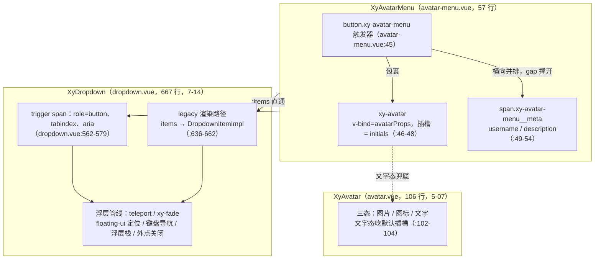
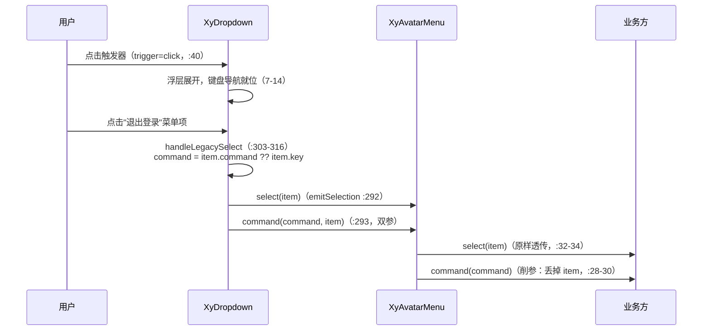
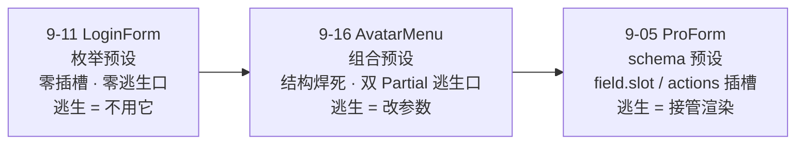

# 9-16 · AvatarMenu：头像菜单

> 本篇是 9 卷"增强层（pro-components）"的第十六篇。大纲给它的核心问题只有一句——**基础组件的高层组合样本**（`column/02-分卷大纲.md:170`，前置篇 7-14《Dropdown：键盘导航》）——但这句里至少藏着三道题：什么叫"高层组合"（组合到什么程度才算组合、而不是复制粘贴）、组合出来的组件还剩多少"自己的逻辑"、以及组合组件的 API 应该向上收敛还是向下透传。知识点矩阵给本篇的关键词更直白：I16 条目写着"头像下拉组合（items 直通 legacy 路径 + command 削参反向收敛）"（`column/01-知识点全集矩阵.md:191`）——"items 直通"与"削参反向收敛"这八个字，就是全篇的路线图。本篇全部给实码定论，行号逐一核对过当前工作区，并为 9-17《HeaderTabs：头部页签》埋好引线。

接到题目先复述一遍目标，防止写偏：`packages/pro-components/avatar-menu` 要回答的问题是——**当基础组件已经把能力做全，增强层还应该做什么**。头像菜单是每个中后台系统的标配：头部右侧一个头像（没有照片就显示名字首字）、旁边挂用户名和角色描述、点开一列菜单——个人中心、账号设置、退出登录。这个结构没有任何一个基础组件能独立提供，但它也不需要任何新能力：头像有 `xy-avatar`（5-07），浮层菜单有 `xy-dropdown`（7-14）。增强层在这里做的事，是把两个（严格说三个）基础组件按"用户入口"这个语义**预装**在一起——不做新逻辑、只做组合与预设，这是"组合优于继承"在组件库里最短的一份实现样本。

先交代体量，给全文一个标尺：`avatar-menu` 组件目录四个文件加起来 113 行——`src/avatar-menu.ts` 13 行（纯类型）、`src/avatar-menu.vue` 57 行（唯一实现，脚本段 35 行 + 模板段 21 行）、`index.ts` 12 行（安装入口）、`__tests__/avatar-menu.spec.ts` 31 行（单用例）；样式住在 `packages/theme/src/pro/avatar-menu.css`（25 行），经 `packages/pro-components/style.css:14` 的 `@import` 汇入。113 行，是增强层目前正面解剖过的最小组件——只有 9-11 LoginForm（506 行）的四分之一不到。`git log --follow` 显示它历经四次提交（`3622d97` admin 能力集成初生、`25de5ae`、`323e9a7`、`dc9ca28` 依赖治理），实现正文至今没有结构性重构。它属于 9-11 立案的增强层"业务预设"族（9-11 login-form、9-16 avatar-menu、9-19 stat-card），是这个族里第一个"组合型预设"——Login 是把一整页焊死，AvatarMenu 是把一个入口焊死。

## 一、57 行实现全文：全组件只有一行"自己的逻辑"

实现只有 57 行，值得全文照录。`packages/pro-components/avatar-menu/src/avatar-menu.vue`：

```vue
<script setup lang="ts">
import { computed } from "vue";
import { useNamespace } from "xiaoye-primitives";
import { XyAvatar, XyDropdown } from "xiaoye-components";
import type { DropdownSelectItem } from "xiaoye-components";
import type { AvatarMenuCommand, AvatarMenuProps } from "./avatar-menu";

defineOptions({
  name: "XyAvatarMenu"
});

const props = withDefaults(defineProps<AvatarMenuProps>(), {
  username: "",
  description: "",
  items: () => [],
  dropdownProps: () => ({}),
  avatarProps: () => ({})
});

const emit = defineEmits<{
  command: [command: AvatarMenuCommand];
  select: [item: DropdownSelectItem];
}>();

const ns = useNamespace("avatar-menu");
const initials = computed(() => props.username.trim().slice(0, 1).toUpperCase());

function handleCommand(command: AvatarMenuCommand) {
  emit("command", command);
}

function handleSelect(item: DropdownSelectItem) {
  emit("select", item);
}
</script>

<template>
  <xy-dropdown
    :items="props.items"
    trigger="click"
    v-bind="props.dropdownProps"
    @command="handleCommand"
    @select="handleSelect"
  >
    <button type="button" :class="ns.base.value">
      <xy-avatar v-bind="props.avatarProps">
        {{ initials }}
      </xy-avatar>
      <span v-if="props.username || props.description" class="xy-avatar-menu__meta">
        <strong v-if="props.username" class="xy-avatar-menu__name">{{ props.username }}</strong>
        <small v-if="props.description" class="xy-avatar-menu__description">
          {{ props.description }}
        </small>
      </span>
    </button>
  </xy-dropdown>
</template>
```

先做一道算术题：这 57 行里，有几行是"AvatarMenu 自己的逻辑"？脚本段的 35 行里，`defineOptions`、`withDefaults`、`defineEmits`、`useNamespace` 是每个标准组件的骨架；`handleCommand` 与 `handleSelect`（`:28-34`）是两个纯转发函数，函数体各一行 `emit(...)`；唯一称得上"逻辑"的，是 `:26` 的 `initials`：

```ts
const initials = computed(() => props.username.trim().slice(0, 1).toUpperCase());
```

一行：去掉首尾空白、取第一个字符、转大写。这三个动作每一处都有讲究。`trim()` 防的是"用户名是一个空格"这种脏数据——不 trim 的话头像里会渲染一个看不见的"空格字"，看起来像空头像但布局上多占一格；`slice(0, 1)` 对中文名取第一个汉字（"小叶"显示"小"），对英文名取首字母；`toUpperCase()` 只对拉丁字母有效，中文原样通过。值得强调的是这行逻辑**住在哪一层**：`xy-avatar` 自己不做首字兜底——`avatar.ts:7-15` 的 `AvatarProps` 里没有任何 `text` 或 `fallback` 属性，文字内容完全交给默认插槽（`avatar.vue:102-104`）。5-07 的立场是：头像组件不知道你的"首字"该取什么；而头像菜单的立场是：用户入口场景里，首字兜底是明确的、唯一的正确答案。于是这行逻辑落在预设层——**基础组件给机制，预设组件给决定**。这是组合型预设的典型分工：它自己的"逻辑量"被压到接近零，因为每一个决策都已经被上游机制接住了。

模板段 21 行的结构也值得逐段过。根节点是 `<xy-dropdown>`，不是 `div`——这意味着 AvatarMenu 在 DOM 上"没有自己的根"，它的根就是 dropdown 的根 `span`（`dropdown.vue:560`）。`xy-dropdown` 上只有五条绑定：`:items` 直通、`trigger="click"` 硬编码、`v-bind="props.dropdownProps"` 兜底透传、`@command`/`@select` 两条事件接线。触发器是 `:45` 的一个真按钮：

```vue
<button type="button" :class="ns.base.value">
```

`type="button"` 是细节——不写 type 的 button 在 `form` 里默认是 `submit`，万一这个入口被放进表单容器（比如设置页的表单头部），点击会连带提交表单；预设组件把这种坑提前填了。类名用 `ns.base.value` 动态生成（即 `xy-avatar-menu`），但下面的 `__meta`/`__name`/`__description`（`:49-53`）是硬编码字符串——一个 `useNamespace` 只用了一半，类名一半动态一半手写，这是全文唯一一处"不够整齐"的实现细节，功能无损，但和仓库里其他全走 `ns.m()` 的组件相比是个风格毛边。

`xy-avatar` 的消费段（`:46-48`）——5-07 在库内消费实证里引的就是这三行（`column/5-07-Avatar与头像组-溢出折叠的计数策略.md:526`）——本篇把完整链路展开：`v-bind="props.avatarProps"` 把 `size`、`src`、`shape` 等全部交给调用方覆写，默认插槽塞进 `initials`。而 `avatar` 内部是三态结构（`packages/components/avatar/src/avatar.vue:90-106`）：

```vue
<template>
  <span :class="avatarClasses" :style="sizeStyle">
    
    <XyIcon v-else-if="showIcon" class="xy-avatar__icon" :icon="props.icon" :size="iconSize" />
    <span v-else class="xy-avatar__text">
      <slot />
    </span>
  </span>
</template>
```

图片态优先（`isImageVisible` 为真时 `img` 渲染、插槽内容被忽略），其次图标态，最后才是文字态吃掉 `initials`。所以预设的兜底顺序是自动正确的：调用方传了 `avatarProps.src`，照片接管、首字退场；没传照片，首字顶上。`initials` 的兜底逻辑根本不需要判断"有没有照片"——三态机制替它判断了。这就是组合的一条隐性红利：**预设层不写判断，机制层替它写**。

最后是 meta 区（`:49-54`）的三级判空：外层 `v-if="props.username || props.description"` 控制整个信息区，内层 `strong`/`small` 各自判空——用户名和描述可以任意缺省组合，两个都空时 meta 区整体消失，界面上只剩一个头像圆。没有"空字符串占位一行"这种尴尬态。

## 二、13 行类型文件：别名即契约

组合型预设的类型文件比实现更能说明设计立场。`packages/pro-components/avatar-menu/src/avatar-menu.ts` 全文 13 行：

```ts
import type { AvatarProps, DropdownCommand, DropdownItem, DropdownProps } from "xiaoye-components";

export type AvatarMenuItem = DropdownItem;

export interface AvatarMenuProps {
  username?: string;
  description?: string;
  items?: AvatarMenuItem[];
  dropdownProps?: Partial<DropdownProps>;
  avatarProps?: Partial<AvatarProps>;
}

export type AvatarMenuCommand = DropdownCommand | string | undefined;
```

第一个观察：**五个 props 里有两个不是"配置"，是"逃生口"**。`dropdownProps: Partial<DropdownProps>`（`:9`）与 `avatarProps: Partial<AvatarProps>`（`:10`）的类型写法是这套家族的标准手法——`Partial` 意味着调用方只覆写关心的字段，其余全部走被组合组件自己的默认值。它和插槽的区别是本质性的：插槽把渲染权整个交出去（ProForm 的 `field.slot`，9-05），对象逃生口只把**参数决定权**交出去，渲染结构仍然焊死。AvatarMenu 的模板里一个 `<slot>` 都没有——触发器的结构（按钮 + 头像 + 信息区）完全封闭。这是"预设浓度光谱"上的中间档：9-11 LoginForm 是零插槽零逃生（逃生口就是不用它），ProForm 是插槽逃生，AvatarMenu 介于两者之间——**结构焊死、参数开放**。

第二个观察：`AvatarMenuItem = DropdownItem`（`:3`）。这个"什么都不做"的别名，是组合组件在类型层的表态。为什么不定义自己的 `AvatarMenuItem` 接口（哪怕字段完全一样）？因为一旦复制字段，两个类型从此各自漂移——dropdown 哪天给 item 加了 `href` 或 `badge` 字段，头像菜单的菜单项要么跟着手工同步，要么静默落后。别名把契约**委托**给上游：菜单项协议的演化权完全归 dropdown 所有，AvatarMenu 永远自动跟随。这就是"组合优于继承"在类型层的形态——继承复用实现，别名复用契约。代价也说清楚：耦合。dropdown 的 item 协议若发生语义级变化（比如 `command` 字段改名），头像菜单的公开类型同步被破坏，没有隔离层。组合型预设选择的是"跟随上游"而非"隔离上游"，赌的是上游协议的稳定性。

第三个观察藏在最后一行：`AvatarMenuCommand = DropdownCommand | string | undefined`（`:13`）。对着 `dropdown.ts:10` 的 `export type DropdownCommand = string | number | Record<string, unknown>` 看一眼就会发现——`| string` 是**冗余的**，`DropdownCommand` 已经包含 `string`，这个联合实际塌缩成 `DropdownCommand | undefined`。多余的 `| string` 更像 API 演化的化石：大概某版接口里 command 只有 `string`，后来上游扩成了联合，预设层跟着补上游类型时没把旧成员拆掉。类型无损（联合的冗余成员不影响判别），但它是这 13 行里唯一一处"没有对齐上游"的地方。至于 `| undefined`，来路是清晰的：slot 模式下 `DropdownItemProps.command` 本就可缺省（`dropdown-item.ts:4`），类型必须兜住；而 legacy 模式（本篇实际走的路径）里有 `command ?? key` 兜底（后文第五节），command 实际必有值——类型层保守一点，运行时就宽松一点。

安装入口 `index.ts` 全文 12 行，标准三件套：`withInstall(AvatarMenu, "xy-avatar-menu")`（`:11`）、三个类型显式导出（`:9`）。公开边界的五处收口逐一核对过：`packages/pro-components/exports.ts:13` 显式导出组件值 `XyAvatarMenu`；`packages/pro-components/index.ts:54-58` 显式导出三个类型；`packages/pro-components/component-manifest.json:98-104` 登记 `avatar-menu` 条目（`docsGroup: "page"`、`installChecks: xy-avatar-menu`、`styleImports: ["avatar-menu"]`）；`scripts/check-pro-components.mjs:28` 的根入口类型白名单逐名锁定 `["AvatarMenuCommand", "AvatarMenuItem", "AvatarMenuProps"]`；类型夹具两份——专用的 `tests/types/fixtures/avatar-menu.ts`（35 行）与聚合夹具 `tests/types/fixtures/xiaoye-pro-components.ts` 的四处引用（`:4` 导入值、`:34` 导入类型、`:263-269` 构造 `avatarMenuItems`、`:441` void 断言）。9-01 立的双重守卫，在 113 行的最小组件上一处不缺。

## 三、组合架构：两件 import，三件交付

现在把组合链画全。这是本篇的主图：



任务书里说这是"avatar + dropdown + menu 的三件组合"——对着源码必须说得更准：**import 层面只有两件**（`avatar-menu.vue:4` 只引入 `XyAvatar` 与 `XyDropdown`），第三件"菜单"不是直接消费的 `XyMenu`（5-15 的导航菜单），而是以 dropdown 的 **legacy 渲染路径**形态参与的二次组合。判定的开关在 `dropdown.vue:95`：

```ts
const isLegacyMode = computed(() => !slots.dropdown && props.items.length > 0);
```

AvatarMenu 不传 `dropdown` 插槽、传了 `items` 数组——两个条件精确命中 legacy 模式，菜单由 dropdown 自己渲染（`dropdown.vue:636-662`）：

```vue
          <template v-else>
            <XyDropdownMenu
              :id="listId"
              @keydown="handleMenuKeydown"
            >
              <XyDropdownItemImpl
                v-for="(item, index) in props.items"
                :id="`${listId}-item-${index}`"
                :key="item.key"
                :data-index="index"
                :role="itemRole"
                :active="navigation.activeIndex.value === index"
                :disabled="item.disabled"
                :divided="item.divided"
                :icon="item.icon"
                :danger="item.danger"
                :description="item.description"
                :text-value="item.textValue || item.label"
                :tabindex="navigation.activeIndex.value === index ? 0 : -1"
                @pointermove="navigation.setActiveIndex(index)"
                @focus="navigation.setActiveIndex(index)"
                @click="handleLegacySelect(item)"
              >
                {{ item.label }}
              </XyDropdownItemImpl>
            </XyDropdownMenu>
          </template>
```

这一段里没有一行是 AvatarMenu 的代码，但 `items` 数组的每一个字段都被接住：`key` 做锚点、`label` 做文案、`disabled`/`divided`/`icon`/`danger`/`description` 逐个下发到 `DropdownItemImpl`（它的模板 `dropdown-item-impl.vue:69-98` 把每一项渲染成 `li[role=none] > button[type=button]`，danger 落成 `is-danger` 类在 `:53`）。菜单项的完整展示协议——图标、危险态、分割线、描述行——全部由 dropdown 体系交付，AvatarMenu 只是把数组递进去。**"items 直通 legacy 路径"说的就是这件事：组合组件不碰菜单渲染，只做数组搬运。**

浮层接线是同一逻辑的另一半。AvatarMenu 从 dropdown 继承的浮层能力清单，逐项列出来是这个量级：teleport 挂载与 `appendTo`（`dropdown.vue:613`）、`xy-fade` 过渡与关闭动画时长探测（`:614`、`use-floating-visibility` 的 `readFloatingAnimationDuration`）、floating-ui 的定位/翻转/偏移管线（`:193-204` 的 `useFloatingPanel`）、全局浮层栈的 zIndex 编排（`:91` 的 `useOverlayStack`）、外点与 Escape 关闭（`:517-528` 的 `useDismissibleLayer`）、以及 7-14 的主题——完整键盘导航（`:396-477` 的 `handleMenuKeydown`：上下移动、Home/End、Enter/Space 确认、Escape 关闭回焦触发器）。这六项能力在 AvatarMenu 的 57 行里对应**零行代码**。这就是"高层组合"的经济学：57 行的组件背后站着 667 行的 dropdown、106 行的 avatar 和 primitives 的五个 composables。

触发方式的接线值得单独一段。`avatar-menu.vue:40` 硬编码 `trigger="click"`——注意这是在**改 dropdown 的默认值**（`dropdown.vue:43` 默认 `trigger: "hover"`）。为什么预设要改？hover 菜单适合"更多操作"这类低风险入口，鼠标扫过即展开；头像菜单是身份入口，点击才展开是它的手势惯例（几乎所有后台产品如此），且避免鼠标路过头部时浮层乱闪。预设组件在这里的角色是**替调用方做好默认决定**。而 `:41` 的 `v-bind="props.dropdownProps"` 写在 `trigger="click"` **之后**——Vue 3 的绑定规则是后者覆盖前者，所以调用方传 `dropdownProps: { trigger: "hover" }` 就能改回去。文档把这个契约写明了（`apps/docs/pro-components/avatar-menu.md:26`："触发方式默认为 `click`，可经此属性覆盖"），但契约的载体是**属性书写顺序**——`:items` 也在 `v-bind` 之前，理论上 `dropdownProps.items` 同样能覆盖直通的 items，甚至 `onVisibleChange` 这样的 `onXxx` 键也能经对象透传成监听器。一个依赖书写顺序的覆盖面，是这套预设 API 里最"隐式"的一处设计，能用，但读源码才能确认边界。

还有一个源码实态的边界行为要如实记录：**items 为空时，鼠标与键盘不对称**。`hasMenuContent`（`dropdown.vue:96`）要求 legacy 模式下 `items.length > 0`，键盘路径的 `openMenu` 有闸门（`dropdown.vue:326`：`if (props.disabled || !hasMenuContent.value) return`），Enter 打不开空菜单；但鼠标路径 `handleTriggerClick`（`dropdown.vue:361-368`）直接调 `toggle()`，而 `toggle` 通往的 `open` 只查 `disabled`，不查 `hasMenuContent`。看 primitive 层的实码（`packages/xiaoye-primitives/src/composables/use-floating-visibility.ts:158-177`）：

```ts
function toggle(optionsOverride: FloatingVisibilityChangeOptions = {}) {
  // 关闭动画仍在播放时（真实浏览器下 after-leave 尚未触发）忽略触发器的 toggle 请求，
  // 防止“开→关→又开/又关”的双重状态切换；无动画环境（如 jsdom）行为保持不变。
  if (!visible.value && options.isLeaveAnimating?.()) {
    return;
  }

  if (visible.value) {
    close({
      ...optionsOverride,
      immediate: true
    });
    return;
  }

  open({
    ...optionsOverride,
    immediate: true
  });
}
```

`open` 的第一道闸门是 `if (toValue(options.disabled))`（`use-floating-visibility.ts:113-115`）——到此为止，没有菜单内容检查。于是点击一个零项的头像菜单，仍会展开一个只有箭头和空菜单壳的面板。这不是 AvatarMenu 的锅（它只是如实继承），但作为"空数据退化形态"，组合组件的调用方应当知道。

同样的诚实记录还有一处：触发器的**双可聚焦节点**。dropdown 的触发器壳是 `span[role=button][tabindex]`（`dropdown.vue:562-579`）：

```vue
  <span :class="rootClasses" :style="attrs.style">
    <template v-if="!props.splitButton">
      <span
        ref="triggerRef"
        class="xy-dropdown__trigger"
        role="button"
        :tabindex="props.disabled ? -1 : props.tabindex"
        :aria-expanded="visible"
        :aria-controls="listId"
        :aria-haspopup="props.role === 'menu' ? 'menu' : undefined"
        @click="handleTriggerClick"
        @contextmenu="handleContextMenu"
        @mouseenter="scheduleOpen"
        @mouseleave="scheduleClose"
        @keydown="handleTriggerKeydown"
      >
        <slot>
          <button type="button" class="xy-dropdown__default-trigger">更多操作</button>
        </slot>
      </span>
    </template>
```

AvatarMenu 往这个壳的插槽里放的是**又一个真 button**（`avatar-menu.vue:45`）。于是 DOM 里出现了两个可聚焦节点：外层 `span`（tabindex=0）与内层 button。键盘用户 Tab 到 span 后，Enter/ArrowDown 命中 `triggerKeys`（`dropdown.vue:44` 默认 `["Enter", "NumpadEnter", " ", "ArrowDown"]`）直接开菜单，内层 button 主要承担鼠标点击落点与浏览器原生按钮语义；但两个节点都可 Tab，连续按 Tab 会"原地停两次"。这是"往别人的插槽里放按钮"这种组合方式的结构毛边——dropdown 单独用时插槽里通常放文本或图标，放进一个可聚焦元素时就会叠出双焦点。功能无损（事件冒泡让点击仍然生效，键盘有直达路径），但它是组合复用要付的隐性成本之一：**复用别人的浮层壳，也复用了它的触发器假设**。

## 四、事件协议：双通道、削参与退出动作

第二条主线是事件。dropdown 在菜单项被选中时**双发**两个事件（`dropdown.vue:288-316`）：

```ts
function emitSelection(
  command: DropdownCommand | string | undefined,
  item: DropdownSelectItem | DropdownItem
) {
  emit("select", item);
  emit("command", command, item);
}

function commandHandler(
  command: DropdownCommand | string | undefined,
  item: DropdownSelectItem | DropdownItem
) {
  emitSelection(command, item);
}

function handleLegacySelect(item: DropdownItem) {
  if (item.disabled) {
    return;
  }

  commandHandler(item.command ?? item.key, item);

  if (hideOnClick.value) {
    handleClose({
      restoreFocus: true,
      immediate: true
    });
  }
}
```

三个细节构成事件协议的地基。其一，**双通道**：`select` 带结构化的完整 item（`DropdownSelectItem`），`command` 带命令字加 item 两个参数——同一动作，两种粒度，消费方按需订阅。其二，**兜底**：`:308` 的 `item.command ?? item.key`——菜单项不写 `command` 时，`key` 顶上，所以 legacy 路径下 command 实际永远有值；这也是 `AvatarMenuCommand` 里那个 `undefined` 在实际路径上几乎不会出现的原因。其三，**选中即关**：`hideOnClick` 默认走 `closeOnSelect: true`（`dropdown.vue:41、99`），选中后立即关浮层并把焦点还给触发器（`restoreFocus: true`）——头像菜单点完"退出登录"浮层消失，这个"消失"也是继承来的。

而 AvatarMenu 在这条链上做了一件看似多余、实则立场鲜明的事——**削参**。全链路的参数流动如下：



`handleCommand` 的签名是 `function handleCommand(command: AvatarMenuCommand)`——dropdown 的 command 事件给两个参数，AvatarMenu 只收第一个，再抛给业务方时只剩命令字。`select` 却原样透传不削。为什么只削 command？因为两个事件的语义分工在预设层被重新划定了：**`select` 是"结构视角"**（用户点了哪一个条目，带全量信息），**`command` 是"动作视角"**（这个条目代表的命令是什么）——订阅 command 的业务方，九成场景只关心里面是不是 `"logout"`，第二个参数是噪声。削参之后，AvatarMenu 的 `command` 事件形状反而和 Element Plus 的同名事件一致了（EP 的 `el-dropdown` `command` 回调同样只回传命令字）。矩阵条目把这叫"削参反向收敛"：**向下消费双参的 API，向上收敛成单参的更小面**——组合组件不该照搬上游的事件签名，它有责任按自己场景的消费习惯收窄接口。这是"组合优于继承"在事件层的形态：继承拿到全部签名，组合重新裁剪签名。

事件协议的另一半，是它**刻意不做**的部分。文档示例（`apps/docs/examples/pro/avatar-menu/basic.vue`，全文 10 行）给了标准剧本：

```vue
<template>
  <xy-avatar-menu
    username="小叶"
    description="系统管理员"
    :items="[
      { key: 'profile', label: '个人中心', command: 'profile' },
      { key: 'logout', label: '退出登录', command: 'logout', danger: true }
    ]"
  />
</template>
```

"退出登录"在这份剧本里的全部存在形式是：一个 `key`、一个 `label`、一个 `command` 字符串、一个 `danger: true` 展示标记。组件不知道 logout 之后要清什么缓存、调哪个接口、跳哪条路由——`danger` 只会落到 `is-danger` 类名上把文字染成危险色（`dropdown-item-impl.vue:53`），仅此而已。甚至"退出前要不要二次确认"也不预设：需要确认的场景，业务方在事件回调里自己接 7-13 的 `xy-popconfirm`，或者干脆把确认放在独立的对话框里。组件把"动作的执行"整块让给业务层，自己只负责把**意图**（一个命令字）可靠地送到。接入方的典型消费长这样（本篇自拟示例，非仓库源码）：

```ts
// 接入方示例（本篇自拟，非仓库源码）
import { useRouter } from "vue-router";
import type { AvatarMenuItem } from "@xiaoye/pro-components";
import type { AvatarMenuCommand } from "@xiaoye/pro-components";

const router = useRouter();

const userMenuItems: AvatarMenuItem[] = [
  {
    key: "profile",
    label: "个人中心",
    icon: "mdi:account-outline",
    command: "profile"
  },
  {
    key: "logout",
    label: "退出登录",
    icon: "mdi:logout-variant",
    divided: true,
    command: "logout",
    danger: true
  }
];

function onCommand(command: AvatarMenuCommand) {
  if (command === "logout") {
    clearSession();        // 清 token、清缓存——组件层永远不碰
    router.push("/login"); // 回到 9-11 的 xy-login-form
  }
}
```

这就是 9-11 在"业务预设"族立案时埋的那条线：**退出登录动作与 login-form 的产品闭环**。`xy-login-form` 是会话的入口（`model.username` + `password` 进去，`submit` 事件出来，业务方拿去换 token），`xy-avatar-menu` 是会话的出口（身份展示 + `command: "logout"` 出来，业务方拿去清会话）——出口的终点恰好是入口。两个组件合起来，"登录 → 使用 → 退出 → 再登录"这个闭环里的组件侧就齐了，中间的会话状态、鉴权请求、存储策略依旧全部归业务方（9-11 第六节已定过调：组件层连 localStorage 都不碰）。预设族的分工观在这条闭环上最直观：**组件负责两个"界面上看得见的门"，门后的路全是业务的**。

## 五、三个权衡的账本

把散在前文的取舍收拢成账本，本篇的三个核心权衡各立一行。

**权衡一：组合 vs 新建。** 做一个"头像菜单"的最直觉写法，是从零写一个带浮层的菜单组件——自己管显隐、定位、teleport、外点关闭、键盘导航。AvatarMenu 的答案是全部复用：浮层管线是 dropdown 的，头像三态是 avatar 的，自己的新增逻辑只有一行 `initials`。收益一边倒：57 行拿到 667 行的能力，且 7-14 修掉的每一个浮层 bug（关闭动画时序、外点分层、焦点还原）自动修复到头像菜单头上。代价是两处：一是语义耦合，AvatarMenu 的菜单能力完整继承了 legacy 路径的行为约定（`command ?? key` 兜底、选中即关、Escape 回焦），这些约定变化时头像菜单被动跟随；二是结构毛边，第三节的"双可聚焦节点"就是往上游插槽里塞可聚焦元素的间接成本——组合不是免费的，只是账单换成了别的币种。

**权衡二：预设结构 vs 自由插槽。** AvatarMenu 的模板零插槽，触发器结构（按钮 + 头像 + 信息区）焊死；它给的两条逃生口全是对象级——`dropdownProps`/`avatarProps` 两个 `Partial`。光谱上的位置用图说话：



这个位置是场景决定的。头像菜单的触发器在几乎所有产品里长得一样（圆头像 + 两行文字），结构级定制是伪需求；真正的变化维度只有参数——照片有没有、头像多大、描述写什么——恰好都是 avatar 的 props。所以"结构焊死 + 参数开放"的收益极高、损失极小。但边界要自己看得见：想在头像上叠一个消息红点、想并排放两个头像、想把用户名换成自定义组件——`avatarProps` 就到头了，逃生方式与 9-11 同款：**离开这个组件，自己拼 `xy-dropdown` + `xy-avatar`**（两者的公开能力都完整，拼装成本是个位数行）。预设组件的逃生口从来不在组件内部，而在"用不用它"的选择权上。

**权衡三：退出动作的事件协议。** 这条的实质是"动作语义归谁所有"。AvatarMenu 的答案：组件拥有动作的**展示**（label、icon、danger 的渲染）、拥有动作的**传输**（command 事件、key 兜底、削参收敛），不拥有动作的**执行**（清会话、跳转、确认）。三条边界各有一个反例对照：执行若被收编（组件内置"清 token"），组件就绑死了某一套鉴权方案；确认若被预设（内置 popconfirm），不要确认的场景反而要找开关；命令字若不做兜底（不给 `?? key`），调用方就得为每个只有 key 的菜单项补 command。三处"不做什么"合起来，才是这个 13 行类型文件能稳住"退出登录"这个高危动作的原因——**协议越薄，责任越清楚**。

## 六、25 行样式与 31 行测试

样式文件 `packages/theme/src/pro/avatar-menu.css` 全文 25 行：

```css
.xy-avatar-menu {
  display: inline-flex;
  align-items: center;
  gap: var(--xy-space-3);
  border: 0;
  background: transparent;
  padding: 0;
  cursor: pointer;
  color: inherit;
}

.xy-avatar-menu__meta {
  display: flex;
  flex-direction: column;
  align-items: flex-start;
  min-width: 0;
}

.xy-avatar-menu__name {
  color: var(--xy-text-primary);
}

.xy-avatar-menu__description {
  color: var(--xy-text-secondary);
}
```

25 行里藏着两件事。第一件是**button reset 四件套**（`:5-9`）：`border: 0`、`background: transparent`、`padding: 0`、`cursor: pointer`，外加 `color: inherit`——触发器选择用真 button（语义与可聚焦），就必须亲手把浏览器默认样式剥干净；这五行 reset 与 `avatar-menu.vue:45` 那个 `type="button"` 是同一枚硬币的两面：语义上要 button 的行为，视觉上不要 button 的皮。第二件是**零主题分支**：全部色彩消费只有 `--xy-text-primary` 与 `--xy-text-secondary` 两个语义令牌（`packages/xiaoye-primitives/src/theme/tokens.css:95-96` 亮色锚点、`:265-266` 暗色锚点），间距只有一个 `--xy-space-3`。3-03 讲的双主题机制、3-01 立的"组件只吃语义层"规矩，在这 25 行里的兑现方式是"什么都没写"——没有 `data-theme` 分支、没有颜色字面量，令牌换主题时这 25 行一个字节都不用动。另外 `:16` 的 `min-width: 0` 是 flex 子项的收缩预留：meta 区在窄头部里允许被压窄（为文字换行而不是撑破容器让位），虽然文件里没写 ellipsis，这半步留白也算"宽度让位"的表态。

测试 `__tests__/avatar-menu.spec.ts` 全文 31 行，单用例：

```ts
import { mount } from "@vue/test-utils";
import { describe, expect, it } from "vitest";
import { XyAvatarMenu } from "@xiaoye/pro-components";
import { XyDropdown } from "@xiaoye/components";

describe("XyAvatarMenu", () => {
  it("会渲染用户信息并透传下拉选择事件", () => {
    const wrapper = mount(XyAvatarMenu, {
      props: {
        username: "小叶",
        description: "管理员",
        items: [
          {
            key: "profile",
            label: "个人中心",
            command: "profile"
          }
        ]
      }
    });

    expect(wrapper.text()).toContain("小叶");
    expect(wrapper.text()).toContain("管理员");

    wrapper.getComponent(XyDropdown).vm.$emit("command", "profile");
    wrapper.getComponent(XyDropdown).vm.$emit("select", { command: "profile" });

    expect(wrapper.emitted("command")?.[0]).toEqual(["profile"]);
    expect(wrapper.emitted("select")?.[0]?.[0]).toMatchObject({ command: "profile" });
  });
});
```

测法值得单说：它**不打真实浮层**——没有点触发器、没有等 teleport、没有模拟点击菜单项，而是在挂载后直接 `getComponent(XyDropdown).vm.$emit(...)` 从上游**打桩注入事件**，然后断言 AvatarMenu 转发出来的两条事件载荷。这是组合组件的标准测法：上游的浮层行为（开合、键盘、选中即关）是 7-14 的测试资产，这里一行都不重复；AvatarMenu 自己的契约只有两条——渲染接住 props、事件接线不丢不变形。用例名里的"透传"两个字就是全部断言对象：`command` 断言 `["profile"]`（顺带钉死了削参语义——载荷数组里只有一个元素），`select` 用 `toMatchObject` 钉住结构化载荷。对比 9-11 的 153 行六用例，这里 31 行单用例——**预设浓度越高、逻辑越少，测试面跟着收敛**，这条 9-11 提过的规律在最小样本上再次成立。

类型夹具 `tests/types/fixtures/avatar-menu.ts` 全文 35 行，把三个导出类型各用一遍：

```ts
import { h } from "vue";
import {
  XyAvatarMenu,
  type AvatarMenuCommand,
  type AvatarMenuItem,
  type AvatarMenuProps
} from "@xiaoye/pro-components";

const command: AvatarMenuCommand = "logout";

const items: AvatarMenuItem[] = [
  {
    key: "profile",
    label: "个人中心",
    command: "profile"
  },
  {
    key: "logout",
    label: "退出登录",
    command
  }
];

const props: AvatarMenuProps = {
  username: "小叶",
  description: "超级管理员",
  items
};

const vnode = h(XyAvatarMenu, props);

void command;
void items;
void props;
void vnode;
```

`AvatarMenuCommand` 接 `"logout"`（`:9`）、`AvatarMenuItem[]` 构造 profile/logout 两项（`:11-22`）、`AvatarMenuProps` 组装完整 props（`:24-28`）、`h(XyAvatarMenu, props)` 验证组件值可直接挂载（`:30`）。加上聚合夹具 `tests/types/fixtures/xiaoye-pro-components.ts` 的四处引用（`:4`、`:34`、`:263-269`、`:441`），`pnpm typecheck:types` 对这个组件的公开面完成了值、类型、构造三层看管。

## 七、对照 Element Plus：组合的两种归宿

Element Plus 没有"头像菜单"这个组件——`el-avatar` 与 `el-dropdown` 都在，组合留给人。EP 世界里的标准写法是手拼（对照样例，非本库源码）：

```vue
<!-- Element Plus 对照样例（非本库源码） -->
<template>
  <el-dropdown trigger="click" @command="handleCommand">
    <span class="user-entry">
      <el-avatar :size="32" shape="circle">叶</el-avatar>
      <span class="user-meta">
        <strong>小叶</strong>
        <small>系统管理员</small>
      </span>
    </span>
    <template #dropdown>
      <el-dropdown-menu>
        <el-dropdown-item command="profile">个人中心</el-dropdown-item>
        <el-dropdown-item command="logout" divided>退出登录</el-dropdown-item>
      </el-dropdown-menu>
    </template>
  </el-dropdown>
</template>

<script setup lang="ts">
const handleCommand = (command: string) => {
  if (command === "logout") {
    /* 清会话、回登录页，全部由项目自理 */
  }
};
</script>

<style scoped>
.user-entry {
  display: inline-flex;
  align-items: center;
  gap: 12px;
  cursor: pointer;
}

.user-meta {
  display: flex;
  flex-direction: column;
  line-height: 1.3;
}
</style>
```

三十来行，每个项目都在重写，而且写得各不相同。两边的同构点先摆出来：菜单项协议几乎逐字对应——EP 的 `el-dropdown-item` 也有 `command`/`divided`/`danger`/`disabled`，本库 `DropdownItem`（`dropdown.ts:12-22`）同名同义；事件协议同样只回传命令字（EP 的 `command` 回调单参数）。差异在三个决策点。**其一，触发器归谁管**：EP 把触发器渲染完全交给使用方（dropdown 包住第一个子元素），所以首字兜底、meta 布局、button reset、gap 间距都要自己写；本库把这些全部收进 57 行的预设里，调用方只给字符串。**其二，默认触发方式**：EP 的 `el-dropdown` 默认 `hover`，头像场景要 click 得自己记得改；本库在预设层硬编码 `click`（`avatar-menu.vue:40`），把"身份入口用点击"这个产品决定替你做了。**其三，事件面**：EP 一条 `command` 走天下；本库 dropdown 原生双事件双参，AvatarMenu 在削参后向上收敛成"command 单参 + select 全量"两条通道——比 EP 多给一条结构化通道，比上游少给一个冗余参数。EP 的哲学仍是"原语给全、组合留人"；本库在原语完备之上，把"头像 + 下拉"这个几乎全球同构的组合收编成组件。代价照旧是灵活性边界——想叠红点、想改结构，EP 的手拼反而更快。两条路线的赌注和 9-11 的结论一致：**中后台里有些组合的复用频率高到值得为它放弃可变性**，头像菜单恰好是这类组合里最小的一个。

## 八、收束：113 行的账本，与 9-17 的头部页签

把 avatar-menu 目录四文件加样式共 138 行收成本篇的三句话。**第一句，组合即复用的终点形态**：57 行实现里只有一行自己的逻辑（`initials`），浮层、键盘、定位、菜单渲染全部来自 dropdown 与 avatar，连类型都是上游别名（`AvatarMenuItem = DropdownItem`）——组合优于继承在值层、类型层、事件层各有各的形态，唯独"复制上游代码"没有出现。**第二句，预设替你做决定**：click 触发、首字兜底、danger 展示约定、command 削参收敛，四个决定焊死在 57 行里，逃生口只有两个 `Partial` 对象——要更多，就离开组件自己拼。**第三句，动作协议越薄越好**：退出登录在组件里的全部存在是一个命令字加一个展示标记，执行、确认、清会话整块让给业务方，与 9-11 的 LoginForm 构成"登录入口 ↔ 退出出口"的产品闭环——预设族收编界面上看得见的门，门后的路永远归业务。

下一篇 9-17《HeaderTabs：头部页签》走出头像、走进页签，但组合的配方不变：`header-tabs.vue:4` 的 import 区就是另一份"高层组合"清单——`XyTabs`、`XyDropdown`、`XyIcon` 三件基础组件（163 行实现：`header-tabs.ts` 28 行 + `header-tabs.vue` 112 行 + `header-tabs.css` 23 行），大纲给它的核心问题是"页签 + 动作下拉的组合"（`column/02-分卷大纲.md:171`）。与本篇相比它把预设浓度又推高了一档：不只组合结构，还内置了动作语义——`HeaderTabsMenuAction` 是一个五值枚举（`header-tabs.ts:5-10`：`close-current`/`close-others`/`close-left`/`close-right`/`close-all`），`menuActions` 默认值直接给出五个关闭动作的中文文案（`header-tabs.ts:24-27`），`HeaderTabItem` 在 `TabItem` 上扩展 `badge`（`header-tabs.ts:12-14`）。本篇的 AvatarMenu 把动作的执行整块留白，HeaderTabs 却要把"关闭其他页签"这类动作的**语义**也收进组件——预设组件的动作边界到底应该画在哪一格，到那边见。

---

*本篇代码引用核对于当前工作区实态：`packages/pro-components/avatar-menu/src/avatar-menu.vue`（57 行）、`avatar-menu.ts`（13 行）、`packages/pro-components/avatar-menu/index.ts`（12 行）、`__tests__/avatar-menu.spec.ts`（31 行）、`packages/theme/src/pro/avatar-menu.css`（25 行）、`packages/components/dropdown/src/dropdown.vue`（667 行）、`dropdown.ts`（80 行）、`dropdown-item-impl.vue`（99 行）、`dropdown-item.ts`（12 行）、`packages/components/avatar/src/avatar.vue`（106 行）、`avatar.ts`（16 行）、`packages/xiaoye-primitives/src/theme/tokens.css`（`--xy-text-primary/secondary` 亮色 95-96 行、暗色 265-266 行）、`packages/xiaoye-primitives/src/composables/use-floating-visibility.ts`（open 112-137 行、toggle 158-177 行）、`packages/pro-components/exports.ts`（13 行）、`packages/pro-components/index.ts`（54-58 行）、`packages/pro-components/style.css`（14 行）、`packages/pro-components/component-manifest.json`（98-104 行）、`scripts/check-pro-components.mjs`（28 行）、`tests/types/fixtures/avatar-menu.ts`（35 行）、`tests/types/fixtures/xiaoye-pro-components.ts`（4、34、263-269、441 行）、`apps/docs/pro-components/avatar-menu.md`（34 行）、`apps/docs/examples/pro/avatar-menu/basic.vue`（10 行）、`apps/docs/examples/pro/avatar-menu.md`（13 行）、`packages/pro-components/header-tabs/src/header-tabs.ts`（28 行）、`header-tabs.vue`（112 行）、`packages/theme/src/pro/header-tabs.css`（23 行）、`column/02-分卷大纲.md`（170-171 行）、`column/01-知识点全集矩阵.md`（191 行）、`column/5-07-Avatar与头像组-溢出折叠的计数策略.md`（526 行）、`column/9-11-LoginForm-登录预设.md`（7 行）。EP 侧事实：Element Plus 无头像菜单预设，`el-avatar` + `el-dropdown` 手拼为标准做法，`el-dropdown` 默认 `hover` 触发、`command` 事件仅回传命令字，`el-dropdown-item` 支持 `command`/`divided`/`danger`/`disabled`。*
