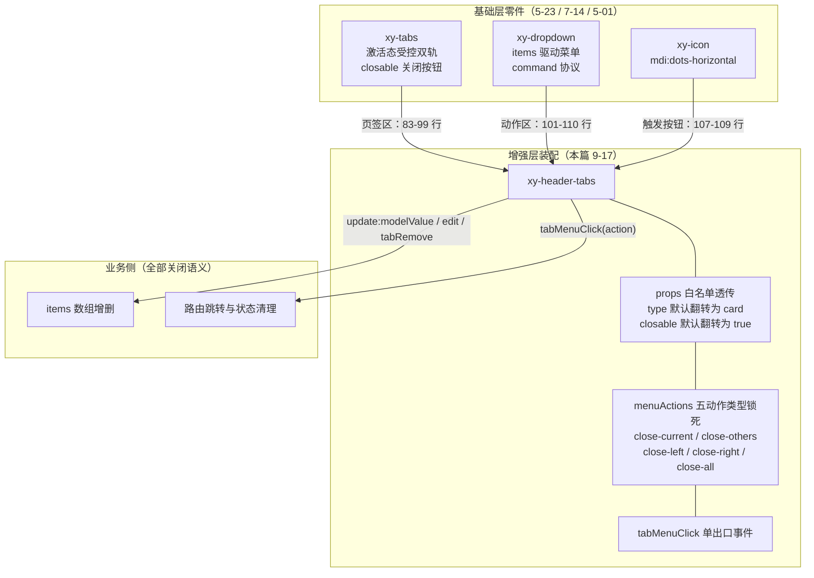
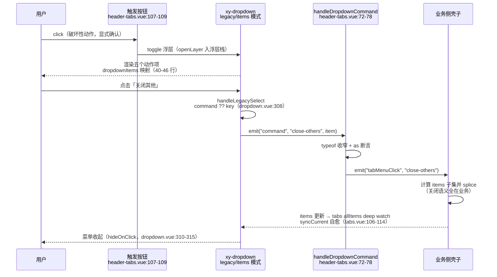

# 9-17 · HeaderTabs：头部页签

> 本篇是 9 卷"增强层（pro-components）"的第十七篇，按大纲（`column/02-分卷大纲.md:171`）回答的核心问题只有一句话——**页签 + 动作下拉的组合**。前置篇有两篇：5-23 拆完了基础层 `xy-tabs` 的激活态管理与面板联动，7-14 拆完了 `xy-dropdown` 的键盘导航与 command 协议；本篇把这两个零件装配成一个顶栏组件——`xy-header-tabs`。它和 9-16 的 `xy-avatar-menu`（大纲 `column/02-分卷大纲.md:170`，核心是"基础组件的高层组合样本"，同样消费 7-14 的 dropdown）同属**顶部导航族组合件**：一个管顶栏右端的用户区，一个管顶栏中段的页签区。

接到题目先复述目标：`packages/pro-components/header-tabs` 要回答的不是"页签怎么切"（那是 5-23 已讲完的受控双轨与指示条动画），而是"页签怎么**关**"——多页签后台壳子里，用户如何关掉当前页签、批量关掉其他/左侧/右侧/全部。它的全部源码是全库最迷你的体量之一：`src/header-tabs.vue`（112 行）、`src/header-tabs.ts`（29 行）、`index.ts`（13 行）、`__tests__/header-tabs.spec.ts`（23 行）、样式 `packages/theme/src/pro/header-tabs.css`（24 行），合计约 200 行。文档把话说得极白："用来承接多页签后台壳子的顶部标签切换和批量关闭动作"（`apps/docs/pro-components/header-tabs.md:9`）。5 个新概念、6 个事件、5 个内置动作，没有一行路由跳转、没有一行页签数据管理、没有一行关闭确认——一个"页签 + 动作下拉"的组合件做到近乎零业务语义，不是偷懒，是**站位**。本篇全部行号逐一核对过当前工作区实态，文末附核对清单；与实码不符或未接线的部分（badge 徽标、stretch 未透传等）也会如实入账。

## 一、定位：顶部导航族的第二个组合件

先给全景。9 卷写到本篇为止，"顶栏"这个场景已经出现两次：9-16 的 AvatarMenu 用"头像 + 下拉"解决用户身份区，本篇的 HeaderTabs 用"页签 + 下拉"解决多页签工作区。两者的共同点是——**基础层零件都已就位，增强层只做装配**：



这张图里有三条边界线，本篇逐条审：**装配线**（第三、四节，props 怎么透、事件怎么转）、**状态归属线**（第三节，关闭到底谁说了算）、**路由边界线**（第五节，页签和 router 之间那层没写出来的胶水归谁）。

先看组装体量。整个组件的模板只有 30 行（`packages/pro-components/header-tabs/src/header-tabs.vue:81-112`），把两个基础组件并排塞进一个 flex 容器：

```html
<template>
  <div :class="ns.base.value">
    <xy-tabs
      class="xy-header-tabs__tabs"
      :model-value="props.modelValue"
      :default-value="props.defaultValue"
      :items="props.items"
      :type="props.type"
      :tab-position="props.tabPosition"
      :closable="props.closable"
      :addable="props.addable"
      :editable="props.editable"
      :before-leave="props.beforeLeave"
      @update:model-value="handleModelValueUpdate"
      @change="handleChange"
      @edit="handleTabsEdit"
      @tab-remove="handleTabRemove"
      @tab-add="handleTabAdd"
    />

    <xy-dropdown
      class="xy-header-tabs__menu"
      trigger="click"
      :items="dropdownItems"
      @command="handleDropdownCommand"
    >
      <button type="button" class="xy-header-tabs__menu-trigger" aria-label="tab actions">
        <xy-icon icon="mdi:dots-horizontal" />
      </button>
    </xy-dropdown>
  </div>
</template>
```

（引用自 `header-tabs.vue:81-112`，其中 `xy-tabs` 装配在 83-99 行、`xy-dropdown` 装配在 101-110 行、触发按钮在 107-109 行。）没有 slot、没有 ref 转发、没有 provide——左边是 `xy-tabs` 吃掉全部宽度，右边是一个 36px 的圆形"更多"按钮。这就是"页签 + 动作下拉的组合"的全部物理形态。

## 二、全貌：112 行视图层与 29 行类型层

视图层全文如下（`packages/pro-components/header-tabs/src/header-tabs.vue:1-79`）：

```ts
<script setup lang="ts">
import { computed } from "vue";
import { useNamespace } from "xiaoye-primitives";
import { XyDropdown, XyIcon, XyTabs } from "xiaoye-components";
import type { HeaderTabsMenuAction, HeaderTabsProps } from "./header-tabs";

defineOptions({
  name: "XyHeaderTabs"
});

const props = withDefaults(defineProps<HeaderTabsProps>(), {
  modelValue: undefined,
  defaultValue: undefined,
  items: () => [],
  type: "card",
  tabPosition: "top",
  closable: true,
  addable: false,
  editable: false,
  beforeLeave: undefined,
  menuActions: () => [
    { key: "close-current", label: "关闭当前" },
    { key: "close-others", label: "关闭其他" },
    { key: "close-left", label: "关闭左侧" },
    { key: "close-right", label: "关闭右侧" },
    { key: "close-all", label: "关闭全部" }
  ]
});

const emit = defineEmits<{
  "update:modelValue": [value: string];
  change: [value: string];
  edit: [key: string | undefined, action: "remove" | "add"];
  tabRemove: [key: string];
  tabAdd: [];
  tabMenuClick: [action: HeaderTabsMenuAction];
}>();

const ns = useNamespace("header-tabs");
const dropdownItems = computed(() =>
  props.menuActions.map((item) => ({
    key: item.key,
    label: item.label,
    command: item.key
  }))
);

function handleMenuCommand(command: HeaderTabsMenuAction) {
  emit("tabMenuClick", command);
}

function handleTabsEdit(key: string | undefined, action: "remove" | "add") {
  emit("edit", key, action);
}

function handleModelValueUpdate(value: string) {
  emit("update:modelValue", value);
}

function handleChange(value: string) {
  emit("change", value);
}

function handleTabRemove(key: string) {
  emit("tabRemove", key);
}

function handleTabAdd() {
  emit("tabAdd");
}

function handleDropdownCommand(command: unknown) {
  if (typeof command !== "string") {
    return;
  }

  handleMenuCommand(command as HeaderTabsMenuAction);
}
</script>
```

类型层全文（`packages/pro-components/header-tabs/src/header-tabs.ts:1-29`）：

```ts
import type { TabItem, TabsBeforeLeave, TabsPosition, TabsType } from "xiaoye-components";

export type HeaderTabsMenuAction =
  | "close-current"
  | "close-others"
  | "close-left"
  | "close-right"
  | "close-all";

export interface HeaderTabItem extends TabItem {
  badge?: string | number;
}

export interface HeaderTabsProps {
  modelValue?: string;
  defaultValue?: string;
  items: HeaderTabItem[];
  type?: TabsType;
  tabPosition?: TabsPosition;
  closable?: boolean;
  addable?: boolean;
  editable?: boolean;
  beforeLeave?: TabsBeforeLeave;
  menuActions?: Array<{
    key: HeaderTabsMenuAction;
    label: string;
  }>;
}
```

（`TabItem`、`TabsBeforeLeave` 等类型全部从 `xiaoye-components` 导入——`header-tabs.ts:1`。基础层类型直接复用，一行都不重写，这是增强层对基础层的"类型借力"。）

三处细节值得放大。

**第一，默认值的三次翻转。** 对照基础层 `packages/components/tabs/src/tabs.vue:8-20` 的默认值：`type` 默认 `""`、`closable` 默认 `false`。header-tabs 把 `type` 默认翻成 `"card"`、`closable` 默认翻成 `true`（`header-tabs.vue:15` 与 `:17`）。这不是随手改的——顶栏场景里，页签的宿主是壳子的 header 而不是页面内容区，卡片描边是它跟顶栏底色拉开层次的默认姿势；而"关闭"在多页签后台里是**常态操作**而非边缘能力，所以默认开。对比基础层的保守默认（不可关闭、无描边），同一份 props 表在两个场景里给出了两套答案，这本身就是"特化"最诚实的证据：**增强层的默认值，写的是场景判断，不是技术偏好**。`apps/docs/pro-components/header-tabs.md:28` 和 `:26` 把这两个默认值如实写进了文档表。

**第二，事件面是"转发 + 一个新增"，且砍掉了一个。** `header-tabs.vue:30-37` 声明六个事件：`update:modelValue`、`change`、`edit`、`tabRemove`、`tabAdd` 五个从 tabs 原样转发（对应 52-70 行五个直通函数，一行一个），再加一个新事件 `tabMenuClick`。注意基础层 tabs 还有第六个事件 `tabClick`（`tabs.vue:24`）——header-tabs **没有转发它**。这不是遗漏：顶栏页签的"点击"语义已经被 `update:modelValue`/`change` 完整表达（点击页签 = 切换），单点点击的额外钩子在顶栏场景没有独立用武之地，转发它只会把基础层的事件面原样背进增强层。**转发是义务，收窄是权利**——事件面的收窄和 props 默认值的翻转一样，都是场景特化的笔迹。

**第三，动作菜单的形态是"数据映射"而非"插槽装配"。** `header-tabs.vue:40-46` 的 `dropdownItems` 只做一件事：把 `menuActions` 的 `{ key, label }` 映射成 dropdown 的 `{ key, label, command }`，其中 `command: item.key`——command 和 key 同值。这一行映射是两个组件协议的对接点：dropdown 的 legacy/items 模式里，菜单项被点击时走 `commandHandler(item.command ?? item.key, item)`（`packages/components/dropdown/src/dropdown.vue:308`），也就是说即使不设 command，dropdown 也会退回用 key 当 command；header-tabs 显式写上 `command: item.key`，是把这个兜底行为**写成显式契约**，不依赖对基础层 fallback 的记忆。`HeaderTabsProps` 里 `menuActions` 的 key 被类型锁死为 `HeaderTabsMenuAction` 五值联合（`header-tabs.ts:24-27`），业务想加第六个动作（比如"刷新当前"）连类型都过不去——想扩动作，得先扩类型联合，这个"摩擦"是故意的：**动作枚举是组件与业务之间的一份协议，白名单锁得越死，`tabMenuClick` 的消费端 switch 越可靠**。

## 三、组合深读一：可关闭 tab 的状态归属——三层判定与"哑转发层"

核心问题的前半句是"页签"，页签特化的第一问就是 5-23 留下的那桩悬案：**tab 到底可不可关，谁说了算？**基础层给出的答案是一套三层判定（`packages/components/tabs/src/tabs.vue:343-357`）：

```ts
function isClosable(item: TabItem) {
  if (item.disabled) {
    return false;
  }

  if (item.closable === false) {
    return false;
  }

  if (item.closable === true) {
    return true;
  }

  return props.closable || props.editable;
}
```

三层优先级读下来是一条"单项否决 → 单项批准 → 全局兜底"的链：`disabled` 的页签永远不可关（第一层，一票否决）；单项 `closable: false` 压过全局开启（第二层），单项 `closable: true` 顶过全局关闭（第三层前半）；都没有时退到 `props.closable || props.editable`（`tabs.vue:356`）。header-tabs 在这条链上做的事只有一件——把全局兜底的默认值从 `false` 翻成 `true`（`header-tabs.vue:17`），让"默认全可关、个别豁免"成为顶栏场景的开箱姿势。文档示例正是这个用法（`apps/docs/examples/pro/header-tabs/basic.vue:5-9`）：

```ts
const items = [
  { key: "overview", label: "概览" },
  { key: "orders", label: "订单", closable: true },
  { key: "members", label: "成员", closable: true }
];
```

注意 `overview` 没写 `closable`——在 header-tabs 的默认下它**是**可关的；若业务想让概览页钉死在顶栏，写 `closable: false` 豁免即可。示例三个页签两个显式写 `closable: true` 反而有点"画蛇添足"（默认已是 true），但这恰好把两种写法并排陈列给读者。

真正的设计决策在判定链的下游——**关闭动作发出之后，谁删数据？**基础层的答案是"我不删"（`packages/components/tabs/src/tabs.vue:440-449`）：

```ts
function handleTabRemove(item: TabItem, event: MouseEvent) {
  event.stopPropagation();

  if (!isClosable(item)) {
    return;
  }

  emit("edit", item.key, "remove");
  emit("tabRemove", item.key);
}
```

`stopPropagation` 先按住点击冒泡（不让关闭按钮触发页签切换，`tabs.vue:441`），然后 `isClosable` 复查一道，最后**只发事件，不动 items**。`tabRemove` 的名字起得很诚实——它叫"移除请求"，不叫"已移除"。这条纪律在增强层被完整继承：header-tabs 的 `handleTabRemove`（`header-tabs.vue:64-66`）同样一行转发，整个链路上没有任何一处代码去 splice 业务的数据数组。

这就是本篇第一个设计权衡的定论：**可关闭 tab 的状态归属在业务侧，组件只持有"判定权"而不持有"删除权"**。5-23 曾给基础层下过"自愈不回写"的定论（`column/5-23-Tabs-激活态管理与面板联动.md:169`）——组件把内部 `current` 纠正到第一个可用项但不替父组件补发 `update:modelValue`；header-tabs 把这个契约又往前推了一步：连 items 数组本身都留在业务手里，组件只承诺"视图忠实反映 items + 激活值，关闭动作如实上报"。EP 的对照（以 2.x 源码为参照）在这里有个微妙的同与不同：`el-tabs` 走 `tab-pane` 插槽通道，点击关闭图标同样只 emit `tab-remove`、同样等业务摘掉 pane——**"关闭请求由业务裁决"这一点两家一致**；但 EP 的 `el-tab-pane` 是组件实例，业务摘 pane 靠改 `v-if` 条件，而 xy 的 items 通道里业务删的是一个数组元素，操作对象从"组件树"回到"数据"。至于社区里最著名的多页签方案 vue-element-admin 的 tags-view，则干脆走向另一个极端：页签列表住在全局 store（visitedViews），页签即路由，关闭逻辑是 store 的 action——**三种方案对应三种状态归属：组件树（EP）、业务数据（xy）、全局 store（vue-element-admin）**。xy 选中间那条，代价是业务必须自己写删除逻辑，收益是组件对路由、store、持久化一无所知，放进任何壳子都不欠债。

## 四、组合深读二：动作下拉的装配——触发方式与宽类型的收窄

核心问题的后半句是"动作下拉"。它是本篇相对 5-23 的**全部增量**：五个批量关闭动作（`close-current`/`close-others`/`close-left`/`close-right`/`close-all`，`header-tabs.vue:21-27`）挂在页签栏右端的"更多"按钮后面。这条链跨三个组件，先看 dropdown 端的承接逻辑（`packages/components/dropdown/src/dropdown.vue:288-316`，`emitSelection` 与 `handleLegacySelect` 两段）：

```ts
function emitSelection(
  command: DropdownCommand | string | undefined,
  item: DropdownSelectItem | DropdownItem
) {
  emit("select", item);
  emit("command", command, item);
}

function commandHandler(
  command: DropdownCommand | string | undefined,
  item: DropdownSelectItem | DropdownItem
) {
  emitSelection(command, item);
}

function handleLegacySelect(item: DropdownItem) {
  if (item.disabled) {
    return;
  }

  commandHandler(item.command ?? item.key, item);

  if (hideOnClick.value) {
    handleClose({
      restoreFocus: true,
      immediate: true
    });
  }
}
```

（`emitSelection` 在 288-294 行把 `select` 与 `command` 两个事件先后发出；`hideOnClick` 的取值在 99 行：`props.hideOnClick ?? props.closeOnSelect`，而 `closeOnSelect` 默认 `true`——所以菜单选中后自动收起、焦点还给触发按钮，这一整套关闭语义 header-tabs 一行没写，全是 7-14 的存量。）header-tabs 端接过 command 的只有六行（`header-tabs.vue:72-78`）：

```ts
function handleDropdownCommand(command: unknown) {
  if (typeof command !== "string") {
    return;
  }

  handleMenuCommand(command as HeaderTabsMenuAction);
}
```

六行里藏着两个值得展开的点。

**点一：为什么触发方式是 click 而不是 hover 或右键？**dropdown 的默认触发是 `hover`（`dropdown.vue:43`），header-tabs 显式改成了 `trigger="click"`（`header-tabs.vue:103`）。这不是参数口味问题，是**破坏性等级**问题：hover 触发适合"查看详情"类零成本动作（tooltip、普通菜单），而"关闭全部"是可能让用户丢掉一整屏工作上下文的动作，触发成本必须大于零——鼠标路过顶栏时菜单不该自己弹出来。右键（contextmenu）是另一个候选：dropdown 本身支持它（`packages/components/dropdown/src/dropdown.ts:6` 的 `dropdownTriggers = ["hover", "click", "contextmenu"]`），vue-element-admin 的 tags-view 正是用右键菜单承载"关闭其他/关闭右侧"这一套——但右键有个致命的**发现性缺陷**：没有任何视觉线索告诉新用户"这里可以右键"。header-tabs 的答案是常驻的 36px 圆形按钮（`header-tabs.css:12-23`，`aria-label="tab actions"`、`mdi:dots-horizontal` 三点图标）——把菜单的入口钉死在视觉上，代价是顶栏常驻一个图标位。**click + 常驻按钮选了发现性，右键选了空间效率，hover 选了便捷但被否决**——三选一的判据是动作的破坏性等级，这个判据比结论本身更值得带走。顺带一提，测试用例对触发链的验证绕过了 DOM 直达 vm：`wrapper.getComponent(XyDropdown).vm.$emit("command", "close-all")`（`header-tabs.spec.ts:20`）——dropdown 的触发定位、浮层栈、键盘导航在 7-14 已被钉死，组合层测试只验"command 进、tabMenuClick 出"这一段新增管道，这是组合件测试的合理切面。

**点二：宽类型进、窄类型出。**dropdown 的 command 协议是宽的：`DropdownCommand = string | number | Record<string, unknown>`（`dropdown.ts:10`），command 事件签名（`dropdown.vue:68`）还带着第二个参数 `item`。header-tabs 的 `tabMenuClick` 却只发一个窄类型 `HeaderTabsMenuAction`（五值联合）。中间的收窄分两步走：`typeof command !== "string"` 把 number 和对象挡在门外（运行时守卫），`as HeaderTabsMenuAction` 把 string 断言成动作联合（编译期收口）。第二参 `item` 被**有意丢弃**——菜单项的全部信息就是 key 和 label，而 key 已经随 command 送达，label 对消费端毫无决策价值。这一进一出是整个组件类型设计的缩影：**对接宽协议时在边界处收窄，让业务拿到的每个值都进过类型安检**。dropdown 的 `DropdownItem` 接口（`dropdown.ts:12-22`）里 `danger`、`description`、`divided`、`icon` 这些字段 header-tabs 全都没透——`menuActions` 的类型只有 `key` 和 `label` 两个成员（`header-tabs.ts:24-27`）。想给"关闭全部"标红？现有类型做不到。这是收敛过头还是克制得当，可以争论；但至少"五动作"在文档里是一张完整的固定菜单（`apps/docs/pro-components/header-tabs.md:32`），协议面和文档面是对齐的。

整条动作链画成时序图是这样的：



注意图里最后两步的分工：菜单为什么收起、激活态为什么自愈，都是基础层的存量纪律；业务删了哪些页签、删完跳哪个路由，全是业务侧的新增量。**组合件的好处在这张图里看得最清楚：它新增的只有一个"翻译节点"（H），其余每一跳都是已验证过的旧路。**

## 五、组合深读三：路由联动边界——页签不是路由，是数据

多页签后台绕不开的终极问题是：页签和 vue-router 什么关系？vue-element-admin 的 tags-view 给出的强绑定答案是"页签即路由"——打开页面即注册页签，关闭页签即 `$router.push` 到相邻路由，`visitedViews` 住在全局 store 里，刷新后从路由表重建。header-tabs 的实码答案则是彻底的**零路由**：全组件没有一行 `useRouter`、没有一个路由相关 prop、`tabMenuClick` 和 `tabRemove` 的载荷里只有 key 和动作名，连"关闭激活页签后该跳哪"这个后台壳子的必答题都原样留给业务。

这个边界为什么这样划？看激活态的承接逻辑就明白了。基础层在 items 变化时的自愈逻辑（`packages/components/tabs/src/tabs.vue:85-114`）：

```ts
function resolveFallbackValue() {
  return props.modelValue ?? props.defaultValue ?? current.value;
}

function syncCurrent(value?: string) {
  const nextValue = value ?? resolveFallbackValue();
  const matched = allItems.value.some((item) => item.key === nextValue && !item.disabled);

  current.value = matched ? nextValue : firstEnabledKey.value;
}

watch(
  () => props.modelValue,
  (value) => {
    syncCurrent(value);
  },
  {
    immediate: true
  }
);

watch(
  () => allItems.value,
  () => {
    syncCurrent(props.modelValue ?? current.value);
  },
  {
    deep: true
  }
);
```

业务在 `tabMenuClick("close-all")` 里清空 items 的瞬间，106-114 行的 deep watch 被触发，`syncCurrent` 发现激活 key 匹配不上任何存活页签，把内部 `current` 自愈到 `firstEnabledKey`（`tabs.vue:93`）——**但不会补发 `update:modelValue`**。这就是 5-23"自愈不回写"契约在 header-tabs 场景的兑现方式：视觉上第一个页签会亮起来，可如果业务拿 `v-model` 的值去驱动 `<component :is>` 或路由跳转，它手里的激活值还是那个已死的 key。**于是业务必须自己接住 `tabRemove`**——在回调里挑下一个 key 并写回 `v-model`。这正是 5-23 测试钉过的纪律（`tabs.spec.ts:130-136`，editable 用例里 `handleRemove` 自己负责挑 `items.value[index]?.key ?? items.value[index - 1]?.key ?? ""`），到了组合层依然成立，只是消费方从"用 tabs 的业务"变成了"用 header-tabs 的壳子"。

把这套责任写全，一个真实壳子的消费代码大致长这样：

```ts
<script setup lang="ts">
import { computed, ref } from "vue";
import { useRoute, useRouter } from "vue-router";
import type { HeaderTabItem, HeaderTabsMenuAction } from "xiaoye-pro-components";

const router = useRouter();
const route = useRoute();

// 页签数据的唯一事实源：路由表驱动 + 业务手动追加
const opened = ref<HeaderTabItem[]>([
  { key: "dashboard", label: "工作台" }
]);
const active = ref("dashboard");

// 路由进入时注册页签（页签 ≠ 路由，需要业务自己粘合）
function registerTab(key: string, label: string) {
  if (!opened.value.some((item) => item.key === key)) {
    opened.value = [...opened.value, { key, label, closable: key !== "dashboard" }];
  }
  active.value = key;
}

// 关闭动作：全部语义都在这里
function handleMenuAction(action: HeaderTabsMenuAction) {
  const index = opened.value.findIndex((item) => item.key === active.value);
  const keep = (item: HeaderTabItem, i: number) => {
    switch (action) {
      case "close-current": return item.key !== active.value || item.closable === false;
      case "close-others": return item.key === active.value || item.closable === false;
      case "close-left": return i >= index || item.closable === false;
      case "close-right": return i <= index || item.closable === false;
      case "close-all": return item.closable === false;
    }
  };
  const next = opened.value.filter(keep);
  // 自愈不回写：删掉激活项后必须自己挑下一个 key
  if (!next.some((item) => item.key === active.value)) {
    const fallback = next[next.length - 1]?.key ?? "";
    active.value = fallback;
    void router.push(fallback); // 路由联动是业务的增量，不是组件的义务
  }
  opened.value = next;
}
</script>

<template>
  <xy-header-tabs
    v-model="active"
    :items="opened"
    @tab-menu-click="handleMenuAction"
  />
</template>
```

这段伪码（按 `header-tabs.vue` 的 props/事件实态编写，key 命名遵循 `HeaderTabsMenuAction` 联合）想说明一件事：**header-tabs 把"多页签壳子"这个产品功能切成了两半——视图与判定归组件，删除与导航归业务**。组件不知道路由存在，所以它对 hash 模式、memory 模式、keep-alive、标签持久化全部免疫；业务拿到了每一次关闭的完整裁决权，代价是这 40 行 glue code 必须自己写。EP 生态里 el-tabs 同样不管路由，路由级页签从来都是社区方案（tags-view）的活——**这个分工在两个生态里惊人一致，因为它不是实现选择，是多页签场景的固有复杂度分布**：路由联动策略（关激活页签后跳左邻还是右邻？404 怎么办？）没有放之四海的答案，组件库硬编码任何一种都会在下一个项目里被推翻。

还有一条容易漏掉的边界：`beforeLeave` 切换拦截也被完整透传（类型 `header-tabs.ts:23`、模板 `header-tabs.vue:93`，落到 `tabs.vue:116-133` 的 `canLeave`，支持 boolean 与 Promise）。顶栏场景里它有独特的价值——表单未保存时拦住页签切换，提示语挂在壳子上而页签拦截挂在组件 props 里，两层各管各的。`TabsBeforeLeave` 的签名是 `(newKey, oldKey)`（`packages/components/tabs/src/tabs.ts:27-30`），**新值在前**，5-23 提醒过的这个反直觉顺序，透传链再长也没变。

## 六、样式、类型与三笔工程账

样式全文只有 24 行（`packages/theme/src/pro/header-tabs.css:1-24`）：

```css
.xy-header-tabs {
  display: flex;
  align-items: center;
  gap: var(--xy-space-3);
}

.xy-header-tabs__tabs {
  flex: 1;
  min-width: 0;
}

.xy-header-tabs__menu-trigger {
  display: inline-flex;
  align-items: center;
  justify-content: center;
  width: 36px;
  height: 36px;
  border-radius: var(--xy-radius-pill);
  border: 1px solid var(--xy-border);
  background: var(--xy-bg-container);
  color: var(--xy-text-primary);
  cursor: pointer;
}
```

三段各干一件事：外层 flex + `--xy-space-3` 间距（L2-4）；页签区 `flex: 1` 抢占剩余宽度，配 `min-width: 0` 允许收缩——没有这行，页签过多时 flex 子项的默认 `min-width: auto` 会把容器撑破顶栏（这是 flex 布局最经典的坑，此处的 `min-width: 0` 是防溢出的关键一行，L8-9）；触发按钮 36px 圆形（`--xy-radius-pill` 药丸圆角在正方形上呈现为正圆），配色全部走语义令牌（`--xy-border`/`--xy-bg-container`/`--xy-text-primary`），双主题自动生效，L12-23。页签自身的卡片描边、指示条动画、滚动按钮全部复用 `xy-tabs` 的样式系统——组合件的样式表只有"装配产生的新元素"，一像素不多。

类型与安装入口的接线也在位：`packages/pro-components/header-tabs/index.ts:9-12` 导出类型三元组并 `withInstall(HeaderTabs, "xy-header-tabs")`；`packages/pro-components/index.ts:64-68` 把 `HeaderTabItem`/`HeaderTabsMenuAction`/`HeaderTabsProps` 三个类型抬到包根（组件值由 `packages/pro-components/exports.ts:15` 导出、`component-manifest.json:117-118` 登记）；`tests/types/fixtures/xiaoye-pro-components.ts:14` 与 `:50` 双向断言值与类型导入、`:199-204` 摆了 `headerTabItems` 最小夹具、`:442` `void XyHeaderTabs` 确认值可达。

最后记三笔工程账——本篇核对中发现的三处"类型先行/叙述先行、实码未接"：

**账一：badge 字段悬空。**`HeaderTabItem extends TabItem` 加了一个 `badge?: string | number`（`header-tabs.ts:10-12`），意图显然是顶栏页签上的未读数。但 `header-tabs.vue` 的模板对它零消费——页签标签只渲染 `item.label`（转发给 tabs 后由 `tabs.vue:557` 输出），badge 无处落地。文档把这话说得很诚实："类型上预留 `badge?` 字段，当前版本暂未渲染徽标"（`apps/docs/pro-components/header-tabs.md:25`）。更深的约束在于：badge 想渲染得穿过 `xy-tabs` 的 `items` 通道，而基础层 `TabItem`（`packages/components/tabs/src/tabs.ts:3-8`）只有 `key/label/disabled/closable` 四个字段，header-tabs 若不改基础层，badge 只能靠 `HeaderTabItem` 向下兼容赋值却无法上屏——**扩展字段卡在了组合件与基础层的类型交界处**。这是"AI 协作研发"的一份真实账本：类型写了、文档认了、渲染没接。

**账二：props 白名单漏了两个。**对照基础层 props 面（`tabs.ts:32-44`），`stretch` 与 `tabindex` 没有进入 `HeaderTabsProps`，自然也没在 `header-tabs.vue:83-99` 透传。`stretch`（页签均分宽度）在顶栏场景确实可疑，不透可以辩护；`tabindex`（激活项的 roving 序位）不透则让无障碍微调失去入口——透传白名单的每一刀都该有理由，这两刀的理由没有写在任何地方。对比 9-16 的 AvatarMenu（`packages/pro-components/avatar-menu/src/avatar-menu.ts:5-11`）用 `dropdownProps?: Partial<DropdownProps>` 整包透传、`avatar-menu.vue:41` 一行 `v-bind` 完事——**同族两个组合件选了相反的 props 策略：header-tabs 白名单（每个成员显式可见、默认值可翻转、面收得窄），avatar-menu 透传（基础层能力全量保留、升级自动继承、面放得宽）**。header-tabs 的动作菜单因为多了 `menuActions` 这个业务协议才必须白名单；avatar-menu 的下拉只是身份区的附属品，透传更经济。策略没有高下，但**同一个仓库里两种策略并存**这件事本身，值得每个做组合件的人停下来想十秒。

**账三：admin 闭环示例没有消费它。**管理后台闭环示例（`apps/docs/examples/admin.md`）的页面分区讲的是"使用 Tabs 让成员台账、账单链路和风控排查共享同一套增强层页面骨架"（`admin.md:45`），用是基础层 `xy-tabs`，`xy-header-tabs` 未进入这条闭环——全库的消费现场只有文档示例 `apps/docs/examples/pro/header-tabs/basic.vue` 和类型夹具。文档进度表（`apps/docs/guide/PROGRESS.md:153`）标记其文档已完成，但"多页签壳子"这个组件最真实的用法（第五节那 40 行 glue code）在仓库里没有可运行的完整示例。对一个主打"多页签后台"的组件来说，这是比 badge 悬空更值得补的一块。

## 七、测试：一个用例钉住两条管道

测试全文 23 行（`packages/pro-components/header-tabs/__tests__/header-tabs.spec.ts:1-23`）：

```ts
import { mount } from "@vue/test-utils";
import { describe, expect, it } from "vitest";
import { XyHeaderTabs } from "@xiaoye/pro-components";
import { XyDropdown } from "@xiaoye/components";

describe("XyHeaderTabs", () => {
  it("支持页签切换和菜单动作", async () => {
    const wrapper = mount(XyHeaderTabs, {
      props: {
        items: [
          { key: "overview", label: "概览" },
          { key: "orders", label: "订单" }
        ]
      }
    });

    await wrapper.findAll('[role="tab"]')[1]?.trigger("click");
    expect(wrapper.emitted("update:modelValue")?.[0]).toEqual(["orders"]);

    wrapper.getComponent(XyDropdown).vm.$emit("command", "close-all");
    expect(wrapper.emitted("tabMenuClick")?.[0]).toEqual(["close-all"]);
  });
});
```

一个用例、两组断言，精确对应组件的两条管道：前半段点 `[role="tab"]`（选择器用的是 ARIA 角色而非类名，行为锚定而非实现锚定）断言切换链 `update:modelValue` 收到 `"orders"`——这条链的每一跳（`handleTabClick` → `activate` → `emit`）在 5-23 的 8 个用例里已经钉过，这里只验证 header-tabs 的转发函数没有接错线；后半段从 `XyDropdown` 的 vm 上直接 `$emit("command", "close-all")`，断言 `tabMenuClick` 收到动作名——绕过触发定位与浮层渲染，直测第四节那个"翻译节点"。组合件的测试哲学在这 23 行里表露无遗：**零件的深度行为归零件的测试，组合层只测接线和翻译，一个用例不贪多**。若后续补 badge 渲染或触发按钮的 DOM 交互，这套切面照用不误。

## 收束：三句话与 9-18 的岔路

HeaderTabs 的全部故事可以用三句话讲完。**其一，页签 + 动作下拉的组合，物理形态只有"左 tabs、右按钮"两块，增量全部在协议层**：`menuActions` 五值联合锁死动作集，`tabMenuClick` 单出口收窄 dropdown 的宽 command，`tabRemove`/`edit` 原样上报关闭请求。**其二，关闭的状态归属在业务**：三层 `isClosable` 判定（disabled 否决、单项覆盖、`closable: true` 默认翻转）只解决"哪些页签显示关闭钮"，删数据、挑下一个 key、路由跳转全是业务的责任——"自愈不回写"的契约从 5-23 一路贯通到顶栏。**其三，触发方式服务于破坏性等级**：hover 被否决、右键输给发现性，click + 常驻"更多"按钮是多页签批量关闭动作的合理落点。加上三笔工程账（badge 悬空、stretch/tabindex 未透传、admin 闭环缺席），这就是本篇的全部实态。

下一篇进入 9-18《NoticeCenter：消息中心》——大纲（`column/02-分卷大纲.md:172`）给它的核心问题是"多 tab 列表的状态组织"，前置篇 7-03（Notification）。有意思的是，它同样内置了页签（`packages/pro-components/notice-center/src/notice-center.vue:68` 同样渲染 `xy-tabs`），但页签在那里是"消息分类过滤器"而不是"页面路由器"——同一个基础零件，两种业务隐喻，正好和本篇互为镜像。

---

### 附：本篇引用清单（全部核对于当前工作区实态）

| 引用 | 路径:行号 |
| --- | --- |
| 大纲定位 | `column/02-分卷大纲.md:170-172` |
| 视图层全文/props 默认 | `packages/pro-components/header-tabs/src/header-tabs.vue:1-79`、`:11-28`、`:21-27` |
| 事件声明/转发 | `header-tabs.vue:30-37`、`:52-70`、`:64-66` |
| 菜单映射/收窄 | `header-tabs.vue:40-46`、`:48-50`、`:72-78` |
| 模板装配 | `header-tabs.vue:81-112`（tabs 83-99、dropdown 101-110、按钮 107-109） |
| 类型层全文 | `packages/pro-components/header-tabs/src/header-tabs.ts:1-29`（动作联合 3-8、badge 10-12、props 14-28） |
| 安装入口 | `packages/pro-components/header-tabs/index.ts:9-12` |
| 样式全文 | `packages/theme/src/pro/header-tabs.css:1-24` |
| 测试全文 | `packages/pro-components/header-tabs/__tests__/header-tabs.spec.ts:1-23`（用例 7-22） |
| tabs 双通道/自愈 | `packages/components/tabs/src/tabs.vue:68-73`、`:85-114`、`:93` |
| tabs 关闭判定与事件 | `tabs.vue:343-357`、`:440-449`、`:447-448`、`:557` |
| tabs 类型 | `packages/components/tabs/src/tabs.ts:3-8`、`:27-30`、`:32-44` |
| dropdown 协议 | `packages/components/dropdown/src/dropdown.vue:43`、`:68`、`:95`、`:99`、`:288-294`、`:303-316`、`:308`、`:310-315` |
| dropdown 类型 | `packages/components/dropdown/src/dropdown.ts:6`、`:10`、`:12-22` |
| 同族对比 | `packages/pro-components/avatar-menu/src/avatar-menu.ts:5-11`、`avatar-menu.vue:38-44`、`:41` |
| 导出与守卫 | `packages/pro-components/index.ts:64-68`、`exports.ts:15`、`component-manifest.json:117-118`、`tests/types/fixtures/xiaoye-pro-components.ts:14`、`:50`、`:199-204`、`:442` |
| 文档与示例 | `apps/docs/pro-components/header-tabs.md:9`、`:25`、`:26`、`:28`、`:32`；`apps/docs/examples/pro/header-tabs/basic.vue:5-13` |
| 消费实证 | `apps/docs/examples/admin.md:45`（未消费 header-tabs）；`apps/docs/guide/PROGRESS.md:153` |
| 前篇考据 | `column/5-23-Tabs-激活态管理与面板联动.md:169`（自愈不回写）；5-23 所引 `tabs.spec.ts:130-136` |
