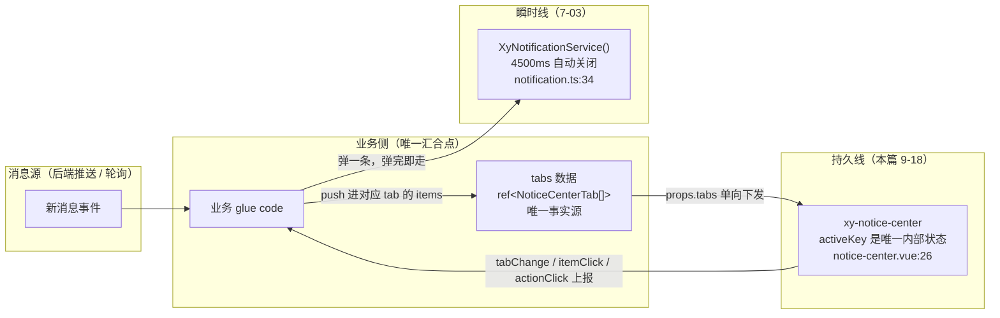
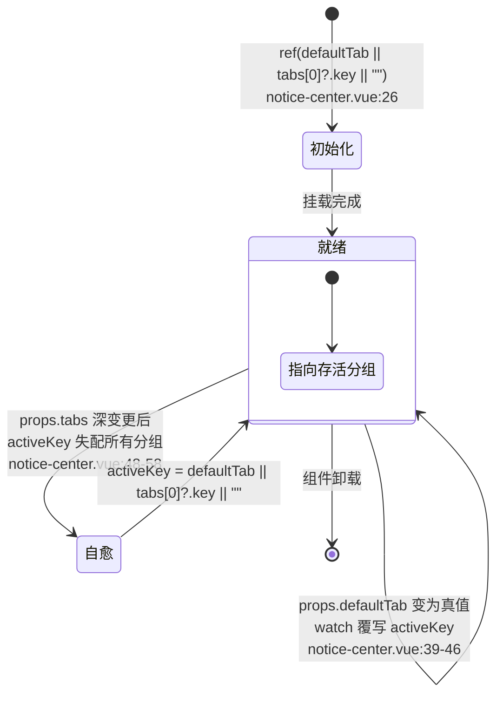
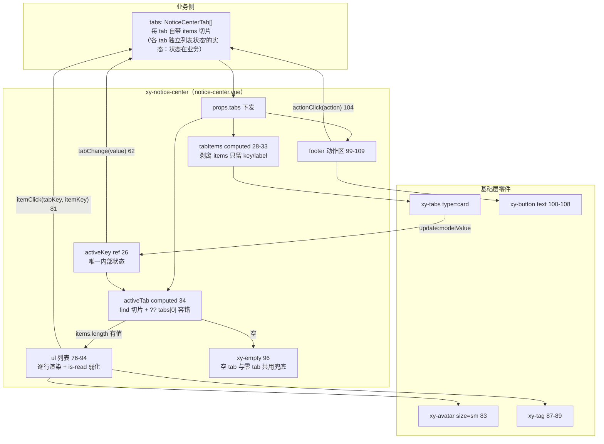
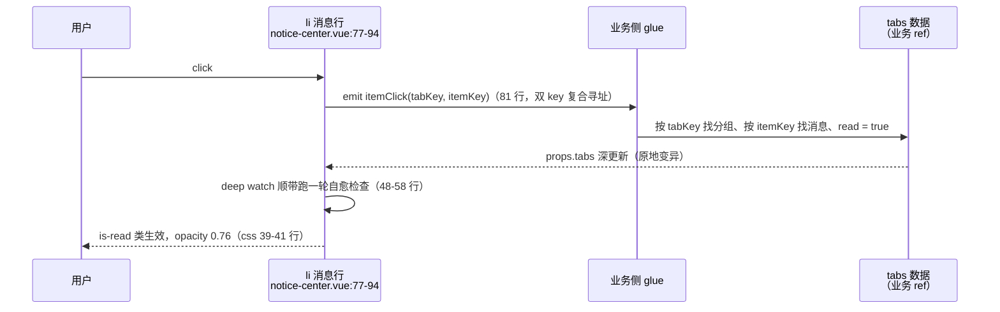

# 9-18 · NoticeCenter：消息中心

> 本篇是 9 卷"增强层（pro-components）"的第十八篇，按大纲（`column/02-分卷大纲.md:172`）回答的核心问题只有一句话——**多 tab 列表的状态组织**。前置篇是 7-03《Notification：双形态并存》——大纲把 notification 列为本篇的前置，不是因为它俩代码有继承关系（源码上零共享），而是因为这两个组件是一对**必须放在一起看才看得懂的产品分工**：一个管"消息到达的瞬间"，一个管"消息的留存与追溯"。

接到题目先复述目标。`packages/pro-components/notice-center` 要回答的不是"消息列表怎么渲染"（那是 8 卷数据展示族早已讲完的基本功），而是"多个消息分组各自持有列表时，**状态怎么组织、谁持有、怎么同步**"。这个问题在大纲里的理想化提法是"按消息类型分 tab、各 tab 独立列表状态、未读数徽标联动、已读/删除操作与 tab 状态同步"——但实码给出的答案和这个提法差异很大：整个组件的内部状态**只有一个 `activeKey`**（`packages/pro-components/notice-center/src/notice-center.vue:26`），列表数据、已读状态、增删操作全部不在组件里。全库最 mini 的体量之一：`src/notice-center.vue`（111 行）、`src/notice-center.ts`（30 行）、`index.ts`（18 行）、`__tests__/notice-center.spec.ts`（63 行）、样式 `packages/theme/src/pro/notice-center.css`（67 行），合计约 289 行。文档把定位说得极白："承接站内消息、待办和公告这类结构化列表展示，**不与即时通知服务混用**"（`apps/docs/pro-components/notice-center.md:9`）。本篇全部行号逐一核对过当前工作区实态，文末附核对清单；大纲提法与实码不符的部分（未读徽标、删除操作）也会如实入账。

## 一、开篇辨析：瞬时通知与持久消息中心，两条产品线

先回答大纲为什么把 7-03 设为前置。`XyNotification`（7-03）和 `XyNoticeCenter`（本篇）在中文语境里都叫"通知"，但它们是两条完全不同的产品线：

| 维度 | notification（7-03） | notice-center（本篇） |
| --- | --- | --- |
| 生命周期 | 瞬时——默认 4500ms 自动关闭 | 持久——数据在业务手里，活到业务删它为止 |
| 形态 | 右上角浮层栈 + 服务式 `XyNotificationService()` | 页面内联面板/抽屉内容 |
| 状态归属 | 组件内部（倒计时、可见性、堆叠位置） | 业务（tabs 数组是唯一事实源） |
| 安装检查 | component + globalProperty 双 kind（`$notify`） | 单 component |
| 是否要"处理" | 不处理也行，弹完即走 | 每条消息等一个"已读"或跳转 |

瞬时的证据写在常量里：`NOTIFICATION_DEFAULT_DURATION = 4500`（`packages/components/notification/src/notification.ts:34`）——notification 的默认世界观是"4.5 秒后这条消息就不存在了"，它专为 fire-and-forget 的事件通报而生，双形态安装入口在 `packages/components/notification/index.ts:60-61`（组件式 `XyNotification` 与服务式 `XyNotificationService` 一行一个）。而 notice-center 的全组件**没有一行定时器代码**，也没有一行浮层代码——它不抢屏幕注意力，它是一块安静地躺在页面里的列表，等用户主动来看。文档给它的放置建议也印证了这个站位："适合放在头部 Bell 触发器的浮层面板或侧边消息抽屉里"（`apps/docs/pro-components/notice-center.md:13`）。

两者真正的组合方式发生在**业务侧**：一条新消息到达时，业务调 `XyNotificationService.success(...)` 弹一条瞬时通知负责"现在告诉你"，同时往 notice-center 的 tabs 数据里 push 一条记录负责"以后还能找到"——两条线在业务代码里汇合，两个组件互不知晓对方存在。文档那句"不与即时通知服务混用"（`notice-center.md:9`）说的就是这个边界：notice-center 不内置任何"接收消息"的机制，它只是数据的纯视图。这个分工画成图是这样的：



这张图还预告了本篇的核心结论：**持久线的箭头全部是单向往返于业务与组件之间的"数据下发、事件上报"，组件自己不产生任何状态变更决定**——除了一个 `activeKey`。这个 `activeKey` 就是"多 tab 列表的状态组织"在实码里的全部存量，下一节先把它拆干净。

## 二、全貌：111 行视图层与 30 行契约层

视图层的脚本段全文如下（`packages/pro-components/notice-center/src/notice-center.vue:1-64`）：

```ts
<script setup lang="ts">
import { computed, ref, watch } from "vue";
import { useNamespace } from "xiaoye-primitives";
import { XyAvatar, XyButton, XyEmpty, XyIcon, XyTag, XyTabs } from "xiaoye-components";
import type { NoticeCenterAction, NoticeCenterProps } from "./notice-center";

defineOptions({
  name: "XyNoticeCenter"
});

const props = withDefaults(defineProps<NoticeCenterProps>(), {
  tabs: () => [],
  actions: () => [],
  maxHeight: 360,
  emptyText: "暂无消息",
  defaultTab: ""
});

const emit = defineEmits<{
  tabChange: [value: string];
  itemClick: [tabKey: string, itemKey: string];
  actionClick: [action: NoticeCenterAction];
}>();

const ns = useNamespace("notice-center");
const activeKey = ref(props.defaultTab || props.tabs[0]?.key || "");

const tabItems = computed(() =>
  props.tabs.map((tab) => ({
    key: tab.key,
    label: tab.label
  }))
);
const activeTab = computed(() => props.tabs.find((tab) => tab.key === activeKey.value) ?? props.tabs[0]);
const bodyStyle = computed(() => ({
  maxHeight: typeof props.maxHeight === "number" ? `${props.maxHeight}px` : props.maxHeight
}));

watch(
  () => props.defaultTab,
  (value) => {
    if (value) {
      activeKey.value = value;
    }
  }
);

watch(
  () => props.tabs,
  (tabs) => {
    if (!tabs.some((tab) => tab.key === activeKey.value)) {
      activeKey.value = props.defaultTab || tabs[0]?.key || "";
    }
  },
  {
    deep: true
  }
);

function handleTabChange(value: string) {
  activeKey.value = value;
  emit("tabChange", value);
}
</script>
```

契约层全文（`packages/pro-components/notice-center/src/notice-center.ts:1-30`）：

```ts
export interface NoticeCenterAction {
  key: string;
  label: string;
  icon?: string;
}

export interface NoticeCenterItem {
  key: string;
  title: string;
  content?: string;
  time?: string;
  tag?: string;
  tagStatus?: "primary" | "success" | "warning" | "danger" | "neutral";
  avatar?: string;
  read?: boolean;
}

export interface NoticeCenterTab {
  key: string;
  label: string;
  items: NoticeCenterItem[];
}

export interface NoticeCenterProps {
  tabs: NoticeCenterTab[];
  actions?: NoticeCenterAction[];
  maxHeight?: string | number;
  emptyText?: string;
  defaultTab?: string;
}
```

四段结构一目了然：`NoticeCenterItem` 是消息行（key/title 必填，content/time/tag/avatar/read 全可选），`NoticeCenterTab` 是"key + label + items"的分组切片，`NoticeCenterProps` 把 `tabs` 设为唯一必填。契约文件**零 import**——不从 `xiaoye-primitives` 借 `ComponentStatus`（`packages/xiaoye-primitives/src/utils/types/common.ts:1` 的五值联合），而是把 `tagStatus` 的联合手写了一遍（`notice-center.ts:13`）。这笔账先记下，第五节算。

三个值得放大的细节。

**细节一：`activeKey` 是全组件唯一的内部状态，且初始化只吃一次 props。**`notice-center.vue:26` 的 `ref(props.defaultTab || props.tabs[0]?.key || "")` 是一条三级兜底：显式默认 tab → 第一个分组 → 空串。注意这是 `ref()` 而不是 `computed`——初始值定格在挂载那一刻，之后 props.defaultTab 再变，走的是 39-46 行的 watch 而非响应式派生。为什么不用 computed？因为 `activeKey` 必须是**可写的**：用户点击 tab 时 `handleTabChange` 要直接赋值（`notice-center.vue:61`）。激活态是"读 props 起步、写自己运转"的游标，这是非受控组件的标准起步姿势——对比 9-17 的 header-tabs 把 `modelValue` 做成受控双轨，同一个基础零件 `xy-tabs` 在两个组合件里拿到了两种状态归属方案，这个对照留到第三节展开。

**细节二：`tabItems` 是一次"边界瘦身"。**`notice-center.vue:28-33` 把 `props.tabs` 映射成只有 `{key, label}` 的数组喂给 `xy-tabs`——每个 tab 身上那份可能很大的 `items` 被刻意剥掉了。这一行的意义在于守住两个组件的边界卫生：`TabItem`（`packages/components/tabs/src/tabs.ts:3-8`）只有 `key/label/disabled/closable` 四个字段，多传的部分既不会被渲染（页签标签只输出 `item.label`，`packages/components/tabs/src/tabs.vue:557`），还会跟着 deep watch 一起进 xy-tabs 的变更检测。**一个组件只需要什么，就喂什么**——对比 9-17 的 `HeaderTabItem extends TabItem` 整包透传（类型还预留了 badge 字段），notice-center 反向选择了"剥到最瘦"。同一份基础零件，一个加字段、一个减字段，增强层的取舍全写在这两个 computed 里。

**细节三：`activeTab` 的切片带容错。**`notice-center.vue:34` 的 `props.tabs.find((tab) => tab.key === activeKey.value) ?? props.tabs[0]`——find 失配时退到第一个 tab，保证激活游标指向一个已删除的 key 时列表区不会白屏。这个 `?? props.tabs[0]` 和第三节要讲的 deep watch 自愈是**双保险**：watch 负责"纠正游标本体"，fallback 负责"就算游标来不及纠正，视图也不出错"。两道防线谁都不依赖谁。

顺带把模板的骨架也立起来（`packages/pro-components/notice-center/src/notice-center.vue:66-111`，完整逐行解读放第四节）：

```html
<template>
  <section :class="ns.base.value">
    <xy-tabs
      :model-value="activeKey"
      :items="tabItems"
      type="card"
      @update:model-value="handleTabChange"
    />

    <div class="xy-notice-center__body" :style="bodyStyle">
      <ul v-if="activeTab?.items.length" class="xy-notice-center__list">
        <li
          v-for="item in activeTab.items"
          :key="item.key"
          :class="['xy-notice-center__item', item.read ? 'is-read' : '']"
          @click="emit('itemClick', activeTab.key, item.key)"
        >
          <xy-avatar v-if="item.avatar" :src="item.avatar" size="sm" class="xy-notice-center__avatar" />
          <div class="xy-notice-center__item-main">
            <div class="xy-notice-center__item-head">
              <strong>{{ item.title }}</strong>
              <xy-tag v-if="item.tag" :status="item.tagStatus ?? 'neutral'" size="sm">
                {{ item.tag }}
              </xy-tag>
            </div>
            <p v-if="item.content" class="xy-notice-center__item-content">{{ item.content }}</p>
            <small v-if="item.time" class="xy-notice-center__item-time">{{ item.time }}</small>
          </div>
        </li>
      </ul>
      <xy-empty v-else :description="props.emptyText" />
    </div>

    <div v-if="props.actions.length" class="xy-notice-center__footer">
      <xy-button
        v-for="action in props.actions"
        :key="action.key"
        text
        @click="emit('actionClick', action)"
      >
        <xy-icon v-if="action.icon" :icon="action.icon" />
        {{ action.label }}
      </xy-button>
    </div>
  </section>
</template>
```

一个 `section` 壳子，三段纵向布局：顶部 `xy-tabs`（type 翻成 card，`notice-center.vue:71`——和 header-tabs 的默认翻转一致，面板场景的页签默认要描边）、中部列表/空态二选一、底部可选动作区。消费清单是六个基础组件：`XyAvatar`、`XyButton`、`XyEmpty`、`XyIcon`、`XyTag`、`XyTabs`（`notice-center.vue:4`）——大纲知识点矩阵给它的配方正是"Tabs/Tag/Empty 组合"（`column/01-知识点全集矩阵.md:193`）。

## 三、核心：activeKey 的状态流转——一条会自愈的游标

"多 tab 列表的状态组织"，第一个子问题是**激活态归谁、怎么流转**。把 `activeKey` 的一生画成状态图：



图上两条自愈通道的实码都只有几行，但优先级设计值得逐字读。第一条，`defaultTab` 的 watch（`notice-center.vue:39-46`）：

```ts
watch(
  () => props.defaultTab,
  (value) => {
    if (value) {
      activeKey.value = value;
    }
  }
);
```

`if (value)` 是一个**真值守卫**——业务把 `defaultTab` 从 `"todo"` 改回 `""` 想表达"重置到第一个分组"，组件不会理你；空串被当成"没有意图"而非"明确的重置意图"。这条守卫和初始化的 `props.defaultTab || ...` 是一套语义：**空串在 defaultTab 通道里永远意味着"未指定"**。代价是组件不存在"编程式重置"能力——它没有 `v-model`、没有 `defineExpose`、没有 `update:activeKey` 事件，`defaultTab` 这个名叫"默认"的 prop 实际上是业务**唯一**的远程切换通道，而这条通道只认真值。这是本篇第一处设计权衡的落点，第三节末尾算总账。

第二条，`tabs` 的 deep watch（`notice-center.vue:48-58`）：

```ts
watch(
  () => props.tabs,
  (tabs) => {
    if (!tabs.some((tab) => tab.key === activeKey.value)) {
      activeKey.value = props.defaultTab || props.tabs[0]?.key || "";
    }
  },
  {
    deep: true
  }
);
```

每当 tabs 数据深变更，检查激活 key 是否还存活，失配则按"显式默认 → 第一个分组 → 空串"的老三级兜底重落。两个设计点：

**其一，为什么是 `deep: true`？**tabs 的合法变更形态有两种：不可变更新（业务整组替换 `tabs.value = [...next]`，引用变化，浅 watch 就能捕获）和原地变异（业务直接 `tabs.value[0].items.push(item)`，引用不变，浅 watch 完全失明）。消息中心恰恰是原地变异的重灾区——收到推送往当前分组 push 一条、点掉一条标记已读，全是深层操作。deep watch 用"每次深比较"的成本换"两种业务风格都接得住"，对消息中心这种数据量中等、变更频繁的场景，是正确的买卖。代价也要如实记：**已读标志的每次翻转（`read: false → true`）都会触发这轮自愈检查**，虽然检查体只是一次 `some` 键匹配（O(tabs) 而非 O(items)，开销很小），但"列表内容变更惊动页签游标"这个耦合是 deep 粒度的固有税。

**其二，组件内的自愈和 xy-tabs 内部的自愈是两层。**基础层 tabs 在 items 变化时有自己的 `syncCurrent` 自愈（`packages/components/tabs/src/tabs.vue:85-114`）：

```ts
function resolveFallbackValue() {
  return props.modelValue ?? props.defaultValue ?? current.value;
}

function syncCurrent(value?: string) {
  const nextValue = value ?? resolveFallbackValue();
  const matched = allItems.value.some((item) => item.key === nextValue && !item.disabled);

  current.value = matched ? nextValue : firstEnabledKey.value;
}

watch(
  () => props.modelValue,
  (value) => {
    syncCurrent(value);
  },
  {
    immediate: true
  }
);

watch(
  () => allItems.value,
  () => {
    syncCurrent(props.modelValue ?? current.value);
  },
  {
    deep: true
  }
);
```

notice-center 用 `:model-value`（非 v-model）单向下发激活值，xy-tabs 内部失配时会把**自己的** `current` 自愈到 `firstEnabledKey`，但不会回写 props——这就是 5-23 钉过的"自愈不回写"契约。如果 notice-center 不写自己的 watch，会发生什么？外部列表区靠 `activeTab` 的 `?? props.tabs[0]` 兜底不白屏，页签高亮靠 xy-tabs 的内部自愈也能落到第一个存活项——**视图看起来一切正常**，但 `activeKey.value` 本身还停在死 key 上：下一次业务把被删的分组重新加回来，激活态会瞬间跳回那个陈旧 key；`tabChange` 事件也永远不会为这次"视觉上已经发生的切换"补发。所以 notice-center 的 deep watch 不是冗余防御，它维护的是**游标本体的真实性**——视图可以靠 fallback 假装正常，状态不能。这是"多 tab 状态组织"最典型的一个深坑：**派生视图的容错会掩盖源状态的腐烂**，双保险必须两道都修在状态层和视图层各自的位置上。

现在算第一笔设计总账：**激活态为什么做成纯内部非受控？**对照面有三个。header-tabs（9-17）做成了受控 `v-model`——因为顶栏页签的激活值要驱动路由跳转和 `<component :is>`，激活态就是业务状态机的一部分，必须双绑。EP 的 `el-tabs` 同样是 `v-model` 双向受控——EP 把"tabs 都可能参与页面逻辑"当默认世界观。而 notice-center 的页签是**消息分类过滤器**——切到"公告"还是"待办"不改变任何页面级事实，只改变一块列表显示哪个切片，这种激活态是典型的 UI 瞬时状态，进业务状态机只会让业务多维护一个 ref 和一条同步链路。9-17 的结尾预判过这个互为镜像的关系（`column/9-17-HeaderTabs-头部页签.md:522`）："页签在那里是'消息分类过滤器'而不是'页面路由器'——同一个基础零件，两种业务隐喻"。代价也已如实记录：业务失去编程式控制（`defaultTab` 只认真值），收益是业务零状态。**过滤器受控是过度设计，路由器非受控是事故**——激活态要不要抬进业务状态机，判据是它是否参与页面级事实，而不是组件作者的口味。

## 四、数据流全景与行渲染解剖

把整条数据流（含事件回程）铺成全景图：



这张图里"多 tab 状态组织"的实态已经写明：**每个 tab 的列表状态不是组件内的一组平行 ref，而是业务数据数组里的一份份切片**——组件从不复制列表，`activeTab` 每次渲染都是对 `props.tabs` 的现场切片。切到"待办"，渲染的是 `props.tabs` 里 key 为 `"todo"` 那一项的 `items`；数据更新，切片自动跟上。组件内不存在"tab A 的列表 + tab B 的列表"两份平行的东西，**tab 间切换天然零同步成本**——这是"分组数据源"方案对"多份独立列表状态"方案的结构性优势：前者只有一份数据源和两个派生视图，后者要维护 N 份状态加 N 条同步链。

行内渲染挑三处展开，正好兑现 5-07 与 7-07 两笔前置考据。

**第一处，avatar（`notice-center.vue:83`）。**5-07 考据过这行："notice-center 在通知列表里用 `size="sm"` 的头像做行首标识"（`column/5-07-Avatar与头像组-溢出折叠的计数策略.md:526`）。展开看三个层面：条件渲染 `v-if="item.avatar"` 让无头像消息直接不占位（列表行的 flex 布局里没有空盒子）；`size="sm"` 取的是 `ComponentSize` 的 sm 档（`packages/xiaoye-primitives/src/composables/shared-context.ts:6`），落到样式是 24px 圆（`packages/theme/src/components/avatar.css:34-38`）——消息行高约 60px 的密度下，24px 是"认得出是谁"和"不压标题"之间的平衡点；`:src="item.avatar"` 只吃图片 URL，传名字缩写走不通（avatar 的 text 形态需要默认插槽，这条通道没开）。**行首头像 vs 纯文字行的取舍**：avatar 可选而非必填，让同一份组件同时伺候"系统公告（无头像）"和"审批提醒（有发起人头像）"两类行——视觉差异完全由数据驱动，组件不设"消息类型"枚举。

**第二处，tag（`notice-center.vue:87-89`）。**`v-if="item.tag"` 有标签文案才渲染，`:status="item.tagStatus ?? 'neutral'"` 给颜色兜底——业务只写文案不写状态时，标签呈中性灰而不是报错或继承诡异默认。`tagStatus` 的五值联合（`notice-center.ts:13`）与基础层 `ComponentStatus`（`common.ts:1`）逐字相同，这处手写副本的账 第五节算。tag 挂在 `__item-head` 的右侧（`justify-content: space-between`，`notice-center.css:48-53`），标题左、标签右——"紧急"、"催办"这类业务标签天然是行的元信息而非正文。

**第三处，empty（`notice-center.vue:96`）。**7-07 的考据原话："`XyNoticeCenter` 也是（`notice-center.vue:96`）"无逻辑空态的同构实现（`column/7-07-Empty-无逻辑组件的规范.md:551`）。展开看这个 `v-else` 实际覆盖**两种空**：其一，激活的 tab 存在但 `items.length` 为 0（文档示例里"公告"分组就是这种，`apps/docs/examples/pro/notice-center/basic.vue:18-22`）；其二，`props.tabs` 整个为空数组——此时 `activeTab` 是 `undefined`，`activeTab?.items.length` 短路为 `undefined`，`v-if` 失败落入 empty，页签栏渲染成空条。两种空共用一个 `emptyText`（默认"暂无消息"，`notice-center.vue:15`），组件不为"零分组"单独设文案——**空态的粒度到组件为止，不到分组内差别为止**。测试用例二钉的就是这条链（`notice-center.spec.ts:47-62`，空 tab 渲染出"暂无新消息"）。

**已读弱化：派生而非计数。**`read` 是 `NoticeCenterItem` 上一个纯展示字段（`notice-center.ts:15`），模板里只做一件事——拼出 `is-read` 类（`notice-center.vue:80`），样式把它压暗（`packages/theme/src/pro/notice-center.css:39-41`）：

```css
.xy-notice-center__item.is-read {
  opacity: 0.76;
}
```

知识点矩阵给这个设计的定语是"**已读弱化非红点**"（`column/01-知识点全集矩阵.md:193`）。为什么不做未读数徽标？算一笔状态账：红点方案需要业务额外维护"每 tab 未读数"这**第二份事实源**，并且让它与列表数据时刻同步——push 一条未读、标一条已读、删一条消息，计数都要跟着动，任何一处漏改就是"徽标显示 3 条未读、点进去只有 2 条"的经典漂移。弱化方案里，"已没读过"是每条消息自己的一个布尔位，视觉（opacity）直接从数据派生，**一份事实源，零同步链路**。徽标不是做不了——业务完全可以在 tab 的 `label` 里拼 `通知 (3)`（tabItems 的映射对 label 原样透传，`notice-center.vue:31`），只是组件拒绝把"计数同步"这个容易做错的义务收进来再以错误的默认姿势卖给业务。已读的完整闭环画出来是这样：



注意图里组件的全程零写入：notice-center 不改 `read`、不弹确认、不做"点击即已读"的内置策略——**连"点了算不算已读"这种消息中心的行业惯例都不预设**，因为"点击 = 打开详情 + 已读"还是"点击 = 展开 + 不算已读"没有放之四海的答案。`itemClick` 的载荷是 `(tabKey, itemKey)` 双 key 而不是单个 itemKey——组件把"当前在哪个 tab"一并告诉业务，业务回调里不用自己维护"用户正看着哪个分组"的镜像状态。这和第三节"激活态不进业务状态机"是同一枚硬币的两面：**组件不存的每一份状态，都在事件载荷里补给了业务**。

## 五、样式、装配与三笔工程账

样式全文 67 行（`packages/theme/src/pro/notice-center.css:1-67`），值得整段读：

```css
.xy-notice-center {
  display: flex;
  flex-direction: column;
  gap: var(--xy-space-3);
  min-width: 320px;
  padding: var(--xy-space-3);
  border: 1px solid var(--xy-border);
  border-radius: var(--xy-radius-lg);
  background: var(--xy-bg-container);
  box-shadow: var(--xy-shadow-1);
}

.xy-notice-center__body {
  overflow: auto;
}

.xy-notice-center__list {
  display: flex;
  flex-direction: column;
  gap: var(--xy-space-2);
  margin: 0;
  padding: 0;
  list-style: none;
}

.xy-notice-center__item {
  display: flex;
  gap: var(--xy-space-3);
  padding: var(--xy-space-3);
  border-radius: var(--xy-radius-md);
  cursor: pointer;
  background: color-mix(in srgb, var(--xy-bg-muted) 55%, transparent);
}

.xy-notice-center__item:hover {
  background: color-mix(in srgb, var(--xy-brand) 8%, var(--xy-bg-muted));
}

.xy-notice-center__item.is-read {
  opacity: 0.76;
}

.xy-notice-center__item-main {
  min-width: 0;
  flex: 1;
}

.xy-notice-center__item-head {
  display: flex;
  align-items: center;
  justify-content: space-between;
  gap: var(--xy-space-2);
}

.xy-notice-center__item-content,
.xy-notice-center__item-time {
  margin: var(--xy-space-1) 0 0;
  color: var(--xy-text-secondary);
}

.xy-notice-center__footer {
  display: flex;
  align-items: center;
  gap: var(--xy-space-2);
  padding-top: var(--xy-space-2);
  border-top: 1px solid var(--xy-border);
}
```

五段各司其职：外层容器是"面板"世界观——`min-width: 320px` 防止在 Bell 浮层面板里被挤成一条缝，`--xy-shadow-1` 抬一层（`notice-center.css:1-11`，令牌实测存在于亮暗双主题，`tokens.css:167/335`）；`__body` 一行 `overflow: auto` 接住 `maxHeight` 的内联样式（`notice-center.vue:35-37` 数字转 px、字符串原样透传），列表滚动发生在 body 不在 page；行底色 `color-mix(in srgb, var(--xy-bg-muted) 55%, transparent)` 与 hover 态 `--xy-brand` 8% 混入（`notice-center.css:32/36`）——用色板混色而不是两套硬编码色值，双主题自动成立；`__item-main` 的 `min-width: 0` 是 flex 行内长标题/长内容的防溢出关键行（没有它，flex 子项默认 `min-width: auto` 会把长 content 顶破容器，9-17 讲过同一个坑）；footer 用 `border-top` 与列表区分隔（`notice-center.css:61-67`）。全部消费语义层与刻度层令牌，零硬编码色值。

装配接线全部在位：`packages/pro-components/notice-center/index.ts:10-17` 导出四类型并 `withInstall(NoticeCenter, "xy-notice-center")`；`packages/pro-components/exports.ts:16` 导出组件值；`packages/pro-components/index.ts:69-74` 把四个类型抬到包根（四个都是"Props / 主数据类型"，符合 9-01 的根入口白名单边界）；`component-manifest.json:122-129` 登记 `installExports`/`installChecks`/`styleImports` 三件套；`packages/pro-components/style.css:17` 挂样式；类型夹具双向在案——聚合夹具 `tests/types/fixtures/xiaoye-pro-components.ts:19/:59/:206-212/:443`，专属夹具 `tests/types/fixtures/notice-center.ts:1-47`（第 16 行摆了一个 `read: false` 的消息项）；进度表 `apps/docs/guide/PROGRESS.md:154` 标记文档完成。

然后是本篇核对出的三笔工程账——类型或叙述先行、实码未接或接得不全的地方：

**账一：`__avatar` 类名悬空。**模板给头像挂了 `class="xy-notice-center__avatar"`（`notice-center.vue:83`），但 `notice-center.css` 全文没有 `__avatar` 规则——67 行样式里没有任何一处消费这个类名。它当前是个纯标记钩子（业务可以用它做深度选择器微调），但按组件库自身的 BEM 纪律，钩子类要么有样式要么不该由组件预挂。对照 9-17 的 badge 悬空（类型写了、渲染没接），这是"AI 协作研发"账本上同一类条目：**接口面承诺了，实现面忘了**，只是这次悬在 CSS 层而非 TS 层。

**账二：`defaultTab` 通道名实不符。**第三节已展开，这里入账：它名义上是"默认值"，实码里是唯一的编程式切换通道（真值 watch 覆写 `activeKey`，`notice-center.vue:39-46`），且只认真值——空串重置无效、`undefined` 无效。若业务真的需要受控激活态（比如从抽屉外部的按钮切换分组），只能靠"每次都传一个非空 key"这种别扭姿势，或者干脆不控制。文档把 `default-tab` 如实写成"默认激活的页签 key"（`notice-center.md:26`），没提它的覆写副作用——**行为是 watch 语义，文档是 prop 语义**，差距没有解释。要么补 `v-model:activeTab`，要么在文档里把"变更 defaultTab 会切换分组"写明，现状是两头都不占。

**账三：`tagStatus` 联合是 `ComponentStatus` 的手写副本。**`notice-center.ts:13` 的五值联合与 `common.ts:1` 逐字相同，但契约层零 import，没有建立类型级引用。漂移风险不是杞人忧天——基础层 tag 内部已经有 `TagVisualStatus = ComponentStatus | "info"` 的扩展联合（`packages/components/tag/src/tag.vue:8`，legacy `type="info"` 会被解析为 info 视觉），如果哪天 `ComponentStatus` 吸收 `"info"`，notice-center 的 tagStatus 联合不会跟着变，业务将出现"基础层能写的状态、消息中心传不进去"的裂缝。零 import 契约的收益是**自包含**（整个文件无依赖，复制粘贴到任何地方都能编译），代价是**放弃编译器帮你追同步**。第二笔设计权衡在此：对外契约文件选择自包含还是复用内部类型联合，本质是"契约的稳定性由谁负责"——xy 的选择是把责任交给评审流程（人工对照），EP 的选择（`EpPropFinalized` 体系里直接引用共享类型）是交给编译器。单文件体量小时前者无感，契约文件多了以后后者更稳。

## 六、测试：两用例钉住三条管道与一个空态

测试全文 63 行（`packages/pro-components/notice-center/__tests__/notice-center.spec.ts:1-63`）：

```ts
import { mount } from "@vue/test-utils";
import { describe, expect, it } from "vitest";
import { XyNoticeCenter } from "@xiaoye/pro-components";
import { XyTabs } from "@xiaoye/components";

describe("XyNoticeCenter", () => {
  it("支持切换 tab、点击消息项和底部动作", async () => {
    const wrapper = mount(XyNoticeCenter, {
      props: {
        tabs: [
          {
            key: "notice",
            label: "通知",
            items: [
              {
                key: "notice-1",
                title: "审批完成",
                content: "采购审批已通过"
              }
            ]
          },
          {
            key: "todo",
            label: "待办",
            items: []
          }
        ],
        actions: [
          {
            key: "all-read",
            label: "全部已读"
          }
        ]
      }
    });

    await wrapper.find(".xy-notice-center__item").trigger("click");
    expect(wrapper.emitted("itemClick")?.[0]).toEqual(["notice", "notice-1"]);

    await wrapper.find(".xy-notice-center__footer .xy-button").trigger("click");
    expect(wrapper.emitted("actionClick")?.[0]?.[0]).toMatchObject({ key: "all-read" });

    wrapper.getComponent(XyTabs).vm.$emit("update:modelValue", "todo");
    expect(wrapper.emitted("tabChange")?.[0]).toEqual(["todo"]);
  });

  it("空态列表会渲染 empty", () => {
    const wrapper = mount(XyNoticeCenter, {
      props: {
        tabs: [
          {
            key: "empty",
            label: "空列表",
            items: []
          }
        ],
        emptyText: "暂无新消息"
      }
    });

    expect(wrapper.text()).toContain("暂无新消息");
  });
});
```

用例一钉三条事件管道，各取一种触发切面：`itemClick` 走真实 DOM click（`:37-38`），断言载荷是 `["notice", "notice-1"]` 双 key 复合寻址——注意断言用的 `toEqual` 全等而非 `toMatchObject`，双 key 的顺序契约（tab 在前、item 在后）被钉死；`actionClick` 也走 DOM（`:40-41`），载荷断言用 `toMatchObject` 只看 `key`；`tabChange` 则绕过 DOM 直达零件 vm——`wrapper.getComponent(XyTabs).vm.$emit("update:modelValue", "todo")`（`:43-44`）。这条"vm 直发"的切面和 9-17 的 dropdown 测试一模一样：**页签的点击定位、键盘导航、指示条动画是 xy-tabs 自己的测试职责（5-23 的 8 个用例管），组合层只验"update:modelValue 进、activeKey 翻转 + tabChange 出"这一段新增管道**。用例二钉空态：空 items 的分组渲染出 `emptyText` 文案（`:61`），7-07 那条消费链的最小回归。

未覆盖面也如实记一笔：`defaultTab` 初始化与真值 watch（39-46 行）、tabs 失配自愈（48-58 行）、`maxHeight` 的 px 转换、avatar/tag 的条件渲染、零 tabs 数组的双重空态——这些第三节和第四节的核心逻辑目前没有用例。对一个"状态组织"是核心问题的组件来说，自愈逻辑无测试是最值得补的一块（一个"删除当前激活分组后 activeKey 落到哪"的断言就能钉住 48-58 行）。

## 七、消费示范：一份完整的业务接线

文档示例全文（`apps/docs/examples/pro/notice-center/basic.vue:1-29`）展示了最小用法：

```vue
<template>
  <xy-notice-center
    :tabs="[
      {
        key: 'todo',
        label: '待处理',
        items: [
          {
            key: 'approve-1',
            title: '审批提醒',
            content: '有新的采购审批等待处理',
            time: '刚刚',
            tag: '紧急',
            tagStatus: 'warning'
          }
        ]
      },
      {
        key: 'notice',
        label: '公告',
        items: []
      }
    ]"
    :actions="[
      { key: 'read-all', label: '全部已读', icon: 'mdi:check' },
      { key: 'open-center', label: '进入消息中心', icon: 'mdi:arrow-right' }
    ]"
  />
</template>
```

示例是纯静态 props——没有事件处理，没有数据回写，"待处理"和"公告"恰好一有一空，把列表与 empty 两种形态并排陈列。但真实业务里，第三节与第四节欠下的部分（已读回写、全部已读、未读数上 tab 标签、瞬时通知联动）都得业务自己写。下面这份接线把组件没做的部分补齐（按实码 props/事件编写，事件模板里 kebab-case 监听 camelCase 事件）：

```vue
<script setup lang="ts">
import { computed, ref } from "vue";
import { XyNotificationService } from "xiaoye-components";
import type { NoticeCenterAction, NoticeCenterItem, NoticeCenterTab } from "xiaoye-pro-components";

// 唯一事实源：每个 tab 自带 items 切片（"各 tab 独立列表状态"的实态落在业务）
const tabs = ref<NoticeCenterTab[]>([
  {
    key: "todo",
    label: "待处理",
    items: [
      { key: "approve-1", title: "审批提醒", content: "有新的采购审批等待处理", time: "刚刚", read: false }
    ]
  },
  { key: "notice", label: "公告", items: [] }
]);

// 未读数联动：组件没有徽标字段，label 是唯一通道——派生一个带计数的视图
// （NoticeCenterTab 无 badge；tabItems 映射对 label 原样透传，notice-center.vue:28-33）
const withCount = computed<NoticeCenterTab[]>(() =>
  tabs.value.map((tab) => {
    const unread = tab.items.filter((item) => !item.read).length;
    return { ...tab, label: unread > 0 ? `${tab.label} (${unread})` : tab.label };
  })
);

// 按双 key 复合寻址找消息（itemClick 载荷的顺序：tab 在前、item 在后）
function findItem(tabKey: string, itemKey: string) {
  return tabs.value
    .find((tab) => tab.key === tabKey)
    ?.items.find((item: NoticeCenterItem) => item.key === itemKey);
}

// 点击消息：是否算"已读"是业务策略，组件不预设（第四节已读闭环的回写端）
function handleItemClick(tabKey: string, itemKey: string) {
  const item = findItem(tabKey, itemKey);
  if (item) {
    item.read = true; // 原地变异，deep watch（notice-center.vue:48-58）接得住
  }
}

// 底部动作：全部已读 / 进入中心（动作语义全在业务，actionClick 只上报 key）
function handleActionClick(action: NoticeCenterAction) {
  if (action.key === "read-all") {
    tabs.value.forEach((tab) => tab.items.forEach((item) => (item.read = true)));
  }
  if (action.key === "open-center") {
    // 跳全量消息中心页—— notice-center 是摘要面板，不是全量存储
  }
}

// 两条产品线的汇合点：瞬时线弹一次，持久线存一条（第一节的全景图落地）
function receiveMessage(tabKey: string, item: NoticeCenterItem) {
  void XyNotificationService.info({ title: item.title, message: item.content ?? "" });
  const tab = tabs.value.find((t) => t.key === tabKey);
  if (tab) {
    tab.items.unshift(item); // 原地 push/unshift 均可，deep watch 两种风格都接
  }
}
</script>

<template>
  <xy-notice-center
    :tabs="withCount"
    :actions="[
      { key: 'read-all', label: '全部已读', icon: 'mdi:check' },
      { key: 'open-center', label: '进入消息中心', icon: 'mdi:arrow-right' }
    ]"
    @item-click="handleItemClick"
    @action-click="handleActionClick"
  />
</template>
```

这段约 55 行的 glue code 印证了本篇对"状态组织"的最终定性：notice-center 把消息中心这个产品功能切成了**"纯视图 + 三条上报事件"**——数据（含已读位）、策略（点击算不算已读）、计数（要不要徽标）、通知联动（瞬时线），全部留在业务。组件因此对后端协议、状态管理方案（pinia/ref/composable）、消息生命周期策略全部免疫；代价是每一个真实消费者都要重写这 55 行里的核心 30 行。EP 生态没有官方消息中心组件，社区方案（Element Plus Admin 一类）通常直接把 el-badge 的 count 塞进 el-tabs 的 label 插槽、在 tab-pane 里各写一份列表——**状态组织散落在模板里，而 xy 把它收敛成一份类型化的数据切片协议（`NoticeCenterTab.items`）**。这是"增强层"三个字在这篇里最实在的含义：不替业务做决定，但把业务的每一步都铺在类型上。

## 收束：三句话与 9-19 的预告

NoticeCenter 的全部故事可以用三句话讲完。**其一，两条产品线的分工**：notification 管"4.5 秒的到达感"，notice-center 管"持久的留存与追溯"，汇合点在业务，组件互不知晓。**其二，多 tab 状态组织的实态是"一份分组数据源 + 一条内部游标"**：列表状态按 tab 切片住在业务数组里，组件内只有 `activeKey` 一个 ref，靠"真值 defaultTab watch + deep watch 自愈 + activeTab 容错切片"三道机制维持真实性——派生视图的容错永远不能代替源状态的纠偏。**其三，克制到近乎自我剥夺的操作面**：无 v-model、无 expose、无内置已读策略、无未读徽标，已读弱化替代红点计数省掉一整条同步链路；三笔工程账（`__avatar` 类名悬空、`defaultTab` 名实不符、`tagStatus` 联合手写副本）则是这份克制里混入的欠账。

下一篇进入 9-19《StatCard：指标卡》——大纲（`column/02-分卷大纲.md:173`）给它的核心问题是"趋势展示与骨架态"，前置篇 8-01（Statistic）。它的类型（`StatCardProps` / `StatTrend`，`packages/pro-components/index.ts:75-78`）早在包根候场，`StatTrend` 的 "up/down" 联合是本库又一个"窄类型协议"样本；而"骨架态"恰好与本篇的 empty 空态、9-20 即将收编的三态容器连成一条线——数据的"还没有"和"还没有来"，是两种完全不同的渲染责任。

---

### 附：本篇引用清单（全部核对于当前工作区实态）

| 引用 | 路径:行号 |
| --- | --- |
| 大纲定位 | `column/02-分卷大纲.md:172-173` |
| 知识点矩阵 | `column/01-知识点全集矩阵.md:193` |
| 视图层全文 | `packages/pro-components/notice-center/src/notice-center.vue:1-111`（脚本 1-64、模板 66-111） |
| 唯一内部状态 | `notice-center.vue:26`；props 默认 `:11-17`；事件声明 `:19-23` |
| 派生视图 | `notice-center.vue:28-33`（tabItems）、`:34`（activeTab）、`:35-37`（bodyStyle） |
| 两条 watch / 切换 | `notice-center.vue:39-46`、`:48-58`、`:60-63` |
| 行渲染三处 | `notice-center.vue:80`（is-read）、`:81`（itemClick）、`:83`（avatar）、`:87-89`（tag）、`:96`（empty）、`:99-109`（footer） |
| 契约层全文 | `packages/pro-components/notice-center/src/notice-center.ts:1-30`（tagStatus :13、read :15） |
| 安装入口 | `packages/pro-components/notice-center/index.ts:10-17` |
| 样式全文 | `packages/theme/src/pro/notice-center.css:1-67`（base 1-11、is-read 39-41、item-main 43-46、footer 61-67） |
| 测试全文 | `packages/pro-components/notice-center/__tests__/notice-center.spec.ts:1-63`（用例一 7-45、用例二 47-62） |
| 文档与示例 | `apps/docs/pro-components/notice-center.md:9`、`:13`、`:22-26`、`:32-34`；`apps/docs/examples/pro/notice-center/basic.vue:1-29` |
| tabs 零件 | `packages/components/tabs/src/tabs.ts:3-8`、`:12`；`packages/components/tabs/src/tabs.vue:85-114`、`:557` |
| notification 对照 | `packages/components/notification/src/notification.ts:34`；`packages/components/notification/index.ts:60-61` |
| 类型共享面 | `packages/xiaoye-primitives/src/utils/types/common.ts:1`；`packages/xiaoye-primitives/src/composables/shared-context.ts:6`；`packages/components/tag/src/tag.vue:8` |
| avatar 消费 | `packages/theme/src/components/avatar.css:34-38`（sm 24px）；考据 `column/5-07-Avatar与头像组-溢出折叠的计数策略.md:526` |
| empty 消费 | 考据 `column/7-07-Empty-无逻辑组件的规范.md:525`、`:551` |
| 令牌 | `packages/xiaoye-primitives/src/theme/tokens.css:167`、`:335`（shadow-1 亮暗） |
| 导出与守卫 | `packages/pro-components/exports.ts:16`；`packages/pro-components/index.ts:69-74`、`:75-78`；`packages/pro-components/component-manifest.json:122-129`；`packages/pro-components/style.css:17` |
| 类型夹具 | `tests/types/fixtures/xiaoye-pro-components.ts:19`、`:59`、`:206-212`、`:443`；`tests/types/fixtures/notice-center.ts:1-47` |
| 进度与前篇 | `apps/docs/guide/PROGRESS.md:154`；`column/9-17-HeaderTabs-头部页签.md:522`（页签双隐喻） |
