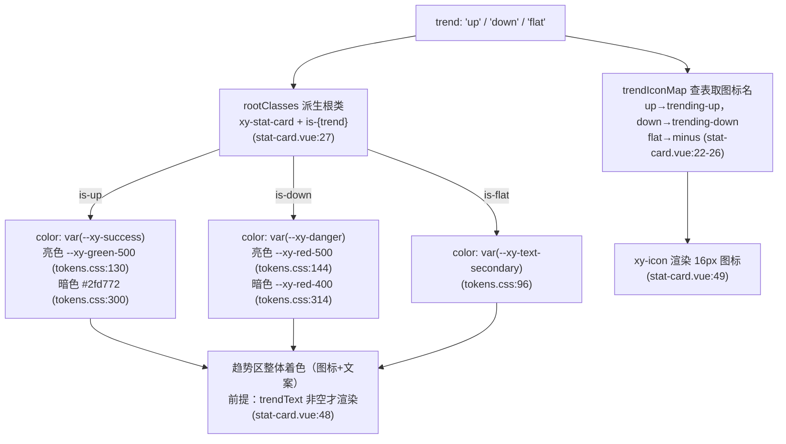
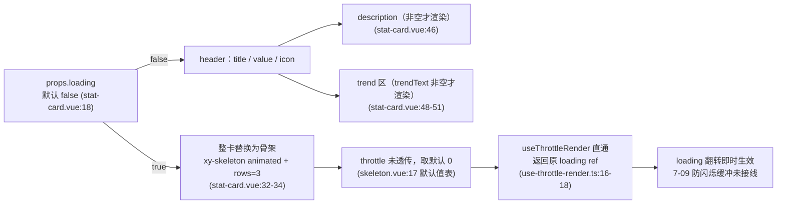

# 9-19 · StatCard：指标卡

> 本篇是 9 卷"增强层（pro-components）"的第十九篇，也是增强层"业务预设"族在专栏里的第三次正面解剖（9-11 login-form、9-16 avatar-menu、9-19 stat-card）。核心问题按大纲只有一句——**趋势展示与骨架态**——但拆开是三道题：涨跌的色彩约定到底往哪边押，中式红涨绿跌还是西式绿涨红跌；loading 骨架是整卡替换还是局部占位；以及 7-09 精心炼制的那套节流防闪烁协议，有没有被这颗最典型的"装载型卡片"接上。三道题全部实码定论，行号逐一核对过当前工作区。顺手必须回答的另一道必答题，是大纲给本篇指定的前置依赖——与 8-01《Statistic：数值呈现》的竞品定性，答案就藏在 import 清单里。

## 一、111 行的体量账本与"page"归属

先交代体量，给全文一个标尺：`stat-card` 组件目录四个文件加起来 111 行——`src/stat-card.ts` 13 行（纯类型）、`src/stat-card.vue` 55 行（唯一实现，脚本段 28 行 + 模板段 26 行）、`index.ts` 9 行（安装入口）、`__tests__/stat-card.spec.ts` 34 行（两个用例）；样式住在 `packages/theme/src/pro/stat-card.css`（74 行），经 `packages/pro-components/style.css:18` 的 `@import` 汇入。111 行，比 9-16 的 avatar-menu（113 行）还小两行，接棒成为增强层正面解剖样本里的最小——约为 9-11 LoginForm（413 行）的四分之一。`git log --follow` 显示它同样只历经三次提交（`3622d97` admin 能力集成初生、`323e9a7`、`dc9ca28` 依赖治理），实现正文至今没有结构性重构。

它在清单里的归属有个容易被一眼扫过的细节（`packages/pro-components/component-manifest.json:130-137`）：

```json
  {
    "name": "stat-card",
    "docsGroup": "page",
    "docsText": "StatCard 指标卡片",
    "installExports": ["XyStatCard"],
    "installChecks": [{ "kind": "component", "name": "xy-stat-card" }],
    "styleImports": ["stat-card"]
  },
```

`docsGroup` 是 `"page"`，不是 `"data"`。一个展示数字的卡片，没有归进数据展示组，而是归进了 page 家族——这与 9-14 的 page-header、9-15 的 page-container 同组。这个归类不是误放，而是定位声明：stat-card 是**页面级的指标卡**，服务对象是 admin 首屏、列表页顶部的 KPI 条、运营看板的第一行——它是"页面骨架"的一部分，而不是图表体系（8-11 charts）的一员。9-14 拆页头时已经记录过它与 page 家族唯一的类型层连线：`stat-card.ts:1` 从 page-header 借走了 `PageIcon` 别名。本篇第一节就把这 13 行类型文件摊开看。

安装入口是标准三件套（`packages/pro-components/stat-card/index.ts:1-9`）：

```ts
import StatCard from "./src/stat-card.vue";
import type { StatCardProps, StatTrend } from "./src/stat-card";
import { withInstall } from "xiaoye-primitives";

export type { StatCardProps, StatTrend };

export const XyStatCard = withInstall(StatCard, "xy-stat-card");
export default XyStatCard;
```

值导出走 `packages/pro-components/exports.ts:17` 的 `export { XyStatCard } from "./stat-card"`，类型导出走 `packages/pro-components/index.ts:75-78` 的 `StatCardProps` + `StatTrend` 白名单——按 9-01 立的规矩，`StatTrend` 是这个组件的"主数据类型"，有资格上根入口；而 props 的字段级细节没有外溢。类型测试夹具 `tests/types/fixtures/xiaoye-pro-components.ts` 里给它记了四笔（`:30` 值导入、`:77` 类型导入、`:214-224` 的 `statTrend`/`statCardProps` 构造、`:444` 的 `void XyStatCard` 断言），与安装断言（`installChecks` 的 `xy-stat-card`）一起构成三层守卫。

## 二、13 行类型文件：三态枚举与别名借线

类型文件全文如下（`packages/pro-components/stat-card/src/stat-card.ts:1-13`）：

```ts
import type { PageIcon } from "../../page-header";

export type StatTrend = "up" | "down" | "flat";

export interface StatCardProps {
  title?: string;
  value?: string | number;
  description?: string;
  icon?: PageIcon;
  trend?: StatTrend;
  trendText?: string;
  loading?: boolean;
}
```

十三个行数里值得停下来的是三处。

**第一处是 `StatTrend`（`:3`）的"三态"选择。** 趋势不是布尔（`increasing?: boolean` 表达不了"持平"），也不是数字（`trendPercent?: number` 会把方向判定权收进组件——涨跌的正负号语义在不同业务里根本不同：退款额下降是好事，成交额下降是坏事）。三态字符串枚举把"方向"作为一个显式的、可枚举的业务语义交上来，组件只负责按方向查表渲染，不做任何数值推断。`"flat"` 的存在让"持平"成为一等公民，而不是逼业务用 `undefined` 或空串去凑一个怪态——这与 8-04 Steps 的状态派生、7-01 Alert 的语义色派生是同一种设计直觉：**把离散的语义空间放进类型层，让 CSS 的 `is-*` 类与之一一对应**。

**第二处是 `icon?: PageIcon`（`:9`）的别名借线。** 9-14 已经把这条线讲透：`PageIcon` 在 page-header.ts:1 的定义就是 `string`，stat-card 借的不是类型，是"字符串图标名"这个仓库级约定的别名锚点——图标协议若升级，改一行别名定义，两个组件同步迁移。本篇补一个当时的旁证之外的新观察：stat-card 是 PageIcon 的**唯一**跨组件消费方（另一处出现只在根入口 `packages/pro-components/index.ts` 对 page-header 的类型转发，不算组件间消费），也就是说这条防腐层的覆盖面恰好是"页头图标座 + 指标卡图标座"两处——这两个位置恰好是后台页面里仅有的两个"圆底图标座"，约定的边界与视觉事实重合。

**第三处是 `value?: string | number`（`:7`）。** 它与 8-01 statistic 的 `value?: number | string`（`packages/components/statistic/src/statistic.ts:8`）在类型签名上完全同构——这不是巧合，而是"竞品定性"的第一个伏笔：两个组件都承认指标值的原始形态既可能是格式化好的字符串（`"128,000"`）也可能是裸数字（`128000`）。至于两个组件拿到这个值之后分道扬镳的做法，第五节展开。

七个 prop，全部可选，无插槽、无事件、无 expose——55 行实现里没有 `defineSlots`、没有 `defineEmits`、没有 `defineExpose`。stat-card 是一个**纯投影组件**：props 进，DOM 出，实例上没有任何可编程接口。这为第三、四节的两个核心问题划定了讨论边界：趋势怎么渲染、骨架怎么替换，全部发生在 props 到 DOM 的单向管道里。

## 三、趋势展示：查表、派生类与色向定论

脚本段全文只有 28 行（`packages/pro-components/stat-card/src/stat-card.vue:1-28`）：

```ts
<script setup lang="ts">
import { computed } from "vue";
import { useNamespace } from "xiaoye-primitives";
import { XyIcon, XySkeleton } from "xiaoye-components";
import type { StatCardProps, StatTrend } from "./stat-card";

defineOptions({
  name: "XyStatCard"
});

const props = withDefaults(defineProps<StatCardProps>(), {
  title: "",
  value: "",
  description: "",
  icon: "",
  trend: "flat",
  trendText: "",
  loading: false
});

const ns = useNamespace("stat-card");
const trendIconMap: Record<StatTrend, string> = {
  up: "mdi:trending-up",
  down: "mdi:trending-down",
  flat: "mdi:minus"
};
const rootClasses = computed(() => [ns.base.value, `is-${props.trend}`]);
</script>
```

趋势展示的全部机制就在这 28 行里，一共三步。

**第一步，图标查表（`:22-26`）。** `trendIconMap` 是一个 `Record<StatTrend, string>` 的穷举映射：up 对 `mdi:trending-up`，down 对 `mdi:trending-down`，flat 对 `mdi:minus`。穷举类型保证了三态必有图标可查——将来 `StatTrend` 若扩了第四态，这个 Record 的类型检查会立刻报缺 key，查表法在类型层是自守的。三枚图标全部来自 mdi 图标集，走 5-01 拆过的 `XyIcon` 字符串入口（模板里 `:size="16"`，`stat-card.vue:49`）。

**第二步，根类派生（`:27`）。** `rootClasses` 把 trend 直接插值成 BEM 修饰类：`` `is-${props.trend}` ``。由于 `props.trend` 的类型被收窄到三态枚举，这个模板字符串不是类名注入风险——它的取值空间在编译期就被钉死为 `is-up` / `is-down` / `is-flat` 三种。**色彩映射因此没有写进 JS，而是押在了 CSS 侧的根类选择器上**——这是本节最关键的一个架构决定，动画般的三级跳：props 的字符串语义 → 根元素的 `is-*` 修饰类 → 样式层的选择器着色。JS 只搬运语义，颜色全部留在 CSS。

**第三步，CSS 落色，也就是色向的实码定论。** `packages/theme/src/pro/stat-card.css:59-69`：

```css
.xy-stat-card.is-up .xy-stat-card__trend {
  color: var(--xy-success);
}

.xy-stat-card.is-down .xy-stat-card__trend {
  color: var(--xy-danger);
}

.xy-stat-card.is-flat .xy-stat-card__trend {
  color: var(--xy-text-secondary);
}
```

**定论：本库押的是西式约定——涨绿跌红。** up 挂 `--xy-success`，down 挂 `--xy-danger`，flat 挂次级文字色。追到令牌唯一事实源 `packages/xiaoye-primitives/src/theme/tokens.css`，`--xy-success` 亮色取自 `var(--xy-green-500)`（`:130`）、`--xy-danger` 亮色取自 `var(--xy-red-500)`（`:144`）；切到暗色主题，`--xy-success` 换成明度更高的 `#2fd772`（`:300`）、`--xy-danger` 降到 `--xy-red-400`（`:314`）——同一套语义映射在双主题下各自校准了明度，色向本身不变。

这个押注值得多说两句，因为它是中文世界里真实存在的文化分歧：A 股行情软件和中文财经媒体的习惯是**红涨绿跌**（红是吉、是上扬），而国际惯例是**绿涨红跌**（绿是 go、是利好）。stat-card 没有做任何本地化开关，直接锚定了后者。这个选择与令牌体系的出身一致——3-04 讲过，整套语义令牌以 Stripe 设计语言为蓝本，`success`/`danger` 是**结果好坏的语义色**，不是**行情方向的行情色**。把"涨=绿"焊死，等价于在令牌层声明了"方向默认映射到好坏"；这条隐含公理在通用后台（成交额、转化率、增长率）里成立，在证券行情场景里会被击穿——第八节缺口记账里有一条专门留给它。

把三步合起来画成图，趋势从 prop 到像素的完整链路是：



这张图还暴露了 trend 机制的最后一个细节：**趋势区的渲染门槛在 `trendText` 而不在 `trend`**（`stat-card.vue:48-51` 的 `v-if="props.trendText"`）。trend 只管方向语义（图标 + 色向），文案完全由 `trendText` 提供——"环比 +12%"、"环比 -4%"、"同比持平"，组件一概原样渲染，**既不算同比环比，也不解析百分号，更不校验文案与方向是否一致**。你完全可以传 `trend="up"` 配 `trendText="环比 -4%"`，组件照单全收——绿色向上箭头配一个负号文案。文档把这层分工写得很直白（`apps/docs/pro-components/stat-card.md:27`）：trend "仅影响趋势区图标与强调色"。语义与文案的解耦是刻意的：方向判定权在业务手里，组件拒绝对业务数据做价值判断（退一步说，它也判不了——"下降"是好是坏只有业务知道）。代价是两个 prop 之间存在不一致的自由空间，测试与文档都没有拦截，这条也记进第八节。

## 四、骨架态：整卡替换与未接线的节流

核心问题的另一半在 loading。模板段全文如下（`packages/pro-components/stat-card/src/stat-card.vue:30-55`）：

```html
<template>
  <article :class="rootClasses">
    <template v-if="props.loading">
      <xy-skeleton animated :rows="3" class="xy-stat-card__skeleton" />
    </template>
    <template v-else>
      <div class="xy-stat-card__header">
        <div>
          <small v-if="props.title" class="xy-stat-card__title">{{ props.title }}</small>
          <strong class="xy-stat-card__value">{{ props.value }}</strong>
        </div>
        <div v-if="props.icon" class="xy-stat-card__icon">
          <xy-icon :icon="props.icon" :size="20" />
        </div>
      </div>

      <p v-if="props.description" class="xy-stat-card__description">{{ props.description }}</p>

      <div v-if="props.trendText" class="xy-stat-card__trend">
        <xy-icon :icon="trendIconMap[props.trend]" :size="16" />
        <span>{{ props.trendText }}</span>
      </div>
    </template>
  </article>
</template>
```

三个观察，从结构到协议。

**观察一：根元素是 `article`，且在 loading 前后恒定存在。** 增强层容器类组件的根元素已经见惯了 `div` 与 `section`（page-container、page-toolbar、login-form 的根都是 `<section>`），stat-card 却选择了 `article`——全库检索 `<article`，它还是唯一的现身。一个卡片就是一个独立成篇的内容单元，语义化元素的选用与内容语义对齐。更重要的是分支结构：`v-if / v-else` 挂在 `<template>` 上，二分的是**卡片的内部内容**，根元素本身不参与分支。这意味着 loading 翻转的瞬间，`xy-stat-card` 根节点连同它的 `is-up/is-down/is-flat` 类、边框、渐变背景、圆角、投影全部原地不动，换掉的只是里面的填充物——外层布局零位移（根元素尺寸由外层网格决定，见第六节），是骨架替换里"壳不动、瓤动"的正确姿势。

**观察二：整卡替换，不是局部占位。** loading 为真时，标题、数值、图标、说明、趋势**全部**消失，换成一根本不分区的段落骨架（`:33`）：`<xy-skeleton animated :rows="3" />`。这里有一连串实码细节值得逐个点验：

- **消费的确实是基础层 skeleton**（7-09 的主角）：`stat-card.vue:4` 的 `import { XyIcon, XySkeleton } from "xiaoye-components"`——增强层消费基础层的又一条实证，与 async-state-container 消费 `XyEmpty`/`XyText`/`XyButton` 是同一模式。
- **分支做在 stat-card 自己身上，而不是用 skeleton 的包裹用法。** XySkeleton 原生支持 `<xy-skeleton :loading="x"><content/></xy-skeleton>` 的插槽协议（`packages/components/skeleton/src/skeleton.vue:76` 的 `<slot v-else v-bind="attrs" />`），stat-card 却选择了自己 `v-if`。原因不难推断：包裹用法会把真实内容作为默认插槽塞进 skeleton 组件内部，stat-card 的 article 结构会被拉进 skeleton 的渲染函数里；而"根类 + 壳样式"必须留在 stat-card 自己手里（骨架期根上还挂着 `is-flat` 之类的趋势类）。自己分支，壳与瓤的所有权都干净。
- **没有传 `template` 插槽，走的是 skeleton 的默认段落形态。** 看 skeleton 的默认渲染分支（`packages/components/skeleton/src/skeleton.vue:62-73`）：

```html
      <template v-else>
        <XySkeletonItem :class="ns.is('first', true)" variant="p" />
        <XySkeletonItem
          v-for="row in normalizedRows"
          :key="row"
          :class="[
            `${ns.base.value}__paragraph`,
            ns.is('last', row === normalizedRows && normalizedRows > 1)
          ]"
          variant="p"
        />
      </template>
```

`rows=3` 实际渲染**四根**段落条：一根 `is-first`（宽度 33%，`packages/theme/src/components/skeleton.css:45-47`，形态上巧似"标题行"），加三根满宽段落（最后一根 61% 宽，`skeleton.css:49-51`，收尾形态）。加上 `animated` 后走流光动画——每根条铺一层三段式渐变再平移背景位（`packages/theme/src/components/skeleton.css:25-34`）：

```css
.xy-skeleton.is-animated .xy-skeleton__item {
  background: linear-gradient(
    90deg,
    var(--xy-skeleton-color) 25%,
    var(--xy-skeleton-to-color) 37%,
    var(--xy-skeleton-color) 63%
  );
  background-size: 400% 100%;
  animation: xy-skeleton-loading 1.6s ease infinite;
}
```必须承认：这个骨架形状与真实卡片（大号数值 + 圆形图标座 + 趋势短行）并不形似——skeleton 本支持 `template` 插槽定制骨架版型，stat-card 没有用。为什么？第八节权衡账本里算这笔账。

- **骨架对辅助技术不可见。** 每根骨架条都带 `aria-hidden="true"`（`packages/components/skeleton/src/skeleton-item.vue:23`），屏幕阅读器在 loading 期听到的是安静的空白而不是三根"无意义的横条"——这个可及性红利是消费基础层白拿的。
- **高度锚定。** `packages/theme/src/pro/stat-card.css:71-73` 给骨架容器加了 `min-height: 96px`：骨架期卡片不至于塌缩成一薄条，数据到达后卡片高度跳变被压到最小。96px 这个数没有出处注释，量级上约等于 title + value 两行的自然高度。

**观察三——本节最重要的实码定论：7-09 的节流协议没有被接线。** 考据里最悬而未决的问题是"loading 骨架态是否消费了 7-09 的节流"。逐行核对三个文件，结论分两层：

1. **消费了 skeleton 的"形态"，没有消费 skeleton 的"节流"。** stat-card 传给 `xy-skeleton` 的 props 只有两个：`animated` 和 `:rows="3"`（`stat-card.vue:33`）。skeleton 的节流入口 `throttle`（`packages/components/skeleton/src/skeleton.ts:16`）没有被传入，落到默认值表里的 `throttle: 0`（`skeleton.vue:17`）。
2. **throttle 为 0 时，节流器直通。** skeleton 内部 `const uiLoading = useThrottleRender(toRef(props, "loading"), props.throttle)`（`skeleton.vue:37`），而 `useThrottleRender` 的头三行就是短路（`packages/xiaoye-primitives/src/composables/use-throttle-render.ts:12-23`）：

```ts
export function useThrottleRender(
  loading: Ref<boolean>,
  throttle: ThrottleType = 0
) {
  if (throttle === 0 || throttle === undefined) {
    return loading;
  }

  const initialValue =
    typeof throttle === "object" && throttle !== null ? Boolean(throttle.initVal) : false;
  const throttled = ref(initialValue);
  let timeoutId: ReturnType<typeof setTimeout> | null = null;
```

`throttle === 0` 直接返回原 `loading` ref——7-09 用八十行换来的 leading/trailing 可换向延迟门，在 stat-card 的消费现场被一个默认值旁路了。作为对照，把那扇被旁路的门本体也调出来看一眼（`packages/xiaoye-primitives/src/composables/use-throttle-render.ts:66-79`）——若 stat-card 传了非零 throttle，loading 的每次翻转将走进这段换向逻辑而不是直通：

```ts
  onMounted(() => {
    trigger("leading");
  });

  watch(
    () => loading.value,
    (value) => {
      trigger(value ? "leading" : "trailing");
    }
  );

  onBeforeUnmount(() => {
    clearTimer();
  });
```

loading 何时翻真、何时翻假，骨架就何时出现、何时消失，**没有任何防闪烁缓冲**。完整的态流如下：



这是缺口还是留白？第八节给结论。先把节奏交给第五节——stat-card 与 statistic 的那场必答题。

## 五、竞品定性：statistic 是格式化引擎，stat-card 是卡片驾驶舱

大纲把 8-01 定为本篇前置依赖，矩阵条目写得更直白（`column/01-知识点全集矩阵.md:194`）："指标卡趋势与骨架（**与 statistic 竞品定性** + trend 三态语义色）"。实码给的定论分三句。

**第一句：stat-card 不消费 statistic。** `stat-card.vue:2-5` 的完整 import 清单里只有 `vue`、`useNamespace`、`XyIcon`、`XySkeleton`——没有任何一行指向 `packages/components/statistic`。两个组件在运行时零耦合，唯一的交集是 `value?: string | number` 这条同构的类型签名。

**第二句：两者的分工是"数字的两种命运"。** statistic 的全部存在意义是把一个数变成好看的文本——精度、千分位、小数分隔符、自定义 formatter，核心管道 22 行（`packages/components/statistic/src/statistic.vue:45-66`）：

```ts
const displayValue = computed(() => {
  if (props.formatter) {
    return props.formatter(props.value);
  }

  if (typeof props.value !== "number" || Number.isNaN(props.value) || !Number.isFinite(props.value)) {
    return props.value;
  }

  const normalizedPrecision = normalizePrecision(props.precision);
  const [integerPart, decimalPart = ""] = props.value
    .toFixed(normalizedPrecision)
    .split(".");

  const groupedInteger = integerPart.replace(/\B(?=(\d{3})+(?!\d))/g, props.groupSeparator);

  if (!decimalPart) {
    return groupedInteger;
  }

  return `${groupedInteger}${props.decimalSeparator}${decimalPart}`;
});
```

stat-card 对这个管道**一个字符都没有复用**：`stat-card.vue:39` 的 `<strong class="xy-stat-card__value">{{ props.value }}</strong>` 是赤裸裸的插值直出，`128000` 进来就渲染 `128000`，不会长出千分位。官方示例于是只能预格式化——`apps/docs/examples/pro/stat-card/basic.vue:5` 传的 value 是字符串 `"128,000"`，逗号是人肉敲进去的。定位差异由此清晰：**statistic 管的是"一个数怎么变成好看的文本"（格式化引擎），stat-card 管的是"一个指标在卡片语境里怎么被组织"（标题座、数值座、图标座、说明、趋势、骨架七个生态位）**。前者是纯函数管道，后者是版位容器。文档给 stat-card 的定位语也划了同一条线（`apps/docs/pro-components/stat-card.md:9`）：它"只承接数值、说明、趋势和图标，不额外引入异步协议或图表布局心智"。

顺带暴露一个真实的组合缺口：stat-card 的数值座不支持插槽，`xy-statistic` 塞不进去——想让指标卡里的数字滚出千分位，只能业务侧先用 statistic（或任何格式化手段）算好字符串再喂给 value。value 若支持 `#value` 插槽，这两个组件就能纵向咬合；目前它们是**并列竞品**而非上下游——statistic 自带 title/prefix/suffix 三个插槽（`statistic.vue:23-27`），能自己长成一个轻量指标块，与 stat-card 的 props 面形成两条路线：**引擎开放插槽，预设收敛 props**。这也是"业务预设"族的一贯哲学（9-11 立过案）：预设的价值在零心智，一旦 value 插槽化了，stat-card 就开始向"mini-card"漂移，预设浓度立刻稀释。

**第三句：生态对照。**（先声明依据，沿用本专栏惯例：本地未安装 Element Plus 与 antd，以下以双方公开源码与官方文档为参照，写作时逐项核对。）**Element Plus 没有 StatCard 这样的业务预设组件**——它的组件清单里最接近的只有 `el-statistic`（数据展示）与 `el-card`（容器），且 `el-statistic` 与本库 statistic 一样是纯格式化引擎：value/precision/formatter/value-style 一路，**没有任何 trend、趋势、涨跌方向的 prop**。EP 生态里要搭一块指标卡，标准写法是三件手拼：`el-card` 出壳、`el-statistic` 出数、趋势标记用 `el-tag type="success|danger"`（或 `el-icon` 的 CaretTop/CaretBottom）加文案自由组合——方向判定与色彩语义全部留在业务模板里，每写一个看板页就重抄一遍。本库把这套高频组合收编成了 55 行组件：壳、数、向、色、骨架五件事一个 props 面交代完。再往外看一眼，React 生态倒是有先例——蚂蚁系 @ant-design/pro-components 里有 StatisticCard 一类的看板预设（以官方文档为参照，支持指标与图表区域的组合），说明"预设层做指标卡"这条路并非本库独创，而是企业级组件库演进的常见归宿；EP 只是至今没有走到这一步。至于骨架的节流，EP 的 `el-skeleton` 同样提供 throttle 式的渲染延迟（公开文档参照），与本库 7-09 同题异构——但无论哪一家，把节流接进"预设卡片"这一步，两家都还没做。

## 六、74 行样式：双层渐变、图标座与三处字面量

样式全文如下（`packages/theme/src/pro/stat-card.css:1-74`）：

```css
.xy-stat-card {
  display: flex;
  flex-direction: column;
  gap: var(--xy-space-3);
  padding: var(--xy-space-4);
  border: 1px solid var(--xy-border);
  border-radius: var(--xy-radius-lg);
  background:
    linear-gradient(180deg, color-mix(in srgb, var(--xy-bg-container) 94%, var(--xy-mix-light)), var(--xy-bg-container)),
    radial-gradient(circle at top right, color-mix(in srgb, var(--xy-brand) 8%, transparent), transparent 48%);
  box-shadow: var(--xy-shadow-1);
}

.xy-stat-card__header {
  display: flex;
  align-items: flex-start;
  justify-content: space-between;
  gap: var(--xy-space-3);
}

.xy-stat-card__title {
  display: block;
  color: var(--xy-text-secondary);
  font-size: var(--xy-font-size-sm);
}

.xy-stat-card__value {
  display: block;
  margin-top: 6px;
  color: var(--xy-text-primary);
  font-size: 28px;
  line-height: 1.1;
}

.xy-stat-card__icon {
  display: inline-flex;
  align-items: center;
  justify-content: center;
  width: 40px;
  height: 40px;
  border-radius: var(--xy-radius-pill);
  background: color-mix(in srgb, var(--xy-brand) 10%, var(--xy-mix-light));
  color: var(--xy-brand);
}

.xy-stat-card__description {
  margin: 0;
  color: var(--xy-text-secondary);
}

.xy-stat-card__trend {
  display: inline-flex;
  align-items: center;
  gap: 6px;
  font-size: var(--xy-font-size-sm);
  font-weight: var(--xy-font-weight-semibold);
}

.xy-stat-card.is-up .xy-stat-card__trend {
  color: var(--xy-success);
}

.xy-stat-card.is-down .xy-stat-card__trend {
  color: var(--xy-danger);
}

.xy-stat-card.is-flat .xy-stat-card__trend {
  color: var(--xy-text-secondary);
}

.xy-stat-card__skeleton {
  min-height: 96px;
}
```

两个视觉构造值得一提。**其一是根元素的双层背景（`:8-10`）**：一层自上而下的 linear-gradient，用 `color-mix` 把容器底色兑进 6% 的亮色做出极浅的纵向渐变；再叠一层右上角的 radial-gradient，把品牌色以 8% 的浓度晕开在卡片右上角，48% 处淡出。这在 74 行的体量里是最"贵"的一笔——一个默认态就带品牌氛围的卡片壳，看板上一排卡片铺开时右上角有连绵的光晕。**其二是 40px 圆形图标座（`:35-44`）**：`--xy-radius-pill`（999px，`tokens.css:234`）出正圆，底色是品牌色 10% 兑 `--xy-mix-light`，前景品牌色——而 `--xy-mix-light` 正是 3-03 讲过的双主题反转轴：亮色主题下是纯白（`tokens.css:254`），暗色主题下反转成容器底色（`tokens.css:344`），于是"品牌色兑 10% 亮色"这个配方在两个主题下都不需要写第二份。根背景、图标座、趋势色三处的暗色适配全部由令牌层自动完成，组件样式零主题分支。

消费令牌的清单很长：`--xy-space-3/4`（`tokens.css:239-240`）、`--xy-border`（`:113`/暗 `:283`）、`--xy-radius-lg`（`:232`）、`--xy-bg-container`（`:107`/暗 `:277`）、`--xy-shadow-1`（`:167`/暗 `:335`）、`--xy-text-primary/secondary`（`:95-96`/暗 `:265-266`）、`--xy-font-size-sm`（`:202`）、`--xy-font-weight-semibold`（`:214`）、`--xy-brand`（`:121`/暗 `:291`）、`--xy-success/danger`（`:130`/`:144`，暗 `:300`/`:314`）。按 3-05 的刻度纪律核对，仍有三处字面量溜网：`__value` 的 `font-size: 28px` 与 `margin-top: 6px`（`:29-31`）、`__trend` 的 `gap: 6px`（`:54`）。28px 的指标大字在语义刻度里没有对应档位（`--xy-font-size-*` 最大到常规正文档），6px 间距则卡在 4px 网格的半档上——与 8-01 结尾记账的"文档变量表漂移"同族，属于令牌纪律的长尾，记入第八节缺口清单。

## 七、34 行测试与 51 行示例：钉子与留白

测试全文（`packages/pro-components/stat-card/__tests__/stat-card.spec.ts:1-34`）：

```ts
import { mount } from "@vue/test-utils";
import { describe, expect, it } from "vitest";
import { XyStatCard } from "@xiaoye/pro-components";

describe("XyStatCard", () => {
  it("支持标题、数值、图标和趋势文案渲染", () => {
    const wrapper = mount(XyStatCard, {
      props: {
        title: "本周成交额",
        value: "128,000",
        description: "较上周增长明显",
        icon: "mdi:cash-multiple",
        trend: "up",
        trendText: "环比 +12%"
      }
    });

    expect(wrapper.text()).toContain("本周成交额");
    expect(wrapper.text()).toContain("128,000");
    expect(wrapper.text()).toContain("环比 +12%");
    expect(wrapper.classes()).toContain("is-up");
  });

  it("loading 状态显示骨架占位", () => {
    const wrapper = mount(XyStatCard, {
      props: {
        loading: true
      }
    });

    expect(wrapper.find(".xy-stat-card__skeleton").exists()).toBe(true);
  });
});
```

两个用例，与 9-16 的 31 行测试同一风格：第一颗钉子打结构面（四段文案进得来、出得去，加上 `is-up` 根类这条本篇第三节那条"props → 派生类"链路的唯一断言），第二颗钉子打骨架态的存在性。留白也同样清晰：`is-down` / `is-flat` 没有对称用例；趋势色是 CSS 层行为，单测管不到——视觉巡检倒是会覆盖它（`pnpm audit:visual` 的页面清单由 manifest 驱动，`scripts/visual-audit.mjs:44-54`，`/pro-components/stat-card` 页的 demo 在浅暗双主题下逐个截图，`visual-audit.mjs:98`），但截图只进画廊供人工比对，没有对趋势色的程序化断言；`trend` 与 `trendText` 不一致时组件照常渲染的行为没有负向用例；骨架的 `rows=3`、`animated` 透传没有断言。对一个 55 行的纯投影组件，这个覆盖浓度与组件的风险面大体匹配——它没有状态机、没有事件、没有异步，能坏的只有"props 到 DOM 的投影"本身。

文档示例全文（`apps/docs/examples/pro/stat-card/basic.vue:1-51`）：

```vue
<script setup lang="ts">
const cards = [
  {
    title: "本周成交额",
    value: "128,000",
    description: "较上周继续提升",
    icon: "mdi:cash-multiple",
    trend: "up" as const,
    trendText: "环比 +12%"
  },
  {
    title: "退款申请",
    value: 18,
    description: "需要关注异常退款单",
    icon: "mdi:cash-refund",
    trend: "down" as const,
    trendText: "环比 -4%"
  },
  {
    title: "待处理工单",
    value: 36,
    description: "今日排班稳定",
    icon: "mdi:clipboard-text-clock-outline",
    trend: "flat" as const,
    trendText: "环比持平"
  }
];
</script>

<template>
  <div
    style="
      display: grid;
      grid-template-columns: repeat(auto-fit, minmax(220px, 1fr));
      gap: 16px;
    "
  >
    <xy-stat-card
      v-for="card in cards"
      :key="card.title"
      :title="card.title"
      :value="card.value"
      :description="card.description"
      :icon="card.icon"
      :trend="card.trend"
      :trend-text="card.trendText"
    />
    <xy-stat-card title="数据装载中" loading />
  </div>
</template>
```

示例在 51 行里埋了四个教学点：三张卡分别演示 up / down / flat 三态（`trend` 用 `as const` 钉住字面量类型）；value 一边是字符串 `"128,000"` 一边是数字 `18`——正是第二节说的双形态，也顺手演示了"千分位要自己带"的现实；外层 `grid-template-columns: repeat(auto-fit, minmax(220px, 1fr))` 是指标卡条的标准打开方式，也解释了第六节"根元素尺寸由外层网格决定"的分工；第四张 `<xy-stat-card title="数据装载中" loading />` 只给 title 配 loading——不过对照模板会发现一个微妙细节：loading 为真时 title 其实**不会**渲染（整卡替换，`stat-card.vue:32-34`），这个 prop 在骨架期是静默无效的，示例的写法多少有点语义误导。另一个消费事实：组合级示例 `apps/docs/examples/admin.md` 全文检索不到 `xy-stat-card`——这颗为 admin 看板而生的卡片，在 admin 组合示例里还没有一席之地（page-header、page-container 都已在场），推广欠账一条。

## 八、权衡账本与缺口记账

把散落在各节的取舍收拢成账，本篇正面立账四条，留缺口四条。

**权衡一：趋势三态枚举，还是方向自动推断。** 用 `"up" | "down" | "flat"` 显式枚举，组件不做任何数值推断，方向判定权完全留给业务。反面方案是收一个数字 prop 由组件按正负判向——代码更省，但"正负=好坏"的映射会被退款额、故障数这类反向指标击穿，而且"持平"没有自然的数字表达。枚举方案的代价是 trend 与 trendText 双 prop 可能互相矛盾（第三节演示过），组件选择不校验——语义一致性是业务的债，不是组件的。

**权衡二：色向押西式（绿涨红跌），并把方向焊在语义色上。** 实码定论在第三节：is-up→success、is-down→danger。这个选择与令牌体系的 Stripe 血统一致，与国际化默认一致，但有两个连带的代价：其一，A 股语境的业务方拿到的是反直觉的默认值，需要自行覆盖 CSS；其二，更隐蔽的——映射焊死的是"方向→好坏"这条公理，"坏消息的上涨"（错误率上升）会被默认渲染成 success 绿。stat-card 没有提供 `trendColor` 之类的逃生 prop，覆盖只能走 CSS（根类选择器或令牌局部覆写）。一个 55 行的预设选择"不背这个配置面"，账面上说得过去，但逃生口的缺席值得记账。

**权衡三：整卡骨架替换，而非局部占位或定制版型。** loading 一真，全部内容换成四根通用段落条。反面方案有二：只给 value 座局部占位（信息半真半假，title 是真的、数是假的，容易诱导用户误读）；或用 skeleton 的 `template` 插槽定制"标题条 + 大数值块 + 短趋势条"的形似骨架（效果最佳，但要为 74 行的组件再添一段骨架版型代码，预设浓度立刻被稀释）。实码选了最省的整卡替换，用 `min-height: 96px` 把高度跳变钉住，用 `aria-hidden` 把可及性兜住——骨架的"形似"被牺牲了，换来的是预设组件最看重的零配置。

**权衡四：节流协议不透传，loading 直通。** 这是第四节的定论。stat-card 的典型场景是看板首屏的一次性装载：进页面 loading 为真，数据到达翻假，一生只翻转一次，抖动窗口趋近于零——7-09 防的"缓存命中闪一帧"与"竞态消失重闪"在这类场景里概率极低。为这个小概率把 `throttle` 顶上 props 面（或者内部焊一个固定延迟，让 50ms 内的数据到得再快也要白等），对预设组件都是负资产。结论：这是留白而非缺口，但它的成立依赖一个前提——**stat-card 不该被接到高频轮询或竞态频发的数据源上**；真有抖动的业务，正确姿势是在外层数据侧节流，而不是指望组件。

**缺口记账四条**（按修补成本排序）：trend/trendText 一致性无校验亦无文档警示；28px/6px 三处字面量未入令牌刻度；value 无插槽，与 statistic 纵向咬合的组合缺口；admin.md 组合示例未消费。外加一个测试留白：is-down/is-flat 无对称断言。这份清单与 8-01 结尾的遗留缺口清单一样，是"第二轮修整"的现成起点。

## 九、收束：从单态分支到三态协议

把本篇的结论压回一句话：stat-card 用 111 行回答了"一个指标怎么被摆进卡片"——趋势是三态枚举经查表与派生类落到语义色上的投影（西式绿涨红跌，双主题自校准），骨架是整卡替换、高度锚定、辅助技术不可见的壳内换瓤，而 7-09 的节流协议在默认值处直通——这是审慎的留白，代价写进了使用前提。它与 8-01 statistic 的竞品定性也就此了结：一个做引擎、一个做驾驶舱，运行时零耦合，类型签名遥相致意。

下一篇按大纲推进到 9-20《AsyncStateContainer：三态容器》（`column/02-分卷大纲.md:174`），核心问题是"**loading/empty/error 的统一协议**"。本篇已经埋好了它的引线：stat-card 的 loading 是**单态分支**——一个布尔、两个世界、整卡替换；而 9-20 要拆的 `xy-async-state-container`（实码 52 行，`packages/pro-components/async-state-container/`）把同一道分支题升级成**三态优先级协议**——`loading` / `error` / `empty` 三个 prop 的判定顺序、`retry` 事件怎么把"失败"变成可恢复的动作、`XyEmpty` 与 `XyText` 的消费怎么把三态的默认视觉托付给基础层（它的三个默认态值 `emptyTitle: "暂无数据"`、`loadingText: "正在加载数据"` 已经在类型文件里待命）。stat-card 管"一个指标怎么摆"，async-state-container 管"一块区域的三态怎么切"——下一篇，看预设层怎么把 if-else 三连写成协议。

---

### 附：本篇引用路径与行号核对清单

| 引用 | 位置 |
| --- | --- |
| 组件类型文件全文（StatTrend、StatCardProps、PageIcon 借线） | `packages/pro-components/stat-card/src/stat-card.ts:1-13` |
| script 段全文（import、默认值表、trendIconMap、rootClasses） | `packages/pro-components/stat-card/src/stat-card.vue:1-28` |
| template 段全文（loading 二分 32-34、value 直出 39、trend 区 48-51） | `packages/pro-components/stat-card/src/stat-card.vue:30-55` |
| 组件入口（withInstall 与类型导出） | `packages/pro-components/stat-card/index.ts:1-9` |
| 样式全文（根 1-12、双层背景 8-10、value 27-33、图标座 35-44、趋势色 59-69、骨架高度 71-73） | `packages/theme/src/pro/stat-card.css:1-74` |
| 测试全文（结构面 6-22、骨架面 24-32） | `packages/pro-components/stat-card/__tests__/stat-card.spec.ts:1-34` |
| 文档示例全文（三态卡 2-27、网格 31-37、loading 卡 48） | `apps/docs/examples/pro/stat-card/basic.vue:1-51` |
| 文档 API（trend"仅影响图标与强调色"） | `apps/docs/pro-components/stat-card.md:9`、`:27` |
| 清单条目（docsGroup=page） | `packages/pro-components/component-manifest.json:130-137` |
| 值导出 / 类型导出 / 样式聚合 | `packages/pro-components/exports.ts:17`、`packages/pro-components/index.ts:75-78`、`packages/pro-components/style.css:18` |
| 类型夹具四处 | `tests/types/fixtures/xiaoye-pro-components.ts:30`、`:77`、`:214-224`、`:444` |
| skeleton 默认段落渲染（is-first + rows 条） | `packages/components/skeleton/src/skeleton.vue:62-73` |
| skeleton 节流入口与默认值 | `packages/components/skeleton/src/skeleton.ts:16`、`skeleton.vue:17`、`:37` |
| 节流器直通短路 / 被旁路的换向门本体 | `packages/xiaoye-primitives/src/composables/use-throttle-render.ts:12-23`（直通在 `:16-18`）、`:66-79` |
| 骨架条 aria 与样式（流光 25-34、is-first 45-47、is-last 49-51） | `packages/components/skeleton/src/skeleton-item.vue:23`、`packages/theme/src/components/skeleton.css:16-34`、`:45-51` |
| statistic 的 value 类型与格式化管道 | `packages/components/statistic/src/statistic.ts:8`、`packages/components/statistic/src/statistic.vue:45-66`（插槽 `:23-27`） |
| 趋势色令牌（亮/暗四值） | `packages/xiaoye-primitives/src/theme/tokens.css:130`、`:144`、`:300`、`:314` |
| 其余令牌锚点 | `tokens.css:95-96`、`:107`、`:113`、`:121`、`:167`、`:202`、`:214`、`:232`、`:234`、`:239-240`、`:254`；暗色 `:265-266`、`:277`、`:283`、`:291`、`:335`、`:344` |
| admin 示例未消费 | `apps/docs/examples/admin.md`（全文无 xy-stat-card） |
| 大纲与矩阵条目 | `column/02-分卷大纲.md:173-174`、`column/01-知识点全集矩阵.md:194` |
| 族谱与前篇 | `column/9-11-LoginForm-登录预设.md:7`（业务预设族立案）、`column/9-14-PageHeader-页头.md:76-84`（PageIcon 借线）、`column/7-09-Skeleton-节流防闪烁.md`（节流协议）、`column/8-01-Statistic-数值呈现.md`（格式化引擎） |
| 根元素语义对照（section 根的先例） | `packages/pro-components/page-container/src/page-container.vue:48`、`packages/pro-components/page-toolbar/src/page-toolbar.vue:38`、`packages/pro-components/login-form/src/login-form.vue:128` |
| 视觉巡检清单构建与逐 demo 截图 | `scripts/visual-audit.mjs:44-54`、`:98` |
| 体量对照（login-form 四文件 413 行） | `packages/pro-components/login-form/src/login-form.ts`（34）+ `login-form.vue`（208）+ `index.ts`（18）+ `__tests__/login-form.spec.ts`（153） |
| 9-20 实码 | `packages/pro-components/async-state-container/src/async-state-container.ts:1-8`、`async-state-container.vue:1-44` |
