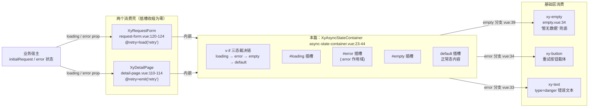
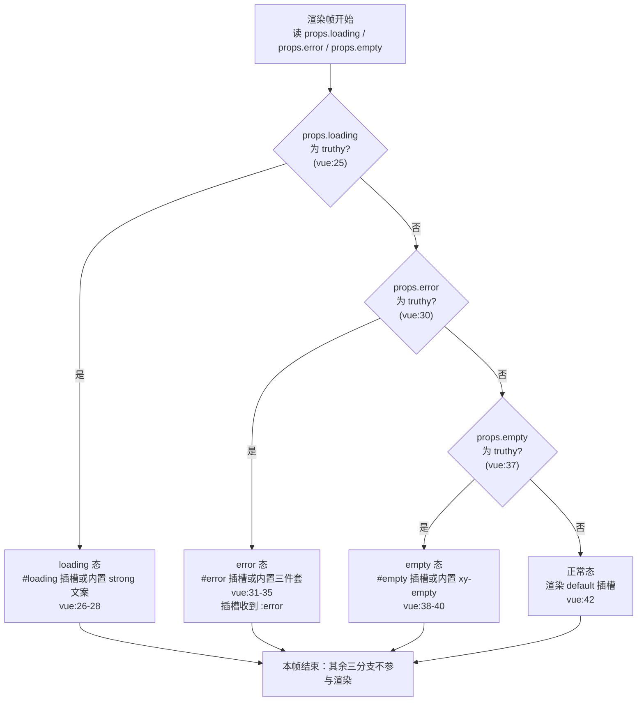

# 9-20 · AsyncStateContainer：三态容器

> 本篇是 9 卷"增强层（pro-components）"的第二十篇，按大纲（`column/02-分卷大纲.md:174`）回答的核心问题只有一句话——**loading/empty/error 的统一协议**。前置篇是 9-19《StatCard：指标卡》：骨架态在指标卡里是单组件的内嵌小戏，本篇把镜头拉远，看状态在"容器"这个层级怎么被协议化。知识点矩阵给本篇的条目（`column/01-知识点全集矩阵.md:195`）写得极其凝练："loading/empty/error 三态容器协议（v-if 裁决链 + 两消费壳插槽收缩为零）"——前半句是结构，后半句是效果，本篇的全部戏份都围着这两句转。

接到题目先复述目标：`packages/pro-components/async-state-container`（下文简称 ASC）要回答的不是"loading 怎么画"，而是**"一个数据区块在'没到 / 失败了 / 空了 / 就绪'四种处境下，由谁裁决、裁决成什么、失败之后怎么办"**。这三问的答案构成一份协议，而协议的载体小得惊人：`src/async-state-container.vue`（44 行）、`src/async-state-container.ts`（8 行）、`index.ts`（12 行）、`__tests__/async-state-container.spec.ts`（20 行）、样式 `packages/theme/src/pro/async-state-container.css`（16 行），合计恰好 100 行——比 9-15 page-container 的 196 行还少一半，是增强层里最轻的正式组件之一。但轻不等于浅：它被 request-form（9-10）与 detail-page（9-32 依赖）两个壳层消费，它的裁决顺序决定了两壳的状态呈现语义，它的 retry 事件是"三态容器区别于手写 v-if 链"的关键增量。本篇全部路径与行号逐一核对过当前工作区实态，文末附核对清单；动手前先交代一处考据校准：任务书提示样式文件"若有"——实态确认存在于 `packages/theme/src/pro/async-state-container.css`（16 行），且 `src/` 下另有一份任务书未点名的 8 行类型文件 `async-state-container.ts`，它是协议的另一半，后文全文展开。

## 一、谱系定位：协议层的第一块基石

先给全景。9 卷写到本篇，组件已经铺了三层：页面壳三件套（9-13 toolbar / 9-14 header / 9-15 container）解决"页面骨架长什么样"；组合件（9-16 avatar-menu、9-17 header-tabs、9-18 notice-center）解决"多个基础件怎么拼出一个功能域"；9-19 stat-card 解决"单个数据卡的状态内聚"。本篇的 ASC 换了一层问题域：它不提供任何视觉风格，只提供**一份裁决规则和四个插槽位**——用 9-02 的语言说，它是渲染层的协议件，request-form 与 detail-page 这两个"壳"把各自的三态呈现整体外包给它：



这张图有一个后文反复出现的注脚：两个消费壳对 ASC 的三个状态插槽**一个都没用**——request-form 的模板（`request-form.vue:120-142`）和 detail-page 的容器段（`detail-page.vue:110-190`）都只塞了 default 内容，三态视觉全吃内置实现。这就是矩阵条目里"两消费壳插槽收缩为零"的实证：协议的插槽是留给第三方的逃生门，而仓库自己的两个壳选择信任内置态。一件 44 行的组件让两位壳层同事"零定制"接入，这件事本身就是对内置态设计质量的验收。

体量账单再列一遍，方便与兄弟组件对表：ASC 自有源码 100 行（44 + 8 + 12 + 20 + 16），page-container 196 行，request-form 142 行 + 测试 68 行，detail-page 192 行 + 测试 78 行。ASC 是这条消费链上最小的节点，却是链上唯一同时决定"呈现什么"与"失败怎么办"的节点。

## 二、100 行全貌：源码逐段展开

协议的纸面先于模板。`src/async-state-container.ts` 全文 8 行：

```ts
// packages/pro-components/async-state-container/src/async-state-container.ts（全文 8 行）
export interface AsyncStateContainerProps {
  loading?: boolean;
  error?: string | null;
  empty?: boolean;
  emptyTitle?: string;
  emptyDescription?: string;
  loadingText?: string;
}
```

七个 props，分成两组：前三个是**状态声明**（loading / error / empty），后四个是**内置态文案**（emptyTitle / emptyDescription / loadingText）。注意状态组的类型不均匀——loading 与 empty 是布尔，error 却是 `string | null`。这不是随手：error 兼任"状态开关"与"错误消息"两个角色，一份类型同时填掉两格。这个"一物二用"的代价与收益，第三节展开。

主文件的全文只有 44 行，值得整段展开：

```vue
<!-- packages/pro-components/async-state-container/src/async-state-container.vue（全文 44 行） -->
<script setup lang="ts">
import { XyButton, XyEmpty, XyText } from "xiaoye-components";
import type { AsyncStateContainerProps } from "./async-state-container";

defineOptions({
  name: "XyAsyncStateContainer"
});

const props = withDefaults(defineProps<AsyncStateContainerProps>(), {
  loading: false,
  error: null,
  empty: false,
  emptyTitle: "暂无数据",
  emptyDescription: "当前条件下没有可展示的内容。",
  loadingText: "正在加载数据"
});

const emit = defineEmits<{
  retry: [];
}>();
</script>

<template>
  <div class="xy-async-state-container">
    <slot v-if="props.loading" name="loading">
      <div class="xy-async-state-container__state is-loading">
        <strong>{{ props.loadingText }}</strong>
      </div>
    </slot>
    <slot v-else-if="props.error" name="error" :error="props.error">
      <div class="xy-async-state-container__state is-error">
        <strong>加载失败</strong>
        <xy-text type="danger">{{ props.error }}</xy-text>
        <xy-button type="primary" plain @click="emit('retry')">重新加载</xy-button>
      </div>
    </slot>
    <slot v-else-if="props.empty" name="empty">
      <div class="xy-async-state-container__state is-empty">
        <xy-empty :title="props.emptyTitle" :description="props.emptyDescription" />
      </div>
    </slot>
    <slot v-else />
  </div>
</template>
```

逻辑段一行都没有：没有 computed、没有 watch、没有生命周期，`emit` 定义（18-20 行）是 script 里除 props 之外唯一的运行时成员。也就是说，**ASC 的全部智能都长在模板的 v-if 链上**。模板分四个角色：一个根 div（24 行，class `xy-async-state-container`）、一条四分支裁决链（25-42 行）、三个内置态的实现（loading 的 `<strong>`、error 的"标题 + 文本 + 按钮"三件套、empty 的 xy-empty）、四个插槽位（loading / error / empty / default，其中 error 是唯一带作用域参数的插槽，30 行 `:error="props.error"`）。

安装入口 `index.ts` 全文 12 行，是 4-02 withInstall 的标准形态，注意第二参数给的是 kebab-case 标签名：

```ts
// packages/pro-components/async-state-container/index.ts（全文 12 行）
import AsyncStateContainer from "./src/async-state-container.vue";
import type { AsyncStateContainerProps } from "./src/async-state-container";
import { withInstall } from "xiaoye-primitives";

export type { AsyncStateContainerProps };

export const XyAsyncStateContainer = withInstall(
  AsyncStateContainer,
  "xy-async-state-container"
);

export default XyAsyncStateContainer;
```

对外边界按 9-01 的双重守卫落位：值导出在 `packages/pro-components/exports.ts:25`（`export { XyAsyncStateContainer } from "./async-state-container"`），根入口 `packages/pro-components/index.ts:6` 用 `export * from "./exports"` 转发值、107 行显式补一条类型导出 `AsyncStateContainerProps`；类型白名单（`column/9-01-增强层总览-导出边界与双重守卫.md:463`）记录的正是 `"async-state-container": ["AsyncStateContainerProps"]`——三态容器没有插槽入参类型、没有实例类型要抬到根入口，它是白名单里最干净的一条。manifest 条目（`packages/pro-components/component-manifest.json:194-200`）四行齐活：`docsGroup: "page"`、`installExports: ["XyAsyncStateContainer"]`、安装断言 `xy-async-state-container`、样式挂载 `styleImports: ["async-state-container"]`；聚合样式入口 `packages/pro-components/style.css:26` 一行 `@import "../theme/src/pro/async-state-container.css"` 把 16 行样式带进包。类型夹具（`tests/types/fixtures/xiaoye-pro-components.ts:351-353`）的消费样例极短——`const asyncStateProps: AsyncStateContainerProps = { empty: true }`——七键接口里最常用的一键是 empty。

## 三、三态裁决：同时为 true，谁赢？

核心问题来了：loading、error、empty 同时为 true 会怎样？答案是**模板行序即裁决序**：`v-if` / `v-else-if` / `v-else-if` / `v-else` 是一条物理互斥链（25-42 行），同一个渲染帧里只有第一个 truthy 的分支获胜。把裁决过程画开：



优先级定论：**loading > error > empty > content**。这个顺序不是随手排的，三层论据：

**其一，时间轴顺序。**一次请求的生命周期是"发起 → 返回 → 判空"，loading 是过程态，error 与 empty 都是结果态，结果态之间才有可比性；过程态永远先于结果态被裁决，与 UI 时间线同构。

**其二，语义包含。**error 为 true 时数据没有成功返回，"这次查询是否为空"根本无从判定——empty 的语义被 error 包含（没有数据，自然也谈不上空数据）。若 empty 排在 error 前，就会出现"请求失败却展示'暂无数据'"的荒诞态。同理 loading 进行中时，上一次请求的旧错误、旧空态都必须被屏蔽，否则重试按钮按下去的一瞬间，界面还在闪上一轮的失败信息。

**其三，幂等性。**把裁决写成 JS 等价式，它是一个纯函数：

```ts
// 裁决链的 JS 等价式：每一帧从上到下短路，与模板 v-if 链逐行对应
function resolveState(
  loading: boolean,
  error: string | null,
  empty: boolean
): "loading" | "error" | "empty" | "content" {
  if (loading) return "loading"; // vue:25 —— 过程态优先，屏蔽一切旧结果
  if (error) return "error"; //    vue:30 —— 结果态里失败先于判空
  if (empty) return "empty"; //    vue:37 —— 成功且无数据
  return "content"; //             vue:42 —— 成功且有数据
}
```

三行 if 就是协议的全部。现在可以谈第一处设计权衡：**裁决用物理模板链，而不用状态机数值或分支表**。备选方案是让调用方传一个 `state: "loading" | "error" | "empty" | "content"` 枚举、或组件内部由 props 派生一个数值优先级再查表渲染。ASC 选了最"笨"的 v-if 链，收益有三：props 之间零耦合（业务可以只关心自己有的那一态，request-form 只传 loading/error，根本不认识 empty prop——见第六节）；免掉"枚举与布尔 prop 打架"的受控难题（4-04 的老话题在这里直接绕开）；模板可读性拉满，任何打开文件的人一眼读完裁决序。代价也明确：**裁决语义物理绑定在模板行序上**——哪天有人把 empty 分支挪到 error 前面，diff 只有一行，协议却变了，lint 与类型都拦不住。这是一种把不变量"写死在纸上而非锁进类型里"的选择，100 行的体量撑得起这种朴素，组件再长一点就应该换派生 computed 查表。

error 的类型是第二处值得停留的地方。`string | null` 让 error prop 一物二用：truthy 即失败态（开关），字符串值即消息（载荷）。收益是 API 面省掉一个 `errorText` prop，调用方 `:error="err.message"` 一行接线；代价藏在 truthy 判空里——**空串错误会被协议吞掉**。第六节会给出一个真实边界的推演：request-form 的 `error.value` 若被赋成空串（比如 `new Error("")` 走过 59 行的 message 提取），容器的 `v-else-if="props.error"` 判 falsy，界面直接落回正常态渲染表单——请求失败但用户毫无感知。协议用真值判断换来的简洁，把"空串不是错误"这条隐式约定压给了每一位调用方。

文案定制面还有一层不对称，值得摆上桌：三态的定制口宽窄不一。loading 态有 1 个文案 prop（loadingText），empty 态有 2 个（emptyTitle / emptyDescription），error 态却是 **0 个 prop**——"加载失败"四个字硬编码在 32 行的 `<strong>` 里，想改只能整段换 `#error` 插槽。三态里恰恰是 error 最常需要定制措辞（"支付失败，请重试""同步失败，请检查网络"），协议却在这里收得最紧。配合 error 插槽的作用域参数看，能看出设计者的倾斜：error 的定制通道不是文案 prop，而是整个插槽（自带 error 消息）——**小定制给 prop，大定制给插槽，error 被划到了"大定制"那一档**。这个划法是否合理，见仁见智；但它是协议里最容易被业务吐槽的一处，也是未来加 `errorTitle` prop 的最自然落点。

## 四、重试协议：三态容器区别于 v-if 链的关键增量

如果 ASC 只有三个占位插槽，它就只是一个"美化版 v-if 链"——把散落在各业务里的三段 `v-if` 收进一个组件，仅此而已。它真正的增量在 error 分支的第三行：`<xy-button type="primary" plain @click="emit('retry')">重新加载</xy-button>`（34 行）。这一行把**"失败之后怎么办"**这道交互题的答案，从业务手里收进了协议：

```mermaid
sequenceDiagram
    participant U as 用户
    participant ASC as XyAsyncStateContainer<br/>(vue:34)
    participant RF as XyRequestForm<br/>(request-form.vue:123)
    participant LOAD as load(action)<br/>(request-form.vue:41-64)
    participant API as initialRequest(ctx)

    U->>ASC: 点击「重新加载」
    ASC->>RF: emit("retry") — 无载荷
    RF->>LOAD: load("retry")
    LOAD->>LOAD: loading=true; error=null (47-48 行)
    LOAD->>API: createProRequestContext("retry",...)<br/>request-utils.ts:21-31
    API-->>LOAD: resolve / reject
    LOAD->>RF: loading=false (62 行) — error 随成败更新
    Note over ASC: 裁决链重算：loading 优先保证<br/>重试瞬间不闪上一轮错误态

    participant DP as XyDetailPage<br/>(detail-page.vue:113)
    U->>ASC: 点击「重新加载」（detail 场景）
    ASC->>DP: emit("retry")
    DP->>DP: emit("retry") 纯转发 (113 行)
```

协议的关键设计在 emit 的签名上：`retry: []`（19 行）——**无载荷事件**。组件不告诉宿主"你该怎么重试"，甚至不告诉宿主"重试哪个请求"；它只声明一个交互事实："当前呈现的失败态，用户表达了重试意愿"。how 完全在宿主。仓库里两个消费壳给出了两种标准姿势。

**姿势一：直连接线。**request-form 把 retry 翻译成一次带标记的加载（`request-form.vue:123` 的 `@retry="load('retry')"`）。`load` 的签名是 `load(action = "load")`（41 行），action 会被塞进 `createProRequestContext`（`request-utils.ts:21-31`）产出的请求上下文，最终出现在业务 `initialRequest(ctx)` 的 `ctx.action` 里（`core.ts:14`，`action: string`）。于是 action 的词汇表在 request-form 里集齐六值：`"initial"`（103-109 行挂载）、`"load"`（41 行签名默认值）、`"reload"` / `"refresh"`（111-116 行 defineExpose）、`"reset"`（98-101 行）、`"retry"`（123 行重试）。9-10 篇（`column/9-10-RequestForm-请求表单.md:187` 附近）考证过：action 不参与组件内部分支，纯透传，"语义由业务定义、通道由组件铺设"。retry 接线让这个词汇表闭环——**埋点系统从此可以区分"用户点了重试"与"挂载时自动加载"**，差异化参数（比如重试时绕过缓存）也有了挂载点。

**姿势二：纯转发。**detail-page 不认识任何请求，它把 retry 原样向宿主上抛（`detail-page.vue:113` 的 `@retry="emit('retry')"`），自己的 emits 表（35-37 行）里同样是一条 `retry: []`。壳层在这里做的事只有一件事：把容器的协议穿透自己的边界，继续向上送。测试对这条转发链做了双断言（`detail-page.spec.ts:59-77`），既验证壳层 emitted、也验证 attrs 直通：

```ts
// packages/pro-components/detail-page/__tests__/detail-page.spec.ts:59-77
it("error 态点击重新加载按钮会向宿主派发 retry", async () => {
  const onRetry = vi.fn();
  const wrapper = mount(XyDetailPage, {
    props: {
      title: "任务详情",
      error: "网络异常，加载失败"
    },
    attrs: {
      onRetry
    }
  });

  expect(wrapper.text()).toContain("网络异常，加载失败");

  await wrapper.get(".xy-async-state-container__state button").trigger("click");

  expect(wrapper.emitted("retry")).toHaveLength(1);
  expect(onRetry).toHaveBeenCalledTimes(1);
});
```

两个断言各有含义：`wrapper.emitted("retry")` 验证 detail-page 自己的 emits 声明生效（壳层的转发函数 `emit('retry')` 真的执行了）；`onRetry` 收到一次调用则验证 Vue 的 attrs 直通也同时成立（`onRetry` 作为 attr 落在组件根元素上被当作事件监听）。测试用例选择器 `.xy-async-state-container__state button` 说明了一件小事：**测试是穿透 detail-page 直接点名内部容器 DOM 的**——壳层测试认可"重试按钮属于 ASC 的实现细节"，只在转发行为上设卡，不复制容器内部的按钮样式断言。分层意识和 ASC 的协议定位在这里互相印证。

把两姿势并排，重试协议的边界就完整了：**ASC 负责"让用户能表达重试"，request-form 负责"把重试翻译成一次可追踪的请求"，detail-page 负责"把重试意愿继续上抛"，业务宿主负责"真正重发"。**四层各司其职，任何一层都不越界。对照手写 v-if 链：散装写法里每写一次 error 态，就要重写一遍按钮、一遍事件命名（有人叫 retry、有人叫 reload、有人叫 refresh）、一遍参数约定——重试协议把这份发散收口成一个事件名、一个空载荷、两种标准姿势。

## 五、empty 分支：xy-empty 的消费与四层文案链

empty 分支（37-41 行）是 ASC 唯一动用基础层"成件"的分支：不是自己拼文案，而是整颗渲染 `<xy-empty>`（39 行），并把两个文案 prop 透传下去。7-07 篇（`column/7-07-Empty-无逻辑组件的规范.md:590`）已经从 empty 侧考证过这条链路，本篇从消费侧再看一眼 xy-empty 的解析逻辑：

```ts
// packages/components/empty/src/empty.vue:30-41 —— locale 解析段
const resolvedTitle = computed(() => {
  if (props.title !== undefined) {
    return props.title;
  }
  return locale.value.emptyTitle ?? "暂无数据";
});
const resolvedDescription = computed(() => {
  if (props.description !== undefined) {
    return props.description;
  }
  return locale.value.emptyDescription ?? "这里还没有可展示的内容";
});
```

于是从 ASC 到屏幕像素，空态标题要穿过四层：**ASC 的 withDefaults 默认值（`async-state-container.vue:13`，"暂无数据"）→ 调用方 prop（ASC 的 emptyTitle）→ xy-empty 的 locale（`empty.vue:34`，`locale.value.emptyTitle`）→ xy-empty 的中文兜底（同一行 `??` 右侧，"暂无数据"）**。注意"暂无数据"在两层各写了一份（`empty.vue:34` 与 `async-state-container.vue:13`），而描述文案两层并不一致：xy-empty 兜底“这里还没有可展示的内容”（`empty.vue:40`），ASC 默认“当前条件下没有可展示的内容。”（14 行）。因为 ASC 的 withDefaults 会把默认值写进 props 对象、再以 `:title="props.emptyTitle"` 传下去，xy-empty 收到的 title 永远 `!== undefined`——**locale 层（第三层）在这个组合里被永久短路**。这就是 7-07 考据点名的"四层文案链警告"在消费侧的具体形态：ASC 的两个默认值让 `ConfigProvider` 的 `empty.emptyTitle` 配置对经由 ASC 呈现的空态失效。项目想全局改空态文案，改 provider 配不到 ASC 的空态，只能逐个 prop 覆盖或换插槽。

为什么 ASC 不像 xy-empty 一样走 `useConfig` locale 链？三层原因。第一，9-01 的边界纪律：增强层根入口只抬组件与稳定协议类型，增强组件普遍不依赖基础层的全局配置上下文（page-container 是显式例外，它主动消费 `useConfig` 拿 loading 全局配置，`page-container.vue:27`——两个"容器"在这个点上选择了相反方向，本身就是一组对照）。第二，ASC 的定位是协议件，文案只是内置态的兜底展示，协议预期"认真做空态的业务要么传 prop、要么换插槽"，默认文案的价值只是"不配置也不难看"。第三，代价核算：接入 locale 链要付出 `useConfig` 依赖 + 响应式解析 + 键名协商，换来的只是默认文案可全局化——对一个 44 行组件，这笔账不划算。但要如实记下代价的另一面：**"暂无数据"因此散落两处**，7-07（`column/7-07-Empty-无逻辑组件的规范.md:615`）点过名——未来做集中式 i18n 抽取，组件常量是扫描起点，ASC 的 13-14 行是必查的两行。

顺带记录 empty 分支的一次语义选型：空数据分支渲染的是 `xy-empty` 而不是 `xy-result`（7-07:621 的考据）——请求成功但结果为空，是"数据不在"（empty 的领地）而非"流程结束"（result 的领地）。而 error 分支的"加载失败"按同样的语义学本该属于 result（失败是流程结论），ASC 却自己拼了"标题 + 文本 + 按钮"三件套而没有引入 result——受限于三态容器的轻量定位，这是边界上的一个灰区，7-07 已如实记录，本篇不翻案。

## 六、消费实证一：request-form 的加载回填呈现

9-10 篇考证过 request-form 的六步请求生命周期，本篇只看它与 ASC 的咬合面。先看状态机本体（`packages/pro-components/request-form/src/request-form.vue:41-64`）：

```ts
// packages/pro-components/request-form/src/request-form.vue:41-64 —— load 状态机
async function load(action = "load") {
  if (!props.initialRequest) {
    initialSnapshot.value = { ...model };
    return;
  }

  loading.value = true;
  error.value = null;

  try {
    const result = await props.initialRequest(
      createProRequestContext(action, {}, 1, 1)
    );

    Object.assign(model, result);
    initialSnapshot.value = { ...result };
    emit("request-success", result);
  } catch (requestError) {
    error.value = requestError instanceof Error ? requestError.message : "加载失败";
    emit("request-error", requestError);
  } finally {
    loading.value = false;
  }
}
```

呈现层的接线（119-142 行）：

```vue
<!-- packages/pro-components/request-form/src/request-form.vue:119-142 -->
<template>
  <xy-async-state-container
    :loading="loading"
    :error="error"
    @retry="load('retry')"
  >
    <xy-pro-form
      ref="formRef"
      :title="props.title"
      :description="props.description"
      :model="model"
      :schema="props.schema"
      :rules="props.rules"
      :label-width="props.labelWidth"
      :label-position="props.labelPosition"
      :size="props.size"
      :readonly="props.readonly"
      :submitting="submitting"
      @submit="submit"
    >
      <slot v-if="$slots.default" :model="model" />
    </xy-pro-form>
  </xy-async-state-container>
</template>
```

两个壳层的 Props 对照（`request-form.vue:120-124` 只传 loading/error，`detail-page.vue:110-114` 同样只传 loading/error）再次坐实"插槽收缩为零"：**两个消费者都只用了协议七个 prop 中的两个**。empty 判断从未进入任何一个壳层——因为"请求成功但数据为空"对表单和详情页都不是常态，协议的完备性由 ASC 单方面持有，壳层按需取用。这正是布尔三 prop 设计对比单一枚举 prop 的实战优势：调用方永远只传自己关心的子集，而协议不因此残缺。

回填时序值得逐帧看，因为它解释了"加载回填的呈现"这个考据点。挂载时 `immediate: true` 触发 `load("initial")`（103-109 行），`loading.value = true`（47 行）先于请求发出，ASC 的裁决链随即把整个 `xy-pro-form` 替换成一行"正在加载数据"；请求 resolve 后 `Object.assign(model, result)`（55 行）把返回值回填进模型，`finally` 里 `loading.value = false`（62 行），ASC 重算裁决，default 插槽的表单才第一次渲染——**用户看到的表单永远是"带着数据出生"的，不存在"先渲染空表单再闪一次填充"的过程**。这就是 9-10 考据（`column/9-10-RequestForm-请求表单.md:247`）说的"loading prop 没有透传给 xy-pro-form"的全貌：pro-form 自己的字段级加载占位（"正在准备表单"）在 request-form 场景里不可达，呈现权整体上移给了容器级协议。

error 侧的咬合还有两个细节。其一，48 行 `error.value = null` 在每次 load 开始时清空上一轮错误——配合 ASC 裁决链的 loading 优先，重试按钮按下的瞬间界面立即切换到 loading 态，不会残留一帧旧错误。这是第三节"过程态屏蔽结果态"论据的实战兑现。其二，59 行 `requestError instanceof Error ? requestError.message : "加载失败"` 把任意 reject 值规整成字符串——但注意 `new Error("")` 会规整出空串，`error.value = ""` 是 falsy，ASC 的 error 分支判否、empty 也是 false，界面落回正常态渲染表单：**请求失败但三态容器毫无呈现**。第三节预告的"空串吞态"在这里从推演变成实锤：协议的 truthy 判空与调用方的 message 提取在 `""` 这个值上合谋出一条暗通道。修法不难（`|| "加载失败"` 兜一层），但在动它之前，每一位 request-form 的使用者都在这条暗通道上裸奔——除非 reject 的永远是带非空 message 的 Error。

回填行为的测试（`packages/pro-components/request-form/__tests__/request-form.spec.ts:7-31`）从业务侧锁住了"带着数据出生"：

```ts
// packages/pro-components/request-form/__tests__/request-form.spec.ts:7-31
it("支持初始化请求并回填模型", async () => {
  const model = {
    name: ""
  };
  const initialRequest = vi.fn().mockResolvedValue({
    name: "账单中心"
  });

  const wrapper = mount(XyRequestForm, {
    props: {
      title: "编辑成员",
      model,
      initialRequest
    }
  });

  await flushPromises();

  expect(initialRequest).toHaveBeenCalledTimes(1);
  expect(wrapper.text()).toContain("编辑成员");
  expect(model.name).toBe("账单中心");
  expect(wrapper.emitted("request-success")?.[0]?.[0]).toEqual({
    name: "账单中心"
  });
});
```

断言 `wrapper.text()).toContain("编辑成员")` 隐含着一个三态裁决的事实：`flushPromises` 之后 loading 已落 false，若裁决链有误、loading 态残留，表单标题就不会出现在文本里——这条业务断言其实是协议正确性的间接验证。

## 七、消费实证二：detail-page 的包裹规模与转发边界

detail-page 对 ASC 的用法是另一个极端：request-form 包的是一整个表单，detail-page 包的是四个内容区块。接线只有五行（`packages/pro-components/detail-page/src/detail-page.vue:110-114`）：

```vue
<!-- packages/pro-components/detail-page/src/detail-page.vue:110-139 —— 容器与首个区块 -->
<xy-async-state-container
  :loading="props.loading"
  :error="props.error"
  @retry="emit('retry')"
>
  <div class="xy-detail-page__sections">
    <section
      v-for="section in props.sections"
      :key="section.key"
      class="xy-detail-page__section"
    >
      <div class="xy-detail-page__section-heading">
        <h3 class="xy-detail-page__section-title">{{ section.title }}</h3>
        <p v-if="section.description" class="xy-detail-page__section-description">
          {{ section.description }}
        </p>
      </div>
      <div class="xy-detail-page__section-body">
        <slot :name="section.key" :section="section">
          <xy-descriptions
            v-if="resolveSectionItems(section).length"
            border
            :column="section.descriptionsProps?.column ?? 2"
            v-bind="section.descriptionsProps"
            :items="resolveSectionItems(section)"
          />
        </slot>
      </div>
    </section>
  </div>
```

（容器到 190 行才闭合，后面还挂着附件卡、变更对比卡、操作日志卡三个 `xy-card`，全文见 `detail-page.vue:141-190`。）注意 props 链路：detail-page 把 ASC 的两个状态 prop 原样抬升为自己的 props（27-28 行 `loading: false`、`error: null` 默认值），意味着**三态协议是 detail-page 对外 API 的一部分**——业务用 `<xy-detail-page :loading="..." :error="..." @retry="...">` 一组契约就能控制整页状态，不必知道内部有颗 ASC。壳层在这里是协议的"再发布者"。

两个壳层对比还能读出一个组织事实：ASC 在 detail-page 里的导入走相对路径（2 行 `import { XyAsyncStateContainer } from "../../async-state-container"`），request-form 同款（4 行）——增强层内部消费走相对路径、不经包根，这与 9 卷多个组件的内部互引惯例一致，也让 `exports.ts` 的白名单校验（`scripts/check-pro-components.mjs`）只管对外边界、不扰内部组合。

## 八、CSS 与示例：低规格的物证

16 行样式全文：

```css
/* packages/theme/src/pro/async-state-container.css（全文 16 行） */
.xy-async-state-container {
  display: flex;
  flex-direction: column;
  gap: 16px;
}

.xy-async-state-container__state {
  display: flex;
  flex-direction: column;
  align-items: center;
  gap: 12px;
  padding: 24px;
  border: 1px dashed color-mix(in srgb, var(--xy-border) 84%, var(--xy-mix-light));
  border-radius: var(--xy-radius-lg);
  background: color-mix(in srgb, var(--xy-bg-muted) 72%, var(--xy-mix-light));
}
```

两个观察。其一，三个内置态共享一个 `__state` 类，`is-loading` / `is-error` / `is-empty` 三个修饰符**在 CSS 里一条专属规则都没有**——它们不是样式钩子，是留给上层的选择器锚点（detail-page 测试正是靠 `.xy-async-state-container__state` 定位重试按钮的，第七节的测试选择器就是这颗类的实战用途）。其二，视觉语言的规格刻度：虚线边框 + `color-mix` 调和的 muted 底色（13-15 行），刻意做成"不抢内容的占位感"；对照 page-container 的 loading 区（`packages/theme/src/pro/page-container.css:26-33`，`min-height: 180px` 的实心舞台 + `XyLoadingIndicator` 三件套全参下发），两份 CSS 的行数（16 对 38）和视觉重量就是"低规格对高规格"的物证——这个对照第九节展开。

文档示例（`apps/docs/examples/pro/async-state-container/basic.vue` 全文 24 行）用最朴素的方式演示了协议的四个分支：

```vue
<!-- apps/docs/examples/pro/async-state-container/basic.vue（全文 24 行） -->
<script setup lang="ts">
import { ref } from "vue";

const stage = ref<"loading" | "error" | "empty" | "content">("loading");
</script>

<template>
  <div class="xy-doc-stack">
    <xy-space>
      <xy-button @click="stage = 'loading'">Loading</xy-button>
      <xy-button @click="stage = 'error'">Error</xy-button>
      <xy-button @click="stage = 'empty'">Empty</xy-button>
      <xy-button @click="stage = 'content'">Content</xy-button>
    </xy-space>

    <xy-async-state-container
      :loading="stage === 'loading'"
      :error="stage === 'error' ? '网络超时，请重试' : null"
      :empty="stage === 'empty'"
    >
      <xy-card header="异步内容区">这里展示真正的内容主体。</xy-card>
    </xy-async-state-container>
  </div>
</template>
```

示例里藏着一个协议用法的教学样本：error prop 的三目写法 `stage === 'error' ? '...' : null` 演示了"失败必须携带非空消息、否则传 null"的协议约定——如果写成 `stage === 'error' ? '' : null`，就会踩进第三节的空串吞态。示例没点破这层，但写法是规范的。另外四个按钮的 stage 枚举恰好是裁决链的四个出口，示例状态机与组件裁决链同构，看示例即读协议。

## 九、镜像分工：与 page-container 的两条路线

9-15 篇从 page-container 侧考据过这组关系（`column/9-15-PageContainer-页面容器.md:540`）：**实码定论是互相零消费**。本篇从 ASC 侧复核对账：全仓搜索确认 page-container 源码（`packages/pro-components/page-container/src/`）对 async-state-container 零引用；ASC 的消费者也只有 request-form 与 detail-page 两家，page-container 不在其列。两者关系不是组合，是分工——**单态高规格对三态低规格的镜像分工**。把 page-container 的 loading 段源码摆出来对照（`packages/pro-components/page-container/src/page-container.vue:42-44、68-83`）：

```vue
<!-- packages/pro-components/page-container/src/page-container.vue:42-44 + 68-83 —— 高规格 loading -->
const loadingVisual = computed(() =>
  resolveLoadingVisualConfig(globalLoading.value, "加载中...", false)
);

<!-- ... -->
    <div :class="['xy-page-container__body', props.bodyClass]">
      <div v-if="props.loading" class="xy-page-container__loading">
        <xy-loading-indicator
          :text="loadingVisual.text"
          :spinner="loadingVisual.spinner"
          :svg="loadingVisual.svg"
          :svg-view-box="loadingVisual.svgViewBox"
          layout="stacked"
          size="md"
          surface
        />
      </div>
      <div v-else class="xy-page-container__body-inner" :style="props.bodyStyle">
        <slot />
      </div>
    </div>
```

分工表（9-15:569-578 的表格基础上，本篇补两行）：

| 维度 | page-container（9-15） | async-state-container（本篇） |
| --- | --- | --- |
| 状态面 | 只有 loading，单态布尔 | loading / error / empty 三态裁决链 |
| loading 视觉 | XyLoadingIndicator（stacked + surface + aria 全套） | 一个 `<strong>` 纯文字（27 行），连 spinner 都没有 |
| error / retry | 无 | error 载荷插槽 + 内置重试按钮 + retry 事件 |
| 文案定制 | 无本地文案口，走 ConfigProvider 全局链（27、43 行） | 本地三键默认值（13-15 行），不走 locale |
| 呈现方式 | 替换 body（v-if/v-else） | 替换内容（四分支裁决链） |
| CSS 规格 | 38 行，180px 舞台 | 16 行，dashed 占位卡 |
| 消费方 | 业务页面 / 文档示例（无增强组件消费） | request-form、detail-page（两壳插槽收缩为零） |
| 全局配置 | 直通 useConfig | 零依赖 |

第三处设计权衡在这里成型。同一个"加载中"问题，两个组件给了两个极端答案：page-container 只管一态、但视觉给到最高规格——共享指示器、全局配置直通、可达性语义、高度几何全套上；ASC 管三态、但每一态的视觉都降到最低规格——占位卡的定位是协议层，把视觉决策留给三个插槽与上层组合。这不是能力差异，是站位差异：页面首载是"用户等待的第一印象"，值得仪式感；内容块状态是"数据的物流信息"，要的是语义正确与组合自由。两者的替换语义倒是同构的（都是 v-if 换内容），因为"数据没到就不渲染内容"这条判决在两个层级同样成立。组合建议随之清晰：**页面首载用 page-container 的 loading，页面内的局部数据块（表格区、详情区、表单区）用 ASC 或表格自己的状态槽**——一级仪式感、二级协议化，不混用也不嵌套。

这张表还有一条 9-15 没提的新线索，正好通向下一篇：**list-page 也不消费 ASC**。9-15 篇（`column/9-15-PageContainer-页面容器.md:540`）考证 ASC 消费方"只有 request-form 与 detail-page 两个"，本篇核对当前实态依然成立——但仓库里已经躺着一个 126 行的 `packages/pro-components/list-page`（大纲 `column/02-分卷大纲.md:175` 预告的 9-21 主角），它的 loading 与 empty 全部走 pro-table 内部的状态槽，根本不经过三态容器。为什么最像"该用三态容器"的列表页反而不用它？因为 pro-table 自己的 loading/empty 槽位已经把状态承接在表格语义里了，薄预设再套一层 ASC 属于协议重复。文档页 `apps/docs/pro-components/async-state-container.md:20` 写的"常与 RequestForm、ListPage、DetailPage 一起使用"，前半句与后半句属实，中间的 ListPage 与实码不符——按本系列"消费关系以实码为准"的口径，这是一处文档叙述与源码的出入，读者以实码为准。

## 十、EP 对照：散装四件对一份协议

把 ASC 放回 Element Plus 的坐标系，差异一眼见底。EP 没有三态统一件——loading、empty、result、skeleton 是四个彼此独立的零件：`v-loading` 指令（配 `element-loading-text` / `element-loading-spinner` / `element-loading-background` / `element-loading-svg` 逐点属性）、`el-empty`（描述文案走 `useLocale()` 的 `t('el.empty.description')` 函数式翻译，7-07:615 考据）、`el-result`（预设场景组合，失败动作要自己往 `extra` 插槽里塞按钮——没有内置 retry 事件）、`el-skeleton`（独立骨架件）。EP 用户的"异步区块"是纯手工拼装：

```html
<!-- EP 侧散装写法：三态协议留给用户手写，每处调用点各拼一遍 -->
<template>
  <div v-loading="loading" class="async-block">
    <el-empty v-if="!loading && error === null && list.length === 0" description="暂无数据" />
    <el-result v-else-if="!loading && error !== null" icon="error" title="加载失败">
      <template #extra>
        <!-- 重试按钮：事件命名、样式、文案全部自备，EP 不提供协议 -->
        <el-button type="primary" @click="$emit('retry')">重新加载</el-button>
      </template>
    </el-result>
    <template v-else-if="!loading">
      <MyRow v-for="item in list" :key="item.id" :item="item" />
    </template>
  </div>
</template>
<script setup>
// 裁决顺序全凭自觉：先判空还是先判错？空串算不算错？没人替你定。
const props = defineProps({ loading: Boolean, error: String, list: Array })
</script>
```

三个层面的差距。**裁决层**：EP 没有任何组件替你决定"同时为 true 谁赢"，上面手写链里的判断顺序（先 empty 后 error 还是先 error 后 empty）是每个调用点各自的私事——同一个应用里两个页面写出相反裁决序，编译器与运行时都不会抗议；ASC 把裁决序固化为一份组件契约。**交互层**：EP 的 `el-result` 连失败重试的按钮都不内置，`extra` 插槽给的是空地；ASC 把"失败可重试"固化为内置按钮加无载荷 retry 事件。**i18n 层**：EP 的空态文案集中走语言包、切换即刻生效，但前提是语言包齐全；本库的四键窄接口没有翻译函数（7-07 的"配置表而非 i18n 框架"定位），ASC 干脆自带默认值不走配置链——规模小时是简化，语言多了是债，7-07 已明码标价。本库用 100 行买下的，是 EP 里每个项目各写一遍的那份模板：裁决序、重试按钮、事件名、空串语义，一次写清，处处继承。

## 十一、测试面：只测最锋利的一条线

ASC 自己的测试全文 20 行：

```ts
// packages/pro-components/async-state-container/__tests__/async-state-container.spec.ts（全文 20 行）
import { mount } from "@vue/test-utils";
import { defineComponent, h } from "vue";
import { describe, expect, it, vi } from "vitest";
import { XyAsyncStateContainer } from "@xiaoye/pro-components";

describe("XyAsyncStateContainer", () => {
  it("支持渲染错误态并触发重试", async () => {
    const wrapper = mount(XyAsyncStateContainer, {
      props: {
        error: "请求失败"
      }
    });

    expect(wrapper.text()).toContain("请求失败");

    await wrapper.get(".xy-button--primary").trigger("click");

    expect(wrapper.emitted("retry")).toHaveLength(1);
  });
});
```

用例清单很克制：一个用例，测 error 态渲染与 retry 派发。loading 态与 empty 态没有专测——这个空档由消费方测试补位：detail-page 测试的第一条用例（`detail-page.spec.ts:6-16`）断言了 loading 态文案"正在加载数据"（15 行），顺带验证了 loading 分支的内置实现；empty 分支则由类型夹具的 `{ empty: true }`（`xiaoye-pro-components.ts:351`）与 7-07 篇对 xy-empty 的测试群共同看护。测试策略读起来是个有意的选择：三态里最复杂、交互含量最高的 error+retry 线在本组件内测死（注意选择器是 `.xy-button--primary`，与 detail-page 测试里穿透容器用的 `.xy-async-state-container__state button` 形成内外两层视角）；纯渲染的 loading/empty 线靠文案断言与下游测试兜住。暗面也要如实记：**裁决链本身（同时为 true 的优先级）没有任何一条测试钉住**——哪天有人把 25-42 行的分支顺序调换，现有测试一条都不会红。三态裁决是本组件最核心的协议，却是测试覆盖最薄的一点，这是 100 行小组件留给我们最真实的一课。

## 十二、设计权衡收束

把本篇收进四句权衡。**其一，裁决用物理链不用状态机**：v-if 互斥链让 props 零耦合、调用方按需传子集（两个壳层都只传两键），代价是裁决语义绑定在模板行序上、且没有任何测试钉住优先级——100 行的体量撑得起朴素，再长就该换 computed 查表加优先级测试。**其二，重试只有事件没有行为**：`retry: []` 无载荷，组件声明"失败可重试"的交互事实，直连（request-form 的 `load('retry')` 与 action 词汇表）或转发（detail-page 的 `emit('retry')`）由壳层自选——这正是三态容器区别于手写 v-if 链的关键增量：散装写法每次都要重写的按钮、事件名、参数约定，在这里一次收口。**其三，单态高规格对三态低规格的镜像分工**：与 page-container 互相零消费，页面首载给仪式感、内容块状态给协议，一级二级各归其位；连"要不要走全局配置链"都镜像（page-container 直通 useConfig，ASC 自带默认值）。**其四，文案链的短路与散落**：emptyTitle/emptyDescription 的本地默认值永久短路了 xy-empty 的 locale 层，"暂无数据"两处各写一份，全局空态文案改不动 provider——这是轻量的代价，也是集中式 i18n 的未来债。协议之外还有一条暗通道值得每位使用者记牢：error 用 truthy 判空，空串错误会被吞回正常态——传错误消息，永远传非空串，或者自己换 `#error` 插槽。

## 十三、下一篇预告：ListPage 的薄与不薄

下一篇 9-21《ListPage：薄预设封装》（大纲 `column/02-分卷大纲.md:175`）面对一个反直觉的实态：全仓最像"页面容器"的列表页预设，126 行里既不消费 page-container、也不消费本篇的 ASC，它的全部身体是把一组 props 翻译给 pro-table。大纲给它的核心问题是"127 行如何完整透传所有插槽"——顺带一提，大纲写 127 行、当前工作区 `wc -l` 实态是 126 行，9-21 动笔时会先校准这个数字。它最值得期待的机关是插槽的双通道透传：显式插槽（`list-page.vue:92-113` 的 toolbar-main、search、loading、empty 等八个命名槽）加一段 `v-for="(_, name) in slots"` 的动态透传（114-124 行，带排除名单 120 行），以及"三件翻译"——request 包装、searchFields 转 views、有请求才分页（84 行 `:pagination="Boolean(props.request)"`）。三态容器的协议在列表页场景里被 pro-table 内部吸收，薄预设的任务只剩"翻译"——为什么薄是美德、翻译的边界在哪，9-21 拆给你看。

---

*本篇代码引用核对于当前工作区实态：`packages/pro-components/async-state-container/src/async-state-container.vue`（44 行；9-16、18-20、23-44、25-29、30-36、37-41、39、42 行）、`src/async-state-container.ts`（8 行；全文）、`index.ts`（12 行；7-10 行）、`__tests__/async-state-container.spec.ts`（20 行；全文）、`packages/theme/src/pro/async-state-container.css`（16 行；全文）、`packages/pro-components/component-manifest.json`（194-200 行）、`packages/pro-components/exports.ts`（25 行）、`packages/pro-components/index.ts`（6、107、157-163 行）、`packages/pro-components/style.css`（26 行）、`tests/types/fixtures/xiaoye-pro-components.ts`（5、35、351-353 行）、`packages/components/empty/src/empty.vue`（30-41、34、40 行）、`packages/pro-components/request-form/src/request-form.vue`（142 行；27-32、41-64、47-48、55、59、98-109、111-116、119-142 行）、`packages/pro-components/request-form/__tests__/request-form.spec.ts`（68 行；7-31 行）、`packages/pro-components/request-utils.ts`（21-31 行）、`packages/pro-components/core.ts`（13-19 行）、`packages/pro-components/detail-page/src/detail-page.vue`（192 行；2、27-28、35-37、110-114、110-139、141-190 行）、`packages/pro-components/detail-page/__tests__/detail-page.spec.ts`（78 行；6-16、59-77 行）、`packages/pro-components/list-page/src/list-page.vue`（126 行；92-124、120 行）、`packages/pro-components/page-container/src/page-container.vue`（89 行；27、42-44、68-83 行）、`packages/theme/src/pro/page-container.css`（38 行；26-33 行）、`apps/docs/examples/pro/async-state-container/basic.vue`（24 行；全文）、`apps/docs/pro-components/async-state-container.md`（20、26-48 行）、`column/02-分卷大纲.md`（174-175 行）、`column/01-知识点全集矩阵.md`（195-196 行）、`column/7-07-Empty-无逻辑组件的规范.md`（566、590、609、615、621 行）、`column/9-10-RequestForm-请求表单.md`（187、247 行）、`column/9-15-PageContainer-页面容器.md`（540、569-578、640 行）、`column/9-01-增强层总览-导出边界与双重守卫.md`（173、463 行）。EP 侧事实：Element Plus 无统一三态容器组件，`el-empty` / `el-result` / `el-skeleton` / `v-loading` 四件相互独立；`el-empty` 描述走 `useLocale().t('el.empty.description')` 函数式翻译（7-07:615 已核对）；`el-result` 失败动作经 `extra` 插槽自备、无内置 retry 事件；`v-loading` 的文案与视觉靠 `element-loading-text/spinner/background/svg` 逐点属性、`ElConfigProvider` 无 loading 命名空间（9-15 篇已核对的 EP 事实）。*
