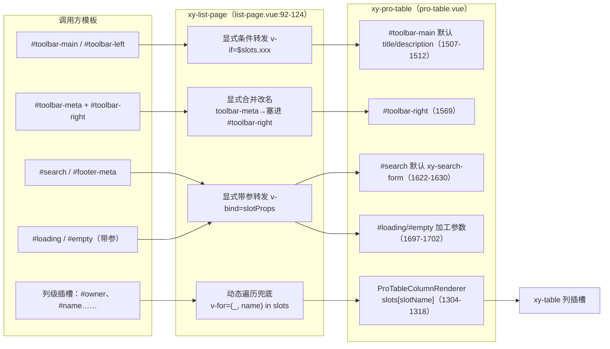
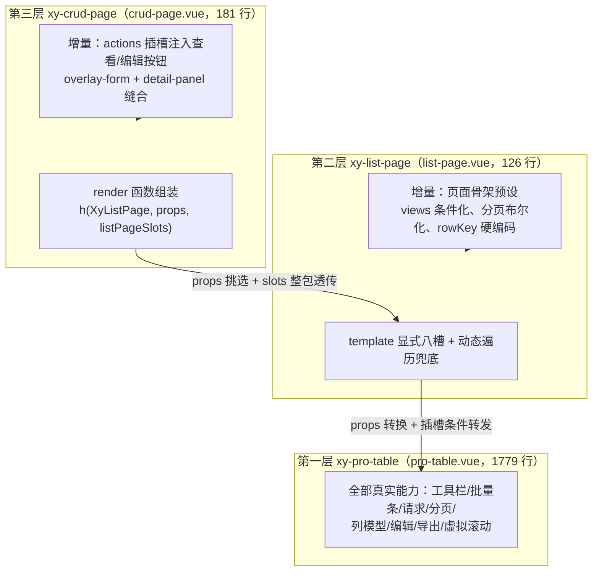

# 9-21 · ListPage：薄预设封装

先报一个实态核对结果：大纲里这篇的核心问题写的是"127 行如何完整透传所有插槽"，而实测 `wc -l` 与逐行读取都确认，`packages/pro-components/list-page/src/list-page.vue` 当前是 **126 行**——53 行 `<script setup>` 加 73 行 `<template>`，文件以换行结尾，没有第 127 行。127 应当是早期统计口径的残影。本篇以 126 行为准，但问题本身不变：一个 126 行的组件，凭什么敢自称"列表页容器"，把搜索区、工具栏、批量操作条、分页、加载态、空态、列级插槽全部承接下来，却不写一行属于这些能力的逻辑？

答案是本篇的标题：它是一层**薄预设**——不新增逻辑、只做布局组装与插槽透传。9-02 拆过它的协议转授（`list-page.ts` 全文 43 行、事件与实例的镜像段 `list-page.vue:29-52`），9-04 考据过它对 search-form 查询语义的转授（`list-page.vue:75-82` 的 views 下传与 `102-104` 的 `#search` 透传）。这两篇都只切了横断面。今天把整个 126 行摊开，重点是那条最容易被低估的机制——**插槽透传**。它决定了"薄预设"这种形态在 Vue 3 里到底能不能成立：props 可以挑着传，事件可以镜像，唯独插槽，Vue 没有给任何自动通道。

## 一、126 行的解剖：三段式结构

先把整个文件的结构盘出来。`packages/pro-components/list-page/src/list-page.vue` 的 `<script setup>` 段全文如下，这是 9-02 引过的"协议镜像段"，这次连同 import 一起完整看：

```vue
<script setup lang="ts">
import { computed, ref, useSlots } from "vue";
import { XyProTable } from "../../pro-table";
import type { ProTableInstance } from "../../pro-table";
import type { ProPageAction } from "../../core";
import type { ListPageBatchAction, ListPageProps } from "./list-page";

defineOptions({
  name: "XyListPage"
});

const props = withDefaults(defineProps<ListPageProps<any>>(), {
  title: "",
  description: "",
  searchModel: () => ({}),
  searchFields: () => [],
  data: () => [],
  columns: () => [],
  request: undefined,
  toolbarActions: () => [],
  batchActions: () => [],
  immediate: true,
  pageSize: 10,
  workbench: () => ({}),
  editable: undefined,
  virtual: undefined
});

const emit = defineEmits<{
  "toolbar-action": [action: ProPageAction];
  "batch-action": [action: ListPageBatchAction, selection: Record<string, unknown>[]];
  "selection-change": [selection: Record<string, unknown>[]];
  "request-success": [payload: Record<string, unknown>[]];
  "request-error": [error: unknown];
}>();

const slots = useSlots() as Record<string, ((payload?: unknown) => unknown) | undefined>;
const tableRef = ref<ProTableInstance<any> | null>(null);
const visibleToolbarActions = computed(() =>
  props.toolbarActions.filter((action) => action.visible !== false)
);

function handleBatchAction(action: ListPageBatchAction, selection: Record<string, unknown>[]) {
  emit("batch-action", action, selection);
}

defineExpose({
  reload: () => tableRef.value?.reload() ?? Promise.resolve(),
  refresh: () => tableRef.value?.refresh() ?? Promise.resolve(),
  reset: () => tableRef.value?.reset() ?? Promise.resolve(),
  clearSelection: () => tableRef.value?.clearSelection()
});
</script>
```

（`packages/pro-components/list-page/src/list-page.vue:1-53`）

53 行 script 里能称为"逻辑"的只有两处半：`visibleToolbarActions`（39-41 行）这一个 computed，`handleBatchAction`（43-45 行）这一个函数——它存在的唯一理由是 `batch-action` 事件有两个参数，箭头函数直接转发写不进模板的 `@batch-action="emit('batch-action', $event)"` 这种单参形式，只能起个中转；最后是 `defineExpose`（47-52 行）的四个实例方法转发。除此之外全是声明：14 个 props 的默认值、5 个事件的类型签名、一个 `useSlots()`。

注意 37 行那个断言：

```ts
const slots = useSlots() as Record<string, ((payload?: unknown) => unknown) | undefined>;
```

这是全篇插槽机制的入口。`useSlots()` 返回的 `Slot` 类型按插槽名索引，签名各不相同，模板里要 `v-for` 遍历它做动态转发，就必须先收窄成"任意名字的函数槽"。pro-table 里有一模一样的一行（`packages/pro-components/pro-table/src/pro-table.vue:195`），父子两代用同一个断言写法——这不是巧合，是同一套透传器范式在两个层级上的复刻。

template 段 73 行（55-126 行），结构上只有一件事：一个 `<xy-pro-table>`，外面再没有任何 DOM。全文如下，是本篇的主文本，后面逐段精读：

```vue
<template>
  <xy-pro-table
    ref="tableRef"
    :title="props.title"
    :description="props.description"
    :data="props.data"
    :columns="props.columns"
    :toolbar-actions="visibleToolbarActions"
    :batch-actions="props.batchActions"
    :workbench="props.workbench"
    :editable="props.editable"
    :virtual="props.virtual"
    :request="
      props.request
        ? {
            request: props.request,
            immediate: props.immediate
          }
        : undefined
    "
    :views="
      props.searchFields.length > 0
        ? {
            searchModel: props.searchModel,
            searchFields: props.searchFields
          }
        : undefined
    "
    :table-props="{ rowKey: 'id' }"
    :pagination="Boolean(props.request)"
    :page-size="props.pageSize"
    @toolbar-action="emit('toolbar-action', $event)"
    @batch-action="handleBatchAction"
    @selection-change="emit('selection-change', $event)"
    @request-success="emit('request-success', $event)"
    @request-error="emit('request-error', $event)"
  >
    <template v-if="$slots['toolbar-main']" #toolbar-main>
      <slot name="toolbar-main" />
    </template>
    <template v-if="$slots['toolbar-left']" #toolbar-left>
      <slot name="toolbar-left" />
    </template>
    <template #toolbar-right>
      <slot name="toolbar-meta" />
      <slot name="toolbar-right" />
    </template>
    <template v-if="$slots.search" #search>
      <slot name="search" />
    </template>
    <template v-if="$slots['footer-meta']" #footer-meta>
      <slot name="footer-meta" />
    </template>
    <template v-if="$slots.loading" #loading="slotProps">
      <slot name="loading" v-bind="slotProps" />
    </template>
    <template v-if="$slots.empty" #empty="slotProps">
      <slot name="empty" v-bind="slotProps" />
    </template>
    <template
      v-for="(_, name) in slots"
      #[name]="slotProps"
      :key="name"
    >
      <slot
        v-if="!['toolbar-main', 'toolbar-left', 'toolbar-right', 'toolbar-meta', 'search', 'footer-meta', 'loading', 'empty'].includes(String(name))"
        :name="name"
        v-bind="slotProps"
      />
    </template>
  </xy-pro-table>
</template>
```

（`packages/pro-components/list-page/src/list-page.vue:55-126`）

126 行 = 53 行声明与转发 + 36 行 props/事件接线 + 33 行插槽转发器 + 4 行标签闭合。四个插槽段（92-124 行）占了 template 的将近一半——这就是"薄预设"的成本结构：**逻辑薄，接线厚**。props 和事件 Vue 都有省力写法（`v-bind="$props"` 理论可行但会被显式转换打断），唯独插槽必须一行一行手工接。

薄不只体现在组件内部，也体现在调用方侧。官方文档示例 `apps/docs/examples/pro/list-page/basic.vue` 全文 57 行，其中组件标签只占 11 行，其余全是数据准备：

```vue
<script setup lang="ts">
import { reactive } from "vue";
import type { ProTableColumn, SearchFormField } from "@xiaoye/pro-components";

const searchModel = reactive({
  keyword: ""
});

const searchFields: SearchFormField[] = [
  {
    prop: "keyword",
    label: "关键词",
    component: "input"
  }
];

const columns: ProTableColumn[] = [
  {
    type: "selection",
    width: 52
  },
  {
    prop: "name",
    label: "名称"
  },
  {
    prop: "owner",
    label: "负责人"
  }
];

const rows = [
  {
    id: 1,
    name: "成员档案补录",
    owner: "小叶"
  },
  {
    id: 2,
    name: "账单核对",
    owner: "Mavis"
  }
];
</script>

<template>
  <xy-list-page
    title="成员工作台"
    description="列表页容器负责把搜索、列表和批量动作组织起来。"
    :search-model="searchModel"
    :search-fields="searchFields"
    :data="rows"
    :columns="columns"
    :toolbar-actions="[{ key: 'create', label: '新建', type: 'primary' }]"
    :batch-actions="[{ key: 'archive', label: '批量归档' }]"
  />
</template>
```

（`apps/docs/examples/pro/list-page/basic.vue:1-57`）

调用方没有一个字提到搜索表单怎么渲染、批量条何时出现、分页怎么接——这些全是 list-page 与 pro-table 之间的预设契约。注意示例数据里每行都有 `id`（32-43 行的 `rows`），那正是 83 行硬编码 `rowKey: 'id'` 的隐性契约：预设的每一处省略，都会在调用方的数据形态上收一份税。

## 二、透传机制选型：为什么不是那两个"更省"的方案

插槽透传有三种常见做法，list-page 的实码是第三种。把前两种否定掉的理由，正是本篇第一个设计权衡。

**方案 A：`v-bind="$attrs"`。** Element Plus 系组件最常用的透传手段——未声明为 props/emits 的 attribute 与事件监听器都落在 `$attrs` 里，一个绑定全部带走。但它在 Vue 3 里**天生不含插槽**：`$attrs` 只装 attribute 与事件回调，插槽内容活在组件实例的 `slots` 对象上，两者没有交集，这是 Vue 3 的规范行为。所以"props 全透传 + 插槽全透传"不可能靠一个 `v-bind` 完成；EP 的封装组件（比如对 `el-table` 的业务二次封装）也从不指望 `$attrs` 把 `empty`、`append` 这些插槽带下去，只能显式转发。何况 list-page 根本没用 `$attrs` 的余地——它把要透传的 props 全部显式声明成了自己的 props（为了写默认值与类型），attrs 里剩下的只有 class 和 style。

**方案 B：render 函数整包透传。** 用 `h()` 写封装组件时，第三个参数直接把 `slots` 对象整个传下去：

```tsx
const Proxy = defineComponent({
  setup(_, { attrs, slots }) {
    return () => h(XyProTable, { ...attrs }, slots);
  }
});
```

一行完成 props 与插槽的全量透传，Element Plus 生态里大量表格二次封装（包括各家 admin 框架的 ProTable）都这么写，代价为零。本仓库自己的 crud-page 就选了这条路——`packages/pro-components/crud-page/src/crud-page.vue:123-149`，用 `h(XyListPage, {...}, listPageSlots.value)` 组装，9-22 再展开。那 list-page 为什么不用？

因为**整包透传是"哑管道"，而 list-page 需要在管道上做三件手术**：

1. **改名合并**：list-page 对外暴露 `toolbar-meta` 与 `toolbar-right` 两个插槽名，但 pro-table 只有一个 `#toolbar-right`——`toolbar-meta` 的内容要被塞进 `toolbar-right` 的前面（98-101 行）。整包透传做不到按名字改写。
2. **条件化**：pro-table 的部分插槽带默认内容，无条件转发会**屏蔽默认内容**（第三节细说）。条件化意味着"调用方没传就不转发"，这要求感知每个插槽的存在性，template 的 `v-if="$slots.xxx"` 是最直接的表达。
3. **props 挑选与转换**：request 裸函数要包成配置对象（67-74 行）、views 要条件化（75-82 行）、`toolbarActions` 要先过滤（39-41 行）。props 一旦需要逐个转换，`v-bind="$attrs"` 的"全量"就变成了负担，显式声明反而更诚实。

所以实码是**方案 C：显式八槽 + 动态遍历兜底的双轨制**。八个需要"手术"的插槽显式写出，其余所有插槽（尤其是列级单元格插槽）用一个动态遍历兜底。这个双轨制是理解 92-124 行的钥匙。

## 三、显式八槽精读：条件、合并与一次"副作用"

### 3.1 防屏蔽：`v-if` 不是装饰

先看 pro-table 侧的默认内容。`#toolbar-main` 有默认渲染（`packages/pro-components/pro-table/src/pro-table.vue:1505-1512`）：

```vue
<div v-if="hasToolbar" class="xy-pro-table__toolbar">
  <div class="xy-pro-table__toolbar-main">
    <slot name="toolbar-main">
      <h3 v-if="props.title" class="xy-pro-table__title">{{ props.title }}</h3>
      <p v-if="props.description" class="xy-pro-table__description">
        {{ props.description }}
      </p>
    </slot>
  </div>
  <div class="xy-pro-table__toolbar-extra">
    <slot name="toolbar-left" />
```

（1505-1515 行；`#toolbar-right` 在 1569 行收尾）

`#search` 也有默认内容（`pro-table.vue:1621-1631`）：

```vue
<div v-if="hasSearch" class="xy-pro-table__search">
  <slot name="search">
    <xy-search-form
      v-if="searchModel && searchFields.length > 0"
      :model="searchModel"
      :fields="searchFields"
      @search="handleSearch"
      @reset="handleSearchReset"
    />
  </slot>
</div>
```

Vue 的插槽语义是**转发即覆盖**：子组件里 `<slot name="search">` 的 fallback 内容只在"父组件没提供该插槽"时渲染；一旦 list-page 无条件写了 `<template #search><slot name="search" /></template>`，pro-table 收到的 `slots.search` 恒为真，`<xy-search-form>` 的默认渲染立刻死亡——哪怕调用方什么都没传。所以 92-94、102-104 这些 `v-if="$slots.xxx"` 不是风格装饰，是默认内容（title/description 的标题区、schema 驱动的搜索表单）的生死开关。这正是"props 白名单 + 插槽条件转发"必须成对出现的原因：`title`/`searchModel`/`searchFields` 走 props 透传的默认渲染，只有调用方显式接管时插槽才介入。

### 3.2 无条件转发 `#toolbar-right`：一次可见的副作用

对照之下，98-101 行是唯一的例外——**没有** `v-if`：

```vue
<template #toolbar-right>
  <slot name="toolbar-meta" />
  <slot name="toolbar-right" />
</template>
```

（`packages/pro-components/list-page/src/list-page.vue:98-101`）

为什么它敢无条件？第一，pro-table 的 `#toolbar-right` 默认内容本来就是空（1569 行），覆盖无损失。第二，`toolbar-meta` 与 `toolbar-right` 是"合并改名"：list-page 自创了 `toolbar-meta` 这个 pro-table 不存在的插槽名（在 `pro-table.vue` 里检索 `toolbar-meta` 零命中，只有 `footer-meta`），把它插在调用方 `toolbar-right` 之前，一起注入 pro-table 工具栏的最右侧。这是八槽里唯一的"结构改写"。

但它有一个真实的副作用，藏在 pro-table 的 `hasToolbar` 里（`packages/pro-components/pro-table/src/pro-table.vue:255-276`）：

```ts
const visibleToolbarActions = computed(() =>
  props.toolbarActions.filter((action) => action.visible !== false)
);
const hasToolbar = computed(
  () =>
    Boolean(props.title) ||
    Boolean(props.description) ||
    visibleToolbarActions.value.length > 0 ||
    Boolean(slots["toolbar-main"]) ||
    Boolean(slots["toolbar-left"]) ||
    Boolean(slots["toolbar-right"]) ||
    resolvedWorkbench.value.refresh ||
    resolvedWorkbench.value.density ||
    resolvedWorkbench.value.columnSetting ||
    resolvedWorkbench.value.fullscreen ||
    resolvedWorkbench.value.treeToggle ||
    resolvedWorkbench.value.filter ||
    resolvedWorkbench.value.export ||
    resolvedWorkbench.value.print
);
const hasSearch = computed(() => hasSearchSlot.value || searchFields.value.length > 0);
const hasFooterMeta = computed(() => Boolean(slots["footer-meta"]));
```

pro-table 用 `Boolean(slots["toolbar-right"])`（265 行）判断工具栏是否该渲染。list-page 无条件转发后，pro-table 的 `slots["toolbar-right"]` **恒为真**，于是 `hasToolbar` 恒为真——list-page 下的工具栏容器永远不会消失，哪怕 title 为空、没有动作按钮、工作台全关。单独用 pro-table 时工具栏是按需渲染的，套上 list-page 就变成常驻。这是薄预设"多接一根线就多一个语义"的实例：透传器对下游插槽存在性的每次触碰，都会参与下游的渲染决策。实际影响可控——页面级列表的工具栏（批量条、动作区）本就该常驻，空工具栏只多渲染一个空 div——但它提醒我们，"无条件转发"与"条件转发"不是随机选择，每一处都要想清楚下游拿 `slots` 做了什么。

顺带注意 255-257 行：pro-table 自己也做了一遍 `visible !== false` 的过滤，与 list-page 的 39-41 行一字不差。list-page 先过滤、pro-table 再过滤，结果是幂等的。这不是 bug，而是"薄预设保持下游独立可用"的选择：list-page 不假设 pro-table 会替它过滤，pro-table 不假设上游已经过滤，两层各自成立，套起来行为不变。冗余换解耦，这对父子组件各自都能单独通过测试。

### 3.3 带参转发：`loading` 与 `empty`

108-113 行的 `loading`、`empty` 用了 `#loading="slotProps"` + `v-bind="slotProps"` 的解构转发。原因是它们的作用域插槽参数会在 pro-table 内部再被加工一次（`pro-table.vue:1697-1702`）：

```vue
<template v-if="slots.loading" #loading>
  <slot name="loading" :loading="props.loading || requestLoading" />
</template>
<template v-if="slots.empty" #empty>
  <slot name="empty" :empty="!props.loading && !requestLoading && internalData.length === 0" />
</template>
```

pro-table 把 `props.loading || requestLoading` 算成布尔值塞进 `loading` 插槽参数，list-page 用 `v-bind="slotProps"` 原样续传。调用方写 `<template #loading="{ loading }">` 拿到的就是加工后的值。参数不被篡改、不被丢弃，是作用域插槽透传的底线。

### 3.4 动态遍历兜底：列级插槽的穿层通道

114-124 行是双轨制的第二轨：

```vue
<template
  v-for="(_, name) in slots"
  #[name]="slotProps"
  :key="name"
>
  <slot
    v-if="!['toolbar-main', 'toolbar-left', 'toolbar-right', 'toolbar-meta', 'search', 'footer-meta', 'loading', 'empty'].includes(String(name))"
    :name="name"
    v-bind="slotProps"
  />
</template>
```

四个细节。其一，`v-for="(_, name) in slots"` 遍历的是 setup 顶层的 `slots` 对象（37 行）——遍历天然条件化：调用方没传的插槽名根本不会出现在遍历里，等价于每个转发都自带 `v-if`。其二，`#[name]` 动态插槽名把"哪个名字"推迟到运行时，配合 `v-bind="slotProps"` 让任意作用域参数续传。其三，排除列表恰是八个显式槽——七个 pro-table 插槽已手工接走，第八个 `toolbar-meta` 是 list-page 的自有名，pro-table 根本不认识，若混进遍历会以 `#[toolbar-meta]` 的形式塞给下游变成死插槽。其四，`String(name)` 是类型收窄：对象 `v-for` 的键类型是 `string | number | symbol`，`includes` 需要纯字符串比较。

这条兜底轨真正的价值在**列级插槽**。pro-table 的列模型支持 `column.slot` 指定单元格插槽名，渲染时从自己的 `slots` 里按名取用（`packages/pro-components/pro-table/src/pro-table.vue:1304-1318`）：

```ts
if (slotName && slots[slotName]) {
  return slots[slotName]?.(payload);
}

return renderDisplayValue({
  value: payload.value,
  row,
  rowIndex,
  column
});
```

（1304-1313 行；表头插槽同构，1317-1318 行）

`slots[slotName]` 取的是 pro-table 收到的插槽集合，也就是 list-page 动态遍历转发下来的那一批。于是调用方在 `xy-list-page` 上写的 `<template #owner="{ row }">`，穿过 list-page 的动态遍历、落到 pro-table 的列渲染器、最终以 `xy-table` 列插槽的形式渲染——**三层穿透，调用方一行适配代码都不用写**。文档页把这条兜底描述为"其他具名插槽透传给内部 xy-pro-table 的同名插槽"（`apps/docs/pro-components/list-page.md:129`），措辞准确，但没有说出它的实现在 114-124 行的 11 行里。

整条插槽透传链画出来是这样的：



从这张图能看清双轨制的分工：左列五个入口对应右列五个消费点，中间的 list-page 只做"条件、改名、续参"三件事。它不生产内容，也不消费内容——这是"薄"在插槽维度上的完整含义。

## 四、组装接线：props 通道上的四次转换

插槽之外，template 前半段（56-91 行）是 props 与事件的接线区。表面是逐个转发，细看有四处预设决策，每一处都是 list-page 作为"页面级组件"替调用方做的选择：

1. **request 的形态转换**（67-74 行）：`ListPageProps.request` 是裸函数 `(params, ctx) => Promise<ProRequestResult<T>>`（`list-page.ts:28`），而 pro-table 的 `ProTableRequestConfig` 是 `{ request, immediate, ... }` 配置对象（`pro-table.ts:170-175`）。list-page 负责把裸函数包成对象，并把 `immediate` 一并带过去；没传 request 时给 `undefined`，请求链路整体关闭。
2. **views 的条件化**（75-82 行，9-04 已考据的段落）：`searchFields.length > 0` 才传 views，空数组时传 `undefined`。区别是实质性的——pro-table 的 `hasSearch`（`pro-table.vue:275`）依据 `searchFields` 是否非空决定是否渲染搜索区容器，传空数组会渲染一个空壳 div，传 `undefined` 则整块消失。
3. **硬编码 `rowKey: 'id'`**（83 行）：`:table-props="{ rowKey: 'id' }"` 是 126 行里最"厚"的一笔。页面级组件假定行数据有 `id` 字段，批量选择、展开树、编辑定位都靠它。它不在 props 白名单里，调用方改不了——这是薄预设的边界代价：预设越"开箱即用"，逃生门越少。
4. **分页的布尔化**（84 行）：`Boolean(props.request)`——分页只在远程请求模式下开启。本地说法是：data 全量在内存里，列表页形态默认不分页（要分页自己用 pro-table）。预设替用户裁掉了"本地分页"这个分支。

事件段（86-90 行）是 9-02 讲过的镜像转发，唯一值得补的是 43-45 行 `handleBatchAction` 的存在理由：`batch-action` 的载荷是 `[action, selection]` 双参，模板事件转发器 `emit('batch-action', $event)` 只能带一个 `$event`，所以必须有一个具名函数把两个参数原序转发。约束来自 Vue 模板，不是设计偏好。

实例段（47-52 行）同样是收窄式的：

```ts
defineExpose({
  reload: () => tableRef.value?.reload() ?? Promise.resolve(),
  refresh: () => tableRef.value?.refresh() ?? Promise.resolve(),
  reset: () => tableRef.value?.reset() ?? Promise.resolve(),
  clearSelection: () => tableRef.value?.clearSelection()
});
```

pro-table 的 `ProTableInstance`（`pro-table.ts:232-248`）暴露了 13 个方法，list-page 只转发 4 个——`reload`/`refresh`/`reset` 来自 core 的 `ProActionRef`（`packages/pro-components/core.ts:21-25`），`clearSelection` 是列表页特有诉求。未转发的 `toggleFullscreen`、`setDensity`、`openFilterDrawer`、编辑系方法都不在列表页的语义里。实例 API 与插槽 API 同构：**能透传的不代表该全透传**，白名单就是 API 承诺。

## 五、类型层的薄：收窄与守卫

`packages/pro-components/list-page/src/list-page.ts` 全文 43 行，9-02 引过全文，这里从"薄预设的类型策略"角度重读。先看全文：

```ts
import type { SearchFormField } from "../../search-form";
import type { ButtonType } from "xiaoye-components";
import type {
  ProTableColumn,
  ProTableEditableConfig,
  ProTableVirtualConfig,
  ProTableWorkbenchConfig
} from "../../pro-table/src/pro-table";
import type { ProActionRef, ProPageAction, ProRequestContext, ProRequestResult } from "../../core";

export interface ListPageBatchAction {
  key: string;
  label: string;
  type?: ButtonType;
  danger?: boolean;
  disabled?: boolean;
  loading?: boolean;
  icon?: string;
}

export interface ListPageProps<T = Record<string, unknown>> {
  title?: string;
  description?: string;
  searchModel?: Record<string, unknown>;
  searchFields?: SearchFormField[];
  data?: T[];
  columns: ProTableColumn<T>[];
  request?: (params: Record<string, unknown>, ctx: ProRequestContext) => Promise<ProRequestResult<T>>;
  toolbarActions?: ProPageAction[];
  batchActions?: ListPageBatchAction[];
  immediate?: boolean;
  pageSize?: number;
  workbench?: ProTableWorkbenchConfig;
  editable?: ProTableEditableConfig<T>;
  virtual?: ProTableVirtualConfig;
}

export interface ListPageActionRef extends ProActionRef {
  clearSelection: () => void;
}

/** @deprecated 请改用 ListPageBatchAction。 */
export type BatchActionBarAction = ListPageBatchAction;
```

（`packages/pro-components/list-page/src/list-page.ts:1-43`）

43 行里没有一行运行时代码，四个 import 全是 type-only——这正是 9-02 说的"聚合式组件如何转授协议"：`ProPageAction`、`ProActionRef`、`ProRequestContext`、`ProRequestResult` 四个协议类型直接从 core 引入，`ProTableColumn` 等四个配置类型直接从 pro-table 的类型源引入，`SearchFormField` 从 search-form 引入（9-04 考据过的"法外之地"）。list-page 的类型层唯一的工作是声明 `ListPageProps` 这张"页面级白名单"——15 个字段里 9 个是 pro-table props 的原样搬运，4 个是页面语义的新增（`searchModel`/`searchFields`/`request`/`immediate`），没有一个字段引入新概念。

重点看 `ListPageBatchAction`（11-19 行）：

```ts
export interface ProTableBatchAction {
  key: string;
  label: string;
  type?: ButtonType;
  danger?: boolean;
  disabled?: boolean;
  loading?: boolean;
  icon?: string;
  visible?: boolean;
}
```

（`packages/pro-components/pro-table/src/pro-table.ts:44-53`）

这是本篇第三个权衡。pro-table 的 `ProTableBatchAction` 与 `ListPageBatchAction` 几乎逐字相同，唯一差别是后者**没有 `visible`**。list-page 完全可以 `type ListPageBatchAction = ProTableBatchAction` 省下 9 行，但它选择了独立声明并删掉 `visible`。理由藏在渲染路径里：`ProPageAction`（`core.ts:126-138`）的 `visible` 由 `visibleToolbarActions` 这类 computed 消费，而 list-page 的批量动作直接透传给 pro-table 的 `batchActions`，批量条的显隐由"是否有选中行"这一表格状态决定（pro-table 的 `canMultipleSelect`），页面层不该再提供 per-action 的 `visible` 开关。删掉一个字段，就把"不要用 visible 配置批量动作"写进了类型系统——错误用法在编译期报错，比运行期静默失效诚实。代价是两份 95% 重合的类型要人肉保持同步，这是收窄式封装的经典收支。

另两处：`ListPageActionRef extends ProActionRef`（38-40 行）只加 `clearSelection`，实例 API 的类型承诺与 47-52 行的 `defineExpose` 一一对应；42-43 行的 `@deprecated BatchActionBarAction` 是旧别名，只留在源码层，按 9-01 立的增强层导出边界，它进不了根入口——`packages/pro-components/index.ts:109-112` 只导出 `ListPageActionRef`、`ListPageBatchAction`、`ListPageProps` 三个主类型，`scripts/check-pro-components.mjs:51` 的白名单 `"list-page": ["ListPageActionRef", "ListPageBatchAction", "ListPageProps"]` 把这行承诺钉死在守卫脚本里。类型夹具 `tests/types/fixtures/list-page.ts:37` 用 `Pick<ListPageActionRef, "reload" | "refresh" | "reset" | "clearSelection">` 反向锁定四个暴露方法，类型层与运行时层在两套独立检查里互相咬合。

入口链也从简：`packages/pro-components/list-page/index.ts` 全文 13 行，`withInstall` 挂载加三个类型导出，没有任何运行时逻辑——薄预设连安装入口都是薄的。

## 六、测试实态与两块"化石"

`packages/pro-components/list-page/__tests__/list-page.spec.ts` 全文 39 行，只有一个用例：

```ts
import { mount } from "@vue/test-utils";
import { defineComponent, h, nextTick } from "vue";
import { describe, expect, it, vi } from "vitest";
import { XyListPage } from "@xiaoye/pro-components";

describe("XyListPage", () => {
  it("支持渲染标题并转发工具栏动作", async () => {
    const action = {
      key: "create",
      label: "新建"
    };
    const wrapper = mount(XyListPage, {
      props: {
        title: "成员列表",
        immediate: false,
        columns: [
          {
            prop: "name",
            label: "名称"
          }
        ],
        data: [
          {
            id: 1,
            name: "账单中心"
          }
        ],
        toolbarActions: [action]
      }
    });

    expect(wrapper.text()).toContain("成员列表");

    await wrapper.get("button").trigger("click");
    await nextTick();

    expect(wrapper.emitted("toolbar-action")?.[0]?.[0]).toEqual(action);
  });
});
```

（`packages/pro-components/list-page/__tests__/list-page.spec.ts:1-39`；本篇写作时实跑 `npx vitest run packages/pro-components/list-page`，1 passed）

这个用例的覆盖面值得直言：它验证了 props 透传（title 渲染）、`visibleToolbarActions` 过滤后的按钮渲染、事件镜像（toolbar-action 载荷原样到达），恰好覆盖"props→渲染→事件"的往返。但**插槽透传链——本篇的核心机制——没有一行测试断言**：92-124 行的 33 行转发器，包括防屏蔽的 `v-if`、改名合并的 `toolbar-meta`、动态遍历的排除列表，全部处于零断言状态。`defineComponent`、`h`、`vi` 三个 import 在文件里也没被用上（第 2、3 行），像是为更完整的用例预留又被搁置的痕迹。对一个以"透传正确性"为全部价值的组件来说，这是最值得补的一块测试债——哪怕只是"传一个列插槽、断言其渲染"和"不传 search 插槽、断言默认搜索表单仍在"两条。

比测试债更有考古价值的是两块化石，它们共同记录了 list-page 从"厚"到"薄"的形态迁移：

**化石一：孤儿样式。** `packages/theme/src/pro/list-page.css` 全文 95 行，开篇是：

```css
.xy-list-page {
  display: flex;
  flex-direction: column;
  gap: 18px;
}

.xy-list-page__toolbar {
  display: flex;
  align-items: flex-start;
  justify-content: space-between;
  gap: 16px;
  padding: 20px;
  border: 1px solid color-mix(in srgb, var(--xy-border) 90%, var(--xy-mix-light));
  border-radius: var(--xy-radius-lg);
  background: var(--xy-bg-container);
}
```

（`packages/theme/src/pro/list-page.css:1-16`）

全库检索 `xy-list-page` 这个类名：它出现在这份 CSS、manifest 注册（`component-manifest.json:203-208` 的 `styleImports`）和文档标签里，**唯独不出现在任何组件模板**——`list-page.vue` 的根元素就是 `<xy-pro-table>`（类名由 pro-table 的 `rootClasses` 生成），`pro-table.vue` 里也没有任何 `xy-list-page` 可命中的节点。也就是说这 95 行样式（工具栏、批量条、`__batch-danger` 分隔线、960px 响应式断点一应俱全）描述的是 list-page 曾经亲自渲染的 DOM。git 历史可考：`a32e399`（"新增 pro 组件并增强表单与表格能力"）时代的 list-page.vue 还在亲自渲染工具栏与批量条，`xy-list-page__` 类名出现 13 次；`323e9a7` 将其重构为 pro-table 的薄预设后，类名清零，而这 95 行 CSS 未随之删除——DOM 移交 pro-table，类名统一变成 `xy-pro-table__*`，这份 CSS 从此没有宿主，却仍通过 `packages/pro-components/style.css:27` 的 `@import` 参与每次构建，纯支付体积成本。薄预设迁移的完整清单应当是：源码、类型、**样式、文档**——前两项迁移了，后两项留在了原地。

**化石二：文档漂移。** `apps/docs/pro-components/list-page.md` 有三处与实码冲突。25-32 行的组成图写 ListPage 由 PageContainer、SearchForm、AsyncStateContainer、BatchActionBar 组成，43-57 行还给出"推荐将 ProTable 放在 ListPage 的默认插槽中"的示例——实码里 list-page **没有默认插槽语义**：模板根节点就是 `xy-pro-table`，写在标签里的默认插槽内容会被动态遍历兜底转发进 xy-table 的默认列区，把一个表格塞进另一个表格的默认插槽只会得到未定义行为。61-68 行的批量动作示例带 `handler: handleBatchDelete` 字段，而 `ListPageBatchAction`（`list-page.ts:11-19`）根本没有 handler——动作一律通过 `batch-action` 事件上抛。插槽表（117-129 行）倒是与实码完全一致。文档页 76-79 行"当前定位"一节看起来是后期补写的，与三处旧段落并存——同一页文档里新旧两代架构在打架，这大概是 AI 协作研发最真实的注脚：代码迁移了，叙述没有跟上。

两块化石合起来给"薄预设"这种形态补了一条运维守则。预设的"薄"是相对源码说的，它的外围制品——样式表、文档、示例、甚至类型夹具——在形态迁移时往往不会自动跟着变，因为它们各自挂在不同的检查门禁上：样式挂在构建里（不报错，只是死重），文档挂在人审里（不报错，只是误导）。判断一个预设组件是否真的"薄"，除了数它的行数，还应该检索一次它的类名是否有宿主、文档示例是否还能对上类型签名。本篇写作中这三条检查各命中一次，没有一条是静态检查能兜住的。

## 七、金字塔的中层：三个组件、两种范式

把视角拉回增强层全局。9-01 与 9-02 已经立过增强层的金字塔结构：pro-table 是表格工作台，list-page 是列表页预设，9-22 的 crud-page 是整页 CRUD 的顶层——大纲给 9-22 的核心问题就是"三级金字塔的顶层如何组装？"，而那道题的前提是本篇立住的中层。`packages/pro-components/crud-page/src/crud-page.vue:5` 的一行 `import { XyListPage } from "../../list-page"` 是依赖关系的直接证据：顶层站在中层肩上，中层站在 pro-table 肩上，三层各只做增量。

三层的通道画在一张图里，注意每层递减的"增量"：



自下而上读：第一层 1779 行承载全部真实能力；第二层 126 行只在插槽与 props 两个通道上做预设决策；第三层 181 行只做"往 actions 里注入按钮 + 把表单和详情缝进同一页"。每一层对下一层的依赖都是单点 import，没有反向引用，也没有旁路——9-02 考据的 core 协议（`ProPageAction`、`ProActionRef`、`ProRequestResult`）在三层之间以同一套词汇流转，这就是协议层存在的意义。

顶层与中层形成了意味深长的范式对照。crud-page 组装 list-page 的核心段（`crud-page.vue:123-149`）：

```ts
const ListPageRenderer = defineComponent({
  name: "XyCrudPageListRenderer",
  setup() {
    return () =>
      h(
        XyListPage,
        {
          title: props.title,
          description: props.description,
          searchModel: props.searchModel,
          searchFields: props.searchFields,
          data: props.data,
          columns: props.columns,
          toolbarActions: [{ key: "create", label: "新建", type: "primary" }, ...props.toolbarActions],
          batchActions: props.batchActions,
          onToolbarAction: handleToolbarAction,
          onBatchAction: handleBatchAction,
          onSelectionChange: (selection: Record<string, unknown>[]) =>
            emit("selection-change", selection),
          onRequestSuccess: (payload: Record<string, unknown>[]) =>
            emit("request-success", payload),
          onRequestError: (error: unknown) => emit("request-error", error)
        },
        listPageSlots.value
      );
  }
});
```

render 函数 + slots 整包透传（第三参 `listPageSlots.value`），因为顶层需要做中层做不了的事：往 `actions` 插槽里**注入**"查看/编辑"按钮再混入调用方的自定义动作（`crud-page.vue:49-86`，`listPageSlots` 里的 actions 改写）。而中层 list-page 选 template + 显式八槽，因为它要做的是**挑选、条件化、改名**，不需要生产 vnode。两代组件、两种范式、同一个生态——选择标准不是团队口味，而是"这层需不需要亲手造 vnode"。

最后回答一个隐含问题：薄预设的"薄"会不会守不住？看 126 行里已经出现的变厚迹象——`rowKey: 'id'` 是一次硬编码，`Boolean(props.request)` 是一次语义裁剪，`visibleToolbarActions` 是第一段业务逻辑，`hasToolbar` 副作用是第一次"知道下游太多"。每一层都是微小的，但方向一致：预设组件天然向厚生长，因为每个用户诉求都指向"再帮我多做一点"。list-page 目前的防线是清晰的：**一切与表格渲染、查询执行、编辑状态有关的能力都推给 pro-table，自己只保留"页面骨架"语义**——9-04 立的分工（search-form 持有查询语义，list-page 只转授）在这里同样成立。什么时候这条防线破了，126 行就会变成 260 行，那时就需要重新问一遍本篇开头的问题。

下一篇 9-22《CrudPage：整页 CRUD》走进金字塔顶层：181 行的 crud-page 如何在 listPageSlots 里改写 actions 插槽、如何把 overlay-form 与 detail-panel 缝进整页 CRUD、以及它替 list-page 补上的"表单与详情"这块拼图。

---

**考据与行号核对说明**：本文所有路径与行号均按当前工作区实态核对。`list-page.vue` 实测 126 行（大纲作 127 行，以实测为准）；`list-page.ts` 43 行、`crud-page.vue` 181 行、`pro-table.vue` 1779 行、`list-page.spec.ts` 39 行、`tests/types/fixtures/list-page.ts` 43 行、`packages/theme/src/pro/list-page.css` 95 行，均与引用一致。测试实跑通过（1 passed）。
