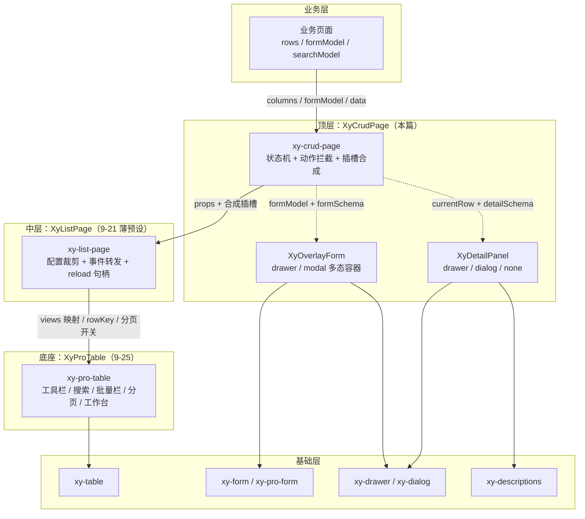
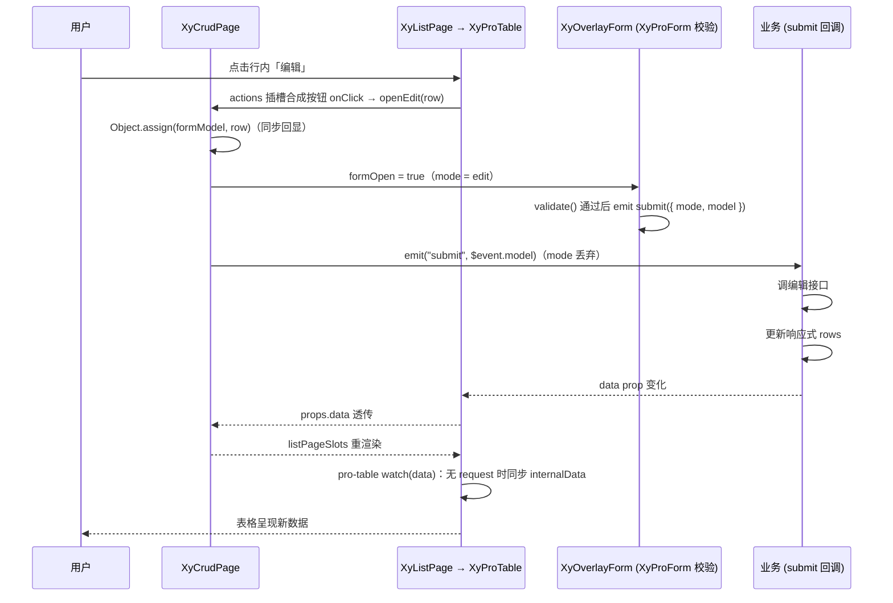

# 9-22 · CrudPage：整页 CRUD

> 本篇是 9 卷"增强层（pro-components）"的第二十二篇。9-21 拆了金字塔中层的 `XyListPage`——一个把 pro-table 的十八个 prop 裁成九个的薄预设；本篇上探顶层，拆 `XyCrudPage`：整条页面级产品线的封顶之作。核心问题按大纲只有一句话——**三级金字塔的顶层如何组装**——但这句话里至少藏着六道题：顶层凭什么"厚"过中层的薄预设（表单编排加 CRUD 动作，具体厚在哪几行实码）；为什么组装 `XyListPage` 不走模板包裹、而要在一个 `<script setup>` 里再定义一个 render 函数组件；编辑回显为什么是同步 `Object.assign(formModel, row)` 一步到位、而不是 9-10 的 request-form 那条异步 fetch 协议（两条回显路线的取舍在本篇定论）；删除确认为什么金字塔三层都没有内建——popconfirm、message、dialog 三件确认原语全在库里，选型却交还业务；批量操作到底是顶层新增的能力还是底座穿透上来的旧能力；以及顶层为什么连一个 `defineExpose` 都没有、数据刷新为什么只能靠 props 回流。本篇全部给实码定论，并为 9-23《SplitLayoutPage：分栏页面》埋好引线。

接到题目先复述一遍目标，防止写偏：`XyCrudPage` 要解决的业务场景，是"标准后台操作流"的整页闭环——列表、搜索、批量之外，再加"新增/编辑弹窗 + 查看详情"这组写操作动线。基础层给了 `xy-table`、`xy-form`、`xy-dialog`、`xy-drawer`、`xy-descriptions`，增强层 9-05 给了 `XyProForm` 的 schema 渲染引擎、9-06 给了 `XyOverlayForm` 的多态容器、9-21 给了 `XyListPage` 的列表骨架，但这些积木拼一个 CRUD 页面仍然要业务自己写：一个 `formOpen` ref、一个 `currentRow` ref、两个 `openEdit`/`openCreate` 函数、一段把行数据灌进表单的逻辑、一段把提交载荷送回接口的逻辑、外加行操作列的按钮编排。crud-page 把这六件事收进一个组件：业务只声明 `columns`、`formModel`、`formSchema` 三样必备品，其余的"查看/编辑/新建"三个内建动作、弹窗容器切换（drawer/modal）、详情面板（drawer/dialog/none）全部由组件编排。它自己不做低代码——`apps/docs/pro-components/crud-page.md:78` 写得明白："表单和详情内容继续通过插槽承接，不做低代码页面设计器。"

先交代体量，给全文一个标尺：`crud-page` 组件目录四个文件共约 300 行——`src/crud-page.ts` 23 行（纯类型）、`src/crud-page.vue` 181 行（脚本段至 150 行、模板段 152-181 共 30 行）、`index.ts` 9 行、`__tests__/crud-page.spec.ts` 87 行（两个用例）；专属样式 `packages/theme/src/pro/crud-page.css` 全文 10 行。单看体量它比 list-page（9-21 考据过）大不了多少，甚至不到 pro-table 的零头——但它的**组装面**是增强层最宽的：同时编排列表（XyListPage）、表单（XyOverlayForm）、详情（XyDetailPanel）三个子系统，一个 import 行同时拉进三兄弟。本篇就按"类型层 → 金字塔组装 → 状态机与回显 → 表单编排 → 详情与行动作 → 批量 → 数据流 → 测试"这条主线走。

## 一、导出链路与体量：最薄的顶层，最宽的组装面

老规矩，先看安装入口，`crud-page/index.ts` 全文 9 行：

```ts
// packages/pro-components/crud-page/index.ts（全文 9 行）
import CrudPage from "./src/crud-page.vue";
import type { CrudPageProps } from "./src/crud-page";
import { withInstall } from "xiaoye-primitives";

export type { CrudPageProps };

export const XyCrudPage = withInstall(CrudPage, "xy-crud-page");

export default XyCrudPage;
```

与 9-21 的 list-page 入口逐字同构——这本身就是一种信号：顶层组件在"包装规格"上没有特殊性，特殊性全部在 `src/` 里。值导出走 `packages/pro-components/exports.ts:27` 的 `export { XyCrudPage } from "./crud-page"`，类型导出走根入口 `packages/pro-components/index.ts:113` 的 `export type { CrudPageProps }`——只抬一个主 Props 类型，`formType` 的字面量联合、插槽入参一个都不抬，符合 9-01 立下的根入口边界；清单登记在 `component-manifest.json:210-216`，`installExports` 是 `["XyCrudPage"]`、`installChecks` 是 `[{ "kind": "component", "name": "xy-crud-page" }]`、`styleImports` 是 `["crud-page"]`，样式经 `packages/pro-components/style.css:28` 引入那份 10 行的专属样式：

```css
/* packages/theme/src/pro/crud-page.css（全文 10 行） */
.xy-crud-page {
  display: flex;
  flex-direction: column;
  gap: 18px;
}

.xy-crud-page__actions {
  display: inline-flex;
  gap: 8px;
}
```

一个纵向 flex 加一个 18px 栅距、一个行操作容器加一个 8px 栅距——全部视觉贡献就这两条。整页的视觉骨架几乎 100% 继承自 list-page 和 overlay-form，这份样式薄到只剩"把三块拼起来别贴在一起"的粘合剂职责。这印证了本篇的一个基本判断：**顶层组件的价值不在渲染，在编排**。

安装注册有一个聚合测试兜底：`packages/pro-components/__tests__/install.spec.ts:24-27` 遍历 `proInstallCheckEntries`，对每个 `kind === "component"` 的条目断言 `app.component(entry.name)` 为真——`xy-crud-page` 的登记就在这个清单里被幂等安装测试顺带钉住，测试文件里搜不到 "crud-page" 字样，但断言覆盖到了它。这是 4-01 讲过的"manifest 驱动一致性"在测试侧的又一次复利。

## 二、类型层：一份 Props 收编三个子系统的配置面

类型文件 9-02/9-10 都引过片段，这里全文展开，23 行：

```ts
// packages/pro-components/crud-page/src/crud-page.ts（全文 23 行）
import type { DescriptionsProps, FormRules } from "xiaoye-components";
import type { SearchFormField } from "../../search-form";
import type { ListPageBatchAction } from "../../list-page";
import type { ProFieldSchema, ProPageAction } from "../../core";
import type { ProTableColumn } from "../../pro-table";

export interface CrudPageProps<T = Record<string, unknown>> {
  title?: string;
  description?: string;
  searchModel?: Record<string, unknown>;
  searchFields?: SearchFormField[];
  data?: T[];
  columns: ProTableColumn<T>[];
  toolbarActions?: ProPageAction[];
  batchActions?: ListPageBatchAction[];
  formModel: Record<string, unknown>;
  formSchema?: ProFieldSchema[];
  formRules?: FormRules;
  formType?: "drawer" | "modal";
  detailSchema?: ProFieldSchema[];
  detailDescriptionsProps?: Omit<DescriptionsProps, "items" | "title" | "extra">;
  detailType?: "drawer" | "dialog" | "none";
}
```

23 行五个 import，收编了增强层**四条法域**的类型：`SearchFormField` 来自 search-form（9-04 考据过的"法外之地"——它是 search-form 的私有主类型，按 9-02 立的"公共词汇才进 core"标准留在子入口）；`ListPageBatchAction` 来自 list-page（批量动作声明，含 `danger?: boolean` 标志）；`ProFieldSchema` 与 `ProPageAction` 来自 core（9-02 拆过：一份 schema 三形态、页面动作统一签名）；`ProTableColumn` 来自 pro-table（列 schema，`valueType`/`render`/`slot` 全家桶）。9-02 说过 crud-page 是"一份 CRUD 页面吃下三种协议的最全样本"——数一遍其实是四种，再加基础层进来的 `DescriptionsProps`/`FormRules`，这份类型文件本身就是金字塔结构的类型侧投影：**每一层 import 的深度，就是它组装面的宽度**。

接口内部按职责天然分三段。**列表段**（title/description/searchModel/searchFields/data/columns/toolbarActions/batchActions）与 `ListPageProps`（`list-page.ts:21-36`）逐条对应，是纯透传声明；**表单段**（formModel/formSchema/formRules/formType）把 `OverlayFormProps`（`overlay-form.ts:14-34`）里跟 CRUD 相关的子集抬上来——注意没有抬 `loading`/`submitting`/`readonly`/`resetOnClose`/`destroyOnClose`，也没有抬 `drawerProps`/`dialogProps` 这两个逃生舱；**详情段**（detailSchema/detailDescriptionsProps/detailType）对应 `DetailPanelProps` 的最小子集，其中 `detailType` 多了一个 list-page 完全没有的取值 `"none"`——这是顶层独有的语义：整页可以不要详情。

类型夹具里用户侧的最小实例长这样：

```ts
// tests/types/fixtures/xiaoye-pro-components.ts:372-383
const crudPageProps: CrudPageProps<Row> = {
  columns: [
    {
      prop: "name",
      label: "名称"
    }
  ],
  data: [{ id: 1, name: "控制台" }],
  formModel: {
    name: ""
  }
};
```

全接口 15 个 prop 里只有 `columns` 和 `formModel` 是必填（`data` 有默认空数组），夹具三样凑齐就能过编译。这里有一个值得停留的类型取舍：泛型 `T` 只贯穿了 `data?: T[]` 和 `columns: ProTableColumn<T>[]`，而 `formModel` 被钉死在 `Record<string, unknown>`——**泛型没有从表格侧贯穿到表单侧**。业务里 `Row` 类型的行数据和 `formModel` 的字段形状是同一个实体的两个投影，类型系统却视它们为陌路：`Object.assign(formModel, row)`（下节主角）在类型层面是把 `Record<string, unknown>` 合进 `Record<string, unknown>`，行里任何一个拼错的键都不会被编译器逮住。对比 `ListPageProps<T>` 同样只在 data/columns 上吃泛型，这是金字塔全线的现状：泛型服务"展示"的强类型，不服务"编排"的强类型。要打通它需要 `CrudPageProps<T, TForm extends Partial<T>>` 这类双参数签名，再把 `open-edit` 事件的载荷从 `Record<string, unknown>` 换成 `T`——能做，但事件系统与 h() 组装路径上的类型噪音会翻倍，现状选择了便宜的那一半。

## 三、金字塔组装：render 函数造插槽

先把三级金字塔的全貌钉在一张图上：



虚线是顶层新增的两条编排线，实线是 9-21 已经铺好的列表主干。中层的"薄"在 9-21 拆透过了，这里只补三枚本篇要用的铆钉：`list-page.vue:75-82` 把 `searchModel`/`searchFields` 映射成 pro-table 的 `views` 配置（`searchFields.length > 0` 才给 views，否则 undefined）；`list-page.vue:83` 用 `:table-props="{ rowKey: 'id' }"` 替业务钉死了行键——这个默认值在第四节的 `Object.assign` 回显里会变成隐形契约（行数据必须有 `id`）；`list-page.vue:47-52` 暴露了 `reload`/`refresh`/`reset`/`clearSelection` 四个句柄：

```ts
// packages/pro-components/list-page/src/list-page.vue:47-52
defineExpose({
  reload: () => tableRef.value?.reload() ?? Promise.resolve(),
  refresh: () => tableRef.value?.refresh() ?? Promise.resolve(),
  reset: () => tableRef.value?.reset() ?? Promise.resolve(),
  clearSelection: () => tableRef.value?.clearSelection()
});
```

把中层这 36 行装配面原文钉在这里，三枚铆钉都能对上号：

```vue
<!-- packages/pro-components/list-page/src/list-page.vue:55-91 -->
<template>
  <xy-pro-table
    ref="tableRef"
    :title="props.title"
    :description="props.description"
    :data="props.data"
    :columns="props.columns"
    :toolbar-actions="visibleToolbarActions"
    :batch-actions="props.batchActions"
    :workbench="props.workbench"
    :editable="props.editable"
    :virtual="props.virtual"
    :request="
      props.request
        ? {
            request: props.request,
            immediate: props.immediate
          }
        : undefined
    "
    :views="
      props.searchFields.length > 0
        ? {
            searchModel: props.searchModel,
            searchFields: props.searchFields
          }
        : undefined
    "
    :table-props="{ rowKey: 'id' }"
    :pagination="Boolean(props.request)"
    :page-size="props.pageSize"
    @toolbar-action="emit('toolbar-action', $event)"
    @batch-action="handleBatchAction"
    @selection-change="emit('selection-change', $event)"
    @request-success="emit('request-success', $event)"
    @request-error="emit('request-error', $event)"
  >
```

而顶层消费中层的方式，是本篇的第一个技术看点——**crud-page 组装 list-page 用的不是模板，是 render 函数**。

先看这个内部渲染器，`crud-page.vue:123-149` 全文：

```ts
// packages/pro-components/crud-page/src/crud-page.vue:123-149
const ListPageRenderer = defineComponent({
  name: "XyCrudPageListRenderer",
  setup() {
    return () =>
      h(
        XyListPage,
        {
          title: props.title,
          description: props.description,
          searchModel: props.searchModel,
          searchFields: props.searchFields,
          data: props.data,
          columns: props.columns,
          toolbarActions: [{ key: "create", label: "新建", type: "primary" }, ...props.toolbarActions],
          batchActions: props.batchActions,
          onToolbarAction: handleToolbarAction,
          onBatchAction: handleBatchAction,
          onSelectionChange: (selection: Record<string, unknown>[]) =>
            emit("selection-change", selection),
          onRequestSuccess: (payload: Record<string, unknown>[]) =>
            emit("request-success", payload),
          onRequestError: (error: unknown) => emit("request-error", error)
        },
        listPageSlots.value
      );
  }
});
```

为什么非要包一层 `defineComponent`？因为 crud-page 要做一件模板语法做不到的事：**把一个动态计算出来的 slots 对象整体传给子组件**。Vue 模板的插槽是静态语法——`<template #actions="...">` 写死在标签里，而 crud-page 的 `actions` 插槽是运行时合成的：要根据 `props.detailType` 决定要不要插"查看"按钮，要在固定的"编辑"按钮后面追加用户的自定义动作。这份合成逻辑住在 `listPageSlots`（49-86 行，下一节展开），它是一个 `computed`，返回"用户原始 slots 展开后、actions 被覆盖"的新对象。`h()` 的第三个参数恰好接受这种"对象即插槽"的形态，于是 `h(XyListPage, props, listPageSlots.value)` 一行完成了模板写不出的动态插槽注入。外面再包一层 `defineComponent` + `setup()` 返回渲染函数，是为了让这个 h() 调用每次重渲都重新求值 `listPageSlots.value`——computed 的依赖（detailType、用户 slots）变化时渲染器跟着重跑。模板里那一行孤零零的 `<list-page-renderer />`（154 行）引用的局部变量，就是它。

传参表里还有两处顶层专属的"手术"。第一处在 `toolbarActions`：136 行把 `{ key: "create", label: "新建", type: "primary" }` **头插**进业务按钮组之前——文档表格（`crud-page.md:93`）说"组件会额外内置一个「新建」按钮"，实码就是这一次数组头插。第二处在事件面：`onToolbarAction` 指向的不是原样转发，而是 107-114 行的拦截函数：

```ts
// packages/pro-components/crud-page/src/crud-page.vue:107-114
function handleToolbarAction(action: ProPageAction) {
  if (action.key === "create") {
    openCreate();
    return;
  }

  emit("toolbar-action", action);
}
```

key 为 `create` 的动作被顶层截留、翻译成"打开表单"的状态变更；其余动作原样上抛。也就是说业务传进来的 `toolbarActions` 里如果自己放了一个 `key: "create"` 的按钮，它不会触发 `toolbar-action` 事件，而是直接打开内建新建弹窗——key 是顶层的保留字。这条约定文档只在事件表里用半句话点过（`crud-page.md:111`："create 由组件内部处理"），实码层面它是三层事件链上唯一的"截留点"：其余七个事件（batch-action、selection-change、request-success、request-error、以及 list-page 自身的 toolbar-action 透传）全部是直通管道。

## 四、状态机与回显路线：三个 ref 与一次 Object.assign

顶层的全部状态只有三个 ref，`crud-page.vue:44-48`：

```ts
// packages/pro-components/crud-page/src/crud-page.vue:44-48
const slots = useSlots() as Record<string, ((payload?: unknown) => unknown) | undefined>;
const formModel = props.formModel as Record<string, unknown>;
const formOpen = ref(false);
const detailOpen = ref(false);
const currentRow = ref<Record<string, unknown> | null>(null);
```

`formOpen` 与 `detailOpen` 是两个独立的弹窗开关，`currentRow` 是"当前操作行"——null 表示新建态，非 null 表示编辑/查看态。第 45 行 `const formModel = props.formModel as Record<string, unknown>` 是全文件最值得圈点的一行：它把 **props 里的对象直接别名成了组件内部的可写变量**。后续所有对 formModel 的写入（回显、清空——好吧，清空也没有），写的都是业务的那个响应式对象本体。这不是疏忽，是契约：文档 API 表（`crud-page.md:95`）白纸黑字写着 `form-model` "需传入响应式对象"。单向数据流在这里被刻意让了一步——表单回显如果走标准的 `emit` 上抛让业务自己写回，`open-edit` 事件就变成了一条必须被每个业务端正确处理的同步链路，漏写一行回调，编辑弹窗就是空表单。组件库把"回显"收进组件内，代价是 props 的可变性从"整体替换"扩大到"内部突变"。同样的模式在底座也有先例：pro-table 的 `reset()`（`pro-table.vue:923-927`）直接把 `searchModel` 的每个键写成 `undefined`——**共享可变模型是这条产品线的既定方言，不是 crud-page 的私货**。

三个打开函数，`crud-page.vue:88-105`：

```ts
// packages/pro-components/crud-page/src/crud-page.vue:88-105
function openCreate() {
  currentRow.value = null;
  formOpen.value = true;
  emit("open-create");
}

function openEdit(row: Record<string, unknown>) {
  currentRow.value = row;
  Object.assign(formModel, row);
  formOpen.value = true;
  emit("open-edit", row);
}

function openDetail(row: Record<string, unknown>) {
  currentRow.value = row;
  detailOpen.value = true;
  emit("open-detail", row);
}
```

三个函数同一个模子：置行、开闸、上抛。重量全压在 96 行那一行——`Object.assign(formModel, row)`。9-10 第八节开题的"两条回显路线"在这里可以定论了。

**路线一：同步回显（本篇）**。列表页点编辑时，行数据 `row` 就在手边——它刚刚还在表格里渲染，完整地躺在内存里。回显的全部需求就是"把行灌进表单"，`Object.assign` 一行做完，零网络、零等待、零错误分支。代价有三：其一，assign 是浅合并，行里的**所有键**都会灌进 formModel，包括 `id`、`status`、`createdAt` 这些不是表单字段的成员，提交载荷（164 行的 `$event.model`）会原样带着它们回到业务手里——载荷裁剪的责任在业务侧，好在"多带键"对多数后端无害；其二，行数据必须完整，若列表接口故意只返回摘要字段、编辑需要完整详情，同步回显就喂不饱表单——这是路线一的边界；其三，它依赖行对象引用稳定（list-page 的 `rowKey: 'id'` 契约在这条链上第二次现身）。

**路线二：异步回显（9-10 的 request-form）**。当编辑页是独立路由、或详情体量过大不进列表、或需要多接口拼装时，数据不在手边，必须"先 fetch 再 assign"。request-form 用 `initialRequest` 协议承接：loading 占位、error 上抛、竞态保护、`Object.assign(model, payload)` 回填，一整套异步骨架。两条路线在"回显"这个动词上同源（终点都是把数据 merge 进 model），在数据链路上互不相交——crud-page 不消费 request-form（9-10 第八节的实码定论），因为**同步回显是列表页上下文的默认事实，异步骨架在那里是纯负重**。业务真遇上"列表摘要、编辑全量"的场景，答案也不是给 crud-page 加 request 协议，而是监听 `open-edit` 事件自己 fetch——事件载荷带了 `row`，业务回填同一个 formModel 即可，组件已经把口子留好了（`open-edit` 事件 35 行声明、98 行上抛）。

还有一处小而精的设计：表单容器的模式判定在模板 159 行——`:mode="currentRow ? 'edit' : 'create'"`。`currentRow` 一个变量承担两个语义："哪一行"与"新建还是编辑"。这个复用是安全的（两者同源同灭），但它意味着 crud-page 不存在"查看态表单"——overlay-form 明明支持 `mode: "view"`（`overlay-form.ts:6`），顶层的 `formType` 却只有 drawer/modal 二值，查看需求整体划给了详情面板。写操作与读操作在顶层被劈成两个容器：表单管写，详情管读。

## 五、表单编排：把 overlay-form 接进闭环

顶层模板的表单段，`crud-page.vue:152-167`：

```vue
<!-- packages/pro-components/crud-page/src/crud-page.vue:152-167 -->
<template>
  <div class="xy-crud-page">
    <list-page-renderer />

    <xy-overlay-form
      v-model:open="formOpen"
      :container="props.formType === 'drawer' ? 'drawer' : 'modal'"
      :mode="currentRow ? 'edit' : 'create'"
      title="编辑内容"
      :model="formModel"
      :schema="props.formSchema"
      :rules="props.formRules"
      @submit="emit('submit', $event.model)"
    >
      <slot name="form" :row="currentRow" :model="formModel" />
    </xy-overlay-form>
```

这是 9-02/9-04/9-10 反复引用过的段落，本篇逐行读穿它。`container` 的映射（158 行）把顶层的 `formType: "drawer" | "modal"` 翻译成 overlay-form 的 `container`——注意 `"modal"` 翻译走的是三元假分支，换言之顶层任何一个非 drawer 值都会落进 modal，类型层面已经收窄，运行时无须校验。`model` 直接给共享的 formModel，`schema`/`rules` 原样透传。真正干活的是 `@submit`（164 行）：overlay-form 内部先 `validate()` 再 `emit("submit", buildPayload())`，payload 是 `{ mode, model }`——顶层只取 `$event.model` 上抛，**mode 被丢弃**。丢弃得有底气：业务从自己的数据里就知道当前是新建还是编辑（或者再开一个 `open-create`/`open-edit` 的布尔），顶层没有为 submit 重复携带这个信息。把这条提交闸门的原文钉在下面（9-06 拆过容器与槽位，这里只看校验-提交-取消三函数）：

```ts
// packages/pro-components/overlay-form/src/overlay-form.vue:116-138
async function validate() {
  return formRef.value?.validate() ?? false;
}

async function submit() {
  if (props.loading || props.submitting || isReadonly.value) {
    return false;
  }

  const valid = await validate();

  if (!valid) {
    return false;
  }

  emit("submit", buildPayload());
  return true;
}

function handleCancel() {
  emit("cancel", buildPayload());
  requestClose("programmatic");
}
```

两枚与本篇直接相关的铆钉：`buildPayload`（`overlay-form.vue:95-100`）里 model 经 `cloneModelValue`（85-93 行，`structuredClone` 优先、JSON 兜底）深拷贝后才出门——所以业务在 submit 回调里拿到的载荷是提交瞬间的快照，后续表单继续编辑不会污染它；校验失败时 `submit()` 返回 false 且不发事件（127-129 行）——**crud-page 的 `submit` 事件天然只在校验通过后触发**，顶层不需要写一行校验代码。

顺带把 mode 文案派生链的原文也钉进来，下一处立案要用：

```ts
// packages/pro-components/overlay-form/src/overlay-form.vue:61-100
const modeTextMap = {
  create: "新建",
  edit: "编辑",
  view: "查看"
} as const;

const submitTextMap = {
  create: "创建",
  edit: "保存",
  view: ""
} as const;

const isReadonly = computed(() => props.readonly || props.mode === "view");
const resolvedTitle = computed(() => props.title || `${modeTextMap[props.mode]}内容`);
const resolvedCancelText = computed(() => props.cancelText || (isReadonly.value ? "关闭" : "取消"));
const resolvedSubmitText = computed(() => props.submitText || submitTextMap[props.mode]);
const contentDisabled = computed(() => isReadonly.value || props.submitting);
const showSubmitAction = computed(() => !isReadonly.value && resolvedSubmitText.value !== "");
const hasSchema = computed(() => (props.schema?.length ?? 0) > 0);
const formSlots = computed<Record<string, ((payload?: unknown) => unknown) | undefined>>(() => {
  const { actions: _actions, ...rest } = slots;
  return rest;
});

function cloneModelValue(value: Record<string, unknown>) {
  const rawValue = toRaw(value);

  if (typeof globalThis.structuredClone === "function") {
    return globalThis.structuredClone(rawValue);
  }

  return JSON.parse(JSON.stringify(rawValue)) as Record<string, unknown>;
}

function buildPayload(): OverlayFormSubmitPayload {
  return {
    mode: props.mode,
    model: cloneModelValue(props.model)
  };
}
```

这里发现本篇第一处叙述与源码的出入，值得单独立案：160 行 `title="编辑内容"` 是**硬编码静态标题**。overlay-form 本来有完整的 mode 文案派生链——`overlay-form.vue:61-74` 的 `modeTextMap`（create→"新建"、edit→"编辑"、view→"查看"）与 `resolvedTitle = props.title || \`${modeTextMap[props.mode]}内容\``——也就是说，顶层只要不传 title，新建态会自动显示"新建内容"、编辑态自动显示"编辑内容"。但顶层传了静态的"编辑内容"，结果**新建弹窗的标题也是"编辑内容"**。mode 派生链在顶层被一行硬编码短路了，overlay-form 精心准备的文案表只兑现到 submitText（"创建"/"保存"按钮，76 行派生不受影响）。这是一处尚未打磨的毛边：修法是删掉这个静态 title，或按 mode 动态传入。

顶层对表单的第二处编排是"不编排"：提交成功后关不关弹窗、提不提示、刷不刷列表，overlay-form 不内建（9-10 的"提交后行为归属页面层"哲学），顶层同样不内建——`submit` 事件上抛后闸门停在业务手里，弹窗的 `formOpen` 开关也在业务手里（业务可以改自己持有的状态吗？不行，formOpen 是组件内部的 ref，业务关不了它——除非通过 `open-create`/`open-edit` 之后自己持有的逻辑再触发。细看会发现顶层甚至没有暴露任何关闭弹窗的方法）。这是顶层"厚"的边界：**编排了打开，不编排了结**。业务要在 submit 回调里调接口、成功后更新数据、失败时保留弹窗——组件只负责把表单闸门开到位，收尾动作全部是业务的。

## 六、详情面板与行动作合成：预设深度的边界在哪

模板的详情段，`crud-page.vue:169-179`：

```vue
<!-- packages/pro-components/crud-page/src/crud-page.vue:169-181 -->
    <xy-detail-panel
      v-if="props.detailType !== 'none'"
      v-model:open="detailOpen"
      :container="props.detailType === 'dialog' ? 'dialog' : 'drawer'"
      :title="String(currentRow?.name ?? '详情信息')"
      :model="currentRow ?? {}"
      :schema="props.detailSchema"
      :descriptions-props="props.detailDescriptionsProps"
    >
      <slot name="detail" :row="currentRow" />
    </xy-detail-panel>
  </div>
</template>
```

三个 prop 值得逐一停留。`detailType` 的三值在这里兑现：`"none"` 时整个面板 v-if 消失——而且不止面板，连行上的"查看"按钮都一起消失（下文 actions 合成里 `props.detailType !== "none"` 的分支条件，54 行），一个开关管两处，详情功能整体可插拔。`container` 映射（172 行）与表单段的写法对仗但更简：三值枚举里 none 已被 v-if 拦截，剩下的 dialog 走 dialog、默认走 drawer。`title`（173 行）是本篇最意外的一行：详情标题默认取 `currentRow?.name`——**顶层假设行数据有 `name` 字段当标题**。这是一个未经类型约束的约定（`Record<string, unknown>` 上取 `.name`，`String()` 兜底 undefined 回落"详情信息"），契约纯靠文档与习惯：行的展示名建议叫 `name`。schema 经 `detail-panel.vue:45` 的 `resolveProDescriptionsItems(props.schema, props.model)` 翻译成描述列表条目——9-03 的"详情态"管道在此收口，`model` 用 `currentRow ?? {}` 兜底，空对象在无行时保证翻译器不炸。

行操作列的合成是顶层编排工艺的精华，回到第三节埋的伏笔，`crud-page.vue:49-86` 全文：

```ts
// packages/pro-components/crud-page/src/crud-page.vue:49-86
const listPageSlots = computed(() => ({
  ...slots,
  actions: ({ row }: { row: Record<string, unknown> }) => {
    const children: VNodeChild[] = [];

    if (props.detailType !== "none") {
      children.push(
        h(
          XyButton,
          {
            text: true,
            onClick: () => openDetail(row)
          },
          () => "查看"
        )
      );
    }

    children.push(
      h(
        XyButton,
        {
          text: true,
          onClick: () => openEdit(row)
        },
        () => "编辑"
      )
    );

    const customActions = slots.actions?.({ row });

    if (customActions !== undefined) {
      children.push(customActions as VNodeChild);
    }

    return h("div", { class: "xy-crud-page__actions" }, children);
  }
}));
```

这段代码做了三件事：展开用户全部原始插槽（`...slots`，其余插槽原样透传给 list-page）；覆盖 `actions` 插槽为合成函数——先按 `detailType` 决定是否渲染"查看"（text 按钮、onClick 调 openDetail），再无条件渲染"编辑"，再调用**用户自己的** `slots.actions` 把自定义动作 vnode 追加在后面；最后包进 `.xy-crud-page__actions` 容器（那份 10 行样式里的第二条规则就是给它排 8px 栅距的）。用户插槽不是被覆盖丢弃，而是**被调用后追加**——`slots.actions?.({ row })` 把插槽当函数调，传入 row 上下文，产出的 vnode 塞进 children 尾部。这就是第三节说"模板做不到、必须 render 函数"的完整答案：模板插槽只能替换或二选一，render 函数能把"内置按钮 + 用户按钮"编进同一个容器。文档 Slots 表（`crud-page.md:123`）"追加在内置「查看 / 编辑」按钮之后"说的就是这行调用。

于是轮到本篇最重要的一处设计权衡：**删除为什么不内置**。看这份合成清单——查看、编辑、加上工具栏头插的新建，顶层内建的动作恰好三个，全是**无破坏性、无参数分歧**的动作：打开查看不需要确认，打开编辑不需要确认，打开新建不需要确认。删除呢？`apps/docs/pro-components/crud-page.md:64` 写得毫不遮掩："删除：未内建。业务经 `actions` 插槽追加行级删除按钮自行接线，或通过 `batch-actions` 声明危险批量动作（`danger: true`）并监听 `batch-action`；确认与 API 调用都由业务完成。" 组件库不是没有确认原语——4-11 的 `message` 全局服务、基础层 `xy-popconfirm` 原地确认、4-12 的 `dialog` 强确认，三件套齐备——但删除的产品语义无法用一组 props 穷举：软删除还是硬删除、可撤销还是不可逆、要不要输入名称二次确认、失败要不要回滚，每一个变体都是不同的交互编排。预设一旦内建其中一种，另外几种业务就得跟内建行为搏斗。所以顶层的预设深度边界画在：**预设到"动作语义无歧义"为止，动作有歧义就降级为插槽 + 事件**。对比阵营可以看清这个边界的两种走法：Element Plus 干脆没有任何 CRUD 页面预设——table、form、dialog 全是原语，组装零分担，企业中后台每页重复写一遍"列表 + 弹窗 + 回显"三件套；Ant Design Pro 的 ProTable 走另一极端，`editable` 协议内建了行内编辑的完整状态机（`record.isEditable`、`onSave`/`onCancel` 回调）。xy 的答案在两者之间：预设组装（弹窗编辑全流程开箱即用），但把有产品分歧的动作（删除、提交后行为）留给插槽。值得点破的是，本库 pro-table 自己就有 `ProTableEditableConfig`（`pro-table.ts:196-202`，table/row/cell 三模式行内编辑），而 `CrudPageProps` **没有收编它**——list-page 的类型层明明有 `editable?: ProTableEditableConfig<T>`（`list-page.ts:34`）并且模板透传（`list-page.vue:65`），顶层却把它裁掉了。金字塔每上一层配置面是收窄的：顶层不是超集，是"子集 + 新增"。行内编辑与弹窗编辑是两条编辑范式——前者适合低频小改（改个状态、调个数值），后者适合多字段强校验的完整编辑——顶层用类型裁剪替业务做了范式选择，要行内编辑就下穿到 list-page 或 pro-table 去用。

## 七、批量操作：底座能力的穿透与危险语义的降格

任务规格里问"批量操作"是不是 crud-page 新增的能力。实码定论：**不是**。顶层对批量的全部贡献是 `batchActions?: ListPageBatchAction[]` 的类型收编（`crud-page.ts:15`）与事件的直通转发（116-121 行，`handleBatchAction` 函数体只有一行 emit）——批量栏的渲染、选择联动、动作分组全部是底座 pro-table 的既有能力，经 list-page（43-45 行）穿透上来。顶层保留了批量操作的**声明位**，没有给它增加任何一行逻辑。

但穿透链上有一段底座逻辑值得本篇正式读一遍，因为它正是"删除确认"争论的现场。pro-table 把批量动作按 `danger` 分成两组，`pro-table.vue:371-381`：

```ts
// packages/pro-components/pro-table/src/pro-table.vue:371-381
const showBatchBar = computed(
  () =>
    props.batchActions.some((action) => action.visible !== false) &&
    selectedRows.value.length > 0
);
const normalBatchActions = computed(() =>
  props.batchActions.filter((action) => action.visible !== false && !action.danger)
);
const dangerBatchActions = computed(() =>
  props.batchActions.filter((action) => action.visible !== false && action.danger)
);
```

`showBatchBar` 的联动条件是"有可见批量动作 **且** 已选中行"——批量栏是随选择浮现的（1633 行模板 `v-if="showBatchBar"`），这个"浮现式"交互本身就是底座替业务写掉的一段体验逻辑。危险组与普通组分开渲染（1654-1664 行两个 v-for），未指定 type 时 danger 动作被 `normalizeBatchActionType` 补成 `type: "danger"`：

```ts
// packages/pro-components/pro-table/src/pro-table.vue:741-747
function normalizeBatchActionType(action: ProTableBatchAction) {
  if (action.type) {
    return action.type;
  }

  return action.danger ? "danger" : "default";
}
```

批量栏整段模板 37 行：

```vue
<!-- packages/pro-components/pro-table/src/pro-table.vue:1633-1669 -->
    <div v-if="showBatchBar" class="xy-pro-table__batch-bar">
      <xy-alert class="xy-pro-table__batch-alert" type="info" effect="light" :closable="false" show-icon>
        <template #title>
          <div class="xy-pro-table__batch-title">
            <span>已选</span>
            <xy-tag status="primary" size="sm">{{ selectedRows.length }} 项</xy-tag>
          </div>
        </template>
        <template #actions>
          <div class="xy-pro-table__batch-actions">
            <xy-button
              v-for="action in normalBatchActions"
              :key="action.key"
              :type="normalizeBatchActionType(action)"
              :disabled="action.disabled"
              :loading="action.loading"
              :icon="action.icon"
              @click="handleBatchAction(action)"
            >
              {{ action.label }}
            </xy-button>
            <xy-button
              v-for="action in dangerBatchActions"
              :key="action.key"
              :type="normalizeBatchActionType(action)"
              :disabled="action.disabled"
              :loading="action.loading"
              :icon="action.icon"
              @click="handleBatchAction(action)"
            >
              {{ action.label }}
            </xy-button>
            <xy-button text @click="tableRef?.clearSelection()">清空选择</xy-button>
          </div>
        </template>
      </xy-alert>
    </div>
```

`@click="handleBatchAction(action)"` 一路走到 1079-1081 行：`emit("batch-action", action, selectedRows.value.slice())`——**点击即上抛，没有任何确认拦截**。这就是本篇的第二处核心权衡：`danger` 标志在整条链上只表达**视觉语义**（红色按钮、分组排布），不表达**交互语义**（点击后要不要拦一道）。这个"语义降格"是刻意的：批量删除的不可逆程度只有业务知道——可回收站找回的删除也许根本不需要确认，跨表级联的删除也许需要输入数字确认，内建任何一种确认都意味着替业务拍板风险等级。库里三件确认原语的选型坐标系是现成的：`xy-popconfirm` 原地小气泡确认，适合**行级单条删除**（手指已经落在那行上了，挪一次视线都嫌多）；`message` 全局轻提示，适合**已执行后的反馈**或可撤销操作的"已删除 + 撤销"双联；`dialog` 模态强确认，适合**批量不可逆操作**（影响 N 行、结果无法撤销时值得一次打断）。行级走 `#actions` 插槽 + popconfirm，批量走 `batch-action` 事件 + dialog，这是本库留给业务的标准接线姿势——组件给出插口与事件，选型表写在专栏里而不是写死在源码里。

## 八、数据流定论：无请求、无句柄、props 回流

把整页 CRUD 的数据流钉成一张时序图：



这条流的终点落在一个容易忽略的实码上：`pro-table.vue:1353-1363` 的 data 侦听器里有一道闸——`if (!props.request)` 才把新数据同步进 `internalData`：

```ts
// packages/pro-components/pro-table/src/pro-table.vue:1353-1363
watch(
  () => props.data,
  (value) => {
    if (!props.request) {
      internalData.value = value.slice();
    }
  },
  {
    deep: true
  }
);
```

有 request 时表格数据由请求管线独占，props.data 被无视；无 request 时数据驱动刷新成立。而 crud-page 的场景恰好恒为后者：`CrudPageProps` 里**根本没有 request 这个 prop**，透传链在顶层断供，`list-page.vue:84` 的 `:pagination="Boolean(props.request)"` 也恒为 false——整页 CRUD 的默认形态就是"纯前端数据、props 回流刷新"。

这正是顶层的第三处权衡，也是它最反直觉的一条定论：**顶层没有 defineExpose**。对照中层 `list-page.vue:47-52` 暴露的 `reload`/`refresh`/`reset`/`clearSelection` 四个句柄，crud-page 一个实例方法都不暴露，文档（`crud-page.md:67`）说得干脆："组件不持有远程请求，也没有 `reload` 方法；增删改成功后的列表刷新由业务更新 `data` 完成。" 理由拆开是两层。其一，写操作的接口形状差异太大：新增返回什么、编辑要不要乐观更新、删除失败怎么回滚，预设任何一种"提交后自动 reload"都会在某个业务里变成错误行为——顶层宁可把刷新路径统一成一条最笨但最不会错的：改数据、props 回流、表格重渲。其二，即便业务真想要 reload 句柄，内层 list-page 的 ref 也够不着——`ListPageRenderer` 是组件内部的 defineComponent，crud-page 没有把它的实例转手暴露，这条逃生舱在顶层是焊死的。要远程数据就别用顶层、下穿一层用 list-page 自带 request——**金字塔的层是能力边界，不是能力叠加**。

顺着这条线，本篇还查出两处叙述与源码的出入，一并立案。其一：文档 Events 表（`crud-page.md:114-115`）登记了 `request-success`/`request-error` 两个事件，源码也确实铺了转发线（`crud-page.vue:142-144`，onRequestSuccess/onRequestError 指向上抛），但如上所述 `CrudPageProps`（`crud-page.ts:7-23`）没有 request 入口，`props.request` 恒为 undefined，请求管线永不启动——**这两个事件在 xy-crud-page 上不可达，是协议残留**。善意解读是给未来顶层支持 request 预留事件面（届时只需加一个透传 prop，事件链已通），但以当前实码论，业务监听它们永远不会收到回调。其二：文档 Slots 表（`crud-page.md:122`）说 `detail` 插槽"覆盖默认 schema 渲染"，而 detail-panel 的 drawer 分支（`detail-panel.vue:104-114`）里 `xy-descriptions` 与默认插槽是**并存渲染**——描述列表先出、插槽内容跟在其后（dialog 分支 145-155 同样并存），传了 `detailSchema` 又用 `detail` 插槽的业务会得到"两者叠加"而不是"插槽接管"。"覆盖"一词与实码不符，实际语义是"追加"。

## 九、测试：87 行钉住了什么，漏了什么

顶层组件的测试全文 87 行，两个用例：

```ts
// packages/pro-components/crud-page/__tests__/crud-page.spec.ts（全文 87 行）
import { mount } from "@vue/test-utils";
import { defineComponent, h, nextTick } from "vue";
import { describe, expect, it, vi } from "vitest";
import { XyCrudPage, XyDetailPanel, XyListPage } from "@xiaoye/pro-components";

describe("XyCrudPage", () => {
  it("支持渲染标题并处理新建动作", async () => {
    const wrapper = mount(XyCrudPage, {
      props: {
        title: "成员管理",
        columns: [
          {
            prop: "name",
            label: "名称"
          }
        ],
        data: [
          {
            id: 1,
            name: "小叶"
          }
        ],
        formModel: {
          name: ""
        }
      }
    });

    expect(wrapper.text()).toContain("成员管理");

    wrapper.findComponent(XyListPage).vm.$emit("toolbar-action", {
      key: "create",
      label: "新建"
    });
    await nextTick();

    expect(wrapper.emitted("open-create")).toHaveLength(1);
  });

  it("支持通过 detailSchema 直接渲染详情面板", async () => {
    const wrapper = mount(XyCrudPage, {
      props: {
        title: "成员管理",
        columns: [
          {
            prop: "name",
            label: "名称"
          }
        ],
        data: [
          {
            id: 1,
            name: "小叶",
            status: "reviewing"
          }
        ],
        formModel: {
          name: ""
        },
        detailSchema: [
          {
            prop: "name",
            label: "名称"
          },
          {
            prop: "status",
            label: "状态",
            valueType: "tag",
            options: [
              {
                label: "审核中",
                value: "reviewing",
                status: "warning"
              }
            ]
          }
        ]
      }
    });

    const detailPanel = wrapper.findComponent(XyDetailPanel);

    expect(detailPanel.exists()).toBe(true);
    expect(detailPanel.props("schema")).toHaveLength(2);
    expect(detailPanel.props("model")).toEqual({});
  });
});
```

用例一的巧思在 31-34 行：不渲染 DOM 再点按钮，而是 `findComponent(XyListPage)` 拿到内层组件实例**直接 emit** `toolbar-action`——从事件链的中间注入，恰好测的是顶层拦截器这一段（key 为 create 的动作被截留、翻译成 `open-create` 事件，37 行断言）。这等于把第三节的"截留点"用测试钉死了：中层事件链通不通不是本用例的职责（list-page 自己的测试管），顶层截不截得准才是。用例二测详情面板的装配：schema 两项透传到位（84 行），而 85 行 `expect(detailPanel.props("model")).toEqual({})` 断言的是初始态——`currentRow` 为 null 时 `model` 兜底成空对象，正是 174 行 `:model="currentRow ?? {}"` 的镜像。注意它同时隐性断言了 detailType 默认 drawer 时面板存在、`v-if="props.detailType !== 'none'"` 为真。

87 行之外，头两行 import 里躺着的 `defineComponent, h, vi` 是死 import（用例里没有 render 函数组件也没有 spy）——小瑕疵，不影响结论。真正值得记录的是**测试的缝**：全文没有一个用例碰 `openEdit` 的 `Object.assign(formModel, row)`——第四节那行全组件最重的代码（两条回显路线的定论支点）没有测试钉住。如果未来有人把 assign 改成整体替换 `formModel.value = { ...row }`（会切断与业务响应式对象的引用）或改成浅拷贝合并，87 行测试一行都不会红。补一个最小用例的成本很低：mount 后 `findComponent(XyListPage)` 触发合成按钮的 openEdit，断言传入的 formModel 对象被灌入了行数据。这是本篇留给这个目录最具体的一项待办。示例侧的接线姿态由文档双示例兜底：`apps/docs/examples/pro/crud-page/basic.vue:60-77` 演示 `#detail` 插槽承接自定义详情卡片：

```vue
<!-- apps/docs/examples/pro/crud-page/basic.vue:60-77 -->
<template>
  <xy-crud-page
    title="成员管理"
    description="CRUD 页面容器适合标准后台操作流。"
    :search-model="searchModel"
    :search-fields="searchFields"
    :data="rows"
    :columns="columns"
    :form-model="formModel"
    :form-schema="formSchema"
  >
    <template #detail="{ row }">
      <xy-card :header="row?.name ?? '详情'">
        这里承接详情内容。
      </xy-card>
    </template>
  </xy-crud-page>
</template>
```

`detail-schema.vue:84-96` 则演示 `detail-schema` prop 直接驱动内置描述列表，不写一行详情模板——两种详情姿势各占一个示例，与第六节的详情编排一一对应。

## 十、收束：顶层组装的三条心法

回头看核心问题——三级金字塔的顶层如何组装——本篇的实码可以收成三条心法。**第一条：顶层编排状态，不编排数据。** 三个 ref（formOpen/detailOpen/currentRow）撑起全部状态机，一个共享可变模型（formModel）承接回显与提交，数据与请求一丝一毫都不持有：无 request prop、无 defineExpose、无刷新方法，props 回流是唯一的刷新通道。层是能力边界，不是能力叠加。**第二条：顶层截留语义，不截留流量。** 三层事件链上唯一的截留点是 key 为 create 的工具栏动作，其余七个事件全部直通；删除、批量确认这些有产品分歧的交互，顶层连插口带事件都备好、但一道闸都不替业务拉——danger 只降格为视觉语义，popconfirm/message/dialog 的选型坐标留在文档与业务手里。**第三条：顶层合成插槽，不覆盖插槽。** actions 插槽的"内置按钮 + 用户按钮"共存、form/detail 插槽的上下文注入（row/model），靠的是 render 函数把插槽当函数调用——`slots.actions?.({ row })` 之后追加而非替换，这是模板语法给不了的组装自由度。对照两阵营收个尾：EP 没有整页 CRUD 预设，组装零分担；antd ProTable 把编辑做成表格内状态机，预设深但范式单一。这套金字塔的顶层选了第三条路——**弹窗表单的全流程预设 + 有分歧动作的插槽降级**——厚薄之间，边界画在"语义是否唯一"上。

下一篇 9-23《SplitLayoutPage：分栏页面》换一个维度看页面级组件：金字塔解决的是"纵向叠层"——列表之上有表单、表单之上有校验；分栏页面解决的是"横向分区"——主从结构（master-detail）与侧栏主区（aside-main）怎么用最少的代码划出来。从实码看它可能是整条产品线最轻的一层：`split-layout-page/src/split-layout-page.ts` 全文只有 8 行，`SplitLayoutPageLayout` 的两个字面量与三个可选 prop 就是它的全部协议——与 crud-page 的 15 prop 相映成趣。轻协议如何撑起布局语义、它与 page-container（9-15）的分界在哪，下篇拆解。
