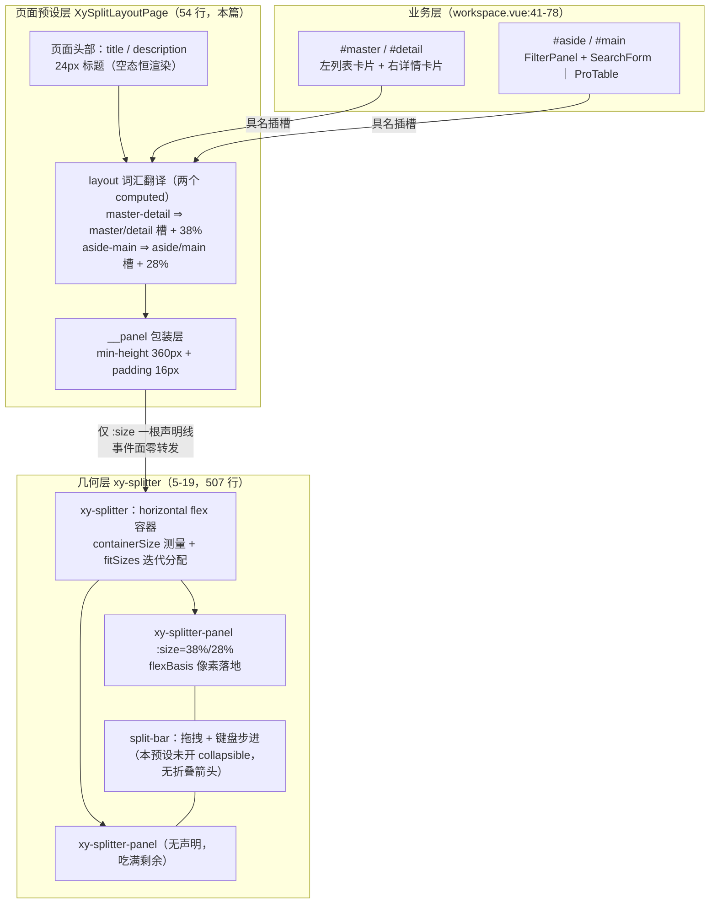
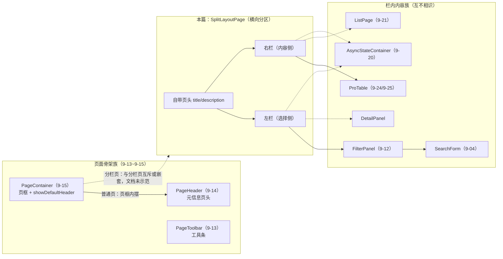
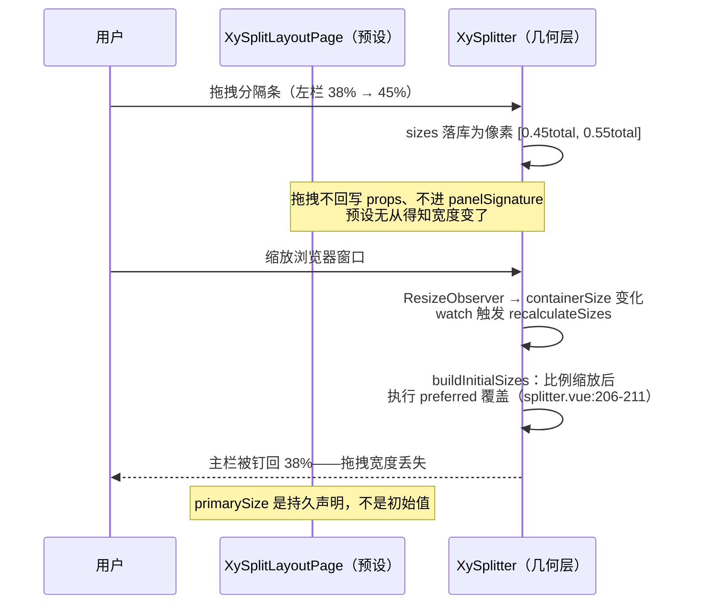

# 9-23 · SplitLayoutPage：分栏页面

> 本篇是 9 卷"增强层（pro-components）"的第二十三篇。9-22 拆完金字塔顶层的 `XyCrudPage`——纵向叠层的封顶之作——本篇换一个维度看页面级组件：横向分区。核心问题按大纲只有一句话——**Splitter 的页面级封装**（`column/02-分卷大纲.md:177`，前置阅读标注 5-19）——但这句话里至少藏着七道题：一个 8 行的类型文件、一个 54 行的视图文件，凭什么叫"页面级"组件（轻协议靠什么撑起布局语义）；`master-detail` 与 `aside-main` 两个字面量在实码里到底差在哪几行（答案可能出乎意料：DOM 完全同构，差别只有两个 computed）；5-19 已经把拖拽几何拆到了 `applyOffset` 的单个 clamp，页面预设在这一层"接线"接了哪几根、又裁掉了哪几根；专栏 9-12 考据过的 `workspace.vue:59-78` 侧栏段组合消费 filter-panel——完整版示例到底长什么样；"左栏宽度记忆/折叠"这个后台工作区的标配能力，在实码里存在吗（答案：不存在，而且实码的声明优先语义恰好是宽度记忆的反面）；以及它与 page-container（9-15）、page-header（9-14）这对页面骨架族的分界在哪。本篇全部给实码定论，并为 9-24《ProTable（上）：配置模型》埋好引线。

接到题目先复述一遍目标，防止写偏：`XySplitLayoutPage` 要解决的业务场景，是后台系统里最常见的一类双栏工作区——左栏放"选择什么"（列表、树、筛选、导航），右栏放"选中的是什么"（详情、表格、图表、编辑区）。这个形态在不同业务里有一堆名字：主从页、侧栏页、master-detail、list-detail、树形导航工作台。基础层 5-19 给了 `xy-splitter`——507 行的状态机与分配算法，能拖、能折叠（collapsible）、能双向绑定（`v-model:size`）——但业务从 `xy-splitter` 到"一个成型的分栏工作区"之间还差三样东西：一条页头（标题 + 说明）、一组说得出语义的插槽名（`master`/`detail` 还是 `aside`/`main`）、一个不用每页拍脑袋的默认栏宽。`split-layout-page` 把这三样收进一个组件。它自己不做状态管理、不做持久化、不做响应式堆叠——`apps/docs/pro-components/split-layout-page.md:25` 写得明白："路由同步、拖拽持久化和复杂工作台状态仍建议由业务页自行编排。"它的全部价值是**把一个几何原语翻译成一个页面词汇**。

先交代体量，给全文一个标尺：`split-layout-page` 组件目录四个文件共 109 行——`src/split-layout-page.ts` 8 行（纯类型）、`src/split-layout-page.vue` 54 行（脚本段 27 行、模板段 26 行）、`index.ts` 9 行、`__tests__/split-layout-page.spec.ts` 38 行（两个用例）；专属样式 `packages/theme/src/pro/split-layout-page.css` 全文 45 行。9-22 的 crud-page 是"23 行类型 + 181 行视图 + 87 行测试"，本篇主角是它的三分之一——**整条页面级产品线最轻的一层**，与 9-22 结尾的预告吻合（"全文只有 8 行"）。文档页 45 行、场景示例 80 行（`apps/docs/examples/pro/split-layout-page/workspace.vue`）、类型夹具 10 行（`tests/types/fixtures/split-layout-page.ts`）。本篇按"导出链路 → 类型层 → 视图层 → 接线段 → 工作区实证 → 样式 → 三个设计权衡 → 测试与历史"这条主线走。

## 一、导出链路与体量：8 行类型，54 行视图

老规矩，先看安装入口，`split-layout-page/index.ts` 全文 9 行：

```ts
// packages/pro-components/split-layout-page/index.ts（全文 9 行）
import SplitLayoutPage from "./src/split-layout-page.vue";
import type { SplitLayoutPageProps } from "./src/split-layout-page";
import { withInstall } from "xiaoye-primitives";

export type { SplitLayoutPageProps };

export const XySplitLayoutPage = withInstall(SplitLayoutPage, "xy-split-layout-page");

export default XySplitLayoutPage;
```

与 9-21 的 list-page、9-22 的 crud-page 入口逐字同构——"包装规格"上依然没有特殊性。值导出走 `packages/pro-components/exports.ts:28` 的 `export { XySplitLayoutPage } from "./split-layout-page"`，类型导出走根入口 `packages/pro-components/index.ts:114` 的 `export type { SplitLayoutPageProps }`。注意根入口**只抬了主 Props 一个类型**：第 1 行的 `SplitLayoutPageLayout` 字面量联合（`"master-detail" | "aside-main"`）留在源码层没有上抬——这正是 9-01 立下的根入口白名单纪律（"props 字面量联合……默认不应出现在根入口"）在最小组件上的照章执行。清单登记在 `packages/pro-components/component-manifest.json:218-225`，`docsGroup` 是 `"page"`（页面骨架族）、`installExports` 是 `["XySplitLayoutPage"]`、`installChecks` 是 `[{ "kind": "component", "name": "xy-split-layout-page" }]`、`styleImports` 是 `["split-layout-page"]`；样式经 `packages/pro-components/style.css:29` 引入那份 45 行的专属样式。安装注册有聚合测试兜底：`packages/pro-components/__tests__/install.spec.ts:24-28` 遍历 `proInstallCheckEntries`，对每个 `kind === "component"` 的条目断言 `app.component(entry.name)` 为真——测试文件里搜不到 "split-layout-page" 字样，但断言覆盖到了它，4-01 讲过的"manifest 驱动一致性"复利照旧。把根入口这一段的原文钉在这里，能看出类型白名单的执行粒度：

```ts
// packages/pro-components/index.ts:108-118
export type {
  ListPageActionRef,
  ListPageBatchAction,
  ListPageProps
} from "./list-page";
export type { CrudPageProps } from "./crud-page";
export type { SplitLayoutPageProps } from "./split-layout-page";
export type {
  ApprovalFlowNode,
  ApprovalFlowPanelProps
} from "./approval-flow-panel";
```

113 行的 crud-page 抬了 1 个类型，115-118 行的 approval-flow-panel 抬了 2 个，114 行的 split-layout-page 抬了 1 个——相邻三行就是三种"主 Props 之外还有什么该出根入口"的决策样本，分栏页面选了最严格的那档。

侧边栏定位也顺带核实过：`apps/docs/pro-components/overview.md:53` 给它的导语是"统一主从布局与侧栏布局，不再把两种双栏工作区拆成并列主心智"——这句话是理解本组件的钥匙，第六节的权衡一会回到它。

## 二、类型层：1 个字面量联合 + 4 个可选 prop

类型文件全文展开，8 行：

```ts
// packages/pro-components/split-layout-page/src/split-layout-page.ts（全文 8 行）
export type SplitLayoutPageLayout = "master-detail" | "aside-main";

export interface SplitLayoutPageProps {
  title?: string;
  description?: string;
  layout?: SplitLayoutPageLayout;
  primarySize?: string;
}
```

全库公开组件里最短的 Props 之一：四个 prop 全部可选、全部无逃逸舱（没有 `splitterProps` 这类透传口）、没有泛型。对照 9-22 的 `CrudPageProps`（15 个 prop、五个 import、收编四条法域），这份类型是金字塔的另一个极端——**它收编的不是配置，是词汇**。逐个过一遍：

- `layout`：唯一的语义 prop。两个字面量不是两种实现，是同一几何的两套叫法（第三节给实码定论）；
- `primarySize`：主栏宽度声明，`string` 类型——能传 `"38%"` 也能传 `"320px"`，因为基础层 `SplitterSize` 本来就是 `number | string`（`packages/components/splitter/src/splitter.ts:2`），百分比与像素在 `resolveSize`（`splitter.vue:69-96`，5-19 拆过）处归一化为像素；
- `title` / `description`：页头文案，默认空串。

类型夹具里的用户侧实例，全文 10 行：

```ts
// tests/types/fixtures/split-layout-page.ts（全文 10 行）
import type { SplitLayoutPageProps } from "@xiaoye/pro-components";

const props: SplitLayoutPageProps = {
  title: "风控工作区",
  description: "左侧筛选，右侧主内容",
  layout: "aside-main",
  primarySize: "30%"
};

void props;
```

四个 prop 一次用全——这个组件的配置面小到夹具一屏装下。值得注意夹具选了 `layout: "aside-main"` + `primarySize: "30%"` 的组合：默认布局加自定义宽度，是文档预设值（aside-main 默认 28%）之外的常见微调路径。

## 三、视图层全文：54 行里的三次间接

脚本段全文 27 行：

```ts
// packages/pro-components/split-layout-page/src/split-layout-page.vue:1-27
<script setup lang="ts">
import { computed } from "vue";
import { XySplitter, XySplitterPanel } from "xiaoye-components";
import type { SplitLayoutPageProps } from "./split-layout-page";

defineOptions({
  name: "XySplitLayoutPage"
});

const props = withDefaults(defineProps<SplitLayoutPageProps>(), {
  title: "",
  description: "",
  layout: "aside-main",
  primarySize: ""
});

const resolvedPrimarySize = computed(() => {
  if (props.primarySize) {
    return props.primarySize;
  }

  return props.layout === "master-detail" ? "38%" : "28%";
});

const primarySlotName = computed(() => (props.layout === "master-detail" ? "master" : "aside"));
const secondarySlotName = computed(() => (props.layout === "master-detail" ? "detail" : "main"));
</script>
```

脚本段的全部逻辑就是三个 computed。第一个 `resolvedPrimarySize`（17-23 行）是默认宽度派生：业务传了 `primarySize` 就原样用，否则按 layout 给预设值——`master-detail` 给 `38%`、`aside-main` 给 `28%`（22 行）。主从页的左栏是"记录集合"（一个列表/树通常要更宽），侧栏页的左栏是"筛选/导航"（可以更窄），两个百分点是这条产品线替业务拍的唯一一个视觉板。后两个 computed（25-26 行）是插槽名翻译：layout 决定业务该写 `#master`/`#detail` 还是 `#aside`/`#main`。

还有一个不起眼但重要的细节在第 3 行：`import { XySplitter, XySplitterPanel } from "xiaoye-components"`——增强层消费基础层走的是**包名直引**（`packages/pro-components/package.json:47` 的 `"xiaoye-components": "workspace:^"` 依赖），而不是 5-19 末尾提过的 `XySplitter.Panel` 静态挂载形态。两个组件被平铺成两个名字，预设的依赖声明就是这个页面组装面的完整清单：`xy-splitter` + `xy-splitter-panel`，仅此而已。

模板段全文 26 行：

```vue
<!-- packages/pro-components/split-layout-page/src/split-layout-page.vue:29-54 -->
<template>
  <div class="xy-split-layout-page">
    <div class="xy-split-layout-page__header">
      <div class="xy-split-layout-page__header-main">
        <div class="xy-split-layout-page__header-heading">
          <h2 v-if="props.title" class="xy-split-layout-page__header-title">{{ props.title }}</h2>
          <p v-if="props.description" class="xy-split-layout-page__header-description">
            {{ props.description }}
          </p>
        </div>
      </div>
    </div>
    <xy-splitter>
      <xy-splitter-panel :size="resolvedPrimarySize">
        <div class="xy-split-layout-page__panel">
          <slot :name="primarySlotName" />
        </div>
      </xy-splitter-panel>
      <xy-splitter-panel>
        <div class="xy-split-layout-page__panel">
          <slot :name="secondarySlotName" />
        </div>
      </xy-splitter-panel>
    </xy-splitter>
  </div>
</template>
```

把模板结构读完，本篇第一处核心定论就能下了：**`master-detail` 与 `aside-main` 的 DOM 完全同构**。整段模板里没有任何一个 `v-if`/分支去看 layout 的值——两个 layout 走的是同一棵模板树，`layout` 的全部实码影响只有两个 computed 的输出：插槽名（`master`/`detail` 对 `aside`/`main`）与默认宽度（`38%` 对 `28%`）。也就是说 `layout` 不是"布局开关"，是**语义别名**：它决定业务代码里插槽写什么词、决定不传宽度时栏有多宽，仅此而已。基础层 `xy-splitter` 的 `layout`（horizontal/vertical）是真正的轴向开关（`splitter.vue:49` 的 `rootClasses` 会换 `--horizontal/--vertical` 类），而页面预设压根没有把 `layout` 传给 `xy-splitter`——分栏页面永远是横 split，基础层的 vertical 能力在这层封装里不可达。两个"layout"重名不同义，读源码时容易撞车，值得点名。

模板里还有三次值得停留的间接。**第一，动态插槽名**：`<slot :name="primarySlotName" />`（44 行）——Vue 的具名插槽支持动态名，这让"同一个模板、两套插槽词汇"不需要重复任何结构。但代价也在这里：如果业务运行时切换 `layout`（比如从 master-detail 切到 aside-main），插槽名跟着变，业务只提供过 `#master`/`#detail` 的话，面板会瞬间变空——**动态切 layout 是"词汇切换"，不是"内容搬运"**，业务得把两对插槽都备齐才能安全切换。**第二，panel 包装层**：每个插槽外面套了一层 `__panel` div（43-45、48-50 行），它是插槽内容与几何层之间的缓冲——业务往插槽里塞什么（卡片、表格、面板），都先落进一个带内边距与最小高度的容器，几何层的 flexBasis 尺寸变化不会直接打在业务根元素上（第五节样式部分展开）。**第三，副面板无 size**：47 行的第二个 `xy-splitter-panel` 什么 prop 都没传——按基础层的分配算法（`splitter.vue:191-198`），未声明尺寸的面板平摊剩余空间，于是"主栏声明、副栏吃满剩余"就成了这个预设的分配语义。

模板里还有一处**毛边**值得如实立案：31 行的 `__header` 容器**没有 v-if**。`title` 与 `description` 都是 v-if 守卫（34、35 行），都为空时 h2/p 不渲染，但外层 header 照样渲染——一份带边框、24px 内边距、背景色的**空头部卡片**会出现在页面顶端。对照同族 page-container 的做法，`packages/pro-components/page-container/src/page-container.vue:33-41` 有一个 `showDefaultHeader` computed：

```ts
// packages/pro-components/page-container/src/page-container.vue:33-41
const showDefaultHeader = computed(
  () =>
    !slots.header &&
    (Boolean(props.title) ||
      Boolean(props.description) ||
      props.metaItems.length > 0 ||
      Boolean(slots.extra) ||
      Boolean(slots.actions))
);
```

标题、描述、meta、extra、actions 五路全空且没有 header 插槽时整个页头不渲染——**同一个产品线里，页容器学会了"空则不渲染"，分栏页面没学会**。顺带还有 `__header-main`（32 行）这层包裹：header 的样式是 `justify-content: space-between`（为左右两块预留），但模板里只有一个子元素——右侧那块"动作区"是预留了样式、没预留模板的死代码。这两处是本篇查出 yet 未修的毛边，修法都现成：header 加 v-if（或学 page-container 加 computed）、删掉多余的包裹层。

## 四、接线段：预设与基础层的四个接触点

先看图，这是本篇必交的布局封装结构：



图上那条"仅 :size 一根声明线"就是本节的主题。5-19 把几何层拆到了钳制数学，本篇要看的是**页面预设往这层几何上接了哪几根线**。数下来，接了四根，也剪了四根。

**接触点一：主栏尺寸声明（唯一一根数据线）。** 模板 42 行 `:size="resolvedPrimarySize"` 是预设向几何层发出的全部状态——一个字符串声明。它落到几何层后的旅程是 5-19 讲过的：`split-panel.vue:61-63` 把容器分配的像素写成 `flexBasis`，CSS 的 `flex: 0 0 auto`（`packages/theme/src/components/splitter.css:33-39`）保证它是硬约束。但有一个 5-19 只点了一半的语义要在这里讲透，因为它直接决定"宽度记忆"问题的答案——**声明优先不只发生在签名变化时，也发生在每次容器测量时**。看基础层的分配入口 `buildInitialSizes` 全文：

```ts
// packages/components/splitter/src/splitter.vue:177-214
function buildInitialSizes(total: number) {
  if (!panels.value.length || total <= 0) {
    return panels.value.map(() => 0);
  }

  const bounds = getPanelBounds(total);
  const currentSizesAvailable =
    sizes.value.length === panels.value.length && lastContainerSize.value > 0;
  let initialSizes: number[];

  if (currentSizesAvailable) {
    const scale = total / lastContainerSize.value;
    initialSizes = sizes.value.map((size) => size * scale);
  } else {
    const explicitSizes: Array<number | undefined> = panels.value.map((panel) =>
      resolveSize(panel.size, total)
    );
    const explicitTotal = explicitSizes.reduce<number>((acc, value) => acc + (value ?? 0), 0);
    const autoCount = explicitSizes.filter((value) => value === undefined).length;
    const fallbackSize = autoCount > 0 ? Math.max(total - explicitTotal, 0) / autoCount : 0;

    initialSizes = explicitSizes.map((value) => value ?? fallbackSize);

    if (!autoCount && initialSizes.length) {
      const lastIndex = initialSizes.length - 1;
      initialSizes[lastIndex] = (initialSizes[lastIndex] ?? 0) + (total - explicitTotal);
    }
  }

  panels.value.forEach((panel, index) => {
    const preferred = resolveSize(panel.size, total);
    if (preferred !== undefined) {
      initialSizes[index] = preferred;
    }
  });

  return fitSizes(initialSizes, total, bounds);
}
```

逐段读：容器 resize 时（`watch([containerSize, panelSignature], recalculateSizes)`，`splitter.vue:458-462`；ResizeObserver 挂在 `splitter.vue:306-310`）走 `currentSizesAvailable` 分支把现有像素按比例缩放——这是 5-19 说的"像素存储的容器自适应"；但注意 206-211 行的**preferred 覆盖**在比例缩放**之后**无条件执行：凡是声明了 `size` 的面板，`initialSizes[index]` 都会被重新钉回 `resolveSize(panel.size, 新 total)`。对 split-layout-page 而言，主栏恒有声明（`38%`/`28%` 或业务传值），于是**每次容器重算，主栏都被重新钉回声明的比例**——比例缩放分支算出的结果对主栏是无效功。这个语义的完整表述是：`primarySize` 不是初始值，是**持久声明**。用户把分隔条拖到 45%、然后缩放一下浏览器窗口，主栏会回到 38%（或 28%）——拖拽产物在容器尺寸变化时归零。第六节权衡二展开这个选择的代价。

**接触点二：副栏的"无声明"也是声明。** 副面板不传 size（模板 47 行），在 `buildInitialSizes` 里走 `fallbackSize` 平摊（191-198 行），在拖拽里走零和博弈的另一侧（`applyOffset` 的 `pairTotal - nextFirst`）。"主栏声明 + 副栏吸收"是预设替业务定死的分配模型——业务若想要"左右都按内容自适应、拖拽微调"，这个预设给不了（那是直接用 xy-splitter 不声明 size 的用法）。

**接触点三：resizable 默认开启，min/max 全空白。** `xy-splitter-panel` 的 `resizable` 默认 true（`split-panel.ts` 的 `withDefaults`，8-11 行），所以预设的分栏天然可拖——这是页面预设"白拿"基础层的最大红利。把面板子组件的派生段与模板段全文钉在这里，面板到分隔条的整条接线一目了然：

```vue
<!-- packages/components/splitter/src/split-panel.vue:56-86 -->
const panelSize = computed(() => splitter.getPanelSize(index.value));
const nextPanel = computed(() => splitter.getPanel(index.value + 1));
const showBar = computed(() => Boolean(nextPanel.value));
const canResize = computed(() => Boolean(props.resizable && nextPanel.value?.resizable));
const isActiveBar = computed(() => splitter.movingIndex.value === index.value);
const panelStyle = computed(() => ({
  flexBasis: `${panelSize.value}px`
}));
</script>

<template>
  <div :class="ns.base.value" :style="panelStyle">
    <slot />
  </div>

  <SplitBar
    v-if="showBar"
    :index="index"
    :layout="splitter.layout.value"
    :lazy="splitter.lazy.value"
    :resizable="canResize"
    :active="isActiveBar"
    :active-offset="splitter.previewOffset.value"
    :start-collapsible="Boolean(props.collapsible)"
    :end-collapsible="Boolean(nextPanel?.collapsible)"
    @move-start="splitter.onResizeStart"
    @moving="splitter.onResize"
    @move-end="splitter.onResizeEnd"
    @collapse="splitter.onCollapse"
  />
</template>
```

61-63 行的 `panelStyle` 就是声明宽度落地的最后一跳（`flexBasis` 像素）；75-78 行的分隔条接线把 `canResize`/`isActiveBar`/`previewOffset` 全部接通；79-80 行的 `startCollapsible`/`endCollapsible` 直接取自面板的 `collapsible` prop。但预设连 `min`/`max` 一个都没传：主栏可以被拖到接近 0，也可以吃掉几乎全部空间。5-19 拆过的交集钳制（`minFirst = Math.max(firstBounds.min, pairTotal - secondBounds.max)`）在这里没有用武之地，因为两个面板都没有边界声明。一个"筛选栏被用户拖没了"的后台页面，就是这条空白约束面的直接后果——预设没有替业务守住"左栏至少还能看到点东西"的底线。

**接触点四（其实是四剪）：能力与事件面的裁剪。** 数一遍基础层暴露给上层的接口：四个事件（`resizeStart`/`resize`/`resizeEnd`/`collapse`，`splitter.vue:22-27`）、`v-model:size` 双向绑定（`split-panel.vue:44-46` 的 `emitSizeUpdate` → `update:size`）、`collapsible` 折叠（`split-bar.vue:202` 与 229 行的两个折叠按钮，`v-if="startCollapsible"`/`endCollapsible`）、`lazy` 预览、`min`/`max` 约束。split-layout-page 接了几个？**一个都没接**。没有转发任何事件——业务在 `xy-split-layout-page` 上监听不到 `resizeEnd`，无法持久化拖拽结果；没有 `v-model:size`——拖拽宽度拿不到手；没传 `collapsible`——折叠箭头根本不渲染（`split-bar.vue:202` 的 v-if 恒假）；没传 `min`/`max`——如上；没传 `lazy`——拖拽实时重排（对后台列表这种重内容，实时重排可能卡顿，lazy 预览模式正好是为这种场景设计的，也没开）。预设把几何层的能力面裁到只剩"可拖 + 声明宽度"。这不是疏忽而是一种立场——预设越薄，业务越知道自己在用什么——但它有一个实实在在的副作用：文档承诺"拖拽持久化由业务页自行编排"（`split-layout-page.md:25`），而预设上**没有持久化所需的通道**（拿不到拖拽事件），业务要持久化只能放弃预设、下穿直接用 `xy-splitter`。"自行编排"这句话在预设上是不可达的，这是本篇立案的实码矛盾，第六节权衡二细说。

顺带把折叠能力为什么没接的原因讲清——基础层的折叠记忆实现值得整段读，它正是"宽度记忆"这个话题在几何层的既有答案：

```ts
// packages/components/splitter/src/splitter.vue:412-439
function toggleCollapsed(index: number, direction: SplitterCollapseDirection) {
  const targetIndex = direction === "start" ? index : index + 1;
  const siblingIndex = direction === "start" ? index + 1 : index;
  const total = containerSize.value;
  const bounds = getPanelBounds(total);
  const nextSizes = [...sizes.value];
  const pairTotal = nextSizes[targetIndex] + nextSizes[siblingIndex];
  const targetSize = nextSizes[targetIndex];

  if (targetSize > 0.5) {
    collapseMemory.set(targetIndex, targetSize);
    nextSizes[targetIndex] = 0;
    nextSizes[siblingIndex] = roundSize(pairTotal);
    return nextSizes;
  }

  const remembered = collapseMemory.get(targetIndex);
  const preferred = resolveSize(panels.value[targetIndex]?.size, total);
  const desired = remembered ?? preferred ?? Math.max(pairTotal / 2, bounds[targetIndex].min);

  const minTarget = Math.max(bounds[targetIndex].min, pairTotal - bounds[siblingIndex].max);
  const maxTarget = Math.min(bounds[targetIndex].max, pairTotal - bounds[siblingIndex].min);
  const restored = clamp(desired, minTarget, maxTarget);
  return nextSizes;
}
```

`collapseMemory`（`splitter.vue:37` 的 `Map<number, number>`）折叠时记下面板宽度、展开时按"记忆值 → props 声明 → 对半分"的优先级恢复——**会话内的宽度记忆，几何层早就有了**，`splitter.spec.ts:118-164` 的第四条用例端到端验证过它（折叠到 0、再点恢复 180px，走 `v-model:size` 双向绑定）。但它的激活条件是面板声明 `collapsible`，而页面预设没声明——于是一个有趣的局面出现了：**宽度记忆的三层答案（会话记忆在几何层、跨会话持久化在业务层、页面预设层什么都不做）里，预设这一层是空的**。恢复优先级里还有一个与本篇直接相关的细节：`remembered ?? preferred ?? ...`——记忆值优先于 props 声明，这意味着哪怕预设开了 collapsible，折叠恢复出来的宽度也**不是** `primarySize`，而是折叠前的拖拽宽度（记忆值存在时声明被跳过）。声明优先与记忆优先在几何层是两套并存的语义，预设用不用得到，取决于接不接 `collapsible`。

继承自几何层的还有可达性：分隔条是 `<button role="separator">`（`split-bar.vue:215-227`），方向键 12px、Shift 加速 32px 的步进在页面上原样可用——键盘步进的合成会话全文如下，它把一次按键变成一次完整的拖拽会话：

```ts
// packages/components/splitter/src/split-bar.vue:148-176
function handleKeydown(event: KeyboardEvent) {
  if (!props.resizable) {
    return;
  }

  const step = event.shiftKey ? 32 : 12;
  let offset = 0;

  if (isHorizontal.value) {
    if (event.key === "ArrowLeft") {
      offset = -step;
    } else if (event.key === "ArrowRight") {
      offset = step;
    }
  } else if (event.key === "ArrowUp") {
    offset = -step;
  } else if (event.key === "ArrowDown") {
    offset = step;
  }

  if (!offset) {
    return;
  }

  event.preventDefault();
  emit("moveStart", props.index);
  emit("moving", props.index, offset);
  emit("moveEnd", props.index);
}
```

页面预设不需要为可达性写一行代码，这是分层封装的红利面。顺便一提，几何层那笔"欠 aria-valuenow 数值播报"的旧账（5-19 第九节记的），在页面级同样继承——分栏工作区的键盘用户依然听不到"左栏 38%"。

## 五、工作区实证：workspace.vue 的完整组合

9-12 拆 FilterPanel 时考据过一个事实：`XyFilterPanel` 不被任何增强组件消费，只在文档层被页面骨架示例引用（`apps/docs/examples/pro/split-layout-page/workspace.vue:65`）——"它的客户是业务页面，不是组件家族"。本篇展开这个组合消费实证的完整版。示例脚本段全文 28 行：

```vue
<!-- apps/docs/examples/pro/split-layout-page/workspace.vue:1-28 -->
<script setup lang="ts">
import { reactive } from "vue";
import type { ProTableColumn, SearchFormField } from "@xiaoye/pro-components";

interface RuleRow {
  id: number;
  name: string;
  owner: string;
}

const searchModel = reactive({
  keyword: ""
});

const searchFields: SearchFormField[] = [
  { prop: "keyword", label: "关键词", component: "input", span: 2 }
];

const rows: RuleRow[] = [
  { id: 1, name: "权限模板", owner: "小叶" },
  { id: 2, name: "审批规则", owner: "小星" }
];

const columns: ProTableColumn<RuleRow>[] = [
  { prop: "name", label: "名称", minWidth: 180 },
  { prop: "owner", label: "负责人", minWidth: 120 }
];
</script>
```

脚本段只备三样货：`searchModel`/`searchFields` 给 SearchForm（9-04 的 schema 驱动）、`rows`/`columns` 给 ProTable（9-24/9-25 的列配置）。没有一行布局状态——这就是预设的卖点：分栏本身零脚本。模板段全文 51 行：

```vue
<!-- apps/docs/examples/pro/split-layout-page/workspace.vue:30-80 -->
<template>
  <div class="xy-pro-demo-stack">
    <xy-card header="收口后的理解方式">
      <p>
        当前文档不再把“主从页”和“侧栏页”当成两套并列能力，而是统一理解为后台分栏工作区。
      </p>
      <p>
        左侧可以是列表、树、筛选或导航，右侧则承接详情、表格、图表或编辑区域。
      </p>
    </xy-card>

    <xy-split-layout-page
      layout="master-detail"
      title="分栏工作区：主从详情"
      description="左侧记录集合，右侧详情查看。"
    >
      <template #master>
        <xy-card header="工单列表">这里承接记录集合、树或待办池。</xy-card>
      </template>
      <template #detail>
        <xy-card header="当前工单详情">
          <xy-descriptions :column="2" border>
            <xy-descriptions-item label="负责人">小叶</xy-descriptions-item>
            <xy-descriptions-item label="状态">处理中</xy-descriptions-item>
          </xy-descriptions>
        </xy-card>
      </template>
    </xy-split-layout-page>

    <xy-split-layout-page
      layout="aside-main"
      title="分栏工作区：筛选与主内容"
      description="左侧筛选或导航，右侧主结果区。"
    >
      <template #aside>
        <xy-filter-panel title="筛选条件">
          <xy-search-form :model="searchModel" :fields="searchFields" />
        </xy-filter-panel>
      </template>
      <template #main>
        <xy-pro-table
          title="规则列表"
          description="这里承接主表格、看板或图表。"
          :data="rows"
          :columns="columns"
          :pagination="false"
        />
      </template>
    </xy-split-layout-page>
  </div>
</template>
```

两个实例对照着读，恰好把第三节"DOM 同构"的定论演示出来。**第一段（41-57 行，master-detail）**：`#master` 塞一张 `xy-card`（工单列表），`#detail` 塞一张 `xy-card` 内嵌 `xy-descriptions`（9-03 讲过的基础层描述列表）——左"集合"右"单体"，经典主从。**第二段（59-78 行，aside-main）**：`#aside` 塞 FilterPanel + SearchForm（9-12 的"侧边卡片"摆位——筛选区常驻左栏，宽屏下不占主区高度，与 filter-panel basic 示例的"顶部卡片"摆位构成两种信息密度策略），`#main` 塞 ProTable（`:pagination="false"` 的纯前端数据形态）。两段模板的骨架逐字同构，只有插槽词与内容不同——文档导语"不再把主从页和侧栏页拆成并列主心智"（`overview.md:53`）在示例层面的实现方式，就是**让两套心智共享同一个 DOM**。

这段示例同时是 9-13~9-15 页面骨架族与内容组件族的**组合面实证**。数一下这个 80 行的文件里同台的组件：分栏骨架（本篇）、卡片（基础层）、描述列表（基础层）、FilterPanel（9-12）、SearchForm（9-04）、ProTable（9-24/9-25）——六个组件、三层来源，通过四对插槽完成组装，组件之间零直接通信：SearchForm 不知道自己被 FilterPanel 包着，FilterPanel 不知道自己被分栏页装着，分栏页不知道自己左栏是什么。这与 9-12 定论的"零语义容器"红利一脉相承：**形态自由来自不持立场**——分栏页对插槽内容的唯一假设是"它会自己处理溢出"（几何层的 `overflow: auto`，`splitter.css:37`）。

文档页（`apps/docs/pro-components/split-layout-page.md:21`）给它的家族定位是："在收口后的公开体系里，它承担页面骨架，而具体内容继续通过 `ListPage`、`DetailPage`、`FilterPanel` 等能力嵌入。"这句话把本组件从 9-21/9-22 的"组装者"角色里摘了出来——crud-page 是**编排**（把三个子系统接成闭环、截留事件、合成插槽），split-layout-page 是**摆位**（把两块业务内容放到左右两个槽里，其余什么都不管）。金字塔的"页面级"因此有两种形态：纵向的组装（组件互相通信）与横向的分区（组件互不相识）。分栏页面属于后者，所以它能这么轻。



图上实线是 workspace.vue 与文档定位有实证的边，虚线是家族里"理论可组合、文档未示范"的边。其中最需要想清楚的是 PageContainer 与 SplitLayoutPage 的关系：两者都有 `title`/`description` 页头、都叫"页面容器"，分栏页放进页容器会出现**双页头叠加**（页容器的头 + 分栏页的头），分栏页单独用则缺了页容器的 loading/bordered/边框语义。收口后的家族分工是：**整页有统一页框诉求的用 PageContainer 包外层、分栏页不传 title**（靠空态 header 的毛边反而"歪打正着"地不那么难看——不对，空 header 恒渲染，这一招现在还不成立，见第三节毛边立案）；纯分栏工作台则直接用 SplitLayoutPage 自带头部。家族内部"谁来当最外层"目前没有权威答案，是这套页面级产品线留下的组合学欠账。

## 六、样式全文：45 行与三个不动点

专属样式全文 45 行：

```css
/* packages/theme/src/pro/split-layout-page.css（全文 45 行） */
.xy-split-layout-page {
  display: flex;
  flex-direction: column;
  gap: 18px;
}

.xy-split-layout-page__header {
  display: flex;
  align-items: flex-start;
  justify-content: space-between;
  gap: 16px;
  padding: 24px;
  border: 1px solid color-mix(in srgb, var(--xy-border) 90%, var(--xy-mix-light));
  border-radius: var(--xy-radius-lg);
  background: var(--xy-bg-container);
}

.xy-split-layout-page__header-main {
  display: flex;
  flex-direction: column;
  gap: 10px;
}

.xy-split-layout-page__header-title {
  margin: 0;
  font-size: 24px;
  font-weight: var(--xy-font-weight-bold);
}

.xy-split-layout-page__header-description {
  margin: 0;
  color: var(--xy-text-secondary);
}

.xy-split-layout-page__panel {
  min-height: 360px;
  padding: 16px;
}

@media (max-width: 960px) {
  .xy-split-layout-page__header {
    flex-direction: column;
    align-items: stretch;
  }
}
```

45 行里三个"不动点"值得逐一核对。**不动点一：根是纵向 flex、18px 栅距（1-5 行）**——与 crud-page 的根样式（9-22 考据过，同为 18px 栅距）完全一致，"页头 + 分栏体"的纵向排布是页面级产品线的统一姿态；令牌消费走语义层（`--xy-border`/`--xy-bg-container`/`--xy-radius-lg`/`--xy-text-secondary`）加一处 `color-mix` 微调边框明度，符合 3 卷立下的"组件只消费语义层与刻度层"纪律。**不动点二：`__panel` 的 min-height 360px（35-38 行）**——这是全文件最重的一行视觉决策，它回答了"几何层高度从哪来"的问题。基础层容器的样式是这一段（`packages/theme/src/components/splitter.css:1-9`）：

```css
/* packages/theme/src/components/splitter.css:1-9 */
.xy-splitter {
  --xy-splitter-offset: 0px;
  position: relative;
  display: flex;
  width: 100%;
  height: 100%;
  min-width: 0;
  min-height: 0;
}
```

第 6 行的 `height: 100%` 是几何层的适配姿态；而面板侧（`splitter.css:33-39`）：

```css
/* packages/theme/src/components/splitter.css:33-39 */
.xy-splitter-panel {
  flex: 0 0 auto;
  min-width: 0;
  min-height: 0;
  overflow: auto;
  box-sizing: border-box;
}
```

而分栏页的根没有任何高度约束——`height: 100%` 对高度不定（auto）的父级无效，回落为内容高度。于是真实的高度链条是：`__panel` 的 360px 最小高度把面板撑起来 → splitter 跟着内容走 → 整页高度 = 头部 + 360px 起。**默认形态是"内容撑高、页面滚动"，不是"视口内双栏各自滚动"的工作台形态**。后台系统里后者才常见（左栏树滚动、右栏表格滚动、页面不滚），要那一种形态，业务得自己给根一个高度（`height: calc(100vh - 头部)` 之类）——预设不做这个决策，但也没在文档里写这条集成须知，属于隐藏的接线上下文。**不动点三：960px 断点只折头部（40-45 行）**——媒体查询里只把 header 从横向改纵向，**分栏本体不做响应式堆叠**：窄屏下左右两栏照样并排，分隔条照样可拖。移动端"上下堆叠"的常见预期在这个预设上不存在。这与 5-16/5-17 栅格家族"断点矩阵"的作风形成对照：栅格把响应式做进了组件，分栏页把响应式留给了业务。原因不难想：双栏堆叠意味着布局模型要从"横向 flex + 拖拽"切换到"纵向流"，拖拽语义在堆叠形态下无意义——预设一旦内建堆叠，就得回答"切回来时宽度还记不记得"，正好撞进下一节权衡二的深水区。宁可不做，也不做半截。

## 七、三个设计权衡

### 权衡一：预设词汇 vs 自由分栏——两个字面量买什么

现在可以正面回答"轻协议怎么撑起布局语义"了。`layout` 两个字面量的全部实码成本：两个 computed（`split-layout-page.vue:25-26`）加一个三元（22 行）。它买到的东西有三样。**第一是词汇标准**：后台页面的"主从页/侧栏页"之争从此是同一个组件的两个取值，文档、示例、代码评审用同一套词说话——`split-layout-page.md:19` 说"统一表达后台双栏页面，不再把主从页和分栏页拆成两套主公开入口"，git 层面也印证这次收口：本组件在 `a32e399`（"feat: 新增 pro 组件并增强表单与表格能力"）初次进入仓库时就是现在这个收口后的形态，历史里没有 master-detail-page 与 aside-page 两个独立组件的痕迹，收口发生在成文之前——此后仅 `dc9ca28` 改写过一行 import 来源（`@xiaoye/components` 改 `xiaoye-components`，依赖治理），组件本体零改动。**第二是默认值**：38%/28% 把"主从左栏该多宽"这种每个业务都要拍一次的板集中拍了一次。**第三是插槽契约**：`#master`/`#aside` 的命名把"左栏放什么"的产品语义编码进了插槽名，读到 `#aside` 就知道左栏是辅助区——这比 `#left` 这种几何命名多携带一层语义。

对比阵营可以看清这个尺度的两端。**Element Plus 没有任何页面级分栏预设**：`el-container`/`el-aside`/`el-main` 家族是零状态、零拖拽的自由布局原语（aside 宽度就是一个 CSS 宽度，不支持拖拽调整）；2025 年 6 月合入的 `el-splitter`（PR #20145，5-19 第八节考据过）也只是几何原语——无页头、无默认宽、无插槽词汇，拼一个带页头的主从工作区，EP 用户要自己写页头卡片、自己定默认宽度、自己包装两块面板、自己起插槽名，每个业务页重复一遍。**Ant Design 的 ProLayout 是另一极端**：菜单集成、侧栏折叠记忆、断点自动收起、面包屑派生全内建——预设厚到业务几乎不写布局代码，代价是长在 antd 的导航模型上，离开那套模型预设就失效。xy 的 SplitLayoutPage 取了一个刻意很轻的位置：**只预设"词汇 + 默认值 + 页头包装"这三样无争议物，几何能力全部下穿基础层，产品分歧全部留给插槽**。判断一个预设该多厚，本篇给出的检验标准与 9-22 的"语义是否唯一"一脉相承：页头该不该有、主从左栏大致多宽、左栏叫什么——这些语义唯一，可以预设；侧栏要不要折叠、宽度要不要持久化、窄屏堆不堆叠——这些产品分歧，不预设。

### 权衡二：宽度记忆——声明优先语义抹掉了拖拽记忆

任务考据里最容易预设的期待是"左栏宽度记忆/折叠"是这个组件的能力。实码定论恰恰相反，而且值得把整条因果链钉死：**预设不仅没有宽度记忆，它的声明优先语义还会主动抹掉拖拽记忆**。链条是这样：用户拖分隔条 → 几何层 `sizes` 数组更新（像素）→ 拖拽结果不回写 props（预设没接 `v-model:size`）也不进 `panelSignature`（签名只含声明值，`splitter.vue:39-47`）→ 一切正常，拖拽宽度在会话内稳定；用户缩放窗口 → `containerSize` 变化触发重算 → `buildInitialSizes` 的 preferred 覆盖（`splitter.vue:206-211`）把主栏钉回 `resolveSize("38%", 新 total)` → **拖出来的宽度丢失，回到声明比例**。图示：



预设为什么可以接受这个行为？回到"宽度记忆"的产品本质：跨会话的宽度记忆需要一个**去处**——localStorage？URL query？用户偏好接口？每个去处都是一种产品决策（URL 里塞宽度会污染分享链接，localStorage 换设备就丢，接口要鉴权要迁移）。这与 9-22 定论的"删除不内建"是同一条边界哲学：**预设到"动作语义无歧义"为止，动作有歧义就降级**。宽度的去处有歧义，所以预设不碰。但本篇要立案一处实码与文档的落差：文档说"拖拽持久化……建议由业务页自行编排"（`split-layout-page.md:25`），而预设把几何层的**四个事件一个都没转发**（第四节接触点四）——业务在 `xy-split-layout-page` 上拿不到 `resizeEnd`，"自行编排"在这层封装上**没有通道**。要让这句话成立，预设至少应该转发 `resizeEnd`（或者给业务一个拿到 `xy-splitter` 实例的口子）；现状下想持久化宽度的业务只有一条路：放弃预设，直接用 `xy-splitter` 自己包页头——预设最核心的收口价值（词汇与包装）就丢了。善意解读这是"预设本就面向无持久化诉求的简单页"，但文档那句"自行编排"确实承诺了一条不存在的路。修法很便宜：模板上加一组事件透传（`@resize-end="emit('resize-end', $event)"` 一类），能力面立即补齐。

还有一层对称的观察：几何层明明备好了**会话内**记忆的全部零件——`collapseMemory`（`splitter.vue:37, 412-439`）与 `v-model:size`（`splitter.spec.ts:118-164` 验证过的折叠恢复闭环）——预设一个都没接。如果哪天要给分栏页加"左栏折叠"，正确路径不是在预设里重写状态，而是把 `collapsible` + `v-model:size` 这两根线接上，记忆语义自动继承（恢复优先级"记忆值 → 声明 → 对半分"，见第四节）。分层封装的复利在这一处最直观：**页面级的新能力 = 基础层既有能力的接线**，而不是重新实现。

### 权衡三：与页面骨架族的组合——三个标题、一条高度、一个断点

第三节图 3 留的组合学问题在这里收口。**标题叠加**是第一个现实问题：SplitLayoutPage 自带 24px 页头（`split-layout-page.css:24-28`），workspace 示例的右栏又放了带 `title` 的 ProTable（workspace.vue:71-72）——页头、栏内容标题形成两级；若外层再包 PageContainer（也有 title），就是三级标题。家族没有给出规范（哪个层级该用哪个标题 prop），只有示例的隐性示范：workspace 两段示例的页面级 title 都传给了分栏页，内容标题留给栏内组件。**这条约定纯靠示例传承，没有任何机制约束**——对比 page-container 的 `showDefaultHeader`（`page-container.vue:33-41`）至少解决了"空页头不渲染"，标题层级的分工连机制都没有。**高度模型**是第二个：第五节不动点二讲过，默认"内容撑高、整页滚动"，工作台形态要业务自己锁高。**断点**是第三个：960px 只折头部不折分栏。三件事的共同点：预设在这三处都选择了"不做决策"，而三处恰恰是业务集成时最先撞上的三面墙。预设薄的代价不在组件内，在组件与业务的接触面上——文档页 45 行没有一行提这三件事（Attributes 表与 Slots 表之外只有五段定位文字），隐藏集成成本的 documentation 欠账比代码欠账更值得记。

把 EP 的对照再收一次尾：`el-container` 家族连页头都不提供，三面墙对 EP 用户不存在（他们从零拼，没有"预设承诺"可违背）；antd ProLayout 三面墙全被预设包了（断点收起、高度全屏、标题进导航模型）。SplitLayoutPage 卡在中间——提供了页头与默认宽，就欠下了"页头与家族的关系、高度怎么锁"的说明义务。**预设的每一份能力都是一份说明义务**，这是本篇权衡三的定论。

## 八、测试与历史：38 行钉住了什么，54 行删掉了什么

测试全文 38 行，两个用例：

```ts
// packages/pro-components/split-layout-page/__tests__/split-layout-page.spec.ts（全文 38 行）
import { mount } from "@vue/test-utils";
import { defineComponent, h } from "vue";
import { describe, expect, it, vi } from "vitest";
import { XySplitLayoutPage } from "@xiaoye/pro-components";

describe("XySplitLayoutPage", () => {
  it("支持主从布局", () => {
    const wrapper = mount(XySplitLayoutPage, {
      props: {
        title: "成员主从工作区",
        layout: "master-detail"
      },
      slots: {
        master: () => "左侧列表",
        detail: () => "右侧详情"
      }
    });

    expect(wrapper.text()).toContain("成员主从工作区");
    expect(wrapper.text()).toContain("左侧列表");
    expect(wrapper.text()).toContain("右侧详情");
  });

  it("支持侧栏主内容布局", () => {
    const wrapper = mount(XySplitLayoutPage, {
      props: {
        layout: "aside-main"
      },
      slots: {
        aside: () => "筛选区",
        main: () => "主内容区"
      }
    });

    expect(wrapper.text()).toContain("筛选区");
    expect(wrapper.text()).toContain("主内容区");
  });
});
```

两条用例都是**文本断言**：用例一锁 master-detail 的页头与双槽渲染（19-21 行），用例二锁 aside-main 的双槽渲染（35-36 行）。对照几何层测试的精度（`splitter.spec.ts:79-83` 断言到 flexBasis 的像素值与事件载荷数组），这 38 行的分辨率低了一个数量级。测试的缝具体列出来：`primarySize` 生效没测（传 `"30%"` 后主栏 flexBasis 是否变化）、默认宽度派生没测（master-detail 不传宽度时是否 38%）、layout 运行时切换没测（插槽名翻译会不会让面板变空）、header 空态恒渲染没测（第三节立案的毛边因此无测试守门）、事件转发缺失没测（因为压根没有事件可测）。补齐成本都很低——mount 时 mock 容器尺寸（几何层测试的 `mockSplitterSize` 是现成范本，`splitter.spec.ts:6-23`）、断言 `.xy-splitter-panel` 的 style——如果哪天预设补事件转发或空态判断，这批用例是必须先行的地基。另外第 2 行 import 的 `defineComponent, h` 与第 3 行的 `vi` 是死 import（两个用例都没用到），瘦身时可以一并清掉。

历史考据是本篇测试部分的意外收获：git 显示这个 spec 初版是 **54 行**（`a32e399`，2026-03-30 提交），多出来的 16 行是一段文件内的 `vi.mock("@iconify/vue", ...)` 局部 mock；三周后 `5f6e68e`（2026-04-16，"fix: 修复 @iconify/vue mock 缺少 addCollection 导致测试失败"）把 vitest.setup.ts 全局 mock 建起来、**移除了 49 个测试文件里的重复 mock 定义**，本文件的 mock 段随之删除，spec 定格在 38 行。一个最小组件的测试史，正好踩在全库测试基建的一次统一改造上——组件没变，测试的地板换了一次。这也解释了为什么两个用例不需要 mock 图标：分栏页面是产品线里少数不渲染任何图标的组件（页头纯文字、分隔条归几何层）。

## 九、收束：轻封装的三条心法

回头看核心问题——Splitter 的页面级封装——本篇的实码可以收成三条心法。**第一条：页面级封装的第一产品是词汇，不是功能。** 8 行类型、54 行视图，DOM 对两种 layout 完全同构——这个组件交付的是"master-detail/aside-main"这对词汇、38%/28% 这组默认值、一个页头包装。语义唯一的收进预设，语义有分歧的（折叠、持久化、堆叠）全部留在插槽与业务里——与 9-22 的"语义是否唯一"边界一脉相承，只是尺度更极端。**第二条：接线要数清接了几根、剪了几根。** 预设往几何层接了一根 `:size` 声明线，剪掉了四事件、双向绑定、折叠、约束、lazy 全部能力面；每一根剪掉的线都是一次"替业务做减法"，但其中事件面的剪除让文档承诺的"持久化自行编排"失去了通道——**做减法之前先确认文档没有在加法语气上做承诺**。**第三条：声明优先是双刃剑。** `primarySize` 作为持久声明让"栏宽跟着声明走"永远成立、行为可预期，代价是拖拽产物在容器变化时回弹；基础层的记忆零件（collapseMemory、v-model:size）都备好了，预设接不接、何时接，是一个纯产品判断——接线即能力，这是分层封装给页面级组件留的最大期权。

下一篇 9-24《ProTable（上）：配置模型》回到这条产品线的正中央：金字塔的底座、被 9-21/9-22 反复透传、被本篇 workspace 示例直接消费的 `XyProTable`。上篇聚焦配置模型——一份 `ProTableColumn` 如何声明 14 种渲染与编辑器（大纲原话，`column/02-分卷大纲.md:178`，前置 9-03 的 field-schema），`valueType`/`render`/`slot` 三条渲染通道怎么分工、列配置与搜索 schema 如何共享词汇。分栏页面把内容交给了插槽里的 ProTable；下一篇拆的就是这个"内容本尊"的类型层。

---

*本篇代码引用核对于当前工作区实态：`packages/pro-components/split-layout-page/src/split-layout-page.ts`（8 行）、`src/split-layout-page.vue`（54 行）、`packages/pro-components/split-layout-page/index.ts`（9 行）、`__tests__/split-layout-page.spec.ts`（38 行）、`packages/theme/src/pro/split-layout-page.css`（45 行）、`packages/pro-components/component-manifest.json:218-225`、`packages/pro-components/exports.ts:28`、`packages/pro-components/index.ts:114`、`packages/pro-components/style.css:29`、`packages/pro-components/__tests__/install.spec.ts:24-28`、`packages/pro-components/package.json:47`、`tests/types/fixtures/split-layout-page.ts`（10 行）、`packages/components/splitter/src/splitter.vue`（507 行）、`src/split-panel.vue`（87 行）、`src/split-panel.ts`（11 行）、`src/split-bar.vue`（243 行）、`src/splitter.ts`（14 行）、`packages/theme/src/components/splitter.css:1-9/33-39`、`packages/pro-components/page-container/src/page-container.vue:33-41`、`apps/docs/pro-components/split-layout-page.md`（45 行）、`apps/docs/pro-components/overview.md:53`、`apps/docs/examples/pro/split-layout-page/workspace.vue`（80 行）、`apps/docs/examples/pro/split-layout-page.md`（13 行）、`apps/docs/guide/PROGRESS.md:159`、`column/02-分卷大纲.md:177-178`。git 考据：`a32e399`（2026-03-30，初次引入，spec 54 行含局部 vi.mock）、`5f6e68e`（2026-04-16，vitest.setup.ts 全局化后 49 个测试文件删除重复 mock，本 spec 瘦身至 38 行）、`dc9ca28`（依赖治理，改写 import 来源一行）。*
