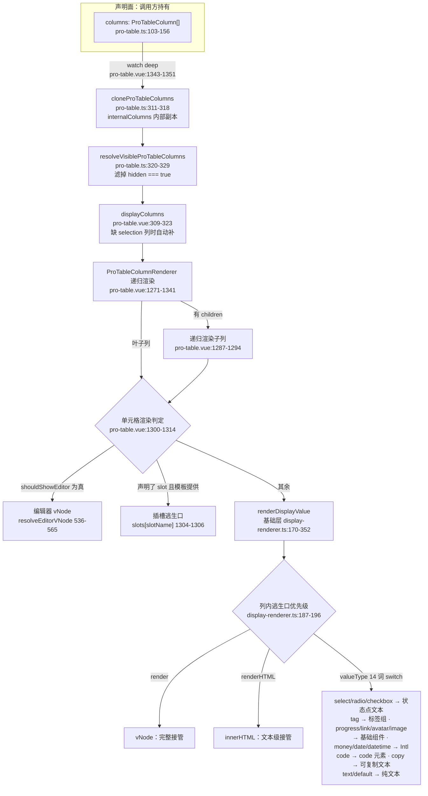
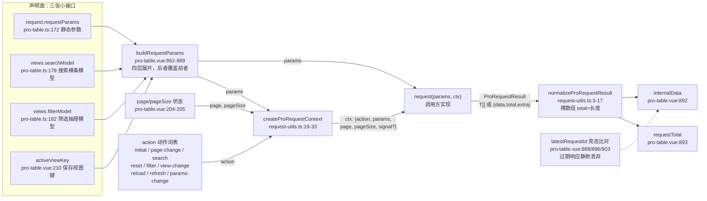

# 9-24 · ProTable（上）：配置模型

> 本篇是 9 卷"增强层（pro-components）"的第二十四篇，也是整个专栏第一次拆两篇讲一个组件。8-09 拆过基础层的 `xy-table`——列模型与固定列；9 卷随后把表单（9-04/9-05）、筛选（9-12）、页面骨架（9-13/9-21/9-22）逐层讲完，现在终于抵达这条产品线的终点站：`XyProTable`。它的体量与复杂度都撑得起两篇的篇幅，于是按"声明面与执行面"切开：本篇讲**配置模型**——类型层与声明面，回答核心问题"一份列配置如何声明 14 种渲染与编辑器"；下一篇 9-25《ProTable（下）：运行时引擎》讲执行面——请求竞态、导出打印、行与列拖拽、全屏这些"跑起来之后"的工程。本篇全部给实码定论。

接到题目先复述一遍目标，防止写偏：ProTable 要解决的业务场景，是中后台列表页的"一次声明、全家桶到位"。基础层给了 `xy-table` 的列渲染、排序、筛选、固定列（8-09），增强层给了 `xy-search-form` 的查询横条（9-04）、`xy-table-filter-drawer` 的筛选抽屉（9-28）、`xy-saved-view-tabs` 的保存视图，但这些积木拼一个标准列表页仍要业务自己接线：搜索词变了要重查、页码变了要重查、筛选应用了要重查、工具栏八个按钮要自己排布。ProTable 把这组接线收进一个组件，而它的配置面有大小两端：**大端**是 `columns`——一份列数组，一个字段声明四种渲染逃生口与一组编辑器字段；**小端**是 `toolbar`/`request`/`views`/`editable` 这些横切配置——每个都是一张小接口。本篇按"体量 → 列配置字段账 → valueType 14 词的来龙去脉 → 编辑器声明形态 → 逃生口层次 → 横切配置面 → 列树纯函数 → 类型出口与测试"这条主线走。

先交代体量，给全文一个标尺：`pro-table` 组件目录三个文件——`src/pro-table.ts` 381 行（纯类型加六个列树纯函数）、`src/pro-table.vue` 1779 行（脚本段至 1501 行、模板段 1503-1779 共 277 行）、`index.ts` 装配入口；测试两份共 897 行——`__tests__/pro-table.spec.ts` 822 行（十个用例）、`__tests__/pro-table-drag.spec.ts` 75 行；文档示例八个（`apps/docs/examples/pro/pro-table/` 下的 basic、display-value-types、editable-row、toolbar-search、workbench-request、contextmenu-selection、states、virtual-list）。这是增强层最重的组件，没有之一——9-22 引过"顶层组件的价值不在渲染，在编排"，而 pro-table 正是那句判断的证据原点。

## 一、双层列模型：EP 形态的地基上盖 antd 形态的楼层

先回答一个定位问题：pro-table 的列配置和 8-09 的基础层列模型是什么关系？

答案写在类型声明的第一行。`packages/pro-components/pro-table/src/pro-table.ts:103`：

```ts
export interface ProTableColumn<T = ProTableRow> extends TableColumnProps<T> {
```

`ProTableColumn` 是 `TableColumnProps`（`packages/components/table/src/table.ts:247-281`，基础层列接口）的**子接口**。先看被继承方的原貌，EP 血统一目了然——`prop`/`label`/`width` 这套命名、四参 formatter，全是 Element Plus 列声明的形状：

```ts
// packages/components/table/src/table.ts:247-281
export interface TableColumnProps<T = Record<string, unknown>> {
  type?: TableColumnType;
  prop?: keyof T & string;
  property?: keyof T & string;
  label?: string;
  columnKey?: string;
  width?: string | number;
  minWidth?: string | number;
  align?: TableAlign;
  headerAlign?: TableAlign;
  className?: string;
  labelClassName?: string;
  formatter?: (row: T, column: TableResolvedColumn<T>, value: unknown, rowIndex: number) => unknown;
  renderHeader?: (props: TableHeaderSlotProps<T>) => unknown;
  sortable?: TableSortable;
  sortMethod?: (left: T, right: T) => number;
  sortBy?:
    | string
    | ((row: T, rowIndex: number, rows: T[]) => unknown)
    | Array<string | ((row: T, rowIndex: number, rows: T[]) => unknown)>;
  sortOrders?: TableSortOrder[];
  filters?: TableFilterOption[];
  filteredValue?: TableFilterValue[];
  filterMethod?: (value: TableFilterValue, row: T, column: TableResolvedColumn<T>) => boolean;
  filterMultiple?: boolean;
  filterPlacement?: Placement;
  filterClassName?: string;
  showOverflowTooltip?: TableOverflowTooltip;
  tooltipFormatter?: (context: TableTooltipFormatterContext<T>) => unknown;
  fixed?: TableColumnFixed;
  selectable?: (row: T, rowIndex: number) => boolean;
  reserveSelection?: boolean;
  index?: number | ((index: number) => number);
  resizable?: boolean;
}
```

基础层列接口 30 个成员，`prop`、`label`、`width`、`sortable`、`filters`、`fixed` 这些 EP 风格的列属性被 `ProTableColumn` 原样继承，pro-table 一个都不重写——它只做加法：在 EP 列属性之上叠加 schema 层的增强字段。但加法里有一处反向补丁值得先点出：基础层接口里**没有 `children`**——组件树形态的多级表头靠 `XyTableColumn` 标签嵌套表达，声明接口无需此字段；`children` 是 pro 层在 `pro-table.ts:105` 自己加的，因为对象配置无法嵌套标签，多级表头必须显式建模成树。这是"对象配置 vs 组件树"差异打在类型上的第一个补丁，也是图 1 中 `R2` 递归节点的由来。8-09 结尾那句"pro-table 的列配置引擎只是在 descriptor 的上游多套了一层 schema 翻译"（`column/8-09-Table-列模型与固定列.md` 收尾段），说的就是这个继承关系的运行时含义：最终喂给 `XyTableColumn` 的仍然是一棵 `TableResolvedColumn` 树，schema 层只是声明面的糖。

这个"继承 + 叠加"的结构，用一个对照说清楚。Element Plus 的 `el-table-column` 是**模板组件树**形态：每一列是一个组件实例，自定义渲染写进默认插槽；antd 的 ProTable 是**对象列配置**形态：列是纯数据对象，渲染靠 `valueType` 声明加 `render` 函数逃生口。本库的取法是骑在两者之上——运行时形态跟 EP（最终还是渲染 `XyTableColumn` 组件树），声明面学 antd ProTable（纯对象数组、一个 `columns` prop 进来）。于是必然需要一个"翻译层"，把对象配置重新翻译回组件树——这就是 `pro-table.vue:1271-1341` 的 `ProTableColumnRenderer` 内部组件，9-25 再拆它的运行时细节，本篇先记住它的存在：**配置模型是声明，翻译层是桥，`XyTableColumn` 是终点**。

翻译层给配置模型立了一条隐含约束：pro-table 增加的每一个列字段，都必须在翻译时被剥离，否则会透传到基础层组件上变成无效 DOM 属性。看 `pro-table.vue:1321-1338` 传给 `XyTableColumn` 的 props 清单就明白这条约束的执法现场：

```ts
// packages/pro-components/pro-table/src/pro-table.vue:1321-1338
      return h(
        XyTableColumn,
        {
          ...column,
          children: undefined,
          slot: undefined,
          headerSlot: undefined,
          editor: undefined,
          editorProps: undefined,
          editorSlot: undefined,
          options: undefined,
          hidden: undefined,
          editable: undefined,
          exportable: undefined,
          printable: undefined
        },
        slotConfig
      );
```

十一个 `undefined`，对应 schema 层十一个增强字段（`children`、`slot`、`headerSlot`、`editor`、`editorProps`、`editorSlot`、`options`、`hidden`、`editable`、`exportable`、`printable`——`valueType`/`formatter`/`render`/`renderHTML`/`emptyValue` 不在剥离清单里，因为它们不走这条路，见下节）。这份剥离清单本身就是配置模型的自白：**哪些字段在翻译时被抹掉，哪些字段就属于"纯声明字段"，它们的生命周期只存在于 pro 层**。

## 二、列配置的字段账：一个接口，四种身份

现在展开本篇的主角。`packages/pro-components/pro-table/src/pro-table.ts:103-156`，`ProTableColumn` 全文 54 行：

```ts
// packages/pro-components/pro-table/src/pro-table.ts:103-156（全文）
export interface ProTableColumn<T = ProTableRow> extends TableColumnProps<T> {
  key?: string;
  children?: ProTableColumn<T>[];
  slot?: string;
  headerSlot?: string;
  hidden?: boolean;
  valueType?:
    | "text"
    | "select"
    | "radio"
    | "checkbox"
    | "tag"
    | "progress"
    | "link"
    | "image"
    | "avatar"
    | "money"
    | "date"
    | "datetime"
    | "code"
    | "copy";
  formatter?: (
    row: T,
    column: TableResolvedColumn<T>,
    value: unknown,
    rowIndex: number
  ) => unknown;
  render?: (
    value: unknown,
    context: {
      row: T;
      column: ProTableColumn<T>;
      rowIndex: number;
    }
  ) => VNodeChild;
  renderHTML?: (
    value: unknown,
    context: {
      row: T;
      column: ProTableColumn<T>;
      rowIndex: number;
    }
  ) => string;
  emptyValue?: string;
  editable?: boolean | ((row: T, rowIndex: number) => boolean);
  editor?: ProFieldSchemaBuiltinComponent | Component;
  editorProps?: Record<string, unknown> | ((row: T) => Record<string, unknown>);
  editorSlot?: string;
  options?:
    | Array<ProTableDisplayOption | ProTableDisplayOptionGroup>
    | ((row: T) => Array<ProTableDisplayOption | ProTableDisplayOptionGroup>);
  exportable?: boolean;
  printable?: boolean;
}
```

把 54 行按职责分账，一个接口同时承担四种身份：

**身份一：EP 列**（继承自 `TableColumnProps`，不占本接口的行数）——`prop`/`label`/`width`/`sortable`/`filters`/`fixed` 等 30 个成员，由基础层消费；`children`（105 行）是本接口自己声明的第一个字段，用对象树还原组件树的多级表头。

**身份二：展示声明**——`valueType`（14 词联合）、`options`、`formatter`、`render`、`renderHTML`、`emptyValue`，六个字段决定"这一格长什么样"。其中 `options` 有一个容易被忽略的能力：它可以是**函数**——`(row) => Array<ProTableDisplayOption | ProTableDisplayOptionGroup>`。这意味着每一行可以拿到不同的选项映射：同一列"状态"，第一行是"启用/停用"两个选项，第二行可能是"草稿/审核中/已发布"三个。函数式 `options` 在消费端被逐行求值（`display-renderer.ts:39-53` 的 `resolveColumnOptions` 对函数形态传 row 调用），这是"每行异构映射"在配置层的唯一入口。

**身份三：编辑声明**——`editable`、`editor`、`editorProps`、`editorSlot`，四个字段决定"这一格能不能编辑、用什么编辑"。第三节专拆。

**身份四：运营属性**——`hidden`（配置级显隐）、`slot`/`headerSlot`（模板逃生口）、`exportable`/`printable`（导出打印参与权）。注意 `exportable !== false` 是导出列筛选的默认放行方向（`pro-table.vue:288-290` 的 `exportableColumns` 用 `column.exportable !== false` 过滤），即**默认全部参与导出，声明 false 才豁免**——这和 `hidden` 的语义方向（`hidden !== true` 才可见，`pro-table.ts:299-301`）完全一致：增强字段统一采用"声明豁免"而不是"声明参与"，让默认路径零配置。

这里有一处签名错位值得单独考据，它暴露了配置模型的血缘。对比三个 `formatter`：

- `ProTableColumn.formatter`（`pro-table.ts:124-129`）：`(row, column, value, rowIndex) => unknown`；
- 基础层 `TableColumnProps.formatter`（`table.ts:259`）：`(row, column, value, rowIndex) => unknown`——**同一个签名**；
- 协议层 `ProFieldSchema.formatter`（`core.ts:113`，类型别名 `ProDisplayFormatter` 在 `core.ts:62-65`）：`(value, context) => unknown`——**参数序完全不同**。

同一个"格式化"概念，在 table 血统的接口里是 EP 式四参（行在前、值在后），在 field-schema 血统的接口里是 context 式两参（值在前、上下文对象在后）。这不是失误，是两条类型谱系各自保持内部自洽的结果：ProTableColumn 的 formatter 会被原样传给基础层渲染管道（`display-renderer.ts:27` 的 `DisplayColumnLike.formatter` 也是四参），它必须和 EP 传统对齐；而 field-schema 服务的是表单与详情，遵循 9-03 立的 `ProDisplayRenderContext` 协议。9-02 在清单层面指出过这次复制，本篇把结论补全：**pro-table 没有把 field-schema 的 formatter 协议带进列配置，列配置的 formatter 是 EP 血统的**——一份列配置声明 14 种渲染时，写 formatter 的手要按 table 的习惯，写 render 的手却要按 context 对象的习惯（`render` 的参数是 `(value, context)`，`pro-table.ts:130-137`），两种参数哲学在同一接口里共存，这是使用这层配置时最需要留神的一处签名陷阱。

## 三、valueType 的 14 词：一次逐字内联的得与失

`valueType` 的 14 个成员——`text`、`select`、`radio`、`checkbox`、`tag`、`progress`、`link`、`image`、`avatar`、`money`、`date`、`datetime`、`code`、`copy`——9-02 已考据过：它们与 `core.ts:27-41` 的 `ProDisplayValueType` 逐字一致，但 `ProTableColumn.valueType` 不是 `ProDisplayValueType` 的引用，而是**逐字内联复制**。两个定义并排看：

```ts
// packages/pro-components/core.ts:27-41（协议层的词表）
export type ProDisplayValueType =
  | "text"
  | "select"
  | "radio"
  | "checkbox"
  | "tag"
  | "progress"
  | "link"
  | "image"
  | "avatar"
  | "money"
  | "date"
  | "datetime"
  | "code"
  | "copy";
```

```ts
// packages/pro-components/pro-table/src/pro-table.ts:109-123（列配置层的词表，逐字相同）
  valueType?:
    | "text"
    | "select"
    | "radio"
    | "checkbox"
    | "tag"
    | "progress"
    | "link"
    | "image"
    | "avatar"
    | "money"
    | "date"
    | "datetime"
    | "code"
    | "copy";
```

这是本篇的第一处设计权衡，值得把两边的理由都摆到台面上。

**内联复制的代价**是显式的：词表从此有了两个事实源。如果未来给 `ProDisplayValueType` 加一个 `"status"` 词，pro-table 的列配置不会自动跟上——除非有人记得同步这 15 行。类型系统对此完全沉默：两个结构相同的联合类型互相赋值不报错，漂移只有人肉审出来。9-02 把这标记为"漂移隐患"，与 `ProTableToolbarAction` 对 `ProPageAction`（少一个 `danger` 字段）、`ProTableDisplayOption` 对 `ProDisplayOption` 的同形复制并列为协议层的三处复制现场。

**内联复制的收益**则藏在包边界里。看 `pro-table.ts` 的 import 区（`pro-table.ts:18-19`）：

```ts
// packages/pro-components/pro-table/src/pro-table.ts:18-19
import type { SearchFormField } from "../../search-form";
import type { ProFieldSchema, ProFieldSchemaBuiltinComponent, ProRequestContext, ProRequestResult } from "../../core";
```

`ProTableColumn` 已经从 `core` 引入了 `ProFieldSchemaBuiltinComponent`（`editor` 字段的类型，见下节）——它并非不能引用 `ProDisplayValueType`。所以内联不是"引不到"的技术约束，更像一种**声明纪律**：`ProTableColumn` 是要抬到包根出口（`packages/pro-components/index.ts:59-63` 只导出 `ProTableColumn`/`ProTableInstance`/`ProTableProps` 三个类型）的公开类型，让一个公开类型嵌另一个模块的类型别名，意味着使用方对 value 词表的理解要跨一层间接——写成字面量联合，使用方在 IDE 里悬停 `valueType` 直接看到 14 个词，类型提示零跳转。这层解释在 9-01 的"根入口只抬稳定主类型"原则下说得通，但代价（双事实源）也因此真实存在。两害相权：**14 词的展示词表在产品语义上已经相当稳定（它是 display-renderer 的 switch 臂，加词要同时动渲染管道，不会轻动），为提示体验付出复制成本，是一笔可以理解但必须记账的交易**。而记账的凭证，是这条考据能被写进专栏——漂移若发生，第一发现人就是读文档的人。

接下来是这 14 个词的**消费端**，这里有 9-03 埋下的那条架构决策，本篇展开。先看消费入口——pro-table 的展示单元格不经过任何 pro 层函数，直接调基础层：

```ts
// packages/pro-components/pro-table/src/pro-table.vue:1308-1313
          return renderDisplayValue({
            value: payload.value,
            row,
            rowIndex,
            column
          });
```

`renderDisplayValue` 来自 `packages/components/shared/display-renderer.ts`（`pro-table.vue:33` 的 import）——这是**基础层 shared 目录**的文件，不是 pro 层的 `field-schema.ts`。9-03 考据过这个事实：field-schema 的展示法域（`resolveProFieldValueType`、`normalizeProFieldDisplayValue`、`resolveProDescriptionsItems`）服务 descriptions 与 pro-form 的详情态，而 pro-table 的展示通道绕开了它们，直插基础层。为什么？

因为两次"值类型求值"的设计分岔。field-schema 的展示法域多一步：从 `component` 反推 `valueType`（`componentDisplayValueTypeMap`，`field-schema.ts:57-70`，让"编辑写一次、展示自动对"）；pro-table 的列配置则**没有 component 字段**——列不是控件，无需反推，`valueType` 声明即终点。于是 pro-table 拿到的 `column` 对象天然满足基础层 `renderDisplayValue` 的入参形状（`DisplayColumnLike`，`display-renderer.ts:22-31`：`valueType`/`options`/`formatter`/`render`/`renderHTML`/`emptyValue` 六个成员），中间任何一层"求值适配"都是多余的。这条直连让 `ProFieldSchemaBuiltinComponent` 的 23 词编辑词表与 14 词展示词表在列配置里彻底解耦：列的 `editor` 用编辑词表，列的 `valueType` 用展示词表，两套词表互不污染。

14 词在 `renderDisplayValue` 里的展开是硬编码的 switch（`display-renderer.ts:198-352`）：`select`/`radio`/`checkbox` 三词走"文本 + 状态点"映射（`renderOptionDisplay` 的 text 模式，127-155 行），`tag` 走标签组（text 模式换 tag 模式，157-168 行），`progress` 转 `XyProgress`、`link` 转 `XyLink`、`avatar`/`image` 转媒体组件、`money`/`date`/`datetime` 走 Intl 格式化、`code` 包 `<code>`、`copy` 转 `XyText` 的 copyable 形态；而 `text` 这个词**没有专属 case**——它落进 `default` 分支（336-352 行）。这是词表里的一个隐含约定：`text` 是"不声明"的同义词，词表把它显式列出来只是为了 `ProTableColumn` 的字面量提示完整。

一张图收拢本节与上节的结论——**一份列配置从声明到像素的完整解析流**（这也是本篇的主图，9-25 讲运行时引擎时会回到它的下半段）：



读这张图的正确姿势是注意**三次分岔的顺序**：第一岔在 pro-table（编辑态优先于一切），第二岔在 pro-table（模板插槽优先于声明渲染），第三岔在基础层（`render` 优先于 `renderHTML` 优先于 `valueType`）。三岔串起来，就是"一份列配置如何声明 14 种渲染"的完整答案——**声明的是优先级链，不是孤立的开关**。

## 四、编辑器声明：三种形态与一次翻译

列配置的编辑声明只有四个字段：`editable`、`editor`、`editorProps`、`editorSlot`。四个字段撑起三种编辑器形态，翻译现场在 `pro-table.vue:536-565` 的 `resolveEditorVNode`：

```ts
// packages/pro-components/pro-table/src/pro-table.vue:536-565
function resolveEditorVNode(
  row: ProTableRow,
  rowIndex: number,
  column: ProTableColumn<ProTableRow>
) {
  const editorSlotName = column.editorSlot;

  if (editorSlotName && slots[editorSlotName]) {
    return slots[editorSlotName]?.({
      row,
      rowIndex,
      column,
      value: getDraftValue(row, column),
      update: (value: unknown) => updateDraft(row, column, value)
    });
  }

  const field = resolveEditorField(column, row);
  const component =
    typeof column.editor === "string" || column.editor == null
      ? resolveProFieldComponent(field)
      : column.editor;

  return h(component as any, {
    ...resolveProFieldProps(field),
    modelValue: getDraftValue(row, column),
    "onUpdate:modelValue": (value: unknown) => updateDraft(row, column, value),
    size: tableDensity.value
  });
}
```

**形态一：词表字符串**。`editor: "select"`——走 `resolveProFieldComponent`（`field-schema.ts:97-103`），在 `builtInComponentMap`（`field-schema.ts:31-55`，23 个词条）里查表。这里的 `ProFieldSchemaBuiltinComponent`（`core.ts:77-100`）不是 14 词展示词表的复制，而是**复用**：`pro-table.ts:148` 直接 `editor?: ProFieldSchemaBuiltinComponent | Component`，类型从 core 引入，没有内联。同样是"列配置引用 core 类型"，`valueType` 内联而 `editor` 复用——同一文件里的两个决定方向相反。这个不对称反而把上一节的权衡讲透了：`editor` 的词表是 23 词的**编辑控件**词表，它同时服务 pro-form（9-05）、filter-panel（9-12）等多个消费方，是活跃演进的词表（9-03 考据过两次扩容史），引用才能保证同步；`valueType` 的 14 词是渲染 switch 的臂，演进冻结。**演进快的复用，演进冻结的才敢内联**——内联与否的分界线不是美学，是词表的变化频率。

**形态二：组件直给**。`editor` 传一个组件对象（非字符串），`typeof column.editor === "string"` 判定失败，组件直接 `h` 进去，`resolveProFieldComponent` 被跳过。注意配套的一个兜底细节：`resolveEditorField`（`pro-table.vue:523-534`）构造 field 对象时，若 `column.editor` 是组件对象，`field.component` 会被写成 `"input"`（528 行三元表达式的另一支）——这个 field 只用于 `resolveProFieldProps` 补 placeholder/options，不影响真正的组件选择。组件直给形态绕过词表，适合词表之外的私有控件。

**形态三：插槽逃生口**。`editorSlot: "myEditor"` 且模板提供了同名插槽，整个翻译层被跳过，插槽函数拿到 `{ row, rowIndex, column, value, update }` 五件套自己渲染。这是编辑声明的最后出口：词表不够、组件直给不便复用模板上下文时，用插槽。

三种形态的优先级是 slot > 组件直给/词表，而组件直给与词表之间由 `editor` 的类型自动分流。配套字段 `editorProps` 也支持双形态——静态对象或 `(row) => props` 函数（`pro-table.vue:530` 三元收窄），与 `options` 的双形态对齐：**凡是"每行可能不同"的声明，一律给函数形态留门**。这四个字段在文档示例 `editable-row.vue:28-55` 里的最小用法：

```ts
// apps/docs/examples/pro/pro-table/editable-row.vue:28-55
const columns: ProTableColumn<Row>[] = [
  {
    prop: "name",
    label: "名称",
    editable: true
  },
  {
    prop: "owner",
    label: "负责人",
    editable: true
  },
  {
    prop: "status",
    label: "状态",
    editable: true,
    editor: "select",
    options: [
      {
        label: "启用",
        value: "启用"
      },
      {
        label: "停用",
        value: "停用"
      }
    ]
  }
];
```

这一段是本篇的第二处设计权衡：**编辑器为什么是列上的独立字段组，而不是复用 `valueType`**。antd ProTable 的做法是让 `valueType` 一肩挑——同一个词既声明展示形态又决定编辑控件（`"select"` 展示是标签、编辑是下拉），声明量减半。本库没有走这条路：`valueType: "tag"` 的列默认不可编辑，可编辑列必须显式声明 `editable` 与 `editor`。代价是声明变长（示例里状态列三个字段）；收益是两个正交维度的解耦——"这格显示成什么样"与"这格怎么编辑"在真实业务里并不同构（显示成 tag 的枚举可能编辑成 radio-group，显示成 money 的可能编辑成 input-number），一肩挑的方案在这些错位处必须靠 `fieldProps`/`renderFormItem` 之类的补丁字段打洞，打多了反而更绕。**本库选择"显示/编辑两套词表 + 显式桥"的分离方案，把 antd 的补丁位变成了一等公民**。`editable` 本身的双形态（布尔或 `(row, rowIndex) => boolean`，`pro-table.ts:147`）则负责行级准入：`pro-table.vue:438-454` 的 `isColumnEditable` 把它和全局 `editable.canEditRow`（`pro-table.ts:201`）做与运算，列级与行级两道门都过才放行。

还有一个配置层的"考古现场"要如实记录：`pro-table.ts:87-92` 的 `ProTableEditorSchema` 接口——

```ts
// packages/pro-components/pro-table/src/pro-table.ts:87-92
export interface ProTableEditorSchema<T = ProTableRow> {
  component?: ProFieldSchemaBuiltinComponent | Component;
  componentProps?: Record<string, unknown> | ((row: T) => Record<string, unknown>);
  options?: Array<SelectOption | SelectOptionGroup> | ((row: T) => Array<SelectOption | SelectOptionGroup>);
  placeholder?: string;
}
```

全仓搜索它的引用，唯一出现处就是定义本身（`packages/pro-components/pro-table/src/pro-table.ts:87`）：没有任何字段引用它，运行时也没有构造它。它的四个成员与 `editor`/`editorProps`/`options` 的形状完全重合——可以推断它是编辑声明"嵌套成 `editor: ProTableEditorSchema` 对象"这一设计路线的化石：先声明了嵌套接口，落地时改成了扁平的四字段（`editor` + `editorProps` + `editorSlot`），接口留下没删。它也没有被抬进包根出口（`index.ts:59-63` 只抬三个主类型），边界守卫替它兜住了公开面。这是配置模型演进过程的一枚活化石：**扁平化战胜了嵌套化**——扁平四字段的 IDE 提示更平、书写更短，而嵌套对象需要多一层属性导航。

## 五、逃生口层次：从 hidden 到 renderHTML 的五级放行

第三处设计权衡落在"逃生口"的层次设计上。配置模型给每一格提供了五个逃生等级，按"接管强度"递增：

1. **`hidden`**——整列退场，配置级逃生口。`pro-table.ts:108` 声明、`pro-table.ts:299-301` 的 `isColumnVisible` 执法（`hidden !== true` 即可见）、`pro-table.ts:320-329` 的 `resolveVisibleProTableColumns` 在渲染前过滤。它是唯一作用于"列是否存在"的字段。
2. **`formatter`**——文本级逃生口。拿到四个参数返回任意值，但输出仍走纯文本通道（`display-renderer.ts:81-95` 的 `resolveFormattedText`），受 `emptyValue` 兜底。
3. **`render`**——vNode 级逃生口。返回 `VNodeChild`，在 `renderDisplayValue` 入口处第一优先放行（`display-renderer.ts:187-189`），完全接管单元格。
4. **`renderHTML`**——字符串级逃生口。返回 HTML 字符串，经 `h("span", { innerHTML })` 注入（`display-renderer.ts:191-196`）。
5. **`slot`/`headerSlot`**——模板逃生口。列声明槽名（`slot: "status"`），翻译层在 `pro-table.vue:1304-1306` 检查 `slots[slotName]` 存在即转发。槽名有派生规则（`pro-table.vue:421-428`）：`slot ?? prop ?? key`，header 槽默认是 `${baseName}-header`——不声明槽名时，`prop: "name"` 的列天然响应 `#name` 与 `#name-header` 两个插槽。

五级之间不是并列关系而是**判定顺序**，完整的判定链是两段的拼接：pro-table 段（编辑态 → slot → 兜底），基础层段（render → renderHTML → valueType switch）。基础层段的顺序写在 `renderDisplayValue` 的入口三行里：

```ts
// packages/components/shared/display-renderer.ts:170-196（入口段，节选）
export function renderDisplayValue<TRow, TColumn extends DisplayColumnLike<TRow, TColumn>>({
  value,
  row,
  rowIndex,
  column
}: {
  value: unknown;
  row: TRow;
  rowIndex: number;
  column: TColumn;
}) {
  const context: DisplayContext<TRow, TColumn> = {
    row,
    rowIndex,
    column
  };

  if (column.render) {
    return column.render(value, context);
  }

  if (column.renderHTML) {
    return h("span", {
      class: "xy-display-value__html",
      innerHTML: column.renderHTML(value, context)
    });
  }

  switch (column.valueType) {
```

pro-table 段的顺序则由编辑器判定函数 `shouldShowEditor` 的三个分支模式决定——`mode` 三态各看不同的编辑状态位（`pro-table.vue:501-521`）：

```ts
// packages/pro-components/pro-table/src/pro-table.vue:501-521
function shouldShowEditor(
  row: ProTableRow,
  rowIndex: number,
  column: ProTableColumn<ProTableRow>
) {
  if (!isColumnEditable(column, row, rowIndex)) {
    return false;
  }

  const mode = props.editable?.mode ?? "cell";

  if (mode === "table") {
    return tableEditing.value;
  }

  if (mode === "row") {
    return isEditingRow(row);
  }

  return isEditingCell(row, column);
}
```

以配置优先级论，slot 的实际位次低于 render 吗？不是：slot 在前。`pro-table.vue:1300-1314` 的判定顺序是 `shouldShowEditor` → `slots[slotName]` → `renderDisplayValue`，而 `render` 的检查在 `renderDisplayValue` **内部**（187 行）。所以真实优先级是：**editor 态 > slot > render > renderHTML > valueType**。这个顺序有一个容易踩的暗坑：声明了 `slot` 的列，其 `render`/`valueType` 全部失效（slot 先拦）；声明了 `render` 的列，其 `formatter`/`options`/`emptyValue` 全部失效（render 先拦）。配置模型没有对这种"声明冲突"做任何警告——**逃生口之间的覆盖是静默的**，这是灵活性定价的一部分。

`renderHTML` 值得单独一句：它是五级里唯一的信任级放行。`innerHTML` 注入意味着 XSS 面完全交给调用方——文档测试用例里那句 `htmlNote: "可信 <strong class='html-flag'>HTML</strong>"`（`pro-table.spec.ts:186`）的"可信"二字就是这个契约的注脚。五级放行里 formatter/render/slot 都是 Vue 管辖内的安全通道，唯独 renderHTML 是越出管辖的直通车，它被排在 render 之后、valueType 之前的位置，语义上正好是"想要原生 HTML 的最后一档"。

与逃生口相关，还有一组"布局级"声明不算逃生口但同样改变列的形态：`children` 多级表头（递归渲染，图上 `R2` 节点）、继承自基础层的 `fixed`（列设置面板可改，`pro-table.ts:357-381`）、`type: "selection"` 的自动补列（`pro-table.vue:309-323`——业务没声明 selection 列但配置了批量动作时，翻译层自动在最左补一列 56px 宽左固定的选择框列）。自动补列是配置模型里少见的"调用方没写、组件替你写"的行为，它让 `batchActions` 声明即生效，不需要业务记得手写 selection 列。

## 六、横切配置面：toolbar、request 与 views 的三张小接口

列配置之外，ProTableProps（`pro-table.ts:250-280`，31 行 29 个字段）上还挂着一批横切配置。本节挑三张最体现"配置推导"思想的接口。

**第一张：动作组**。工具栏动作（`pro-table.ts:31-42`）与批量动作（`pro-table.ts:44-53`）是两张 10 成员与 9 成员的小接口，形状与 9-02 考据过的 `core.ts:126-138` 的 `ProPageAction` 几乎逐字相同（少一个 `danger`；批量动作则多 `danger` 少 `plain/text/link`）。动作本身零行为——ProTable 只把点击原样 emit 成 `toolbar-action`/`batch-action` 事件，做什么由业务决定。`visible` 字段是唯一带语义的成员（`pro-table.vue:255-257` 的 `visibleToolbarActions` 过滤 `visible !== false`），批量动作里 `danger` 字段还决定按钮在批量条里的分组与默认色（`pro-table.vue:371-381` 拆成 normal/danger 两组、`pro-table.vue:741-747` 的 `normalizeBatchActionType` 把 `danger` 兑换成 `type: "danger"`）。

工具栏的动作组旁边还有一组**工作台开关**（`pro-table.ts:158-168`）：

```ts
// packages/pro-components/pro-table/src/pro-table.ts:158-175
export interface ProTableWorkbenchConfig {
  refresh?: boolean;
  density?: boolean;
  columnSetting?: boolean;
  fullscreen?: boolean;
  treeToggle?: boolean;
  filter?: boolean;
  export?: boolean;
  print?: boolean;
  defaultDensity?: ProTableDensity;
}

export interface ProTableRequestConfig<T = ProTableRow> {
  request: (params: Record<string, unknown>, ctx: ProRequestContext) => Promise<ProRequestResult<T>>;
  requestParams?: Record<string, unknown>;
  immediate?: boolean;
  autoReloadOnParamsChange?: boolean;
}
```

八个布尔开关（刷新/密度/列设置/全屏/树展开/筛选/导出/打印）加一个默认密度。开关的显隐不是纯声明式——`pro-table.vue:229-238` 的 `resolvedWorkbench` 做了一层**配置推导**：

```ts
// packages/pro-components/pro-table/src/pro-table.vue:229-238
const resolvedWorkbench = computed(() => ({
  refresh: Boolean(props.workbench.refresh || props.request),
  density: Boolean(props.workbench.density),
  columnSetting: Boolean(props.workbench.columnSetting),
  fullscreen: Boolean(props.workbench.fullscreen),
  treeToggle: Boolean(props.workbench.treeToggle),
  filter: Boolean(props.workbench.filter || props.views?.filterFields?.length),
  export: Boolean(props.workbench.export || props.exportOptions),
  print: Boolean(props.workbench.print || props.printOptions)
}));
```

四个开关可以从别的配置**自动推导**：配了 `request` 就有刷新按钮、配了 `views.filterFields` 就有筛选按钮、配了 `exportOptions` 就有导出按钮、配了 `printOptions` 就有打印按钮。推导只做"加法"不做"减法"——显式 `refresh: false` 配 `request` 时 `Boolean(false || request)` 仍为真，关不掉。这是推导式配置的固有局限（布尔三态缺失，`false` 与"未声明"不可区分），调用方只能靠不配 `request` 来隐藏刷新。工具栏按钮的实际排布在模板 `pro-table.vue:1544-1567`：刷新、筛选、树展开/收起、列设置、导出、打印、全屏七个固定位置加 `toolbarActions` 的动态按钮，模板 1505-1527 行是标题区与密度切换。9-13 的 PageToolbar 是这些排布规则的"半成品前身"，pro-table 把它内化成了模板段。

**第二张：request 上下文协议**。`ProTableRequestConfig.request` 的函数签名（`pro-table.ts:171`）里藏着整个远程数据协议：第一个参数 `params` 是合流后的查询条件，第二个参数 `ctx` 是 `ProRequestContext`（`core.ts:13-19`）：

```ts
// packages/pro-components/core.ts:13-19
export interface ProRequestContext {
  action: string;
  params: Record<string, unknown>;
  page: number;
  pageSize: number;
  signal?: AbortSignal;
}
```

五个成员里 `action` 最有信息量：它告诉请求方"这次请求为什么发生"。动作词表散落在 `pro-table.vue` 的各调用点——`initial`（1452 行挂载首查）、`page-change`（956 行）、`search`（962 行）、`reset`（933/967 行）、`filter`（801 行）、`view-change`（973 行）、`reload`/`refresh`（909-915 行实例方法）、`params-change`（1406 行 requestParams 变化）。同一个 request 函数按 action 分流是这层协议的预期用法（首查不弹错误提示、搜索要回到第一页之类的策略，都挂在 action 判断上）。`signal` 是可选的 AbortSignal 通道——但注意 9-25 要拆的一个事实：当前 `createProRequestContext`（`request-utils.ts:19-33`）从未传入 signal，取消用的是"结果版本号比对"而不是 AbortController，信号位是**声明了却没接线**的协议预留。`params` 的合流规则在 `pro-table.vue:862-869`：

```ts
// packages/pro-components/pro-table/src/pro-table.vue:862-869
function buildRequestParams() {
  return {
    ...(props.request?.requestParams ?? {}),
    ...(props.views?.searchModel ?? {}),
    ...(props.views?.filterModel ?? {}),
    ...(activeViewKey.value ? { activeViewKey: activeViewKey.value } : {})
  };
}
```

四层依次展开：静态参数、搜索模型、筛选模型、当前保存视图键。同名键后者覆盖前者——搜索词与筛选字段撞名时，筛选赢。一次完整请求的配置合流与上下文注入，用本篇的第二张图收拢（9-12 曾从筛选视角画过 862-869 的分工边界，这张补上 ctx 协议与动作词表的完整流向）：



读这张图注意两个"声明了但由运行时兜底"的位置：`signal` 成员在 ctx 协议里存在（`core.ts:18`），但 `createProRequestContext` 的调用点从未传过它——取消靠右下角的版本号比对而非 AbortController，这个错位 9-25 拆；`action` 词表没有类型约束（`action: string`），词表纪律靠调用点自觉。返回值协议 `ProRequestResult`（`core.ts:11`）允许裸数组或 `{ data, total, extra }` 对象，`normalizeProRequestResult`（`request-utils.ts:3-17`）统一成后者并把裸数组的 total 定为长度——**分页语义由此分岔**：裸数组模式 total 恒等于当前页行数，前后端分页必须返回对象形态。这张协议表 9-04 从 SearchForm 的视角引过 862-869 的合流点、9-12 从筛选的视角引过 views 配置（`pro-table.ts:177-185`：`searchModel`/`searchFields` 流向横条 `pro-table.vue:1621-1631`，`filterModel`/`filterFields` 流向抽屉 `pro-table.vue:1769-1777`），本篇补上它的全貌：**request 配置是搜索（9-04）、筛选（9-12）、保存视图三者与远程数据源的合流枢纽，views 配置则是这三者的声明容器**。

**第三张：editable 配置**。`pro-table.ts:196-202` 的 `ProTableEditableConfig` 五字段（`enabled`/`mode`/`trigger`/`autoSave`/`canEditRow`），`mode` 三态 `table`/`row`/`cell`（`pro-table.ts:25`）对应"整表编辑/行编辑/单元格编辑"三种编辑粒度，`trigger` 三态 `click`/`dblclick`/`manual` 对应触发方式。与列级 `editable` 的与门关系上一节已述；`mode` 的消费在 `pro-table.vue:501-521` 的 `shouldShowEditor`（table 态看 `tableEditing`、row 态看行键集合、cell 态看 `rowKey:columnKey` 复合键），草稿缓冲 `editDrafts`（`pro-table.vue:216` 的 shallowRef Map）与提交/取消的收口（567-712 行），收口实现见 `pro-table.vue` 对应段（本系列不展开）。五个字段里 `autoSave` 要如实标注：全仓搜索（源码、测试、示例）它零消费——声明了"编辑后自动提交"的意图，运行时没有任何一行消费它，编辑提交统一走 `submitEdit` 显式收口。它与上一节的 `ProTableEditorSchema` 同类：**配置模型上"先声明、后落地"的第二个未接线字段**，提交收口的实现细节本系列不展开，可直接读 `pro-table.vue:567-712`。

三张小接口的共同点是**声明量与推导量的配比**：动作组纯声明零推导、workbench 半声明半推导、request/views 声明一次推导处处（合流、分页、重查时机全部自动）。这构成配置模型的第三个层次：列配置是"每列一份"，横切配置是"每表一份"，而推导规则是两者之间的传导层。request 配置的消费端写法，看文档示例 `workbench-request.vue:39-72` 的完整声明：

```ts
// apps/docs/examples/pro/pro-table/workbench-request.vue:39-72
const request: NonNullable<ProTableProps<Row>["request"]> = {
  immediate: true,
  request: async (params) => {
    await new Promise((resolve) => window.setTimeout(resolve, 200));

    const rows = [
      {
        id: 1,
        name: "发票审批台",
        owner: "小叶",
        status: "启用"
      },
      {
        id: 2,
        name: "结算复核台",
        owner: "小星",
        status: "停用"
      }
    ] satisfies Row[];

    const filteredRows = rows.filter((row) => {
      const keyword = String(params.keyword ?? "").trim();
      const status = params.status;
      const hitKeyword = keyword ? row.name.includes(keyword) : true;
      const hitStatus = status === "enabled" ? row.status === "启用" : true;
      return hitKeyword && hitStatus;
    });

    return {
      data: filteredRows,
      total: filteredRows.length
    };
  }
};
```

`params.keyword` 来自搜索模型、`params.status` 来自筛选模型——调用方的 request 函数完全不需要知道这两个键分别由哪块 UI 产生，合流已在组件内完成；返回对象形态 `{ data, total }` 显式声明前后端分页语义。类型标注用的 `NonNullable<ProTableProps<Row>["request"]>` 是这套配置模型的推荐用法：不 import `ProTableRequestConfig`（它没被抬进包根），直接从 Props 反查——这正是"根入口只抬主类型"边界下使用方的惯用补偿。

## 七、列树纯函数：配置模型的算法底座

`pro-table.ts` 的后半段（290-381 行）是六个不依赖组件实例的纯函数，它们构成列配置的算法底座。逐个看核心两对：

```ts
// packages/pro-components/pro-table/src/pro-table.ts:290-329
export function getProTableColumnKey<T = ProTableRow>(
  column: Pick<
    ProTableColumn<T>,
    "key" | "prop" | "columnKey" | "label"
  >
) {
  return column.key ?? column.columnKey ?? column.prop ?? column.label ?? "";
}

export function isColumnVisible<T = ProTableRow>(column: ProTableColumn<T>) {
  return column.hidden !== true;
}

export function flattenProTableColumns<T = ProTableRow>(
  columns: ProTableColumn<T>[]
): ProTableColumn<T>[] {
  return columns.flatMap((column) =>
    column.children?.length ? flattenProTableColumns(column.children) : [column]
  );
}

export function cloneProTableColumns<T = ProTableRow>(
  columns: ProTableColumn<T>[]
): ProTableColumn<T>[] {
  return columns.map((column) => ({
    ...column,
    children: column.children ? cloneProTableColumns(column.children) : undefined
  }));
}

export function resolveVisibleProTableColumns<T = ProTableRow>(
  columns: ProTableColumn<T>[]
): ProTableColumn<T>[] {
  return columns
    .filter((column) => isColumnVisible(column))
    .map((column) => ({
      ...column,
      children: column.children ? resolveVisibleProTableColumns(column.children) : undefined
    }));
}
```

`getProTableColumnKey` 的四级回退链（`key ?? columnKey ?? prop ?? label`）是整个列设置体系的身份证规则：列设置面板的每一项、可见键集合的每个成员、`applyColumnVisibility` 的匹配键，全部经过这一个函数。四级回退保证了"任何列都有键"——但 `label` 兜底这一档藏着隐含约束：两列同名 label 且都不声明 key/columnKey/prop 时会撞键。这是纯函数底座的诚实边界：它不校验唯一性，唯一性责任留给调用方。

`cloneProTableColumns` 与 `resolveVisibleProTableColumns` 长得像但职责相反：前者是**守副本**（`pro-table.vue:199` 初始化内部列、`1343-1351` 的 watch deep 同步外部列变化时调用，深拷贝保证内部状态不被调用方的对象引用污染），后者是**出视图**（渲染前过滤隐藏列，配合 `pro-table.vue:286-287` 的 `visibleColumns`/`visibleLeafColumns` 计算属性）。一进一出都过树，多级表头的递归处理在这两个函数里各自长一份——`clone` 用 `map` 递归、`resolve` 用 `filter + map` 递归，子列处理都是"有 children 就递归、否则置 undefined"。

真正有逻辑密度的是两个"改树"函数。先看显隐的树形聚合：

```ts
// packages/pro-components/pro-table/src/pro-table.ts:331-381
export function applyColumnVisibility<T = ProTableRow>(
  columns: ProTableColumn<T>[],
  visibleKeys: Set<string>
): ProTableColumn<T>[] {
  return columns.map((column) => {
    const columnKey = getProTableColumnKey(column);
    const children: ProTableColumn<T>[] | undefined = column.children
      ? applyColumnVisibility(column.children, visibleKeys)
      : undefined;

    if (children?.length) {
      const visibleChildren = children.some((item: ProTableColumn<T>) => item.hidden !== true);
      return {
        ...column,
        hidden: !visibleChildren,
        children
      };
    }

    return {
      ...column,
      hidden: !visibleKeys.has(columnKey)
    };
  });
}

export function applyColumnFixed<T = ProTableRow>(
  columns: ProTableColumn<T>[],
  key: string,
  fixed?: TableColumnFixed
): ProTableColumn<T>[] {
  return columns.map((column) => {
    const columnKey = getProTableColumnKey(column);

    if (column.children?.length) {
      return {
        ...column,
        children: applyColumnFixed(column.children, key, fixed)
      };
    }

    if (columnKey !== key) {
      return column;
    }

    return {
      ...column,
      fixed
    };
  });
}
```

`applyColumnVisibility` 的关键在 341-348 行：**父列的 hidden 由子列聚合推导**——任一子列可见则父列可见，全隐藏则父列跟随隐藏。这意味着多级表头下"父列"不是独立开关，用户在列设置面板勾选的是叶子列（`columnSettingEntries` 取 `flattenProTableColumns` 的叶子，`pro-table.vue:299-305`），父列状态自动跟随。`applyColumnFixed` 则反向处理：固定操作只命中**叶子列**（365-370 行父列直接下钻不改自身），因为多级表头的固定在视觉上由叶子列承载。一个自底向上聚合、一个自顶向下下钻，两个函数合成列树上"用户意图 → 配置状态"的双向翻译。

为什么用纯函数而不是组件内方法？答案在可测性：`pro-table-drag.spec.ts` 与 `pro-table.spec.ts` 之外，这些函数可以脱离 Vue 实例单独测试与复用——9-21 引过 list-page 消费 `ProTableColumn` 类型、9-22 引过 crud-page 消费它，而列设置面板（`column-setting-panel`）将来若要复用显隐逻辑，这些纯函数就是接口。配置模型把"状态转移"全部收敛成 `(旧树, 输入) → 新树` 的纯函数签名，组件层的 `internalColumns` ref 只是这些转移的发生地（`pro-table.vue:714-739` 的 `updateVisibleColumns`/`updateColumnFixedState` 各自调用对应函数后 `doLayout`）。

## 八、类型出口与测试钉：配置模型的公开面与契约

最后一节交代配置模型的公开面。`ProTableColumn`/`ProTableInstance`/`ProTableProps` 三个类型经 `packages/pro-components/index.ts:59-63` 抬进包根，其余十余个类型（`ProTableToolbarAction`、`ProTableBatchAction`、`ProTableEditorSchema`、`ProTableDisplayOption` 等）留在源码层 `src/pro-table.ts` 中，未从包入口导出——子入口 `packages/pro-components/pro-table/index.ts` 仅 17 行，只导出 `ProTableColumn`/`ProTableInstance`/`ProTableProps` 三个主类型，包 `exports` 也没有该子路径——9-01 的双重守卫（`scripts/check-pro-components.mjs` 的根入口白名单 + `tests/types/fixtures/pro-root-boundary.ts` 的降级断言）持续看守这条边界。对使用方的实际含义：写列配置时 `import type { ProTableColumn } from "xiaoye-pro-components"` 一步可达；写工具栏动作类型时要下探到子入口——动作接口不进包入口与"动作由业务消费"的定位一致，但也意味着业务侧的事件处理器类型要么靠 `Parameters<typeof handler>` 反推、要么向上游提需求或就地内联。

配置契约的钉子在测试里。`pro-table.spec.ts:171-268` 的显示协议用例一份 columns 声明了十种形态（valueType 的 select/tag/progress/money/datetime/copy 六词、formatter、render、renderHTML、emptyValue），断言逐条钉住渲染结果（状态点 `xy-display-value__status-dot.is-success`、金额 `¥128,000.50`、日期 `2026/04/18`、复制按钮 `xy-text__action`）——这份测试就是"14 词声明面"的活文档，摘录其列定义主干：

```ts
// packages/pro-components/pro-table/__tests__/pro-table.spec.ts:190-252（节选）
        columns: [
          {
            prop: "status",
            label: "状态",
            valueType: "select",
            options: [
              { label: "启用", value: "enabled", status: "success" },
              { label: "停用", value: "disabled", status: "danger" }
            ]
          },
          {
            prop: "tags",
            label: "标签",
            valueType: "tag",
            options: [
              { label: "核心项目", value: "core", status: "primary" },
              { label: "加急", value: "urgent", status: "warning" }
            ]
          },
          {
            prop: "progress",
            label: "进度",
            valueType: "progress"
          },
          {
            prop: "budget",
            label: "预算",
            valueType: "money"
          },
          {
            prop: "updatedAt",
            label: "更新时间",
            valueType: "datetime"
          },
          {
            prop: "emptyNote",
            label: "空值",
            emptyValue: "暂无备注"
          },
          {
            prop: "name",
            key: "render",
            label: "render",
            render: (value: unknown) => h("strong", { class: "render-flag" }, String(value ?? "-"))
          },
          {
            prop: "htmlNote",
            label: "html",
            renderHTML: (value: unknown) => `<span class="html-wrapper">${String(value ?? "")}</span>`
          },
          {
            prop: "name",
            key: "copy",
            label: "copy",
            valueType: "copy"
          }
        ] as ProTableColumn<Row>[]
```

注意 `render` 与 `copy` 两列补了 `key: "render"`/`key: "copy"`——它们复用了 `prop: "name"`，若不声明 key，四级回退链会让三列同名 `name`，列设置与插槽派生全部错乱。测试数据里的这两个 `key` 是对 `getProTableColumnKey` 约束的无声示范。编辑态契约则由 `pro-table.spec.ts:661-724` 钉住：`editable: true` 的列在 `mode: "row"` 下经实例方法 `startEdit`/`submitEdit` 走完草稿闭环。

收束本篇。回到核心问题——一份列配置如何声明 14 种渲染与编辑器？答案是三个层次的叠加：**词表层**，`valueType` 的 14 个词逐字内联成一个冻结的展示词表，由基础层 `renderDisplayValue` 的 switch 硬编码消费，pro-table 的展示通道直插基础层、绕开 field-schema 展示法域，因为列没有 component 字段、无需反推求值；**逃生口层**，`slot`/`formatter`/`render`/`renderHTML`/`emptyValue` 五级放行按"editor 态 > slot > render > renderHTML > valueType"的静默优先级链判定，`hidden` 在更上游整列退场；**编辑器层**，`editable`/`editor`/`editorProps`/`editorSlot` 四字段以"两套词表显式桥"的方案与展示词表正交分离，`editor` 引用 23 词编辑词表而 `valueType` 内联 14 词展示词表，分界线是词表的演进频率。三处权衡各记一笔账：内联复制用双事实源换零跳转提示、分离词表用声明长度换正交自由、静默逃生口用无警告换零配置成本——三笔都是灵活性的定价。

而这份配置模型只是 ProTable 的上半场。`columns` 声明完，真正的重活才开始：`requestReload` 的 `latestRequestId` 竞态比对如何让过期响应作废、导出如何动态 import xlsx 生成 Excel、SortableJS 如何接管行与列的拖拽、全屏 API 的异常回退怎么写——请求竞态防护、导出打印、拖拽与全屏这些运行时引擎的零件都在 `pro-table.vue` 的 1779 行里等下一篇。下一篇 9-25《ProTable（下）：运行时引擎》，回到本篇那张解析流的下半段，把"跑起来之后"的四个硬骨头逐一拆开。
