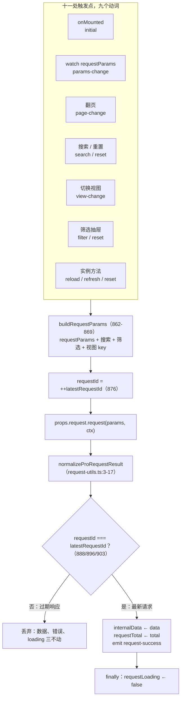
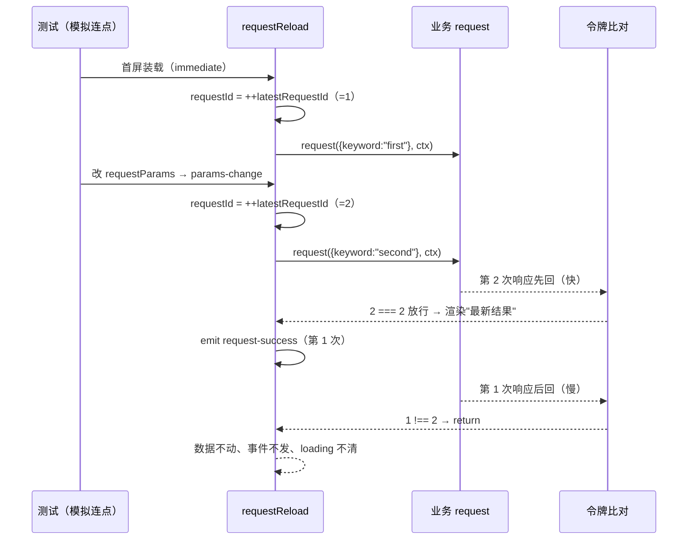

# 9-25 · ProTable（下）：运行时引擎

> 本篇是 9 卷"增强层（pro-components）"的第二十五篇，也是 pro-table 上下篇的下集。9-24 拆完了配置模型——一份 `ProTableColumn` 如何声明 14 种渲染与编辑器协议、显示管线 `renderDisplayValue` 如何把单元格变成标签、进度条与富文本。但配置再漂亮，也只是让表格"长成什么样"；让表格"动起来"的是另外四段代码：请求怎么发、过期的响应怎么丢、导出怎么落盘、打印怎么开窗、行列怎么拖、全屏怎么铺。本篇按大纲的核心问题——**竞态防护、导出打印、拖拽与全屏的实现**——把 `pro-table.vue` 里这四段运行时引擎逐一拆到实码：一个 `latestRequestId` 数字令牌管住十一条触发线的竞态（9-02 与 9-10 两度引过它，本篇正式展开）；CSV 零依赖导出加 Excel 动态分包加新窗口打印的两条出口管道；sortablejs 直挂 tbody/thead 的"DOM 先动、数据追认"式拖拽；Fullscreen API 优先、CSS 铺满兜底的双保险全屏。全部给实码定论，并为 9-26《ColumnSettingPanel：列设置》埋好引线。

接到题目先复述一遍目标，防止写偏：pro-table 的运行时要解决的业务场景，是"列表页每分钟都在发生的那几十次交互"——翻页、搜索、切视图、筛选、刷新、重置、导出、打印、拖行列、进出全屏。9-24 讲的配置模型回答的是"表格渲染什么"，本篇回答的是"这些交互背后组件替业务扛了什么"。基础层 8-09 给了 `xy-table` 的列模型与固定列，8-10 给了 `xy-pagination` 的页码窗口，但把"翻页 → 带参请求 → 落数据 → 防竞态"这条动线焊起来的事，基础层一件都没做——EP 对比在 9-02 已经立过：`el-table` 加 `el-pagination` 没有任何内建远程请求协议，竞态防护完全归业务自写。pro-table 的价值就在这层"运行时 glue"：把十条触发线汇进一个请求函数，把过期响应挡在数据之外，把导出打印拖拽全屏四个高频需求从"每个项目抄一遍社区代码"变成"各传一个配置项"。

先交代体量，给全文一个标尺。`pro-table/src/pro-table.vue` 全文 1779 行——脚本段 1-1501、模板段 1503-1779，是整个增强层体量第一的源文件；`src/pro-table.ts` 382 行（9-24 已拆列类型，本篇只取运行时相关的 `ProTableRequestConfig`/`ProTableExportOptions`/`ProTablePrintOptions`）；测试两份共 897 行——`__tests__/pro-table.spec.ts` 822 行十个用例、`__tests__/pro-table-drag.spec.ts` 75 行一个用例；文档示例八个，本篇主要引 `workbench-request.vue`（131 行）。脚本段里与本篇直接相关的行号地图先钉在这里，后文逐段展开：

- 运行时句柄声明区：`rowSortable`/`columnSortable`/`latestRequestId` 三个 `let`，225-227；
- 竞态防护：`buildRequestParams` 862-869、`requestReload` 871-907（令牌递增在 876，三处守卫在 888/896/903）、`reload`/`refresh`/`reset` 909-934；
- 导出打印：`exportableColumns`/`printableColumns` 288-293、`handleExport` 1087-1132、`handlePrint` 1134-1189、CSV 转义 165-185；
- 拖拽：`canColumnDrag` 365-370、`reorderVisibleTopLevelColumns` 1191-1218、`destroySortables`/`syncSortables` 1220-1269、重建 watch 1392-1400；
- 全屏：`toggleFullscreen` 761-785、`syncFullscreenState` 1438-1444、监听注册注销 1449/1459、CSS 侧 `packages/theme/src/pro/pro-table.css:8-17`。

## 一、请求编排：十一条触发线汇入一个令牌

先数清楚 pro-table 里到底有多少地方会发起远程请求。用 `rg "requestReload"` 扫脚本段，调用点共十一处，按触发源归类：

```text
packages/pro-components/pro-table/src/pro-table.vue 中的 requestReload 触发点
1452  onMounted           → "initial"        首屏装载（immediate !== false）
1406  watch requestParams → "params-change"  外部参数变化（deep 监听）
 956  handlePageChange    → "page-change"    翻页
 962  handleSearch        → "search"         搜索提交
 967  handleSearchReset   → "reset"          搜索区重置
 973  handleSavedViewSelect → "view-change"  切换保存视图
 801  handleFilterApply   → "filter"         筛选抽屉应用
 806  handleFilterReset   → "reset"          筛选抽屉重置
 910  reload()            → "reload"         实例方法
 914  refresh()           → "refresh"        实例方法（工具栏刷新按钮同源）
 933  reset()             → "reset"          实例方法（全状态复位）
```

十一个触发点、九个动词——`reset` 一个动词被三个触发源共用，`action` 的粒度按"语义"而非"来源"划分，这一点 9-02 拆 `ProRequestContext.action` 时已立过规矩：动词是业务方在请求回调里分支的依据。十一条线最后全部汇进同一个异步函数，数据流如下图：



### 触发之后的合并与执行体

第一段主板是参数合并与请求执行，871-934 一次给全：

```ts
// packages/pro-components/pro-table/src/pro-table.vue:862-934
function buildRequestParams() {
  return {
    ...(props.request?.requestParams ?? {}),
    ...(searchModel.value ?? {}),
    ...(filterModel.value ?? {}),
    ...(activeViewKey.value ? { activeViewKey: activeViewKey.value } : {})
  };
}

async function requestReload(action = "reload") {
  if (!props.request) {
    return;
  }

  const requestId = ++latestRequestId;
  requestLoading.value = true;
  requestError.value = null;

  try {
    const params = buildRequestParams();
    const result = await props.request.request(
      params,
      createProRequestContext(action, params, currentPageState.value, pageSizeState.value)
    );
    const normalized = normalizeProRequestResult(result);

    if (requestId !== latestRequestId) {
      return;
    }

    internalData.value = normalized.data as ProTableRow[];
    requestTotal.value = normalized.total;
    emit("request-success", internalData.value.slice());
  } catch (error) {
    if (requestId !== latestRequestId) {
      return;
    }

    requestError.value = error;
    emit("request-error", error);
  } finally {
    if (requestId === latestRequestId) {
      requestLoading.value = false;
    }
  }
}

async function reload() {
  await requestReload("reload");
}

async function refresh() {
  await requestReload("refresh");
}

async function reset() {
  currentPageState.value = props.defaultCurrentPage;
  pageSizeState.value = props.defaultPageSize;
  cancelEdit();
  closeContextmenu();
  selectedRows.value = [];
  if (searchModel.value) {
    Object.keys(searchModel.value).forEach((key) => {
      searchModel.value![key] = undefined;
    });
  }
  if (filterModel.value) {
    Object.keys(filterModel.value).forEach((key) => {
      filterModel.value![key] = undefined;
    });
  }
  await requestReload("reset");
}
```

逐段读。`buildRequestParams`（862-869）把四份来源摊平成一个参数包：外部固定参数 `requestParams`、搜索模型、筛选模型、当前视图 key。合并顺序就是优先级——搜索与筛选可以覆盖 `requestParams` 的同名字段，这个"后者胜"的顺序 9-04 拆 search-form 时对照过：查询语义的参数形状由组件收口，业务方拿到的 `params` 永远是全量现场，不需要自己再拼一遍。

`requestReload`（871-907）是整篇的主角。它做四件事：领令牌（876）、置加载态（877-878）、发请求（880-886）、三处守卫后落数据。竞态防护的全部秘密就是 876 行那一行 `const requestId = ++latestRequestId;`——组件实例持有一个模块级的计数器（声明在 227 行，和两个 Sortable 句柄挤在同一个 `let` 区），每次请求先自增并把快照存进局部变量；响应回来后用三处比对决定生死：

- **888 行（数据落点守卫）**：`await` 之后第一件事先验令牌，过期响应连 `internalData` 的门都摸不到，`emit("request-success")` 也一起跳过——过期数据不仅不渲染，连事件都不外抛，业务方不会收到"幽灵成功"；
- **896 行（错误落点守卫）**：同构的逻辑护住 `catch` 分支。没有它，一次被新请求淘汰的旧请求若失败，会把 `requestError` 写上去，表格上方的错误横幅（模板 1671-1678 行）就会显示一条早已过期的失败——"旧请求的错误不能报给新请求的世界"；
- **903 行（loading 清理守卫）**：`finally` 里只有最新请求才有权把 `requestLoading` 置回 false。这行防的是一种隐蔽的时序错乱：请求 A 与 B 并发，B 先返回并清理了 loading，A 后返回若无条件再清一次，本来无害——但若 A 在 B 发起**之前**就完成了 await 之后的清理（比如 A 的 finally 与 B 的置位交错在同一个微任务批次里），loading 会被错误地提前清掉。令牌比对让"清理"这个动作也变成只有最新请求专属的权力。

`normalizeProRequestResult` 是 9-02 拆过的共享工具，全文 33 行在这里一并复述（它是 pro-table 与 request-form 两个消费者共享的全部请求基建）：

```ts
// packages/pro-components/request-utils.ts（全文 33 行）
import type { ProRequestContext, ProRequestResult } from "./core";

export function normalizeProRequestResult<T>(result: ProRequestResult<T>) {
  if (Array.isArray(result)) {
    return {
      data: result,
      total: result.length,
      extra: {}
    };
  }

  return {
    data: result.data,
    total: result.total ?? result.data.length,
    extra: result.extra ?? {}
  };
}

export function createProRequestContext(
  action: string,
  params: Record<string, unknown>,
  page: number,
  pageSize: number,
  signal?: AbortSignal
): ProRequestContext {
  return {
    action,
    params,
    page,
    pageSize,
    signal
  };
}
```

注意 24 行那个 `signal?: AbortSignal` 形参——协议层（`core.ts:13-19`）给 `ProRequestContext` 立了 `signal` 字段（`core.ts:18`），工具函数也把形参位留了出来，但 pro-table 调用时（884 行）没有传。这不是遗漏，是一种分工，下一小节专门展开。

还有一个容易被忽略的所有权问题：request 模式下 `internalData` 归引擎独占。1353-1363 行的 watch 写得明白：

```ts
// packages/pro-components/pro-table/src/pro-table.vue:1353-1363
watch(
  () => props.data,
  (value) => {
    if (!props.request) {
      internalData.value = value.slice();
    }
  },
  {
    deep: true
  }
);
```

传了 `request`，外部再怎么改 `data` 都不会进表格——数据主权完全移交给请求管线；没传 `request`，它就退化为一个"本地数据 + 全功能工作台"的静态表格。两种形态共用一套渲染层，分界线就是这一个 `if`。

### 权衡一：数字令牌，而不是 AbortController

**为什么是令牌而不是中断？** 这是本篇第一个设计权衡，也是 9-10 留下的那笔"欠账"的正主。三个论点：

第一，**两者管的是竞态的不同阶段**。AbortController 能掐断的是"还在网络上"的请求；但对已经 resolve、正在事件队列里排队等待消费的响应，中断无能为力——而 UI 竞态最典型的现场恰恰是"两个响应都到了，只是顺序反了"。令牌比对的拦截点在"响应消费"这一端，天然覆盖全部阶段：还在路上的请求，它的响应回来时令牌早已过期，一样被丢弃。真要把网络请求本身也取消掉，需要 signal 一路穿透到业务方手里的 `fetch`——协议层把这根线留好了（`core.ts:18` 的 `signal?: AbortSignal`、`request-utils.ts:24` 的形参位），但组件选择不越这一步：`request` 回调是业务实现的，组件不知道业务用的是 `fetch` 还是封装过的 SDK，强行传 signal 只会制造"必须接入否则白搭"的隐性契约。**组件保证"过期结果绝不入册"，把"过期请求要不要掐断在半路"留给业务按需接入**——这是协议分层，不是偷懒。

第二，**成本不对称**。令牌方案的全部成本是一个 `number`、一次自增、三处比较；AbortController 方案要求每次请求实例化一个控制器、把它挂进请求链路、还要把 `AbortError` 从真实错误里分类出来（被取消的请求不该走进 `requestError` 横幅）。对一个要覆盖十一条触发线的通用组件，后者的复杂度会渗透进每一个触发点。

第三，**EP 对照**。Element Plus 的 `el-table` + `el-pagination` 组合没有任何请求协议，翻页连点导致的竞态全靠业务在事件回调里自己处理——社区里"翻页快速连点出现旧数据"是 EP 生态的经典 issue。antd 的 ProTable 内建了 `request` 协议，方向与本库一致；本库的差异在于把上下文协议（`ProRequestContext`）与执行策略（令牌）分离在两层，9-02 的结语"协议层不承诺竞态安全，执法层必须自己兜"说的就是这里：令牌是 pro-table 的执法选择，别的消费者（比如未来的某个 chart 容器）完全可以选防抖或节流，协议不用改一字。

再把 9-10 那笔欠账结清。request-form 与 pro-table 共享同一个 `request-utils.ts`（全库仅有的两个消费者，9-10 用 `rg` 定过案），但 request-form 的 `load`/`submit` 里没有任何令牌——9-10 原文说"严谨度差出一个竞态令牌"，本篇给出解释：**频率决定严谨度**。表格的请求是高频的（十一条触发线，翻页连点、搜索回车连敲都是常态），竞态窗口时刻敞开；表单的请求一生只有"初始加载一次 + 提交若干次"，且通常活在模态容器里——dialog/drawer 打开期间同一表单不会并发第二次加载，提交按钮自身带 loading 防重。同一个协议，两个消费者按自己的请求频率选了不同的执法强度，这比"到处都套同一个模板"更接近工程的本义。

### 竞态用例：手动拨快的时钟

竞态测试的难点在于"让慢的先发、快的先回"。`pro-table.spec.ts:580-659` 的写法是把 promise 的 resolve 权拿到测试手里，全文引用：

```ts
// packages/pro-components/pro-table/__tests__/pro-table.spec.ts:580-659
  it("连续触发 request 时只保留最后一次响应结果", async () => {
    const resolvers: Array<(value: { data: Row[]; total: number }) => void> = [];
    const request = vi.fn(
      () =>
        new Promise<{ data: Row[]; total: number }>((resolve) => {
          resolvers.push(resolve);
        })
    );

    const wrapper = mountHost(
      `
        <xy-pro-table
          :data="[]"
          :columns="columns"
          :request="{ request, requestParams, immediate: true }"
          :table-props="{ rowKey: 'id' }"
          @request-success="requestEvents.push($event)"
        />
      `,
      () => ({
        request,
        requestParams: {
          keyword: "first"
        },
        requestEvents: [] as Array<Row[]>,
        columns: [
          {
            prop: "name",
            label: "名称"
          },
          {
            prop: "status",
            label: "状态"
          }
        ] as ProTableColumn<Row>[]
      })
    );

    await nextTick();
    expect(request).toHaveBeenCalledTimes(1);

    await wrapper.setData({
      requestParams: {
        keyword: "second"
      }
    });
    await nextTick();
    expect(request).toHaveBeenCalledTimes(2);

    resolvers[1]?.({
      data: [
        {
          id: 2,
          name: "最新结果",
          status: "启用"
        }
      ],
      total: 1
    });
    await flushPromises();

    expect(wrapper.text()).toContain("最新结果");
    expect((wrapper.vm as unknown as { requestEvents: Array<Row[]> }).requestEvents).toHaveLength(1);

    resolvers[0]?.({
      data: [
        {
          id: 1,
          name: "过期结果",
          status: "停用"
        }
      ],
      total: 1
    });
    await flushPromises();

    expect(wrapper.text()).toContain("最新结果");
    expect(wrapper.text()).not.toContain("过期结果");
    expect((wrapper.vm as unknown as { requestEvents: Array<Row[]> }).requestEvents).toHaveLength(1);
  });
```

用例的时序值得画出来，这是"慢请求后到反而被丢"的完整现场：



三个断言各盯一处守卫：文本不含"过期结果"盯的是 888 行数据守卫；`requestEvents` 长度恒为 1 盯的是"过期成功连事件都不发"；两次 `flushPromises` 之间文本始终是"最新结果"盯的是 903 行 loading 守卫下的最终一致。测试里还有一个细节：触发第二次请求的方式是 `setData` 改 `requestParams` 而不是手动调方法——它顺带验证了 1402-1412 行那个 deep watch 确实在工作：

```ts
// packages/pro-components/pro-table/src/pro-table.vue:1402-1412
watch(
  () => props.request?.requestParams,
  () => {
    if (props.request?.autoReloadOnParamsChange !== false) {
      void requestReload("params-change");
    }
  },
  {
    deep: true
  }
);
```

`autoReloadOnParamsChange` 默认为真，`!== false` 的写法让 `undefined` 也走重载分支——配置项的"缺省即开启"语义。顺带记一个行为细节：`params-change` 重载**不复位页码**（对比 `handleSearch` 的 961 行会先把页码拨回 1），外部参数变了、当前页却停在原地，业务若期望"参数变即回第一页"需要自己传 `currentPage` 或调 `reset()`。这是选择，不是疏漏，但文档没有明示，记入缺口。

### reset 的两层语义

`reset()`（917-934）是 eleven 条触发线里动作最大的一条，它复位的是**六份状态**：页码与页大小回默认值、取消全部编辑（`cancelEdit()` 连草稿带编辑态一起清）、关闭右键菜单、清空选择、搜索模型与筛选模型的每个键置 `undefined`，最后才发 `reset` 请求。9-04 拆 search-form 时引过两层 reset 的对照，这里给完整版：

- **search-form 的 reset** 是"回到初始查询"——它只管查询表单自己的字段（`resetFields`），并在 `submitOnReset` 开启时用同一份快照补发一次 `search`（`search-form.vue:307-309`）；
- **pro-table 的 reset** 是"整个表格工作台的状态机复位"——它不仅要把页码页大小拨回去，还要把编辑草稿、右键菜单、多选状态这些与查询无关的运行时残留一并扫掉，再以 `reset` 动词发请求。

两个 reset 不互相调用：搜索表单挂进 pro-table 走的是 `views.searchFields` 协议，搜索词的清空由 `reset()` 直接遍历 `searchModel` 的键置 `undefined`（923-927 行）完成——注意这里改的是业务传进来的 reactive 对象的内容，pro-table 对 `searchModel` 采取的是"受控引用直改"策略，与 9-04 的快照语义（submit 用提交时刻的快照）恰好互补：直改保证表格发起的 reset 请求立刻能看到空参数，快照保证业务侧的重置回调拿到的是干净现场。另外还有第三个 reset——`handleSearchReset`（965-968 行）只把页码拨回 1 并发 `reset` 请求，**不碰**搜索词：搜索区自己的重置按钮会先走 search-form 内部的 `resetFields`，再触发这里。三层 reset 各管一段，边界是"谁的状态谁复位"。

## 二、导出与打印：一条数据管道，两种出口

工作台的"导出"与"打印"两个按钮背后是两个 async 函数。先把入口圈定看清楚——288-293 行的两个 computed 决定哪些列参与导出打印：

```ts
// packages/pro-components/pro-table/src/pro-table.vue:288-293
const exportableColumns = computed(() =>
  visibleLeafColumns.value.filter((column) => column.exportable !== false && column.type === "default")
);
const printableColumns = computed(() =>
  visibleLeafColumns.value.filter((column) => column.printable !== false && column.type === "default")
);
```

两个细节：一是**起点是 `visibleLeafColumns`**——列设置里隐藏的列不参与导出打印，导出的列集合与用户眼前所见保持一致（`exportable`/`printable` 两个列级开关在 `pro-table.ts:154-155`，默认不排除）；二是 `type === "default"` 把 selection、expand 这类功能列整体挡在外面——没人希望 CSV 的第一列是一堆 true/false。这个"跟着可见列走"的设计还埋着与 9-26 的接口：列设置面板改变显隐，导出范围自动跟随，两个组件不需要任何直接通信。

### 导出：CSV 零依赖 + Excel 动态分包

`handleExport`（1087-1132）一次给全：

```ts
// packages/pro-components/pro-table/src/pro-table.vue:1087-1132
async function handleExport(type?: "csv" | "excel") {
  const exportType = type ?? props.exportOptions?.defaultType ?? "csv";
  const filename = props.exportOptions?.filename ?? "pro-table-export";
  const rows = internalData.value.slice();
  const columns = exportableColumns.value.map((column) => cloneColumn(column));
  const payload = {
    type: exportType,
    filename,
    columns,
    rows
  };

  if ((await props.exportOptions?.beforeExport?.(payload)) === false) {
    return;
  }

  const mappedRows = rows.map((row) => props.exportOptions?.mapRow?.(row) ?? row);
  const headers = columns.map((column) => column.label ?? column.prop ?? column.key ?? "");
  const records = mappedRows.map((row) =>
    columns.map((column) => {
      const key = column.prop ?? column.key;
      return stringifyCellValue(key ? readPathValue(row, key) : undefined);
    })
  );

  if (exportType === "excel") {
    const XLSX = await import("xlsx");
    const worksheet = XLSX.utils.aoa_to_sheet([headers, ...records]);
    const workbook = XLSX.utils.book_new();
    XLSX.utils.book_append_sheet(workbook, worksheet, "Sheet1");
    XLSX.writeFile(workbook, `${filename}.xlsx`);
  } else {
    const csv = [headers.map((value) => escapeCsvValue(value)).join(","), ...records.map((row) => row.map((value) => escapeCsvValue(value)).join(","))].join("\n");
    const blob = new Blob([csv], {
      type: "text/csv;charset=utf-8;"
    });
    const url = URL.createObjectURL(blob);
    const anchor = document.createElement("a");
    anchor.href = url;
    anchor.download = `${filename}.csv`;
    anchor.click();
    URL.revokeObjectURL(url);
  }

  emit("export", payload);
}
```

结构是清晰的五步：组 payload（1092-1097）→ `beforeExport` 审批（1099-1101，返回 false 整体取消）→ 行映射与取值（1103-1110）→ 按类型落盘（1112-1129）→ 事件外抛（1131）。落盘的两条岔路是选型的核心：

**CSV 岔路是零依赖的**。Blob 构造 + `URL.createObjectURL` + 隐藏锚点 `download` 属性 + `revokeObjectURL` 释放，四步全是浏览器原生 API，一行第三方代码都没有。CSV 格式本身的坑全在转义里，177-185 行的转义函数值得单独看：

```ts
// packages/pro-components/pro-table/src/pro-table.vue:165-185
function stringifyCellValue(value: unknown) {
  if (value == null) {
    return "";
  }

  if (typeof value === "string" || typeof value === "number" || typeof value === "boolean") {
    return String(value);
  }

  return JSON.stringify(value);
}

function escapeCsvValue(value: unknown) {
  const text = stringifyCellValue(value);

  if (!/[",\n]/.test(text)) {
    return text;
  }

  return `"${text.replace(/"/g, "\"\"")}"`;
}
```

`stringifyCellValue` 处理类型（null/undefined 出空串、对象走 JSON 序列化），`escapeCsvValue` 处理格式——只在值里真的出现逗号、双引号或换行时才加引号包裹，引号翻倍转义，不碰无辜值。这是 RFC 4180 的最小实现。但最小实现意味着两件事没做：没有 BOM 头（`text/csv;charset=utf-8` 的 Blob 在部分 Excel 版本里打开中文会乱码，业界惯例是前置 `\uFEFF`）；没有做公式注入防护（以 `=`、`+`、`-`、`@` 开头的值会被 Excel 当公式执行，CSV injection 是有 CVE 编号的真实攻击面，OWASP 的备忘单建议对这些前缀做前缀逃逸）。两条都记入缺口清单。

**Excel 岔路是动态分包的**。1113 行 `await import("xlsx")`——xlsx 库不小，静态 import 会把它焊进主包，让所有不用导出功能的业务一起付体积税；动态 import 让它变成独立 chunk，用户第一次点"导出 Excel"时才加载。注意这里有一个依赖声明上的真实缺口：`xlsx` 只声明在**仓库根**的 devDependencies（`package.json:83`，`^0.18.5`），`packages/pro-components/package.json` 的 dependencies 里只有 `sortablejs` 没有 `xlsx`——monorepo 内因为依赖提升一切正常，但发布到 npm 后，外部消费者若自己没装 xlsx，这个动态 import 会在运行时才失败（且 `handleExport` 是模板直接调用的 async 函数，没有 catch，失败是一个未处理的 Promise rejection）。发布链路问题记入缺口清单。

**权衡二：前端导出，服务端协议交给 beforeExport。** pro-table 的导出完全是前端的：数据源就是内存里的 `internalData`，导出只是"内存对象 → 文本格式 → 浏览器下载"的纯变换。这个选型的代价是**导出范围受前端数据面限制**——翻页模式下 CSV 里只有当前页的数据，服务端才算得清的"全量导出"这里没有协议。逃生口是 `beforeExport`：它拿到完整的 `payload`（type/filename/columns/rows，类型定义在 `pro-table.ts:218-224`），返回 false 即可拦截内置流程，业务拿到 rows 自己转成服务端导出请求。也就是说"服务端导出"不是没做，而是被降级成了一个钩子协议——组件管"前端导出的默认姿势"，业务管"什么时候不用这个姿势"。对比 EP：`el-table` 没有任何导出能力，EP 生态的答案永远是"自己引 xlsx 或 vue-json-excel 手写"；本库把零依赖的默认值内建了，把贵的路径（Excel、服务端）留成了钩子——厚薄之间，边界画在"零成本能否覆盖多数场景"上。

再记一个语义选择：**导出的是"数据"，不是"视图"**。1105-1110 行取值走的是 `readPathValue` + `stringifyCellValue`——直接读原始字段，9-24 那套 `renderDisplayValue` 显示管线（`packages/components/shared/display-renderer.ts`，353 行）完全不参与。后果是具体的：一个 `valueType: "select"` 的状态列，界面上显示"启用"，CSV 里落的是 `enabled`；`formatter`、`render`、`renderHTML` 同样不生效。这个选择保住了导出的"数据保真"语义（导出物可以直接回灌进系统），但对报表型用户是反直觉的——好在 `mapRow`（1103 行）提供了行级逃生口，业务可以在导出前把枚举翻译成标签。显示与导出的这条分界线，与 9-24 的 valueType 协议是同一枚硬币的两面。

### 打印：新窗口开表，不碰主文档

`handlePrint`（1134-1189）的完整实码：

```ts
// packages/pro-components/pro-table/src/pro-table.vue:1134-1189
async function handlePrint() {
  const rows = internalData.value.slice();

  if ((await props.printOptions?.beforePrint?.(rows)) === false) {
    return;
  }

  const printWindow = window.open("", "_blank", "noopener,noreferrer");

  if (!printWindow) {
    return;
  }

  const title = props.printOptions?.title ?? props.title ?? "表格打印";
  const subtitle = props.printOptions?.subtitle ?? props.description ?? "";
  const headers = printableColumns.value.map((column) => column.label ?? column.prop ?? column.key ?? "");
  const body = rows
    .map(
      (row) =>
        `<tr>${printableColumns.value
          .map((column) => `<td>${escapeCsvValue(readPathValue(row, column.prop ?? column.key)).replace(/"/g, "")}</td>`)
          .join("")}</tr>`
    )
    .join("");

  printWindow.document.write(`
    <html>
      <head>
        <title>${title}</title>
        <style>
          body { font-family: sans-serif; padding: 24px; color: #111827; }
          h1 { font-size: 20px; margin: 0 0 8px; }
          p { margin: 0 0 16px; color: #6b7280; }
          table { width: 100%; border-collapse: collapse; }
          th, td { border: 1px solid #d1d5db; padding: 10px 12px; text-align: left; }
          th { background: #f3f4f6; }
        </style>
      </head>
      <body>
        <h1>${title}</h1>
        ${subtitle ? `<p>${subtitle}</p>` : ""}
        <table>
          <thead>
            <tr>${headers.map((item) => `<th>${item}</th>`).join("")}</tr>
          </thead>
          <tbody>${body}</tbody>
        </table>
      </body>
    </html>
  `);
  printWindow.document.close();
  printWindow.focus();
  printWindow.print();
  printWindow.close();
  emit("print", rows);
}
```

实现选型是 `window.open("", "_blank")` 开空白窗口 → `document.write` 写一份独立 HTML → `print()` 触发打印对话框 → `close()`。社区里打印表格常见的三种方案——主文档内 `@media print` 隐藏无关节点、隐藏 iframe 装载打印内容、新窗口写入——这里选了第三种，理由有三：一是**样式隔离最干净**，新窗口从零写六行内联样式，主站的令牌、组件样式、暗色主题一概不会漏进去（用 `@media print` 就得跟全站样式博弈"哪些该藏哪些该留"）；二是**不污染主文档**，iframe 方案要在主文档里永久养一个隐藏节点；三是 `noopener,noreferrer` 的第三个参数（1141 行）顺手切断了新窗口与 opener 的关联。1159-1184 行的模板字符串里那套样式全部是字面量硬编码——`#111827`、`#6b7280`、`#d1d5db`、`#f3f4f6` 一组灰色阶，没有一个语义令牌。这看起来违反 3-01"组件只吃语义层"的规矩，但有一个站得住的解释：打印窗口是脱离应用皮肤的物理纸张世界，`data-theme` 协议、CSS 变量在新窗口的文档里根本没有挂载点，令牌体系在那里无从消费——硬编码是"跨文档边界令牌失效"这个事实的诚实表达。代价是打印样式不随主题走，属于可接受项。

两个值得点名的实现细节。其一，1154 行单元格取值链是 `escapeCsvValue(...).replace(/"/g, "")`——复用 CSV 转义函数然后把双引号全部删掉，让值可以安全嵌进 `<td>` 的文本位。这能防住引号破坏 HTML 结构，但**防不住 HTML 注入**：`<`、`>`、`&` 原样进入文档，值里若真有 `<script>` 或 ``，新窗口就是它们的舞台；`title`/`subtitle`（1147-1148 行插值进 1162/1173-1174 行）更是完全没有转义。打印内容来自业务数据，信任模型上算半可信——记入缺口清单，修补也简单（补一个 `escapeHTML`）。其二，1186-1187 行 `print()` 之后立刻 `close()`——多数浏览器的 `print()` 会阻塞到打印对话框关闭，这个顺序在 Chrome/Firefox/Safari 桌面端成立，但依赖的是"阻塞"这个未写入规范的行为，属于顺势而为的实现取舍。

导出打印的测试在 `pro-table.spec.ts:726-821`（用例名"支持右键菜单、虚拟列表和导出打印入口"），测试对两条管道的桩点选得很准——CSV 管道桩 `URL.createObjectURL`/`revokeObjectURL` 和锚点的 `click`，打印管道桩 `window.open` 返回一个带 `document.write/print/close` 的假窗口：

```ts
// packages/pro-components/pro-table/__tests__/pro-table.spec.ts:726-756
  it("支持右键菜单、虚拟列表和导出打印入口", async () => {
    const openMock = vi.fn(() => ({
      document: {
        write: vi.fn(),
        close: vi.fn()
      },
      focus: vi.fn(),
      print: vi.fn(),
      close: vi.fn()
    }));
    const createObjectURLMock = vi.fn(() => "blob:demo");
    const revokeObjectURLMock = vi.fn();
    const appendAnchorClick = vi.fn();
    const originalOpen = window.open;
    const originalCreateObjectURL = URL.createObjectURL;
    const originalRevokeObjectURL = URL.revokeObjectURL;

    window.open = openMock as unknown as typeof window.open;
    URL.createObjectURL = createObjectURLMock;
    URL.revokeObjectURL = revokeObjectURLMock;

    const createElementSpy = vi.spyOn(document, "createElement");
    createElementSpy.mockImplementation(((tagName: string) => {
      const element = document.createElementNS("http://www.w3.org/1999/xhtml", tagName) as HTMLElement;

      if (tagName === "a") {
        (element as HTMLAnchorElement).click = appendAnchorClick;
      }

      return element;
    }) as typeof document.createElement);
```

断言段（806-821 行）用"工具栏按钮的倒数第二个是导出、倒数第一个是打印"（这个位置依赖恰好反映了 1544-1567 行按钮区的排布顺序）触发两个入口，然后逐一验证：`exportEvents`/`printEvents` 各一条、`createObjectURL` 恰好一次（CSV 管道走了 Blob）、锚点 `click` 一次、`window.open` 一次（打印管道走了新窗口）。两条管道各自的签名动作都被断言钉死，将来谁把导出改成 fetch 服务端、把打印改成 iframe，测试会第一时间拦下。

## 三、拖拽：sortablejs 直挂，DOM 先动、数据追认

先给"拖拽能力从哪来"一个实码定论，因为这是任务清单里点名要核的问题。答案分三层：

**第一层，不来自基础层。** 全库 `rg "sortablejs"` 扫源码，import 只有一处——`pro-table.vue:17` 的 `import Sortable from "sortablejs";`。`packages/xiaoye-primitives/src/composables/` 里没有任何 drag/sort 相关的组合式函数（目录清点实证）。也就是说 5-19 拆 Splitter 时那套自研指针几何，pro-table 一行都没复用。

**第二层，也不来自 Splitter 的复用逻辑。** Splitter 与 pro-table 的"拖"是两种能力域：Splitter 拖的是一维比例（分隔条位置 → 两个窗格的尺寸百分比），需要的是 pointer 事件的几何计算与 step 吸附；pro-table 拖的是列表重排（DOM 序 → 数组序），需要的是拖拽影子、占位动画、跨元素命中的整套交互。前者 100 行自研划算，后者再造一遍 Sortable 是灾难——**能力域不同，来源不同的分叉是合理的**。

**第三层，是直接依赖 sortablejs 本体。** `packages/pro-components/package.json:56` 声明 `"sortablejs": "^1.15.7"` 为正式 dependencies，全库唯一的运行时消费者就是 pro-table。这个选型与 EP 生态其实同源：`el-table` 同样没有内建行拖拽，EP 官方 issue 与社区教程的惯常答案就是"用 Sortable 挂 tbody，onEnd 里回写数组"。本库做的事情是把这套社区共识**内建成协议**——两个布尔 prop（`draggableRow`/`draggableColumn`，类型声明在 `pro-table.ts:256-257`、默认值在 `withDefaults` 的 79-80 行）加两个事件（`drag-row-change`/`drag-column-change`，emits 声明在 116-117 行），社区代码里"找 DOM、建实例、回写数组"的三步全部收进组件。

### 挂载点与回写

拖拽的装配中枢是 `syncSortables`（1227-1269 行），连同销毁函数一起引用：

```ts
// packages/pro-components/pro-table/src/pro-table.vue:1220-1269
function destroySortables() {
  rowSortable?.destroy();
  rowSortable = null;
  columnSortable?.destroy();
  columnSortable = null;
}

async function syncSortables() {
  destroySortables();
  await nextTick();

  if (props.draggableRow) {
    const body = rootRef.value?.querySelector(".xy-table__body-wrapper tbody");

    if (body) {
      rowSortable = Sortable.create(body as HTMLElement, {
        animation: 150,
        onEnd: ({ oldIndex, newIndex }) => {
          if (oldIndex == null || newIndex == null || oldIndex === newIndex) {
            return;
          }

          internalData.value = move(internalData.value, oldIndex, newIndex);
          emit("drag-row-change", internalData.value.slice());
        }
      });
    }
  }

  if (canColumnDrag.value) {
    const headerRow = rootRef.value?.querySelector(".xy-table__header-main thead tr:last-child");

    if (headerRow) {
      columnSortable = Sortable.create(headerRow as HTMLElement, {
        animation: 150,
        onEnd: ({ oldIndex, newIndex }) => {
          if (oldIndex == null || newIndex == null || oldIndex === newIndex) {
            return;
          }

          internalColumns.value = reorderVisibleTopLevelColumns(oldIndex, newIndex);
          emit("drag-column-change", internalColumns.value.slice());
          nextTick(() => {
            tableRef.value?.doLayout();
          });
        }
      });
    }
  }
}
```

行拖拽挂 `.xy-table__body-wrapper tbody`（1232 行）——8-09 的 xy-table 内部结构给了两个稳定的类名锚点，pro-table 用 `querySelector` 直接伸手进去，这是增强层对基础层 DOM 的少量"越界"之一（另一个是 1250 行的 `.xy-table__header-main thead tr:last-child`）。越界的前提是同一仓库内的实现同源，类名重构会连带拖拽失效——这是把两个组件放进同一个 monorepo 才敢做的耦合。

`onEnd` 回调的工作模式值得单独说：**DOM 先动、数据追认**。`onEnd` 触发时 Sortable 已经把 `<tr>` 物理移动到了新位置，回调里做的只是用 `move`（139-149 行的一个纯数组搬移函数）把 `internalData` 重排一遍——随后 Vue 的响应式更新会按新数组重渲染，与 Sortable 已经动过的 DOM 做对账。只要 `rowKey` 稳定（`tableBindings` 的 341 行默认 `rowKey: "id"`），虚拟 DOM diff 会把每行内容校正回数组序，最终态一致。反过来若先改数组再让 Vue 渲染，Sortable 的占位动画会被立即重渲染打断——"先让物理世界动完，再让数据世界追认"，是 Sortable 与 v-for 共存的社区标准姿势。事件载荷用的是 `internalData.value.slice()` 的**快照**，业务方拿到的是拖拽完成后的完整新序，防抖动也防篡改。

列拖拽的门槛比行拖拽高，365-370 行的 `canColumnDrag` 卡了两个条件：

```ts
// packages/pro-components/pro-table/src/pro-table.vue:365-370
const canColumnDrag = computed(
  () =>
    props.draggableColumn &&
    visibleColumns.value.length > 1 &&
    visibleColumns.value.every((column) => (column.children?.length ?? 0) === 0)
);
```

可见列至少两列（拖一列没有意义），且**所有可见列都不能有 children**——表头一旦存在多级表头，`thead tr:last-child` 挂载的那一行只是叶子行，拖动叶子列的语义与列配置的树形结构对不上，干脆禁用。这个"条件不满足就静默不装"的策略与 `draggableRow` 的直装形成对比：行拖拽无条件可用，列拖拽自带结构守卫。

列拖拽的 `onEnd` 里藏着一个必须处理的映射问题：Sortable 报告的 `oldIndex`/`newIndex` 是**可见列**之间的序号，而 `internalColumns` 里还混着 `hidden: true` 的列——直接按可见序号去搬全量数组，会把隐藏列的位置搬乱。`reorderVisibleTopLevelColumns`（1191-1218 行）就是这道映射桥：

```ts
// packages/pro-components/pro-table/src/pro-table.vue:1191-1218
function reorderVisibleTopLevelColumns(fromIndex: number, toIndex: number) {
  const source = internalColumns.value.slice();
  const visibleIndexes = source
    .map((column, index) => ({ column, index }))
    .filter(({ column }) => !column.hidden);

  if (
    fromIndex < 0 ||
    toIndex < 0 ||
    fromIndex >= visibleIndexes.length ||
    toIndex >= visibleIndexes.length
  ) {
    return source;
  }

  const reorderedVisibleColumns = move(
    visibleIndexes.map(({ column }) => column),
    fromIndex,
    toIndex
  );
  const nextColumns = source.slice();

  visibleIndexes.forEach(({ index }, orderIndex) => {
    nextColumns[index] = reorderedVisibleColumns[orderIndex];
  });

  return nextColumns;
}
```

先把全量列数组的下标与可见性配对（1193-1195 行），只对可见列做搬移，再按"可见列原本占据哪些下标"把新顺序填回原下标位（1213-1215 行）——隐藏列原地不动，可见列的相对顺序被重写。边界检查（1197-1204 行）防的是 Sortable 在极端渲染态下报出越界序号，防御性返回原数组。这正是列设置（显隐）与列拖拽（排序）两个特性在状态层的交汇点：两者操作的是同一份 `internalColumns`，一个改 `hidden` 字段，一个改数组序，互不覆盖。

### 为什么要反复销毁重建

`syncSortables` 开头先 `destroySortables()` 再 `await nextTick()`，而调用它的 watch（1392-1400 行）监听了四个源：

```ts
// packages/pro-components/pro-table/src/pro-table.vue:1392-1400
watch(
  () => [props.draggableRow, props.draggableColumn, internalData.value.length, visibleColumns.value.length],
  () => {
    void syncSortables();
  },
  {
    flush: "post"
  }
);
```

`flush: "post"` 保证回调跑在 DOM 更新之后——重建的理由就在 DOM 会被换掉：数据增删会重渲染 tbody 的行；列显隐切换（9-26 的列设置就是它的入口之一）、密度切换、虚拟列表开关都会让表头或表体节点被 Vue 重建。Sortable 的拖拽监听绑定在创建时传给它的那个元素上，元素被替换，实例就悬空了——所以每次可能引起 DOM 结构变化的源触发时，把两个实例整个销毁重建。销毁函数同时挂在 `onBeforeUnmount`（1457 行），卸载时不留悬空监听。这套"状态变化 → DOM 可能重建 → Sortable 必须重挂"的联动，是直接操作第三方 DOM 库与声明式渲染框架共存的固定成本。

拖拽的测试把 Sortable 整个 mock 掉，只留 `create` 与 `onEnd` 的回调形状，全文 75 行：

```ts
// packages/pro-components/pro-table/__tests__/pro-table-drag.spec.ts（全文 75 行）
import { mount } from "@vue/test-utils";
import { defineComponent, h, nextTick } from "vue";
import { describe, expect, it, vi } from "vitest";
import { XyProTable } from "@xiaoye/pro-components";

const sortableMock = vi.hoisted(() => ({
  instances: [] as Array<{
    options: {
      onEnd?: (payload: {
        oldIndex?: number;
        newIndex?: number;
      }) => void;
    };
  }>
}));

vi.mock("sortablejs", () => ({
  default: {
    create: vi.fn((_element, options) => {
      const instance = {
        options,
        destroy: vi.fn()
      };
      sortableMock.instances.push(instance);
      return instance;
    })
  }
}));

describe("XyProTable drag", () => {
  it("启用 draggableRow / draggableColumn 时会挂载 sortable 并派发事件", async () => {
    const wrapper = mount(XyProTable, {
      attachTo: document.body,
      props: {
        data: [
          { id: 1, name: "控制台" },
          { id: 2, name: "账单中心" }
        ],
        columns: [
          { prop: "name", label: "名称" },
          { prop: "id", label: "编号" }
        ],
        draggableRow: true,
        draggableColumn: true,
        tableProps: {
          rowKey: "id"
        }
      }
    });

    await nextTick();
    await nextTick();

    expect(sortableMock.instances).toHaveLength(2);

    sortableMock.instances[0]?.options.onEnd?.({
      oldIndex: 0,
      newIndex: 1
    });

    sortableMock.instances[1]?.options.onEnd?.({
      oldIndex: 0,
      newIndex: 1
    });

    expect(wrapper.emitted("drag-row-change")?.[0]?.[0]).toMatchObject([
      { id: 2, name: "账单中心" },
      { id: 1, name: "控制台" }
    ]);
    expect(wrapper.emitted("drag-column-change")?.[0]?.[0]).toMatchObject([
      { prop: "id", label: "编号" },
      { prop: "name", label: "名称" }
    ]);
  });
});
```

`vi.hoisted` 把实例收集器提升到 mock 工厂之前，让测试能在 mock 生效后拿到每个 `Sortable.create` 的 options——然后**直接调用 `onEnd` 回调**，模拟"用户拖完了"这个物理事件，断言两件事被正确派发：行数组真的换了序、列数组真的换了序。DOM 交互（真拖）被剥离，数据协议（回写与派发）被完整验证——这是对"DOM 先动、数据追认"模式最经济的测试切口。

顺带记一个测试里坐实的边界：mock 环境里 `expect(sortableMock.instances).toHaveLength(2)` 能过，说明两个 prop 同开时行、列两个 Sortable 各建一个互不干扰；而 `canColumnDrag` 的结构守卫在该用例里恰好放行（两列、无 children）。虚拟列表与行拖拽同开时，Sortable 的 `oldIndex` 是**渲染窗口内**的行号而不是全量数据行号——虚拟滚动下直接 `move` 全量数组会搬错行。文档示例里 `virtual-list.vue` 与拖拽配置从未同框，这个组合缺口记入清单。

## 四、全屏：Fullscreen API 优先，CSS 铺满兜底

全屏的入口是 `toggleFullscreen`（761-785 行），25 行里装了一整套双保险：

```ts
// packages/pro-components/pro-table/src/pro-table.vue:761-785
async function toggleFullscreen(force?: boolean) {
  const host = rootRef.value;

  if (!host || typeof document === "undefined") {
    fullscreen.value = force ?? !fullscreen.value;
    return;
  }

  const shouldOpen = force ?? !fullscreen.value;

  try {
    if (shouldOpen) {
      if (document.fullscreenElement !== host) {
        await host.requestFullscreen?.();
      }
    } else if (document.fullscreenElement) {
      await document.exitFullscreen?.();
    }
  } catch {
    fullscreen.value = shouldOpen;
  }

  fullscreen.value = shouldOpen;
  emit("workbench-action", shouldOpen ? "fullscreen:open" : "fullscreen:close");
}
```

三个层次的防御在读这段时应该被依次看清。**第一层是环境守卫**（764-767 行）：`rootRef` 未挂载或 `document` 不存在（SSR）时退化为纯状态翻转——全屏类照样能加上，只是不调浏览器 API。**第二层是 API 优先**（771-778 行）：`requestFullscreen` 是真全屏，盖住浏览器 UI；可选链 `host.requestFullscreen?.()` 容忍 API 不存在的环境静默跳过；进入前先查 `document.fullscreenElement !== host` 防重复请求。**第三层是 CSS 兜底**（779-781 行的 `catch`）：`requestFullscreen` 被浏览器拒绝（权限策略、iframe 限制）或抛错时，`catch` 里照样把 `fullscreen.value` 置位，然后 783 行统一置位——无论 API 成败，`is-fullscreen` 类都会加上。兜底是为谁准备的？典型是 iPhone Safari：`requestFullscreen` 在 iOS 上只对 `<video>` 生效，div 永远拿不到真全屏，此时 CSS 铺满是唯一可行的"全屏"。

CSS 侧的实现在 `packages/theme/src/pro/pro-table.css:8-17`：

```css
/* packages/theme/src/pro/pro-table.css:8-17 */
.xy-pro-table.is-fullscreen {
  position: fixed;
  inset: 0;
  z-index: 1200;
  padding: 24px;
  overflow: auto;
  background:
    radial-gradient(circle at top right, color-mix(in srgb, var(--xy-brand) 12%, var(--xy-mix-light)), transparent 220px),
    var(--xy-bg-page);
}
```

类名的拼装走的是 4-03 拆过的 `useNamespace`：`use-namespace.ts:8` 的 `is()` 只生成 `is-${state}` 前缀（不带块名），与根类 `xy-pro-table`（`rootClasses`，244-248 行的 `ns.is("fullscreen", fullscreen.value)`）拼成 `.xy-pro-table.is-fullscreen`。铺满的三件套是 `position: fixed` + `inset: 0` + `z-index: 1200`——1200 是一个足够高的固定值，全屏态是排他展示态而非叠层态，不走 4-05 的浮层栈协议（不需要出栈入栈的优先级仲裁，只需要"盖住一切常驻 UI"），背景用 `--xy-bg-page` 加品牌色晕光保住主题一致性——与打印窗口的硬编码不同，这里的 CSS 活在主文档里，令牌体系照常生效。

双保险还差最后一环：**状态回同步**。真全屏是浏览器管的，用户按 ESC 退出时组件毫不知情——1438-1444 行的 `syncFullscreenState` 把 ref 拉回浏览器事实：

```ts
// packages/pro-components/pro-table/src/pro-table.vue:1438-1444
function syncFullscreenState() {
  if (typeof document === "undefined" || !rootRef.value) {
    return;
  }

  fullscreen.value = document.fullscreenElement === rootRef.value;
}
```

它在 `onMounted` 里随 `document.addEventListener("fullscreenchange", ...)` 注册（1449 行）、`onBeforeUnmount` 注销（1459 行）——组件状态永远跟随浏览器事实，而不是自说自话。这条监听还有一个隐性收益：ESC 退出后 `fullscreen` 归 false，`is-fullscreen` 类同步摘除，CSS 铺满态与 API 全屏态不会出现"一半一半"的悬挂状态。工具栏按钮的文案（1565-1567 行的 `{{ fullscreen ? "退出全屏" : "全屏" }}`）因此对 ESC 也保持正确。EP 对照收个尾：`el-table` 没有任何全屏能力，EP 生态里"表格全屏"同样是每个项目各写各的（v-if 换容器或 fixed 覆盖层）；本库把它收进一个 prop、一个实例方法（`toggleFullscreen` 挂在 `ProTableInstance`，`pro-table.ts:237`），并给齐了 API 与 CSS 两条退化路径。

## 五、工作台按钮与空态代理：运行时的配置消费面

四大引擎段之外，运行时还有一层"配置消费"的胶水——9-24 讲的配置模型如何在运行时被翻译成按钮与占位。核心是 229-238 行的 `resolvedWorkbench`：

```ts
// packages/pro-components/pro-table/src/pro-table.vue:229-238
const resolvedWorkbench = computed(() => ({
  refresh: Boolean(props.workbench.refresh || props.request),
  density: Boolean(props.workbench.density),
  columnSetting: Boolean(props.workbench.columnSetting),
  fullscreen: Boolean(props.workbench.fullscreen),
  treeToggle: Boolean(props.workbench.treeToggle),
  filter: Boolean(props.workbench.filter || props.views?.filterFields?.length),
  export: Boolean(props.workbench.export || props.exportOptions),
  print: Boolean(props.workbench.print || props.printOptions)
}));
```

这张表的看点是三个"自动开启"：`refresh` 在 `props.request` 存在时自动亮起、`export` 在 `exportOptions` 存在时自动亮起、`print` 在 `printOptions` 存在时自动亮起——**能力存在即入口存在**。业务传了 `request` 却忘了配 `workbench.refresh`，刷新按钮照样出现，因为刷新这个动作对请求模式是刚需；反过来纯静态表格（无 request）不传 refresh 就没有刷新按钮，避免一个点了没反应的死按钮。消费这些开关的按钮区在模板 1544-1567 行：

```html
<!-- packages/pro-components/pro-table/src/pro-table.vue:1544-1567 -->
        <xy-button v-if="resolvedWorkbench.refresh" text @click="handleRefresh">刷新</xy-button>
        <xy-button v-if="resolvedWorkbench.filter" text @click="openFilterDrawer">筛选</xy-button>
        <xy-button
          v-if="resolvedWorkbench.treeToggle && tableRef?.bodyRows?.length"
          text
          @click="tableRef?.setAllTreeRowsExpanded(true)"
        >
          展开树
        </xy-button>
        <xy-button
          v-if="resolvedWorkbench.treeToggle && tableRef?.bodyRows?.length"
          text
          @click="tableRef?.setAllTreeRowsExpanded(false)"
        >
          收起树
        </xy-button>
        <xy-button v-if="resolvedWorkbench.columnSetting" text @click="settingsOpen = !settingsOpen">
          列设置
        </xy-button>
        <xy-button v-if="resolvedWorkbench.export" text @click="handleExport()">导出</xy-button>
        <xy-button v-if="resolvedWorkbench.print" text @click="handlePrint">打印</xy-button>
        <xy-button v-if="resolvedWorkbench.fullscreen" text @click="toggleFullscreen()">
          {{ fullscreen ? "退出全屏" : "全屏" }}
        </xy-button>
```

本篇四大引擎的入口全部在这十四行里：刷新（`handleRefresh` 936-939 行，先发 `workbench-action` 事件再调 `refresh()`）、导出（`handleExport()` 无参调用，类型走 `defaultType ?? "csv"`）、打印、全屏。树展开/收起两个按钮还叠了第二重条件 `tableRef?.bodyRows?.length`——没有数据时按钮自动消失，这是配置消费层的"运行时事实"参与渲染决策。

最后看空态代理。模板 1697-1702 行是 pro-table 对基础层 xy-table 两个插槽的转发：

```html
<!-- packages/pro-components/pro-table/src/pro-table.vue:1697-1702 -->
        <template v-if="slots.loading" #loading>
          <slot name="loading" :loading="props.loading || requestLoading" />
        </template>
        <template v-if="slots.empty" #empty>
          <slot name="empty" :empty="!props.loading && !requestLoading && internalData.length === 0" />
        </template>
```

7-07 拆 Empty 时引过这里，本篇补上运行时含义：`empty` 插槽的入参不是简单的"数据是否为空"，而是 `!props.loading && !requestLoading && internalData.length === 0`——**加载中永远不算空态**。`requestLoading` 这个引擎私有状态在此处穿透插槽边界，让业务的自定义空态在"首屏请求还没回来"的那一瞬不会被误渲染（spec 136-169 行的用例"loading 优先于 empty，且 loading 关闭后空态可见"钉的就是这条时序）。`v-if="slots.empty"` 的守卫则保证业务没传插槽时不给 xy-table 传空模板、让基础层默认空态（Empty 组件）正常出场。

这层消费面还有一条来自上层的支流：9-21 拆过的 list-page 把 toolbar 三插槽原样转发给 pro-table（`packages/pro-components/list-page/src/list-page.vue:92-101`）——`toolbar-main`/`toolbar-left` 直转，`toolbar-right` 里先塞 `toolbar-meta` 再接 `toolbar-right`。薄预设自己一个按钮都不造，工作台按钮的运行时全部由本篇这几段供给，9-21 的"126 行薄壳完整透传"结论在运行时侧的对价，正是 pro-table 把按钮语义全部内化。

## 六、收束：四条权衡与六笔缺口

回头看核心问题——竞态防护、导出打印、拖拽与全屏的实现——本篇的实码可以收成四条权衡：

**权衡一：竞态用令牌，不用中断。** 拦截点选在"响应消费端"而非"请求发送端"，一个 number 三处比对覆盖全部竞态阶段；signal 的协议位留在 `core.ts:18`，接入权交给业务。与 9-10 request-form 的"无令牌"对照出纪律：执法强度跟着请求频率走，十一个触发点的表格必须严防，一生两调的表单可以欠账。

**权衡二：导出走前端，服务端降级为钩子。** CSV 用纯浏览器 API 零依赖落盘，Excel 用动态 import 把 xlsx 的体积挡在首次使用之前；导出的是数据不是视图（显示管线不参与），`mapRow`/`beforeExport` 是两个逃生口。边界画在"零成本覆盖多数场景，贵的路径留钩子"。

**权衡三：拖拽直接依赖 sortablejs，不抽公共层。** 能力域与 Splitter 的自研几何不同，全库唯一消费者暂不值得一层 composable；与 EP 生态的社区共识同源，但内建成两个 prop 两个事件。"DOM 先动、数据追认"的回写模式配 `flush: "post"` 的销毁重建，是第三方 DOM 库与声明式框架共存的固定成本；列拖拽的可见/隐藏序号映射（`reorderVisibleTopLevelColumns`）是显隐与排序两个特性在状态层的交汇点。

**权衡四：全屏 API 优先、CSS 兜底、事件回同步。** `requestFullscreen` 给真全屏，`catch` 与可选链给不支持的环境留 CSS 铺满的活路，`fullscreenchange` 让组件状态永远跟随浏览器事实。打印选新窗口而不是 `@media print` 或 iframe，换的是最干净的样式隔离；打印窗口里的硬编码灰色阶，是令牌体系跨文档失效的诚实表达。

**缺口记账六笔**（按修补成本排序）：一是 `exportOptions.types`（`pro-table.ts:221`）声明了 `csv | excel` 数组却没有任何实现消费，配置面虚设；二是 `xlsx` 只在根 devDependencies（`package.json:83`）而未声明进 `xiaoye-pro-components` 的 dependencies，发布包外动态 import 会运行时失败且无 catch；三是打印 HTML 的单元格值只去双引号不转义 `<>&`，`title`/`subtitle` 完全裸插值，存在注入面；四是 CSV 无 BOM 头（部分 Excel 中文乱码）且无公式注入防护（`=`,`+`,`-`,`@` 前缀）；五是虚拟列表与行拖拽同开时 Sortable 的窗口内行号会错搬全量数组；六是 `params-change` 重载不复位页码、`request-success` 事件触发时 `requestLoading` 尚未清理（894 行 emit 早于 902-905 行 finally）——两条行为细节文档未明示。这份清单与 9-19 结尾的遗留缺口一样，是第二轮修整的现成起点。

下一篇 9-26《ColumnSettingPanel：列设置》把镜头对准本篇两次擦肩而过的那个面板。pro-table 模板 1573-1609 行内联了一套手搓的列设置（checkbox 列表加左右固定按钮），而 `packages/pro-components/column-setting-panel/` 又另立了一个独立组件——两者共用 `applyColumnVisibility`/`applyColumnFixed`（`pro-table.ts:331-381`）这层纯函数，却一个是内联实现、一个是独立组件，分野从何而来？列显隐、固定、排序三份状态如何同步回 `internalColumns` 而不打架，拖拽排序与显隐切换的顺序冲突怎么调停（本篇 1191-1218 行的映射桥只是半个答案），下篇拆解。

## 考据附录

```text
【本篇直接拆解】
packages/pro-components/pro-table/src/pro-table.vue
                                                            17（sortablejs import）
                                                            79-80 / 116-117（拖拽 props 与事件声明）
                                                            139-149（move）
                                                            151-163 / 165-175 / 177-185（取值与 CSV 转义）
                                                            200 / 225-227（internalData 初值；三运行时句柄）
                                                            229-238（resolvedWorkbench）
                                                            244-248（rootClasses 的 is-fullscreen）
                                                            288-293（导出/打印列圈定）
                                                            324-343 / 341（tableBindings / 默认 rowKey）
                                                            365-370（canColumnDrag）
                                                            761-785（toggleFullscreen）
                                                            801 / 806（筛选触发）
                                                            862-869 / 871-907 / 876 / 888 / 896 / 903（请求编排与三守卫）
                                                            909-934（reload/refresh/reset）
                                                            936-939 / 951-958 / 960-963 / 965-968 / 970-974（触发源）
                                                            1087-1132（handleExport）/ 1113（动态 import xlsx）
                                                            1134-1189（handlePrint）
                                                            1191-1218（reorderVisibleTopLevelColumns）
                                                            1220-1225 / 1227-1269（销毁与同步 Sortable）
                                                            1353-1363（data watch 的 request 分界）
                                                            1392-1400（Sortable 重建 watch）
                                                            1402-1412（params-change watch）
                                                            1438-1444（syncFullscreenState）
                                                            1446-1454 / 1456-1460（挂载与卸载）
                                                            1489-1493（expose 的引擎方法）
                                                            1544-1567（工作台按钮区）
                                                            1573-1609（内联列设置面板）
                                                            1671-1678（错误横幅）
                                                            1697-1702（loading/empty 代理）
packages/pro-components/pro-table/src/pro-table.ts          154-155 / 158-168 / 170-175 / 218-224 / 221 / 226-230 / 232-248 / 237 / 331-381
packages/pro-components/request-utils.ts                    1-33（全文）/ 3-17 / 19-33 / 24
packages/pro-components/core.ts                             5-25 / 11 / 13-19 / 18 / 21-25
packages/components/shared/display-renderer.ts              1-353（9-24 显示管线，导出不参与）
packages/pro-components/list-page/src/list-page.vue         92-101（三插槽转发，9-21 考据）
packages/pro-components/package.json                        56（sortablejs dependencies）
package.json                                                83（xlsx 仅根 devDependencies）
packages/theme/src/pro/pro-table.css                        1-6 / 8-17（is-fullscreen）/ 147
packages/xiaoye-primitives/src/composables/use-namespace.ts 8（is() 前缀规则）
packages/pro-components/pro-table/index.ts                  1-14（全文）
packages/pro-components/exports.ts                          14
packages/pro-components/component-manifest.json             107-112
【测试】
packages/pro-components/pro-table/__tests__/pro-table.spec.ts
                                                            30-134（工具栏/分页联动）
                                                            136-169（loading 优先于 empty）
                                                            580-659（竞态用例，全文引用）
                                                            726-821（右键/虚拟/导出打印入口）
packages/pro-components/pro-table/__tests__/pro-table-drag.spec.ts  1-75（全文引用）
【文档示例】
apps/docs/examples/pro/pro-table/workbench-request.vue      39-72（request 协议）/ 82-89（workbench 配置）/ 121-122（导出打印选项）
apps/docs/examples/pro/pro-table/virtual-list.vue           1-52（虚拟列表与拖拽未同框）
【专栏内引】
column/02-分卷大纲.md                                       175-181 / 179（本篇条目）
column/9-02-core.ts-协议层.md                               （signal 协议与竞态守卫的宪法表述）
column/9-04-SearchForm-查询语义.md                          （两层 reset 对照）
column/9-10-RequestForm-请求表单.md                         （request-utils 双消费者与无令牌欠账）
column/9-21-ListPage-薄预设封装.md                          （插槽转发考据）
column/9-22-CrudPage-整页CRUD.md                            （顶层组装心法与预告链）
```
