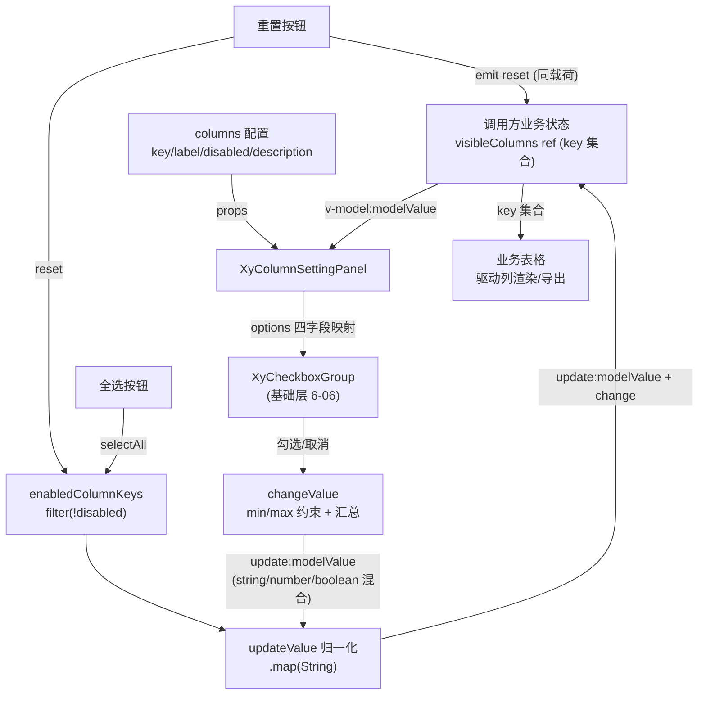
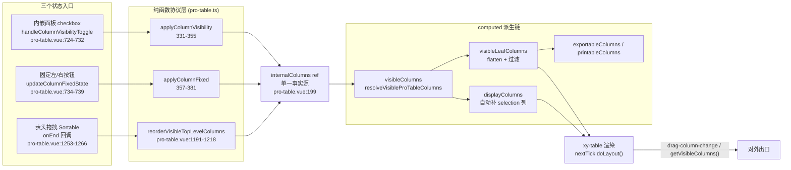

# 9-26 · ColumnSettingPanel：列设置

本篇的核心问题是**列显隐/固定/排序的状态同步**。按惯例先报实态核对结果：大纲考据里把列设置描述为"三组状态（显隐/固定/排序）"的标准件，实测当前工作区实态比这更有意思——仓库里存在**两条平行的列设置实现路径**，各自只覆盖了一部分状态。第一条是独立增强组件 `XyColumnSettingPanel`（`packages/pro-components/column-setting-panel/`），全文 76 行 Vue + 13 行类型，**只有显隐一组状态**，通过 `v-model: string[]` 受控；第二条是 ProTable 工具条里内嵌的列设置面板（`packages/pro-components/pro-table/src/pro-table.vue:1573-1609`），有显隐和固定两组状态，但**不消费独立组件**，而是直接读写自己的 `internalColumns`；至于排序，实码定论是：**面板内没有任何排序控件**，排序由 `draggableColumn` 开启的 Sortable.js 表头拖拽承担（`pro-table.vue:1249-1268`），文档自己也承认这条边界——`apps/docs/pro-components/column-setting-panel.md:24` 写着"当前不处理列顺序拖拽、持久化和复杂权限裁剪"。

所以本篇把"状态同步"这个问题拆成三层来答：**显隐状态如何在两种模型（键集合与列数组）之间搬运**，**固定状态如何与显隐正交共存**，**排序状态为什么被交给了拖拽而不是按钮**。列设置是即时操作——动一下立即生效，不落盘、可重置；这正是它与下一篇 9-27《SavedViewTabs：保存视图》的分界线：saved-view 把包括列状态在内的一整套查询现场持久化下来，本篇的一切状态都是易失的。8-09 讲过基础层 table 的列模型与固定列（`TableColumnFixed` 类型定义在 `packages/components/table/src/table.ts:11`），本篇操作的不是那张 DOM 表，而是它之上的**配置层**——ProTable 的 `ProTableColumn` 数组。

## 一、独立面板：13 行类型定义的受控协议

先看独立组件的全部类型层。`packages/pro-components/column-setting-panel/src/column-setting-panel.ts` 全文 13 行，一节更比两节短：

```ts
export interface ColumnSettingPanelColumn {
  key: string;
  label: string;
  description?: string;
  disabled?: boolean;
}

export interface ColumnSettingPanelProps {
  title?: string;
  description?: string;
  columns: ColumnSettingPanelColumn[];
  modelValue: string[];
}
```

（`packages/pro-components/column-setting-panel/src/column-setting-panel.ts:1-13`）

这 13 行就是独立面板的**全部协议**，值得逐字段读。`ColumnSettingPanelColumn` 的 `key` 是列的身份证——注意它只有 `key`，没有 prop/columnKey/label 的多级回落；对比 ProTable 侧的 `getProTableColumnKey`（`pro-table.ts:290-297`，四级回落 `key ?? columnKey ?? prop ?? label`），独立面板把"列怎么标识"这个难题**推给了调用方**：你来的时候 key 就是唯一的，面板不做任何推断。`disabled` 的语义要在读完 script 才能定位——它不是"禁止渲染"，而是"禁止被取消勾选"（操作列、勾选列这类必须存在的列用）。`modelValue: string[]` 是当前**可见列的 key 集合**，不是勾选面板的 UI 状态，而是表格的业务状态本身——这是理解整个组件的钥匙：面板没有自己的内部状态，它是纯粹的受控视图。

76 行的 `column-setting-panel.vue`，script 段全文 43 行：

```vue
<script setup lang="ts">
import { computed } from "vue";
import { XyButton, XyCard, XyCheckboxGroup } from "xiaoye-components";
import type { ColumnSettingPanelProps } from "./column-setting-panel";

defineOptions({
  name: "XyColumnSettingPanel"
});

const props = withDefaults(defineProps<ColumnSettingPanelProps>(), {
  title: "列设置",
  description: "",
  columns: () => [],
  modelValue: () => []
});

const emit = defineEmits<{
  "update:modelValue": [value: string[]];
  change: [value: string[]];
  reset: [value: string[]];
}>();

const enabledColumnKeys = computed(() =>
  props.columns.filter((column) => !column.disabled).map((column) => column.key)
);

function updateValue(value: Array<string | number | boolean>) {
  const nextValue = value.map((item) => String(item));

  emit("update:modelValue", nextValue);
  emit("change", nextValue);
}

function selectAll() {
  updateValue(enabledColumnKeys.value);
}

function reset() {
  const nextValue = enabledColumnKeys.value;
  emit("update:modelValue", nextValue);
  emit("reset", nextValue);
}
</script>
```

（`packages/pro-components/column-setting-panel/src/column-setting-panel.vue:1-43`）

三个事件、三个函数，全部逻辑一目了然，但有四处细节藏着设计决策。**第一处**，`updateValue` 的参数类型是 `Array<string | number | boolean>`，出参却先 `.map(String)` 归一成 `string[]`——这是因为下游 `XyCheckboxGroup` 的值类型 `CheckboxValue` 允许 `string | number | boolean`（6-06 的类型层），而列设置协议把 key 收窄为 `string`。边界上做一次显式归一，比让类型敞口渗透到整个调用链便宜得多。**第二处**，`enabledColumnKeys` 是"全选"与"重置"共享的地基：全选 = 把所有非 disabled 的 key 发出去；重置 = 把所有非 disabled 的 key 发出去——**这两个操作在当前实态下是同一个行为**，区别只在事件名（`change` vs `reset`）。9-04 讲 search-form 时说过"重置是语义事件，不是默认值事件"，这里重演了一次：面板不知道业务列的"出厂默认可见集"是什么（那在调用方的 columns 定义里），所以重置的语义只能收敛为"恢复所有允许操作的列可见"。想要"回到上次的配置"，那是 saved-view 的事。**第三处**，`selectAll` 调用的是 `updateValue` 而不是手动双 emit——全选和勾选共享同一条变更通道，保证事件顺序（`update:modelValue` 先于 `change`）永远一致。**第四处**，`change` 与 `update:modelValue` 是两条独立事件但同载荷同顺序，这和基础层 checkbox-group 的做法完全同构（`checkbox-group.vue:76-78` 也是先 `update:modelValue`、`nextTick` 后 `change`）——区别是面板这里没有等 nextTick，因为面板自己就是 group 的直接父级，不需要等 DOM 稳定。

template 段全文：

```vue
<template>
  <xy-card class="xy-column-setting-panel">
    <template #header>
      <div class="xy-column-setting-panel__header">
        <div>
          <div class="xy-column-setting-panel__title">{{ props.title }}</div>
          <p v-if="props.description" class="xy-column-setting-panel__description">
            {{ props.description }}
          </p>
        </div>
        <div class="xy-column-setting-panel__actions">
          <xy-button text @click="selectAll">全选</xy-button>
          <xy-button text @click="reset">重置</xy-button>
        </div>
      </div>
    </template>

    <xy-checkbox-group
      :model-value="props.modelValue"
      direction="vertical"
      :options="
        props.columns.map((column) => ({
          label: column.label,
          value: column.key,
          disabled: column.disabled,
          description: column.description
        }))
      "
      @update:model-value="updateValue"
    />
  </xy-card>
</template>
```

（`packages/pro-components/column-setting-panel/src/column-setting-panel.vue:45-76`）

整个模板是三件基础层组件的组装：`XyCard`（5-10 篇的容器语义，header 插槽放标题与动作区）、`XyButton` 的 text 形态（全选/重置）、`XyCheckboxGroup`。**没有任何浮层**——面板本身是"面板"，不是"下拉触发器"。挂到哪里（popover、drawer、工具条右侧）由调用方决定。这个定位在组件文档里写得直白（`apps/docs/pro-components/column-setting-panel.md:20`）："适合为 ProTable 或业务表格提供轻量列配置入口"。

## 二、消费 6-06：checkbox 组的 options 配置化

独立面板对基础层的消费点在 62-74 行，这是一个值得单独展开的组合。6-06 讲过 checkbox 的 `min/max` 约束与 options 配置化——当时指出 `CheckboxOption` 支持 `description` 字段。这里正好验证了这条设计为何存在：列设置的每一项天然需要"列名 + 补充说明"两行文案（比如"更新时间 / 服务端排序"）。看基础层的渲染段：

```vue
    <slot>
      <component
        :is="optionComponent"
        v-for="option in props.options"
        :key="String(option.value)"
        :value="option.value"
        :label="option.label"
        :disabled="option.disabled"
      >
        <span
          :class="[
            `${ns.base.value}-group__option`,
            option.description ? 'has-description' : ''
          ]"
        >
          <span :class="`${ns.base.value}-group__option-label`">{{ option.label }}</span>
          <span
            v-if="option.description"
            :class="`${ns.base.value}-group__option-description`"
          >
            {{ option.description }}
          </span>
        </span>
      </component>
    </slot>
```

（`packages/components/checkbox/src/checkbox-group.vue:105-129`）

独立面板把 `columns` 映射成 options 的四个字段一一对应：`label → label`、`key → value`、`disabled → disabled`、`description → description`。**零胶水**。这是"消费什么组件"的实码定论：不是 transfer（7-15 的双栏穿梭太重，列设置是单列清单加全选）、不是 tree（8-08 的树形展开用于分组列层级，但独立面板的 `ColumnSettingPanelColumn` 没有_children 字段，根本表达不了层级）、就是**扁平 checkbox 组**。同时注意独立面板**没有**消费 min/max——列设置业务里"至少保留一列可见"这种约束没有实现，全选也不会把 disabled 列排除在 modelValue 之外（disabled 列一开始就不在勾选集合里，因为 `updateValue` 的值全部来自 group 的事件，而 group 中 disabled 项不可交互）。disabled 列的可见性实际上由调用方维护：调用方如果希望操作列始终可见，必须在初始 modelValue 里带上它的 key，此后 group 不会再把它去掉，但也不会帮你加回来——这是把"必选列"的账记在了调用方头上。示例代码就是这么写的：

```vue
<script setup lang="ts">
import { ref } from "vue";

const visibleColumns = ref(["name", "owner", "status"]);
const columns = [
  { key: "name", label: "任务名称" },
  { key: "owner", label: "负责人" },
  { key: "status", label: "状态" },
  { key: "updatedAt", label: "更新时间" },
  { key: "actions", label: "操作列", disabled: true, description: "固定保留" }
];
</script>

<template>
  <div class="xy-pro-demo-stack">
    <xy-column-setting-panel v-model="visibleColumns" :columns="columns" />

    <xy-card header="当前启用列">
      {{ visibleColumns.join("、") }}
    </xy-card>
  </div>
</template>
```

（`apps/docs/examples/pro/column-setting-panel/basic.vue:1-22`）

注意第 4 行：初始 `visibleColumns` 是 `["name", "owner", "status"]`，**不含** `actions`——操作列勾选框初始就是空的，而它 disabled，用户无法勾上它。如果调用方真拿这份 modelValue 去驱动表格，操作列会被隐藏且无法恢复。文档示例为了演示面板本身，没有完整演示这个坑；真实接线要靠调用方把 disabled 列放进初始集合（或者干脆不让 disabled 列进表格的 hidden 判定）。这是受控组件的老问题：协议把正确性责任摊给了数据，而不是在组件里兜底。面板的单测只有一条用例，32 行，全文引用：

```ts
import { mount } from "@vue/test-utils";
import { defineComponent, h } from "vue";
import { describe, expect, it, vi } from "vitest";
import { XyColumnSettingPanel } from "@xiaoye/pro-components";

describe("XyColumnSettingPanel", () => {
  it("支持渲染标题并触发全选", async () => {
    const wrapper = mount(XyColumnSettingPanel, {
      props: {
        columns: [
          {
            key: "name",
            label: "名称"
          },
          {
            key: "status",
            label: "状态",
            disabled: true
          }
        ],
        modelValue: []
      }
    });

    expect(wrapper.text()).toContain("列设置");

    await wrapper.findAll(".xy-column-setting-panel__actions .xy-button")[0]?.trigger("click");

    expect(wrapper.emitted("update:modelValue")?.[0]?.[0]).toEqual(["name"]);
    expect(wrapper.emitted("change")?.[0]?.[0]).toEqual(["name"]);
  });
});
```

（`packages/pro-components/column-setting-panel/__tests__/column-setting-panel.spec.ts:1-32`）

第 29-30 行的断言把本节最重要的语义钉死了：全选之后发出的是 `["name"]`——disabled 的 `status` 不在集合里。`defineComponent/h/vi` 三个 import（第 2-3 行）当前没被用到，是测试骨架的残留。本篇动笔前实跑通过（1 passed）。

## 三、显隐状态同步流：一张图

把独立面板的状态流画出来，这是本篇必有的第一张 mermaid 图。注意图中两条并行的数据通路：业务态（调用方的 ref）与展示态（checkbox 组的勾选），面板自身不持有任何状态：



这条流的要点是**状态只有一份**——调用方的 key 集合。面板在流里只扮演两个角色：把 key 集合翻译成 checkbox 勾选态（正向），把交互结果归一化后翻译回 key 集合（反向）。它不缓存、不裁剪、不校验，所以调用方随时可以在外面改 `visibleColumns`（比如另一个入口批量隐藏了几列），面板的下一次渲染自动跟上。受控组件的正确性来自这份"无状态"的纪律。

## 四、ProTable 内嵌面板：单一事实源 internalColumns

独立面板讲完了，转向第二条实现路径。ProTable 的工具条有一个 `workbench.columnSetting` 开关（类型定义在 `pro-table.ts:158-168` 的 `ProTableWorkbenchConfig`，解析在 `pro-table.vue:232`），打开后工具条出现"列设置"文本按钮：

```vue
        <xy-button v-if="resolvedWorkbench.refresh" text @click="handleRefresh">刷新</xy-button>
        <xy-button v-if="resolvedWorkbench.filter" text @click="openFilterDrawer">筛选</xy-button>
        <xy-button
          v-if="resolvedWorkbench.treeToggle && tableRef?.bodyRows?.length"
          text
          @click="tableRef?.setAllTreeRowsExpanded(true)"
        >
          展开树
        </xy-button>
        <xy-button
          v-if="resolvedWorkbench.treeToggle && tableRef?.bodyRows?.length"
          text
          @click="tableRef?.setAllTreeRowsExpanded(false)"
        >
          收起树
        </xy-button>
        <xy-button v-if="resolvedWorkbench.columnSetting" text @click="settingsOpen = !settingsOpen">
          列设置
        </xy-button>
```

（`packages/pro-components/pro-table/src/pro-table.vue:1544-1562`）

`settingsOpen = !settingsOpen`——注意这不是 popover 也不是 drawer，而是 1573 行的一个 `v-if` 面板，直接插在工具条与表格之间，把表格往下推。这是 ProTable 一以贯之的"平铺工作台"取向（对比 9-12 FilterPanel 走的是 drawer）。面板全文 37 行：

```vue
    <div v-if="settingsOpen && resolvedWorkbench.columnSetting" class="xy-pro-table__settings-panel">
      <div class="xy-pro-table__settings-header">
        <strong>列设置</strong>
        <xy-button text @click="updateVisibleColumns(columnSettingEntries.map((item) => item.key))">
          全选
        </xy-button>
      </div>
      <div class="xy-pro-table__settings-list">
        <div v-for="entry in columnSettingEntries" :key="entry.key" class="xy-pro-table__settings-item">
          <label class="xy-pro-table__settings-checkbox">
            <input
              type="checkbox"
              :checked="visibleColumnKeys.includes(entry.key)"
              @change="handleColumnVisibilityToggle(entry.key, $event)"
            />
            <span>{{ entry.label }}</span>
          </label>
          <div class="xy-pro-table__settings-fixed">
            <xy-button
              text
              :type="entry.fixed === 'left' ? 'primary' : 'default'"
              @click="updateColumnFixedState(entry.key, entry.fixed === 'left' ? undefined : 'left')"
            >
              左
            </xy-button>
            <xy-button
              text
              :type="entry.fixed === 'right' ? 'primary' : 'default'"
              @click="updateColumnFixedState(entry.key, entry.fixed === 'right' ? undefined : 'right')"
            >
              右
            </xy-button>
          </div>
        </div>
      </div>
      <p v-if="props.draggableColumn" class="xy-pro-table__settings-tip">已开启列拖拽，可直接拖表头调整顺序。</p>
    </div>
```

（`packages/pro-components/pro-table/src/pro-table.vue:1573-1609`）

这段模板里有三个和独立面板截然不同的决定，逐个看。**第一个决定：不消费 `XyCheckboxGroup`，用原生 `<input type="checkbox">`**。为什么同一个仓库里两套列设置用了两种 checkbox？因为内嵌面板的数据形状不同：`columnSettingEntries`（`pro-table.vue:299-305`）是从叶子列数组 map 出来的 `{ key, label, fixed }`，勾选态不是独立数组而是 `visibleColumnKeys.includes(entry.key)` 的**派生查询**（`pro-table.vue:294-298`）。`XyCheckboxGroup` 的协议要求传入完整的 `modelValue: CheckboxValue[]`，而内嵌面板每项的 change 都直接从 DOM event 读 checked（`handleColumnVisibilityToggle` 的 `event.target.checked`），免去了"全量 key 数组 → 增删一项 → 全量发回"的中间态。原生 input 在这里是**免受控化**的手段——`:checked` 单向绑定 + `@change` 读 DOM，走的是"DOM 是暂存区"的老路。代价是样式与键盘可及性要自己管（CSS 段里有 `ellipsis` 处理，见后文），收益是少一层受控协议的往返。**第二个决定：固定状态用"左/右双按钮三态"而不是"单按钮循环三态"**——每列两枚 text 按钮，左固定时"左"高亮 primary，右固定时"右"高亮，再点同一枚清除（`entry.fixed === 'left' ? undefined : 'left'`，多态参数直接塞进了模板表达式）。**第三个决定：没有排序控件**，`draggableColumn` 开启时只显示一行提示（1608 行），排序的真身在表头拖拽——这是第七节的正题。

先看三个 handler 与两个 computed，这是内嵌面板的全部状态同步逻辑：

```ts
const visibleColumnKeys = computed(() =>
  leafColumns.value
    .filter((column) => column.hidden !== true)
    .map((column) => getProTableColumnKey(column))
);
const columnSettingEntries = computed(() =>
  leafColumns.value.map((column) => ({
    key: getProTableColumnKey(column),
    label: column.label || column.prop || "未命名列",
    fixed: column.fixed
  }))
);
```

（`packages/pro-components/pro-table/src/pro-table.vue:294-305`）

```ts
function updateVisibleColumns(nextVisibleKeys: Array<string | number | boolean>) {
  internalColumns.value = applyColumnVisibility(
    internalColumns.value,
    new Set(nextVisibleKeys.map((item) => String(item)))
  );
  nextTick(() => {
    tableRef.value?.doLayout();
  });
}

function handleColumnVisibilityToggle(key: string, event: Event) {
  const target = event.target;
  const checked = target instanceof HTMLInputElement ? target.checked : false;
  const nextKeys = checked
    ? [...visibleColumnKeys.value, key]
    : visibleColumnKeys.value.filter((item) => item !== key);

  updateVisibleColumns(nextKeys);
}

function updateColumnFixedState(key: string, fixed?: "left" | "right") {
  internalColumns.value = applyColumnFixed(internalColumns.value, key, fixed);
  nextTick(() => {
    tableRef.value?.doLayout();
  });
}
```

（`packages/pro-components/pro-table/src/pro-table.vue:714-739`）

`internalColumns` 是整个 ProTable 列状态的**单一事实源**（`pro-table.vue:199`，`ref(cloneProTableColumns(props.columns))`）。所有列操作——显隐、固定、拖拽重排——都是"算出新数组、整体替换"，从来不做原地 mutation。替换之后统一 `nextTick(() => tableRef.value?.doLayout())`，因为基础层 table 的列宽计算是渲染后行为，隐藏/固定都会改变列宽总和。对比独立面板的"v-model 键集合"，内嵌面板是"内部受控"：props.columns 只在 watch（`pro-table.vue:1343-1351`，deep）里单向灌入，组件内部怎么改都不会回流给调用方——**对外的唯一出口是实例方法 `getVisibleColumns()`**（`pro-table.vue:809-811`，`defineExpose` 登记 1496 行）和拖拽事件 `drag-column-change`（1261 行 emit）。也就是说：ProTable 的列状态**没有 v-model**，调用方不能从外面声明"这几列可见"，只能拿读快照。这是当前实态的一个真实边界，也是独立面板存在的意义之一——要受控键集合协议，就消费独立组件自己接。

## 五、三态汇流的全景图

现在把三条状态线画进第二张 mermaid 图——这是本篇"状态同步"命题的主图：三个入口，一个事实源，一条派生链：



读图的关键在**纯函数层与事实源的分离**：三个入口的 handler 都不直接改状态，而是调用纯函数算出下一份列数组再整体替换。纯函数只做一件事——给定旧列数组与操作参数，返回新列数组。这样同步逻辑的三条线（显隐/固定/排序）在数据层完全正交，各自的可测试性也独立成立。

## 六、纯函数协议层：分组列的显隐语义

`packages/pro-components/pro-table/src/pro-table.ts` 后半段的五个纯函数是列状态同步的协议核心。先看标识与基础四件套：

```ts
export function getProTableColumnKey<T = ProTableRow>(
  column: Pick<
    ProTableColumn<T>,
    "key" | "prop" | "columnKey" | "label"
  >
) {
  return column.key ?? column.columnKey ?? column.prop ?? column.label ?? "";
}

export function isColumnVisible<T = ProTableRow>(column: ProTableColumn<T>) {
  return column.hidden !== true;
}

export function flattenProTableColumns<T = ProTableRow>(
  columns: ProTableColumn<T>[]
): ProTableColumn<T>[] {
  return columns.flatMap((column) =>
    column.children?.length ? flattenProTableColumns(column.children) : [column]
  );
}

export function cloneProTableColumns<T = ProTableRow>(
  columns: ProTableColumn<T>[]
): ProTableColumn<T>[] {
  return columns.map((column) => ({
    ...column,
    children: column.children ? cloneProTableColumns(column.children) : undefined
  }));
}

export function resolveVisibleProTableColumns<T = ProTableRow>(
  columns: ProTableColumn<T>[]
): ProTableColumn<T>[] {
  return columns
    .filter((column) => isColumnVisible(column))
    .map((column) => ({
      ...column,
      children: column.children ? resolveVisibleProTableColumns(column.children) : undefined
    }));
}
```

（`packages/pro-components/pro-table/src/pro-table.ts:290-329`）

`getProTableColumnKey` 的四级回落对应四种列的写法：显式 key、基础层 columnKey、字段名 prop、以及什么都没配只剩 label 的"展示列"。`isColumnVisible` 用 `!== true` 而不是 `=== false`——hidden 未声明即可见，默认开放的语义。真正的重头戏是 `applyColumnVisibility` 与 `applyColumnFixed`，全文引用：

```ts
export function applyColumnVisibility<T = ProTableRow>(
  columns: ProTableColumn<T>[],
  visibleKeys: Set<string>
): ProTableColumn<T>[] {
  return columns.map((column) => {
    const columnKey = getProTableColumnKey(column);
    const children: ProTableColumn<T>[] | undefined = column.children
      ? applyColumnVisibility(column.children, visibleKeys)
      : undefined;

    if (children?.length) {
      const visibleChildren = children.some((item: ProTableColumn<T>) => item.hidden !== true);
      return {
        ...column,
        hidden: !visibleChildren,
        children
      };
    }

    return {
      ...column,
      hidden: !visibleKeys.has(columnKey)
    };
  });
}

export function applyColumnFixed<T = ProTableRow>(
  columns: ProTableColumn<T>[],
  key: string,
  fixed?: TableColumnFixed
): ProTableColumn<T>[] {
  return columns.map((column) => {
    const columnKey = getProTableColumnKey(column);

    if (column.children?.length) {
      return {
        ...column,
        children: applyColumnFixed(column.children, key, fixed)
      };
    }

    if (columnKey !== key) {
      return column;
    }

    return {
      ...column,
      fixed
    };
  });
}
```

（`packages/pro-components/pro-table/src/pro-table.ts:331-381`）

这两个函数的设计要点有四条。**其一，键集合到列数组的适配**。`applyColumnVisibility` 的入参是 `Set<string>`——正是独立面板 `v-model` 那种 key 集合的形态。也就是说，虽然 ProTable 自己不消费独立面板，但它的协议层保留了"键集合"这个入口形态：假如哪天要把独立面板接进 ProTable，适配工作就是调一次 `applyColumnVisibility`。两种模型（键集合/列数组）在这个函数处完成了翻译。**其二，分组列的显隐语义**：组自身的 hidden 不由键集合决定（组 key 通常不在 `visibleColumnKeys` 里，因为 296-297 行的 `leafColumns` 只 flatten 叶子），而是**由子列派生**——341-348 行，任一子可见则组可见（`hidden: !visibleChildren`），全部子隐藏则组隐藏。"组没有独立显隐权"是这个模型的重要约束：面板上你永远不会看到一个"组"的勾选框，只看到叶子的勾选框，组头随叶子塌缩。**其三，不可变风格下的递归重建**：两个函数都是 `columns.map` 递归展开、逐层返回新对象，命中项返回 `{ ...column, hidden/fixed }`、未命中项原样返回引用（`applyColumnFixed` 372-374 行 `if (columnKey !== key) return column;`）。Vue 的响应式靠引用替换触发，这份"最小重建"让未受影响的列保持引用稳定，watch 的依赖追踪不会被无关变化搅动。**其四，fixed 与 hidden 是正交字段**：`applyColumnFixed` 完全不读 hidden，`applyColumnVisibility` 完全不读 fixed——两个状态在数据层互不感知，交互层的耦合（比如隐藏一列后固定列位置变化）全部交给渲染层的 `doLayout()` 收尾。参数 `fixed?: TableColumnFixed` 用 `undefined` 表达"取消固定"，与 `pro-table.vue:1594/1601` 的 toggle 写法（已是 left 则传 undefined）严丝合缝。

## 七、排序的实码定论：拖拽，而非按钮

第三个状态——排序——的实码定论需要专门一节。面板里没有任何上下移按钮，唯一的提示是 1608 行那句"已开启列拖拽，可直接拖表头调整顺序"。排序的真身在 `canColumnDrag` 与 `syncSortables`：

```ts
const canColumnDrag = computed(
  () =>
    props.draggableColumn &&
    visibleColumns.value.length > 1 &&
    visibleColumns.value.every((column) => (column.children?.length ?? 0) === 0)
);
```

（`packages/pro-components/pro-table/src/pro-table.vue:365-370`）

```ts
function reorderVisibleTopLevelColumns(fromIndex: number, toIndex: number) {
  const source = internalColumns.value.slice();
  const visibleIndexes = source
    .map((column, index) => ({ column, index }))
    .filter(({ column }) => !column.hidden);

  if (
    fromIndex < 0 ||
    toIndex < 0 ||
    fromIndex >= visibleIndexes.length ||
    toIndex >= visibleIndexes.length
  ) {
    return source;
  }

  const reorderedVisibleColumns = move(
    visibleIndexes.map(({ column }) => column),
    fromIndex,
    toIndex
  );
  const nextColumns = source.slice();

  visibleIndexes.forEach(({ index }, orderIndex) => {
    nextColumns[index] = reorderedVisibleColumns[orderIndex];
  });

  return nextColumns;
}
```

（`packages/pro-components/pro-table/src/pro-table.vue:1191-1218`）

Sortable 实例的创建在 `syncSortables`（1227-1269 行）：`props.draggableRow` 时挂在 tbody、`canColumnDrag` 时挂表头最后一行 thead tr，`onEnd` 里把 Sortable 给的 `oldIndex/newIndex` 喂给 `reorderVisibleTopLevelColumns`，然后 `internalColumns.value = ...` 整体替换、`emit("drag-column-change", ...)`、`nextTick doLayout()`（1249-1268 行）。`watch([draggableRow, draggableColumn, data.length, visibleColumns.length], syncSortables, { flush: "post" })`（1392-1400 行）负责在数据或配置变化后重建实例。

这个函数有两条值得细读的守护。**第一，只在可见列之间重排**：`visibleIndexes` 先过滤掉 `hidden` 列，重排结果再按原槽位写回 `nextColumns`——隐藏列**保持自己的槽位不动**，只在可见列的相对顺序变化中"让路"。如果不过滤，拖拽的 DOM 索引（Sortable 给的是视觉位置索引）与列数组索引就会错位：第 2 个可见列在数组里可能是第 4 个（前面藏了两列），直接拿 2 当数组下标会拖错列。这是"DOM 视觉索引 ↔ 数据索引"的经典同步问题，这里用"双向映射 + 槽位回写"解决。**第二，分组列禁拖**：`canColumnDrag` 要求所有顶层列都没有 children——表头有分组行时，thead 的最后一行才是叶子列行，而 Sortable 只能对一维行元素排序，分组列的拖拽语义（拖组还是拖叶子）无法在"最后一行"这个锚点上表达，于是干脆整体禁用。加上 `visibleColumns.value.length > 1`（单列没意义）与 `props.draggableColumn` 总开关，三条守卫把拖拽限制在它语义清晰的范围里。

为什么选拖拽不选按钮？三个理由可以从事码反推。**一，排序是低频操作**：列顺序调整通常发生在初始配置期，按钮常驻面板会占视觉权重；拖拽把成本放在"会的人顺手、不会的人不碍眼"。**二，表头拖拽的反馈是即时的**：DOM 层 sortable 的位移动画直接给出"列在这里落位"的预期，按钮方案要么靠点击后重排的跳变、要么自己实现占位动画。**三，仓库已有 Sortable 基础**：行拖拽（`draggableRow`）与列拖拽共享同一套实例管理与 move 工具（`move` 函数在 `pro-table.vue:139-149`），复用边际成本极低。代价也同样清楚：**键盘不可达**——Sortable 的 DOM 拖拽没有原生键盘方案，无障碍场景下排序能力实际缺失；分组列不可拖；固定列被拖到中间后 fixed 字段仍在（DOM 顺序与固定语义解耦，这留给下一节的权衡讨论）。按钮方案的可达性优势没有被采纳，是这个组件真实的取舍而非疏漏——文档"当前边界"一条（`apps/docs/pro-components/column-setting-panel.md:24`）把"列顺序拖拽"划出了独立面板的范围，等于官方承认了收缩。另外 150ms 的位移动画是两个实例共用的参数——行拖拽实例在 `pro-table.vue:1236` 行、列拖拽实例在 1254 行各写了一份 `animation: 150`，同一手感在两条拖拽线上保持一致。

## 八、设计权衡三则

把全篇的同步机制收成三个可迁移的权衡判断。

**权衡一：键集合 vs 列数组——状态模型按"谁消费"选。** 同一个"列状态"在仓库里有两个模型：独立面板的 `modelValue: string[]`（键集合）与 ProTable 的 `internalColumns`（列数组）。键集合的三个优势：可序列化（存 localStorage、发后端都是一行 JSON）、可 v-model（受控协议天然对称）、UI 绑定零成本（checkbox 组的值域就是它）。列数组不可回避的原因：fixed/hidden/order 之外还挂着 children（分组）、type（selection）、width、valueType 等十余个字段，全展平成键值对再重建反而更复杂。判据不是抽象优劣，而是**消费方**：键集合的消费方是"只需要知道哪些列在"的东西（面板、持久化、后端），列数组的消费方是"要渲染表"的东西（xy-table）。协议层用 `applyColumnVisibility` 把两个模型焊在一起——新数组从键集合算出，两边各自演化。这也解释了 ProTable 为什么不提供 `v-model:visibleColumnKeys`：列数组是事实源，键集合是派生态，给派生态开受控口会造成双事实源冲突；独立面板因为没有列渲染职责，才敢把键集合升为唯一状态。

**权衡二：左/右双按钮三态 vs 单按钮循环三态。** 固定状态有三个值（undefined/left/right），交互上有两条路线。ProTable 选了双按钮：每列两枚 text 按钮，各自 toggle（1590-1605 行），当前态高亮 primary。备选的单按钮循环（点击依次 undefined→left→right→undefined）省一个按钮位，但用户必须知道当前值才能预测下一次点击的结果——按钮上的文案要么动态变（"固定左"→"固定右"→"取消固定"），要么语义永远含混。双按钮的代价是空间翻倍，收益是**每个按钮的语义恒定**（点了就是固定到那，再点就是取消），状态一目了然（高亮即当前）。在列设置这种"一眼扫全列"的场景里，恒定语义比省空间值钱。顺带看清固定与显隐的交互实态：两个字段正交存储（第六节），UI 上并排但互不读写；真正发生耦合的位置在渲染层——隐藏掉全部左固定列后，左固定区可能为空，列宽重算交给 `doLayout()`，而"拖拽把固定列拖离边缘"产生的 DOM 顺序与 fixed 值不一致，ProTable 选择不校验（fixed 是给基础层 table 的渲染信号，不是排序约束），把"固定列应该放边上"的礼节留给调用方。

**权衡三：免受控的原生 checkbox vs 全受控的 checkbox 组。** 同一仓库两套列设置用两种 checkbox，不是风格漂移而是场景分化。独立面板面向"外部状态持有者"：调用方有一份自己的 key 集合，面板的职责是忠实的双向翻译器，全受控协议（modelValue 进、update 出）是它存在的意义。内嵌面板面向"单一事实源持有者"：ProTable 自己就是状态的主人，勾选态是从 `internalColumns` 派生的查询（`includes`），如果硬套受控组，每次交互都要"派生全量数组 → 发出去 → 收回来 → 再派生"绕一圈，而原生 input 的 `:checked` + `@change` 读 DOM 让派生只发生一次。受控组件的纪律（无状态、单向流）在"状态已经在自己手里"的场景里是纯粹的仪式成本——砍掉仪式不是背叛，是让协议服务场景。当然代价要如实记：原生 checkbox 的样式一致性、键盘焦点环、表单语义（label 关联）都要手工维护（`pro-table.css:113-124` 只处理了文本溢出），这是内嵌路径真实付出的税。

**权衡三的另一半：内嵌面板连 disabled 都没有。** `columnSettingEntries`（`pro-table.vue:299-305`）只映射 `{ key, label, fixed }` 三个字段——独立面板协议里的 `disabled`（必选列保护）在 ProTable 内嵌面板上不存在，操作列、勾选列在内嵌面板里同样可以被取消勾选。原生 checkbox 路线省掉的除了受控往返，还有 option 级的语义字段。这份税单在样式上有实据，settings 区块的完整 CSS 全文如下，`ellipsis` 的溢出处理是手写的，焦点环与勾选视觉则完全交给浏览器默认：

```css
.xy-pro-table__settings-list {
  display: grid;
  grid-template-columns: repeat(auto-fit, minmax(220px, 1fr));
  gap: 12px;
}

.xy-pro-table__settings-item {
  display: flex;
  align-items: center;
  justify-content: space-between;
  gap: 10px;
  padding: 10px 12px;
  border-radius: var(--xy-radius-md);
  background: color-mix(in srgb, var(--xy-fill-light) 88%, var(--xy-mix-light));
}

.xy-pro-table__settings-checkbox {
  display: inline-flex;
  align-items: center;
  gap: 8px;
  min-width: 0;
}

.xy-pro-table__settings-checkbox span {
  overflow: hidden;
  text-overflow: ellipsis;
  white-space: nowrap;
}

.xy-pro-table__settings-fixed {
  display: inline-flex;
  align-items: center;
  gap: 4px;
}
```

（`packages/theme/src/pro/pro-table.css:97-130`）

`settings-list` 的 `repeat(auto-fit, minmax(220px, 1fr))` 网格让列条目按容器宽度自动折行——这是"面板平铺在工具条下方"的布局代价：宽度充裕时多列并排，窄屏时退化为单列，面板自身不做任何响应式分支。

顺带一个 EP 对照收尾。Element Plus 的 `el-table` 没有内置列设置：列显隐要靠调用方 `v-if`/`v-show` 系统地控制 `el-table-column` 的存在性，社区通行方案是 popover + checkbox-group 手工组装一份键集合再 diff 回列定义；固定列是 `el-table-column` 的 `fixed` 属性，排序调整靠重排模板里的列声明或第三方插件。xy 这边的做法是把这套组装**下沉为两层资产**：受控形态给独立面板（键集合协议，两行模板接入任何表格），内部形态给 ProTable（hidden/fixed 字段 + 纯函数 + `doLayout` 收尾，列定义不因显隐而销毁重建——`v-if` 方案里列组件的销毁会连带丢掉列宽、筛选等运行时状态，字段方案没有这个问题）。EP 的简洁在"不加概念"，xy 的简洁在"概念只加一次"。

## 九、立即时态：与保存视图的分界

回到时间维度收束本篇。列设置面板的所有状态都是**易失的**：`internalColumns` 随 props.columns 的 watch 灌入被重置（`pro-table.vue:1343-1351`），刷新页面一切归零，"重置"按钮的语义也只回到"全部可操作列可见"而非任何历史配置。它回答的是"**我现在想怎么看这张表**"。9-27 的 saved-view-tabs 回答另一个问题："**我想把这套看法存下来下次直接用**"——在 ProTable 的接线里它已经是现实（`pro-table.vue:1611-1619` 的 `xy-saved-view-tabs` 挂载、`views.savedViews/activeViewKey` 配置、`view-select/view-create/view-remove` 事件），但那组 saved view 当前承载的是查询现场（searchModel、filterModel、activeViewKey 进请求参数，见 862-869 行 `buildRequestParams`），把列状态（显隐/固定/顺序的序列化键集合）纳入保存视图，正是下一篇要拆的演进方向。独立面板 13 行类型里的 `modelValue: string[]` 可序列化形态，此刻显出了它的远见：它是列状态未来落盘时最自然的载体。

下一篇 **9-27《SavedViewTabs：保存视图》**：58 行的 `saved-view-tabs.vue` 如何把 9-23 的 tabs 包装成"视图切换"语义、`SavedViewTabItem` 的 count/closable 各自服务什么、以及列设置（本篇）与保存视图（下篇）之间的持久化协议怎么设计——即时态与持久态，列设置故事的下集。

---

**考据与行号核对说明**：本文所有路径与行号均按当前工作区实态核对（行数为 `wc -l` 口径）。`column-setting-panel.vue` 实测 76 行、`column-setting-panel.ts` 13 行、`index.ts` 15 行、`column-setting-panel.spec.ts` 32 行、`packages/theme/src/pro/column-setting-panel.css` 22 行、`apps/docs/examples/pro/column-setting-panel/basic.vue` 22 行、`pro-table.vue` 1779 行、`pro-table.ts` 381 行、`saved-view-tabs.vue` 58 行、`pro-table.css` 236 行，均与引用一致。考据中的"三组状态"在独立组件实态下只有显隐一组，固定与排序分别由 ProTable 内嵌面板（1590-1605 行）与表头拖拽（1249-1268 行）承担，文中已按实码定论展开；"消费 transfer/tree"经实码排除（消费的是基础层 XyCheckboxGroup）。测试实跑通过（1 passed）。
