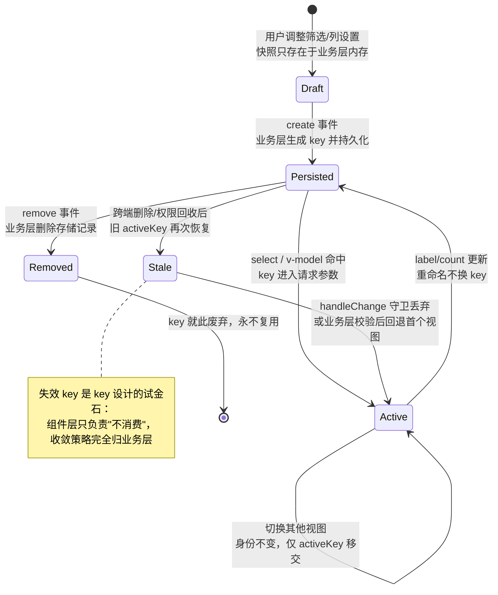
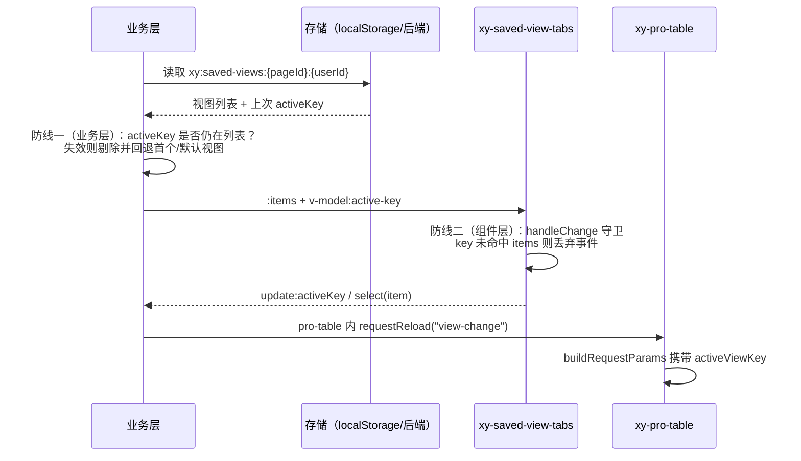
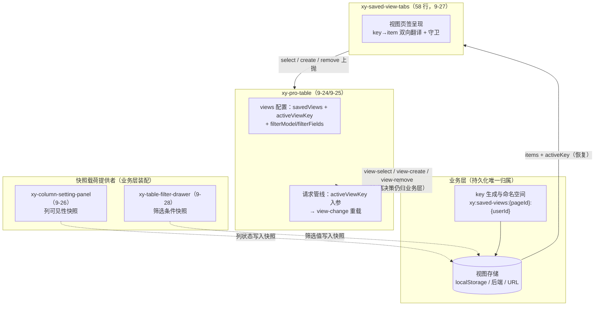

# 9-27 · SavedViewTabs：保存视图

先报实态核对结果。大纲给这篇的核心问题是"视图持久化的 key 设计"，而实测的第一个事实就有点反讽：`packages/pro-components/saved-view-tabs/src/` 下两个文件合计 70 行——`saved-view-tabs.vue` 58 行、`saved-view-tabs.ts` 12 行——**全部检索之后确认，组件里没有一行存储代码**。没有 localStorage，没有 IndexedDB，没有 save 回调，没有防抖写盘。一个名叫"保存视图"的组件，自己一个字节都不保存。这不是偷懒，是本篇第一个需要立住的结论：**持久化被完整地推出了组件边界，组件只保留"视图集合的呈现与切换语义"**。于是"key 设计"这个题眼也换了个问法——组件自己不生成 key、不存储 key，那它对 key 到底约束了什么？答案是三件事：key 是唯一身份（label 与 count 都不是）、key 的翻译与守卫（不存在的 key 拒绝上抛）、key 的下游语义（经 pro-table 进入请求参数）。围绕这三件事，本篇还要讲清 2026-09-16 修复战役在本组件留下的一处改动——`:editable="props.addable"`（`saved-view-tabs.vue:44`），一个硬编码布尔值如何造成权限面错乱，以及修复后"单旋钮 + 逐项豁免"的权限模型。

## 一、70 行的全部家当：协议与实现

先看协议层。`packages/pro-components/saved-view-tabs/src/saved-view-tabs.ts` 全文 12 行：

```ts
export interface SavedViewTabItem {
  key: string;
  label: string;
  count?: number;
  closable?: boolean;
}

export interface SavedViewTabsProps {
  items: SavedViewTabItem[];
  activeKey?: string;
  addable?: boolean;
}
```

（`packages/pro-components/saved-view-tabs/src/saved-view-tabs.ts:1-12`）

12 行、两个接口、七个字段，没有任何运行时代码——与 9-02 立下的"薄组件协议层"惯例一致。`SavedViewTabItem` 的四个字段值得逐个掂量：`key` 是必填的身份；`label` 是显示名；`count` 是可选的派生计数（待办数、命中数这类会随数据变动的数字）；`closable` 是逐项的删除豁免权。注意没有一个字段叫 `payload`、`snapshot` 或 `state`——**视图的真实状态（筛选值、列配置、排序）不在这份协议里**，这是第四节"快照粒度"权衡的伏笔。

再看实现层全文。`saved-view-tabs.vue` 共 58 行，script 段 32 行 + template 段 24 行，一次贴完：

```vue
<script setup lang="ts">
import { XyTabs } from "xiaoye-components";
import type { SavedViewTabItem, SavedViewTabsProps } from "./saved-view-tabs";

defineOptions({
  name: "XySavedViewTabs"
});

const props = withDefaults(defineProps<SavedViewTabsProps>(), {
  items: () => [],
  activeKey: "",
  addable: false
});

const emit = defineEmits<{
  "update:activeKey": [value: string];
  select: [item: SavedViewTabItem];
  remove: [item: SavedViewTabItem];
  create: [];
}>();

function handleChange(nextKey: string) {
  const target = props.items.find((item) => item.key === nextKey);

  if (!target) {
    return;
  }

  emit("update:activeKey", nextKey);
  emit("select", target);
}
</script>

<template>
  <xy-tabs
    :model-value="props.activeKey"
    :items="
      props.items.map((item) => ({
        key: item.key,
        label: item.count !== undefined ? `${item.label} (${item.count})` : item.label,
        closable: item.closable
      }))
    "
    :editable="props.addable"
    @change="handleChange"
    @tab-remove="
      (key) => {
        const target = props.items.find((item) => item.key === key);
        if (target) emit('remove', target);
      }
    "
    @tab-add="emit('create')"
  >
    <template #default>
      <slot />
    </template>
  </xy-tabs>
</template>
```

（`packages/pro-components/saved-view-tabs/src/saved-view-tabs.vue:1-58`）

58 行里能称为"逻辑"的只有两处，而且做的是同一件事——**key 与 item 的双向翻译**。第一处是 `handleChange`（22-31 行）：基础层 tabs 上抛的 `change` 只带裸 key，包装层用 `props.items.find` 把 key 还原成完整视图对象，再同时上抛 `update:activeKey`（受控写回）与 `select`（带完整 item）。第二处是 template 里内联的 `tab-remove` 处理器（46-51 行）：基础层 `tabRemove` 同样只带 key，包装层做一模一样的 `find` 还原后上抛 `remove`。组件的全部存在价值可以概括成一句话：**基础层 tabs 认 key，业务层认视图对象，这层包装负责把两种语言互相翻译，并且在翻译不了的时候闭嘴**。

"翻译不了的时候闭嘴"落在 25-27 行：

```ts
  if (!target) {
    return;
  }
```

（`packages/pro-components/saved-view-tabs/src/saved-view-tabs.vue:25-27`）

这三行是 key 设计在组件侧的第一道守卫：`change` 事件携带的 key 若在 `items` 里找不到宿主，既不写回 v-model，也不上抛 `select`。它防的是"陈旧 key"——后文会看到，被删除视图的 key、跨端同步缺失的 key、外层误传的 key，都会走到这道闸门。`tab-remove` 的内联版（48-50 行）有同构的 `if (target)` 判断，同样的策略写了两遍。

还有一处不起眼但重要的翻译：37-43 行的 `items.map`，把 `SavedViewTabItem` 映射成基础层 `TabItem`。映射做了两件事——丢掉 `count`（折叠进 label）、透传 `key` 与 `closable`。40 行的三元式：

```ts
label: item.count !== undefined ? `${item.label} (${item.count})` : item.label,
```

（`packages/pro-components/saved-view-tabs/src/saved-view-tabs.vue:40`）

`count` 不是身份的一部分，它只是显示层的修饰——待办数从 12 变成 15，视图还是那个视图，key 一个字符都不变。这个映射在每次渲染都重新执行，`count` 的更新不需要业务层做任何额外接线：改 items 里的数字，页签上的括号就变了。**key 稳定、显示易变**，这一组对比就是 key 设计的第一原则在实码里的样子。

## 二、持久化归属：零存储代码的"保存视图"

组件不保存，那"保存"语义由谁兑现？先给检索定论：在 `packages/pro-components/` 全目录检索 `localStorage`、`sessionStorage`、`indexedDB`，零命中——不止 saved-view-tabs，整个增强层（`component-manifest.json` 注册的 31 个组件）没有一个碰过 Web 存储 API。这不是遗漏，文档页把它写成了明文边界（`apps/docs/pro-components/saved-view-tabs.md:22-25`）：

> ## 当前边界
> - 当前不处理视图内容持久化、共享权限和复杂筛选表达式。
> - 页签切换后的真实查询参数仍需页面层维护。

于是组件对持久化的全部参与，收敛成一份**受控契约**：`items`（视图列表）与 `activeKey`（当前视图）双 props 受控，四个事件上抛——`update:activeKey`（切换）、`select`（切换，带完整 item）、`remove`（删除，带完整 item）、`create`（新建，无参数）。官方示例把这份契约的接点展示得很干净，`apps/docs/examples/pro/saved-view-tabs/basic.vue` 全文 40 行：

```vue
<script setup lang="ts">
import { ref } from "vue";

type ViewKey = "pending" | "mine" | "risk";

const activeKey = ref<ViewKey>("pending");
const items = [
  { key: "pending", label: "待处理账单", count: 12 },
  { key: "mine", label: "我负责", count: 7 },
  { key: "risk", label: "异常单", count: 2, closable: true }
];

const currentViewMap = {
  pending: {
    title: "待处理账单队列",
    summary: "优先处理本周新增的供应商差异账单。"
  },
  mine: {
    title: "我负责的账单",
    summary: "适合运营负责人持续跟进当前自己的账单链路。"
  },
  risk: {
    title: "异常单工作区",
    summary: "适合聚焦金额异常、附件缺失和重复导入问题。"
  }
} as const;
</script>

<template>
  <xy-saved-view-tabs v-model:active-key="activeKey" :items="items" addable>
    <xy-card :header="currentViewMap[activeKey].title">
      <p>{{ currentViewMap[activeKey].summary }}</p>
      <xy-space>
        <xy-tag status="warning">待复核 4</xy-tag>
        <xy-tag status="danger">P0 差异 1</xy-tag>
        <xy-tag status="primary">需补附件 3</xy-tag>
      </xy-space>
    </xy-card>
  </xy-saved-view-tabs>
</template>
```

（`apps/docs/examples/pro/saved-view-tabs/basic.vue:1-40`）

三处接线——`v-model:active-key`、`:items`、`addable`——就是受控契约的全部接点。视图的真实内容（`currentViewMap` 的标题与摘要）写死在业务层，key 是 `"pending"`/`"mine"`/`"risk"` 这类语义键，唯一的 `closable: true` 标在"异常单"上——预置视图受保护、可关视图例外，第三节的权限矩阵在这个 40 行的示例里已经预演了一遍。示例本身就是"组件不持久化"的演示：没有任何一行代码往任何介质里写东西。业务层拿到事件后，自己决定写到哪、什么时候写、写之前要不要做权限校验。这就是本篇第二个设计权衡：**持久化归属**。

把"介质、时机、语义"三件事都推给业务层，理由是这三件事在真实业务里几乎没有交集。介质上，内部管理后台多半选 localStorage（按用户隔离、随浏览器走），多端同步的产品必须选后端接口（视图跟着账号走），还有产品把视图编进 URL query 让"视图"变成可分享的链接——三种介质对应三套完全不同的代码，组件层若内置任何一种，另外两种使用者都得先拆掉它。时机上，"点击加号立即创建"与"弹窗填完表单再创建"是两种交互，组件若在 `tab-add` 时自己写存储，后者就没法做了。语义上，视图能不能被同事共享、删除要不要二次确认、系统预置视图能不能删——这些是业务权限模型，不是 UI 组件的知识。组件把 `create` 做成无参数事件、把"新建一个什么样的视图"完全留给业务层，就是把这三件事一次性让渡的实码证据。

这里恰好可以放进 Element Plus 对照。EP 的 `el-tabs` 同样不持久化，它提供的是三个相互独立的旋钮：`editable`（官方语义"是否可添加和移除"，即新增与关闭的合集开关）、`addable`（只管新增）、`closable`（只管关闭）。本库基础层 `xy-tabs` 的实码与 EP 完全同构——`packages/components/tabs/src/tabs.vue:80`：

```ts
const canAdd = computed(() => props.addable || props.editable);
```

（`packages/components/tabs/src/tabs.vue:80`）

以及 `isClosable`（343-357 行），判定链是"disabled 一票否决 → 逐项 `closable === false` 强制否决 → 逐项 `closable === true` 强制放行 → 都没设置则回退到容器级 `props.closable || props.editable`"（356 行）：

```ts
function isClosable(item: TabItem) {
  if (item.disabled) {
    return false;
  }

  if (item.closable === false) {
    return false;
  }

  if (item.closable === true) {
    return true;
  }

  return props.closable || props.editable;
}
```

（`packages/components/tabs/src/tabs.vue:343-357`）EP 的三旋钮模型到了 saved-view-tabs 这一层被收敛成一个旋钮：`SavedViewTabsProps` 只暴露 `addable`，没有 `editable` 也没有容器级 `closable`。为什么收敛？因为"保存视图"场景里，新增与删除天然是同一份权限——**能新建视图的会话，才有资格进入视图管理态**；而"哪些视图不可删"是逐项的个体差异（系统预置视图不可删、自建视图可删），逐项 `closable` 字段恰好承接。三旋钮收敛为"单旋钮 + 逐项豁免"，这是比 EP 更贴合保存视图语义的裁剪——代价是失去了"只可删不可建"的组合表达，业务若真需要那种形态，得回到裸 `xy-tabs`。

基础层与删除、新增相关的完整运行时段贴在这里，`packages/components/tabs/src/tabs.vue:440-463`：

```ts
function handleTabRemove(item: TabItem, event: MouseEvent) {
  event.stopPropagation();

  if (!isClosable(item)) {
    return;
  }

  emit("edit", item.key, "remove");
  emit("tabRemove", item.key);
}

function handleTabAdd() {
  emit("edit", undefined, "add");
  emit("tabAdd");
}

function handleAddKeydown(event: KeyboardEvent) {
  if (event.key !== "Enter" && event.code !== "NumpadEnter" && event.code !== "Space") {
    return;
  }

  event.preventDefault();
  handleTabAdd();
}
```

（`packages/components/tabs/src/tabs.vue:440-463`）

两个细节。其一，`handleTabRemove` 在上抛前自查 `isClosable`（445 行的守卫）——所以包装层的逐项 `closable` 协议不是靠包装层约束的，而是基础层在每个关闭点击上兜底：`closable: false` 的视图连事件都发不出来，包装层与业务层不需要重复设防。其二，加号按钮有独立的键盘通道（456-463 行，Enter/Space 触发），对应的模板段贴在这里：

```vue
      <button
        v-if="canAdd"
        class="xy-tabs__add"
        type="button"
        aria-label="新增页签"
        :tabindex="Number(props.tabindex)"
        @click="handleTabAdd"
        @keydown="handleAddKeydown"
      >
        <slot name="add-icon">
          <XyIcon icon="mdi:plus" :size="14" />
        </slot>
      </button>
```

（`packages/components/tabs/src/tabs.vue:573-585`）

`v-if="canAdd"` 挂在按钮上——**加号按钮是否渲染，完全由 `canAdd`（即 `addable || editable`）决定**。记住这个事实，第三节修复战役的问题就出在这里。

## 三、editable 修复：硬编码布尔值的权限面错乱

2026-09-16 的第一轮修复战役在本组件只动了一行，却是最典型的一类 bug。修复前的实码（git diff 对 HEAD 可考）：

```diff
@@ -41,7 +41,7 @@ function handleChange(nextKey: string) {
         closable: item.closable
       }))
     "
-    editable
+    :editable="props.addable"
     @change="handleChange"
     @tab-remove="
       (key) => {
```

修复前，传给基础层 `<xy-tabs>` 的 `editable` 是**硬编码的布尔真值**——没有绑定任何 prop，永远为 true。对照第二节的两条基础层事实，这个恒真值同时引爆两处：

1. `canAdd = props.addable || props.editable` 恒为真 → **加号按钮恒显**。而 `SavedViewTabsProps.addable` 的默认值是 `false`（`saved-view-tabs.vue:12`），文档 API 表承诺"是否显示新增页签入口，默认 false"（`apps/docs/pro-components/saved-view-tabs.md:35`）。类型说"默认没有新增入口"，UI 却永远画着一个加号——props 声明的权限面与实际渲染的权限面是两张皮。
2. `isClosable` 的容器级回退 `props.closable || props.editable` 恒为真 → **所有未显式声明 `closable: false` 的视图都挂着关闭按钮**。业务层把 `addable` 留在默认 false，本意是"这个页面是只读的"，但每个自建视图旁边都出现了一个叉。

这就是"权限面错乱"的完整含义：不是某个功能坏了，而是**声明出来的权限（props 类型 + 文档表格）与渲染出来的权限（DOM）不一致**。组件把 `addable` 默认为 false 的那一刻，就承诺了"不加 addable 就没有管理入口"，硬编码 `editable` 背弃了这个承诺。修复方案 `:editable="props.addable"` 把承诺接通——`addable` 从此是"视图管理态"的总开关，一个旋钮同时驱动新增入口与（容器级的）关闭入口。

修复后的完整权限矩阵如下，每一格都能从基础层 `isClosable` 的判定链与 `canAdd` 推出来：

| `addable` | 逐项 `closable` | 加号按钮 | 关闭按钮 | 语义 |
| --- | --- | --- | --- | --- |
| `false`（默认） | `false` | 不渲染 | 不渲染 | 只读会话里的受保护视图 |
| `false`（默认） | `true` | 不渲染 | 渲染 | 只读会话仍可删的自建视图 |
| `false`（默认） | 未设置 | 不渲染 | 不渲染 | 纯只读 |
| `true` | `false` | 渲染 | 不渲染 | 编辑态，但该视图受保护 |
| `true` | `true` 或未设置 | 渲染 | 渲染 | 完整编辑态 |

注意第二行与第四行——修复并没有把 `addable: false` 变成"什么都删不了"：逐项 `closable: true` 的豁免权在只读会话里依然生效。这个语义组合正是保存视图场景需要的：系统预置视图标 `closable: false` 永受保护，用户自建视图标 `closable: true`（或不标、交给编辑态的容器级回退），而"只读用户能不能清理自己的过期视图"由业务层通过逐项字段自由裁量。

修复同时补了两个回归用例，把这张矩阵的骨架钉进测试。`packages/pro-components/saved-view-tabs/__tests__/saved-view-tabs.spec.ts:36-59`：

```ts
  it("默认不显示新增按钮，addable 时显示加号并派发 create", async () => {
    const items = [
      { key: "all", label: "全部" },
      { key: "done", label: "已完成" }
    ];

    const defaultWrapper = mount(XySavedViewTabs, {
      props: { items, activeKey: "all" }
    });

    expect(defaultWrapper.find(".xy-tabs__add").exists()).toBe(false);

    const addableWrapper = mount(XySavedViewTabs, {
      props: { items, activeKey: "all", addable: true }
    });

    const addButton = addableWrapper.find(".xy-tabs__add");

    expect(addButton.exists()).toBe(true);

    await addButton.trigger("click");

    expect(addableWrapper.emitted("create")).toHaveLength(1);
  });
```

（`packages/pro-components/saved-view-tabs/__tests__/saved-view-tabs.spec.ts:36-59`）

第一个断言 `expect(defaultWrapper.find(".xy-tabs__add").exists()).toBe(false)` 在修复前是不可能通过的——硬编码 `editable` 让加号永远存在。这正是回归用例的价值：它锁的不是"加号能出现"，而是"**默认不出现**"，即 props 权限面与 DOM 权限面的一致性。第二个用例覆盖逐项豁免与 addable 的正交性，`saved-view-tabs.spec.ts:61-88`：

```ts
  it("逐项 closable 协议不受 addable 影响", async () => {
    const items = [
      { key: "fixed", label: "固定页", closable: false },
      { key: "manual", label: "可关页", closable: true },
      { key: "auto", label: "默认页" }
    ];

    const defaultWrapper = mount(XySavedViewTabs, {
      props: { items, activeKey: "fixed" }
    });

    expect(defaultWrapper.findAll(".xy-tabs__tab-close")).toHaveLength(1);

    const closeButton = defaultWrapper.findAll(".xy-tabs__tab-close")[0];

    await closeButton?.trigger("click");

    expect(defaultWrapper.emitted("remove")?.[0]?.[0]).toEqual(items[1]);

    const addableWrapper = mount(XySavedViewTabs, {
      props: { items, activeKey: "fixed", addable: true }
    });

    const closableTabs = addableWrapper.findAll(".xy-tabs__tab.is-closable");

    expect(closableTabs).toHaveLength(2);
    expect(closableTabs.some((tab) => tab.text().includes("固定页"))).toBe(false);
  });
```

（`packages/pro-components/saved-view-tabs/__tests__/saved-view-tabs.spec.ts:61-88`）

三个视图（固定页/可关页/默认页）恰好覆盖 `closable` 的三种取值。只读会话下，全 DOM 只有一个关闭按钮且属于"可关页"（72 行断言长度为 1，78 行断言 remove 事件携带的是完整的 `items[1]` 对象——注意是整个 item，不是裸 key，这就是第一节说的 key→item 翻译）；编辑态下 `is-closable` 的页签变成两个（"可关页" + 容器级回退放行的"默认页"），而"固定页"在两种模式下都被 87 行的断言排除在外。**逐项豁免权不被总开关覆盖**——这条协议在修复前后都没变，测试把它与修复点明确区隔开，防止后来人把"addable 管一切"理解成"addable 覆盖 closable"。

## 四、key 设计：视图持久化的题眼

现在正面回答核心问题。组件不生成 key、不存储 key，那 key 设计的责任书长什么样？本节的结论：组件把 key 的**生成**完全让渡给业务层，但用三段实码把 key 的**契约**钉死了——身份唯一、翻译守卫、下游可达。

**第一段契约：key 是唯一身份，其余一切皆可变。**`SavedViewTabItem` 的四个字段里只有 `key` 是必填（`saved-view-tabs.ts:2`），`label` 可改（重命名）、`count` 可变（数据刷新）、`closable` 可调（权限变更），这些变化都不触及身份。Vue 的 `v-for :key` 用它做 diff 锚点，业务层的存储用它做主键，pro-table 用它做请求参数——三处消费者共享同一个不变量。反过来说，key 一旦变了，对 Vue 是销毁重建组件、对存储是丢了主键、对后端是换了一个查询口径——**重命名视图必须只改 label，任何"换个 key 顺便"的操作都是三个层面的同时事故**。这份契约没有写在任何文档里，它完全靠"协议里没有第二个身份字段"这个否定式事实成立。

**第二段契约：翻译守卫。**第一节已经讲过 25-27 行的 `if (!target) return`。把它放回 key 设计的语境里：组件对"不在 items 里的 key"的唯一态度是丢弃——不自动纠偏、不静默选中第一个、不派发任何事件。这保证了业务层存储里的 activeKey 与内存 items 永远不会被组件层"悄悄改写"，不一致状态会被原样暴露给业务层，由业务层决定怎么收敛。

**第三段契约：下游可达。**key 不只活在组件里。真正的组合链在 pro-table——9-24/9-25 讲过的表格工作台，内部直接 import 了 saved-view-tabs（`packages/pro-components/pro-table/src/pro-table.vue:35`）：

```ts
import { XySavedViewTabs } from "../../saved-view-tabs";
```

（`packages/pro-components/pro-table/src/pro-table.vue:35`）

接线段在 `pro-table.vue:1611-1619`：

```vue
    <xy-saved-view-tabs
      v-if="props.views?.savedViews?.length"
      v-model:active-key="activeViewKey"
      :items="props.views.savedViews"
      addable
      @select="handleSavedViewSelect"
      @remove="emit('view-remove', $event)"
      @create="emit('view-create')"
    />
```

（`packages/pro-components/pro-table/src/pro-table.vue:1611-1619`）

pro-table 的 `views` 配置（`packages/pro-components/pro-table/src/pro-table.ts:176-183`）把 `savedViews`、`activeViewKey`、`searchModel`、`filterModel`、`filterFields` 收进同一个配置对象——视图页签与搜索、筛选在表格层是并列的三种查询口径。选中视图后的处理函数 `pro-table.vue:970-974`：

```ts
function handleSavedViewSelect(item: ProTableSavedViewItem) {
  activeViewKey.value = item.key;
  emit("view-select", item);
  void requestReload("view-change");
}
```

（`packages/pro-components/pro-table/src/pro-table.vue:970-974`）

而 `buildRequestParams`（862-869 行）把视图 key 写进了每一个请求：

```ts
function buildRequestParams() {
  return {
    ...(props.request?.requestParams ?? {}),
    ...(searchModel.value ?? {}),
    ...(filterModel.value ?? {}),
    ...(activeViewKey.value ? { activeViewKey: activeViewKey.value } : {})
  };
}
```

（`packages/pro-components/pro-table/src/pro-table.vue:862-869`）

这就是 key 的下游可达：**视图 key 最终会变成后端接收的一个查询参数**（867 行）。它不再只是本地存储的词条与 Vue 的 diff 锚点，而是横跨"浏览器存储—组件状态—HTTP 请求"三界的标识符。这给 key 的生成加了一条硬约束：一旦后端开始理解 `activeViewKey`，key 就成了前后端契约的一部分——本地生成时用 `v_` 前缀约定还是 UUID、系统预置视图用 `"all"` 这样的语义键还是同样走生成器、换 key 要不要兼容旧参数，都要按"接口字段"的标准来设计。很多团队把视图 key 当成随便拼的本地字符串，直到后端想给"异常单视图"做特殊优化时才发现无处下钩——key 的可约定性，是 pro-table 这段接线替业务层提前付掉的设计成本。

顺带一提一个类型层的细节：pro-table 定义了自己的 `ProTableSavedViewItem`（`pro-table.ts:55-60`），与 `SavedViewTabItem`（`saved-view-tabs.ts:1-6`）四个字段逐字相同——复写而非 import。与 9-21 讲过的 `ListPageBatchAction` 删减 `visible` 的"收窄式复写"不同，这是一次零差异复写，唯一收益是 saved-view-tabs 与 pro-table 两个模块之间不产生类型依赖（结构化类型系统保证二者兼容）。解耦是真实的，代价是未来给 `SavedViewTabItem` 加字段时，pro-table 的复写件不会自动跟上——这是收窄式封装的又一次收支，只是这次连"收窄"都没收。

**key 的生命周期与失效防线。**把视图的一生画成状态机，key 的不变性贯穿始终：



失效 key 有两道防线，组件层与业务层各一道。组件层的这道已经见过：`handleChange` 的 `if (!target) return`。业务层的这道没有实码（组件管不到），但 pro-table 暴露了两个值得注意的兜底事实。其一，初始化兜底（`pro-table.vue:210`）：

```ts
const activeViewKey = ref(props.views?.activeViewKey ?? props.views?.savedViews?.[0]?.key ?? "");
```

（`packages/pro-components/pro-table/src/pro-table.vue:210`）

外部没给 `activeViewKey` 时，回退到第一个视图的 key——注意这个兜底发生在**业务层配置缺省**时，而不是"给的 key 失效"时；如果业务层传了一个已被删除的 key，pro-table 会照单全收。其二，外部同步 watch（`pro-table.vue:1413-1420`）只在外部值 `!== undefined` 时写入，同样不校验 key 是否还在 `savedViews` 里。所以**恢复时刻的失效 key 校验，是业务层不可让渡的责任**：从存储里读出 `{ views, activeKey }` 后，必须先确认 `activeKey` 仍在 `views` 里（或干脆回退到首个视图），再注入组件。组件层的守卫只保护"切换"这条路，保护不了"初始注入"——props 进来的陈旧 key 会一路畅通地进入请求参数，直到后端返回查无此视图。

基础层还有一个更隐蔽的第三重行为，把"初始注入陈旧 key"的后果变得更微妙。`packages/components/tabs/src/tabs.vue:89-94` 的 `syncCurrent` 与 96-104 行的 `modelValue` watch：

```ts
function syncCurrent(value?: string) {
  const nextValue = value ?? resolveFallbackValue();
  const matched = allItems.value.some((item) => item.key === nextValue && !item.disabled);

  current.value = matched ? nextValue : firstEnabledKey.value;
}
```

（`packages/components/tabs/src/tabs.vue:89-94`）

```ts
watch(
  () => props.modelValue,
  (value) => {
    syncCurrent(value);
  },
  {
    immediate: true
  }
);
```

（`packages/components/tabs/src/tabs.vue:96-104`）

陈旧 key 注入后，93 行的兜底让基础层的内部高亮 `current` 落到 `firstEnabledKey`——**视觉上第一个页签被点亮，但那只是基础层的内部状态**：包装层的 v-model 仍持有陈旧 key，`update:activeKey` 在用户点击之前不会发出，"视觉已回退、状态仍陈旧"的窗口期是真实存在的。守卫（25-27 行）拦的是"组件替业务消费不存在的 key"，没有拦"业务带着不存在的 key 继续跑"——业务层在注入前校验的责任，因此更重了一分。

把完整的恢复流画成时序图，两道防线各就各位：



**key 怎么生成：一份明确标注的示意方案。**组件把生成让渡给业务层，但"让渡"不等于"没有答案"。下面这份业务侧参考拼装（**示意代码，非仓库实码**）把本节所有约束落进一个 composable：

```ts
// 示意代码：业务侧视图持久化的参考拼装，非仓库实码。
import { ref, watch } from "vue";
import type { SavedViewTabItem } from "@xiaoye/pro-components";

interface ViewSnapshot {
  filters: Record<string, unknown>; // 9-28 筛选抽屉的表单值
  columnKeys: string[]; // 9-26 列设置的可见列
  sorter?: { prop: string; order: string };
}

// 存储键的三段式命名空间：应用域 + 页面域 + 用户域
const STORAGE_PREFIX = "xy:saved-views";

function viewStorageKey(pageId: string, userId: string) {
  return `${STORAGE_PREFIX}:${pageId}:${userId}`;
}

// 视图 key：页面内唯一、跨会话稳定、永不复用、可进请求参数
function createViewKey(pageId: string) {
  return `${pageId}:v_${Date.now().toString(36)}_${Math.random().toString(36).slice(2, 8)}`;
}

export function useSavedViews(pageId: string, userId: string) {
  const storageKey = viewStorageKey(pageId, userId);
  const raw = localStorage.getItem(storageKey);
  const parsed = raw
    ? (JSON.parse(raw) as {
        views: Array<SavedViewTabItem & { snapshot: ViewSnapshot }>;
        activeKey: string;
      })
    : { views: [], activeKey: "" };

  const items = ref(parsed.views);

  // 防线一：恢复时刻校验失效 key
  const activeKey = ref(
    items.value.some((v) => v.key === parsed.activeKey) ? parsed.activeKey : (items.value[0]?.key ?? "")
  );

  watch([items, activeKey], () => {
    localStorage.setItem(storageKey, JSON.stringify({ views: items.value, activeKey: activeKey.value }));
  });

  return {
    items,
    activeKey,
    snapshotOf: (key: string) => items.value.find((v) => v.key === key)?.snapshot,
    createView: (label: string, snapshot: ViewSnapshot) => {
      const item: SavedViewTabItem & { snapshot: ViewSnapshot } = {
        key: createViewKey(pageId), // 身份只在这里诞生一次
        label, // 显示名随时可改，不参与身份
        closable: true, // 自建视图可删
        snapshot
      };
      items.value = [...items.value, item];
      activeKey.value = item.key;
    },
    removeView: (item: SavedViewTabItem) => {
      items.value = items.value.filter((v) => v.key !== item.key);
      if (activeKey.value === item.key) {
        activeKey.value = items.value[0]?.key ?? "";
      }
    }
  };
}
```

这份示意里有四个刻意的决策，每一个都对应前文的一条约束。存储键用 `xy:saved-views:{pageId}:{userId}` 三段命名空间——页面域隔离保证"账单页的视图"与"工单页的视图"互不污染（组件的 items 本来就是每页一份，存储层不隔离就会出现"切到别的页签冒出别页视图"的怪象），用户域隔离是保存视图的基本盘（我的视图不是你的视图）。视图 key 用 `页面:时间戳:随机段` 的生成式而非 label 派生——重命名"已完成"为"本周已完成"时 key 纹丝不动，两个视图同名也不冲突。删除当前视图时 activeKey 收敛到首个视图——这个收敛是业务层做的（remove 之后组件只是不再渲染该页签，v-model 里的死 key 要业务层自己清），与组件守卫的"不消费"互补。`closable: true` 显式声明自建视图可删——把第三节的权限矩阵落到实处。

## 五、组合链：三个组件、一层快照

9-26 讲 column-setting-panel、9-28 将讲 table-filter-drawer，这三者常被问"谁组合谁"。实码的答案是：**代码级组合只存在于 pro-table → saved-view-tabs 这一条边**；column-setting-panel 与 table-filter-drawer 和 saved-view-tabs 之间没有任何 import 关系，它们是业务层把视图快照装配起来的两块载荷。`ProTableViewsConfig` 的字段清单（`pro-table.ts:176-183`）已经把这种"并列"写在纸上：`savedViews` 与 `filterModel`/`filterFields` 是同一配置对象里的兄弟字段。还有一条分层事实值得记录：list-page 的 views 只透传 `searchModel`/`searchFields`（9-21 已考据），**没有**把 `savedViews` 透出到页面预设层——保存视图目前是 pro-table 级能力，要在 list-page 上用，得等预设层补这条白名单。



这里落在本篇的第三个设计权衡：**快照粒度**。一份"保存视图"到底该快照什么？本仓库的选择写在协议的否定式里——`SavedViewTabItem` 没有 payload 字段，`ProTableViewsConfig` 的 `filterModel` 是独立的配置项而非视图的附属品。也就是说，**被快照的是配置层状态**（筛选值、列可见性、排序方向——它们改变"查询什么、怎么显示"），**而不是数据层状态**（滚动位置、选中行、展开节点——它们是会话级的临时现场）。这条分界与 9-24/9-25 立下的 pro-table 分工一脉相承：配置层状态可以序列化、可以跨会话复用、可以进请求参数重放；数据层状态重放没有意义——恢复视图时把上次的滚动条位置也还原，得到的不是"视图"而是"录像"。pro-table 的 `buildRequestParams` 只拼 `searchModel`、`filterModel`、`activeViewKey` 三样，从不拼选中行，就是这个粒度决策的实码化。快照的**内容**（哪个筛选值、哪些列）由业务层从 column-setting-panel 的 `modelValue`（`column-setting-panel.ts:13`）与 table-filter-drawer 的表单 model 里取，**写入时机**由 create 事件触发，**读取时机**由 select 事件触发——三个组件在业务层的装配线上各交一份货，组件间零耦合。

EP 对照在此处也成立：Element Plus 全家没有"保存视图"概念，`el-tabs` 只管页签呈现，社区里各家 ProTable 的 saved views 方案几乎都长成"表格组件内置 localStorage 读写"的形态——组件越界替业务做持久化决策。本仓库的反向选择（组件零存储、pro-table 只把 key 送进请求参数、存储决策沿 view-select/view-create/view-remove 一路上抛回业务层）让同一套组件同时覆盖"存 localStorage 的内部后台"与"视图跟着账号走的多端产品"，代价是业务层要自己写第三节示意的那几十行胶水。这是"薄组件、厚业务"路线在视图持久化上的完整表达。

## 六、测试实态、入口链与一块孤儿样式

测试文件 89 行、三个用例。第一个用例覆盖切换主链路，全文贴出（`saved-view-tabs.spec.ts:8-34`）：

```ts
  it("支持渲染页签并响应切换", async () => {
    const item = {
      key: "done",
      label: "已完成",
      count: 2
    };
    const wrapper = mount(XySavedViewTabs, {
      props: {
        items: [
          {
            key: "all",
            label: "全部"
          },
          item
        ],
        activeKey: "all"
      }
    });

    expect(wrapper.text()).toContain("已完成 (2)");

    wrapper.findComponent(XyTabs).vm.$emit("change", "done");
    await nextTick();

    expect(wrapper.emitted("update:activeKey")?.[0]?.[0]).toBe("done");
    expect(wrapper.emitted("select")?.[0]?.[0]).toEqual(item);
  });
```

（`packages/pro-components/saved-view-tabs/__tests__/saved-view-tabs.spec.ts:8-34`）

三个断言与一次事件派发覆盖了四件事：`count` 折叠进 label 的显示（27 行断言 `已完成 (2)`）、模拟基础层 `change` 事件（29 行直接在 `XyTabs` 组件实例上派发，绕过 DOM 触摸基础层接口）、`update:activeKey` 携带裸 key（32 行）、`select` 携带完整 item 对象（33 行 `toEqual(item)`）——key→item 翻译被直接锁定。后两个用例已在第三节贴过全文。本篇写作时实跑 `npx vitest run packages/pro-components/saved-view-tabs`，3 passed。覆盖面的缺口也照例直言：`handleChange` 的守卫分支（派发一个不存在的 key、断言零事件）没有直接用例；remove 之后业务层该如何收敛 activeKey，既无事件辅助也无测试描述——组件守卫与业务收敛之间的责任缝隙，目前只存在于阅读源码的人脑子里。

入口链照例过一遍。组件安装入口 `packages/pro-components/saved-view-tabs/index.ts` 全文 9 行：`withInstall` 挂载 + 两个类型导出，无运行时逻辑。类型出口在根入口白名单内：`packages/pro-components/index.ts:83-86` 导出 `SavedViewTabItem`、`SavedViewTabsProps` 两个主类型，`packages/pro-components/exports.ts:19` 导出组件值，`scripts/check-pro-components.mjs:39` 的白名单 `"saved-view-tabs": ["SavedViewTabItem", "SavedViewTabsProps"]` 把边界钉进守卫脚本，manifest 注册在 `component-manifest.json:146-153`。类型夹具 `tests/types/fixtures/saved-view-tabs.ts` 全文 23 行：

```ts
import type { SavedViewTabItem, SavedViewTabsProps } from "@xiaoye/pro-components";

const items: SavedViewTabItem[] = [
  {
    key: "all",
    label: "全部"
  },
  {
    key: "done",
    label: "已完成",
    count: 2,
    closable: true
  }
];

const props: SavedViewTabsProps = {
  items,
  activeKey: "all",
  addable: true
};

void items;
void props;
```

（`tests/types/fixtures/saved-view-tabs.ts:1-23`）

夹具把 `count` 与 `closable` 的可选性、`addable` 的赋值都锁进类型检查，与 `tests/types/fixtures/xiaoye-pro-components.ts:289-294` 的 `savedViewItems` 形成两处独立断言。

最后是本篇考据时撞上的老熟人——孤儿样式。`packages/theme/src/pro/saved-view-tabs.css` 全文 5 行：

```css
.xy-saved-view-tabs {
  display: flex;
  flex-direction: column;
  gap: 12px;
}
```

（`packages/theme/src/pro/saved-view-tabs.css:1-5`）

检索 `xy-saved-view-tabs` 这个类名的全部宿主：组件模板的根节点是 `<xy-tabs>`（`saved-view-tabs.vue:35`），**没有绑定任何类名**；pro-table 的消费点（1611-1619 行）与文档示例（`apps/docs/examples/pro/saved-view-tabs/basic.vue:30`）都没有传 `class="xy-saved-view-tabs"`；`withInstall`（`packages/xiaoye-primitives/src/utils/vue/with-install.ts:21-40`）只做全局注册，不注入类名。也就是说这 5 行样式当前没有命中任何 DOM 节点，仅通过 `packages/pro-components/style.css` 的 `@import` 参与每次构建——与 9-21 在 list-page.css 发现的孤儿样式同型，只是规模从 95 行缩到了 5 行。成因也同型：组件形态迁移时（pro-table 接管渲染、根节点让位给 `<xy-tabs>`），样式文件没有跟着走。修复方式很轻——要么在组件根上补一个透传类名的占位，要么删掉这 5 行；但它提醒的运维守则与 9-21 相同：**判断一个组件的样式是否活着，要检索类名有没有宿主，而不是检索 CSS 文件有没有被 import**。

收束全篇：SavedViewTabs 用 70 行立住了一个反直觉的立场——"保存视图"组件可以完全不保存，只要它把三件事做扎实：key 是唯一身份的契约（label/count 皆可变）、key 的翻译与守卫（翻译不了就闭嘴）、key 的下游可达（经 pro-table 进入请求参数，成为前后端都能理解的词汇）。持久化归属、单旋钮权限面、配置层快照粒度，三个权衡彼此咬合：因为持久化归业务层，key 的生成与失效收敛才有了明确的责任人；因为 addable 收敛成单旋钮，权限面才与"业务层决定谁能建视图"的模型对齐；因为快照停在配置层，视图才能跨会话重放进请求参数。2026-09-16 的 `:editable="props.addable"` 一行修复，则给这套分工补上了最后一块：组件对内的承诺（props 权限面）与对外的呈现（DOM 权限面），从此是同一张纸。

下一篇 9-28《TableFilterDrawer：筛选抽屉》走进视图快照的另一个载荷提供者：72 行的 table-filter-drawer 如何用 xy-drawer 承载 pro-form 的 schema 驱动表单、apply/reset 两个事件为何都要浅拷贝整个 model、以及它和 9-12 FilterPanel 这对"抽屉与面板"的对称分工。

---

**考据与行号核对说明**：本文所有路径与行号均按当前工作区实态核对。`saved-view-tabs.vue` 实测 58 行（第 44 行即 `:editable="props.addable"`，2026-09-16 修复战役改动，工作区 diff 可考）；`saved-view-tabs.ts` 12 行、`saved-view-tabs.spec.ts` 89 行、`packages/theme/src/pro/saved-view-tabs.css` 5 行、文档示例 `basic.vue` 40 行、组件 `index.ts` 9 行、类型夹具 23 行、基础层 `tabs.vue` 602 行，均与引用一致。测试实跑通过（3 passed）。全文检索确认 `packages/pro-components/` 无任何 localStorage/sessionStorage/IndexedDB 使用；`.xy-saved-view-tabs` 类名当前无宿主节点。
